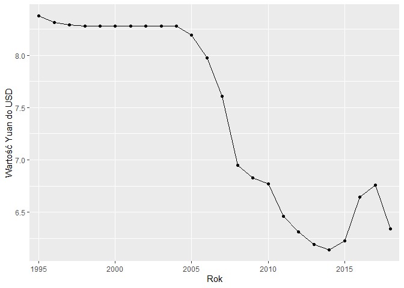
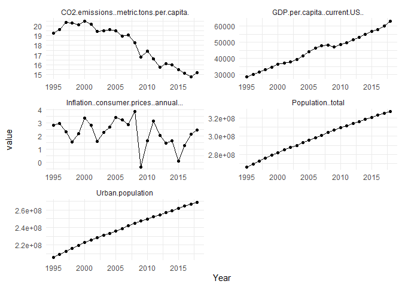
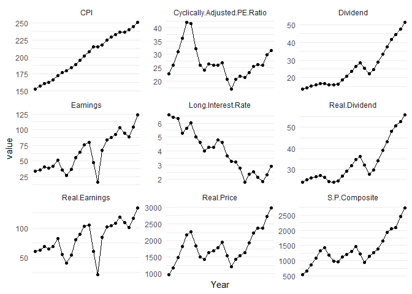
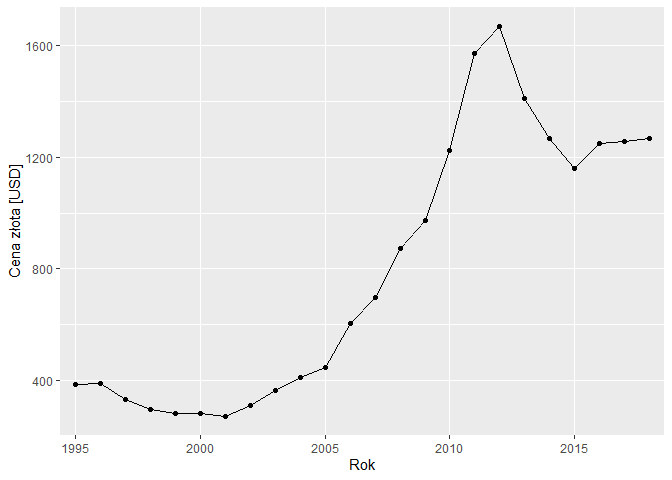
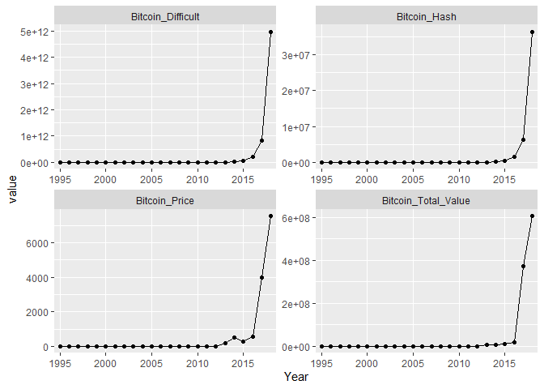
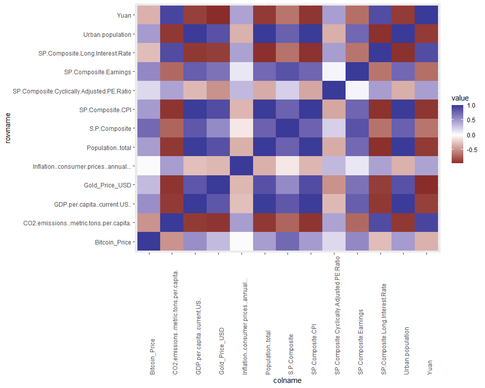
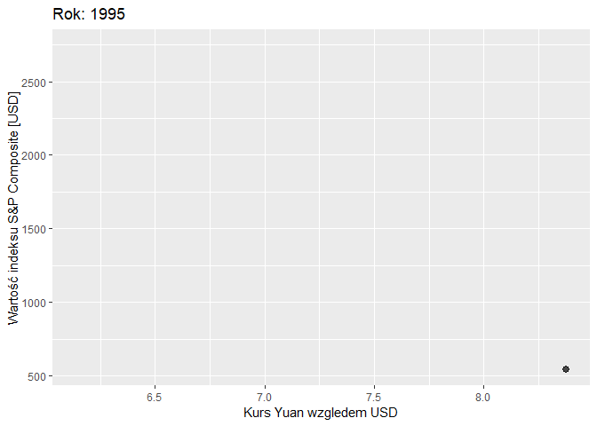
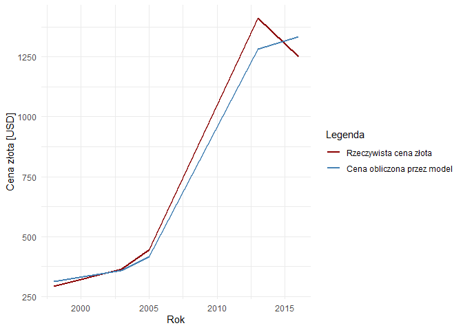
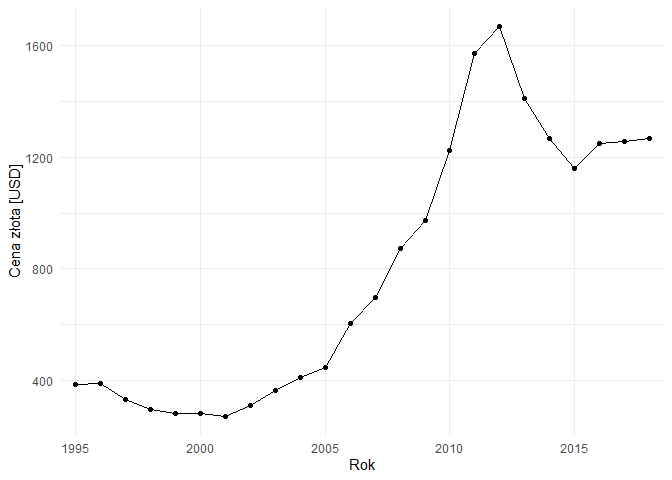

# Executive summary
Celem analizy jest znalezienie i interpretacja czynników wpływających na dobrobyt w państwie. 

Na rok 2018 według  [Międzynarodowego Funduszu Walutowego ](https://pl.wikipedia.org/wiki/Lista_pa%C5%84stw_%C5%9Bwiata_wed%C5%82ug_PKB_nominalnego) największą gospodarką świata są Stany Zjednoczone. Drugą gospodarką są Chiny. Na rozwój tak dużych gospodarek mają wpływ różne czynniki. Z tego względu zostały przeanalizowane wskaźniki dobrobytu Stanów Zjednoczonych i wpływ Chińskiego Yuan na ich zmiany. Dodatkowo analiza obejmuje cenę złota, bitcoina, oraz dane o indeksie S&P Composite. Dane zostały zebrane głównie przez Bank Światowy.

Dane zostały pogrupowane względem roku. Ze względu na ograniczony przedział danych o kursie Yuan analiza obejmuje lata 1995 - 2018. Początkowy zbiór zawierał zbyt dużą liczbę atrybutów powodujących znaczny szum. Aby temu zaradzić atrybuty zostały odrzucone ze względu na brak ciągłości danych, bądź podobieństwo (np. wzrost populacji jest podobny do wzrostu ludności miejskiej).

Taki zbiór został poddany analizie korelacji. Obserwacja, na którą warto zwrócić uwagą to zależność między spadkiem emisji CO2 i ceny Yuan, a wzrostem ceny złota. Ciekawą obeserwacją jest brak wpływu wzrostu ceny Bitcoina na cenę złota. Sugeruje to, że waluta wirtualna nie jest odwzorowaniem faktycznego stanu rynku finansowego. 

Ostatnim elementem analizy jest sekcja próbująca przewidzieć cenę złota z wykorzystaniem algorytmu uczenia maszynowego Random Forest. W tej sekcji można zaobserwować, że największy wpływ na to mają czynniki takie jak: stopa procentowa indeksu S&P Composite, kurs Chińskiego Yuan, rok (upływający czas), czy populacja.


# Użyte biblioteki

```r
library(EDAWR)
library(dplyr)
library(tidyr)
library(ggplot2)
library(readxl)
library(zoo)
library(tibble)
library(plotly)
library(caret)
library(gganimate)
library(randomForest)
```


# Kod pozwalający wczytać dane z pliku.

```r
World_Development_Indicators <- read_excel("Data pack/World_Development_Indicators.xlsx")

SP_Composite <- read.table("Data pack/S&P Composite.csv", sep = ",",  header = TRUE)

Gold_prices <- read.csv("Data pack/Gold prices.csv")

Bitcoin_diff <-  read.csv("Data pack/Bitcoin/BCHAIN-DIFF.csv") # diff to jest trudność wydobycia
Bitcoin_hrate <- read.csv("Data pack/Bitcoin/BCHAIN-HRATE.csv") # liczba tera hashy wykonanych 
Bitcoin_mkpru <- read.csv("Data pack/Bitcoin/BCHAIN-MKPRU.csv") # średnia wartość rynkowa 
Bitcoin_trvou <- read.csv("Data pack/Bitcoin/BCHAIN-TRVOU.csv") # całkowita wartość bitcoinów

Currency_Exchange_Rates <- read.csv("Data pack/CurrencyExchangeRates.csv")
```

# Czyszczenie i transformacja danych
Niniejsza sekcja poświęcona jest czyszczeniu i transformacji danych z dostępnych zbiorów. 


## Kursy walut
Zbiór zawiera dane o kursach walut.
Dane pochodzą z lat 1995, 2018, co ogranicza nam pozostałe zbiory do podanego okresu. Brakujące dane zostaną interpolowane. Waluta która zostanie poddana analizie będzie Chiński Yuan. Jest to waluta drugiej gospodarki świata. Waluta ta jest o tyle interesująca, że rząd Chińskiej Republiki Ludowej odgórnie steruje jej kursem. 


```r
Currency_Exchange_Rates_DF <- data.frame(Currency_Exchange_Rates) %>%
  select(Date, Chinese.Yuan) %>%
   group_by(substr(Date, 0,4)) %>% 
   summarize( Chinese.Yuan = mean(Chinese.Yuan, na.rm=TRUE))

colnames(Currency_Exchange_Rates_DF) <- c("Year", "Yuan")

Currency_Exchange_Rates_DF$Yuan <- na.approx(Currency_Exchange_Rates_DF$Yuan)

ggplot(Currency_Exchange_Rates_DF, aes(x=Year, y=Yuan, group=1)) + 
  geom_line(aes(group=1)) +
  geom_point() +
  labs(x = "Rok", y = "Wartość Yuan do USD") +
  scale_x_discrete(breaks=seq(1995, 2020, 5)) +
  theme_minimal()
```

<!-- -->

## Współczynniki rozwoju
Zbiór obejmuje 201 krajów i 7 kategorii zamożności, do których klasyfikują się poszczególne kraje. Zbiór jest opisany w trzech wymiarach: rok, kraj, współczynniki dobrobytu. 

Zbiór został poddany transpozycji, oraz sprowadzony do dwóch wymiarów, poprzez wybranie Stanów Zjednoczonych jako największej gospodarki świata.

Kategorie, które są w części puste nie zostaną poddane analizie ze względu na brak danych. Po odfiltrowaniu atrybutów zawierających wartości puste otrzymujemy 125 kolumn. 


```r
USA_Indicators_DF <- data.frame(World_Development_Indicators) %>%
  filter(Country.Name %in% c("United States")) %>%
  subset(select = -c(Country.Name, Country.Code, Series.Code))

USA_Indicators_DF[USA_Indicators_DF == ".."] <- NA

USA_Indicators_DF = setNames(data.frame(t(USA_Indicators_DF[,-1])), USA_Indicators_DF[,1])
USA_Indicators_DF <- cbind(rownames(USA_Indicators_DF), USA_Indicators_DF)
rownames(USA_Indicators_DF) <- NULL
colnames(USA_Indicators_DF)[1] <- "Year"

USA_Indicators_DF <- USA_Indicators_DF  %>%
  mutate(Year = substr(Year, 2, 5)) %>%
  filter(Year >= 1995) %>%
  filter(Year <= 2018)

USA_Indicators_DF <- data.frame(lapply(USA_Indicators_DF,as.numeric))

na_sum <- data.frame(colSums(is.na(USA_Indicators_DF)))

interesting_USA_Indicators_DF <- USA_Indicators_DF[,na_sum == 0]

amount_chart <- na_sum %>% 
   mutate(Na.Amount = colSums.is.na.USA_Indicators_DF..) %>%
   group_by(Na.Amount) %>% 
   count(Na.Amount)


ggplot(amount_chart, aes(x=Na.Amount, y=n)) + 
  geom_bar(stat="identity") +
  labs(x="Liczba warości pustych", y="Liczba atrybutów") +
  scale_x_continuous(breaks=seq(0, 26, 2)) +
  scale_y_continuous(breaks=seq(0, 150, 25)) +
  theme_minimal()
```

<!-- -->

### Wstępna Korelacja
Z wykresu można zaobserwować, że występuje dużo ciemnych, czerwonych i niebieskich plam sygnalizujących dużą korelację. Gdy weźmiemy mniejszą próbkę możemy zaobserwować, że zbiór posiada atrybuty, które są od siebie w sposób oczywisty zależne. Przykładowo: liczba mieszkańców ogólnie i liczba kobiet/mężczyzn w Stanach Zjednoczonych. 


```{=html}
<div id="htmlwidget-654c6aa3c20be9ea4da9" style="width:100%;height:768px;" class="plotly html-widget"></div>
<script type="application/json" data-for="htmlwidget-654c6aa3c20be9ea4da9">{"x":{"data":[{"x":[1,2,3,4,5,6,7,8,9,10,11,12,13,14,15,16,17,18,19,20,21,22,23,24,25,26,27,28,29,30,31,32,33,34,35,36,37,38,39,40,41,42,43,44,45,46,47,48,49,50,51,52,53,54,55,56,57,58,59,60,61,62,63,64,65,66,67,68,69,70,71,72,73,74,75,76,77,78,79,80,81,82,83,84,85,86,87,88,89,90,91,92,93,94,95,96,97,98,99,100,101,102,103,104,105,106,107,108,109,110,111,112,113,114,115,116,117,118,119,120,121,122,123,124],"y":[1,2,3,4,5,6,7,8,9,10,11,12,13,14,15,16,17,18,19,20,21,22,23,24,25,26,27,28,29,30,31,32,33,34,35,36,37,38,39,40,41,42,43,44,45,46,47,48,49,50,51,52,53,54,55,56,57,58,59,60,61,62,63,64,65,66,67,68,69,70,71,72,73,74,75,76,77,78,79,80,81,82,83,84,85,86,87,88,89,90,91,92,93,94,95,96,97,98,99,100,101,102,103,104,105,106,107,108,109,110,111,112,113,114,115,116,117,118,119,120,121,122,123,124],"z":[[null,null,null,null,null,null,null,null,null,null,null,null,null,null,null,null,null,null,null,null,null,null,null,null,null,null,null,null,null,null,null,null,null,null,null,null,null,null,null,null,null,null,null,null,null,null,null,null,null,null,null,null,null,null,null,null,null,null,null,null,null,null,null,null,null,null,null,null,null,null,null,null,null,null,null,null,null,null,null,null,null,null,null,null,null,null,null,null,null,null,null,null,null,null,null,null,null,null,null,null,null,null,null,null,null,null,null,null,null,null,null,null,null,null,null,null,null,null,null,null,null,null,null,null],[null,1,0.951962166571515,0.951962166571515,0.93428739032998,0.910125790482208,0.973942717498768,0.0485456292134433,0.956996487017028,0.776721044818374,0.925671259647171,0.0805220752310194,0.183624738088215,0.624375797769152,0.0390126984934163,0.216566176350269,0.0861681617583935,0.0334416714288871,0.492920557239795,0.0462125164214966,0.604742885810229,0.0539285026295266,0.550049433229319,0.609256189619941,0.0497608543610568,0.0835839414211182,0.72488537058064,0.053057375618512,0.550436497325929,0.0530316035921373,0.524846413012867,0.0496888773441138,0.250123873870717,0.0756723078807147,0.42804482053407,0.141286141520565,0.710824831249076,0.859943527686505,0.0371817129291709,0.0733078674226945,0.921274410520326,0.876949694451863,0.0841371600448106,0.958860574181169,0.897423017126082,0.870239890347949,0.954037482050924,0.873183784644596,0.337537833690296,0.0491956972576815,0.0172217539920098,0.0289206331404805,0.0217264849617966,0.0217264849617966,0.862012514041353,0.975333760177539,0.599641520891503,0.0437662020997737,0.0691275226012784,0.0494222805262102,0.927328806778879,0.049995763826847,0.0726711932211237,0.0497119290770699,0.971253950257329,0.494085168323643,0.0354262696953299,0.0488952360780521,0.955890881234474,0.0792648463531216,0.950202698537739,0.0395606119959184,0.570110711749337,0.320012578608898,0.141642555877188,0.0837462107654214,null,0.946108211190112,0.267914280084414,0.0788316253681107,0.860353583195751,0.0242896441435143,0.876869698566585,0.941286714596878,0.620718296069957,0.510907966353981,0.921840177256277,0.950116906562033,0.944423780278084,0.0266589043626227,0.0537623270757345,0.806921899521185,0.390925169790825,0.607901080604041,0.393328808600145,0.188094228712173,0.503946554101205,0.146258568889416,0.16212463943172,0.641521902890677,0.0836057309790966,null,null,0.746426009823262,0.0516766693714555,0.689909049337755,0.557807010355878,0.0892761756558181,0.376090245563956,0.0478575049810802,0.930092860959676,0.718157953449242,0.176073335748858,0.0653028602962593,0.0764554948478942,0.0716675552139482,0.0634592609594712,0.929533775863916,0.930149639613128,0.383504675860568,0.303659963518693,0.0490810910878846,0.0587132854031219,0.900440917720933],[null,0.951962166571515,1,1,0.997398246601657,0.835915681813747,0.967199840507488,0.00269669564997527,0.991859753900478,0.911228738362123,0.979654221928589,0.0204072418822756,0.146706868065336,0.634737458540358,0.0178171965188785,0.294376531242468,0.170408762569447,0.0484605215446053,0.351299627025726,0.00415380410982835,0.70207849227357,0.00468200976117344,0.648637201027699,0.703568085375508,0.0240130376661764,0.0191060472939137,0.83486020720123,0.0375779473132902,0.374974058630619,0.00434498709763076,0.634089940250909,0.0431292304189856,0.134544020473113,0.01420167819155,0.338652301943464,0.0405457893507333,0.678917629054711,0.922411381754192,0.0110819207848805,0.00819923493631963,0.897395145708231,0.895089757553684,0.0216332291199612,0.984134024014875,0.968365475432196,0.952426033095095,0.993837620912595,0.779530316314025,0.31357708253706,0.00350042829275199,0.039226929243816,0.0285066219490748,0.0269305700173746,0.0269305700173746,0.928733184063254,0.985769081346457,0.649500161055504,0.00375325894471135,0.00754016859742379,0.00185319973830195,0.991390233926176,0.00189237482969762,0.00860976607382508,0.00187034037821304,0.994306893589944,0.322771419018509,0.0965222154929175,0.00184606406399934,0.975138611278572,0.0153328873323507,0.998240117601001,0.00265831599384514,0.502589779798781,0.464918011303662,0.048069653256763,0.0230822499937314,null,0.915047737641972,0.135855758151344,0.0338627475208967,0.902538042089541,0.0193449683458712,0.885684651701429,0.993994092584075,0.456368283394818,0.590938551918614,0.983304500461556,0.976436896084401,0.984895841084306,0.0142525118991699,0.00497318808333264,0.822393586312933,0.381299553908958,0.611288501063825,0.252259277038117,0.0780485404767288,0.372927739125274,0.049121229171709,0.0596922255748125,0.690983633890741,0.0537418208240569,null,null,0.844249442083856,0.0584935494094816,0.68935461142961,0.495569585095098,0.0526545803528614,0.461721495778927,0.0498531584518266,0.869246924120263,0.613623555020034,0.113738724289966,0.0364826534528657,0.106854413919462,0.061667617342087,0.0678116974062908,0.982580869419767,0.98176512596227,0.3707459912126,0.287514252925724,0.00205816350624954,0.00600590741592477,0.961726294066543],[null,0.951962166571515,1,1,0.997398246601657,0.835915681813747,0.967199840507488,0.00269669564997527,0.991859753900478,0.911228738362123,0.979654221928589,0.0204072418822756,0.146706868065336,0.634737458540358,0.0178171965188785,0.294376531242468,0.170408762569447,0.0484605215446053,0.351299627025726,0.00415380410982835,0.70207849227357,0.0046820097611735,0.648637201027699,0.703568085375508,0.0240130376661764,0.0191060472939136,0.83486020720123,0.0375779473132902,0.374974058630619,0.00434498709763076,0.634089940250909,0.0431292304189856,0.134544020473113,0.01420167819155,0.338652301943465,0.0405457893507333,0.67891762905471,0.922411381754192,0.0110819207848804,0.00819923493631963,0.897395145708231,0.895089757553684,0.0216332291199611,0.984134024014875,0.968365475432196,0.952426033095095,0.993837620912595,0.779530316314025,0.31357708253706,0.00350042829275199,0.039226929243816,0.0285066219490748,0.0269305700173746,0.0269305700173746,0.928733184063254,0.985769081346457,0.649500161055504,0.00375325894471129,0.00754016859742379,0.00185319973830195,0.991390233926176,0.00189237482969762,0.00860976607382508,0.00187034037821304,0.994306893589944,0.322771419018509,0.0965222154929176,0.00184606406399934,0.975138611278572,0.0153328873323507,0.998240117601001,0.00265831599384514,0.502589779798781,0.464918011303662,0.048069653256763,0.0230822499937313,null,0.915047737641972,0.135855758151344,0.0338627475208967,0.902538042089541,0.0193449683458711,0.885684651701429,0.993994092584075,0.456368283394818,0.590938551918614,0.983304500461556,0.976436896084401,0.984895841084306,0.0142525118991699,0.00497318808333264,0.822393586312933,0.381299553908958,0.611288501063825,0.252259277038117,0.0780485404767288,0.372927739125273,0.0491212291717089,0.0596922255748125,0.690983633890742,0.0537418208240569,null,null,0.844249442083856,0.0584935494094817,0.68935461142961,0.495569585095098,0.0526545803528614,0.461721495778926,0.0498531584518266,0.869246924120263,0.613623555020033,0.113738724289966,0.0364826534528657,0.106854413919462,0.061667617342087,0.0678116974062909,0.982580869419767,0.98176512596227,0.3707459912126,0.287514252925724,0.00205816350624954,0.00600590741592477,0.961726294066543],[null,0.93428739032998,0.997398246601657,0.997398246601657,1,0.803378997259748,0.951214843280007,0.00312593401473421,0.989381552178026,0.935646719288988,0.985558659861455,0.0131583816301761,0.136920833251334,0.628451937149321,0.0227868508926303,0.319318342847033,0.201717729164619,0.0573127315224786,0.310978701551347,0.00756521197032461,0.717289160887137,0.00646526511753526,0.664845594521647,0.717346625843714,0.0263413309392351,0.0143016880497122,0.859577228514443,0.0496897675860365,0.33774554180563,0.00625070168716096,0.660955119010579,0.0561280097230792,0.110963110941965,0.0106738601334233,0.332084005376879,0.0278086665750489,0.666093607471838,0.929182190824096,0.0165961855004149,0.00460461005295631,0.886991544463596,0.899166139693195,0.0126918595728124,0.982618641715549,0.975392695254377,0.960251725056244,0.99412346474534,0.753812649295306,0.311405603445764,0.0066231112330507,0.0512461127524751,0.0349730787680536,0.0356975155659162,0.0356975155659162,0.937326331684446,0.978235729099526,0.651507430595686,0.00686430701978918,0.00577351155105721,0.00183027088762072,0.995504083628582,0.00177677377738672,0.00449591637141727,0.00180019341607629,0.986501248632634,0.27963310000407,0.125408087037805,0.00191450943974841,0.971949026701413,0.00990949689526666,0.998194294746785,0.00577104769939202,0.480965911794448,0.50129942675307,0.0406890292041279,0.0216328865518365,null,0.892778579546806,0.109583582931814,0.0333776398274575,0.911978935515662,0.0312464593533116,0.877307874627138,0.995649885184539,0.414373681571796,0.608857684823609,0.986962557206357,0.971808188357985,0.983583320158527,0.0230869588720938,0.00508714677834793,0.809501256816785,0.364722454767192,0.594512915159805,0.224731264254423,0.0639251745907323,0.340434385202512,0.031624213023257,0.0394503683404656,0.708201389782584,0.0640689620799598,null,null,0.860432995193212,0.0744190107445916,0.691362349060117,0.472622216427843,0.0606690888727883,0.480255545097061,0.0622187113247152,0.839501019488441,0.579154922552625,0.101650458438305,0.0373691557330103,0.129882561175467,0.0741629288551448,0.0843993357454336,0.98430477256892,0.981945116932944,0.353649234654117,0.273016336695607,0.00222717866814626,0.00435011481546121,0.969386690710788],[null,0.910125790482208,0.835915681813747,0.835915681813747,0.803378997259748,1,0.944694747305457,0.170718516665508,0.817557039044586,0.602795419358468,0.80461905885613,0.206579380836641,0.204366187105809,0.61054439498033,0.13827573514575,0.0681140422154339,0.056713621840411,0.112202796070362,0.572392522257825,0.174052785612043,0.626514491711702,0.187788381944159,0.590737735808047,0.636797381004835,0.151407088706941,0.219564445288583,0.627625911285454,0.176192145820739,0.737107329386801,0.186106488163712,0.512489276046679,0.173052022791106,0.397131361650664,0.209414528812609,0.519688420600322,0.324831942548153,0.74614663249746,0.77069888052567,0.155472292172804,0.22502501929183,0.912135136538392,0.780463601931855,0.222971876813446,0.860996356310425,0.719968098265853,0.68924480947665,0.804066865013574,0.931158048379451,0.371163603668754,0.167156915326925,0.088207207979956,0.116090049927925,0.10728269077306,0.10728269077306,0.73465442956183,0.841197333264041,0.422189568982858,0.147928277289822,0.200434458752178,0.18285541841678,0.768293030945463,0.184521437538433,0.231706969054549,0.183702486875172,0.865865140548447,0.626051759546922,0.0752902845388782,0.181699592404551,0.816238084589699,0.253073287464148,0.825330674560653,0.17301724726832,0.629773108212382,0.220966135751477,0.269051430796298,0.199089532669353,null,0.885941004998166,0.465242067229765,0.165831373510396,0.732287961125983,0.102120778575379,0.67683461653894,0.786139727289128,0.733891446407656,0.376890461354752,0.764829109074127,0.802884531260951,0.792040971348532,0.117891883049057,0.169796612341472,0.6474317931851,0.355080513185718,0.496968678711275,0.535137305622237,0.31863491100569,0.574199617404473,0.28505114437364,0.328686315304955,0.613495953555652,0.204648584480009,null,null,0.622369801116117,0.168486663179471,0.693318099601596,0.602477348158484,0.214280205755031,0.296532301128708,0.155348381132043,0.997324624689459,0.754845142342281,0.271424649846981,0.137108012111703,0.165148437754198,0.190062335165359,0.173878016304006,0.770369950988991,0.810635877359554,0.357776361330837,0.306589065807889,0.185752276439213,0.213860272710872,0.737066671332909],[null,0.973942717498768,0.967199840507488,0.967199840507488,0.951214843280007,0.944694747305457,1,0.036001192876385,0.95397088904928,0.804768283547504,0.945046245365491,0.0604310850806908,0.128844226778384,0.633414452382424,0.029378909076676,0.160178593073303,0.0863270963834291,0.0342809364778359,0.431985047785018,0.0406368822397624,0.692437472927453,0.0476138431464071,0.642758804346839,0.697656161093924,0.0385114617939148,0.0696443689134079,0.776398942823484,0.0664114504231657,0.53889636306466,0.0465783924358573,0.600022938045716,0.0684287135730038,0.222324101727748,0.0619859798572404,0.420176980026096,0.134546938014518,0.731282675282619,0.894186533203433,0.0353685798987692,0.0665235185838161,0.948195609834168,0.884246770659885,0.0691659739277933,0.974039618836869,0.891961485767774,0.865552707759409,0.949429721204331,0.882449174507225,0.319552866595653,0.0364175135625101,0.0171899199017825,0.0231645933827423,0.0189400148893603,0.0189400148893603,0.879643720096614,0.96081657033684,0.542666570427032,0.0259051801311388,0.0540768073726375,0.0416576173457899,0.930047481848028,0.0425468445188922,0.0699525181519783,0.0421080985421262,0.977914605133537,0.443075935184382,0.0538195914075794,0.0410598636318652,0.943481773589469,0.0842462048931142,0.962688266700503,0.0385232975181539,0.560757296035939,0.347187166768732,0.112903143807507,0.0629117353774253,null,0.934029230511788,0.258251826276819,0.0500443708118612,0.864110507851492,0.0151768723860965,0.813417768716929,0.940139171866127,0.578767662078079,0.496579449391345,0.923950461762845,0.935820365865645,0.936743697874958,0.0184822358129593,0.0367134650556408,0.756974405856702,0.340070117563065,0.550098551691334,0.361312861061219,0.15164360086082,0.448407479113716,0.114573351816963,0.14244867244864,0.683421787012058,0.0909340478280131,null,null,0.772856880234498,0.0758271896052779,0.717769126198777,0.53808606020259,0.0940074598143266,0.37703328144396,0.061326997430607,0.963943547150622,0.685109040306098,0.147584593293312,0.0368246007641103,0.106016531556107,0.0879193201994683,0.0848928168974913,0.925442454239421,0.945785124041852,0.335217697457964,0.261363128605943,0.0434468371215648,0.059860828133873,0.898711333060578],[null,0.0485456292134433,0.00269669564997527,0.00269669564997527,0.00312593401473421,0.170718516665508,0.036001192876385,1,0.00880748120569347,0.0832592322446883,0.019570131111719,0.980703427314995,0.863931047525219,0.383454505676809,0.989427279840227,0.711332940993915,0.823639127379851,0.962352856190258,0.670822233510618,0.996120809694638,0.294692679396844,0.995732967015473,0.347702991453129,0.294522905181642,0.985429195557522,0.987908618599642,0.161856675345903,0.96046334884789,0.621570136161425,0.995942843712911,0.359145695722051,0.953841478962339,0.880501200408751,0.9918075887324,0.658351520376559,0.956397052376774,0.336908012957436,0.0809471704638036,0.992392147351922,0.992049701107469,0.0922952609951918,0.108792078509782,0.984261377915981,0.0108037147123285,0.0378279165007725,0.0575087741645469,0.00629983303738074,0.222636362501435,0.702064020402244,0.996910286133127,0.966408899155891,0.977937541612905,0.978803255477315,0.978803255477315,0.0742742206037877,0.0158662153721677,0.353337673275624,0.997327008631718,0.991734842304312,0.998443457266087,0.0104116687254783,0.998266507292845,0.989588331274522,0.998356119780555,0.00657351791514654,0.682125166898731,0.900204533386019,0.998498924123437,0.0272273070399177,0.983008991628931,0.000830389621182093,0.996603263271772,0.511649231342327,0.527508576429653,0.960266053442379,0.984785708850809,null,0.0903185649013186,0.871309986447266,0.972316463620782,0.0996358469349529,0.980541792832447,0.124789155174342,0.0070840952322801,0.544614150859276,0.400498391548683,0.0181661922788223,0.0258224091722977,0.0170384546036744,0.989392895891528,0.998619028245451,0.185943432955787,0.630520765697042,0.400236367474595,0.757861614008805,0.929850286774244,0.647407979929062,0.957261782539397,0.945067035934383,0.307680621377437,0.944368342958826,null,null,0.139380423677719,0.933508995258959,0.316069409470695,0.524542622335149,0.947425099085742,0.551408290784458,0.955531811166299,0.138108824643678,0.41133602948142,0.905949723946733,0.973468307445479,0.889398508147921,0.93891400190633,0.931220715022055,0.022176867216687,0.0216706952804604,0.63951613733006,0.718869293443197,0.997866163585751,0.99291590476772,0.0403330890539509],[null,0.956996487017028,0.991859753900478,0.991859753900478,0.989381552178026,0.817557039044586,0.95397088904928,0.00880748120569347,1,0.902793653399036,0.970503210849328,0.0295815981161291,0.172308481641596,0.658834805048072,0.0199702673815081,0.315253413148906,0.176454102608088,0.050889702167469,0.373437368559995,0.0102078379598629,0.688812707585424,0.011099808198866,0.63533846366323,0.688855530613583,0.0254522943052228,0.0258084688493246,0.813632817493346,0.036559029542667,0.38670407246585,0.0111256132053317,0.599138784281563,0.0383996150881531,0.141408739964808,0.021079548424126,0.352963526712395,0.0461097228436441,0.683497037827659,0.910051164890816,0.0150938360544413,0.0107793120133564,0.896981895455663,0.89290627207793,0.0257229570391098,0.979663263619579,0.974282683279261,0.950795253018577,0.996501783142871,0.782476796033167,0.306147262709985,0.00991827228111369,0.0414440458605414,0.0315877663534254,0.0293194052474553,0.0293194052474553,0.937225700137958,0.994717122561483,0.670416280988424,0.011574529663055,0.0106193479302126,0.00582503605671009,0.989488457687931,0.00577925198811108,0.0105115423120709,0.00579891111619768,0.987329447561372,0.336911164342511,0.0965135350124518,0.00573508946714818,0.971522645376335,0.010780337980007,0.991293665571136,0.00472819545371223,0.503594555192235,0.446555450422214,0.0627407920070351,0.0344318795777566,null,0.921218066194973,0.138651732156981,0.029993128918156,0.892413308058856,0.0242489392639442,0.911662215060085,0.994603489888336,0.469293328846561,0.624734040958625,0.989978147820923,0.993690943361307,0.997973653713523,0.0176325718390539,0.0133120340073546,0.842486439218058,0.399344218461888,0.633094458393958,0.231464807166266,0.0732692198453768,0.362538699995621,0.0590973511515512,0.0630880543860396,0.656064263688423,0.0478636769681227,null,null,0.847150013225434,0.0534937460638773,0.663212436705598,0.488110831661266,0.0461727764966501,0.491739770955984,0.0536835602546512,0.851797580770248,0.630979927463685,0.116864151782822,0.0427947974693914,0.107475449095148,0.0558757237537129,0.0642005655512882,0.990445969484498,0.983059826165153,0.386976434225896,0.302452408713227,0.00516216183990509,0.00539651011166353,0.95622608584588],[null,0.776721044818374,0.911228738362123,0.911228738362123,0.935646719288988,0.602795419358468,0.804768283547504,0.0832592322446883,0.902793653399036,1,0.925646581324571,0.0649980080468429,0.185706869140134,0.626642409353253,0.126651497483656,0.481092280699387,0.400437933144847,0.173909993610958,0.172897540550943,0.0959909921724865,0.775391952326524,0.0866732256930873,0.735653018883529,0.771166949511768,0.119658833378588,0.0705412410933143,0.902229336124958,0.161999440005791,0.17615278180973,0.0875069119785157,0.744082618604677,0.173318796972097,0.0773480775557933,0.0728764218921307,0.289178348308788,0.0319958151248493,0.582161715324506,0.869955615956826,0.119842382981339,0.0610538292899955,0.749649740296773,0.838876137926105,0.0587234226506295,0.888735192859363,0.941139507122172,0.938156336784733,0.915313753883144,0.572651867072635,0.320183416622117,0.0932438321931448,0.1906002924512,0.15056510181172,0.159488934738669,0.159488934738669,0.911596328673467,0.868004505369806,0.679717069352433,0.0989457801171421,0.0678380944476071,0.0802132837234831,0.94067392809878,0.0794639912448437,0.0593260719012053,0.0798291309653147,0.876426231966905,0.123240495928825,0.311250679621472,0.0809043155268937,0.890594415535815,0.0585311462927175,0.91860753530133,0.0956572180679831,0.370471480029929,0.662383356354,0.0699654818538501,0.0880469087447252,null,0.750647520647102,0.0438249854931136,0.112012276069286,0.883195746840632,0.161294407943854,0.802477088880641,0.928135485586229,0.223704988371445,0.672010281138474,0.924929768133429,0.88651209314705,0.906910265707687,0.142269318035501,0.0869505824992586,0.726534280212228,0.353303644122064,0.541795609061815,0.156544248363832,0.0789472197169203,0.243229055285831,0.0336763565231131,0.0256665090896709,0.740956873354125,0.167724778165411,null,null,0.869925153487601,0.200109853768639,0.668573502171827,0.392911251087405,0.156067348555083,0.574983884872839,0.179951241924949,0.647970017214215,0.422530023126767,0.132183396630379,0.132897737160006,0.281263731582357,0.197153426155478,0.220492356223066,0.918377121418996,0.90969185492592,0.345191770979493,0.279858704234315,0.0806355743955036,0.0718645144137714,0.940478110462749],[null,0.925671259647171,0.979654221928589,0.979654221928589,0.985558659861455,0.80461905885613,0.945046245365491,0.019570131111719,0.970503210849328,0.925646581324571,1,0.000338896740886829,0.0777157435967339,0.636282213419654,0.0436953457342768,0.287576220915263,0.208703121300956,0.0666302251316654,0.275822975969013,0.0348219764646513,0.752571413453734,0.0348337893816206,0.702152612738007,0.751425579411516,0.0438512000404662,0.0389314406195531,0.910908054534303,0.102574039312111,0.353136635262465,0.0339477856594056,0.726182423895538,0.106590546881686,0.12387147954258,0.0352926976508837,0.399619415487163,0.0442906450806254,0.701371911227927,0.95662342458813,0.0425771979467495,0.0252141838419198,0.904125399413266,0.946558979759395,0.0118598754307958,0.983150328695513,0.961352127892036,0.942567524407249,0.980736156278656,0.779180872890864,0.324067167479399,0.0318603278956742,0.0535065953676627,0.0348204177199404,0.0409385254008129,0.0409385254008129,0.95210175800034,0.957562139700364,0.568070286179707,0.0227080353744609,0.0254155777856583,0.0171206210045512,0.977976619079563,0.0173299004872194,0.0220233809204345,0.0172245189952844,0.965006696669779,0.242898400647445,0.164734500369695,0.0169944456555898,0.967125266267514,0.0268206549988177,0.98437562158082,0.0260618401185985,0.475140670183498,0.503416554595355,0.0827582833615938,0.0528488484244122,null,0.850491223934381,0.132626683718245,0.0426486215130876,0.9479695505664,0.0521628587403381,0.827636886830933,0.977218020023034,0.381890378950273,0.585237979736244,0.970811258379979,0.9448970315263,0.961343269625613,0.0450667690949801,0.0214236314942657,0.727737504592138,0.263252731278565,0.489445072321945,0.242601556326346,0.0871797784872922,0.32349553508013,0.0224988329689165,0.0305757649443431,0.78951740445185,0.125751520999543,null,null,0.828012223048805,0.115753790114982,0.763564004624979,0.466841516846146,0.121732044740413,0.472678652396949,0.104325470440738,0.840681286620045,0.567641387165109,0.110463274412732,0.0391976208189388,0.185887105540195,0.129002657878249,0.14093178797673,0.969598209475446,0.975250860337291,0.25119826614948,0.178244497195498,0.0187158017706628,0.022781979976966,0.970911572619528],[null,0.0805220752310194,0.0204072418822756,0.0204072418822756,0.0131583816301761,0.206579380836641,0.0604310850806908,0.980703427314995,0.0295815981161291,0.0649980080468429,0.000338896740886829,1,0.918711615677872,0.363123082742951,0.954993476976651,0.700820451282648,0.780669801958448,0.930111433321579,0.733470284295266,0.965505580601253,0.243469358289154,0.96614704645906,0.293642174501059,0.244873919023385,0.955325269900889,0.963398220628571,0.0857555596593609,0.897254203980566,0.660747839238574,0.966921173974216,0.270502503361264,0.892695503216706,0.883085593733859,0.966660544558875,0.609172857736134,0.961073662061126,0.305227594100799,0.0449795829586879,0.956570061458178,0.976983020322515,0.102781301598754,0.0566980518414742,0.989635580904887,0.0187209517886258,0.0354880220167008,0.0533564020079365,0.0190849463452116,0.23276177129866,0.677879175602007,0.968471893133232,0.941342386806442,0.961700139263416,0.955326311343407,0.955326311343407,0.0462845683256196,0.044148340502866,0.423284460319625,0.976660203569389,0.976288458157474,0.983231990226367,0.0199027483030166,0.983088571907054,0.980097251696987,0.983161651556715,0.0365934244928894,0.767891224230551,0.82839003042804,0.983301674508008,0.0336306522655505,0.97566873792217,0.0154588339371905,0.973766486552375,0.532581323342931,0.485400476904816,0.922238505471748,0.949100972847505,null,0.152977418699686,0.877182242838365,0.956974224066095,0.0522055882443105,0.944634158046624,0.170686376792137,0.0214802121837657,0.630275673336846,0.407875194501639,0.0277836328938902,0.0547398423419664,0.0378876139894372,0.952624956570195,0.978711516878183,0.269873025315173,0.732503334914152,0.50670639864466,0.766085923411062,0.917520314519644,0.683784848006556,0.981343935089094,0.97433008038861,0.211340279876308,0.875149489775699,null,null,0.165699545859762,0.882168797695634,0.240582373139242,0.538295486410355,0.87969633087971,0.520230172296045,0.894290565940806,0.169517983491434,0.441929771603384,0.891826336380038,0.958756181843805,0.810721926258783,0.870037400028905,0.857208377575051,0.0293113733500709,0.0246674956100007,0.7444313237217,0.817591065188689,0.981709300716121,0.978519787816234,0.0265901537711892],[null,0.183624738088215,0.146706868065336,0.146706868065336,0.136920833251334,0.204366187105809,0.128844226778384,0.863931047525219,0.172308481641596,0.185706869140134,0.0777157435967339,0.918711615677872,1,0.427042700862497,0.851025775451631,0.804278399789277,0.740165428650911,0.860538814336137,0.792655648927893,0.828103484656593,0.18142345618153,0.825275028289968,0.212767301800947,0.186300196898904,0.858824784898665,0.84074632873113,0.0680287421272681,0.718495035600255,0.54518707278281,0.827178855451605,0.148668944210949,0.708168927343501,0.800696178221783,0.843062374349253,0.460447692398138,0.80845065293874,0.312742799244553,0.0896766863986367,0.835599287810689,0.838568508996316,0.0926704566109718,0.100885381600377,0.893796332095599,0.100664669255797,0.204332578545816,0.230986880135909,0.155444376502512,0.206512126436282,0.661595419957904,0.837945761975861,0.876033851726092,0.892113471190602,0.877310453373927,0.877310453373927,0.138179320828232,0.191794655913218,0.654348095809055,0.865775855289593,0.83820058825768,0.856660484828151,0.169315785373166,0.855128235492866,0.830684214626841,0.855881797908919,0.16005952157023,0.757038269499317,0.711233828993844,0.857340591156131,0.160401123886997,0.821171783946908,0.133503243211658,0.837304404160469,0.566100303740676,0.496233602986079,0.80133332983574,0.840311492578018,null,0.312108556014408,0.733110387487655,0.864944949153631,0.120007447266816,0.83877928468554,0.399957101322812,0.167116542629898,0.62091661505479,0.491127100696907,0.167610752958807,0.222369040049895,0.19523996124999,0.844486804661039,0.87198562435616,0.501727273829507,0.902715681846068,0.736215872251119,0.689356330698728,0.816673096261156,0.724872474163266,0.904635566815553,0.877039422881137,0.116334165268566,0.687871975923834,null,null,0.250386352874725,0.702108407749951,0.162224282691686,0.560565998754702,0.694370923740896,0.610925276190843,0.761247402293405,0.184138525863985,0.529968890878815,0.84320208427522,0.906478970669527,0.661101213274063,0.707001245666761,0.695233083679948,0.179194256954303,0.136009414249651,0.909424447690984,0.939396600594501,0.850769689156607,0.832883457370102,0.153003492652219],[null,0.624375797769152,0.634737458540358,0.634737458540358,0.628451937149321,0.61054439498033,0.633414452382424,0.383454505676809,0.658834805048072,0.626642409353253,0.636282213419654,0.363123082742951,0.427042700862497,1,0.427820924209177,0.440253075043519,0.343847644346965,0.435820183221856,0.584366776150772,0.385894273941892,0.795462715081924,0.388420444806626,0.787669385535259,0.812124001491894,0.44105523333708,0.452720481633069,0.61589947724905,0.401072554879338,0.531986710639075,0.390065662712999,0.562845628596372,0.404490774010013,0.566318951418795,0.442240665228695,0.395033691020469,0.360718137672805,0.791278694493257,0.583441852031513,0.403874665321842,0.359620922183354,0.610281278744334,0.690811306926039,0.389430374684574,0.609762189985178,0.664158661309492,0.640313428166145,0.638889263346353,0.606283863747264,0.42167202536603,0.374089540923901,0.418260196927397,0.417227670936733,0.414405388709423,0.414405388709423,0.746106940707404,0.65431602243626,0.438880182303297,0.385161375400989,0.375633278862405,0.369761142644427,0.640391978550562,0.369239809027668,0.359608021449449,0.369494777555145,0.620096993997223,0.460050393872829,0.400446655109286,0.369397218062325,0.650223260330314,0.345627268912585,0.622151021597007,0.365955226736668,0.561155916150672,0.303943365711463,0.467099531854753,0.449647794610669,null,0.634582120652771,0.481414945304696,0.3831002070826,0.633257261438966,0.405787279199948,0.685930740255752,0.643936611163408,0.413169328155027,0.595504171348789,0.664869170379264,0.678019458712305,0.676268152653382,0.404798519342461,0.402739246334921,0.626764086609438,0.453844706955829,0.543491115363955,0.455395189114126,0.425202344070059,0.476551430236749,0.405751553843692,0.384191886500699,0.601025962953264,0.42001415439531,null,null,0.533799832789604,0.370554043149772,0.635633152334408,0.523116146224136,0.420853621545216,0.647771362751086,0.444108159159862,0.627939096512777,0.694286425654711,0.566000092896653,0.441375955887988,0.415209696977703,0.458377446412659,0.441827898162087,0.687427498845521,0.690585273907779,0.456014132201138,0.411956621729392,0.367136343927091,0.356063388836592,0.664360294594],[null,0.0390126984934163,0.0178171965188785,0.0178171965188785,0.0227868508926303,0.13827573514575,0.029378909076676,0.989427279840227,0.0199702673815081,0.126651497483656,0.0436953457342768,0.954993476976651,0.851025775451631,0.427820924209177,1,0.749238287391159,0.839335161494084,0.982309525578444,0.649946254663234,0.984361510046709,0.338351934239671,0.981869676807638,0.390335621132198,0.33819961855835,0.998191519128396,0.983998101650879,0.212815563282524,0.961433827958698,0.557729031112847,0.982093209985183,0.414335468084051,0.959774306823349,0.87742546012543,0.986727385119471,0.629442954505911,0.911382781887507,0.353940001533778,0.10475650032215,0.991110889065683,0.968325902697743,0.0702475704985553,0.140803128199815,0.969192423726666,0.0119075770759313,0.0688115313217939,0.0962998078243434,0.022315100108086,0.18574450419205,0.70198478095285,0.984854886801002,0.980285953807988,0.984987435184295,0.987809175449603,0.987809175449603,0.109397191097383,0.0217212776395876,0.365274678190918,0.990014594427976,0.976715559752125,0.982566249216788,0.0361106607428249,0.981993740388797,0.963889339257173,0.982277278242754,0.0131705363124327,0.625751207880888,0.921290328571065,0.982850708236671,0.0481999584992369,0.955601488890547,0.01544568858805,0.982811086174082,0.502466405599388,0.566912962521974,0.94987406108234,0.981756969480299,null,0.0704844684855442,0.841308872371381,0.977938670869824,0.13659108731904,0.989768454767878,0.151208416835672,0.0285107803218811,0.470329700546667,0.425330641459374,0.0415800236997569,0.0344709990453682,0.0318727668272598,0.996575071093362,0.989999846320553,0.199910242668711,0.622834775692816,0.403674909245954,0.739615096131724,0.917232584132766,0.632501881507215,0.933219559545576,0.912827736341121,0.359431221794311,0.949789459925939,null,null,0.146332774553105,0.933272628150097,0.362410970444908,0.537534946019702,0.95415007359617,0.594160097757231,0.967013607579299,0.11226446937267,0.400667081966524,0.930335297533472,0.986081210781243,0.893475515012547,0.951910137655206,0.941298457179688,0.0490567142088808,0.0460326627810376,0.629705947931698,0.702170062928054,0.981397146717653,0.971489219678119,0.0786662538290031],[null,0.216566176350269,0.294376531242468,0.294376531242468,0.319318342847033,0.0681140422154339,0.160178593073303,0.711332940993915,0.315253413148906,0.481092280699387,0.287576220915263,0.700820451282648,0.804278399789277,0.440253075043519,0.749238287391159,1,0.877594148637329,0.785276472534783,0.472773690319425,0.693099279499788,0.333976376403502,0.678475907427782,0.351992804176613,0.333356668796976,0.741913950905215,0.662479130962458,0.38090372161519,0.666996900856312,0.204060036371771,0.680499965929854,0.398583234313486,0.661761972513988,0.529502329746298,0.670736568041248,0.35747343135296,0.55167161018221,0.283881881565229,0.298461823645116,0.711363450416058,0.644166224016297,0.126017771839698,0.256559825481616,0.677297815278813,0.235666076845992,0.423584873011096,0.461453856511503,0.328160956902021,0.130381013455664,0.659633432024264,0.709316716483078,0.817826180982974,0.79584608717731,0.795974335383647,0.795974335383647,0.359703355309247,0.297788168832291,0.706460284022435,0.737054521575816,0.674790102646346,0.693034522130016,0.362218199721485,0.690852711470404,0.637781800278506,0.691923947052228,0.260731847015522,0.37972576523812,0.796296851336756,0.694636301328338,0.309426837900716,0.610380780352559,0.293193984251708,0.694605502485388,0.351313627494331,0.731210523263265,0.614322866990424,0.685926333408768,null,0.259917190878609,0.431045292276944,0.752673617661578,0.322238010239318,0.771042074106564,0.507693674893978,0.348201702630235,0.305563918541658,0.644380286699823,0.361236409182323,0.343709569118499,0.347647910928772,0.764629990172551,0.715798858079981,0.524449059067567,0.737816627998182,0.653660055309383,0.420882201531068,0.601606320945538,0.473002237432659,0.632765801217541,0.581003326216387,0.338780975674656,0.63837297022217,null,null,0.439036868730413,0.670613478203012,0.273512777203183,0.444517702389705,0.634126705543368,0.720137326135599,0.708546551455423,0.0813038470803737,0.349204169490313,0.66588134012537,0.783377218003846,0.680467784012306,0.652421822393261,0.666082671999894,0.365363018104835,0.302307837866024,0.721413541243223,0.738749271855717,0.687418533467761,0.651798297369765,0.374595052194807],[null,0.0861681617583935,0.170408762569447,0.170408762569447,0.201717729164619,0.056713621840411,0.0863270963834291,0.823639127379851,0.176454102608088,0.400437933144847,0.208703121300956,0.780669801958448,0.740165428650911,0.343847644346965,0.839335161494084,0.877594148637329,1,0.847506908464859,0.33330289096028,0.834990549437124,0.412188202388795,0.821902428778351,0.449299770542928,0.40273308980297,0.814552448983982,0.754275474029633,0.41727410593157,0.853846353330954,0.256266884865262,0.822074174469249,0.514292835631933,0.843217835784443,0.529848214408481,0.769424656066255,0.509480197163045,0.698022972638771,0.185894679337421,0.250591219167351,0.844347571138429,0.787570947870083,0.123990026346269,0.221394725130136,0.770214270709407,0.164345566473793,0.272548735767489,0.301163993948585,0.188384339150867,0.0906933479552253,0.631603537119639,0.840570514276433,0.885517980786874,0.854123770353938,0.86814272147354,0.86814272147354,0.277385272457116,0.142350638122492,0.550022816218379,0.837792945174059,0.788447253810275,0.821066275605979,0.217706272361186,0.819987181203213,0.782293727638797,0.820518276958106,0.132004508245243,0.335852287041915,0.945494477681495,0.822052930285579,0.184904349544092,0.764764687606777,0.174737921224631,0.836936645713758,0.325382125563904,0.806815297178756,0.727919603639557,0.790193260348093,null,0.122534192861297,0.525806093175255,0.805386168277115,0.287170315018763,0.876137351455963,0.247147405849401,0.199612235811962,0.257068838929554,0.621929079164715,0.213129163962509,0.191031349252662,0.196159368244603,0.872554909121524,0.821521150204128,0.243634776580973,0.560458459562453,0.392454233303584,0.449076623701277,0.67015666011537,0.372657515825634,0.684317792875697,0.655600933767178,0.404561327459171,0.812491350386223,null,null,0.36665934158826,0.852840062025394,0.299434577819206,0.375189843750881,0.800474803926433,0.630714522430569,0.846200650507303,0.0574257378520553,0.170800144871201,0.643320518806744,0.822067791890985,0.884911414139551,0.831566246388395,0.858516272911983,0.201995376044199,0.175180187114626,0.557375932868969,0.615338980704193,0.820530344185245,0.800387764188038,0.263494006548624],[null,0.0334416714288871,0.0484605215446053,0.0484605215446053,0.0573127315224786,0.112202796070362,0.0342809364778359,0.962352856190258,0.050889702167469,0.173909993610958,0.0666302251316654,0.930111433321579,0.860538814336137,0.435820183221856,0.982309525578444,0.785276472534783,0.847506908464859,1,0.639861256357215,0.953471990093408,0.347059936449093,0.948438862074833,0.398673144530796,0.344647381796479,0.982596997284381,0.953480481782123,0.228509380996191,0.927811927928913,0.49798731930939,0.949263154250334,0.416484000681839,0.929161935837025,0.840700907569474,0.955835379760047,0.59448075065924,0.861869603999987,0.370770050867018,0.130025845818627,0.969053243386301,0.930584022830153,0.0600939191830522,0.145253487531338,0.93786041257251,0.0280413266221727,0.114966121311609,0.147009246143289,0.0527192694812159,0.157798804089388,0.688541502108875,0.952321115017724,0.985154939824301,0.982267826841316,0.985556297605334,0.985556297605334,0.140904770379409,0.0478823142628371,0.409498938404111,0.961629194418752,0.936711424991063,0.950960322095973,0.0764905220201957,0.949980896917857,0.923509477979811,0.950463841775774,0.0367892893007468,0.576594714074854,0.921953560345474,0.951474998244825,0.0536224074868524,0.915200126106512,0.0457958879348576,0.953336623109088,0.526244074123322,0.622786824539102,0.908207611615002,0.953145379076172,null,0.0859644118211918,0.792248917299127,0.941250722490237,0.13970956816515,0.977890706779641,0.18334664313713,0.0640759464347847,0.41971897673565,0.460948399041095,0.0840104214338396,0.0646493146992358,0.0667123425596379,0.977687702257079,0.962038578295681,0.253449813959272,0.657936812715768,0.454338984280404,0.665116487118128,0.852941760836668,0.600889909161429,0.897734521173764,0.87247866959949,0.330532808392492,0.902009427726345,null,null,0.208666736333775,0.912936701085413,0.323547407387454,0.507908030147345,0.903135503818756,0.678672522853991,0.961521042067469,0.0925037066498429,0.410320566938012,0.912285405391946,0.969530124259294,0.880625373099491,0.920190754843026,0.915655194061687,0.091535647275212,0.0803654797881933,0.664221253553446,0.732818871074384,0.949382803841604,0.935924053565215,0.0992682479918289],[null,0.492920557239795,0.351299627025726,0.351299627025726,0.310978701551347,0.572392522257825,0.431985047785018,0.670822233510618,0.373437368559995,0.172897540550943,0.275822975969013,0.733470284295266,0.792655648927893,0.584366776150772,0.649946254663234,0.472773690319425,0.33330289096028,0.639861256357215,1,0.628065609170262,0.250766945294792,0.63955540472339,0.257527399641588,0.262734686834358,0.681063720690405,0.726489683276578,0.128535680849154,0.515255654775171,0.818644685417374,0.640302515732019,0.15966399492774,0.509862772334983,0.885085730166579,0.713180477700754,0.571038732785981,0.721943457525237,0.628573290324737,0.270199154349975,0.624136534474414,0.677267032366709,0.377151624681492,0.328064520690583,0.7416424888068,0.322628101851347,0.323574592308438,0.325727489734322,0.349002039095916,0.582609552002883,0.593674897787077,0.634247970999158,0.599768313355845,0.649365000307483,0.625568352672605,0.625568352672605,0.300232820223524,0.426555108920962,0.512000694664866,0.652044670694944,0.672799333222709,0.659937175904815,0.327855886291015,0.659645039134878,0.672144113709013,0.659789232813423,0.399890973865266,0.935773564316555,0.385725392495199,0.659624200415462,0.372584988540892,0.673067428284095,0.333395858693845,0.626847233699116,0.742104586853066,0.199220392565366,0.725602432910639,0.69582888169704,null,0.556335959451277,0.818093877963646,0.681516239127235,0.267761019646555,0.592508574630981,0.54970827875438,0.344755968264989,0.833050330269832,0.355414055818921,0.339109381571406,0.40859466021842,0.378445990783928,0.606421289422828,0.680019460970506,0.62529802514957,0.79091033028262,0.739240437241679,0.805746805414289,0.764291908721864,0.885462159667097,0.823370906481328,0.819500069700446,0.239288736730296,0.529866187561747,null,null,0.256345815443832,0.473020057489135,0.389604325535726,0.690014268388768,0.548600769008304,0.478540235977931,0.551820571245127,0.545832355824677,0.861893782068171,0.824742941132375,0.706077609001201,0.403428725803732,0.524816185120352,0.481569895866401,0.367952304927265,0.354346207179226,0.797161772179209,0.788826723268843,0.654809960332623,0.655244031735011,0.297791338764375],[null,0.0462125164214966,0.00415380410982835,0.00415380410982835,0.00756521197032461,0.174052785612043,0.0406368822397624,0.996120809694638,0.0102078379598629,0.0959909921724865,0.0348219764646513,0.965505580601253,0.828103484656593,0.385894273941892,0.984361510046709,0.693099279499788,0.834990549437124,0.953471990093408,0.628065609170262,1,0.325135070576981,0.999613040353144,0.379217544171487,0.324364969011973,0.976347270613117,0.982384560121453,0.194372758956691,0.978256134930104,0.619329233321326,0.999638977678907,0.391259061835005,0.969365803243916,0.859312186021266,0.987438096093483,0.678452225370236,0.956082095224591,0.343082728971627,0.100383698639123,0.994592002033001,0.991568229577221,0.112644665316719,0.131860250731318,0.969643913589142,0.0234672175081134,0.0412154345195238,0.0565241968895449,0.00878793926575061,0.233444933728917,0.697472910956718,0.998748226863867,0.959512991432957,0.967709002831188,0.971704619046738,0.971704619046738,0.0906315551886072,0.0134390645926001,0.319182649382469,0.993539539196832,0.988343658988448,0.995980016841724,0.0114498621099026,0.995975799247862,0.988550137890096,0.9959806753459,0.00389546708870869,0.648067981848807,0.919553128353788,0.99591065588906,0.028265454776678,0.981753169797294,0.00434011810817192,0.997999995012521,0.497456024684961,0.537039886961948,0.96287996509978,0.984442962607197,null,0.0794144941541268,0.863639778942704,0.957884541711941,0.119938546992793,0.979534164382735,0.0983761804658667,0.00723110209713501,0.522154989552753,0.3987934361761,0.0199472483559121,0.0239937833875499,0.0169537861051793,0.988569196585803,0.994326314771431,0.145682586889604,0.576588309608699,0.346206494377782,0.74208391909609,0.91971231825335,0.614332722692412,0.935455463179274,0.924794273886871,0.338664195496073,0.961397058368545,null,null,0.14611830381906,0.950177139864278,0.335027852409511,0.503573442495413,0.962312368806557,0.553438993537765,0.968100664955536,0.142288252170929,0.387282722490337,0.881350101410563,0.95689842846932,0.91868979698323,0.955559494291677,0.952817611647757,0.022369588723785,0.0266266364293125,0.585694537843796,0.669454760718821,0.99629294766259,0.992768897902865,0.0463218078698663],[null,0.604742885810229,0.70207849227357,0.70207849227357,0.717289160887137,0.626514491711702,0.692437472927453,0.294692679396844,0.688812707585424,0.775391952326524,0.752571413453734,0.243469358289154,0.18142345618153,0.795462715081924,0.338351934239671,0.333976376403502,0.412188202388795,0.347059936449093,0.250766945294792,0.325135070576981,1,0.323155518210221,0.996352112754319,0.997490495314473,0.334929988150769,0.329532476636357,0.862072099393561,0.426731367101965,0.408934957918474,0.323373958084902,0.875000758595308,0.453056997949025,0.345678033620486,0.325517918338734,0.426089239816835,0.276821153973666,0.649965088586263,0.726109364058322,0.339196626771233,0.284478822584412,0.724628288052082,0.744711681234398,0.277100934643118,0.709771678428424,0.68136589245811,0.658472514097615,0.683119776795445,0.584654382313722,0.322100073833502,0.302392647491165,0.338346493646118,0.311817528748878,0.325566986502434,0.325566986502434,0.803295951088167,0.645918626679238,0.38290949584992,0.297176749341324,0.298822618192153,0.298827531274524,0.694657893395309,0.299596641951363,0.305342106604674,0.299218266858271,0.671951183262322,0.240693925921448,0.456519042092992,0.298488763573584,0.679587200539331,0.303349100020464,0.70584850568603,0.318053919239197,0.392564348977327,0.524975129250385,0.309758317374996,0.309719990146112,null,0.541932516778036,0.361387353952882,0.281857610069135,0.724825658740507,0.352019280914597,0.540953887510899,0.692479439611159,0.245517206358036,0.639819127678974,0.709240496910639,0.668198167754439,0.688935380944015,0.339031265380211,0.294102276579038,0.478758615156813,0.241069958768711,0.336576482689561,0.280975468673633,0.254833487035492,0.21047852177189,0.240785275677029,0.248690149680252,0.792558370335988,0.430323207597329,null,null,0.705582772338124,0.454447431690584,0.776668238226713,0.470553951451348,0.427062042290739,0.572375359798007,0.420207399830558,0.646920382467734,0.40097376078274,0.3537377800747,0.292954293462227,0.458705316932203,0.459700450336992,0.458406298112211,0.704673963049069,0.760767639329642,0.236823601243911,0.215645660449426,0.302541727663775,0.307520560388841,0.731328940482032],[null,0.0539285026295266,0.00468200976117344,0.0046820097611735,0.00646526511753526,0.187788381944159,0.0476138431464071,0.995732967015473,0.011099808198866,0.0866732256930873,0.0348337893816206,0.96614704645906,0.825275028289968,0.388420444806626,0.981869676807638,0.678475907427782,0.821902428778351,0.948438862074833,0.63955540472339,0.999613040353144,0.323155518210221,1,0.376990405349222,0.322708792348417,0.974460816490645,0.984598540536105,0.189103119246786,0.976575221050562,0.637146629738728,0.999957779717167,0.385973939836073,0.967214229223973,0.867892684564095,0.989192441935401,0.687192915558129,0.962195313441705,0.351475247699458,0.100560990434833,0.9929203935299,0.993510778443431,0.12101656219437,0.134660099916329,0.971179245747508,0.0261660677150198,0.0377201127325911,0.0515706853404944,0.00886008692938811,0.247392267601607,0.696759997553403,0.998164182100413,0.952956501265243,0.963148142064614,0.966709615687597,0.966709615687597,0.089412303444859,0.0161873735703986,0.310836642175815,0.992061752572442,0.989368683911534,0.995907434068304,0.0093639181154721,0.995980405816179,0.990636081884527,0.995947421376427,0.00649922355767507,0.662015255864896,0.910134456808872,0.99577280308411,0.0296362297135896,0.984277605450979,0.00461009150661662,0.997180555527696,0.50522212085675,0.521897187446159,0.967559091816154,0.985706733458106,null,0.0859031328337325,0.874893566589384,0.956178817863248,0.119227592165402,0.975027835988865,0.0974654107845298,0.00619493193008952,0.536861429995822,0.390298430294704,0.0183812076635536,0.0249988107901664,0.0169769041323602,0.984930561174934,0.993993523902573,0.144315801342268,0.573270092247628,0.343453216515636,0.752280870469568,0.924903057354912,0.623671254719324,0.940061502733775,0.930750169249413,0.337856908530066,0.960966555685367,null,null,0.140205904927079,0.946743027058151,0.339478137701409,0.509474649887065,0.96247057343635,0.545408035672568,0.965122658328425,0.154865945713013,0.399179961786202,0.88386887395632,0.95407406147841,0.913534155478692,0.953646894993826,0.949689874209026,0.0214661605905853,0.0272467435650226,0.582723499381526,0.666350806271615,0.996286269186192,0.99380506806991,0.0437487978851844],[null,0.550049433229319,0.648637201027699,0.648637201027699,0.664845594521647,0.590737735808047,0.642758804346839,0.347702991453129,0.63533846366323,0.735653018883529,0.702152612738007,0.293642174501059,0.212767301800947,0.787669385535259,0.390335621132198,0.351992804176613,0.449299770542928,0.398673144530796,0.257527399641588,0.379217544171487,0.996352112754319,0.376990405349222,1,0.993561983026427,0.386072825755165,0.381282993614874,0.832492012942154,0.480111442152723,0.422131086201986,0.377375595678372,0.872337593067434,0.5074513405788,0.382193360243898,0.377682692701019,0.441806766628651,0.325734591239346,0.636064634538747,0.684721362688347,0.392462332036707,0.336250909452083,0.687246297681917,0.700315357916074,0.326388379626699,0.658193799528734,0.629309213497936,0.606967001104655,0.62862039141563,0.553771532405116,0.334622207645731,0.35509619774609,0.390143758829181,0.363870994997273,0.378247573925616,0.378247573925616,0.762397194597973,0.590962598668759,0.356958795113288,0.349746700219089,0.351263344584108,0.352363600170255,0.641132233820188,0.353190494056719,0.358867766179794,0.352784080266027,0.617551917945238,0.251011533185186,0.505424974741753,0.351996543026939,0.622014339198969,0.356096365619066,0.652664066736762,0.372624445155033,0.38713209489055,0.532148490080712,0.354449362917233,0.358903349490182,null,0.492980495256462,0.401049158900488,0.327407210670674,0.677073093156361,0.404529370441531,0.491156711316175,0.638599724661298,0.242897764589561,0.633418530814092,0.658618304161225,0.615116288739351,0.63621842241285,0.391589447460382,0.345976157006263,0.439461036481779,0.24731232748367,0.318196477619865,0.29449921214773,0.290893201909173,0.208964275704484,0.285136704292683,0.292930126762847,0.773665149320759,0.479791119681017,null,null,0.678494888197706,0.509073115515506,0.757452847817079,0.466029976805485,0.476169623838457,0.587483855520873,0.474313486830736,0.607535579523415,0.382330885479174,0.392022191136661,0.338954441934532,0.50600876131482,0.509036696085022,0.508153223870948,0.653218924869957,0.712518794309511,0.244672232986445,0.234325517490079,0.356323413891038,0.361400275338702,0.677748692574339],[null,0.609256189619941,0.703568085375508,0.703568085375508,0.717346625843714,0.636797381004835,0.697656161093924,0.294522905181642,0.688855530613583,0.771166949511768,0.751425579411516,0.244873919023385,0.186300196898904,0.812124001491894,0.33819961855835,0.333356668796976,0.40273308980297,0.344647381796479,0.262734686834358,0.324364969011973,0.997490495314473,0.322708792348417,0.993561983026427,1,0.335444405633267,0.331891062403821,0.851195733740761,0.421610449376001,0.419249087524236,0.323035784307925,0.858193797021277,0.446072101427806,0.355062264118489,0.327604277591303,0.404611363456115,0.281187982727391,0.668917520541787,0.723780918411661,0.338807912795387,0.285619625016567,0.725527397892923,0.745269672739694,0.277941251153862,0.710539021375261,0.681404344802233,0.657157140896242,0.683390048360642,0.592864003282023,0.32496806279978,0.302093984894893,0.341092079146627,0.316761686845588,0.329045932699274,0.329045932699274,0.80641287216324,0.648668664905951,0.377289902900376,0.296572298516813,0.299529409790233,0.298802566083425,0.694775419121487,0.299532352415425,0.305224580878499,0.299173265137805,0.67400474428215,0.249980887280625,0.449930253477951,0.29843012303285,0.681048239383483,0.304307962211761,0.705928551499254,0.317217053388196,0.409109134855412,0.501515592063177,0.313997783567177,0.313682398723946,null,0.554802761957686,0.365098600849996,0.282884495481483,0.723658115563836,0.34923570876403,0.543604763731065,0.692341993656115,0.254161148412667,0.629790965664786,0.707352815771327,0.668779498996443,0.688547623069747,0.337986560095776,0.295741527262955,0.479758510221759,0.242495886951573,0.337945703442575,0.299255572081509,0.266967954765698,0.228479816461194,0.243784698431956,0.251717877467388,0.791865151395822,0.429897038155289,null,null,0.691769802390582,0.443206760987636,0.772462083916053,0.459812940932597,0.425091465650134,0.567744292737757,0.41640598229226,0.656940166756554,0.418696079628893,0.360529547301916,0.295764151464818,0.457539376376053,0.460108350376701,0.458255489936199,0.703578155273692,0.758371550231125,0.240728774082689,0.218662119850536,0.302422542915797,0.307658006343885,0.730460196185495],[null,0.0497608543610568,0.0240130376661764,0.0240130376661764,0.0263413309392351,0.151407088706941,0.0385114617939148,0.985429195557522,0.0254522943052228,0.119658833378588,0.0438512000404662,0.955325269900889,0.858824784898665,0.44105523333708,0.998191519128396,0.741913950905215,0.814552448983982,0.982596997284381,0.681063720690405,0.976347270613117,0.334929988150769,0.974460816490645,0.386072825755165,0.335444405633267,1,0.98645065490282,0.201685311366574,0.947614525119634,0.571604490107158,0.974776637456471,0.405812836431582,0.94845123559791,0.897662481384289,0.987528610386039,0.623933879381919,0.908350444749673,0.371363268269303,0.104101876060355,0.984529012613452,0.963154305565536,0.0714832970306083,0.140807142578625,0.971884410482863,0.0125610499768983,0.0701140716691033,0.0986852427872077,0.0268247996131721,0.193918217015524,0.699461703729987,0.976877604280523,0.975443741478019,0.982986695037565,0.984055004187955,0.984055004187955,0.109705016306471,0.0301638908189583,0.369598573754058,0.984975765752768,0.973809903182227,0.977330221219112,0.0407325703561505,0.976714828715203,0.95926742964385,0.977019370682503,0.0224950852172999,0.648208536927883,0.901033861622409,0.977621232034012,0.0536747365753963,0.951700340331601,0.0203741860775976,0.975329670046297,0.51904327337914,0.548403534080702,0.948450084407365,0.979154563494149,null,0.0823061145927503,0.853021342330734,0.97943830316755,0.132763264669601,0.983056766943559,0.167955327248705,0.0340746883852273,0.486034081860311,0.419031419073529,0.0466691096729548,0.04041962805662,0.0374523429559823,0.990072867909027,0.98632726081923,0.223142633062865,0.642289111262033,0.427987777281415,0.752560562058798,0.921000798935632,0.654778370824741,0.942267813857397,0.921897171748466,0.353498289536718,0.938403846689312,null,null,0.142703910246239,0.919232353227305,0.370185249708338,0.558248969223526,0.944876474657922,0.59603364111314,0.95796133092909,0.124741017107338,0.427453881953759,0.948664446139305,0.988774825648581,0.870644132619625,0.940332040115666,0.925389222263379,0.0562973455965935,0.0535188149888184,0.649586595970672,0.718545128589548,0.975781688275037,0.965925311614773,0.0801551595034496],[null,0.0835839414211182,0.0191060472939137,0.0191060472939136,0.0143016880497122,0.219564445288583,0.0696443689134079,0.987908618599642,0.0258084688493246,0.0705412410933143,0.0389314406195531,0.963398220628571,0.84074632873113,0.452720481633069,0.983998101650879,0.662479130962458,0.754275474029633,0.953480481782123,0.726489683276578,0.982384560121453,0.329532476636357,0.984598540536105,0.381282993614874,0.331891062403821,0.98645065490282,1,0.168341274759187,0.947605557417803,0.678730340280176,0.984910801505272,0.372051639148209,0.94452447945414,0.935296626723634,0.999522992447553,0.678363335402241,0.952420489706042,0.420880563171569,0.102145539037851,0.980120239252361,0.979916339242043,0.123843490501858,0.146653129357819,0.977602290908737,0.0267708064723735,0.0444751353938631,0.060252946320705,0.0215040018319602,0.275634671598314,0.690596694068077,0.9808618829367,0.943432991553871,0.961333779690842,0.960615418104256,0.960615418104256,0.101706990422159,0.0393988430505038,0.309510581116084,0.982331160430751,0.984358948805412,0.983115296314682,0.0216148611750202,0.983055924840524,0.978385138824982,0.983087780207904,0.0275980737604435,0.716546601697503,0.862478117125602,0.982983548775679,0.0477904754632882,0.971672544343529,0.0157983815216706,0.978577888149334,0.54398837706048,0.461406762422834,0.974745485781446,0.987824854186943,null,0.114157236619105,0.912488683586828,0.96362712383272,0.116012677225472,0.962089665984755,0.147164238573867,0.0214128389654417,0.569668991674985,0.367718419336809,0.0322881194312885,0.0420368731900087,0.0329755389512142,0.973231239466805,0.988529169741297,0.200802937829455,0.609847662360995,0.396281076475436,0.792404602539812,0.943564016953874,0.687955180102664,0.963325510696137,0.951188807695924,0.339583138413609,0.942732609472448,null,null,0.122229438659874,0.91345542560831,0.379877676745783,0.566662721116385,0.950049244988457,0.561007756898483,0.949975270887433,0.185929941765836,0.483670466983065,0.946956835361149,0.967013454308362,0.859683059007871,0.933484745082048,0.916897966357349,0.0451068959877624,0.0522738409117477,0.620029596687217,0.693213389626162,0.982304250979847,0.978587161034558,0.0531536729741097],[null,0.72488537058064,0.83486020720123,0.83486020720123,0.859577228514443,0.627625911285454,0.776398942823484,0.161856675345903,0.813632817493346,0.902229336124958,0.910908054534303,0.0857555596593609,0.0680287421272681,0.61589947724905,0.212815563282524,0.38090372161519,0.41727410593157,0.228509380996191,0.128535680849154,0.194372758956691,0.862072099393561,0.189103119246786,0.832492012942154,0.851195733740761,0.201685311366574,0.168341274759187,1,0.320690069729187,0.237941362432439,0.18725489102619,0.916969732916718,0.333708753243724,0.15137386017476,0.169205753112651,0.457919491684944,0.117005688818746,0.592174045532873,0.896701354630822,0.21005625036093,0.150854304506522,0.776234835026695,0.894028231173604,0.121355871807009,0.843298476919956,0.84538171766829,0.841290866960521,0.834819673353891,0.61055940184125,0.367351450462807,0.186581311727132,0.216303277168026,0.176647501342703,0.196858766597213,0.196858766597213,0.887457103434023,0.772836557138026,0.47670049386475,0.172147555277172,0.163312117140526,0.158842632186868,0.847726341740046,0.159069991128874,0.152273658259935,0.158956544154482,0.794837754749799,0.100751151506084,0.40320693361205,0.158965565324969,0.838347623199621,0.151261533980558,0.844860661000731,0.182876866172679,0.363024142912888,0.669993632405197,0.193769645294005,0.186090547463467,null,0.603755111761201,0.171621923902965,0.185615298880242,0.913460864643192,0.235646011695092,0.651300548964439,0.837949595617847,0.189316346773034,0.644705074226122,0.844735615244055,0.775551484275762,0.808332100809005,0.22515136367455,0.158680541891486,0.526346090363719,0.162703161464184,0.31815140907632,0.217747438857273,0.156410459239804,0.192481800070084,0.0754971972362842,0.0760732735425855,0.906330458062593,0.337113603254158,null,null,0.761288767051998,0.336657746034835,0.826153211692176,0.443353028965876,0.331281927665764,0.508177764197856,0.299587661651007,0.66422591944406,0.360939121930716,0.194376668542015,0.172514804507812,0.397688734778666,0.343611386952264,0.359505786034399,0.83530296126244,0.858079754303324,0.144210571165212,0.102659301526764,0.162283345078993,0.162050404382153,0.894295361115064],[null,0.053057375618512,0.0375779473132902,0.0375779473132902,0.0496897675860365,0.176192145820739,0.0664114504231657,0.96046334884789,0.036559029542667,0.161999440005791,0.102574039312111,0.897254203980566,0.718495035600255,0.401072554879338,0.961433827958698,0.666996900856312,0.853846353330954,0.927811927928913,0.515255654775171,0.978256134930104,0.426731367101965,0.976575221050562,0.480111442152723,0.421610449376001,0.947614525119634,0.947605557417803,0.320690069729187,1,0.564207030414808,0.975894186337074,0.525736055103317,0.994605536714609,0.797793244818474,0.953717327827093,0.708272770857729,0.905410441973334,0.352216436246741,0.176887398542366,0.974139923659384,0.953916127065879,0.158949957793195,0.209374820892169,0.913911642525362,0.0677542399617306,0.0788184530592806,0.0935956072014544,0.0423553478323481,0.242491363278381,0.682074884600983,0.973519133929849,0.929699614187959,0.926721991503348,0.938794517342098,0.938794517342098,0.155173952279118,0.0265575290166062,0.261338664131637,0.960748366653981,0.955192031633586,0.960367835646502,0.0471588660721403,0.960623736498551,0.95284113392785,0.96050082711642,0.0240968637116979,0.537868409599508,0.953524595062535,0.960240231624328,0.064483555572279,0.944639019962222,0.0419713456749026,0.971650822510636,0.444399540377069,0.59511810463428,0.934352319266003,0.954102027192114,null,0.0437818435252729,0.820245841085485,0.921268200491196,0.198375498806877,0.963422541971989,0.0726319452249958,0.0401858521615954,0.429574118190345,0.422139948441013,0.0579208126747303,0.0370988132224021,0.0409113152710947,0.970968761958361,0.955942924202409,0.0846965404971729,0.455437054883435,0.241400452285995,0.684808353542921,0.869180108476847,0.520978040713683,0.858827034657641,0.849098783268793,0.4587511117993,0.986266911247618,null,null,0.181355238686615,0.975150135370101,0.426822897014184,0.484338533016289,0.985484470622346,0.556593088236484,0.977234333158187,0.15037424696556,0.318013338588344,0.831328157166234,0.910238126829191,0.953494517542349,0.976950818302393,0.97954754806852,0.0566303168032596,0.0732342923641473,0.459543942871988,0.54565483035551,0.962335845680233,0.959814147838405,0.102127616399869],[null,0.550436497325929,0.374974058630619,0.374974058630619,0.33774554180563,0.737107329386801,0.53889636306466,0.621570136161425,0.38670407246585,0.17615278180973,0.353136635262465,0.660747839238574,0.54518707278281,0.531986710639075,0.557729031112847,0.204060036371771,0.256266884865262,0.49798731930939,0.818644685417374,0.619329233321326,0.408934957918474,0.637146629738728,0.422131086201986,0.419249087524236,0.571604490107158,0.678730340280176,0.237941362432439,0.564207030414808,1,0.637430748652991,0.305408252009381,0.558763340326345,0.806598225436514,0.668611335158023,0.715518105072725,0.783464571168492,0.68902928757596,0.367444294712313,0.581522609832677,0.67600916665148,0.60450092253797,0.405232804080114,0.658390495697941,0.43212199270258,0.271995693158943,0.234217785839671,0.362394053163987,0.773722473741369,0.503428140599883,0.61208802188466,0.475761759668634,0.52971956063777,0.516024598725682,0.516024598725682,0.33904486003744,0.433352553407169,0.244864522381375,0.596885029232571,0.658803008144492,0.633617917249117,0.311151172247498,0.635715008824194,0.688848827752519,0.634687175564229,0.428949034041873,0.900321340388525,0.374276254598523,0.632050368884406,0.371823118142139,0.697948859708479,0.372129364153335,0.615653710063073,0.658611721601584,0.11513329614556,0.699008568738164,0.636336759194346,null,0.559935058663391,0.865004722373512,0.568198682795848,0.308458659969315,0.516059001075363,0.361584300681879,0.338197120988587,0.898952609961466,0.244473034317248,0.329381904275629,0.392609050223582,0.366681661474621,0.532336401861373,0.619594179145907,0.409482695039349,0.48204288311437,0.437628840771134,0.78353855266179,0.714883685550107,0.748830025971313,0.732404652635153,0.767289109243739,0.375660493453358,0.587268586897053,null,null,0.322620138700566,0.542604555168731,0.50592364224029,0.600246595048425,0.597414795755099,0.345568858286661,0.54012209177197,0.696849413872644,0.771782681460456,0.650146848930009,0.541087315002991,0.469603978894529,0.543619219360253,0.51791094593765,0.344947263692037,0.388302154850147,0.500056341249902,0.527393549802006,0.635604497293697,0.661802879011413,0.276771695069036],[null,0.0530316035921373,0.00434498709763076,0.00434498709763076,0.00625070168716096,0.186106488163712,0.0465783924358573,0.995942843712911,0.0111256132053317,0.0875069119785157,0.0339477856594056,0.966921173974216,0.827178855451605,0.390065662712999,0.982093209985183,0.680499965929854,0.822074174469249,0.949263154250334,0.640302515732019,0.999638977678907,0.323373958084902,0.999957779717167,0.377375595678372,0.323035784307925,0.974776637456471,0.984910801505272,0.18725489102619,0.975894186337074,0.637430748652991,1,0.384307593033831,0.966776231181837,0.868447925592433,0.989467906388922,0.685243243192164,0.962147841377946,0.353240258606523,0.0996166305802318,0.992959049800017,0.993290261691362,0.120214252697599,0.13264860351075,0.971102401648102,0.0255208336471434,0.0376875658892923,0.0513112460735254,0.00870835728860092,0.246758970862806,0.695966987274127,0.998134171130729,0.954145241927399,0.964363260812068,0.967778077084898,0.967778077084898,0.0893753935595477,0.0162202444590958,0.311502779866843,0.992448112402887,0.989498383784364,0.996067755724094,0.00934961471531515,0.996134964682312,0.990650385284684,0.996104807705407,0.00611345382888534,0.662146176093067,0.910452964858608,0.995938581222544,0.0284237387303828,0.984081405862945,0.00435640845248003,0.997300342101624,0.504043299097177,0.520869164375989,0.966736708398914,0.985496425067145,null,0.0862438160559931,0.874331512961784,0.956006938645711,0.116829171047721,0.975434715112159,0.0984058523268451,0.00623583577902748,0.537193683995455,0.390204500050118,0.018565981873802,0.0252649827824719,0.0172047111449756,0.985131505266559,0.994227215573809,0.146408647801122,0.575367618721214,0.34585347147149,0.750544741744946,0.924068552265922,0.623481134018829,0.940274415866191,0.930762393118972,0.33547488023042,0.960181806957374,null,null,0.14204079581708,0.946745704532189,0.337474319142188,0.508004693802012,0.961536262129977,0.548362360960371,0.965313970073587,0.153218959295323,0.400339924654322,0.884414243139866,0.954442891465443,0.913283392063727,0.952706953874235,0.948976927131973,0.0218615453351829,0.0275104105751666,0.584996805963591,0.668721899476368,0.996413465556248,0.993764164220972,0.0426645721855272],[null,0.524846413012867,0.634089940250909,0.634089940250909,0.660955119010579,0.512489276046679,0.600022938045716,0.359145695722051,0.599138784281563,0.744082618604677,0.726182423895538,0.270502503361264,0.148668944210949,0.562845628596372,0.414335468084051,0.398583234313486,0.514292835631933,0.416484000681839,0.15966399492774,0.391259061835005,0.875000758595308,0.385973939836073,0.872337593067434,0.858193797021277,0.405812836431582,0.372051639148209,0.916969732916718,0.525736055103317,0.305408252009381,0.384307593033831,1,0.564290525967119,0.32352426476853,0.371594206630949,0.558811706759314,0.297153680189698,0.534569352542939,0.758313002695101,0.404404996638435,0.343894899154265,0.654727482947888,0.739025954382574,0.31886224725295,0.640947309802672,0.618056717293387,0.6249793160481,0.621303222653273,0.490865874081039,0.356540842677031,0.378174190983729,0.395849922143522,0.360234106912482,0.383100905376328,0.383100905376328,0.714041789972682,0.552390496090078,0.356198327871339,0.371830664572741,0.375252175297918,0.360218083358154,0.638661711619927,0.360994071455371,0.361338288380049,0.360612670592494,0.598181255348134,0.164850328692759,0.566869349963544,0.360172601189057,0.633737243895733,0.36166771485238,0.647774766931923,0.386771130442963,0.351179244976569,0.695551739624055,0.348645427617563,0.35654874818664,null,0.386362840306337,0.364770886480536,0.383419046699188,0.744110709718568,0.432771303130093,0.45228230666201,0.630603028392269,0.199487206034278,0.60759808492736,0.64941137949237,0.547016759085663,0.590393405379363,0.420783718276508,0.34727217092395,0.377789319894915,0.169781917373155,0.238897886709346,0.310704283921861,0.309431256182748,0.185699261920942,0.255991867905131,0.263584078355629,0.917322366444695,0.549651807292824,null,null,0.639428824973557,0.555064485250922,0.846995142412316,0.471781479690277,0.546949614725794,0.477671025938065,0.483620492816938,0.531043128195652,0.258248791724179,0.372556772684348,0.349371989181232,0.541596513073396,0.529590645777519,0.534611341282316,0.630815203843465,0.68105438180634,0.162193522853353,0.162347237196849,0.365079745649079,0.369396971607731,0.697075433050509],[null,0.0496888773441138,0.0431292304189856,0.0431292304189856,0.0561280097230792,0.173052022791106,0.0684287135730038,0.953841478962339,0.0383996150881531,0.173318796972097,0.106590546881686,0.892695503216706,0.708168927343501,0.404490774010013,0.959774306823349,0.661761972513988,0.843217835784443,0.929161935837025,0.509862772334983,0.969365803243916,0.453056997949025,0.967214229223973,0.5074513405788,0.446072101427806,0.94845123559791,0.94452447945414,0.333708753243724,0.994605536714609,0.558763340326345,0.966776231181837,0.564290525967119,1,0.801831223496291,0.949419757354179,0.706359628818018,0.893033496873821,0.352766116004747,0.185867358818306,0.965998058274345,0.943121333825936,0.167083998111968,0.205689227012686,0.911318919771668,0.0663316433574786,0.0743663606518364,0.0915136014628343,0.0445905644512444,0.23061614958779,0.646959983441471,0.963639243499456,0.927889930400043,0.924532619845521,0.936435530896878,0.936435530896878,0.15811323116574,0.0256941237410356,0.261794921633054,0.95660421329878,0.953629670099268,0.954180988859199,0.0517441008087751,0.954526737654721,0.948255899191214,0.954359724285781,0.0303181973267767,0.535207255147404,0.948657459437022,0.9540645558441,0.0645628462005632,0.940074126423938,0.0487310111978106,0.965553659584391,0.438763166511036,0.603085610300695,0.914548521233882,0.939165503560628,null,0.0320855449543609,0.825844339863019,0.922476648192585,0.192737254509743,0.961705082459124,0.0763992817521011,0.0459092350666536,0.425477033982478,0.434761481101452,0.0667726896620255,0.0335811301715955,0.0421695830976158,0.966570473057114,0.947001382092185,0.100754152776335,0.460707734525173,0.253463449738152,0.671808277579339,0.854873362822967,0.499842708886,0.855768351377427,0.847635174733857,0.477784720212166,0.985160551540721,null,null,0.198364445483396,0.979989130223645,0.448756307953067,0.48993928378542,0.984969341150395,0.549588421662134,0.969317335772674,0.146779676878393,0.299551337943034,0.83860092033334,0.907052417867945,0.936233758783269,0.967859763123193,0.967296253154401,0.0623286196365198,0.0847605278709822,0.466912562570554,0.55375834688659,0.956225067632841,0.954090764933346,0.103656125317772],[null,0.250123873870717,0.134544020473113,0.134544020473113,0.110963110941965,0.397131361650664,0.222324101727748,0.880501200408751,0.141408739964808,0.0773480775557933,0.12387147954258,0.883085593733859,0.800696178221783,0.566318951418795,0.87742546012543,0.529502329746298,0.529848214408481,0.840700907569474,0.885085730166579,0.859312186021266,0.345678033620486,0.867892684564095,0.382193360243898,0.355062264118489,0.897662481384289,0.935296626723634,0.15137386017476,0.797793244818474,0.806598225436514,0.868447925592433,0.32352426476853,0.801831223496291,1,0.925414099227056,0.657727531710474,0.888399014515518,0.573103546708688,0.15864943811293,0.857658145957748,0.880578327121583,0.236352133296235,0.232305282277204,0.909570659394085,0.129538484487413,0.117453526466998,0.126240504472737,0.12937931894229,0.433576684824064,0.639761111776324,0.857881109996326,0.810494755333218,0.848506034613423,0.837293883293146,0.837293883293146,0.174626369051214,0.176274145507264,0.318014853785041,0.867557391481906,0.889749889976372,0.872988900198089,0.118106150123873,0.873108926973832,0.881893849876138,0.87305216703614,0.165747341413312,0.849791657862211,0.660131561290451,0.872595242223345,0.170867326327994,0.880770498058263,0.125300543881501,0.855046681663171,0.63953911380239,0.291909333975973,0.911949227370207,0.89920394733611,null,0.276813431272905,0.94366589835015,0.881080042442884,0.171407591405687,0.829024037975828,0.286816759735541,0.127738039450565,0.696103565375914,0.312446513636782,0.129057387600462,0.160296508893096,0.144058333897918,0.842690746542079,0.885808204002076,0.347265511292724,0.65117098401591,0.501968854463032,0.87129230751052,0.9245542032723,0.815646640282023,0.942281041746908,0.937007909766931,0.352625037837201,0.818750958253964,null,null,0.132657493255285,0.756043859097907,0.467569132997953,0.665039502456523,0.835589126165566,0.505687207883571,0.809712243837524,0.361501063470914,0.681080161173033,0.968805824894199,0.88595873295977,0.672761372287577,0.805189588927525,0.76446180162629,0.155088426434123,0.169915327045635,0.664635935457035,0.705709146322224,0.870765569264937,0.872261960549435,0.137497385243997],[null,0.0756723078807147,0.01420167819155,0.01420167819155,0.0106738601334233,0.209414528812609,0.0619859798572404,0.9918075887324,0.021079548424126,0.0728764218921307,0.0352926976508837,0.966660544558875,0.843062374349253,0.442240665228695,0.986727385119471,0.670736568041248,0.769424656066255,0.955835379760047,0.713180477700754,0.987438096093483,0.325517918338734,0.989192441935401,0.377682692701019,0.327604277591303,0.987528610386039,0.999522992447553,0.169205753112651,0.953717327827093,0.668611335158023,0.989467906388922,0.371594206630949,0.949419757354179,0.925414099227056,1,0.67646602566955,0.954812520549922,0.406689160581839,0.0980601417990689,0.984939493589394,0.984165702337215,0.117891412139395,0.141874020569601,0.979222200700799,0.0232757131726747,0.0424356767088829,0.0585029522390595,0.0172668924013967,0.266252982433367,0.693753848744094,0.986217126101589,0.949025458794435,0.96545536749784,0.965343753476974,0.965343753476974,0.0972888717208171,0.0332942766204992,0.313935321461484,0.986802611288675,0.987264051724185,0.987657927896476,0.0179533182536578,0.987581970371766,0.982046681746344,0.987621986642413,0.0214420574000274,0.70741745929807,0.87305909384805,0.987549155434534,0.0433296240863519,0.97525471720991,0.0113564973741174,0.983946176179039,0.537472979377163,0.473185892742486,0.975324778355078,0.990058566369454,null,0.107666316403282,0.905399633265274,0.965857574881468,0.114887227398594,0.96749398463302,0.13975710660718,0.0170020736134943,0.562246152703611,0.373035256927553,0.0279517285943477,0.0374340808351775,0.0284024806401657,0.978369574485492,0.992359028117163,0.192197834128329,0.607814163840143,0.390310909960091,0.787288212905102,0.943251221891517,0.679515883482585,0.961784840487061,0.94944763409859,0.337440248591417,0.947282589270205,null,null,0.122537576472503,0.919613540086611,0.3699285168066,0.555363991183649,0.953397450445209,0.559030196465337,0.953982379096762,0.176058889978398,0.468957986934145,0.939477375486306,0.969128494659784,0.870465070781445,0.938947856290915,0.924407987249978,0.0392566244278345,0.0452147709359731,0.617998235812006,0.692744386662769,0.986947264993733,0.982997926386506,0.0507141798804301],[null,0.42804482053407,0.338652301943464,0.338652301943465,0.332084005376879,0.519688420600322,0.420176980026096,0.658351520376559,0.352963526712395,0.289178348308788,0.399619415487163,0.609172857736134,0.460447692398138,0.395033691020469,0.629442954505911,0.35747343135296,0.509480197163045,0.59448075065924,0.571038732785981,0.678452225370236,0.426089239816835,0.687192915558129,0.441806766628651,0.404611363456115,0.623933879381919,0.678363335402241,0.457919491684944,0.708272770857729,0.715518105072725,0.685243243192164,0.558811706759314,0.706359628818018,0.657727531710474,0.67646602566955,1,0.701303476084565,0.581745508959404,0.48426011356755,0.654547135671902,0.683358857721703,0.530389321168385,0.502791168955843,0.630839279121357,0.400784467263503,0.320148401798861,0.309014685460104,0.345844301228689,0.628086842516367,0.454302941717767,0.672421457183784,0.545415703278832,0.558749850692838,0.568724801764214,0.568724801764214,0.395560078278015,0.358289278988198,0.242658807443739,0.647153334528072,0.661845095338311,0.657535876304994,0.31520005521736,0.659079802237462,0.684799944782637,0.658323423186602,0.349424614209221,0.593257215617387,0.603660175778631,0.656437239497614,0.356764182927058,0.680216178555699,0.346435638642713,0.662058493309776,0.552587951258473,0.461339587861174,0.720247959841865,0.674319368237833,null,0.364801401103459,0.744873444498045,0.59578828045372,0.427643255370456,0.617584138848296,0.285640554444157,0.32645876242778,0.63097841831545,0.351531547976321,0.347230191676358,0.341347913583168,0.342477039700105,0.625158937206109,0.646939661797461,0.255451364028544,0.306714144374163,0.249729173042126,0.623642953174574,0.656026901760644,0.533226687513651,0.632632648738601,0.64702013512157,0.566655989474695,0.718237801406833,null,null,0.357111498304684,0.698676376019818,0.629910375824379,0.576222014702954,0.727170959318342,0.423142405194817,0.670219960775168,0.498407337535636,0.545622703645635,0.595600885852433,0.568668733190015,0.660984016819149,0.66564754903319,0.66780678975898,0.342969885456532,0.378513398522202,0.310079178070987,0.352621072546812,0.660866793520814,0.67354123757222,0.32827322957952],[null,0.141286141520565,0.0405457893507333,0.0405457893507333,0.0278086665750489,0.324831942548153,0.134546938014518,0.956397052376774,0.0461097228436441,0.0319958151248493,0.0442906450806254,0.961073662061126,0.80845065293874,0.360718137672805,0.911382781887507,0.55167161018221,0.698022972638771,0.861869603999987,0.721943457525237,0.956082095224591,0.276821153973666,0.962195313441705,0.325734591239346,0.281187982727391,0.908350444749673,0.952420489706042,0.117005688818746,0.905410441973334,0.783464571168492,0.962147841377946,0.297153680189698,0.893033496873821,0.888399014515518,0.954812520549922,0.701303476084565,1,0.391714524096389,0.102562157514768,0.934848445774924,0.980731078815014,0.213355624483397,0.125813308497646,0.956196345399221,0.0782607931720766,0.0219384218975098,0.0190563088876327,0.0352968409914043,0.3695283415682,0.668941388768029,0.954452336384565,0.86891299521679,0.897625014668376,0.894136977152244,0.894136977152244,0.0749747128185508,0.0673832430563343,0.282188896357005,0.942867278834373,0.96395710637765,0.96494939658988,0.0180345958593567,0.965766125726613,0.981965404140653,0.965368165051216,0.0650955041289164,0.793177513529507,0.78772338600384,0.96433869118987,0.0540025546717045,0.983777331449063,0.038726203576693,0.958596298897061,0.570739721048272,0.386100477292231,0.943732631419731,0.941182192759354,null,0.18605652825873,0.924031437778124,0.903683371932199,0.0935498974722099,0.894317185846361,0.105592510883444,0.0243624571601089,0.696006753863435,0.320346126271574,0.0275449621467509,0.0600051426680979,0.0418411636621907,0.909626022193405,0.952732849126105,0.176853541486242,0.589203222806647,0.370573898987344,0.810456907770669,0.926363532719976,0.693314094593947,0.956105613582791,0.966398912412884,0.276425857237407,0.894788803891583,null,null,0.137575768569633,0.87262592291767,0.315424936005171,0.523227014780894,0.897237846219141,0.446477910850315,0.880090374019421,0.280999362788423,0.486138931508006,0.844229045610823,0.888763073254533,0.827659463370352,0.875536956440054,0.866964733609064,0.0295767289391662,0.0444682229404322,0.60535556878895,0.687106863836877,0.966159578272138,0.975637542839891,0.0266539823051689],[null,0.710824831249076,0.678917629054711,0.67891762905471,0.666093607471838,0.74614663249746,0.731282675282619,0.336908012957436,0.683497037827659,0.582161715324506,0.701371911227927,0.305227594100799,0.312742799244553,0.791278694493257,0.353940001533778,0.283881881565229,0.185894679337421,0.370770050867018,0.628573290324737,0.343082728971627,0.649965088586263,0.351475247699458,0.636064634538747,0.668917520541787,0.371363268269303,0.420880563171569,0.592174045532873,0.352216436246741,0.68902928757596,0.353240258606523,0.534569352542939,0.352766116004747,0.573103546708688,0.406689160581839,0.581745508959404,0.391714524096389,1,0.722663708334242,0.350864794760047,0.347233319481918,0.72549974880771,0.75562296393439,0.317759496949946,0.693510448937695,0.657365764225694,0.623827715877454,0.677277600909565,0.827533372265948,0.422883890456334,0.331041743253517,0.330521720620508,0.345466505268881,0.341414216536926,0.341414216536926,0.741070751065972,0.702928644287114,0.284976721065561,0.323712338163478,0.337845703509677,0.324076790722846,0.66307182188777,0.324490299947206,0.336928178112266,0.32428648455063,0.682594323952876,0.506539734922498,0.315665539147222,0.323230090694901,0.654441411632499,0.341138391095027,0.676335337172763,0.323294327583786,0.659818643614736,0.230416865701451,0.450177876053405,0.408927876671651,null,0.711075853417194,0.509354716199805,0.302145700786766,0.650964625266773,0.320612493316167,0.612708944910004,0.667604901298879,0.562446507077055,0.338875489051985,0.674689561104317,0.672314562954793,0.676521444173035,0.323830704587107,0.345869094503065,0.569303244765961,0.316234063086554,0.430913837173798,0.533075393821134,0.430026849408449,0.598610813778274,0.363836716096591,0.368177398718222,0.662740109465578,0.401057335379963,null,null,0.523180298103815,0.320534248141829,0.734851952006268,0.509701674323004,0.399333227317751,0.586115311034535,0.40234271980246,0.753520366465693,0.862468467509958,0.505071325388391,0.3335264945749,0.396019706453908,0.389433385004114,0.389246098723231,0.703529965007313,0.724264974578002,0.326201173800064,0.297175020638641,0.325014743407462,0.332395098701121,0.631660271681819],[null,0.859943527686505,0.922411381754192,0.922411381754192,0.929182190824096,0.77069888052567,0.894186533203433,0.0809471704638036,0.910051164890816,0.869955615956826,0.95662342458813,0.0449795829586879,0.0896766863986367,0.583441852031513,0.10475650032215,0.298461823645116,0.250591219167351,0.130025845818627,0.270199154349975,0.100383698639123,0.726109364058322,0.100560990434833,0.684721362688347,0.723780918411661,0.104101876060355,0.102145539037851,0.896701354630822,0.176887398542366,0.367444294712313,0.0996166305802318,0.758313002695101,0.185867358818306,0.15864943811293,0.0980601417990689,0.48426011356755,0.102562157514768,0.722663708334242,1,0.1054572633399,0.0837613942896683,0.892848789600484,0.922364743315021,0.0604932330127085,0.926932051440547,0.903137569784752,0.882422470520966,0.920669690374432,0.755246980069936,0.31362546649737,0.0950072281065684,0.108403698775186,0.0910251469053698,0.0997956842824384,0.0997956842824384,0.928365132187564,0.895330117705675,0.500527101115717,0.0850088950243056,0.0881203927215461,0.0757902174561191,0.918091852182507,0.0761954824278065,0.0819081478174941,0.0759943053073612,0.901347008592812,0.233103921163976,0.232683843381341,0.0753477880291523,0.889689052790206,0.0829760726854676,0.925720823927976,0.0879045905453482,0.47917756557043,0.495859330747494,0.144358070478526,0.115289489450379,null,0.786020757346952,0.197898298378397,0.0828338457234802,0.905123602113436,0.0978343402113726,0.762457213760482,0.917805336321957,0.413297151206333,0.537113362566933,0.921760423155733,0.876966275042778,0.899865940216434,0.105412228173833,0.0774500988498829,0.658567751404011,0.222733420961288,0.426965337260655,0.225274257722107,0.112999042743927,0.293417426224368,0.0615123762825963,0.0709017702678381,0.803027534989789,0.201837507051731,null,null,0.767736085355581,0.176298047144096,0.791557760297151,0.474751282780715,0.198439078034015,0.501543518657558,0.183322655931471,0.802715633105916,0.541687294419457,0.146160913067321,0.077709581217306,0.258951361287949,0.167623415771461,0.192882920748159,0.920139444195788,0.930019261277224,0.21358770833542,0.157977378578585,0.0780215169567103,0.0821946636780427,0.891689592583368],[null,0.0371817129291709,0.0110819207848805,0.0110819207848804,0.0165961855004149,0.155472292172804,0.0353685798987692,0.992392147351922,0.0150938360544413,0.119842382981339,0.0425771979467495,0.956570061458178,0.835599287810689,0.403874665321842,0.991110889065683,0.711363450416058,0.844347571138429,0.969053243386301,0.624136534474414,0.994592002033001,0.339196626771233,0.9929203935299,0.392462332036707,0.338807912795387,0.984529012613452,0.980120239252361,0.21005625036093,0.974139923659384,0.581522609832677,0.992959049800017,0.404404996638435,0.965998058274345,0.857658145957748,0.984939493589394,0.654547135671902,0.934848445774924,0.350864794760047,0.1054572633399,1,0.983164658764677,0.0898234104336146,0.147365685364634,0.966438957835541,0.0218268096340564,0.0589428805536664,0.0780616088526065,0.0142976741361108,0.208461805009507,0.697524477615257,0.992190181547087,0.973001296440049,0.97656453159061,0.981185558334577,0.981185558334577,0.103295497116537,0.0153989788932825,0.34313871510401,0.989289585105596,0.976540665719215,0.989545893639531,0.0252853272466097,0.989174315765612,0.97471467275339,0.989359339735362,0.00737018782260129,0.620279997891338,0.929725673481641,0.989632010952482,0.0386460279698876,0.96989557752863,0.0104081967746916,0.99238846798741,0.520286227234325,0.558141967847652,0.959614189733417,0.986451679548283,null,0.0756826017939485,0.840532645538875,0.958168214064534,0.140652747576015,0.985445954229763,0.110091602930418,0.016376329274237,0.478732658947816,0.406049628203942,0.0288788866390386,0.0298975067408424,0.024062764758211,0.993773672192234,0.993446643651925,0.154164543366547,0.586009098409785,0.356480791042382,0.739719492746773,0.916073941340028,0.61980443010733,0.927060104817569,0.912209534198374,0.351955184963922,0.956867938558896,null,null,0.142919816830155,0.94129109646794,0.349705425715811,0.50820428481545,0.957824930495129,0.584641924486761,0.974760764969503,0.127669129491006,0.38939338152088,0.895992655878551,0.969229424006348,0.926864210144777,0.965564179064529,0.962393647814841,0.033271148128801,0.035095535958962,0.595883160813061,0.674022552117826,0.989487228288752,0.983623670725763,0.0667345759661744],[null,0.0733078674226945,0.00819923493631963,0.00819923493631963,0.00460461005295631,0.22502501929183,0.0665235185838161,0.992049701107469,0.0107793120133564,0.0610538292899955,0.0252141838419198,0.976983020322515,0.838568508996316,0.359620922183354,0.968325902697743,0.644166224016297,0.787570947870083,0.930584022830153,0.677267032366709,0.991568229577221,0.284478822584412,0.993510778443431,0.336250909452083,0.285619625016567,0.963154305565536,0.979916339242043,0.150854304506522,0.953916127065879,0.67600916665148,0.993290261691362,0.343894899154265,0.943121333825936,0.880578327121583,0.984165702337215,0.683358857721703,0.980731078815014,0.347233319481918,0.0837613942896683,0.983164658764677,1,0.127936502283528,0.120093772184245,0.979862301383583,0.0311566707586726,0.0246435262177155,0.0379215177453167,0.00690514678709658,0.271445994194956,0.702660708827374,0.991128673636335,0.936781739011522,0.952758810808289,0.953413534465958,0.953413534465958,0.0633729920794692,0.0224436940586133,0.318493058710742,0.984229474194833,0.987988511322364,0.995179960111583,0.00471513145692454,0.995346550353682,0.995284868543079,0.995267643434938,0.019489102855681,0.714259955508677,0.871642749108135,0.995002496631713,0.0337904550972696,0.99479629439072,0.00690497575353255,0.993006619756311,0.542323260222768,0.488099605000765,0.964879834741963,0.978518958814891,null,0.115143852346089,0.890222619832256,0.953711698657523,0.106815596391547,0.958442972817353,0.0955672425343534,0.00263234179385824,0.588162729965039,0.361807181283984,0.00881879396778135,0.0248266592580955,0.012801403401371,0.969328564626154,0.99028121180452,0.156181523943669,0.600329630747434,0.365776838061562,0.793207345294344,0.941321813618347,0.669930062478306,0.958660530420812,0.956250576168272,0.309709597473915,0.940734646162799,null,null,0.12361370204444,0.920886961030339,0.320239470734628,0.516736689343846,0.942524856144817,0.498077863389366,0.937145528000628,0.187997909839236,0.426807454334444,0.882081406738617,0.948178631325243,0.886477048718422,0.93470075572678,0.927376073674953,0.0106268529492132,0.016320373612573,0.6128320375652,0.694736246916419,0.995675514912635,0.997367658206142,0.0341392909667668],[null,0.921274410520326,0.897395145708231,0.897395145708231,0.886991544463596,0.912135136538392,0.948195609834168,0.0922952609951918,0.896981895455663,0.749649740296773,0.904125399413266,0.102781301598754,0.0926704566109718,0.610281278744334,0.0702475704985553,0.126017771839698,0.123990026346269,0.0600939191830522,0.377151624681492,0.112644665316719,0.724628288052082,0.12101656219437,0.687246297681917,0.725527397892923,0.0714832970306083,0.123843490501858,0.776234835026695,0.158949957793195,0.60450092253797,0.120214252697599,0.654727482947888,0.167083998111968,0.236352133296235,0.117891412139395,0.530389321168385,0.213355624483397,0.72549974880771,0.892848789600484,0.0898234104336146,0.127936502283528,1,0.867756053549633,0.102345951068741,0.936007075048666,0.808454673638361,0.759731611628015,0.889238538938209,0.880302318567268,0.233846337254907,0.103538471893312,0.0454041313359363,0.0525769441454483,0.053405827997783,0.053405827997783,0.866803736764912,0.898157960787809,0.425981081579368,0.08725515384338,0.127448633616964,0.103121431804619,0.856721211963041,0.104867954010323,0.143278788036963,0.104009066558158,0.907889756881867,0.436289295264003,0.126608826025235,0.101762116933425,0.858584253038411,0.149932628450312,0.902577657877194,0.10604525747297,0.534523293047817,0.340461432208925,0.170557063412801,0.113838431393681,null,0.854843628653966,0.328845343625496,0.0709453309951946,0.817369998695542,0.0667620008292109,0.713575250977539,0.873150884634794,0.602695127471798,0.516674391688906,0.87720158514114,0.868689188091945,0.877080379532565,0.0681984190654047,0.0866006253545908,0.65851006470979,0.24426107090254,0.438992825249393,0.326591131860766,0.162525710919548,0.337496944597449,0.141532441327871,0.173987865312999,0.70172331280814,0.182433162636434,null,null,0.769681535643564,0.175833140815138,0.726218007597606,0.483426620633517,0.180460117686999,0.374340271659917,0.133172429783426,0.923684164097504,0.597308187982103,0.135648555950639,0.04342591518151,0.192352665117837,0.149691027566412,0.156965536501833,0.863694724001138,0.898151670473966,0.247804958980326,0.204343168198719,0.106796951254886,0.126849115365206,0.813650701825803],[null,0.876949694451863,0.895089757553684,0.895089757553684,0.899166139693195,0.780463601931855,0.884246770659885,0.108792078509782,0.89290627207793,0.838876137926105,0.946558979759395,0.0566980518414742,0.100885381600377,0.690811306926039,0.140803128199815,0.256559825481616,0.221394725130136,0.145253487531338,0.328064520690583,0.131860250731318,0.744711681234398,0.134660099916329,0.700315357916074,0.745269672739694,0.140807142578625,0.146653129357819,0.894028231173604,0.209374820892169,0.405232804080114,0.13264860351075,0.739025954382574,0.205689227012686,0.232305282277204,0.141874020569601,0.502791168955843,0.125813308497646,0.75562296393439,0.922364743315021,0.147365685364634,0.120093772184245,0.867756053549633,1,0.0897070131870782,0.912099618500582,0.89644448598686,0.873320018371862,0.903445171827177,0.761418223737838,0.338857704628004,0.125355426635582,0.117475616404533,0.0991825061548672,0.109751246017296,0.109751246017296,0.925908888208616,0.886189072335308,0.476695170426403,0.110235376162464,0.113907904092485,0.101368843568415,0.899369880168371,0.101327298158824,0.100630119831631,0.101345419107477,0.88130883892566,0.265891565884827,0.236491422401421,0.100741522803083,0.918218719098956,0.107150955699672,0.899924301149799,0.110841143950228,0.569801701288021,0.474256588971803,0.232040324193247,0.181765299318624,null,0.789005006599868,0.232239116590394,0.121409106727801,0.979054868255608,0.139571067043751,0.758226504134491,0.893939046676347,0.365881382104043,0.554916346251343,0.893481880007844,0.869165765604131,0.884618366908127,0.137041282608824,0.118307045752152,0.621381275146493,0.199364124586866,0.392397007776149,0.360449963130432,0.210979951362336,0.373812183629965,0.0994934884200649,0.09907961795425,0.853993568398781,0.248716083494353,null,null,0.679391387381457,0.179708846050429,0.836644928532984,0.5009979806899,0.247166047139953,0.4793708738615,0.210912918770156,0.813688295912164,0.587344028162712,0.218466294873132,0.129028304344378,0.293100651040364,0.258070343090766,0.26510413805935,0.895761294976737,0.901214991653962,0.193760501663691,0.127479240216365,0.102926336009588,0.106060953323653,0.925271673380516],[null,0.0841371600448106,0.0216332291199612,0.0216332291199611,0.0126918595728124,0.222971876813446,0.0691659739277933,0.984261377915981,0.0257229570391098,0.0587234226506295,0.0118598754307958,0.989635580904887,0.893796332095599,0.389430374684574,0.969192423726666,0.677297815278813,0.770214270709407,0.93786041257251,0.7416424888068,0.969643913589142,0.277100934643118,0.971179245747508,0.326388379626699,0.277941251153862,0.971884410482863,0.977602290908737,0.121355871807009,0.913911642525362,0.658390495697941,0.971102401648102,0.31886224725295,0.911318919771668,0.909570659394085,0.979222200700799,0.630839279121357,0.956196345399221,0.317759496949946,0.0604932330127085,0.966438957835541,0.979862301383583,0.102345951068741,0.0897070131870782,1,0.0168676333280252,0.0338152855115548,0.0559454608491932,0.0166399485764916,0.237799188950953,0.677306551503018,0.971722682437121,0.939061137657116,0.959184431024716,0.954482892320035,0.954482892320035,0.0607899218965688,0.0386585225834888,0.406805131060138,0.97778780252327,0.978972586352642,0.984644963666861,0.0185947535195157,0.984486201220442,0.981405246480486,0.984566814914895,0.0372333619357719,0.764044136903957,0.829640753671914,0.984694835745127,0.050439214623332,0.978309245177492,0.0145468313347256,0.975228343527052,0.549363870264824,0.484179799257686,0.942864747026082,0.963306497101358,null,0.136781357877419,0.898867905190981,0.970870057667078,0.0834744514715453,0.950412005485256,0.167125421964017,0.0194364017328845,0.606894822916112,0.408510220338537,0.0251811598138422,0.0483173949305581,0.0332395879523557,0.961556925717933,0.983656983323864,0.246479634216413,0.702716539667462,0.476063077523769,0.795578172286594,0.937364588680284,0.694197489639557,0.986950406223168,0.979611947502642,0.266809694135581,0.898787955406615,null,null,0.129728049107401,0.887005228704051,0.307242766744577,0.579069517151691,0.90733743128397,0.502951213794737,0.905266489558261,0.186597223934866,0.448565356883468,0.924845258599662,0.972436259058525,0.815030297360204,0.897198876740309,0.876749784827055,0.0290604748802934,0.0306781391774941,0.713464746022323,0.782001916520322,0.983184076901315,0.980563598267115,0.0462611095579305],[null,0.958860574181169,0.984134024014875,0.984134024014875,0.982618641715549,0.860996356310425,0.974039618836869,0.0108037147123285,0.979663263619579,0.888735192859363,0.983150328695513,0.0187209517886258,0.100664669255797,0.609762189985178,0.0119075770759313,0.235666076845992,0.164345566473793,0.0280413266221727,0.322628101851347,0.0234672175081134,0.709771678428424,0.0261660677150198,0.658193799528734,0.710539021375261,0.0125610499768983,0.0267708064723735,0.843298476919956,0.0677542399617306,0.43212199270258,0.0255208336471434,0.640947309802672,0.0663316433574786,0.129538484487413,0.0232757131726747,0.400784467263503,0.0782607931720766,0.693510448937695,0.926932051440547,0.0218268096340564,0.0311566707586726,0.936007075048666,0.912099618500582,0.0168676333280252,1,0.943825171364818,0.914674695319254,0.981880285346229,0.827481726533301,0.311840747295953,0.0204247998066984,0.0217434121984074,0.0127383648439047,0.0142253650321467,0.0142253650321467,0.923724621923485,0.975768425888092,0.577041261288524,0.00838849921612977,0.0205100970550637,0.0142519313323294,0.970042637254578,0.0147938809285242,0.0299573627454224,0.0145253138744845,0.982642393877475,0.324681308194306,0.107157050722507,0.0139157338985407,0.963298102875578,0.0382853328023292,0.988270569042229,0.018394897283778,0.50484484806177,0.44025341905169,0.0748039907169006,0.0367826216361631,null,0.906909769242665,0.156664760751964,0.0185350597389976,0.908724134715537,0.0208524854296656,0.828466501001595,0.974313485921053,0.473273715646376,0.559013805370563,0.961117513623097,0.960819160004291,0.966985802761227,0.0140510375891672,0.0123161369642997,0.749990050032143,0.300599309671287,0.523556690164351,0.266089285921566,0.0902137623142979,0.362145623053044,0.0449253303086877,0.0623776616832026,0.709414323796207,0.0841075578523109,null,null,0.842355454667463,0.0864202062854508,0.70476645499654,0.463933471552047,0.079870875639969,0.435069066798372,0.0653833115937149,0.890393074525747,0.604774037750254,0.0825405921603753,0.0137051783278104,0.145164646409726,0.0890488151052824,0.0997735876992325,0.959112549349562,0.966516379344865,0.292435220243036,0.220645432678265,0.0160533606366638,0.0256865140789471,0.944853521859537],[null,0.897423017126082,0.968365475432196,0.968365475432196,0.975392695254377,0.719968098265853,0.891961485767774,0.0378279165007725,0.974282683279261,0.941139507122172,0.961352127892036,0.0354880220167008,0.204332578545816,0.664158661309492,0.0688115313217939,0.423584873011096,0.272548735767489,0.114966121311609,0.323574592308438,0.0412154345195238,0.68136589245811,0.0377201127325911,0.629309213497936,0.681404344802233,0.0701140716691033,0.0444751353938631,0.84538171766829,0.0788184530592806,0.271995693158943,0.0376875658892923,0.618056717293387,0.0743663606518364,0.117453526466998,0.0424356767088829,0.320148401798861,0.0219384218975098,0.657365764225694,0.903137569784752,0.0589428805536664,0.0246435262177155,0.808454673638361,0.89644448598686,0.0338152855115548,0.943825171364818,1,0.992061588604623,0.979440841323569,0.696509735600404,0.376023360748224,0.0429101787373857,0.10710276468019,0.0835365881803056,0.0857607473229499,0.0857607473229499,0.935682149051975,0.962228293418864,0.704079444742803,0.0453694650234044,0.0222414694360116,0.0278260232344371,0.987477468995073,0.0269964608657065,0.0125225310049249,0.0274006751404973,0.946870079980272,0.240802495024926,0.183752832791663,0.0282189019819706,0.958152450345163,0.0099263654775017,0.966950962304888,0.0318203660145306,0.483579379549631,0.534576549567851,0.0866901112365046,0.0730821762311398,null,0.869531207141379,0.0894877420033182,0.0653801798048818,0.916501208577768,0.0783649781405058,0.908150721077157,0.982373521073178,0.35975247526053,0.637587970540666,0.977316848630646,0.970804824575169,0.978955676838496,0.0713877443485545,0.0462372995604086,0.817430550863552,0.3999806219814,0.619773781367141,0.207455045226755,0.0847091860271558,0.356089305923212,0.0452914103596408,0.0345008218282342,0.677654404158939,0.0849052010207697,null,null,0.829500152607357,0.0865308266962801,0.64521184738837,0.458078567658648,0.0799125506751197,0.566725664528542,0.112693460663266,0.763523610975354,0.593546971975695,0.138426336526359,0.0930354785659373,0.177801819505322,0.10839039602637,0.124363701050291,0.983356339245754,0.958892884647376,0.382350237644711,0.296812085153317,0.0263809845105855,0.0176264789268218,0.970992595972582],[null,0.870239890347949,0.952426033095095,0.952426033095095,0.960251725056244,0.68924480947665,0.865552707759409,0.0575087741645469,0.950795253018577,0.938156336784733,0.942567524407249,0.0533564020079365,0.230986880135909,0.640313428166145,0.0962998078243434,0.461453856511503,0.301163993948585,0.147009246143289,0.325727489734322,0.0565241968895449,0.658472514097615,0.0515706853404944,0.606967001104655,0.657157140896242,0.0986852427872077,0.060252946320705,0.841290866960521,0.0935956072014544,0.234217785839671,0.0513112460735254,0.6249793160481,0.0915136014628343,0.126240504472737,0.0585029522390595,0.309014685460104,0.0190563088876327,0.623827715877454,0.882422470520966,0.0780616088526065,0.0379215177453167,0.759731611628015,0.873320018371862,0.0559454608491932,0.914674695319254,0.992061588604623,1,0.9606836906067,0.657602362891262,0.40909206151331,0.0607584338858717,0.136480343062216,0.110552520153741,0.112861675264988,0.112861675264988,0.904300272252771,0.938058892969517,0.733290043493855,0.0667340759595565,0.0388556783478642,0.0457524206954937,0.974673989235154,0.0446796816086223,0.0253260107648387,0.0452032716111172,0.927745485932536,0.23337282734461,0.206365386903698,0.0464421724137757,0.946783988620734,0.0237191238206569,0.94891295872919,0.0495086798973638,0.466860616719139,0.580588167469255,0.0930514214840013,0.0872203600396424,null,0.844826873570543,0.0918517973425907,0.101095434137012,0.90589617201178,0.104314908064438,0.904919108411469,0.966995305684216,0.339676185267893,0.633391575593456,0.958800969821632,0.946146451158454,0.956314263190053,0.0973343288828077,0.0652890966204306,0.819637082207467,0.428939729266586,0.638034471160728,0.223884451030555,0.105609025149388,0.378415745491256,0.0610101635274779,0.0473826158193577,0.681441123649596,0.100548782769025,null,null,0.814648950176561,0.10545756500511,0.636489221316927,0.472926629496358,0.0972297930313732,0.563862120331141,0.129009586275584,0.733449725904998,0.580613612880366,0.165665342176654,0.125319699231409,0.183064621258555,0.124346256772379,0.136829425020141,0.966016884922594,0.938202357802398,0.409308606815496,0.32286980156185,0.0438775669334007,0.0330046943157836,0.964911414426061],[null,0.954037482050924,0.993837620912595,0.993837620912595,0.99412346474534,0.804066865013574,0.949429721204331,0.00629983303738074,0.996501783142871,0.915313753883144,0.980736156278656,0.0190849463452116,0.155444376502512,0.638889263346353,0.022315100108086,0.328160956902021,0.188384339150867,0.0527192694812159,0.349002039095916,0.00878793926575061,0.683119776795445,0.00886008692938811,0.62862039141563,0.683390048360642,0.0268247996131721,0.0215040018319602,0.834819673353891,0.0423553478323481,0.362394053163987,0.00870835728860092,0.621303222653273,0.0445905644512444,0.12937931894229,0.0172668924013967,0.345844301228689,0.0352968409914043,0.677277600909565,0.920669690374432,0.0142976741361108,0.00690514678709658,0.889238538938209,0.903445171827177,0.0166399485764916,0.981880285346229,0.979440841323569,0.9606836906067,1,0.769945108789175,0.31989471163955,0.0103107246500075,0.0436547806630437,0.0313969367109022,0.0307062172228523,0.0307062172228523,0.938290105025388,0.991492063307743,0.663578195771492,0.0107443191684244,0.0102618893993405,0.00261400674894108,0.994896643940625,0.00251227259264419,0.00510335605937579,0.00255935616053721,0.98705507336864,0.311064460882088,0.109453636902764,0.00262686776590593,0.977675620954207,0.00626071493807084,0.995092323361086,0.00330968132437776,0.490822369018528,0.472610533684979,0.0590281498818298,0.0324588254893255,null,0.907818790146119,0.123950249860192,0.036503433265811,0.909829850295734,0.0286790288905326,0.906076286780242,0.998057153222236,0.445189740711503,0.616312978701806,0.989987359382674,0.984825698753561,0.992712440135604,0.021006215455423,0.0102911680432533,0.829970999305338,0.378746159341171,0.614167073258502,0.235633287636331,0.0764452776812629,0.363282138469353,0.0456209230730153,0.0487176283125685,0.686591898945433,0.0587911531082455,null,null,0.845788118646094,0.0592326411947131,0.678472527857477,0.478947527814322,0.0561884296676047,0.483723139126161,0.0563039246608505,0.83987881755025,0.612922380765411,0.11303893634934,0.0426246602964298,0.116094897484536,0.063268438602578,0.0722076444116225,0.991207129365295,0.981354888614964,0.366078062998573,0.282770336565479,0.00215340879088505,0.00194284677776407,0.967542207357201],[null,0.873183784644596,0.779530316314025,0.779530316314025,0.753812649295306,0.931158048379451,0.882449174507225,0.222636362501435,0.782476796033167,0.572651867072635,0.779180872890864,0.23276177129866,0.206512126436282,0.606283863747264,0.18574450419205,0.130381013455664,0.0906933479552253,0.157798804089388,0.582609552002883,0.233444933728917,0.584654382313722,0.247392267601607,0.553771532405116,0.592864003282023,0.193918217015524,0.275634671598314,0.61055940184125,0.242491363278381,0.773722473741369,0.246758970862806,0.490865874081039,0.23061614958779,0.433576684824064,0.266252982433367,0.628086842516367,0.3695283415682,0.827533372265948,0.755246980069936,0.208461805009507,0.271445994194956,0.880302318567268,0.761418223737838,0.237799188950953,0.827481726533301,0.696509735600404,0.657602362891262,0.769945108789175,1,0.447713055118443,0.228117416511768,0.136519997774143,0.165726719510347,0.158572422741382,0.158572422741382,0.712317642296609,0.806472717267832,0.349559846123548,0.203275848099294,0.244639934407785,0.228220996172621,0.724078030346858,0.230101227442913,0.275921969653153,0.229177465962795,0.804097558350507,0.603582759513957,0.147574711608032,0.227136259400875,0.766368708760818,0.285021735289234,0.77713654293213,0.222215384043197,0.580566986902123,0.193417817348207,0.328410560283531,0.25777094714789,null,0.819693939245989,0.476357044211857,0.194040297419298,0.684166984262647,0.15589721884994,0.64055918108493,0.745080117787322,0.737301187852647,0.324432848843488,0.737408021476947,0.769512154427381,0.760772626994398,0.17004256043331,0.22112066228847,0.591634004965861,0.294891122269161,0.430823940523296,0.523376563423926,0.350439214136091,0.585727964533914,0.29978305237102,0.333871892193678,0.619653887780397,0.276117039614705,null,null,0.602409495356265,0.23020480933594,0.687338672844521,0.537750043050358,0.27912409621147,0.349568345804105,0.22342701470608,0.927740765104302,0.827571514632463,0.299315918543786,0.167709739015284,0.247650248503222,0.243239631049634,0.238875380656266,0.748546569392914,0.788105585984783,0.286392380739584,0.24953234245976,0.231240336609365,0.254919882212678,0.690374125281753],[null,0.337537833690296,0.31357708253706,0.31357708253706,0.311405603445764,0.371163603668754,0.319552866595653,0.702064020402244,0.306147262709985,0.320183416622117,0.324067167479399,0.677879175602007,0.661595419957904,0.42167202536603,0.70198478095285,0.659633432024264,0.631603537119639,0.688541502108875,0.593674897787077,0.697472910956718,0.322100073833502,0.696759997553403,0.334622207645731,0.32496806279978,0.699461703729987,0.690596694068077,0.367351450462807,0.682074884600983,0.503428140599883,0.695966987274127,0.356540842677031,0.646959983441471,0.639761111776324,0.693753848744094,0.454302941717767,0.668941388768029,0.422883890456334,0.31362546649737,0.697524477615257,0.702660708827374,0.233846337254907,0.338857704628004,0.677306551503018,0.311840747295953,0.376023360748224,0.40909206151331,0.31989471163955,0.447713055118443,1,0.705906093935901,0.690508196813072,0.693351165897636,0.693590655893266,0.693590655893266,0.259069360696347,0.32034515706132,0.434524479057176,0.697636427477478,0.688989119458341,0.693035577760627,0.321927177589318,0.69236822907948,0.678072822410675,0.692696645497346,0.305741619829106,0.552216217670378,0.667107589070378,0.694050256623372,0.349643872671656,0.67692475415671,0.304841639048975,0.6914746765416,0.406500011735596,0.479641154828497,0.705715152769718,0.710851125690551,null,0.321963618836241,0.5858278058819,0.720459126205036,0.372923727979299,0.684026930585476,0.377643374480541,0.314453905143822,0.509804554839185,0.359322481479668,0.299986191094277,0.321012957736902,0.310938041539702,0.702236139566101,0.703910003493686,0.367437527003712,0.580778998619007,0.473233113729248,0.636879710597457,0.699906245531894,0.698715841497168,0.670786934645083,0.657878904660039,0.404496911175414,0.66496579866381,null,null,0.289957826465109,0.636895435473808,0.362602764939678,0.534334599715056,0.66943825321699,0.539816577225662,0.694748158044948,0.362347807402475,0.572567872193303,0.667249852226181,0.70369925628945,0.662684962892094,0.669223032313628,0.670788494595492,0.327774918194311,0.302519036796492,0.540423881501693,0.556810432472668,0.691862660318624,0.685546094856178,0.352773978067664],[null,0.0491956972576815,0.00350042829275199,0.00350042829275199,0.0066231112330507,0.167156915326925,0.0364175135625101,0.996910286133127,0.00991827228111369,0.0932438321931448,0.0318603278956742,0.968471893133232,0.837945761975861,0.374089540923901,0.984854886801002,0.709316716483078,0.840570514276433,0.952321115017724,0.634247970999158,0.998748226863867,0.302392647491165,0.998164182100413,0.35509619774609,0.302093984894893,0.976877604280523,0.9808618829367,0.186581311727132,0.973519133929849,0.61208802188466,0.998134171130729,0.378174190983729,0.963639243499456,0.857881109996326,0.986217126101589,0.672421457183784,0.954452336384565,0.331041743253517,0.0950072281065684,0.992190181547087,0.991128673636335,0.103538471893312,0.125355426635582,0.971722682437121,0.0204247998066984,0.0429101787373857,0.0607584338858717,0.0103107246500075,0.228117416511768,0.705906093935901,1,0.960491192333245,0.969565671334927,0.97286033974477,0.97286033974477,0.0845387299739057,0.0149838354451394,0.335250038913831,0.995392445836448,0.989853153072321,0.996242882927327,0.012178534795413,0.99617784858561,0.987821465204586,0.99621255580533,0.00394534180679568,0.654357129585097,0.916421230620351,0.996247464727191,0.0319927012913981,0.98007519618459,0.00344883058833179,0.997120174497972,0.492796026145919,0.540683027959739,0.961948570924339,0.984085376241361,null,0.081335826518651,0.859366393809464,0.965114658842577,0.117834860884246,0.979899414358496,0.109777413836453,0.00844937210157454,0.528589796334864,0.402537980034895,0.0194935314545757,0.0244543083189985,0.0169830830096304,0.989301646879627,0.995286397016573,0.15525731253416,0.58911878832587,0.358931186731256,0.748269281316639,0.925891314233795,0.62523604642564,0.938666990914696,0.926588131295146,0.333571779430535,0.958998493715381,null,null,0.139865279967855,0.943713128668092,0.324752989475642,0.501031700657175,0.959625276557093,0.540818450947492,0.960491843637228,0.135572615634824,0.388414129922637,0.882809490361803,0.961704698036865,0.911514524108011,0.949552654297603,0.946249605307007,0.0222095510392152,0.0220755694158888,0.597380687925611,0.679881541392301,0.996196268863705,0.991550627898425,0.0482379971893781],[null,0.0172217539920098,0.039226929243816,0.039226929243816,0.0512461127524751,0.088207207979956,0.0171899199017825,0.966408899155891,0.0414440458605414,0.1906002924512,0.0535065953676627,0.941342386806442,0.876033851726092,0.418260196927397,0.980285953807988,0.817826180982974,0.885517980786874,0.985154939824301,0.599768313355845,0.959512991432957,0.338346493646118,0.952956501265243,0.390143758829181,0.341092079146627,0.975443741478019,0.943432991553871,0.216303277168026,0.929699614187959,0.475761759668634,0.954145241927399,0.395849922143522,0.927889930400043,0.810494755333218,0.949025458794435,0.545415703278832,0.86891299521679,0.330521720620508,0.108403698775186,0.973001296440049,0.936781739011522,0.0454041313359363,0.117475616404533,0.939061137657116,0.0217434121984074,0.10710276468019,0.136480343062216,0.0436547806630437,0.136519997774143,0.690508196813072,0.960491192333245,1,0.995970379968251,0.99796336747415,0.99796336747415,0.126953854421464,0.0354638201390665,0.432917780998463,0.9706394787078,0.942855364484163,0.959740551190241,0.0691622968658548,0.958736228388973,0.930837703134146,0.95923143482886,0.025548044749305,0.563629968113549,0.939458859863857,0.960342657628095,0.0494472681962581,0.922358772731189,0.0373398388733363,0.962876848683965,0.488214458943503,0.622648630316852,0.893327421437849,0.94717853946382,null,0.0828484804420556,0.757910922824963,0.948977540207706,0.128005385837999,0.983259523523129,0.174039189583766,0.0559542405553077,0.416211180699893,0.468729362069436,0.0720597627790303,0.0579036568889821,0.0577967901509,0.984615802173108,0.967715843019562,0.24024156900275,0.665839431828518,0.451648070023451,0.667657784458536,0.862143675569687,0.587992175978141,0.892572677130833,0.86769370606765,0.323235417720855,0.908474299808153,null,null,0.204165043620579,0.912932276872603,0.291328031745987,0.461248582751569,0.904257749862561,0.643339777350068,0.949552472613014,0.068548519409337,0.367822722391313,0.885592788659324,0.973681446593219,0.898792217942567,0.924582712281745,0.925121901100313,0.0737003228727248,0.060477119781204,0.674312177269475,0.744964447237231,0.95821853903846,0.944045759444692,0.0957873207284251],[null,0.0289206331404805,0.0285066219490748,0.0285066219490748,0.0349730787680536,0.116090049927925,0.0231645933827423,0.977937541612905,0.0315877663534254,0.15056510181172,0.0348204177199404,0.961700139263416,0.892113471190602,0.417227670936733,0.984987435184295,0.79584608717731,0.854123770353938,0.982267826841316,0.649365000307483,0.967709002831188,0.311817528748878,0.963148142064614,0.363870994997273,0.316761686845588,0.982986695037565,0.961333779690842,0.176647501342703,0.926721991503348,0.52971956063777,0.964363260812068,0.360234106912482,0.924532619845521,0.848506034613423,0.96545536749784,0.558749850692838,0.897625014668376,0.345466505268881,0.0910251469053698,0.97656453159061,0.952758810808289,0.0525769441454483,0.0991825061548672,0.959184431024716,0.0127383648439047,0.0835365881803056,0.110552520153741,0.0313969367109022,0.165726719510347,0.693351165897636,0.969565671334927,0.995970379968251,1,0.998947292990781,0.998947292990781,0.105328876457745,0.032700956828733,0.419582236780244,0.980007072318601,0.959569452637374,0.972066606998996,0.0509750342518467,0.971244732615409,0.949024965748156,0.971650520819768,0.0220745642908231,0.621240758371454,0.914668396442268,0.972542371734544,0.0395825977978913,0.941037836442371,0.0250793553264327,0.971482624443797,0.506401993701094,0.573842750608963,0.911206223842579,0.958826210940665,null,0.0965618894164932,0.798366810337242,0.961827851839305,0.101413061883355,0.980528965144305,0.174045426837686,0.0416654116065726,0.473630384478377,0.439393243336503,0.0554917216087184,0.0497897713467185,0.0461618187272094,0.985207915244448,0.979078844606664,0.247741095297988,0.683043137464979,0.465771714309758,0.706242241289119,0.890079720385369,0.629269913520703,0.923708093991339,0.902004145799455,0.299617221196598,0.909390769538176,null,null,0.181558651477937,0.907170710326221,0.286552066530967,0.483367633769479,0.907533443469294,0.619805836843229,0.944140818658093,0.0917419857694224,0.406040003488456,0.907742635433047,0.981616012909178,0.879365384764888,0.918176106136758,0.913866247354505,0.0593448119518615,0.0484990981192735,0.69279999361065,0.764258483241988,0.970360030803615,0.958334588393427,0.0720695162286598],[null,0.0217264849617966,0.0269305700173746,0.0269305700173746,0.0356975155659162,0.10728269077306,0.0189400148893603,0.978803255477315,0.0293194052474553,0.159488934738669,0.0409385254008129,0.955326311343407,0.877310453373927,0.414405388709423,0.987809175449603,0.795974335383647,0.86814272147354,0.985556297605334,0.625568352672605,0.971704619046738,0.325566986502434,0.966709615687597,0.378247573925616,0.329045932699274,0.984055004187955,0.960615418104256,0.196858766597213,0.938794517342098,0.516024598725682,0.967778077084898,0.383100905376328,0.936435530896878,0.837293883293146,0.965343753476974,0.568724801764214,0.894136977152244,0.341414216536926,0.0997956842824384,0.981185558334577,0.953413534465958,0.053405827997783,0.109751246017296,0.954482892320035,0.0142253650321467,0.0857607473229499,0.112861675264988,0.0307062172228523,0.158572422741382,0.693590655893266,0.97286033974477,0.99796336747415,0.998947292990781,1,1,0.112029699802601,0.027625841698003,0.409021432398664,0.981170628282168,0.959480741517265,0.972843278187235,0.0511556230410727,0.97203655391284,0.948844376958929,0.97243491562929,0.0176344053523123,0.597395352648048,0.930759985953988,0.973315617802867,0.0388689175094795,0.940607957040651,0.024650433562653,0.974411731031709,0.498223286835914,0.59177417389266,0.913338742349835,0.961017844914016,null,0.0831244072906511,0.791497788270008,0.959893604804815,0.113207231048288,0.985832025055964,0.161887549093,0.0406205205365606,0.451516306941065,0.445199679627813,0.0555592858238751,0.0454713852614619,0.0436776396261933,0.989848626459339,0.979540767244112,0.228743774639063,0.660208756727855,0.441823978313394,0.69477174900149,0.884389884921412,0.610492136624665,0.913632852114711,0.891612406251909,0.317882782779145,0.920528127170329,null,null,0.18404850616465,0.918878898767339,0.297285830003802,0.475189187651899,0.917851398172404,0.624637047955459,0.954421107286731,0.0840709541998175,0.387023823379178,0.900231724031981,0.979213716827859,0.896640028356878,0.929938284086833,0.927891344352532,0.0587403145803345,0.048853248178242,0.669513792129883,0.74288365065021,0.971471744457928,0.959379479463439,0.0766155320152919],[null,0.0217264849617966,0.0269305700173746,0.0269305700173746,0.0356975155659162,0.10728269077306,0.0189400148893603,0.978803255477315,0.0293194052474553,0.159488934738669,0.0409385254008129,0.955326311343407,0.877310453373927,0.414405388709423,0.987809175449603,0.795974335383647,0.86814272147354,0.985556297605334,0.625568352672605,0.971704619046738,0.325566986502434,0.966709615687597,0.378247573925616,0.329045932699274,0.984055004187955,0.960615418104256,0.196858766597213,0.938794517342098,0.516024598725682,0.967778077084898,0.383100905376328,0.936435530896878,0.837293883293146,0.965343753476974,0.568724801764214,0.894136977152244,0.341414216536926,0.0997956842824384,0.981185558334577,0.953413534465958,0.053405827997783,0.109751246017296,0.954482892320035,0.0142253650321467,0.0857607473229499,0.112861675264988,0.0307062172228523,0.158572422741382,0.693590655893266,0.97286033974477,0.99796336747415,0.998947292990781,1,1,0.112029699802601,0.027625841698003,0.409021432398664,0.981170628282168,0.959480741517265,0.972843278187235,0.0511556230410727,0.97203655391284,0.948844376958929,0.97243491562929,0.0176344053523123,0.597395352648048,0.930759985953988,0.973315617802867,0.0388689175094795,0.940607957040651,0.024650433562653,0.974411731031709,0.498223286835914,0.59177417389266,0.913338742349835,0.961017844914016,null,0.0831244072906511,0.791497788270008,0.959893604804815,0.113207231048288,0.985832025055964,0.161887549093,0.0406205205365606,0.451516306941065,0.445199679627813,0.0555592858238751,0.0454713852614619,0.0436776396261933,0.989848626459339,0.979540767244112,0.228743774639063,0.660208756727855,0.441823978313394,0.69477174900149,0.884389884921412,0.610492136624665,0.913632852114711,0.891612406251909,0.317882782779145,0.920528127170329,null,null,0.18404850616465,0.918878898767339,0.297285830003802,0.475189187651899,0.917851398172404,0.624637047955459,0.954421107286731,0.0840709541998175,0.387023823379178,0.900231724031981,0.979213716827859,0.896640028356878,0.929938284086833,0.927891344352532,0.0587403145803345,0.048853248178242,0.669513792129883,0.74288365065021,0.971471744457928,0.959379479463439,0.0766155320152919],[null,0.862012514041353,0.928733184063254,0.928733184063254,0.937326331684446,0.73465442956183,0.879643720096614,0.0742742206037877,0.937225700137958,0.911596328673467,0.95210175800034,0.0462845683256196,0.138179320828232,0.746106940707404,0.109397191097383,0.359703355309247,0.277385272457116,0.140904770379409,0.300232820223524,0.0906315551886072,0.803295951088167,0.089412303444859,0.762397194597973,0.80641287216324,0.109705016306471,0.101706990422159,0.887457103434023,0.155173952279118,0.33904486003744,0.0893753935595477,0.714041789972682,0.15811323116574,0.174626369051214,0.0972888717208171,0.395560078278015,0.0749747128185508,0.741070751065972,0.928365132187564,0.103295497116537,0.0633729920794692,0.866803736764912,0.925908888208616,0.0607899218965688,0.923724621923485,0.935682149051975,0.904300272252771,0.938290105025388,0.712317642296609,0.259069360696347,0.0845387299739057,0.126953854421464,0.105328876457745,0.112029699802601,0.112029699802601,1,0.916446098044233,0.566191694295704,0.0779754488744704,0.0669228184626626,0.0663737269136885,0.938525114136523,0.0662305529570794,0.0614748858634836,0.0662983229829033,0.906109147619241,0.226244314776236,0.231321930025135,0.0660495358452921,0.908486032203305,0.0554491993901808,0.930386638570354,0.0755419371534494,0.47748082640599,0.49712786253609,0.147098695224487,0.123292209712012,null,0.821911881006941,0.161425727507055,0.076793176859053,0.91129594054399,0.11732378976496,0.827777180364146,0.937344812950688,0.328494546875896,0.662630191908018,0.946833070768552,0.92541389004447,0.939913305884803,0.109618224155207,0.0808588116091644,0.715801939049702,0.281746920690236,0.493372467676659,0.211187174441703,0.108529074556177,0.278166374172966,0.0641438806065958,0.0591113281020292,0.76005498350633,0.173277236432414,null,null,0.789096565132557,0.151032500125354,0.752841972089626,0.456828856474922,0.167630636569458,0.567988528083286,0.176218857553586,0.774465206111864,0.566752844294306,0.177951429668788,0.105961840071539,0.250388839710277,0.189466021304954,0.204255716042384,0.94684506132457,0.945332192449959,0.277647581476569,0.207945122074913,0.0666894168015644,0.0626551870493116,0.931195996925944],[null,0.975333760177539,0.985769081346457,0.985769081346457,0.978235729099526,0.841197333264041,0.96081657033684,0.0158662153721677,0.994717122561483,0.868004505369806,0.957562139700364,0.044148340502866,0.191794655913218,0.65431602243626,0.0217212776395876,0.297788168832291,0.142350638122492,0.0478823142628371,0.426555108920962,0.0134390645926001,0.645918626679238,0.0161873735703986,0.590962598668759,0.648668664905951,0.0301638908189583,0.0393988430505038,0.772836557138026,0.0265575290166062,0.433352553407169,0.0162202444590958,0.552390496090078,0.0256941237410356,0.176274145507264,0.0332942766204992,0.358289278988198,0.0673832430563343,0.702928644287114,0.895330117705675,0.0153989788932825,0.0224436940586133,0.898157960787809,0.886189072335308,0.0386585225834888,0.975768425888092,0.962228293418864,0.938058892969517,0.991492063307743,0.806472717267832,0.32034515706132,0.0149838354451394,0.0354638201390665,0.032700956828733,0.027625841698003,0.027625841698003,0.916446098044233,1,0.664816724122516,0.0165443311781709,0.021599871934221,0.0123578152729525,0.980002262211326,0.0123329874863402,0.019997737788679,0.0123424048741929,0.988928646523313,0.390238209468592,0.0687906341293157,0.012186315152185,0.970180805914574,0.0217276953986936,0.984497193398277,0.00732454642324137,0.53638465946761,0.402932983176179,0.0826003260091047,0.0468820637241126,null,0.944528738077857,0.171184462848641,0.0391509149125722,0.879618241648843,0.0194555965063073,0.921377252044027,0.987270920034044,0.520675232625223,0.585894020134193,0.976850290491666,0.990307162941384,0.990613136625934,0.0150624041862775,0.0217600768217209,0.856397746185674,0.417847813344029,0.651633979474007,0.277088322275843,0.104053995406276,0.421250291599025,0.0848629096781815,0.0898440793461829,0.633330188330432,0.0433240011499563,null,null,0.822286525248774,0.0374267678623122,0.653104641112102,0.501488358748358,0.0429190935342416,0.474736166182415,0.0453194248578663,0.872261893447223,0.677237461739291,0.1384322159673,0.0503405263126772,0.0867505786879281,0.0465414179987779,0.0505376163473953,0.982523295110468,0.971641215829426,0.407539359729239,0.321844731995773,0.0112839341625014,0.0127290799659557,0.941995949068384],[null,0.599641520891503,0.649500161055504,0.649500161055504,0.651507430595686,0.422189568982858,0.542666570427032,0.353337673275624,0.670416280988424,0.679717069352433,0.568070286179707,0.423284460319625,0.654348095809055,0.438880182303297,0.365274678190918,0.706460284022435,0.550022816218379,0.409498938404111,0.512000694664866,0.319182649382469,0.38290949584992,0.310836642175815,0.356958795113288,0.377289902900376,0.369598573754058,0.309510581116084,0.47670049386475,0.261338664131637,0.244864522381375,0.311502779866843,0.356198327871339,0.261794921633054,0.318014853785041,0.313935321461484,0.242658807443739,0.282188896357005,0.284976721065561,0.500527101115717,0.34313871510401,0.318493058710742,0.425981081579368,0.476695170426403,0.406805131060138,0.577041261288524,0.704079444742803,0.733290043493855,0.663578195771492,0.349559846123548,0.434524479057176,0.335250038913831,0.432917780998463,0.419582236780244,0.409021432398664,0.409021432398664,0.566191694295704,0.664816724122516,1,0.364532099148068,0.320658727174125,0.347119707088348,0.685984602808656,0.345155990102615,0.314015397191331,0.346118296245633,0.648815794712154,0.479001951677105,0.362669793148562,0.348457385724598,0.664130445070105,0.305826564955499,0.641332662083952,0.332534408952749,0.480466969718776,0.657717000101416,0.289132836859036,0.325450094343069,null,0.666896591955972,0.26566760419899,0.407525061477516,0.559198454518409,0.380062440586417,0.813149443147351,0.681282877269268,0.447094264344841,0.737964100269962,0.66716205903299,0.707944772193986,0.691778742754946,0.371676425621248,0.363552543128125,0.827754085945887,0.81205989695905,0.866316330305283,0.349797036751475,0.340014757840251,0.492696006832679,0.412092203724219,0.384954291643834,0.337176772798863,0.238420424397515,null,null,0.635791482653081,0.275741606996798,0.322996507507815,0.495676801408812,0.237319830139941,0.537208908565619,0.288171428519406,0.445193831972638,0.465006265384873,0.392547350509654,0.454401752899416,0.282795212784239,0.275103050004846,0.272662659828202,0.665975078397026,0.615071061807727,0.802917847784361,0.744397763267676,0.340673671272633,0.318717122730732,0.673183235985067],[null,0.0437662020997737,0.00375325894471135,0.00375325894471129,0.00686430701978918,0.147928277289822,0.0259051801311388,0.997327008631718,0.011574529663055,0.0989457801171421,0.0227080353744609,0.976660203569389,0.865775855289593,0.385161375400989,0.990014594427976,0.737054521575816,0.837792945174059,0.961629194418752,0.652044670694944,0.993539539196832,0.297176749341324,0.992061752572442,0.349746700219089,0.296572298516813,0.984975765752768,0.982331160430751,0.172147555277172,0.960748366653981,0.596885029232571,0.992448112402887,0.371830664572741,0.95660421329878,0.867557391481906,0.986802611288675,0.647153334528072,0.942867278834373,0.323712338163478,0.0850088950243056,0.989289585105596,0.984229474194833,0.08725515384338,0.110235376162464,0.97778780252327,0.00838849921612977,0.0453694650234044,0.0667340759595565,0.0107443191684244,0.203275848099294,0.697636427477478,0.995392445836448,0.9706394787078,0.980007072318601,0.981170628282168,0.981170628282168,0.0779754488744704,0.0165443311781709,0.364532099148068,1,0.991719568701844,0.995310055170798,0.0164857036992381,0.995049735697063,0.983514296300759,0.99518022184364,0.0046930453619331,0.664182550255067,0.910863913019573,0.995420247349283,0.0314293854544959,0.97429225883132,0.00310618791895534,0.993999916211562,0.488017570987542,0.54270010259979,0.95025808444528,0.978906308942634,null,0.0802263899429627,0.856212039999772,0.977031103624313,0.105149655144797,0.984559286854228,0.136934306750375,0.0130659465983483,0.531786603616376,0.417556432505055,0.025875549967472,0.028206819506799,0.0215514195264629,0.991965750829471,0.995849688462773,0.19637665907352,0.634260368137393,0.408386118604373,0.743202355419023,0.922972466459444,0.626265187093765,0.948303722577169,0.932458545799385,0.317830134450683,0.946817111551254,null,null,0.149274277882204,0.937779194567666,0.317074225693848,0.52043833722644,0.949695746981198,0.555166976963854,0.954040556189947,0.116992675663276,0.38808557979417,0.901185132633447,0.975233158500174,0.888823621407038,0.935181209738475,0.928541359708489,0.0280462308439208,0.0243517191595382,0.641928627074998,0.721176266571274,0.994416729116428,0.986934053401652,0.0478727690447765],[null,0.0691275226012784,0.00754016859742379,0.00754016859742379,0.00577351155105721,0.200434458752178,0.0540768073726375,0.991734842304312,0.0106193479302126,0.0678380944476071,0.0254155777856583,0.976288458157474,0.83820058825768,0.375633278862405,0.976715559752125,0.674790102646346,0.788447253810275,0.936711424991063,0.672799333222709,0.988343658988448,0.298822618192153,0.989368683911534,0.351263344584108,0.299529409790233,0.973809903182227,0.984358948805412,0.163312117140526,0.955192031633586,0.658803008144492,0.989498383784364,0.375252175297918,0.953629670099268,0.889749889976372,0.987264051724185,0.661845095338311,0.96395710637765,0.337845703509677,0.0881203927215461,0.976540665719215,0.987988511322364,0.127448633616964,0.113907904092485,0.978972586352642,0.0205100970550637,0.0222414694360116,0.0388556783478642,0.0102618893993405,0.244639934407785,0.688989119458341,0.989853153072321,0.942855364484163,0.959569452637374,0.959480741517265,0.959480741517265,0.0669228184626626,0.021599871934221,0.320658727174125,0.991719568701844,1,0.993132041384846,0.0079906518624614,0.993312018090186,0.992009348137537,0.993226533735163,0.0163508914905711,0.710574477396735,0.876562098431899,0.992991257481925,0.0330819465408113,0.985739669351471,0.00734498014464163,0.990067069583712,0.498035068259151,0.499881777752487,0.952771462959651,0.971715446330683,null,0.0914602162442285,0.893607323238561,0.974203857513011,0.0999102067576014,0.965810316144554,0.121643486492925,0.0090136938215632,0.583723706133501,0.394210102128122,0.0190131308054905,0.0214441053117747,0.0148851502507425,0.975123153941537,0.987833049505673,0.187095800259485,0.614525622391728,0.391518953229383,0.776220220424287,0.935129635819973,0.64264099653121,0.959660784726558,0.952144643720476,0.329314876866591,0.948332160068573,null,null,0.140214589346353,0.933212383260262,0.339097862881359,0.536609742861751,0.953024459795086,0.506378664236173,0.937133838342648,0.16379490303088,0.400190114525486,0.900730245110327,0.956657633530182,0.864487525350759,0.924406024015311,0.912620589057525,0.0203755448926707,0.0265275630599668,0.623988529639405,0.706329340100177,0.992940384487959,0.990986306178437,0.035723959041132],[null,0.0494222805262102,0.00185319973830195,0.00185319973830195,0.00183027088762072,0.18285541841678,0.0416576173457899,0.998443457266087,0.00582503605671009,0.0802132837234831,0.0171206210045512,0.983231990226367,0.856660484828151,0.369761142644427,0.982566249216788,0.693034522130016,0.821066275605979,0.950960322095973,0.659937175904815,0.995980016841724,0.298827531274524,0.995907434068304,0.352363600170255,0.298802566083425,0.977330221219112,0.983115296314682,0.158842632186868,0.960367835646502,0.633617917249117,0.996067755724094,0.360218083358154,0.954180988859199,0.872988900198089,0.987657927896476,0.657535876304994,0.96494939658988,0.324076790722846,0.0757902174561191,0.989545893639531,0.995179960111583,0.103121431804619,0.101368843568415,0.984644963666861,0.0142519313323294,0.0278260232344371,0.0457524206954937,0.00261400674894108,0.228220996172621,0.693035577760627,0.996242882927327,0.959740551190241,0.972066606998996,0.972843278187235,0.972843278187235,0.0663737269136885,0.0123578152729525,0.347119707088348,0.995310055170798,0.993132041384846,1,0.00523020926665513,0.999988675232768,0.994769790733345,0.999997060039335,0.00761778692606452,0.689407015890615,0.895599679650785,0.999994115908053,0.0243836131287766,0.990068352557014,0.000528070497793631,0.998488173910523,0.506037615758056,0.524542311862374,0.953930478731728,0.978032109133692,null,0.0930855458220431,0.874063234600455,0.96836965521723,0.0941386558736876,0.976070701733854,0.109589531753243,0.00261821679748497,0.555638370757781,0.397257738980176,0.0120911075365256,0.0214846195140049,0.0119921374225926,0.98449688875312,0.996070662671804,0.175301446409239,0.624835907446742,0.390921574407715,0.762049848984263,0.929358570187601,0.640375379323875,0.957302511326219,0.949299720719974,0.305607338702276,0.944031200363171,null,null,0.143722438039576,0.936912643313636,0.311098894486434,0.518054788612715,0.946401878879354,0.528254311080041,0.948420784719131,0.148347117054053,0.396971010452106,0.891575837888326,0.964809292897321,0.888816503282958,0.937586471749069,0.930131529319132,0.0131477336164549,0.0165278629888954,0.635548032554283,0.717387962283742,0.999901563915469,0.997381783202515,0.0344883700215991],[null,0.927328806778879,0.991390233926176,0.991390233926176,0.995504083628582,0.768293030945463,0.930047481848028,0.0104116687254783,0.989488457687931,0.94067392809878,0.977976619079563,0.0199027483030166,0.169315785373166,0.640391978550562,0.0361106607428249,0.362218199721485,0.217706272361186,0.0764905220201957,0.327855886291015,0.0114498621099026,0.694657893395309,0.0093639181154721,0.641132233820188,0.694775419121487,0.0407325703561505,0.0216148611750202,0.847726341740046,0.0471588660721403,0.311151172247498,0.00934961471531515,0.638661711619927,0.0517441008087751,0.118106150123873,0.0179533182536578,0.31520005521736,0.0180345958593567,0.66307182188777,0.918091852182507,0.0252853272466097,0.00471513145692454,0.856721211963041,0.899369880168371,0.0185947535195157,0.970042637254578,0.987477468995073,0.974673989235154,0.994896643940625,0.724078030346858,0.321927177589318,0.012178534795413,0.0691622968658548,0.0509750342518467,0.0511556230410727,0.0511556230410727,0.938525114136523,0.980002262211326,0.685984602808656,0.0164857036992381,0.0079906518624614,0.00523020926665513,1,0.00478680003292015,0,0.00500148452327936,0.979420844529267,0.274402878394461,0.134995103936599,0.00544761370263031,0.973412406687568,0.00283280547796022,0.992441219927673,0.00774338716203071,0.491658508131306,0.513325455775977,0.0510339231504072,0.0349399127769797,null,0.890871396718409,0.0973168871524903,0.045553287194225,0.915695170220208,0.0456362897842151,0.905809277081012,0.998178234044001,0.396290756258534,0.626193297049058,0.989842078132934,0.97724394904444,0.987888045221702,0.035582412539671,0.0153665029377518,0.834705708185714,0.395251487973426,0.626563448477396,0.222748962907346,0.0706846003995872,0.35425994481725,0.0390548051109675,0.0385877112993877,0.692646978350345,0.0607685207415047,null,null,0.854083177400557,0.0671670475526041,0.676708779414491,0.474360863486354,0.0575188493104374,0.513566990848259,0.0699673451553773,0.807551424324509,0.588283797388744,0.121980453316324,0.0597426529946125,0.131035873442318,0.0767186368217202,0.0865080551837444,0.990417350804846,0.977207813067545,0.383292312682367,0.298488589734419,0.00454855827951345,0.00182176595599914,0.975916398664428],[null,0.049995763826847,0.00189237482969762,0.00189237482969762,0.00177677377738672,0.184521437538433,0.0425468445188922,0.998266507292845,0.00577925198811108,0.0794639912448437,0.0173299004872194,0.983088571907054,0.855128235492866,0.369239809027668,0.981993740388797,0.690852711470404,0.819987181203213,0.949980896917857,0.659645039134878,0.995975799247862,0.299596641951363,0.995980405816179,0.353190494056719,0.299532352415425,0.976714828715203,0.983055924840524,0.159069991128874,0.960623736498551,0.635715008824194,0.996134964682312,0.360994071455371,0.954526737654721,0.873108926973832,0.987581970371766,0.659079802237462,0.965766125726613,0.324490299947206,0.0761954824278065,0.989174315765612,0.995346550353682,0.104867954010323,0.101327298158824,0.984486201220442,0.0147938809285242,0.0269964608657065,0.0446796816086223,0.00251227259264419,0.230101227442913,0.69236822907948,0.99617784858561,0.958736228388973,0.971244732615409,0.97203655391284,0.97203655391284,0.0662305529570794,0.0123329874863402,0.345155990102615,0.995049735697063,0.993312018090186,0.999988675232768,0.00478680003292015,1,0.995213199967079,0.99999727551118,0.00781280822530594,0.69026917801923,0.894983662168191,0.999973231669794,0.0241772868845537,0.990536560887435,0.00062361134577571,0.998507460735422,0.505460563588836,0.523376351072487,0.953816402247653,0.97762369017288,null,0.0931174564722573,0.875225263173833,0.967869107742962,0.09367909984034,0.975457367159468,0.108387072076011,0.00236435387507827,0.557178943094288,0.39641917198657,0.0118674298891166,0.0212210826435568,0.011750950175265,0.983941157164311,0.995743851954227,0.174190465768085,0.623234292265583,0.389359023398742,0.762207153892067,0.929218385649451,0.639803295848426,0.957258565836096,0.949612660189972,0.306152548369937,0.944375952503555,null,null,0.143994913447568,0.93740223829321,0.311823641967267,0.517990914511378,0.94674975212072,0.526632887138581,0.948105996269744,0.149818048595936,0.396913898141856,0.890797779155005,0.963759412916582,0.888614824245416,0.937410262929787,0.929942037688386,0.0128141083899564,0.0166989078268712,0.633968345745629,0.716073037988948,0.999935880606047,0.997635646124922,0.0338887005839283],[null,0.0726711932211237,0.00860976607382508,0.00860976607382508,0.00449591637141727,0.231706969054549,0.0699525181519783,0.989588331274522,0.0105115423120709,0.0593260719012053,0.0220233809204345,0.980097251696987,0.830684214626841,0.359608021449449,0.963889339257173,0.637781800278506,0.782293727638797,0.923509477979811,0.672144113709013,0.988550137890096,0.305342106604674,0.990636081884527,0.358867766179794,0.305224580878499,0.95926742964385,0.978385138824982,0.152273658259935,0.95284113392785,0.688848827752519,0.990650385284684,0.361338288380049,0.948255899191214,0.881893849876138,0.982046681746344,0.684799944782637,0.981965404140653,0.336928178112266,0.0819081478174941,0.97471467275339,0.995284868543079,0.143278788036963,0.100630119831631,0.981405246480486,0.0299573627454224,0.0125225310049249,0.0253260107648387,0.00510335605937579,0.275921969653153,0.678072822410675,0.987821465204586,0.930837703134146,0.949024965748156,0.948844376958929,0.948844376958929,0.0614748858634836,0.019997737788679,0.314015397191331,0.983514296300759,0.992009348137537,0.994769790733345,0,0.995213199967079,1,0.99499851547672,0.0205791554707369,0.725597121605554,0.86500489606339,0.994552386297369,0.0265875933124274,0.997167194522042,0.00755878007232758,0.992256612837968,0.508341491868747,0.486674544224001,0.9489660768496,0.965060087223025,null,0.109128603281604,0.902683112847515,0.954446712805767,0.0843048297797853,0.954363710215783,0.0941907229189873,0.00182176595599842,0.603709243741478,0.373806702950948,0.0101579218670673,0.0227560509555618,0.0121119547782994,0.964417587460325,0.984633497062249,0.165294291814296,0.604748512026584,0.373436551522614,0.777251037092658,0.929315399600412,0.645740055182754,0.960945194889039,0.96141228870062,0.307353021649637,0.939231479258485,null,null,0.145916822599434,0.932832952447381,0.323291220585492,0.525639136513632,0.942481150689551,0.486433009151746,0.930032654844619,0.192448575675503,0.411716202611288,0.878019546683682,0.940257347005387,0.868964126557683,0.923281363178273,0.913491944816251,0.00958264919515606,0.0227921869324511,0.616707687317645,0.701511410265594,0.995451441720486,0.998178234044002,0.0240836013355646],[null,0.0497119290770699,0.00187034037821304,0.00187034037821304,0.00180019341607629,0.183702486875172,0.0421080985421262,0.998356119780555,0.00579891111619768,0.0798291309653147,0.0172245189952844,0.983161651556715,0.855881797908919,0.369494777555145,0.982277278242754,0.691923947052228,0.820518276958106,0.950463841775774,0.659789232813423,0.9959806753459,0.299218266858271,0.995947421376427,0.352784080266027,0.299173265137805,0.977019370682503,0.983087780207904,0.158956544154482,0.96050082711642,0.634687175564229,0.996104807705407,0.360612670592494,0.954359724285781,0.87305216703614,0.987621986642413,0.658323423186602,0.965368165051216,0.32428648455063,0.0759943053073612,0.989359339735362,0.995267643434938,0.104009066558158,0.101345419107477,0.984566814914895,0.0145253138744845,0.0274006751404973,0.0452032716111172,0.00255935616053721,0.229177465962795,0.692696645497346,0.99621255580533,0.95923143482886,0.971650520819768,0.97243491562929,0.97243491562929,0.0662983229829033,0.0123424048741929,0.346118296245633,0.99518022184364,0.993226533735163,0.999997060039335,0.00500148452327936,0.99999727551118,0.99499851547672,1,0.0077143663526667,0.689847373519125,0.89528804805138,0.999986305209385,0.0242757944086348,0.990309686228262,0.00057392289921071,0.998500822492346,0.505743632544348,0.523948374950118,0.953874924342713,0.977826718929033,null,0.0930995015219021,0.874657424244568,0.968117269355618,0.093902207331195,0.975760892616173,0.108974649277919,0.00248605417251746,0.556423632149358,0.396829894009183,0.0119743784162812,0.0213476346474988,0.0118664863185254,0.984216476981248,0.995906955288636,0.174733545933017,0.624020565294433,0.390124812036852,0.762131481674558,0.929289574237489,0.640084688142834,0.957282708896931,0.949461711636097,0.305884031486293,0.944209370526204,null,null,0.143859251988333,0.937164572946014,0.311467095766774,0.518022345924698,0.946581652712631,0.5274283293561,0.948262933159038,0.14909458991334,0.396941327625305,0.891181620881231,0.964276993109109,0.888715945409829,0.93749916741966,0.93003741498519,0.012974990411955,0.0166122764561399,0.634743923896221,0.716719217642755,0.999921878456637,0.997513945827483,0.0341801937959728],[null,0.971253950257329,0.994306893589944,0.994306893589944,0.986501248632634,0.865865140548447,0.977914605133537,0.00657351791514654,0.987329447561372,0.876426231966905,0.965006696669779,0.0365934244928894,0.16005952157023,0.620096993997223,0.0131705363124327,0.260731847015522,0.132004508245243,0.0367892893007468,0.399890973865266,0.00389546708870869,0.671951183262322,0.00649922355767507,0.617551917945238,0.67400474428215,0.0224950852172999,0.0275980737604435,0.794837754749799,0.0240968637116979,0.428949034041873,0.00611345382888534,0.598181255348134,0.0303181973267767,0.165747341413312,0.0214420574000274,0.349424614209221,0.0650955041289164,0.682594323952876,0.901347008592812,0.00737018782260129,0.019489102855681,0.907889756881867,0.88130883892566,0.0372333619357719,0.982642393877475,0.946870079980272,0.927745485932536,0.98705507336864,0.804097558350507,0.305741619829106,0.00394534180679568,0.025548044749305,0.0220745642908231,0.0176344053523123,0.0176344053523123,0.906109147619241,0.988928646523313,0.648815794712154,0.0046930453619331,0.0163508914905711,0.00761778692606452,0.979420844529267,0.00781280822530594,0.0205791554707369,0.0077143663526667,1,0.384698152340957,0.0605233957388519,0.00749137357240487,0.97341780526874,0.0302441435018535,0.993178539415289,0.00429442865809077,0.53373485903548,0.422439533611222,0.0580629318908685,0.0258863655550046,null,0.935657564740975,0.169447244951953,0.0390610304295095,0.884409398139764,0.0117587949477144,0.88779992509302,0.985144737691519,0.510850141196637,0.56940315736471,0.970377919348647,0.972989603912783,0.977457794851923,0.00590533202235011,0.00903051124197374,0.835712564875033,0.403451747457598,0.63154771807917,0.293923978939513,0.100809265849277,0.416430626023052,0.0778237800342931,0.0930302046617555,0.665812785705049,0.0442788735365639,null,null,0.82780585571665,0.0433075675433985,0.683065424817983,0.512189326285609,0.0447723645901372,0.424476521553727,0.031094493565427,0.894564953228313,0.644631773367875,0.12765983988002,0.0382068746624724,0.0783164754673811,0.0499675387341337,0.0497615684507583,0.969727288798444,0.969864252860222,0.396531282113178,0.313005391201458,0.00771164906118821,0.0148552623084813,0.946025010118477],[null,0.494085168323643,0.322771419018509,0.322771419018509,0.27963310000407,0.626051759546922,0.443075935184382,0.682125166898731,0.336911164342511,0.123240495928825,0.242898400647445,0.767891224230551,0.757038269499317,0.460050393872829,0.625751207880888,0.37972576523812,0.335852287041915,0.576594714074854,0.935773564316555,0.648067981848807,0.240693925921448,0.662015255864896,0.251011533185186,0.249980887280625,0.648208536927883,0.716546601697503,0.100751151506084,0.537868409599508,0.900321340388525,0.662146176093067,0.164850328692759,0.535207255147404,0.849791657862211,0.70741745929807,0.593257215617387,0.793177513529507,0.506539734922498,0.233103921163976,0.620279997891338,0.714259955508677,0.436289295264003,0.265891565884827,0.764044136903957,0.324681308194306,0.240802495024926,0.23337282734461,0.311064460882088,0.603582759513957,0.552216217670378,0.654357129585097,0.563629968113549,0.621240758371454,0.597395352648048,0.597395352648048,0.226244314776236,0.390238209468592,0.479001951677105,0.664182550255067,0.710574477396735,0.689407015890615,0.274402878394461,0.69026917801923,0.725597121605554,0.689847373519125,0.384698152340957,1,0.36931779075754,0.688679587334892,0.342067793410556,0.73201178425951,0.309990857697821,0.656784280579686,0.673106727597658,0.184829990553981,0.709398325367136,0.672365840076424,null,0.544237156518714,0.861132862925898,0.686402308715375,0.219640673091081,0.579598026401355,0.459553548550945,0.299939252885397,0.928442157920987,0.338626543167882,0.282883305991769,0.364836013728504,0.329525975797007,0.595101197540032,0.683302212397655,0.553168040242395,0.755623520554275,0.678101194972829,0.831862287229156,0.778658232296083,0.839532114469774,0.845836016137595,0.864580816287587,0.220862277234105,0.550863147874401,null,null,0.270793754503773,0.517337095086566,0.361866610960713,0.676876971231938,0.569242369912492,0.326245332244726,0.522572927600521,0.585603085239088,0.74773348561376,0.746176499931177,0.668593254977379,0.3992933152175,0.519648224120956,0.476654804780189,0.296493722720755,0.30473696700201,0.767427116711623,0.778761957251942,0.68675377154733,0.700060747114603,0.242824978296452],[null,0.0354262696953299,0.0965222154929175,0.0965222154929176,0.125408087037805,0.0752902845388782,0.0538195914075794,0.900204533386019,0.0965135350124518,0.311250679621472,0.164734500369695,0.82839003042804,0.711233828993844,0.400446655109286,0.921290328571065,0.796296851336756,0.945494477681495,0.921953560345474,0.385725392495199,0.919553128353788,0.456519042092992,0.910134456808872,0.505424974741753,0.449930253477951,0.901033861622409,0.862478117125602,0.40320693361205,0.953524595062535,0.374276254598523,0.910452964858608,0.566869349963544,0.948657459437022,0.660131561290451,0.87305909384805,0.603660175778631,0.78772338600384,0.315665539147222,0.232683843381341,0.929725673481641,0.871642749108135,0.126608826025235,0.236491422401421,0.829640753671914,0.107157050722507,0.183752832791663,0.206365386903698,0.109453636902764,0.147574711608032,0.667107589070378,0.916421230620351,0.939458859863857,0.914668396442268,0.930759985953988,0.930759985953988,0.231321930025135,0.0687906341293157,0.362669793148562,0.910863913019573,0.876562098431899,0.895599679650785,0.134995103936599,0.894983662168191,0.86500489606339,0.89528804805138,0.0605233957388519,0.36931779075754,1,0.896081604364203,0.107786197173526,0.852273517837497,0.103905496452364,0.914885354892357,0.381693136237561,0.731408564437987,0.835761200868645,0.885829868223695,null,0.0461566545992509,0.650902818720248,0.86588139144193,0.256084126954844,0.945311237773219,0.135135236219869,0.11680130677193,0.279249793990593,0.510245723228892,0.139809061887787,0.0970518528538594,0.109925591683884,0.943519353575274,0.897190363584533,0.140922529012404,0.470487931546867,0.282217232406742,0.541770893260323,0.759412343048278,0.416488098369691,0.749288370442726,0.725016799334166,0.472328030131201,0.927135569573449,null,null,0.287162457574215,0.944530796945614,0.386105090362424,0.401217928079128,0.917638054481232,0.660077745915079,0.954079700776253,0.0666453688535248,0.235110136661549,0.748697088065854,0.875457227711545,0.967658150839522,0.936791538689579,0.958067696055391,0.133783764504106,0.129607738732346,0.471567715855799,0.548868003242543,0.896806972907017,0.88319869322807,0.183599866932027],[null,0.0488952360780521,0.00184606406399934,0.00184606406399934,0.00191450943974841,0.181699592404551,0.0410598636318652,0.998498924123437,0.00573508946714818,0.0809043155268937,0.0169944456555898,0.983301674508008,0.857340591156131,0.369397218062325,0.982850708236671,0.694636301328338,0.822052930285579,0.951474998244825,0.659624200415462,0.99591065588906,0.298488763573584,0.99577280308411,0.351996543026939,0.29843012303285,0.977621232034012,0.982983548775679,0.158965565324969,0.960240231624328,0.632050368884406,0.995938581222544,0.360172601189057,0.9540645558441,0.872595242223345,0.987549155434534,0.656437239497614,0.96433869118987,0.323230090694901,0.0753477880291523,0.989632010952482,0.995002496631713,0.101762116933425,0.100741522803083,0.984694835745127,0.0139157338985407,0.0282189019819706,0.0464421724137757,0.00262686776590593,0.227136259400875,0.694050256623372,0.996247464727191,0.960342657628095,0.972542371734544,0.973315617802867,0.973315617802867,0.0660495358452921,0.012186315152185,0.348457385724598,0.995420247349283,0.992991257481925,0.999994115908053,0.00544761370263031,0.999973231669794,0.994552386297369,0.999986305209385,0.00749137357240487,0.688679587334892,0.896081604364203,1,0.024492344202356,0.989827278657711,0.000504289242471867,0.998486864861598,0.50521378449588,0.525736222223469,0.95347548706442,0.977897727414387,null,0.0926574884846713,0.873074524557765,0.968802495533335,0.0939860701663696,0.976453042971321,0.110098209584964,0.00275180271003139,0.554543983767581,0.397639064587638,0.0121084260492416,0.0214648765625396,0.0119851258685527,0.984805589908313,0.996138513614166,0.175887091007009,0.625854097211328,0.391848414866304,0.761643162054745,0.929207876178124,0.640608948415682,0.957174127571063,0.949034684460952,0.305370053442179,0.943817092512477,null,null,0.144062029837071,0.936938354992889,0.310562140432075,0.517996404294591,0.946185170584422,0.528721740869277,0.948430390928852,0.147289359955193,0.396663557785844,0.891790445739397,0.965327406647931,0.88876841547269,0.937567967341664,0.93010191575057,0.0132543389767403,0.0164454041936706,0.636431342579229,0.718155583902119,0.99987662141474,0.997248197289969,0.0348701945963638],[null,0.955890881234474,0.975138611278572,0.975138611278572,0.971949026701413,0.816238084589699,0.943481773589469,0.0272273070399177,0.971522645376335,0.890594415535815,0.967125266267514,0.0336306522655505,0.160401123886997,0.650223260330314,0.0481999584992369,0.309426837900716,0.184904349544092,0.0536224074868524,0.372584988540892,0.028265454776678,0.679587200539331,0.0296362297135896,0.622014339198969,0.681048239383483,0.0536747365753963,0.0477904754632882,0.838347623199621,0.064483555572279,0.371823118142139,0.0284237387303828,0.633737243895733,0.0645628462005632,0.170867326327994,0.0433296240863519,0.356764182927058,0.0540025546717045,0.654441411632499,0.889689052790206,0.0386460279698876,0.0337904550972696,0.858584253038411,0.918218719098956,0.050439214623332,0.963298102875578,0.958152450345163,0.946783988620734,0.977675620954207,0.766368708760818,0.349643872671656,0.0319927012913981,0.0494472681962581,0.0395825977978913,0.0388689175094795,0.0388689175094795,0.908486032203305,0.970180805914574,0.664130445070105,0.0314293854544959,0.0330819465408113,0.0243836131287766,0.973412406687568,0.0241772868845537,0.0265875933124274,0.0242757944086348,0.97341780526874,0.342067793410556,0.107786197173526,0.024492344202356,1,0.0319153841020436,0.974293366092672,0.0221969527508724,0.509658391360109,0.45032155076787,0.0966251097980267,0.0615798661300401,null,0.892187921109113,0.151871941901468,0.0807387931959343,0.937605460709364,0.0479943495991686,0.897970444729201,0.975606848959809,0.444843221577396,0.590283443639172,0.955538560216881,0.962227710740234,0.965657248591461,0.043913839113,0.0358284449915881,0.797779497401117,0.372375714128537,0.592276171469034,0.328752152832798,0.146408476573083,0.424317645950832,0.077929497712196,0.0811997499887202,0.734598015074493,0.0958365404032508,null,null,0.772283598160834,0.063273438115604,0.732616937948457,0.526241504774549,0.0976732862900102,0.405953188454192,0.05717458859441,0.850287544910434,0.615470546223887,0.158985830477981,0.0804300412229561,0.12107376292181,0.10522324689245,0.101787095590836,0.96077409875178,0.953072929621944,0.358595070310805,0.268442800373247,0.0236146561416327,0.0243931510401907,0.984398550973194],[null,0.0792648463531216,0.0153328873323507,0.0153328873323507,0.00990949689526666,0.253073287464148,0.0842462048931142,0.983008991628931,0.010780337980007,0.0585311462927175,0.0268206549988177,0.97566873792217,0.821171783946908,0.345627268912585,0.955601488890547,0.610380780352559,0.764764687606777,0.915200126106512,0.673067428284095,0.981753169797294,0.303349100020464,0.984277605450979,0.356096365619066,0.304307962211761,0.951700340331601,0.971672544343529,0.151261533980558,0.944639019962222,0.697948859708479,0.984081405862945,0.36166771485238,0.940074126423938,0.880770498058263,0.97525471720991,0.680216178555699,0.983777331449063,0.341138391095027,0.0829760726854676,0.96989557752863,0.99479629439072,0.149932628450312,0.107150955699672,0.978309245177492,0.0382853328023292,0.0099263654775017,0.0237191238206569,0.00626071493807084,0.285021735289234,0.67692475415671,0.98007519618459,0.922358772731189,0.941037836442371,0.940607957040651,0.940607957040651,0.0554491993901808,0.0217276953986936,0.305826564955499,0.97429225883132,0.985739669351471,0.990068352557014,0.00283280547796022,0.990536560887435,0.997167194522042,0.990309686228262,0.0302441435018535,0.73201178425951,0.852273517837497,0.989827278657711,0.0319153841020436,1,0.0142142760842414,0.987736505699614,0.532177939889469,0.484761413743803,0.9434898252192,0.958341862035094,null,0.120595243556335,0.902673320358073,0.948192411925886,0.0929924648962066,0.946163373328176,0.0805961984129314,0.0028480772962034,0.607639383225259,0.352794724305413,0.00740380839377741,0.01973497787842,0.0091302383353436,0.955385016872588,0.978089362986595,0.157996443293127,0.600083058513381,0.366578599159476,0.799511107552484,0.934268809161146,0.662847882981744,0.958903458309094,0.963992038000883,0.313939585001935,0.932739561102827,null,null,0.142412063830165,0.924623610182066,0.330060992491336,0.528036224355081,0.935928843060257,0.467433520379991,0.920823746343228,0.212676540660636,0.416174220627848,0.872657568072354,0.932476674080915,0.864327819330537,0.922958844702534,0.911604626720632,0.00518149668759238,0.0209823416608662,0.615113859129277,0.699602205753652,0.991252940505753,0.997151922703797,0.0273060506822345],[null,0.950202698537739,0.998240117601001,0.998240117601001,0.998194294746785,0.825330674560653,0.962688266700503,0.000830389621182093,0.991293665571136,0.91860753530133,0.98437562158082,0.0154588339371905,0.133503243211658,0.622151021597007,0.01544568858805,0.293193984251708,0.174737921224631,0.0457958879348576,0.333395858693845,0.00434011810817192,0.70584850568603,0.00461009150661662,0.652664066736762,0.705928551499254,0.0203741860775976,0.0157983815216706,0.844860661000731,0.0419713456749026,0.372129364153335,0.00435640845248003,0.647774766931923,0.0487310111978106,0.125300543881501,0.0113564973741174,0.346435638642713,0.038726203576693,0.676335337172763,0.925720823927976,0.0104081967746916,0.00690497575353255,0.902577657877194,0.899924301149799,0.0145468313347256,0.988270569042229,0.966950962304888,0.94891295872919,0.995092323361086,0.77713654293213,0.304841639048975,0.00344883058833179,0.0373398388733363,0.0250793553264327,0.024650433562653,0.024650433562653,0.930386638570354,0.984497193398277,0.641332662083952,0.00310618791895534,0.00734498014464163,0.000528070497793631,0.992441219927673,0.00062361134577571,0.00755878007232758,0.00057392289921071,0.993178539415289,0.309990857697821,0.103905496452364,0.000504289242471867,0.974293366092672,0.0142142760842414,1,0.00273566221252763,0.49642252767027,0.476280157528852,0.0444807502070085,0.0198696901406841,null,0.905470388719732,0.128331054194608,0.0299333420243036,0.907210629131813,0.0225988647062927,0.877484584489565,0.99473002943695,0.445075823066103,0.593879155512511,0.984355457303806,0.973201825957525,0.983377820717846,0.0138310466468791,0.00252844308054367,0.813829238507678,0.364817762276465,0.596930018238922,0.24398770459007,0.0719377391165618,0.359097172663257,0.0410281980702751,0.0516826586354972,0.701984867846135,0.0590722825876784,null,null,0.856419924552513,0.0667950929177422,0.694831317949723,0.480140296536143,0.0564569420130778,0.461023351415208,0.0511888784737822,0.858948144915525,0.598336424822551,0.103829102929889,0.030714504003934,0.114075178308469,0.0658911612574394,0.073215246612374,0.981984306420865,0.981508908413098,0.355170779998214,0.274951664669931,0.00102328843958027,0.0052699705630499,0.963693119578526],[null,0.0395606119959184,0.00265831599384514,0.00265831599384514,0.00577104769939202,0.17301724726832,0.0385232975181539,0.996603263271772,0.00472819545371223,0.0956572180679831,0.0260618401185985,0.973766486552375,0.837304404160469,0.365955226736668,0.982811086174082,0.694605502485388,0.836936645713758,0.953336623109088,0.626847233699116,0.997999995012521,0.318053919239197,0.997180555527696,0.372624445155033,0.317217053388196,0.975329670046297,0.978577888149334,0.182876866172679,0.971650822510636,0.615653710063073,0.997300342101624,0.386771130442963,0.965553659584391,0.855046681663171,0.983946176179039,0.662058493309776,0.958596298897061,0.323294327583786,0.0879045905453482,0.99238846798741,0.993006619756311,0.10604525747297,0.110841143950228,0.975228343527052,0.018394897283778,0.0318203660145306,0.0495086798973638,0.00330968132437776,0.222215384043197,0.6914746765416,0.997120174497972,0.962876848683965,0.971482624443797,0.974411731031709,0.974411731031709,0.0755419371534494,0.00732454642324137,0.332534408952749,0.993999916211562,0.990067069583712,0.998488173910523,0.00774338716203071,0.998507460735422,0.992256612837968,0.998500822492346,0.00429442865809077,0.656784280579686,0.914885354892357,0.998486864861598,0.0221969527508724,0.987736505699614,0.00273566221252763,1,0.494109343660115,0.546383615981051,0.949682597122879,0.975971442804604,null,0.0791623825631257,0.86019737510932,0.962315291140913,0.104672402409103,0.980108856866202,0.0930058789648732,0.00338632749140166,0.528091224259938,0.40055637752457,0.0145024569446655,0.0171628785891887,0.0104284098365048,0.987437011755883,0.99345348074485,0.154290056141408,0.597825891532861,0.363433746703027,0.744406930431418,0.918047831078834,0.615026556684927,0.940924388800719,0.933188362018124,0.325534647279698,0.953792783920889,null,null,0.154276555159264,0.950408659065262,0.320027257901315,0.502143610486707,0.954532920392882,0.537764458250185,0.959001540486916,0.139898118708497,0.374936626076542,0.877817424925301,0.95824520104178,0.909186764984459,0.948892796170282,0.944972311617332,0.0138804188150944,0.0192678300289291,0.608393154112891,0.693177932627812,0.998909120653638,0.996613672508598,0.0391842150599882],[null,0.570110711749337,0.502589779798781,0.502589779798781,0.480965911794448,0.629773108212382,0.560757296035939,0.511649231342327,0.503594555192235,0.370471480029929,0.475140670183498,0.532581323342931,0.566100303740676,0.561155916150672,0.502466405599388,0.351313627494331,0.325382125563904,0.526244074123322,0.742104586853066,0.497456024684961,0.392564348977327,0.50522212085675,0.38713209489055,0.409109134855412,0.51904327337914,0.54398837706048,0.363024142912888,0.444399540377069,0.658611721601584,0.504043299097177,0.351179244976569,0.438763166511036,0.63953911380239,0.537472979377163,0.552587951258473,0.570739721048272,0.659818643614736,0.47917756557043,0.520286227234325,0.542323260222768,0.534523293047817,0.569801701288021,0.549363870264824,0.50484484806177,0.483579379549631,0.466860616719139,0.490822369018528,0.580566986902123,0.406500011735596,0.492796026145919,0.488214458943503,0.506401993701094,0.498223286835914,0.498223286835914,0.47748082640599,0.53638465946761,0.480466969718776,0.488017570987542,0.498035068259151,0.506037615758056,0.491658508131306,0.505460563588836,0.508341491868747,0.505743632544348,0.53373485903548,0.673106727597658,0.381693136237561,0.50521378449588,0.509658391360109,0.532177939889469,0.49642252767027,0.494109343660115,1,0.313019030776718,0.599468882326144,0.568250927091329,null,0.612198881225096,0.632731003515199,0.477318676849678,0.519156417149241,0.476884516150471,0.50849932361307,0.48501812303544,0.628159526649927,0.422590832434024,0.487436986970239,0.503263166994117,0.495193417383849,0.478747835531718,0.526405210760466,0.541287730173867,0.556236147627275,0.555477730092561,0.682784493009847,0.590533556748473,0.693666796543524,0.587926880895913,0.594819212163395,0.427031094869048,0.457338329238205,null,null,0.36822330748834,0.385338485971775,0.463310849895751,0.465901101359076,0.449008425072383,0.48185997503535,0.475497741143972,0.622524950015294,0.704871979569487,0.598684306082603,0.530077889761782,0.464936875675244,0.502738488572718,0.489155286675054,0.485808313236463,0.470635882438305,0.586347319123879,0.578692306531356,0.505374260347882,0.51498187696456,0.475070607315716],[null,0.320012578608898,0.464918011303662,0.464918011303662,0.50129942675307,0.220966135751477,0.347187166768732,0.527508576429653,0.446555450422214,0.662383356354,0.503416554595355,0.485400476904816,0.496233602986079,0.303943365711463,0.566912962521974,0.731210523263265,0.806815297178756,0.622786824539102,0.199220392565366,0.537039886961948,0.524975129250385,0.521897187446159,0.532148490080712,0.501515592063177,0.548403534080702,0.461406762422834,0.669993632405197,0.59511810463428,0.11513329614556,0.520869164375989,0.695551739624055,0.603085610300695,0.291909333975973,0.473185892742486,0.461339587861174,0.386100477292231,0.230416865701451,0.495859330747494,0.558141967847652,0.488099605000765,0.340461432208925,0.474256588971803,0.484179799257686,0.44025341905169,0.534576549567851,0.580588167469255,0.472610533684979,0.193417817348207,0.479641154828497,0.540683027959739,0.622648630316852,0.573842750608963,0.59177417389266,0.59177417389266,0.49712786253609,0.402932983176179,0.657717000101416,0.54270010259979,0.499881777752487,0.524542311862374,0.513325455775977,0.523376351072487,0.486674544224001,0.523948374950118,0.422439533611222,0.184829990553981,0.731408564437987,0.525736222223469,0.45032155076787,0.484761413743803,0.476280157528852,0.546383615981051,0.313019030776718,1,0.429206767094139,0.488486428916723,null,0.316237417352941,0.295782923332145,0.548845310194082,0.551968781614512,0.626424880011679,0.429176484733387,0.488758520547518,0.140345240762535,0.710181634675442,0.497121297471911,0.430796807126304,0.456182927216217,0.594960530952084,0.517680001744368,0.436880814683625,0.49343844492326,0.462023798947399,0.307257404295974,0.402024790500903,0.262989894518982,0.405653941658284,0.385467531136262,0.578430686946446,0.557475727626396,null,null,0.64061244015376,0.657388068208488,0.453441041595098,0.423796417318761,0.551614352503018,0.619020395728248,0.602831145799711,0.24137315119349,0.162943716865547,0.418128084577805,0.550581604673251,0.642907532840595,0.599965576713726,0.6177870977084,0.472070876307652,0.457219272154801,0.48435313342084,0.499491868075724,0.525422223304394,0.511241479452482,0.544061068455305],[null,0.141642555877188,0.048069653256763,0.048069653256763,0.0406890292041279,0.269051430796298,0.112903143807507,0.960266053442379,0.0627407920070351,0.0699654818538501,0.0827582833615938,0.922238505471748,0.80133332983574,0.467099531854753,0.94987406108234,0.614322866990424,0.727919603639557,0.908207611615002,0.725602432910639,0.96287996509978,0.309758317374996,0.967559091816154,0.354449362917233,0.313997783567177,0.948450084407365,0.974745485781446,0.193769645294005,0.934352319266003,0.699008568738164,0.966736708398914,0.348645427617563,0.914548521233882,0.911949227370207,0.975324778355078,0.720247959841865,0.943732631419731,0.450177876053405,0.144358070478526,0.959614189733417,0.964879834741963,0.170557063412801,0.232040324193247,0.942864747026082,0.0748039907169006,0.0866901112365046,0.0930514214840013,0.0590281498818298,0.328410560283531,0.705715152769718,0.961948570924339,0.893327421437849,0.911206223842579,0.913338742349835,0.913338742349835,0.147098695224487,0.0826003260091047,0.289132836859036,0.95025808444528,0.952771462959651,0.953930478731728,0.0510339231504072,0.953816402247653,0.9489660768496,0.953874924342713,0.0580629318908685,0.709398325367136,0.835761200868645,0.95347548706442,0.0966251097980267,0.9434898252192,0.0444807502070085,0.949682597122879,0.599468882326144,0.429206767094139,1,0.989871721164439,null,0.163565572587714,0.903384499799265,0.92162247705762,0.196390060074938,0.925127940432509,0.162282514672805,0.0493451580635559,0.577912157206549,0.356870360343342,0.0576126300118891,0.082448867851054,0.0681144500717806,0.941766017249976,0.96637413885693,0.17020573043501,0.543333228156077,0.340214316531915,0.816590149305795,0.948384596197147,0.708558801012182,0.932858851031695,0.919158344574209,0.367734666940814,0.93246253448781,null,null,0.0859070097390565,0.869075224957565,0.402208821157527,0.557867874027054,0.938270211397199,0.544220202908489,0.932892677854729,0.23852886208989,0.516163556498882,0.909838056450015,0.931318016402243,0.869758020352204,0.930509661182512,0.918565051064572,0.0731956854789008,0.0709050283142011,0.553914649704437,0.620085801626511,0.953315143288062,0.950654841936444,0.0953086748462566],[null,0.0837462107654214,0.0230822499937314,0.0230822499937313,0.0216328865518365,0.199089532669353,0.0629117353774253,0.984785708850809,0.0344318795777566,0.0880469087447252,0.0528488484244122,0.949100972847505,0.840311492578018,0.449647794610669,0.981756969480299,0.685926333408768,0.790193260348093,0.953145379076172,0.69582888169704,0.984442962607197,0.309719990146112,0.985706733458106,0.358903349490182,0.313682398723946,0.979154563494149,0.987824854186943,0.186090547463467,0.954102027192114,0.636336759194346,0.985496425067145,0.35654874818664,0.939165503560628,0.89920394733611,0.990058566369454,0.674319368237833,0.941182192759354,0.408927876671651,0.115289489450379,0.986451679548283,0.978518958814891,0.113838431393681,0.181765299318624,0.963306497101358,0.0367826216361631,0.0730821762311398,0.0872203600396424,0.0324588254893255,0.25777094714789,0.710851125690551,0.984085376241361,0.94717853946382,0.958826210940665,0.961017844914016,0.961017844914016,0.123292209712012,0.0468820637241126,0.325450094343069,0.978906308942634,0.971715446330683,0.978032109133692,0.0349399127769797,0.97762369017288,0.965060087223025,0.977826718929033,0.0258863655550046,0.672365840076424,0.885829868223695,0.977897727414387,0.0615798661300401,0.958341862035094,0.0198696901406841,0.975971442804604,0.568250927091329,0.488486428916723,0.989871721164439,1,null,0.120917901805151,0.875942049699022,0.951131136286428,0.159349071530288,0.964790802426654,0.149566717225737,0.0294321107573371,0.529276355416064,0.386147492423917,0.0406465640190053,0.0540508757246156,0.0436297070503787,0.977286425738073,0.989635455137646,0.176781079166993,0.585190074264178,0.368538305559848,0.783777765875787,0.942357249380334,0.67965962736373,0.94097743724554,0.922980543660167,0.346827380128485,0.945848101877412,null,null,0.103997747381227,0.901364585616057,0.361457400251367,0.529360839793258,0.948688583354606,0.578534804226816,0.959483840169329,0.170596867507463,0.468839021956912,0.922032924971421,0.966169306630409,0.897272877821301,0.949657982745017,0.941177986832213,0.0524699437414728,0.0465211067011297,0.595605423353454,0.666468732574567,0.977092568354444,0.970567889242663,0.0756567962782315],[null,null,null,null,null,null,null,null,null,null,null,null,null,null,null,null,null,null,null,null,null,null,null,null,null,null,null,null,null,null,null,null,null,null,null,null,null,null,null,null,null,null,null,null,null,null,null,null,null,null,null,null,null,null,null,null,null,null,null,null,null,null,null,null,null,null,null,null,null,null,null,null,null,null,null,null,null,null,null,null,null,null,null,null,null,null,null,null,null,null,null,null,null,null,null,null,null,null,null,null,null,null,null,null,null,null,null,null,null,null,null,null,null,null,null,null,null,null,null,null,null,null,null,null],[null,0.946108211190112,0.915047737641972,0.915047737641972,0.892778579546806,0.885941004998166,0.934029230511788,0.0903185649013186,0.921218066194973,0.750647520647102,0.850491223934381,0.152977418699686,0.312108556014408,0.634582120652771,0.0704844684855442,0.259917190878609,0.122534192861297,0.0859644118211918,0.556335959451277,0.0794144941541268,0.541932516778036,0.0859031328337325,0.492980495256462,0.554802761957686,0.0823061145927503,0.114157236619105,0.603755111761201,0.0437818435252729,0.559935058663391,0.0862438160559931,0.386362840306337,0.0320855449543609,0.276813431272905,0.107666316403282,0.364801401103459,0.18605652825873,0.711075853417194,0.786020757346952,0.0756826017939485,0.115143852346089,0.854843628653966,0.789005006599868,0.136781357877419,0.906909769242665,0.869531207141379,0.844826873570543,0.907818790146119,0.819693939245989,0.321963618836241,0.081335826518651,0.0828484804420556,0.0965618894164932,0.0831244072906511,0.0831244072906511,0.821911881006941,0.944528738077857,0.666896591955972,0.0802263899429627,0.0914602162442285,0.0930855458220431,0.890871396718409,0.0931174564722573,0.109128603281604,0.0930995015219021,0.935657564740975,0.544237156518714,0.0461566545992509,0.0926574884846713,0.892187921109113,0.120595243556335,0.905470388719732,0.0791623825631257,0.612198881225096,0.316237417352941,0.163565572587714,0.120917901805151,null,1,0.281083499241994,0.0939131836556021,0.775373338357984,0.05676796924507,0.868212633641653,0.900044846041685,0.652204612554052,0.485827404972117,0.874881291823701,0.931180161605311,0.91332363384235,0.0591847687375523,0.1001011757554,0.839329201636935,0.507484327197996,0.694022696279028,0.415833452578158,0.221192444548604,0.565610504869096,0.202254579500278,0.217392442024028,0.504436633045453,0.06049682911089,null,null,0.729744253100305,0.0435183457960729,0.558471293282911,0.526023516349637,0.0617167842866307,0.427796483718354,0.0686132387419384,0.904244990036779,0.763178371948086,0.204118501829869,0.115477912101289,0.0948072875108729,0.0745667300493189,0.0720042308597757,0.885035394255345,0.871922495024376,0.515285406834869,0.435632891086886,0.0917450178778507,0.0999551539583153,0.835003704182048],[null,0.267914280084414,0.135855758151344,0.135855758151344,0.109583582931814,0.465242067229765,0.258251826276819,0.871309986447266,0.138651732156981,0.0438249854931136,0.132626683718245,0.877182242838365,0.733110387487655,0.481414945304696,0.841308872371381,0.431045292276944,0.525806093175255,0.792248917299127,0.818093877963646,0.863639778942704,0.361387353952882,0.874893566589384,0.401049158900488,0.365098600849996,0.853021342330734,0.912488683586828,0.171621923902965,0.820245841085485,0.865004722373512,0.874331512961784,0.364770886480536,0.825844339863019,0.94366589835015,0.905399633265274,0.744873444498045,0.924031437778124,0.509354716199805,0.197898298378397,0.840532645538875,0.890222619832256,0.328845343625496,0.232239116590394,0.898867905190981,0.156664760751964,0.0894877420033182,0.0918517973425907,0.123950249860192,0.476357044211857,0.5858278058819,0.859366393809464,0.757910922824963,0.798366810337242,0.791497788270008,0.791497788270008,0.161425727507055,0.171184462848641,0.26566760419899,0.856212039999772,0.893607323238561,0.874063234600455,0.0973168871524903,0.875225263173833,0.902683112847515,0.874657424244568,0.169447244951953,0.861132862925898,0.650902818720248,0.873074524557765,0.151871941901468,0.902673320358073,0.128331054194608,0.86019737510932,0.632731003515199,0.295782923332145,0.903384499799265,0.875942049699022,null,0.281083499241994,1,0.840150013250453,0.163087689557404,0.796688891324186,0.213601300325225,0.113728290738661,0.766510515047178,0.306599407649956,0.118469869289796,0.146950707774179,0.131561128532329,0.815800324787506,0.867792522708475,0.275727547234102,0.569350834351052,0.414027368877118,0.830860740369734,0.888437541609996,0.730552333983492,0.92474952306337,0.936935895938677,0.353862764710922,0.82965717532085,null,null,0.159657164454283,0.790875929978247,0.445241529933008,0.630165997875649,0.843523142317311,0.429541841718441,0.802041561654769,0.42183114758942,0.598404623460117,0.875078111958478,0.820358960287201,0.680926330894511,0.787607390520259,0.755766679417576,0.131283236906877,0.161274266223986,0.586524132346426,0.646316859133125,0.874411619022667,0.886271709261339,0.101624189913209],[null,0.0788316253681107,0.0338627475208967,0.0338627475208967,0.0333776398274575,0.165831373510396,0.0500443708118612,0.972316463620782,0.029993128918156,0.112012276069286,0.0426486215130876,0.956974224066095,0.864944949153631,0.3831002070826,0.977938670869824,0.752673617661578,0.805386168277115,0.941250722490237,0.681516239127235,0.957884541711941,0.281857610069135,0.956178817863248,0.327407210670674,0.282884495481483,0.97943830316755,0.96362712383272,0.185615298880242,0.921268200491196,0.568198682795848,0.956006938645711,0.383419046699188,0.922476648192585,0.881080042442884,0.965857574881468,0.59578828045372,0.903683371932199,0.302145700786766,0.0828338457234802,0.958168214064534,0.953711698657523,0.0709453309951946,0.121409106727801,0.970870057667078,0.0185350597389976,0.0653801798048818,0.101095434137012,0.036503433265811,0.194040297419298,0.720459126205036,0.965114658842577,0.948977540207706,0.961827851839305,0.959893604804815,0.959893604804815,0.076793176859053,0.0391509149125722,0.407525061477516,0.977031103624313,0.974203857513011,0.96836965521723,0.045553287194225,0.967869107742962,0.954446712805767,0.968117269355618,0.0390610304295095,0.686402308715375,0.86588139144193,0.968802495533335,0.0807387931959343,0.948192411925886,0.0299333420243036,0.962315291140913,0.477318676849678,0.548845310194082,0.92162247705762,0.951131136286428,null,0.0939131836556021,0.840150013250453,1,0.135753325430739,0.963536101725761,0.191915965877837,0.0424408909815073,0.530242785820686,0.418288858733041,0.0449967780426385,0.0442520983395707,0.0391277819033624,0.97194449300957,0.971549573564636,0.249663136793387,0.676580472070866,0.4629546969842,0.794877647775654,0.941065409114229,0.682071288533334,0.948035304469597,0.930767593606903,0.350879632124789,0.920536284894443,null,null,0.136865271121441,0.898466411686885,0.363505369516214,0.594278589859197,0.93152498391945,0.508003466891016,0.90910167793653,0.136183503897897,0.400919964355955,0.930140858283731,0.981637696625672,0.820537682705994,0.908769183654178,0.886399737904379,0.0502500685985968,0.0443535155887896,0.679619125162793,0.744564635991396,0.966398833017798,0.957559109018493,0.093288615706937],[null,0.860353583195751,0.902538042089541,0.902538042089541,0.911978935515662,0.732287961125983,0.864110507851492,0.0996358469349529,0.892413308058856,0.883195746840632,0.9479695505664,0.0522055882443105,0.120007447266816,0.633257261438966,0.13659108731904,0.322238010239318,0.287170315018763,0.13970956816515,0.267761019646555,0.119938546992793,0.724825658740507,0.119227592165402,0.677073093156361,0.723658115563836,0.132763264669601,0.116012677225472,0.913460864643192,0.198375498806877,0.308458659969315,0.116829171047721,0.744110709718568,0.192737254509743,0.171407591405687,0.114887227398594,0.427643255370456,0.0935498974722099,0.650964625266773,0.905123602113436,0.140652747576015,0.106815596391547,0.817369998695542,0.979054868255608,0.0834744514715453,0.908724134715537,0.916501208577768,0.90589617201178,0.909829850295734,0.684166984262647,0.372923727979299,0.117834860884246,0.128005385837999,0.101413061883355,0.113207231048288,0.113207231048288,0.91129594054399,0.879618241648843,0.559198454518409,0.105149655144797,0.0999102067576014,0.0941386558736876,0.915695170220208,0.09367909984034,0.0843048297797853,0.093902207331195,0.884409398139764,0.219640673091081,0.256084126954844,0.0939860701663696,0.937605460709364,0.0929924648962066,0.907210629131813,0.104672402409103,0.519156417149241,0.551968781614512,0.196390060074938,0.159349071530288,null,0.775373338357984,0.163087689557404,0.135753325430739,1,0.144609343769919,0.77302329084629,0.904901959879929,0.308554763913753,0.590069439973412,0.893898664370748,0.870859571356624,0.885756607450151,0.140575427328737,0.109730711581919,0.631241257793199,0.237453899244885,0.420357117613718,0.344801121243076,0.200122851731017,0.362219881017056,0.0799032435187099,0.0767930229475013,0.850864176375338,0.232478677484038,null,null,0.691935739296948,0.171652467949804,0.808252420675917,0.497834521852779,0.230836078966299,0.456657941201479,0.191823126069692,0.770341593146347,0.507049224674845,0.187526248334814,0.13793108977515,0.291209898378039,0.253184606065082,0.261186274979563,0.893220744904609,0.887824380386926,0.228059280019742,0.156245177626071,0.0952297010785013,0.0950980401200712,0.956921296088931],[null,0.0242896441435143,0.0193449683458712,0.0193449683458711,0.0312464593533116,0.102120778575379,0.0151768723860965,0.980541792832447,0.0242489392639442,0.161294407943854,0.0521628587403381,0.944634158046624,0.83877928468554,0.405787279199948,0.989768454767878,0.771042074106564,0.876137351455963,0.977890706779641,0.592508574630981,0.979534164382735,0.352019280914597,0.975027835988865,0.404529370441531,0.34923570876403,0.983056766943559,0.962089665984755,0.235646011695092,0.963422541971989,0.516059001075363,0.975434715112159,0.432771303130093,0.961705082459124,0.829024037975828,0.96749398463302,0.617584138848296,0.894317185846361,0.320612493316167,0.0978343402113726,0.985445954229763,0.958442972817353,0.0667620008292109,0.139571067043751,0.950412005485256,0.0208524854296656,0.0783649781405058,0.104314908064438,0.0286790288905326,0.15589721884994,0.684026930585476,0.979899414358496,0.983259523523129,0.980528965144305,0.985832025055964,0.985832025055964,0.11732378976496,0.0194555965063073,0.380062440586417,0.984559286854228,0.965810316144554,0.976070701733854,0.0456362897842151,0.975457367159468,0.954363710215783,0.975760892616173,0.0117587949477144,0.579598026401355,0.945311237773219,0.976453042971321,0.0479943495991686,0.946163373328176,0.0225988647062927,0.980108856866202,0.476884516150471,0.626424880011679,0.925127940432509,0.964790802426654,null,0.05676796924507,0.796688891324186,0.963536101725761,0.144609343769919,1,0.138706952672761,0.0352401810404117,0.419773227076129,0.473636219577901,0.0497112320165851,0.0371495988020007,0.0367570301519518,0.994387039026928,0.98019162907938,0.192851061985202,0.613037166930812,0.394220054587905,0.699853075080516,0.887661974327394,0.57739748036192,0.906229375140156,0.884537616813673,0.361934693143983,0.94566897652572,null,null,0.192982501587362,0.950315417121129,0.336985977176216,0.490419368027974,0.945308019520388,0.599414010997437,0.964186435576466,0.0787676734809487,0.3471334701894,0.890230903172869,0.973145160328964,0.91069090683608,0.957401896746352,0.9511499580278,0.049496925735749,0.0427614887001319,0.620416761871799,0.697680143970636,0.975380909967806,0.964759818959588,0.0912315196805623],[null,0.876869698566585,0.885684651701429,0.885684651701429,0.877307874627138,0.67683461653894,0.813417768716929,0.124789155174342,0.911662215060085,0.802477088880641,0.827636886830933,0.170686376792137,0.399957101322812,0.685930740255752,0.151208416835672,0.507693674893978,0.247147405849401,0.18334664313713,0.54970827875438,0.0983761804658667,0.540953887510899,0.0974654107845298,0.491156711316175,0.543604763731065,0.167955327248705,0.147164238573867,0.651300548964439,0.0726319452249958,0.361584300681879,0.0984058523268451,0.45228230666201,0.0763992817521011,0.286816759735541,0.13975710660718,0.285640554444157,0.105592510883444,0.612708944910004,0.762457213760482,0.110091602930418,0.0955672425343534,0.713575250977539,0.758226504134491,0.167125421964017,0.828466501001595,0.908150721077157,0.904919108411469,0.906076286780242,0.64055918108493,0.377643374480541,0.109777413836453,0.174039189583766,0.174045426837686,0.161887549093,0.161887549093,0.827777180364146,0.921377252044027,0.813149443147351,0.136934306750375,0.121643486492925,0.109589531753243,0.905809277081012,0.108387072076011,0.0941907229189873,0.108974649277919,0.88779992509302,0.459553548550945,0.135135236219869,0.110098209584964,0.897970444729201,0.0805961984129314,0.877484584489565,0.0930058789648732,0.50849932361307,0.429176484733387,0.162282514672805,0.149566717225737,null,0.868212633641653,0.213601300325225,0.191915965877837,0.77302329084629,0.138706952672761,1,0.914012540191132,0.516895861966052,0.665164602026783,0.906380252269409,0.932534825729949,0.926318774367914,0.136044606365236,0.136515467947773,0.952120811940738,0.627322971389895,0.82777104506075,0.310863830878675,0.198919208971497,0.492839324852326,0.217917455942596,0.1948677791021,0.520878492831461,0.0873526937084064,null,null,0.74032736724,0.0747327627673914,0.565500752842181,0.572283890871479,0.0949177031985782,0.544080400452322,0.112092333050924,0.709397782901621,0.682029581011725,0.303501376970929,0.221849531327921,0.0877288796623038,0.0883869428315471,0.0786004604383672,0.922727592034767,0.881652604109677,0.609552510311103,0.516028993568618,0.103527588578515,0.0859874598088681,0.877355832387101],[null,0.941286714596878,0.993994092584075,0.993994092584075,0.995649885184539,0.786139727289128,0.940139171866127,0.0070840952322801,0.994603489888336,0.928135485586229,0.977218020023034,0.0214802121837657,0.167116542629898,0.643936611163408,0.0285107803218811,0.348201702630235,0.199612235811962,0.0640759464347847,0.344755968264989,0.00723110209713501,0.692479439611159,0.00619493193008952,0.638599724661298,0.692341993656115,0.0340746883852273,0.0214128389654417,0.837949595617847,0.0401858521615954,0.338197120988587,0.00623583577902748,0.630603028392269,0.0459092350666536,0.127738039450565,0.0170020736134943,0.32645876242778,0.0243624571601089,0.667604901298879,0.917805336321957,0.016376329274237,0.00263234179385824,0.873150884634794,0.893939046676347,0.0194364017328845,0.974313485921053,0.982373521073178,0.966995305684216,0.998057153222236,0.745080117787322,0.314453905143822,0.00844937210157454,0.0559542405553077,0.0416654116065726,0.0406205205365606,0.0406205205365606,0.937344812950688,0.987270920034044,0.681282877269268,0.0130659465983483,0.0090136938215632,0.00261821679748497,0.998178234044001,0.00236435387507827,0.00182176595599842,0.00248605417251746,0.985144737691519,0.299939252885397,0.11680130677193,0.00275180271003139,0.975606848959809,0.0028480772962034,0.99473002943695,0.00338632749140166,0.48501812303544,0.488758520547518,0.0493451580635559,0.0294321107573371,null,0.900044846041685,0.113728290738661,0.0424408909815073,0.904901959879929,0.0352401810404117,0.914012540191132,1,0.427132790743174,0.624616488909586,0.992160524920825,0.983240705667252,0.99250647032215,0.0265474160882884,0.0110367978494664,0.844490000084199,0.398715112751034,0.634002793197908,0.225076476931983,0.0703336491407774,0.357585431326163,0.0455044126878506,0.04677261538424,0.684459830002501,0.0552301421266048,null,null,0.855458166538139,0.0617381940129246,0.677429733867219,0.483584977672475,0.0531361906116349,0.498299821661438,0.0585302572015981,0.823336739720528,0.601183307042439,0.121707228336031,0.0520492593061452,0.112773257450438,0.0629399557550824,0.070790983772693,0.993257752982824,0.9827459652191,0.385884033424936,0.301015953407347,0.00185664385627876,0,0.97051296019803],[null,0.620718296069957,0.456368283394818,0.456368283394818,0.414373681571796,0.733891446407656,0.578767662078079,0.544614150859276,0.469293328846561,0.223704988371445,0.381890378950273,0.630275673336846,0.62091661505479,0.413169328155027,0.470329700546667,0.305563918541658,0.257068838929554,0.41971897673565,0.833050330269832,0.522154989552753,0.245517206358036,0.536861429995822,0.242897764589561,0.254161148412667,0.486034081860311,0.569668991674985,0.189316346773034,0.429574118190345,0.898952609961466,0.537193683995455,0.199487206034278,0.425477033982478,0.696103565375914,0.562246152703611,0.63097841831545,0.696006753863435,0.562446507077055,0.413297151206333,0.478732658947816,0.588162729965039,0.602695127471798,0.365881382104043,0.606894822916112,0.473273715646376,0.35975247526053,0.339676185267893,0.445189740711503,0.737301187852647,0.509804554839185,0.528589796334864,0.416211180699893,0.473630384478377,0.451516306941065,0.451516306941065,0.328494546875896,0.520675232625223,0.447094264344841,0.531786603616376,0.583723706133501,0.555638370757781,0.396290756258534,0.557178943094288,0.603709243741478,0.556423632149358,0.510850141196637,0.928442157920987,0.279249793990593,0.554543983767581,0.444843221577396,0.607639383225259,0.445075823066103,0.528091224259938,0.628159526649927,0.140345240762535,0.577912157206549,0.529276355416064,null,0.652204612554052,0.766510515047178,0.530242785820686,0.308554763913753,0.419773227076129,0.516895861966052,0.427132790743174,1,0.285697621464068,0.415151950356222,0.483009493939468,0.45442921894167,0.449381878799517,0.539161952107935,0.585821815792876,0.644711722183329,0.631720114727734,0.714402520557993,0.637387412047569,0.75658596581749,0.691886383758994,0.722175879118434,0.270007243700481,0.446343391635604,null,null,0.374933264329444,0.415552739574238,0.39012707582166,0.622005726869204,0.459325728542145,0.295375633192444,0.405870613812745,0.698252313025406,0.751990351030031,0.561200435161326,0.490518790217324,0.3295821918973,0.368382235252714,0.351321691287236,0.422514514671501,0.433175708932884,0.653928206412425,0.660042883641238,0.554684015368762,0.572867209256826,0.324486183992278],[null,0.510907966353981,0.590938551918614,0.590938551918614,0.608857684823609,0.376890461354752,0.496579449391345,0.400498391548683,0.624734040958625,0.672010281138474,0.585237979736244,0.407875194501639,0.491127100696907,0.595504171348789,0.425330641459374,0.644380286699823,0.621929079164715,0.460948399041095,0.355414055818921,0.3987934361761,0.639819127678974,0.390298430294704,0.633418530814092,0.629790965664786,0.419031419073529,0.367718419336809,0.644705074226122,0.422139948441013,0.244473034317248,0.390204500050118,0.60759808492736,0.434761481101452,0.312446513636782,0.373035256927553,0.351531547976321,0.320346126271574,0.338875489051985,0.537113362566933,0.406049628203942,0.361807181283984,0.516674391688906,0.554916346251343,0.408510220338537,0.559013805370563,0.637587970540666,0.633391575593456,0.616312978701806,0.324432848843488,0.359322481479668,0.402537980034895,0.468729362069436,0.439393243336503,0.445199679627813,0.445199679627813,0.662630191908018,0.585894020134193,0.737964100269962,0.417556432505055,0.394210102128122,0.397257738980176,0.626193297049058,0.39641917198657,0.373806702950948,0.396829894009183,0.56940315736471,0.338626543167882,0.510245723228892,0.397639064587638,0.590283443639172,0.352794724305413,0.593879155512511,0.40055637752457,0.422590832434024,0.710181634675442,0.356870360343342,0.386147492423917,null,0.485827404972117,0.306599407649956,0.418288858733041,0.590069439973412,0.473636219577901,0.665164602026783,0.624616488909586,0.285697621464068,1,0.663625749847921,0.638074427694573,0.648886754352067,0.440496153889059,0.401531717651366,0.646740308002576,0.586613083037306,0.633257415971974,0.219741380033804,0.286092357652266,0.178743587848516,0.381679840724139,0.354763672204877,0.510709003094143,0.398185462272391,null,null,0.6560492997381,0.440233166889713,0.419340033139693,0.379045719503902,0.385009655255954,0.554859575598559,0.411275820405287,0.398316942765884,0.28972426802984,0.385996660552201,0.448103682793626,0.443145209047937,0.421613735964812,0.42756833195462,0.628094403901735,0.604445921254881,0.573788448068113,0.552596192794814,0.394449850567916,0.375383511090414,0.642874920056694],[null,0.921840177256277,0.983304500461556,0.983304500461556,0.986962557206357,0.764829109074127,0.923950461762845,0.0181661922788223,0.989978147820923,0.924929768133429,0.970811258379979,0.0277836328938902,0.167610752958807,0.664869170379264,0.0415800236997569,0.361236409182323,0.213129163962509,0.0840104214338396,0.339109381571406,0.0199472483559121,0.709240496910639,0.0183812076635536,0.658618304161225,0.707352815771327,0.0466691096729548,0.0322881194312885,0.844735615244055,0.0579208126747303,0.329381904275629,0.018565981873802,0.64941137949237,0.0667726896620255,0.129057387600462,0.0279517285943477,0.347230191676358,0.0275449621467509,0.674689561104317,0.921760423155733,0.0288788866390386,0.00881879396778135,0.87720158514114,0.893481880007844,0.0251811598138422,0.961117513623097,0.977316848630646,0.958800969821632,0.989987359382674,0.737408021476947,0.299986191094277,0.0194935314545757,0.0720597627790303,0.0554917216087184,0.0555592858238751,0.0555592858238751,0.946833070768552,0.976850290491666,0.66716205903299,0.025875549967472,0.0190131308054905,0.0120911075365256,0.989842078132934,0.0118674298891166,0.0101579218670673,0.0119743784162812,0.970377919348647,0.282883305991769,0.139809061887787,0.0121084260492416,0.955538560216881,0.00740380839377741,0.984355457303806,0.0145024569446655,0.487436986970239,0.497121297471911,0.0576126300118891,0.0406465640190053,null,0.874881291823701,0.118469869289796,0.0449967780426385,0.893898664370748,0.0497112320165851,0.906380252269409,0.992160524920825,0.415151950356222,0.663625749847921,1,0.976485571177215,0.991077781193627,0.0402934461895249,0.0206185878137206,0.840721716901822,0.393569681313382,0.628903911456578,0.191263563681527,0.0552671986474333,0.313963879838049,0.0472480031444883,0.0460162902235754,0.68519065721453,0.0698320659019592,null,null,0.856012263463441,0.0782389561926461,0.666702547587845,0.458613601669728,0.0648723544121422,0.521444798353789,0.0783784133039704,0.802440930706148,0.589606906256566,0.127180149244301,0.0590638067575807,0.134304925258787,0.0748863770962209,0.0864749098824676,0.993153766742338,0.983041545950505,0.3805280384534,0.299798598136403,0.0113494969101266,0.00783947507917482,0.955750944791955],[null,0.950116906562033,0.976436896084401,0.976436896084401,0.971808188357985,0.802884531260951,0.935820365865645,0.0258224091722977,0.993690943361307,0.88651209314705,0.9448970315263,0.0547398423419664,0.222369040049895,0.678019458712305,0.0344709990453682,0.343709569118499,0.191031349252662,0.0646493146992358,0.40859466021842,0.0239937833875499,0.668198167754439,0.0249988107901664,0.615116288739351,0.668779498996443,0.04041962805662,0.0420368731900087,0.775551484275762,0.0370988132224021,0.392609050223582,0.0252649827824719,0.547016759085663,0.0335811301715955,0.160296508893096,0.0374340808351775,0.341347913583168,0.0600051426680979,0.672314562954793,0.876966275042778,0.0298975067408424,0.0248266592580955,0.868689188091945,0.869165765604131,0.0483173949305581,0.960819160004291,0.970804824575169,0.946146451158454,0.984825698753561,0.769512154427381,0.321012957736902,0.0244543083189985,0.0579036568889821,0.0497897713467185,0.0454713852614619,0.0454713852614619,0.92541389004447,0.990307162941384,0.707944772193986,0.028206819506799,0.0214441053117747,0.0214846195140049,0.97724394904444,0.0212210826435568,0.0227560509555618,0.0213476346474988,0.972989603912783,0.364836013728504,0.0970518528538594,0.0214648765625396,0.962227710740234,0.01973497787842,0.973201825957525,0.0171628785891887,0.503263166994117,0.430796807126304,0.082448867851054,0.0540508757246156,null,0.931180161605311,0.146950707774179,0.0442520983395707,0.870859571356624,0.0371495988020007,0.932534825729949,0.983240705667252,0.483009493939468,0.638074427694573,0.976485571177215,1,0.996438707760397,0.0318283607824463,0.0334140086222962,0.86232916781938,0.445517934007364,0.671136196494156,0.237718858428479,0.0898410282558703,0.384617828321286,0.0861892857202748,0.0849329471057647,0.606081985608019,0.0416254988249489,null,null,0.834924695054081,0.0498758272476098,0.630771784271828,0.50906323310121,0.0423602755761617,0.516961949612506,0.0622140683256659,0.83724535753264,0.65264306899431,0.137071494819852,0.0675600695122768,0.105190368329942,0.057220480911025,0.0642661143954469,0.982321957761026,0.969073874793564,0.430717175201461,0.342235288696554,0.019771536816472,0.0167592943327481,0.944519747956241],[null,0.944423780278084,0.984895841084306,0.984895841084306,0.983583320158527,0.792040971348532,0.936743697874958,0.0170384546036744,0.997973653713523,0.906910265707687,0.961343269625613,0.0378876139894372,0.19523996124999,0.676268152653382,0.0318727668272598,0.347647910928772,0.196159368244603,0.0667123425596379,0.378445990783928,0.0169537861051793,0.688935380944015,0.0169769041323602,0.63621842241285,0.688547623069747,0.0374523429559823,0.0329755389512142,0.808332100809005,0.0409113152710947,0.366681661474621,0.0172047111449756,0.590393405379363,0.0421695830976158,0.144058333897918,0.0284024806401657,0.342477039700105,0.0418411636621907,0.676521444173035,0.899865940216434,0.024062764758211,0.012801403401371,0.877080379532565,0.884618366908127,0.0332395879523557,0.966985802761227,0.978955676838496,0.956314263190053,0.992712440135604,0.760772626994398,0.310938041539702,0.0169830830096304,0.0577967901509,0.0461618187272094,0.0436776396261933,0.0436776396261933,0.939913305884803,0.990613136625934,0.691778742754946,0.0215514195264629,0.0148851502507425,0.0119921374225926,0.987888045221702,0.011750950175265,0.0121119547782994,0.0118664863185254,0.977457794851923,0.329525975797007,0.109925591683884,0.0119851258685527,0.965657248591461,0.0091302383353436,0.983377820717846,0.0104284098365048,0.495193417383849,0.456182927216217,0.0681144500717806,0.0436297070503787,null,0.91332363384235,0.131561128532329,0.0391277819033624,0.885756607450151,0.0367570301519518,0.926318774367914,0.99250647032215,0.45442921894167,0.648886754352067,0.991077781193627,0.996438707760397,1,0.0297486670615034,0.0227003239306199,0.856018949758447,0.421342541257669,0.653564055563409,0.216757515926173,0.0717477843487579,0.354762250884308,0.0650685420004681,0.0638443083733402,0.641344143668171,0.0486436101958889,null,null,0.847263926132954,0.0568782245816259,0.649578699506049,0.49043203844614,0.0472924556366744,0.51888962395443,0.064191483129293,0.828131021510412,0.629033835979969,0.128875992670739,0.0586568112359692,0.112982608389973,0.0601913555865805,0.0690464671433435,0.992369384815868,0.980663765861986,0.406894275940235,0.320483930546315,0.0106784875235092,0.00749352967785033,0.95509758269044],[null,0.0266589043626227,0.0142525118991699,0.0142525118991699,0.0230869588720938,0.117891883049057,0.0184822358129593,0.989392895891528,0.0176325718390539,0.142269318035501,0.0450667690949801,0.952624956570195,0.844486804661039,0.404798519342461,0.996575071093362,0.764629990172551,0.872554909121524,0.977687702257079,0.606421289422828,0.988569196585803,0.339031265380211,0.984930561174934,0.391589447460382,0.337986560095776,0.990072867909027,0.973231239466805,0.22515136367455,0.970968761958361,0.532336401861373,0.985131505266559,0.420783718276508,0.966570473057114,0.842690746542079,0.978369574485492,0.625158937206109,0.909626022193405,0.323830704587107,0.105412228173833,0.993773672192234,0.969328564626154,0.0681984190654047,0.137041282608824,0.961556925717933,0.0140510375891672,0.0713877443485545,0.0973343288828077,0.021006215455423,0.17004256043331,0.702236139566101,0.989301646879627,0.984615802173108,0.985207915244448,0.989848626459339,0.989848626459339,0.109618224155207,0.0150624041862775,0.371676425621248,0.991965750829471,0.975123153941537,0.98449688875312,0.035582412539671,0.983941157164311,0.964417587460325,0.984216476981248,0.00590533202235011,0.595101197540032,0.943519353575274,0.984805589908313,0.043913839113,0.955385016872588,0.0138310466468791,0.987437011755883,0.478747835531718,0.594960530952084,0.941766017249976,0.977286425738073,null,0.0591847687375523,0.815800324787506,0.97194449300957,0.140575427328737,0.994387039026928,0.136044606365236,0.0265474160882884,0.449381878799517,0.440496153889059,0.0402934461895249,0.0318283607824463,0.0297486670615034,1,0.989432371394332,0.180027584716796,0.607707173334693,0.38380746642187,0.715668583849004,0.904750453695317,0.59954629116276,0.917734115184634,0.897242916328701,0.360014079058476,0.955198248541271,null,null,0.159277261943883,0.945031930788691,0.343915644409399,0.50645329435033,0.956365024780011,0.59175815133155,0.970839905347532,0.0931374179210829,0.361091244053578,0.899569093835122,0.979073242207714,0.916595279472431,0.958460267041158,0.953982332820046,0.0436203308803824,0.03883505778884,0.614128015188515,0.690364139227524,0.983723127252018,0.973452583911712,0.0798123028659636],[null,0.0537623270757345,0.00497318808333264,0.00497318808333264,0.00508714677834793,0.169796612341472,0.0367134650556408,0.998619028245451,0.0133120340073546,0.0869505824992586,0.0214236314942657,0.978711516878183,0.87198562435616,0.402739246334921,0.989999846320553,0.715798858079981,0.821521150204128,0.962038578295681,0.680019460970506,0.994326314771431,0.294102276579038,0.993993523902573,0.345976157006263,0.295741527262955,0.98632726081923,0.988529169741297,0.158680541891486,0.955942924202409,0.619594179145907,0.994227215573809,0.34727217092395,0.947001382092185,0.885808204002076,0.992359028117163,0.646939661797461,0.952732849126105,0.345869094503065,0.0774500988498829,0.993446643651925,0.99028121180452,0.0866006253545908,0.118307045752152,0.983656983323864,0.0123161369642997,0.0462372995604086,0.0652890966204306,0.0102911680432533,0.22112066228847,0.703910003493686,0.995286397016573,0.967715843019562,0.979078844606664,0.979540767244112,0.979540767244112,0.0808588116091644,0.0217600768217209,0.363552543128125,0.995849688462773,0.987833049505673,0.996070662671804,0.0153665029377518,0.995743851954227,0.984633497062249,0.995906955288636,0.00903051124197374,0.683302212397655,0.897190363584533,0.996138513614166,0.0358284449915881,0.978089362986595,0.00252844308054367,0.99345348074485,0.526405210760466,0.517680001744368,0.96637413885693,0.989635455137646,null,0.1001011757554,0.867792522708475,0.971549573564636,0.109730711581919,0.98019162907938,0.136515467947773,0.0110367978494664,0.539161952107935,0.401531717651366,0.0206185878137206,0.0334140086222962,0.0227003239306199,0.989432371394332,1,0.190885102714698,0.634439936778593,0.405279023040673,0.768215594334951,0.937329707061662,0.661280056911047,0.957748003912807,0.942945729251673,0.30741093443794,0.941697760058887,null,null,0.129392163092002,0.92256946922866,0.316592182502115,0.522788234889463,0.944298647813167,0.558105855817064,0.953960068408638,0.138525945312644,0.424011349301891,0.913227249804381,0.978793915764992,0.88997253591705,0.941754159495173,0.933308666966965,0.0268472567920388,0.0231628726622119,0.644644154224825,0.720577025374143,0.995139108560735,0.988963202150534,0.049532794104231],[null,0.806921899521185,0.822393586312933,0.822393586312933,0.809501256816785,0.6474317931851,0.756974405856702,0.185943432955787,0.842486439218058,0.726534280212228,0.727737504592138,0.269873025315173,0.501727273829507,0.626764086609438,0.199910242668711,0.524449059067567,0.243634776580973,0.253449813959272,0.62529802514957,0.145682586889604,0.478758615156813,0.144315801342268,0.439461036481779,0.479758510221759,0.223142633062865,0.200802937829455,0.526346090363719,0.0846965404971729,0.409482695039349,0.146408647801122,0.377789319894915,0.100754152776335,0.347265511292724,0.192197834128329,0.255451364028544,0.176853541486242,0.569303244765961,0.658567751404011,0.154164543366547,0.156181523943669,0.65851006470979,0.621381275146493,0.246479634216413,0.749990050032143,0.817430550863552,0.819637082207467,0.829970999305338,0.591634004965861,0.367437527003712,0.15525731253416,0.24024156900275,0.247741095297988,0.228743774639063,0.228743774639063,0.715801939049702,0.856397746185674,0.827754085945887,0.19637665907352,0.187095800259485,0.175301446409239,0.834705708185714,0.174190465768085,0.165294291814296,0.174733545933017,0.835712564875033,0.553168040242395,0.140922529012404,0.175887091007009,0.797779497401117,0.157996443293127,0.813829238507678,0.154290056141408,0.541287730173867,0.436880814683625,0.17020573043501,0.176781079166993,null,0.839329201636935,0.275727547234102,0.249663136793387,0.631241257793199,0.192851061985202,0.952120811940738,0.844490000084199,0.585821815792876,0.646740308002576,0.840721716901822,0.86232916781938,0.856018949758447,0.180027584716796,0.190885102714698,1,0.763239568418096,0.934013715515103,0.330842883412216,0.224343607007185,0.519517242265081,0.30921757602899,0.294107551611264,0.385603212239185,0.0812424104313385,null,null,0.768372362429963,0.125456900379813,0.449987680668573,0.589280406986467,0.0913712055265338,0.564169625698118,0.140655282575641,0.668771147204358,0.685095189469997,0.355412370077254,0.277404326435587,0.0698074171095184,0.0893025065668407,0.0727369236224998,0.84872164821651,0.810417132683279,0.751185339791903,0.673603073388567,0.169175588220043,0.155509999915801,0.768426339051659],[null,0.390925169790825,0.381299553908958,0.381299553908958,0.364722454767192,0.355080513185718,0.340070117563065,0.630520765697042,0.399344218461888,0.353303644122064,0.263252731278565,0.732503334914152,0.902715681846068,0.453844706955829,0.622834775692816,0.737816627998182,0.560458459562453,0.657936812715768,0.79091033028262,0.576588309608699,0.241069958768711,0.573270092247628,0.24731232748367,0.242495886951573,0.642289111262033,0.609847662360995,0.162703161464184,0.455437054883435,0.48204288311437,0.575367618721214,0.169781917373155,0.460707734525173,0.65117098401591,0.607814163840143,0.306714144374163,0.589203222806647,0.316234063086554,0.222733420961288,0.586009098409785,0.600329630747434,0.24426107090254,0.199364124586866,0.702716539667462,0.300599309671287,0.3999806219814,0.428939729266586,0.378746159341171,0.294891122269161,0.580778998619007,0.58911878832587,0.665839431828518,0.683043137464979,0.660208756727855,0.660208756727855,0.281746920690236,0.417847813344029,0.81205989695905,0.634260368137393,0.614525622391728,0.624835907446742,0.395251487973426,0.623234292265583,0.604748512026584,0.624020565294433,0.403451747457598,0.755623520554275,0.470487931546867,0.625854097211328,0.372375714128537,0.600083058513381,0.364817762276465,0.597825891532861,0.556236147627275,0.49343844492326,0.543333228156077,0.585190074264178,null,0.507484327197996,0.569350834351052,0.676580472070866,0.237453899244885,0.613037166930812,0.627322971389895,0.398715112751034,0.644711722183329,0.586613083037306,0.393569681313382,0.445517934007364,0.421342541257669,0.607707173334693,0.634439936778593,0.763239568418096,1,0.939559245091656,0.569995310663827,0.603485302074766,0.680746051403034,0.741169927425096,0.721260297952688,0.116019022777397,0.421088324049075,null,null,0.451320285487512,0.47748352670068,0.184501070011099,0.617815001236835,0.434162876676582,0.568211542952131,0.505760919642929,0.345560564541086,0.578370116340614,0.690442436144865,0.710736812014328,0.382827929565717,0.448605497817615,0.423666898949937,0.398749607906441,0.353458403887428,0.994226075755001,0.979768115626406,0.617638864000892,0.601284887248966,0.349953597544012],[null,0.607901080604041,0.611288501063825,0.611288501063825,0.594512915159805,0.496968678711275,0.550098551691334,0.400236367474595,0.633094458393958,0.541795609061815,0.489445072321945,0.50670639864466,0.736215872251119,0.543491115363955,0.403674909245954,0.653660055309383,0.392454233303584,0.454338984280404,0.739240437241679,0.346206494377782,0.336576482689561,0.343453216515636,0.318196477619865,0.337945703442575,0.427987777281415,0.396281076475436,0.31815140907632,0.241400452285995,0.437628840771134,0.34585347147149,0.238897886709346,0.253463449738152,0.501968854463032,0.390310909960091,0.249729173042126,0.370573898987344,0.430913837173798,0.426965337260655,0.356480791042382,0.365776838061562,0.438992825249393,0.392397007776149,0.476063077523769,0.523556690164351,0.619773781367141,0.638034471160728,0.614167073258502,0.430823940523296,0.473233113729248,0.358931186731256,0.451648070023451,0.465771714309758,0.441823978313394,0.441823978313394,0.493372467676659,0.651633979474007,0.866316330305283,0.408386118604373,0.391518953229383,0.390921574407715,0.626563448477396,0.389359023398742,0.373436551522614,0.390124812036852,0.63154771807917,0.678101194972829,0.282217232406742,0.391848414866304,0.592276171469034,0.366578599159476,0.596930018238922,0.363433746703027,0.555477730092561,0.462023798947399,0.340214316531915,0.368538305559848,null,0.694022696279028,0.414027368877118,0.4629546969842,0.420357117613718,0.394220054587905,0.82777104506075,0.634002793197908,0.631720114727734,0.633257415971974,0.628903911456578,0.671136196494156,0.653564055563409,0.38380746642187,0.405279023040673,0.934013715515103,0.939559245091656,1,0.445459373012524,0.40565312139912,0.615882617547069,0.533517693641009,0.513295667521449,0.211758285288119,0.219327195135386,null,null,0.622578637368269,0.277339423865246,0.287272492772935,0.618282344191296,0.232591581214235,0.576368474819623,0.302224954128689,0.503439901468745,0.648698997980865,0.529828771236584,0.4984090828628,0.190829123631626,0.239928860418541,0.216170072033432,0.636360563390241,0.588291713560842,0.929343678290324,0.877490538132858,0.383282449702193,0.365997206802093,0.562972208849842],[null,0.393328808600145,0.252259277038117,0.252259277038117,0.224731264254423,0.535137305622237,0.361312861061219,0.757861614008805,0.231464807166266,0.156544248363832,0.242601556326346,0.766085923411062,0.689356330698728,0.455395189114126,0.739615096131724,0.420882201531068,0.449076623701277,0.665116487118128,0.805746805414289,0.74208391909609,0.280975468673633,0.752280870469568,0.29449921214773,0.299255572081509,0.752560562058798,0.792404602539812,0.217747438857273,0.684808353542921,0.78353855266179,0.750544741744946,0.310704283921861,0.671808277579339,0.87129230751052,0.787288212905102,0.623642953174574,0.810456907770669,0.533075393821134,0.225274257722107,0.739719492746773,0.793207345294344,0.326591131860766,0.360449963130432,0.795578172286594,0.266089285921566,0.207455045226755,0.223884451030555,0.235633287636331,0.523376563423926,0.636879710597457,0.748269281316639,0.667657784458536,0.706242241289119,0.69477174900149,0.69477174900149,0.211187174441703,0.277088322275843,0.349797036751475,0.743202355419023,0.776220220424287,0.762049848984263,0.222748962907346,0.762207153892067,0.777251037092658,0.762131481674558,0.293923978939513,0.831862287229156,0.541770893260323,0.761643162054745,0.328752152832798,0.799511107552484,0.24398770459007,0.744406930431418,0.682784493009847,0.307257404295974,0.816590149305795,0.783777765875787,null,0.415833452578158,0.830860740369734,0.794877647775654,0.344801121243076,0.699853075080516,0.310863830878675,0.225076476931983,0.714402520557993,0.219741380033804,0.191263563681527,0.237718858428479,0.216757515926173,0.715668583849004,0.768215594334951,0.330842883412216,0.569995310663827,0.445459373012524,1,0.93321580181799,0.904045672404882,0.831849673882429,0.843633248128669,0.461969234324198,0.735546660381012,null,null,0.123933725472895,0.62711808226772,0.532069231898894,0.661707961980647,0.750824283258398,0.294401343418079,0.653902595503474,0.502664204427771,0.66666029748409,0.823539549444503,0.766326384934894,0.596969358698998,0.736832139174248,0.691834597083463,0.206352667726399,0.216839151630996,0.591344229156186,0.611652070388257,0.761640567698361,0.774923523068017,0.274960101745106],[null,0.188094228712173,0.0780485404767288,0.0780485404767288,0.0639251745907323,0.31863491100569,0.15164360086082,0.929850286774244,0.0732692198453768,0.0789472197169203,0.0871797784872922,0.917520314519644,0.816673096261156,0.425202344070059,0.917232584132766,0.601606320945538,0.67015666011537,0.852941760836668,0.764291908721864,0.91971231825335,0.254833487035492,0.924903057354912,0.290893201909173,0.266967954765698,0.921000798935632,0.943564016953874,0.156410459239804,0.869180108476847,0.714883685550107,0.924068552265922,0.309431256182748,0.854873362822967,0.9245542032723,0.943251221891517,0.656026901760644,0.926363532719976,0.430026849408449,0.112999042743927,0.916073941340028,0.941321813618347,0.162525710919548,0.210979951362336,0.937364588680284,0.0902137623142979,0.0847091860271558,0.105609025149388,0.0764452776812629,0.350439214136091,0.699906245531894,0.925891314233795,0.862143675569687,0.890079720385369,0.884389884921412,0.884389884921412,0.108529074556177,0.104053995406276,0.340014757840251,0.922972466459444,0.935129635819973,0.929358570187601,0.0706846003995872,0.929218385649451,0.929315399600412,0.929289574237489,0.100809265849277,0.778658232296083,0.759412343048278,0.929207876178124,0.146408476573083,0.934268809161146,0.0719377391165618,0.918047831078834,0.590533556748473,0.402024790500903,0.948384596197147,0.942357249380334,null,0.221192444548604,0.888437541609996,0.941065409114229,0.200122851731017,0.887661974327394,0.198919208971497,0.0703336491407774,0.637387412047569,0.286092357652266,0.0552671986474333,0.0898410282558703,0.0717477843487579,0.904750453695317,0.937329707061662,0.224343607007185,0.603485302074766,0.40565312139912,0.93321580181799,1,0.819443494687947,0.94115771748213,0.935606380286404,0.384643889089521,0.894574223279512,null,null,0.0680699713843579,0.812765438355787,0.425575320132242,0.604153549156003,0.904830003504516,0.415994210702676,0.847250430007441,0.284220131440484,0.545293147300173,0.918072042800403,0.92603438251586,0.782230637646441,0.886906313213499,0.858093176876858,0.0702115787401569,0.0708846825400624,0.619634961652662,0.673012800124721,0.928239833365956,0.929666350859223,0.124892727365175],[null,0.503946554101205,0.372927739125274,0.372927739125273,0.340434385202512,0.574199617404473,0.448407479113716,0.647407979929062,0.362538699995621,0.243229055285831,0.32349553508013,0.683784848006556,0.724872474163266,0.476551430236749,0.632501881507215,0.473002237432659,0.372657515825634,0.600889909161429,0.885462159667097,0.614332722692412,0.21047852177189,0.623671254719324,0.208964275704484,0.228479816461194,0.654778370824741,0.687955180102664,0.192481800070084,0.520978040713683,0.748830025971313,0.623481134018829,0.185699261920942,0.499842708886,0.815646640282023,0.679515883482585,0.533226687513651,0.693314094593947,0.598610813778274,0.293417426224368,0.61980443010733,0.669930062478306,0.337496944597449,0.373812183629965,0.694197489639557,0.362145623053044,0.356089305923212,0.378415745491256,0.363282138469353,0.585727964533914,0.698715841497168,0.62523604642564,0.587992175978141,0.629269913520703,0.610492136624665,0.610492136624665,0.278166374172966,0.421250291599025,0.492696006832679,0.626265187093765,0.64264099653121,0.640375379323875,0.35425994481725,0.639803295848426,0.645740055182754,0.640084688142834,0.416430626023052,0.839532114469774,0.416488098369691,0.640608948415682,0.424317645950832,0.662847882981744,0.359097172663257,0.615026556684927,0.693666796543524,0.262989894518982,0.708558801012182,0.67965962736373,null,0.565610504869096,0.730552333983492,0.682071288533334,0.362219881017056,0.57739748036192,0.492839324852326,0.357585431326163,0.75658596581749,0.178743587848516,0.313963879838049,0.384617828321286,0.354762250884308,0.59954629116276,0.661280056911047,0.519517242265081,0.680746051403034,0.615882617547069,0.904045672404882,0.819443494687947,1,0.756020076155731,0.759071332404004,0.348134649020375,0.555795533478438,null,null,0.226484725364426,0.465634139038197,0.452334159047117,0.657099745839101,0.570620184056197,0.409484659247992,0.542547113983842,0.553270627408053,0.82784531167684,0.771622162185174,0.685890902640017,0.455848645488682,0.566792519142238,0.528290259990524,0.353960905200431,0.338211063673469,0.69292375921336,0.681269441503408,0.637158581156601,0.642414568673837,0.360260486690551],[null,0.146258568889416,0.049121229171709,0.0491212291717089,0.031624213023257,0.28505114437364,0.114573351816963,0.957261782539397,0.0590973511515512,0.0336763565231131,0.0224988329689165,0.981343935089094,0.904635566815553,0.405751553843692,0.933219559545576,0.632765801217541,0.684317792875697,0.897734521173764,0.823370906481328,0.935455463179274,0.240785275677029,0.940061502733775,0.285136704292683,0.243784698431956,0.942267813857397,0.963325510696137,0.0754971972362842,0.858827034657641,0.732404652635153,0.940274415866191,0.255991867905131,0.855768351377427,0.942281041746908,0.961784840487061,0.632632648738601,0.956105613582791,0.363836716096591,0.0615123762825963,0.927060104817569,0.958660530420812,0.141532441327871,0.0994934884200649,0.986950406223168,0.0449253303086877,0.0452914103596408,0.0610101635274779,0.0456209230730153,0.29978305237102,0.670786934645083,0.938666990914696,0.892572677130833,0.923708093991339,0.913632852114711,0.913632852114711,0.0641438806065958,0.0848629096781815,0.412092203724219,0.948303722577169,0.959660784726558,0.957302511326219,0.0390548051109675,0.957258565836096,0.960945194889039,0.957282708896931,0.0778237800342931,0.845836016137595,0.749288370442726,0.957174127571063,0.077929497712196,0.958903458309094,0.0410281980702751,0.940924388800719,0.587926880895913,0.405653941658284,0.932858851031695,0.94097743724554,null,0.202254579500278,0.92474952306337,0.948035304469597,0.0799032435187099,0.906229375140156,0.217917455942596,0.0455044126878506,0.691886383758994,0.381679840724139,0.0472480031444883,0.0861892857202748,0.0650685420004681,0.917734115184634,0.957748003912807,0.30921757602899,0.741169927425096,0.533517693641009,0.831849673882429,0.94115771748213,0.756020076155731,1,0.995159010800988,0.229552134115951,0.849555989833058,null,null,0.131309444095184,0.830545291394475,0.305062114300493,0.61728498285855,0.862196239155038,0.484361229471661,0.855635350547082,0.24519428477287,0.530087149497829,0.93176565248136,0.947370469705545,0.741534263778373,0.841358586451514,0.813240182213122,0.0559832120763943,0.0559246273208506,0.752476789256455,0.812681665437275,0.955068800062184,0.954495587312149,0.0517132703295132],[null,0.16212463943172,0.0596922255748125,0.0596922255748125,0.0394503683404656,0.328686315304955,0.14244867244864,0.945067035934383,0.0630880543860396,0.0256665090896709,0.0305757649443431,0.97433008038861,0.877039422881137,0.384191886500699,0.912827736341121,0.581003326216387,0.655600933767178,0.87247866959949,0.819500069700446,0.924794273886871,0.248690149680252,0.930750169249413,0.292930126762847,0.251717877467388,0.921897171748466,0.951188807695924,0.0760732735425855,0.849098783268793,0.767289109243739,0.930762393118972,0.263584078355629,0.847635174733857,0.937007909766931,0.94944763409859,0.64702013512157,0.966398912412884,0.368177398718222,0.0709017702678381,0.912209534198374,0.956250576168272,0.173987865312999,0.09907961795425,0.979611947502642,0.0623776616832026,0.0345008218282342,0.0473826158193577,0.0487176283125685,0.333871892193678,0.657878904660039,0.926588131295146,0.86769370606765,0.902004145799455,0.891612406251909,0.891612406251909,0.0591113281020292,0.0898440793461829,0.384954291643834,0.932458545799385,0.952144643720476,0.949299720719974,0.0385877112993877,0.949612660189972,0.96141228870062,0.949461711636097,0.0930302046617555,0.864580816287587,0.725016799334166,0.949034684460952,0.0811997499887202,0.963992038000883,0.0516826586354972,0.933188362018124,0.594819212163395,0.385467531136262,0.919158344574209,0.922980543660167,null,0.217392442024028,0.936935895938677,0.930767593606903,0.0767930229475013,0.884537616813673,0.1948677791021,0.04677261538424,0.722175879118434,0.354763672204877,0.0460162902235754,0.0849329471057647,0.0638443083733402,0.897242916328701,0.942945729251673,0.294107551611264,0.721260297952688,0.513295667521449,0.843633248128669,0.935606380286404,0.759071332404004,0.995159010800988,1,0.234956052562002,0.84117572452424,null,null,0.136776897714861,0.824479713273909,0.314066015722457,0.616271609741606,0.853554910227177,0.443014245775037,0.836518651266708,0.285196448772626,0.53181410497277,0.910044398592334,0.921431060523469,0.728869962275411,0.829321793620448,0.800697614199435,0.0515754386249577,0.0603776626104454,0.735289060374407,0.798210472196537,0.948076278885833,0.95322738461576,0.0465520558230136],[null,0.641521902890677,0.690983633890741,0.690983633890742,0.708201389782584,0.613495953555652,0.683421787012058,0.307680621377437,0.656064263688423,0.740956873354125,0.78951740445185,0.211340279876308,0.116334165268566,0.601025962953264,0.359431221794311,0.338780975674656,0.404561327459171,0.330532808392492,0.239288736730296,0.338664195496073,0.792558370335988,0.337856908530066,0.773665149320759,0.791865151395822,0.353498289536718,0.339583138413609,0.906330458062593,0.4587511117993,0.375660493453358,0.33547488023042,0.917322366444695,0.477784720212166,0.352625037837201,0.337440248591417,0.566655989474695,0.276425857237407,0.662740109465578,0.803027534989789,0.351955184963922,0.309709597473915,0.70172331280814,0.853993568398781,0.266809694135581,0.709414323796207,0.677654404158939,0.681441123649596,0.686591898945433,0.619653887780397,0.404496911175414,0.333571779430535,0.323235417720855,0.299617221196598,0.317882782779145,0.317882782779145,0.76005498350633,0.633330188330432,0.337176772798863,0.317830134450683,0.329314876866591,0.305607338702276,0.692646978350345,0.306152548369937,0.307353021649637,0.305884031486293,0.665812785705049,0.220862277234105,0.472328030131201,0.305370053442179,0.734598015074493,0.313939585001935,0.701984867846135,0.325534647279698,0.427031094869048,0.578430686946446,0.367734666940814,0.346827380128485,null,0.504436633045453,0.353862764710922,0.350879632124789,0.850864176375338,0.361934693143983,0.520878492831461,0.684459830002501,0.270007243700481,0.510709003094143,0.68519065721453,0.606081985608019,0.641344143668171,0.360014079058476,0.30741093443794,0.385603212239185,0.116019022777397,0.211758285288119,0.461969234324198,0.384643889089521,0.348134649020375,0.229552134115951,0.234956052562002,1,0.529880448585196,null,null,0.5279795859123,0.433924044990372,0.917732451343532,0.457895542267177,0.523125354887528,0.368241740561594,0.403556687420833,0.634044170211963,0.410569674000389,0.376772457218128,0.314978087196117,0.498833229219947,0.498898893959301,0.498849644079047,0.677568527215256,0.715345460661803,0.113091356936002,0.0905385709566298,0.309628002137435,0.315540169997499,0.771039225773508],[null,0.0836057309790966,0.0537418208240569,0.0537418208240569,0.0640689620799598,0.204648584480009,0.0909340478280131,0.944368342958826,0.0478636769681227,0.167724778165411,0.125751520999543,0.875149489775699,0.687871975923834,0.42001415439531,0.949789459925939,0.63837297022217,0.812491350386223,0.902009427726345,0.529866187561747,0.961397058368545,0.430323207597329,0.960966555685367,0.479791119681017,0.429897038155289,0.938403846689312,0.942732609472448,0.337113603254158,0.986266911247618,0.587268586897053,0.960181806957374,0.549651807292824,0.985160551540721,0.818750958253964,0.947282589270205,0.718237801406833,0.894788803891583,0.401057335379963,0.201837507051731,0.956867938558896,0.940734646162799,0.182433162636434,0.248716083494353,0.898787955406615,0.0841075578523109,0.0849052010207697,0.100548782769025,0.0587911531082455,0.276117039614705,0.66496579866381,0.958998493715381,0.908474299808153,0.909390769538176,0.920528127170329,0.920528127170329,0.173277236432414,0.0433240011499563,0.238420424397515,0.946817111551254,0.948332160068573,0.944031200363171,0.0607685207415047,0.944375952503555,0.939231479258485,0.944209370526204,0.0442788735365639,0.550863147874401,0.927135569573449,0.943817092512477,0.0958365404032508,0.932739561102827,0.0590722825876784,0.953792783920889,0.457338329238205,0.557475727626396,0.93246253448781,0.945848101877412,null,0.06049682911089,0.82965717532085,0.920536284894443,0.232478677484038,0.94566897652572,0.0873526937084064,0.0552301421266048,0.446343391635604,0.398185462272391,0.0698320659019592,0.0416254988249489,0.0486436101958889,0.955198248541271,0.941697760058887,0.0812424104313385,0.421088324049075,0.219327195135386,0.735546660381012,0.894574223279512,0.555795533478438,0.849555989833058,0.84117572452424,0.529880448585196,1,null,null,0.139418971138216,0.946696166796395,0.48760757505181,0.470670843884902,0.99650179896234,0.490204031786658,0.94803743180002,0.178544919843433,0.344688570135634,0.846484279805191,0.901530139856459,0.936891581616319,0.972829659872071,0.970824746863868,0.0686352543998369,0.0883943493841892,0.430101486312981,0.511001761119075,0.945990774580078,0.944769857873395,0.126036060025372],[null,null,null,null,null,null,null,null,null,null,null,null,null,null,null,null,null,null,null,null,null,null,null,null,null,null,null,null,null,null,null,null,null,null,null,null,null,null,null,null,null,null,null,null,null,null,null,null,null,null,null,null,null,null,null,null,null,null,null,null,null,null,null,null,null,null,null,null,null,null,null,null,null,null,null,null,null,null,null,null,null,null,null,null,null,null,null,null,null,null,null,null,null,null,null,null,null,null,null,null,null,null,null,null,null,null,null,null,null,null,null,null,null,null,null,null,null,null,null,null,null,null,null,null],[null,null,null,null,null,null,null,null,null,null,null,null,null,null,null,null,null,null,null,null,null,null,null,null,null,null,null,null,null,null,null,null,null,null,null,null,null,null,null,null,null,null,null,null,null,null,null,null,null,null,null,null,null,null,null,null,null,null,null,null,null,null,null,null,null,null,null,null,null,null,null,null,null,null,null,null,null,null,null,null,null,null,null,null,null,null,null,null,null,null,null,null,null,null,null,null,null,null,null,null,null,null,null,null,null,null,null,null,null,null,null,null,null,null,null,null,null,null,null,null,null,null,null,null],[null,0.746426009823262,0.844249442083856,0.844249442083856,0.860432995193212,0.622369801116117,0.772856880234498,0.139380423677719,0.847150013225434,0.869925153487601,0.828012223048805,0.165699545859762,0.250386352874725,0.533799832789604,0.146332774553105,0.439036868730413,0.36665934158826,0.208666736333775,0.256345815443832,0.14611830381906,0.705582772338124,0.140205904927079,0.678494888197706,0.691769802390582,0.142703910246239,0.122229438659874,0.761288767051998,0.181355238686615,0.322620138700566,0.14204079581708,0.639428824973557,0.198364445483396,0.132657493255285,0.122537576472503,0.357111498304684,0.137575768569633,0.523180298103815,0.767736085355581,0.142919816830155,0.12361370204444,0.769681535643564,0.679391387381457,0.129728049107401,0.842355454667463,0.829500152607357,0.814648950176561,0.845788118646094,0.602409495356265,0.289957826465109,0.139865279967855,0.204165043620579,0.181558651477937,0.18404850616465,0.18404850616465,0.789096565132557,0.822286525248774,0.635791482653081,0.149274277882204,0.140214589346353,0.143722438039576,0.854083177400557,0.143994913447568,0.145916822599434,0.143859251988333,0.82780585571665,0.270793754503773,0.287162457574215,0.144062029837071,0.772283598160834,0.142412063830165,0.856419924552513,0.154276555159264,0.36822330748834,0.64061244015376,0.0859070097390565,0.103997747381227,null,0.729744253100305,0.159657164454283,0.136865271121441,0.691935739296948,0.192982501587362,0.74032736724,0.855458166538139,0.374933264329444,0.6560492997381,0.856012263463441,0.834924695054081,0.847263926132954,0.159277261943883,0.129392163092002,0.768372362429963,0.451320285487512,0.622578637368269,0.123933725472895,0.0680699713843579,0.226484725364426,0.131309444095184,0.136776897714861,0.5279795859123,0.139418971138216,null,null,1,0.295721904112565,0.52476942163946,0.459459645467688,0.13927649442448,0.637303819038375,0.216107162654685,0.648543207849698,0.436346649183774,0.134506514158208,0.136991902667678,0.228959332611603,0.165327183642167,0.180534980464666,0.846314780673478,0.851126020080851,0.439812400982196,0.405942151628034,0.144998178836301,0.144541833461861,0.795664731865198],[null,0.0516766693714555,0.0584935494094816,0.0584935494094817,0.0744190107445916,0.168486663179471,0.0758271896052779,0.933508995258959,0.0534937460638773,0.200109853768639,0.115753790114982,0.882168797695634,0.702108407749951,0.370554043149772,0.933272628150097,0.670613478203012,0.852840062025394,0.912936701085413,0.473020057489135,0.950177139864278,0.454447431690584,0.946743027058151,0.509073115515506,0.443206760987636,0.919232353227305,0.91345542560831,0.336657746034835,0.975150135370101,0.542604555168731,0.946745704532189,0.555064485250922,0.979989130223645,0.756043859097907,0.919613540086611,0.698676376019818,0.87262592291767,0.320534248141829,0.176298047144096,0.94129109646794,0.920886961030339,0.175833140815138,0.179708846050429,0.887005228704051,0.0864202062854508,0.0865308266962801,0.10545756500511,0.0592326411947131,0.23020480933594,0.636895435473808,0.943713128668092,0.912932276872603,0.907170710326221,0.918878898767339,0.918878898767339,0.151032500125354,0.0374267678623122,0.275741606996798,0.937779194567666,0.933212383260262,0.936912643313636,0.0671670475526041,0.93740223829321,0.932832952447381,0.937164572946014,0.0433075675433985,0.517337095086566,0.944530796945614,0.936938354992889,0.063273438115604,0.924623610182066,0.0667950929177422,0.950408659065262,0.385338485971775,0.657388068208488,0.869075224957565,0.901364585616057,null,0.0435183457960729,0.790875929978247,0.898466411686885,0.171652467949804,0.950315417121129,0.0747327627673914,0.0617381940129246,0.415552739574238,0.440233166889713,0.0782389561926461,0.0498758272476098,0.0568782245816259,0.945031930788691,0.92256946922866,0.125456900379813,0.47748352670068,0.277339423865246,0.62711808226772,0.812765438355787,0.465634139038197,0.830545291394475,0.824479713273909,0.433924044990372,0.946696166796395,null,null,0.295721904112565,1,0.410773657498472,0.506028215519067,0.950237466057402,0.587384553112089,0.958767299987091,0.142188462743586,0.277145067195386,0.790425547908537,0.875996622648102,0.912733461092085,0.939822381248107,0.94024636788561,0.0729275568093889,0.0979061075262085,0.479684848601926,0.57095079866005,0.939461289672198,0.938261805987075,0.106272727751555],[null,0.689909049337755,0.68935461142961,0.68935461142961,0.691362349060117,0.693318099601596,0.717769126198777,0.316069409470695,0.663212436705598,0.668573502171827,0.763564004624979,0.240582373139242,0.162224282691686,0.635633152334408,0.362410970444908,0.273512777203183,0.299434577819206,0.323547407387454,0.389604325535726,0.335027852409511,0.776668238226713,0.339478137701409,0.757452847817079,0.772462083916053,0.370185249708338,0.379877676745783,0.826153211692176,0.426822897014184,0.50592364224029,0.337474319142188,0.846995142412316,0.448756307953067,0.467569132997953,0.3699285168066,0.629910375824379,0.315424936005171,0.734851952006268,0.791557760297151,0.349705425715811,0.320239470734628,0.726218007597606,0.836644928532984,0.307242766744577,0.70476645499654,0.64521184738837,0.636489221316927,0.678472527857477,0.687338672844521,0.362602764939678,0.324752989475642,0.291328031745987,0.286552066530967,0.297285830003802,0.297285830003802,0.752841972089626,0.653104641112102,0.322996507507815,0.317074225693848,0.339097862881359,0.311098894486434,0.676708779414491,0.311823641967267,0.323291220585492,0.311467095766774,0.683065424817983,0.361866610960713,0.386105090362424,0.310562140432075,0.732616937948457,0.330060992491336,0.694831317949723,0.320027257901315,0.463310849895751,0.453441041595098,0.402208821157527,0.361457400251367,null,0.558471293282911,0.445241529933008,0.363505369516214,0.808252420675917,0.336985977176216,0.565500752842181,0.677429733867219,0.39012707582166,0.419340033139693,0.666702547587845,0.630771784271828,0.649578699506049,0.343915644409399,0.316592182502115,0.449987680668573,0.184501070011099,0.287272492772935,0.532069231898894,0.425575320132242,0.452334159047117,0.305062114300493,0.314066015722457,0.917732451343532,0.48760757505181,null,null,0.52476942163946,0.410773657498472,1,0.690841985128668,0.507837570869535,0.429938833932179,0.402316493304301,0.705994313642008,0.5375340297214,0.458232675999359,0.329274339884474,0.410791173053597,0.461564319829072,0.442343084416688,0.680610691217291,0.733013534299858,0.17968409449838,0.146756030939021,0.313820706076637,0.322570266132781,0.739947223891652],[null,0.557807010355878,0.495569585095098,0.495569585095098,0.472622216427843,0.602477348158484,0.53808606020259,0.524542622335149,0.488110831661266,0.392911251087405,0.466841516846146,0.538295486410355,0.560565998754702,0.523116146224136,0.537534946019702,0.444517702389705,0.375189843750881,0.507908030147345,0.690014268388768,0.503573442495413,0.470553951451348,0.509474649887065,0.466029976805485,0.459812940932597,0.558248969223526,0.566662721116385,0.443353028965876,0.484338533016289,0.600246595048425,0.508004693802012,0.471781479690277,0.48993928378542,0.665039502456523,0.555363991183649,0.576222014702954,0.523227014780894,0.509701674323004,0.474751282780715,0.50820428481545,0.516736689343846,0.483426620633517,0.5009979806899,0.579069517151691,0.463933471552047,0.458078567658648,0.472926629496358,0.478947527814322,0.537750043050358,0.534334599715056,0.501031700657175,0.461248582751569,0.483367633769479,0.475189187651899,0.475189187651899,0.456828856474922,0.501488358748358,0.495676801408812,0.52043833722644,0.536609742861751,0.518054788612715,0.474360863486354,0.517990914511378,0.525639136513632,0.518022345924698,0.512189326285609,0.676876971231938,0.401217928079128,0.517996404294591,0.526241504774549,0.528036224355081,0.480140296536143,0.502143610486707,0.465901101359076,0.423796417318761,0.557867874027054,0.529360839793258,null,0.526023516349637,0.630165997875649,0.594278589859197,0.497834521852779,0.490419368027974,0.572283890871479,0.483584977672475,0.622005726869204,0.379045719503902,0.458613601669728,0.50906323310121,0.49043203844614,0.50645329435033,0.522788234889463,0.589280406986467,0.617815001236835,0.618282344191296,0.661707961980647,0.604153549156003,0.657099745839101,0.61728498285855,0.616271609741606,0.457895542267177,0.470670843884902,null,null,0.459459645467688,0.506028215519067,0.690841985128668,1,0.529218326964063,0.552204695294156,0.520227333733896,0.592926290297413,0.619617239597476,0.655164134965722,0.559576954788583,0.355240564917488,0.476338794827483,0.432072304366879,0.490498809681655,0.510329081462534,0.595923051969527,0.571749968966103,0.515569534932717,0.516415022327525,0.492012616120485],[null,0.0892761756558181,0.0526545803528614,0.0526545803528614,0.0606690888727883,0.214280205755031,0.0940074598143266,0.947425099085742,0.0461727764966501,0.156067348555083,0.121732044740413,0.87969633087971,0.694370923740896,0.420853621545216,0.95415007359617,0.634126705543368,0.800474803926433,0.903135503818756,0.548600769008304,0.962312368806557,0.427062042290739,0.96247057343635,0.476169623838457,0.425091465650134,0.944876474657922,0.950049244988457,0.331281927665764,0.985484470622346,0.597414795755099,0.961536262129977,0.546949614725794,0.984969341150395,0.835589126165566,0.953397450445209,0.727170959318342,0.897237846219141,0.399333227317751,0.198439078034015,0.957824930495129,0.942524856144817,0.180460117686999,0.247166047139953,0.90733743128397,0.079870875639969,0.0799125506751197,0.0972297930313732,0.0561884296676047,0.27912409621147,0.66943825321699,0.959625276557093,0.904257749862561,0.907533443469294,0.917851398172404,0.917851398172404,0.167630636569458,0.0429190935342416,0.237319830139941,0.949695746981198,0.953024459795086,0.946401878879354,0.0575188493104374,0.94674975212072,0.942481150689551,0.946581652712631,0.0447723645901372,0.569242369912492,0.917638054481232,0.946185170584422,0.0976732862900102,0.935928843060257,0.0564569420130778,0.954532920392882,0.449008425072383,0.551614352503018,0.938270211397199,0.948688583354606,null,0.0617167842866307,0.843523142317311,0.93152498391945,0.230836078966299,0.945308019520388,0.0949177031985782,0.0531361906116349,0.459325728542145,0.385009655255954,0.0648723544121422,0.0423602755761617,0.0472924556366744,0.956365024780011,0.944298647813167,0.0913712055265338,0.434162876676582,0.232591581214235,0.750824283258398,0.904830003504516,0.570620184056197,0.862196239155038,0.853554910227177,0.523125354887528,0.99650179896234,null,null,0.13927649442448,0.950237466057402,0.507837570869535,0.529218326964063,1,0.499495153312406,0.951739555330287,0.18708987060659,0.355354302324345,0.86235085121644,0.907742358082678,0.92067267741743,0.969914447671555,0.963039149626844,0.0673844484510612,0.0893717107801065,0.440288844581653,0.519018253464265,0.948095494203085,0.946863809388365,0.124354237531805],[null,0.376090245563956,0.461721495778927,0.461721495778926,0.480255545097061,0.296532301128708,0.37703328144396,0.551408290784458,0.491739770955984,0.574983884872839,0.472678652396949,0.520230172296045,0.610925276190843,0.647771362751086,0.594160097757231,0.720137326135599,0.630714522430569,0.678672522853991,0.478540235977931,0.553438993537765,0.572375359798007,0.545408035672568,0.587483855520873,0.567744292737757,0.59603364111314,0.561007756898483,0.508177764197856,0.556593088236484,0.345568858286661,0.548362360960371,0.477671025938065,0.549588421662134,0.505687207883571,0.559030196465337,0.423142405194817,0.446477910850315,0.586115311034535,0.501543518657558,0.584641924486761,0.498077863389366,0.374340271659917,0.4793708738615,0.502951213794737,0.435069066798372,0.566725664528542,0.563862120331141,0.483723139126161,0.349568345804105,0.539816577225662,0.540818450947492,0.643339777350068,0.619805836843229,0.624637047955459,0.624637047955459,0.567988528083286,0.474736166182415,0.537208908565619,0.555166976963854,0.506378664236173,0.528254311080041,0.513566990848259,0.526632887138581,0.486433009151746,0.5274283293561,0.424476521553727,0.326245332244726,0.660077745915079,0.528721740869277,0.405953188454192,0.467433520379991,0.461023351415208,0.537764458250185,0.48185997503535,0.619020395728248,0.544220202908489,0.578534804226816,null,0.427796483718354,0.429541841718441,0.508003466891016,0.456657941201479,0.599414010997437,0.544080400452322,0.498299821661438,0.295375633192444,0.554859575598559,0.521444798353789,0.516961949612506,0.51888962395443,0.59175815133155,0.558105855817064,0.564169625698118,0.568211542952131,0.576368474819623,0.294401343418079,0.415994210702676,0.409484659247992,0.484361229471661,0.443014245775037,0.368241740561594,0.490204031786658,null,null,0.637303819038375,0.587384553112089,0.429938833932179,0.552204695294156,0.499495153312406,1,0.688617345495735,0.316514260584392,0.528070666027752,0.574837511685469,0.580810340702852,0.606666545177926,0.553643236873689,0.574029597952697,0.550626975214508,0.527322506769111,0.556889171811065,0.560669426561521,0.525565358948007,0.501700178338562,0.472063554609099],[null,0.0478575049810802,0.0498531584518266,0.0498531584518266,0.0622187113247152,0.155348381132043,0.061326997430607,0.955531811166299,0.0536835602546512,0.179951241924949,0.104325470440738,0.894290565940806,0.761247402293405,0.444108159159862,0.967013607579299,0.708546551455423,0.846200650507303,0.961521042067469,0.551820571245127,0.968100664955536,0.420207399830558,0.965122658328425,0.474313486830736,0.41640598229226,0.95796133092909,0.949975270887433,0.299587661651007,0.977234333158187,0.54012209177197,0.965313970073587,0.483620492816938,0.969317335772674,0.809712243837524,0.953982379096762,0.670219960775168,0.880090374019421,0.40234271980246,0.183322655931471,0.974760764969503,0.937145528000628,0.133172429783426,0.210912918770156,0.905266489558261,0.0653833115937149,0.112693460663266,0.129009586275584,0.0563039246608505,0.22342701470608,0.694748158044948,0.960491843637228,0.949552472613014,0.944140818658093,0.954421107286731,0.954421107286731,0.176218857553586,0.0453194248578663,0.288171428519406,0.954040556189947,0.937133838342648,0.948420784719131,0.0699673451553773,0.948105996269744,0.930032654844619,0.948262933159038,0.031094493565427,0.522572927600521,0.954079700776253,0.948430390928852,0.05717458859441,0.920823746343228,0.0511888784737822,0.959001540486916,0.475497741143972,0.602831145799711,0.932892677854729,0.959483840169329,null,0.0686132387419384,0.802041561654769,0.90910167793653,0.191823126069692,0.964186435576466,0.112092333050924,0.0585302572015981,0.405870613812745,0.411275820405287,0.0783784133039704,0.0622140683256659,0.064191483129293,0.970839905347532,0.953960068408638,0.140655282575641,0.505760919642929,0.302224954128689,0.653902595503474,0.847250430007441,0.542547113983842,0.855635350547082,0.836518651266708,0.403556687420833,0.94803743180002,null,null,0.216107162654685,0.958767299987091,0.402316493304301,0.520227333733896,0.951739555330287,0.688617345495735,1,0.1345616998737,0.374406990153043,0.856320445020248,0.921094347035595,0.943539502460223,0.959596708160467,0.964461985631942,0.0876678315405294,0.0948027143134816,0.509037590033356,0.588982768625337,0.949252084668616,0.941469742798402,0.104127873728735],[null,0.930092860959676,0.869246924120263,0.869246924120263,0.839501019488441,0.997324624689459,0.963943547150622,0.138108824643678,0.851797580770248,0.647970017214215,0.840681286620045,0.169517983491434,0.184138525863985,0.627939096512777,0.11226446937267,0.0813038470803737,0.0574257378520553,0.0925037066498429,0.545832355824677,0.142288252170929,0.646920382467734,0.154865945713013,0.607535579523415,0.656940166756554,0.124741017107338,0.185929941765836,0.66422591944406,0.15037424696556,0.696849413872644,0.153218959295323,0.531043128195652,0.146779676878393,0.361501063470914,0.176058889978398,0.498407337535636,0.280999362788423,0.753520366465693,0.802715633105916,0.127669129491006,0.187997909839236,0.923684164097504,0.813688295912164,0.186597223934866,0.890393074525747,0.763523610975354,0.733449725904998,0.83987881755025,0.927740765104302,0.362347807402475,0.135572615634824,0.068548519409337,0.0917419857694224,0.0840709541998175,0.0840709541998175,0.774465206111864,0.872261893447223,0.445193831972638,0.116992675663276,0.16379490303088,0.148347117054053,0.807551424324509,0.149818048595936,0.192448575675503,0.14909458991334,0.894564953228313,0.585603085239088,0.0666453688535248,0.147289359955193,0.850287544910434,0.212676540660636,0.858948144915525,0.139898118708497,0.622524950015294,0.24137315119349,0.23852886208989,0.170596867507463,null,0.904244990036779,0.42183114758942,0.136183503897897,0.770341593146347,0.0787676734809487,0.709397782901621,0.823336739720528,0.698252313025406,0.398316942765884,0.802440930706148,0.83724535753264,0.828131021510412,0.0931374179210829,0.138525945312644,0.668771147204358,0.345560564541086,0.503439901468745,0.502664204427771,0.284220131440484,0.553270627408053,0.24519428477287,0.285196448772626,0.634044170211963,0.178544919843433,null,null,0.648543207849698,0.142188462743586,0.705994313642008,0.592926290297413,0.18708987060659,0.316514260584392,0.1345616998737,1,0.749909460519593,0.246119926483149,0.113165403108321,0.152468814186361,0.169084918152176,0.155409529162496,0.808706776483593,0.84470165581178,0.346711896593231,0.288666932031099,0.150993842864522,0.176663260279472,0.778458422464763],[null,0.718157953449242,0.613623555020034,0.613623555020033,0.579154922552625,0.754845142342281,0.685109040306098,0.41133602948142,0.630979927463685,0.422530023126767,0.567641387165109,0.441929771603384,0.529968890878815,0.694286425654711,0.400667081966524,0.349204169490313,0.170800144871201,0.410320566938012,0.861893782068171,0.387282722490337,0.40097376078274,0.399179961786202,0.382330885479174,0.418696079628893,0.427453881953759,0.483670466983065,0.360939121930716,0.318013338588344,0.771782681460456,0.400339924654322,0.258248791724179,0.299551337943034,0.681080161173033,0.468957986934145,0.545622703645635,0.486138931508006,0.862468467509958,0.541687294419457,0.38939338152088,0.426807454334444,0.597308187982103,0.587344028162712,0.448565356883468,0.604774037750254,0.593546971975695,0.580613612880366,0.612922380765411,0.827571514632463,0.572567872193303,0.388414129922637,0.367822722391313,0.406040003488456,0.387023823379178,0.387023823379178,0.566752844294306,0.677237461739291,0.465006265384873,0.38808557979417,0.400190114525486,0.396971010452106,0.588283797388744,0.396913898141856,0.411716202611288,0.396941327625305,0.644631773367875,0.74773348561376,0.235110136661549,0.396663557785844,0.615470546223887,0.416174220627848,0.598336424822551,0.374936626076542,0.704871979569487,0.162943716865547,0.516163556498882,0.468839021956912,null,0.763178371948086,0.598404623460117,0.400919964355955,0.507049224674845,0.3471334701894,0.682029581011725,0.601183307042439,0.751990351030031,0.28972426802984,0.589606906256566,0.65264306899431,0.629033835979969,0.361091244053578,0.424011349301891,0.685095189469997,0.578370116340614,0.648698997980865,0.66666029748409,0.545293147300173,0.82784531167684,0.530087149497829,0.53181410497277,0.410569674000389,0.344688570135634,null,null,0.436346649183774,0.277145067195386,0.5375340297214,0.619617239597476,0.355354302324345,0.528070666027752,0.374406990153043,0.749909460519593,1,0.599029650088838,0.436729901272657,0.298840916501679,0.350724445758704,0.328531003572563,0.630937473274629,0.625184028363313,0.57670482376478,0.533662041381143,0.394080444212462,0.398816692957561,0.547670601633163],[null,0.176073335748858,0.113738724289966,0.113738724289966,0.101650458438305,0.271424649846981,0.147584593293312,0.905949723946733,0.116864151782822,0.132183396630379,0.110463274412732,0.891826336380038,0.84320208427522,0.566000092896653,0.930335297533472,0.66588134012537,0.643320518806744,0.912285405391946,0.824742941132375,0.881350101410563,0.3537377800747,0.88386887395632,0.392022191136661,0.360529547301916,0.948664446139305,0.946956835361149,0.194376668542015,0.831328157166234,0.650146848930009,0.884414243139866,0.372556772684348,0.83860092033334,0.968805824894199,0.939477375486306,0.595600885852433,0.844229045610823,0.505071325388391,0.146160913067321,0.895992655878551,0.882081406738617,0.135648555950639,0.218466294873132,0.924845258599662,0.0825405921603753,0.138426336526359,0.165665342176654,0.11303893634934,0.299315918543786,0.667249852226181,0.882809490361803,0.885592788659324,0.907742635433047,0.900231724031981,0.900231724031981,0.177951429668788,0.1384322159673,0.392547350509654,0.901185132633447,0.900730245110327,0.891575837888326,0.121980453316324,0.890797779155005,0.878019546683682,0.891181620881231,0.12765983988002,0.746176499931177,0.748697088065854,0.891790445739397,0.158985830477981,0.872657568072354,0.103829102929889,0.877817424925301,0.598684306082603,0.418128084577805,0.909838056450015,0.922032924971421,null,0.204118501829869,0.875078111958478,0.930140858283731,0.187526248334814,0.890230903172869,0.303501376970929,0.121707228336031,0.561200435161326,0.385996660552201,0.127180149244301,0.137071494819852,0.128875992670739,0.899569093835122,0.913227249804381,0.355412370077254,0.690442436144865,0.529828771236584,0.823539549444503,0.918072042800403,0.771622162185174,0.93176565248136,0.910044398592334,0.376772457218128,0.846484279805191,null,null,0.134506514158208,0.790425547908537,0.458232675999359,0.655164134965722,0.86235085121644,0.574837511685469,0.856320445020248,0.246119926483149,0.599029650088838,1,0.947963208581862,0.721987830993005,0.849319411006745,0.811455314080045,0.151761863286521,0.150583634190746,0.698772837465027,0.736337469918888,0.888016812633608,0.878292771663969,0.160527569607532],[null,0.0653028602962593,0.0364826534528657,0.0364826534528657,0.0373691557330103,0.137108012111703,0.0368246007641103,0.973468307445479,0.0427947974693914,0.132897737160006,0.0391976208189388,0.958756181843805,0.906478970669527,0.441375955887988,0.986081210781243,0.783377218003846,0.822067791890985,0.969530124259294,0.706077609001201,0.95689842846932,0.292954293462227,0.95407406147841,0.338954441934532,0.295764151464818,0.988774825648581,0.967013454308362,0.172514804507812,0.910238126829191,0.541087315002991,0.954442891465443,0.349371989181232,0.907052417867945,0.88595873295977,0.969128494659784,0.568668733190015,0.888763073254533,0.3335264945749,0.077709581217306,0.969229424006348,0.948178631325243,0.04342591518151,0.129028304344378,0.972436259058525,0.0137051783278104,0.0930354785659373,0.125319699231409,0.0426246602964298,0.167709739015284,0.70369925628945,0.961704698036865,0.973681446593219,0.981616012909178,0.979213716827859,0.979213716827859,0.105961840071539,0.0503405263126772,0.454401752899416,0.975233158500174,0.956657633530182,0.964809292897321,0.0597426529946125,0.963759412916582,0.940257347005387,0.964276993109109,0.0382068746624724,0.668593254977379,0.875457227711545,0.965327406647931,0.0804300412229561,0.932476674080915,0.030714504003934,0.95824520104178,0.530077889761782,0.550581604673251,0.931318016402243,0.966169306630409,null,0.115477912101289,0.820358960287201,0.981637696625672,0.13793108977515,0.973145160328964,0.221849531327921,0.0520492593061452,0.490518790217324,0.448103682793626,0.0590638067575807,0.0675600695122768,0.0586568112359692,0.979073242207714,0.978793915764992,0.277404326435587,0.710736812014328,0.4984090828628,0.766326384934894,0.92603438251586,0.685890902640017,0.947370469705545,0.921431060523469,0.314978087196117,0.901530139856459,null,null,0.136991902667678,0.875996622648102,0.329274339884474,0.559576954788583,0.907742358082678,0.580810340702852,0.921094347035595,0.113165403108321,0.436729901272657,0.947963208581862,1,0.837062400169194,0.914443642669423,0.896122880904939,0.0687273807781543,0.052247483564692,0.717916885404184,0.775569530575561,0.961795318443029,0.947950740693855,0.104229139365082],[null,0.0764554948478942,0.106854413919462,0.106854413919462,0.129882561175467,0.165148437754198,0.106016531556107,0.889398508147921,0.107475449095148,0.281263731582357,0.185887105540195,0.810721926258783,0.661101213274063,0.415209696977703,0.893475515012547,0.680467784012306,0.884911414139551,0.880625373099491,0.403428725803732,0.91868979698323,0.458705316932203,0.913534155478692,0.50600876131482,0.457539376376053,0.870644132619625,0.859683059007871,0.397688734778666,0.953494517542349,0.469603978894529,0.913283392063727,0.541596513073396,0.936233758783269,0.672761372287577,0.870465070781445,0.660984016819149,0.827659463370352,0.396019706453908,0.258951361287949,0.926864210144777,0.886477048718422,0.192352665117837,0.293100651040364,0.815030297360204,0.145164646409726,0.177801819505322,0.183064621258555,0.116094897484536,0.247650248503222,0.662684962892094,0.911514524108011,0.898792217942567,0.879365384764888,0.896640028356878,0.896640028356878,0.250388839710277,0.0867505786879281,0.282795212784239,0.888823621407038,0.864487525350759,0.888816503282958,0.131035873442318,0.888614824245416,0.868964126557683,0.888715945409829,0.0783164754673811,0.3992933152175,0.967658150839522,0.88876841547269,0.12107376292181,0.864327819330537,0.114075178308469,0.909186764984459,0.464936875675244,0.642907532840595,0.869758020352204,0.897272877821301,null,0.0948072875108729,0.680926330894511,0.820537682705994,0.291209898378039,0.91069090683608,0.0877288796623038,0.112773257450438,0.3295821918973,0.443145209047937,0.134304925258787,0.105190368329942,0.112982608389973,0.916595279472431,0.88997253591705,0.0698074171095184,0.382827929565717,0.190829123631626,0.596969358698998,0.782230637646441,0.455848645488682,0.741534263778373,0.728869962275411,0.498833229219947,0.936891581616319,null,null,0.228959332611603,0.912733461092085,0.410791173053597,0.355240564917488,0.92067267741743,0.606666545177926,0.943539502460223,0.152468814186361,0.298840916501679,0.721987830993005,0.837062400169194,1,0.950915672674617,0.979096256005821,0.128397034500781,0.132948337637562,0.392995771357648,0.47191095092759,0.891726290604774,0.887226742549562,0.181185770719287],[null,0.0716675552139482,0.061667617342087,0.061667617342087,0.0741629288551448,0.190062335165359,0.0879193201994683,0.93891400190633,0.0558757237537129,0.197153426155478,0.129002657878249,0.870037400028905,0.707001245666761,0.458377446412659,0.951910137655206,0.652421822393261,0.831566246388395,0.920190754843026,0.524816185120352,0.955559494291677,0.459700450336992,0.953646894993826,0.509036696085022,0.460108350376701,0.940332040115666,0.933484745082048,0.343611386952264,0.976950818302393,0.543619219360253,0.952706953874235,0.529590645777519,0.967859763123193,0.805189588927525,0.938947856290915,0.66564754903319,0.875536956440054,0.389433385004114,0.167623415771461,0.965564179064529,0.93470075572678,0.149691027566412,0.258070343090766,0.897198876740309,0.0890488151052824,0.10839039602637,0.124346256772379,0.063268438602578,0.243239631049634,0.669223032313628,0.949552654297603,0.924582712281745,0.918176106136758,0.929938284086833,0.929938284086833,0.189466021304954,0.0465414179987779,0.275103050004846,0.935181209738475,0.924406024015311,0.937586471749069,0.0767186368217202,0.937410262929787,0.923281363178273,0.93749916741966,0.0499675387341337,0.519648224120956,0.936791538689579,0.937567967341664,0.10522324689245,0.922958844702534,0.0658911612574394,0.948892796170282,0.502738488572718,0.599965576713726,0.930509661182512,0.949657982745017,null,0.0745667300493189,0.787607390520259,0.908769183654178,0.253184606065082,0.957401896746352,0.0883869428315471,0.0629399557550824,0.368382235252714,0.421613735964812,0.0748863770962209,0.057220480911025,0.0601913555865805,0.958460267041158,0.941754159495173,0.0893025065668407,0.448605497817615,0.239928860418541,0.736832139174248,0.886906313213499,0.566792519142238,0.841358586451514,0.829321793620448,0.498898893959301,0.972829659872071,null,null,0.165327183642167,0.939822381248107,0.461564319829072,0.476338794827483,0.969914447671555,0.553643236873689,0.959596708160467,0.169084918152176,0.350724445758704,0.849319411006745,0.914443642669423,0.950915672674617,1,0.993879488033017,0.074006873343283,0.0885830260655901,0.459650057776589,0.533737433730037,0.939401128884907,0.937060044244918,0.153592132995557],[null,0.0634592609594712,0.0678116974062908,0.0678116974062909,0.0843993357454336,0.173878016304006,0.0848928168974913,0.931220715022055,0.0642005655512882,0.220492356223066,0.14093178797673,0.857208377575051,0.695233083679948,0.441827898162087,0.941298457179688,0.666082671999894,0.858516272911983,0.915655194061687,0.481569895866401,0.952817611647757,0.458406298112211,0.949689874209026,0.508153223870948,0.458255489936199,0.925389222263379,0.916897966357349,0.359505786034399,0.97954754806852,0.51791094593765,0.948976927131973,0.534611341282316,0.967296253154401,0.76446180162629,0.924407987249978,0.66780678975898,0.866964733609064,0.389246098723231,0.192882920748159,0.962393647814841,0.927376073674953,0.156965536501833,0.26510413805935,0.876749784827055,0.0997735876992325,0.124363701050291,0.136829425020141,0.0722076444116225,0.238875380656266,0.670788494595492,0.946249605307007,0.925121901100313,0.913866247354505,0.927891344352532,0.927891344352532,0.204255716042384,0.0505376163473953,0.272662659828202,0.928541359708489,0.912620589057525,0.930131529319132,0.0865080551837444,0.929942037688386,0.913491944816251,0.93003741498519,0.0497615684507583,0.476654804780189,0.958067696055391,0.93010191575057,0.101787095590836,0.911604626720632,0.073215246612374,0.944972311617332,0.489155286675054,0.6177870977084,0.918565051064572,0.941177986832213,null,0.0720042308597757,0.755766679417576,0.886399737904379,0.261186274979563,0.9511499580278,0.0786004604383672,0.070790983772693,0.351321691287236,0.42756833195462,0.0864749098824676,0.0642661143954469,0.0690464671433435,0.953982332820046,0.933308666966965,0.0727369236224998,0.423666898949937,0.216170072033432,0.691834597083463,0.858093176876858,0.528290259990524,0.813240182213122,0.800697614199435,0.498849644079047,0.970824746863868,null,null,0.180534980464666,0.94024636788561,0.442343084416688,0.432072304366879,0.963039149626844,0.574029597952697,0.964461985631942,0.155409529162496,0.328531003572563,0.811455314080045,0.896122880904939,0.979096256005821,0.993879488033017,1,0.0837597085670129,0.0950549467565956,0.434651175727593,0.512200169175356,0.932383636377145,0.929209016227307,0.155517455636094],[null,0.929533775863916,0.982580869419767,0.982580869419767,0.98430477256892,0.770369950988991,0.925442454239421,0.022176867216687,0.990445969484498,0.918377121418996,0.969598209475446,0.0293113733500709,0.179194256954303,0.687427498845521,0.0490567142088808,0.365363018104835,0.201995376044199,0.091535647275212,0.367952304927265,0.022369588723785,0.704673963049069,0.0214661605905853,0.653218924869957,0.703578155273692,0.0562973455965935,0.0451068959877624,0.83530296126244,0.0566303168032596,0.344947263692037,0.0218615453351829,0.630815203843465,0.0623286196365198,0.155088426434123,0.0392566244278345,0.342969885456532,0.0295767289391662,0.703529965007313,0.920139444195788,0.033271148128801,0.0106268529492132,0.863694724001138,0.895761294976737,0.0290604748802934,0.959112549349562,0.983356339245754,0.966016884922594,0.991207129365295,0.748546569392914,0.327774918194311,0.0222095510392152,0.0737003228727248,0.0593448119518615,0.0587403145803345,0.0587403145803345,0.94684506132457,0.982523295110468,0.665975078397026,0.0280462308439208,0.0203755448926707,0.0131477336164549,0.990417350804846,0.0128141083899564,0.00958264919515606,0.012974990411955,0.969727288798444,0.296493722720755,0.133783764504106,0.0132543389767403,0.96077409875178,0.00518149668759238,0.981984306420865,0.0138804188150944,0.485808313236463,0.472070876307652,0.0731956854789008,0.0524699437414728,null,0.885035394255345,0.131283236906877,0.0502500685985968,0.893220744904609,0.049496925735749,0.922727592034767,0.993257752982824,0.422514514671501,0.628094403901735,0.993153766742338,0.982321957761026,0.992369384815868,0.0436203308803824,0.0268472567920388,0.84872164821651,0.398749607906441,0.636360563390241,0.206352667726399,0.0702115787401569,0.353960905200431,0.0559832120763943,0.0515754386249577,0.677568527215256,0.0686352543998369,null,null,0.846314780673478,0.0729275568093889,0.680610691217291,0.490498809681655,0.0673844484510612,0.550626975214508,0.0876678315405294,0.808706776483593,0.630937473274629,0.151761863286521,0.0687273807781543,0.128397034500781,0.074006873343283,0.0837597085670129,1,0.988636130793694,0.382725239720853,0.29787054992659,0.0118640885726889,0.0067422470171758,0.958849076975383],[null,0.930149639613128,0.98176512596227,0.98176512596227,0.981945116932944,0.810635877359554,0.945785124041852,0.0216706952804604,0.983059826165153,0.90969185492592,0.975250860337291,0.0246674956100007,0.136009414249651,0.690585273907779,0.0460326627810376,0.302307837866024,0.175180187114626,0.0803654797881933,0.354346207179226,0.0266266364293125,0.760767639329642,0.0272467435650226,0.712518794309511,0.758371550231125,0.0535188149888184,0.0522738409117477,0.858079754303324,0.0732342923641473,0.388302154850147,0.0275104105751666,0.68105438180634,0.0847605278709822,0.169915327045635,0.0452147709359731,0.378513398522202,0.0444682229404322,0.724264974578002,0.930019261277224,0.035095535958962,0.016320373612573,0.898151670473966,0.901214991653962,0.0306781391774941,0.966516379344865,0.958892884647376,0.938202357802398,0.981354888614964,0.788105585984783,0.302519036796492,0.0220755694158888,0.060477119781204,0.0484990981192735,0.048853248178242,0.048853248178242,0.945332192449959,0.971641215829426,0.615071061807727,0.0243517191595382,0.0265275630599668,0.0165278629888954,0.977207813067545,0.0166989078268712,0.0227921869324511,0.0166122764561399,0.969864252860222,0.30473696700201,0.129607738732346,0.0164454041936706,0.953072929621944,0.0209823416608662,0.981508908413098,0.0192678300289291,0.470635882438305,0.457219272154801,0.0709050283142011,0.0465211067011297,null,0.871922495024376,0.161274266223986,0.0443535155887896,0.887824380386926,0.0427614887001319,0.881652604109677,0.9827459652191,0.433175708932884,0.604445921254881,0.983041545950505,0.969073874793564,0.980663765861986,0.03883505778884,0.0231628726622119,0.810417132683279,0.353458403887428,0.588291713560842,0.216839151630996,0.0708846825400624,0.338211063673469,0.0559246273208506,0.0603776626104454,0.715345460661803,0.0883943493841892,null,null,0.851126020080851,0.0979061075262085,0.733013534299858,0.510329081462534,0.0893717107801065,0.527322506769111,0.0948027143134816,0.84470165581178,0.625184028363313,0.150583634190746,0.052247483564692,0.132948337637562,0.0885830260655901,0.0950549467565956,0.988636130793694,1,0.33748886008803,0.257311290398062,0.0165851576926273,0.0172540347808999,0.947899734026582],[null,0.383504675860568,0.3707459912126,0.3707459912126,0.353649234654117,0.357776361330837,0.335217697457964,0.63951613733006,0.386976434225896,0.345191770979493,0.25119826614948,0.7444313237217,0.909424447690984,0.456014132201138,0.629705947931698,0.721413541243223,0.557375932868969,0.664221253553446,0.797161772179209,0.585694537843796,0.236823601243911,0.582723499381526,0.244672232986445,0.240728774082689,0.649586595970672,0.620029596687217,0.144210571165212,0.459543942871988,0.500056341249902,0.584996805963591,0.162193522853353,0.466912562570554,0.664635935457035,0.617998235812006,0.310079178070987,0.60535556878895,0.326201173800064,0.21358770833542,0.595883160813061,0.6128320375652,0.247804958980326,0.193760501663691,0.713464746022323,0.292435220243036,0.382350237644711,0.409308606815496,0.366078062998573,0.286392380739584,0.540423881501693,0.597380687925611,0.674312177269475,0.69279999361065,0.669513792129883,0.669513792129883,0.277647581476569,0.407539359729239,0.802917847784361,0.641928627074998,0.623988529639405,0.635548032554283,0.383292312682367,0.633968345745629,0.616707687317645,0.634743923896221,0.396531282113178,0.767427116711623,0.471567715855799,0.636431342579229,0.358595070310805,0.615113859129277,0.355170779998214,0.608393154112891,0.586347319123879,0.48435313342084,0.553914649704437,0.595605423353454,null,0.515285406834869,0.586524132346426,0.679619125162793,0.228059280019742,0.620416761871799,0.609552510311103,0.385884033424936,0.653928206412425,0.573788448068113,0.3805280384534,0.430717175201461,0.406894275940235,0.614128015188515,0.644644154224825,0.751185339791903,0.994226075755001,0.929343678290324,0.591344229156186,0.619634961652662,0.69292375921336,0.752476789256455,0.735289060374407,0.113091356936002,0.430101486312981,null,null,0.439812400982196,0.479684848601926,0.17968409449838,0.595923051969527,0.440288844581653,0.556889171811065,0.509037590033356,0.346711896593231,0.57670482376478,0.698772837465027,0.717916885404184,0.392995771357648,0.459650057776589,0.434651175727593,0.382725239720853,0.33748886008803,1,0.988981453893658,0.628626717876175,0.614115966575064,0.334497880970239],[null,0.303659963518693,0.287514252925724,0.287514252925724,0.273016336695607,0.306589065807889,0.261363128605943,0.718869293443197,0.302452408713227,0.279858704234315,0.178244497195498,0.817591065188689,0.939396600594501,0.411956621729392,0.702170062928054,0.738749271855717,0.615338980704193,0.732818871074384,0.788826723268843,0.669454760718821,0.215645660449426,0.666350806271615,0.234325517490079,0.218662119850536,0.718545128589548,0.693213389626162,0.102659301526764,0.54565483035551,0.527393549802006,0.668721899476368,0.162347237196849,0.55375834688659,0.705709146322224,0.692744386662769,0.352621072546812,0.687106863836877,0.297175020638641,0.157977378578585,0.674022552117826,0.694736246916419,0.204343168198719,0.127479240216365,0.782001916520322,0.220645432678265,0.296812085153317,0.32286980156185,0.282770336565479,0.24953234245976,0.556810432472668,0.679881541392301,0.744964447237231,0.764258483241988,0.74288365065021,0.74288365065021,0.207945122074913,0.321844731995773,0.744397763267676,0.721176266571274,0.706329340100177,0.717387962283742,0.298488589734419,0.716073037988948,0.701511410265594,0.716719217642755,0.313005391201458,0.778761957251942,0.548868003242543,0.718155583902119,0.268442800373247,0.699602205753652,0.274951664669931,0.693177932627812,0.578692306531356,0.499491868075724,0.620085801626511,0.666468732574567,null,0.435632891086886,0.646316859133125,0.744564635991396,0.156245177626071,0.697680143970636,0.516028993568618,0.301015953407347,0.660042883641238,0.552596192794814,0.299798598136403,0.342235288696554,0.320483930546315,0.690364139227524,0.720577025374143,0.673603073388567,0.979768115626406,0.877490538132858,0.611652070388257,0.673012800124721,0.681269441503408,0.812681665437275,0.798210472196537,0.0905385709566298,0.511001761119075,null,null,0.405942151628034,0.57095079866005,0.146756030939021,0.571749968966103,0.519018253464265,0.560669426561521,0.588982768625337,0.288666932031099,0.533662041381143,0.736337469918888,0.775569530575561,0.47191095092759,0.533737433730037,0.512200169175356,0.29787054992659,0.257311290398062,0.988981453893658,1,0.711423508483815,0.698984046592653,0.24777587785062],[null,0.0490810910878846,0.00205816350624954,0.00205816350624954,0.00222717866814626,0.185752276439213,0.0434468371215648,0.997866163585751,0.00516216183990509,0.0806355743955036,0.0187158017706628,0.981709300716121,0.850769689156607,0.367136343927091,0.981397146717653,0.687418533467761,0.820530344185245,0.949382803841604,0.654809960332623,0.99629294766259,0.302541727663775,0.996286269186192,0.356323413891038,0.302422542915797,0.975781688275037,0.982304250979847,0.162283345078993,0.962335845680233,0.635604497293697,0.996413465556248,0.365079745649079,0.956225067632841,0.870765569264937,0.986947264993733,0.660866793520814,0.966159578272138,0.325014743407462,0.0780215169567103,0.989487228288752,0.995675514912635,0.106796951254886,0.102926336009588,0.983184076901315,0.0160533606366638,0.0263809845105855,0.0438775669334007,0.00215340879088505,0.231240336609365,0.691862660318624,0.996196268863705,0.95821853903846,0.970360030803615,0.971471744457928,0.971471744457928,0.0666894168015644,0.0112839341625014,0.340673671272633,0.994416729116428,0.992940384487959,0.999901563915469,0.00454855827951345,0.999935880606047,0.995451441720486,0.999921878456637,0.00771164906118821,0.68675377154733,0.896806972907017,0.99987662141474,0.0236146561416327,0.991252940505753,0.00102328843958027,0.998909120653638,0.505374260347882,0.525422223304394,0.953315143288062,0.977092568354444,null,0.0917450178778507,0.874411619022667,0.966398833017798,0.0952297010785013,0.975380909967806,0.103527588578515,0.00185664385627876,0.554684015368762,0.394449850567916,0.0113494969101266,0.019771536816472,0.0106784875235092,0.983723127252018,0.995139108560735,0.169175588220043,0.617638864000892,0.383282449702193,0.761640567698361,0.928239833365956,0.637158581156601,0.955068800062184,0.948076278885833,0.309628002137435,0.945990774580078,null,null,0.144998178836301,0.939461289672198,0.313820706076637,0.515569534932717,0.948095494203085,0.525565358948007,0.949252084668616,0.150993842864522,0.394080444212462,0.888016812633608,0.961795318443029,0.891726290604774,0.939401128884907,0.932383636377145,0.0118640885726889,0.0165851576926273,0.628626717876175,0.711423508483815,1,0.998143356143721,0.0338825149409305],[null,0.0587132854031219,0.00600590741592477,0.00600590741592477,0.00435011481546121,0.213860272710872,0.059860828133873,0.99291590476772,0.00539651011166353,0.0718645144137714,0.022781979976966,0.978519787816234,0.832883457370102,0.356063388836592,0.971489219678119,0.651798297369765,0.800387764188038,0.935924053565215,0.655244031735011,0.992768897902865,0.307520560388841,0.99380506806991,0.361400275338702,0.307658006343885,0.965925311614773,0.978587161034558,0.162050404382153,0.959814147838405,0.661802879011413,0.993764164220972,0.369396971607731,0.954090764933346,0.872261960549435,0.982997926386506,0.67354123757222,0.975637542839891,0.332395098701121,0.0821946636780427,0.983623670725763,0.997367658206142,0.126849115365206,0.106060953323653,0.980563598267115,0.0256865140789471,0.0176264789268218,0.0330046943157836,0.00194284677776407,0.254919882212678,0.685546094856178,0.991550627898425,0.944045759444692,0.958334588393427,0.959379479463439,0.959379479463439,0.0626551870493116,0.0127290799659557,0.318717122730732,0.986934053401652,0.990986306178437,0.997381783202515,0.00182176595599914,0.997635646124922,0.998178234044002,0.997513945827483,0.0148552623084813,0.700060747114603,0.88319869322807,0.997248197289969,0.0243931510401907,0.997151922703797,0.0052699705630499,0.996613672508598,0.51498187696456,0.511241479452482,0.950654841936444,0.970567889242663,null,0.0999551539583153,0.886271709261339,0.957559109018493,0.0950980401200712,0.964759818959588,0.0859874598088681,0,0.572867209256826,0.375383511090414,0.00783947507917482,0.0167592943327481,0.00749352967785033,0.973452583911712,0.988963202150534,0.155509999915801,0.601284887248966,0.365997206802093,0.774923523068017,0.929666350859223,0.642414568673837,0.954495587312149,0.95322738461576,0.315540169997499,0.944769857873395,null,null,0.144541833461861,0.938261805987075,0.322570266132781,0.516415022327525,0.946863809388365,0.501700178338562,0.941469742798402,0.176663260279472,0.398816692957561,0.878292771663969,0.947950740693855,0.887226742549562,0.937060044244918,0.929209016227307,0.0067422470171758,0.0172540347808999,0.614115966575064,0.698984046592653,0.998143356143721,1,0.0294870398019699],[null,0.900440917720933,0.961726294066543,0.961726294066543,0.969386690710788,0.737066671332909,0.898711333060578,0.0403330890539509,0.95622608584588,0.940478110462749,0.970911572619528,0.0265901537711892,0.153003492652219,0.664360294594,0.0786662538290031,0.374595052194807,0.263494006548624,0.0992682479918289,0.297791338764375,0.0463218078698663,0.731328940482032,0.0437487978851844,0.677748692574339,0.730460196185495,0.0801551595034496,0.0531536729741097,0.894295361115064,0.102127616399869,0.276771695069036,0.0426645721855272,0.697075433050509,0.103656125317772,0.137497385243997,0.0507141798804301,0.32827322957952,0.0266539823051689,0.631660271681819,0.891689592583368,0.0667345759661744,0.0341392909667668,0.813650701825803,0.925271673380516,0.0462611095579305,0.944853521859537,0.970992595972582,0.964911414426061,0.967542207357201,0.690374125281753,0.352773978067664,0.0482379971893781,0.0957873207284251,0.0720695162286598,0.0766155320152919,0.0766155320152919,0.931195996925944,0.941995949068384,0.673183235985067,0.0478727690447765,0.035723959041132,0.0344883700215991,0.975916398664428,0.0338887005839283,0.0240836013355646,0.0341801937959728,0.946025010118477,0.242824978296452,0.183599866932027,0.0348701945963638,0.984398550973194,0.0273060506822345,0.963693119578526,0.0391842150599882,0.475070607315716,0.544061068455305,0.0953086748462566,0.0756567962782315,null,0.835003704182048,0.101624189913209,0.093288615706937,0.956921296088931,0.0912315196805623,0.877355832387101,0.97051296019803,0.324486183992278,0.642874920056694,0.955750944791955,0.944519747956241,0.95509758269044,0.0798123028659636,0.049532794104231,0.768426339051659,0.349953597544012,0.562972208849842,0.274960101745106,0.124892727365175,0.360260486690551,0.0517132703295132,0.0465520558230136,0.771039225773508,0.126036060025372,null,null,0.795664731865198,0.106272727751555,0.739947223891652,0.492012616120485,0.124354237531805,0.472063554609099,0.104127873728735,0.778458422464763,0.547670601633163,0.160527569607532,0.104229139365082,0.181185770719287,0.153592132995557,0.155517455636094,0.958849076975383,0.947899734026582,0.334497880970239,0.24777587785062,0.0338825149409305,0.0294870398019699,1]],"text":[["colname: Access.to.electricity....of.population.<br />rowname: Access.to.electricity....of.population.<br />value:            NA","colname: Birth.rate..crude..per.1.000.people.<br />rowname: Access.to.electricity....of.population.<br />value:            NA","colname: CO2.emissions..kg.per.2010.US..of.GDP.<br />rowname: Access.to.electricity....of.population.<br />value:            NA","colname: CO2.emissions..kg.per.2017.PPP...of.GDP.<br />rowname: Access.to.electricity....of.population.<br />value:            NA","colname: CO2.emissions..kg.per.PPP...of.GDP.<br />rowname: Access.to.electricity....of.population.<br />value:            NA","colname: CO2.emissions..kt.<br />rowname: Access.to.electricity....of.population.<br />value:            NA","colname: CO2.emissions..metric.tons.per.capita.<br />rowname: Access.to.electricity....of.population.<br />value:            NA","colname: Consumer.price.index..2010...100.<br />rowname: Access.to.electricity....of.population.<br />value:            NA","colname: Employers..total....of.total.employment...modeled.ILO.estimate.<br />rowname: Access.to.electricity....of.population.<br />value:            NA","colname: Employment.in.agriculture....of.total.employment...modeled.ILO.estimate.<br />rowname: Access.to.electricity....of.population.<br />value:            NA","colname: Employment.in.industry....of.total.employment...modeled.ILO.estimate.<br />rowname: Access.to.electricity....of.population.<br />value:            NA","colname: Employment.in.services....of.total.employment...modeled.ILO.estimate.<br />rowname: Access.to.electricity....of.population.<br />value:            NA","colname: Expense....of.GDP.<br />rowname: Access.to.electricity....of.population.<br />value:            NA","colname: Exports.of.goods.and.services..annual...growth.<br />rowname: Access.to.electricity....of.population.<br />value:            NA","colname: Exports.of.goods.and.services..current.US..<br />rowname: Access.to.electricity....of.population.<br />value:            NA","colname: Food.exports....of.merchandise.exports.<br />rowname: Access.to.electricity....of.population.<br />value:            NA","colname: Food.imports....of.merchandise.imports.<br />rowname: Access.to.electricity....of.population.<br />value:            NA","colname: Fuel.exports....of.merchandise.exports.<br />rowname: Access.to.electricity....of.population.<br />value:            NA","colname: Fuel.imports....of.merchandise.imports.<br />rowname: Access.to.electricity....of.population.<br />value:            NA","colname: GDP..current.US..<br />rowname: Access.to.electricity....of.population.<br />value:            NA","colname: GDP.growth..annual...<br />rowname: Access.to.electricity....of.population.<br />value:            NA","colname: GDP.per.capita..current.US..<br />rowname: Access.to.electricity....of.population.<br />value:            NA","colname: GDP.per.capita.growth..annual...<br />rowname: Access.to.electricity....of.population.<br />value:            NA","colname: GNI.growth..annual...<br />rowname: Access.to.electricity....of.population.<br />value:            NA","colname: Goods.exports..BoP..current.US..<br />rowname: Access.to.electricity....of.population.<br />value:            NA","colname: Goods.imports..BoP..current.US..<br />rowname: Access.to.electricity....of.population.<br />value:            NA","colname: Gross.domestic.savings....of.GDP.<br />rowname: Access.to.electricity....of.population.<br />value:            NA","colname: Gross.domestic.savings..current.US..<br />rowname: Access.to.electricity....of.population.<br />value:            NA","colname: Gross.national.expenditure....of.GDP.<br />rowname: Access.to.electricity....of.population.<br />value:            NA","colname: Gross.national.expenditure..current.US..<br />rowname: Access.to.electricity....of.population.<br />value:            NA","colname: Gross.savings....of.GDP.<br />rowname: Access.to.electricity....of.population.<br />value:            NA","colname: Gross.savings..current.US..<br />rowname: Access.to.electricity....of.population.<br />value:            NA","colname: Imports.of.goods.and.services....of.GDP.<br />rowname: Access.to.electricity....of.population.<br />value:            NA","colname: Imports.of.goods.and.services..current.US..<br />rowname: Access.to.electricity....of.population.<br />value:            NA","colname: Income.share.held.by.highest.10.<br />rowname: Access.to.electricity....of.population.<br />value:            NA","colname: Individuals.using.the.Internet....of.population.<br />rowname: Access.to.electricity....of.population.<br />value:            NA","colname: Inflation..consumer.prices..annual...<br />rowname: Access.to.electricity....of.population.<br />value:            NA","colname: Interest.payments....of.expense.<br />rowname: Access.to.electricity....of.population.<br />value:            NA","colname: International.tourism..expenditures..current.US..<br />rowname: Access.to.electricity....of.population.<br />value:            NA","colname: Labor.force..total<br />rowname: Access.to.electricity....of.population.<br />value:            NA","colname: Land.area..sq..km.<br />rowname: Access.to.electricity....of.population.<br />value:            NA","colname: Lending.interest.rate....<br />rowname: Access.to.electricity....of.population.<br />value:            NA","colname: Life.expectancy.at.birth..total..years.<br />rowname: Access.to.electricity....of.population.<br />value:            NA","colname: Merchandise.exports.to.high.income.economies....of.total.merchandise.exports.<br />rowname: Access.to.electricity....of.population.<br />value:            NA","colname: Methane.emissions..kt.of.CO2.equivalent.<br />rowname: Access.to.electricity....of.population.<br />value:            NA","colname: Methane.emissions.in.energy.sector..thousand.metric.tons.of.CO2.equivalent.<br />rowname: Access.to.electricity....of.population.<br />value:            NA","colname: Mortality.rate..infant..per.1.000.live.births.<br />rowname: Access.to.electricity....of.population.<br />value:            NA","colname: Natural.gas.rents....of.GDP.<br />rowname: Access.to.electricity....of.population.<br />value:            NA","colname: Net.acquisition.of.financial.assets....of.GDP.<br />rowname: Access.to.electricity....of.population.<br />value:            NA","colname: Net.domestic.credit..current.LCU.<br />rowname: Access.to.electricity....of.population.<br />value:            NA","colname: Net.primary.income..BoP..current.US..<br />rowname: Access.to.electricity....of.population.<br />value:            NA","colname: Net.primary.income..Net.income.from.abroad...constant.LCU.<br />rowname: Access.to.electricity....of.population.<br />value:            NA","colname: Net.primary.income..Net.income.from.abroad...current.LCU.<br />rowname: Access.to.electricity....of.population.<br />value:            NA","colname: Net.primary.income..Net.income.from.abroad...current.US..<br />rowname: Access.to.electricity....of.population.<br />value:            NA","colname: Nitrous.oxide.emissions..thousand.metric.tons.of.CO2.equivalent.<br />rowname: Access.to.electricity....of.population.<br />value:            NA","colname: Number.of.under.five.deaths<br />rowname: Access.to.electricity....of.population.<br />value:            NA","colname: Part.time.employment..total....of.total.employment.<br />rowname: Access.to.electricity....of.population.<br />value:            NA","colname: Patent.applications..nonresidents<br />rowname: Access.to.electricity....of.population.<br />value:            NA","colname: Patent.applications..residents<br />rowname: Access.to.electricity....of.population.<br />value:            NA","colname: Population..female<br />rowname: Access.to.electricity....of.population.<br />value:            NA","colname: Population..female....of.total.population.<br />rowname: Access.to.electricity....of.population.<br />value:            NA","colname: Population..male<br />rowname: Access.to.electricity....of.population.<br />value:            NA","colname: Population..male....of.total.population.<br />rowname: Access.to.electricity....of.population.<br />value:            NA","colname: Population..total<br />rowname: Access.to.electricity....of.population.<br />value:            NA","colname: Population.ages.0.14....of.total.population.<br />rowname: Access.to.electricity....of.population.<br />value:            NA","colname: Population.ages.15.64....of.total.population.<br />rowname: Access.to.electricity....of.population.<br />value:            NA","colname: Population.ages.65.and.above....of.total.population.<br />rowname: Access.to.electricity....of.population.<br />value:            NA","colname: Population.density..people.per.sq..km.of.land.area.<br />rowname: Access.to.electricity....of.population.<br />value:            NA","colname: Population.growth..annual...<br />rowname: Access.to.electricity....of.population.<br />value:            NA","colname: Population.in.largest.city<br />rowname: Access.to.electricity....of.population.<br />value:            NA","colname: Population.in.the.largest.city....of.urban.population.<br />rowname: Access.to.electricity....of.population.<br />value:            NA","colname: Population.in.urban.agglomerations.of.more.than.1.million<br />rowname: Access.to.electricity....of.population.<br />value:            NA","colname: Portfolio.equity..net.inflows..BoP..current.US..<br />rowname: Access.to.electricity....of.population.<br />value:            NA","colname: Portfolio.investment..net..BoP..current.US..<br />rowname: Access.to.electricity....of.population.<br />value:            NA","colname: Primary.income.payments..BoP..current.US..<br />rowname: Access.to.electricity....of.population.<br />value:            NA","colname: Primary.income.receipts..BoP..current.US..<br />rowname: Access.to.electricity....of.population.<br />value:            NA","colname: Primary.school.starting.age..years.<br />rowname: Access.to.electricity....of.population.<br />value:            NA","colname: Rail.lines..total.route.km.<br />rowname: Access.to.electricity....of.population.<br />value:            NA","colname: Railways..goods.transported..million.ton.km.<br />rowname: Access.to.electricity....of.population.<br />value:            NA","colname: Railways..passengers.carried..million.passenger.km.<br />rowname: Access.to.electricity....of.population.<br />value:            NA","colname: Real.interest.rate....<br />rowname: Access.to.electricity....of.population.<br />value:            NA","colname: Renewable.energy.consumption....of.total.final.energy.consumption.<br />rowname: Access.to.electricity....of.population.<br />value:            NA","colname: Rural.population<br />rowname: Access.to.electricity....of.population.<br />value:            NA","colname: Rural.population....of.total.population.<br />rowname: Access.to.electricity....of.population.<br />value:            NA","colname: Rural.population.growth..annual...<br />rowname: Access.to.electricity....of.population.<br />value:            NA","colname: S.P.Global.Equity.Indices..annual...change.<br />rowname: Access.to.electricity....of.population.<br />value:            NA","colname: Self.employed..female....of.female.employment...modeled.ILO.estimate.<br />rowname: Access.to.electricity....of.population.<br />value:            NA","colname: Self.employed..male....of.male.employment...modeled.ILO.estimate.<br />rowname: Access.to.electricity....of.population.<br />value:            NA","colname: Self.employed..total....of.total.employment...modeled.ILO.estimate.<br />rowname: Access.to.electricity....of.population.<br />value:            NA","colname: Service.exports..BoP..current.US..<br />rowname: Access.to.electricity....of.population.<br />value:            NA","colname: Service.imports..BoP..current.US..<br />rowname: Access.to.electricity....of.population.<br />value:            NA","colname: Share.of.youth.not.in.education..employment.or.training..female....of.female.youth.population.<br />rowname: Access.to.electricity....of.population.<br />value:            NA","colname: Share.of.youth.not.in.education..employment.or.training..male....of.male.youth.population.<br />rowname: Access.to.electricity....of.population.<br />value:            NA","colname: Share.of.youth.not.in.education..employment.or.training..total....of.youth.population.<br />rowname: Access.to.electricity....of.population.<br />value:            NA","colname: Stocks.traded..total.value....of.GDP.<br />rowname: Access.to.electricity....of.population.<br />value:            NA","colname: Stocks.traded..total.value..current.US..<br />rowname: Access.to.electricity....of.population.<br />value:            NA","colname: Stocks.traded..turnover.ratio.of.domestic.shares....<br />rowname: Access.to.electricity....of.population.<br />value:            NA","colname: Survival.to.age.65..female....of.cohort.<br />rowname: Access.to.electricity....of.population.<br />value:            NA","colname: Survival.to.age.65..male....of.cohort.<br />rowname: Access.to.electricity....of.population.<br />value:            NA","colname: Tax.revenue....of.GDP.<br />rowname: Access.to.electricity....of.population.<br />value:            NA","colname: Tax.revenue..current.LCU.<br />rowname: Access.to.electricity....of.population.<br />value:            NA","colname: Taxes.on.exports....of.tax.revenue.<br />rowname: Access.to.electricity....of.population.<br />value:            NA","colname: Taxes.on.exports..current.LCU.<br />rowname: Access.to.electricity....of.population.<br />value:            NA","colname: Taxes.on.goods.and.services....of.revenue.<br />rowname: Access.to.electricity....of.population.<br />value:            NA","colname: Taxes.on.goods.and.services..current.LCU.<br />rowname: Access.to.electricity....of.population.<br />value:            NA","colname: Taxes.on.income..profits.and.capital.gains....of.revenue.<br />rowname: Access.to.electricity....of.population.<br />value:            NA","colname: Taxes.on.income..profits.and.capital.gains....of.total.taxes.<br />rowname: Access.to.electricity....of.population.<br />value:            NA","colname: Taxes.on.income..profits.and.capital.gains..current.LCU.<br />rowname: Access.to.electricity....of.population.<br />value:            NA","colname: Taxes.on.international.trade....of.revenue.<br />rowname: Access.to.electricity....of.population.<br />value:            NA","colname: Taxes.on.international.trade..current.LCU.<br />rowname: Access.to.electricity....of.population.<br />value:            NA","colname: Total.greenhouse.gas.emissions..kt.of.CO2.equivalent.<br />rowname: Access.to.electricity....of.population.<br />value:            NA","colname: Total.natural.resources.rents....of.GDP.<br />rowname: Access.to.electricity....of.population.<br />value:            NA","colname: Trade....of.GDP.<br />rowname: Access.to.electricity....of.population.<br />value:            NA","colname: Trade.in.services....of.GDP.<br />rowname: Access.to.electricity....of.population.<br />value:            NA","colname: Trademark.applications..direct.nonresident<br />rowname: Access.to.electricity....of.population.<br />value:            NA","colname: Trademark.applications..direct.resident<br />rowname: Access.to.electricity....of.population.<br />value:            NA","colname: Trademark.applications..total<br />rowname: Access.to.electricity....of.population.<br />value:            NA","colname: Transport.services....of.commercial.service.exports.<br />rowname: Access.to.electricity....of.population.<br />value:            NA","colname: Transport.services....of.commercial.service.imports.<br />rowname: Access.to.electricity....of.population.<br />value:            NA","colname: Unemployment..total....of.total.labor.force...national.estimate.<br />rowname: Access.to.electricity....of.population.<br />value:            NA","colname: Unemployment.with.advanced.education....of.total.labor.force.with.advanced.education.<br />rowname: Access.to.electricity....of.population.<br />value:            NA","colname: Urban.population<br />rowname: Access.to.electricity....of.population.<br />value:            NA","colname: Urban.population....of.total.population.<br />rowname: Access.to.electricity....of.population.<br />value:            NA","colname: Urban.population.growth..annual...<br />rowname: Access.to.electricity....of.population.<br />value:            NA"],["colname: Access.to.electricity....of.population.<br />rowname: Birth.rate..crude..per.1.000.people.<br />value:            NA","colname: Birth.rate..crude..per.1.000.people.<br />rowname: Birth.rate..crude..per.1.000.people.<br />value:  1.0000000000","colname: CO2.emissions..kg.per.2010.US..of.GDP.<br />rowname: Birth.rate..crude..per.1.000.people.<br />value:  0.9039243331","colname: CO2.emissions..kg.per.2017.PPP...of.GDP.<br />rowname: Birth.rate..crude..per.1.000.people.<br />value:  0.9039243331","colname: CO2.emissions..kg.per.PPP...of.GDP.<br />rowname: Birth.rate..crude..per.1.000.people.<br />value:  0.8685747807","colname: CO2.emissions..kt.<br />rowname: Birth.rate..crude..per.1.000.people.<br />value:  0.8202515810","colname: CO2.emissions..metric.tons.per.capita.<br />rowname: Birth.rate..crude..per.1.000.people.<br />value:  0.9478854350","colname: Consumer.price.index..2010...100.<br />rowname: Birth.rate..crude..per.1.000.people.<br />value: -0.9029087416","colname: Employers..total....of.total.employment...modeled.ILO.estimate.<br />rowname: Birth.rate..crude..per.1.000.people.<br />value:  0.9139929740","colname: Employment.in.agriculture....of.total.employment...modeled.ILO.estimate.<br />rowname: Birth.rate..crude..per.1.000.people.<br />value:  0.5534420896","colname: Employment.in.industry....of.total.employment...modeled.ILO.estimate.<br />rowname: Birth.rate..crude..per.1.000.people.<br />value:  0.8513425193","colname: Employment.in.services....of.total.employment...modeled.ILO.estimate.<br />rowname: Birth.rate..crude..per.1.000.people.<br />value: -0.8389558495","colname: Expense....of.GDP.<br />rowname: Birth.rate..crude..per.1.000.people.<br />value: -0.6327505238","colname: Exports.of.goods.and.services..annual...growth.<br />rowname: Birth.rate..crude..per.1.000.people.<br />value:  0.2487515955","colname: Exports.of.goods.and.services..current.US..<br />rowname: Birth.rate..crude..per.1.000.people.<br />value: -0.9219746030","colname: Food.exports....of.merchandise.exports.<br />rowname: Birth.rate..crude..per.1.000.people.<br />value: -0.5668676473","colname: Food.imports....of.merchandise.imports.<br />rowname: Birth.rate..crude..per.1.000.people.<br />value: -0.8276636765","colname: Fuel.exports....of.merchandise.exports.<br />rowname: Birth.rate..crude..per.1.000.people.<br />value: -0.9331166571","colname: Fuel.imports....of.merchandise.imports.<br />rowname: Birth.rate..crude..per.1.000.people.<br />value: -0.0141588855","colname: GDP..current.US..<br />rowname: Birth.rate..crude..per.1.000.people.<br />value: -0.9075749672","colname: GDP.growth..annual...<br />rowname: Birth.rate..crude..per.1.000.people.<br />value:  0.2094857716","colname: GDP.per.capita..current.US..<br />rowname: Birth.rate..crude..per.1.000.people.<br />value: -0.8921429947","colname: GDP.per.capita.growth..annual...<br />rowname: Birth.rate..crude..per.1.000.people.<br />value:  0.1000988665","colname: GNI.growth..annual...<br />rowname: Birth.rate..crude..per.1.000.people.<br />value:  0.2185123792","colname: Goods.exports..BoP..current.US..<br />rowname: Birth.rate..crude..per.1.000.people.<br />value: -0.9004782913","colname: Goods.imports..BoP..current.US..<br />rowname: Birth.rate..crude..per.1.000.people.<br />value: -0.8328321172","colname: Gross.domestic.savings....of.GDP.<br />rowname: Birth.rate..crude..per.1.000.people.<br />value:  0.4497707412","colname: Gross.domestic.savings..current.US..<br />rowname: Birth.rate..crude..per.1.000.people.<br />value: -0.8938852488","colname: Gross.national.expenditure....of.GDP.<br />rowname: Birth.rate..crude..per.1.000.people.<br />value:  0.1008729947","colname: Gross.national.expenditure..current.US..<br />rowname: Birth.rate..crude..per.1.000.people.<br />value: -0.8939367928","colname: Gross.savings....of.GDP.<br />rowname: Birth.rate..crude..per.1.000.people.<br />value:  0.0496928260","colname: Gross.savings..current.US..<br />rowname: Birth.rate..crude..per.1.000.people.<br />value: -0.9006222453","colname: Imports.of.goods.and.services....of.GDP.<br />rowname: Birth.rate..crude..per.1.000.people.<br />value: -0.4997522523","colname: Imports.of.goods.and.services..current.US..<br />rowname: Birth.rate..crude..per.1.000.people.<br />value: -0.8486553842","colname: Income.share.held.by.highest.10.<br />rowname: Birth.rate..crude..per.1.000.people.<br />value: -0.1439103589","colname: Individuals.using.the.Internet....of.population.<br />rowname: Birth.rate..crude..per.1.000.people.<br />value: -0.7174277170","colname: Inflation..consumer.prices..annual...<br />rowname: Birth.rate..crude..per.1.000.people.<br />value:  0.4216496625","colname: Interest.payments....of.expense.<br />rowname: Birth.rate..crude..per.1.000.people.<br />value:  0.7198870554","colname: International.tourism..expenditures..current.US..<br />rowname: Birth.rate..crude..per.1.000.people.<br />value: -0.9256365741","colname: Labor.force..total<br />rowname: Birth.rate..crude..per.1.000.people.<br />value: -0.8533842652","colname: Land.area..sq..km.<br />rowname: Birth.rate..crude..per.1.000.people.<br />value:  0.8425488210","colname: Lending.interest.rate....<br />rowname: Birth.rate..crude..per.1.000.people.<br />value:  0.7538993889","colname: Life.expectancy.at.birth..total..years.<br />rowname: Birth.rate..crude..per.1.000.people.<br />value: -0.8317256799","colname: Merchandise.exports.to.high.income.economies....of.total.merchandise.exports.<br />rowname: Birth.rate..crude..per.1.000.people.<br />value:  0.9177211484","colname: Methane.emissions..kt.of.CO2.equivalent.<br />rowname: Birth.rate..crude..per.1.000.people.<br />value:  0.7948460343","colname: Methane.emissions.in.energy.sector..thousand.metric.tons.of.CO2.equivalent.<br />rowname: Birth.rate..crude..per.1.000.people.<br />value:  0.7404797807","colname: Mortality.rate..infant..per.1.000.live.births.<br />rowname: Birth.rate..crude..per.1.000.people.<br />value:  0.9080749641","colname: Natural.gas.rents....of.GDP.<br />rowname: Birth.rate..crude..per.1.000.people.<br />value:  0.7463675693","colname: Net.acquisition.of.financial.assets....of.GDP.<br />rowname: Birth.rate..crude..per.1.000.people.<br />value: -0.3249243326","colname: Net.domestic.credit..current.LCU.<br />rowname: Birth.rate..crude..per.1.000.people.<br />value: -0.9016086055","colname: Net.primary.income..BoP..current.US..<br />rowname: Birth.rate..crude..per.1.000.people.<br />value: -0.9655564920","colname: Net.primary.income..Net.income.from.abroad...constant.LCU.<br />rowname: Birth.rate..crude..per.1.000.people.<br />value: -0.9421587337","colname: Net.primary.income..Net.income.from.abroad...current.LCU.<br />rowname: Birth.rate..crude..per.1.000.people.<br />value: -0.9565470301","colname: Net.primary.income..Net.income.from.abroad...current.US..<br />rowname: Birth.rate..crude..per.1.000.people.<br />value: -0.9565470301","colname: Nitrous.oxide.emissions..thousand.metric.tons.of.CO2.equivalent.<br />rowname: Birth.rate..crude..per.1.000.people.<br />value:  0.7240250281","colname: Number.of.under.five.deaths<br />rowname: Birth.rate..crude..per.1.000.people.<br />value:  0.9506675204","colname: Part.time.employment..total....of.total.employment.<br />rowname: Birth.rate..crude..per.1.000.people.<br />value:  0.1992830418","colname: Patent.applications..nonresidents<br />rowname: Birth.rate..crude..per.1.000.people.<br />value: -0.9124675958","colname: Patent.applications..residents<br />rowname: Birth.rate..crude..per.1.000.people.<br />value: -0.8617449548","colname: Population..female<br />rowname: Birth.rate..crude..per.1.000.people.<br />value: -0.9011554389","colname: Population..female....of.total.population.<br />rowname: Birth.rate..crude..per.1.000.people.<br />value:  0.8546576136","colname: Population..male<br />rowname: Birth.rate..crude..per.1.000.people.<br />value: -0.9000084723","colname: Population..male....of.total.population.<br />rowname: Birth.rate..crude..per.1.000.people.<br />value: -0.8546576136","colname: Population..total<br />rowname: Birth.rate..crude..per.1.000.people.<br />value: -0.9005761418","colname: Population.ages.0.14....of.total.population.<br />rowname: Birth.rate..crude..per.1.000.people.<br />value:  0.9425079005","colname: Population.ages.15.64....of.total.population.<br />rowname: Birth.rate..crude..per.1.000.people.<br />value: -0.0118296634","colname: Population.ages.65.and.above....of.total.population.<br />rowname: Birth.rate..crude..per.1.000.people.<br />value: -0.9291474606","colname: Population.density..people.per.sq..km.of.land.area.<br />rowname: Birth.rate..crude..per.1.000.people.<br />value: -0.9022095278","colname: Population.growth..annual...<br />rowname: Birth.rate..crude..per.1.000.people.<br />value:  0.9117817625","colname: Population.in.largest.city<br />rowname: Birth.rate..crude..per.1.000.people.<br />value: -0.8414703073","colname: Population.in.the.largest.city....of.urban.population.<br />rowname: Birth.rate..crude..per.1.000.people.<br />value:  0.9004053971","colname: Population.in.urban.agglomerations.of.more.than.1.million<br />rowname: Birth.rate..crude..per.1.000.people.<br />value: -0.9208787760","colname: Portfolio.equity..net.inflows..BoP..current.US..<br />rowname: Birth.rate..crude..per.1.000.people.<br />value:  0.1402214235","colname: Portfolio.investment..net..BoP..current.US..<br />rowname: Birth.rate..crude..per.1.000.people.<br />value: -0.3599748428","colname: Primary.income.payments..BoP..current.US..<br />rowname: Birth.rate..crude..per.1.000.people.<br />value: -0.7167148882","colname: Primary.income.receipts..BoP..current.US..<br />rowname: Birth.rate..crude..per.1.000.people.<br />value: -0.8325075785","colname: Primary.school.starting.age..years.<br />rowname: Birth.rate..crude..per.1.000.people.<br />value:            NA","colname: Rail.lines..total.route.km.<br />rowname: Birth.rate..crude..per.1.000.people.<br />value:  0.8922164224","colname: Railways..goods.transported..million.ton.km.<br />rowname: Birth.rate..crude..per.1.000.people.<br />value: -0.4641714398","colname: Railways..passengers.carried..million.passenger.km.<br />rowname: Birth.rate..crude..per.1.000.people.<br />value: -0.8423367493","colname: Real.interest.rate....<br />rowname: Birth.rate..crude..per.1.000.people.<br />value:  0.7207071664","colname: Renewable.energy.consumption....of.total.final.energy.consumption.<br />rowname: Birth.rate..crude..per.1.000.people.<br />value: -0.9514207117","colname: Rural.population<br />rowname: Birth.rate..crude..per.1.000.people.<br />value:  0.7537393971","colname: Rural.population....of.total.population.<br />rowname: Birth.rate..crude..per.1.000.people.<br />value:  0.8825734292","colname: Rural.population.growth..annual...<br />rowname: Birth.rate..crude..per.1.000.people.<br />value:  0.2414365921","colname: S.P.Global.Equity.Indices..annual...change.<br />rowname: Birth.rate..crude..per.1.000.people.<br />value:  0.0218159327","colname: Self.employed..female....of.female.employment...modeled.ILO.estimate.<br />rowname: Birth.rate..crude..per.1.000.people.<br />value:  0.8436803545","colname: Self.employed..male....of.male.employment...modeled.ILO.estimate.<br />rowname: Birth.rate..crude..per.1.000.people.<br />value:  0.9002338131","colname: Self.employed..total....of.total.employment...modeled.ILO.estimate.<br />rowname: Birth.rate..crude..per.1.000.people.<br />value:  0.8888475606","colname: Service.exports..BoP..current.US..<br />rowname: Birth.rate..crude..per.1.000.people.<br />value: -0.9466821913","colname: Service.imports..BoP..current.US..<br />rowname: Birth.rate..crude..per.1.000.people.<br />value: -0.8924753458","colname: Share.of.youth.not.in.education..employment.or.training..female....of.female.youth.population.<br />rowname: Birth.rate..crude..per.1.000.people.<br />value:  0.6138437990","colname: Share.of.youth.not.in.education..employment.or.training..male....of.male.youth.population.<br />rowname: Birth.rate..crude..per.1.000.people.<br />value: -0.2181496604","colname: Share.of.youth.not.in.education..employment.or.training..total....of.youth.population.<br />rowname: Birth.rate..crude..per.1.000.people.<br />value:  0.2158021612","colname: Stocks.traded..total.value....of.GDP.<br />rowname: Birth.rate..crude..per.1.000.people.<br />value: -0.2133423828","colname: Stocks.traded..total.value..current.US..<br />rowname: Birth.rate..crude..per.1.000.people.<br />value: -0.6238115426","colname: Stocks.traded..turnover.ratio.of.domestic.shares....<br />rowname: Birth.rate..crude..per.1.000.people.<br />value:  0.0078931082","colname: Survival.to.age.65..female....of.cohort.<br />rowname: Birth.rate..crude..per.1.000.people.<br />value: -0.7074828622","colname: Survival.to.age.65..male....of.cohort.<br />rowname: Birth.rate..crude..per.1.000.people.<br />value: -0.6757507211","colname: Tax.revenue....of.GDP.<br />rowname: Birth.rate..crude..per.1.000.people.<br />value:  0.2830438058","colname: Tax.revenue..current.LCU.<br />rowname: Birth.rate..crude..per.1.000.people.<br />value: -0.8327885380","colname: Taxes.on.exports....of.tax.revenue.<br />rowname: Birth.rate..crude..per.1.000.people.<br />value:            NA","colname: Taxes.on.exports..current.LCU.<br />rowname: Birth.rate..crude..per.1.000.people.<br />value:            NA","colname: Taxes.on.goods.and.services....of.revenue.<br />rowname: Birth.rate..crude..per.1.000.people.<br />value:  0.4928520196","colname: Taxes.on.goods.and.services..current.LCU.<br />rowname: Birth.rate..crude..per.1.000.people.<br />value: -0.8966466613","colname: Taxes.on.income..profits.and.capital.gains....of.revenue.<br />rowname: Birth.rate..crude..per.1.000.people.<br />value:  0.3798180987","colname: Taxes.on.income..profits.and.capital.gains....of.total.taxes.<br />rowname: Birth.rate..crude..per.1.000.people.<br />value:  0.1156140207","colname: Taxes.on.income..profits.and.capital.gains..current.LCU.<br />rowname: Birth.rate..crude..per.1.000.people.<br />value: -0.8214476487","colname: Taxes.on.international.trade....of.revenue.<br />rowname: Birth.rate..crude..per.1.000.people.<br />value: -0.2478195089","colname: Taxes.on.international.trade..current.LCU.<br />rowname: Birth.rate..crude..per.1.000.people.<br />value: -0.9042849900","colname: Total.greenhouse.gas.emissions..kt.of.CO2.equivalent.<br />rowname: Birth.rate..crude..per.1.000.people.<br />value:  0.8601857219","colname: Total.natural.resources.rents....of.GDP.<br />rowname: Birth.rate..crude..per.1.000.people.<br />value:  0.4363159069","colname: Trade....of.GDP.<br />rowname: Birth.rate..crude..per.1.000.people.<br />value: -0.6478533285","colname: Trade.in.services....of.GDP.<br />rowname: Birth.rate..crude..per.1.000.people.<br />value: -0.8693942794","colname: Trademark.applications..direct.nonresident<br />rowname: Birth.rate..crude..per.1.000.people.<br />value: -0.8470890103","colname: Trademark.applications..direct.resident<br />rowname: Birth.rate..crude..per.1.000.people.<br />value: -0.8566648896","colname: Trademark.applications..total<br />rowname: Birth.rate..crude..per.1.000.people.<br />value: -0.8730814781","colname: Transport.services....of.commercial.service.exports.<br />rowname: Birth.rate..crude..per.1.000.people.<br />value:  0.8590675517","colname: Transport.services....of.commercial.service.imports.<br />rowname: Birth.rate..crude..per.1.000.people.<br />value:  0.8602992792","colname: Unemployment..total....of.total.labor.force...national.estimate.<br />rowname: Birth.rate..crude..per.1.000.people.<br />value: -0.2329906483","colname: Unemployment.with.advanced.education....of.total.labor.force.with.advanced.education.<br />rowname: Birth.rate..crude..per.1.000.people.<br />value: -0.3926800730","colname: Urban.population<br />rowname: Birth.rate..crude..per.1.000.people.<br />value: -0.9018378178","colname: Urban.population....of.total.population.<br />rowname: Birth.rate..crude..per.1.000.people.<br />value: -0.8825734292","colname: Urban.population.growth..annual...<br />rowname: Birth.rate..crude..per.1.000.people.<br />value:  0.8008818354"],["colname: Access.to.electricity....of.population.<br />rowname: CO2.emissions..kg.per.2010.US..of.GDP.<br />value:            NA","colname: Birth.rate..crude..per.1.000.people.<br />rowname: CO2.emissions..kg.per.2010.US..of.GDP.<br />value:  0.9039243331","colname: CO2.emissions..kg.per.2010.US..of.GDP.<br />rowname: CO2.emissions..kg.per.2010.US..of.GDP.<br />value:  1.0000000000","colname: CO2.emissions..kg.per.2017.PPP...of.GDP.<br />rowname: CO2.emissions..kg.per.2010.US..of.GDP.<br />value:  1.0000000000","colname: CO2.emissions..kg.per.PPP...of.GDP.<br />rowname: CO2.emissions..kg.per.2010.US..of.GDP.<br />value:  0.9947964932","colname: CO2.emissions..kt.<br />rowname: CO2.emissions..kg.per.2010.US..of.GDP.<br />value:  0.6718313636","colname: CO2.emissions..metric.tons.per.capita.<br />rowname: CO2.emissions..kg.per.2010.US..of.GDP.<br />value:  0.9343996810","colname: Consumer.price.index..2010...100.<br />rowname: CO2.emissions..kg.per.2010.US..of.GDP.<br />value: -0.9946066087","colname: Employers..total....of.total.employment...modeled.ILO.estimate.<br />rowname: CO2.emissions..kg.per.2010.US..of.GDP.<br />value:  0.9837195078","colname: Employment.in.agriculture....of.total.employment...modeled.ILO.estimate.<br />rowname: CO2.emissions..kg.per.2010.US..of.GDP.<br />value:  0.8224574767","colname: Employment.in.industry....of.total.employment...modeled.ILO.estimate.<br />rowname: CO2.emissions..kg.per.2010.US..of.GDP.<br />value:  0.9593084439","colname: Employment.in.services....of.total.employment...modeled.ILO.estimate.<br />rowname: CO2.emissions..kg.per.2010.US..of.GDP.<br />value: -0.9591855162","colname: Expense....of.GDP.<br />rowname: CO2.emissions..kg.per.2010.US..of.GDP.<br />value: -0.7065862639","colname: Exports.of.goods.and.services..annual...growth.<br />rowname: CO2.emissions..kg.per.2010.US..of.GDP.<br />value:  0.2694749171","colname: Exports.of.goods.and.services..current.US..<br />rowname: CO2.emissions..kg.per.2010.US..of.GDP.<br />value: -0.9643656070","colname: Food.exports....of.merchandise.exports.<br />rowname: CO2.emissions..kg.per.2010.US..of.GDP.<br />value: -0.4112469375","colname: Food.imports....of.merchandise.imports.<br />rowname: CO2.emissions..kg.per.2010.US..of.GDP.<br />value: -0.6591824749","colname: Fuel.exports....of.merchandise.exports.<br />rowname: CO2.emissions..kg.per.2010.US..of.GDP.<br />value: -0.9030789569","colname: Fuel.imports....of.merchandise.imports.<br />rowname: CO2.emissions..kg.per.2010.US..of.GDP.<br />value: -0.2974007459","colname: GDP..current.US..<br />rowname: CO2.emissions..kg.per.2010.US..of.GDP.<br />value: -0.9916923918","colname: GDP.growth..annual...<br />rowname: CO2.emissions..kg.per.2010.US..of.GDP.<br />value:  0.4041569845","colname: GDP.per.capita..current.US..<br />rowname: CO2.emissions..kg.per.2010.US..of.GDP.<br />value: -0.9906359805","colname: GDP.per.capita.growth..annual...<br />rowname: CO2.emissions..kg.per.2010.US..of.GDP.<br />value:  0.2972744021","colname: GNI.growth..annual...<br />rowname: CO2.emissions..kg.per.2010.US..of.GDP.<br />value:  0.4071361708","colname: Goods.exports..BoP..current.US..<br />rowname: CO2.emissions..kg.per.2010.US..of.GDP.<br />value: -0.9519739247","colname: Goods.imports..BoP..current.US..<br />rowname: CO2.emissions..kg.per.2010.US..of.GDP.<br />value: -0.9617879054","colname: Gross.domestic.savings....of.GDP.<br />rowname: CO2.emissions..kg.per.2010.US..of.GDP.<br />value:  0.6697204144","colname: Gross.domestic.savings..current.US..<br />rowname: CO2.emissions..kg.per.2010.US..of.GDP.<br />value: -0.9248441054","colname: Gross.national.expenditure....of.GDP.<br />rowname: CO2.emissions..kg.per.2010.US..of.GDP.<br />value: -0.2500518827","colname: Gross.national.expenditure..current.US..<br />rowname: CO2.emissions..kg.per.2010.US..of.GDP.<br />value: -0.9913100258","colname: Gross.savings....of.GDP.<br />rowname: CO2.emissions..kg.per.2010.US..of.GDP.<br />value:  0.2681798805","colname: Gross.savings..current.US..<br />rowname: CO2.emissions..kg.per.2010.US..of.GDP.<br />value: -0.9137415392","colname: Imports.of.goods.and.services....of.GDP.<br />rowname: CO2.emissions..kg.per.2010.US..of.GDP.<br />value: -0.7309119591","colname: Imports.of.goods.and.services..current.US..<br />rowname: CO2.emissions..kg.per.2010.US..of.GDP.<br />value: -0.9715966436","colname: Income.share.held.by.highest.10.<br />rowname: CO2.emissions..kg.per.2010.US..of.GDP.<br />value: -0.3226953961","colname: Individuals.using.the.Internet....of.population.<br />rowname: CO2.emissions..kg.per.2010.US..of.GDP.<br />value: -0.9189084213","colname: Inflation..consumer.prices..annual...<br />rowname: CO2.emissions..kg.per.2010.US..of.GDP.<br />value:  0.3578352581","colname: Interest.payments....of.expense.<br />rowname: CO2.emissions..kg.per.2010.US..of.GDP.<br />value:  0.8448227635","colname: International.tourism..expenditures..current.US..<br />rowname: CO2.emissions..kg.per.2010.US..of.GDP.<br />value: -0.9778361584","colname: Labor.force..total<br />rowname: CO2.emissions..kg.per.2010.US..of.GDP.<br />value: -0.9836015301","colname: Land.area..sq..km.<br />rowname: CO2.emissions..kg.per.2010.US..of.GDP.<br />value:  0.7947902914","colname: Lending.interest.rate....<br />rowname: CO2.emissions..kg.per.2010.US..of.GDP.<br />value:  0.7901795151","colname: Life.expectancy.at.birth..total..years.<br />rowname: CO2.emissions..kg.per.2010.US..of.GDP.<br />value: -0.9567335418","colname: Merchandise.exports.to.high.income.economies....of.total.merchandise.exports.<br />rowname: CO2.emissions..kg.per.2010.US..of.GDP.<br />value:  0.9682680480","colname: Methane.emissions..kt.of.CO2.equivalent.<br />rowname: CO2.emissions..kg.per.2010.US..of.GDP.<br />value:  0.9367309509","colname: Methane.emissions.in.energy.sector..thousand.metric.tons.of.CO2.equivalent.<br />rowname: CO2.emissions..kg.per.2010.US..of.GDP.<br />value:  0.9048520662","colname: Mortality.rate..infant..per.1.000.live.births.<br />rowname: CO2.emissions..kg.per.2010.US..of.GDP.<br />value:  0.9876752418","colname: Natural.gas.rents....of.GDP.<br />rowname: CO2.emissions..kg.per.2010.US..of.GDP.<br />value:  0.5590606326","colname: Net.acquisition.of.financial.assets....of.GDP.<br />rowname: CO2.emissions..kg.per.2010.US..of.GDP.<br />value: -0.3728458349","colname: Net.domestic.credit..current.LCU.<br />rowname: CO2.emissions..kg.per.2010.US..of.GDP.<br />value: -0.9929991434","colname: Net.primary.income..BoP..current.US..<br />rowname: CO2.emissions..kg.per.2010.US..of.GDP.<br />value: -0.9215461415","colname: Net.primary.income..Net.income.from.abroad...constant.LCU.<br />rowname: CO2.emissions..kg.per.2010.US..of.GDP.<br />value: -0.9429867561","colname: Net.primary.income..Net.income.from.abroad...current.LCU.<br />rowname: CO2.emissions..kg.per.2010.US..of.GDP.<br />value: -0.9461388600","colname: Net.primary.income..Net.income.from.abroad...current.US..<br />rowname: CO2.emissions..kg.per.2010.US..of.GDP.<br />value: -0.9461388600","colname: Nitrous.oxide.emissions..thousand.metric.tons.of.CO2.equivalent.<br />rowname: CO2.emissions..kg.per.2010.US..of.GDP.<br />value:  0.8574663681","colname: Number.of.under.five.deaths<br />rowname: CO2.emissions..kg.per.2010.US..of.GDP.<br />value:  0.9715381627","colname: Part.time.employment..total....of.total.employment.<br />rowname: CO2.emissions..kg.per.2010.US..of.GDP.<br />value:  0.2990003221","colname: Patent.applications..nonresidents<br />rowname: CO2.emissions..kg.per.2010.US..of.GDP.<br />value: -0.9924934821","colname: Patent.applications..residents<br />rowname: CO2.emissions..kg.per.2010.US..of.GDP.<br />value: -0.9849196628","colname: Population..female<br />rowname: CO2.emissions..kg.per.2010.US..of.GDP.<br />value: -0.9962936005","colname: Population..female....of.total.population.<br />rowname: CO2.emissions..kg.per.2010.US..of.GDP.<br />value:  0.9827804679","colname: Population..male<br />rowname: CO2.emissions..kg.per.2010.US..of.GDP.<br />value: -0.9962152503","colname: Population..male....of.total.population.<br />rowname: CO2.emissions..kg.per.2010.US..of.GDP.<br />value: -0.9827804679","colname: Population..total<br />rowname: CO2.emissions..kg.per.2010.US..of.GDP.<br />value: -0.9962593192","colname: Population.ages.0.14....of.total.population.<br />rowname: CO2.emissions..kg.per.2010.US..of.GDP.<br />value:  0.9886137872","colname: Population.ages.15.64....of.total.population.<br />rowname: CO2.emissions..kg.per.2010.US..of.GDP.<br />value: -0.3544571620","colname: Population.ages.65.and.above....of.total.population.<br />rowname: CO2.emissions..kg.per.2010.US..of.GDP.<br />value: -0.8069555690","colname: Population.density..people.per.sq..km.of.land.area.<br />rowname: CO2.emissions..kg.per.2010.US..of.GDP.<br />value: -0.9963078719","colname: Population.growth..annual...<br />rowname: CO2.emissions..kg.per.2010.US..of.GDP.<br />value:  0.9502772226","colname: Population.in.largest.city<br />rowname: CO2.emissions..kg.per.2010.US..of.GDP.<br />value: -0.9693342253","colname: Population.in.the.largest.city....of.urban.population.<br />rowname: CO2.emissions..kg.per.2010.US..of.GDP.<br />value:  0.9964802352","colname: Population.in.urban.agglomerations.of.more.than.1.million<br />rowname: CO2.emissions..kg.per.2010.US..of.GDP.<br />value: -0.9946833680","colname: Portfolio.equity..net.inflows..BoP..current.US..<br />rowname: CO2.emissions..kg.per.2010.US..of.GDP.<br />value:  0.0051795596","colname: Portfolio.investment..net..BoP..current.US..<br />rowname: CO2.emissions..kg.per.2010.US..of.GDP.<br />value: -0.0701639774","colname: Primary.income.payments..BoP..current.US..<br />rowname: CO2.emissions..kg.per.2010.US..of.GDP.<br />value: -0.9038606935","colname: Primary.income.receipts..BoP..current.US..<br />rowname: CO2.emissions..kg.per.2010.US..of.GDP.<br />value: -0.9538355000","colname: Primary.school.starting.age..years.<br />rowname: CO2.emissions..kg.per.2010.US..of.GDP.<br />value:            NA","colname: Rail.lines..total.route.km.<br />rowname: CO2.emissions..kg.per.2010.US..of.GDP.<br />value:  0.8300954753","colname: Railways..goods.transported..million.ton.km.<br />rowname: CO2.emissions..kg.per.2010.US..of.GDP.<br />value: -0.7282884837","colname: Railways..passengers.carried..million.passenger.km.<br />rowname: CO2.emissions..kg.per.2010.US..of.GDP.<br />value: -0.9322745050","colname: Real.interest.rate....<br />rowname: CO2.emissions..kg.per.2010.US..of.GDP.<br />value:  0.8050760842","colname: Renewable.energy.consumption....of.total.final.energy.consumption.<br />rowname: CO2.emissions..kg.per.2010.US..of.GDP.<br />value: -0.9613100633","colname: Rural.population<br />rowname: CO2.emissions..kg.per.2010.US..of.GDP.<br />value:  0.7713693034","colname: Rural.population....of.total.population.<br />rowname: CO2.emissions..kg.per.2010.US..of.GDP.<br />value:  0.9879881852","colname: Rural.population.growth..annual...<br />rowname: CO2.emissions..kg.per.2010.US..of.GDP.<br />value: -0.0872634332","colname: S.P.Global.Equity.Indices..annual...change.<br />rowname: CO2.emissions..kg.per.2010.US..of.GDP.<br />value:  0.1818771038","colname: Self.employed..female....of.female.employment...modeled.ILO.estimate.<br />rowname: CO2.emissions..kg.per.2010.US..of.GDP.<br />value:  0.9666090009","colname: Self.employed..male....of.male.employment...modeled.ILO.estimate.<br />rowname: CO2.emissions..kg.per.2010.US..of.GDP.<br />value:  0.9528737922","colname: Self.employed..total....of.total.employment...modeled.ILO.estimate.<br />rowname: CO2.emissions..kg.per.2010.US..of.GDP.<br />value:  0.9697916822","colname: Service.exports..BoP..current.US..<br />rowname: CO2.emissions..kg.per.2010.US..of.GDP.<br />value: -0.9714949762","colname: Service.imports..BoP..current.US..<br />rowname: CO2.emissions..kg.per.2010.US..of.GDP.<br />value: -0.9900536238","colname: Share.of.youth.not.in.education..employment.or.training..female....of.female.youth.population.<br />rowname: CO2.emissions..kg.per.2010.US..of.GDP.<br />value:  0.6447871726","colname: Share.of.youth.not.in.education..employment.or.training..male....of.male.youth.population.<br />rowname: CO2.emissions..kg.per.2010.US..of.GDP.<br />value: -0.2374008922","colname: Share.of.youth.not.in.education..employment.or.training..total....of.youth.population.<br />rowname: CO2.emissions..kg.per.2010.US..of.GDP.<br />value:  0.2225770021","colname: Stocks.traded..total.value....of.GDP.<br />rowname: CO2.emissions..kg.per.2010.US..of.GDP.<br />value: -0.4954814459","colname: Stocks.traded..total.value..current.US..<br />rowname: CO2.emissions..kg.per.2010.US..of.GDP.<br />value: -0.8439029190","colname: Stocks.traded..turnover.ratio.of.domestic.shares....<br />rowname: CO2.emissions..kg.per.2010.US..of.GDP.<br />value: -0.2541445217","colname: Survival.to.age.65..female....of.cohort.<br />rowname: CO2.emissions..kg.per.2010.US..of.GDP.<br />value: -0.9017575417","colname: Survival.to.age.65..male....of.cohort.<br />rowname: CO2.emissions..kg.per.2010.US..of.GDP.<br />value: -0.8806155489","colname: Tax.revenue....of.GDP.<br />rowname: CO2.emissions..kg.per.2010.US..of.GDP.<br />value:  0.3819672678","colname: Tax.revenue..current.LCU.<br />rowname: CO2.emissions..kg.per.2010.US..of.GDP.<br />value: -0.8925163584","colname: Taxes.on.exports....of.tax.revenue.<br />rowname: CO2.emissions..kg.per.2010.US..of.GDP.<br />value:            NA","colname: Taxes.on.exports..current.LCU.<br />rowname: CO2.emissions..kg.per.2010.US..of.GDP.<br />value:            NA","colname: Taxes.on.goods.and.services....of.revenue.<br />rowname: CO2.emissions..kg.per.2010.US..of.GDP.<br />value:  0.6884988842","colname: Taxes.on.goods.and.services..current.LCU.<br />rowname: CO2.emissions..kg.per.2010.US..of.GDP.<br />value: -0.8830129012","colname: Taxes.on.income..profits.and.capital.gains....of.revenue.<br />rowname: CO2.emissions..kg.per.2010.US..of.GDP.<br />value:  0.3787092229","colname: Taxes.on.income..profits.and.capital.gains....of.total.taxes.<br />rowname: CO2.emissions..kg.per.2010.US..of.GDP.<br />value: -0.0088608298","colname: Taxes.on.income..profits.and.capital.gains..current.LCU.<br />rowname: CO2.emissions..kg.per.2010.US..of.GDP.<br />value: -0.8946908393","colname: Taxes.on.international.trade....of.revenue.<br />rowname: CO2.emissions..kg.per.2010.US..of.GDP.<br />value: -0.0765570084","colname: Taxes.on.international.trade..current.LCU.<br />rowname: CO2.emissions..kg.per.2010.US..of.GDP.<br />value: -0.9002936831","colname: Total.greenhouse.gas.emissions..kt.of.CO2.equivalent.<br />rowname: CO2.emissions..kg.per.2010.US..of.GDP.<br />value:  0.7384938482","colname: Total.natural.resources.rents....of.GDP.<br />rowname: CO2.emissions..kg.per.2010.US..of.GDP.<br />value:  0.2272471100","colname: Trade....of.GDP.<br />rowname: CO2.emissions..kg.per.2010.US..of.GDP.<br />value: -0.7725225514","colname: Trade.in.services....of.GDP.<br />rowname: CO2.emissions..kg.per.2010.US..of.GDP.<br />value: -0.9270346931","colname: Trademark.applications..direct.nonresident<br />rowname: CO2.emissions..kg.per.2010.US..of.GDP.<br />value: -0.7862911722","colname: Trademark.applications..direct.resident<br />rowname: CO2.emissions..kg.per.2010.US..of.GDP.<br />value: -0.8766647653","colname: Trademark.applications..total<br />rowname: CO2.emissions..kg.per.2010.US..of.GDP.<br />value: -0.8643766052","colname: Transport.services....of.commercial.service.exports.<br />rowname: CO2.emissions..kg.per.2010.US..of.GDP.<br />value:  0.9651617388","colname: Transport.services....of.commercial.service.imports.<br />rowname: CO2.emissions..kg.per.2010.US..of.GDP.<br />value:  0.9635302519","colname: Unemployment..total....of.total.labor.force...national.estimate.<br />rowname: CO2.emissions..kg.per.2010.US..of.GDP.<br />value: -0.2585080176","colname: Unemployment.with.advanced.education....of.total.labor.force.with.advanced.education.<br />rowname: CO2.emissions..kg.per.2010.US..of.GDP.<br />value: -0.4249714941","colname: Urban.population<br />rowname: CO2.emissions..kg.per.2010.US..of.GDP.<br />value: -0.9958836730","colname: Urban.population....of.total.population.<br />rowname: CO2.emissions..kg.per.2010.US..of.GDP.<br />value: -0.9879881852","colname: Urban.population.growth..annual...<br />rowname: CO2.emissions..kg.per.2010.US..of.GDP.<br />value:  0.9234525881"],["colname: Access.to.electricity....of.population.<br />rowname: CO2.emissions..kg.per.2017.PPP...of.GDP.<br />value:            NA","colname: Birth.rate..crude..per.1.000.people.<br />rowname: CO2.emissions..kg.per.2017.PPP...of.GDP.<br />value:  0.9039243331","colname: CO2.emissions..kg.per.2010.US..of.GDP.<br />rowname: CO2.emissions..kg.per.2017.PPP...of.GDP.<br />value:  1.0000000000","colname: CO2.emissions..kg.per.2017.PPP...of.GDP.<br />rowname: CO2.emissions..kg.per.2017.PPP...of.GDP.<br />value:  1.0000000000","colname: CO2.emissions..kg.per.PPP...of.GDP.<br />rowname: CO2.emissions..kg.per.2017.PPP...of.GDP.<br />value:  0.9947964932","colname: CO2.emissions..kt.<br />rowname: CO2.emissions..kg.per.2017.PPP...of.GDP.<br />value:  0.6718313636","colname: CO2.emissions..metric.tons.per.capita.<br />rowname: CO2.emissions..kg.per.2017.PPP...of.GDP.<br />value:  0.9343996810","colname: Consumer.price.index..2010...100.<br />rowname: CO2.emissions..kg.per.2017.PPP...of.GDP.<br />value: -0.9946066087","colname: Employers..total....of.total.employment...modeled.ILO.estimate.<br />rowname: CO2.emissions..kg.per.2017.PPP...of.GDP.<br />value:  0.9837195078","colname: Employment.in.agriculture....of.total.employment...modeled.ILO.estimate.<br />rowname: CO2.emissions..kg.per.2017.PPP...of.GDP.<br />value:  0.8224574767","colname: Employment.in.industry....of.total.employment...modeled.ILO.estimate.<br />rowname: CO2.emissions..kg.per.2017.PPP...of.GDP.<br />value:  0.9593084439","colname: Employment.in.services....of.total.employment...modeled.ILO.estimate.<br />rowname: CO2.emissions..kg.per.2017.PPP...of.GDP.<br />value: -0.9591855162","colname: Expense....of.GDP.<br />rowname: CO2.emissions..kg.per.2017.PPP...of.GDP.<br />value: -0.7065862639","colname: Exports.of.goods.and.services..annual...growth.<br />rowname: CO2.emissions..kg.per.2017.PPP...of.GDP.<br />value:  0.2694749171","colname: Exports.of.goods.and.services..current.US..<br />rowname: CO2.emissions..kg.per.2017.PPP...of.GDP.<br />value: -0.9643656070","colname: Food.exports....of.merchandise.exports.<br />rowname: CO2.emissions..kg.per.2017.PPP...of.GDP.<br />value: -0.4112469375","colname: Food.imports....of.merchandise.imports.<br />rowname: CO2.emissions..kg.per.2017.PPP...of.GDP.<br />value: -0.6591824749","colname: Fuel.exports....of.merchandise.exports.<br />rowname: CO2.emissions..kg.per.2017.PPP...of.GDP.<br />value: -0.9030789569","colname: Fuel.imports....of.merchandise.imports.<br />rowname: CO2.emissions..kg.per.2017.PPP...of.GDP.<br />value: -0.2974007459","colname: GDP..current.US..<br />rowname: CO2.emissions..kg.per.2017.PPP...of.GDP.<br />value: -0.9916923918","colname: GDP.growth..annual...<br />rowname: CO2.emissions..kg.per.2017.PPP...of.GDP.<br />value:  0.4041569845","colname: GDP.per.capita..current.US..<br />rowname: CO2.emissions..kg.per.2017.PPP...of.GDP.<br />value: -0.9906359805","colname: GDP.per.capita.growth..annual...<br />rowname: CO2.emissions..kg.per.2017.PPP...of.GDP.<br />value:  0.2972744021","colname: GNI.growth..annual...<br />rowname: CO2.emissions..kg.per.2017.PPP...of.GDP.<br />value:  0.4071361708","colname: Goods.exports..BoP..current.US..<br />rowname: CO2.emissions..kg.per.2017.PPP...of.GDP.<br />value: -0.9519739247","colname: Goods.imports..BoP..current.US..<br />rowname: CO2.emissions..kg.per.2017.PPP...of.GDP.<br />value: -0.9617879054","colname: Gross.domestic.savings....of.GDP.<br />rowname: CO2.emissions..kg.per.2017.PPP...of.GDP.<br />value:  0.6697204144","colname: Gross.domestic.savings..current.US..<br />rowname: CO2.emissions..kg.per.2017.PPP...of.GDP.<br />value: -0.9248441054","colname: Gross.national.expenditure....of.GDP.<br />rowname: CO2.emissions..kg.per.2017.PPP...of.GDP.<br />value: -0.2500518827","colname: Gross.national.expenditure..current.US..<br />rowname: CO2.emissions..kg.per.2017.PPP...of.GDP.<br />value: -0.9913100258","colname: Gross.savings....of.GDP.<br />rowname: CO2.emissions..kg.per.2017.PPP...of.GDP.<br />value:  0.2681798805","colname: Gross.savings..current.US..<br />rowname: CO2.emissions..kg.per.2017.PPP...of.GDP.<br />value: -0.9137415392","colname: Imports.of.goods.and.services....of.GDP.<br />rowname: CO2.emissions..kg.per.2017.PPP...of.GDP.<br />value: -0.7309119591","colname: Imports.of.goods.and.services..current.US..<br />rowname: CO2.emissions..kg.per.2017.PPP...of.GDP.<br />value: -0.9715966436","colname: Income.share.held.by.highest.10.<br />rowname: CO2.emissions..kg.per.2017.PPP...of.GDP.<br />value: -0.3226953961","colname: Individuals.using.the.Internet....of.population.<br />rowname: CO2.emissions..kg.per.2017.PPP...of.GDP.<br />value: -0.9189084213","colname: Inflation..consumer.prices..annual...<br />rowname: CO2.emissions..kg.per.2017.PPP...of.GDP.<br />value:  0.3578352581","colname: Interest.payments....of.expense.<br />rowname: CO2.emissions..kg.per.2017.PPP...of.GDP.<br />value:  0.8448227635","colname: International.tourism..expenditures..current.US..<br />rowname: CO2.emissions..kg.per.2017.PPP...of.GDP.<br />value: -0.9778361584","colname: Labor.force..total<br />rowname: CO2.emissions..kg.per.2017.PPP...of.GDP.<br />value: -0.9836015301","colname: Land.area..sq..km.<br />rowname: CO2.emissions..kg.per.2017.PPP...of.GDP.<br />value:  0.7947902914","colname: Lending.interest.rate....<br />rowname: CO2.emissions..kg.per.2017.PPP...of.GDP.<br />value:  0.7901795151","colname: Life.expectancy.at.birth..total..years.<br />rowname: CO2.emissions..kg.per.2017.PPP...of.GDP.<br />value: -0.9567335418","colname: Merchandise.exports.to.high.income.economies....of.total.merchandise.exports.<br />rowname: CO2.emissions..kg.per.2017.PPP...of.GDP.<br />value:  0.9682680480","colname: Methane.emissions..kt.of.CO2.equivalent.<br />rowname: CO2.emissions..kg.per.2017.PPP...of.GDP.<br />value:  0.9367309509","colname: Methane.emissions.in.energy.sector..thousand.metric.tons.of.CO2.equivalent.<br />rowname: CO2.emissions..kg.per.2017.PPP...of.GDP.<br />value:  0.9048520662","colname: Mortality.rate..infant..per.1.000.live.births.<br />rowname: CO2.emissions..kg.per.2017.PPP...of.GDP.<br />value:  0.9876752418","colname: Natural.gas.rents....of.GDP.<br />rowname: CO2.emissions..kg.per.2017.PPP...of.GDP.<br />value:  0.5590606326","colname: Net.acquisition.of.financial.assets....of.GDP.<br />rowname: CO2.emissions..kg.per.2017.PPP...of.GDP.<br />value: -0.3728458349","colname: Net.domestic.credit..current.LCU.<br />rowname: CO2.emissions..kg.per.2017.PPP...of.GDP.<br />value: -0.9929991434","colname: Net.primary.income..BoP..current.US..<br />rowname: CO2.emissions..kg.per.2017.PPP...of.GDP.<br />value: -0.9215461415","colname: Net.primary.income..Net.income.from.abroad...constant.LCU.<br />rowname: CO2.emissions..kg.per.2017.PPP...of.GDP.<br />value: -0.9429867561","colname: Net.primary.income..Net.income.from.abroad...current.LCU.<br />rowname: CO2.emissions..kg.per.2017.PPP...of.GDP.<br />value: -0.9461388600","colname: Net.primary.income..Net.income.from.abroad...current.US..<br />rowname: CO2.emissions..kg.per.2017.PPP...of.GDP.<br />value: -0.9461388600","colname: Nitrous.oxide.emissions..thousand.metric.tons.of.CO2.equivalent.<br />rowname: CO2.emissions..kg.per.2017.PPP...of.GDP.<br />value:  0.8574663681","colname: Number.of.under.five.deaths<br />rowname: CO2.emissions..kg.per.2017.PPP...of.GDP.<br />value:  0.9715381627","colname: Part.time.employment..total....of.total.employment.<br />rowname: CO2.emissions..kg.per.2017.PPP...of.GDP.<br />value:  0.2990003221","colname: Patent.applications..nonresidents<br />rowname: CO2.emissions..kg.per.2017.PPP...of.GDP.<br />value: -0.9924934821","colname: Patent.applications..residents<br />rowname: CO2.emissions..kg.per.2017.PPP...of.GDP.<br />value: -0.9849196628","colname: Population..female<br />rowname: CO2.emissions..kg.per.2017.PPP...of.GDP.<br />value: -0.9962936005","colname: Population..female....of.total.population.<br />rowname: CO2.emissions..kg.per.2017.PPP...of.GDP.<br />value:  0.9827804679","colname: Population..male<br />rowname: CO2.emissions..kg.per.2017.PPP...of.GDP.<br />value: -0.9962152503","colname: Population..male....of.total.population.<br />rowname: CO2.emissions..kg.per.2017.PPP...of.GDP.<br />value: -0.9827804679","colname: Population..total<br />rowname: CO2.emissions..kg.per.2017.PPP...of.GDP.<br />value: -0.9962593192","colname: Population.ages.0.14....of.total.population.<br />rowname: CO2.emissions..kg.per.2017.PPP...of.GDP.<br />value:  0.9886137872","colname: Population.ages.15.64....of.total.population.<br />rowname: CO2.emissions..kg.per.2017.PPP...of.GDP.<br />value: -0.3544571620","colname: Population.ages.65.and.above....of.total.population.<br />rowname: CO2.emissions..kg.per.2017.PPP...of.GDP.<br />value: -0.8069555690","colname: Population.density..people.per.sq..km.of.land.area.<br />rowname: CO2.emissions..kg.per.2017.PPP...of.GDP.<br />value: -0.9963078719","colname: Population.growth..annual...<br />rowname: CO2.emissions..kg.per.2017.PPP...of.GDP.<br />value:  0.9502772226","colname: Population.in.largest.city<br />rowname: CO2.emissions..kg.per.2017.PPP...of.GDP.<br />value: -0.9693342253","colname: Population.in.the.largest.city....of.urban.population.<br />rowname: CO2.emissions..kg.per.2017.PPP...of.GDP.<br />value:  0.9964802352","colname: Population.in.urban.agglomerations.of.more.than.1.million<br />rowname: CO2.emissions..kg.per.2017.PPP...of.GDP.<br />value: -0.9946833680","colname: Portfolio.equity..net.inflows..BoP..current.US..<br />rowname: CO2.emissions..kg.per.2017.PPP...of.GDP.<br />value:  0.0051795596","colname: Portfolio.investment..net..BoP..current.US..<br />rowname: CO2.emissions..kg.per.2017.PPP...of.GDP.<br />value: -0.0701639774","colname: Primary.income.payments..BoP..current.US..<br />rowname: CO2.emissions..kg.per.2017.PPP...of.GDP.<br />value: -0.9038606935","colname: Primary.income.receipts..BoP..current.US..<br />rowname: CO2.emissions..kg.per.2017.PPP...of.GDP.<br />value: -0.9538355000","colname: Primary.school.starting.age..years.<br />rowname: CO2.emissions..kg.per.2017.PPP...of.GDP.<br />value:            NA","colname: Rail.lines..total.route.km.<br />rowname: CO2.emissions..kg.per.2017.PPP...of.GDP.<br />value:  0.8300954753","colname: Railways..goods.transported..million.ton.km.<br />rowname: CO2.emissions..kg.per.2017.PPP...of.GDP.<br />value: -0.7282884837","colname: Railways..passengers.carried..million.passenger.km.<br />rowname: CO2.emissions..kg.per.2017.PPP...of.GDP.<br />value: -0.9322745050","colname: Real.interest.rate....<br />rowname: CO2.emissions..kg.per.2017.PPP...of.GDP.<br />value:  0.8050760842","colname: Renewable.energy.consumption....of.total.final.energy.consumption.<br />rowname: CO2.emissions..kg.per.2017.PPP...of.GDP.<br />value: -0.9613100633","colname: Rural.population<br />rowname: CO2.emissions..kg.per.2017.PPP...of.GDP.<br />value:  0.7713693034","colname: Rural.population....of.total.population.<br />rowname: CO2.emissions..kg.per.2017.PPP...of.GDP.<br />value:  0.9879881852","colname: Rural.population.growth..annual...<br />rowname: CO2.emissions..kg.per.2017.PPP...of.GDP.<br />value: -0.0872634332","colname: S.P.Global.Equity.Indices..annual...change.<br />rowname: CO2.emissions..kg.per.2017.PPP...of.GDP.<br />value:  0.1818771038","colname: Self.employed..female....of.female.employment...modeled.ILO.estimate.<br />rowname: CO2.emissions..kg.per.2017.PPP...of.GDP.<br />value:  0.9666090009","colname: Self.employed..male....of.male.employment...modeled.ILO.estimate.<br />rowname: CO2.emissions..kg.per.2017.PPP...of.GDP.<br />value:  0.9528737922","colname: Self.employed..total....of.total.employment...modeled.ILO.estimate.<br />rowname: CO2.emissions..kg.per.2017.PPP...of.GDP.<br />value:  0.9697916822","colname: Service.exports..BoP..current.US..<br />rowname: CO2.emissions..kg.per.2017.PPP...of.GDP.<br />value: -0.9714949762","colname: Service.imports..BoP..current.US..<br />rowname: CO2.emissions..kg.per.2017.PPP...of.GDP.<br />value: -0.9900536238","colname: Share.of.youth.not.in.education..employment.or.training..female....of.female.youth.population.<br />rowname: CO2.emissions..kg.per.2017.PPP...of.GDP.<br />value:  0.6447871726","colname: Share.of.youth.not.in.education..employment.or.training..male....of.male.youth.population.<br />rowname: CO2.emissions..kg.per.2017.PPP...of.GDP.<br />value: -0.2374008922","colname: Share.of.youth.not.in.education..employment.or.training..total....of.youth.population.<br />rowname: CO2.emissions..kg.per.2017.PPP...of.GDP.<br />value:  0.2225770021","colname: Stocks.traded..total.value....of.GDP.<br />rowname: CO2.emissions..kg.per.2017.PPP...of.GDP.<br />value: -0.4954814459","colname: Stocks.traded..total.value..current.US..<br />rowname: CO2.emissions..kg.per.2017.PPP...of.GDP.<br />value: -0.8439029190","colname: Stocks.traded..turnover.ratio.of.domestic.shares....<br />rowname: CO2.emissions..kg.per.2017.PPP...of.GDP.<br />value: -0.2541445217","colname: Survival.to.age.65..female....of.cohort.<br />rowname: CO2.emissions..kg.per.2017.PPP...of.GDP.<br />value: -0.9017575417","colname: Survival.to.age.65..male....of.cohort.<br />rowname: CO2.emissions..kg.per.2017.PPP...of.GDP.<br />value: -0.8806155489","colname: Tax.revenue....of.GDP.<br />rowname: CO2.emissions..kg.per.2017.PPP...of.GDP.<br />value:  0.3819672678","colname: Tax.revenue..current.LCU.<br />rowname: CO2.emissions..kg.per.2017.PPP...of.GDP.<br />value: -0.8925163584","colname: Taxes.on.exports....of.tax.revenue.<br />rowname: CO2.emissions..kg.per.2017.PPP...of.GDP.<br />value:            NA","colname: Taxes.on.exports..current.LCU.<br />rowname: CO2.emissions..kg.per.2017.PPP...of.GDP.<br />value:            NA","colname: Taxes.on.goods.and.services....of.revenue.<br />rowname: CO2.emissions..kg.per.2017.PPP...of.GDP.<br />value:  0.6884988842","colname: Taxes.on.goods.and.services..current.LCU.<br />rowname: CO2.emissions..kg.per.2017.PPP...of.GDP.<br />value: -0.8830129012","colname: Taxes.on.income..profits.and.capital.gains....of.revenue.<br />rowname: CO2.emissions..kg.per.2017.PPP...of.GDP.<br />value:  0.3787092229","colname: Taxes.on.income..profits.and.capital.gains....of.total.taxes.<br />rowname: CO2.emissions..kg.per.2017.PPP...of.GDP.<br />value: -0.0088608298","colname: Taxes.on.income..profits.and.capital.gains..current.LCU.<br />rowname: CO2.emissions..kg.per.2017.PPP...of.GDP.<br />value: -0.8946908393","colname: Taxes.on.international.trade....of.revenue.<br />rowname: CO2.emissions..kg.per.2017.PPP...of.GDP.<br />value: -0.0765570084","colname: Taxes.on.international.trade..current.LCU.<br />rowname: CO2.emissions..kg.per.2017.PPP...of.GDP.<br />value: -0.9002936831","colname: Total.greenhouse.gas.emissions..kt.of.CO2.equivalent.<br />rowname: CO2.emissions..kg.per.2017.PPP...of.GDP.<br />value:  0.7384938482","colname: Total.natural.resources.rents....of.GDP.<br />rowname: CO2.emissions..kg.per.2017.PPP...of.GDP.<br />value:  0.2272471100","colname: Trade....of.GDP.<br />rowname: CO2.emissions..kg.per.2017.PPP...of.GDP.<br />value: -0.7725225514","colname: Trade.in.services....of.GDP.<br />rowname: CO2.emissions..kg.per.2017.PPP...of.GDP.<br />value: -0.9270346931","colname: Trademark.applications..direct.nonresident<br />rowname: CO2.emissions..kg.per.2017.PPP...of.GDP.<br />value: -0.7862911722","colname: Trademark.applications..direct.resident<br />rowname: CO2.emissions..kg.per.2017.PPP...of.GDP.<br />value: -0.8766647653","colname: Trademark.applications..total<br />rowname: CO2.emissions..kg.per.2017.PPP...of.GDP.<br />value: -0.8643766052","colname: Transport.services....of.commercial.service.exports.<br />rowname: CO2.emissions..kg.per.2017.PPP...of.GDP.<br />value:  0.9651617388","colname: Transport.services....of.commercial.service.imports.<br />rowname: CO2.emissions..kg.per.2017.PPP...of.GDP.<br />value:  0.9635302519","colname: Unemployment..total....of.total.labor.force...national.estimate.<br />rowname: CO2.emissions..kg.per.2017.PPP...of.GDP.<br />value: -0.2585080176","colname: Unemployment.with.advanced.education....of.total.labor.force.with.advanced.education.<br />rowname: CO2.emissions..kg.per.2017.PPP...of.GDP.<br />value: -0.4249714941","colname: Urban.population<br />rowname: CO2.emissions..kg.per.2017.PPP...of.GDP.<br />value: -0.9958836730","colname: Urban.population....of.total.population.<br />rowname: CO2.emissions..kg.per.2017.PPP...of.GDP.<br />value: -0.9879881852","colname: Urban.population.growth..annual...<br />rowname: CO2.emissions..kg.per.2017.PPP...of.GDP.<br />value:  0.9234525881"],["colname: Access.to.electricity....of.population.<br />rowname: CO2.emissions..kg.per.PPP...of.GDP.<br />value:            NA","colname: Birth.rate..crude..per.1.000.people.<br />rowname: CO2.emissions..kg.per.PPP...of.GDP.<br />value:  0.8685747807","colname: CO2.emissions..kg.per.2010.US..of.GDP.<br />rowname: CO2.emissions..kg.per.PPP...of.GDP.<br />value:  0.9947964932","colname: CO2.emissions..kg.per.2017.PPP...of.GDP.<br />rowname: CO2.emissions..kg.per.PPP...of.GDP.<br />value:  0.9947964932","colname: CO2.emissions..kg.per.PPP...of.GDP.<br />rowname: CO2.emissions..kg.per.PPP...of.GDP.<br />value:  1.0000000000","colname: CO2.emissions..kt.<br />rowname: CO2.emissions..kg.per.PPP...of.GDP.<br />value:  0.6067579945","colname: CO2.emissions..metric.tons.per.capita.<br />rowname: CO2.emissions..kg.per.PPP...of.GDP.<br />value:  0.9024296866","colname: Consumer.price.index..2010...100.<br />rowname: CO2.emissions..kg.per.PPP...of.GDP.<br />value: -0.9937481320","colname: Employers..total....of.total.employment...modeled.ILO.estimate.<br />rowname: CO2.emissions..kg.per.PPP...of.GDP.<br />value:  0.9787631044","colname: Employment.in.agriculture....of.total.employment...modeled.ILO.estimate.<br />rowname: CO2.emissions..kg.per.PPP...of.GDP.<br />value:  0.8712934386","colname: Employment.in.industry....of.total.employment...modeled.ILO.estimate.<br />rowname: CO2.emissions..kg.per.PPP...of.GDP.<br />value:  0.9711173197","colname: Employment.in.services....of.total.employment...modeled.ILO.estimate.<br />rowname: CO2.emissions..kg.per.PPP...of.GDP.<br />value: -0.9736832367","colname: Expense....of.GDP.<br />rowname: CO2.emissions..kg.per.PPP...of.GDP.<br />value: -0.7261583335","colname: Exports.of.goods.and.services..annual...growth.<br />rowname: CO2.emissions..kg.per.PPP...of.GDP.<br />value:  0.2569038743","colname: Exports.of.goods.and.services..current.US..<br />rowname: CO2.emissions..kg.per.PPP...of.GDP.<br />value: -0.9544262982","colname: Food.exports....of.merchandise.exports.<br />rowname: CO2.emissions..kg.per.PPP...of.GDP.<br />value: -0.3613633143","colname: Food.imports....of.merchandise.imports.<br />rowname: CO2.emissions..kg.per.PPP...of.GDP.<br />value: -0.5965645417","colname: Fuel.exports....of.merchandise.exports.<br />rowname: CO2.emissions..kg.per.PPP...of.GDP.<br />value: -0.8853745370","colname: Fuel.imports....of.merchandise.imports.<br />rowname: CO2.emissions..kg.per.PPP...of.GDP.<br />value: -0.3780425969","colname: GDP..current.US..<br />rowname: CO2.emissions..kg.per.PPP...of.GDP.<br />value: -0.9848695761","colname: GDP.growth..annual...<br />rowname: CO2.emissions..kg.per.PPP...of.GDP.<br />value:  0.4345783218","colname: GDP.per.capita..current.US..<br />rowname: CO2.emissions..kg.per.PPP...of.GDP.<br />value: -0.9870694698","colname: GDP.per.capita.growth..annual...<br />rowname: CO2.emissions..kg.per.PPP...of.GDP.<br />value:  0.3296911890","colname: GNI.growth..annual...<br />rowname: CO2.emissions..kg.per.PPP...of.GDP.<br />value:  0.4346932517","colname: Goods.exports..BoP..current.US..<br />rowname: CO2.emissions..kg.per.PPP...of.GDP.<br />value: -0.9473173381","colname: Goods.imports..BoP..current.US..<br />rowname: CO2.emissions..kg.per.PPP...of.GDP.<br />value: -0.9713966239","colname: Gross.domestic.savings....of.GDP.<br />rowname: CO2.emissions..kg.per.PPP...of.GDP.<br />value:  0.7191544570","colname: Gross.domestic.savings..current.US..<br />rowname: CO2.emissions..kg.per.PPP...of.GDP.<br />value: -0.9006204648","colname: Gross.national.expenditure....of.GDP.<br />rowname: CO2.emissions..kg.per.PPP...of.GDP.<br />value: -0.3245089164","colname: Gross.national.expenditure..current.US..<br />rowname: CO2.emissions..kg.per.PPP...of.GDP.<br />value: -0.9874985966","colname: Gross.savings....of.GDP.<br />rowname: CO2.emissions..kg.per.PPP...of.GDP.<br />value:  0.3219102380","colname: Gross.savings..current.US..<br />rowname: CO2.emissions..kg.per.PPP...of.GDP.<br />value: -0.8877439806","colname: Imports.of.goods.and.services....of.GDP.<br />rowname: CO2.emissions..kg.per.PPP...of.GDP.<br />value: -0.7780737781","colname: Imports.of.goods.and.services..current.US..<br />rowname: CO2.emissions..kg.per.PPP...of.GDP.<br />value: -0.9786522797","colname: Income.share.held.by.highest.10.<br />rowname: CO2.emissions..kg.per.PPP...of.GDP.<br />value: -0.3358319892","colname: Individuals.using.the.Internet....of.population.<br />rowname: CO2.emissions..kg.per.PPP...of.GDP.<br />value: -0.9443826668","colname: Inflation..consumer.prices..annual...<br />rowname: CO2.emissions..kg.per.PPP...of.GDP.<br />value:  0.3321872149","colname: Interest.payments....of.expense.<br />rowname: CO2.emissions..kg.per.PPP...of.GDP.<br />value:  0.8583643816","colname: International.tourism..expenditures..current.US..<br />rowname: CO2.emissions..kg.per.PPP...of.GDP.<br />value: -0.9668076290","colname: Labor.force..total<br />rowname: CO2.emissions..kg.per.PPP...of.GDP.<br />value: -0.9907907799","colname: Land.area..sq..km.<br />rowname: CO2.emissions..kg.per.PPP...of.GDP.<br />value:  0.7739830889","colname: Lending.interest.rate....<br />rowname: CO2.emissions..kg.per.PPP...of.GDP.<br />value:  0.7983322794","colname: Life.expectancy.at.birth..total..years.<br />rowname: CO2.emissions..kg.per.PPP...of.GDP.<br />value: -0.9746162809","colname: Merchandise.exports.to.high.income.economies....of.total.merchandise.exports.<br />rowname: CO2.emissions..kg.per.PPP...of.GDP.<br />value:  0.9652372834","colname: Methane.emissions..kt.of.CO2.equivalent.<br />rowname: CO2.emissions..kg.per.PPP...of.GDP.<br />value:  0.9507853905","colname: Methane.emissions.in.energy.sector..thousand.metric.tons.of.CO2.equivalent.<br />rowname: CO2.emissions..kg.per.PPP...of.GDP.<br />value:  0.9205034501","colname: Mortality.rate..infant..per.1.000.live.births.<br />rowname: CO2.emissions..kg.per.PPP...of.GDP.<br />value:  0.9882469295","colname: Natural.gas.rents....of.GDP.<br />rowname: CO2.emissions..kg.per.PPP...of.GDP.<br />value:  0.5076252986","colname: Net.acquisition.of.financial.assets....of.GDP.<br />rowname: CO2.emissions..kg.per.PPP...of.GDP.<br />value: -0.3771887931","colname: Net.domestic.credit..current.LCU.<br />rowname: CO2.emissions..kg.per.PPP...of.GDP.<br />value: -0.9867537775","colname: Net.primary.income..BoP..current.US..<br />rowname: CO2.emissions..kg.per.PPP...of.GDP.<br />value: -0.8975077745","colname: Net.primary.income..Net.income.from.abroad...constant.LCU.<br />rowname: CO2.emissions..kg.per.PPP...of.GDP.<br />value: -0.9300538425","colname: Net.primary.income..Net.income.from.abroad...current.LCU.<br />rowname: CO2.emissions..kg.per.PPP...of.GDP.<br />value: -0.9286049689","colname: Net.primary.income..Net.income.from.abroad...current.US..<br />rowname: CO2.emissions..kg.per.PPP...of.GDP.<br />value: -0.9286049689","colname: Nitrous.oxide.emissions..thousand.metric.tons.of.CO2.equivalent.<br />rowname: CO2.emissions..kg.per.PPP...of.GDP.<br />value:  0.8746526634","colname: Number.of.under.five.deaths<br />rowname: CO2.emissions..kg.per.PPP...of.GDP.<br />value:  0.9564714582","colname: Part.time.employment..total....of.total.employment.<br />rowname: CO2.emissions..kg.per.PPP...of.GDP.<br />value:  0.3030148612","colname: Patent.applications..nonresidents<br />rowname: CO2.emissions..kg.per.PPP...of.GDP.<br />value: -0.9862713860","colname: Patent.applications..residents<br />rowname: CO2.emissions..kg.per.PPP...of.GDP.<br />value: -0.9884529769","colname: Population..female<br />rowname: CO2.emissions..kg.per.PPP...of.GDP.<br />value: -0.9963394582","colname: Population..female....of.total.population.<br />rowname: CO2.emissions..kg.per.PPP...of.GDP.<br />value:  0.9910081673","colname: Population..male<br />rowname: CO2.emissions..kg.per.PPP...of.GDP.<br />value: -0.9964464524","colname: Population..male....of.total.population.<br />rowname: CO2.emissions..kg.per.PPP...of.GDP.<br />value: -0.9910081673","colname: Population..total<br />rowname: CO2.emissions..kg.per.PPP...of.GDP.<br />value: -0.9963996132","colname: Population.ages.0.14....of.total.population.<br />rowname: CO2.emissions..kg.per.PPP...of.GDP.<br />value:  0.9730024973","colname: Population.ages.15.64....of.total.population.<br />rowname: CO2.emissions..kg.per.PPP...of.GDP.<br />value: -0.4407338000","colname: Population.ages.65.and.above....of.total.population.<br />rowname: CO2.emissions..kg.per.PPP...of.GDP.<br />value: -0.7491838259","colname: Population.density..people.per.sq..km.of.land.area.<br />rowname: CO2.emissions..kg.per.PPP...of.GDP.<br />value: -0.9961709811","colname: Population.growth..annual...<br />rowname: CO2.emissions..kg.per.PPP...of.GDP.<br />value:  0.9438980534","colname: Population.in.largest.city<br />rowname: CO2.emissions..kg.per.PPP...of.GDP.<br />value: -0.9801810062","colname: Population.in.the.largest.city....of.urban.population.<br />rowname: CO2.emissions..kg.per.PPP...of.GDP.<br />value:  0.9963885895","colname: Population.in.urban.agglomerations.of.more.than.1.million<br />rowname: CO2.emissions..kg.per.PPP...of.GDP.<br />value: -0.9884579046","colname: Portfolio.equity..net.inflows..BoP..current.US..<br />rowname: CO2.emissions..kg.per.PPP...of.GDP.<br />value: -0.0380681764","colname: Portfolio.investment..net..BoP..current.US..<br />rowname: CO2.emissions..kg.per.PPP...of.GDP.<br />value:  0.0025988535","colname: Primary.income.payments..BoP..current.US..<br />rowname: CO2.emissions..kg.per.PPP...of.GDP.<br />value: -0.9186219416","colname: Primary.income.receipts..BoP..current.US..<br />rowname: CO2.emissions..kg.per.PPP...of.GDP.<br />value: -0.9567342269","colname: Primary.school.starting.age..years.<br />rowname: CO2.emissions..kg.per.PPP...of.GDP.<br />value:            NA","colname: Rail.lines..total.route.km.<br />rowname: CO2.emissions..kg.per.PPP...of.GDP.<br />value:  0.7855571591","colname: Railways..goods.transported..million.ton.km.<br />rowname: CO2.emissions..kg.per.PPP...of.GDP.<br />value: -0.7808328341","colname: Railways..passengers.carried..million.passenger.km.<br />rowname: CO2.emissions..kg.per.PPP...of.GDP.<br />value: -0.9332447203","colname: Real.interest.rate....<br />rowname: CO2.emissions..kg.per.PPP...of.GDP.<br />value:  0.8239578710","colname: Renewable.energy.consumption....of.total.final.energy.consumption.<br />rowname: CO2.emissions..kg.per.PPP...of.GDP.<br />value: -0.9375070813","colname: Rural.population<br />rowname: CO2.emissions..kg.per.PPP...of.GDP.<br />value:  0.7546157493","colname: Rural.population....of.total.population.<br />rowname: CO2.emissions..kg.per.PPP...of.GDP.<br />value:  0.9912997704","colname: Rural.population.growth..annual...<br />rowname: CO2.emissions..kg.per.PPP...of.GDP.<br />value: -0.1712526369","colname: S.P.Global.Equity.Indices..annual...change.<br />rowname: CO2.emissions..kg.per.PPP...of.GDP.<br />value:  0.2177153696","colname: Self.employed..female....of.female.employment...modeled.ILO.estimate.<br />rowname: CO2.emissions..kg.per.PPP...of.GDP.<br />value:  0.9739251144","colname: Self.employed..male....of.male.employment...modeled.ILO.estimate.<br />rowname: CO2.emissions..kg.per.PPP...of.GDP.<br />value:  0.9436163767","colname: Self.employed..total....of.total.employment...modeled.ILO.estimate.<br />rowname: CO2.emissions..kg.per.PPP...of.GDP.<br />value:  0.9671666403","colname: Service.exports..BoP..current.US..<br />rowname: CO2.emissions..kg.per.PPP...of.GDP.<br />value: -0.9538260823","colname: Service.imports..BoP..current.US..<br />rowname: CO2.emissions..kg.per.PPP...of.GDP.<br />value: -0.9898257064","colname: Share.of.youth.not.in.education..employment.or.training..female....of.female.youth.population.<br />rowname: CO2.emissions..kg.per.PPP...of.GDP.<br />value:  0.6190025136","colname: Share.of.youth.not.in.education..employment.or.training..male....of.male.youth.population.<br />rowname: CO2.emissions..kg.per.PPP...of.GDP.<br />value: -0.2705550905","colname: Share.of.youth.not.in.education..employment.or.training..total....of.youth.population.<br />rowname: CO2.emissions..kg.per.PPP...of.GDP.<br />value:  0.1890258303","colname: Stocks.traded..total.value....of.GDP.<br />rowname: CO2.emissions..kg.per.PPP...of.GDP.<br />value: -0.5505374715","colname: Stocks.traded..total.value..current.US..<br />rowname: CO2.emissions..kg.per.PPP...of.GDP.<br />value: -0.8721496508","colname: Stocks.traded..turnover.ratio.of.domestic.shares....<br />rowname: CO2.emissions..kg.per.PPP...of.GDP.<br />value: -0.3191312296","colname: Survival.to.age.65..female....of.cohort.<br />rowname: CO2.emissions..kg.per.PPP...of.GDP.<br />value: -0.9367515740","colname: Survival.to.age.65..male....of.cohort.<br />rowname: CO2.emissions..kg.per.PPP...of.GDP.<br />value: -0.9210992633","colname: Tax.revenue....of.GDP.<br />rowname: CO2.emissions..kg.per.PPP...of.GDP.<br />value:  0.4164027796","colname: Tax.revenue..current.LCU.<br />rowname: CO2.emissions..kg.per.PPP...of.GDP.<br />value: -0.8718620758","colname: Taxes.on.exports....of.tax.revenue.<br />rowname: CO2.emissions..kg.per.PPP...of.GDP.<br />value:            NA","colname: Taxes.on.exports..current.LCU.<br />rowname: CO2.emissions..kg.per.PPP...of.GDP.<br />value:            NA","colname: Taxes.on.goods.and.services....of.revenue.<br />rowname: CO2.emissions..kg.per.PPP...of.GDP.<br />value:  0.7208659904","colname: Taxes.on.goods.and.services..current.LCU.<br />rowname: CO2.emissions..kg.per.PPP...of.GDP.<br />value: -0.8511619785","colname: Taxes.on.income..profits.and.capital.gains....of.revenue.<br />rowname: CO2.emissions..kg.per.PPP...of.GDP.<br />value:  0.3827246981","colname: Taxes.on.income..profits.and.capital.gains....of.total.taxes.<br />rowname: CO2.emissions..kg.per.PPP...of.GDP.<br />value: -0.0547555671","colname: Taxes.on.income..profits.and.capital.gains..current.LCU.<br />rowname: CO2.emissions..kg.per.PPP...of.GDP.<br />value: -0.8786618223","colname: Taxes.on.international.trade....of.revenue.<br />rowname: CO2.emissions..kg.per.PPP...of.GDP.<br />value: -0.0394889098","colname: Taxes.on.international.trade..current.LCU.<br />rowname: CO2.emissions..kg.per.PPP...of.GDP.<br />value: -0.8755625774","colname: Total.greenhouse.gas.emissions..kt.of.CO2.equivalent.<br />rowname: CO2.emissions..kg.per.PPP...of.GDP.<br />value:  0.6790020390","colname: Total.natural.resources.rents....of.GDP.<br />rowname: CO2.emissions..kg.per.PPP...of.GDP.<br />value:  0.1583098451","colname: Trade....of.GDP.<br />rowname: CO2.emissions..kg.per.PPP...of.GDP.<br />value: -0.7966990831","colname: Trade.in.services....of.GDP.<br />rowname: CO2.emissions..kg.per.PPP...of.GDP.<br />value: -0.9252616885","colname: Trademark.applications..direct.nonresident<br />rowname: CO2.emissions..kg.per.PPP...of.GDP.<br />value: -0.7402348776","colname: Trademark.applications..direct.resident<br />rowname: CO2.emissions..kg.per.PPP...of.GDP.<br />value: -0.8516741423","colname: Trademark.applications..total<br />rowname: CO2.emissions..kg.per.PPP...of.GDP.<br />value: -0.8312013285","colname: Transport.services....of.commercial.service.exports.<br />rowname: CO2.emissions..kg.per.PPP...of.GDP.<br />value:  0.9686095451","colname: Transport.services....of.commercial.service.imports.<br />rowname: CO2.emissions..kg.per.PPP...of.GDP.<br />value:  0.9638902339","colname: Unemployment..total....of.total.labor.force...national.estimate.<br />rowname: CO2.emissions..kg.per.PPP...of.GDP.<br />value: -0.2927015307","colname: Unemployment.with.advanced.education....of.total.labor.force.with.advanced.education.<br />rowname: CO2.emissions..kg.per.PPP...of.GDP.<br />value: -0.4539673266","colname: Urban.population<br />rowname: CO2.emissions..kg.per.PPP...of.GDP.<br />value: -0.9955456427","colname: Urban.population....of.total.population.<br />rowname: CO2.emissions..kg.per.PPP...of.GDP.<br />value: -0.9912997704","colname: Urban.population.growth..annual...<br />rowname: CO2.emissions..kg.per.PPP...of.GDP.<br />value:  0.9387733814"],["colname: Access.to.electricity....of.population.<br />rowname: CO2.emissions..kt.<br />value:            NA","colname: Birth.rate..crude..per.1.000.people.<br />rowname: CO2.emissions..kt.<br />value:  0.8202515810","colname: CO2.emissions..kg.per.2010.US..of.GDP.<br />rowname: CO2.emissions..kt.<br />value:  0.6718313636","colname: CO2.emissions..kg.per.2017.PPP...of.GDP.<br />rowname: CO2.emissions..kt.<br />value:  0.6718313636","colname: CO2.emissions..kg.per.PPP...of.GDP.<br />rowname: CO2.emissions..kt.<br />value:  0.6067579945","colname: CO2.emissions..kt.<br />rowname: CO2.emissions..kt.<br />value:  1.0000000000","colname: CO2.emissions..metric.tons.per.capita.<br />rowname: CO2.emissions..kt.<br />value:  0.8893894946","colname: Consumer.price.index..2010...100.<br />rowname: CO2.emissions..kt.<br />value: -0.6585629667","colname: Employers..total....of.total.employment...modeled.ILO.estimate.<br />rowname: CO2.emissions..kt.<br />value:  0.6351140781","colname: Employment.in.agriculture....of.total.employment...modeled.ILO.estimate.<br />rowname: CO2.emissions..kt.<br />value:  0.2055908387","colname: Employment.in.industry....of.total.employment...modeled.ILO.estimate.<br />rowname: CO2.emissions..kt.<br />value:  0.6092381177","colname: Employment.in.services....of.total.employment...modeled.ILO.estimate.<br />rowname: CO2.emissions..kt.<br />value: -0.5868412383","colname: Expense....of.GDP.<br />rowname: CO2.emissions..kt.<br />value: -0.5912676258","colname: Exports.of.goods.and.services..annual...growth.<br />rowname: CO2.emissions..kt.<br />value:  0.2210887900","colname: Exports.of.goods.and.services..current.US..<br />rowname: CO2.emissions..kt.<br />value: -0.7234485297","colname: Food.exports....of.merchandise.exports.<br />rowname: CO2.emissions..kt.<br />value: -0.8637719156","colname: Food.imports....of.merchandise.imports.<br />rowname: CO2.emissions..kt.<br />value: -0.8865727563","colname: Fuel.exports....of.merchandise.exports.<br />rowname: CO2.emissions..kt.<br />value: -0.7755944079","colname: Fuel.imports....of.merchandise.imports.<br />rowname: CO2.emissions..kt.<br />value:  0.1447850445","colname: GDP..current.US..<br />rowname: CO2.emissions..kt.<br />value: -0.6518944288","colname: GDP.growth..annual...<br />rowname: CO2.emissions..kt.<br />value:  0.2530289834","colname: GDP.per.capita..current.US..<br />rowname: CO2.emissions..kt.<br />value: -0.6244232361","colname: GDP.per.capita.growth..annual...<br />rowname: CO2.emissions..kt.<br />value:  0.1814754716","colname: GNI.growth..annual...<br />rowname: CO2.emissions..kt.<br />value:  0.2735947620","colname: Goods.exports..BoP..current.US..<br />rowname: CO2.emissions..kt.<br />value: -0.6971858226","colname: Goods.imports..BoP..current.US..<br />rowname: CO2.emissions..kt.<br />value: -0.5608711094","colname: Gross.domestic.savings....of.GDP.<br />rowname: CO2.emissions..kt.<br />value:  0.2552518226","colname: Gross.domestic.savings..current.US..<br />rowname: CO2.emissions..kt.<br />value: -0.6476157084","colname: Gross.national.expenditure....of.GDP.<br />rowname: CO2.emissions..kt.<br />value:  0.4742146588","colname: Gross.national.expenditure..current.US..<br />rowname: CO2.emissions..kt.<br />value: -0.6277870237","colname: Gross.savings....of.GDP.<br />rowname: CO2.emissions..kt.<br />value:  0.0249785521","colname: Gross.savings..current.US..<br />rowname: CO2.emissions..kt.<br />value: -0.6538959544","colname: Imports.of.goods.and.services....of.GDP.<br />rowname: CO2.emissions..kt.<br />value: -0.2057372767","colname: Imports.of.goods.and.services..current.US..<br />rowname: CO2.emissions..kt.<br />value: -0.5811709424","colname: Income.share.held.by.highest.10.<br />rowname: CO2.emissions..kt.<br />value:  0.0393768412","colname: Individuals.using.the.Internet....of.population.<br />rowname: CO2.emissions..kt.<br />value: -0.3503361149","colname: Inflation..consumer.prices..annual...<br />rowname: CO2.emissions..kt.<br />value:  0.4922932650","colname: Interest.payments....of.expense.<br />rowname: CO2.emissions..kt.<br />value:  0.5413977611","colname: International.tourism..expenditures..current.US..<br />rowname: CO2.emissions..kt.<br />value: -0.6890554157","colname: Labor.force..total<br />rowname: CO2.emissions..kt.<br />value: -0.5499499614","colname: Land.area..sq..km.<br />rowname: CO2.emissions..kt.<br />value:  0.8242702731","colname: Lending.interest.rate....<br />rowname: CO2.emissions..kt.<br />value:  0.5609272039","colname: Life.expectancy.at.birth..total..years.<br />rowname: CO2.emissions..kt.<br />value: -0.5540562464","colname: Merchandise.exports.to.high.income.economies....of.total.merchandise.exports.<br />rowname: CO2.emissions..kt.<br />value:  0.7219927126","colname: Methane.emissions..kt.of.CO2.equivalent.<br />rowname: CO2.emissions..kt.<br />value:  0.4399361965","colname: Methane.emissions.in.energy.sector..thousand.metric.tons.of.CO2.equivalent.<br />rowname: CO2.emissions..kt.<br />value:  0.3784896190","colname: Mortality.rate..infant..per.1.000.live.births.<br />rowname: CO2.emissions..kt.<br />value:  0.6081337300","colname: Natural.gas.rents....of.GDP.<br />rowname: CO2.emissions..kt.<br />value:  0.8623160968","colname: Net.acquisition.of.financial.assets....of.GDP.<br />rowname: CO2.emissions..kt.<br />value: -0.2576727927","colname: Net.domestic.credit..current.LCU.<br />rowname: CO2.emissions..kt.<br />value: -0.6656861693","colname: Net.primary.income..BoP..current.US..<br />rowname: CO2.emissions..kt.<br />value: -0.8235855840","colname: Net.primary.income..Net.income.from.abroad...constant.LCU.<br />rowname: CO2.emissions..kt.<br />value: -0.7678199001","colname: Net.primary.income..Net.income.from.abroad...current.LCU.<br />rowname: CO2.emissions..kt.<br />value: -0.7854346185","colname: Net.primary.income..Net.income.from.abroad...current.US..<br />rowname: CO2.emissions..kt.<br />value: -0.7854346185","colname: Nitrous.oxide.emissions..thousand.metric.tons.of.CO2.equivalent.<br />rowname: CO2.emissions..kt.<br />value:  0.4693088591","colname: Number.of.under.five.deaths<br />rowname: CO2.emissions..kt.<br />value:  0.6823946665","colname: Part.time.employment..total....of.total.employment.<br />rowname: CO2.emissions..kt.<br />value: -0.1556208620","colname: Patent.applications..nonresidents<br />rowname: CO2.emissions..kt.<br />value: -0.7041434454","colname: Patent.applications..residents<br />rowname: CO2.emissions..kt.<br />value: -0.5991310825","colname: Population..female<br />rowname: CO2.emissions..kt.<br />value: -0.6342891632","colname: Population..female....of.total.population.<br />rowname: CO2.emissions..kt.<br />value:  0.5365860619","colname: Population..male<br />rowname: CO2.emissions..kt.<br />value: -0.6309571249","colname: Population..male....of.total.population.<br />rowname: CO2.emissions..kt.<br />value: -0.5365860619","colname: Population..total<br />rowname: CO2.emissions..kt.<br />value: -0.6325950262","colname: Population.ages.0.14....of.total.population.<br />rowname: CO2.emissions..kt.<br />value:  0.7317302811","colname: Population.ages.15.64....of.total.population.<br />rowname: CO2.emissions..kt.<br />value:  0.2521035191","colname: Population.ages.65.and.above....of.total.population.<br />rowname: CO2.emissions..kt.<br />value: -0.8494194309","colname: Population.density..people.per.sq..km.of.land.area.<br />rowname: CO2.emissions..kt.<br />value: -0.6366008152","colname: Population.growth..annual...<br />rowname: CO2.emissions..kt.<br />value:  0.6324761692","colname: Population.in.largest.city<br />rowname: CO2.emissions..kt.<br />value: -0.4938534251","colname: Population.in.the.largest.city....of.urban.population.<br />rowname: CO2.emissions..kt.<br />value:  0.6506613491","colname: Population.in.urban.agglomerations.of.more.than.1.million<br />rowname: CO2.emissions..kt.<br />value: -0.6539655055","colname: Portfolio.equity..net.inflows..BoP..current.US..<br />rowname: CO2.emissions..kt.<br />value:  0.2595462164","colname: Portfolio.investment..net..BoP..current.US..<br />rowname: CO2.emissions..kt.<br />value: -0.5580677285","colname: Primary.income.payments..BoP..current.US..<br />rowname: CO2.emissions..kt.<br />value: -0.4618971384","colname: Primary.income.receipts..BoP..current.US..<br />rowname: CO2.emissions..kt.<br />value: -0.6018209347","colname: Primary.school.starting.age..years.<br />rowname: CO2.emissions..kt.<br />value:            NA","colname: Rail.lines..total.route.km.<br />rowname: CO2.emissions..kt.<br />value:  0.7718820100","colname: Railways..goods.transported..million.ton.km.<br />rowname: CO2.emissions..kt.<br />value: -0.0695158655","colname: Railways..passengers.carried..million.passenger.km.<br />rowname: CO2.emissions..kt.<br />value: -0.6683372530","colname: Real.interest.rate....<br />rowname: CO2.emissions..kt.<br />value:  0.4645759223","colname: Renewable.energy.consumption....of.total.final.energy.consumption.<br />rowname: CO2.emissions..kt.<br />value: -0.7957584428","colname: Rural.population<br />rowname: CO2.emissions..kt.<br />value:  0.3536692331","colname: Rural.population....of.total.population.<br />rowname: CO2.emissions..kt.<br />value:  0.5722794546","colname: Rural.population.growth..annual...<br />rowname: CO2.emissions..kt.<br />value:  0.4677828928","colname: S.P.Global.Equity.Indices..annual...change.<br />rowname: CO2.emissions..kt.<br />value: -0.2462190773","colname: Self.employed..female....of.female.employment...modeled.ILO.estimate.<br />rowname: CO2.emissions..kt.<br />value:  0.5296582181","colname: Self.employed..male....of.male.employment...modeled.ILO.estimate.<br />rowname: CO2.emissions..kt.<br />value:  0.6057690625","colname: Self.employed..total....of.total.employment...modeled.ILO.estimate.<br />rowname: CO2.emissions..kt.<br />value:  0.5840819427","colname: Service.exports..BoP..current.US..<br />rowname: CO2.emissions..kt.<br />value: -0.7642162339","colname: Service.imports..BoP..current.US..<br />rowname: CO2.emissions..kt.<br />value: -0.6604067753","colname: Share.of.youth.not.in.education..employment.or.training..female....of.female.youth.population.<br />rowname: CO2.emissions..kt.<br />value:  0.2948635864","colname: Share.of.youth.not.in.education..employment.or.training..male....of.male.youth.population.<br />rowname: CO2.emissions..kt.<br />value: -0.2898389736","colname: Share.of.youth.not.in.education..employment.or.training..total....of.youth.population.<br />rowname: CO2.emissions..kt.<br />value: -0.0060626426","colname: Stocks.traded..total.value....of.GDP.<br />rowname: CO2.emissions..kt.<br />value:  0.0702746112","colname: Stocks.traded..total.value..current.US..<br />rowname: CO2.emissions..kt.<br />value: -0.3627301780","colname: Stocks.traded..turnover.ratio.of.domestic.shares....<br />rowname: CO2.emissions..kt.<br />value:  0.1483992348","colname: Survival.to.age.65..female....of.cohort.<br />rowname: CO2.emissions..kt.<br />value: -0.4298977113","colname: Survival.to.age.65..male....of.cohort.<br />rowname: CO2.emissions..kt.<br />value: -0.3426273694","colname: Tax.revenue....of.GDP.<br />rowname: CO2.emissions..kt.<br />value:  0.2269919071","colname: Tax.revenue..current.LCU.<br />rowname: CO2.emissions..kt.<br />value: -0.5907028310","colname: Taxes.on.exports....of.tax.revenue.<br />rowname: CO2.emissions..kt.<br />value:            NA","colname: Taxes.on.exports..current.LCU.<br />rowname: CO2.emissions..kt.<br />value:            NA","colname: Taxes.on.goods.and.services....of.revenue.<br />rowname: CO2.emissions..kt.<br />value:  0.2447396022","colname: Taxes.on.goods.and.services..current.LCU.<br />rowname: CO2.emissions..kt.<br />value: -0.6630266736","colname: Taxes.on.income..profits.and.capital.gains....of.revenue.<br />rowname: CO2.emissions..kt.<br />value:  0.3866361992","colname: Taxes.on.income..profits.and.capital.gains....of.total.taxes.<br />rowname: CO2.emissions..kt.<br />value:  0.2049546963","colname: Taxes.on.income..profits.and.capital.gains..current.LCU.<br />rowname: CO2.emissions..kt.<br />value: -0.5714395885","colname: Taxes.on.international.trade....of.revenue.<br />rowname: CO2.emissions..kt.<br />value: -0.4069353977","colname: Taxes.on.international.trade..current.LCU.<br />rowname: CO2.emissions..kt.<br />value: -0.6893032377","colname: Total.greenhouse.gas.emissions..kt.of.CO2.equivalent.<br />rowname: CO2.emissions..kt.<br />value:  0.9946492494","colname: Total.natural.resources.rents....of.GDP.<br />rowname: CO2.emissions..kt.<br />value:  0.5096902847","colname: Trade....of.GDP.<br />rowname: CO2.emissions..kt.<br />value: -0.4571507003","colname: Trade.in.services....of.GDP.<br />rowname: CO2.emissions..kt.<br />value: -0.7257839758","colname: Trademark.applications..direct.nonresident<br />rowname: CO2.emissions..kt.<br />value: -0.6697031245","colname: Trademark.applications..direct.resident<br />rowname: CO2.emissions..kt.<br />value: -0.6198753297","colname: Trademark.applications..total<br />rowname: CO2.emissions..kt.<br />value: -0.6522439674","colname: Transport.services....of.commercial.service.exports.<br />rowname: CO2.emissions..kt.<br />value:  0.5407399020","colname: Transport.services....of.commercial.service.imports.<br />rowname: CO2.emissions..kt.<br />value:  0.6212717547","colname: Unemployment..total....of.total.labor.force...national.estimate.<br />rowname: CO2.emissions..kt.<br />value: -0.2844472773","colname: Unemployment.with.advanced.education....of.total.labor.force.with.advanced.education.<br />rowname: CO2.emissions..kt.<br />value: -0.3868218684","colname: Urban.population<br />rowname: CO2.emissions..kt.<br />value: -0.6284954471","colname: Urban.population....of.total.population.<br />rowname: CO2.emissions..kt.<br />value: -0.5722794546","colname: Urban.population.growth..annual...<br />rowname: CO2.emissions..kt.<br />value:  0.4741333427"],["colname: Access.to.electricity....of.population.<br />rowname: CO2.emissions..metric.tons.per.capita.<br />value:            NA","colname: Birth.rate..crude..per.1.000.people.<br />rowname: CO2.emissions..metric.tons.per.capita.<br />value:  0.9478854350","colname: CO2.emissions..kg.per.2010.US..of.GDP.<br />rowname: CO2.emissions..metric.tons.per.capita.<br />value:  0.9343996810","colname: CO2.emissions..kg.per.2017.PPP...of.GDP.<br />rowname: CO2.emissions..metric.tons.per.capita.<br />value:  0.9343996810","colname: CO2.emissions..kg.per.PPP...of.GDP.<br />rowname: CO2.emissions..metric.tons.per.capita.<br />value:  0.9024296866","colname: CO2.emissions..kt.<br />rowname: CO2.emissions..metric.tons.per.capita.<br />value:  0.8893894946","colname: CO2.emissions..metric.tons.per.capita.<br />rowname: CO2.emissions..metric.tons.per.capita.<br />value:  1.0000000000","colname: Consumer.price.index..2010...100.<br />rowname: CO2.emissions..metric.tons.per.capita.<br />value: -0.9279976142","colname: Employers..total....of.total.employment...modeled.ILO.estimate.<br />rowname: CO2.emissions..metric.tons.per.capita.<br />value:  0.9079417781","colname: Employment.in.agriculture....of.total.employment...modeled.ILO.estimate.<br />rowname: CO2.emissions..metric.tons.per.capita.<br />value:  0.6095365671","colname: Employment.in.industry....of.total.employment...modeled.ILO.estimate.<br />rowname: CO2.emissions..metric.tons.per.capita.<br />value:  0.8900924907","colname: Employment.in.services....of.total.employment...modeled.ILO.estimate.<br />rowname: CO2.emissions..metric.tons.per.capita.<br />value: -0.8791378298","colname: Expense....of.GDP.<br />rowname: CO2.emissions..metric.tons.per.capita.<br />value: -0.7423115464","colname: Exports.of.goods.and.services..annual...growth.<br />rowname: CO2.emissions..metric.tons.per.capita.<br />value:  0.2668289048","colname: Exports.of.goods.and.services..current.US..<br />rowname: CO2.emissions..metric.tons.per.capita.<br />value: -0.9412421818","colname: Food.exports....of.merchandise.exports.<br />rowname: CO2.emissions..metric.tons.per.capita.<br />value: -0.6796428139","colname: Food.imports....of.merchandise.imports.<br />rowname: CO2.emissions..metric.tons.per.capita.<br />value: -0.8273458072","colname: Fuel.exports....of.merchandise.exports.<br />rowname: CO2.emissions..metric.tons.per.capita.<br />value: -0.9314381270","colname: Fuel.imports....of.merchandise.imports.<br />rowname: CO2.emissions..metric.tons.per.capita.<br />value: -0.1360299044","colname: GDP..current.US..<br />rowname: CO2.emissions..metric.tons.per.capita.<br />value: -0.9187262355","colname: GDP.growth..annual...<br />rowname: CO2.emissions..metric.tons.per.capita.<br />value:  0.3848749459","colname: GDP.per.capita..current.US..<br />rowname: CO2.emissions..metric.tons.per.capita.<br />value: -0.9047723137","colname: GDP.per.capita.growth..annual...<br />rowname: CO2.emissions..metric.tons.per.capita.<br />value:  0.2855176087","colname: GNI.growth..annual...<br />rowname: CO2.emissions..metric.tons.per.capita.<br />value:  0.3953123222","colname: Goods.exports..BoP..current.US..<br />rowname: CO2.emissions..metric.tons.per.capita.<br />value: -0.9229770764","colname: Goods.imports..BoP..current.US..<br />rowname: CO2.emissions..metric.tons.per.capita.<br />value: -0.8607112622","colname: Gross.domestic.savings....of.GDP.<br />rowname: CO2.emissions..metric.tons.per.capita.<br />value:  0.5527978856","colname: Gross.domestic.savings..current.US..<br />rowname: CO2.emissions..metric.tons.per.capita.<br />value: -0.8671770992","colname: Gross.national.expenditure....of.GDP.<br />rowname: CO2.emissions..metric.tons.per.capita.<br />value:  0.0777927261","colname: Gross.national.expenditure..current.US..<br />rowname: CO2.emissions..metric.tons.per.capita.<br />value: -0.9068432151","colname: Gross.savings....of.GDP.<br />rowname: CO2.emissions..metric.tons.per.capita.<br />value:  0.2000458761","colname: Gross.savings..current.US..<br />rowname: CO2.emissions..metric.tons.per.capita.<br />value: -0.8631425729","colname: Imports.of.goods.and.services....of.GDP.<br />rowname: CO2.emissions..metric.tons.per.capita.<br />value: -0.5553517965","colname: Imports.of.goods.and.services..current.US..<br />rowname: CO2.emissions..metric.tons.per.capita.<br />value: -0.8760280403","colname: Income.share.held.by.highest.10.<br />rowname: CO2.emissions..metric.tons.per.capita.<br />value: -0.1596460399","colname: Individuals.using.the.Internet....of.population.<br />rowname: CO2.emissions..metric.tons.per.capita.<br />value: -0.7309061240","colname: Inflation..consumer.prices..annual...<br />rowname: CO2.emissions..metric.tons.per.capita.<br />value:  0.4625653506","colname: Interest.payments....of.expense.<br />rowname: CO2.emissions..metric.tons.per.capita.<br />value:  0.7883730664","colname: International.tourism..expenditures..current.US..<br />rowname: CO2.emissions..metric.tons.per.capita.<br />value: -0.9292628402","colname: Labor.force..total<br />rowname: CO2.emissions..metric.tons.per.capita.<br />value: -0.8669529628","colname: Land.area..sq..km.<br />rowname: CO2.emissions..metric.tons.per.capita.<br />value:  0.8963912197","colname: Lending.interest.rate....<br />rowname: CO2.emissions..metric.tons.per.capita.<br />value:  0.7684935413","colname: Life.expectancy.at.birth..total..years.<br />rowname: CO2.emissions..metric.tons.per.capita.<br />value: -0.8616680521","colname: Merchandise.exports.to.high.income.economies....of.total.merchandise.exports.<br />rowname: CO2.emissions..metric.tons.per.capita.<br />value:  0.9480792377","colname: Methane.emissions..kt.of.CO2.equivalent.<br />rowname: CO2.emissions..metric.tons.per.capita.<br />value:  0.7839229715","colname: Methane.emissions.in.energy.sector..thousand.metric.tons.of.CO2.equivalent.<br />rowname: CO2.emissions..metric.tons.per.capita.<br />value:  0.7311054155","colname: Mortality.rate..infant..per.1.000.live.births.<br />rowname: CO2.emissions..metric.tons.per.capita.<br />value:  0.8988594424","colname: Natural.gas.rents....of.GDP.<br />rowname: CO2.emissions..metric.tons.per.capita.<br />value:  0.7648983490","colname: Net.acquisition.of.financial.assets....of.GDP.<br />rowname: CO2.emissions..metric.tons.per.capita.<br />value: -0.3608942668","colname: Net.domestic.credit..current.LCU.<br />rowname: CO2.emissions..metric.tons.per.capita.<br />value: -0.9271649729","colname: Net.primary.income..BoP..current.US..<br />rowname: CO2.emissions..metric.tons.per.capita.<br />value: -0.9656201602","colname: Net.primary.income..Net.income.from.abroad...constant.LCU.<br />rowname: CO2.emissions..metric.tons.per.capita.<br />value: -0.9536708132","colname: Net.primary.income..Net.income.from.abroad...current.LCU.<br />rowname: CO2.emissions..metric.tons.per.capita.<br />value: -0.9621199702","colname: Net.primary.income..Net.income.from.abroad...current.US..<br />rowname: CO2.emissions..metric.tons.per.capita.<br />value: -0.9621199702","colname: Nitrous.oxide.emissions..thousand.metric.tons.of.CO2.equivalent.<br />rowname: CO2.emissions..metric.tons.per.capita.<br />value:  0.7592874402","colname: Number.of.under.five.deaths<br />rowname: CO2.emissions..metric.tons.per.capita.<br />value:  0.9216331407","colname: Part.time.employment..total....of.total.employment.<br />rowname: CO2.emissions..metric.tons.per.capita.<br />value:  0.0853331409","colname: Patent.applications..nonresidents<br />rowname: CO2.emissions..metric.tons.per.capita.<br />value: -0.9481896397","colname: Patent.applications..residents<br />rowname: CO2.emissions..metric.tons.per.capita.<br />value: -0.8918463853","colname: Population..female<br />rowname: CO2.emissions..metric.tons.per.capita.<br />value: -0.9166847653","colname: Population..female....of.total.population.<br />rowname: CO2.emissions..metric.tons.per.capita.<br />value:  0.8600949637","colname: Population..male<br />rowname: CO2.emissions..metric.tons.per.capita.<br />value: -0.9149063110","colname: Population..male....of.total.population.<br />rowname: CO2.emissions..metric.tons.per.capita.<br />value: -0.8600949637","colname: Population..total<br />rowname: CO2.emissions..metric.tons.per.capita.<br />value: -0.9157838029","colname: Population.ages.0.14....of.total.population.<br />rowname: CO2.emissions..metric.tons.per.capita.<br />value:  0.9558292103","colname: Population.ages.15.64....of.total.population.<br />rowname: CO2.emissions..metric.tons.per.capita.<br />value: -0.1138481296","colname: Population.ages.65.and.above....of.total.population.<br />rowname: CO2.emissions..metric.tons.per.capita.<br />value: -0.8923608172","colname: Population.density..people.per.sq..km.of.land.area.<br />rowname: CO2.emissions..metric.tons.per.capita.<br />value: -0.9178802727","colname: Population.growth..annual...<br />rowname: CO2.emissions..metric.tons.per.capita.<br />value:  0.8869635472","colname: Population.in.largest.city<br />rowname: CO2.emissions..metric.tons.per.capita.<br />value: -0.8315075902","colname: Population.in.the.largest.city....of.urban.population.<br />rowname: CO2.emissions..metric.tons.per.capita.<br />value:  0.9253765334","colname: Population.in.urban.agglomerations.of.more.than.1.million<br />rowname: CO2.emissions..metric.tons.per.capita.<br />value: -0.9229534050","colname: Portfolio.equity..net.inflows..BoP..current.US..<br />rowname: CO2.emissions..metric.tons.per.capita.<br />value:  0.1215145921","colname: Portfolio.investment..net..BoP..current.US..<br />rowname: CO2.emissions..metric.tons.per.capita.<br />value: -0.3056256665","colname: Primary.income.payments..BoP..current.US..<br />rowname: CO2.emissions..metric.tons.per.capita.<br />value: -0.7741937124","colname: Primary.income.receipts..BoP..current.US..<br />rowname: CO2.emissions..metric.tons.per.capita.<br />value: -0.8741765292","colname: Primary.school.starting.age..years.<br />rowname: CO2.emissions..metric.tons.per.capita.<br />value:            NA","colname: Rail.lines..total.route.km.<br />rowname: CO2.emissions..metric.tons.per.capita.<br />value:  0.8680584610","colname: Railways..goods.transported..million.ton.km.<br />rowname: CO2.emissions..metric.tons.per.capita.<br />value: -0.4834963474","colname: Railways..passengers.carried..million.passenger.km.<br />rowname: CO2.emissions..metric.tons.per.capita.<br />value: -0.8999112584","colname: Real.interest.rate....<br />rowname: CO2.emissions..metric.tons.per.capita.<br />value:  0.7282210157","colname: Renewable.energy.consumption....of.total.final.energy.consumption.<br />rowname: CO2.emissions..metric.tons.per.capita.<br />value: -0.9696462552","colname: Rural.population<br />rowname: CO2.emissions..metric.tons.per.capita.<br />value:  0.6268355374","colname: Rural.population....of.total.population.<br />rowname: CO2.emissions..metric.tons.per.capita.<br />value:  0.8802783437","colname: Rural.population.growth..annual...<br />rowname: CO2.emissions..metric.tons.per.capita.<br />value:  0.1575353242","colname: S.P.Global.Equity.Indices..annual...change.<br />rowname: CO2.emissions..metric.tons.per.capita.<br />value: -0.0068411012","colname: Self.employed..female....of.female.employment...modeled.ILO.estimate.<br />rowname: CO2.emissions..metric.tons.per.capita.<br />value:  0.8479009235","colname: Self.employed..male....of.male.employment...modeled.ILO.estimate.<br />rowname: CO2.emissions..metric.tons.per.capita.<br />value:  0.8716407317","colname: Self.employed..total....of.total.employment...modeled.ILO.estimate.<br />rowname: CO2.emissions..metric.tons.per.capita.<br />value:  0.8734873957","colname: Service.exports..BoP..current.US..<br />rowname: CO2.emissions..metric.tons.per.capita.<br />value: -0.9630355284","colname: Service.imports..BoP..current.US..<br />rowname: CO2.emissions..metric.tons.per.capita.<br />value: -0.9265730699","colname: Share.of.youth.not.in.education..employment.or.training..female....of.female.youth.population.<br />rowname: CO2.emissions..metric.tons.per.capita.<br />value:  0.5139488117","colname: Share.of.youth.not.in.education..employment.or.training..male....of.male.youth.population.<br />rowname: CO2.emissions..metric.tons.per.capita.<br />value: -0.3198597649","colname: Share.of.youth.not.in.education..employment.or.training..total....of.youth.population.<br />rowname: CO2.emissions..metric.tons.per.capita.<br />value:  0.1001971034","colname: Stocks.traded..total.value....of.GDP.<br />rowname: CO2.emissions..metric.tons.per.capita.<br />value: -0.2773742779","colname: Stocks.traded..total.value..current.US..<br />rowname: CO2.emissions..metric.tons.per.capita.<br />value: -0.6967127983","colname: Stocks.traded..turnover.ratio.of.domestic.shares....<br />rowname: CO2.emissions..metric.tons.per.capita.<br />value: -0.1031850418","colname: Survival.to.age.65..female....of.cohort.<br />rowname: CO2.emissions..metric.tons.per.capita.<br />value: -0.7708532964","colname: Survival.to.age.65..male....of.cohort.<br />rowname: CO2.emissions..metric.tons.per.capita.<br />value: -0.7151026551","colname: Tax.revenue....of.GDP.<br />rowname: CO2.emissions..metric.tons.per.capita.<br />value:  0.3668435740","colname: Tax.revenue..current.LCU.<br />rowname: CO2.emissions..metric.tons.per.capita.<br />value: -0.8181319043","colname: Taxes.on.exports....of.tax.revenue.<br />rowname: CO2.emissions..metric.tons.per.capita.<br />value:            NA","colname: Taxes.on.exports..current.LCU.<br />rowname: CO2.emissions..metric.tons.per.capita.<br />value:            NA","colname: Taxes.on.goods.and.services....of.revenue.<br />rowname: CO2.emissions..metric.tons.per.capita.<br />value:  0.5457137605","colname: Taxes.on.goods.and.services..current.LCU.<br />rowname: CO2.emissions..metric.tons.per.capita.<br />value: -0.8483456208","colname: Taxes.on.income..profits.and.capital.gains....of.revenue.<br />rowname: CO2.emissions..metric.tons.per.capita.<br />value:  0.4355382524","colname: Taxes.on.income..profits.and.capital.gains....of.total.taxes.<br />rowname: CO2.emissions..metric.tons.per.capita.<br />value:  0.0761721204","colname: Taxes.on.income..profits.and.capital.gains..current.LCU.<br />rowname: CO2.emissions..metric.tons.per.capita.<br />value: -0.8119850804","colname: Taxes.on.international.trade....of.revenue.<br />rowname: CO2.emissions..metric.tons.per.capita.<br />value: -0.2459334371","colname: Taxes.on.international.trade..current.LCU.<br />rowname: CO2.emissions..metric.tons.per.capita.<br />value: -0.8773460051","colname: Total.greenhouse.gas.emissions..kt.of.CO2.equivalent.<br />rowname: CO2.emissions..metric.tons.per.capita.<br />value:  0.9278870943","colname: Total.natural.resources.rents....of.GDP.<br />rowname: CO2.emissions..metric.tons.per.capita.<br />value:  0.3702180806","colname: Trade....of.GDP.<br />rowname: CO2.emissions..metric.tons.per.capita.<br />value: -0.7048308134","colname: Trade.in.services....of.GDP.<br />rowname: CO2.emissions..metric.tons.per.capita.<br />value: -0.9263507985","colname: Trademark.applications..direct.nonresident<br />rowname: CO2.emissions..metric.tons.per.capita.<br />value: -0.7879669369","colname: Trademark.applications..direct.resident<br />rowname: CO2.emissions..metric.tons.per.capita.<br />value: -0.8241613596","colname: Trademark.applications..total<br />rowname: CO2.emissions..metric.tons.per.capita.<br />value: -0.8302143662","colname: Transport.services....of.commercial.service.exports.<br />rowname: CO2.emissions..metric.tons.per.capita.<br />value:  0.8508849085","colname: Transport.services....of.commercial.service.imports.<br />rowname: CO2.emissions..metric.tons.per.capita.<br />value:  0.8915702481","colname: Unemployment..total....of.total.labor.force...national.estimate.<br />rowname: CO2.emissions..metric.tons.per.capita.<br />value: -0.3295646051","colname: Unemployment.with.advanced.education....of.total.labor.force.with.advanced.education.<br />rowname: CO2.emissions..metric.tons.per.capita.<br />value: -0.4772737428","colname: Urban.population<br />rowname: CO2.emissions..metric.tons.per.capita.<br />value: -0.9131063258","colname: Urban.population....of.total.population.<br />rowname: CO2.emissions..metric.tons.per.capita.<br />value: -0.8802783437","colname: Urban.population.growth..annual...<br />rowname: CO2.emissions..metric.tons.per.capita.<br />value:  0.7974226661"],["colname: Access.to.electricity....of.population.<br />rowname: Consumer.price.index..2010...100.<br />value:            NA","colname: Birth.rate..crude..per.1.000.people.<br />rowname: Consumer.price.index..2010...100.<br />value: -0.9029087416","colname: CO2.emissions..kg.per.2010.US..of.GDP.<br />rowname: Consumer.price.index..2010...100.<br />value: -0.9946066087","colname: CO2.emissions..kg.per.2017.PPP...of.GDP.<br />rowname: Consumer.price.index..2010...100.<br />value: -0.9946066087","colname: CO2.emissions..kg.per.PPP...of.GDP.<br />rowname: Consumer.price.index..2010...100.<br />value: -0.9937481320","colname: CO2.emissions..kt.<br />rowname: Consumer.price.index..2010...100.<br />value: -0.6585629667","colname: CO2.emissions..metric.tons.per.capita.<br />rowname: Consumer.price.index..2010...100.<br />value: -0.9279976142","colname: Consumer.price.index..2010...100.<br />rowname: Consumer.price.index..2010...100.<br />value:  1.0000000000","colname: Employers..total....of.total.employment...modeled.ILO.estimate.<br />rowname: Consumer.price.index..2010...100.<br />value: -0.9823850376","colname: Employment.in.agriculture....of.total.employment...modeled.ILO.estimate.<br />rowname: Consumer.price.index..2010...100.<br />value: -0.8334815355","colname: Employment.in.industry....of.total.employment...modeled.ILO.estimate.<br />rowname: Consumer.price.index..2010...100.<br />value: -0.9608597378","colname: Employment.in.services....of.total.employment...modeled.ILO.estimate.<br />rowname: Consumer.price.index..2010...100.<br />value:  0.9614068546","colname: Expense....of.GDP.<br />rowname: Consumer.price.index..2010...100.<br />value:  0.7278620951","colname: Exports.of.goods.and.services..annual...growth.<br />rowname: Consumer.price.index..2010...100.<br />value: -0.2330909886","colname: Exports.of.goods.and.services..current.US..<br />rowname: Consumer.price.index..2010...100.<br />value:  0.9788545597","colname: Food.exports....of.merchandise.exports.<br />rowname: Consumer.price.index..2010...100.<br />value:  0.4226658820","colname: Food.imports....of.merchandise.imports.<br />rowname: Consumer.price.index..2010...100.<br />value:  0.6472782548","colname: Fuel.exports....of.merchandise.exports.<br />rowname: Consumer.price.index..2010...100.<br />value:  0.9247057124","colname: Fuel.imports....of.merchandise.imports.<br />rowname: Consumer.price.index..2010...100.<br />value:  0.3416444670","colname: GDP..current.US..<br />rowname: Consumer.price.index..2010...100.<br />value:  0.9922416194","colname: GDP.growth..annual...<br />rowname: Consumer.price.index..2010...100.<br />value: -0.4106146412","colname: GDP.per.capita..current.US..<br />rowname: Consumer.price.index..2010...100.<br />value:  0.9914659340","colname: GDP.per.capita.growth..annual...<br />rowname: Consumer.price.index..2010...100.<br />value: -0.3045940171","colname: GNI.growth..annual...<br />rowname: Consumer.price.index..2010...100.<br />value: -0.4109541896","colname: Goods.exports..BoP..current.US..<br />rowname: Consumer.price.index..2010...100.<br />value:  0.9708583911","colname: Goods.imports..BoP..current.US..<br />rowname: Consumer.price.index..2010...100.<br />value:  0.9758172372","colname: Gross.domestic.savings....of.GDP.<br />rowname: Consumer.price.index..2010...100.<br />value: -0.6762866493","colname: Gross.domestic.savings..current.US..<br />rowname: Consumer.price.index..2010...100.<br />value:  0.9209266977","colname: Gross.national.expenditure....of.GDP.<br />rowname: Consumer.price.index..2010...100.<br />value:  0.2431402723","colname: Gross.national.expenditure..current.US..<br />rowname: Consumer.price.index..2010...100.<br />value:  0.9918856874","colname: Gross.savings....of.GDP.<br />rowname: Consumer.price.index..2010...100.<br />value: -0.2817086086","colname: Gross.savings..current.US..<br />rowname: Consumer.price.index..2010...100.<br />value:  0.9076829579","colname: Imports.of.goods.and.services....of.GDP.<br />rowname: Consumer.price.index..2010...100.<br />value:  0.7610024008","colname: Imports.of.goods.and.services..current.US..<br />rowname: Consumer.price.index..2010...100.<br />value:  0.9836151775","colname: Income.share.held.by.highest.10.<br />rowname: Consumer.price.index..2010...100.<br />value:  0.3167030408","colname: Individuals.using.the.Internet....of.population.<br />rowname: Consumer.price.index..2010...100.<br />value:  0.9127941048","colname: Inflation..consumer.prices..annual...<br />rowname: Consumer.price.index..2010...100.<br />value: -0.3261839741","colname: Interest.payments....of.expense.<br />rowname: Consumer.price.index..2010...100.<br />value: -0.8381056591","colname: International.tourism..expenditures..current.US..<br />rowname: Consumer.price.index..2010...100.<br />value:  0.9847842947","colname: Labor.force..total<br />rowname: Consumer.price.index..2010...100.<br />value:  0.9840994022","colname: Land.area..sq..km.<br />rowname: Consumer.price.index..2010...100.<br />value: -0.8154094780","colname: Lending.interest.rate....<br />rowname: Consumer.price.index..2010...100.<br />value: -0.7824158430","colname: Life.expectancy.at.birth..total..years.<br />rowname: Consumer.price.index..2010...100.<br />value:  0.9685227558","colname: Merchandise.exports.to.high.income.economies....of.total.merchandise.exports.<br />rowname: Consumer.price.index..2010...100.<br />value: -0.9783925706","colname: Methane.emissions..kt.of.CO2.equivalent.<br />rowname: Consumer.price.index..2010...100.<br />value: -0.9243441670","colname: Methane.emissions.in.energy.sector..thousand.metric.tons.of.CO2.equivalent.<br />rowname: Consumer.price.index..2010...100.<br />value: -0.8849824517","colname: Mortality.rate..infant..per.1.000.live.births.<br />rowname: Consumer.price.index..2010...100.<br />value: -0.9874003339","colname: Natural.gas.rents....of.GDP.<br />rowname: Consumer.price.index..2010...100.<br />value: -0.5547272750","colname: Net.acquisition.of.financial.assets....of.GDP.<br />rowname: Consumer.price.index..2010...100.<br />value:  0.4041280408","colname: Net.domestic.credit..current.LCU.<br />rowname: Consumer.price.index..2010...100.<br />value:  0.9938205723","colname: Net.primary.income..BoP..current.US..<br />rowname: Consumer.price.index..2010...100.<br />value:  0.9328177983","colname: Net.primary.income..Net.income.from.abroad...constant.LCU.<br />rowname: Consumer.price.index..2010...100.<br />value:  0.9558750832","colname: Net.primary.income..Net.income.from.abroad...current.LCU.<br />rowname: Consumer.price.index..2010...100.<br />value:  0.9576065110","colname: Net.primary.income..Net.income.from.abroad...current.US..<br />rowname: Consumer.price.index..2010...100.<br />value:  0.9576065110","colname: Nitrous.oxide.emissions..thousand.metric.tons.of.CO2.equivalent.<br />rowname: Consumer.price.index..2010...100.<br />value: -0.8514515588","colname: Number.of.under.five.deaths<br />rowname: Consumer.price.index..2010...100.<br />value: -0.9682675693","colname: Part.time.employment..total....of.total.employment.<br />rowname: Consumer.price.index..2010...100.<br />value: -0.2933246534","colname: Patent.applications..nonresidents<br />rowname: Consumer.price.index..2010...100.<br />value:  0.9946540173","colname: Patent.applications..residents<br />rowname: Consumer.price.index..2010...100.<br />value:  0.9834696846","colname: Population..female<br />rowname: Consumer.price.index..2010...100.<br />value:  0.9968869145","colname: Population..female....of.total.population.<br />rowname: Consumer.price.index..2010...100.<br />value: -0.9791766625","colname: Population..male<br />rowname: Consumer.price.index..2010...100.<br />value:  0.9965330146","colname: Population..male....of.total.population.<br />rowname: Consumer.price.index..2010...100.<br />value:  0.9791766625","colname: Population..total<br />rowname: Consumer.price.index..2010...100.<br />value:  0.9967122396","colname: Population.ages.0.14....of.total.population.<br />rowname: Consumer.price.index..2010...100.<br />value: -0.9868529642","colname: Population.ages.15.64....of.total.population.<br />rowname: Consumer.price.index..2010...100.<br />value:  0.3642503338","colname: Population.ages.65.and.above....of.total.population.<br />rowname: Consumer.price.index..2010...100.<br />value:  0.8004090668","colname: Population.density..people.per.sq..km.of.land.area.<br />rowname: Consumer.price.index..2010...100.<br />value:  0.9969978482","colname: Population.growth..annual...<br />rowname: Consumer.price.index..2010...100.<br />value: -0.9455453859","colname: Population.in.largest.city<br />rowname: Consumer.price.index..2010...100.<br />value:  0.9660179833","colname: Population.in.the.largest.city....of.urban.population.<br />rowname: Consumer.price.index..2010...100.<br />value: -0.9983392208","colname: Population.in.urban.agglomerations.of.more.than.1.million<br />rowname: Consumer.price.index..2010...100.<br />value:  0.9932065265","colname: Portfolio.equity..net.inflows..BoP..current.US..<br />rowname: Consumer.price.index..2010...100.<br />value:  0.0232984627","colname: Portfolio.investment..net..BoP..current.US..<br />rowname: Consumer.price.index..2010...100.<br />value:  0.0550171529","colname: Primary.income.payments..BoP..current.US..<br />rowname: Consumer.price.index..2010...100.<br />value:  0.9205321069","colname: Primary.income.receipts..BoP..current.US..<br />rowname: Consumer.price.index..2010...100.<br />value:  0.9695714177","colname: Primary.school.starting.age..years.<br />rowname: Consumer.price.index..2010...100.<br />value:            NA","colname: Rail.lines..total.route.km.<br />rowname: Consumer.price.index..2010...100.<br />value: -0.8193628702","colname: Railways..goods.transported..million.ton.km.<br />rowname: Consumer.price.index..2010...100.<br />value:  0.7426199729","colname: Railways..passengers.carried..million.passenger.km.<br />rowname: Consumer.price.index..2010...100.<br />value:  0.9446329272","colname: Real.interest.rate....<br />rowname: Consumer.price.index..2010...100.<br />value: -0.8007283061","colname: Renewable.energy.consumption....of.total.final.energy.consumption.<br />rowname: Consumer.price.index..2010...100.<br />value:  0.9610835857","colname: Rural.population<br />rowname: Consumer.price.index..2010...100.<br />value: -0.7504216897","colname: Rural.population....of.total.population.<br />rowname: Consumer.price.index..2010...100.<br />value: -0.9858318095","colname: Rural.population.growth..annual...<br />rowname: Consumer.price.index..2010...100.<br />value:  0.0892283017","colname: S.P.Global.Equity.Indices..annual...change.<br />rowname: Consumer.price.index..2010...100.<br />value: -0.1990032169","colname: Self.employed..female....of.female.employment...modeled.ILO.estimate.<br />rowname: Consumer.price.index..2010...100.<br />value: -0.9636676154","colname: Self.employed..male....of.male.employment...modeled.ILO.estimate.<br />rowname: Consumer.price.index..2010...100.<br />value: -0.9483551817","colname: Self.employed..total....of.total.employment...modeled.ILO.estimate.<br />rowname: Consumer.price.index..2010...100.<br />value: -0.9659230908","colname: Service.exports..BoP..current.US..<br />rowname: Consumer.price.index..2010...100.<br />value:  0.9787857918","colname: Service.imports..BoP..current.US..<br />rowname: Consumer.price.index..2010...100.<br />value:  0.9972380565","colname: Share.of.youth.not.in.education..employment.or.training..female....of.female.youth.population.<br />rowname: Consumer.price.index..2010...100.<br />value: -0.6281131341","colname: Share.of.youth.not.in.education..employment.or.training..male....of.male.youth.population.<br />rowname: Consumer.price.index..2010...100.<br />value:  0.2610415314","colname: Share.of.youth.not.in.education..employment.or.training..total....of.youth.population.<br />rowname: Consumer.price.index..2010...100.<br />value: -0.1995272651","colname: Stocks.traded..total.value....of.GDP.<br />rowname: Consumer.price.index..2010...100.<br />value:  0.5157232280","colname: Stocks.traded..total.value..current.US..<br />rowname: Consumer.price.index..2010...100.<br />value:  0.8597005735","colname: Stocks.traded..turnover.ratio.of.domestic.shares....<br />rowname: Consumer.price.index..2010...100.<br />value:  0.2948159599","colname: Survival.to.age.65..female....of.cohort.<br />rowname: Consumer.price.index..2010...100.<br />value:  0.9145235651","colname: Survival.to.age.65..male....of.cohort.<br />rowname: Consumer.price.index..2010...100.<br />value:  0.8901340719","colname: Tax.revenue....of.GDP.<br />rowname: Consumer.price.index..2010...100.<br />value: -0.3846387572","colname: Tax.revenue..current.LCU.<br />rowname: Consumer.price.index..2010...100.<br />value:  0.8887366859","colname: Taxes.on.exports....of.tax.revenue.<br />rowname: Consumer.price.index..2010...100.<br />value:            NA","colname: Taxes.on.exports..current.LCU.<br />rowname: Consumer.price.index..2010...100.<br />value:            NA","colname: Taxes.on.goods.and.services....of.revenue.<br />rowname: Consumer.price.index..2010...100.<br />value: -0.7212391526","colname: Taxes.on.goods.and.services..current.LCU.<br />rowname: Consumer.price.index..2010...100.<br />value:  0.8670179905","colname: Taxes.on.income..profits.and.capital.gains....of.revenue.<br />rowname: Consumer.price.index..2010...100.<br />value: -0.3678611811","colname: Taxes.on.income..profits.and.capital.gains....of.total.taxes.<br />rowname: Consumer.price.index..2010...100.<br />value:  0.0490852447","colname: Taxes.on.income..profits.and.capital.gains..current.LCU.<br />rowname: Consumer.price.index..2010...100.<br />value:  0.8948501982","colname: Taxes.on.international.trade....of.revenue.<br />rowname: Consumer.price.index..2010...100.<br />value:  0.1028165816","colname: Taxes.on.international.trade..current.LCU.<br />rowname: Consumer.price.index..2010...100.<br />value:  0.9110636223","colname: Total.greenhouse.gas.emissions..kt.of.CO2.equivalent.<br />rowname: Consumer.price.index..2010...100.<br />value: -0.7237823507","colname: Total.natural.resources.rents....of.GDP.<br />rowname: Consumer.price.index..2010...100.<br />value: -0.1773279410","colname: Trade....of.GDP.<br />rowname: Consumer.price.index..2010...100.<br />value:  0.8118994479","colname: Trade.in.services....of.GDP.<br />rowname: Consumer.price.index..2010...100.<br />value:  0.9469366149","colname: Trademark.applications..direct.nonresident<br />rowname: Consumer.price.index..2010...100.<br />value:  0.7787970163","colname: Trademark.applications..direct.resident<br />rowname: Consumer.price.index..2010...100.<br />value:  0.8778280038","colname: Trademark.applications..total<br />rowname: Consumer.price.index..2010...100.<br />value:  0.8624414300","colname: Transport.services....of.commercial.service.exports.<br />rowname: Consumer.price.index..2010...100.<br />value: -0.9556462656","colname: Transport.services....of.commercial.service.imports.<br />rowname: Consumer.price.index..2010...100.<br />value: -0.9566586094","colname: Unemployment..total....of.total.labor.force...national.estimate.<br />rowname: Consumer.price.index..2010...100.<br />value:  0.2790322747","colname: Unemployment.with.advanced.education....of.total.labor.force.with.advanced.education.<br />rowname: Consumer.price.index..2010...100.<br />value:  0.4377385869","colname: Urban.population<br />rowname: Consumer.price.index..2010...100.<br />value:  0.9957323272","colname: Urban.population....of.total.population.<br />rowname: Consumer.price.index..2010...100.<br />value:  0.9858318095","colname: Urban.population.growth..annual...<br />rowname: Consumer.price.index..2010...100.<br />value: -0.9193338219"],["colname: Access.to.electricity....of.population.<br />rowname: Employers..total....of.total.employment...modeled.ILO.estimate.<br />value:            NA","colname: Birth.rate..crude..per.1.000.people.<br />rowname: Employers..total....of.total.employment...modeled.ILO.estimate.<br />value:  0.9139929740","colname: CO2.emissions..kg.per.2010.US..of.GDP.<br />rowname: Employers..total....of.total.employment...modeled.ILO.estimate.<br />value:  0.9837195078","colname: CO2.emissions..kg.per.2017.PPP...of.GDP.<br />rowname: Employers..total....of.total.employment...modeled.ILO.estimate.<br />value:  0.9837195078","colname: CO2.emissions..kg.per.PPP...of.GDP.<br />rowname: Employers..total....of.total.employment...modeled.ILO.estimate.<br />value:  0.9787631044","colname: CO2.emissions..kt.<br />rowname: Employers..total....of.total.employment...modeled.ILO.estimate.<br />value:  0.6351140781","colname: CO2.emissions..metric.tons.per.capita.<br />rowname: Employers..total....of.total.employment...modeled.ILO.estimate.<br />value:  0.9079417781","colname: Consumer.price.index..2010...100.<br />rowname: Employers..total....of.total.employment...modeled.ILO.estimate.<br />value: -0.9823850376","colname: Employers..total....of.total.employment...modeled.ILO.estimate.<br />rowname: Employers..total....of.total.employment...modeled.ILO.estimate.<br />value:  1.0000000000","colname: Employment.in.agriculture....of.total.employment...modeled.ILO.estimate.<br />rowname: Employers..total....of.total.employment...modeled.ILO.estimate.<br />value:  0.8055873068","colname: Employment.in.industry....of.total.employment...modeled.ILO.estimate.<br />rowname: Employers..total....of.total.employment...modeled.ILO.estimate.<br />value:  0.9410064217","colname: Employment.in.services....of.total.employment...modeled.ILO.estimate.<br />rowname: Employers..total....of.total.employment...modeled.ILO.estimate.<br />value: -0.9408368038","colname: Expense....of.GDP.<br />rowname: Employers..total....of.total.employment...modeled.ILO.estimate.<br />value: -0.6553830367","colname: Exports.of.goods.and.services..annual...growth.<br />rowname: Employers..total....of.total.employment...modeled.ILO.estimate.<br />value:  0.3176696101","colname: Exports.of.goods.and.services..current.US..<br />rowname: Employers..total....of.total.employment...modeled.ILO.estimate.<br />value: -0.9600594652","colname: Food.exports....of.merchandise.exports.<br />rowname: Employers..total....of.total.employment...modeled.ILO.estimate.<br />value: -0.3694931737","colname: Food.imports....of.merchandise.imports.<br />rowname: Employers..total....of.total.employment...modeled.ILO.estimate.<br />value: -0.6470917948","colname: Fuel.exports....of.merchandise.exports.<br />rowname: Employers..total....of.total.employment...modeled.ILO.estimate.<br />value: -0.8982205957","colname: Fuel.imports....of.merchandise.imports.<br />rowname: Employers..total....of.total.employment...modeled.ILO.estimate.<br />value: -0.2531252629","colname: GDP..current.US..<br />rowname: Employers..total....of.total.employment...modeled.ILO.estimate.<br />value: -0.9795843241","colname: GDP.growth..annual...<br />rowname: Employers..total....of.total.employment...modeled.ILO.estimate.<br />value:  0.3776254152","colname: GDP.per.capita..current.US..<br />rowname: Employers..total....of.total.employment...modeled.ILO.estimate.<br />value: -0.9778003836","colname: GDP.per.capita.growth..annual...<br />rowname: Employers..total....of.total.employment...modeled.ILO.estimate.<br />value:  0.2706769273","colname: GNI.growth..annual...<br />rowname: Employers..total....of.total.employment...modeled.ILO.estimate.<br />value:  0.3777110612","colname: Goods.exports..BoP..current.US..<br />rowname: Employers..total....of.total.employment...modeled.ILO.estimate.<br />value: -0.9490954114","colname: Goods.imports..BoP..current.US..<br />rowname: Employers..total....of.total.employment...modeled.ILO.estimate.<br />value: -0.9483830623","colname: Gross.domestic.savings....of.GDP.<br />rowname: Employers..total....of.total.employment...modeled.ILO.estimate.<br />value:  0.6272656350","colname: Gross.domestic.savings..current.US..<br />rowname: Employers..total....of.total.employment...modeled.ILO.estimate.<br />value: -0.9268819409","colname: Gross.national.expenditure....of.GDP.<br />rowname: Employers..total....of.total.employment...modeled.ILO.estimate.<br />value: -0.2265918551","colname: Gross.national.expenditure..current.US..<br />rowname: Employers..total....of.total.employment...modeled.ILO.estimate.<br />value: -0.9777487736","colname: Gross.savings....of.GDP.<br />rowname: Employers..total....of.total.employment...modeled.ILO.estimate.<br />value:  0.1982775686","colname: Gross.savings..current.US..<br />rowname: Employers..total....of.total.employment...modeled.ILO.estimate.<br />value: -0.9232007698","colname: Imports.of.goods.and.services....of.GDP.<br />rowname: Employers..total....of.total.employment...modeled.ILO.estimate.<br />value: -0.7171825201","colname: Imports.of.goods.and.services..current.US..<br />rowname: Employers..total....of.total.employment...modeled.ILO.estimate.<br />value: -0.9578409032","colname: Income.share.held.by.highest.10.<br />rowname: Employers..total....of.total.employment...modeled.ILO.estimate.<br />value: -0.2940729466","colname: Individuals.using.the.Internet....of.population.<br />rowname: Employers..total....of.total.employment...modeled.ILO.estimate.<br />value: -0.9077805543","colname: Inflation..consumer.prices..annual...<br />rowname: Employers..total....of.total.employment...modeled.ILO.estimate.<br />value:  0.3669940757","colname: Interest.payments....of.expense.<br />rowname: Employers..total....of.total.employment...modeled.ILO.estimate.<br />value:  0.8201023298","colname: International.tourism..expenditures..current.US..<br />rowname: Employers..total....of.total.employment...modeled.ILO.estimate.<br />value: -0.9698123279","colname: Labor.force..total<br />rowname: Employers..total....of.total.employment...modeled.ILO.estimate.<br />value: -0.9784413760","colname: Land.area..sq..km.<br />rowname: Employers..total....of.total.employment...modeled.ILO.estimate.<br />value:  0.7939637909","colname: Lending.interest.rate....<br />rowname: Employers..total....of.total.employment...modeled.ILO.estimate.<br />value:  0.7858125442","colname: Life.expectancy.at.birth..total..years.<br />rowname: Employers..total....of.total.employment...modeled.ILO.estimate.<br />value: -0.9485540859","colname: Merchandise.exports.to.high.income.economies....of.total.merchandise.exports.<br />rowname: Employers..total....of.total.employment...modeled.ILO.estimate.<br />value:  0.9593265272","colname: Methane.emissions..kt.of.CO2.equivalent.<br />rowname: Employers..total....of.total.employment...modeled.ILO.estimate.<br />value:  0.9485653666","colname: Methane.emissions.in.energy.sector..thousand.metric.tons.of.CO2.equivalent.<br />rowname: Employers..total....of.total.employment...modeled.ILO.estimate.<br />value:  0.9015905060","colname: Mortality.rate..infant..per.1.000.live.births.<br />rowname: Employers..total....of.total.employment...modeled.ILO.estimate.<br />value:  0.9930035663","colname: Natural.gas.rents....of.GDP.<br />rowname: Employers..total....of.total.employment...modeled.ILO.estimate.<br />value:  0.5649535921","colname: Net.acquisition.of.financial.assets....of.GDP.<br />rowname: Employers..total....of.total.employment...modeled.ILO.estimate.<br />value: -0.3877054746","colname: Net.domestic.credit..current.LCU.<br />rowname: Employers..total....of.total.employment...modeled.ILO.estimate.<br />value: -0.9801634554","colname: Net.primary.income..BoP..current.US..<br />rowname: Employers..total....of.total.employment...modeled.ILO.estimate.<br />value: -0.9171119083","colname: Net.primary.income..Net.income.from.abroad...constant.LCU.<br />rowname: Employers..total....of.total.employment...modeled.ILO.estimate.<br />value: -0.9368244673","colname: Net.primary.income..Net.income.from.abroad...current.LCU.<br />rowname: Employers..total....of.total.employment...modeled.ILO.estimate.<br />value: -0.9413611895","colname: Net.primary.income..Net.income.from.abroad...current.US..<br />rowname: Employers..total....of.total.employment...modeled.ILO.estimate.<br />value: -0.9413611895","colname: Nitrous.oxide.emissions..thousand.metric.tons.of.CO2.equivalent.<br />rowname: Employers..total....of.total.employment...modeled.ILO.estimate.<br />value:  0.8744514003","colname: Number.of.under.five.deaths<br />rowname: Employers..total....of.total.employment...modeled.ILO.estimate.<br />value:  0.9894342451","colname: Part.time.employment..total....of.total.employment.<br />rowname: Employers..total....of.total.employment...modeled.ILO.estimate.<br />value:  0.3408325620","colname: Patent.applications..nonresidents<br />rowname: Employers..total....of.total.employment...modeled.ILO.estimate.<br />value: -0.9768509407","colname: Patent.applications..residents<br />rowname: Employers..total....of.total.employment...modeled.ILO.estimate.<br />value: -0.9787613041","colname: Population..female<br />rowname: Employers..total....of.total.employment...modeled.ILO.estimate.<br />value: -0.9883499279","colname: Population..female....of.total.population.<br />rowname: Employers..total....of.total.employment...modeled.ILO.estimate.<br />value:  0.9789769154","colname: Population..male<br />rowname: Employers..total....of.total.employment...modeled.ILO.estimate.<br />value: -0.9884414960","colname: Population..male....of.total.population.<br />rowname: Employers..total....of.total.employment...modeled.ILO.estimate.<br />value: -0.9789769154","colname: Population..total<br />rowname: Employers..total....of.total.employment...modeled.ILO.estimate.<br />value: -0.9884021778","colname: Population.ages.0.14....of.total.population.<br />rowname: Employers..total....of.total.employment...modeled.ILO.estimate.<br />value:  0.9746588951","colname: Population.ages.15.64....of.total.population.<br />rowname: Employers..total....of.total.employment...modeled.ILO.estimate.<br />value: -0.3261776713","colname: Population.ages.65.and.above....of.total.population.<br />rowname: Employers..total....of.total.employment...modeled.ILO.estimate.<br />value: -0.8069729300","colname: Population.density..people.per.sq..km.of.land.area.<br />rowname: Employers..total....of.total.employment...modeled.ILO.estimate.<br />value: -0.9885298211","colname: Population.growth..annual...<br />rowname: Employers..total....of.total.employment...modeled.ILO.estimate.<br />value:  0.9430452908","colname: Population.in.largest.city<br />rowname: Employers..total....of.total.employment...modeled.ILO.estimate.<br />value: -0.9784393240","colname: Population.in.the.largest.city....of.urban.population.<br />rowname: Employers..total....of.total.employment...modeled.ILO.estimate.<br />value:  0.9825873311","colname: Population.in.urban.agglomerations.of.more.than.1.million<br />rowname: Employers..total....of.total.employment...modeled.ILO.estimate.<br />value: -0.9905436091","colname: Portfolio.equity..net.inflows..BoP..current.US..<br />rowname: Employers..total....of.total.employment...modeled.ILO.estimate.<br />value:  0.0071891104","colname: Portfolio.investment..net..BoP..current.US..<br />rowname: Employers..total....of.total.employment...modeled.ILO.estimate.<br />value: -0.1068890992","colname: Primary.income.payments..BoP..current.US..<br />rowname: Employers..total....of.total.employment...modeled.ILO.estimate.<br />value: -0.8745184160","colname: Primary.income.receipts..BoP..current.US..<br />rowname: Employers..total....of.total.employment...modeled.ILO.estimate.<br />value: -0.9311362408","colname: Primary.school.starting.age..years.<br />rowname: Employers..total....of.total.employment...modeled.ILO.estimate.<br />value:            NA","colname: Rail.lines..total.route.km.<br />rowname: Employers..total....of.total.employment...modeled.ILO.estimate.<br />value:  0.8424361324","colname: Railways..goods.transported..million.ton.km.<br />rowname: Employers..total....of.total.employment...modeled.ILO.estimate.<br />value: -0.7226965357","colname: Railways..passengers.carried..million.passenger.km.<br />rowname: Employers..total....of.total.employment...modeled.ILO.estimate.<br />value: -0.9400137422","colname: Real.interest.rate....<br />rowname: Employers..total....of.total.employment...modeled.ILO.estimate.<br />value:  0.7848266161","colname: Renewable.energy.consumption....of.total.final.energy.consumption.<br />rowname: Employers..total....of.total.employment...modeled.ILO.estimate.<br />value: -0.9515021215","colname: Rural.population<br />rowname: Employers..total....of.total.employment...modeled.ILO.estimate.<br />value:  0.8233244301","colname: Rural.population....of.total.population.<br />rowname: Employers..total....of.total.employment...modeled.ILO.estimate.<br />value:  0.9892069798","colname: Rural.population.growth..annual...<br />rowname: Employers..total....of.total.employment...modeled.ILO.estimate.<br />value: -0.0614133423","colname: S.P.Global.Equity.Indices..annual...change.<br />rowname: Employers..total....of.total.employment...modeled.ILO.estimate.<br />value:  0.2494680819","colname: Self.employed..female....of.female.employment...modeled.ILO.estimate.<br />rowname: Employers..total....of.total.employment...modeled.ILO.estimate.<br />value:  0.9799562956","colname: Self.employed..male....of.male.employment...modeled.ILO.estimate.<br />rowname: Employers..total....of.total.employment...modeled.ILO.estimate.<br />value:  0.9873818867","colname: Self.employed..total....of.total.employment...modeled.ILO.estimate.<br />rowname: Employers..total....of.total.employment...modeled.ILO.estimate.<br />value:  0.9959473074","colname: Service.exports..BoP..current.US..<br />rowname: Employers..total....of.total.employment...modeled.ILO.estimate.<br />value: -0.9647348563","colname: Service.imports..BoP..current.US..<br />rowname: Employers..total....of.total.employment...modeled.ILO.estimate.<br />value: -0.9733759320","colname: Share.of.youth.not.in.education..employment.or.training..female....of.female.youth.population.<br />rowname: Employers..total....of.total.employment...modeled.ILO.estimate.<br />value:  0.6849728784","colname: Share.of.youth.not.in.education..employment.or.training..male....of.male.youth.population.<br />rowname: Employers..total....of.total.employment...modeled.ILO.estimate.<br />value: -0.2013115631","colname: Share.of.youth.not.in.education..employment.or.training..total....of.youth.population.<br />rowname: Employers..total....of.total.employment...modeled.ILO.estimate.<br />value:  0.2661889168","colname: Stocks.traded..total.value....of.GDP.<br />rowname: Employers..total....of.total.employment...modeled.ILO.estimate.<br />value: -0.5370703857","colname: Stocks.traded..total.value..current.US..<br />rowname: Employers..total....of.total.employment...modeled.ILO.estimate.<br />value: -0.8534615603","colname: Stocks.traded..turnover.ratio.of.domestic.shares....<br />rowname: Employers..total....of.total.employment...modeled.ILO.estimate.<br />value: -0.2749226000","colname: Survival.to.age.65..female....of.cohort.<br />rowname: Employers..total....of.total.employment...modeled.ILO.estimate.<br />value: -0.8818052977","colname: Survival.to.age.65..male....of.cohort.<br />rowname: Employers..total....of.total.employment...modeled.ILO.estimate.<br />value: -0.8738238912","colname: Tax.revenue....of.GDP.<br />rowname: Employers..total....of.total.employment...modeled.ILO.estimate.<br />value:  0.3121285274","colname: Tax.revenue..current.LCU.<br />rowname: Employers..total....of.total.employment...modeled.ILO.estimate.<br />value: -0.9042726461","colname: Taxes.on.exports....of.tax.revenue.<br />rowname: Employers..total....of.total.employment...modeled.ILO.estimate.<br />value:            NA","colname: Taxes.on.exports..current.LCU.<br />rowname: Employers..total....of.total.employment...modeled.ILO.estimate.<br />value:            NA","colname: Taxes.on.goods.and.services....of.revenue.<br />rowname: Employers..total....of.total.employment...modeled.ILO.estimate.<br />value:  0.6943000265","colname: Taxes.on.goods.and.services..current.LCU.<br />rowname: Employers..total....of.total.employment...modeled.ILO.estimate.<br />value: -0.8930125079","colname: Taxes.on.income..profits.and.capital.gains....of.revenue.<br />rowname: Employers..total....of.total.employment...modeled.ILO.estimate.<br />value:  0.3264248734","colname: Taxes.on.income..profits.and.capital.gains....of.total.taxes.<br />rowname: Employers..total....of.total.employment...modeled.ILO.estimate.<br />value: -0.0237783367","colname: Taxes.on.income..profits.and.capital.gains..current.LCU.<br />rowname: Employers..total....of.total.employment...modeled.ILO.estimate.<br />value: -0.9076544470","colname: Taxes.on.international.trade....of.revenue.<br />rowname: Employers..total....of.total.employment...modeled.ILO.estimate.<br />value: -0.0165204581","colname: Taxes.on.international.trade..current.LCU.<br />rowname: Employers..total....of.total.employment...modeled.ILO.estimate.<br />value: -0.8926328795","colname: Total.greenhouse.gas.emissions..kt.of.CO2.equivalent.<br />rowname: Employers..total....of.total.employment...modeled.ILO.estimate.<br />value:  0.7035951615","colname: Total.natural.resources.rents....of.GDP.<br />rowname: Employers..total....of.total.employment...modeled.ILO.estimate.<br />value:  0.2619598549","colname: Trade....of.GDP.<br />rowname: Employers..total....of.total.employment...modeled.ILO.estimate.<br />value: -0.7662716964","colname: Trade.in.services....of.GDP.<br />rowname: Employers..total....of.total.employment...modeled.ILO.estimate.<br />value: -0.9144104051","colname: Trademark.applications..direct.nonresident<br />rowname: Employers..total....of.total.employment...modeled.ILO.estimate.<br />value: -0.7850491018","colname: Trademark.applications..direct.resident<br />rowname: Employers..total....of.total.employment...modeled.ILO.estimate.<br />value: -0.8882485525","colname: Trademark.applications..total<br />rowname: Employers..total....of.total.employment...modeled.ILO.estimate.<br />value: -0.8715988689","colname: Transport.services....of.commercial.service.exports.<br />rowname: Employers..total....of.total.employment...modeled.ILO.estimate.<br />value:  0.9808919390","colname: Transport.services....of.commercial.service.imports.<br />rowname: Employers..total....of.total.employment...modeled.ILO.estimate.<br />value:  0.9661196523","colname: Unemployment..total....of.total.labor.force...national.estimate.<br />rowname: Employers..total....of.total.employment...modeled.ILO.estimate.<br />value: -0.2260471315","colname: Unemployment.with.advanced.education....of.total.labor.force.with.advanced.education.<br />rowname: Employers..total....of.total.employment...modeled.ILO.estimate.<br />value: -0.3950951826","colname: Urban.population<br />rowname: Employers..total....of.total.employment...modeled.ILO.estimate.<br />value: -0.9896756763","colname: Urban.population....of.total.population.<br />rowname: Employers..total....of.total.employment...modeled.ILO.estimate.<br />value: -0.9892069798","colname: Urban.population.growth..annual...<br />rowname: Employers..total....of.total.employment...modeled.ILO.estimate.<br />value:  0.9124521717"],["colname: Access.to.electricity....of.population.<br />rowname: Employment.in.agriculture....of.total.employment...modeled.ILO.estimate.<br />value:            NA","colname: Birth.rate..crude..per.1.000.people.<br />rowname: Employment.in.agriculture....of.total.employment...modeled.ILO.estimate.<br />value:  0.5534420896","colname: CO2.emissions..kg.per.2010.US..of.GDP.<br />rowname: Employment.in.agriculture....of.total.employment...modeled.ILO.estimate.<br />value:  0.8224574767","colname: CO2.emissions..kg.per.2017.PPP...of.GDP.<br />rowname: Employment.in.agriculture....of.total.employment...modeled.ILO.estimate.<br />value:  0.8224574767","colname: CO2.emissions..kg.per.PPP...of.GDP.<br />rowname: Employment.in.agriculture....of.total.employment...modeled.ILO.estimate.<br />value:  0.8712934386","colname: CO2.emissions..kt.<br />rowname: Employment.in.agriculture....of.total.employment...modeled.ILO.estimate.<br />value:  0.2055908387","colname: CO2.emissions..metric.tons.per.capita.<br />rowname: Employment.in.agriculture....of.total.employment...modeled.ILO.estimate.<br />value:  0.6095365671","colname: Consumer.price.index..2010...100.<br />rowname: Employment.in.agriculture....of.total.employment...modeled.ILO.estimate.<br />value: -0.8334815355","colname: Employers..total....of.total.employment...modeled.ILO.estimate.<br />rowname: Employment.in.agriculture....of.total.employment...modeled.ILO.estimate.<br />value:  0.8055873068","colname: Employment.in.agriculture....of.total.employment...modeled.ILO.estimate.<br />rowname: Employment.in.agriculture....of.total.employment...modeled.ILO.estimate.<br />value:  1.0000000000","colname: Employment.in.industry....of.total.employment...modeled.ILO.estimate.<br />rowname: Employment.in.agriculture....of.total.employment...modeled.ILO.estimate.<br />value:  0.8512931626","colname: Employment.in.services....of.total.employment...modeled.ILO.estimate.<br />rowname: Employment.in.agriculture....of.total.employment...modeled.ILO.estimate.<br />value: -0.8700039839","colname: Expense....of.GDP.<br />rowname: Employment.in.agriculture....of.total.employment...modeled.ILO.estimate.<br />value: -0.6285862617","colname: Exports.of.goods.and.services..annual...growth.<br />rowname: Employment.in.agriculture....of.total.employment...modeled.ILO.estimate.<br />value:  0.2532848187","colname: Exports.of.goods.and.services..current.US..<br />rowname: Employment.in.agriculture....of.total.employment...modeled.ILO.estimate.<br />value: -0.7466970050","colname: Food.exports....of.merchandise.exports.<br />rowname: Employment.in.agriculture....of.total.employment...modeled.ILO.estimate.<br />value: -0.0378154386","colname: Food.imports....of.merchandise.imports.<br />rowname: Employment.in.agriculture....of.total.employment...modeled.ILO.estimate.<br />value: -0.1991241337","colname: Fuel.exports....of.merchandise.exports.<br />rowname: Employment.in.agriculture....of.total.employment...modeled.ILO.estimate.<br />value: -0.6521800128","colname: Fuel.imports....of.merchandise.imports.<br />rowname: Employment.in.agriculture....of.total.employment...modeled.ILO.estimate.<br />value: -0.6542049189","colname: GDP..current.US..<br />rowname: Employment.in.agriculture....of.total.employment...modeled.ILO.estimate.<br />value: -0.8080180157","colname: GDP.growth..annual...<br />rowname: Employment.in.agriculture....of.total.employment...modeled.ILO.estimate.<br />value:  0.5507839047","colname: GDP.per.capita..current.US..<br />rowname: Employment.in.agriculture....of.total.employment...modeled.ILO.estimate.<br />value: -0.8266535486","colname: GDP.per.capita.growth..annual...<br />rowname: Employment.in.agriculture....of.total.employment...modeled.ILO.estimate.<br />value:  0.4713060378","colname: GNI.growth..annual...<br />rowname: Employment.in.agriculture....of.total.employment...modeled.ILO.estimate.<br />value:  0.5423338990","colname: Goods.exports..BoP..current.US..<br />rowname: Employment.in.agriculture....of.total.employment...modeled.ILO.estimate.<br />value: -0.7606823332","colname: Goods.imports..BoP..current.US..<br />rowname: Employment.in.agriculture....of.total.employment...modeled.ILO.estimate.<br />value: -0.8589175178","colname: Gross.domestic.savings....of.GDP.<br />rowname: Employment.in.agriculture....of.total.employment...modeled.ILO.estimate.<br />value:  0.8044586722","colname: Gross.domestic.savings..current.US..<br />rowname: Employment.in.agriculture....of.total.employment...modeled.ILO.estimate.<br />value: -0.6760011200","colname: Gross.national.expenditure....of.GDP.<br />rowname: Employment.in.agriculture....of.total.employment...modeled.ILO.estimate.<br />value: -0.6476944364","colname: Gross.national.expenditure..current.US..<br />rowname: Employment.in.agriculture....of.total.employment...modeled.ILO.estimate.<br />value: -0.8249861760","colname: Gross.savings....of.GDP.<br />rowname: Employment.in.agriculture....of.total.employment...modeled.ILO.estimate.<br />value:  0.4881652372","colname: Gross.savings..current.US..<br />rowname: Employment.in.agriculture....of.total.employment...modeled.ILO.estimate.<br />value: -0.6533624061","colname: Imports.of.goods.and.services....of.GDP.<br />rowname: Employment.in.agriculture....of.total.employment...modeled.ILO.estimate.<br />value: -0.8453038449","colname: Imports.of.goods.and.services..current.US..<br />rowname: Employment.in.agriculture....of.total.employment...modeled.ILO.estimate.<br />value: -0.8542471562","colname: Income.share.held.by.highest.10.<br />rowname: Employment.in.agriculture....of.total.employment...modeled.ILO.estimate.<br />value: -0.4216433034","colname: Individuals.using.the.Internet....of.population.<br />rowname: Employment.in.agriculture....of.total.employment...modeled.ILO.estimate.<br />value: -0.9360083698","colname: Inflation..consumer.prices..annual...<br />rowname: Employment.in.agriculture....of.total.employment...modeled.ILO.estimate.<br />value:  0.1643234306","colname: Interest.payments....of.expense.<br />rowname: Employment.in.agriculture....of.total.employment...modeled.ILO.estimate.<br />value:  0.7399112319","colname: International.tourism..expenditures..current.US..<br />rowname: Employment.in.agriculture....of.total.employment...modeled.ILO.estimate.<br />value: -0.7603152340","colname: Labor.force..total<br />rowname: Employment.in.agriculture....of.total.employment...modeled.ILO.estimate.<br />value: -0.8778923414","colname: Land.area..sq..km.<br />rowname: Employment.in.agriculture....of.total.employment...modeled.ILO.estimate.<br />value:  0.4992994806","colname: Lending.interest.rate....<br />rowname: Employment.in.agriculture....of.total.employment...modeled.ILO.estimate.<br />value:  0.6777522759","colname: Life.expectancy.at.birth..total..years.<br />rowname: Employment.in.agriculture....of.total.employment...modeled.ILO.estimate.<br />value: -0.8825531547","colname: Merchandise.exports.to.high.income.economies....of.total.merchandise.exports.<br />rowname: Employment.in.agriculture....of.total.employment...modeled.ILO.estimate.<br />value:  0.7774703857","colname: Methane.emissions..kt.of.CO2.equivalent.<br />rowname: Employment.in.agriculture....of.total.employment...modeled.ILO.estimate.<br />value:  0.8822790142","colname: Methane.emissions.in.energy.sector..thousand.metric.tons.of.CO2.equivalent.<br />rowname: Employment.in.agriculture....of.total.employment...modeled.ILO.estimate.<br />value:  0.8763126736","colname: Mortality.rate..infant..per.1.000.live.births.<br />rowname: Employment.in.agriculture....of.total.employment...modeled.ILO.estimate.<br />value:  0.8306275078","colname: Natural.gas.rents....of.GDP.<br />rowname: Employment.in.agriculture....of.total.employment...modeled.ILO.estimate.<br />value:  0.1453037341","colname: Net.acquisition.of.financial.assets....of.GDP.<br />rowname: Employment.in.agriculture....of.total.employment...modeled.ILO.estimate.<br />value: -0.3596331668","colname: Net.domestic.credit..current.LCU.<br />rowname: Employment.in.agriculture....of.total.employment...modeled.ILO.estimate.<br />value: -0.8135123356","colname: Net.primary.income..BoP..current.US..<br />rowname: Employment.in.agriculture....of.total.employment...modeled.ILO.estimate.<br />value: -0.6187994151","colname: Net.primary.income..Net.income.from.abroad...constant.LCU.<br />rowname: Employment.in.agriculture....of.total.employment...modeled.ILO.estimate.<br />value: -0.6988697964","colname: Net.primary.income..Net.income.from.abroad...current.LCU.<br />rowname: Employment.in.agriculture....of.total.employment...modeled.ILO.estimate.<br />value: -0.6810221305","colname: Net.primary.income..Net.income.from.abroad...current.US..<br />rowname: Employment.in.agriculture....of.total.employment...modeled.ILO.estimate.<br />value: -0.6810221305","colname: Nitrous.oxide.emissions..thousand.metric.tons.of.CO2.equivalent.<br />rowname: Employment.in.agriculture....of.total.employment...modeled.ILO.estimate.<br />value:  0.8231926573","colname: Number.of.under.five.deaths<br />rowname: Employment.in.agriculture....of.total.employment...modeled.ILO.estimate.<br />value:  0.7360090107","colname: Part.time.employment..total....of.total.employment.<br />rowname: Employment.in.agriculture....of.total.employment...modeled.ILO.estimate.<br />value:  0.3594341387","colname: Patent.applications..nonresidents<br />rowname: Employment.in.agriculture....of.total.employment...modeled.ILO.estimate.<br />value: -0.8021084398","colname: Patent.applications..residents<br />rowname: Employment.in.agriculture....of.total.employment...modeled.ILO.estimate.<br />value: -0.8643238111","colname: Population..female<br />rowname: Employment.in.agriculture....of.total.employment...modeled.ILO.estimate.<br />value: -0.8395734326","colname: Population..female....of.total.population.<br />rowname: Employment.in.agriculture....of.total.employment...modeled.ILO.estimate.<br />value:  0.8813478562","colname: Population..male<br />rowname: Employment.in.agriculture....of.total.employment...modeled.ILO.estimate.<br />value: -0.8410720175","colname: Population..male....of.total.population.<br />rowname: Employment.in.agriculture....of.total.employment...modeled.ILO.estimate.<br />value: -0.8813478562","colname: Population..total<br />rowname: Employment.in.agriculture....of.total.employment...modeled.ILO.estimate.<br />value: -0.8403417381","colname: Population.ages.0.14....of.total.population.<br />rowname: Employment.in.agriculture....of.total.employment...modeled.ILO.estimate.<br />value:  0.7528524639","colname: Population.ages.15.64....of.total.population.<br />rowname: Employment.in.agriculture....of.total.employment...modeled.ILO.estimate.<br />value: -0.7535190081","colname: Population.ages.65.and.above....of.total.population.<br />rowname: Employment.in.agriculture....of.total.employment...modeled.ILO.estimate.<br />value: -0.3774986408","colname: Population.density..people.per.sq..km.of.land.area.<br />rowname: Employment.in.agriculture....of.total.employment...modeled.ILO.estimate.<br />value: -0.8381913689","colname: Population.growth..annual...<br />rowname: Employment.in.agriculture....of.total.employment...modeled.ILO.estimate.<br />value:  0.7811888311","colname: Population.in.largest.city<br />rowname: Employment.in.agriculture....of.total.employment...modeled.ILO.estimate.<br />value: -0.8829377074","colname: Population.in.the.largest.city....of.urban.population.<br />rowname: Employment.in.agriculture....of.total.employment...modeled.ILO.estimate.<br />value:  0.8372150706","colname: Population.in.urban.agglomerations.of.more.than.1.million<br />rowname: Employment.in.agriculture....of.total.employment...modeled.ILO.estimate.<br />value: -0.8086855639","colname: Portfolio.equity..net.inflows..BoP..current.US..<br />rowname: Employment.in.agriculture....of.total.employment...modeled.ILO.estimate.<br />value: -0.2590570399","colname: Portfolio.investment..net..BoP..current.US..<br />rowname: Employment.in.agriculture....of.total.employment...modeled.ILO.estimate.<br />value:  0.3247667127","colname: Primary.income.payments..BoP..current.US..<br />rowname: Employment.in.agriculture....of.total.employment...modeled.ILO.estimate.<br />value: -0.8600690363","colname: Primary.income.receipts..BoP..current.US..<br />rowname: Employment.in.agriculture....of.total.employment...modeled.ILO.estimate.<br />value: -0.8239061825","colname: Primary.school.starting.age..years.<br />rowname: Employment.in.agriculture....of.total.employment...modeled.ILO.estimate.<br />value:            NA","colname: Rail.lines..total.route.km.<br />rowname: Employment.in.agriculture....of.total.employment...modeled.ILO.estimate.<br />value:  0.5012950413","colname: Railways..goods.transported..million.ton.km.<br />rowname: Employment.in.agriculture....of.total.employment...modeled.ILO.estimate.<br />value: -0.9123500290","colname: Railways..passengers.carried..million.passenger.km.<br />rowname: Employment.in.agriculture....of.total.employment...modeled.ILO.estimate.<br />value: -0.7759754479","colname: Real.interest.rate....<br />rowname: Employment.in.agriculture....of.total.employment...modeled.ILO.estimate.<br />value:  0.7663914937","colname: Renewable.energy.consumption....of.total.final.energy.consumption.<br />rowname: Employment.in.agriculture....of.total.employment...modeled.ILO.estimate.<br />value: -0.6774111841","colname: Rural.population<br />rowname: Employment.in.agriculture....of.total.employment...modeled.ILO.estimate.<br />value:  0.6049541778","colname: Rural.population....of.total.population.<br />rowname: Employment.in.agriculture....of.total.employment...modeled.ILO.estimate.<br />value:  0.8562709712","colname: Rural.population.growth..annual...<br />rowname: Employment.in.agriculture....of.total.employment...modeled.ILO.estimate.<br />value: -0.5525900233","colname: S.P.Global.Equity.Indices..annual...change.<br />rowname: Employment.in.agriculture....of.total.employment...modeled.ILO.estimate.<br />value:  0.3440205623","colname: Self.employed..female....of.female.employment...modeled.ILO.estimate.<br />rowname: Employment.in.agriculture....of.total.employment...modeled.ILO.estimate.<br />value:  0.8498595363","colname: Self.employed..male....of.male.employment...modeled.ILO.estimate.<br />rowname: Employment.in.agriculture....of.total.employment...modeled.ILO.estimate.<br />value:  0.7730241863","colname: Self.employed..total....of.total.employment...modeled.ILO.estimate.<br />rowname: Employment.in.agriculture....of.total.employment...modeled.ILO.estimate.<br />value:  0.8138205314","colname: Service.exports..BoP..current.US..<br />rowname: Employment.in.agriculture....of.total.employment...modeled.ILO.estimate.<br />value: -0.7154613639","colname: Service.imports..BoP..current.US..<br />rowname: Employment.in.agriculture....of.total.employment...modeled.ILO.estimate.<br />value: -0.8260988350","colname: Share.of.youth.not.in.education..employment.or.training..female....of.female.youth.population.<br />rowname: Employment.in.agriculture....of.total.employment...modeled.ILO.estimate.<br />value:  0.4530685604","colname: Share.of.youth.not.in.education..employment.or.training..male....of.male.youth.population.<br />rowname: Employment.in.agriculture....of.total.employment...modeled.ILO.estimate.<br />value: -0.2933927118","colname: Share.of.youth.not.in.education..employment.or.training..total....of.youth.population.<br />rowname: Employment.in.agriculture....of.total.employment...modeled.ILO.estimate.<br />value:  0.0835912181","colname: Stocks.traded..total.value....of.GDP.<br />rowname: Employment.in.agriculture....of.total.employment...modeled.ILO.estimate.<br />value: -0.6869115033","colname: Stocks.traded..total.value..current.US..<br />rowname: Employment.in.agriculture....of.total.employment...modeled.ILO.estimate.<br />value: -0.8421055606","colname: Stocks.traded..turnover.ratio.of.domestic.shares....<br />rowname: Employment.in.agriculture....of.total.employment...modeled.ILO.estimate.<br />value: -0.5135418894","colname: Survival.to.age.65..female....of.cohort.<br />rowname: Employment.in.agriculture....of.total.employment...modeled.ILO.estimate.<br />value: -0.9326472870","colname: Survival.to.age.65..male....of.cohort.<br />rowname: Employment.in.agriculture....of.total.employment...modeled.ILO.estimate.<br />value: -0.9486669818","colname: Tax.revenue....of.GDP.<br />rowname: Employment.in.agriculture....of.total.employment...modeled.ILO.estimate.<br />value:  0.4819137467","colname: Tax.revenue..current.LCU.<br />rowname: Employment.in.agriculture....of.total.employment...modeled.ILO.estimate.<br />value: -0.6645504437","colname: Taxes.on.exports....of.tax.revenue.<br />rowname: Employment.in.agriculture....of.total.employment...modeled.ILO.estimate.<br />value:            NA","colname: Taxes.on.exports..current.LCU.<br />rowname: Employment.in.agriculture....of.total.employment...modeled.ILO.estimate.<br />value:            NA","colname: Taxes.on.goods.and.services....of.revenue.<br />rowname: Employment.in.agriculture....of.total.employment...modeled.ILO.estimate.<br />value:  0.7398503070","colname: Taxes.on.goods.and.services..current.LCU.<br />rowname: Employment.in.agriculture....of.total.employment...modeled.ILO.estimate.<br />value: -0.5997802925","colname: Taxes.on.income..profits.and.capital.gains....of.revenue.<br />rowname: Employment.in.agriculture....of.total.employment...modeled.ILO.estimate.<br />value:  0.3371470043","colname: Taxes.on.income..profits.and.capital.gains....of.total.taxes.<br />rowname: Employment.in.agriculture....of.total.employment...modeled.ILO.estimate.<br />value: -0.2141774978","colname: Taxes.on.income..profits.and.capital.gains..current.LCU.<br />rowname: Employment.in.agriculture....of.total.employment...modeled.ILO.estimate.<br />value: -0.6878653029","colname: Taxes.on.international.trade....of.revenue.<br />rowname: Employment.in.agriculture....of.total.employment...modeled.ILO.estimate.<br />value:  0.1499677697","colname: Taxes.on.international.trade..current.LCU.<br />rowname: Employment.in.agriculture....of.total.employment...modeled.ILO.estimate.<br />value: -0.6400975162","colname: Total.greenhouse.gas.emissions..kt.of.CO2.equivalent.<br />rowname: Employment.in.agriculture....of.total.employment...modeled.ILO.estimate.<br />value:  0.2959400344","colname: Total.natural.resources.rents....of.GDP.<br />rowname: Employment.in.agriculture....of.total.employment...modeled.ILO.estimate.<br />value: -0.1549399537","colname: Trade....of.GDP.<br />rowname: Employment.in.agriculture....of.total.employment...modeled.ILO.estimate.<br />value: -0.7356332067","colname: Trade.in.services....of.GDP.<br />rowname: Employment.in.agriculture....of.total.employment...modeled.ILO.estimate.<br />value: -0.7342045257","colname: Trademark.applications..direct.nonresident<br />rowname: Employment.in.agriculture....of.total.employment...modeled.ILO.estimate.<br />value: -0.4374725368","colname: Trademark.applications..direct.resident<br />rowname: Employment.in.agriculture....of.total.employment...modeled.ILO.estimate.<br />value: -0.6056931477","colname: Trademark.applications..total<br />rowname: Employment.in.agriculture....of.total.employment...modeled.ILO.estimate.<br />value: -0.5590152876","colname: Transport.services....of.commercial.service.exports.<br />rowname: Employment.in.agriculture....of.total.employment...modeled.ILO.estimate.<br />value:  0.8367542428","colname: Transport.services....of.commercial.service.imports.<br />rowname: Employment.in.agriculture....of.total.employment...modeled.ILO.estimate.<br />value:  0.8193837099","colname: Unemployment..total....of.total.labor.force...national.estimate.<br />rowname: Employment.in.agriculture....of.total.employment...modeled.ILO.estimate.<br />value: -0.3096164580","colname: Unemployment.with.advanced.education....of.total.labor.force.with.advanced.education.<br />rowname: Employment.in.agriculture....of.total.employment...modeled.ILO.estimate.<br />value: -0.4402825915","colname: Urban.population<br />rowname: Employment.in.agriculture....of.total.employment...modeled.ILO.estimate.<br />value: -0.8387288512","colname: Urban.population....of.total.population.<br />rowname: Employment.in.agriculture....of.total.employment...modeled.ILO.estimate.<br />value: -0.8562709712","colname: Urban.population.growth..annual...<br />rowname: Employment.in.agriculture....of.total.employment...modeled.ILO.estimate.<br />value:  0.8809562209"],["colname: Access.to.electricity....of.population.<br />rowname: Employment.in.industry....of.total.employment...modeled.ILO.estimate.<br />value:            NA","colname: Birth.rate..crude..per.1.000.people.<br />rowname: Employment.in.industry....of.total.employment...modeled.ILO.estimate.<br />value:  0.8513425193","colname: CO2.emissions..kg.per.2010.US..of.GDP.<br />rowname: Employment.in.industry....of.total.employment...modeled.ILO.estimate.<br />value:  0.9593084439","colname: CO2.emissions..kg.per.2017.PPP...of.GDP.<br />rowname: Employment.in.industry....of.total.employment...modeled.ILO.estimate.<br />value:  0.9593084439","colname: CO2.emissions..kg.per.PPP...of.GDP.<br />rowname: Employment.in.industry....of.total.employment...modeled.ILO.estimate.<br />value:  0.9711173197","colname: CO2.emissions..kt.<br />rowname: Employment.in.industry....of.total.employment...modeled.ILO.estimate.<br />value:  0.6092381177","colname: CO2.emissions..metric.tons.per.capita.<br />rowname: Employment.in.industry....of.total.employment...modeled.ILO.estimate.<br />value:  0.8900924907","colname: Consumer.price.index..2010...100.<br />rowname: Employment.in.industry....of.total.employment...modeled.ILO.estimate.<br />value: -0.9608597378","colname: Employers..total....of.total.employment...modeled.ILO.estimate.<br />rowname: Employment.in.industry....of.total.employment...modeled.ILO.estimate.<br />value:  0.9410064217","colname: Employment.in.agriculture....of.total.employment...modeled.ILO.estimate.<br />rowname: Employment.in.industry....of.total.employment...modeled.ILO.estimate.<br />value:  0.8512931626","colname: Employment.in.industry....of.total.employment...modeled.ILO.estimate.<br />rowname: Employment.in.industry....of.total.employment...modeled.ILO.estimate.<br />value:  1.0000000000","colname: Employment.in.services....of.total.employment...modeled.ILO.estimate.<br />rowname: Employment.in.industry....of.total.employment...modeled.ILO.estimate.<br />value: -0.9993222065","colname: Expense....of.GDP.<br />rowname: Employment.in.industry....of.total.employment...modeled.ILO.estimate.<br />value: -0.8445685128","colname: Exports.of.goods.and.services..annual...growth.<br />rowname: Employment.in.industry....of.total.employment...modeled.ILO.estimate.<br />value:  0.2725644268","colname: Exports.of.goods.and.services..current.US..<br />rowname: Employment.in.industry....of.total.employment...modeled.ILO.estimate.<br />value: -0.9126093085","colname: Food.exports....of.merchandise.exports.<br />rowname: Employment.in.industry....of.total.employment...modeled.ILO.estimate.<br />value: -0.4248475582","colname: Food.imports....of.merchandise.imports.<br />rowname: Employment.in.industry....of.total.employment...modeled.ILO.estimate.<br />value: -0.5825937574","colname: Fuel.exports....of.merchandise.exports.<br />rowname: Employment.in.industry....of.total.employment...modeled.ILO.estimate.<br />value: -0.8667395497","colname: Fuel.imports....of.merchandise.imports.<br />rowname: Employment.in.industry....of.total.employment...modeled.ILO.estimate.<br />value: -0.4483540481","colname: GDP..current.US..<br />rowname: Employment.in.industry....of.total.employment...modeled.ILO.estimate.<br />value: -0.9303560471","colname: GDP.growth..annual...<br />rowname: Employment.in.industry....of.total.employment...modeled.ILO.estimate.<br />value:  0.5051428269","colname: GDP.per.capita..current.US..<br />rowname: Employment.in.industry....of.total.employment...modeled.ILO.estimate.<br />value: -0.9303324212","colname: GDP.per.capita.growth..annual...<br />rowname: Employment.in.industry....of.total.employment...modeled.ILO.estimate.<br />value:  0.4043052255","colname: GNI.growth..annual...<br />rowname: Employment.in.industry....of.total.employment...modeled.ILO.estimate.<br />value:  0.5028511588","colname: Goods.exports..BoP..current.US..<br />rowname: Employment.in.industry....of.total.employment...modeled.ILO.estimate.<br />value: -0.9122975999","colname: Goods.imports..BoP..current.US..<br />rowname: Employment.in.industry....of.total.employment...modeled.ILO.estimate.<br />value: -0.9221371188","colname: Gross.domestic.savings....of.GDP.<br />rowname: Employment.in.industry....of.total.employment...modeled.ILO.estimate.<br />value:  0.8218161091","colname: Gross.domestic.savings..current.US..<br />rowname: Employment.in.industry....of.total.employment...modeled.ILO.estimate.<br />value: -0.7948519214","colname: Gross.national.expenditure....of.GDP.<br />rowname: Employment.in.industry....of.total.employment...modeled.ILO.estimate.<br />value: -0.2937267295","colname: Gross.national.expenditure..current.US..<br />rowname: Employment.in.industry....of.total.employment...modeled.ILO.estimate.<br />value: -0.9321044287","colname: Gross.savings....of.GDP.<br />rowname: Employment.in.industry....of.total.employment...modeled.ILO.estimate.<br />value:  0.4523648478","colname: Gross.savings..current.US..<br />rowname: Employment.in.industry....of.total.employment...modeled.ILO.estimate.<br />value: -0.7868189062","colname: Imports.of.goods.and.services....of.GDP.<br />rowname: Employment.in.industry....of.total.employment...modeled.ILO.estimate.<br />value: -0.7522570409","colname: Imports.of.goods.and.services..current.US..<br />rowname: Employment.in.industry....of.total.employment...modeled.ILO.estimate.<br />value: -0.9294146047","colname: Income.share.held.by.highest.10.<br />rowname: Employment.in.industry....of.total.employment...modeled.ILO.estimate.<br />value: -0.2007611690","colname: Individuals.using.the.Internet....of.population.<br />rowname: Employment.in.industry....of.total.employment...modeled.ILO.estimate.<br />value: -0.9114187098","colname: Inflation..consumer.prices..annual...<br />rowname: Employment.in.industry....of.total.employment...modeled.ILO.estimate.<br />value:  0.4027438225","colname: Interest.payments....of.expense.<br />rowname: Employment.in.industry....of.total.employment...modeled.ILO.estimate.<br />value:  0.9132468492","colname: International.tourism..expenditures..current.US..<br />rowname: Employment.in.industry....of.total.employment...modeled.ILO.estimate.<br />value: -0.9148456041","colname: Labor.force..total<br />rowname: Employment.in.industry....of.total.employment...modeled.ILO.estimate.<br />value: -0.9495716323","colname: Land.area..sq..km.<br />rowname: Employment.in.industry....of.total.employment...modeled.ILO.estimate.<br />value:  0.8082507988","colname: Lending.interest.rate....<br />rowname: Employment.in.industry....of.total.employment...modeled.ILO.estimate.<br />value:  0.8931179595","colname: Life.expectancy.at.birth..total..years.<br />rowname: Employment.in.industry....of.total.employment...modeled.ILO.estimate.<br />value: -0.9762802491","colname: Merchandise.exports.to.high.income.economies....of.total.merchandise.exports.<br />rowname: Employment.in.industry....of.total.employment...modeled.ILO.estimate.<br />value:  0.9663006574","colname: Methane.emissions..kt.of.CO2.equivalent.<br />rowname: Employment.in.industry....of.total.employment...modeled.ILO.estimate.<br />value:  0.9227042558","colname: Methane.emissions.in.energy.sector..thousand.metric.tons.of.CO2.equivalent.<br />rowname: Employment.in.industry....of.total.employment...modeled.ILO.estimate.<br />value:  0.8851350488","colname: Mortality.rate..infant..per.1.000.live.births.<br />rowname: Employment.in.industry....of.total.employment...modeled.ILO.estimate.<br />value:  0.9614723126","colname: Natural.gas.rents....of.GDP.<br />rowname: Employment.in.industry....of.total.employment...modeled.ILO.estimate.<br />value:  0.5583617458","colname: Net.acquisition.of.financial.assets....of.GDP.<br />rowname: Employment.in.industry....of.total.employment...modeled.ILO.estimate.<br />value: -0.3518656650","colname: Net.domestic.credit..current.LCU.<br />rowname: Employment.in.industry....of.total.employment...modeled.ILO.estimate.<br />value: -0.9362793442","colname: Net.primary.income..BoP..current.US..<br />rowname: Employment.in.industry....of.total.employment...modeled.ILO.estimate.<br />value: -0.8929868093","colname: Net.primary.income..Net.income.from.abroad...constant.LCU.<br />rowname: Employment.in.industry....of.total.employment...modeled.ILO.estimate.<br />value: -0.9303591646","colname: Net.primary.income..Net.income.from.abroad...current.LCU.<br />rowname: Employment.in.industry....of.total.employment...modeled.ILO.estimate.<br />value: -0.9181229492","colname: Net.primary.income..Net.income.from.abroad...current.US..<br />rowname: Employment.in.industry....of.total.employment...modeled.ILO.estimate.<br />value: -0.9181229492","colname: Nitrous.oxide.emissions..thousand.metric.tons.of.CO2.equivalent.<br />rowname: Employment.in.industry....of.total.employment...modeled.ILO.estimate.<br />value:  0.9042035160","colname: Number.of.under.five.deaths<br />rowname: Employment.in.industry....of.total.employment...modeled.ILO.estimate.<br />value:  0.9151242794","colname: Part.time.employment..total....of.total.employment.<br />rowname: Employment.in.industry....of.total.employment...modeled.ILO.estimate.<br />value:  0.1361405724","colname: Patent.applications..nonresidents<br />rowname: Employment.in.industry....of.total.employment...modeled.ILO.estimate.<br />value: -0.9545839293","colname: Patent.applications..residents<br />rowname: Employment.in.industry....of.total.employment...modeled.ILO.estimate.<br />value: -0.9491688444","colname: Population..female<br />rowname: Employment.in.industry....of.total.employment...modeled.ILO.estimate.<br />value: -0.9657587580","colname: Population..female....of.total.population.<br />rowname: Employment.in.industry....of.total.employment...modeled.ILO.estimate.<br />value:  0.9559532382","colname: Population..male<br />rowname: Employment.in.industry....of.total.employment...modeled.ILO.estimate.<br />value: -0.9653401990","colname: Population..male....of.total.population.<br />rowname: Employment.in.industry....of.total.employment...modeled.ILO.estimate.<br />value: -0.9559532382","colname: Population..total<br />rowname: Employment.in.industry....of.total.employment...modeled.ILO.estimate.<br />value: -0.9655509620","colname: Population.ages.0.14....of.total.population.<br />rowname: Employment.in.industry....of.total.employment...modeled.ILO.estimate.<br />value:  0.9300133933","colname: Population.ages.15.64....of.total.population.<br />rowname: Employment.in.industry....of.total.employment...modeled.ILO.estimate.<br />value: -0.5142031987","colname: Population.ages.65.and.above....of.total.population.<br />rowname: Employment.in.industry....of.total.employment...modeled.ILO.estimate.<br />value: -0.6705309993","colname: Population.density..people.per.sq..km.of.land.area.<br />rowname: Employment.in.industry....of.total.employment...modeled.ILO.estimate.<br />value: -0.9660111087","colname: Population.growth..annual...<br />rowname: Employment.in.industry....of.total.employment...modeled.ILO.estimate.<br />value:  0.9342505325","colname: Population.in.largest.city<br />rowname: Employment.in.industry....of.total.employment...modeled.ILO.estimate.<br />value: -0.9463586900","colname: Population.in.the.largest.city....of.urban.population.<br />rowname: Employment.in.industry....of.total.employment...modeled.ILO.estimate.<br />value:  0.9687512432","colname: Population.in.urban.agglomerations.of.more.than.1.million<br />rowname: Employment.in.industry....of.total.employment...modeled.ILO.estimate.<br />value: -0.9478763198","colname: Portfolio.equity..net.inflows..BoP..current.US..<br />rowname: Employment.in.industry....of.total.employment...modeled.ILO.estimate.<br />value: -0.0497186596","colname: Portfolio.investment..net..BoP..current.US..<br />rowname: Employment.in.industry....of.total.employment...modeled.ILO.estimate.<br />value:  0.0068331092","colname: Primary.income.payments..BoP..current.US..<br />rowname: Employment.in.industry....of.total.employment...modeled.ILO.estimate.<br />value: -0.8344834333","colname: Primary.income.receipts..BoP..current.US..<br />rowname: Employment.in.industry....of.total.employment...modeled.ILO.estimate.<br />value: -0.8943023032","colname: Primary.school.starting.age..years.<br />rowname: Employment.in.industry....of.total.employment...modeled.ILO.estimate.<br />value:            NA","colname: Rail.lines..total.route.km.<br />rowname: Employment.in.industry....of.total.employment...modeled.ILO.estimate.<br />value:  0.7009824479","colname: Railways..goods.transported..million.ton.km.<br />rowname: Employment.in.industry....of.total.employment...modeled.ILO.estimate.<br />value: -0.7347466326","colname: Railways..passengers.carried..million.passenger.km.<br />rowname: Employment.in.industry....of.total.employment...modeled.ILO.estimate.<br />value: -0.9147027570","colname: Real.interest.rate....<br />rowname: Employment.in.industry....of.total.employment...modeled.ILO.estimate.<br />value:  0.8959391011","colname: Renewable.energy.consumption....of.total.final.energy.consumption.<br />rowname: Employment.in.industry....of.total.employment...modeled.ILO.estimate.<br />value: -0.8956742825","colname: Rural.population<br />rowname: Employment.in.industry....of.total.employment...modeled.ILO.estimate.<br />value:  0.6552737737","colname: Rural.population....of.total.population.<br />rowname: Employment.in.industry....of.total.employment...modeled.ILO.estimate.<br />value:  0.9544360400","colname: Rural.population.growth..annual...<br />rowname: Employment.in.industry....of.total.employment...modeled.ILO.estimate.<br />value: -0.2362192421","colname: S.P.Global.Equity.Indices..annual...change.<br />rowname: Employment.in.industry....of.total.employment...modeled.ILO.estimate.<br />value:  0.1704759595","colname: Self.employed..female....of.female.employment...modeled.ILO.estimate.<br />rowname: Employment.in.industry....of.total.employment...modeled.ILO.estimate.<br />value:  0.9416225168","colname: Self.employed..male....of.male.employment...modeled.ILO.estimate.<br />rowname: Employment.in.industry....of.total.employment...modeled.ILO.estimate.<br />value:  0.8897940631","colname: Self.employed..total....of.total.employment...modeled.ILO.estimate.<br />rowname: Employment.in.industry....of.total.employment...modeled.ILO.estimate.<br />value:  0.9226865393","colname: Service.exports..BoP..current.US..<br />rowname: Employment.in.industry....of.total.employment...modeled.ILO.estimate.<br />value: -0.9098664618","colname: Service.imports..BoP..current.US..<br />rowname: Employment.in.industry....of.total.employment...modeled.ILO.estimate.<br />value: -0.9571527370","colname: Share.of.youth.not.in.education..employment.or.training..female....of.female.youth.population.<br />rowname: Employment.in.industry....of.total.employment...modeled.ILO.estimate.<br />value:  0.4554750092","colname: Share.of.youth.not.in.education..employment.or.training..male....of.male.youth.population.<br />rowname: Employment.in.industry....of.total.employment...modeled.ILO.estimate.<br />value: -0.4734945374","colname: Share.of.youth.not.in.education..employment.or.training..total....of.youth.population.<br />rowname: Employment.in.industry....of.total.employment...modeled.ILO.estimate.<br />value: -0.0211098554","colname: Stocks.traded..total.value....of.GDP.<br />rowname: Employment.in.industry....of.total.employment...modeled.ILO.estimate.<br />value: -0.5147968873","colname: Stocks.traded..total.value..current.US..<br />rowname: Employment.in.industry....of.total.employment...modeled.ILO.estimate.<br />value: -0.8256404430","colname: Stocks.traded..turnover.ratio.of.domestic.shares....<br />rowname: Employment.in.industry....of.total.employment...modeled.ILO.estimate.<br />value: -0.3530089298","colname: Survival.to.age.65..female....of.cohort.<br />rowname: Employment.in.industry....of.total.employment...modeled.ILO.estimate.<br />value: -0.9550023341","colname: Survival.to.age.65..male....of.cohort.<br />rowname: Employment.in.industry....of.total.employment...modeled.ILO.estimate.<br />value: -0.9388484701","colname: Tax.revenue....of.GDP.<br />rowname: Employment.in.industry....of.total.employment...modeled.ILO.estimate.<br />value:  0.5790348089","colname: Tax.revenue..current.LCU.<br />rowname: Employment.in.industry....of.total.employment...modeled.ILO.estimate.<br />value: -0.7484969580","colname: Taxes.on.exports....of.tax.revenue.<br />rowname: Employment.in.industry....of.total.employment...modeled.ILO.estimate.<br />value:            NA","colname: Taxes.on.exports..current.LCU.<br />rowname: Employment.in.industry....of.total.employment...modeled.ILO.estimate.<br />value:            NA","colname: Taxes.on.goods.and.services....of.revenue.<br />rowname: Employment.in.industry....of.total.employment...modeled.ILO.estimate.<br />value:  0.6560244461","colname: Taxes.on.goods.and.services..current.LCU.<br />rowname: Employment.in.industry....of.total.employment...modeled.ILO.estimate.<br />value: -0.7684924198","colname: Taxes.on.income..profits.and.capital.gains....of.revenue.<br />rowname: Employment.in.industry....of.total.employment...modeled.ILO.estimate.<br />value:  0.5271280092","colname: Taxes.on.income..profits.and.capital.gains....of.total.taxes.<br />rowname: Employment.in.industry....of.total.employment...modeled.ILO.estimate.<br />value: -0.0663169663","colname: Taxes.on.income..profits.and.capital.gains..current.LCU.<br />rowname: Employment.in.industry....of.total.employment...modeled.ILO.estimate.<br />value: -0.7565359105","colname: Taxes.on.international.trade....of.revenue.<br />rowname: Employment.in.industry....of.total.employment...modeled.ILO.estimate.<br />value: -0.0546426952","colname: Taxes.on.international.trade..current.LCU.<br />rowname: Employment.in.industry....of.total.employment...modeled.ILO.estimate.<br />value: -0.7913490591","colname: Total.greenhouse.gas.emissions..kt.of.CO2.equivalent.<br />rowname: Employment.in.industry....of.total.employment...modeled.ILO.estimate.<br />value:  0.6813625732","colname: Total.natural.resources.rents....of.GDP.<br />rowname: Employment.in.industry....of.total.employment...modeled.ILO.estimate.<br />value:  0.1352827743","colname: Trade....of.GDP.<br />rowname: Employment.in.industry....of.total.employment...modeled.ILO.estimate.<br />value: -0.7790734512","colname: Trade.in.services....of.GDP.<br />rowname: Employment.in.industry....of.total.employment...modeled.ILO.estimate.<br />value: -0.9216047584","colname: Trademark.applications..direct.nonresident<br />rowname: Employment.in.industry....of.total.employment...modeled.ILO.estimate.<br />value: -0.6282257889","colname: Trademark.applications..direct.resident<br />rowname: Employment.in.industry....of.total.employment...modeled.ILO.estimate.<br />value: -0.7419946842","colname: Trademark.applications..total<br />rowname: Employment.in.industry....of.total.employment...modeled.ILO.estimate.<br />value: -0.7181364240","colname: Transport.services....of.commercial.service.exports.<br />rowname: Employment.in.industry....of.total.employment...modeled.ILO.estimate.<br />value:  0.9391964190","colname: Transport.services....of.commercial.service.imports.<br />rowname: Employment.in.industry....of.total.employment...modeled.ILO.estimate.<br />value:  0.9505017207","colname: Unemployment..total....of.total.labor.force...national.estimate.<br />rowname: Employment.in.industry....of.total.employment...modeled.ILO.estimate.<br />value: -0.4976034677","colname: Unemployment.with.advanced.education....of.total.labor.force.with.advanced.education.<br />rowname: Employment.in.industry....of.total.employment...modeled.ILO.estimate.<br />value: -0.6435110056","colname: Urban.population<br />rowname: Employment.in.industry....of.total.employment...modeled.ILO.estimate.<br />value: -0.9625683965","colname: Urban.population....of.total.population.<br />rowname: Employment.in.industry....of.total.employment...modeled.ILO.estimate.<br />value: -0.9544360400","colname: Urban.population.growth..annual...<br />rowname: Employment.in.industry....of.total.employment...modeled.ILO.estimate.<br />value:  0.9418231452"],["colname: Access.to.electricity....of.population.<br />rowname: Employment.in.services....of.total.employment...modeled.ILO.estimate.<br />value:            NA","colname: Birth.rate..crude..per.1.000.people.<br />rowname: Employment.in.services....of.total.employment...modeled.ILO.estimate.<br />value: -0.8389558495","colname: CO2.emissions..kg.per.2010.US..of.GDP.<br />rowname: Employment.in.services....of.total.employment...modeled.ILO.estimate.<br />value: -0.9591855162","colname: CO2.emissions..kg.per.2017.PPP...of.GDP.<br />rowname: Employment.in.services....of.total.employment...modeled.ILO.estimate.<br />value: -0.9591855162","colname: CO2.emissions..kg.per.PPP...of.GDP.<br />rowname: Employment.in.services....of.total.employment...modeled.ILO.estimate.<br />value: -0.9736832367","colname: CO2.emissions..kt.<br />rowname: Employment.in.services....of.total.employment...modeled.ILO.estimate.<br />value: -0.5868412383","colname: CO2.emissions..metric.tons.per.capita.<br />rowname: Employment.in.services....of.total.employment...modeled.ILO.estimate.<br />value: -0.8791378298","colname: Consumer.price.index..2010...100.<br />rowname: Employment.in.services....of.total.employment...modeled.ILO.estimate.<br />value:  0.9614068546","colname: Employers..total....of.total.employment...modeled.ILO.estimate.<br />rowname: Employment.in.services....of.total.employment...modeled.ILO.estimate.<br />value: -0.9408368038","colname: Employment.in.agriculture....of.total.employment...modeled.ILO.estimate.<br />rowname: Employment.in.services....of.total.employment...modeled.ILO.estimate.<br />value: -0.8700039839","colname: Employment.in.industry....of.total.employment...modeled.ILO.estimate.<br />rowname: Employment.in.services....of.total.employment...modeled.ILO.estimate.<br />value: -0.9993222065","colname: Employment.in.services....of.total.employment...modeled.ILO.estimate.<br />rowname: Employment.in.services....of.total.employment...modeled.ILO.estimate.<br />value:  1.0000000000","colname: Expense....of.GDP.<br />rowname: Employment.in.services....of.total.employment...modeled.ILO.estimate.<br />value:  0.8374232314","colname: Exports.of.goods.and.services..annual...growth.<br />rowname: Employment.in.services....of.total.employment...modeled.ILO.estimate.<br />value: -0.2737538345","colname: Exports.of.goods.and.services..current.US..<br />rowname: Employment.in.services....of.total.employment...modeled.ILO.estimate.<br />value:  0.9099869540","colname: Food.exports....of.merchandise.exports.<br />rowname: Employment.in.services....of.total.employment...modeled.ILO.estimate.<br />value:  0.4016409026","colname: Food.imports....of.merchandise.imports.<br />rowname: Employment.in.services....of.total.employment...modeled.ILO.estimate.<br />value:  0.5613396039","colname: Fuel.exports....of.merchandise.exports.<br />rowname: Employment.in.services....of.total.employment...modeled.ILO.estimate.<br />value:  0.8602228666","colname: Fuel.imports....of.merchandise.imports.<br />rowname: Employment.in.services....of.total.employment...modeled.ILO.estimate.<br />value:  0.4669405686","colname: GDP..current.US..<br />rowname: Employment.in.services....of.total.employment...modeled.ILO.estimate.<br />value:  0.9310111612","colname: GDP.growth..annual...<br />rowname: Employment.in.services....of.total.employment...modeled.ILO.estimate.<br />value: -0.5130612834","colname: GDP.per.capita..current.US..<br />rowname: Employment.in.services....of.total.employment...modeled.ILO.estimate.<br />value:  0.9322940929","colname: GDP.per.capita.growth..annual...<br />rowname: Employment.in.services....of.total.employment...modeled.ILO.estimate.<br />value: -0.4127156510","colname: GNI.growth..annual...<br />rowname: Employment.in.services....of.total.employment...modeled.ILO.estimate.<br />value: -0.5102521620","colname: Goods.exports..BoP..current.US..<br />rowname: Employment.in.services....of.total.employment...modeled.ILO.estimate.<br />value:  0.9106505398","colname: Goods.imports..BoP..current.US..<br />rowname: Employment.in.services....of.total.employment...modeled.ILO.estimate.<br />value:  0.9267964413","colname: Gross.domestic.savings....of.GDP.<br />rowname: Employment.in.services....of.total.employment...modeled.ILO.estimate.<br />value: -0.8284888807","colname: Gross.domestic.savings..current.US..<br />rowname: Employment.in.services....of.total.employment...modeled.ILO.estimate.<br />value:  0.7945084080","colname: Gross.national.expenditure....of.GDP.<br />rowname: Employment.in.services....of.total.employment...modeled.ILO.estimate.<br />value:  0.3214956785","colname: Gross.national.expenditure..current.US..<br />rowname: Employment.in.services....of.total.employment...modeled.ILO.estimate.<br />value:  0.9338423479","colname: Gross.savings....of.GDP.<br />rowname: Employment.in.services....of.total.employment...modeled.ILO.estimate.<br />value: -0.4589949933","colname: Gross.savings..current.US..<br />rowname: Employment.in.services....of.total.employment...modeled.ILO.estimate.<br />value:  0.7853910064","colname: Imports.of.goods.and.services....of.GDP.<br />rowname: Employment.in.services....of.total.employment...modeled.ILO.estimate.<br />value:  0.7661711875","colname: Imports.of.goods.and.services..current.US..<br />rowname: Employment.in.services....of.total.employment...modeled.ILO.estimate.<br />value:  0.9333210891","colname: Income.share.held.by.highest.10.<br />rowname: Employment.in.services....of.total.employment...modeled.ILO.estimate.<br />value:  0.2183457155","colname: Individuals.using.the.Internet....of.population.<br />rowname: Employment.in.services....of.total.employment...modeled.ILO.estimate.<br />value:  0.9221473241","colname: Inflation..consumer.prices..annual...<br />rowname: Employment.in.services....of.total.employment...modeled.ILO.estimate.<br />value: -0.3895448118","colname: Interest.payments....of.expense.<br />rowname: Employment.in.services....of.total.employment...modeled.ILO.estimate.<br />value: -0.9100408341","colname: International.tourism..expenditures..current.US..<br />rowname: Employment.in.services....of.total.employment...modeled.ILO.estimate.<br />value:  0.9131401229","colname: Labor.force..total<br />rowname: Employment.in.services....of.total.employment...modeled.ILO.estimate.<br />value:  0.9539660406","colname: Land.area..sq..km.<br />rowname: Employment.in.services....of.total.employment...modeled.ILO.estimate.<br />value: -0.7944373968","colname: Lending.interest.rate....<br />rowname: Employment.in.services....of.total.employment...modeled.ILO.estimate.<br />value: -0.8866038963","colname: Life.expectancy.at.birth..total..years.<br />rowname: Employment.in.services....of.total.employment...modeled.ILO.estimate.<br />value:  0.9792711618","colname: Merchandise.exports.to.high.income.economies....of.total.merchandise.exports.<br />rowname: Employment.in.services....of.total.employment...modeled.ILO.estimate.<br />value: -0.9625580964","colname: Methane.emissions..kt.of.CO2.equivalent.<br />rowname: Employment.in.services....of.total.employment...modeled.ILO.estimate.<br />value: -0.9290239560","colname: Methane.emissions.in.energy.sector..thousand.metric.tons.of.CO2.equivalent.<br />rowname: Employment.in.services....of.total.employment...modeled.ILO.estimate.<br />value: -0.8932871960","colname: Mortality.rate..infant..per.1.000.live.births.<br />rowname: Employment.in.services....of.total.employment...modeled.ILO.estimate.<br />value: -0.9618301073","colname: Natural.gas.rents....of.GDP.<br />rowname: Employment.in.services....of.total.employment...modeled.ILO.estimate.<br />value: -0.5344764574","colname: Net.acquisition.of.financial.assets....of.GDP.<br />rowname: Employment.in.services....of.total.employment...modeled.ILO.estimate.<br />value:  0.3557583512","colname: Net.domestic.credit..current.LCU.<br />rowname: Employment.in.services....of.total.employment...modeled.ILO.estimate.<br />value:  0.9369437863","colname: Net.primary.income..BoP..current.US..<br />rowname: Employment.in.services....of.total.employment...modeled.ILO.estimate.<br />value:  0.8826847736","colname: Net.primary.income..Net.income.from.abroad...constant.LCU.<br />rowname: Employment.in.services....of.total.employment...modeled.ILO.estimate.<br />value:  0.9234002785","colname: Net.primary.income..Net.income.from.abroad...current.LCU.<br />rowname: Employment.in.services....of.total.employment...modeled.ILO.estimate.<br />value:  0.9106526227","colname: Net.primary.income..Net.income.from.abroad...current.US..<br />rowname: Employment.in.services....of.total.employment...modeled.ILO.estimate.<br />value:  0.9106526227","colname: Nitrous.oxide.emissions..thousand.metric.tons.of.CO2.equivalent.<br />rowname: Employment.in.services....of.total.employment...modeled.ILO.estimate.<br />value: -0.9074308633","colname: Number.of.under.five.deaths<br />rowname: Employment.in.services....of.total.employment...modeled.ILO.estimate.<br />value: -0.9117033190","colname: Part.time.employment..total....of.total.employment.<br />rowname: Employment.in.services....of.total.employment...modeled.ILO.estimate.<br />value: -0.1534310794","colname: Patent.applications..nonresidents<br />rowname: Employment.in.services....of.total.employment...modeled.ILO.estimate.<br />value:  0.9533204071","colname: Patent.applications..residents<br />rowname: Employment.in.services....of.total.employment...modeled.ILO.estimate.<br />value:  0.9525769163","colname: Population..female<br />rowname: Employment.in.services....of.total.employment...modeled.ILO.estimate.<br />value:  0.9664639805","colname: Population..female....of.total.population.<br />rowname: Employment.in.services....of.total.employment...modeled.ILO.estimate.<br />value: -0.9601945034","colname: Population..male<br />rowname: Employment.in.services....of.total.employment...modeled.ILO.estimate.<br />value:  0.9661771438","colname: Population..male....of.total.population.<br />rowname: Employment.in.services....of.total.employment...modeled.ILO.estimate.<br />value:  0.9601945034","colname: Population..total<br />rowname: Employment.in.services....of.total.employment...modeled.ILO.estimate.<br />value:  0.9663233031","colname: Population.ages.0.14....of.total.population.<br />rowname: Employment.in.services....of.total.employment...modeled.ILO.estimate.<br />value: -0.9268131510","colname: Population.ages.15.64....of.total.population.<br />rowname: Employment.in.services....of.total.employment...modeled.ILO.estimate.<br />value:  0.5357824485","colname: Population.ages.65.and.above....of.total.population.<br />rowname: Employment.in.services....of.total.employment...modeled.ILO.estimate.<br />value:  0.6567800609","colname: Population.density..people.per.sq..km.of.land.area.<br />rowname: Employment.in.services....of.total.employment...modeled.ILO.estimate.<br />value:  0.9666033490","colname: Population.growth..annual...<br />rowname: Employment.in.services....of.total.employment...modeled.ILO.estimate.<br />value: -0.9327386955","colname: Population.in.largest.city<br />rowname: Employment.in.services....of.total.employment...modeled.ILO.estimate.<br />value:  0.9513374758","colname: Population.in.the.largest.city....of.urban.population.<br />rowname: Employment.in.services....of.total.employment...modeled.ILO.estimate.<br />value: -0.9690823321","colname: Population.in.urban.agglomerations.of.more.than.1.million<br />rowname: Employment.in.services....of.total.employment...modeled.ILO.estimate.<br />value:  0.9475329731","colname: Portfolio.equity..net.inflows..BoP..current.US..<br />rowname: Employment.in.services....of.total.employment...modeled.ILO.estimate.<br />value:  0.0651626467","colname: Portfolio.investment..net..BoP..current.US..<br />rowname: Employment.in.services....of.total.employment...modeled.ILO.estimate.<br />value: -0.0291990462","colname: Primary.income.payments..BoP..current.US..<br />rowname: Employment.in.services....of.total.employment...modeled.ILO.estimate.<br />value:  0.8444770109","colname: Primary.income.receipts..BoP..current.US..<br />rowname: Employment.in.services....of.total.employment...modeled.ILO.estimate.<br />value:  0.8982019457","colname: Primary.school.starting.age..years.<br />rowname: Employment.in.services....of.total.employment...modeled.ILO.estimate.<br />value:            NA","colname: Rail.lines..total.route.km.<br />rowname: Employment.in.services....of.total.employment...modeled.ILO.estimate.<br />value: -0.6940451626","colname: Railways..goods.transported..million.ton.km.<br />rowname: Employment.in.services....of.total.employment...modeled.ILO.estimate.<br />value:  0.7543644857","colname: Railways..passengers.carried..million.passenger.km.<br />rowname: Employment.in.services....of.total.employment...modeled.ILO.estimate.<br />value:  0.9139484481","colname: Real.interest.rate....<br />rowname: Employment.in.services....of.total.employment...modeled.ILO.estimate.<br />value: -0.8955888235","colname: Renewable.energy.consumption....of.total.final.energy.consumption.<br />rowname: Employment.in.services....of.total.employment...modeled.ILO.estimate.<br />value:  0.8892683161","colname: Rural.population<br />rowname: Employment.in.services....of.total.employment...modeled.ILO.estimate.<br />value: -0.6586272464","colname: Rural.population....of.total.population.<br />rowname: Employment.in.services....of.total.employment...modeled.ILO.estimate.<br />value: -0.9570395756","colname: Rural.population.growth..annual...<br />rowname: Employment.in.services....of.total.employment...modeled.ILO.estimate.<br />value:  0.2605513467","colname: S.P.Global.Equity.Indices..annual...change.<br />rowname: Employment.in.services....of.total.employment...modeled.ILO.estimate.<br />value: -0.1842496110","colname: Self.employed..female....of.female.employment...modeled.ILO.estimate.<br />rowname: Employment.in.services....of.total.employment...modeled.ILO.estimate.<br />value: -0.9444327342","colname: Self.employed..male....of.male.employment...modeled.ILO.estimate.<br />rowname: Employment.in.services....of.total.employment...modeled.ILO.estimate.<br />value: -0.8905203153","colname: Self.employed..total....of.total.employment...modeled.ILO.estimate.<br />rowname: Employment.in.services....of.total.employment...modeled.ILO.estimate.<br />value: -0.9242247720","colname: Service.exports..BoP..current.US..<br />rowname: Employment.in.services....of.total.employment...modeled.ILO.estimate.<br />value:  0.9052499131","colname: Service.imports..BoP..current.US..<br />rowname: Employment.in.services....of.total.employment...modeled.ILO.estimate.<br />value:  0.9574230338","colname: Share.of.youth.not.in.education..employment.or.training..female....of.female.youth.population.<br />rowname: Employment.in.services....of.total.employment...modeled.ILO.estimate.<br />value: -0.4602539494","colname: Share.of.youth.not.in.education..employment.or.training..male....of.male.youth.population.<br />rowname: Employment.in.services....of.total.employment...modeled.ILO.estimate.<br />value:  0.4650066698","colname: Share.of.youth.not.in.education..employment.or.training..total....of.youth.population.<br />rowname: Employment.in.services....of.total.employment...modeled.ILO.estimate.<br />value:  0.0134127973","colname: Stocks.traded..total.value....of.GDP.<br />rowname: Employment.in.services....of.total.employment...modeled.ILO.estimate.<br />value:  0.5321718468","colname: Stocks.traded..total.value..current.US..<br />rowname: Employment.in.services....of.total.employment...modeled.ILO.estimate.<br />value:  0.8350406290","colname: Stocks.traded..turnover.ratio.of.domestic.shares....<br />rowname: Employment.in.services....of.total.employment...modeled.ILO.estimate.<br />value:  0.3675696960","colname: Survival.to.age.65..female....of.cohort.<br />rowname: Employment.in.services....of.total.employment...modeled.ILO.estimate.<br />value:  0.9626878702","colname: Survival.to.age.65..male....of.cohort.<br />rowname: Employment.in.services....of.total.employment...modeled.ILO.estimate.<br />value:  0.9486601608","colname: Tax.revenue....of.GDP.<br />rowname: Employment.in.services....of.total.employment...modeled.ILO.estimate.<br />value: -0.5773194402","colname: Tax.revenue..current.LCU.<br />rowname: Employment.in.services....of.total.employment...modeled.ILO.estimate.<br />value:  0.7502989796","colname: Taxes.on.exports....of.tax.revenue.<br />rowname: Employment.in.services....of.total.employment...modeled.ILO.estimate.<br />value:            NA","colname: Taxes.on.exports..current.LCU.<br />rowname: Employment.in.services....of.total.employment...modeled.ILO.estimate.<br />value:            NA","colname: Taxes.on.goods.and.services....of.revenue.<br />rowname: Employment.in.services....of.total.employment...modeled.ILO.estimate.<br />value: -0.6686009083","colname: Taxes.on.goods.and.services..current.LCU.<br />rowname: Employment.in.services....of.total.employment...modeled.ILO.estimate.<br />value:  0.7643375954","colname: Taxes.on.income..profits.and.capital.gains....of.revenue.<br />rowname: Employment.in.services....of.total.employment...modeled.ILO.estimate.<br />value: -0.5188352537","colname: Taxes.on.income..profits.and.capital.gains....of.total.taxes.<br />rowname: Employment.in.services....of.total.employment...modeled.ILO.estimate.<br />value:  0.0765909728","colname: Taxes.on.income..profits.and.capital.gains..current.LCU.<br />rowname: Employment.in.services....of.total.employment...modeled.ILO.estimate.<br />value:  0.7593926618","colname: Taxes.on.international.trade....of.revenue.<br />rowname: Employment.in.services....of.total.employment...modeled.ILO.estimate.<br />value:  0.0404603446","colname: Taxes.on.international.trade..current.LCU.<br />rowname: Employment.in.services....of.total.employment...modeled.ILO.estimate.<br />value:  0.7885811319","colname: Total.greenhouse.gas.emissions..kt.of.CO2.equivalent.<br />rowname: Employment.in.services....of.total.employment...modeled.ILO.estimate.<br />value: -0.6609640330","colname: Total.natural.resources.rents....of.GDP.<br />rowname: Employment.in.services....of.total.employment...modeled.ILO.estimate.<br />value: -0.1161404568","colname: Trade....of.GDP.<br />rowname: Employment.in.services....of.total.employment...modeled.ILO.estimate.<br />value:  0.7836526728","colname: Trade.in.services....of.GDP.<br />rowname: Employment.in.services....of.total.employment...modeled.ILO.estimate.<br />value:  0.9175123637","colname: Trademark.applications..direct.nonresident<br />rowname: Employment.in.services....of.total.employment...modeled.ILO.estimate.<br />value:  0.6214438525","colname: Trademark.applications..direct.resident<br />rowname: Employment.in.services....of.total.employment...modeled.ILO.estimate.<br />value:  0.7400748001","colname: Trademark.applications..total<br />rowname: Employment.in.services....of.total.employment...modeled.ILO.estimate.<br />value:  0.7144167552","colname: Transport.services....of.commercial.service.exports.<br />rowname: Employment.in.services....of.total.employment...modeled.ILO.estimate.<br />value: -0.9413772533","colname: Transport.services....of.commercial.service.imports.<br />rowname: Employment.in.services....of.total.employment...modeled.ILO.estimate.<br />value: -0.9506650088","colname: Unemployment..total....of.total.labor.force...national.estimate.<br />rowname: Employment.in.services....of.total.employment...modeled.ILO.estimate.<br />value:  0.4888626474","colname: Unemployment.with.advanced.education....of.total.labor.force.with.advanced.education.<br />rowname: Employment.in.services....of.total.employment...modeled.ILO.estimate.<br />value:  0.6351821304","colname: Urban.population<br />rowname: Employment.in.services....of.total.employment...modeled.ILO.estimate.<br />value:  0.9634186014","colname: Urban.population....of.total.population.<br />rowname: Employment.in.services....of.total.employment...modeled.ILO.estimate.<br />value:  0.9570395756","colname: Urban.population.growth..annual...<br />rowname: Employment.in.services....of.total.employment...modeled.ILO.estimate.<br />value: -0.9468196925"],["colname: Access.to.electricity....of.population.<br />rowname: Expense....of.GDP.<br />value:            NA","colname: Birth.rate..crude..per.1.000.people.<br />rowname: Expense....of.GDP.<br />value: -0.6327505238","colname: CO2.emissions..kg.per.2010.US..of.GDP.<br />rowname: Expense....of.GDP.<br />value: -0.7065862639","colname: CO2.emissions..kg.per.2017.PPP...of.GDP.<br />rowname: Expense....of.GDP.<br />value: -0.7065862639","colname: CO2.emissions..kg.per.PPP...of.GDP.<br />rowname: Expense....of.GDP.<br />value: -0.7261583335","colname: CO2.emissions..kt.<br />rowname: Expense....of.GDP.<br />value: -0.5912676258","colname: CO2.emissions..metric.tons.per.capita.<br />rowname: Expense....of.GDP.<br />value: -0.7423115464","colname: Consumer.price.index..2010...100.<br />rowname: Expense....of.GDP.<br />value:  0.7278620951","colname: Employers..total....of.total.employment...modeled.ILO.estimate.<br />rowname: Expense....of.GDP.<br />value: -0.6553830367","colname: Employment.in.agriculture....of.total.employment...modeled.ILO.estimate.<br />rowname: Expense....of.GDP.<br />value: -0.6285862617","colname: Employment.in.industry....of.total.employment...modeled.ILO.estimate.<br />rowname: Expense....of.GDP.<br />value: -0.8445685128","colname: Employment.in.services....of.total.employment...modeled.ILO.estimate.<br />rowname: Expense....of.GDP.<br />value:  0.8374232314","colname: Expense....of.GDP.<br />rowname: Expense....of.GDP.<br />value:  1.0000000000","colname: Exports.of.goods.and.services..annual...growth.<br />rowname: Expense....of.GDP.<br />value: -0.1459145983","colname: Exports.of.goods.and.services..current.US..<br />rowname: Expense....of.GDP.<br />value:  0.7020515509","colname: Food.exports....of.merchandise.exports.<br />rowname: Expense....of.GDP.<br />value:  0.6085567996","colname: Food.imports....of.merchandise.imports.<br />rowname: Expense....of.GDP.<br />value:  0.4803308573","colname: Fuel.exports....of.merchandise.exports.<br />rowname: Expense....of.GDP.<br />value:  0.7210776287","colname: Fuel.imports....of.merchandise.imports.<br />rowname: Expense....of.GDP.<br />value:  0.5853112979","colname: GDP..current.US..<br />rowname: Expense....of.GDP.<br />value:  0.6562069693","colname: GDP.growth..annual...<br />rowname: Expense....of.GDP.<br />value: -0.6371530876","colname: GDP.per.capita..current.US..<br />rowname: Expense....of.GDP.<br />value:  0.6505500566","colname: GDP.per.capita.growth..annual...<br />rowname: Expense....of.GDP.<br />value: -0.5744653964","colname: GNI.growth..annual...<br />rowname: Expense....of.GDP.<br />value: -0.6273996062","colname: Goods.exports..BoP..current.US..<br />rowname: Expense....of.GDP.<br />value:  0.7176495698","colname: Goods.imports..BoP..current.US..<br />rowname: Expense....of.GDP.<br />value:  0.6814926575","colname: Gross.domestic.savings....of.GDP.<br />rowname: Expense....of.GDP.<br />value: -0.8639425157","colname: Gross.domestic.savings..current.US..<br />rowname: Expense....of.GDP.<br />value:  0.4369900712","colname: Gross.national.expenditure....of.GDP.<br />rowname: Expense....of.GDP.<br />value:  0.0903741456","colname: Gross.national.expenditure..current.US..<br />rowname: Expense....of.GDP.<br />value:  0.6543577109","colname: Gross.savings....of.GDP.<br />rowname: Expense....of.GDP.<br />value: -0.7026621116","colname: Gross.savings..current.US..<br />rowname: Expense....of.GDP.<br />value:  0.4163378547","colname: Imports.of.goods.and.services....of.GDP.<br />rowname: Expense....of.GDP.<br />value:  0.6013923564","colname: Imports.of.goods.and.services..current.US..<br />rowname: Expense....of.GDP.<br />value:  0.6861247487","colname: Income.share.held.by.highest.10.<br />rowname: Expense....of.GDP.<br />value: -0.0791046152","colname: Individuals.using.the.Internet....of.population.<br />rowname: Expense....of.GDP.<br />value:  0.6169013059","colname: Inflation..consumer.prices..annual...<br />rowname: Expense....of.GDP.<br />value: -0.3745144015","colname: Interest.payments....of.expense.<br />rowname: Expense....of.GDP.<br />value: -0.8206466272","colname: International.tourism..expenditures..current.US..<br />rowname: Expense....of.GDP.<br />value:  0.6711985756","colname: Labor.force..total<br />rowname: Expense....of.GDP.<br />value:  0.6771370180","colname: Land.area..sq..km.<br />rowname: Expense....of.GDP.<br />value: -0.8146590868","colname: Lending.interest.rate....<br />rowname: Expense....of.GDP.<br />value: -0.7982292368","colname: Life.expectancy.at.birth..total..years.<br />rowname: Expense....of.GDP.<br />value:  0.7875926642","colname: Merchandise.exports.to.high.income.economies....of.total.merchandise.exports.<br />rowname: Expense....of.GDP.<br />value: -0.7986706615","colname: Methane.emissions..kt.of.CO2.equivalent.<br />rowname: Expense....of.GDP.<br />value: -0.5913348429","colname: Methane.emissions.in.energy.sector..thousand.metric.tons.of.CO2.equivalent.<br />rowname: Expense....of.GDP.<br />value: -0.5380262397","colname: Mortality.rate..infant..per.1.000.live.births.<br />rowname: Expense....of.GDP.<br />value: -0.6891112470","colname: Natural.gas.rents....of.GDP.<br />rowname: Expense....of.GDP.<br />value: -0.5869757471","colname: Net.acquisition.of.financial.assets....of.GDP.<br />rowname: Expense....of.GDP.<br />value:  0.3231908399","colname: Net.domestic.credit..current.LCU.<br />rowname: Expense....of.GDP.<br />value:  0.6758915240","colname: Net.primary.income..BoP..current.US..<br />rowname: Expense....of.GDP.<br />value:  0.7520677035","colname: Net.primary.income..Net.income.from.abroad...constant.LCU.<br />rowname: Expense....of.GDP.<br />value:  0.7842269424","colname: Net.primary.income..Net.income.from.abroad...current.LCU.<br />rowname: Expense....of.GDP.<br />value:  0.7546209067","colname: Net.primary.income..Net.income.from.abroad...current.US..<br />rowname: Expense....of.GDP.<br />value:  0.7546209067","colname: Nitrous.oxide.emissions..thousand.metric.tons.of.CO2.equivalent.<br />rowname: Expense....of.GDP.<br />value: -0.7236413583","colname: Number.of.under.five.deaths<br />rowname: Expense....of.GDP.<br />value: -0.6164106882","colname: Part.time.employment..total....of.total.employment.<br />rowname: Expense....of.GDP.<br />value:  0.3086961916","colname: Patent.applications..nonresidents<br />rowname: Expense....of.GDP.<br />value:  0.7315517106","colname: Patent.applications..residents<br />rowname: Expense....of.GDP.<br />value:  0.6764011765","colname: Population..female<br />rowname: Expense....of.GDP.<br />value:  0.7133209697","colname: Population..female....of.total.population.<br />rowname: Expense....of.GDP.<br />value: -0.6613684293","colname: Population..male<br />rowname: Expense....of.GDP.<br />value:  0.7102564710","colname: Population..male....of.total.population.<br />rowname: Expense....of.GDP.<br />value:  0.6613684293","colname: Population..total<br />rowname: Expense....of.GDP.<br />value:  0.7117635958","colname: Population.ages.0.14....of.total.population.<br />rowname: Expense....of.GDP.<br />value: -0.6798809569","colname: Population.ages.15.64....of.total.population.<br />rowname: Expense....of.GDP.<br />value:  0.5140765390","colname: Population.ages.65.and.above....of.total.population.<br />rowname: Expense....of.GDP.<br />value:  0.4224676580","colname: Population.density..people.per.sq..km.of.land.area.<br />rowname: Expense....of.GDP.<br />value:  0.7146811823","colname: Population.growth..annual...<br />rowname: Expense....of.GDP.<br />value: -0.6791977522","colname: Population.in.largest.city<br />rowname: Expense....of.GDP.<br />value:  0.6423435679","colname: Population.in.the.largest.city....of.urban.population.<br />rowname: Expense....of.GDP.<br />value: -0.7329935136","colname: Population.in.urban.agglomerations.of.more.than.1.million<br />rowname: Expense....of.GDP.<br />value:  0.6746088083","colname: Portfolio.equity..net.inflows..BoP..current.US..<br />rowname: Expense....of.GDP.<br />value:  0.1322006075","colname: Portfolio.investment..net..BoP..current.US..<br />rowname: Expense....of.GDP.<br />value: -0.0075327940","colname: Primary.income.payments..BoP..current.US..<br />rowname: Expense....of.GDP.<br />value:  0.6026666597","colname: Primary.income.receipts..BoP..current.US..<br />rowname: Expense....of.GDP.<br />value:  0.6806229852","colname: Primary.school.starting.age..years.<br />rowname: Expense....of.GDP.<br />value:            NA","colname: Rail.lines..total.route.km.<br />rowname: Expense....of.GDP.<br />value: -0.3757828880","colname: Railways..goods.transported..million.ton.km.<br />rowname: Expense....of.GDP.<br />value:  0.4662207750","colname: Railways..passengers.carried..million.passenger.km.<br />rowname: Expense....of.GDP.<br />value:  0.7298898983","colname: Real.interest.rate....<br />rowname: Expense....of.GDP.<br />value: -0.7599851055","colname: Renewable.energy.consumption....of.total.final.energy.consumption.<br />rowname: Expense....of.GDP.<br />value:  0.6775585694","colname: Rural.population<br />rowname: Expense....of.GDP.<br />value: -0.2000857974","colname: Rural.population....of.total.population.<br />rowname: Expense....of.GDP.<br />value: -0.6657669147","colname: Rural.population.growth..annual...<br />rowname: Expense....of.GDP.<br />value:  0.2418332301","colname: S.P.Global.Equity.Indices..annual...change.<br />rowname: Expense....of.GDP.<br />value: -0.0177457986","colname: Self.employed..female....of.female.employment...modeled.ILO.estimate.<br />rowname: Expense....of.GDP.<br />value: -0.6647784941","colname: Self.employed..male....of.male.employment...modeled.ILO.estimate.<br />rowname: Expense....of.GDP.<br />value: -0.5552619199","colname: Self.employed..total....of.total.employment...modeled.ILO.estimate.<br />rowname: Expense....of.GDP.<br />value: -0.6095200775","colname: Service.exports..BoP..current.US..<br />rowname: Expense....of.GDP.<br />value:  0.6889736093","colname: Service.imports..BoP..current.US..<br />rowname: Expense....of.GDP.<br />value:  0.7439712487","colname: Share.of.youth.not.in.education..employment.or.training..female....of.female.youth.population.<br />rowname: Expense....of.GDP.<br />value:  0.0034545477","colname: Share.of.youth.not.in.education..employment.or.training..male....of.male.youth.population.<br />rowname: Expense....of.GDP.<br />value:  0.8054313637","colname: Share.of.youth.not.in.education..employment.or.training..total....of.youth.population.<br />rowname: Expense....of.GDP.<br />value:  0.4724317445","colname: Stocks.traded..total.value....of.GDP.<br />rowname: Expense....of.GDP.<br />value:  0.3787126614","colname: Stocks.traded..total.value..current.US..<br />rowname: Expense....of.GDP.<br />value:  0.6333461925","colname: Stocks.traded..turnover.ratio.of.domestic.shares....<br />rowname: Expense....of.GDP.<br />value:  0.4497449483","colname: Survival.to.age.65..female....of.cohort.<br />rowname: Expense....of.GDP.<br />value:  0.8092711336","colname: Survival.to.age.65..male....of.cohort.<br />rowname: Expense....of.GDP.<br />value:  0.7540788458","colname: Tax.revenue....of.GDP.<br />rowname: Expense....of.GDP.<br />value: -0.7673316695","colname: Tax.revenue..current.LCU.<br />rowname: Expense....of.GDP.<br />value:  0.3757439518","colname: Taxes.on.exports....of.tax.revenue.<br />rowname: Expense....of.GDP.<br />value:            NA","colname: Taxes.on.exports..current.LCU.<br />rowname: Expense....of.GDP.<br />value:            NA","colname: Taxes.on.goods.and.services....of.revenue.<br />rowname: Expense....of.GDP.<br />value: -0.4992272943","colname: Taxes.on.goods.and.services..current.LCU.<br />rowname: Expense....of.GDP.<br />value:  0.4042168155","colname: Taxes.on.income..profits.and.capital.gains....of.revenue.<br />rowname: Expense....of.GDP.<br />value: -0.6755514346","colname: Taxes.on.income..profits.and.capital.gains....of.total.taxes.<br />rowname: Expense....of.GDP.<br />value:  0.1211319975","colname: Taxes.on.income..profits.and.capital.gains..current.LCU.<br />rowname: Expense....of.GDP.<br />value:  0.3887418475","colname: Taxes.on.international.trade....of.revenue.<br />rowname: Expense....of.GDP.<br />value:  0.2218505524","colname: Taxes.on.international.trade..current.LCU.<br />rowname: Expense....of.GDP.<br />value:  0.5224948046","colname: Total.greenhouse.gas.emissions..kt.of.CO2.equivalent.<br />rowname: Expense....of.GDP.<br />value: -0.6317229483","colname: Total.natural.resources.rents....of.GDP.<br />rowname: Expense....of.GDP.<br />value:  0.0599377818","colname: Trade....of.GDP.<br />rowname: Expense....of.GDP.<br />value:  0.6864041686","colname: Trade.in.services....of.GDP.<br />rowname: Expense....of.GDP.<br />value:  0.8129579413","colname: Trademark.applications..direct.nonresident<br />rowname: Expense....of.GDP.<br />value:  0.3222024265","colname: Trademark.applications..direct.resident<br />rowname: Expense....of.GDP.<br />value:  0.4140024913","colname: Trademark.applications..total<br />rowname: Expense....of.GDP.<br />value:  0.3904661674","colname: Transport.services....of.commercial.service.exports.<br />rowname: Expense....of.GDP.<br />value: -0.6416114861","colname: Transport.services....of.commercial.service.imports.<br />rowname: Expense....of.GDP.<br />value: -0.7279811715","colname: Unemployment..total....of.total.labor.force...national.estimate.<br />rowname: Expense....of.GDP.<br />value:  0.8188488954","colname: Unemployment.with.advanced.education....of.total.labor.force.with.advanced.education.<br />rowname: Expense....of.GDP.<br />value:  0.8787932012","colname: Urban.population<br />rowname: Expense....of.GDP.<br />value:  0.7015393783","colname: Urban.population....of.total.population.<br />rowname: Expense....of.GDP.<br />value:  0.6657669147","colname: Urban.population.growth..annual...<br />rowname: Expense....of.GDP.<br />value: -0.6939930147"],["colname: Access.to.electricity....of.population.<br />rowname: Exports.of.goods.and.services..annual...growth.<br />value:            NA","colname: Birth.rate..crude..per.1.000.people.<br />rowname: Exports.of.goods.and.services..annual...growth.<br />value:  0.2487515955","colname: CO2.emissions..kg.per.2010.US..of.GDP.<br />rowname: Exports.of.goods.and.services..annual...growth.<br />value:  0.2694749171","colname: CO2.emissions..kg.per.2017.PPP...of.GDP.<br />rowname: Exports.of.goods.and.services..annual...growth.<br />value:  0.2694749171","colname: CO2.emissions..kg.per.PPP...of.GDP.<br />rowname: Exports.of.goods.and.services..annual...growth.<br />value:  0.2569038743","colname: CO2.emissions..kt.<br />rowname: Exports.of.goods.and.services..annual...growth.<br />value:  0.2210887900","colname: CO2.emissions..metric.tons.per.capita.<br />rowname: Exports.of.goods.and.services..annual...growth.<br />value:  0.2668289048","colname: Consumer.price.index..2010...100.<br />rowname: Exports.of.goods.and.services..annual...growth.<br />value: -0.2330909886","colname: Employers..total....of.total.employment...modeled.ILO.estimate.<br />rowname: Exports.of.goods.and.services..annual...growth.<br />value:  0.3176696101","colname: Employment.in.agriculture....of.total.employment...modeled.ILO.estimate.<br />rowname: Exports.of.goods.and.services..annual...growth.<br />value:  0.2532848187","colname: Employment.in.industry....of.total.employment...modeled.ILO.estimate.<br />rowname: Exports.of.goods.and.services..annual...growth.<br />value:  0.2725644268","colname: Employment.in.services....of.total.employment...modeled.ILO.estimate.<br />rowname: Exports.of.goods.and.services..annual...growth.<br />value: -0.2737538345","colname: Expense....of.GDP.<br />rowname: Exports.of.goods.and.services..annual...growth.<br />value: -0.1459145983","colname: Exports.of.goods.and.services..annual...growth.<br />rowname: Exports.of.goods.and.services..annual...growth.<br />value:  1.0000000000","colname: Exports.of.goods.and.services..current.US..<br />rowname: Exports.of.goods.and.services..annual...growth.<br />value: -0.1443581516","colname: Food.exports....of.merchandise.exports.<br />rowname: Exports.of.goods.and.services..annual...growth.<br />value: -0.1194938499","colname: Food.imports....of.merchandise.imports.<br />rowname: Exports.of.goods.and.services..annual...growth.<br />value: -0.3123047113","colname: Fuel.exports....of.merchandise.exports.<br />rowname: Exports.of.goods.and.services..annual...growth.<br />value: -0.1283596336","colname: Fuel.imports....of.merchandise.imports.<br />rowname: Exports.of.goods.and.services..annual...growth.<br />value:  0.1687335523","colname: GDP..current.US..<br />rowname: Exports.of.goods.and.services..annual...growth.<br />value: -0.2282114521","colname: GDP.growth..annual...<br />rowname: Exports.of.goods.and.services..annual...growth.<br />value:  0.5909254302","colname: GDP.per.capita..current.US..<br />rowname: Exports.of.goods.and.services..annual...growth.<br />value: -0.2231591104","colname: GDP.per.capita.growth..annual...<br />rowname: Exports.of.goods.and.services..annual...growth.<br />value:  0.5753387711","colname: GNI.growth..annual...<br />rowname: Exports.of.goods.and.services..annual...growth.<br />value:  0.6242480030","colname: Goods.exports..BoP..current.US..<br />rowname: Exports.of.goods.and.services..annual...growth.<br />value: -0.1178895333","colname: Goods.imports..BoP..current.US..<br />rowname: Exports.of.goods.and.services..annual...growth.<br />value: -0.0945590367","colname: Gross.domestic.savings....of.GDP.<br />rowname: Exports.of.goods.and.services..annual...growth.<br />value:  0.2317989545","colname: Gross.domestic.savings..current.US..<br />rowname: Exports.of.goods.and.services..annual...growth.<br />value: -0.1978548902","colname: Gross.national.expenditure....of.GDP.<br />rowname: Exports.of.goods.and.services..annual...growth.<br />value:  0.0639734213","colname: Gross.national.expenditure..current.US..<br />rowname: Exports.of.goods.and.services..annual...growth.<br />value: -0.2198686746","colname: Gross.savings....of.GDP.<br />rowname: Exports.of.goods.and.services..annual...growth.<br />value:  0.1256912572","colname: Gross.savings..current.US..<br />rowname: Exports.of.goods.and.services..annual...growth.<br />value: -0.1910184520","colname: Imports.of.goods.and.services....of.GDP.<br />rowname: Exports.of.goods.and.services..annual...growth.<br />value:  0.1326379028","colname: Imports.of.goods.and.services..current.US..<br />rowname: Exports.of.goods.and.services..annual...growth.<br />value: -0.1155186695","colname: Income.share.held.by.highest.10.<br />rowname: Exports.of.goods.and.services..annual...growth.<br />value: -0.2099326180","colname: Individuals.using.the.Internet....of.population.<br />rowname: Exports.of.goods.and.services..annual...growth.<br />value: -0.2785637247","colname: Inflation..consumer.prices..annual...<br />rowname: Exports.of.goods.and.services..annual...growth.<br />value:  0.5825573890","colname: Interest.payments....of.expense.<br />rowname: Exports.of.goods.and.services..annual...growth.<br />value:  0.1668837041","colname: International.tourism..expenditures..current.US..<br />rowname: Exports.of.goods.and.services..annual...growth.<br />value: -0.1922506694","colname: Labor.force..total<br />rowname: Exports.of.goods.and.services..annual...growth.<br />value: -0.2807581556","colname: Land.area..sq..km.<br />rowname: Exports.of.goods.and.services..annual...growth.<br />value:  0.2205625575","colname: Lending.interest.rate....<br />rowname: Exports.of.goods.and.services..annual...growth.<br />value:  0.3816226139","colname: Life.expectancy.at.birth..total..years.<br />rowname: Exports.of.goods.and.services..annual...growth.<br />value: -0.2211392506","colname: Merchandise.exports.to.high.income.economies....of.total.merchandise.exports.<br />rowname: Exports.of.goods.and.services..annual...growth.<br />value:  0.2195243800","colname: Methane.emissions..kt.of.CO2.equivalent.<br />rowname: Exports.of.goods.and.services..annual...growth.<br />value:  0.3283173226","colname: Methane.emissions.in.energy.sector..thousand.metric.tons.of.CO2.equivalent.<br />rowname: Exports.of.goods.and.services..annual...growth.<br />value:  0.2806268563","colname: Mortality.rate..infant..per.1.000.live.births.<br />rowname: Exports.of.goods.and.services..annual...growth.<br />value:  0.2777785267","colname: Natural.gas.rents....of.GDP.<br />rowname: Exports.of.goods.and.services..annual...growth.<br />value:  0.2125677275","colname: Net.acquisition.of.financial.assets....of.GDP.<br />rowname: Exports.of.goods.and.services..annual...growth.<br />value: -0.1566559493","colname: Net.domestic.credit..current.LCU.<br />rowname: Exports.of.goods.and.services..annual...growth.<br />value: -0.2518209182","colname: Net.primary.income..BoP..current.US..<br />rowname: Exports.of.goods.and.services..annual...growth.<br />value: -0.1634796061","colname: Net.primary.income..Net.income.from.abroad...constant.LCU.<br />rowname: Exports.of.goods.and.services..annual...growth.<br />value: -0.1655446581","colname: Net.primary.income..Net.income.from.abroad...current.LCU.<br />rowname: Exports.of.goods.and.services..annual...growth.<br />value: -0.1711892226","colname: Net.primary.income..Net.income.from.abroad...current.US..<br />rowname: Exports.of.goods.and.services..annual...growth.<br />value: -0.1711892226","colname: Nitrous.oxide.emissions..thousand.metric.tons.of.CO2.equivalent.<br />rowname: Exports.of.goods.and.services..annual...growth.<br />value:  0.4922138814","colname: Number.of.under.five.deaths<br />rowname: Exports.of.goods.and.services..annual...growth.<br />value:  0.3086320449","colname: Part.time.employment..total....of.total.employment.<br />rowname: Exports.of.goods.and.services..annual...growth.<br />value: -0.1222396354","colname: Patent.applications..nonresidents<br />rowname: Exports.of.goods.and.services..annual...growth.<br />value: -0.2296772492","colname: Patent.applications..residents<br />rowname: Exports.of.goods.and.services..annual...growth.<br />value: -0.2487334423","colname: Population..female<br />rowname: Exports.of.goods.and.services..annual...growth.<br />value: -0.2604777147","colname: Population..female....of.total.population.<br />rowname: Exports.of.goods.and.services..annual...growth.<br />value:  0.2807839571","colname: Population..male<br />rowname: Exports.of.goods.and.services..annual...growth.<br />value: -0.2615203819","colname: Population..male....of.total.population.<br />rowname: Exports.of.goods.and.services..annual...growth.<br />value: -0.2807839571","colname: Population..total<br />rowname: Exports.of.goods.and.services..annual...growth.<br />value: -0.2610104449","colname: Population.ages.0.14....of.total.population.<br />rowname: Exports.of.goods.and.services..annual...growth.<br />value:  0.2401939880","colname: Population.ages.15.64....of.total.population.<br />rowname: Exports.of.goods.and.services..annual...growth.<br />value: -0.0798992123","colname: Population.ages.65.and.above....of.total.population.<br />rowname: Exports.of.goods.and.services..annual...growth.<br />value: -0.1991066898","colname: Population.density..people.per.sq..km.of.land.area.<br />rowname: Exports.of.goods.and.services..annual...growth.<br />value: -0.2612055639","colname: Population.growth..annual...<br />rowname: Exports.of.goods.and.services..annual...growth.<br />value:  0.3004465207","colname: Population.in.largest.city<br />rowname: Exports.of.goods.and.services..annual...growth.<br />value: -0.3087454622","colname: Population.in.the.largest.city....of.urban.population.<br />rowname: Exports.of.goods.and.services..annual...growth.<br />value:  0.2443020432","colname: Population.in.urban.agglomerations.of.more.than.1.million<br />rowname: Exports.of.goods.and.services..annual...growth.<br />value: -0.2680895465","colname: Portfolio.equity..net.inflows..BoP..current.US..<br />rowname: Exports.of.goods.and.services..annual...growth.<br />value:  0.1223118323","colname: Portfolio.investment..net..BoP..current.US..<br />rowname: Exports.of.goods.and.services..annual...growth.<br />value: -0.3921132686","colname: Primary.income.payments..BoP..current.US..<br />rowname: Exports.of.goods.and.services..annual...growth.<br />value: -0.0658009363","colname: Primary.income.receipts..BoP..current.US..<br />rowname: Exports.of.goods.and.services..annual...growth.<br />value: -0.1007044108","colname: Primary.school.starting.age..years.<br />rowname: Exports.of.goods.and.services..annual...growth.<br />value:            NA","colname: Rail.lines..total.route.km.<br />rowname: Exports.of.goods.and.services..annual...growth.<br />value:  0.2691642413","colname: Railways..goods.transported..million.ton.km.<br />rowname: Exports.of.goods.and.services..annual...growth.<br />value: -0.0371701094","colname: Railways..passengers.carried..million.passenger.km.<br />rowname: Exports.of.goods.and.services..annual...growth.<br />value: -0.2337995858","colname: Real.interest.rate....<br />rowname: Exports.of.goods.and.services..annual...growth.<br />value:  0.2665145229","colname: Renewable.energy.consumption....of.total.final.energy.consumption.<br />rowname: Exports.of.goods.and.services..annual...growth.<br />value: -0.1884254416","colname: Rural.population<br />rowname: Exports.of.goods.and.services..annual...growth.<br />value:  0.3718614805","colname: Rural.population....of.total.population.<br />rowname: Exports.of.goods.and.services..annual...growth.<br />value:  0.2878732223","colname: Rural.population.growth..annual...<br />rowname: Exports.of.goods.and.services..annual...growth.<br />value: -0.1736613437","colname: S.P.Global.Equity.Indices..annual...change.<br />rowname: Exports.of.goods.and.services..annual...growth.<br />value:  0.1910083427","colname: Self.employed..female....of.female.employment...modeled.ILO.estimate.<br />rowname: Exports.of.goods.and.services..annual...growth.<br />value:  0.3297383408","colname: Self.employed..male....of.male.employment...modeled.ILO.estimate.<br />rowname: Exports.of.goods.and.services..annual...growth.<br />value:  0.3560389174","colname: Self.employed..total....of.total.employment...modeled.ILO.estimate.<br />rowname: Exports.of.goods.and.services..annual...growth.<br />value:  0.3525363053","colname: Service.exports..BoP..current.US..<br />rowname: Exports.of.goods.and.services..annual...growth.<br />value: -0.1904029613","colname: Service.imports..BoP..current.US..<br />rowname: Exports.of.goods.and.services..annual...growth.<br />value: -0.1945215073","colname: Share.of.youth.not.in.education..employment.or.training..female....of.female.youth.population.<br />rowname: Exports.of.goods.and.services..annual...growth.<br />value:  0.2535281732","colname: Share.of.youth.not.in.education..employment.or.training..male....of.male.youth.population.<br />rowname: Exports.of.goods.and.services..annual...growth.<br />value: -0.0923105861","colname: Share.of.youth.not.in.education..employment.or.training..total....of.youth.population.<br />rowname: Exports.of.goods.and.services..annual...growth.<br />value:  0.0869822307","colname: Stocks.traded..total.value....of.GDP.<br />rowname: Exports.of.goods.and.services..annual...growth.<br />value: -0.0892096218","colname: Stocks.traded..total.value..current.US..<br />rowname: Exports.of.goods.and.services..annual...growth.<br />value: -0.1495953119","colname: Stocks.traded..turnover.ratio.of.domestic.shares....<br />rowname: Exports.of.goods.and.services..annual...growth.<br />value: -0.0468971395","colname: Survival.to.age.65..female....of.cohort.<br />rowname: Exports.of.goods.and.services..annual...growth.<br />value: -0.1884968923","colname: Survival.to.age.65..male....of.cohort.<br />rowname: Exports.of.goods.and.services..annual...growth.<br />value: -0.2316162270","colname: Tax.revenue....of.GDP.<br />rowname: Exports.of.goods.and.services..annual...growth.<br />value:  0.2020519259","colname: Tax.revenue..current.LCU.<br />rowname: Exports.of.goods.and.services..annual...growth.<br />value: -0.1599716912","colname: Taxes.on.exports....of.tax.revenue.<br />rowname: Exports.of.goods.and.services..annual...growth.<br />value:            NA","colname: Taxes.on.exports..current.LCU.<br />rowname: Exports.of.goods.and.services..annual...growth.<br />value:            NA","colname: Taxes.on.goods.and.services....of.revenue.<br />rowname: Exports.of.goods.and.services..annual...growth.<br />value:  0.0675996656","colname: Taxes.on.goods.and.services..current.LCU.<br />rowname: Exports.of.goods.and.services..annual...growth.<br />value: -0.2588919137","colname: Taxes.on.income..profits.and.capital.gains....of.revenue.<br />rowname: Exports.of.goods.and.services..annual...growth.<br />value:  0.2712663047","colname: Taxes.on.income..profits.and.capital.gains....of.total.taxes.<br />rowname: Exports.of.goods.and.services..annual...growth.<br />value:  0.0462322924","colname: Taxes.on.income..profits.and.capital.gains..current.LCU.<br />rowname: Exports.of.goods.and.services..annual...growth.<br />value: -0.1582927569","colname: Taxes.on.international.trade....of.revenue.<br />rowname: Exports.of.goods.and.services..annual...growth.<br />value:  0.2955427255","colname: Taxes.on.international.trade..current.LCU.<br />rowname: Exports.of.goods.and.services..annual...growth.<br />value: -0.1117836817","colname: Total.greenhouse.gas.emissions..kt.of.CO2.equivalent.<br />rowname: Exports.of.goods.and.services..annual...growth.<br />value:  0.2558781930","colname: Total.natural.resources.rents....of.GDP.<br />rowname: Exports.of.goods.and.services..annual...growth.<br />value:  0.3885728513","colname: Trade....of.GDP.<br />rowname: Exports.of.goods.and.services..annual...growth.<br />value:  0.1320001858","colname: Trade.in.services....of.GDP.<br />rowname: Exports.of.goods.and.services..annual...growth.<br />value: -0.1172480882","colname: Trademark.applications..direct.nonresident<br />rowname: Exports.of.goods.and.services..annual...growth.<br />value: -0.1695806060","colname: Trademark.applications..direct.resident<br />rowname: Exports.of.goods.and.services..annual...growth.<br />value: -0.0832451072","colname: Trademark.applications..total<br />rowname: Exports.of.goods.and.services..annual...growth.<br />value: -0.1163442037","colname: Transport.services....of.commercial.service.exports.<br />rowname: Exports.of.goods.and.services..annual...growth.<br />value:  0.3748549977","colname: Transport.services....of.commercial.service.imports.<br />rowname: Exports.of.goods.and.services..annual...growth.<br />value:  0.3811705478","colname: Unemployment..total....of.total.labor.force...national.estimate.<br />rowname: Exports.of.goods.and.services..annual...growth.<br />value: -0.0879717356","colname: Unemployment.with.advanced.education....of.total.labor.force.with.advanced.education.<br />rowname: Exports.of.goods.and.services..annual...growth.<br />value: -0.1760867565","colname: Urban.population<br />rowname: Exports.of.goods.and.services..annual...growth.<br />value: -0.2657273121","colname: Urban.population....of.total.population.<br />rowname: Exports.of.goods.and.services..annual...growth.<br />value: -0.2878732223","colname: Urban.population.growth..annual...<br />rowname: Exports.of.goods.and.services..annual...growth.<br />value:  0.3287205892"],["colname: Access.to.electricity....of.population.<br />rowname: Exports.of.goods.and.services..current.US..<br />value:            NA","colname: Birth.rate..crude..per.1.000.people.<br />rowname: Exports.of.goods.and.services..current.US..<br />value: -0.9219746030","colname: CO2.emissions..kg.per.2010.US..of.GDP.<br />rowname: Exports.of.goods.and.services..current.US..<br />value: -0.9643656070","colname: CO2.emissions..kg.per.2017.PPP...of.GDP.<br />rowname: Exports.of.goods.and.services..current.US..<br />value: -0.9643656070","colname: CO2.emissions..kg.per.PPP...of.GDP.<br />rowname: Exports.of.goods.and.services..current.US..<br />value: -0.9544262982","colname: CO2.emissions..kt.<br />rowname: Exports.of.goods.and.services..current.US..<br />value: -0.7234485297","colname: CO2.emissions..metric.tons.per.capita.<br />rowname: Exports.of.goods.and.services..current.US..<br />value: -0.9412421818","colname: Consumer.price.index..2010...100.<br />rowname: Exports.of.goods.and.services..current.US..<br />value:  0.9788545597","colname: Employers..total....of.total.employment...modeled.ILO.estimate.<br />rowname: Exports.of.goods.and.services..current.US..<br />value: -0.9600594652","colname: Employment.in.agriculture....of.total.employment...modeled.ILO.estimate.<br />rowname: Exports.of.goods.and.services..current.US..<br />value: -0.7466970050","colname: Employment.in.industry....of.total.employment...modeled.ILO.estimate.<br />rowname: Exports.of.goods.and.services..current.US..<br />value: -0.9126093085","colname: Employment.in.services....of.total.employment...modeled.ILO.estimate.<br />rowname: Exports.of.goods.and.services..current.US..<br />value:  0.9099869540","colname: Expense....of.GDP.<br />rowname: Exports.of.goods.and.services..current.US..<br />value:  0.7020515509","colname: Exports.of.goods.and.services..annual...growth.<br />rowname: Exports.of.goods.and.services..current.US..<br />value: -0.1443581516","colname: Exports.of.goods.and.services..current.US..<br />rowname: Exports.of.goods.and.services..current.US..<br />value:  1.0000000000","colname: Food.exports....of.merchandise.exports.<br />rowname: Exports.of.goods.and.services..current.US..<br />value:  0.4984765748","colname: Food.imports....of.merchandise.imports.<br />rowname: Exports.of.goods.and.services..current.US..<br />value:  0.6786703230","colname: Fuel.exports....of.merchandise.exports.<br />rowname: Exports.of.goods.and.services..current.US..<br />value:  0.9646190512","colname: Fuel.imports....of.merchandise.imports.<br />rowname: Exports.of.goods.and.services..current.US..<br />value:  0.2998925093","colname: GDP..current.US..<br />rowname: Exports.of.goods.and.services..current.US..<br />value:  0.9687230201","colname: GDP.growth..annual...<br />rowname: Exports.of.goods.and.services..current.US..<br />value: -0.3232961315","colname: GDP.per.capita..current.US..<br />rowname: Exports.of.goods.and.services..current.US..<br />value:  0.9637393536","colname: GDP.per.capita.growth..annual...<br />rowname: Exports.of.goods.and.services..current.US..<br />value: -0.2193287577","colname: GNI.growth..annual...<br />rowname: Exports.of.goods.and.services..current.US..<br />value: -0.3236007629","colname: Goods.exports..BoP..current.US..<br />rowname: Exports.of.goods.and.services..current.US..<br />value:  0.9963830383","colname: Goods.imports..BoP..current.US..<br />rowname: Exports.of.goods.and.services..current.US..<br />value:  0.9679962033","colname: Gross.domestic.savings....of.GDP.<br />rowname: Exports.of.goods.and.services..current.US..<br />value: -0.5743688734","colname: Gross.domestic.savings..current.US..<br />rowname: Exports.of.goods.and.services..current.US..<br />value:  0.9228676559","colname: Gross.national.expenditure....of.GDP.<br />rowname: Exports.of.goods.and.services..current.US..<br />value:  0.1154580622","colname: Gross.national.expenditure..current.US..<br />rowname: Exports.of.goods.and.services..current.US..<br />value:  0.9641864200","colname: Gross.savings....of.GDP.<br />rowname: Exports.of.goods.and.services..current.US..<br />value: -0.1713290638","colname: Gross.savings..current.US..<br />rowname: Exports.of.goods.and.services..current.US..<br />value:  0.9195486136","colname: Imports.of.goods.and.services....of.GDP.<br />rowname: Exports.of.goods.and.services..current.US..<br />value:  0.7548509203","colname: Imports.of.goods.and.services..current.US..<br />rowname: Exports.of.goods.and.services..current.US..<br />value:  0.9734547702","colname: Income.share.held.by.highest.10.<br />rowname: Exports.of.goods.and.services..current.US..<br />value:  0.2588859090","colname: Individuals.using.the.Internet....of.population.<br />rowname: Exports.of.goods.and.services..current.US..<br />value:  0.8227655638","colname: Inflation..consumer.prices..annual...<br />rowname: Exports.of.goods.and.services..current.US..<br />value: -0.2921199969","colname: Interest.payments....of.expense.<br />rowname: Exports.of.goods.and.services..current.US..<br />value: -0.7904869994","colname: International.tourism..expenditures..current.US..<br />rowname: Exports.of.goods.and.services..current.US..<br />value:  0.9822217781","colname: Labor.force..total<br />rowname: Exports.of.goods.and.services..current.US..<br />value:  0.9366518054","colname: Land.area..sq..km.<br />rowname: Exports.of.goods.and.services..current.US..<br />value: -0.8595048590","colname: Lending.interest.rate....<br />rowname: Exports.of.goods.and.services..current.US..<br />value: -0.7183937436","colname: Life.expectancy.at.birth..total..years.<br />rowname: Exports.of.goods.and.services..current.US..<br />value:  0.9383848475","colname: Merchandise.exports.to.high.income.economies....of.total.merchandise.exports.<br />rowname: Exports.of.goods.and.services..current.US..<br />value: -0.9761848458","colname: Methane.emissions..kt.of.CO2.equivalent.<br />rowname: Exports.of.goods.and.services..current.US..<br />value: -0.8623769374","colname: Methane.emissions.in.energy.sector..thousand.metric.tons.of.CO2.equivalent.<br />rowname: Exports.of.goods.and.services..current.US..<br />value: -0.8074003844","colname: Mortality.rate..infant..per.1.000.live.births.<br />rowname: Exports.of.goods.and.services..current.US..<br />value: -0.9553697998","colname: Natural.gas.rents....of.GDP.<br />rowname: Exports.of.goods.and.services..current.US..<br />value: -0.6285109916","colname: Net.acquisition.of.financial.assets....of.GDP.<br />rowname: Exports.of.goods.and.services..current.US..<br />value:  0.4039695619","colname: Net.domestic.credit..current.LCU.<br />rowname: Exports.of.goods.and.services..current.US..<br />value:  0.9697097736","colname: Net.primary.income..BoP..current.US..<br />rowname: Exports.of.goods.and.services..current.US..<br />value:  0.9605719076","colname: Net.primary.income..Net.income.from.abroad...constant.LCU.<br />rowname: Exports.of.goods.and.services..current.US..<br />value:  0.9699748704","colname: Net.primary.income..Net.income.from.abroad...current.LCU.<br />rowname: Exports.of.goods.and.services..current.US..<br />value:  0.9756183509","colname: Net.primary.income..Net.income.from.abroad...current.US..<br />rowname: Exports.of.goods.and.services..current.US..<br />value:  0.9756183509","colname: Nitrous.oxide.emissions..thousand.metric.tons.of.CO2.equivalent.<br />rowname: Exports.of.goods.and.services..current.US..<br />value: -0.7812056178","colname: Number.of.under.five.deaths<br />rowname: Exports.of.goods.and.services..current.US..<br />value: -0.9565574447","colname: Part.time.employment..total....of.total.employment.<br />rowname: Exports.of.goods.and.services..current.US..<br />value: -0.2694506436","colname: Patent.applications..nonresidents<br />rowname: Exports.of.goods.and.services..current.US..<br />value:  0.9800291889","colname: Patent.applications..residents<br />rowname: Exports.of.goods.and.services..current.US..<br />value:  0.9534311195","colname: Population..female<br />rowname: Exports.of.goods.and.services..current.US..<br />value:  0.9651324984","colname: Population..female....of.total.population.<br />rowname: Exports.of.goods.and.services..current.US..<br />value: -0.9277786785","colname: Population..male<br />rowname: Exports.of.goods.and.services..current.US..<br />value:  0.9639874808","colname: Population..male....of.total.population.<br />rowname: Exports.of.goods.and.services..current.US..<br />value:  0.9277786785","colname: Population..total<br />rowname: Exports.of.goods.and.services..current.US..<br />value:  0.9645545565","colname: Population.ages.0.14....of.total.population.<br />rowname: Exports.of.goods.and.services..current.US..<br />value: -0.9736589274","colname: Population.ages.15.64....of.total.population.<br />rowname: Exports.of.goods.and.services..current.US..<br />value:  0.2515024158","colname: Population.ages.65.and.above....of.total.population.<br />rowname: Exports.of.goods.and.services..current.US..<br />value:  0.8425806571","colname: Population.density..people.per.sq..km.of.land.area.<br />rowname: Exports.of.goods.and.services..current.US..<br />value:  0.9657014165","colname: Population.growth..annual...<br />rowname: Exports.of.goods.and.services..current.US..<br />value: -0.9036000830","colname: Population.in.largest.city<br />rowname: Exports.of.goods.and.services..current.US..<br />value:  0.9112029778","colname: Population.in.the.largest.city....of.urban.population.<br />rowname: Exports.of.goods.and.services..current.US..<br />value: -0.9691086228","colname: Population.in.urban.agglomerations.of.more.than.1.million<br />rowname: Exports.of.goods.and.services..current.US..<br />value:  0.9656221723","colname: Portfolio.equity..net.inflows..BoP..current.US..<br />rowname: Exports.of.goods.and.services..current.US..<br />value:  0.0049328112","colname: Portfolio.investment..net..BoP..current.US..<br />rowname: Exports.of.goods.and.services..current.US..<br />value:  0.1338259250","colname: Primary.income.payments..BoP..current.US..<br />rowname: Exports.of.goods.and.services..current.US..<br />value:  0.8997481222","colname: Primary.income.receipts..BoP..current.US..<br />rowname: Exports.of.goods.and.services..current.US..<br />value:  0.9635139390","colname: Primary.school.starting.age..years.<br />rowname: Exports.of.goods.and.services..current.US..<br />value:            NA","colname: Rail.lines..total.route.km.<br />rowname: Exports.of.goods.and.services..current.US..<br />value: -0.8590310630","colname: Railways..goods.transported..million.ton.km.<br />rowname: Exports.of.goods.and.services..current.US..<br />value:  0.6826177447","colname: Railways..passengers.carried..million.passenger.km.<br />rowname: Exports.of.goods.and.services..current.US..<br />value:  0.9558773417","colname: Real.interest.rate....<br />rowname: Exports.of.goods.and.services..current.US..<br />value: -0.7268178254","colname: Renewable.energy.consumption....of.total.final.energy.consumption.<br />rowname: Exports.of.goods.and.services..current.US..<br />value:  0.9795369095","colname: Rural.population<br />rowname: Exports.of.goods.and.services..current.US..<br />value: -0.6975831663","colname: Rural.population....of.total.population.<br />rowname: Exports.of.goods.and.services..current.US..<br />value: -0.9429784394","colname: Rural.population.growth..annual...<br />rowname: Exports.of.goods.and.services..current.US..<br />value: -0.0593405989","colname: S.P.Global.Equity.Indices..annual...change.<br />rowname: Exports.of.goods.and.services..current.US..<br />value: -0.1493387171","colname: Self.employed..female....of.female.employment...modeled.ILO.estimate.<br />rowname: Exports.of.goods.and.services..current.US..<br />value: -0.9168399526","colname: Self.employed..male....of.male.employment...modeled.ILO.estimate.<br />rowname: Exports.of.goods.and.services..current.US..<br />value: -0.9310580019","colname: Self.employed..total....of.total.employment...modeled.ILO.estimate.<br />rowname: Exports.of.goods.and.services..current.US..<br />value: -0.9362544663","colname: Service.exports..BoP..current.US..<br />rowname: Exports.of.goods.and.services..current.US..<br />value:  0.9931501422","colname: Service.imports..BoP..current.US..<br />rowname: Exports.of.goods.and.services..current.US..<br />value:  0.9799996926","colname: Share.of.youth.not.in.education..employment.or.training..female....of.female.youth.population.<br />rowname: Exports.of.goods.and.services..current.US..<br />value: -0.6001795147","colname: Share.of.youth.not.in.education..employment.or.training..male....of.male.youth.population.<br />rowname: Exports.of.goods.and.services..current.US..<br />value:  0.2456695514","colname: Share.of.youth.not.in.education..employment.or.training..total....of.youth.population.<br />rowname: Exports.of.goods.and.services..current.US..<br />value: -0.1926501815","colname: Stocks.traded..total.value....of.GDP.<br />rowname: Exports.of.goods.and.services..current.US..<br />value:  0.4792301923","colname: Stocks.traded..total.value..current.US..<br />rowname: Exports.of.goods.and.services..current.US..<br />value:  0.8344651683","colname: Stocks.traded..turnover.ratio.of.domestic.shares....<br />rowname: Exports.of.goods.and.services..current.US..<br />value:  0.2650037630","colname: Survival.to.age.65..female....of.cohort.<br />rowname: Exports.of.goods.and.services..current.US..<br />value:  0.8664391191","colname: Survival.to.age.65..male....of.cohort.<br />rowname: Exports.of.goods.and.services..current.US..<br />value:  0.8256554727","colname: Tax.revenue....of.GDP.<br />rowname: Exports.of.goods.and.services..current.US..<br />value: -0.2811375564","colname: Tax.revenue..current.LCU.<br />rowname: Exports.of.goods.and.services..current.US..<br />value:  0.8995789199","colname: Taxes.on.exports....of.tax.revenue.<br />rowname: Exports.of.goods.and.services..current.US..<br />value:            NA","colname: Taxes.on.exports..current.LCU.<br />rowname: Exports.of.goods.and.services..current.US..<br />value:            NA","colname: Taxes.on.goods.and.services....of.revenue.<br />rowname: Exports.of.goods.and.services..current.US..<br />value: -0.7073344509","colname: Taxes.on.goods.and.services..current.LCU.<br />rowname: Exports.of.goods.and.services..current.US..<br />value:  0.8665452563","colname: Taxes.on.income..profits.and.capital.gains....of.revenue.<br />rowname: Exports.of.goods.and.services..current.US..<br />value: -0.2751780591","colname: Taxes.on.income..profits.and.capital.gains....of.total.taxes.<br />rowname: Exports.of.goods.and.services..current.US..<br />value:  0.0750698920","colname: Taxes.on.income..profits.and.capital.gains..current.LCU.<br />rowname: Exports.of.goods.and.services..current.US..<br />value:  0.9083001472","colname: Taxes.on.international.trade....of.revenue.<br />rowname: Exports.of.goods.and.services..current.US..<br />value:  0.1883201955","colname: Taxes.on.international.trade..current.LCU.<br />rowname: Exports.of.goods.and.services..current.US..<br />value:  0.9340272152","colname: Total.greenhouse.gas.emissions..kt.of.CO2.equivalent.<br />rowname: Exports.of.goods.and.services..current.US..<br />value: -0.7754710613","colname: Total.natural.resources.rents....of.GDP.<br />rowname: Exports.of.goods.and.services..current.US..<br />value: -0.1986658361","colname: Trade....of.GDP.<br />rowname: Exports.of.goods.and.services..current.US..<br />value:  0.8606705951","colname: Trade.in.services....of.GDP.<br />rowname: Exports.of.goods.and.services..current.US..<br />value:  0.9721624216","colname: Trademark.applications..direct.nonresident<br />rowname: Exports.of.goods.and.services..current.US..<br />value:  0.7869510300","colname: Trademark.applications..direct.resident<br />rowname: Exports.of.goods.and.services..current.US..<br />value:  0.9038202753","colname: Trademark.applications..total<br />rowname: Exports.of.goods.and.services..current.US..<br />value:  0.8825969144","colname: Transport.services....of.commercial.service.exports.<br />rowname: Exports.of.goods.and.services..current.US..<br />value: -0.9018865716","colname: Transport.services....of.commercial.service.imports.<br />rowname: Exports.of.goods.and.services..current.US..<br />value: -0.9079346744","colname: Unemployment..total....of.total.labor.force...national.estimate.<br />rowname: Exports.of.goods.and.services..current.US..<br />value:  0.2594118959","colname: Unemployment.with.advanced.education....of.total.labor.force.with.advanced.education.<br />rowname: Exports.of.goods.and.services..current.US..<br />value:  0.4043401259","colname: Urban.population<br />rowname: Exports.of.goods.and.services..current.US..<br />value:  0.9627942934","colname: Urban.population....of.total.population.<br />rowname: Exports.of.goods.and.services..current.US..<br />value:  0.9429784394","colname: Urban.population.growth..annual...<br />rowname: Exports.of.goods.and.services..current.US..<br />value: -0.8426674923"],["colname: Access.to.electricity....of.population.<br />rowname: Food.exports....of.merchandise.exports.<br />value:            NA","colname: Birth.rate..crude..per.1.000.people.<br />rowname: Food.exports....of.merchandise.exports.<br />value: -0.5668676473","colname: CO2.emissions..kg.per.2010.US..of.GDP.<br />rowname: Food.exports....of.merchandise.exports.<br />value: -0.4112469375","colname: CO2.emissions..kg.per.2017.PPP...of.GDP.<br />rowname: Food.exports....of.merchandise.exports.<br />value: -0.4112469375","colname: CO2.emissions..kg.per.PPP...of.GDP.<br />rowname: Food.exports....of.merchandise.exports.<br />value: -0.3613633143","colname: CO2.emissions..kt.<br />rowname: Food.exports....of.merchandise.exports.<br />value: -0.8637719156","colname: CO2.emissions..metric.tons.per.capita.<br />rowname: Food.exports....of.merchandise.exports.<br />value: -0.6796428139","colname: Consumer.price.index..2010...100.<br />rowname: Food.exports....of.merchandise.exports.<br />value:  0.4226658820","colname: Employers..total....of.total.employment...modeled.ILO.estimate.<br />rowname: Food.exports....of.merchandise.exports.<br />value: -0.3694931737","colname: Employment.in.agriculture....of.total.employment...modeled.ILO.estimate.<br />rowname: Food.exports....of.merchandise.exports.<br />value: -0.0378154386","colname: Employment.in.industry....of.total.employment...modeled.ILO.estimate.<br />rowname: Food.exports....of.merchandise.exports.<br />value: -0.4248475582","colname: Employment.in.services....of.total.employment...modeled.ILO.estimate.<br />rowname: Food.exports....of.merchandise.exports.<br />value:  0.4016409026","colname: Expense....of.GDP.<br />rowname: Food.exports....of.merchandise.exports.<br />value:  0.6085567996","colname: Exports.of.goods.and.services..annual...growth.<br />rowname: Food.exports....of.merchandise.exports.<br />value: -0.1194938499","colname: Exports.of.goods.and.services..current.US..<br />rowname: Food.exports....of.merchandise.exports.<br />value:  0.4984765748","colname: Food.exports....of.merchandise.exports.<br />rowname: Food.exports....of.merchandise.exports.<br />value:  1.0000000000","colname: Food.imports....of.merchandise.imports.<br />rowname: Food.exports....of.merchandise.exports.<br />value:  0.7551882973","colname: Fuel.exports....of.merchandise.exports.<br />rowname: Food.exports....of.merchandise.exports.<br />value:  0.5705529451","colname: Fuel.imports....of.merchandise.imports.<br />rowname: Food.exports....of.merchandise.exports.<br />value: -0.0544526194","colname: GDP..current.US..<br />rowname: Food.exports....of.merchandise.exports.<br />value:  0.3861985590","colname: GDP.growth..annual...<br />rowname: Food.exports....of.merchandise.exports.<br />value: -0.3320472472","colname: GDP.per.capita..current.US..<br />rowname: Food.exports....of.merchandise.exports.<br />value:  0.3569518149","colname: GDP.per.capita.growth..annual...<br />rowname: Food.exports....of.merchandise.exports.<br />value: -0.2960143916","colname: GNI.growth..annual...<br />rowname: Food.exports....of.merchandise.exports.<br />value: -0.3332866624","colname: Goods.exports..BoP..current.US..<br />rowname: Food.exports....of.merchandise.exports.<br />value:  0.4838279018","colname: Goods.imports..BoP..current.US..<br />rowname: Food.exports....of.merchandise.exports.<br />value:  0.3249582619","colname: Gross.domestic.savings....of.GDP.<br />rowname: Food.exports....of.merchandise.exports.<br />value: -0.2381925568","colname: Gross.domestic.savings..current.US..<br />rowname: Food.exports....of.merchandise.exports.<br />value:  0.3339938017","colname: Gross.national.expenditure....of.GDP.<br />rowname: Food.exports....of.merchandise.exports.<br />value: -0.5918799273","colname: Gross.national.expenditure..current.US..<br />rowname: Food.exports....of.merchandise.exports.<br />value:  0.3609999319","colname: Gross.savings....of.GDP.<br />rowname: Food.exports....of.merchandise.exports.<br />value: -0.2028335314","colname: Gross.savings..current.US..<br />rowname: Food.exports....of.merchandise.exports.<br />value:  0.3235239450","colname: Imports.of.goods.and.services....of.GDP.<br />rowname: Food.exports....of.merchandise.exports.<br />value:  0.0590046595","colname: Imports.of.goods.and.services..current.US..<br />rowname: Food.exports....of.merchandise.exports.<br />value:  0.3414731361","colname: Income.share.held.by.highest.10.<br />rowname: Food.exports....of.merchandise.exports.<br />value: -0.2850531373","colname: Individuals.using.the.Internet....of.population.<br />rowname: Food.exports....of.merchandise.exports.<br />value:  0.1033432204","colname: Inflation..consumer.prices..annual...<br />rowname: Food.exports....of.merchandise.exports.<br />value: -0.4322362369","colname: Interest.payments....of.expense.<br />rowname: Food.exports....of.merchandise.exports.<br />value: -0.4030763527","colname: International.tourism..expenditures..current.US..<br />rowname: Food.exports....of.merchandise.exports.<br />value:  0.4227269008","colname: Labor.force..total<br />rowname: Food.exports....of.merchandise.exports.<br />value:  0.2883324480","colname: Land.area..sq..km.<br />rowname: Food.exports....of.merchandise.exports.<br />value: -0.7479644563","colname: Lending.interest.rate....<br />rowname: Food.exports....of.merchandise.exports.<br />value: -0.4868803490","colname: Life.expectancy.at.birth..total..years.<br />rowname: Food.exports....of.merchandise.exports.<br />value:  0.3545956306","colname: Merchandise.exports.to.high.income.economies....of.total.merchandise.exports.<br />rowname: Food.exports....of.merchandise.exports.<br />value: -0.5286678463","colname: Methane.emissions..kt.of.CO2.equivalent.<br />rowname: Food.exports....of.merchandise.exports.<br />value: -0.1528302540","colname: Methane.emissions.in.energy.sector..thousand.metric.tons.of.CO2.equivalent.<br />rowname: Food.exports....of.merchandise.exports.<br />value: -0.0770922870","colname: Mortality.rate..infant..per.1.000.live.births.<br />rowname: Food.exports....of.merchandise.exports.<br />value: -0.3436780862","colname: Natural.gas.rents....of.GDP.<br />rowname: Food.exports....of.merchandise.exports.<br />value: -0.7392379731","colname: Net.acquisition.of.financial.assets....of.GDP.<br />rowname: Food.exports....of.merchandise.exports.<br />value:  0.3192668640","colname: Net.domestic.credit..current.LCU.<br />rowname: Food.exports....of.merchandise.exports.<br />value:  0.4186334330","colname: Net.primary.income..BoP..current.US..<br />rowname: Food.exports....of.merchandise.exports.<br />value:  0.6356523620","colname: Net.primary.income..Net.income.from.abroad...constant.LCU.<br />rowname: Food.exports....of.merchandise.exports.<br />value:  0.5916921744","colname: Net.primary.income..Net.income.from.abroad...current.LCU.<br />rowname: Food.exports....of.merchandise.exports.<br />value:  0.5919486708","colname: Net.primary.income..Net.income.from.abroad...current.US..<br />rowname: Food.exports....of.merchandise.exports.<br />value:  0.5919486708","colname: Nitrous.oxide.emissions..thousand.metric.tons.of.CO2.equivalent.<br />rowname: Food.exports....of.merchandise.exports.<br />value: -0.2805932894","colname: Number.of.under.five.deaths<br />rowname: Food.exports....of.merchandise.exports.<br />value: -0.4044236623","colname: Part.time.employment..total....of.total.employment.<br />rowname: Food.exports....of.merchandise.exports.<br />value:  0.4129205680","colname: Patent.applications..nonresidents<br />rowname: Food.exports....of.merchandise.exports.<br />value:  0.4741090432","colname: Patent.applications..residents<br />rowname: Food.exports....of.merchandise.exports.<br />value:  0.3495802053","colname: Population..female<br />rowname: Food.exports....of.merchandise.exports.<br />value:  0.3860690443","colname: Population..female....of.total.population.<br />rowname: Food.exports....of.merchandise.exports.<br />value: -0.2755636006","colname: Population..male<br />rowname: Food.exports....of.merchandise.exports.<br />value:  0.3817054229","colname: Population..male....of.total.population.<br />rowname: Food.exports....of.merchandise.exports.<br />value:  0.2755636006","colname: Population..total<br />rowname: Food.exports....of.merchandise.exports.<br />value:  0.3838478941","colname: Population.ages.0.14....of.total.population.<br />rowname: Food.exports....of.merchandise.exports.<br />value: -0.4785363060","colname: Population.ages.15.64....of.total.population.<br />rowname: Food.exports....of.merchandise.exports.<br />value: -0.2405484695","colname: Population.ages.65.and.above....of.total.population.<br />rowname: Food.exports....of.merchandise.exports.<br />value:  0.5925937027","colname: Population.density..people.per.sq..km.of.land.area.<br />rowname: Food.exports....of.merchandise.exports.<br />value:  0.3892726027","colname: Population.growth..annual...<br />rowname: Food.exports....of.merchandise.exports.<br />value: -0.3811463242","colname: Population.in.largest.city<br />rowname: Food.exports....of.merchandise.exports.<br />value:  0.2207615607","colname: Population.in.the.largest.city....of.urban.population.<br />rowname: Food.exports....of.merchandise.exports.<br />value: -0.4136120315","colname: Population.in.urban.agglomerations.of.more.than.1.million<br />rowname: Food.exports....of.merchandise.exports.<br />value:  0.3892110050","colname: Portfolio.equity..net.inflows..BoP..current.US..<br />rowname: Food.exports....of.merchandise.exports.<br />value: -0.2973727450","colname: Portfolio.investment..net..BoP..current.US..<br />rowname: Food.exports....of.merchandise.exports.<br />value:  0.4624210465","colname: Primary.income.payments..BoP..current.US..<br />rowname: Food.exports....of.merchandise.exports.<br />value:  0.2286457340","colname: Primary.income.receipts..BoP..current.US..<br />rowname: Food.exports....of.merchandise.exports.<br />value:  0.3718526668","colname: Primary.school.starting.age..years.<br />rowname: Food.exports....of.merchandise.exports.<br />value:            NA","colname: Rail.lines..total.route.km.<br />rowname: Food.exports....of.merchandise.exports.<br />value: -0.4801656182","colname: Railways..goods.transported..million.ton.km.<br />rowname: Food.exports....of.merchandise.exports.<br />value: -0.1379094154","colname: Railways..passengers.carried..million.passenger.km.<br />rowname: Food.exports....of.merchandise.exports.<br />value:  0.5053472353","colname: Real.interest.rate....<br />rowname: Food.exports....of.merchandise.exports.<br />value: -0.3555239795","colname: Renewable.energy.consumption....of.total.final.energy.consumption.<br />rowname: Food.exports....of.merchandise.exports.<br />value:  0.5420841482","colname: Rural.population<br />rowname: Food.exports....of.merchandise.exports.<br />value:  0.0153873498","colname: Rural.population....of.total.population.<br />rowname: Food.exports....of.merchandise.exports.<br />value: -0.3035965947","colname: Rural.population.growth..annual...<br />rowname: Food.exports....of.merchandise.exports.<br />value: -0.3888721629","colname: S.P.Global.Equity.Indices..annual...change.<br />rowname: Food.exports....of.merchandise.exports.<br />value:  0.2887605734","colname: Self.employed..female....of.female.employment...modeled.ILO.estimate.<br />rowname: Food.exports....of.merchandise.exports.<br />value: -0.2775271816","colname: Self.employed..male....of.male.employment...modeled.ILO.estimate.<br />rowname: Food.exports....of.merchandise.exports.<br />value: -0.3125808618","colname: Self.employed..total....of.total.employment...modeled.ILO.estimate.<br />rowname: Food.exports....of.merchandise.exports.<br />value: -0.3047041781","colname: Service.exports..BoP..current.US..<br />rowname: Food.exports....of.merchandise.exports.<br />value:  0.5292599803","colname: Service.imports..BoP..current.US..<br />rowname: Food.exports....of.merchandise.exports.<br />value:  0.4315977162","colname: Share.of.youth.not.in.education..employment.or.training..female....of.female.youth.population.<br />rowname: Food.exports....of.merchandise.exports.<br />value:  0.0488981181","colname: Share.of.youth.not.in.education..employment.or.training..male....of.male.youth.population.<br />rowname: Food.exports....of.merchandise.exports.<br />value:  0.4756332560","colname: Share.of.youth.not.in.education..employment.or.training..total....of.youth.population.<br />rowname: Food.exports....of.merchandise.exports.<br />value:  0.3073201106","colname: Stocks.traded..total.value....of.GDP.<br />rowname: Food.exports....of.merchandise.exports.<br />value: -0.1582355969","colname: Stocks.traded..total.value..current.US..<br />rowname: Food.exports....of.merchandise.exports.<br />value:  0.2032126419","colname: Stocks.traded..turnover.ratio.of.domestic.shares....<br />rowname: Food.exports....of.merchandise.exports.<br />value: -0.0539955251","colname: Survival.to.age.65..female....of.cohort.<br />rowname: Food.exports....of.merchandise.exports.<br />value:  0.2655316024","colname: Survival.to.age.65..male....of.cohort.<br />rowname: Food.exports....of.merchandise.exports.<br />value:  0.1620066524","colname: Tax.revenue....of.GDP.<br />rowname: Food.exports....of.merchandise.exports.<br />value: -0.3224380487","colname: Tax.revenue..current.LCU.<br />rowname: Food.exports....of.merchandise.exports.<br />value:  0.2767459404","colname: Taxes.on.exports....of.tax.revenue.<br />rowname: Food.exports....of.merchandise.exports.<br />value:            NA","colname: Taxes.on.exports..current.LCU.<br />rowname: Food.exports....of.merchandise.exports.<br />value:            NA","colname: Taxes.on.goods.and.services....of.revenue.<br />rowname: Food.exports....of.merchandise.exports.<br />value: -0.1219262625","colname: Taxes.on.goods.and.services..current.LCU.<br />rowname: Food.exports....of.merchandise.exports.<br />value:  0.3412269564","colname: Taxes.on.income..profits.and.capital.gains....of.revenue.<br />rowname: Food.exports....of.merchandise.exports.<br />value: -0.4529744456","colname: Taxes.on.income..profits.and.capital.gains....of.total.taxes.<br />rowname: Food.exports....of.merchandise.exports.<br />value: -0.1109645952","colname: Taxes.on.income..profits.and.capital.gains..current.LCU.<br />rowname: Food.exports....of.merchandise.exports.<br />value:  0.2682534111","colname: Taxes.on.international.trade....of.revenue.<br />rowname: Food.exports....of.merchandise.exports.<br />value:  0.4402746523","colname: Taxes.on.international.trade..current.LCU.<br />rowname: Food.exports....of.merchandise.exports.<br />value:  0.4170931029","colname: Total.greenhouse.gas.emissions..kt.of.CO2.equivalent.<br />rowname: Food.exports....of.merchandise.exports.<br />value: -0.8373923058","colname: Total.natural.resources.rents....of.GDP.<br />rowname: Food.exports....of.merchandise.exports.<br />value: -0.3015916610","colname: Trade....of.GDP.<br />rowname: Food.exports....of.merchandise.exports.<br />value:  0.3317626803","colname: Trade.in.services....of.GDP.<br />rowname: Food.exports....of.merchandise.exports.<br />value:  0.5667544360","colname: Trademark.applications..direct.nonresident<br />rowname: Food.exports....of.merchandise.exports.<br />value:  0.3609355680","colname: Trademark.applications..direct.resident<br />rowname: Food.exports....of.merchandise.exports.<br />value:  0.3048436448","colname: Trademark.applications..total<br />rowname: Food.exports....of.merchandise.exports.<br />value:  0.3321653440","colname: Transport.services....of.commercial.service.exports.<br />rowname: Food.exports....of.merchandise.exports.<br />value: -0.2692739638","colname: Transport.services....of.commercial.service.imports.<br />rowname: Food.exports....of.merchandise.exports.<br />value: -0.3953843243","colname: Unemployment..total....of.total.labor.force...national.estimate.<br />rowname: Food.exports....of.merchandise.exports.<br />value:  0.4428270825","colname: Unemployment.with.advanced.education....of.total.labor.force.with.advanced.education.<br />rowname: Food.exports....of.merchandise.exports.<br />value:  0.4774985437","colname: Urban.population<br />rowname: Food.exports....of.merchandise.exports.<br />value:  0.3748370669","colname: Urban.population....of.total.population.<br />rowname: Food.exports....of.merchandise.exports.<br />value:  0.3035965947","colname: Urban.population.growth..annual...<br />rowname: Food.exports....of.merchandise.exports.<br />value: -0.2508098956"],["colname: Access.to.electricity....of.population.<br />rowname: Food.imports....of.merchandise.imports.<br />value:            NA","colname: Birth.rate..crude..per.1.000.people.<br />rowname: Food.imports....of.merchandise.imports.<br />value: -0.8276636765","colname: CO2.emissions..kg.per.2010.US..of.GDP.<br />rowname: Food.imports....of.merchandise.imports.<br />value: -0.6591824749","colname: CO2.emissions..kg.per.2017.PPP...of.GDP.<br />rowname: Food.imports....of.merchandise.imports.<br />value: -0.6591824749","colname: CO2.emissions..kg.per.PPP...of.GDP.<br />rowname: Food.imports....of.merchandise.imports.<br />value: -0.5965645417","colname: CO2.emissions..kt.<br />rowname: Food.imports....of.merchandise.imports.<br />value: -0.8865727563","colname: CO2.emissions..metric.tons.per.capita.<br />rowname: Food.imports....of.merchandise.imports.<br />value: -0.8273458072","colname: Consumer.price.index..2010...100.<br />rowname: Food.imports....of.merchandise.imports.<br />value:  0.6472782548","colname: Employers..total....of.total.employment...modeled.ILO.estimate.<br />rowname: Food.imports....of.merchandise.imports.<br />value: -0.6470917948","colname: Employment.in.agriculture....of.total.employment...modeled.ILO.estimate.<br />rowname: Food.imports....of.merchandise.imports.<br />value: -0.1991241337","colname: Employment.in.industry....of.total.employment...modeled.ILO.estimate.<br />rowname: Food.imports....of.merchandise.imports.<br />value: -0.5825937574","colname: Employment.in.services....of.total.employment...modeled.ILO.estimate.<br />rowname: Food.imports....of.merchandise.imports.<br />value:  0.5613396039","colname: Expense....of.GDP.<br />rowname: Food.imports....of.merchandise.imports.<br />value:  0.4803308573","colname: Exports.of.goods.and.services..annual...growth.<br />rowname: Food.imports....of.merchandise.imports.<br />value: -0.3123047113","colname: Exports.of.goods.and.services..current.US..<br />rowname: Food.imports....of.merchandise.imports.<br />value:  0.6786703230","colname: Food.exports....of.merchandise.exports.<br />rowname: Food.imports....of.merchandise.imports.<br />value:  0.7551882973","colname: Food.imports....of.merchandise.imports.<br />rowname: Food.imports....of.merchandise.imports.<br />value:  1.0000000000","colname: Fuel.exports....of.merchandise.exports.<br />rowname: Food.imports....of.merchandise.imports.<br />value:  0.6950138169","colname: Fuel.imports....of.merchandise.imports.<br />rowname: Food.imports....of.merchandise.imports.<br />value: -0.3333942181","colname: GDP..current.US..<br />rowname: Food.imports....of.merchandise.imports.<br />value:  0.6699810989","colname: GDP.growth..annual...<br />rowname: Food.imports....of.merchandise.imports.<br />value: -0.1756235952","colname: GDP.per.capita..current.US..<br />rowname: Food.imports....of.merchandise.imports.<br />value:  0.6438048576","colname: GDP.per.capita.growth..annual...<br />rowname: Food.imports....of.merchandise.imports.<br />value: -0.1014004589","colname: GNI.growth..annual...<br />rowname: Food.imports....of.merchandise.imports.<br />value: -0.1945338204","colname: Goods.exports..BoP..current.US..<br />rowname: Food.imports....of.merchandise.imports.<br />value:  0.6291048980","colname: Goods.imports..BoP..current.US..<br />rowname: Food.imports....of.merchandise.imports.<br />value:  0.5085509481","colname: Gross.domestic.savings....of.GDP.<br />rowname: Food.imports....of.merchandise.imports.<br />value: -0.1654517881","colname: Gross.domestic.savings..current.US..<br />rowname: Food.imports....of.merchandise.imports.<br />value:  0.7076927067","colname: Gross.national.expenditure....of.GDP.<br />rowname: Food.imports....of.merchandise.imports.<br />value: -0.4874662303","colname: Gross.national.expenditure..current.US..<br />rowname: Food.imports....of.merchandise.imports.<br />value:  0.6441483489","colname: Gross.savings....of.GDP.<br />rowname: Food.imports....of.merchandise.imports.<br />value:  0.0285856713","colname: Gross.savings..current.US..<br />rowname: Food.imports....of.merchandise.imports.<br />value:  0.6864356716","colname: Imports.of.goods.and.services....of.GDP.<br />rowname: Food.imports....of.merchandise.imports.<br />value:  0.0596964288","colname: Imports.of.goods.and.services..current.US..<br />rowname: Food.imports....of.merchandise.imports.<br />value:  0.5388493121","colname: Income.share.held.by.highest.10.<br />rowname: Food.imports....of.merchandise.imports.<br />value:  0.0189603943","colname: Individuals.using.the.Internet....of.population.<br />rowname: Food.imports....of.merchandise.imports.<br />value:  0.3960459453","colname: Inflation..consumer.prices..annual...<br />rowname: Food.imports....of.merchandise.imports.<br />value: -0.6282106413","colname: Interest.payments....of.expense.<br />rowname: Food.imports....of.merchandise.imports.<br />value: -0.4988175617","colname: International.tourism..expenditures..current.US..<br />rowname: Food.imports....of.merchandise.imports.<br />value:  0.6886951423","colname: Labor.force..total<br />rowname: Food.imports....of.merchandise.imports.<br />value:  0.5751418957","colname: Land.area..sq..km.<br />rowname: Food.imports....of.merchandise.imports.<br />value: -0.7520199473","colname: Lending.interest.rate....<br />rowname: Food.imports....of.merchandise.imports.<br />value: -0.5572105497","colname: Life.expectancy.at.birth..total..years.<br />rowname: Food.imports....of.merchandise.imports.<br />value:  0.5404285414","colname: Merchandise.exports.to.high.income.economies....of.total.merchandise.exports.<br />rowname: Food.imports....of.merchandise.imports.<br />value: -0.6713088671","colname: Methane.emissions..kt.of.CO2.equivalent.<br />rowname: Food.imports....of.merchandise.imports.<br />value: -0.4549025285","colname: Methane.emissions.in.energy.sector..thousand.metric.tons.of.CO2.equivalent.<br />rowname: Food.imports....of.merchandise.imports.<br />value: -0.3976720121","colname: Mortality.rate..infant..per.1.000.live.births.<br />rowname: Food.imports....of.merchandise.imports.<br />value: -0.6232313217","colname: Natural.gas.rents....of.GDP.<br />rowname: Food.imports....of.merchandise.imports.<br />value: -0.8186133041","colname: Net.acquisition.of.financial.assets....of.GDP.<br />rowname: Food.imports....of.merchandise.imports.<br />value:  0.2632070742","colname: Net.domestic.credit..current.LCU.<br />rowname: Food.imports....of.merchandise.imports.<br />value:  0.6811410286","colname: Net.primary.income..BoP..current.US..<br />rowname: Food.imports....of.merchandise.imports.<br />value:  0.7710359616","colname: Net.primary.income..Net.income.from.abroad...constant.LCU.<br />rowname: Food.imports....of.merchandise.imports.<br />value:  0.7082475407","colname: Net.primary.income..Net.income.from.abroad...current.LCU.<br />rowname: Food.imports....of.merchandise.imports.<br />value:  0.7362854429","colname: Net.primary.income..Net.income.from.abroad...current.US..<br />rowname: Food.imports....of.merchandise.imports.<br />value:  0.7362854429","colname: Nitrous.oxide.emissions..thousand.metric.tons.of.CO2.equivalent.<br />rowname: Food.imports....of.merchandise.imports.<br />value: -0.4452294551","colname: Number.of.under.five.deaths<br />rowname: Food.imports....of.merchandise.imports.<br />value: -0.7152987238","colname: Part.time.employment..total....of.total.employment.<br />rowname: Food.imports....of.merchandise.imports.<br />value:  0.1000456324","colname: Patent.applications..nonresidents<br />rowname: Food.imports....of.merchandise.imports.<br />value:  0.6755858903","colname: Patent.applications..residents<br />rowname: Food.imports....of.merchandise.imports.<br />value:  0.5768945076","colname: Population..female<br />rowname: Food.imports....of.merchandise.imports.<br />value:  0.6421325512","colname: Population..female....of.total.population.<br />rowname: Food.imports....of.merchandise.imports.<br />value: -0.5645874553","colname: Population..male<br />rowname: Food.imports....of.merchandise.imports.<br />value:  0.6399743624","colname: Population..male....of.total.population.<br />rowname: Food.imports....of.merchandise.imports.<br />value:  0.5645874553","colname: Population..total<br />rowname: Food.imports....of.merchandise.imports.<br />value:  0.6410365539","colname: Population.ages.0.14....of.total.population.<br />rowname: Food.imports....of.merchandise.imports.<br />value: -0.7359909835","colname: Population.ages.15.64....of.total.population.<br />rowname: Food.imports....of.merchandise.imports.<br />value: -0.3282954259","colname: Population.ages.65.and.above....of.total.population.<br />rowname: Food.imports....of.merchandise.imports.<br />value:  0.8909889554","colname: Population.density..people.per.sq..km.of.land.area.<br />rowname: Food.imports....of.merchandise.imports.<br />value:  0.6441058606","colname: Population.growth..annual...<br />rowname: Food.imports....of.merchandise.imports.<br />value: -0.6301913009","colname: Population.in.largest.city<br />rowname: Food.imports....of.merchandise.imports.<br />value:  0.5295293752","colname: Population.in.the.largest.city....of.urban.population.<br />rowname: Food.imports....of.merchandise.imports.<br />value: -0.6505241576","colname: Population.in.urban.agglomerations.of.more.than.1.million<br />rowname: Food.imports....of.merchandise.imports.<br />value:  0.6738732914","colname: Portfolio.equity..net.inflows..BoP..current.US..<br />rowname: Food.imports....of.merchandise.imports.<br />value: -0.3492357489","colname: Portfolio.investment..net..BoP..current.US..<br />rowname: Food.imports....of.merchandise.imports.<br />value:  0.6136305944","colname: Primary.income.payments..BoP..current.US..<br />rowname: Food.imports....of.merchandise.imports.<br />value:  0.4558392073","colname: Primary.income.receipts..BoP..current.US..<br />rowname: Food.imports....of.merchandise.imports.<br />value:  0.5803865207","colname: Primary.school.starting.age..years.<br />rowname: Food.imports....of.merchandise.imports.<br />value:            NA","colname: Rail.lines..total.route.km.<br />rowname: Food.imports....of.merchandise.imports.<br />value: -0.7549316143","colname: Railways..goods.transported..million.ton.km.<br />rowname: Food.imports....of.merchandise.imports.<br />value:  0.0516121864","colname: Railways..passengers.carried..million.passenger.km.<br />rowname: Food.imports....of.merchandise.imports.<br />value:  0.6107723366","colname: Real.interest.rate....<br />rowname: Food.imports....of.merchandise.imports.<br />value: -0.4256593700","colname: Renewable.energy.consumption....of.total.final.energy.consumption.<br />rowname: Food.imports....of.merchandise.imports.<br />value:  0.7522747029","colname: Rural.population<br />rowname: Food.imports....of.merchandise.imports.<br />value: -0.5057051883","colname: Rural.population....of.total.population.<br />rowname: Food.imports....of.merchandise.imports.<br />value: -0.6007755284","colname: Rural.population.growth..annual...<br />rowname: Food.imports....of.merchandise.imports.<br />value: -0.4858623221","colname: S.P.Global.Equity.Indices..annual...change.<br />rowname: Food.imports....of.merchandise.imports.<br />value:  0.2438581583","colname: Self.employed..female....of.female.employment...modeled.ILO.estimate.<br />rowname: Food.imports....of.merchandise.imports.<br />value: -0.5737416721","colname: Self.employed..male....of.male.employment...modeled.ILO.estimate.<br />rowname: Food.imports....of.merchandise.imports.<br />value: -0.6179373015","colname: Self.employed..total....of.total.employment...modeled.ILO.estimate.<br />rowname: Food.imports....of.merchandise.imports.<br />value: -0.6076812635","colname: Service.exports..BoP..current.US..<br />rowname: Food.imports....of.merchandise.imports.<br />value:  0.7451098182","colname: Service.imports..BoP..current.US..<br />rowname: Food.imports....of.merchandise.imports.<br />value:  0.6430423004","colname: Share.of.youth.not.in.education..employment.or.training..female....of.female.youth.population.<br />rowname: Food.imports....of.merchandise.imports.<br />value: -0.5127304468","colname: Share.of.youth.not.in.education..employment.or.training..male....of.male.youth.population.<br />rowname: Food.imports....of.merchandise.imports.<br />value:  0.1209169191","colname: Share.of.youth.not.in.education..employment.or.training..total....of.youth.population.<br />rowname: Food.imports....of.merchandise.imports.<br />value: -0.2150915334","colname: Stocks.traded..total.value....of.GDP.<br />rowname: Food.imports....of.merchandise.imports.<br />value: -0.1018467526","colname: Stocks.traded..total.value..current.US..<br />rowname: Food.imports....of.merchandise.imports.<br />value:  0.3403133202","colname: Stocks.traded..turnover.ratio.of.domestic.shares....<br />rowname: Food.imports....of.merchandise.imports.<br />value: -0.2546849683","colname: Survival.to.age.65..female....of.cohort.<br />rowname: Food.imports....of.merchandise.imports.<br />value:  0.3686355858","colname: Survival.to.age.65..male....of.cohort.<br />rowname: Food.imports....of.merchandise.imports.<br />value:  0.3112018675","colname: Tax.revenue....of.GDP.<br />rowname: Food.imports....of.merchandise.imports.<br />value: -0.1908773451","colname: Tax.revenue..current.LCU.<br />rowname: Food.imports....of.merchandise.imports.<br />value:  0.6249827008","colname: Taxes.on.exports....of.tax.revenue.<br />rowname: Food.imports....of.merchandise.imports.<br />value:            NA","colname: Taxes.on.exports..current.LCU.<br />rowname: Food.imports....of.merchandise.imports.<br />value:            NA","colname: Taxes.on.goods.and.services....of.revenue.<br />rowname: Food.imports....of.merchandise.imports.<br />value: -0.2666813168","colname: Taxes.on.goods.and.services..current.LCU.<br />rowname: Food.imports....of.merchandise.imports.<br />value:  0.7056801241","colname: Taxes.on.income..profits.and.capital.gains....of.revenue.<br />rowname: Food.imports....of.merchandise.imports.<br />value: -0.4011308444","colname: Taxes.on.income..profits.and.capital.gains....of.total.taxes.<br />rowname: Food.imports....of.merchandise.imports.<br />value: -0.2496203125","colname: Taxes.on.income..profits.and.capital.gains..current.LCU.<br />rowname: Food.imports....of.merchandise.imports.<br />value:  0.6009496079","colname: Taxes.on.international.trade....of.revenue.<br />rowname: Food.imports....of.merchandise.imports.<br />value:  0.2614290449","colname: Taxes.on.international.trade..current.LCU.<br />rowname: Food.imports....of.merchandise.imports.<br />value:  0.6924013010","colname: Total.greenhouse.gas.emissions..kt.of.CO2.equivalent.<br />rowname: Food.imports....of.merchandise.imports.<br />value: -0.8851485243","colname: Total.natural.resources.rents....of.GDP.<br />rowname: Food.imports....of.merchandise.imports.<br />value: -0.6583997103","colname: Trade....of.GDP.<br />rowname: Food.imports....of.merchandise.imports.<br />value:  0.2866410376","colname: Trade.in.services....of.GDP.<br />rowname: Food.imports....of.merchandise.imports.<br />value:  0.6441355838","colname: Trademark.applications..direct.nonresident<br />rowname: Food.imports....of.merchandise.imports.<br />value:  0.7698228283","colname: Trademark.applications..direct.resident<br />rowname: Food.imports....of.merchandise.imports.<br />value:  0.6631324928","colname: Trademark.applications..total<br />rowname: Food.imports....of.merchandise.imports.<br />value:  0.7170325458","colname: Transport.services....of.commercial.service.exports.<br />rowname: Food.imports....of.merchandise.imports.<br />value: -0.5960092479","colname: Transport.services....of.commercial.service.imports.<br />rowname: Food.imports....of.merchandise.imports.<br />value: -0.6496396258","colname: Unemployment..total....of.total.labor.force...national.estimate.<br />rowname: Food.imports....of.merchandise.imports.<br />value:  0.1147518657","colname: Unemployment.with.advanced.education....of.total.labor.force.with.advanced.education.<br />rowname: Food.imports....of.merchandise.imports.<br />value:  0.2306779614","colname: Urban.population<br />rowname: Food.imports....of.merchandise.imports.<br />value:  0.6410606884","colname: Urban.population....of.total.population.<br />rowname: Food.imports....of.merchandise.imports.<br />value:  0.6007755284","colname: Urban.population.growth..annual...<br />rowname: Food.imports....of.merchandise.imports.<br />value: -0.4730119869"],["colname: Access.to.electricity....of.population.<br />rowname: Fuel.exports....of.merchandise.exports.<br />value:            NA","colname: Birth.rate..crude..per.1.000.people.<br />rowname: Fuel.exports....of.merchandise.exports.<br />value: -0.9331166571","colname: CO2.emissions..kg.per.2010.US..of.GDP.<br />rowname: Fuel.exports....of.merchandise.exports.<br />value: -0.9030789569","colname: CO2.emissions..kg.per.2017.PPP...of.GDP.<br />rowname: Fuel.exports....of.merchandise.exports.<br />value: -0.9030789569","colname: CO2.emissions..kg.per.PPP...of.GDP.<br />rowname: Fuel.exports....of.merchandise.exports.<br />value: -0.8853745370","colname: CO2.emissions..kt.<br />rowname: Fuel.exports....of.merchandise.exports.<br />value: -0.7755944079","colname: CO2.emissions..metric.tons.per.capita.<br />rowname: Fuel.exports....of.merchandise.exports.<br />value: -0.9314381270","colname: Consumer.price.index..2010...100.<br />rowname: Fuel.exports....of.merchandise.exports.<br />value:  0.9247057124","colname: Employers..total....of.total.employment...modeled.ILO.estimate.<br />rowname: Fuel.exports....of.merchandise.exports.<br />value: -0.8982205957","colname: Employment.in.agriculture....of.total.employment...modeled.ILO.estimate.<br />rowname: Fuel.exports....of.merchandise.exports.<br />value: -0.6521800128","colname: Employment.in.industry....of.total.employment...modeled.ILO.estimate.<br />rowname: Fuel.exports....of.merchandise.exports.<br />value: -0.8667395497","colname: Employment.in.services....of.total.employment...modeled.ILO.estimate.<br />rowname: Fuel.exports....of.merchandise.exports.<br />value:  0.8602228666","colname: Expense....of.GDP.<br />rowname: Fuel.exports....of.merchandise.exports.<br />value:  0.7210776287","colname: Exports.of.goods.and.services..annual...growth.<br />rowname: Fuel.exports....of.merchandise.exports.<br />value: -0.1283596336","colname: Exports.of.goods.and.services..current.US..<br />rowname: Fuel.exports....of.merchandise.exports.<br />value:  0.9646190512","colname: Food.exports....of.merchandise.exports.<br />rowname: Fuel.exports....of.merchandise.exports.<br />value:  0.5705529451","colname: Food.imports....of.merchandise.imports.<br />rowname: Fuel.exports....of.merchandise.exports.<br />value:  0.6950138169","colname: Fuel.exports....of.merchandise.exports.<br />rowname: Fuel.exports....of.merchandise.exports.<br />value:  1.0000000000","colname: Fuel.imports....of.merchandise.imports.<br />rowname: Fuel.exports....of.merchandise.exports.<br />value:  0.2797225127","colname: GDP..current.US..<br />rowname: Fuel.exports....of.merchandise.exports.<br />value:  0.9069439802","colname: GDP.growth..annual...<br />rowname: Fuel.exports....of.merchandise.exports.<br />value: -0.3058801271","colname: GDP.per.capita..current.US..<br />rowname: Fuel.exports....of.merchandise.exports.<br />value:  0.8968777241","colname: GDP.per.capita.growth..annual...<br />rowname: Fuel.exports....of.merchandise.exports.<br />value: -0.2026537109","colname: GNI.growth..annual...<br />rowname: Fuel.exports....of.merchandise.exports.<br />value: -0.3107052364","colname: Goods.exports..BoP..current.US..<br />rowname: Fuel.exports....of.merchandise.exports.<br />value:  0.9651939946","colname: Goods.imports..BoP..current.US..<br />rowname: Fuel.exports....of.merchandise.exports.<br />value:  0.9069609636","colname: Gross.domestic.savings....of.GDP.<br />rowname: Fuel.exports....of.merchandise.exports.<br />value: -0.5429812380","colname: Gross.domestic.savings..current.US..<br />rowname: Fuel.exports....of.merchandise.exports.<br />value:  0.8556238559","colname: Gross.national.expenditure....of.GDP.<br />rowname: Fuel.exports....of.merchandise.exports.<br />value: -0.0040253614","colname: Gross.national.expenditure..current.US..<br />rowname: Fuel.exports....of.merchandise.exports.<br />value:  0.8985263085","colname: Gross.savings....of.GDP.<br />rowname: Fuel.exports....of.merchandise.exports.<br />value: -0.1670319986","colname: Gross.savings..current.US..<br />rowname: Fuel.exports....of.merchandise.exports.<br />value:  0.8583238717","colname: Imports.of.goods.and.services....of.GDP.<br />rowname: Fuel.exports....of.merchandise.exports.<br />value:  0.6814018151","colname: Imports.of.goods.and.services..current.US..<br />rowname: Fuel.exports....of.merchandise.exports.<br />value:  0.9116707595","colname: Income.share.held.by.highest.10.<br />rowname: Fuel.exports....of.merchandise.exports.<br />value:  0.1889615013","colname: Individuals.using.the.Internet....of.population.<br />rowname: Fuel.exports....of.merchandise.exports.<br />value:  0.7237392080","colname: Inflation..consumer.prices..annual...<br />rowname: Fuel.exports....of.merchandise.exports.<br />value: -0.2584598983","colname: Interest.payments....of.expense.<br />rowname: Fuel.exports....of.merchandise.exports.<br />value: -0.7399483084","colname: International.tourism..expenditures..current.US..<br />rowname: Fuel.exports....of.merchandise.exports.<br />value:  0.9381064868","colname: Labor.force..total<br />rowname: Fuel.exports....of.merchandise.exports.<br />value:  0.8611680457","colname: Land.area..sq..km.<br />rowname: Fuel.exports....of.merchandise.exports.<br />value: -0.8798121616","colname: Lending.interest.rate....<br />rowname: Fuel.exports....of.merchandise.exports.<br />value: -0.7094930249","colname: Life.expectancy.at.birth..total..years.<br />rowname: Fuel.exports....of.merchandise.exports.<br />value:  0.8757208251","colname: Merchandise.exports.to.high.income.economies....of.total.merchandise.exports.<br />rowname: Fuel.exports....of.merchandise.exports.<br />value: -0.9439173468","colname: Methane.emissions..kt.of.CO2.equivalent.<br />rowname: Fuel.exports....of.merchandise.exports.<br />value: -0.7700677574","colname: Methane.emissions.in.energy.sector..thousand.metric.tons.of.CO2.equivalent.<br />rowname: Fuel.exports....of.merchandise.exports.<br />value: -0.7059815077","colname: Mortality.rate..infant..per.1.000.live.births.<br />rowname: Fuel.exports....of.merchandise.exports.<br />value: -0.8945614610","colname: Natural.gas.rents....of.GDP.<br />rowname: Fuel.exports....of.merchandise.exports.<br />value: -0.6844023918","colname: Net.acquisition.of.financial.assets....of.GDP.<br />rowname: Fuel.exports....of.merchandise.exports.<br />value:  0.3770830042","colname: Net.domestic.credit..current.LCU.<br />rowname: Fuel.exports....of.merchandise.exports.<br />value:  0.9046422300","colname: Net.primary.income..BoP..current.US..<br />rowname: Fuel.exports....of.merchandise.exports.<br />value:  0.9703098796","colname: Net.primary.income..Net.income.from.abroad...constant.LCU.<br />rowname: Fuel.exports....of.merchandise.exports.<br />value:  0.9645356537","colname: Net.primary.income..Net.income.from.abroad...current.LCU.<br />rowname: Fuel.exports....of.merchandise.exports.<br />value:  0.9711125952","colname: Net.primary.income..Net.income.from.abroad...current.US..<br />rowname: Fuel.exports....of.merchandise.exports.<br />value:  0.9711125952","colname: Nitrous.oxide.emissions..thousand.metric.tons.of.CO2.equivalent.<br />rowname: Fuel.exports....of.merchandise.exports.<br />value: -0.7181904592","colname: Number.of.under.five.deaths<br />rowname: Fuel.exports....of.merchandise.exports.<br />value: -0.9042353715","colname: Part.time.employment..total....of.total.employment.<br />rowname: Fuel.exports....of.merchandise.exports.<br />value: -0.1810021232","colname: Patent.applications..nonresidents<br />rowname: Fuel.exports....of.merchandise.exports.<br />value:  0.9232583888","colname: Patent.applications..residents<br />rowname: Fuel.exports....of.merchandise.exports.<br />value:  0.8734228500","colname: Population..female<br />rowname: Fuel.exports....of.merchandise.exports.<br />value:  0.9019206442","colname: Population..female....of.total.population.<br />rowname: Fuel.exports....of.merchandise.exports.<br />value: -0.8470189560","colname: Population..male<br />rowname: Fuel.exports....of.merchandise.exports.<br />value:  0.8999617938","colname: Population..male....of.total.population.<br />rowname: Fuel.exports....of.merchandise.exports.<br />value:  0.8470189560","colname: Population..total<br />rowname: Fuel.exports....of.merchandise.exports.<br />value:  0.9009276836","colname: Population.ages.0.14....of.total.population.<br />rowname: Fuel.exports....of.merchandise.exports.<br />value: -0.9264214214","colname: Population.ages.15.64....of.total.population.<br />rowname: Fuel.exports....of.merchandise.exports.<br />value:  0.1531894281","colname: Population.ages.65.and.above....of.total.population.<br />rowname: Fuel.exports....of.merchandise.exports.<br />value:  0.8439071207","colname: Population.density..people.per.sq..km.of.land.area.<br />rowname: Fuel.exports....of.merchandise.exports.<br />value:  0.9029499965","colname: Population.growth..annual...<br />rowname: Fuel.exports....of.merchandise.exports.<br />value: -0.8927551850","colname: Population.in.largest.city<br />rowname: Fuel.exports....of.merchandise.exports.<br />value:  0.8304002522","colname: Population.in.the.largest.city....of.urban.population.<br />rowname: Fuel.exports....of.merchandise.exports.<br />value: -0.9084082241","colname: Population.in.urban.agglomerations.of.more.than.1.million<br />rowname: Fuel.exports....of.merchandise.exports.<br />value:  0.9066732462","colname: Portfolio.equity..net.inflows..BoP..current.US..<br />rowname: Fuel.exports....of.merchandise.exports.<br />value:  0.0524881482","colname: Portfolio.investment..net..BoP..current.US..<br />rowname: Fuel.exports....of.merchandise.exports.<br />value:  0.2455736491","colname: Primary.income.payments..BoP..current.US..<br />rowname: Fuel.exports....of.merchandise.exports.<br />value:  0.8164152232","colname: Primary.income.receipts..BoP..current.US..<br />rowname: Fuel.exports....of.merchandise.exports.<br />value:  0.9062907582","colname: Primary.school.starting.age..years.<br />rowname: Fuel.exports....of.merchandise.exports.<br />value:            NA","colname: Rail.lines..total.route.km.<br />rowname: Fuel.exports....of.merchandise.exports.<br />value: -0.8280711764","colname: Railways..goods.transported..million.ton.km.<br />rowname: Fuel.exports....of.merchandise.exports.<br />value:  0.5844978346","colname: Railways..passengers.carried..million.passenger.km.<br />rowname: Fuel.exports....of.merchandise.exports.<br />value:  0.8825014450","colname: Real.interest.rate....<br />rowname: Fuel.exports....of.merchandise.exports.<br />value: -0.7205808637","colname: Renewable.energy.consumption....of.total.final.energy.consumption.<br />rowname: Fuel.exports....of.merchandise.exports.<br />value:  0.9557814136","colname: Rural.population<br />rowname: Fuel.exports....of.merchandise.exports.<br />value: -0.6333067137","colname: Rural.population....of.total.population.<br />rowname: Fuel.exports....of.merchandise.exports.<br />value: -0.8718481071","colname: Rural.population.growth..annual...<br />rowname: Fuel.exports....of.merchandise.exports.<br />value: -0.1605620465","colname: S.P.Global.Equity.Indices..annual...change.<br />rowname: Fuel.exports....of.merchandise.exports.<br />value: -0.0781032019","colname: Self.employed..female....of.female.employment...modeled.ILO.estimate.<br />rowname: Fuel.exports....of.merchandise.exports.<br />value: -0.8319791571","colname: Self.employed..male....of.male.employment...modeled.ILO.estimate.<br />rowname: Fuel.exports....of.merchandise.exports.<br />value: -0.8707013706","colname: Self.employed..total....of.total.employment...modeled.ILO.estimate.<br />rowname: Fuel.exports....of.merchandise.exports.<br />value: -0.8665753149","colname: Service.exports..BoP..current.US..<br />rowname: Fuel.exports....of.merchandise.exports.<br />value:  0.9553754045","colname: Service.imports..BoP..current.US..<br />rowname: Fuel.exports....of.merchandise.exports.<br />value:  0.9240771566","colname: Share.of.youth.not.in.education..employment.or.training..female....of.female.youth.population.<br />rowname: Fuel.exports....of.merchandise.exports.<br />value: -0.4931003721","colname: Share.of.youth.not.in.education..employment.or.training..male....of.male.youth.population.<br />rowname: Fuel.exports....of.merchandise.exports.<br />value:  0.3158736254","colname: Share.of.youth.not.in.education..employment.or.training..total....of.youth.population.<br />rowname: Fuel.exports....of.merchandise.exports.<br />value: -0.0913220314","colname: Stocks.traded..total.value....of.GDP.<br />rowname: Fuel.exports....of.merchandise.exports.<br />value:  0.3302329742","colname: Stocks.traded..total.value..current.US..<br />rowname: Fuel.exports....of.merchandise.exports.<br />value:  0.7058835217","colname: Stocks.traded..turnover.ratio.of.domestic.shares....<br />rowname: Fuel.exports....of.merchandise.exports.<br />value:  0.2017798183","colname: Survival.to.age.65..female....of.cohort.<br />rowname: Fuel.exports....of.merchandise.exports.<br />value:  0.7954690423","colname: Survival.to.age.65..male....of.cohort.<br />rowname: Fuel.exports....of.merchandise.exports.<br />value:  0.7449573392","colname: Tax.revenue....of.GDP.<br />rowname: Fuel.exports....of.merchandise.exports.<br />value: -0.3389343832","colname: Tax.revenue..current.LCU.<br />rowname: Fuel.exports....of.merchandise.exports.<br />value:  0.8040188555","colname: Taxes.on.exports....of.tax.revenue.<br />rowname: Fuel.exports....of.merchandise.exports.<br />value:            NA","colname: Taxes.on.exports..current.LCU.<br />rowname: Fuel.exports....of.merchandise.exports.<br />value:            NA","colname: Taxes.on.goods.and.services....of.revenue.<br />rowname: Fuel.exports....of.merchandise.exports.<br />value: -0.5826665273","colname: Taxes.on.goods.and.services..current.LCU.<br />rowname: Fuel.exports....of.merchandise.exports.<br />value:  0.8258734022","colname: Taxes.on.income..profits.and.capital.gains....of.revenue.<br />rowname: Fuel.exports....of.merchandise.exports.<br />value: -0.3529051852","colname: Taxes.on.income..profits.and.capital.gains....of.total.taxes.<br />rowname: Fuel.exports....of.merchandise.exports.<br />value:  0.0158160603","colname: Taxes.on.income..profits.and.capital.gains..current.LCU.<br />rowname: Fuel.exports....of.merchandise.exports.<br />value:  0.8062710076","colname: Taxes.on.international.trade....of.revenue.<br />rowname: Fuel.exports....of.merchandise.exports.<br />value:  0.3573450457","colname: Taxes.on.international.trade..current.LCU.<br />rowname: Fuel.exports....of.merchandise.exports.<br />value:  0.9230420841","colname: Total.greenhouse.gas.emissions..kt.of.CO2.equivalent.<br />rowname: Fuel.exports....of.merchandise.exports.<br />value: -0.8149925867","colname: Total.natural.resources.rents....of.GDP.<br />rowname: Fuel.exports....of.merchandise.exports.<br />value: -0.1793588661","colname: Trade....of.GDP.<br />rowname: Fuel.exports....of.merchandise.exports.<br />value:  0.8245708108","colname: Trade.in.services....of.GDP.<br />rowname: Fuel.exports....of.merchandise.exports.<br />value:  0.9390602485","colname: Trademark.applications..direct.nonresident<br />rowname: Fuel.exports....of.merchandise.exports.<br />value:  0.7612507462","colname: Trademark.applications..direct.resident<br />rowname: Fuel.exports....of.merchandise.exports.<br />value:  0.8403815097","colname: Trademark.applications..total<br />rowname: Fuel.exports....of.merchandise.exports.<br />value:  0.8313103881","colname: Transport.services....of.commercial.service.exports.<br />rowname: Fuel.exports....of.merchandise.exports.<br />value: -0.8169287054","colname: Transport.services....of.commercial.service.imports.<br />rowname: Fuel.exports....of.merchandise.exports.<br />value: -0.8392690404","colname: Unemployment..total....of.total.labor.force...national.estimate.<br />rowname: Fuel.exports....of.merchandise.exports.<br />value:  0.3284425071","colname: Unemployment.with.advanced.education....of.total.labor.force.with.advanced.education.<br />rowname: Fuel.exports....of.merchandise.exports.<br />value:  0.4656377421","colname: Urban.population<br />rowname: Fuel.exports....of.merchandise.exports.<br />value:  0.8987656077","colname: Urban.population....of.total.population.<br />rowname: Fuel.exports....of.merchandise.exports.<br />value:  0.8718481071","colname: Urban.population.growth..annual...<br />rowname: Fuel.exports....of.merchandise.exports.<br />value: -0.8014635040"],["colname: Access.to.electricity....of.population.<br />rowname: Fuel.imports....of.merchandise.imports.<br />value:            NA","colname: Birth.rate..crude..per.1.000.people.<br />rowname: Fuel.imports....of.merchandise.imports.<br />value: -0.0141588855","colname: CO2.emissions..kg.per.2010.US..of.GDP.<br />rowname: Fuel.imports....of.merchandise.imports.<br />value: -0.2974007459","colname: CO2.emissions..kg.per.2017.PPP...of.GDP.<br />rowname: Fuel.imports....of.merchandise.imports.<br />value: -0.2974007459","colname: CO2.emissions..kg.per.PPP...of.GDP.<br />rowname: Fuel.imports....of.merchandise.imports.<br />value: -0.3780425969","colname: CO2.emissions..kt.<br />rowname: Fuel.imports....of.merchandise.imports.<br />value:  0.1447850445","colname: CO2.emissions..metric.tons.per.capita.<br />rowname: Fuel.imports....of.merchandise.imports.<br />value: -0.1360299044","colname: Consumer.price.index..2010...100.<br />rowname: Fuel.imports....of.merchandise.imports.<br />value:  0.3416444670","colname: Employers..total....of.total.employment...modeled.ILO.estimate.<br />rowname: Fuel.imports....of.merchandise.imports.<br />value: -0.2531252629","colname: Employment.in.agriculture....of.total.employment...modeled.ILO.estimate.<br />rowname: Fuel.imports....of.merchandise.imports.<br />value: -0.6542049189","colname: Employment.in.industry....of.total.employment...modeled.ILO.estimate.<br />rowname: Fuel.imports....of.merchandise.imports.<br />value: -0.4483540481","colname: Employment.in.services....of.total.employment...modeled.ILO.estimate.<br />rowname: Fuel.imports....of.merchandise.imports.<br />value:  0.4669405686","colname: Expense....of.GDP.<br />rowname: Fuel.imports....of.merchandise.imports.<br />value:  0.5853112979","colname: Exports.of.goods.and.services..annual...growth.<br />rowname: Fuel.imports....of.merchandise.imports.<br />value:  0.1687335523","colname: Exports.of.goods.and.services..current.US..<br />rowname: Fuel.imports....of.merchandise.imports.<br />value:  0.2998925093","colname: Food.exports....of.merchandise.exports.<br />rowname: Fuel.imports....of.merchandise.imports.<br />value: -0.0544526194","colname: Food.imports....of.merchandise.imports.<br />rowname: Fuel.imports....of.merchandise.imports.<br />value: -0.3333942181","colname: Fuel.exports....of.merchandise.exports.<br />rowname: Fuel.imports....of.merchandise.imports.<br />value:  0.2797225127","colname: Fuel.imports....of.merchandise.imports.<br />rowname: Fuel.imports....of.merchandise.imports.<br />value:  1.0000000000","colname: GDP..current.US..<br />rowname: Fuel.imports....of.merchandise.imports.<br />value:  0.2561312183","colname: GDP.growth..annual...<br />rowname: Fuel.imports....of.merchandise.imports.<br />value: -0.4984661094","colname: GDP.per.capita..current.US..<br />rowname: Fuel.imports....of.merchandise.imports.<br />value:  0.2791108094","colname: GDP.per.capita.growth..annual...<br />rowname: Fuel.imports....of.merchandise.imports.<br />value: -0.4849452007","colname: GNI.growth..annual...<br />rowname: Fuel.imports....of.merchandise.imports.<br />value: -0.4745306263","colname: Goods.exports..BoP..current.US..<br />rowname: Fuel.imports....of.merchandise.imports.<br />value:  0.3621274414","colname: Goods.imports..BoP..current.US..<br />rowname: Fuel.imports....of.merchandise.imports.<br />value:  0.4529793666","colname: Gross.domestic.savings....of.GDP.<br />rowname: Fuel.imports....of.merchandise.imports.<br />value: -0.7429286383","colname: Gross.domestic.savings..current.US..<br />rowname: Fuel.imports....of.merchandise.imports.<br />value:  0.0305113096","colname: Gross.national.expenditure....of.GDP.<br />rowname: Fuel.imports....of.merchandise.imports.<br />value:  0.6372893708","colname: Gross.national.expenditure..current.US..<br />rowname: Fuel.imports....of.merchandise.imports.<br />value:  0.2806050315","colname: Gross.savings....of.GDP.<br />rowname: Fuel.imports....of.merchandise.imports.<br />value: -0.6806720101","colname: Gross.savings..current.US..<br />rowname: Fuel.imports....of.merchandise.imports.<br />value:  0.0197255447","colname: Imports.of.goods.and.services....of.GDP.<br />rowname: Fuel.imports....of.merchandise.imports.<br />value:  0.7701714603","colname: Imports.of.goods.and.services..current.US..<br />rowname: Fuel.imports....of.merchandise.imports.<br />value:  0.4263609554","colname: Income.share.held.by.highest.10.<br />rowname: Fuel.imports....of.merchandise.imports.<br />value:  0.1420774656","colname: Individuals.using.the.Internet....of.population.<br />rowname: Fuel.imports....of.merchandise.imports.<br />value:  0.4438869151","colname: Inflation..consumer.prices..annual...<br />rowname: Fuel.imports....of.merchandise.imports.<br />value:  0.2571465806","colname: Interest.payments....of.expense.<br />rowname: Fuel.imports....of.merchandise.imports.<br />value: -0.4596016913","colname: International.tourism..expenditures..current.US..<br />rowname: Fuel.imports....of.merchandise.imports.<br />value:  0.2482730689","colname: Labor.force..total<br />rowname: Fuel.imports....of.merchandise.imports.<br />value:  0.3545340647","colname: Land.area..sq..km.<br />rowname: Fuel.imports....of.merchandise.imports.<br />value: -0.2456967506","colname: Lending.interest.rate....<br />rowname: Fuel.imports....of.merchandise.imports.<br />value: -0.3438709586","colname: Life.expectancy.at.birth..total..years.<br />rowname: Fuel.imports....of.merchandise.imports.<br />value:  0.4832849776","colname: Merchandise.exports.to.high.income.economies....of.total.merchandise.exports.<br />rowname: Fuel.imports....of.merchandise.imports.<br />value: -0.3547437963","colname: Methane.emissions..kt.of.CO2.equivalent.<br />rowname: Fuel.imports....of.merchandise.imports.<br />value: -0.3528508154","colname: Methane.emissions.in.energy.sector..thousand.metric.tons.of.CO2.equivalent.<br />rowname: Fuel.imports....of.merchandise.imports.<br />value: -0.3485450205","colname: Mortality.rate..infant..per.1.000.live.births.<br />rowname: Fuel.imports....of.merchandise.imports.<br />value: -0.3019959218","colname: Natural.gas.rents....of.GDP.<br />rowname: Fuel.imports....of.merchandise.imports.<br />value:  0.1652191040","colname: Net.acquisition.of.financial.assets....of.GDP.<br />rowname: Fuel.imports....of.merchandise.imports.<br />value:  0.1873497956","colname: Net.domestic.credit..current.LCU.<br />rowname: Fuel.imports....of.merchandise.imports.<br />value:  0.2684959420","colname: Net.primary.income..BoP..current.US..<br />rowname: Fuel.imports....of.merchandise.imports.<br />value:  0.1995366267","colname: Net.primary.income..Net.income.from.abroad...constant.LCU.<br />rowname: Fuel.imports....of.merchandise.imports.<br />value:  0.2987300006","colname: Net.primary.income..Net.income.from.abroad...current.LCU.<br />rowname: Fuel.imports....of.merchandise.imports.<br />value:  0.2511367053","colname: Net.primary.income..Net.income.from.abroad...current.US..<br />rowname: Fuel.imports....of.merchandise.imports.<br />value:  0.2511367053","colname: Nitrous.oxide.emissions..thousand.metric.tons.of.CO2.equivalent.<br />rowname: Fuel.imports....of.merchandise.imports.<br />value: -0.3995343596","colname: Number.of.under.five.deaths<br />rowname: Fuel.imports....of.merchandise.imports.<br />value: -0.1468897822","colname: Part.time.employment..total....of.total.employment.<br />rowname: Fuel.imports....of.merchandise.imports.<br />value:  0.0240013893","colname: Patent.applications..nonresidents<br />rowname: Fuel.imports....of.merchandise.imports.<br />value:  0.3040893414","colname: Patent.applications..residents<br />rowname: Fuel.imports....of.merchandise.imports.<br />value:  0.3455986664","colname: Population..female<br />rowname: Fuel.imports....of.merchandise.imports.<br />value:  0.3198743518","colname: Population..female....of.total.population.<br />rowname: Fuel.imports....of.merchandise.imports.<br />value: -0.3442882274","colname: Population..male<br />rowname: Fuel.imports....of.merchandise.imports.<br />value:  0.3192900783","colname: Population..male....of.total.population.<br />rowname: Fuel.imports....of.merchandise.imports.<br />value:  0.3442882274","colname: Population..total<br />rowname: Fuel.imports....of.merchandise.imports.<br />value:  0.3195784656","colname: Population.ages.0.14....of.total.population.<br />rowname: Fuel.imports....of.merchandise.imports.<br />value: -0.2002180523","colname: Population.ages.15.64....of.total.population.<br />rowname: Fuel.imports....of.merchandise.imports.<br />value:  0.8715471286","colname: Population.ages.65.and.above....of.total.population.<br />rowname: Fuel.imports....of.merchandise.imports.<br />value: -0.2285492150","colname: Population.density..people.per.sq..km.of.land.area.<br />rowname: Fuel.imports....of.merchandise.imports.<br />value:  0.3192484008","colname: Population.growth..annual...<br />rowname: Fuel.imports....of.merchandise.imports.<br />value: -0.2548300229","colname: Population.in.largest.city<br />rowname: Fuel.imports....of.merchandise.imports.<br />value:  0.3461348566","colname: Population.in.the.largest.city....of.urban.population.<br />rowname: Fuel.imports....of.merchandise.imports.<br />value: -0.3332082826","colname: Population.in.urban.agglomerations.of.more.than.1.million<br />rowname: Fuel.imports....of.merchandise.imports.<br />value:  0.2536944674","colname: Portfolio.equity..net.inflows..BoP..current.US..<br />rowname: Fuel.imports....of.merchandise.imports.<br />value:  0.4842091737","colname: Portfolio.investment..net..BoP..current.US..<br />rowname: Fuel.imports....of.merchandise.imports.<br />value: -0.6015592149","colname: Primary.income.payments..BoP..current.US..<br />rowname: Fuel.imports....of.merchandise.imports.<br />value:  0.4512048658","colname: Primary.income.receipts..BoP..current.US..<br />rowname: Fuel.imports....of.merchandise.imports.<br />value:  0.3916577634","colname: Primary.school.starting.age..years.<br />rowname: Fuel.imports....of.merchandise.imports.<br />value:            NA","colname: Rail.lines..total.route.km.<br />rowname: Fuel.imports....of.merchandise.imports.<br />value:  0.1126719189","colname: Railways..goods.transported..million.ton.km.<br />rowname: Fuel.imports....of.merchandise.imports.<br />value:  0.6361877559","colname: Railways..passengers.carried..million.passenger.km.<br />rowname: Fuel.imports....of.merchandise.imports.<br />value:  0.3630324783","colname: Real.interest.rate....<br />rowname: Fuel.imports....of.merchandise.imports.<br />value: -0.4644779607","colname: Renewable.energy.consumption....of.total.final.energy.consumption.<br />rowname: Fuel.imports....of.merchandise.imports.<br />value:  0.1850171493","colname: Rural.population<br />rowname: Fuel.imports....of.merchandise.imports.<br />value:  0.0994165575","colname: Rural.population....of.total.population.<br />rowname: Fuel.imports....of.merchandise.imports.<br />value: -0.3104880635","colname: Rural.population.growth..annual...<br />rowname: Fuel.imports....of.merchandise.imports.<br />value:  0.6661006605","colname: S.P.Global.Equity.Indices..annual...change.<br />rowname: Fuel.imports....of.merchandise.imports.<br />value: -0.2891718884","colname: Self.employed..female....of.female.employment...modeled.ILO.estimate.<br />rowname: Fuel.imports....of.merchandise.imports.<br />value: -0.3217812369","colname: Self.employed..male....of.male.employment...modeled.ILO.estimate.<br />rowname: Fuel.imports....of.merchandise.imports.<br />value: -0.1828106796","colname: Self.employed..total....of.total.employment...modeled.ILO.estimate.<br />rowname: Fuel.imports....of.merchandise.imports.<br />value: -0.2431080184","colname: Service.exports..BoP..current.US..<br />rowname: Fuel.imports....of.merchandise.imports.<br />value:  0.2128425788","colname: Service.imports..BoP..current.US..<br />rowname: Fuel.imports....of.merchandise.imports.<br />value:  0.3600389219","colname: Share.of.youth.not.in.education..employment.or.training..female....of.female.youth.population.<br />rowname: Fuel.imports....of.merchandise.imports.<br />value:  0.2505960503","colname: Share.of.youth.not.in.education..employment.or.training..male....of.male.youth.population.<br />rowname: Fuel.imports....of.merchandise.imports.<br />value:  0.5818206606","colname: Share.of.youth.not.in.education..employment.or.training..total....of.youth.population.<br />rowname: Fuel.imports....of.merchandise.imports.<br />value:  0.4784808745","colname: Stocks.traded..total.value....of.GDP.<br />rowname: Fuel.imports....of.merchandise.imports.<br />value:  0.6114936108","colname: Stocks.traded..total.value..current.US..<br />rowname: Fuel.imports....of.merchandise.imports.<br />value:  0.5285838174","colname: Stocks.traded..turnover.ratio.of.domestic.shares....<br />rowname: Fuel.imports....of.merchandise.imports.<br />value:  0.7709243193","colname: Survival.to.age.65..female....of.cohort.<br />rowname: Fuel.imports....of.merchandise.imports.<br />value:  0.6467418130","colname: Survival.to.age.65..male....of.cohort.<br />rowname: Fuel.imports....of.merchandise.imports.<br />value:  0.6390001394","colname: Tax.revenue....of.GDP.<br />rowname: Fuel.imports....of.merchandise.imports.<br />value: -0.5214225265","colname: Tax.revenue..current.LCU.<br />rowname: Fuel.imports....of.merchandise.imports.<br />value:  0.0597323751","colname: Taxes.on.exports....of.tax.revenue.<br />rowname: Fuel.imports....of.merchandise.imports.<br />value:            NA","colname: Taxes.on.exports..current.LCU.<br />rowname: Fuel.imports....of.merchandise.imports.<br />value:            NA","colname: Taxes.on.goods.and.services....of.revenue.<br />rowname: Fuel.imports....of.merchandise.imports.<br />value: -0.4873083691","colname: Taxes.on.goods.and.services..current.LCU.<br />rowname: Fuel.imports....of.merchandise.imports.<br />value: -0.0539598850","colname: Taxes.on.income..profits.and.capital.gains....of.revenue.<br />rowname: Fuel.imports....of.merchandise.imports.<br />value: -0.2207913489","colname: Taxes.on.income..profits.and.capital.gains....of.total.taxes.<br />rowname: Fuel.imports....of.merchandise.imports.<br />value:  0.3800285368","colname: Taxes.on.income..profits.and.capital.gains..current.LCU.<br />rowname: Fuel.imports....of.merchandise.imports.<br />value:  0.0972015380","colname: Taxes.on.international.trade....of.revenue.<br />rowname: Fuel.imports....of.merchandise.imports.<br />value: -0.0429195280","colname: Taxes.on.international.trade..current.LCU.<br />rowname: Fuel.imports....of.merchandise.imports.<br />value:  0.1036411425","colname: Total.greenhouse.gas.emissions..kt.of.CO2.equivalent.<br />rowname: Fuel.imports....of.merchandise.imports.<br />value:  0.0916647116","colname: Total.natural.resources.rents....of.GDP.<br />rowname: Fuel.imports....of.merchandise.imports.<br />value:  0.7237875641","colname: Trade....of.GDP.<br />rowname: Fuel.imports....of.merchandise.imports.<br />value:  0.6494858823","colname: Trade.in.services....of.GDP.<br />rowname: Fuel.imports....of.merchandise.imports.<br />value:  0.4121552180","colname: Trademark.applications..direct.nonresident<br />rowname: Fuel.imports....of.merchandise.imports.<br />value: -0.1931425484","colname: Trademark.applications..direct.resident<br />rowname: Fuel.imports....of.merchandise.imports.<br />value:  0.0496323702","colname: Trademark.applications..total<br />rowname: Fuel.imports....of.merchandise.imports.<br />value: -0.0368602083","colname: Transport.services....of.commercial.service.exports.<br />rowname: Fuel.imports....of.merchandise.imports.<br />value: -0.2640953901","colname: Transport.services....of.commercial.service.imports.<br />rowname: Fuel.imports....of.merchandise.imports.<br />value: -0.2913075856","colname: Unemployment..total....of.total.labor.force...national.estimate.<br />rowname: Fuel.imports....of.merchandise.imports.<br />value:  0.5943235444","colname: Unemployment.with.advanced.education....of.total.labor.force.with.advanced.education.<br />rowname: Fuel.imports....of.merchandise.imports.<br />value:  0.5776534465","colname: Urban.population<br />rowname: Fuel.imports....of.merchandise.imports.<br />value:  0.3096199207","colname: Urban.population....of.total.population.<br />rowname: Fuel.imports....of.merchandise.imports.<br />value:  0.3104880635","colname: Urban.population.growth..annual...<br />rowname: Fuel.imports....of.merchandise.imports.<br />value: -0.4044173225"],["colname: Access.to.electricity....of.population.<br />rowname: GDP..current.US..<br />value:            NA","colname: Birth.rate..crude..per.1.000.people.<br />rowname: GDP..current.US..<br />value: -0.9075749672","colname: CO2.emissions..kg.per.2010.US..of.GDP.<br />rowname: GDP..current.US..<br />value: -0.9916923918","colname: CO2.emissions..kg.per.2017.PPP...of.GDP.<br />rowname: GDP..current.US..<br />value: -0.9916923918","colname: CO2.emissions..kg.per.PPP...of.GDP.<br />rowname: GDP..current.US..<br />value: -0.9848695761","colname: CO2.emissions..kt.<br />rowname: GDP..current.US..<br />value: -0.6518944288","colname: CO2.emissions..metric.tons.per.capita.<br />rowname: GDP..current.US..<br />value: -0.9187262355","colname: Consumer.price.index..2010...100.<br />rowname: GDP..current.US..<br />value:  0.9922416194","colname: Employers..total....of.total.employment...modeled.ILO.estimate.<br />rowname: GDP..current.US..<br />value: -0.9795843241","colname: Employment.in.agriculture....of.total.employment...modeled.ILO.estimate.<br />rowname: GDP..current.US..<br />value: -0.8080180157","colname: Employment.in.industry....of.total.employment...modeled.ILO.estimate.<br />rowname: GDP..current.US..<br />value: -0.9303560471","colname: Employment.in.services....of.total.employment...modeled.ILO.estimate.<br />rowname: GDP..current.US..<br />value:  0.9310111612","colname: Expense....of.GDP.<br />rowname: GDP..current.US..<br />value:  0.6562069693","colname: Exports.of.goods.and.services..annual...growth.<br />rowname: GDP..current.US..<br />value: -0.2282114521","colname: Exports.of.goods.and.services..current.US..<br />rowname: GDP..current.US..<br />value:  0.9687230201","colname: Food.exports....of.merchandise.exports.<br />rowname: GDP..current.US..<br />value:  0.3861985590","colname: Food.imports....of.merchandise.imports.<br />rowname: GDP..current.US..<br />value:  0.6699810989","colname: Fuel.exports....of.merchandise.exports.<br />rowname: GDP..current.US..<br />value:  0.9069439802","colname: Fuel.imports....of.merchandise.imports.<br />rowname: GDP..current.US..<br />value:  0.2561312183","colname: GDP..current.US..<br />rowname: GDP..current.US..<br />value:  1.0000000000","colname: GDP.growth..annual...<br />rowname: GDP..current.US..<br />value: -0.3497298588","colname: GDP.per.capita..current.US..<br />rowname: GDP..current.US..<br />value:  0.9992260807","colname: GDP.per.capita.growth..annual...<br />rowname: GDP..current.US..<br />value: -0.2415649117","colname: GNI.growth..annual...<br />rowname: GDP..current.US..<br />value: -0.3512700620","colname: Goods.exports..BoP..current.US..<br />rowname: GDP..current.US..<br />value:  0.9526945412","colname: Goods.imports..BoP..current.US..<br />rowname: GDP..current.US..<br />value:  0.9647691202","colname: Gross.domestic.savings....of.GDP.<br />rowname: GDP..current.US..<br />value: -0.6112544821","colname: Gross.domestic.savings..current.US..<br />rowname: GDP..current.US..<br />value:  0.9565122699","colname: Gross.national.expenditure....of.GDP.<br />rowname: GDP..current.US..<br />value:  0.2386584666","colname: Gross.national.expenditure..current.US..<br />rowname: GDP..current.US..<br />value:  0.9992779554","colname: Gross.savings....of.GDP.<br />rowname: GDP..current.US..<br />value: -0.2174818763","colname: Gross.savings..current.US..<br />rowname: GDP..current.US..<br />value:  0.9387316065","colname: Imports.of.goods.and.services....of.GDP.<br />rowname: GDP..current.US..<br />value:  0.7186243720","colname: Imports.of.goods.and.services..current.US..<br />rowname: GDP..current.US..<br />value:  0.9748761922","colname: Income.share.held.by.highest.10.<br />rowname: GDP..current.US..<br />value:  0.3569044507","colname: Individuals.using.the.Internet....of.population.<br />rowname: GDP..current.US..<br />value:  0.9121641904","colname: Inflation..consumer.prices..annual...<br />rowname: GDP..current.US..<br />value: -0.3138345421","colname: Interest.payments....of.expense.<br />rowname: GDP..current.US..<br />value: -0.7992326027","colname: International.tourism..expenditures..current.US..<br />rowname: GDP..current.US..<br />value:  0.9891840041","colname: Labor.force..total<br />rowname: GDP..current.US..<br />value:  0.9831364592","colname: Land.area..sq..km.<br />rowname: GDP..current.US..<br />value: -0.7747106694","colname: Lending.interest.rate....<br />rowname: GDP..current.US..<br />value: -0.7362794985","colname: Life.expectancy.at.birth..total..years.<br />rowname: GDP..current.US..<br />value:  0.9392878272","colname: Merchandise.exports.to.high.income.economies....of.total.merchandise.exports.<br />rowname: GDP..current.US..<br />value: -0.9530655650","colname: Methane.emissions..kt.of.CO2.equivalent.<br />rowname: GDP..current.US..<br />value: -0.9175691310","colname: Methane.emissions.in.energy.sector..thousand.metric.tons.of.CO2.equivalent.<br />rowname: GDP..current.US..<br />value: -0.8869516062","colname: Mortality.rate..infant..per.1.000.live.births.<br />rowname: GDP..current.US..<br />value: -0.9824241215","colname: Natural.gas.rents....of.GDP.<br />rowname: GDP..current.US..<br />value: -0.5331101325","colname: Net.acquisition.of.financial.assets....of.GDP.<br />rowname: GDP..current.US..<br />value:  0.3949458219","colname: Net.domestic.credit..current.LCU.<br />rowname: GDP..current.US..<br />value:  0.9974964537","colname: Net.primary.income..BoP..current.US..<br />rowname: GDP..current.US..<br />value:  0.9190259829","colname: Net.primary.income..Net.income.from.abroad...constant.LCU.<br />rowname: GDP..current.US..<br />value:  0.9354180057","colname: Net.primary.income..Net.income.from.abroad...current.LCU.<br />rowname: GDP..current.US..<br />value:  0.9434092381","colname: Net.primary.income..Net.income.from.abroad...current.US..<br />rowname: GDP..current.US..<br />value:  0.9434092381","colname: Nitrous.oxide.emissions..thousand.metric.tons.of.CO2.equivalent.<br />rowname: GDP..current.US..<br />value: -0.8187368896","colname: Number.of.under.five.deaths<br />rowname: GDP..current.US..<br />value: -0.9731218708","colname: Part.time.employment..total....of.total.employment.<br />rowname: GDP..current.US..<br />value: -0.3616347012","colname: Patent.applications..nonresidents<br />rowname: GDP..current.US..<br />value:  0.9870790784","colname: Patent.applications..residents<br />rowname: GDP..current.US..<br />value:  0.9766873180","colname: Population..female<br />rowname: GDP..current.US..<br />value:  0.9919600337","colname: Population..female....of.total.population.<br />rowname: GDP..current.US..<br />value: -0.9771002758","colname: Population..male<br />rowname: GDP..current.US..<br />value:  0.9919515985","colname: Population..male....of.total.population.<br />rowname: GDP..current.US..<br />value:  0.9771002758","colname: Population..total<br />rowname: GDP..current.US..<br />value:  0.9919613507","colname: Population.ages.0.14....of.total.population.<br />rowname: GDP..current.US..<br />value: -0.9922090658","colname: Population.ages.15.64....of.total.population.<br />rowname: GDP..current.US..<br />value:  0.2961359637","colname: Population.ages.65.and.above....of.total.population.<br />rowname: GDP..current.US..<br />value:  0.8391062567","colname: Population.density..people.per.sq..km.of.land.area.<br />rowname: GDP..current.US..<br />value:  0.9918213118","colname: Population.growth..annual...<br />rowname: GDP..current.US..<br />value: -0.9434690904","colname: Population.in.largest.city<br />rowname: GDP..current.US..<br />value:  0.9635063396","colname: Population.in.the.largest.city....of.urban.population.<br />rowname: GDP..current.US..<br />value: -0.9913197638","colname: Population.in.urban.agglomerations.of.more.than.1.million<br />rowname: GDP..current.US..<br />value:  0.9959999900","colname: Portfolio.equity..net.inflows..BoP..current.US..<br />rowname: GDP..current.US..<br />value: -0.0050879506","colname: Portfolio.investment..net..BoP..current.US..<br />rowname: GDP..current.US..<br />value:  0.0740797739","colname: Primary.income.payments..BoP..current.US..<br />rowname: GDP..current.US..<br />value:  0.9257599302","colname: Primary.income.receipts..BoP..current.US..<br />rowname: GDP..current.US..<br />value:  0.9688859252","colname: Primary.school.starting.age..years.<br />rowname: GDP..current.US..<br />value:            NA","colname: Rail.lines..total.route.km.<br />rowname: GDP..current.US..<br />value: -0.8411710117","colname: Railways..goods.transported..million.ton.km.<br />rowname: GDP..current.US..<br />value:  0.7272795579","colname: Railways..passengers.carried..million.passenger.km.<br />rowname: GDP..current.US..<br />value:  0.9157690834","colname: Real.interest.rate....<br />rowname: GDP..current.US..<br />value: -0.7601229060","colname: Renewable.energy.consumption....of.total.final.energy.consumption.<br />rowname: GDP..current.US..<br />value:  0.9590683288","colname: Rural.population<br />rowname: GDP..current.US..<br />value: -0.8032476391","colname: Rural.population....of.total.population.<br />rowname: GDP..current.US..<br />value: -0.9855377958","colname: Rural.population.growth..annual...<br />rowname: GDP..current.US..<br />value:  0.0443099791","colname: S.P.Global.Equity.Indices..annual...change.<br />rowname: GDP..current.US..<br />value: -0.2024131276","colname: Self.employed..female....of.female.employment...modeled.ILO.estimate.<br />rowname: GDP..current.US..<br />value: -0.9601055033","colname: Self.employed..male....of.male.employment...modeled.ILO.estimate.<br />rowname: GDP..current.US..<br />value: -0.9520124332","colname: Self.employed..total....of.total.employment...modeled.ILO.estimate.<br />rowname: GDP..current.US..<br />value: -0.9660924278","colname: Service.exports..BoP..current.US..<br />rowname: GDP..current.US..<br />value:  0.9771383932","colname: Service.imports..BoP..current.US..<br />rowname: GDP..current.US..<br />value:  0.9886526295","colname: Share.of.youth.not.in.education..employment.or.training..female....of.female.youth.population.<br />rowname: GDP..current.US..<br />value: -0.7086348262","colname: Share.of.youth.not.in.education..employment.or.training..male....of.male.youth.population.<br />rowname: GDP..current.US..<br />value:  0.1531766192","colname: Share.of.youth.not.in.education..employment.or.training..total....of.youth.population.<br />rowname: GDP..current.US..<br />value: -0.3075870112","colname: Stocks.traded..total.value....of.GDP.<br />rowname: GDP..current.US..<br />value:  0.4841678382","colname: Stocks.traded..total.value..current.US..<br />rowname: GDP..current.US..<br />value:  0.8394246365","colname: Stocks.traded..turnover.ratio.of.domestic.shares....<br />rowname: GDP..current.US..<br />value:  0.2286654454","colname: Survival.to.age.65..female....of.cohort.<br />rowname: GDP..current.US..<br />value:  0.8709109264","colname: Survival.to.age.65..male....of.cohort.<br />rowname: GDP..current.US..<br />value:  0.8495885478","colname: Tax.revenue....of.GDP.<br />rowname: GDP..current.US..<br />value: -0.3226716090","colname: Tax.revenue..current.LCU.<br />rowname: GDP..current.US..<br />value:  0.9227941167","colname: Taxes.on.exports....of.tax.revenue.<br />rowname: GDP..current.US..<br />value:            NA","colname: Taxes.on.exports..current.LCU.<br />rowname: GDP..current.US..<br />value:            NA","colname: Taxes.on.goods.and.services....of.revenue.<br />rowname: GDP..current.US..<br />value: -0.7077633924","colname: Taxes.on.goods.and.services..current.LCU.<br />rowname: GDP..current.US..<br />value:  0.9003542797","colname: Taxes.on.income..profits.and.capital.gains....of.revenue.<br />rowname: GDP..current.US..<br />value: -0.3299442952","colname: Taxes.on.income..profits.and.capital.gains....of.total.taxes.<br />rowname: GDP..current.US..<br />value:  0.0071468850","colname: Taxes.on.income..profits.and.capital.gains..current.LCU.<br />rowname: GDP..current.US..<br />value:  0.9246247376","colname: Taxes.on.international.trade....of.revenue.<br />rowname: GDP..current.US..<br />value:  0.1068779871","colname: Taxes.on.international.trade..current.LCU.<br />rowname: GDP..current.US..<br />value:  0.9362013299","colname: Total.greenhouse.gas.emissions..kt.of.CO2.equivalent.<br />rowname: GDP..current.US..<br />value: -0.7154234957","colname: Total.natural.resources.rents....of.GDP.<br />rowname: GDP..current.US..<br />value: -0.2254345550","colname: Trade....of.GDP.<br />rowname: GDP..current.US..<br />value:  0.7627002028","colname: Trade.in.services....of.GDP.<br />rowname: GDP..current.US..<br />value:  0.9137968569","colname: Trademark.applications..direct.nonresident<br />rowname: GDP..current.US..<br />value:  0.8373795940","colname: Trademark.applications..direct.resident<br />rowname: GDP..current.US..<br />value:  0.9111189886","colname: Trademark.applications..total<br />rowname: GDP..current.US..<br />value:  0.9056352233","colname: Transport.services....of.commercial.service.exports.<br />rowname: GDP..current.US..<br />value: -0.9552608226","colname: Transport.services....of.commercial.service.imports.<br />rowname: GDP..current.US..<br />value: -0.9467467271","colname: Unemployment..total....of.total.labor.force...national.estimate.<br />rowname: GDP..current.US..<br />value:  0.1713890757","colname: Unemployment.with.advanced.education....of.total.labor.force.with.advanced.education.<br />rowname: GDP..current.US..<br />value:  0.3389095214","colname: Urban.population<br />rowname: GDP..current.US..<br />value:  0.9925858953","colname: Urban.population....of.total.population.<br />rowname: GDP..current.US..<br />value:  0.9855377958","colname: Urban.population.growth..annual...<br />rowname: GDP..current.US..<br />value: -0.9073563843"],["colname: Access.to.electricity....of.population.<br />rowname: GDP.growth..annual...<br />value:            NA","colname: Birth.rate..crude..per.1.000.people.<br />rowname: GDP.growth..annual...<br />value:  0.2094857716","colname: CO2.emissions..kg.per.2010.US..of.GDP.<br />rowname: GDP.growth..annual...<br />value:  0.4041569845","colname: CO2.emissions..kg.per.2017.PPP...of.GDP.<br />rowname: GDP.growth..annual...<br />value:  0.4041569845","colname: CO2.emissions..kg.per.PPP...of.GDP.<br />rowname: GDP.growth..annual...<br />value:  0.4345783218","colname: CO2.emissions..kt.<br />rowname: GDP.growth..annual...<br />value:  0.2530289834","colname: CO2.emissions..metric.tons.per.capita.<br />rowname: GDP.growth..annual...<br />value:  0.3848749459","colname: Consumer.price.index..2010...100.<br />rowname: GDP.growth..annual...<br />value: -0.4106146412","colname: Employers..total....of.total.employment...modeled.ILO.estimate.<br />rowname: GDP.growth..annual...<br />value:  0.3776254152","colname: Employment.in.agriculture....of.total.employment...modeled.ILO.estimate.<br />rowname: GDP.growth..annual...<br />value:  0.5507839047","colname: Employment.in.industry....of.total.employment...modeled.ILO.estimate.<br />rowname: GDP.growth..annual...<br />value:  0.5051428269","colname: Employment.in.services....of.total.employment...modeled.ILO.estimate.<br />rowname: GDP.growth..annual...<br />value: -0.5130612834","colname: Expense....of.GDP.<br />rowname: GDP.growth..annual...<br />value: -0.6371530876","colname: Exports.of.goods.and.services..annual...growth.<br />rowname: GDP.growth..annual...<br />value:  0.5909254302","colname: Exports.of.goods.and.services..current.US..<br />rowname: GDP.growth..annual...<br />value: -0.3232961315","colname: Food.exports....of.merchandise.exports.<br />rowname: GDP.growth..annual...<br />value: -0.3320472472","colname: Food.imports....of.merchandise.imports.<br />rowname: GDP.growth..annual...<br />value: -0.1756235952","colname: Fuel.exports....of.merchandise.exports.<br />rowname: GDP.growth..annual...<br />value: -0.3058801271","colname: Fuel.imports....of.merchandise.imports.<br />rowname: GDP.growth..annual...<br />value: -0.4984661094","colname: GDP..current.US..<br />rowname: GDP.growth..annual...<br />value: -0.3497298588","colname: GDP.growth..annual...<br />rowname: GDP.growth..annual...<br />value:  1.0000000000","colname: GDP.per.capita..current.US..<br />rowname: GDP.growth..annual...<br />value: -0.3536889636","colname: GDP.per.capita.growth..annual...<br />rowname: GDP.growth..annual...<br />value:  0.9927042255","colname: GNI.growth..annual...<br />rowname: GDP.growth..annual...<br />value:  0.9949809906","colname: Goods.exports..BoP..current.US..<br />rowname: GDP.growth..annual...<br />value: -0.3301400237","colname: Goods.imports..BoP..current.US..<br />rowname: GDP.growth..annual...<br />value: -0.3409350467","colname: Gross.domestic.savings....of.GDP.<br />rowname: GDP.growth..annual...<br />value:  0.7241441988","colname: Gross.domestic.savings..current.US..<br />rowname: GDP.growth..annual...<br />value: -0.1465372658","colname: Gross.national.expenditure....of.GDP.<br />rowname: GDP.growth..annual...<br />value: -0.1821300842","colname: Gross.national.expenditure..current.US..<br />rowname: GDP.growth..annual...<br />value: -0.3532520838","colname: Gross.savings....of.GDP.<br />rowname: GDP.growth..annual...<br />value:  0.7500015172","colname: Gross.savings..current.US..<br />rowname: GDP.growth..annual...<br />value: -0.0938860041","colname: Imports.of.goods.and.services....of.GDP.<br />rowname: GDP.growth..annual...<br />value: -0.3086439328","colname: Imports.of.goods.and.services..current.US..<br />rowname: GDP.growth..annual...<br />value: -0.3489641633","colname: Income.share.held.by.highest.10.<br />rowname: GDP.growth..annual...<br />value: -0.1478215204","colname: Individuals.using.the.Internet....of.population.<br />rowname: GDP.growth..annual...<br />value: -0.4463576921","colname: Inflation..consumer.prices..annual...<br />rowname: GDP.growth..annual...<br />value:  0.2999301772","colname: Interest.payments....of.expense.<br />rowname: GDP.growth..annual...<br />value:  0.4522187281","colname: International.tourism..expenditures..current.US..<br />rowname: GDP.growth..annual...<br />value: -0.3216067465","colname: Labor.force..total<br />rowname: GDP.growth..annual...<br />value: -0.4310423548","colname: Land.area..sq..km.<br />rowname: GDP.growth..annual...<br />value:  0.4492565761","colname: Lending.interest.rate....<br />rowname: GDP.growth..annual...<br />value:  0.4894233625","colname: Life.expectancy.at.birth..total..years.<br />rowname: GDP.growth..annual...<br />value: -0.4457981307","colname: Merchandise.exports.to.high.income.economies....of.total.merchandise.exports.<br />rowname: GDP.growth..annual...<br />value:  0.4195433569","colname: Methane.emissions..kt.of.CO2.equivalent.<br />rowname: GDP.growth..annual...<br />value:  0.3627317849","colname: Methane.emissions.in.energy.sector..thousand.metric.tons.of.CO2.equivalent.<br />rowname: GDP.growth..annual...<br />value:  0.3169450282","colname: Mortality.rate..infant..per.1.000.live.births.<br />rowname: GDP.growth..annual...<br />value:  0.3662395536","colname: Natural.gas.rents....of.GDP.<br />rowname: GDP.growth..annual...<br />value:  0.1693087646","colname: Net.acquisition.of.financial.assets....of.GDP.<br />rowname: GDP.growth..annual...<br />value: -0.3557998523","colname: Net.domestic.credit..current.LCU.<br />rowname: GDP.growth..annual...<br />value: -0.3952147050","colname: Net.primary.income..BoP..current.US..<br />rowname: GDP.growth..annual...<br />value: -0.3233070127","colname: Net.primary.income..Net.income.from.abroad...constant.LCU.<br />rowname: GDP.growth..annual...<br />value: -0.3763649425","colname: Net.primary.income..Net.income.from.abroad...current.LCU.<br />rowname: GDP.growth..annual...<br />value: -0.3488660270","colname: Net.primary.income..Net.income.from.abroad...current.US..<br />rowname: GDP.growth..annual...<br />value: -0.3488660270","colname: Nitrous.oxide.emissions..thousand.metric.tons.of.CO2.equivalent.<br />rowname: GDP.growth..annual...<br />value:  0.6065919022","colname: Number.of.under.five.deaths<br />rowname: GDP.growth..annual...<br />value:  0.2918372534","colname: Part.time.employment..total....of.total.employment.<br />rowname: GDP.growth..annual...<br />value: -0.2341810083","colname: Patent.applications..nonresidents<br />rowname: GDP.growth..annual...<br />value: -0.4056465013","colname: Patent.applications..residents<br />rowname: GDP.growth..annual...<br />value: -0.4023547636","colname: Population..female<br />rowname: GDP.growth..annual...<br />value: -0.4023449375","colname: Population..female....of.total.population.<br />rowname: GDP.growth..annual...<br />value:  0.3893157868","colname: Population..male<br />rowname: GDP.growth..annual...<br />value: -0.4008067161","colname: Population..male....of.total.population.<br />rowname: GDP.growth..annual...<br />value: -0.3893157868","colname: Population..total<br />rowname: GDP.growth..annual...<br />value: -0.4015634663","colname: Population.ages.0.14....of.total.population.<br />rowname: GDP.growth..annual...<br />value:  0.3439023665","colname: Population.ages.15.64....of.total.population.<br />rowname: GDP.growth..annual...<br />value: -0.5186121482","colname: Population.ages.65.and.above....of.total.population.<br />rowname: GDP.growth..annual...<br />value: -0.0869619158","colname: Population.density..people.per.sq..km.of.land.area.<br />rowname: GDP.growth..annual...<br />value: -0.4030224729","colname: Population.growth..annual...<br />rowname: GDP.growth..annual...<br />value:  0.3591744011","colname: Population.in.largest.city<br />rowname: GDP.growth..annual...<br />value: -0.3933018000","colname: Population.in.the.largest.city....of.urban.population.<br />rowname: GDP.growth..annual...<br />value:  0.4116970114","colname: Population.in.urban.agglomerations.of.more.than.1.million<br />rowname: GDP.growth..annual...<br />value: -0.3638921615","colname: Portfolio.equity..net.inflows..BoP..current.US..<br />rowname: GDP.growth..annual...<br />value: -0.2148713020","colname: Portfolio.investment..net..BoP..current.US..<br />rowname: GDP.growth..annual...<br />value:  0.0499502585","colname: Primary.income.payments..BoP..current.US..<br />rowname: GDP.growth..annual...<br />value: -0.3804833653","colname: Primary.income.receipts..BoP..current.US..<br />rowname: GDP.growth..annual...<br />value: -0.3805600197","colname: Primary.school.starting.age..years.<br />rowname: GDP.growth..annual...<br />value:            NA","colname: Rail.lines..total.route.km.<br />rowname: GDP.growth..annual...<br />value:  0.0838650336","colname: Railways..goods.transported..million.ton.km.<br />rowname: GDP.growth..annual...<br />value: -0.2772252921","colname: Railways..passengers.carried..million.passenger.km.<br />rowname: GDP.growth..annual...<br />value: -0.4362847799","colname: Real.interest.rate....<br />rowname: GDP.growth..annual...<br />value:  0.4496513175","colname: Renewable.energy.consumption....of.total.final.energy.consumption.<br />rowname: GDP.growth..annual...<br />value: -0.2959614382","colname: Rural.population<br />rowname: GDP.growth..annual...<br />value:  0.0819077750","colname: Rural.population....of.total.population.<br />rowname: GDP.growth..annual...<br />value:  0.3849588792","colname: Rural.population.growth..annual...<br />rowname: GDP.growth..annual...<br />value: -0.5089655873","colname: S.P.Global.Equity.Indices..annual...change.<br />rowname: GDP.growth..annual...<br />value:  0.2796382554","colname: Self.employed..female....of.female.employment...modeled.ILO.estimate.<br />rowname: GDP.growth..annual...<br />value:  0.4184809938","colname: Self.employed..male....of.male.employment...modeled.ILO.estimate.<br />rowname: GDP.growth..annual...<br />value:  0.3363963355","colname: Self.employed..total....of.total.employment...modeled.ILO.estimate.<br />rowname: GDP.growth..annual...<br />value:  0.3778707619","colname: Service.exports..BoP..current.US..<br />rowname: GDP.growth..annual...<br />value: -0.3219374692","colname: Service.imports..BoP..current.US..<br />rowname: GDP.growth..annual...<br />value: -0.4117954468","colname: Share.of.youth.not.in.education..employment.or.training..female....of.female.youth.population.<br />rowname: GDP.growth..annual...<br />value: -0.0424827697","colname: Share.of.youth.not.in.education..employment.or.training..male....of.male.youth.population.<br />rowname: GDP.growth..annual...<br />value: -0.5178600825","colname: Share.of.youth.not.in.education..employment.or.training..total....of.youth.population.<br />rowname: GDP.growth..annual...<br />value: -0.3268470346","colname: Stocks.traded..total.value....of.GDP.<br />rowname: GDP.growth..annual...<br />value: -0.4380490627","colname: Stocks.traded..total.value..current.US..<br />rowname: GDP.growth..annual...<br />value: -0.4903330259","colname: Stocks.traded..turnover.ratio.of.domestic.shares....<br />rowname: GDP.growth..annual...<br />value: -0.5790429565","colname: Survival.to.age.65..female....of.cohort.<br />rowname: GDP.growth..annual...<br />value: -0.5184294486","colname: Survival.to.age.65..male....of.cohort.<br />rowname: GDP.growth..annual...<br />value: -0.5026197006","colname: Tax.revenue....of.GDP.<br />rowname: GDP.growth..annual...<br />value:  0.5851167407","colname: Tax.revenue..current.LCU.<br />rowname: GDP.growth..annual...<br />value: -0.1393535848","colname: Taxes.on.exports....of.tax.revenue.<br />rowname: GDP.growth..annual...<br />value:            NA","colname: Taxes.on.exports..current.LCU.<br />rowname: GDP.growth..annual...<br />value:            NA","colname: Taxes.on.goods.and.services....of.revenue.<br />rowname: GDP.growth..annual...<br />value:  0.4111655447","colname: Taxes.on.goods.and.services..current.LCU.<br />rowname: GDP.growth..annual...<br />value: -0.0911051366","colname: Taxes.on.income..profits.and.capital.gains....of.revenue.<br />rowname: GDP.growth..annual...<br />value:  0.5533364765","colname: Taxes.on.income..profits.and.capital.gains....of.total.taxes.<br />rowname: GDP.growth..annual...<br />value: -0.0588920971","colname: Taxes.on.income..profits.and.capital.gains..current.LCU.<br />rowname: GDP.growth..annual...<br />value: -0.1458759154","colname: Taxes.on.international.trade....of.revenue.<br />rowname: GDP.growth..annual...<br />value:  0.1447507196","colname: Taxes.on.international.trade..current.LCU.<br />rowname: GDP.growth..annual...<br />value: -0.1595852003","colname: Total.greenhouse.gas.emissions..kt.of.CO2.equivalent.<br />rowname: GDP.growth..annual...<br />value:  0.2938407649","colname: Total.natural.resources.rents....of.GDP.<br />rowname: GDP.growth..annual...<br />value: -0.1980524784","colname: Trade....of.GDP.<br />rowname: GDP.growth..annual...<br />value: -0.2925244399","colname: Trade.in.services....of.GDP.<br />rowname: GDP.growth..annual...<br />value: -0.4140914131","colname: Trademark.applications..direct.nonresident<br />rowname: GDP.growth..annual...<br />value: -0.0825893661","colname: Trademark.applications..direct.resident<br />rowname: GDP.growth..annual...<br />value: -0.0805990993","colname: Trademark.applications..total<br />rowname: GDP.growth..annual...<br />value: -0.0831874038","colname: Transport.services....of.commercial.service.exports.<br />rowname: GDP.growth..annual...<br />value:  0.4093479261","colname: Transport.services....of.commercial.service.imports.<br />rowname: GDP.growth..annual...<br />value:  0.5215352787","colname: Unemployment..total....of.total.labor.force...national.estimate.<br />rowname: GDP.growth..annual...<br />value: -0.5263527975","colname: Unemployment.with.advanced.education....of.total.labor.force.with.advanced.education.<br />rowname: GDP.growth..annual...<br />value: -0.5687086791","colname: Urban.population<br />rowname: GDP.growth..annual...<br />value: -0.3949165447","colname: Urban.population....of.total.population.<br />rowname: GDP.growth..annual...<br />value: -0.3849588792","colname: Urban.population.growth..annual...<br />rowname: GDP.growth..annual...<br />value:  0.4626578810"],["colname: Access.to.electricity....of.population.<br />rowname: GDP.per.capita..current.US..<br />value:            NA","colname: Birth.rate..crude..per.1.000.people.<br />rowname: GDP.per.capita..current.US..<br />value: -0.8921429947","colname: CO2.emissions..kg.per.2010.US..of.GDP.<br />rowname: GDP.per.capita..current.US..<br />value: -0.9906359805","colname: CO2.emissions..kg.per.2017.PPP...of.GDP.<br />rowname: GDP.per.capita..current.US..<br />value: -0.9906359805","colname: CO2.emissions..kg.per.PPP...of.GDP.<br />rowname: GDP.per.capita..current.US..<br />value: -0.9870694698","colname: CO2.emissions..kt.<br />rowname: GDP.per.capita..current.US..<br />value: -0.6244232361","colname: CO2.emissions..metric.tons.per.capita.<br />rowname: GDP.per.capita..current.US..<br />value: -0.9047723137","colname: Consumer.price.index..2010...100.<br />rowname: GDP.per.capita..current.US..<br />value:  0.9914659340","colname: Employers..total....of.total.employment...modeled.ILO.estimate.<br />rowname: GDP.per.capita..current.US..<br />value: -0.9778003836","colname: Employment.in.agriculture....of.total.employment...modeled.ILO.estimate.<br />rowname: GDP.per.capita..current.US..<br />value: -0.8266535486","colname: Employment.in.industry....of.total.employment...modeled.ILO.estimate.<br />rowname: GDP.per.capita..current.US..<br />value: -0.9303324212","colname: Employment.in.services....of.total.employment...modeled.ILO.estimate.<br />rowname: GDP.per.capita..current.US..<br />value:  0.9322940929","colname: Expense....of.GDP.<br />rowname: GDP.per.capita..current.US..<br />value:  0.6505500566","colname: Exports.of.goods.and.services..annual...growth.<br />rowname: GDP.per.capita..current.US..<br />value: -0.2231591104","colname: Exports.of.goods.and.services..current.US..<br />rowname: GDP.per.capita..current.US..<br />value:  0.9637393536","colname: Food.exports....of.merchandise.exports.<br />rowname: GDP.per.capita..current.US..<br />value:  0.3569518149","colname: Food.imports....of.merchandise.imports.<br />rowname: GDP.per.capita..current.US..<br />value:  0.6438048576","colname: Fuel.exports....of.merchandise.exports.<br />rowname: GDP.per.capita..current.US..<br />value:  0.8968777241","colname: Fuel.imports....of.merchandise.imports.<br />rowname: GDP.per.capita..current.US..<br />value:  0.2791108094","colname: GDP..current.US..<br />rowname: GDP.per.capita..current.US..<br />value:  0.9992260807","colname: GDP.growth..annual...<br />rowname: GDP.per.capita..current.US..<br />value: -0.3536889636","colname: GDP.per.capita..current.US..<br />rowname: GDP.per.capita..current.US..<br />value:  1.0000000000","colname: GDP.per.capita.growth..annual...<br />rowname: GDP.per.capita..current.US..<br />value: -0.2460191893","colname: GNI.growth..annual...<br />rowname: GDP.per.capita..current.US..<br />value: -0.3545824153","colname: Goods.exports..BoP..current.US..<br />rowname: GDP.per.capita..current.US..<br />value:  0.9489216330","colname: Goods.imports..BoP..current.US..<br />rowname: GDP.per.capita..current.US..<br />value:  0.9691970811","colname: Gross.domestic.savings....of.GDP.<br />rowname: GDP.per.capita..current.US..<br />value: -0.6217937615","colname: Gross.domestic.savings..current.US..<br />rowname: GDP.per.capita..current.US..<br />value:  0.9531504421","colname: Gross.national.expenditure....of.GDP.<br />rowname: GDP.per.capita..current.US..<br />value:  0.2742932595","colname: Gross.national.expenditure..current.US..<br />rowname: GDP.per.capita..current.US..<br />value:  0.9999155594","colname: Gross.savings....of.GDP.<br />rowname: GDP.per.capita..current.US..<br />value: -0.2280521203","colname: Gross.savings..current.US..<br />rowname: GDP.per.capita..current.US..<br />value:  0.9344284584","colname: Imports.of.goods.and.services....of.GDP.<br />rowname: GDP.per.capita..current.US..<br />value:  0.7357853691","colname: Imports.of.goods.and.services..current.US..<br />rowname: GDP.per.capita..current.US..<br />value:  0.9783848839","colname: Income.share.held.by.highest.10.<br />rowname: GDP.per.capita..current.US..<br />value:  0.3743858311","colname: Individuals.using.the.Internet....of.population.<br />rowname: GDP.per.capita..current.US..<br />value:  0.9243906269","colname: Inflation..consumer.prices..annual...<br />rowname: GDP.per.capita..current.US..<br />value: -0.2970495046","colname: Interest.payments....of.expense.<br />rowname: GDP.per.capita..current.US..<br />value: -0.7988780191","colname: International.tourism..expenditures..current.US..<br />rowname: GDP.per.capita..current.US..<br />value:  0.9858407871","colname: Labor.force..total<br />rowname: GDP.per.capita..current.US..<br />value:  0.9870215569","colname: Land.area..sq..km.<br />rowname: GDP.per.capita..current.US..<br />value: -0.7579668756","colname: Lending.interest.rate....<br />rowname: GDP.per.capita..current.US..<br />value: -0.7306798002","colname: Life.expectancy.at.birth..total..years.<br />rowname: GDP.per.capita..current.US..<br />value:  0.9423584915","colname: Merchandise.exports.to.high.income.economies....of.total.merchandise.exports.<br />rowname: GDP.per.capita..current.US..<br />value: -0.9476678646","colname: Methane.emissions..kt.of.CO2.equivalent.<br />rowname: GDP.per.capita..current.US..<br />value: -0.9245597745","colname: Methane.emissions.in.energy.sector..thousand.metric.tons.of.CO2.equivalent.<br />rowname: GDP.per.capita..current.US..<br />value: -0.8968586293","colname: Mortality.rate..infant..per.1.000.live.births.<br />rowname: GDP.per.capita..current.US..<br />value: -0.9822798261","colname: Natural.gas.rents....of.GDP.<br />rowname: GDP.per.capita..current.US..<br />value: -0.5052154648","colname: Net.acquisition.of.financial.assets....of.GDP.<br />rowname: GDP.per.capita..current.US..<br />value:  0.3935199951","colname: Net.domestic.credit..current.LCU.<br />rowname: GDP.per.capita..current.US..<br />value:  0.9963283642","colname: Net.primary.income..BoP..current.US..<br />rowname: GDP.per.capita..current.US..<br />value:  0.9059130025","colname: Net.primary.income..Net.income.from.abroad...constant.LCU.<br />rowname: GDP.per.capita..current.US..<br />value:  0.9262962841","colname: Net.primary.income..Net.income.from.abroad...current.LCU.<br />rowname: GDP.per.capita..current.US..<br />value:  0.9334192314","colname: Net.primary.income..Net.income.from.abroad...current.US..<br />rowname: GDP.per.capita..current.US..<br />value:  0.9334192314","colname: Nitrous.oxide.emissions..thousand.metric.tons.of.CO2.equivalent.<br />rowname: GDP.per.capita..current.US..<br />value: -0.8211753931","colname: Number.of.under.five.deaths<br />rowname: GDP.per.capita..current.US..<br />value: -0.9676252529","colname: Part.time.employment..total....of.total.employment.<br />rowname: GDP.per.capita..current.US..<br />value: -0.3783267156","colname: Patent.applications..nonresidents<br />rowname: GDP.per.capita..current.US..<br />value:  0.9841235051","colname: Patent.applications..residents<br />rowname: GDP.per.capita..current.US..<br />value:  0.9787373678","colname: Population..female<br />rowname: GDP.per.capita..current.US..<br />value:  0.9918148681","colname: Population..female....of.total.population.<br />rowname: GDP.per.capita..current.US..<br />value: -0.9812721638","colname: Population..male<br />rowname: GDP.per.capita..current.US..<br />value:  0.9919608116","colname: Population..male....of.total.population.<br />rowname: GDP.per.capita..current.US..<br />value:  0.9812721638","colname: Population..total<br />rowname: GDP.per.capita..current.US..<br />value:  0.9918948428","colname: Population.ages.0.14....of.total.population.<br />rowname: GDP.per.capita..current.US..<br />value: -0.9870015529","colname: Population.ages.15.64....of.total.population.<br />rowname: GDP.per.capita..current.US..<br />value:  0.3240305117","colname: Population.ages.65.and.above....of.total.population.<br />rowname: GDP.per.capita..current.US..<br />value:  0.8202689136","colname: Population.density..people.per.sq..km.of.land.area.<br />rowname: GDP.per.capita..current.US..<br />value:  0.9915456062","colname: Population.growth..annual...<br />rowname: GDP.per.capita..current.US..<br />value: -0.9407275406","colname: Population.in.largest.city<br />rowname: GDP.per.capita..current.US..<br />value:  0.9685552109","colname: Population.in.the.largest.city....of.urban.population.<br />rowname: GDP.per.capita..current.US..<br />value: -0.9907798170","colname: Population.in.urban.agglomerations.of.more.than.1.million<br />rowname: GDP.per.capita..current.US..<br />value:  0.9943611111","colname: Portfolio.equity..net.inflows..BoP..current.US..<br />rowname: GDP.per.capita..current.US..<br />value:  0.0104442417","colname: Portfolio.investment..net..BoP..current.US..<br />rowname: GDP.per.capita..current.US..<br />value:  0.0437943749","colname: Primary.income.payments..BoP..current.US..<br />rowname: GDP.per.capita..current.US..<br />value:  0.9351181836","colname: Primary.income.receipts..BoP..current.US..<br />rowname: GDP.per.capita..current.US..<br />value:  0.9714134669","colname: Primary.school.starting.age..years.<br />rowname: GDP.per.capita..current.US..<br />value:            NA","colname: Rail.lines..total.route.km.<br />rowname: GDP.per.capita..current.US..<br />value: -0.8281937343","colname: Railways..goods.transported..million.ton.km.<br />rowname: GDP.per.capita..current.US..<br />value:  0.7497871332","colname: Railways..passengers.carried..million.passenger.km.<br />rowname: GDP.per.capita..current.US..<br />value:  0.9123576357","colname: Real.interest.rate....<br />rowname: GDP.per.capita..current.US..<br />value: -0.7615448157","colname: Renewable.energy.consumption....of.total.final.energy.consumption.<br />rowname: GDP.per.capita..current.US..<br />value:  0.9500556720","colname: Rural.population<br />rowname: GDP.per.capita..current.US..<br />value: -0.8050691784","colname: Rural.population....of.total.population.<br />rowname: GDP.per.capita..current.US..<br />value: -0.9876101361","colname: Rural.population.growth..annual...<br />rowname: GDP.per.capita..current.US..<br />value:  0.0737228600","colname: S.P.Global.Equity.Indices..annual...change.<br />rowname: GDP.per.capita..current.US..<br />value: -0.2194031394","colname: Self.employed..female....of.female.employment...modeled.ILO.estimate.<br />rowname: GDP.per.capita..current.US..<br />value: -0.9632375847","colname: Self.employed..male....of.male.employment...modeled.ILO.estimate.<br />rowname: GDP.per.capita..current.US..<br />value: -0.9500023784","colname: Self.employed..total....of.total.employment...modeled.ILO.estimate.<br />rowname: GDP.per.capita..current.US..<br />value: -0.9660461917","colname: Service.exports..BoP..current.US..<br />rowname: GDP.per.capita..current.US..<br />value:  0.9698611223","colname: Service.imports..BoP..current.US..<br />rowname: GDP.per.capita..current.US..<br />value:  0.9879870478","colname: Share.of.youth.not.in.education..employment.or.training..female....of.female.youth.population.<br />rowname: GDP.per.capita..current.US..<br />value: -0.7113683973","colname: Share.of.youth.not.in.education..employment.or.training..male....of.male.youth.population.<br />rowname: GDP.per.capita..current.US..<br />value:  0.1465401845","colname: Share.of.youth.not.in.education..employment.or.training..total....of.youth.population.<br />rowname: GDP.per.capita..current.US..<br />value: -0.3130935670","colname: Stocks.traded..total.value....of.GDP.<br />rowname: GDP.per.capita..current.US..<br />value:  0.5045617409","colname: Stocks.traded..total.value..current.US..<br />rowname: GDP.per.capita..current.US..<br />value:  0.8498061147","colname: Stocks.traded..turnover.ratio.of.domestic.shares....<br />rowname: GDP.per.capita..current.US..<br />value:  0.2473425094","colname: Survival.to.age.65..female....of.cohort.<br />rowname: GDP.per.capita..current.US..<br />value:  0.8801230055","colname: Survival.to.age.65..male....of.cohort.<br />rowname: GDP.per.capita..current.US..<br />value:  0.8615003385","colname: Tax.revenue....of.GDP.<br />rowname: GDP.per.capita..current.US..<br />value: -0.3242861829","colname: Tax.revenue..current.LCU.<br />rowname: GDP.per.capita..current.US..<br />value:  0.9219331114","colname: Taxes.on.exports....of.tax.revenue.<br />rowname: GDP.per.capita..current.US..<br />value:            NA","colname: Taxes.on.exports..current.LCU.<br />rowname: GDP.per.capita..current.US..<br />value:            NA","colname: Taxes.on.goods.and.services....of.revenue.<br />rowname: GDP.per.capita..current.US..<br />value: -0.7195881901","colname: Taxes.on.goods.and.services..current.LCU.<br />rowname: GDP.per.capita..current.US..<br />value:  0.8934860541","colname: Taxes.on.income..profits.and.capital.gains....of.revenue.<br />rowname: GDP.per.capita..current.US..<br />value: -0.3210437246","colname: Taxes.on.income..profits.and.capital.gains....of.total.taxes.<br />rowname: GDP.per.capita..current.US..<br />value:  0.0189492998","colname: Taxes.on.income..profits.and.capital.gains..current.LCU.<br />rowname: GDP.per.capita..current.US..<br />value:  0.9249411469","colname: Taxes.on.international.trade....of.revenue.<br />rowname: GDP.per.capita..current.US..<br />value:  0.0908160713","colname: Taxes.on.international.trade..current.LCU.<br />rowname: GDP.per.capita..current.US..<br />value:  0.9302453167","colname: Total.greenhouse.gas.emissions..kt.of.CO2.equivalent.<br />rowname: GDP.per.capita..current.US..<br />value: -0.6902681086","colname: Total.natural.resources.rents....of.GDP.<br />rowname: GDP.per.capita..current.US..<br />value: -0.2016400764","colname: Trade....of.GDP.<br />rowname: GDP.per.capita..current.US..<br />value:  0.7677377479","colname: Trade.in.services....of.GDP.<br />rowname: GDP.per.capita..current.US..<br />value:  0.9081481230","colname: Trademark.applications..direct.nonresident<br />rowname: GDP.per.capita..current.US..<br />value:  0.8270683110","colname: Trademark.applications..direct.resident<br />rowname: GDP.per.capita..current.US..<br />value:  0.9072937900","colname: Trademark.applications..total<br />rowname: GDP.per.capita..current.US..<br />value:  0.8993797484","colname: Transport.services....of.commercial.service.exports.<br />rowname: GDP.per.capita..current.US..<br />value: -0.9570676788","colname: Transport.services....of.commercial.service.imports.<br />rowname: GDP.per.capita..current.US..<br />value: -0.9455065129","colname: Unemployment..total....of.total.labor.force...national.estimate.<br />rowname: GDP.per.capita..current.US..<br />value:  0.1654469988","colname: Unemployment.with.advanced.education....of.total.labor.force.with.advanced.education.<br />rowname: GDP.per.capita..current.US..<br />value:  0.3327016125","colname: Urban.population<br />rowname: GDP.per.capita..current.US..<br />value:  0.9925725384","colname: Urban.population....of.total.population.<br />rowname: GDP.per.capita..current.US..<br />value:  0.9876101361","colname: Urban.population.growth..annual...<br />rowname: GDP.per.capita..current.US..<br />value: -0.9125024042"],["colname: Access.to.electricity....of.population.<br />rowname: GDP.per.capita.growth..annual...<br />value:            NA","colname: Birth.rate..crude..per.1.000.people.<br />rowname: GDP.per.capita.growth..annual...<br />value:  0.1000988665","colname: CO2.emissions..kg.per.2010.US..of.GDP.<br />rowname: GDP.per.capita.growth..annual...<br />value:  0.2972744021","colname: CO2.emissions..kg.per.2017.PPP...of.GDP.<br />rowname: GDP.per.capita.growth..annual...<br />value:  0.2972744021","colname: CO2.emissions..kg.per.PPP...of.GDP.<br />rowname: GDP.per.capita.growth..annual...<br />value:  0.3296911890","colname: CO2.emissions..kt.<br />rowname: GDP.per.capita.growth..annual...<br />value:  0.1814754716","colname: CO2.emissions..metric.tons.per.capita.<br />rowname: GDP.per.capita.growth..annual...<br />value:  0.2855176087","colname: Consumer.price.index..2010...100.<br />rowname: GDP.per.capita.growth..annual...<br />value: -0.3045940171","colname: Employers..total....of.total.employment...modeled.ILO.estimate.<br />rowname: GDP.per.capita.growth..annual...<br />value:  0.2706769273","colname: Employment.in.agriculture....of.total.employment...modeled.ILO.estimate.<br />rowname: GDP.per.capita.growth..annual...<br />value:  0.4713060378","colname: Employment.in.industry....of.total.employment...modeled.ILO.estimate.<br />rowname: GDP.per.capita.growth..annual...<br />value:  0.4043052255","colname: Employment.in.services....of.total.employment...modeled.ILO.estimate.<br />rowname: GDP.per.capita.growth..annual...<br />value: -0.4127156510","colname: Expense....of.GDP.<br />rowname: GDP.per.capita.growth..annual...<br />value: -0.5744653964","colname: Exports.of.goods.and.services..annual...growth.<br />rowname: GDP.per.capita.growth..annual...<br />value:  0.5753387711","colname: Exports.of.goods.and.services..current.US..<br />rowname: GDP.per.capita.growth..annual...<br />value: -0.2193287577","colname: Food.exports....of.merchandise.exports.<br />rowname: GDP.per.capita.growth..annual...<br />value: -0.2960143916","colname: Food.imports....of.merchandise.imports.<br />rowname: GDP.per.capita.growth..annual...<br />value: -0.1014004589","colname: Fuel.exports....of.merchandise.exports.<br />rowname: GDP.per.capita.growth..annual...<br />value: -0.2026537109","colname: Fuel.imports....of.merchandise.imports.<br />rowname: GDP.per.capita.growth..annual...<br />value: -0.4849452007","colname: GDP..current.US..<br />rowname: GDP.per.capita.growth..annual...<br />value: -0.2415649117","colname: GDP.growth..annual...<br />rowname: GDP.per.capita.growth..annual...<br />value:  0.9927042255","colname: GDP.per.capita..current.US..<br />rowname: GDP.per.capita.growth..annual...<br />value: -0.2460191893","colname: GDP.per.capita.growth..annual...<br />rowname: GDP.per.capita.growth..annual...<br />value:  1.0000000000","colname: GNI.growth..annual...<br />rowname: GDP.per.capita.growth..annual...<br />value:  0.9871239661","colname: Goods.exports..BoP..current.US..<br />rowname: GDP.per.capita.growth..annual...<br />value: -0.2278543485","colname: Goods.imports..BoP..current.US..<br />rowname: GDP.per.capita.growth..annual...<br />value: -0.2374340128","colname: Gross.domestic.savings....of.GDP.<br />rowname: GDP.per.capita.growth..annual...<br />value:  0.6649840259","colname: Gross.domestic.savings..current.US..<br />rowname: GDP.per.capita.growth..annual...<br />value: -0.0397771157","colname: Gross.national.expenditure....of.GDP.<br />rowname: GDP.per.capita.growth..annual...<br />value: -0.1557378276","colname: Gross.national.expenditure..current.US..<br />rowname: GDP.per.capita.growth..annual...<br />value: -0.2452488086","colname: Gross.savings....of.GDP.<br />rowname: GDP.per.capita.growth..annual...<br />value:  0.7446751861","colname: Gross.savings..current.US..<br />rowname: GDP.per.capita.growth..annual...<br />value:  0.0149026812","colname: Imports.of.goods.and.services....of.GDP.<br />rowname: GDP.per.capita.growth..annual...<br />value: -0.2356132795","colname: Imports.of.goods.and.services..current.US..<br />rowname: GDP.per.capita.growth..annual...<br />value: -0.2446346146","colname: Income.share.held.by.highest.10.<br />rowname: GDP.per.capita.growth..annual...<br />value: -0.1163864667","colname: Individuals.using.the.Internet....of.population.<br />rowname: GDP.per.capita.growth..annual...<br />value: -0.3485308175","colname: Inflation..consumer.prices..annual...<br />rowname: GDP.per.capita.growth..annual...<br />value:  0.2721292691","colname: Interest.payments....of.expense.<br />rowname: GDP.per.capita.growth..annual...<br />value:  0.3694427254","colname: International.tourism..expenditures..current.US..<br />rowname: GDP.per.capita.growth..annual...<br />value: -0.2150753359","colname: Labor.force..total<br />rowname: GDP.per.capita.growth..annual...<br />value: -0.3274981811","colname: Land.area..sq..km.<br />rowname: GDP.per.capita.growth..annual...<br />value:  0.3744925954","colname: Lending.interest.rate....<br />rowname: GDP.per.capita.growth..annual...<br />value:  0.4006307158","colname: Life.expectancy.at.birth..total..years.<br />rowname: GDP.per.capita.growth..annual...<br />value: -0.3472232407","colname: Merchandise.exports.to.high.income.economies....of.total.merchandise.exports.<br />rowname: GDP.per.capita.growth..annual...<br />value:  0.3163875991","colname: Methane.emissions..kt.of.CO2.equivalent.<br />rowname: GDP.per.capita.growth..annual...<br />value:  0.2586184270","colname: Methane.emissions.in.energy.sector..thousand.metric.tons.of.CO2.equivalent.<br />rowname: GDP.per.capita.growth..annual...<br />value:  0.2139340022","colname: Mortality.rate..infant..per.1.000.live.births.<br />rowname: GDP.per.capita.growth..annual...<br />value:  0.2572407828","colname: Natural.gas.rents....of.GDP.<br />rowname: GDP.per.capita.growth..annual...<br />value:  0.1075430648","colname: Net.acquisition.of.financial.assets....of.GDP.<br />rowname: GDP.per.capita.growth..annual...<br />value: -0.3307555847","colname: Net.domestic.credit..current.LCU.<br />rowname: GDP.per.capita.growth..annual...<br />value: -0.2898076045","colname: Net.primary.income..BoP..current.US..<br />rowname: GDP.per.capita.growth..annual...<br />value: -0.2197124823","colname: Net.primary.income..Net.income.from.abroad...constant.LCU.<br />rowname: GDP.per.capita.growth..annual...<br />value: -0.2722580100","colname: Net.primary.income..Net.income.from.abroad...current.LCU.<br />rowname: GDP.per.capita.growth..annual...<br />value: -0.2435048521","colname: Net.primary.income..Net.income.from.abroad...current.US..<br />rowname: GDP.per.capita.growth..annual...<br />value: -0.2435048521","colname: Nitrous.oxide.emissions..thousand.metric.tons.of.CO2.equivalent.<br />rowname: GDP.per.capita.growth..annual...<br />value:  0.5247943892","colname: Number.of.under.five.deaths<br />rowname: GDP.per.capita.growth..annual...<br />value:  0.1819251973","colname: Part.time.employment..total....of.total.employment.<br />rowname: GDP.per.capita.growth..annual...<br />value: -0.2860824098","colname: Patent.applications..nonresidents<br />rowname: GDP.per.capita.growth..annual...<br />value: -0.3005065996","colname: Patent.applications..residents<br />rowname: GDP.per.capita.growth..annual...<br />value: -0.2974733108","colname: Population..female<br />rowname: GDP.per.capita.growth..annual...<br />value: -0.2952727997","colname: Population..female....of.total.population.<br />rowname: GDP.per.capita.growth..annual...<br />value:  0.2822644676","colname: Population..male<br />rowname: GDP.per.capita.growth..annual...<br />value: -0.2936190119","colname: Population..male....of.total.population.<br />rowname: GDP.per.capita.growth..annual...<br />value: -0.2822644676","colname: Population..total<br />rowname: GDP.per.capita.growth..annual...<br />value: -0.2944318395","colname: Population.ages.0.14....of.total.population.<br />rowname: GDP.per.capita.growth..annual...<br />value:  0.2351038359","colname: Population.ages.15.64....of.total.population.<br />rowname: GDP.per.capita.growth..annual...<br />value: -0.4979769336","colname: Population.ages.65.and.above....of.total.population.<br />rowname: GDP.per.capita.growth..annual...<br />value:  0.0108499495","colname: Population.density..people.per.sq..km.of.land.area.<br />rowname: GDP.per.capita.growth..annual...<br />value: -0.2960069139","colname: Population.growth..annual...<br />rowname: GDP.per.capita.growth..annual...<br />value:  0.2440286784","colname: Population.in.largest.city<br />rowname: GDP.per.capita.growth..annual...<br />value: -0.2878072688","colname: Population.in.the.largest.city....of.urban.population.<br />rowname: GDP.per.capita.growth..annual...<br />value:  0.3053281335","colname: Population.in.urban.agglomerations.of.more.than.1.million<br />rowname: GDP.per.capita.growth..annual...<br />value: -0.2547511097","colname: Portfolio.equity..net.inflows..BoP..current.US..<br />rowname: GDP.per.capita.growth..annual...<br />value: -0.2257358102","colname: Portfolio.investment..net..BoP..current.US..<br />rowname: GDP.per.capita.growth..annual...<br />value:  0.0642969802","colname: Primary.income.payments..BoP..current.US..<br />rowname: GDP.per.capita.growth..annual...<br />value: -0.2911012742","colname: Primary.income.receipts..BoP..current.US..<br />rowname: GDP.per.capita.growth..annual...<br />value: -0.2821933010","colname: Primary.school.starting.age..years.<br />rowname: GDP.per.capita.growth..annual...<br />value:            NA","colname: Rail.lines..total.route.km.<br />rowname: GDP.per.capita.growth..annual...<br />value: -0.0140390095","colname: Railways..goods.transported..million.ton.km.<br />rowname: GDP.per.capita.growth..annual...<br />value: -0.1979016822","colname: Railways..passengers.carried..million.passenger.km.<br />rowname: GDP.per.capita.growth..annual...<br />value: -0.3451855787","colname: Real.interest.rate....<br />rowname: GDP.per.capita.growth..annual...<br />value:  0.3541461863","colname: Renewable.energy.consumption....of.total.final.energy.consumption.<br />rowname: GDP.per.capita.growth..annual...<br />value: -0.1909412591","colname: Rural.population<br />rowname: GDP.per.capita.growth..annual...<br />value: -0.0176865774","colname: Rural.population....of.total.population.<br />rowname: GDP.per.capita.growth..annual...<br />value:  0.2771994493","colname: Rural.population.growth..annual...<br />rowname: GDP.per.capita.growth..annual...<br />value: -0.5142044708","colname: S.P.Global.Equity.Indices..annual...change.<br />rowname: GDP.per.capita.growth..annual...<br />value:  0.2668370616","colname: Self.employed..female....of.female.employment...modeled.ILO.estimate.<br />rowname: GDP.per.capita.growth..annual...<br />value:  0.3172366083","colname: Self.employed..male....of.male.employment...modeled.ILO.estimate.<br />rowname: GDP.per.capita.growth..annual...<br />value:  0.2302325775","colname: Self.employed..total....of.total.employment...modeled.ILO.estimate.<br />rowname: GDP.per.capita.growth..annual...<br />value:  0.2724368448","colname: Service.exports..BoP..current.US..<br />rowname: GDP.per.capita.growth..annual...<br />value: -0.2168211051","colname: Service.imports..BoP..current.US..<br />rowname: GDP.per.capita.growth..annual...<br />value: -0.3080476860","colname: Share.of.youth.not.in.education..employment.or.training..female....of.female.youth.population.<br />rowname: GDP.per.capita.growth..annual...<br />value: -0.1210779270","colname: Share.of.youth.not.in.education..employment.or.training..male....of.male.youth.population.<br />rowname: GDP.per.capita.growth..annual...<br />value: -0.5053753450","colname: Share.of.youth.not.in.education..employment.or.training..total....of.youth.population.<br />rowname: GDP.per.capita.growth..annual...<br />value: -0.3636070448","colname: Stocks.traded..total.value....of.GDP.<br />rowname: GDP.per.capita.growth..annual...<br />value: -0.4110015757","colname: Stocks.traded..total.value..current.US..<br />rowname: GDP.per.capita.growth..annual...<br />value: -0.4182135962","colname: Stocks.traded..turnover.ratio.of.domestic.shares....<br />rowname: GDP.per.capita.growth..annual...<br />value: -0.5820714486","colname: Survival.to.age.65..female....of.cohort.<br />rowname: GDP.per.capita.growth..annual...<br />value: -0.4297265914","colname: Survival.to.age.65..male....of.cohort.<br />rowname: GDP.per.capita.growth..annual...<br />value: -0.4141397465","colname: Tax.revenue....of.GDP.<br />rowname: GDP.per.capita.growth..annual...<br />value:  0.5473302986","colname: Tax.revenue..current.LCU.<br />rowname: GDP.per.capita.growth..annual...<br />value: -0.0404177606","colname: Taxes.on.exports....of.tax.revenue.<br />rowname: GDP.per.capita.growth..annual...<br />value:            NA","colname: Taxes.on.exports..current.LCU.<br />rowname: GDP.per.capita.growth..annual...<br />value:            NA","colname: Taxes.on.goods.and.services....of.revenue.<br />rowname: GDP.per.capita.growth..annual...<br />value:  0.3569897764","colname: Taxes.on.goods.and.services..current.LCU.<br />rowname: GDP.per.capita.growth..annual...<br />value:  0.0181462310","colname: Taxes.on.income..profits.and.capital.gains....of.revenue.<br />rowname: GDP.per.capita.growth..annual...<br />value:  0.5149056956","colname: Taxes.on.income..profits.and.capital.gains....of.total.taxes.<br />rowname: GDP.per.capita.growth..annual...<br />value: -0.0679400464","colname: Taxes.on.income..profits.and.capital.gains..current.LCU.<br />rowname: GDP.per.capita.growth..annual...<br />value: -0.0476607523","colname: Taxes.on.international.trade....of.revenue.<br />rowname: GDP.per.capita.growth..annual...<br />value:  0.1749677110","colname: Taxes.on.international.trade..current.LCU.<br />rowname: GDP.per.capita.growth..annual...<br />value: -0.0513730263","colname: Total.greenhouse.gas.emissions..kt.of.CO2.equivalent.<br />rowname: GDP.per.capita.growth..annual...<br />value:  0.2150711590","colname: Total.natural.resources.rents....of.GDP.<br />rowname: GDP.per.capita.growth..annual...<br />value: -0.2353382290","colname: Trade....of.GDP.<br />rowname: GDP.per.capita.growth..annual...<br />value: -0.2159556177","colname: Trade.in.services....of.GDP.<br />rowname: GDP.per.capita.growth..annual...<br />value: -0.3220911161","colname: Trademark.applications..direct.nonresident<br />rowname: GDP.per.capita.growth..annual...<br />value:  0.0120175226","colname: Trademark.applications..direct.resident<br />rowname: GDP.per.capita.growth..annual...<br />value:  0.0180733922","colname: Trademark.applications..total<br />rowname: GDP.per.capita.growth..annual...<br />value:  0.0163064477","colname: Transport.services....of.commercial.service.exports.<br />rowname: GDP.per.capita.growth..annual...<br />value:  0.3064378497","colname: Transport.services....of.commercial.service.imports.<br />rowname: GDP.per.capita.growth..annual...<br />value:  0.4250375886","colname: Unemployment..total....of.total.labor.force...national.estimate.<br />rowname: GDP.per.capita.growth..annual...<br />value: -0.5106555340","colname: Unemployment.with.advanced.education....of.total.labor.force.with.advanced.education.<br />rowname: GDP.per.capita.growth..annual...<br />value: -0.5313489650","colname: Urban.population<br />rowname: GDP.per.capita.growth..annual...<br />value: -0.2873531722","colname: Urban.population....of.total.population.<br />rowname: GDP.per.capita.growth..annual...<br />value: -0.2771994493","colname: Urban.population.growth..annual...<br />rowname: GDP.per.capita.growth..annual...<br />value:  0.3554973851"],["colname: Access.to.electricity....of.population.<br />rowname: GNI.growth..annual...<br />value:            NA","colname: Birth.rate..crude..per.1.000.people.<br />rowname: GNI.growth..annual...<br />value:  0.2185123792","colname: CO2.emissions..kg.per.2010.US..of.GDP.<br />rowname: GNI.growth..annual...<br />value:  0.4071361708","colname: CO2.emissions..kg.per.2017.PPP...of.GDP.<br />rowname: GNI.growth..annual...<br />value:  0.4071361708","colname: CO2.emissions..kg.per.PPP...of.GDP.<br />rowname: GNI.growth..annual...<br />value:  0.4346932517","colname: CO2.emissions..kt.<br />rowname: GNI.growth..annual...<br />value:  0.2735947620","colname: CO2.emissions..metric.tons.per.capita.<br />rowname: GNI.growth..annual...<br />value:  0.3953123222","colname: Consumer.price.index..2010...100.<br />rowname: GNI.growth..annual...<br />value: -0.4109541896","colname: Employers..total....of.total.employment...modeled.ILO.estimate.<br />rowname: GNI.growth..annual...<br />value:  0.3777110612","colname: Employment.in.agriculture....of.total.employment...modeled.ILO.estimate.<br />rowname: GNI.growth..annual...<br />value:  0.5423338990","colname: Employment.in.industry....of.total.employment...modeled.ILO.estimate.<br />rowname: GNI.growth..annual...<br />value:  0.5028511588","colname: Employment.in.services....of.total.employment...modeled.ILO.estimate.<br />rowname: GNI.growth..annual...<br />value: -0.5102521620","colname: Expense....of.GDP.<br />rowname: GNI.growth..annual...<br />value: -0.6273996062","colname: Exports.of.goods.and.services..annual...growth.<br />rowname: GNI.growth..annual...<br />value:  0.6242480030","colname: Exports.of.goods.and.services..current.US..<br />rowname: GNI.growth..annual...<br />value: -0.3236007629","colname: Food.exports....of.merchandise.exports.<br />rowname: GNI.growth..annual...<br />value: -0.3332866624","colname: Food.imports....of.merchandise.imports.<br />rowname: GNI.growth..annual...<br />value: -0.1945338204","colname: Fuel.exports....of.merchandise.exports.<br />rowname: GNI.growth..annual...<br />value: -0.3107052364","colname: Fuel.imports....of.merchandise.imports.<br />rowname: GNI.growth..annual...<br />value: -0.4745306263","colname: GDP..current.US..<br />rowname: GNI.growth..annual...<br />value: -0.3512700620","colname: GDP.growth..annual...<br />rowname: GNI.growth..annual...<br />value:  0.9949809906","colname: GDP.per.capita..current.US..<br />rowname: GNI.growth..annual...<br />value: -0.3545824153","colname: GDP.per.capita.growth..annual...<br />rowname: GNI.growth..annual...<br />value:  0.9871239661","colname: GNI.growth..annual...<br />rowname: GNI.growth..annual...<br />value:  1.0000000000","colname: Goods.exports..BoP..current.US..<br />rowname: GNI.growth..annual...<br />value: -0.3291111887","colname: Goods.imports..BoP..current.US..<br />rowname: GNI.growth..annual...<br />value: -0.3362178752","colname: Gross.domestic.savings....of.GDP.<br />rowname: GNI.growth..annual...<br />value:  0.7023914675","colname: Gross.domestic.savings..current.US..<br />rowname: GNI.growth..annual...<br />value: -0.1567791012","colname: Gross.national.expenditure....of.GDP.<br />rowname: GNI.growth..annual...<br />value: -0.1615018250","colname: Gross.national.expenditure..current.US..<br />rowname: GNI.growth..annual...<br />value: -0.3539284314","colname: Gross.savings....of.GDP.<br />rowname: GNI.growth..annual...<br />value:  0.7163875940","colname: Gross.savings..current.US..<br />rowname: GNI.growth..annual...<br />value: -0.1078557971","colname: Imports.of.goods.and.services....of.GDP.<br />rowname: GNI.growth..annual...<br />value: -0.2898754718","colname: Imports.of.goods.and.services..current.US..<br />rowname: GNI.growth..annual...<br />value: -0.3447914448","colname: Income.share.held.by.highest.10.<br />rowname: GNI.growth..annual...<br />value: -0.1907772731","colname: Individuals.using.the.Internet....of.population.<br />rowname: GNI.growth..annual...<br />value: -0.4376240345","colname: Inflation..consumer.prices..annual...<br />rowname: GNI.growth..annual...<br />value:  0.3378350411","colname: Interest.payments....of.expense.<br />rowname: GNI.growth..annual...<br />value:  0.4475618368","colname: International.tourism..expenditures..current.US..<br />rowname: GNI.growth..annual...<br />value: -0.3223841744","colname: Labor.force..total<br />rowname: GNI.growth..annual...<br />value: -0.4287607500","colname: Land.area..sq..km.<br />rowname: GNI.growth..annual...<br />value:  0.4510547958","colname: Lending.interest.rate....<br />rowname: GNI.growth..annual...<br />value:  0.4905393455","colname: Life.expectancy.at.birth..total..years.<br />rowname: GNI.growth..annual...<br />value: -0.4441174977","colname: Merchandise.exports.to.high.income.economies....of.total.merchandise.exports.<br />rowname: GNI.growth..annual...<br />value:  0.4210780428","colname: Methane.emissions..kt.of.CO2.equivalent.<br />rowname: GNI.growth..annual...<br />value:  0.3628086896","colname: Methane.emissions.in.energy.sector..thousand.metric.tons.of.CO2.equivalent.<br />rowname: GNI.growth..annual...<br />value:  0.3143142818","colname: Mortality.rate..infant..per.1.000.live.births.<br />rowname: GNI.growth..annual...<br />value:  0.3667800967","colname: Natural.gas.rents....of.GDP.<br />rowname: GNI.growth..annual...<br />value:  0.1857280066","colname: Net.acquisition.of.financial.assets....of.GDP.<br />rowname: GNI.growth..annual...<br />value: -0.3500638744","colname: Net.domestic.credit..current.LCU.<br />rowname: GNI.growth..annual...<br />value: -0.3958120302","colname: Net.primary.income..BoP..current.US..<br />rowname: GNI.growth..annual...<br />value: -0.3178158417","colname: Net.primary.income..Net.income.from.abroad...constant.LCU.<br />rowname: GNI.growth..annual...<br />value: -0.3664766263","colname: Net.primary.income..Net.income.from.abroad...current.LCU.<br />rowname: GNI.growth..annual...<br />value: -0.3419081346","colname: Net.primary.income..Net.income.from.abroad...current.US..<br />rowname: GNI.growth..annual...<br />value: -0.3419081346","colname: Nitrous.oxide.emissions..thousand.metric.tons.of.CO2.equivalent.<br />rowname: GNI.growth..annual...<br />value:  0.6128257443","colname: Number.of.under.five.deaths<br />rowname: GNI.growth..annual...<br />value:  0.2973373298","colname: Part.time.employment..total....of.total.employment.<br />rowname: GNI.growth..annual...<br />value: -0.2454201942","colname: Patent.applications..nonresidents<br />rowname: GNI.growth..annual...<br />value: -0.4068554030","colname: Patent.applications..residents<br />rowname: GNI.growth..annual...<br />value: -0.4009411804","colname: Population..female<br />rowname: GNI.growth..annual...<br />value: -0.4023948678","colname: Population..female....of.total.population.<br />rowname: GNI.growth..annual...<br />value:  0.3895508382","colname: Population..male<br />rowname: GNI.growth..annual...<br />value: -0.4009352952","colname: Population..male....of.total.population.<br />rowname: GNI.growth..annual...<br />value: -0.3895508382","colname: Population..total<br />rowname: GNI.growth..annual...<br />value: -0.4016534697","colname: Population.ages.0.14....of.total.population.<br />rowname: GNI.growth..annual...<br />value:  0.3480094886","colname: Population.ages.15.64....of.total.population.<br />rowname: GNI.growth..annual...<br />value: -0.5000382254","colname: Population.ages.65.and.above....of.total.population.<br />rowname: GNI.growth..annual...<br />value: -0.1001394930","colname: Population.density..people.per.sq..km.of.land.area.<br />rowname: GNI.growth..annual...<br />value: -0.4031397539","colname: Population.growth..annual...<br />rowname: GNI.growth..annual...<br />value:  0.3620964788","colname: Population.in.largest.city<br />rowname: GNI.growth..annual...<br />value: -0.3913840756","colname: Population.in.the.largest.city....of.urban.population.<br />rowname: GNI.growth..annual...<br />value:  0.4118571030","colname: Population.in.urban.agglomerations.of.more.than.1.million<br />rowname: GNI.growth..annual...<br />value: -0.3655658932","colname: Portfolio.equity..net.inflows..BoP..current.US..<br />rowname: GNI.growth..annual...<br />value: -0.1817817303","colname: Portfolio.investment..net..BoP..current.US..<br />rowname: GNI.growth..annual...<br />value:  0.0030311841","colname: Primary.income.payments..BoP..current.US..<br />rowname: GNI.growth..annual...<br />value: -0.3720044329","colname: Primary.income.receipts..BoP..current.US..<br />rowname: GNI.growth..annual...<br />value: -0.3726352026","colname: Primary.school.starting.age..years.<br />rowname: GNI.growth..annual...<br />value:            NA","colname: Rail.lines..total.route.km.<br />rowname: GNI.growth..annual...<br />value:  0.1096055239","colname: Railways..goods.transported..million.ton.km.<br />rowname: GNI.growth..annual...<br />value: -0.2698027983","colname: Railways..passengers.carried..million.passenger.km.<br />rowname: GNI.growth..annual...<br />value: -0.4342310090","colname: Real.interest.rate....<br />rowname: GNI.growth..annual...<br />value:  0.4473162311","colname: Renewable.energy.consumption....of.total.final.energy.consumption.<br />rowname: GNI.growth..annual...<br />value: -0.3015285825","colname: Rural.population<br />rowname: GNI.growth..annual...<br />value:  0.0872095275","colname: Rural.population....of.total.population.<br />rowname: GNI.growth..annual...<br />value:  0.3846839873","colname: Rural.population.growth..annual...<br />rowname: GNI.growth..annual...<br />value: -0.4916777032","colname: S.P.Global.Equity.Indices..annual...change.<br />rowname: GNI.growth..annual...<br />value:  0.2595819313","colname: Self.employed..female....of.female.employment...modeled.ILO.estimate.<br />rowname: GNI.growth..annual...<br />value:  0.4147056315","colname: Self.employed..male....of.male.employment...modeled.ILO.estimate.<br />rowname: GNI.growth..annual...<br />value:  0.3375589980","colname: Self.employed..total....of.total.employment...modeled.ILO.estimate.<br />rowname: GNI.growth..annual...<br />value:  0.3770952461","colname: Service.exports..BoP..current.US..<br />rowname: GNI.growth..annual...<br />value: -0.3240268798","colname: Service.imports..BoP..current.US..<br />rowname: GNI.growth..annual...<br />value: -0.4085169455","colname: Share.of.youth.not.in.education..employment.or.training..female....of.female.youth.population.<br />rowname: GNI.growth..annual...<br />value: -0.0404829796","colname: Share.of.youth.not.in.education..employment.or.training..male....of.male.youth.population.<br />rowname: GNI.growth..annual...<br />value: -0.5150082261","colname: Share.of.youth.not.in.education..employment.or.training..total....of.youth.population.<br />rowname: GNI.growth..annual...<br />value: -0.3241085931","colname: Stocks.traded..total.value....of.GDP.<br />rowname: GNI.growth..annual...<br />value: -0.4014888558","colname: Stocks.traded..total.value..current.US..<br />rowname: GNI.growth..annual...<br />value: -0.4660640905","colname: Stocks.traded..turnover.ratio.of.domestic.shares....<br />rowname: GNI.growth..annual...<br />value: -0.5430403671","colname: Survival.to.age.65..female....of.cohort.<br />rowname: GNI.growth..annual...<br />value: -0.5124306031","colname: Survival.to.age.65..male....of.cohort.<br />rowname: GNI.growth..annual...<br />value: -0.4965642451","colname: Tax.revenue....of.GDP.<br />rowname: GNI.growth..annual...<br />value:  0.5837303028","colname: Tax.revenue..current.LCU.<br />rowname: GNI.growth..annual...<br />value: -0.1402059237","colname: Taxes.on.exports....of.tax.revenue.<br />rowname: GNI.growth..annual...<br />value:            NA","colname: Taxes.on.exports..current.LCU.<br />rowname: GNI.growth..annual...<br />value:            NA","colname: Taxes.on.goods.and.services....of.revenue.<br />rowname: GNI.growth..annual...<br />value:  0.3835396048","colname: Taxes.on.goods.and.services..current.LCU.<br />rowname: GNI.growth..annual...<br />value: -0.1135864780","colname: Taxes.on.income..profits.and.capital.gains....of.revenue.<br />rowname: GNI.growth..annual...<br />value:  0.5449241678","colname: Taxes.on.income..profits.and.capital.gains....of.total.taxes.<br />rowname: GNI.growth..annual...<br />value: -0.0803741181","colname: Taxes.on.income..profits.and.capital.gains..current.LCU.<br />rowname: GNI.growth..annual...<br />value: -0.1498170687","colname: Taxes.on.international.trade....of.revenue.<br />rowname: GNI.growth..annual...<br />value:  0.1354885855","colname: Taxes.on.international.trade..current.LCU.<br />rowname: GNI.growth..annual...<br />value: -0.1671880354","colname: Total.greenhouse.gas.emissions..kt.of.CO2.equivalent.<br />rowname: GNI.growth..annual...<br />value:  0.3138803335","colname: Total.natural.resources.rents....of.GDP.<br />rowname: GNI.growth..annual...<br />value: -0.1626078407","colname: Trade....of.GDP.<br />rowname: GNI.growth..annual...<br />value: -0.2789409054","colname: Trade.in.services....of.GDP.<br />rowname: GNI.growth..annual...<br />value: -0.4084716971","colname: Trademark.applications..direct.nonresident<br />rowname: GNI.growth..annual...<br />value: -0.0849212472","colname: Trademark.applications..direct.resident<br />rowname: GNI.growth..annual...<br />value: -0.0797832992","colname: Trademark.applications..total<br />rowname: GNI.growth..annual...<br />value: -0.0834890201","colname: Transport.services....of.commercial.service.exports.<br />rowname: GNI.growth..annual...<br />value:  0.4071563105","colname: Transport.services....of.commercial.service.imports.<br />rowname: GNI.growth..annual...<br />value:  0.5167431005","colname: Unemployment..total....of.total.labor.force...national.estimate.<br />rowname: GNI.growth..annual...<br />value: -0.5185424518","colname: Unemployment.with.advanced.education....of.total.labor.force.with.advanced.education.<br />rowname: GNI.growth..annual...<br />value: -0.5626757603","colname: Urban.population<br />rowname: GNI.growth..annual...<br />value: -0.3951549142","colname: Urban.population....of.total.population.<br />rowname: GNI.growth..annual...<br />value: -0.3846839873","colname: Urban.population.growth..annual...<br />rowname: GNI.growth..annual...<br />value:  0.4609203924"],["colname: Access.to.electricity....of.population.<br />rowname: Goods.exports..BoP..current.US..<br />value:            NA","colname: Birth.rate..crude..per.1.000.people.<br />rowname: Goods.exports..BoP..current.US..<br />value: -0.9004782913","colname: CO2.emissions..kg.per.2010.US..of.GDP.<br />rowname: Goods.exports..BoP..current.US..<br />value: -0.9519739247","colname: CO2.emissions..kg.per.2017.PPP...of.GDP.<br />rowname: Goods.exports..BoP..current.US..<br />value: -0.9519739247","colname: CO2.emissions..kg.per.PPP...of.GDP.<br />rowname: Goods.exports..BoP..current.US..<br />value: -0.9473173381","colname: CO2.emissions..kt.<br />rowname: Goods.exports..BoP..current.US..<br />value: -0.6971858226","colname: CO2.emissions..metric.tons.per.capita.<br />rowname: Goods.exports..BoP..current.US..<br />value: -0.9229770764","colname: Consumer.price.index..2010...100.<br />rowname: Goods.exports..BoP..current.US..<br />value:  0.9708583911","colname: Employers..total....of.total.employment...modeled.ILO.estimate.<br />rowname: Goods.exports..BoP..current.US..<br />value: -0.9490954114","colname: Employment.in.agriculture....of.total.employment...modeled.ILO.estimate.<br />rowname: Goods.exports..BoP..current.US..<br />value: -0.7606823332","colname: Employment.in.industry....of.total.employment...modeled.ILO.estimate.<br />rowname: Goods.exports..BoP..current.US..<br />value: -0.9122975999","colname: Employment.in.services....of.total.employment...modeled.ILO.estimate.<br />rowname: Goods.exports..BoP..current.US..<br />value:  0.9106505398","colname: Expense....of.GDP.<br />rowname: Goods.exports..BoP..current.US..<br />value:  0.7176495698","colname: Exports.of.goods.and.services..annual...growth.<br />rowname: Goods.exports..BoP..current.US..<br />value: -0.1178895333","colname: Exports.of.goods.and.services..current.US..<br />rowname: Goods.exports..BoP..current.US..<br />value:  0.9963830383","colname: Food.exports....of.merchandise.exports.<br />rowname: Goods.exports..BoP..current.US..<br />value:  0.4838279018","colname: Food.imports....of.merchandise.imports.<br />rowname: Goods.exports..BoP..current.US..<br />value:  0.6291048980","colname: Fuel.exports....of.merchandise.exports.<br />rowname: Goods.exports..BoP..current.US..<br />value:  0.9651939946","colname: Fuel.imports....of.merchandise.imports.<br />rowname: Goods.exports..BoP..current.US..<br />value:  0.3621274414","colname: GDP..current.US..<br />rowname: Goods.exports..BoP..current.US..<br />value:  0.9526945412","colname: GDP.growth..annual...<br />rowname: Goods.exports..BoP..current.US..<br />value: -0.3301400237","colname: GDP.per.capita..current.US..<br />rowname: Goods.exports..BoP..current.US..<br />value:  0.9489216330","colname: GDP.per.capita.growth..annual...<br />rowname: Goods.exports..BoP..current.US..<br />value: -0.2278543485","colname: GNI.growth..annual...<br />rowname: Goods.exports..BoP..current.US..<br />value: -0.3291111887","colname: Goods.exports..BoP..current.US..<br />rowname: Goods.exports..BoP..current.US..<br />value:  1.0000000000","colname: Goods.imports..BoP..current.US..<br />rowname: Goods.exports..BoP..current.US..<br />value:  0.9729013098","colname: Gross.domestic.savings....of.GDP.<br />rowname: Goods.exports..BoP..current.US..<br />value: -0.5966293773","colname: Gross.domestic.savings..current.US..<br />rowname: Goods.exports..BoP..current.US..<br />value:  0.8952290502","colname: Gross.national.expenditure....of.GDP.<br />rowname: Goods.exports..BoP..current.US..<br />value:  0.1432089802","colname: Gross.national.expenditure..current.US..<br />rowname: Goods.exports..BoP..current.US..<br />value:  0.9495532749","colname: Gross.savings....of.GDP.<br />rowname: Goods.exports..BoP..current.US..<br />value: -0.1883743271","colname: Gross.savings..current.US..<br />rowname: Goods.exports..BoP..current.US..<br />value:  0.8969024712","colname: Imports.of.goods.and.services....of.GDP.<br />rowname: Goods.exports..BoP..current.US..<br />value:  0.7953249628","colname: Imports.of.goods.and.services..current.US..<br />rowname: Goods.exports..BoP..current.US..<br />value:  0.9750572208","colname: Income.share.held.by.highest.10.<br />rowname: Goods.exports..BoP..current.US..<br />value:  0.2478677588","colname: Individuals.using.the.Internet....of.population.<br />rowname: Goods.exports..BoP..current.US..<br />value:  0.8167008895","colname: Inflation..consumer.prices..annual...<br />rowname: Goods.exports..BoP..current.US..<br />value: -0.2572734635","colname: Interest.payments....of.expense.<br />rowname: Goods.exports..BoP..current.US..<br />value: -0.7917962479","colname: International.tourism..expenditures..current.US..<br />rowname: Goods.exports..BoP..current.US..<br />value:  0.9690580252","colname: Labor.force..total<br />rowname: Goods.exports..BoP..current.US..<br />value:  0.9263086111","colname: Land.area..sq..km.<br />rowname: Goods.exports..BoP..current.US..<br />value: -0.8570334059","colname: Lending.interest.rate....<br />rowname: Goods.exports..BoP..current.US..<br />value: -0.7183857148","colname: Life.expectancy.at.birth..total..years.<br />rowname: Goods.exports..BoP..current.US..<br />value:  0.9437688210","colname: Merchandise.exports.to.high.income.economies....of.total.merchandise.exports.<br />rowname: Goods.exports..BoP..current.US..<br />value: -0.9748779000","colname: Methane.emissions..kt.of.CO2.equivalent.<br />rowname: Goods.exports..BoP..current.US..<br />value: -0.8597718567","colname: Methane.emissions.in.energy.sector..thousand.metric.tons.of.CO2.equivalent.<br />rowname: Goods.exports..BoP..current.US..<br />value: -0.8026295144","colname: Mortality.rate..infant..per.1.000.live.births.<br />rowname: Goods.exports..BoP..current.US..<br />value: -0.9463504008","colname: Natural.gas.rents....of.GDP.<br />rowname: Goods.exports..BoP..current.US..<br />value: -0.6121635660","colname: Net.acquisition.of.financial.assets....of.GDP.<br />rowname: Goods.exports..BoP..current.US..<br />value:  0.3989234075","colname: Net.domestic.credit..current.LCU.<br />rowname: Goods.exports..BoP..current.US..<br />value:  0.9537552086","colname: Net.primary.income..BoP..current.US..<br />rowname: Goods.exports..BoP..current.US..<br />value:  0.9508874830","colname: Net.primary.income..Net.income.from.abroad...constant.LCU.<br />rowname: Goods.exports..BoP..current.US..<br />value:  0.9659733901","colname: Net.primary.income..Net.income.from.abroad...current.LCU.<br />rowname: Goods.exports..BoP..current.US..<br />value:  0.9681100084","colname: Net.primary.income..Net.income.from.abroad...current.US..<br />rowname: Goods.exports..BoP..current.US..<br />value:  0.9681100084","colname: Nitrous.oxide.emissions..thousand.metric.tons.of.CO2.equivalent.<br />rowname: Goods.exports..BoP..current.US..<br />value: -0.7805899674","colname: Number.of.under.five.deaths<br />rowname: Goods.exports..BoP..current.US..<br />value: -0.9396722184","colname: Part.time.employment..total....of.total.employment.<br />rowname: Goods.exports..BoP..current.US..<br />value: -0.2608028525","colname: Patent.applications..nonresidents<br />rowname: Goods.exports..BoP..current.US..<br />value:  0.9699515315","colname: Patent.applications..residents<br />rowname: Goods.exports..BoP..current.US..<br />value:  0.9476198064","colname: Population..female<br />rowname: Goods.exports..BoP..current.US..<br />value:  0.9546604424","colname: Population..female....of.total.population.<br />rowname: Goods.exports..BoP..current.US..<br />value: -0.9185348593","colname: Population..male<br />rowname: Goods.exports..BoP..current.US..<br />value:  0.9534296574","colname: Population..male....of.total.population.<br />rowname: Goods.exports..BoP..current.US..<br />value:  0.9185348593","colname: Population..total<br />rowname: Goods.exports..BoP..current.US..<br />value:  0.9540387414","colname: Population.ages.0.14....of.total.population.<br />rowname: Goods.exports..BoP..current.US..<br />value: -0.9550098296","colname: Population.ages.15.64....of.total.population.<br />rowname: Goods.exports..BoP..current.US..<br />value:  0.2964170739","colname: Population.ages.65.and.above....of.total.population.<br />rowname: Goods.exports..BoP..current.US..<br />value:  0.8020677232","colname: Population.density..people.per.sq..km.of.land.area.<br />rowname: Goods.exports..BoP..current.US..<br />value:  0.9552424641","colname: Population.growth..annual...<br />rowname: Goods.exports..BoP..current.US..<br />value: -0.8926505268","colname: Population.in.largest.city<br />rowname: Goods.exports..BoP..current.US..<br />value:  0.9034006807","colname: Population.in.the.largest.city....of.urban.population.<br />rowname: Goods.exports..BoP..current.US..<br />value: -0.9592516278","colname: Population.in.urban.agglomerations.of.more.than.1.million<br />rowname: Goods.exports..BoP..current.US..<br />value:  0.9506593401","colname: Portfolio.equity..net.inflows..BoP..current.US..<br />rowname: Goods.exports..BoP..current.US..<br />value:  0.0380865468","colname: Portfolio.investment..net..BoP..current.US..<br />rowname: Goods.exports..BoP..current.US..<br />value:  0.0968070682","colname: Primary.income.payments..BoP..current.US..<br />rowname: Goods.exports..BoP..current.US..<br />value:  0.8969001688","colname: Primary.income.receipts..BoP..current.US..<br />rowname: Goods.exports..BoP..current.US..<br />value:  0.9583091270","colname: Primary.school.starting.age..years.<br />rowname: Goods.exports..BoP..current.US..<br />value:            NA","colname: Rail.lines..total.route.km.<br />rowname: Goods.exports..BoP..current.US..<br />value: -0.8353877708","colname: Railways..goods.transported..million.ton.km.<br />rowname: Goods.exports..BoP..current.US..<br />value:  0.7060426847","colname: Railways..passengers.carried..million.passenger.km.<br />rowname: Goods.exports..BoP..current.US..<br />value:  0.9588766063","colname: Real.interest.rate....<br />rowname: Goods.exports..BoP..current.US..<br />value: -0.7344734707","colname: Renewable.energy.consumption....of.total.final.energy.consumption.<br />rowname: Goods.exports..BoP..current.US..<br />value:  0.9661135339","colname: Rural.population<br />rowname: Goods.exports..BoP..current.US..<br />value: -0.6640893455","colname: Rural.population....of.total.population.<br />rowname: Goods.exports..BoP..current.US..<br />value: -0.9318506232","colname: Rural.population.growth..annual...<br />rowname: Goods.exports..BoP..current.US..<br />value: -0.0279318363","colname: S.P.Global.Equity.Indices..annual...change.<br />rowname: Goods.exports..BoP..current.US..<br />value: -0.1619371619","colname: Self.employed..female....of.female.employment...modeled.ILO.estimate.<br />rowname: Goods.exports..BoP..current.US..<br />value: -0.9066617807","colname: Self.employed..male....of.male.employment...modeled.ILO.estimate.<br />rowname: Goods.exports..BoP..current.US..<br />value: -0.9191607439","colname: Self.employed..total....of.total.employment...modeled.ILO.estimate.<br />rowname: Goods.exports..BoP..current.US..<br />value: -0.9250953141","colname: Service.exports..BoP..current.US..<br />rowname: Goods.exports..BoP..current.US..<br />value:  0.9801457358","colname: Service.imports..BoP..current.US..<br />rowname: Goods.exports..BoP..current.US..<br />value:  0.9726545216","colname: Share.of.youth.not.in.education..employment.or.training..female....of.female.youth.population.<br />rowname: Goods.exports..BoP..current.US..<br />value: -0.5537147339","colname: Share.of.youth.not.in.education..employment.or.training..male....of.male.youth.population.<br />rowname: Goods.exports..BoP..current.US..<br />value:  0.2845782225","colname: Share.of.youth.not.in.education..employment.or.training..total....of.youth.population.<br />rowname: Goods.exports..BoP..current.US..<br />value: -0.1440244454","colname: Stocks.traded..total.value....of.GDP.<br />rowname: Goods.exports..BoP..current.US..<br />value:  0.5051211241","colname: Stocks.traded..total.value..current.US..<br />rowname: Goods.exports..BoP..current.US..<br />value:  0.8420015979","colname: Stocks.traded..turnover.ratio.of.domestic.shares....<br />rowname: Goods.exports..BoP..current.US..<br />value:  0.3095567416","colname: Survival.to.age.65..female....of.cohort.<br />rowname: Goods.exports..BoP..current.US..<br />value:  0.8845356277","colname: Survival.to.age.65..male....of.cohort.<br />rowname: Goods.exports..BoP..current.US..<br />value:  0.8437943435","colname: Tax.revenue....of.GDP.<br />rowname: Goods.exports..BoP..current.US..<br />value: -0.2930034209","colname: Tax.revenue..current.LCU.<br />rowname: Goods.exports..BoP..current.US..<br />value:  0.8768076934","colname: Taxes.on.exports....of.tax.revenue.<br />rowname: Goods.exports..BoP..current.US..<br />value:            NA","colname: Taxes.on.exports..current.LCU.<br />rowname: Goods.exports..BoP..current.US..<br />value:            NA","colname: Taxes.on.goods.and.services....of.revenue.<br />rowname: Goods.exports..BoP..current.US..<br />value: -0.7145921795","colname: Taxes.on.goods.and.services..current.LCU.<br />rowname: Goods.exports..BoP..current.US..<br />value:  0.8384647065","colname: Taxes.on.income..profits.and.capital.gains....of.revenue.<br />rowname: Goods.exports..BoP..current.US..<br />value: -0.2596295006","colname: Taxes.on.income..profits.and.capital.gains....of.total.taxes.<br />rowname: Goods.exports..BoP..current.US..<br />value:  0.1164979384","colname: Taxes.on.income..profits.and.capital.gains..current.LCU.<br />rowname: Goods.exports..BoP..current.US..<br />value:  0.8897529493","colname: Taxes.on.international.trade....of.revenue.<br />rowname: Goods.exports..BoP..current.US..<br />value:  0.1920672822","colname: Taxes.on.international.trade..current.LCU.<br />rowname: Goods.exports..BoP..current.US..<br />value:  0.9159226619","colname: Total.greenhouse.gas.emissions..kt.of.CO2.equivalent.<br />rowname: Goods.exports..BoP..current.US..<br />value: -0.7505179658","colname: Total.natural.resources.rents....of.GDP.<br />rowname: Goods.exports..BoP..current.US..<br />value: -0.1450922361","colname: Trade....of.GDP.<br />rowname: Goods.exports..BoP..current.US..<br />value:  0.8973288923","colname: Trade.in.services....of.GDP.<br />rowname: Goods.exports..BoP..current.US..<br />value:  0.9775496513","colname: Trademark.applications..direct.nonresident<br />rowname: Goods.exports..BoP..current.US..<br />value:  0.7412882652","colname: Trademark.applications..direct.resident<br />rowname: Goods.exports..BoP..current.US..<br />value:  0.8806640802","colname: Trademark.applications..total<br />rowname: Goods.exports..BoP..current.US..<br />value:  0.8507784445","colname: Transport.services....of.commercial.service.exports.<br />rowname: Goods.exports..BoP..current.US..<br />value: -0.8874053088","colname: Transport.services....of.commercial.service.imports.<br />rowname: Goods.exports..BoP..current.US..<br />value: -0.8929623700","colname: Unemployment..total....of.total.labor.force...national.estimate.<br />rowname: Goods.exports..BoP..current.US..<br />value:  0.2991731919","colname: Unemployment.with.advanced.education....of.total.labor.force.with.advanced.education.<br />rowname: Goods.exports..BoP..current.US..<br />value:  0.4370902572","colname: Urban.population<br />rowname: Goods.exports..BoP..current.US..<br />value:  0.9515633766","colname: Urban.population....of.total.population.<br />rowname: Goods.exports..BoP..current.US..<br />value:  0.9318506232","colname: Urban.population.growth..annual...<br />rowname: Goods.exports..BoP..current.US..<br />value: -0.8396896810"],["colname: Access.to.electricity....of.population.<br />rowname: Goods.imports..BoP..current.US..<br />value:            NA","colname: Birth.rate..crude..per.1.000.people.<br />rowname: Goods.imports..BoP..current.US..<br />value: -0.8328321172","colname: CO2.emissions..kg.per.2010.US..of.GDP.<br />rowname: Goods.imports..BoP..current.US..<br />value: -0.9617879054","colname: CO2.emissions..kg.per.2017.PPP...of.GDP.<br />rowname: Goods.imports..BoP..current.US..<br />value: -0.9617879054","colname: CO2.emissions..kg.per.PPP...of.GDP.<br />rowname: Goods.imports..BoP..current.US..<br />value: -0.9713966239","colname: CO2.emissions..kt.<br />rowname: Goods.imports..BoP..current.US..<br />value: -0.5608711094","colname: CO2.emissions..metric.tons.per.capita.<br />rowname: Goods.imports..BoP..current.US..<br />value: -0.8607112622","colname: Consumer.price.index..2010...100.<br />rowname: Goods.imports..BoP..current.US..<br />value:  0.9758172372","colname: Employers..total....of.total.employment...modeled.ILO.estimate.<br />rowname: Goods.imports..BoP..current.US..<br />value: -0.9483830623","colname: Employment.in.agriculture....of.total.employment...modeled.ILO.estimate.<br />rowname: Goods.imports..BoP..current.US..<br />value: -0.8589175178","colname: Employment.in.industry....of.total.employment...modeled.ILO.estimate.<br />rowname: Goods.imports..BoP..current.US..<br />value: -0.9221371188","colname: Employment.in.services....of.total.employment...modeled.ILO.estimate.<br />rowname: Goods.imports..BoP..current.US..<br />value:  0.9267964413","colname: Expense....of.GDP.<br />rowname: Goods.imports..BoP..current.US..<br />value:  0.6814926575","colname: Exports.of.goods.and.services..annual...growth.<br />rowname: Goods.imports..BoP..current.US..<br />value: -0.0945590367","colname: Exports.of.goods.and.services..current.US..<br />rowname: Goods.imports..BoP..current.US..<br />value:  0.9679962033","colname: Food.exports....of.merchandise.exports.<br />rowname: Goods.imports..BoP..current.US..<br />value:  0.3249582619","colname: Food.imports....of.merchandise.imports.<br />rowname: Goods.imports..BoP..current.US..<br />value:  0.5085509481","colname: Fuel.exports....of.merchandise.exports.<br />rowname: Goods.imports..BoP..current.US..<br />value:  0.9069609636","colname: Fuel.imports....of.merchandise.imports.<br />rowname: Goods.imports..BoP..current.US..<br />value:  0.4529793666","colname: GDP..current.US..<br />rowname: Goods.imports..BoP..current.US..<br />value:  0.9647691202","colname: GDP.growth..annual...<br />rowname: Goods.imports..BoP..current.US..<br />value: -0.3409350467","colname: GDP.per.capita..current.US..<br />rowname: Goods.imports..BoP..current.US..<br />value:  0.9691970811","colname: GDP.per.capita.growth..annual...<br />rowname: Goods.imports..BoP..current.US..<br />value: -0.2374340128","colname: GNI.growth..annual...<br />rowname: Goods.imports..BoP..current.US..<br />value: -0.3362178752","colname: Goods.exports..BoP..current.US..<br />rowname: Goods.imports..BoP..current.US..<br />value:  0.9729013098","colname: Goods.imports..BoP..current.US..<br />rowname: Goods.imports..BoP..current.US..<br />value:  1.0000000000","colname: Gross.domestic.savings....of.GDP.<br />rowname: Goods.imports..BoP..current.US..<br />value: -0.6633174505","colname: Gross.domestic.savings..current.US..<br />rowname: Goods.imports..BoP..current.US..<br />value:  0.8952111148","colname: Gross.national.expenditure....of.GDP.<br />rowname: Goods.imports..BoP..current.US..<br />value:  0.3574606806","colname: Gross.national.expenditure..current.US..<br />rowname: Goods.imports..BoP..current.US..<br />value:  0.9698216030","colname: Gross.savings....of.GDP.<br />rowname: Goods.imports..BoP..current.US..<br />value: -0.2558967217","colname: Gross.savings..current.US..<br />rowname: Goods.imports..BoP..current.US..<br />value:  0.8890489589","colname: Imports.of.goods.and.services....of.GDP.<br />rowname: Goods.imports..BoP..current.US..<br />value:  0.8705932534","colname: Imports.of.goods.and.services..current.US..<br />rowname: Goods.imports..BoP..current.US..<br />value:  0.9990459849","colname: Income.share.held.by.highest.10.<br />rowname: Goods.imports..BoP..current.US..<br />value:  0.3567266708","colname: Individuals.using.the.Internet....of.population.<br />rowname: Goods.imports..BoP..current.US..<br />value:  0.9048409794","colname: Inflation..consumer.prices..annual...<br />rowname: Goods.imports..BoP..current.US..<br />value: -0.1582388737","colname: Interest.payments....of.expense.<br />rowname: Goods.imports..BoP..current.US..<br />value: -0.7957089219","colname: International.tourism..expenditures..current.US..<br />rowname: Goods.imports..BoP..current.US..<br />value:  0.9602404785","colname: Labor.force..total<br />rowname: Goods.imports..BoP..current.US..<br />value:  0.9598326785","colname: Land.area..sq..km.<br />rowname: Goods.imports..BoP..current.US..<br />value: -0.7523130190","colname: Lending.interest.rate....<br />rowname: Goods.imports..BoP..current.US..<br />value: -0.7066937413","colname: Life.expectancy.at.birth..total..years.<br />rowname: Goods.imports..BoP..current.US..<br />value:  0.9552045818","colname: Merchandise.exports.to.high.income.economies....of.total.merchandise.exports.<br />rowname: Goods.imports..BoP..current.US..<br />value: -0.9464583871","colname: Methane.emissions..kt.of.CO2.equivalent.<br />rowname: Goods.imports..BoP..current.US..<br />value: -0.9110497292","colname: Methane.emissions.in.energy.sector..thousand.metric.tons.of.CO2.equivalent.<br />rowname: Goods.imports..BoP..current.US..<br />value: -0.8794941074","colname: Mortality.rate..infant..per.1.000.live.births.<br />rowname: Goods.imports..BoP..current.US..<br />value: -0.9569919963","colname: Natural.gas.rents....of.GDP.<br />rowname: Goods.imports..BoP..current.US..<br />value: -0.4487306568","colname: Net.acquisition.of.financial.assets....of.GDP.<br />rowname: Goods.imports..BoP..current.US..<br />value:  0.3811933881","colname: Net.domestic.credit..current.LCU.<br />rowname: Goods.imports..BoP..current.US..<br />value:  0.9617237659","colname: Net.primary.income..BoP..current.US..<br />rowname: Goods.imports..BoP..current.US..<br />value:  0.8868659831","colname: Net.primary.income..Net.income.from.abroad...constant.LCU.<br />rowname: Goods.imports..BoP..current.US..<br />value:  0.9226675594","colname: Net.primary.income..Net.income.from.abroad...current.LCU.<br />rowname: Goods.imports..BoP..current.US..<br />value:  0.9212308362","colname: Net.primary.income..Net.income.from.abroad...current.US..<br />rowname: Goods.imports..BoP..current.US..<br />value:  0.9212308362","colname: Nitrous.oxide.emissions..thousand.metric.tons.of.CO2.equivalent.<br />rowname: Goods.imports..BoP..current.US..<br />value: -0.7965860192","colname: Number.of.under.five.deaths<br />rowname: Goods.imports..BoP..current.US..<br />value: -0.9212023139","colname: Part.time.employment..total....of.total.employment.<br />rowname: Goods.imports..BoP..current.US..<br />value: -0.3809788378","colname: Patent.applications..nonresidents<br />rowname: Goods.imports..BoP..current.US..<br />value:  0.9646623209","colname: Patent.applications..residents<br />rowname: Goods.imports..BoP..current.US..<br />value:  0.9687178976","colname: Population..female<br />rowname: Goods.imports..BoP..current.US..<br />value:  0.9662305926","colname: Population..female....of.total.population.<br />rowname: Goods.imports..BoP..current.US..<br />value: -0.9567702776","colname: Population..male<br />rowname: Goods.imports..BoP..current.US..<br />value:  0.9661118497","colname: Population..male....of.total.population.<br />rowname: Goods.imports..BoP..current.US..<br />value:  0.9567702776","colname: Population..total<br />rowname: Goods.imports..BoP..current.US..<br />value:  0.9661755604","colname: Population.ages.0.14....of.total.population.<br />rowname: Goods.imports..BoP..current.US..<br />value: -0.9448038525","colname: Population.ages.15.64....of.total.population.<br />rowname: Goods.imports..BoP..current.US..<br />value:  0.4330932034","colname: Population.ages.65.and.above....of.total.population.<br />rowname: Goods.imports..BoP..current.US..<br />value:  0.7249562343","colname: Population.density..people.per.sq..km.of.land.area.<br />rowname: Goods.imports..BoP..current.US..<br />value:  0.9659670976","colname: Population.growth..annual...<br />rowname: Goods.imports..BoP..current.US..<br />value: -0.9044190491","colname: Population.in.largest.city<br />rowname: Goods.imports..BoP..current.US..<br />value:  0.9433450887","colname: Population.in.the.largest.city....of.urban.population.<br />rowname: Goods.imports..BoP..current.US..<br />value: -0.9684032370","colname: Population.in.urban.agglomerations.of.more.than.1.million<br />rowname: Goods.imports..BoP..current.US..<br />value:  0.9571557763","colname: Portfolio.equity..net.inflows..BoP..current.US..<br />rowname: Goods.imports..BoP..current.US..<br />value:  0.0879767541","colname: Portfolio.investment..net..BoP..current.US..<br />rowname: Goods.imports..BoP..current.US..<br />value: -0.0771864752","colname: Primary.income.payments..BoP..current.US..<br />rowname: Goods.imports..BoP..current.US..<br />value:  0.9494909716","colname: Primary.income.receipts..BoP..current.US..<br />rowname: Goods.imports..BoP..current.US..<br />value:  0.9756497084","colname: Primary.school.starting.age..years.<br />rowname: Goods.imports..BoP..current.US..<br />value:            NA","colname: Rail.lines..total.route.km.<br />rowname: Goods.imports..BoP..current.US..<br />value: -0.7716855268","colname: Railways..goods.transported..million.ton.km.<br />rowname: Goods.imports..BoP..current.US..<br />value:  0.8249773672","colname: Railways..passengers.carried..million.passenger.km.<br />rowname: Goods.imports..BoP..current.US..<br />value:  0.9272542477","colname: Real.interest.rate....<br />rowname: Goods.imports..BoP..current.US..<br />value: -0.7679746455","colname: Renewable.energy.consumption....of.total.final.energy.consumption.<br />rowname: Goods.imports..BoP..current.US..<br />value:  0.9241793320","colname: Rural.population<br />rowname: Goods.imports..BoP..current.US..<br />value: -0.7056715229","colname: Rural.population....of.total.population.<br />rowname: Goods.imports..BoP..current.US..<br />value: -0.9571743221","colname: Rural.population.growth..annual...<br />rowname: Goods.imports..BoP..current.US..<br />value:  0.1393379833","colname: S.P.Global.Equity.Indices..annual...change.<br />rowname: Goods.imports..BoP..current.US..<br />value: -0.2645631613","colname: Self.employed..female....of.female.employment...modeled.ILO.estimate.<br />rowname: Goods.imports..BoP..current.US..<br />value: -0.9354237611","colname: Self.employed..male....of.male.employment...modeled.ILO.estimate.<br />rowname: Goods.imports..BoP..current.US..<br />value: -0.9159262536","colname: Self.employed..total....of.total.employment...modeled.ILO.estimate.<br />rowname: Goods.imports..BoP..current.US..<br />value: -0.9340489221","colname: Service.exports..BoP..current.US..<br />rowname: Goods.imports..BoP..current.US..<br />value:  0.9464624789","colname: Service.imports..BoP..current.US..<br />rowname: Goods.imports..BoP..current.US..<br />value:  0.9770583395","colname: Share.of.youth.not.in.education..employment.or.training..female....of.female.youth.population.<br />rowname: Goods.imports..BoP..current.US..<br />value: -0.5983941243","colname: Share.of.youth.not.in.education..employment.or.training..male....of.male.youth.population.<br />rowname: Goods.imports..BoP..current.US..<br />value:  0.2196953247","colname: Share.of.youth.not.in.education..employment.or.training..total....of.youth.population.<br />rowname: Goods.imports..BoP..current.US..<br />value: -0.2074378470","colname: Stocks.traded..total.value....of.GDP.<br />rowname: Goods.imports..BoP..current.US..<br />value:  0.5848092051","colname: Stocks.traded..total.value..current.US..<br />rowname: Goods.imports..BoP..current.US..<br />value:  0.8871280339","colname: Stocks.traded..turnover.ratio.of.domestic.shares....<br />rowname: Goods.imports..BoP..current.US..<br />value:  0.3759103602","colname: Survival.to.age.65..female....of.cohort.<br />rowname: Goods.imports..BoP..current.US..<br />value:  0.9266510214","colname: Survival.to.age.65..male....of.cohort.<br />rowname: Goods.imports..BoP..current.US..<br />value:  0.9023776154","colname: Tax.revenue....of.GDP.<br />rowname: Goods.imports..BoP..current.US..<br />value: -0.3208337232","colname: Tax.revenue..current.LCU.<br />rowname: Goods.imports..BoP..current.US..<br />value:  0.8854652189","colname: Taxes.on.exports....of.tax.revenue.<br />rowname: Goods.imports..BoP..current.US..<br />value:            NA","colname: Taxes.on.exports..current.LCU.<br />rowname: Goods.imports..BoP..current.US..<br />value:            NA","colname: Taxes.on.goods.and.services....of.revenue.<br />rowname: Goods.imports..BoP..current.US..<br />value: -0.7555411227","colname: Taxes.on.goods.and.services..current.LCU.<br />rowname: Goods.imports..BoP..current.US..<br />value:  0.8269108512","colname: Taxes.on.income..profits.and.capital.gains....of.revenue.<br />rowname: Goods.imports..BoP..current.US..<br />value: -0.2402446465","colname: Taxes.on.income..profits.and.capital.gains....of.total.taxes.<br />rowname: Goods.imports..BoP..current.US..<br />value:  0.1333254422","colname: Taxes.on.income..profits.and.capital.gains..current.LCU.<br />rowname: Goods.imports..BoP..current.US..<br />value:  0.9000984900","colname: Taxes.on.international.trade....of.revenue.<br />rowname: Goods.imports..BoP..current.US..<br />value:  0.1220155138","colname: Taxes.on.international.trade..current.LCU.<br />rowname: Goods.imports..BoP..current.US..<br />value:  0.8999505418","colname: Total.greenhouse.gas.emissions..kt.of.CO2.equivalent.<br />rowname: Goods.imports..BoP..current.US..<br />value: -0.6281401165","colname: Total.natural.resources.rents....of.GDP.<br />rowname: Goods.imports..BoP..current.US..<br />value: -0.0326590660","colname: Trade....of.GDP.<br />rowname: Goods.imports..BoP..current.US..<br />value:  0.8939136707","colname: Trade.in.services....of.GDP.<br />rowname: Goods.imports..BoP..current.US..<br />value:  0.9340269086","colname: Trademark.applications..direct.nonresident<br />rowname: Goods.imports..BoP..current.US..<br />value:  0.7193661180","colname: Trademark.applications..direct.resident<br />rowname: Goods.imports..BoP..current.US..<br />value:  0.8669694902","colname: Trademark.applications..total<br />rowname: Goods.imports..BoP..current.US..<br />value:  0.8337959327","colname: Transport.services....of.commercial.service.exports.<br />rowname: Goods.imports..BoP..current.US..<br />value: -0.9097862080","colname: Transport.services....of.commercial.service.imports.<br />rowname: Goods.imports..BoP..current.US..<br />value: -0.8954523182","colname: Unemployment..total....of.total.labor.force...national.estimate.<br />rowname: Goods.imports..BoP..current.US..<br />value:  0.2400591934","colname: Unemployment.with.advanced.education....of.total.labor.force.with.advanced.education.<br />rowname: Goods.imports..BoP..current.US..<br />value:  0.3864267793","colname: Urban.population<br />rowname: Goods.imports..BoP..current.US..<br />value:  0.9646085020","colname: Urban.population....of.total.population.<br />rowname: Goods.imports..BoP..current.US..<br />value:  0.9571743221","colname: Urban.population.growth..annual...<br />rowname: Goods.imports..BoP..current.US..<br />value: -0.8936926541"],["colname: Access.to.electricity....of.population.<br />rowname: Gross.domestic.savings....of.GDP.<br />value:            NA","colname: Birth.rate..crude..per.1.000.people.<br />rowname: Gross.domestic.savings....of.GDP.<br />value:  0.4497707412","colname: CO2.emissions..kg.per.2010.US..of.GDP.<br />rowname: Gross.domestic.savings....of.GDP.<br />value:  0.6697204144","colname: CO2.emissions..kg.per.2017.PPP...of.GDP.<br />rowname: Gross.domestic.savings....of.GDP.<br />value:  0.6697204144","colname: CO2.emissions..kg.per.PPP...of.GDP.<br />rowname: Gross.domestic.savings....of.GDP.<br />value:  0.7191544570","colname: CO2.emissions..kt.<br />rowname: Gross.domestic.savings....of.GDP.<br />value:  0.2552518226","colname: CO2.emissions..metric.tons.per.capita.<br />rowname: Gross.domestic.savings....of.GDP.<br />value:  0.5527978856","colname: Consumer.price.index..2010...100.<br />rowname: Gross.domestic.savings....of.GDP.<br />value: -0.6762866493","colname: Employers..total....of.total.employment...modeled.ILO.estimate.<br />rowname: Gross.domestic.savings....of.GDP.<br />value:  0.6272656350","colname: Employment.in.agriculture....of.total.employment...modeled.ILO.estimate.<br />rowname: Gross.domestic.savings....of.GDP.<br />value:  0.8044586722","colname: Employment.in.industry....of.total.employment...modeled.ILO.estimate.<br />rowname: Gross.domestic.savings....of.GDP.<br />value:  0.8218161091","colname: Employment.in.services....of.total.employment...modeled.ILO.estimate.<br />rowname: Gross.domestic.savings....of.GDP.<br />value: -0.8284888807","colname: Expense....of.GDP.<br />rowname: Gross.domestic.savings....of.GDP.<br />value: -0.8639425157","colname: Exports.of.goods.and.services..annual...growth.<br />rowname: Gross.domestic.savings....of.GDP.<br />value:  0.2317989545","colname: Exports.of.goods.and.services..current.US..<br />rowname: Gross.domestic.savings....of.GDP.<br />value: -0.5743688734","colname: Food.exports....of.merchandise.exports.<br />rowname: Gross.domestic.savings....of.GDP.<br />value: -0.2381925568","colname: Food.imports....of.merchandise.imports.<br />rowname: Gross.domestic.savings....of.GDP.<br />value: -0.1654517881","colname: Fuel.exports....of.merchandise.exports.<br />rowname: Gross.domestic.savings....of.GDP.<br />value: -0.5429812380","colname: Fuel.imports....of.merchandise.imports.<br />rowname: Gross.domestic.savings....of.GDP.<br />value: -0.7429286383","colname: GDP..current.US..<br />rowname: Gross.domestic.savings....of.GDP.<br />value: -0.6112544821","colname: GDP.growth..annual...<br />rowname: Gross.domestic.savings....of.GDP.<br />value:  0.7241441988","colname: GDP.per.capita..current.US..<br />rowname: Gross.domestic.savings....of.GDP.<br />value: -0.6217937615","colname: GDP.per.capita.growth..annual...<br />rowname: Gross.domestic.savings....of.GDP.<br />value:  0.6649840259","colname: GNI.growth..annual...<br />rowname: Gross.domestic.savings....of.GDP.<br />value:  0.7023914675","colname: Goods.exports..BoP..current.US..<br />rowname: Gross.domestic.savings....of.GDP.<br />value: -0.5966293773","colname: Goods.imports..BoP..current.US..<br />rowname: Gross.domestic.savings....of.GDP.<br />value: -0.6633174505","colname: Gross.domestic.savings....of.GDP.<br />rowname: Gross.domestic.savings....of.GDP.<br />value:  1.0000000000","colname: Gross.domestic.savings..current.US..<br />rowname: Gross.domestic.savings....of.GDP.<br />value: -0.3586198605","colname: Gross.national.expenditure....of.GDP.<br />rowname: Gross.domestic.savings....of.GDP.<br />value: -0.5241172751","colname: Gross.national.expenditure..current.US..<br />rowname: Gross.domestic.savings....of.GDP.<br />value: -0.6254902179","colname: Gross.savings....of.GDP.<br />rowname: Gross.domestic.savings....of.GDP.<br />value:  0.8339394658","colname: Gross.savings..current.US..<br />rowname: Gross.domestic.savings....of.GDP.<br />value: -0.3325824935","colname: Imports.of.goods.and.services....of.GDP.<br />rowname: Gross.domestic.savings....of.GDP.<br />value: -0.6972522797","colname: Imports.of.goods.and.services..current.US..<br />rowname: Gross.domestic.savings....of.GDP.<br />value: -0.6615884938","colname: Income.share.held.by.highest.10.<br />rowname: Gross.domestic.savings....of.GDP.<br />value: -0.0841610166","colname: Individuals.using.the.Internet....of.population.<br />rowname: Gross.domestic.savings....of.GDP.<br />value: -0.7659886224","colname: Inflation..consumer.prices..annual...<br />rowname: Gross.domestic.savings....of.GDP.<br />value:  0.1843480911","colname: Interest.payments....of.expense.<br />rowname: Gross.domestic.savings....of.GDP.<br />value:  0.7934027093","colname: International.tourism..expenditures..current.US..<br />rowname: Gross.domestic.savings....of.GDP.<br />value: -0.5798874993","colname: Labor.force..total<br />rowname: Gross.domestic.savings....of.GDP.<br />value: -0.6982913910","colname: Land.area..sq..km.<br />rowname: Gross.domestic.savings....of.GDP.<br />value:  0.5524696701","colname: Lending.interest.rate....<br />rowname: Gross.domestic.savings....of.GDP.<br />value:  0.7880564623","colname: Life.expectancy.at.birth..total..years.<br />rowname: Gross.domestic.savings....of.GDP.<br />value: -0.7572882564","colname: Merchandise.exports.to.high.income.economies....of.total.merchandise.exports.<br />rowname: Gross.domestic.savings....of.GDP.<br />value:  0.6865969538","colname: Methane.emissions..kt.of.CO2.equivalent.<br />rowname: Gross.domestic.savings....of.GDP.<br />value:  0.6907634353","colname: Methane.emissions.in.energy.sector..thousand.metric.tons.of.CO2.equivalent.<br />rowname: Gross.domestic.savings....of.GDP.<br />value:  0.6825817339","colname: Mortality.rate..infant..per.1.000.live.births.<br />rowname: Gross.domestic.savings....of.GDP.<br />value:  0.6696393467","colname: Natural.gas.rents....of.GDP.<br />rowname: Gross.domestic.savings....of.GDP.<br />value:  0.2211188037","colname: Net.acquisition.of.financial.assets....of.GDP.<br />rowname: Gross.domestic.savings....of.GDP.<br />value: -0.2652970991","colname: Net.domestic.credit..current.LCU.<br />rowname: Gross.domestic.savings....of.GDP.<br />value: -0.6268373765","colname: Net.primary.income..BoP..current.US..<br />rowname: Gross.domestic.savings....of.GDP.<br />value: -0.5673934457","colname: Net.primary.income..Net.income.from.abroad...constant.LCU.<br />rowname: Gross.domestic.savings....of.GDP.<br />value: -0.6467049973","colname: Net.primary.income..Net.income.from.abroad...current.LCU.<br />rowname: Gross.domestic.savings....of.GDP.<br />value: -0.6062824668","colname: Net.primary.income..Net.income.from.abroad...current.US..<br />rowname: Gross.domestic.savings....of.GDP.<br />value: -0.6062824668","colname: Nitrous.oxide.emissions..thousand.metric.tons.of.CO2.equivalent.<br />rowname: Gross.domestic.savings....of.GDP.<br />value:  0.7749142069","colname: Number.of.under.five.deaths<br />rowname: Gross.domestic.savings....of.GDP.<br />value:  0.5456731143","colname: Part.time.employment..total....of.total.employment.<br />rowname: Gross.domestic.savings....of.GDP.<br />value: -0.0465990123","colname: Patent.applications..nonresidents<br />rowname: Gross.domestic.savings....of.GDP.<br />value: -0.6557048894","colname: Patent.applications..residents<br />rowname: Gross.domestic.savings....of.GDP.<br />value: -0.6733757657","colname: Population..female<br />rowname: Gross.domestic.savings....of.GDP.<br />value: -0.6823147356","colname: Population..female....of.total.population.<br />rowname: Gross.domestic.savings....of.GDP.<br />value:  0.6954526835","colname: Population..male<br />rowname: Gross.domestic.savings....of.GDP.<br />value: -0.6818600177","colname: Population..male....of.total.population.<br />rowname: Gross.domestic.savings....of.GDP.<br />value: -0.6954526835","colname: Population..total<br />rowname: Gross.domestic.savings....of.GDP.<br />value: -0.6820869117","colname: Population.ages.0.14....of.total.population.<br />rowname: Gross.domestic.savings....of.GDP.<br />value:  0.5896755095","colname: Population.ages.15.64....of.total.population.<br />rowname: Gross.domestic.savings....of.GDP.<br />value: -0.7984976970","colname: Population.ages.65.and.above....of.total.population.<br />rowname: Gross.domestic.savings....of.GDP.<br />value: -0.1935861328","colname: Population.density..people.per.sq..km.of.land.area.<br />rowname: Gross.domestic.savings....of.GDP.<br />value: -0.6820688694","colname: Population.growth..annual...<br />rowname: Gross.domestic.savings....of.GDP.<br />value:  0.6766952464","colname: Population.in.largest.city<br />rowname: Gross.domestic.savings....of.GDP.<br />value: -0.6974769320","colname: Population.in.the.largest.city....of.urban.population.<br />rowname: Gross.domestic.savings....of.GDP.<br />value:  0.6897213220","colname: Population.in.urban.agglomerations.of.more.than.1.million<br />rowname: Gross.domestic.savings....of.GDP.<br />value: -0.6342462677","colname: Portfolio.equity..net.inflows..BoP..current.US..<br />rowname: Gross.domestic.savings....of.GDP.<br />value: -0.2739517142","colname: Portfolio.investment..net..BoP..current.US..<br />rowname: Gross.domestic.savings....of.GDP.<br />value:  0.3399872648","colname: Primary.income.payments..BoP..current.US..<br />rowname: Gross.domestic.savings....of.GDP.<br />value: -0.6124607094","colname: Primary.income.receipts..BoP..current.US..<br />rowname: Gross.domestic.savings....of.GDP.<br />value: -0.6278189051","colname: Primary.school.starting.age..years.<br />rowname: Gross.domestic.savings....of.GDP.<br />value:            NA","colname: Rail.lines..total.route.km.<br />rowname: Gross.domestic.savings....of.GDP.<br />value:  0.2075102235","colname: Railways..goods.transported..million.ton.km.<br />rowname: Gross.domestic.savings....of.GDP.<br />value: -0.6567561522","colname: Railways..passengers.carried..million.passenger.km.<br />rowname: Gross.domestic.savings....of.GDP.<br />value: -0.6287694022","colname: Real.interest.rate....<br />rowname: Gross.domestic.savings....of.GDP.<br />value:  0.8269217293","colname: Renewable.energy.consumption....of.total.final.energy.consumption.<br />rowname: Gross.domestic.savings....of.GDP.<br />value: -0.5287079766","colname: Rural.population<br />rowname: Gross.domestic.savings....of.GDP.<br />value:  0.3026010979","colname: Rural.population....of.total.population.<br />rowname: Gross.domestic.savings....of.GDP.<br />value:  0.6758991912","colname: Rural.population.growth..annual...<br />rowname: Gross.domestic.savings....of.GDP.<br />value: -0.6213673065","colname: S.P.Global.Equity.Indices..annual...change.<br />rowname: Gross.domestic.savings....of.GDP.<br />value:  0.2894101485","colname: Self.employed..female....of.female.employment...modeled.ILO.estimate.<br />rowname: Gross.domestic.savings....of.GDP.<br />value:  0.6894712305","colname: Self.employed..male....of.male.employment...modeled.ILO.estimate.<br />rowname: Gross.domestic.savings....of.GDP.<br />value:  0.5511029686","colname: Self.employed..total....of.total.employment...modeled.ILO.estimate.<br />rowname: Gross.domestic.savings....of.GDP.<br />value:  0.6166642016","colname: Service.exports..BoP..current.US..<br />rowname: Gross.domestic.savings....of.GDP.<br />value: -0.5496972727","colname: Service.imports..BoP..current.US..<br />rowname: Gross.domestic.savings....of.GDP.<br />value: -0.6826389162","colname: Share.of.youth.not.in.education..employment.or.training..female....of.female.youth.population.<br />rowname: Gross.domestic.savings....of.GDP.<br />value:  0.0526921807","colname: Share.of.youth.not.in.education..employment.or.training..male....of.male.youth.population.<br />rowname: Gross.domestic.savings....of.GDP.<br />value: -0.6745936771","colname: Share.of.youth.not.in.education..employment.or.training..total....of.youth.population.<br />rowname: Gross.domestic.savings....of.GDP.<br />value: -0.3636971818","colname: Stocks.traded..total.value....of.GDP.<br />rowname: Gross.domestic.savings....of.GDP.<br />value: -0.5645051223","colname: Stocks.traded..total.value..current.US..<br />rowname: Gross.domestic.savings....of.GDP.<br />value: -0.6871790815","colname: Stocks.traded..turnover.ratio.of.domestic.shares....<br />rowname: Gross.domestic.savings....of.GDP.<br />value: -0.6150363999","colname: Survival.to.age.65..female....of.cohort.<br />rowname: Gross.domestic.savings....of.GDP.<br />value: -0.8490056055","colname: Survival.to.age.65..male....of.cohort.<br />rowname: Gross.domestic.savings....of.GDP.<br />value: -0.8478534529","colname: Tax.revenue....of.GDP.<br />rowname: Gross.domestic.savings....of.GDP.<br />value:  0.8126609161","colname: Tax.revenue..current.LCU.<br />rowname: Gross.domestic.savings....of.GDP.<br />value: -0.3257727935","colname: Taxes.on.exports....of.tax.revenue.<br />rowname: Gross.domestic.savings....of.GDP.<br />value:            NA","colname: Taxes.on.exports..current.LCU.<br />rowname: Gross.domestic.savings....of.GDP.<br />value:            NA","colname: Taxes.on.goods.and.services....of.revenue.<br />rowname: Gross.domestic.savings....of.GDP.<br />value:  0.5225775341","colname: Taxes.on.goods.and.services..current.LCU.<br />rowname: Gross.domestic.savings....of.GDP.<br />value: -0.3266845079","colname: Taxes.on.income..profits.and.capital.gains....of.revenue.<br />rowname: Gross.domestic.savings....of.GDP.<br />value:  0.6523064234","colname: Taxes.on.income..profits.and.capital.gains....of.total.taxes.<br />rowname: Gross.domestic.savings....of.GDP.<br />value: -0.1132939421","colname: Taxes.on.income..profits.and.capital.gains..current.LCU.<br />rowname: Gross.domestic.savings....of.GDP.<br />value: -0.3374361447","colname: Taxes.on.international.trade....of.revenue.<br />rowname: Gross.domestic.savings....of.GDP.<br />value:  0.0163555284","colname: Taxes.on.international.trade..current.LCU.<br />rowname: Gross.domestic.savings....of.GDP.<br />value: -0.4008246767","colname: Total.greenhouse.gas.emissions..kt.of.CO2.equivalent.<br />rowname: Gross.domestic.savings....of.GDP.<br />value:  0.3284518389","colname: Total.natural.resources.rents....of.GDP.<br />rowname: Gross.domestic.savings....of.GDP.<br />value: -0.2781217561","colname: Trade....of.GDP.<br />rowname: Gross.domestic.savings....of.GDP.<br />value: -0.6112466629","colname: Trade.in.services....of.GDP.<br />rowname: Gross.domestic.savings....of.GDP.<br />value: -0.6549703910","colname: Trademark.applications..direct.nonresident<br />rowname: Gross.domestic.savings....of.GDP.<br />value: -0.2046225304","colname: Trademark.applications..direct.resident<br />rowname: Gross.domestic.savings....of.GDP.<br />value: -0.3127772261","colname: Trademark.applications..total<br />rowname: Gross.domestic.savings....of.GDP.<br />value: -0.2809884279","colname: Transport.services....of.commercial.service.exports.<br />rowname: Gross.domestic.savings....of.GDP.<br />value:  0.6706059225","colname: Transport.services....of.commercial.service.imports.<br />rowname: Gross.domestic.savings....of.GDP.<br />value:  0.7161595086","colname: Unemployment..total....of.total.labor.force...national.estimate.<br />rowname: Gross.domestic.savings....of.GDP.<br />value: -0.7115788577","colname: Unemployment.with.advanced.education....of.total.labor.force.with.advanced.education.<br />rowname: Gross.domestic.savings....of.GDP.<br />value: -0.7946813969","colname: Urban.population<br />rowname: Gross.domestic.savings....of.GDP.<br />value: -0.6754333098","colname: Urban.population....of.total.population.<br />rowname: Gross.domestic.savings....of.GDP.<br />value: -0.6758991912","colname: Urban.population.growth..annual...<br />rowname: Gross.domestic.savings....of.GDP.<br />value:  0.7885907222"],["colname: Access.to.electricity....of.population.<br />rowname: Gross.domestic.savings..current.US..<br />value:            NA","colname: Birth.rate..crude..per.1.000.people.<br />rowname: Gross.domestic.savings..current.US..<br />value: -0.8938852488","colname: CO2.emissions..kg.per.2010.US..of.GDP.<br />rowname: Gross.domestic.savings..current.US..<br />value: -0.9248441054","colname: CO2.emissions..kg.per.2017.PPP...of.GDP.<br />rowname: Gross.domestic.savings..current.US..<br />value: -0.9248441054","colname: CO2.emissions..kg.per.PPP...of.GDP.<br />rowname: Gross.domestic.savings..current.US..<br />value: -0.9006204648","colname: CO2.emissions..kt.<br />rowname: Gross.domestic.savings..current.US..<br />value: -0.6476157084","colname: CO2.emissions..metric.tons.per.capita.<br />rowname: Gross.domestic.savings..current.US..<br />value: -0.8671770992","colname: Consumer.price.index..2010...100.<br />rowname: Gross.domestic.savings..current.US..<br />value:  0.9209266977","colname: Employers..total....of.total.employment...modeled.ILO.estimate.<br />rowname: Gross.domestic.savings..current.US..<br />value: -0.9268819409","colname: Employment.in.agriculture....of.total.employment...modeled.ILO.estimate.<br />rowname: Gross.domestic.savings..current.US..<br />value: -0.6760011200","colname: Employment.in.industry....of.total.employment...modeled.ILO.estimate.<br />rowname: Gross.domestic.savings..current.US..<br />value: -0.7948519214","colname: Employment.in.services....of.total.employment...modeled.ILO.estimate.<br />rowname: Gross.domestic.savings..current.US..<br />value:  0.7945084080","colname: Expense....of.GDP.<br />rowname: Gross.domestic.savings..current.US..<br />value:  0.4369900712","colname: Exports.of.goods.and.services..annual...growth.<br />rowname: Gross.domestic.savings..current.US..<br />value: -0.1978548902","colname: Exports.of.goods.and.services..current.US..<br />rowname: Gross.domestic.savings..current.US..<br />value:  0.9228676559","colname: Food.exports....of.merchandise.exports.<br />rowname: Gross.domestic.savings..current.US..<br />value:  0.3339938017","colname: Food.imports....of.merchandise.imports.<br />rowname: Gross.domestic.savings..current.US..<br />value:  0.7076927067","colname: Fuel.exports....of.merchandise.exports.<br />rowname: Gross.domestic.savings..current.US..<br />value:  0.8556238559","colname: Fuel.imports....of.merchandise.imports.<br />rowname: Gross.domestic.savings..current.US..<br />value:  0.0305113096","colname: GDP..current.US..<br />rowname: Gross.domestic.savings..current.US..<br />value:  0.9565122699","colname: GDP.growth..annual...<br />rowname: Gross.domestic.savings..current.US..<br />value: -0.1465372658","colname: GDP.per.capita..current.US..<br />rowname: Gross.domestic.savings..current.US..<br />value:  0.9531504421","colname: GDP.per.capita.growth..annual...<br />rowname: Gross.domestic.savings..current.US..<br />value: -0.0397771157","colname: GNI.growth..annual...<br />rowname: Gross.domestic.savings..current.US..<br />value: -0.1567791012","colname: Goods.exports..BoP..current.US..<br />rowname: Gross.domestic.savings..current.US..<br />value:  0.8952290502","colname: Goods.imports..BoP..current.US..<br />rowname: Gross.domestic.savings..current.US..<br />value:  0.8952111148","colname: Gross.domestic.savings....of.GDP.<br />rowname: Gross.domestic.savings..current.US..<br />value: -0.3586198605","colname: Gross.domestic.savings..current.US..<br />rowname: Gross.domestic.savings..current.US..<br />value:  1.0000000000","colname: Gross.national.expenditure....of.GDP.<br />rowname: Gross.domestic.savings..current.US..<br />value:  0.1284140608","colname: Gross.national.expenditure..current.US..<br />rowname: Gross.domestic.savings..current.US..<br />value:  0.9517883727","colname: Gross.savings....of.GDP.<br />rowname: Gross.domestic.savings..current.US..<br />value:  0.0514721102","colname: Gross.savings..current.US..<br />rowname: Gross.domestic.savings..current.US..<br />value:  0.9892110734","colname: Imports.of.goods.and.services....of.GDP.<br />rowname: Gross.domestic.savings..current.US..<br />value:  0.5955864896","colname: Imports.of.goods.and.services..current.US..<br />rowname: Gross.domestic.savings..current.US..<br />value:  0.9074346557","colname: Income.share.held.by.highest.10.<br />rowname: Gross.domestic.savings..current.US..<br />value:  0.4165455417","colname: Individuals.using.the.Internet....of.population.<br />rowname: Gross.domestic.savings..current.US..<br />value:  0.8108208839","colname: Inflation..consumer.prices..annual...<br />rowname: Gross.domestic.savings..current.US..<br />value: -0.2955671275","colname: Interest.payments....of.expense.<br />rowname: Gross.domestic.savings..current.US..<br />value: -0.6462252029","colname: International.tourism..expenditures..current.US..<br />rowname: Gross.domestic.savings..current.US..<br />value:  0.9482798473","colname: Labor.force..total<br />rowname: Gross.domestic.savings..current.US..<br />value:  0.9078322541","colname: Land.area..sq..km.<br />rowname: Gross.domestic.savings..current.US..<br />value: -0.6821000844","colname: Lending.interest.rate....<br />rowname: Gross.domestic.savings..current.US..<br />value: -0.5812503582","colname: Life.expectancy.at.birth..total..years.<br />rowname: Gross.domestic.savings..current.US..<br />value:  0.8278232851","colname: Merchandise.exports.to.high.income.economies....of.total.merchandise.exports.<br />rowname: Gross.domestic.savings..current.US..<br />value: -0.8644915201","colname: Methane.emissions..kt.of.CO2.equivalent.<br />rowname: Gross.domestic.savings..current.US..<br />value: -0.8423630939","colname: Methane.emissions.in.energy.sector..thousand.metric.tons.of.CO2.equivalent.<br />rowname: Gross.domestic.savings..current.US..<br />value: -0.8128087856","colname: Mortality.rate..infant..per.1.000.live.births.<br />rowname: Gross.domestic.savings..current.US..<br />value: -0.9152893043","colname: Natural.gas.rents....of.GDP.<br />rowname: Gross.domestic.savings..current.US..<br />value: -0.5150172734","colname: Net.acquisition.of.financial.assets....of.GDP.<br />rowname: Gross.domestic.savings..current.US..<br />value:  0.3641497692","colname: Net.domestic.credit..current.LCU.<br />rowname: Gross.domestic.savings..current.US..<br />value:  0.9470382679","colname: Net.primary.income..BoP..current.US..<br />rowname: Gross.domestic.savings..current.US..<br />value:  0.8593992284","colname: Net.primary.income..Net.income.from.abroad...constant.LCU.<br />rowname: Gross.domestic.savings..current.US..<br />value:  0.8534439830","colname: Net.primary.income..Net.income.from.abroad...current.LCU.<br />rowname: Gross.domestic.savings..current.US..<br />value:  0.8775890347","colname: Net.primary.income..Net.income.from.abroad...current.US..<br />rowname: Gross.domestic.savings..current.US..<br />value:  0.8775890347","colname: Nitrous.oxide.emissions..thousand.metric.tons.of.CO2.equivalent.<br />rowname: Gross.domestic.savings..current.US..<br />value: -0.6896520954","colname: Number.of.under.five.deaths<br />rowname: Gross.domestic.savings..current.US..<br />value: -0.9468849420","colname: Part.time.employment..total....of.total.employment.<br />rowname: Gross.domestic.savings..current.US..<br />value: -0.4773226717","colname: Patent.applications..nonresidents<br />rowname: Gross.domestic.savings..current.US..<br />value:  0.9214967333","colname: Patent.applications..residents<br />rowname: Gross.domestic.savings..current.US..<br />value:  0.9103840633","colname: Population..female<br />rowname: Gross.domestic.savings..current.US..<br />value:  0.9207356713","colname: Population..female....of.total.population.<br />rowname: Gross.domestic.savings..current.US..<br />value: -0.9056822679","colname: Population..male<br />rowname: Gross.domestic.savings..current.US..<br />value:  0.9212474730","colname: Population..male....of.total.population.<br />rowname: Gross.domestic.savings..current.US..<br />value:  0.9056822679","colname: Population..total<br />rowname: Gross.domestic.savings..current.US..<br />value:  0.9210016542","colname: Population.ages.0.14....of.total.population.<br />rowname: Gross.domestic.savings..current.US..<br />value: -0.9518062726","colname: Population.ages.15.64....of.total.population.<br />rowname: Gross.domestic.savings..current.US..<br />value:  0.0757368192","colname: Population.ages.65.and.above....of.total.population.<br />rowname: Gross.domestic.savings..current.US..<br />value:  0.9070491901","colname: Population.density..people.per.sq..km.of.land.area.<br />rowname: Gross.domestic.savings..current.US..<br />value:  0.9204804632","colname: Population.growth..annual...<br />rowname: Gross.domestic.savings..current.US..<br />value: -0.8710328889","colname: Population.in.largest.city<br />rowname: Gross.domestic.savings..current.US..<br />value:  0.8892780399","colname: Population.in.the.largest.city....of.urban.population.<br />rowname: Gross.domestic.savings..current.US..<br />value: -0.9160573087","colname: Population.in.urban.agglomerations.of.more.than.1.million<br />rowname: Gross.domestic.savings..current.US..<br />value:  0.9433016450","colname: Portfolio.equity..net.inflows..BoP..current.US..<br />rowname: Gross.domestic.savings..current.US..<br />value: -0.1112009192","colname: Portfolio.investment..net..BoP..current.US..<br />rowname: Gross.domestic.savings..current.US..<br />value:  0.1902362093","colname: Primary.income.payments..BoP..current.US..<br />rowname: Gross.domestic.savings..current.US..<br />value:  0.8687046385","colname: Primary.income.receipts..BoP..current.US..<br />rowname: Gross.domestic.savings..current.US..<br />value:  0.9082040544","colname: Primary.school.starting.age..years.<br />rowname: Gross.domestic.savings..current.US..<br />value:            NA","colname: Rail.lines..total.route.km.<br />rowname: Gross.domestic.savings..current.US..<br />value: -0.9124363129","colname: Railways..goods.transported..million.ton.km.<br />rowname: Gross.domestic.savings..current.US..<br />value:  0.6404916822","colname: Railways..passengers.carried..million.passenger.km.<br />rowname: Gross.domestic.savings..current.US..<br />value:  0.8425364010","colname: Real.interest.rate....<br />rowname: Gross.domestic.savings..current.US..<br />value: -0.6032490024","colname: Renewable.energy.consumption....of.total.final.energy.consumption.<br />rowname: Gross.domestic.savings..current.US..<br />value:  0.9268450839","colname: Rural.population<br />rowname: Gross.domestic.savings..current.US..<br />value: -0.8547361096","colname: Rural.population....of.total.population.<br />rowname: Gross.domestic.savings..current.US..<br />value: -0.9196282957","colname: Rural.population.growth..annual...<br />rowname: Gross.domestic.savings..current.US..<br />value: -0.1408517636","colname: S.P.Global.Equity.Indices..annual...change.<br />rowname: Gross.domestic.savings..current.US..<br />value: -0.1557201031","colname: Self.employed..female....of.female.employment...modeled.ILO.estimate.<br />rowname: Gross.domestic.savings..current.US..<br />value: -0.8841583747","colname: Self.employed..male....of.male.employment...modeled.ILO.estimate.<br />rowname: Gross.domestic.savings..current.US..<br />value: -0.9258023736","colname: Self.employed..total....of.total.employment...modeled.ILO.estimate.<br />rowname: Gross.domestic.savings..current.US..<br />value: -0.9181773695","colname: Service.exports..BoP..current.US..<br />rowname: Gross.domestic.savings..current.US..<br />value:  0.9419375239","colname: Service.imports..BoP..current.US..<br />rowname: Gross.domestic.savings..current.US..<br />value:  0.9118858484","colname: Share.of.youth.not.in.education..employment.or.training..female....of.female.youth.population.<br />rowname: Gross.domestic.savings..current.US..<br />value: -0.8306069190","colname: Share.of.youth.not.in.education..employment.or.training..male....of.male.youth.population.<br />rowname: Gross.domestic.savings..current.US..<br />value: -0.0891258902","colname: Share.of.youth.not.in.education..employment.or.training..total....of.youth.population.<br />rowname: Gross.domestic.savings..current.US..<br />value: -0.5171990954","colname: Stocks.traded..total.value....of.GDP.<br />rowname: Gross.domestic.savings..current.US..<br />value:  0.3696167071","colname: Stocks.traded..total.value..current.US..<br />rowname: Gross.domestic.savings..current.US..<br />value:  0.7383602170","colname: Stocks.traded..turnover.ratio.of.domestic.shares....<br />rowname: Gross.domestic.savings..current.US..<br />value:  0.0419560814","colname: Survival.to.age.65..female....of.cohort.<br />rowname: Gross.domestic.savings..current.US..<br />value:  0.7176540693","colname: Survival.to.age.65..male....of.cohort.<br />rowname: Gross.domestic.savings..current.US..<br />value:  0.6981975665","colname: Tax.revenue....of.GDP.<br />rowname: Gross.domestic.savings..current.US..<br />value: -0.0824977764","colname: Tax.revenue..current.LCU.<br />rowname: Gross.domestic.savings..current.US..<br />value:  0.9725338225","colname: Taxes.on.exports....of.tax.revenue.<br />rowname: Gross.domestic.savings..current.US..<br />value:            NA","colname: Taxes.on.exports..current.LCU.<br />rowname: Gross.domestic.savings..current.US..<br />value:            NA","colname: Taxes.on.goods.and.services....of.revenue.<br />rowname: Gross.domestic.savings..current.US..<br />value: -0.6372895226","colname: Taxes.on.goods.and.services..current.LCU.<br />rowname: Gross.domestic.savings..current.US..<br />value:  0.9503002707","colname: Taxes.on.income..profits.and.capital.gains....of.revenue.<br />rowname: Gross.domestic.savings..current.US..<br />value: -0.1463542060","colname: Taxes.on.income..profits.and.capital.gains....of.total.taxes.<br />rowname: Gross.domestic.savings..current.US..<br />value: -0.0313229340","colname: Taxes.on.income..profits.and.capital.gains..current.LCU.<br />rowname: Gross.domestic.savings..current.US..<br />value:  0.9709689412","colname: Taxes.on.international.trade....of.revenue.<br />rowname: Gross.domestic.savings..current.US..<br />value:  0.1131861765","colname: Taxes.on.international.trade..current.LCU.<br />rowname: Gross.domestic.savings..current.US..<br />value:  0.9544686663","colname: Total.greenhouse.gas.emissions..kt.of.CO2.equivalent.<br />rowname: Gross.domestic.savings..current.US..<br />value: -0.6992515061","colname: Total.natural.resources.rents....of.GDP.<br />rowname: Gross.domestic.savings..current.US..<br />value: -0.3639733228","colname: Trade....of.GDP.<br />rowname: Gross.domestic.savings..current.US..<br />value:  0.6626563143","colname: Trade.in.services....of.GDP.<br />rowname: Gross.domestic.savings..current.US..<br />value:  0.8204762537","colname: Trademark.applications..direct.nonresident<br />rowname: Gross.domestic.savings..current.US..<br />value:  0.9069890351","colname: Trademark.applications..direct.resident<br />rowname: Gross.domestic.savings..current.US..<br />value:  0.9539016366","colname: Trademark.applications..total<br />rowname: Gross.domestic.savings..current.US..<br />value:  0.9590950961","colname: Transport.services....of.commercial.service.exports.<br />rowname: Gross.domestic.savings..current.US..<br />value: -0.8867393664","colname: Transport.services....of.commercial.service.imports.<br />rowname: Gross.domestic.savings..current.US..<br />value: -0.8535314153","colname: Unemployment..total....of.total.labor.force...national.estimate.<br />rowname: Gross.domestic.savings..current.US..<br />value: -0.0809121143","colname: Unemployment.with.advanced.education....of.total.labor.force.with.advanced.education.<br />rowname: Gross.domestic.savings..current.US..<br />value:  0.0913096607","colname: Urban.population<br />rowname: Gross.domestic.savings..current.US..<br />value:  0.9246716914","colname: Urban.population....of.total.population.<br />rowname: Gross.domestic.savings..current.US..<br />value:  0.9196282957","colname: Urban.population.growth..annual...<br />rowname: Gross.domestic.savings..current.US..<br />value: -0.7957447672"],["colname: Access.to.electricity....of.population.<br />rowname: Gross.national.expenditure....of.GDP.<br />value:            NA","colname: Birth.rate..crude..per.1.000.people.<br />rowname: Gross.national.expenditure....of.GDP.<br />value:  0.1008729947","colname: CO2.emissions..kg.per.2010.US..of.GDP.<br />rowname: Gross.national.expenditure....of.GDP.<br />value: -0.2500518827","colname: CO2.emissions..kg.per.2017.PPP...of.GDP.<br />rowname: Gross.national.expenditure....of.GDP.<br />value: -0.2500518827","colname: CO2.emissions..kg.per.PPP...of.GDP.<br />rowname: Gross.national.expenditure....of.GDP.<br />value: -0.3245089164","colname: CO2.emissions..kt.<br />rowname: Gross.national.expenditure....of.GDP.<br />value:  0.4742146588","colname: CO2.emissions..metric.tons.per.capita.<br />rowname: Gross.national.expenditure....of.GDP.<br />value:  0.0777927261","colname: Consumer.price.index..2010...100.<br />rowname: Gross.national.expenditure....of.GDP.<br />value:  0.2431402723","colname: Employers..total....of.total.employment...modeled.ILO.estimate.<br />rowname: Gross.national.expenditure....of.GDP.<br />value: -0.2265918551","colname: Employment.in.agriculture....of.total.employment...modeled.ILO.estimate.<br />rowname: Gross.national.expenditure....of.GDP.<br />value: -0.6476944364","colname: Employment.in.industry....of.total.employment...modeled.ILO.estimate.<br />rowname: Gross.national.expenditure....of.GDP.<br />value: -0.2937267295","colname: Employment.in.services....of.total.employment...modeled.ILO.estimate.<br />rowname: Gross.national.expenditure....of.GDP.<br />value:  0.3214956785","colname: Expense....of.GDP.<br />rowname: Gross.national.expenditure....of.GDP.<br />value:  0.0903741456","colname: Exports.of.goods.and.services..annual...growth.<br />rowname: Gross.national.expenditure....of.GDP.<br />value:  0.0639734213","colname: Exports.of.goods.and.services..current.US..<br />rowname: Gross.national.expenditure....of.GDP.<br />value:  0.1154580622","colname: Food.exports....of.merchandise.exports.<br />rowname: Gross.national.expenditure....of.GDP.<br />value: -0.5918799273","colname: Food.imports....of.merchandise.imports.<br />rowname: Gross.national.expenditure....of.GDP.<br />value: -0.4874662303","colname: Fuel.exports....of.merchandise.exports.<br />rowname: Gross.national.expenditure....of.GDP.<br />value: -0.0040253614","colname: Fuel.imports....of.merchandise.imports.<br />rowname: Gross.national.expenditure....of.GDP.<br />value:  0.6372893708","colname: GDP..current.US..<br />rowname: Gross.national.expenditure....of.GDP.<br />value:  0.2386584666","colname: GDP.growth..annual...<br />rowname: Gross.national.expenditure....of.GDP.<br />value: -0.1821300842","colname: GDP.per.capita..current.US..<br />rowname: Gross.national.expenditure....of.GDP.<br />value:  0.2742932595","colname: GDP.per.capita.growth..annual...<br />rowname: Gross.national.expenditure....of.GDP.<br />value: -0.1557378276","colname: GNI.growth..annual...<br />rowname: Gross.national.expenditure....of.GDP.<br />value: -0.1615018250","colname: Goods.exports..BoP..current.US..<br />rowname: Gross.national.expenditure....of.GDP.<br />value:  0.1432089802","colname: Goods.imports..BoP..current.US..<br />rowname: Gross.national.expenditure....of.GDP.<br />value:  0.3574606806","colname: Gross.domestic.savings....of.GDP.<br />rowname: Gross.national.expenditure....of.GDP.<br />value: -0.5241172751","colname: Gross.domestic.savings..current.US..<br />rowname: Gross.national.expenditure....of.GDP.<br />value:  0.1284140608","colname: Gross.national.expenditure....of.GDP.<br />rowname: Gross.national.expenditure....of.GDP.<br />value:  1.0000000000","colname: Gross.national.expenditure..current.US..<br />rowname: Gross.national.expenditure....of.GDP.<br />value:  0.2748614973","colname: Gross.savings....of.GDP.<br />rowname: Gross.national.expenditure....of.GDP.<br />value: -0.3891834960","colname: Gross.savings..current.US..<br />rowname: Gross.national.expenditure....of.GDP.<br />value:  0.1175266807","colname: Imports.of.goods.and.services....of.GDP.<br />rowname: Gross.national.expenditure....of.GDP.<br />value:  0.6131964509","colname: Imports.of.goods.and.services..current.US..<br />rowname: Gross.national.expenditure....of.GDP.<br />value:  0.3372226703","colname: Income.share.held.by.highest.10.<br />rowname: Gross.national.expenditure....of.GDP.<br />value:  0.4310362101","colname: Individuals.using.the.Internet....of.population.<br />rowname: Gross.national.expenditure....of.GDP.<br />value:  0.5669291423","colname: Inflation..consumer.prices..annual...<br />rowname: Gross.national.expenditure....of.GDP.<br />value:  0.3780585752","colname: Interest.payments....of.expense.<br />rowname: Gross.national.expenditure....of.GDP.<br />value: -0.2651114106","colname: International.tourism..expenditures..current.US..<br />rowname: Gross.national.expenditure....of.GDP.<br />value:  0.1630452197","colname: Labor.force..total<br />rowname: Gross.national.expenditure....of.GDP.<br />value:  0.3520183333","colname: Land.area..sq..km.<br />rowname: Gross.national.expenditure....of.GDP.<br />value:  0.2090018451","colname: Lending.interest.rate....<br />rowname: Gross.national.expenditure....of.GDP.<br />value: -0.1895343918","colname: Life.expectancy.at.birth..total..years.<br />rowname: Gross.national.expenditure....of.GDP.<br />value:  0.3167809914","colname: Merchandise.exports.to.high.income.economies....of.total.merchandise.exports.<br />rowname: Gross.national.expenditure....of.GDP.<br />value: -0.1357560146","colname: Methane.emissions..kt.of.CO2.equivalent.<br />rowname: Gross.national.expenditure....of.GDP.<br />value: -0.4560086137","colname: Methane.emissions.in.energy.sector..thousand.metric.tons.of.CO2.equivalent.<br />rowname: Gross.national.expenditure....of.GDP.<br />value: -0.5315644283","colname: Mortality.rate..infant..per.1.000.live.births.<br />rowname: Gross.national.expenditure....of.GDP.<br />value: -0.2752118937","colname: Natural.gas.rents....of.GDP.<br />rowname: Gross.national.expenditure....of.GDP.<br />value:  0.5474449475","colname: Net.acquisition.of.financial.assets....of.GDP.<br />rowname: Gross.national.expenditure....of.GDP.<br />value:  0.0068562812","colname: Net.domestic.credit..current.LCU.<br />rowname: Gross.national.expenditure....of.GDP.<br />value:  0.2241760438","colname: Net.primary.income..BoP..current.US..<br />rowname: Gross.national.expenditure....of.GDP.<br />value: -0.0484764807","colname: Net.primary.income..Net.income.from.abroad...constant.LCU.<br />rowname: Gross.national.expenditure....of.GDP.<br />value:  0.0594391213","colname: Net.primary.income..Net.income.from.abroad...current.LCU.<br />rowname: Gross.national.expenditure....of.GDP.<br />value:  0.0320491975","colname: Net.primary.income..Net.income.from.abroad...current.US..<br />rowname: Gross.national.expenditure....of.GDP.<br />value:  0.0320491975","colname: Nitrous.oxide.emissions..thousand.metric.tons.of.CO2.equivalent.<br />rowname: Gross.national.expenditure....of.GDP.<br />value: -0.3219102799","colname: Number.of.under.five.deaths<br />rowname: Gross.national.expenditure....of.GDP.<br />value: -0.1332948932","colname: Part.time.employment..total....of.total.employment.<br />rowname: Gross.national.expenditure....of.GDP.<br />value: -0.5102709552","colname: Patent.applications..nonresidents<br />rowname: Gross.national.expenditure....of.GDP.<br />value:  0.1937700585","colname: Patent.applications..residents<br />rowname: Gross.national.expenditure....of.GDP.<br />value:  0.3176060163","colname: Population..female<br />rowname: Gross.national.expenditure....of.GDP.<br />value:  0.2672358345","colname: Population..female....of.total.population.<br />rowname: Gross.national.expenditure....of.GDP.<br />value: -0.3776976555","colname: Population..male<br />rowname: Gross.national.expenditure....of.GDP.<br />value:  0.2714300176","colname: Population..male....of.total.population.<br />rowname: Gross.national.expenditure....of.GDP.<br />value:  0.3776976555","colname: Population..total<br />rowname: Gross.national.expenditure....of.GDP.<br />value:  0.2693743511","colname: Population.ages.0.14....of.total.population.<br />rowname: Gross.national.expenditure....of.GDP.<br />value: -0.1421019319","colname: Population.ages.15.64....of.total.population.<br />rowname: Gross.national.expenditure....of.GDP.<br />value:  0.8006426808","colname: Population.ages.65.and.above....of.total.population.<br />rowname: Gross.national.expenditure....of.GDP.<br />value: -0.2514474908","colname: Population.density..people.per.sq..km.of.land.area.<br />rowname: Gross.national.expenditure....of.GDP.<br />value:  0.2641007378","colname: Population.growth..annual...<br />rowname: Gross.national.expenditure....of.GDP.<br />value: -0.2563537637","colname: Population.in.largest.city<br />rowname: Gross.national.expenditure....of.GDP.<br />value:  0.3958977194","colname: Population.in.the.largest.city....of.urban.population.<br />rowname: Gross.national.expenditure....of.GDP.<br />value: -0.2557412717","colname: Population.in.urban.agglomerations.of.more.than.1.million<br />rowname: Gross.national.expenditure....of.GDP.<br />value:  0.2313074201","colname: Portfolio.equity..net.inflows..BoP..current.US..<br />rowname: Gross.national.expenditure....of.GDP.<br />value:  0.3172234432","colname: Portfolio.investment..net..BoP..current.US..<br />rowname: Gross.national.expenditure....of.GDP.<br />value: -0.7697334077","colname: Primary.income.payments..BoP..current.US..<br />rowname: Gross.national.expenditure....of.GDP.<br />value:  0.3980171375","colname: Primary.income.receipts..BoP..current.US..<br />rowname: Gross.national.expenditure....of.GDP.<br />value:  0.2726735184","colname: Primary.school.starting.age..years.<br />rowname: Gross.national.expenditure....of.GDP.<br />value:            NA","colname: Rail.lines..total.route.km.<br />rowname: Gross.national.expenditure....of.GDP.<br />value:  0.1198701173","colname: Railways..goods.transported..million.ton.km.<br />rowname: Gross.national.expenditure....of.GDP.<br />value:  0.7300094447","colname: Railways..passengers.carried..million.passenger.km.<br />rowname: Gross.national.expenditure....of.GDP.<br />value:  0.1363973656","colname: Real.interest.rate....<br />rowname: Gross.national.expenditure....of.GDP.<br />value: -0.3830826801","colname: Renewable.energy.consumption....of.total.final.energy.consumption.<br />rowname: Gross.national.expenditure....of.GDP.<br />value:  0.0321180022","colname: Rural.population<br />rowname: Gross.national.expenditure....of.GDP.<br />value: -0.2768313986","colname: Rural.population....of.total.population.<br />rowname: Gross.national.expenditure....of.GDP.<br />value: -0.3236057580","colname: Rural.population.growth..annual...<br />rowname: Gross.national.expenditure....of.GDP.<br />value:  0.7979052199","colname: S.P.Global.Equity.Indices..annual...change.<br />rowname: Gross.national.expenditure....of.GDP.<br />value: -0.5110539314","colname: Self.employed..female....of.female.employment...modeled.ILO.estimate.<br />rowname: Gross.national.expenditure....of.GDP.<br />value: -0.3412361914","colname: Self.employed..male....of.male.employment...modeled.ILO.estimate.<br />rowname: Gross.national.expenditure....of.GDP.<br />value: -0.2147818996","colname: Self.employed..total....of.total.employment...modeled.ILO.estimate.<br />rowname: Gross.national.expenditure....of.GDP.<br />value: -0.2666366771","colname: Service.exports..BoP..current.US..<br />rowname: Gross.national.expenditure....of.GDP.<br />value:  0.0646728037","colname: Service.imports..BoP..current.US..<br />rowname: Gross.national.expenditure....of.GDP.<br />value:  0.2391883583","colname: Share.of.youth.not.in.education..employment.or.training..female....of.female.youth.population.<br />rowname: Gross.national.expenditure....of.GDP.<br />value: -0.1810346099","colname: Share.of.youth.not.in.education..employment.or.training..male....of.male.youth.population.<br />rowname: Gross.national.expenditure....of.GDP.<br />value: -0.0359142338","colname: Share.of.youth.not.in.education..employment.or.training..total....of.youth.population.<br />rowname: Gross.national.expenditure....of.GDP.<br />value: -0.1247423185","colname: Stocks.traded..total.value....of.GDP.<br />rowname: Gross.national.expenditure....of.GDP.<br />value:  0.5670771053","colname: Stocks.traded..total.value..current.US..<br />rowname: Gross.national.expenditure....of.GDP.<br />value:  0.4297673711","colname: Stocks.traded..turnover.ratio.of.domestic.shares....<br />rowname: Gross.national.expenditure....of.GDP.<br />value:  0.4976600519","colname: Survival.to.age.65..female....of.cohort.<br />rowname: Gross.national.expenditure....of.GDP.<br />value:  0.4648093053","colname: Survival.to.age.65..male....of.cohort.<br />rowname: Gross.national.expenditure....of.GDP.<br />value:  0.5345782185","colname: Tax.revenue....of.GDP.<br />rowname: Gross.national.expenditure....of.GDP.<br />value: -0.2486790131","colname: Tax.revenue..current.LCU.<br />rowname: Gross.national.expenditure....of.GDP.<br />value:  0.1745371738","colname: Taxes.on.exports....of.tax.revenue.<br />rowname: Gross.national.expenditure....of.GDP.<br />value:            NA","colname: Taxes.on.exports..current.LCU.<br />rowname: Gross.national.expenditure....of.GDP.<br />value:            NA","colname: Taxes.on.goods.and.services....of.revenue.<br />rowname: Gross.national.expenditure....of.GDP.<br />value: -0.3547597226","colname: Taxes.on.goods.and.services..current.LCU.<br />rowname: Gross.national.expenditure....of.GDP.<br />value:  0.0852091103","colname: Taxes.on.income..profits.and.capital.gains....of.revenue.<br />rowname: Gross.national.expenditure....of.GDP.<br />value:  0.0118472845","colname: Taxes.on.income..profits.and.capital.gains....of.total.taxes.<br />rowname: Gross.national.expenditure....of.GDP.<br />value:  0.2004931901","colname: Taxes.on.income..profits.and.capital.gains..current.LCU.<br />rowname: Gross.national.expenditure....of.GDP.<br />value:  0.1948295915","colname: Taxes.on.international.trade....of.revenue.<br />rowname: Gross.national.expenditure....of.GDP.<br />value: -0.3088622834","colname: Taxes.on.international.trade..current.LCU.<br />rowname: Gross.national.expenditure....of.GDP.<br />value:  0.0802441835","colname: Total.greenhouse.gas.emissions..kt.of.CO2.equivalent.<br />rowname: Gross.national.expenditure....of.GDP.<br />value:  0.3936988277","colname: Total.natural.resources.rents....of.GDP.<br />rowname: Gross.national.expenditure....of.GDP.<br />value:  0.5435653629","colname: Trade....of.GDP.<br />rowname: Gross.national.expenditure....of.GDP.<br />value:  0.3002936979","colname: Trade.in.services....of.GDP.<br />rowname: Gross.national.expenditure....of.GDP.<br />value:  0.0821746300","colname: Trademark.applications..direct.nonresident<br />rowname: Gross.national.expenditure....of.GDP.<br />value: -0.0607920422","colname: Trademark.applications..direct.resident<br />rowname: Gross.national.expenditure....of.GDP.<br />value:  0.0872384387","colname: Trademark.applications..total<br />rowname: Gross.national.expenditure....of.GDP.<br />value:  0.0358218919","colname: Transport.services....of.commercial.service.exports.<br />rowname: Gross.national.expenditure....of.GDP.<br />value: -0.3101054726","colname: Transport.services....of.commercial.service.imports.<br />rowname: Gross.national.expenditure....of.GDP.<br />value: -0.2233956903","colname: Unemployment..total....of.total.labor.force...national.estimate.<br />rowname: Gross.national.expenditure....of.GDP.<br />value:  0.0001126825","colname: Unemployment.with.advanced.education....of.total.labor.force.with.advanced.education.<br />rowname: Gross.national.expenditure....of.GDP.<br />value:  0.0547870996","colname: Urban.population<br />rowname: Gross.national.expenditure....of.GDP.<br />value:  0.2712089946","colname: Urban.population....of.total.population.<br />rowname: Gross.national.expenditure....of.GDP.<br />value:  0.3236057580","colname: Urban.population.growth..annual...<br />rowname: Gross.national.expenditure....of.GDP.<br />value: -0.4464566099"],["colname: Access.to.electricity....of.population.<br />rowname: Gross.national.expenditure..current.US..<br />value:            NA","colname: Birth.rate..crude..per.1.000.people.<br />rowname: Gross.national.expenditure..current.US..<br />value: -0.8939367928","colname: CO2.emissions..kg.per.2010.US..of.GDP.<br />rowname: Gross.national.expenditure..current.US..<br />value: -0.9913100258","colname: CO2.emissions..kg.per.2017.PPP...of.GDP.<br />rowname: Gross.national.expenditure..current.US..<br />value: -0.9913100258","colname: CO2.emissions..kg.per.PPP...of.GDP.<br />rowname: Gross.national.expenditure..current.US..<br />value: -0.9874985966","colname: CO2.emissions..kt.<br />rowname: Gross.national.expenditure..current.US..<br />value: -0.6277870237","colname: CO2.emissions..metric.tons.per.capita.<br />rowname: Gross.national.expenditure..current.US..<br />value: -0.9068432151","colname: Consumer.price.index..2010...100.<br />rowname: Gross.national.expenditure..current.US..<br />value:  0.9918856874","colname: Employers..total....of.total.employment...modeled.ILO.estimate.<br />rowname: Gross.national.expenditure..current.US..<br />value: -0.9777487736","colname: Employment.in.agriculture....of.total.employment...modeled.ILO.estimate.<br />rowname: Gross.national.expenditure..current.US..<br />value: -0.8249861760","colname: Employment.in.industry....of.total.employment...modeled.ILO.estimate.<br />rowname: Gross.national.expenditure..current.US..<br />value: -0.9321044287","colname: Employment.in.services....of.total.employment...modeled.ILO.estimate.<br />rowname: Gross.national.expenditure..current.US..<br />value:  0.9338423479","colname: Expense....of.GDP.<br />rowname: Gross.national.expenditure..current.US..<br />value:  0.6543577109","colname: Exports.of.goods.and.services..annual...growth.<br />rowname: Gross.national.expenditure..current.US..<br />value: -0.2198686746","colname: Exports.of.goods.and.services..current.US..<br />rowname: Gross.national.expenditure..current.US..<br />value:  0.9641864200","colname: Food.exports....of.merchandise.exports.<br />rowname: Gross.national.expenditure..current.US..<br />value:  0.3609999319","colname: Food.imports....of.merchandise.imports.<br />rowname: Gross.national.expenditure..current.US..<br />value:  0.6441483489","colname: Fuel.exports....of.merchandise.exports.<br />rowname: Gross.national.expenditure..current.US..<br />value:  0.8985263085","colname: Fuel.imports....of.merchandise.imports.<br />rowname: Gross.national.expenditure..current.US..<br />value:  0.2806050315","colname: GDP..current.US..<br />rowname: Gross.national.expenditure..current.US..<br />value:  0.9992779554","colname: GDP.growth..annual...<br />rowname: Gross.national.expenditure..current.US..<br />value: -0.3532520838","colname: GDP.per.capita..current.US..<br />rowname: Gross.national.expenditure..current.US..<br />value:  0.9999155594","colname: GDP.per.capita.growth..annual...<br />rowname: Gross.national.expenditure..current.US..<br />value: -0.2452488086","colname: GNI.growth..annual...<br />rowname: Gross.national.expenditure..current.US..<br />value: -0.3539284314","colname: Goods.exports..BoP..current.US..<br />rowname: Gross.national.expenditure..current.US..<br />value:  0.9495532749","colname: Goods.imports..BoP..current.US..<br />rowname: Gross.national.expenditure..current.US..<br />value:  0.9698216030","colname: Gross.domestic.savings....of.GDP.<br />rowname: Gross.national.expenditure..current.US..<br />value: -0.6254902179","colname: Gross.domestic.savings..current.US..<br />rowname: Gross.national.expenditure..current.US..<br />value:  0.9517883727","colname: Gross.national.expenditure....of.GDP.<br />rowname: Gross.national.expenditure..current.US..<br />value:  0.2748614973","colname: Gross.national.expenditure..current.US..<br />rowname: Gross.national.expenditure..current.US..<br />value:  1.0000000000","colname: Gross.savings....of.GDP.<br />rowname: Gross.national.expenditure..current.US..<br />value: -0.2313848139","colname: Gross.savings..current.US..<br />rowname: Gross.national.expenditure..current.US..<br />value:  0.9335524624","colname: Imports.of.goods.and.services....of.GDP.<br />rowname: Gross.national.expenditure..current.US..<br />value:  0.7368958512","colname: Imports.of.goods.and.services..current.US..<br />rowname: Gross.national.expenditure..current.US..<br />value:  0.9789358128","colname: Income.share.held.by.highest.10.<br />rowname: Gross.national.expenditure..current.US..<br />value:  0.3704864864","colname: Individuals.using.the.Internet....of.population.<br />rowname: Gross.national.expenditure..current.US..<br />value:  0.9242956828","colname: Inflation..consumer.prices..annual...<br />rowname: Gross.national.expenditure..current.US..<br />value: -0.2935194828","colname: Interest.payments....of.expense.<br />rowname: Gross.national.expenditure..current.US..<br />value: -0.8007667388","colname: International.tourism..expenditures..current.US..<br />rowname: Gross.national.expenditure..current.US..<br />value:  0.9859180996","colname: Labor.force..total<br />rowname: Gross.national.expenditure..current.US..<br />value:  0.9865805234","colname: Land.area..sq..km.<br />rowname: Gross.national.expenditure..current.US..<br />value: -0.7595714946","colname: Lending.interest.rate....<br />rowname: Gross.national.expenditure..current.US..<br />value: -0.7347027930","colname: Life.expectancy.at.birth..total..years.<br />rowname: Gross.national.expenditure..current.US..<br />value:  0.9422048033","colname: Merchandise.exports.to.high.income.economies....of.total.merchandise.exports.<br />rowname: Gross.national.expenditure..current.US..<br />value: -0.9489583327","colname: Methane.emissions..kt.of.CO2.equivalent.<br />rowname: Gross.national.expenditure..current.US..<br />value: -0.9246248682","colname: Methane.emissions.in.energy.sector..thousand.metric.tons.of.CO2.equivalent.<br />rowname: Gross.national.expenditure..current.US..<br />value: -0.8973775079","colname: Mortality.rate..infant..per.1.000.live.births.<br />rowname: Gross.national.expenditure..current.US..<br />value: -0.9825832854","colname: Natural.gas.rents....of.GDP.<br />rowname: Gross.national.expenditure..current.US..<br />value: -0.5064820583","colname: Net.acquisition.of.financial.assets....of.GDP.<br />rowname: Gross.national.expenditure..current.US..<br />value:  0.3919339745","colname: Net.domestic.credit..current.LCU.<br />rowname: Gross.national.expenditure..current.US..<br />value:  0.9962683423","colname: Net.primary.income..BoP..current.US..<br />rowname: Gross.national.expenditure..current.US..<br />value:  0.9082904839","colname: Net.primary.income..Net.income.from.abroad...constant.LCU.<br />rowname: Gross.national.expenditure..current.US..<br />value:  0.9287265216","colname: Net.primary.income..Net.income.from.abroad...current.LCU.<br />rowname: Gross.national.expenditure..current.US..<br />value:  0.9355561542","colname: Net.primary.income..Net.income.from.abroad...current.US..<br />rowname: Gross.national.expenditure..current.US..<br />value:  0.9355561542","colname: Nitrous.oxide.emissions..thousand.metric.tons.of.CO2.equivalent.<br />rowname: Gross.national.expenditure..current.US..<br />value: -0.8212492129","colname: Number.of.under.five.deaths<br />rowname: Gross.national.expenditure..current.US..<br />value: -0.9675595111","colname: Part.time.employment..total....of.total.employment.<br />rowname: Gross.national.expenditure..current.US..<br />value: -0.3769944403","colname: Patent.applications..nonresidents<br />rowname: Gross.national.expenditure..current.US..<br />value:  0.9848962248","colname: Patent.applications..residents<br />rowname: Gross.national.expenditure..current.US..<br />value:  0.9789967676","colname: Population..female<br />rowname: Gross.national.expenditure..current.US..<br />value:  0.9921355114","colname: Population..female....of.total.population.<br />rowname: Gross.national.expenditure..current.US..<br />value: -0.9813007706","colname: Population..male<br />rowname: Gross.national.expenditure..current.US..<br />value:  0.9922699294","colname: Population..male....of.total.population.<br />rowname: Gross.national.expenditure..current.US..<br />value:  0.9813007706","colname: Population..total<br />rowname: Gross.national.expenditure..current.US..<br />value:  0.9922096154","colname: Population.ages.0.14....of.total.population.<br />rowname: Gross.national.expenditure..current.US..<br />value: -0.9877730923","colname: Population.ages.15.64....of.total.population.<br />rowname: Gross.national.expenditure..current.US..<br />value:  0.3242923522","colname: Population.ages.65.and.above....of.total.population.<br />rowname: Gross.national.expenditure..current.US..<br />value:  0.8209059297","colname: Population.density..people.per.sq..km.of.land.area.<br />rowname: Gross.national.expenditure..current.US..<br />value:  0.9918771624","colname: Population.growth..annual...<br />rowname: Gross.national.expenditure..current.US..<br />value: -0.9431525225","colname: Population.in.largest.city<br />rowname: Gross.national.expenditure..current.US..<br />value:  0.9681628117","colname: Population.in.the.largest.city....of.urban.population.<br />rowname: Gross.national.expenditure..current.US..<br />value: -0.9912871831","colname: Population.in.urban.agglomerations.of.more.than.1.million<br />rowname: Gross.national.expenditure..current.US..<br />value:  0.9946006842","colname: Portfolio.equity..net.inflows..BoP..current.US..<br />rowname: Gross.national.expenditure..current.US..<br />value:  0.0080865982","colname: Portfolio.investment..net..BoP..current.US..<br />rowname: Gross.national.expenditure..current.US..<br />value:  0.0417383288","colname: Primary.income.payments..BoP..current.US..<br />rowname: Gross.national.expenditure..current.US..<br />value:  0.9334734168","colname: Primary.income.receipts..BoP..current.US..<br />rowname: Gross.national.expenditure..current.US..<br />value:  0.9709928501","colname: Primary.school.starting.age..years.<br />rowname: Gross.national.expenditure..current.US..<br />value:            NA","colname: Rail.lines..total.route.km.<br />rowname: Gross.national.expenditure..current.US..<br />value: -0.8275123679","colname: Railways..goods.transported..million.ton.km.<br />rowname: Gross.national.expenditure..current.US..<br />value:  0.7486630259","colname: Railways..passengers.carried..million.passenger.km.<br />rowname: Gross.national.expenditure..current.US..<br />value:  0.9120138773","colname: Real.interest.rate....<br />rowname: Gross.national.expenditure..current.US..<br />value: -0.7663416579","colname: Renewable.energy.consumption....of.total.final.energy.consumption.<br />rowname: Gross.national.expenditure..current.US..<br />value:  0.9508694302","colname: Rural.population<br />rowname: Gross.national.expenditure..current.US..<br />value: -0.8031882953","colname: Rural.population....of.total.population.<br />rowname: Gross.national.expenditure..current.US..<br />value: -0.9875283284","colname: Rural.population.growth..annual...<br />rowname: Gross.national.expenditure..current.US..<br />value:  0.0743873680","colname: S.P.Global.Equity.Indices..annual...change.<br />rowname: Gross.national.expenditure..current.US..<br />value: -0.2195909999","colname: Self.employed..female....of.female.employment...modeled.ILO.estimate.<br />rowname: Gross.national.expenditure..current.US..<br />value: -0.9628680363","colname: Self.employed..male....of.male.employment...modeled.ILO.estimate.<br />rowname: Gross.national.expenditure..current.US..<br />value: -0.9494700344","colname: Self.employed..total....of.total.employment...modeled.ILO.estimate.<br />rowname: Gross.national.expenditure..current.US..<br />value: -0.9655905777","colname: Service.exports..BoP..current.US..<br />rowname: Gross.national.expenditure..current.US..<br />value:  0.9702630105","colname: Service.imports..BoP..current.US..<br />rowname: Gross.national.expenditure..current.US..<br />value:  0.9884544311","colname: Share.of.youth.not.in.education..employment.or.training..female....of.female.youth.population.<br />rowname: Gross.national.expenditure..current.US..<br />value: -0.7071827044","colname: Share.of.youth.not.in.education..employment.or.training..male....of.male.youth.population.<br />rowname: Gross.national.expenditure..current.US..<br />value:  0.1507352374","colname: Share.of.youth.not.in.education..employment.or.training..total....of.youth.population.<br />rowname: Gross.national.expenditure..current.US..<br />value: -0.3082930571","colname: Stocks.traded..total.value....of.GDP.<br />rowname: Gross.national.expenditure..current.US..<br />value:  0.5010894835","colname: Stocks.traded..total.value..current.US..<br />rowname: Gross.national.expenditure..current.US..<br />value:  0.8481371045","colname: Stocks.traded..turnover.ratio.of.domestic.shares....<br />rowname: Gross.national.expenditure..current.US..<br />value:  0.2469622680","colname: Survival.to.age.65..female....of.cohort.<br />rowname: Gross.national.expenditure..current.US..<br />value:  0.8805488317","colname: Survival.to.age.65..male....of.cohort.<br />rowname: Gross.national.expenditure..current.US..<br />value:  0.8615247862","colname: Tax.revenue....of.GDP.<br />rowname: Gross.national.expenditure..current.US..<br />value: -0.3290502395","colname: Tax.revenue..current.LCU.<br />rowname: Gross.national.expenditure..current.US..<br />value:  0.9203636139","colname: Taxes.on.exports....of.tax.revenue.<br />rowname: Gross.national.expenditure..current.US..<br />value:            NA","colname: Taxes.on.exports..current.LCU.<br />rowname: Gross.national.expenditure..current.US..<br />value:            NA","colname: Taxes.on.goods.and.services....of.revenue.<br />rowname: Gross.national.expenditure..current.US..<br />value: -0.7159184084","colname: Taxes.on.goods.and.services..current.LCU.<br />rowname: Gross.national.expenditure..current.US..<br />value:  0.8934914091","colname: Taxes.on.income..profits.and.capital.gains....of.revenue.<br />rowname: Gross.national.expenditure..current.US..<br />value: -0.3250513617","colname: Taxes.on.income..profits.and.capital.gains....of.total.taxes.<br />rowname: Gross.national.expenditure..current.US..<br />value:  0.0160093876","colname: Taxes.on.income..profits.and.capital.gains..current.LCU.<br />rowname: Gross.national.expenditure..current.US..<br />value:  0.9230725243","colname: Taxes.on.international.trade....of.revenue.<br />rowname: Gross.national.expenditure..current.US..<br />value:  0.0967247219","colname: Taxes.on.international.trade..current.LCU.<br />rowname: Gross.national.expenditure..current.US..<br />value:  0.9306279401","colname: Total.greenhouse.gas.emissions..kt.of.CO2.equivalent.<br />rowname: Gross.national.expenditure..current.US..<br />value: -0.6935620814","colname: Total.natural.resources.rents....of.GDP.<br />rowname: Gross.national.expenditure..current.US..<br />value: -0.1993201507","colname: Trade....of.GDP.<br />rowname: Gross.national.expenditure..current.US..<br />value:  0.7688284863","colname: Trade.in.services....of.GDP.<br />rowname: Gross.national.expenditure..current.US..<br />value:  0.9088857829","colname: Trademark.applications..direct.nonresident<br />rowname: Gross.national.expenditure..current.US..<br />value:  0.8265667841","colname: Trademark.applications..direct.resident<br />rowname: Gross.national.expenditure..current.US..<br />value:  0.9054139077","colname: Trademark.applications..total<br />rowname: Gross.national.expenditure..current.US..<br />value:  0.8979538543","colname: Transport.services....of.commercial.service.exports.<br />rowname: Gross.national.expenditure..current.US..<br />value: -0.9562769093","colname: Transport.services....of.commercial.service.imports.<br />rowname: Gross.national.expenditure..current.US..<br />value: -0.9449791788","colname: Unemployment..total....of.total.labor.force...national.estimate.<br />rowname: Gross.national.expenditure..current.US..<br />value:  0.1699936119","colname: Unemployment.with.advanced.education....of.total.labor.force.with.advanced.education.<br />rowname: Gross.national.expenditure..current.US..<br />value:  0.3374437990","colname: Urban.population<br />rowname: Gross.national.expenditure..current.US..<br />value:  0.9928269311","colname: Urban.population....of.total.population.<br />rowname: Gross.national.expenditure..current.US..<br />value:  0.9875283284","colname: Urban.population.growth..annual...<br />rowname: Gross.national.expenditure..current.US..<br />value: -0.9146708556"],["colname: Access.to.electricity....of.population.<br />rowname: Gross.savings....of.GDP.<br />value:            NA","colname: Birth.rate..crude..per.1.000.people.<br />rowname: Gross.savings....of.GDP.<br />value:  0.0496928260","colname: CO2.emissions..kg.per.2010.US..of.GDP.<br />rowname: Gross.savings....of.GDP.<br />value:  0.2681798805","colname: CO2.emissions..kg.per.2017.PPP...of.GDP.<br />rowname: Gross.savings....of.GDP.<br />value:  0.2681798805","colname: CO2.emissions..kg.per.PPP...of.GDP.<br />rowname: Gross.savings....of.GDP.<br />value:  0.3219102380","colname: CO2.emissions..kt.<br />rowname: Gross.savings....of.GDP.<br />value:  0.0249785521","colname: CO2.emissions..metric.tons.per.capita.<br />rowname: Gross.savings....of.GDP.<br />value:  0.2000458761","colname: Consumer.price.index..2010...100.<br />rowname: Gross.savings....of.GDP.<br />value: -0.2817086086","colname: Employers..total....of.total.employment...modeled.ILO.estimate.<br />rowname: Gross.savings....of.GDP.<br />value:  0.1982775686","colname: Employment.in.agriculture....of.total.employment...modeled.ILO.estimate.<br />rowname: Gross.savings....of.GDP.<br />value:  0.4881652372","colname: Employment.in.industry....of.total.employment...modeled.ILO.estimate.<br />rowname: Gross.savings....of.GDP.<br />value:  0.4523648478","colname: Employment.in.services....of.total.employment...modeled.ILO.estimate.<br />rowname: Gross.savings....of.GDP.<br />value: -0.4589949933","colname: Expense....of.GDP.<br />rowname: Gross.savings....of.GDP.<br />value: -0.7026621116","colname: Exports.of.goods.and.services..annual...growth.<br />rowname: Gross.savings....of.GDP.<br />value:  0.1256912572","colname: Exports.of.goods.and.services..current.US..<br />rowname: Gross.savings....of.GDP.<br />value: -0.1713290638","colname: Food.exports....of.merchandise.exports.<br />rowname: Gross.savings....of.GDP.<br />value: -0.2028335314","colname: Food.imports....of.merchandise.imports.<br />rowname: Gross.savings....of.GDP.<br />value:  0.0285856713","colname: Fuel.exports....of.merchandise.exports.<br />rowname: Gross.savings....of.GDP.<br />value: -0.1670319986","colname: Fuel.imports....of.merchandise.imports.<br />rowname: Gross.savings....of.GDP.<br />value: -0.6806720101","colname: GDP..current.US..<br />rowname: Gross.savings....of.GDP.<br />value: -0.2174818763","colname: GDP.growth..annual...<br />rowname: Gross.savings....of.GDP.<br />value:  0.7500015172","colname: GDP.per.capita..current.US..<br />rowname: Gross.savings....of.GDP.<br />value: -0.2280521203","colname: GDP.per.capita.growth..annual...<br />rowname: Gross.savings....of.GDP.<br />value:  0.7446751861","colname: GNI.growth..annual...<br />rowname: Gross.savings....of.GDP.<br />value:  0.7163875940","colname: Goods.exports..BoP..current.US..<br />rowname: Gross.savings....of.GDP.<br />value: -0.1883743271","colname: Goods.imports..BoP..current.US..<br />rowname: Gross.savings....of.GDP.<br />value: -0.2558967217","colname: Gross.domestic.savings....of.GDP.<br />rowname: Gross.savings....of.GDP.<br />value:  0.8339394658","colname: Gross.domestic.savings..current.US..<br />rowname: Gross.savings....of.GDP.<br />value:  0.0514721102","colname: Gross.national.expenditure....of.GDP.<br />rowname: Gross.savings....of.GDP.<br />value: -0.3891834960","colname: Gross.national.expenditure..current.US..<br />rowname: Gross.savings....of.GDP.<br />value: -0.2313848139","colname: Gross.savings....of.GDP.<br />rowname: Gross.savings....of.GDP.<br />value:  1.0000000000","colname: Gross.savings..current.US..<br />rowname: Gross.savings....of.GDP.<br />value:  0.1285810519","colname: Imports.of.goods.and.services....of.GDP.<br />rowname: Gross.savings....of.GDP.<br />value: -0.3529514705","colname: Imports.of.goods.and.services..current.US..<br />rowname: Gross.savings....of.GDP.<br />value: -0.2568115867","colname: Income.share.held.by.highest.10.<br />rowname: Gross.savings....of.GDP.<br />value:  0.1176234135","colname: Individuals.using.the.Internet....of.population.<br />rowname: Gross.savings....of.GDP.<br />value: -0.4056926396","colname: Inflation..consumer.prices..annual...<br />rowname: Gross.savings....of.GDP.<br />value:  0.0691387051","colname: Interest.payments....of.expense.<br />rowname: Gross.savings....of.GDP.<br />value:  0.5166260054","colname: International.tourism..expenditures..current.US..<br />rowname: Gross.savings....of.GDP.<br />value: -0.1911900067","colname: Labor.force..total<br />rowname: Gross.savings....of.GDP.<br />value: -0.3122102017","colname: Land.area..sq..km.<br />rowname: Gross.savings....of.GDP.<br />value:  0.3094549659","colname: Lending.interest.rate....<br />rowname: Gross.savings....of.GDP.<br />value:  0.4780519088","colname: Life.expectancy.at.birth..total..years.<br />rowname: Gross.savings....of.GDP.<br />value: -0.3622755055","colname: Merchandise.exports.to.high.income.economies....of.total.merchandise.exports.<br />rowname: Gross.savings....of.GDP.<br />value:  0.2818946196","colname: Methane.emissions..kt.of.CO2.equivalent.<br />rowname: Gross.savings....of.GDP.<br />value:  0.2361134346","colname: Methane.emissions.in.energy.sector..thousand.metric.tons.of.CO2.equivalent.<br />rowname: Gross.savings....of.GDP.<br />value:  0.2499586321","colname: Mortality.rate..infant..per.1.000.live.births.<br />rowname: Gross.savings....of.GDP.<br />value:  0.2426064453","colname: Natural.gas.rents....of.GDP.<br />rowname: Gross.savings....of.GDP.<br />value: -0.0182682518","colname: Net.acquisition.of.financial.assets....of.GDP.<br />rowname: Gross.savings....of.GDP.<br />value: -0.2869183146","colname: Net.domestic.credit..current.LCU.<br />rowname: Gross.savings....of.GDP.<br />value: -0.2436516180","colname: Net.primary.income..BoP..current.US..<br />rowname: Gross.savings....of.GDP.<br />value: -0.2083001557","colname: Net.primary.income..Net.income.from.abroad...constant.LCU.<br />rowname: Gross.savings....of.GDP.<br />value: -0.2795317862","colname: Net.primary.income..Net.income.from.abroad...current.LCU.<br />rowname: Gross.savings....of.GDP.<br />value: -0.2337981892","colname: Net.primary.income..Net.income.from.abroad...current.US..<br />rowname: Gross.savings....of.GDP.<br />value: -0.2337981892","colname: Nitrous.oxide.emissions..thousand.metric.tons.of.CO2.equivalent.<br />rowname: Gross.savings....of.GDP.<br />value:  0.4280835799","colname: Number.of.under.five.deaths<br />rowname: Gross.savings....of.GDP.<br />value:  0.1047809922","colname: Part.time.employment..total....of.total.employment.<br />rowname: Gross.savings....of.GDP.<br />value: -0.2876033443","colname: Patent.applications..nonresidents<br />rowname: Gross.savings....of.GDP.<br />value: -0.2563386709","colname: Patent.applications..residents<br />rowname: Gross.savings....of.GDP.<br />value: -0.2494956494","colname: Population..female<br />rowname: Gross.savings....of.GDP.<br />value: -0.2795638333","colname: Population..female....of.total.population.<br />rowname: Gross.savings....of.GDP.<br />value:  0.2773234232","colname: Population..male<br />rowname: Gross.savings....of.GDP.<br />value: -0.2780118571","colname: Population..male....of.total.population.<br />rowname: Gross.savings....of.GDP.<br />value: -0.2773234232","colname: Population..total<br />rowname: Gross.savings....of.GDP.<br />value: -0.2787746588","colname: Population.ages.0.14....of.total.population.<br />rowname: Gross.savings....of.GDP.<br />value:  0.1963625107","colname: Population.ages.15.64....of.total.population.<br />rowname: Gross.savings....of.GDP.<br />value: -0.6702993426","colname: Population.ages.65.and.above....of.total.population.<br />rowname: Gross.savings....of.GDP.<br />value:  0.1337386999","colname: Population.density..people.per.sq..km.of.land.area.<br />rowname: Gross.savings....of.GDP.<br />value: -0.2796547976","colname: Population.growth..annual...<br />rowname: Gross.savings....of.GDP.<br />value:  0.2674744878","colname: Population.in.largest.city<br />rowname: Gross.savings....of.GDP.<br />value: -0.2766645703","colname: Population.in.the.largest.city....of.urban.population.<br />rowname: Gross.savings....of.GDP.<br />value:  0.2955495339","colname: Population.in.urban.agglomerations.of.more.than.1.million<br />rowname: Gross.savings....of.GDP.<br />value: -0.2264577391","colname: Portfolio.equity..net.inflows..BoP..current.US..<br />rowname: Gross.savings....of.GDP.<br />value: -0.2976415100","colname: Portfolio.investment..net..BoP..current.US..<br />rowname: Gross.savings....of.GDP.<br />value:  0.3911034792","colname: Primary.income.payments..BoP..current.US..<br />rowname: Gross.savings....of.GDP.<br />value: -0.3027091448","colname: Primary.income.receipts..BoP..current.US..<br />rowname: Gross.savings....of.GDP.<br />value: -0.2869025036","colname: Primary.school.starting.age..years.<br />rowname: Gross.savings....of.GDP.<br />value:            NA","colname: Rail.lines..total.route.km.<br />rowname: Gross.savings....of.GDP.<br />value: -0.2272743194","colname: Railways..goods.transported..million.ton.km.<br />rowname: Gross.savings....of.GDP.<br />value: -0.2704582270","colname: Railways..passengers.carried..million.passenger.km.<br />rowname: Gross.savings....of.GDP.<br />value: -0.2331619066","colname: Real.interest.rate....<br />rowname: Gross.savings....of.GDP.<br />value:  0.4882214194","colname: Renewable.energy.consumption....of.total.final.energy.consumption.<br />rowname: Gross.savings....of.GDP.<br />value: -0.1344573937","colname: Rural.population<br />rowname: Gross.savings....of.GDP.<br />value: -0.0954353867","colname: Rural.population....of.total.population.<br />rowname: Gross.savings....of.GDP.<br />value:  0.2612060568","colname: Rural.population.growth..annual...<br />rowname: Gross.savings....of.GDP.<br />value: -0.6010255879","colname: S.P.Global.Equity.Indices..annual...change.<br />rowname: Gross.savings....of.GDP.<br />value:  0.2151961699","colname: Self.employed..female....of.female.employment...modeled.ILO.estimate.<br />rowname: Gross.savings....of.GDP.<br />value:  0.2988227590","colname: Self.employed..male....of.male.employment...modeled.ILO.estimate.<br />rowname: Gross.savings....of.GDP.<br />value:  0.0940335182","colname: Self.employed..total....of.total.employment...modeled.ILO.estimate.<br />rowname: Gross.savings....of.GDP.<br />value:  0.1807868108","colname: Service.exports..BoP..current.US..<br />rowname: Gross.savings....of.GDP.<br />value: -0.1584325634","colname: Service.imports..BoP..current.US..<br />rowname: Gross.savings....of.GDP.<br />value: -0.3054556582","colname: Share.of.youth.not.in.education..employment.or.training..female....of.female.youth.population.<br />rowname: Gross.savings....of.GDP.<br />value: -0.2444213602","colname: Share.of.youth.not.in.education..employment.or.training..male....of.male.youth.population.<br />rowname: Gross.savings....of.GDP.<br />value: -0.6604361653","colname: Share.of.youth.not.in.education..employment.or.training..total....of.youth.population.<br />rowname: Gross.savings....of.GDP.<br />value: -0.5222042266","colname: Stocks.traded..total.value....of.GDP.<br />rowname: Gross.savings....of.GDP.<br />value: -0.3785914322","colname: Stocks.traded..total.value..current.US..<br />rowname: Gross.savings....of.GDP.<br />value: -0.3811374876","colname: Stocks.traded..turnover.ratio.of.domestic.shares....<br />rowname: Gross.savings....of.GDP.<br />value: -0.6286014762","colname: Survival.to.age.65..female....of.cohort.<br />rowname: Gross.savings....of.GDP.<br />value: -0.4880162642","colname: Survival.to.age.65..male....of.cohort.<br />rowname: Gross.savings....of.GDP.<br />value: -0.4728318433","colname: Tax.revenue....of.GDP.<br />rowname: Gross.savings....of.GDP.<br />value:  0.8346447329","colname: Tax.revenue..current.LCU.<br />rowname: Gross.savings....of.GDP.<br />value:  0.0993036146","colname: Taxes.on.exports....of.tax.revenue.<br />rowname: Gross.savings....of.GDP.<br />value:            NA","colname: Taxes.on.exports..current.LCU.<br />rowname: Gross.savings....of.GDP.<br />value:            NA","colname: Taxes.on.goods.and.services....of.revenue.<br />rowname: Gross.savings....of.GDP.<br />value:  0.2788576499","colname: Taxes.on.goods.and.services..current.LCU.<br />rowname: Gross.savings....of.GDP.<br />value:  0.1101289705","colname: Taxes.on.income..profits.and.capital.gains....of.revenue.<br />rowname: Gross.savings....of.GDP.<br />value:  0.6939902848","colname: Taxes.on.income..profits.and.capital.gains....of.total.taxes.<br />rowname: Gross.savings....of.GDP.<br />value: -0.0564370406","colname: Taxes.on.income..profits.and.capital.gains..current.LCU.<br />rowname: Gross.savings....of.GDP.<br />value:  0.0938992295","colname: Taxes.on.international.trade....of.revenue.<br />rowname: Gross.savings....of.GDP.<br />value: -0.0446579481","colname: Taxes.on.international.trade..current.LCU.<br />rowname: Gross.savings....of.GDP.<br />value: -0.0327590144","colname: Total.greenhouse.gas.emissions..kt.of.CO2.equivalent.<br />rowname: Gross.savings....of.GDP.<br />value:  0.0620862564","colname: Total.natural.resources.rents....of.GDP.<br />rowname: Gross.savings....of.GDP.<br />value: -0.4835024166","colname: Trade....of.GDP.<br />rowname: Gross.savings....of.GDP.<br />value: -0.2548864546","colname: Trade.in.services....of.GDP.<br />rowname: Gross.savings....of.GDP.<br />value: -0.3012560216","colname: Trademark.applications..direct.nonresident<br />rowname: Gross.savings....of.GDP.<br />value:  0.0831930261","colname: Trademark.applications..direct.resident<br />rowname: Gross.savings....of.GDP.<br />value:  0.0591812916","colname: Trademark.applications..total<br />rowname: Gross.savings....of.GDP.<br />value:  0.0692226826","colname: Transport.services....of.commercial.service.exports.<br />rowname: Gross.savings....of.GDP.<br />value:  0.2616304077","colname: Transport.services....of.commercial.service.imports.<br />rowname: Gross.savings....of.GDP.<br />value:  0.3621087636","colname: Unemployment..total....of.total.labor.force...national.estimate.<br />rowname: Gross.savings....of.GDP.<br />value: -0.6756129543","colname: Unemployment.with.advanced.education....of.total.labor.force.with.advanced.education.<br />rowname: Gross.savings....of.GDP.<br />value: -0.6753055256","colname: Urban.population<br />rowname: Gross.savings....of.GDP.<br />value: -0.2698405087","colname: Urban.population....of.total.population.<br />rowname: Gross.savings....of.GDP.<br />value: -0.2612060568","colname: Urban.population.growth..annual...<br />rowname: Gross.savings....of.GDP.<br />value:  0.3941508661"],["colname: Access.to.electricity....of.population.<br />rowname: Gross.savings..current.US..<br />value:            NA","colname: Birth.rate..crude..per.1.000.people.<br />rowname: Gross.savings..current.US..<br />value: -0.9006222453","colname: CO2.emissions..kg.per.2010.US..of.GDP.<br />rowname: Gross.savings..current.US..<br />value: -0.9137415392","colname: CO2.emissions..kg.per.2017.PPP...of.GDP.<br />rowname: Gross.savings..current.US..<br />value: -0.9137415392","colname: CO2.emissions..kg.per.PPP...of.GDP.<br />rowname: Gross.savings..current.US..<br />value: -0.8877439806","colname: CO2.emissions..kt.<br />rowname: Gross.savings..current.US..<br />value: -0.6538959544","colname: CO2.emissions..metric.tons.per.capita.<br />rowname: Gross.savings..current.US..<br />value: -0.8631425729","colname: Consumer.price.index..2010...100.<br />rowname: Gross.savings..current.US..<br />value:  0.9076829579","colname: Employers..total....of.total.employment...modeled.ILO.estimate.<br />rowname: Gross.savings..current.US..<br />value: -0.9232007698","colname: Employment.in.agriculture....of.total.employment...modeled.ILO.estimate.<br />rowname: Gross.savings..current.US..<br />value: -0.6533624061","colname: Employment.in.industry....of.total.employment...modeled.ILO.estimate.<br />rowname: Gross.savings..current.US..<br />value: -0.7868189062","colname: Employment.in.services....of.total.employment...modeled.ILO.estimate.<br />rowname: Gross.savings..current.US..<br />value:  0.7853910064","colname: Expense....of.GDP.<br />rowname: Gross.savings..current.US..<br />value:  0.4163378547","colname: Exports.of.goods.and.services..annual...growth.<br />rowname: Gross.savings..current.US..<br />value: -0.1910184520","colname: Exports.of.goods.and.services..current.US..<br />rowname: Gross.savings..current.US..<br />value:  0.9195486136","colname: Food.exports....of.merchandise.exports.<br />rowname: Gross.savings..current.US..<br />value:  0.3235239450","colname: Food.imports....of.merchandise.imports.<br />rowname: Gross.savings..current.US..<br />value:  0.6864356716","colname: Fuel.exports....of.merchandise.exports.<br />rowname: Gross.savings..current.US..<br />value:  0.8583238717","colname: Fuel.imports....of.merchandise.imports.<br />rowname: Gross.savings..current.US..<br />value:  0.0197255447","colname: GDP..current.US..<br />rowname: Gross.savings..current.US..<br />value:  0.9387316065","colname: GDP.growth..annual...<br />rowname: Gross.savings..current.US..<br />value: -0.0938860041","colname: GDP.per.capita..current.US..<br />rowname: Gross.savings..current.US..<br />value:  0.9344284584","colname: GDP.per.capita.growth..annual...<br />rowname: Gross.savings..current.US..<br />value:  0.0149026812","colname: GNI.growth..annual...<br />rowname: Gross.savings..current.US..<br />value: -0.1078557971","colname: Goods.exports..BoP..current.US..<br />rowname: Gross.savings..current.US..<br />value:  0.8969024712","colname: Goods.imports..BoP..current.US..<br />rowname: Gross.savings..current.US..<br />value:  0.8890489589","colname: Gross.domestic.savings....of.GDP.<br />rowname: Gross.savings..current.US..<br />value: -0.3325824935","colname: Gross.domestic.savings..current.US..<br />rowname: Gross.savings..current.US..<br />value:  0.9892110734","colname: Gross.national.expenditure....of.GDP.<br />rowname: Gross.savings..current.US..<br />value:  0.1175266807","colname: Gross.national.expenditure..current.US..<br />rowname: Gross.savings..current.US..<br />value:  0.9335524624","colname: Gross.savings....of.GDP.<br />rowname: Gross.savings..current.US..<br />value:  0.1285810519","colname: Gross.savings..current.US..<br />rowname: Gross.savings..current.US..<br />value:  1.0000000000","colname: Imports.of.goods.and.services....of.GDP.<br />rowname: Gross.savings..current.US..<br />value:  0.6036624470","colname: Imports.of.goods.and.services..current.US..<br />rowname: Gross.savings..current.US..<br />value:  0.8988395147","colname: Income.share.held.by.highest.10.<br />rowname: Gross.savings..current.US..<br />value:  0.4127192576","colname: Individuals.using.the.Internet....of.population.<br />rowname: Gross.savings..current.US..<br />value:  0.7860669937","colname: Inflation..consumer.prices..annual...<br />rowname: Gross.savings..current.US..<br />value: -0.2944677680","colname: Interest.payments....of.expense.<br />rowname: Gross.savings..current.US..<br />value: -0.6282652824","colname: International.tourism..expenditures..current.US..<br />rowname: Gross.savings..current.US..<br />value:  0.9319961165","colname: Labor.force..total<br />rowname: Gross.savings..current.US..<br />value:  0.8862426677","colname: Land.area..sq..km.<br />rowname: Gross.savings..current.US..<br />value: -0.6658320038","colname: Lending.interest.rate....<br />rowname: Gross.savings..current.US..<br />value: -0.5886215460","colname: Life.expectancy.at.birth..total..years.<br />rowname: Gross.savings..current.US..<br />value:  0.8226378395","colname: Merchandise.exports.to.high.income.economies....of.total.merchandise.exports.<br />rowname: Gross.savings..current.US..<br />value: -0.8673367133","colname: Methane.emissions..kt.of.CO2.equivalent.<br />rowname: Gross.savings..current.US..<br />value: -0.8512672787","colname: Methane.emissions.in.energy.sector..thousand.metric.tons.of.CO2.equivalent.<br />rowname: Gross.savings..current.US..<br />value: -0.8169727971","colname: Mortality.rate..infant..per.1.000.live.births.<br />rowname: Gross.savings..current.US..<br />value: -0.9108188711","colname: Natural.gas.rents....of.GDP.<br />rowname: Gross.savings..current.US..<br />value: -0.5387677008","colname: Net.acquisition.of.financial.assets....of.GDP.<br />rowname: Gross.savings..current.US..<br />value:  0.2939199669","colname: Net.domestic.credit..current.LCU.<br />rowname: Gross.savings..current.US..<br />value:  0.9272784870","colname: Net.primary.income..BoP..current.US..<br />rowname: Gross.savings..current.US..<br />value:  0.8557798608","colname: Net.primary.income..Net.income.from.abroad...constant.LCU.<br />rowname: Gross.savings..current.US..<br />value:  0.8490652397","colname: Net.primary.income..Net.income.from.abroad...current.LCU.<br />rowname: Gross.savings..current.US..<br />value:  0.8728710618","colname: Net.primary.income..Net.income.from.abroad...current.US..<br />rowname: Gross.savings..current.US..<br />value:  0.8728710618","colname: Nitrous.oxide.emissions..thousand.metric.tons.of.CO2.equivalent.<br />rowname: Gross.savings..current.US..<br />value: -0.6837735377","colname: Number.of.under.five.deaths<br />rowname: Gross.savings..current.US..<br />value: -0.9486117525","colname: Part.time.employment..total....of.total.employment.<br />rowname: Gross.savings..current.US..<br />value: -0.4764101567","colname: Patent.applications..nonresidents<br />rowname: Gross.savings..current.US..<br />value:  0.9132084266","colname: Patent.applications..residents<br />rowname: Gross.savings..current.US..<br />value:  0.9072593402","colname: Population..female<br />rowname: Gross.savings..current.US..<br />value:  0.9083619777","colname: Population..female....of.total.population.<br />rowname: Gross.savings..current.US..<br />value: -0.8965117984","colname: Population..male<br />rowname: Gross.savings..current.US..<br />value:  0.9090534753","colname: Population..male....of.total.population.<br />rowname: Gross.savings..current.US..<br />value:  0.8965117984","colname: Population..total<br />rowname: Gross.savings..current.US..<br />value:  0.9087194486","colname: Population.ages.0.14....of.total.population.<br />rowname: Gross.savings..current.US..<br />value: -0.9393636053","colname: Population.ages.15.64....of.total.population.<br />rowname: Gross.savings..current.US..<br />value:  0.0704145103","colname: Population.ages.65.and.above....of.total.population.<br />rowname: Gross.savings..current.US..<br />value:  0.8973149189","colname: Population.density..people.per.sq..km.of.land.area.<br />rowname: Gross.savings..current.US..<br />value:  0.9081291117","colname: Population.growth..annual...<br />rowname: Gross.savings..current.US..<br />value: -0.8708743076","colname: Population.in.largest.city<br />rowname: Gross.savings..current.US..<br />value:  0.8801482528","colname: Population.in.the.largest.city....of.urban.population.<br />rowname: Gross.savings..current.US..<br />value: -0.9025379776","colname: Population.in.urban.agglomerations.of.more.than.1.million<br />rowname: Gross.savings..current.US..<br />value:  0.9311073192","colname: Portfolio.equity..net.inflows..BoP..current.US..<br />rowname: Gross.savings..current.US..<br />value: -0.1224736670","colname: Portfolio.investment..net..BoP..current.US..<br />rowname: Gross.savings..current.US..<br />value:  0.2061712206","colname: Primary.income.payments..BoP..current.US..<br />rowname: Gross.savings..current.US..<br />value:  0.8290970425","colname: Primary.income.receipts..BoP..current.US..<br />rowname: Gross.savings..current.US..<br />value:  0.8783310071","colname: Primary.school.starting.age..years.<br />rowname: Gross.savings..current.US..<br />value:            NA","colname: Rail.lines..total.route.km.<br />rowname: Gross.savings..current.US..<br />value: -0.9358289101","colname: Railways..goods.transported..million.ton.km.<br />rowname: Gross.savings..current.US..<br />value:  0.6516886797","colname: Railways..passengers.carried..million.passenger.km.<br />rowname: Gross.savings..current.US..<br />value:  0.8449532964","colname: Real.interest.rate....<br />rowname: Gross.savings..current.US..<br />value: -0.6145254910","colname: Renewable.energy.consumption....of.total.final.energy.consumption.<br />rowname: Gross.savings..current.US..<br />value:  0.9234101649","colname: Rural.population<br />rowname: Gross.savings..current.US..<br />value: -0.8472014365","colname: Rural.population....of.total.population.<br />rowname: Gross.savings..current.US..<br />value: -0.9081815299","colname: Rural.population.growth..annual...<br />rowname: Gross.savings..current.US..<br />value: -0.1490459320","colname: S.P.Global.Equity.Indices..annual...change.<br />rowname: Gross.savings..current.US..<br />value: -0.1304770378","colname: Self.employed..female....of.female.employment...modeled.ILO.estimate.<br />rowname: Gross.savings..current.US..<br />value: -0.8664546207","colname: Self.employed..male....of.male.employment...modeled.ILO.estimate.<br />rowname: Gross.savings..current.US..<br />value: -0.9328377397","colname: Self.employed..total....of.total.employment...modeled.ILO.estimate.<br />rowname: Gross.savings..current.US..<br />value: -0.9156608338","colname: Service.exports..BoP..current.US..<br />rowname: Gross.savings..current.US..<br />value:  0.9331409461","colname: Service.imports..BoP..current.US..<br />rowname: Gross.savings..current.US..<br />value:  0.8940027642","colname: Share.of.youth.not.in.education..employment.or.training..female....of.female.youth.population.<br />rowname: Gross.savings..current.US..<br />value: -0.7984916944","colname: Share.of.youth.not.in.education..employment.or.training..male....of.male.youth.population.<br />rowname: Gross.savings..current.US..<br />value: -0.0785845309","colname: Share.of.youth.not.in.education..employment.or.training..total....of.youth.population.<br />rowname: Gross.savings..current.US..<br />value: -0.4930731005","colname: Stocks.traded..total.value....of.GDP.<br />rowname: Gross.savings..current.US..<br />value:  0.3436165552","colname: Stocks.traded..total.value..current.US..<br />rowname: Gross.savings..current.US..<br />value:  0.7097467256","colname: Stocks.traded..turnover.ratio.of.domestic.shares....<br />rowname: Gross.savings..current.US..<br />value: -0.0003145822","colname: Survival.to.age.65..female....of.cohort.<br />rowname: Gross.savings..current.US..<br />value:  0.7115367028","colname: Survival.to.age.65..male....of.cohort.<br />rowname: Gross.savings..current.US..<br />value:  0.6952703495","colname: Tax.revenue....of.GDP.<br />rowname: Gross.savings..current.US..<br />value: -0.0444305596","colname: Tax.revenue..current.LCU.<br />rowname: Gross.savings..current.US..<br />value:  0.9703211031","colname: Taxes.on.exports....of.tax.revenue.<br />rowname: Gross.savings..current.US..<br />value:            NA","colname: Taxes.on.exports..current.LCU.<br />rowname: Gross.savings..current.US..<br />value:            NA","colname: Taxes.on.goods.and.services....of.revenue.<br />rowname: Gross.savings..current.US..<br />value: -0.6032711090","colname: Taxes.on.goods.and.services..current.LCU.<br />rowname: Gross.savings..current.US..<br />value:  0.9599782604","colname: Taxes.on.income..profits.and.capital.gains....of.revenue.<br />rowname: Gross.savings..current.US..<br />value: -0.1024873841","colname: Taxes.on.income..profits.and.capital.gains....of.total.taxes.<br />rowname: Gross.savings..current.US..<br />value: -0.0201214324","colname: Taxes.on.income..profits.and.capital.gains..current.LCU.<br />rowname: Gross.savings..current.US..<br />value:  0.9699386823","colname: Taxes.on.international.trade....of.revenue.<br />rowname: Gross.savings..current.US..<br />value:  0.0991768433","colname: Taxes.on.international.trade..current.LCU.<br />rowname: Gross.savings..current.US..<br />value:  0.9386346715","colname: Total.greenhouse.gas.emissions..kt.of.CO2.equivalent.<br />rowname: Gross.savings..current.US..<br />value: -0.7064406462","colname: Total.natural.resources.rents....of.GDP.<br />rowname: Gross.savings..current.US..<br />value: -0.4008973241","colname: Trade....of.GDP.<br />rowname: Gross.savings..current.US..<br />value:  0.6772018407","colname: Trade.in.services....of.GDP.<br />rowname: Gross.savings..current.US..<br />value:  0.8141048357","colname: Trademark.applications..direct.nonresident<br />rowname: Gross.savings..current.US..<br />value:  0.8724675176","colname: Trademark.applications..direct.resident<br />rowname: Gross.savings..current.US..<br />value:  0.9357195262","colname: Trademark.applications..total<br />rowname: Gross.savings..current.US..<br />value:  0.9345925063","colname: Transport.services....of.commercial.service.exports.<br />rowname: Gross.savings..current.US..<br />value: -0.8753427607","colname: Transport.services....of.commercial.service.imports.<br />rowname: Gross.savings..current.US..<br />value: -0.8304789443","colname: Unemployment..total....of.total.labor.force...national.estimate.<br />rowname: Gross.savings..current.US..<br />value: -0.0661748749","colname: Unemployment.with.advanced.education....of.total.labor.force.with.advanced.education.<br />rowname: Gross.savings..current.US..<br />value:  0.1075166938","colname: Urban.population<br />rowname: Gross.savings..current.US..<br />value:  0.9124501353","colname: Urban.population....of.total.population.<br />rowname: Gross.savings..current.US..<br />value:  0.9081815299","colname: Urban.population.growth..annual...<br />rowname: Gross.savings..current.US..<br />value: -0.7926877494"],["colname: Access.to.electricity....of.population.<br />rowname: Imports.of.goods.and.services....of.GDP.<br />value:            NA","colname: Birth.rate..crude..per.1.000.people.<br />rowname: Imports.of.goods.and.services....of.GDP.<br />value: -0.4997522523","colname: CO2.emissions..kg.per.2010.US..of.GDP.<br />rowname: Imports.of.goods.and.services....of.GDP.<br />value: -0.7309119591","colname: CO2.emissions..kg.per.2017.PPP...of.GDP.<br />rowname: Imports.of.goods.and.services....of.GDP.<br />value: -0.7309119591","colname: CO2.emissions..kg.per.PPP...of.GDP.<br />rowname: Imports.of.goods.and.services....of.GDP.<br />value: -0.7780737781","colname: CO2.emissions..kt.<br />rowname: Imports.of.goods.and.services....of.GDP.<br />value: -0.2057372767","colname: CO2.emissions..metric.tons.per.capita.<br />rowname: Imports.of.goods.and.services....of.GDP.<br />value: -0.5553517965","colname: Consumer.price.index..2010...100.<br />rowname: Imports.of.goods.and.services....of.GDP.<br />value:  0.7610024008","colname: Employers..total....of.total.employment...modeled.ILO.estimate.<br />rowname: Imports.of.goods.and.services....of.GDP.<br />value: -0.7171825201","colname: Employment.in.agriculture....of.total.employment...modeled.ILO.estimate.<br />rowname: Imports.of.goods.and.services....of.GDP.<br />value: -0.8453038449","colname: Employment.in.industry....of.total.employment...modeled.ILO.estimate.<br />rowname: Imports.of.goods.and.services....of.GDP.<br />value: -0.7522570409","colname: Employment.in.services....of.total.employment...modeled.ILO.estimate.<br />rowname: Imports.of.goods.and.services....of.GDP.<br />value:  0.7661711875","colname: Expense....of.GDP.<br />rowname: Imports.of.goods.and.services....of.GDP.<br />value:  0.6013923564","colname: Exports.of.goods.and.services..annual...growth.<br />rowname: Imports.of.goods.and.services....of.GDP.<br />value:  0.1326379028","colname: Exports.of.goods.and.services..current.US..<br />rowname: Imports.of.goods.and.services....of.GDP.<br />value:  0.7548509203","colname: Food.exports....of.merchandise.exports.<br />rowname: Imports.of.goods.and.services....of.GDP.<br />value:  0.0590046595","colname: Food.imports....of.merchandise.imports.<br />rowname: Imports.of.goods.and.services....of.GDP.<br />value:  0.0596964288","colname: Fuel.exports....of.merchandise.exports.<br />rowname: Imports.of.goods.and.services....of.GDP.<br />value:  0.6814018151","colname: Fuel.imports....of.merchandise.imports.<br />rowname: Imports.of.goods.and.services....of.GDP.<br />value:  0.7701714603","colname: GDP..current.US..<br />rowname: Imports.of.goods.and.services....of.GDP.<br />value:  0.7186243720","colname: GDP.growth..annual...<br />rowname: Imports.of.goods.and.services....of.GDP.<br />value: -0.3086439328","colname: GDP.per.capita..current.US..<br />rowname: Imports.of.goods.and.services....of.GDP.<br />value:  0.7357853691","colname: GDP.per.capita.growth..annual...<br />rowname: Imports.of.goods.and.services....of.GDP.<br />value: -0.2356132795","colname: GNI.growth..annual...<br />rowname: Imports.of.goods.and.services....of.GDP.<br />value: -0.2898754718","colname: Goods.exports..BoP..current.US..<br />rowname: Imports.of.goods.and.services....of.GDP.<br />value:  0.7953249628","colname: Goods.imports..BoP..current.US..<br />rowname: Imports.of.goods.and.services....of.GDP.<br />value:  0.8705932534","colname: Gross.domestic.savings....of.GDP.<br />rowname: Imports.of.goods.and.services....of.GDP.<br />value: -0.6972522797","colname: Gross.domestic.savings..current.US..<br />rowname: Imports.of.goods.and.services....of.GDP.<br />value:  0.5955864896","colname: Gross.national.expenditure....of.GDP.<br />rowname: Imports.of.goods.and.services....of.GDP.<br />value:  0.6131964509","colname: Gross.national.expenditure..current.US..<br />rowname: Imports.of.goods.and.services....of.GDP.<br />value:  0.7368958512","colname: Gross.savings....of.GDP.<br />rowname: Imports.of.goods.and.services....of.GDP.<br />value: -0.3529514705","colname: Gross.savings..current.US..<br />rowname: Imports.of.goods.and.services....of.GDP.<br />value:  0.6036624470","colname: Imports.of.goods.and.services....of.GDP.<br />rowname: Imports.of.goods.and.services....of.GDP.<br />value:  1.0000000000","colname: Imports.of.goods.and.services..current.US..<br />rowname: Imports.of.goods.and.services....of.GDP.<br />value:  0.8508281985","colname: Income.share.held.by.highest.10.<br />rowname: Imports.of.goods.and.services....of.GDP.<br />value:  0.3154550634","colname: Individuals.using.the.Internet....of.population.<br />rowname: Imports.of.goods.and.services....of.GDP.<br />value:  0.7767980290","colname: Inflation..consumer.prices..annual...<br />rowname: Imports.of.goods.and.services....of.GDP.<br />value:  0.1462070934","colname: Interest.payments....of.expense.<br />rowname: Imports.of.goods.and.services....of.GDP.<br />value: -0.6827011238","colname: International.tourism..expenditures..current.US..<br />rowname: Imports.of.goods.and.services....of.GDP.<br />value:  0.7153162919","colname: Labor.force..total<br />rowname: Imports.of.goods.and.services....of.GDP.<br />value:  0.7611566542","colname: Land.area..sq..km.<br />rowname: Imports.of.goods.and.services....of.GDP.<br />value: -0.5272957334","colname: Lending.interest.rate....<br />rowname: Imports.of.goods.and.services....of.GDP.<br />value: -0.5353894354","colname: Life.expectancy.at.birth..total..years.<br />rowname: Imports.of.goods.and.services....of.GDP.<br />value:  0.8191413188","colname: Merchandise.exports.to.high.income.economies....of.total.merchandise.exports.<br />rowname: Imports.of.goods.and.services....of.GDP.<br />value: -0.7409230310","colname: Methane.emissions..kt.of.CO2.equivalent.<br />rowname: Imports.of.goods.and.services....of.GDP.<br />value: -0.7650929471","colname: Methane.emissions.in.energy.sector..thousand.metric.tons.of.CO2.equivalent.<br />rowname: Imports.of.goods.and.services....of.GDP.<br />value: -0.7475189911","colname: Mortality.rate..infant..per.1.000.live.births.<br />rowname: Imports.of.goods.and.services....of.GDP.<br />value: -0.7412413621","colname: Natural.gas.rents....of.GDP.<br />rowname: Imports.of.goods.and.services....of.GDP.<br />value: -0.1328466304","colname: Net.acquisition.of.financial.assets....of.GDP.<br />rowname: Imports.of.goods.and.services....of.GDP.<br />value:  0.2795222236","colname: Net.domestic.credit..current.LCU.<br />rowname: Imports.of.goods.and.services....of.GDP.<br />value:  0.7157622200","colname: Net.primary.income..BoP..current.US..<br />rowname: Imports.of.goods.and.services....of.GDP.<br />value:  0.6209895107","colname: Net.primary.income..Net.income.from.abroad...constant.LCU.<br />rowname: Imports.of.goods.and.services....of.GDP.<br />value:  0.6970120692","colname: Net.primary.income..Net.income.from.abroad...current.LCU.<br />rowname: Imports.of.goods.and.services....of.GDP.<br />value:  0.6745877666","colname: Net.primary.income..Net.income.from.abroad...current.US..<br />rowname: Imports.of.goods.and.services....of.GDP.<br />value:  0.6745877666","colname: Nitrous.oxide.emissions..thousand.metric.tons.of.CO2.equivalent.<br />rowname: Imports.of.goods.and.services....of.GDP.<br />value: -0.6507472619","colname: Number.of.under.five.deaths<br />rowname: Imports.of.goods.and.services....of.GDP.<br />value: -0.6474517090","colname: Part.time.employment..total....of.total.employment.<br />rowname: Imports.of.goods.and.services....of.GDP.<br />value: -0.3639702924","colname: Patent.applications..nonresidents<br />rowname: Imports.of.goods.and.services....of.GDP.<br />value:  0.7351147830","colname: Patent.applications..residents<br />rowname: Imports.of.goods.and.services....of.GDP.<br />value:  0.7794997800","colname: Population..female<br />rowname: Imports.of.goods.and.services....of.GDP.<br />value:  0.7459778004","colname: Population..female....of.total.population.<br />rowname: Imports.of.goods.and.services....of.GDP.<br />value: -0.7637876998","colname: Population..male<br />rowname: Imports.of.goods.and.services....of.GDP.<br />value:  0.7462178539","colname: Population..male....of.total.population.<br />rowname: Imports.of.goods.and.services....of.GDP.<br />value:  0.7637876998","colname: Population..total<br />rowname: Imports.of.goods.and.services....of.GDP.<br />value:  0.7461043341","colname: Population.ages.0.14....of.total.population.<br />rowname: Imports.of.goods.and.services....of.GDP.<br />value: -0.6685053172","colname: Population.ages.15.64....of.total.population.<br />rowname: Imports.of.goods.and.services....of.GDP.<br />value:  0.6995833157","colname: Population.ages.65.and.above....of.total.population.<br />rowname: Imports.of.goods.and.services....of.GDP.<br />value:  0.3202631226","colname: Population.density..people.per.sq..km.of.land.area.<br />rowname: Imports.of.goods.and.services....of.GDP.<br />value:  0.7451904844","colname: Population.growth..annual...<br />rowname: Imports.of.goods.and.services....of.GDP.<br />value: -0.6582653473","colname: Population.in.largest.city<br />rowname: Imports.of.goods.and.services....of.GDP.<br />value:  0.7615409961","colname: Population.in.the.largest.city....of.urban.population.<br />rowname: Imports.of.goods.and.services....of.GDP.<br />value: -0.7493989122","colname: Population.in.urban.agglomerations.of.more.than.1.million<br />rowname: Imports.of.goods.and.services....of.GDP.<br />value:  0.7100933633","colname: Portfolio.equity..net.inflows..BoP..current.US..<br />rowname: Imports.of.goods.and.services....of.GDP.<br />value:  0.2790782276","colname: Portfolio.investment..net..BoP..current.US..<br />rowname: Imports.of.goods.and.services....of.GDP.<br />value: -0.4161813320","colname: Primary.income.payments..BoP..current.US..<br />rowname: Imports.of.goods.and.services....of.GDP.<br />value:  0.8238984547","colname: Primary.income.receipts..BoP..current.US..<br />rowname: Imports.of.goods.and.services....of.GDP.<br />value:  0.7984078947","colname: Primary.school.starting.age..years.<br />rowname: Imports.of.goods.and.services....of.GDP.<br />value:            NA","colname: Rail.lines..total.route.km.<br />rowname: Imports.of.goods.and.services....of.GDP.<br />value: -0.4463731375","colname: Railways..goods.transported..million.ton.km.<br />rowname: Imports.of.goods.and.services....of.GDP.<br />value:  0.8873317967","colname: Railways..passengers.carried..million.passenger.km.<br />rowname: Imports.of.goods.and.services....of.GDP.<br />value:  0.7621600849","colname: Real.interest.rate....<br />rowname: Imports.of.goods.and.services....of.GDP.<br />value: -0.6571848172","colname: Renewable.energy.consumption....of.total.final.energy.consumption.<br />rowname: Imports.of.goods.and.services....of.GDP.<br />value:  0.6580480760","colname: Rural.population<br />rowname: Imports.of.goods.and.services....of.GDP.<br />value: -0.4263664805","colname: Rural.population....of.total.population.<br />rowname: Imports.of.goods.and.services....of.GDP.<br />value: -0.7445239211","colname: Rural.population.growth..annual...<br />rowname: Imports.of.goods.and.services....of.GDP.<br />value:  0.3922071308","colname: S.P.Global.Equity.Indices..annual...change.<br />rowname: Imports.of.goods.and.services....of.GDP.<br />value: -0.3751069727","colname: Self.employed..female....of.female.employment...modeled.ILO.estimate.<br />rowname: Imports.of.goods.and.services....of.GDP.<br />value: -0.7418852248","colname: Self.employed..male....of.male.employment...modeled.ILO.estimate.<br />rowname: Imports.of.goods.and.services....of.GDP.<br />value: -0.6794069822","colname: Self.employed..total....of.total.employment...modeled.ILO.estimate.<br />rowname: Imports.of.goods.and.services....of.GDP.<br />value: -0.7118833322","colname: Service.exports..BoP..current.US..<br />rowname: Imports.of.goods.and.services....of.GDP.<br />value:  0.6853814931","colname: Service.imports..BoP..current.US..<br />rowname: Imports.of.goods.and.services....of.GDP.<br />value:  0.7716164080","colname: Share.of.youth.not.in.education..employment.or.training..female....of.female.youth.population.<br />rowname: Imports.of.goods.and.services....of.GDP.<br />value: -0.3054689774","colname: Share.of.youth.not.in.education..employment.or.training..male....of.male.youth.population.<br />rowname: Imports.of.goods.and.services....of.GDP.<br />value:  0.3023419680","colname: Share.of.youth.not.in.education..employment.or.training..total....of.youth.population.<br />rowname: Imports.of.goods.and.services....of.GDP.<br />value:  0.0039377089","colname: Stocks.traded..total.value....of.GDP.<br />rowname: Imports.of.goods.and.services....of.GDP.<br />value:  0.7425846150","colname: Stocks.traded..total.value..current.US..<br />rowname: Imports.of.goods.and.services....of.GDP.<br />value:  0.8491084065","colname: Stocks.traded..turnover.ratio.of.domestic.shares....<br />rowname: Imports.of.goods.and.services....of.GDP.<br />value:  0.6312932806","colname: Survival.to.age.65..female....of.cohort.<br />rowname: Imports.of.goods.and.services....of.GDP.<br />value:  0.8845620835","colname: Survival.to.age.65..male....of.cohort.<br />rowname: Imports.of.goods.and.services....of.GDP.<br />value:  0.8740158195","colname: Tax.revenue....of.GDP.<br />rowname: Imports.of.goods.and.services....of.GDP.<br />value: -0.2947499243","colname: Tax.revenue..current.LCU.<br />rowname: Imports.of.goods.and.services....of.GDP.<br />value:  0.6375019165","colname: Taxes.on.exports....of.tax.revenue.<br />rowname: Imports.of.goods.and.services....of.GDP.<br />value:            NA","colname: Taxes.on.exports..current.LCU.<br />rowname: Imports.of.goods.and.services....of.GDP.<br />value:            NA","colname: Taxes.on.goods.and.services....of.revenue.<br />rowname: Imports.of.goods.and.services....of.GDP.<br />value: -0.7346850135","colname: Taxes.on.goods.and.services..current.LCU.<br />rowname: Imports.of.goods.and.services....of.GDP.<br />value:  0.5120877182","colname: Taxes.on.income..profits.and.capital.gains....of.revenue.<br />rowname: Imports.of.goods.and.services....of.GDP.<br />value: -0.0648617340","colname: Taxes.on.income..profits.and.capital.gains....of.total.taxes.<br />rowname: Imports.of.goods.and.services....of.GDP.<br />value:  0.3300790049","colname: Taxes.on.income..profits.and.capital.gains..current.LCU.<br />rowname: Imports.of.goods.and.services....of.GDP.<br />value:  0.6711782523","colname: Taxes.on.international.trade....of.revenue.<br />rowname: Imports.of.goods.and.services....of.GDP.<br />value:  0.0113744158","colname: Taxes.on.international.trade..current.LCU.<br />rowname: Imports.of.goods.and.services....of.GDP.<br />value:  0.6194244877","colname: Total.greenhouse.gas.emissions..kt.of.CO2.equivalent.<br />rowname: Imports.of.goods.and.services....of.GDP.<br />value: -0.2769978731","colname: Total.natural.resources.rents....of.GDP.<br />rowname: Imports.of.goods.and.services....of.GDP.<br />value:  0.3621603223","colname: Trade....of.GDP.<br />rowname: Imports.of.goods.and.services....of.GDP.<br />value:  0.9376116498","colname: Trade.in.services....of.GDP.<br />rowname: Imports.of.goods.and.services....of.GDP.<br />value:  0.7719174659","colname: Trademark.applications..direct.nonresident<br />rowname: Imports.of.goods.and.services....of.GDP.<br />value:  0.3455227446","colname: Trademark.applications..direct.resident<br />rowname: Imports.of.goods.and.services....of.GDP.<br />value:  0.6103791779","colname: Trademark.applications..total<br />rowname: Imports.of.goods.and.services....of.GDP.<br />value:  0.5289236033","colname: Transport.services....of.commercial.service.exports.<br />rowname: Imports.of.goods.and.services....of.GDP.<br />value: -0.6898231471","colname: Transport.services....of.commercial.service.imports.<br />rowname: Imports.of.goods.and.services....of.GDP.<br />value: -0.6601693459","colname: Unemployment..total....of.total.labor.force...national.estimate.<br />rowname: Imports.of.goods.and.services....of.GDP.<br />value:  0.3292718709","colname: Unemployment.with.advanced.education....of.total.labor.force.with.advanced.education.<br />rowname: Imports.of.goods.and.services....of.GDP.<br />value:  0.4114182926","colname: Urban.population<br />rowname: Imports.of.goods.and.services....of.GDP.<br />value:  0.7415311385","colname: Urban.population....of.total.population.<br />rowname: Imports.of.goods.and.services....of.GDP.<br />value:  0.7445239211","colname: Urban.population.growth..annual...<br />rowname: Imports.of.goods.and.services....of.GDP.<br />value: -0.7250052295"],["colname: Access.to.electricity....of.population.<br />rowname: Imports.of.goods.and.services..current.US..<br />value:            NA","colname: Birth.rate..crude..per.1.000.people.<br />rowname: Imports.of.goods.and.services..current.US..<br />value: -0.8486553842","colname: CO2.emissions..kg.per.2010.US..of.GDP.<br />rowname: Imports.of.goods.and.services..current.US..<br />value: -0.9715966436","colname: CO2.emissions..kg.per.2017.PPP...of.GDP.<br />rowname: Imports.of.goods.and.services..current.US..<br />value: -0.9715966436","colname: CO2.emissions..kg.per.PPP...of.GDP.<br />rowname: Imports.of.goods.and.services..current.US..<br />value: -0.9786522797","colname: CO2.emissions..kt.<br />rowname: Imports.of.goods.and.services..current.US..<br />value: -0.5811709424","colname: CO2.emissions..metric.tons.per.capita.<br />rowname: Imports.of.goods.and.services..current.US..<br />value: -0.8760280403","colname: Consumer.price.index..2010...100.<br />rowname: Imports.of.goods.and.services..current.US..<br />value:  0.9836151775","colname: Employers..total....of.total.employment...modeled.ILO.estimate.<br />rowname: Imports.of.goods.and.services..current.US..<br />value: -0.9578409032","colname: Employment.in.agriculture....of.total.employment...modeled.ILO.estimate.<br />rowname: Imports.of.goods.and.services..current.US..<br />value: -0.8542471562","colname: Employment.in.industry....of.total.employment...modeled.ILO.estimate.<br />rowname: Imports.of.goods.and.services..current.US..<br />value: -0.9294146047","colname: Employment.in.services....of.total.employment...modeled.ILO.estimate.<br />rowname: Imports.of.goods.and.services..current.US..<br />value:  0.9333210891","colname: Expense....of.GDP.<br />rowname: Imports.of.goods.and.services..current.US..<br />value:  0.6861247487","colname: Exports.of.goods.and.services..annual...growth.<br />rowname: Imports.of.goods.and.services..current.US..<br />value: -0.1155186695","colname: Exports.of.goods.and.services..current.US..<br />rowname: Imports.of.goods.and.services..current.US..<br />value:  0.9734547702","colname: Food.exports....of.merchandise.exports.<br />rowname: Imports.of.goods.and.services..current.US..<br />value:  0.3414731361","colname: Food.imports....of.merchandise.imports.<br />rowname: Imports.of.goods.and.services..current.US..<br />value:  0.5388493121","colname: Fuel.exports....of.merchandise.exports.<br />rowname: Imports.of.goods.and.services..current.US..<br />value:  0.9116707595","colname: Fuel.imports....of.merchandise.imports.<br />rowname: Imports.of.goods.and.services..current.US..<br />value:  0.4263609554","colname: GDP..current.US..<br />rowname: Imports.of.goods.and.services..current.US..<br />value:  0.9748761922","colname: GDP.growth..annual...<br />rowname: Imports.of.goods.and.services..current.US..<br />value: -0.3489641633","colname: GDP.per.capita..current.US..<br />rowname: Imports.of.goods.and.services..current.US..<br />value:  0.9783848839","colname: GDP.per.capita.growth..annual...<br />rowname: Imports.of.goods.and.services..current.US..<br />value: -0.2446346146","colname: GNI.growth..annual...<br />rowname: Imports.of.goods.and.services..current.US..<br />value: -0.3447914448","colname: Goods.exports..BoP..current.US..<br />rowname: Imports.of.goods.and.services..current.US..<br />value:  0.9750572208","colname: Goods.imports..BoP..current.US..<br />rowname: Imports.of.goods.and.services..current.US..<br />value:  0.9990459849","colname: Gross.domestic.savings....of.GDP.<br />rowname: Imports.of.goods.and.services..current.US..<br />value: -0.6615884938","colname: Gross.domestic.savings..current.US..<br />rowname: Imports.of.goods.and.services..current.US..<br />value:  0.9074346557","colname: Gross.national.expenditure....of.GDP.<br />rowname: Imports.of.goods.and.services..current.US..<br />value:  0.3372226703","colname: Gross.national.expenditure..current.US..<br />rowname: Imports.of.goods.and.services..current.US..<br />value:  0.9789358128","colname: Gross.savings....of.GDP.<br />rowname: Imports.of.goods.and.services..current.US..<br />value: -0.2568115867","colname: Gross.savings..current.US..<br />rowname: Imports.of.goods.and.services..current.US..<br />value:  0.8988395147","colname: Imports.of.goods.and.services....of.GDP.<br />rowname: Imports.of.goods.and.services..current.US..<br />value:  0.8508281985","colname: Imports.of.goods.and.services..current.US..<br />rowname: Imports.of.goods.and.services..current.US..<br />value:  1.0000000000","colname: Income.share.held.by.highest.10.<br />rowname: Imports.of.goods.and.services..current.US..<br />value:  0.3529320513","colname: Individuals.using.the.Internet....of.population.<br />rowname: Imports.of.goods.and.services..current.US..<br />value:  0.9096250411","colname: Inflation..consumer.prices..annual...<br />rowname: Imports.of.goods.and.services..current.US..<br />value: -0.1866216788","colname: Interest.payments....of.expense.<br />rowname: Imports.of.goods.and.services..current.US..<br />value: -0.8038797164","colname: International.tourism..expenditures..current.US..<br />rowname: Imports.of.goods.and.services..current.US..<br />value:  0.9698789872","colname: Labor.force..total<br />rowname: Imports.of.goods.and.services..current.US..<br />value:  0.9683314047","colname: Land.area..sq..km.<br />rowname: Imports.of.goods.and.services..current.US..<br />value: -0.7642171757","colname: Lending.interest.rate....<br />rowname: Imports.of.goods.and.services..current.US..<br />value: -0.7162519589","colname: Life.expectancy.at.birth..total..years.<br />rowname: Imports.of.goods.and.services..current.US..<br />value:  0.9584444014","colname: Merchandise.exports.to.high.income.economies....of.total.merchandise.exports.<br />rowname: Imports.of.goods.and.services..current.US..<br />value: -0.9534485737","colname: Methane.emissions..kt.of.CO2.equivalent.<br />rowname: Imports.of.goods.and.services..current.US..<br />value: -0.9151286466","colname: Methane.emissions.in.energy.sector..thousand.metric.tons.of.CO2.equivalent.<br />rowname: Imports.of.goods.and.services..current.US..<br />value: -0.8829940955","colname: Mortality.rate..infant..per.1.000.live.births.<br />rowname: Imports.of.goods.and.services..current.US..<br />value: -0.9654662152","colname: Natural.gas.rents....of.GDP.<br />rowname: Imports.of.goods.and.services..current.US..<br />value: -0.4674940351","colname: Net.acquisition.of.financial.assets....of.GDP.<br />rowname: Imports.of.goods.and.services..current.US..<br />value:  0.3875076975","colname: Net.domestic.credit..current.LCU.<br />rowname: Imports.of.goods.and.services..current.US..<br />value:  0.9724342522","colname: Net.primary.income..BoP..current.US..<br />rowname: Imports.of.goods.and.services..current.US..<br />value:  0.8980509176","colname: Net.primary.income..Net.income.from.abroad...constant.LCU.<br />rowname: Imports.of.goods.and.services..current.US..<br />value:  0.9309107350","colname: Net.primary.income..Net.income.from.abroad...current.LCU.<br />rowname: Imports.of.goods.and.services..current.US..<br />value:  0.9306875070","colname: Net.primary.income..Net.income.from.abroad...current.US..<br />rowname: Imports.of.goods.and.services..current.US..<br />value:  0.9306875070","colname: Nitrous.oxide.emissions..thousand.metric.tons.of.CO2.equivalent.<br />rowname: Imports.of.goods.and.services..current.US..<br />value: -0.8054222566","colname: Number.of.under.five.deaths<br />rowname: Imports.of.goods.and.services..current.US..<br />value: -0.9334114468","colname: Part.time.employment..total....of.total.employment.<br />rowname: Imports.of.goods.and.services..current.US..<br />value: -0.3721293571","colname: Patent.applications..nonresidents<br />rowname: Imports.of.goods.and.services..current.US..<br />value:  0.9736052226","colname: Patent.applications..residents<br />rowname: Imports.of.goods.and.services..current.US..<br />value:  0.9745281034","colname: Population..female<br />rowname: Imports.of.goods.and.services..current.US..<br />value:  0.9753158558","colname: Population..female....of.total.population.<br />rowname: Imports.of.goods.and.services..current.US..<br />value: -0.9640933635","colname: Population..male<br />rowname: Imports.of.goods.and.services..current.US..<br />value:  0.9751639407","colname: Population..male....of.total.population.<br />rowname: Imports.of.goods.and.services..current.US..<br />value:  0.9640933635","colname: Population..total<br />rowname: Imports.of.goods.and.services..current.US..<br />value:  0.9752439733","colname: Population.ages.0.14....of.total.population.<br />rowname: Imports.of.goods.and.services..current.US..<br />value: -0.9571158852","colname: Population.ages.15.64....of.total.population.<br />rowname: Imports.of.goods.and.services..current.US..<br />value:  0.4148349186","colname: Population.ages.65.and.above....of.total.population.<br />rowname: Imports.of.goods.and.services..current.US..<br />value:  0.7461181877","colname: Population.density..people.per.sq..km.of.land.area.<br />rowname: Imports.of.goods.and.services..current.US..<br />value:  0.9750983109","colname: Population.growth..annual...<br />rowname: Imports.of.goods.and.services..current.US..<br />value: -0.9133407518","colname: Population.in.largest.city<br />rowname: Imports.of.goods.and.services..current.US..<br />value:  0.9505094344","colname: Population.in.the.largest.city....of.urban.population.<br />rowname: Imports.of.goods.and.services..current.US..<br />value: -0.9772870053","colname: Population.in.urban.agglomerations.of.more.than.1.million<br />rowname: Imports.of.goods.and.services..current.US..<br />value:  0.9678923524","colname: Portfolio.equity..net.inflows..BoP..current.US..<br />rowname: Imports.of.goods.and.services..current.US..<br />value:  0.0749459588","colname: Portfolio.investment..net..BoP..current.US..<br />rowname: Imports.of.goods.and.services..current.US..<br />value: -0.0536282145","colname: Primary.income.payments..BoP..current.US..<br />rowname: Imports.of.goods.and.services..current.US..<br />value:  0.9506495567","colname: Primary.income.receipts..BoP..current.US..<br />rowname: Imports.of.goods.and.services..current.US..<br />value:  0.9801171327","colname: Primary.school.starting.age..years.<br />rowname: Imports.of.goods.and.services..current.US..<br />value:            NA","colname: Rail.lines..total.route.km.<br />rowname: Imports.of.goods.and.services..current.US..<br />value: -0.7846673672","colname: Railways..goods.transported..million.ton.km.<br />rowname: Imports.of.goods.and.services..current.US..<br />value:  0.8107992665","colname: Railways..passengers.carried..million.passenger.km.<br />rowname: Imports.of.goods.and.services..current.US..<br />value:  0.9317151498","colname: Real.interest.rate....<br />rowname: Imports.of.goods.and.services..current.US..<br />value: -0.7702255452","colname: Renewable.energy.consumption....of.total.final.energy.consumption.<br />rowname: Imports.of.goods.and.services..current.US..<br />value:  0.9349879693","colname: Rural.population<br />rowname: Imports.of.goods.and.services..current.US..<br />value: -0.7204857868","colname: Rural.population....of.total.population.<br />rowname: Imports.of.goods.and.services..current.US..<br />value: -0.9659958528","colname: Rural.population.growth..annual...<br />rowname: Imports.of.goods.and.services..current.US..<br />value:  0.1244923054","colname: S.P.Global.Equity.Indices..annual...change.<br />rowname: Imports.of.goods.and.services..current.US..<br />value: -0.2539294861","colname: Self.employed..female....of.female.employment...modeled.ILO.estimate.<br />rowname: Imports.of.goods.and.services..current.US..<br />value: -0.9440965428","colname: Self.employed..male....of.male.employment...modeled.ILO.estimate.<br />rowname: Imports.of.goods.and.services..current.US..<br />value: -0.9251318383","colname: Self.employed..total....of.total.employment...modeled.ILO.estimate.<br />rowname: Imports.of.goods.and.services..current.US..<br />value: -0.9431950387","colname: Service.exports..BoP..current.US..<br />rowname: Imports.of.goods.and.services..current.US..<br />value:  0.9567391490","colname: Service.imports..BoP..current.US..<br />rowname: Imports.of.goods.and.services..current.US..<br />value:  0.9847180562","colname: Share.of.youth.not.in.education..employment.or.training..female....of.female.youth.population.<br />rowname: Imports.of.goods.and.services..current.US..<br />value: -0.6156043317","colname: Share.of.youth.not.in.education..employment.or.training..male....of.male.youth.population.<br />rowname: Imports.of.goods.and.services..current.US..<br />value:  0.2156283277","colname: Share.of.youth.not.in.education..employment.or.training..total....of.youth.population.<br />rowname: Imports.of.goods.and.services..current.US..<br />value: -0.2193781801","colname: Stocks.traded..total.value....of.GDP.<br />rowname: Imports.of.goods.and.services..current.US..<br />value:  0.5745764258","colname: Stocks.traded..total.value..current.US..<br />rowname: Imports.of.goods.and.services..current.US..<br />value:  0.8865024438","colname: Stocks.traded..turnover.ratio.of.domestic.shares....<br />rowname: Imports.of.goods.and.services..current.US..<br />value:  0.3590317670","colname: Survival.to.age.65..female....of.cohort.<br />rowname: Imports.of.goods.and.services..current.US..<br />value:  0.9235696810","colname: Survival.to.age.65..male....of.cohort.<br />rowname: Imports.of.goods.and.services..current.US..<br />value:  0.8988952682","colname: Tax.revenue....of.GDP.<br />rowname: Imports.of.goods.and.services..current.US..<br />value: -0.3251195028","colname: Tax.revenue..current.LCU.<br />rowname: Imports.of.goods.and.services..current.US..<br />value:  0.8945651785","colname: Taxes.on.exports....of.tax.revenue.<br />rowname: Imports.of.goods.and.services..current.US..<br />value:            NA","colname: Taxes.on.exports..current.LCU.<br />rowname: Imports.of.goods.and.services..current.US..<br />value:            NA","colname: Taxes.on.goods.and.services....of.revenue.<br />rowname: Imports.of.goods.and.services..current.US..<br />value: -0.7549248471","colname: Taxes.on.goods.and.services..current.LCU.<br />rowname: Imports.of.goods.and.services..current.US..<br />value:  0.8392270802","colname: Taxes.on.income..profits.and.capital.gains....of.revenue.<br />rowname: Imports.of.goods.and.services..current.US..<br />value: -0.2601429664","colname: Taxes.on.income..profits.and.capital.gains....of.total.taxes.<br />rowname: Imports.of.goods.and.services..current.US..<br />value:  0.1107279824","colname: Taxes.on.income..profits.and.capital.gains..current.LCU.<br />rowname: Imports.of.goods.and.services..current.US..<br />value:  0.9067949009","colname: Taxes.on.international.trade....of.revenue.<br />rowname: Imports.of.goods.and.services..current.US..<br />value:  0.1180603929","colname: Taxes.on.international.trade..current.LCU.<br />rowname: Imports.of.goods.and.services..current.US..<br />value:  0.9079647582","colname: Total.greenhouse.gas.emissions..kt.of.CO2.equivalent.<br />rowname: Imports.of.goods.and.services..current.US..<br />value: -0.6478822200","colname: Total.natural.resources.rents....of.GDP.<br />rowname: Imports.of.goods.and.services..current.US..<br />value: -0.0620840261","colname: Trade....of.GDP.<br />rowname: Imports.of.goods.and.services..current.US..<br />value:  0.8789547510","colname: Trade.in.services....of.GDP.<br />rowname: Imports.of.goods.and.services..current.US..<br />value:  0.9382569893","colname: Trademark.applications..direct.nonresident<br />rowname: Imports.of.goods.and.services..current.US..<br />value:  0.7409301416","colname: Trademark.applications..direct.resident<br />rowname: Imports.of.goods.and.services..current.US..<br />value:  0.8778957126","colname: Trademark.applications..total<br />rowname: Imports.of.goods.and.services..current.US..<br />value:  0.8488159745","colname: Transport.services....of.commercial.service.exports.<br />rowname: Imports.of.goods.and.services..current.US..<br />value: -0.9214867511","colname: Transport.services....of.commercial.service.imports.<br />rowname: Imports.of.goods.and.services..current.US..<br />value: -0.9095704581","colname: Unemployment..total....of.total.labor.force...national.estimate.<br />rowname: Imports.of.goods.and.services..current.US..<br />value:  0.2359964716","colname: Unemployment.with.advanced.education....of.total.labor.force.with.advanced.education.<br />rowname: Imports.of.goods.and.services..current.US..<br />value:  0.3854887733","colname: Urban.population<br />rowname: Imports.of.goods.and.services..current.US..<br />value:  0.9738945300","colname: Urban.population....of.total.population.<br />rowname: Imports.of.goods.and.services..current.US..<br />value:  0.9659958528","colname: Urban.population.growth..annual...<br />rowname: Imports.of.goods.and.services..current.US..<br />value: -0.8985716402"],["colname: Access.to.electricity....of.population.<br />rowname: Income.share.held.by.highest.10.<br />value:            NA","colname: Birth.rate..crude..per.1.000.people.<br />rowname: Income.share.held.by.highest.10.<br />value: -0.1439103589","colname: CO2.emissions..kg.per.2010.US..of.GDP.<br />rowname: Income.share.held.by.highest.10.<br />value: -0.3226953961","colname: CO2.emissions..kg.per.2017.PPP...of.GDP.<br />rowname: Income.share.held.by.highest.10.<br />value: -0.3226953961","colname: CO2.emissions..kg.per.PPP...of.GDP.<br />rowname: Income.share.held.by.highest.10.<br />value: -0.3358319892","colname: CO2.emissions..kt.<br />rowname: Income.share.held.by.highest.10.<br />value:  0.0393768412","colname: CO2.emissions..metric.tons.per.capita.<br />rowname: Income.share.held.by.highest.10.<br />value: -0.1596460399","colname: Consumer.price.index..2010...100.<br />rowname: Income.share.held.by.highest.10.<br />value:  0.3167030408","colname: Employers..total....of.total.employment...modeled.ILO.estimate.<br />rowname: Income.share.held.by.highest.10.<br />value: -0.2940729466","colname: Employment.in.agriculture....of.total.employment...modeled.ILO.estimate.<br />rowname: Income.share.held.by.highest.10.<br />value: -0.4216433034","colname: Employment.in.industry....of.total.employment...modeled.ILO.estimate.<br />rowname: Income.share.held.by.highest.10.<br />value: -0.2007611690","colname: Employment.in.services....of.total.employment...modeled.ILO.estimate.<br />rowname: Income.share.held.by.highest.10.<br />value:  0.2183457155","colname: Expense....of.GDP.<br />rowname: Income.share.held.by.highest.10.<br />value: -0.0791046152","colname: Exports.of.goods.and.services..annual...growth.<br />rowname: Income.share.held.by.highest.10.<br />value: -0.2099326180","colname: Exports.of.goods.and.services..current.US..<br />rowname: Income.share.held.by.highest.10.<br />value:  0.2588859090","colname: Food.exports....of.merchandise.exports.<br />rowname: Income.share.held.by.highest.10.<br />value: -0.2850531373","colname: Food.imports....of.merchandise.imports.<br />rowname: Income.share.held.by.highest.10.<br />value:  0.0189603943","colname: Fuel.exports....of.merchandise.exports.<br />rowname: Income.share.held.by.highest.10.<br />value:  0.1889615013","colname: Fuel.imports....of.merchandise.imports.<br />rowname: Income.share.held.by.highest.10.<br />value:  0.1420774656","colname: GDP..current.US..<br />rowname: Income.share.held.by.highest.10.<br />value:  0.3569044507","colname: GDP.growth..annual...<br />rowname: Income.share.held.by.highest.10.<br />value: -0.1478215204","colname: GDP.per.capita..current.US..<br />rowname: Income.share.held.by.highest.10.<br />value:  0.3743858311","colname: GDP.per.capita.growth..annual...<br />rowname: Income.share.held.by.highest.10.<br />value: -0.1163864667","colname: GNI.growth..annual...<br />rowname: Income.share.held.by.highest.10.<br />value: -0.1907772731","colname: Goods.exports..BoP..current.US..<br />rowname: Income.share.held.by.highest.10.<br />value:  0.2478677588","colname: Goods.imports..BoP..current.US..<br />rowname: Income.share.held.by.highest.10.<br />value:  0.3567266708","colname: Gross.domestic.savings....of.GDP.<br />rowname: Income.share.held.by.highest.10.<br />value: -0.0841610166","colname: Gross.domestic.savings..current.US..<br />rowname: Income.share.held.by.highest.10.<br />value:  0.4165455417","colname: Gross.national.expenditure....of.GDP.<br />rowname: Income.share.held.by.highest.10.<br />value:  0.4310362101","colname: Gross.national.expenditure..current.US..<br />rowname: Income.share.held.by.highest.10.<br />value:  0.3704864864","colname: Gross.savings....of.GDP.<br />rowname: Income.share.held.by.highest.10.<br />value:  0.1176234135","colname: Gross.savings..current.US..<br />rowname: Income.share.held.by.highest.10.<br />value:  0.4127192576","colname: Imports.of.goods.and.services....of.GDP.<br />rowname: Income.share.held.by.highest.10.<br />value:  0.3154550634","colname: Imports.of.goods.and.services..current.US..<br />rowname: Income.share.held.by.highest.10.<br />value:  0.3529320513","colname: Income.share.held.by.highest.10.<br />rowname: Income.share.held.by.highest.10.<br />value:  1.0000000000","colname: Individuals.using.the.Internet....of.population.<br />rowname: Income.share.held.by.highest.10.<br />value:  0.4026069522","colname: Inflation..consumer.prices..annual...<br />rowname: Income.share.held.by.highest.10.<br />value:  0.1634910179","colname: Interest.payments....of.expense.<br />rowname: Income.share.held.by.highest.10.<br />value: -0.0314797729","colname: International.tourism..expenditures..current.US..<br />rowname: Income.share.held.by.highest.10.<br />value:  0.3090942713","colname: Labor.force..total<br />rowname: Income.share.held.by.highest.10.<br />value:  0.3667177154","colname: Land.area..sq..km.<br />rowname: Income.share.held.by.highest.10.<br />value:  0.0607786423","colname: Lending.interest.rate....<br />rowname: Income.share.held.by.highest.10.<br />value:  0.0055823379","colname: Life.expectancy.at.birth..total..years.<br />rowname: Income.share.held.by.highest.10.<br />value:  0.2616785582","colname: Merchandise.exports.to.high.income.economies....of.total.merchandise.exports.<br />rowname: Income.share.held.by.highest.10.<br />value: -0.1984310655","colname: Methane.emissions..kt.of.CO2.equivalent.<br />rowname: Income.share.held.by.highest.10.<br />value: -0.3597031964","colname: Methane.emissions.in.energy.sector..thousand.metric.tons.of.CO2.equivalent.<br />rowname: Income.share.held.by.highest.10.<br />value: -0.3819706291","colname: Mortality.rate..infant..per.1.000.live.births.<br />rowname: Income.share.held.by.highest.10.<br />value: -0.3083113975","colname: Natural.gas.rents....of.GDP.<br />rowname: Income.share.held.by.highest.10.<br />value:  0.2561736850","colname: Net.acquisition.of.financial.assets....of.GDP.<br />rowname: Income.share.held.by.highest.10.<br />value: -0.0913941166","colname: Net.domestic.credit..current.LCU.<br />rowname: Income.share.held.by.highest.10.<br />value:  0.3448429144","colname: Net.primary.income..BoP..current.US..<br />rowname: Income.share.held.by.highest.10.<br />value:  0.0908314066","colname: Net.primary.income..Net.income.from.abroad...constant.LCU.<br />rowname: Income.share.held.by.highest.10.<br />value:  0.1174997014","colname: Net.primary.income..Net.income.from.abroad...current.LCU.<br />rowname: Income.share.held.by.highest.10.<br />value:  0.1374496035","colname: Net.primary.income..Net.income.from.abroad...current.US..<br />rowname: Income.share.held.by.highest.10.<br />value:  0.1374496035","colname: Nitrous.oxide.emissions..thousand.metric.tons.of.CO2.equivalent.<br />rowname: Income.share.held.by.highest.10.<br />value: -0.2088798434","colname: Number.of.under.five.deaths<br />rowname: Income.share.held.by.highest.10.<br />value: -0.2834214420","colname: Part.time.employment..total....of.total.employment.<br />rowname: Income.share.held.by.highest.10.<br />value: -0.5146823851","colname: Patent.applications..nonresidents<br />rowname: Income.share.held.by.highest.10.<br />value:  0.2943066691","colname: Patent.applications..residents<br />rowname: Income.share.held.by.highest.10.<br />value:  0.3236901907","colname: Population..female<br />rowname: Income.share.held.by.highest.10.<br />value:  0.3150717526","colname: Population..female....of.total.population.<br />rowname: Income.share.held.by.highest.10.<br />value: -0.3695998896","colname: Population..male<br />rowname: Income.share.held.by.highest.10.<br />value:  0.3181596045","colname: Population..male....of.total.population.<br />rowname: Income.share.held.by.highest.10.<br />value:  0.3695998896","colname: Population..total<br />rowname: Income.share.held.by.highest.10.<br />value:  0.3166468464","colname: Population.ages.0.14....of.total.population.<br />rowname: Income.share.held.by.highest.10.<br />value: -0.3011507716","colname: Population.ages.15.64....of.total.population.<br />rowname: Income.share.held.by.highest.10.<br />value:  0.1865144312","colname: Population.ages.65.and.above....of.total.population.<br />rowname: Income.share.held.by.highest.10.<br />value:  0.2073203516","colname: Population.density..people.per.sq..km.of.land.area.<br />rowname: Income.share.held.by.highest.10.<br />value:  0.3128744790","colname: Population.growth..annual...<br />rowname: Income.share.held.by.highest.10.<br />value: -0.2864716341","colname: Population.in.largest.city<br />rowname: Income.share.held.by.highest.10.<br />value:  0.3604323571","colname: Population.in.the.largest.city....of.urban.population.<br />rowname: Income.share.held.by.highest.10.<br />value: -0.3071287227","colname: Population.in.urban.agglomerations.of.more.than.1.million<br />rowname: Income.share.held.by.highest.10.<br />value:  0.3241169866","colname: Portfolio.equity..net.inflows..BoP..current.US..<br />rowname: Income.share.held.by.highest.10.<br />value:  0.1051759025","colname: Portfolio.investment..net..BoP..current.US..<br />rowname: Income.share.held.by.highest.10.<br />value: -0.0773208243","colname: Primary.income.payments..BoP..current.US..<br />rowname: Income.share.held.by.highest.10.<br />value:  0.4404959197","colname: Primary.income.receipts..BoP..current.US..<br />rowname: Income.share.held.by.highest.10.<br />value:  0.3486387365","colname: Primary.school.starting.age..years.<br />rowname: Income.share.held.by.highest.10.<br />value:            NA","colname: Rail.lines..total.route.km.<br />rowname: Income.share.held.by.highest.10.<br />value: -0.2703971978","colname: Railways..goods.transported..million.ton.km.<br />rowname: Income.share.held.by.highest.10.<br />value:  0.4897468890","colname: Railways..passengers.carried..million.passenger.km.<br />rowname: Income.share.held.by.highest.10.<br />value:  0.1915765609","colname: Real.interest.rate....<br />rowname: Income.share.held.by.highest.10.<br />value: -0.1447134893","colname: Renewable.energy.consumption....of.total.final.energy.consumption.<br />rowname: Income.share.held.by.highest.10.<br />value:  0.2351682777","colname: Rural.population<br />rowname: Income.share.held.by.highest.10.<br />value: -0.4287188911","colname: Rural.population....of.total.population.<br />rowname: Income.share.held.by.highest.10.<br />value: -0.3470824751","colname: Rural.population.growth..annual...<br />rowname: Income.share.held.by.highest.10.<br />value:  0.2619568366","colname: S.P.Global.Equity.Indices..annual...change.<br />rowname: Income.share.held.by.highest.10.<br />value: -0.2969369040","colname: Self.employed..female....of.female.employment...modeled.ILO.estimate.<br />rowname: Income.share.held.by.highest.10.<br />value: -0.3055396166","colname: Self.employed..male....of.male.employment...modeled.ILO.estimate.<br />rowname: Income.share.held.by.highest.10.<br />value: -0.3173041728","colname: Self.employed..total....of.total.employment...modeled.ILO.estimate.<br />rowname: Income.share.held.by.highest.10.<br />value: -0.3150459206","colname: Service.exports..BoP..current.US..<br />rowname: Income.share.held.by.highest.10.<br />value:  0.2503178744","colname: Service.imports..BoP..current.US..<br />rowname: Income.share.held.by.highest.10.<br />value:  0.2938793236","colname: Share.of.youth.not.in.education..employment.or.training..female....of.female.youth.population.<br />rowname: Income.share.held.by.highest.10.<br />value: -0.4890972719","colname: Share.of.youth.not.in.education..employment.or.training..male....of.male.youth.population.<br />rowname: Income.share.held.by.highest.10.<br />value: -0.3865717113","colname: Share.of.youth.not.in.education..employment.or.training..total....of.youth.population.<br />rowname: Income.share.held.by.highest.10.<br />value: -0.5005416539","colname: Stocks.traded..total.value....of.GDP.<br />rowname: Income.share.held.by.highest.10.<br />value:  0.2472859063","colname: Stocks.traded..total.value..current.US..<br />rowname: Income.share.held.by.highest.10.<br />value:  0.3120538035","colname: Stocks.traded..turnover.ratio.of.domestic.shares....<br />rowname: Income.share.held.by.highest.10.<br />value:  0.0664533750","colname: Survival.to.age.65..female....of.cohort.<br />rowname: Income.share.held.by.highest.10.<br />value:  0.2652652975","colname: Survival.to.age.65..male....of.cohort.<br />rowname: Income.share.held.by.highest.10.<br />value:  0.2940402702","colname: Tax.revenue....of.GDP.<br />rowname: Income.share.held.by.highest.10.<br />value:  0.1333119789","colname: Tax.revenue..current.LCU.<br />rowname: Income.share.held.by.highest.10.<br />value:  0.4364756028","colname: Taxes.on.exports....of.tax.revenue.<br />rowname: Income.share.held.by.highest.10.<br />value:            NA","colname: Taxes.on.exports..current.LCU.<br />rowname: Income.share.held.by.highest.10.<br />value:            NA","colname: Taxes.on.goods.and.services....of.revenue.<br />rowname: Income.share.held.by.highest.10.<br />value: -0.2857770034","colname: Taxes.on.goods.and.services..current.LCU.<br />rowname: Income.share.held.by.highest.10.<br />value:  0.3973527520","colname: Taxes.on.income..profits.and.capital.gains....of.revenue.<br />rowname: Income.share.held.by.highest.10.<br />value:  0.2598207516","colname: Taxes.on.income..profits.and.capital.gains....of.total.taxes.<br />rowname: Income.share.held.by.highest.10.<br />value:  0.1524440294","colname: Taxes.on.income..profits.and.capital.gains..current.LCU.<br />rowname: Income.share.held.by.highest.10.<br />value:  0.4543419186","colname: Taxes.on.international.trade....of.revenue.<br />rowname: Income.share.held.by.highest.10.<br />value: -0.1537151896","colname: Taxes.on.international.trade..current.LCU.<br />rowname: Income.share.held.by.highest.10.<br />value:  0.3404399216","colname: Total.greenhouse.gas.emissions..kt.of.CO2.equivalent.<br />rowname: Income.share.held.by.highest.10.<br />value: -0.0031853249","colname: Total.natural.resources.rents....of.GDP.<br />rowname: Income.share.held.by.highest.10.<br />value:  0.0912454073","colname: Trade....of.GDP.<br />rowname: Income.share.held.by.highest.10.<br />value:  0.1912017717","colname: Trade.in.services....of.GDP.<br />rowname: Income.share.held.by.highest.10.<br />value:  0.1373374664","colname: Trademark.applications..direct.nonresident<br />rowname: Income.share.held.by.highest.10.<br />value:  0.3219680336","colname: Trademark.applications..direct.resident<br />rowname: Income.share.held.by.highest.10.<br />value:  0.3312950981","colname: Trademark.applications..total<br />rowname: Income.share.held.by.highest.10.<br />value:  0.3356135795","colname: Transport.services....of.commercial.service.exports.<br />rowname: Income.share.held.by.highest.10.<br />value: -0.3140602291","colname: Transport.services....of.commercial.service.imports.<br />rowname: Income.share.held.by.highest.10.<br />value: -0.2429732030","colname: Unemployment..total....of.total.labor.force...national.estimate.<br />rowname: Income.share.held.by.highest.10.<br />value: -0.3798416439","colname: Unemployment.with.advanced.education....of.total.labor.force.with.advanced.education.<br />rowname: Income.share.held.by.highest.10.<br />value: -0.2947578549","colname: Urban.population<br />rowname: Income.share.held.by.highest.10.<br />value:  0.3217335870","colname: Urban.population....of.total.population.<br />rowname: Income.share.held.by.highest.10.<br />value:  0.3470824751","colname: Urban.population.growth..annual...<br />rowname: Income.share.held.by.highest.10.<br />value: -0.3434535408"],["colname: Access.to.electricity....of.population.<br />rowname: Individuals.using.the.Internet....of.population.<br />value:            NA","colname: Birth.rate..crude..per.1.000.people.<br />rowname: Individuals.using.the.Internet....of.population.<br />value: -0.7174277170","colname: CO2.emissions..kg.per.2010.US..of.GDP.<br />rowname: Individuals.using.the.Internet....of.population.<br />value: -0.9189084213","colname: CO2.emissions..kg.per.2017.PPP...of.GDP.<br />rowname: Individuals.using.the.Internet....of.population.<br />value: -0.9189084213","colname: CO2.emissions..kg.per.PPP...of.GDP.<br />rowname: Individuals.using.the.Internet....of.population.<br />value: -0.9443826668","colname: CO2.emissions..kt.<br />rowname: Individuals.using.the.Internet....of.population.<br />value: -0.3503361149","colname: CO2.emissions..metric.tons.per.capita.<br />rowname: Individuals.using.the.Internet....of.population.<br />value: -0.7309061240","colname: Consumer.price.index..2010...100.<br />rowname: Individuals.using.the.Internet....of.population.<br />value:  0.9127941048","colname: Employers..total....of.total.employment...modeled.ILO.estimate.<br />rowname: Individuals.using.the.Internet....of.population.<br />value: -0.9077805543","colname: Employment.in.agriculture....of.total.employment...modeled.ILO.estimate.<br />rowname: Individuals.using.the.Internet....of.population.<br />value: -0.9360083698","colname: Employment.in.industry....of.total.employment...modeled.ILO.estimate.<br />rowname: Individuals.using.the.Internet....of.population.<br />value: -0.9114187098","colname: Employment.in.services....of.total.employment...modeled.ILO.estimate.<br />rowname: Individuals.using.the.Internet....of.population.<br />value:  0.9221473241","colname: Expense....of.GDP.<br />rowname: Individuals.using.the.Internet....of.population.<br />value:  0.6169013059","colname: Exports.of.goods.and.services..annual...growth.<br />rowname: Individuals.using.the.Internet....of.population.<br />value: -0.2785637247","colname: Exports.of.goods.and.services..current.US..<br />rowname: Individuals.using.the.Internet....of.population.<br />value:  0.8227655638","colname: Food.exports....of.merchandise.exports.<br />rowname: Individuals.using.the.Internet....of.population.<br />value:  0.1033432204","colname: Food.imports....of.merchandise.imports.<br />rowname: Individuals.using.the.Internet....of.population.<br />value:  0.3960459453","colname: Fuel.exports....of.merchandise.exports.<br />rowname: Individuals.using.the.Internet....of.population.<br />value:  0.7237392080","colname: Fuel.imports....of.merchandise.imports.<br />rowname: Individuals.using.the.Internet....of.population.<br />value:  0.4438869151","colname: GDP..current.US..<br />rowname: Individuals.using.the.Internet....of.population.<br />value:  0.9121641904","colname: GDP.growth..annual...<br />rowname: Individuals.using.the.Internet....of.population.<br />value: -0.4463576921","colname: GDP.per.capita..current.US..<br />rowname: Individuals.using.the.Internet....of.population.<br />value:  0.9243906269","colname: GDP.per.capita.growth..annual...<br />rowname: Individuals.using.the.Internet....of.population.<br />value: -0.3485308175","colname: GNI.growth..annual...<br />rowname: Individuals.using.the.Internet....of.population.<br />value: -0.4376240345","colname: Goods.exports..BoP..current.US..<br />rowname: Individuals.using.the.Internet....of.population.<br />value:  0.8167008895","colname: Goods.imports..BoP..current.US..<br />rowname: Individuals.using.the.Internet....of.population.<br />value:  0.9048409794","colname: Gross.domestic.savings....of.GDP.<br />rowname: Individuals.using.the.Internet....of.population.<br />value: -0.7659886224","colname: Gross.domestic.savings..current.US..<br />rowname: Individuals.using.the.Internet....of.population.<br />value:  0.8108208839","colname: Gross.national.expenditure....of.GDP.<br />rowname: Individuals.using.the.Internet....of.population.<br />value:  0.5669291423","colname: Gross.national.expenditure..current.US..<br />rowname: Individuals.using.the.Internet....of.population.<br />value:  0.9242956828","colname: Gross.savings....of.GDP.<br />rowname: Individuals.using.the.Internet....of.population.<br />value: -0.4056926396","colname: Gross.savings..current.US..<br />rowname: Individuals.using.the.Internet....of.population.<br />value:  0.7860669937","colname: Imports.of.goods.and.services....of.GDP.<br />rowname: Individuals.using.the.Internet....of.population.<br />value:  0.7767980290","colname: Imports.of.goods.and.services..current.US..<br />rowname: Individuals.using.the.Internet....of.population.<br />value:  0.9096250411","colname: Income.share.held.by.highest.10.<br />rowname: Individuals.using.the.Internet....of.population.<br />value:  0.4026069522","colname: Individuals.using.the.Internet....of.population.<br />rowname: Individuals.using.the.Internet....of.population.<br />value:  1.0000000000","colname: Inflation..consumer.prices..annual...<br />rowname: Individuals.using.the.Internet....of.population.<br />value: -0.2165709518","colname: Interest.payments....of.expense.<br />rowname: Individuals.using.the.Internet....of.population.<br />value: -0.7948756850","colname: International.tourism..expenditures..current.US..<br />rowname: Individuals.using.the.Internet....of.population.<br />value:  0.8696968915","colname: Labor.force..total<br />rowname: Individuals.using.the.Internet....of.population.<br />value:  0.9614621576","colname: Land.area..sq..km.<br />rowname: Individuals.using.the.Internet....of.population.<br />value: -0.5732887510","colname: Lending.interest.rate....<br />rowname: Individuals.using.the.Internet....of.population.<br />value: -0.7483733830","colname: Life.expectancy.at.birth..total..years.<br />rowname: Individuals.using.the.Internet....of.population.<br />value:  0.9123926908","colname: Merchandise.exports.to.high.income.economies....of.total.merchandise.exports.<br />rowname: Individuals.using.the.Internet....of.population.<br />value: -0.8434784137","colname: Methane.emissions..kt.of.CO2.equivalent.<br />rowname: Individuals.using.the.Internet....of.population.<br />value: -0.9561231562","colname: Methane.emissions.in.energy.sector..thousand.metric.tons.of.CO2.equivalent.<br />rowname: Individuals.using.the.Internet....of.population.<br />value: -0.9618873822","colname: Mortality.rate..infant..per.1.000.live.births.<br />rowname: Individuals.using.the.Internet....of.population.<br />value: -0.9294063180","colname: Natural.gas.rents....of.GDP.<br />rowname: Individuals.using.the.Internet....of.population.<br />value: -0.2609433169","colname: Net.acquisition.of.financial.assets....of.GDP.<br />rowname: Individuals.using.the.Internet....of.population.<br />value:  0.3378827775","colname: Net.domestic.credit..current.LCU.<br />rowname: Individuals.using.the.Internet....of.population.<br />value:  0.9089046728","colname: Net.primary.income..BoP..current.US..<br />rowname: Individuals.using.the.Internet....of.population.<br />value:  0.7378259904","colname: Net.primary.income..Net.income.from.abroad...constant.LCU.<br />rowname: Individuals.using.the.Internet....of.population.<br />value:  0.7952500293","colname: Net.primary.income..Net.income.from.abroad...current.LCU.<br />rowname: Individuals.using.the.Internet....of.population.<br />value:  0.7882739543","colname: Net.primary.income..Net.income.from.abroad...current.US..<br />rowname: Individuals.using.the.Internet....of.population.<br />value:  0.7882739543","colname: Nitrous.oxide.emissions..thousand.metric.tons.of.CO2.equivalent.<br />rowname: Individuals.using.the.Internet....of.population.<br />value: -0.8500505744","colname: Number.of.under.five.deaths<br />rowname: Individuals.using.the.Internet....of.population.<br />value: -0.8652335139","colname: Part.time.employment..total....of.total.employment.<br />rowname: Individuals.using.the.Internet....of.population.<br />value: -0.4356222073","colname: Patent.applications..nonresidents<br />rowname: Individuals.using.the.Internet....of.population.<br />value:  0.8857345577","colname: Patent.applications..residents<br />rowname: Individuals.using.the.Internet....of.population.<br />value:  0.9279142128","colname: Population..female<br />rowname: Individuals.using.the.Internet....of.population.<br />value:  0.9298987932","colname: Population..female....of.total.population.<br />rowname: Individuals.using.the.Internet....of.population.<br />value: -0.9639308083","colname: Population..male<br />rowname: Individuals.using.the.Internet....of.population.<br />value:  0.9315322515","colname: Population..male....of.total.population.<br />rowname: Individuals.using.the.Internet....of.population.<br />value:  0.9639308083","colname: Population..total<br />rowname: Individuals.using.the.Internet....of.population.<br />value:  0.9307363301","colname: Population.ages.0.14....of.total.population.<br />rowname: Individuals.using.the.Internet....of.population.<br />value: -0.8698089917","colname: Population.ages.15.64....of.total.population.<br />rowname: Individuals.using.the.Internet....of.population.<br />value:  0.5863550271","colname: Population.ages.65.and.above....of.total.population.<br />rowname: Individuals.using.the.Internet....of.population.<br />value:  0.5754467720","colname: Population.density..people.per.sq..km.of.land.area.<br />rowname: Individuals.using.the.Internet....of.population.<br />value:  0.9286773824","colname: Population.growth..annual...<br />rowname: Individuals.using.the.Internet....of.population.<br />value: -0.8919948907","colname: Population.in.largest.city<br />rowname: Individuals.using.the.Internet....of.population.<br />value:  0.9675546629","colname: Population.in.the.largest.city....of.urban.population.<br />rowname: Individuals.using.the.Internet....of.population.<br />value: -0.9225475928","colname: Population.in.urban.agglomerations.of.more.than.1.million<br />rowname: Individuals.using.the.Internet....of.population.<br />value:  0.9171925978","colname: Portfolio.equity..net.inflows..BoP..current.US..<br />rowname: Individuals.using.the.Internet....of.population.<br />value:  0.1414794421","colname: Portfolio.investment..net..BoP..current.US..<br />rowname: Individuals.using.the.Internet....of.population.<br />value: -0.2277990454","colname: Primary.income.payments..BoP..current.US..<br />rowname: Individuals.using.the.Internet....of.population.<br />value:  0.8874652628","colname: Primary.income.receipts..BoP..current.US..<br />rowname: Individuals.using.the.Internet....of.population.<br />value:  0.8823643855","colname: Primary.school.starting.age..years.<br />rowname: Individuals.using.the.Internet....of.population.<br />value:            NA","colname: Rail.lines..total.route.km.<br />rowname: Individuals.using.the.Internet....of.population.<br />value: -0.6278869435","colname: Railways..goods.transported..million.ton.km.<br />rowname: Individuals.using.the.Internet....of.population.<br />value:  0.8480628756","colname: Railways..passengers.carried..million.passenger.km.<br />rowname: Individuals.using.the.Internet....of.population.<br />value:  0.8073667439","colname: Real.interest.rate....<br />rowname: Individuals.using.the.Internet....of.population.<br />value: -0.8129002051","colname: Renewable.energy.consumption....of.total.final.energy.consumption.<br />rowname: Individuals.using.the.Internet....of.population.<br />value:  0.7886343717","colname: Rural.population<br />rowname: Individuals.using.the.Internet....of.population.<br />value: -0.7888149782","colname: Rural.population....of.total.population.<br />rowname: Individuals.using.the.Internet....of.population.<br />value: -0.9512750857","colname: Rural.population.growth..annual...<br />rowname: Individuals.using.the.Internet....of.population.<br />value:  0.3920135077","colname: S.P.Global.Equity.Indices..annual...change.<br />rowname: Individuals.using.the.Internet....of.population.<br />value: -0.3593077475","colname: Self.employed..female....of.female.employment...modeled.ILO.estimate.<br />rowname: Individuals.using.the.Internet....of.population.<br />value: -0.9449100757","colname: Self.employed..male....of.male.employment...modeled.ILO.estimate.<br />rowname: Individuals.using.the.Internet....of.population.<br />value: -0.8799897147","colname: Self.employed..total....of.total.employment...modeled.ILO.estimate.<br />rowname: Individuals.using.the.Internet....of.population.<br />value: -0.9163176727","colname: Service.exports..BoP..current.US..<br />rowname: Individuals.using.the.Internet....of.population.<br />value:  0.8192520444","colname: Service.imports..BoP..current.US..<br />rowname: Individuals.using.the.Internet....of.population.<br />value:  0.9054656983","colname: Share.of.youth.not.in.education..employment.or.training..female....of.female.youth.population.<br />rowname: Individuals.using.the.Internet....of.population.<br />value: -0.6462929170","colname: Share.of.youth.not.in.education..employment.or.training..male....of.male.youth.population.<br />rowname: Individuals.using.the.Internet....of.population.<br />value:  0.1784064456","colname: Share.of.youth.not.in.education..employment.or.training..total....of.youth.population.<br />rowname: Individuals.using.the.Internet....of.population.<br />value: -0.2588522020","colname: Stocks.traded..total.value....of.GDP.<br />rowname: Individuals.using.the.Internet....of.population.<br />value:  0.6209138155","colname: Stocks.traded..total.value..current.US..<br />rowname: Individuals.using.the.Internet....of.population.<br />value:  0.8527270654","colname: Stocks.traded..turnover.ratio.of.domestic.shares....<br />rowname: Individuals.using.the.Internet....of.population.<br />value:  0.3866281892","colname: Survival.to.age.65..female....of.cohort.<br />rowname: Individuals.using.the.Internet....of.population.<br />value:  0.9122112272","colname: Survival.to.age.65..male....of.cohort.<br />rowname: Individuals.using.the.Internet....of.population.<br />value:  0.9327978248","colname: Tax.revenue....of.GDP.<br />rowname: Individuals.using.the.Internet....of.population.<br />value: -0.4471482855","colname: Tax.revenue..current.LCU.<br />rowname: Individuals.using.the.Internet....of.population.<br />value:  0.7895776078","colname: Taxes.on.exports....of.tax.revenue.<br />rowname: Individuals.using.the.Internet....of.population.<br />value:            NA","colname: Taxes.on.exports..current.LCU.<br />rowname: Individuals.using.the.Internet....of.population.<br />value:            NA","colname: Taxes.on.goods.and.services....of.revenue.<br />rowname: Individuals.using.the.Internet....of.population.<br />value: -0.7248484629","colname: Taxes.on.goods.and.services..current.LCU.<br />rowname: Individuals.using.the.Internet....of.population.<br />value:  0.7452518458","colname: Taxes.on.income..profits.and.capital.gains....of.revenue.<br />rowname: Individuals.using.the.Internet....of.population.<br />value: -0.3691501280","colname: Taxes.on.income..profits.and.capital.gains....of.total.taxes.<br />rowname: Individuals.using.the.Internet....of.population.<br />value:  0.0464540296","colname: Taxes.on.income..profits.and.capital.gains..current.LCU.<br />rowname: Individuals.using.the.Internet....of.population.<br />value:  0.7944756924","colname: Taxes.on.international.trade....of.revenue.<br />rowname: Individuals.using.the.Internet....of.population.<br />value: -0.1070441783","colname: Taxes.on.international.trade..current.LCU.<br />rowname: Individuals.using.the.Internet....of.population.<br />value:  0.7601807480","colname: Total.greenhouse.gas.emissions..kt.of.CO2.equivalent.<br />rowname: Individuals.using.the.Internet....of.population.<br />value: -0.4380012744","colname: Total.natural.resources.rents....of.GDP.<br />rowname: Individuals.using.the.Internet....of.population.<br />value: -0.0277221370","colname: Trade....of.GDP.<br />rowname: Individuals.using.the.Internet....of.population.<br />value:  0.6884580912","colname: Trade.in.services....of.GDP.<br />rowname: Individuals.using.the.Internet....of.population.<br />value:  0.7775261465","colname: Trademark.applications..direct.nonresident<br />rowname: Individuals.using.the.Internet....of.population.<br />value:  0.6553189267","colname: Trademark.applications..direct.resident<br />rowname: Individuals.using.the.Internet....of.population.<br />value:  0.7510739129","colname: Trademark.applications..total<br />rowname: Individuals.using.the.Internet....of.population.<br />value:  0.7339294672","colname: Transport.services....of.commercial.service.exports.<br />rowname: Individuals.using.the.Internet....of.population.<br />value: -0.9408465421","colname: Transport.services....of.commercial.service.imports.<br />rowname: Individuals.using.the.Internet....of.population.<br />value: -0.9110635541","colname: Unemployment..total....of.total.labor.force...national.estimate.<br />rowname: Individuals.using.the.Internet....of.population.<br />value:  0.2107111376","colname: Unemployment.with.advanced.education....of.total.labor.force.with.advanced.education.<br />rowname: Individuals.using.the.Internet....of.population.<br />value:  0.3742137277","colname: Urban.population<br />rowname: Individuals.using.the.Internet....of.population.<br />value:  0.9323191565","colname: Urban.population....of.total.population.<br />rowname: Individuals.using.the.Internet....of.population.<br />value:  0.9512750857","colname: Urban.population.growth..annual...<br />rowname: Individuals.using.the.Internet....of.population.<br />value: -0.9466920354"],["colname: Access.to.electricity....of.population.<br />rowname: Inflation..consumer.prices..annual...<br />value:            NA","colname: Birth.rate..crude..per.1.000.people.<br />rowname: Inflation..consumer.prices..annual...<br />value:  0.4216496625","colname: CO2.emissions..kg.per.2010.US..of.GDP.<br />rowname: Inflation..consumer.prices..annual...<br />value:  0.3578352581","colname: CO2.emissions..kg.per.2017.PPP...of.GDP.<br />rowname: Inflation..consumer.prices..annual...<br />value:  0.3578352581","colname: CO2.emissions..kg.per.PPP...of.GDP.<br />rowname: Inflation..consumer.prices..annual...<br />value:  0.3321872149","colname: CO2.emissions..kt.<br />rowname: Inflation..consumer.prices..annual...<br />value:  0.4922932650","colname: CO2.emissions..metric.tons.per.capita.<br />rowname: Inflation..consumer.prices..annual...<br />value:  0.4625653506","colname: Consumer.price.index..2010...100.<br />rowname: Inflation..consumer.prices..annual...<br />value: -0.3261839741","colname: Employers..total....of.total.employment...modeled.ILO.estimate.<br />rowname: Inflation..consumer.prices..annual...<br />value:  0.3669940757","colname: Employment.in.agriculture....of.total.employment...modeled.ILO.estimate.<br />rowname: Inflation..consumer.prices..annual...<br />value:  0.1643234306","colname: Employment.in.industry....of.total.employment...modeled.ILO.estimate.<br />rowname: Inflation..consumer.prices..annual...<br />value:  0.4027438225","colname: Employment.in.services....of.total.employment...modeled.ILO.estimate.<br />rowname: Inflation..consumer.prices..annual...<br />value: -0.3895448118","colname: Expense....of.GDP.<br />rowname: Inflation..consumer.prices..annual...<br />value: -0.3745144015","colname: Exports.of.goods.and.services..annual...growth.<br />rowname: Inflation..consumer.prices..annual...<br />value:  0.5825573890","colname: Exports.of.goods.and.services..current.US..<br />rowname: Inflation..consumer.prices..annual...<br />value: -0.2921199969","colname: Food.exports....of.merchandise.exports.<br />rowname: Inflation..consumer.prices..annual...<br />value: -0.4322362369","colname: Food.imports....of.merchandise.imports.<br />rowname: Inflation..consumer.prices..annual...<br />value: -0.6282106413","colname: Fuel.exports....of.merchandise.exports.<br />rowname: Inflation..consumer.prices..annual...<br />value: -0.2584598983","colname: Fuel.imports....of.merchandise.imports.<br />rowname: Inflation..consumer.prices..annual...<br />value:  0.2571465806","colname: GDP..current.US..<br />rowname: Inflation..consumer.prices..annual...<br />value: -0.3138345421","colname: GDP.growth..annual...<br />rowname: Inflation..consumer.prices..annual...<br />value:  0.2999301772","colname: GDP.per.capita..current.US..<br />rowname: Inflation..consumer.prices..annual...<br />value: -0.2970495046","colname: GDP.per.capita.growth..annual...<br />rowname: Inflation..consumer.prices..annual...<br />value:  0.2721292691","colname: GNI.growth..annual...<br />rowname: Inflation..consumer.prices..annual...<br />value:  0.3378350411","colname: Goods.exports..BoP..current.US..<br />rowname: Inflation..consumer.prices..annual...<br />value: -0.2572734635","colname: Goods.imports..BoP..current.US..<br />rowname: Inflation..consumer.prices..annual...<br />value: -0.1582388737","colname: Gross.domestic.savings....of.GDP.<br />rowname: Inflation..consumer.prices..annual...<br />value:  0.1843480911","colname: Gross.domestic.savings..current.US..<br />rowname: Inflation..consumer.prices..annual...<br />value: -0.2955671275","colname: Gross.national.expenditure....of.GDP.<br />rowname: Inflation..consumer.prices..annual...<br />value:  0.3780585752","colname: Gross.national.expenditure..current.US..<br />rowname: Inflation..consumer.prices..annual...<br />value: -0.2935194828","colname: Gross.savings....of.GDP.<br />rowname: Inflation..consumer.prices..annual...<br />value:  0.0691387051","colname: Gross.savings..current.US..<br />rowname: Inflation..consumer.prices..annual...<br />value: -0.2944677680","colname: Imports.of.goods.and.services....of.GDP.<br />rowname: Inflation..consumer.prices..annual...<br />value:  0.1462070934","colname: Imports.of.goods.and.services..current.US..<br />rowname: Inflation..consumer.prices..annual...<br />value: -0.1866216788","colname: Income.share.held.by.highest.10.<br />rowname: Inflation..consumer.prices..annual...<br />value:  0.1634910179","colname: Individuals.using.the.Internet....of.population.<br />rowname: Inflation..consumer.prices..annual...<br />value: -0.2165709518","colname: Inflation..consumer.prices..annual...<br />rowname: Inflation..consumer.prices..annual...<br />value:  1.0000000000","colname: Interest.payments....of.expense.<br />rowname: Inflation..consumer.prices..annual...<br />value:  0.4453274167","colname: International.tourism..expenditures..current.US..<br />rowname: Inflation..consumer.prices..annual...<br />value: -0.2982704105","colname: Labor.force..total<br />rowname: Inflation..consumer.prices..annual...<br />value: -0.3055333610","colname: Land.area..sq..km.<br />rowname: Inflation..consumer.prices..annual...<br />value:  0.4509994976","colname: Lending.interest.rate....<br />rowname: Inflation..consumer.prices..annual...<br />value:  0.5112459279","colname: Life.expectancy.at.birth..total..years.<br />rowname: Inflation..consumer.prices..annual...<br />value: -0.3644810061","colname: Merchandise.exports.to.high.income.economies....of.total.merchandise.exports.<br />rowname: Inflation..consumer.prices..annual...<br />value:  0.3870208979","colname: Methane.emissions..kt.of.CO2.equivalent.<br />rowname: Inflation..consumer.prices..annual...<br />value:  0.3147315285","colname: Methane.emissions.in.energy.sector..thousand.metric.tons.of.CO2.equivalent.<br />rowname: Inflation..consumer.prices..annual...<br />value:  0.2476554318","colname: Mortality.rate..infant..per.1.000.live.births.<br />rowname: Inflation..consumer.prices..annual...<br />value:  0.3545552018","colname: Natural.gas.rents....of.GDP.<br />rowname: Inflation..consumer.prices..annual...<br />value:  0.6550667445","colname: Net.acquisition.of.financial.assets....of.GDP.<br />rowname: Inflation..consumer.prices..annual...<br />value: -0.1542322191","colname: Net.domestic.credit..current.LCU.<br />rowname: Inflation..consumer.prices..annual...<br />value: -0.3379165135","colname: Net.primary.income..BoP..current.US..<br />rowname: Inflation..consumer.prices..annual...<br />value: -0.3389565588","colname: Net.primary.income..Net.income.from.abroad...constant.LCU.<br />rowname: Inflation..consumer.prices..annual...<br />value: -0.3090669895","colname: Net.primary.income..Net.income.from.abroad...current.LCU.<br />rowname: Inflation..consumer.prices..annual...<br />value: -0.3171715669","colname: Net.primary.income..Net.income.from.abroad...current.US..<br />rowname: Inflation..consumer.prices..annual...<br />value: -0.3171715669","colname: Nitrous.oxide.emissions..thousand.metric.tons.of.CO2.equivalent.<br />rowname: Inflation..consumer.prices..annual...<br />value:  0.4821415021","colname: Number.of.under.five.deaths<br />rowname: Inflation..consumer.prices..annual...<br />value:  0.4058572886","colname: Part.time.employment..total....of.total.employment.<br />rowname: Inflation..consumer.prices..annual...<br />value: -0.4300465579","colname: Patent.applications..nonresidents<br />rowname: Inflation..consumer.prices..annual...<br />value: -0.3525753237","colname: Patent.applications..residents<br />rowname: Inflation..consumer.prices..annual...<br />value: -0.3243085930","colname: Population..female<br />rowname: Inflation..consumer.prices..annual...<br />value: -0.3518464186","colname: Population..female....of.total.population.<br />rowname: Inflation..consumer.prices..annual...<br />value:  0.3261436438","colname: Population..male<br />rowname: Inflation..consumer.prices..annual...<br />value: -0.3510194001","colname: Population..male....of.total.population.<br />rowname: Inflation..consumer.prices..annual...<br />value: -0.3261436438","colname: Population..total<br />rowname: Inflation..consumer.prices..annual...<br />value: -0.3514270309","colname: Population.ages.0.14....of.total.population.<br />rowname: Inflation..consumer.prices..annual...<br />value:  0.3651886479","colname: Population.ages.15.64....of.total.population.<br />rowname: Inflation..consumer.prices..annual...<br />value:  0.0130794698","colname: Population.ages.65.and.above....of.total.population.<br />rowname: Inflation..consumer.prices..annual...<br />value: -0.3686689217","colname: Population.density..people.per.sq..km.of.land.area.<br />rowname: Inflation..consumer.prices..annual...<br />value: -0.3535398186","colname: Population.growth..annual...<br />rowname: Inflation..consumer.prices..annual...<br />value:  0.3088828233","colname: Population.in.largest.city<br />rowname: Inflation..consumer.prices..annual...<br />value: -0.3177232178","colname: Population.in.the.largest.city....of.urban.population.<br />rowname: Inflation..consumer.prices..annual...<br />value:  0.3526706743","colname: Population.in.urban.agglomerations.of.more.than.1.million<br />rowname: Inflation..consumer.prices..annual...<br />value: -0.3534113448","colname: Portfolio.equity..net.inflows..BoP..current.US..<br />rowname: Inflation..consumer.prices..annual...<br />value:  0.3196372872","colname: Portfolio.investment..net..BoP..current.US..<br />rowname: Inflation..consumer.prices..annual...<br />value: -0.5391662686","colname: Primary.income.payments..BoP..current.US..<br />rowname: Inflation..consumer.prices..annual...<br />value: -0.0996442479","colname: Primary.income.receipts..BoP..current.US..<br />rowname: Inflation..consumer.prices..annual...<br />value: -0.1821442467","colname: Primary.school.starting.age..years.<br />rowname: Inflation..consumer.prices..annual...<br />value:            NA","colname: Rail.lines..total.route.km.<br />rowname: Inflation..consumer.prices..annual...<br />value:  0.4221517068","colname: Railways..goods.transported..million.ton.km.<br />rowname: Inflation..consumer.prices..annual...<br />value:  0.0187094324","colname: Railways..passengers.carried..million.passenger.km.<br />rowname: Inflation..consumer.prices..annual...<br />value: -0.3957085984","colname: Real.interest.rate....<br />rowname: Inflation..consumer.prices..annual...<br />value:  0.3019292505","colname: Renewable.energy.consumption....of.total.final.energy.consumption.<br />rowname: Inflation..consumer.prices..annual...<br />value: -0.3587750134","colname: Rural.population<br />rowname: Inflation..consumer.prices..annual...<br />value:  0.2254178898","colname: Rural.population....of.total.population.<br />rowname: Inflation..consumer.prices..annual...<br />value:  0.3352098026","colname: Rural.population.growth..annual...<br />rowname: Inflation..consumer.prices..annual...<br />value:  0.1248930142","colname: S.P.Global.Equity.Indices..annual...change.<br />rowname: Inflation..consumer.prices..annual...<br />value: -0.3222490219","colname: Self.employed..female....of.female.employment...modeled.ILO.estimate.<br />rowname: Inflation..consumer.prices..annual...<br />value:  0.3493791222","colname: Self.employed..male....of.male.employment...modeled.ILO.estimate.<br />rowname: Inflation..consumer.prices..annual...<br />value:  0.3446291259","colname: Self.employed..total....of.total.employment...modeled.ILO.estimate.<br />rowname: Inflation..consumer.prices..annual...<br />value:  0.3530428883","colname: Service.exports..BoP..current.US..<br />rowname: Inflation..consumer.prices..annual...<br />value: -0.3523385908","colname: Service.imports..BoP..current.US..<br />rowname: Inflation..consumer.prices..annual...<br />value: -0.3082618110","colname: Share.of.youth.not.in.education..employment.or.training..female....of.female.youth.population.<br />rowname: Inflation..consumer.prices..annual...<br />value:  0.1386064895","colname: Share.of.youth.not.in.education..employment.or.training..male....of.male.youth.population.<br />rowname: Inflation..consumer.prices..annual...<br />value: -0.3675318738","colname: Share.of.youth.not.in.education..employment.or.training..total....of.youth.population.<br />rowname: Inflation..consumer.prices..annual...<br />value: -0.1381723257","colname: Stocks.traded..total.value....of.GDP.<br />rowname: Inflation..consumer.prices..annual...<br />value:  0.0661507876","colname: Stocks.traded..total.value..current.US..<br />rowname: Inflation..consumer.prices..annual...<br />value: -0.1399463012","colname: Stocks.traded..turnover.ratio.of.domestic.shares....<br />rowname: Inflation..consumer.prices..annual...<br />value:  0.1972216276","colname: Survival.to.age.65..female....of.cohort.<br />rowname: Inflation..consumer.prices..annual...<br />value: -0.2723265678","colname: Survival.to.age.65..male....of.cohort.<br />rowname: Inflation..consumer.prices..annual...<br />value: -0.2636452026","colname: Tax.revenue....of.GDP.<br />rowname: Inflation..consumer.prices..annual...<br />value:  0.3254802189","colname: Tax.revenue..current.LCU.<br />rowname: Inflation..consumer.prices..annual...<br />value: -0.1978853292","colname: Taxes.on.exports....of.tax.revenue.<br />rowname: Inflation..consumer.prices..annual...<br />value:            NA","colname: Taxes.on.exports..current.LCU.<br />rowname: Inflation..consumer.prices..annual...<br />value:            NA","colname: Taxes.on.goods.and.services....of.revenue.<br />rowname: Inflation..consumer.prices..annual...<br />value:  0.0463605962","colname: Taxes.on.goods.and.services..current.LCU.<br />rowname: Inflation..consumer.prices..annual...<br />value: -0.3589315037","colname: Taxes.on.income..profits.and.capital.gains....of.revenue.<br />rowname: Inflation..consumer.prices..annual...<br />value:  0.4697039040","colname: Taxes.on.income..profits.and.capital.gains....of.total.taxes.<br />rowname: Inflation..consumer.prices..annual...<br />value:  0.0194033486","colname: Taxes.on.income..profits.and.capital.gains..current.LCU.<br />rowname: Inflation..consumer.prices..annual...<br />value: -0.2013335454","colname: Taxes.on.international.trade....of.revenue.<br />rowname: Inflation..consumer.prices..annual...<br />value:  0.1722306221","colname: Taxes.on.international.trade..current.LCU.<br />rowname: Inflation..consumer.prices..annual...<br />value: -0.1953145604","colname: Total.greenhouse.gas.emissions..kt.of.CO2.equivalent.<br />rowname: Inflation..consumer.prices..annual...<br />value:  0.5070407329","colname: Total.natural.resources.rents....of.GDP.<br />rowname: Inflation..consumer.prices..annual...<br />value:  0.7249369350","colname: Trade....of.GDP.<br />rowname: Inflation..consumer.prices..annual...<br />value:  0.0101426508","colname: Trade.in.services....of.GDP.<br />rowname: Inflation..consumer.prices..annual...<br />value: -0.3329470109","colname: Trademark.applications..direct.nonresident<br />rowname: Inflation..consumer.prices..annual...<br />value: -0.2079605871","colname: Trademark.applications..direct.resident<br />rowname: Inflation..consumer.prices..annual...<br />value: -0.2211332300","colname: Trademark.applications..total<br />rowname: Inflation..consumer.prices..annual...<br />value: -0.2215078026","colname: Transport.services....of.commercial.service.exports.<br />rowname: Inflation..consumer.prices..annual...<br />value:  0.4070599300","colname: Transport.services....of.commercial.service.imports.<br />rowname: Inflation..consumer.prices..annual...<br />value:  0.4485299492","colname: Unemployment..total....of.total.labor.force...national.estimate.<br />rowname: Inflation..consumer.prices..annual...<br />value: -0.3475976524","colname: Unemployment.with.advanced.education....of.total.labor.force.with.advanced.education.<br />rowname: Inflation..consumer.prices..annual...<br />value: -0.4056499587","colname: Urban.population<br />rowname: Inflation..consumer.prices..annual...<br />value: -0.3499705132","colname: Urban.population....of.total.population.<br />rowname: Inflation..consumer.prices..annual...<br />value: -0.3352098026","colname: Urban.population.growth..annual...<br />rowname: Inflation..consumer.prices..annual...<br />value:  0.2633205434"],["colname: Access.to.electricity....of.population.<br />rowname: Interest.payments....of.expense.<br />value:            NA","colname: Birth.rate..crude..per.1.000.people.<br />rowname: Interest.payments....of.expense.<br />value:  0.7198870554","colname: CO2.emissions..kg.per.2010.US..of.GDP.<br />rowname: Interest.payments....of.expense.<br />value:  0.8448227635","colname: CO2.emissions..kg.per.2017.PPP...of.GDP.<br />rowname: Interest.payments....of.expense.<br />value:  0.8448227635","colname: CO2.emissions..kg.per.PPP...of.GDP.<br />rowname: Interest.payments....of.expense.<br />value:  0.8583643816","colname: CO2.emissions..kt.<br />rowname: Interest.payments....of.expense.<br />value:  0.5413977611","colname: CO2.emissions..metric.tons.per.capita.<br />rowname: Interest.payments....of.expense.<br />value:  0.7883730664","colname: Consumer.price.index..2010...100.<br />rowname: Interest.payments....of.expense.<br />value: -0.8381056591","colname: Employers..total....of.total.employment...modeled.ILO.estimate.<br />rowname: Interest.payments....of.expense.<br />value:  0.8201023298","colname: Employment.in.agriculture....of.total.employment...modeled.ILO.estimate.<br />rowname: Interest.payments....of.expense.<br />value:  0.7399112319","colname: Employment.in.industry....of.total.employment...modeled.ILO.estimate.<br />rowname: Interest.payments....of.expense.<br />value:  0.9132468492","colname: Employment.in.services....of.total.employment...modeled.ILO.estimate.<br />rowname: Interest.payments....of.expense.<br />value: -0.9100408341","colname: Expense....of.GDP.<br />rowname: Interest.payments....of.expense.<br />value: -0.8206466272","colname: Exports.of.goods.and.services..annual...growth.<br />rowname: Interest.payments....of.expense.<br />value:  0.1668837041","colname: Exports.of.goods.and.services..current.US..<br />rowname: Interest.payments....of.expense.<br />value: -0.7904869994","colname: Food.exports....of.merchandise.exports.<br />rowname: Interest.payments....of.expense.<br />value: -0.4030763527","colname: Food.imports....of.merchandise.imports.<br />rowname: Interest.payments....of.expense.<br />value: -0.4988175617","colname: Fuel.exports....of.merchandise.exports.<br />rowname: Interest.payments....of.expense.<br />value: -0.7399483084","colname: Fuel.imports....of.merchandise.imports.<br />rowname: Interest.payments....of.expense.<br />value: -0.4596016913","colname: GDP..current.US..<br />rowname: Interest.payments....of.expense.<br />value: -0.7992326027","colname: GDP.growth..annual...<br />rowname: Interest.payments....of.expense.<br />value:  0.4522187281","colname: GDP.per.capita..current.US..<br />rowname: Interest.payments....of.expense.<br />value: -0.7988780191","colname: GDP.per.capita.growth..annual...<br />rowname: Interest.payments....of.expense.<br />value:  0.3694427254","colname: GNI.growth..annual...<br />rowname: Interest.payments....of.expense.<br />value:  0.4475618368","colname: Goods.exports..BoP..current.US..<br />rowname: Interest.payments....of.expense.<br />value: -0.7917962479","colname: Goods.imports..BoP..current.US..<br />rowname: Interest.payments....of.expense.<br />value: -0.7957089219","colname: Gross.domestic.savings....of.GDP.<br />rowname: Interest.payments....of.expense.<br />value:  0.7934027093","colname: Gross.domestic.savings..current.US..<br />rowname: Interest.payments....of.expense.<br />value: -0.6462252029","colname: Gross.national.expenditure....of.GDP.<br />rowname: Interest.payments....of.expense.<br />value: -0.2651114106","colname: Gross.national.expenditure..current.US..<br />rowname: Interest.payments....of.expense.<br />value: -0.8007667388","colname: Gross.savings....of.GDP.<br />rowname: Interest.payments....of.expense.<br />value:  0.5166260054","colname: Gross.savings..current.US..<br />rowname: Interest.payments....of.expense.<br />value: -0.6282652824","colname: Imports.of.goods.and.services....of.GDP.<br />rowname: Interest.payments....of.expense.<br />value: -0.6827011238","colname: Imports.of.goods.and.services..current.US..<br />rowname: Interest.payments....of.expense.<br />value: -0.8038797164","colname: Income.share.held.by.highest.10.<br />rowname: Interest.payments....of.expense.<br />value: -0.0314797729","colname: Individuals.using.the.Internet....of.population.<br />rowname: Interest.payments....of.expense.<br />value: -0.7948756850","colname: Inflation..consumer.prices..annual...<br />rowname: Interest.payments....of.expense.<br />value:  0.4453274167","colname: Interest.payments....of.expense.<br />rowname: Interest.payments....of.expense.<br />value:  1.0000000000","colname: International.tourism..expenditures..current.US..<br />rowname: Interest.payments....of.expense.<br />value: -0.7890854733","colname: Labor.force..total<br />rowname: Interest.payments....of.expense.<br />value: -0.8324772114","colname: Land.area..sq..km.<br />rowname: Interest.payments....of.expense.<br />value:  0.7856975792","colname: Lending.interest.rate....<br />rowname: Interest.payments....of.expense.<br />value:  0.8447294866","colname: Life.expectancy.at.birth..total..years.<br />rowname: Interest.payments....of.expense.<br />value: -0.8790135340","colname: Merchandise.exports.to.high.income.economies....of.total.merchandise.exports.<br />rowname: Interest.payments....of.expense.<br />value:  0.8538641029","colname: Methane.emissions..kt.of.CO2.equivalent.<br />rowname: Interest.payments....of.expense.<br />value:  0.8062751396","colname: Methane.emissions.in.energy.sector..thousand.metric.tons.of.CO2.equivalent.<br />rowname: Interest.payments....of.expense.<br />value:  0.7648449410","colname: Mortality.rate..infant..per.1.000.live.births.<br />rowname: Interest.payments....of.expense.<br />value:  0.8413393807","colname: Natural.gas.rents....of.GDP.<br />rowname: Interest.payments....of.expense.<br />value:  0.5104939601","colname: Net.acquisition.of.financial.assets....of.GDP.<br />rowname: Interest.payments....of.expense.<br />value: -0.3727490670","colname: Net.domestic.credit..current.LCU.<br />rowname: Interest.payments....of.expense.<br />value: -0.8099855438","colname: Net.primary.income..BoP..current.US..<br />rowname: Interest.payments....of.expense.<br />value: -0.7831926024","colname: Net.primary.income..Net.income.from.abroad...constant.LCU.<br />rowname: Interest.payments....of.expense.<br />value: -0.8179497062","colname: Net.primary.income..Net.income.from.abroad...current.LCU.<br />rowname: Interest.payments....of.expense.<br />value: -0.8004086314","colname: Net.primary.income..Net.income.from.abroad...current.US..<br />rowname: Interest.payments....of.expense.<br />value: -0.8004086314","colname: Nitrous.oxide.emissions..thousand.metric.tons.of.CO2.equivalent.<br />rowname: Interest.payments....of.expense.<br />value:  0.8567302644","colname: Number.of.under.five.deaths<br />rowname: Interest.payments....of.expense.<br />value:  0.7906602354","colname: Part.time.employment..total....of.total.employment.<br />rowname: Interest.payments....of.expense.<br />value:  0.0010542022","colname: Patent.applications..nonresidents<br />rowname: Interest.payments....of.expense.<br />value: -0.8299822100","colname: Patent.applications..residents<br />rowname: Interest.payments....of.expense.<br />value: -0.8237592146","colname: Population..female<br />rowname: Interest.payments....of.expense.<br />value: -0.8484195651","colname: Population..female....of.total.population.<br />rowname: Interest.payments....of.expense.<br />value:  0.8361837044","colname: Population..male<br />rowname: Interest.payments....of.expense.<br />value: -0.8476090351","colname: Population..male....of.total.population.<br />rowname: Interest.payments....of.expense.<br />value: -0.8361837044","colname: Population..total<br />rowname: Interest.payments....of.expense.<br />value: -0.8480113894","colname: Population.ages.0.14....of.total.population.<br />rowname: Interest.payments....of.expense.<br />value:  0.8026940172","colname: Population.ages.15.64....of.total.population.<br />rowname: Interest.payments....of.expense.<br />value: -0.5337921577","colname: Population.ages.65.and.above....of.total.population.<br />rowname: Interest.payments....of.expense.<br />value: -0.5346323132","colname: Population.density..people.per.sq..km.of.land.area.<br />rowname: Interest.payments....of.expense.<br />value: -0.8493044239","colname: Population.growth..annual...<br />rowname: Interest.payments....of.expense.<br />value:  0.7793781056","colname: Population.in.largest.city<br />rowname: Interest.payments....of.expense.<br />value: -0.8340478546","colname: Population.in.the.largest.city....of.urban.population.<br />rowname: Interest.payments....of.expense.<br />value:  0.8514416479","colname: Population.in.urban.agglomerations.of.more.than.1.million<br />rowname: Interest.payments....of.expense.<br />value: -0.8241908189","colname: Portfolio.equity..net.inflows..BoP..current.US..<br />rowname: Interest.payments....of.expense.<br />value: -0.0416448689","colname: Portfolio.investment..net..BoP..current.US..<br />rowname: Interest.payments....of.expense.<br />value: -0.0082813385","colname: Primary.income.payments..BoP..current.US..<br />rowname: Interest.payments....of.expense.<br />value: -0.7112838590","colname: Primary.income.receipts..BoP..current.US..<br />rowname: Interest.payments....of.expense.<br />value: -0.7694210211","colname: Primary.school.starting.age..years.<br />rowname: Interest.payments....of.expense.<br />value:            NA","colname: Rail.lines..total.route.km.<br />rowname: Interest.payments....of.expense.<br />value:  0.5720415147","colname: Railways..goods.transported..million.ton.km.<br />rowname: Interest.payments....of.expense.<br />value: -0.6042034032","colname: Railways..passengers.carried..million.passenger.km.<br />rowname: Interest.payments....of.expense.<br />value: -0.8343323086","colname: Real.interest.rate....<br />rowname: Interest.payments....of.expense.<br />value:  0.8102472042","colname: Renewable.energy.consumption....of.total.final.energy.consumption.<br />rowname: Interest.payments....of.expense.<br />value: -0.8043313196","colname: Rural.population<br />rowname: Interest.payments....of.expense.<br />value:  0.5249144275","colname: Rural.population....of.total.population.<br />rowname: Interest.payments....of.expense.<br />value:  0.8356106726","colname: Rural.population.growth..annual...<br />rowname: Interest.payments....of.expense.<br />value: -0.1734056976","colname: S.P.Global.Equity.Indices..annual...change.<br />rowname: Interest.payments....of.expense.<br />value:  0.0742267251","colname: Self.employed..female....of.female.employment...modeled.ILO.estimate.<br />rowname: Interest.payments....of.expense.<br />value:  0.8435208463","colname: Self.employed..male....of.male.employment...modeled.ILO.estimate.<br />rowname: Interest.payments....of.expense.<br />value:  0.7539325501","colname: Self.employed..total....of.total.employment...modeled.ILO.estimate.<br />rowname: Interest.payments....of.expense.<br />value:  0.7997318804","colname: Service.exports..BoP..current.US..<br />rowname: Interest.payments....of.expense.<br />value: -0.7891755437","colname: Service.imports..BoP..current.US..<br />rowname: Interest.payments....of.expense.<br />value: -0.8450998023","colname: Share.of.youth.not.in.education..employment.or.training..female....of.female.youth.population.<br />rowname: Interest.payments....of.expense.<br />value:  0.3171355028","colname: Share.of.youth.not.in.education..employment.or.training..male....of.male.youth.population.<br />rowname: Interest.payments....of.expense.<br />value: -0.5545331581","colname: Share.of.youth.not.in.education..employment.or.training..total....of.youth.population.<br />rowname: Interest.payments....of.expense.<br />value: -0.1460693255","colname: Stocks.traded..total.value....of.GDP.<br />rowname: Interest.payments....of.expense.<br />value: -0.5494514846","colname: Stocks.traded..total.value..current.US..<br />rowname: Interest.payments....of.expense.<br />value: -0.7740019145","colname: Stocks.traded..turnover.ratio.of.domestic.shares....<br />rowname: Interest.payments....of.expense.<br />value: -0.4131651476","colname: Survival.to.age.65..female....of.cohort.<br />rowname: Interest.payments....of.expense.<br />value: -0.8769752474","colname: Survival.to.age.65..male....of.cohort.<br />rowname: Interest.payments....of.expense.<br />value: -0.8581964595","colname: Tax.revenue....of.GDP.<br />rowname: Interest.payments....of.expense.<br />value:  0.6060550700","colname: Tax.revenue..current.LCU.<br />rowname: Interest.payments....of.expense.<br />value: -0.5963249859","colname: Taxes.on.exports....of.tax.revenue.<br />rowname: Interest.payments....of.expense.<br />value:            NA","colname: Taxes.on.exports..current.LCU.<br />rowname: Interest.payments....of.expense.<br />value:            NA","colname: Taxes.on.goods.and.services....of.revenue.<br />rowname: Interest.payments....of.expense.<br />value:  0.5354721707","colname: Taxes.on.goods.and.services..current.LCU.<br />rowname: Interest.payments....of.expense.<br />value: -0.6474039057","colname: Taxes.on.income..profits.and.capital.gains....of.revenue.<br />rowname: Interest.payments....of.expense.<br />value:  0.5831155206","colname: Taxes.on.income..profits.and.capital.gains....of.total.taxes.<br />rowname: Interest.payments....of.expense.<br />value: -0.0504974344","colname: Taxes.on.income..profits.and.capital.gains..current.LCU.<br />rowname: Interest.payments....of.expense.<br />value: -0.6031218439","colname: Taxes.on.international.trade....of.revenue.<br />rowname: Interest.payments....of.expense.<br />value:  0.0030870373","colname: Taxes.on.international.trade..current.LCU.<br />rowname: Interest.payments....of.expense.<br />value: -0.6333546881","colname: Total.greenhouse.gas.emissions..kt.of.CO2.equivalent.<br />rowname: Interest.payments....of.expense.<br />value:  0.6054312662","colname: Total.natural.resources.rents....of.GDP.<br />rowname: Interest.payments....of.expense.<br />value:  0.0833745888","colname: Trade....of.GDP.<br />rowname: Interest.payments....of.expense.<br />value: -0.7076781739","colname: Trade.in.services....of.GDP.<br />rowname: Interest.payments....of.expense.<br />value: -0.8445808376","colname: Trademark.applications..direct.nonresident<br />rowname: Interest.payments....of.expense.<br />value: -0.4820972774","colname: Trademark.applications..direct.resident<br />rowname: Interest.payments....of.expense.<br />value: -0.6647531685","colname: Trademark.applications..total<br />rowname: Interest.payments....of.expense.<br />value: -0.6142341585","colname: Transport.services....of.commercial.service.exports.<br />rowname: Interest.payments....of.expense.<br />value:  0.8402788884","colname: Transport.services....of.commercial.service.imports.<br />rowname: Interest.payments....of.expense.<br />value:  0.8600385226","colname: Unemployment..total....of.total.labor.force...national.estimate.<br />rowname: Interest.payments....of.expense.<br />value: -0.5728245833","colname: Unemployment.with.advanced.education....of.total.labor.force.with.advanced.education.<br />rowname: Interest.payments....of.expense.<br />value: -0.6840452428","colname: Urban.population<br />rowname: Interest.payments....of.expense.<br />value: -0.8439569661","colname: Urban.population....of.total.population.<br />rowname: Interest.payments....of.expense.<br />value: -0.8356106726","colname: Urban.population.growth..annual...<br />rowname: Interest.payments....of.expense.<br />value:  0.7833791852"],["colname: Access.to.electricity....of.population.<br />rowname: International.tourism..expenditures..current.US..<br />value:            NA","colname: Birth.rate..crude..per.1.000.people.<br />rowname: International.tourism..expenditures..current.US..<br />value: -0.9256365741","colname: CO2.emissions..kg.per.2010.US..of.GDP.<br />rowname: International.tourism..expenditures..current.US..<br />value: -0.9778361584","colname: CO2.emissions..kg.per.2017.PPP...of.GDP.<br />rowname: International.tourism..expenditures..current.US..<br />value: -0.9778361584","colname: CO2.emissions..kg.per.PPP...of.GDP.<br />rowname: International.tourism..expenditures..current.US..<br />value: -0.9668076290","colname: CO2.emissions..kt.<br />rowname: International.tourism..expenditures..current.US..<br />value: -0.6890554157","colname: CO2.emissions..metric.tons.per.capita.<br />rowname: International.tourism..expenditures..current.US..<br />value: -0.9292628402","colname: Consumer.price.index..2010...100.<br />rowname: International.tourism..expenditures..current.US..<br />value:  0.9847842947","colname: Employers..total....of.total.employment...modeled.ILO.estimate.<br />rowname: International.tourism..expenditures..current.US..<br />value: -0.9698123279","colname: Employment.in.agriculture....of.total.employment...modeled.ILO.estimate.<br />rowname: International.tourism..expenditures..current.US..<br />value: -0.7603152340","colname: Employment.in.industry....of.total.employment...modeled.ILO.estimate.<br />rowname: International.tourism..expenditures..current.US..<br />value: -0.9148456041","colname: Employment.in.services....of.total.employment...modeled.ILO.estimate.<br />rowname: International.tourism..expenditures..current.US..<br />value:  0.9131401229","colname: Expense....of.GDP.<br />rowname: International.tourism..expenditures..current.US..<br />value:  0.6711985756","colname: Exports.of.goods.and.services..annual...growth.<br />rowname: International.tourism..expenditures..current.US..<br />value: -0.1922506694","colname: Exports.of.goods.and.services..current.US..<br />rowname: International.tourism..expenditures..current.US..<br />value:  0.9822217781","colname: Food.exports....of.merchandise.exports.<br />rowname: International.tourism..expenditures..current.US..<br />value:  0.4227269008","colname: Food.imports....of.merchandise.imports.<br />rowname: International.tourism..expenditures..current.US..<br />value:  0.6886951423","colname: Fuel.exports....of.merchandise.exports.<br />rowname: International.tourism..expenditures..current.US..<br />value:  0.9381064868","colname: Fuel.imports....of.merchandise.imports.<br />rowname: International.tourism..expenditures..current.US..<br />value:  0.2482730689","colname: GDP..current.US..<br />rowname: International.tourism..expenditures..current.US..<br />value:  0.9891840041","colname: GDP.growth..annual...<br />rowname: International.tourism..expenditures..current.US..<br />value: -0.3216067465","colname: GDP.per.capita..current.US..<br />rowname: International.tourism..expenditures..current.US..<br />value:  0.9858407871","colname: GDP.per.capita.growth..annual...<br />rowname: International.tourism..expenditures..current.US..<br />value: -0.2150753359","colname: GNI.growth..annual...<br />rowname: International.tourism..expenditures..current.US..<br />value: -0.3223841744","colname: Goods.exports..BoP..current.US..<br />rowname: International.tourism..expenditures..current.US..<br />value:  0.9690580252","colname: Goods.imports..BoP..current.US..<br />rowname: International.tourism..expenditures..current.US..<br />value:  0.9602404785","colname: Gross.domestic.savings....of.GDP.<br />rowname: International.tourism..expenditures..current.US..<br />value: -0.5798874993","colname: Gross.domestic.savings..current.US..<br />rowname: International.tourism..expenditures..current.US..<br />value:  0.9482798473","colname: Gross.national.expenditure....of.GDP.<br />rowname: International.tourism..expenditures..current.US..<br />value:  0.1630452197","colname: Gross.national.expenditure..current.US..<br />rowname: International.tourism..expenditures..current.US..<br />value:  0.9859180996","colname: Gross.savings....of.GDP.<br />rowname: International.tourism..expenditures..current.US..<br />value: -0.1911900067","colname: Gross.savings..current.US..<br />rowname: International.tourism..expenditures..current.US..<br />value:  0.9319961165","colname: Imports.of.goods.and.services....of.GDP.<br />rowname: International.tourism..expenditures..current.US..<br />value:  0.7153162919","colname: Imports.of.goods.and.services..current.US..<br />rowname: International.tourism..expenditures..current.US..<br />value:  0.9698789872","colname: Income.share.held.by.highest.10.<br />rowname: International.tourism..expenditures..current.US..<br />value:  0.3090942713","colname: Individuals.using.the.Internet....of.population.<br />rowname: International.tourism..expenditures..current.US..<br />value:  0.8696968915","colname: Inflation..consumer.prices..annual...<br />rowname: International.tourism..expenditures..current.US..<br />value: -0.2982704105","colname: Interest.payments....of.expense.<br />rowname: International.tourism..expenditures..current.US..<br />value: -0.7890854733","colname: International.tourism..expenditures..current.US..<br />rowname: International.tourism..expenditures..current.US..<br />value:  1.0000000000","colname: Labor.force..total<br />rowname: International.tourism..expenditures..current.US..<br />value:  0.9663293175","colname: Land.area..sq..km.<br />rowname: International.tourism..expenditures..current.US..<br />value: -0.8203531791","colname: Lending.interest.rate....<br />rowname: International.tourism..expenditures..current.US..<br />value: -0.7052686293","colname: Life.expectancy.at.birth..total..years.<br />rowname: International.tourism..expenditures..current.US..<br />value:  0.9328779157","colname: Merchandise.exports.to.high.income.economies....of.total.merchandise.exports.<br />rowname: International.tourism..expenditures..current.US..<br />value: -0.9563463807","colname: Methane.emissions..kt.of.CO2.equivalent.<br />rowname: International.tourism..expenditures..current.US..<br />value: -0.8821142389","colname: Methane.emissions.in.energy.sector..thousand.metric.tons.of.CO2.equivalent.<br />rowname: International.tourism..expenditures..current.US..<br />value: -0.8438767823","colname: Mortality.rate..infant..per.1.000.live.births.<br />rowname: International.tourism..expenditures..current.US..<br />value: -0.9714046517","colname: Natural.gas.rents....of.GDP.<br />rowname: International.tourism..expenditures..current.US..<br />value: -0.5830763900","colname: Net.acquisition.of.financial.assets....of.GDP.<br />rowname: International.tourism..expenditures..current.US..<br />value:  0.3950489552","colname: Net.domestic.credit..current.LCU.<br />rowname: International.tourism..expenditures..current.US..<br />value:  0.9843803631","colname: Net.primary.income..BoP..current.US..<br />rowname: International.tourism..expenditures..current.US..<br />value:  0.9460025929","colname: Net.primary.income..Net.income.from.abroad...constant.LCU.<br />rowname: International.tourism..expenditures..current.US..<br />value:  0.9531290632","colname: Net.primary.income..Net.income.from.abroad...current.LCU.<br />rowname: International.tourism..expenditures..current.US..<br />value:  0.9623711167","colname: Net.primary.income..Net.income.from.abroad...current.US..<br />rowname: International.tourism..expenditures..current.US..<br />value:  0.9623711167","colname: Nitrous.oxide.emissions..thousand.metric.tons.of.CO2.equivalent.<br />rowname: International.tourism..expenditures..current.US..<br />value: -0.7934090058","colname: Number.of.under.five.deaths<br />rowname: International.tourism..expenditures..current.US..<br />value: -0.9692020422","colname: Part.time.employment..total....of.total.employment.<br />rowname: International.tourism..expenditures..current.US..<br />value: -0.3137225698","colname: Patent.applications..nonresidents<br />rowname: International.tourism..expenditures..current.US..<br />value:  0.9785791702","colname: Patent.applications..residents<br />rowname: International.tourism..expenditures..current.US..<br />value:  0.9530813314","colname: Population..female<br />rowname: International.tourism..expenditures..current.US..<br />value:  0.9790917873","colname: Population..female....of.total.population.<br />rowname: International.tourism..expenditures..current.US..<br />value: -0.9494293455","colname: Population..male<br />rowname: International.tourism..expenditures..current.US..<br />value:  0.9783486315","colname: Population..male....of.total.population.<br />rowname: International.tourism..expenditures..current.US..<br />value:  0.9494293455","colname: Population..total<br />rowname: International.tourism..expenditures..current.US..<br />value:  0.9787186795","colname: Population.ages.0.14....of.total.population.<br />rowname: International.tourism..expenditures..current.US..<br />value: -0.9852596244","colname: Population.ages.15.64....of.total.population.<br />rowname: International.tourism..expenditures..current.US..<br />value:  0.2405599958","colname: Population.ages.65.and.above....of.total.population.<br />rowname: International.tourism..expenditures..current.US..<br />value:  0.8594513470","colname: Population.density..people.per.sq..km.of.land.area.<br />rowname: International.tourism..expenditures..current.US..<br />value:  0.9792640219","colname: Population.growth..annual...<br />rowname: International.tourism..expenditures..current.US..<br />value: -0.9227079441","colname: Population.in.largest.city<br />rowname: International.tourism..expenditures..current.US..<br />value:  0.9397911551","colname: Population.in.the.largest.city....of.urban.population.<br />rowname: International.tourism..expenditures..current.US..<br />value: -0.9791836065","colname: Population.in.urban.agglomerations.of.more.than.1.million<br />rowname: International.tourism..expenditures..current.US..<br />value:  0.9847769360","colname: Portfolio.equity..net.inflows..BoP..current.US..<br />rowname: International.tourism..expenditures..current.US..<br />value:  0.0405724545","colname: Portfolio.investment..net..BoP..current.US..<br />rowname: International.tourism..expenditures..current.US..<br />value:  0.1162839357","colname: Primary.income.payments..BoP..current.US..<br />rowname: International.tourism..expenditures..current.US..<br />value:  0.9192283795","colname: Primary.income.receipts..BoP..current.US..<br />rowname: International.tourism..expenditures..current.US..<br />value:  0.9729033591","colname: Primary.school.starting.age..years.<br />rowname: International.tourism..expenditures..current.US..<br />value:            NA","colname: Rail.lines..total.route.km.<br />rowname: International.tourism..expenditures..current.US..<br />value: -0.8486347964","colname: Railways..goods.transported..million.ton.km.<br />rowname: International.tourism..expenditures..current.US..<br />value:  0.6810652911","colname: Railways..passengers.carried..million.passenger.km.<br />rowname: International.tourism..expenditures..current.US..<br />value:  0.9163364281","colname: Real.interest.rate....<br />rowname: International.tourism..expenditures..current.US..<br />value: -0.7186945048","colname: Renewable.energy.consumption....of.total.final.energy.consumption.<br />rowname: International.tourism..expenditures..current.US..<br />value:  0.9708919085","colname: Rural.population<br />rowname: International.tourism..expenditures..current.US..<br />value: -0.7798167941","colname: Rural.population....of.total.population.<br />rowname: International.tourism..expenditures..current.US..<br />value: -0.9672473415","colname: Rural.population.growth..annual...<br />rowname: International.tourism..expenditures..current.US..<br />value: -0.0425346821","colname: S.P.Global.Equity.Indices..annual...change.<br />rowname: International.tourism..expenditures..current.US..<br />value: -0.1879007436","colname: Self.employed..female....of.female.employment...modeled.ILO.estimate.<br />rowname: International.tourism..expenditures..current.US..<br />value: -0.9422422267","colname: Self.employed..male....of.male.employment...modeled.ILO.estimate.<br />rowname: International.tourism..expenditures..current.US..<br />value: -0.9402049865","colname: Self.employed..total....of.total.employment...modeled.ILO.estimate.<br />rowname: International.tourism..expenditures..current.US..<br />value: -0.9518744705","colname: Service.exports..BoP..current.US..<br />rowname: International.tourism..expenditures..current.US..<br />value:  0.9875473444","colname: Service.imports..BoP..current.US..<br />rowname: International.tourism..expenditures..current.US..<br />value:  0.9868932873","colname: Share.of.youth.not.in.education..employment.or.training..female....of.female.youth.population.<br />rowname: International.tourism..expenditures..current.US..<br />value: -0.6916709133","colname: Share.of.youth.not.in.education..employment.or.training..male....of.male.youth.population.<br />rowname: International.tourism..expenditures..current.US..<br />value:  0.1720181968","colname: Share.of.youth.not.in.education..employment.or.training..total....of.youth.population.<br />rowname: International.tourism..expenditures..current.US..<br />value: -0.2870384179","colname: Stocks.traded..total.value....of.GDP.<br />rowname: International.tourism..expenditures..current.US..<br />value:  0.4794389855","colname: Stocks.traded..total.value..current.US..<br />rowname: International.tourism..expenditures..current.US..<br />value:  0.8321478827","colname: Stocks.traded..turnover.ratio.of.domestic.shares....<br />rowname: International.tourism..expenditures..current.US..<br />value:  0.2396088602","colname: Survival.to.age.65..female....of.cohort.<br />rowname: International.tourism..expenditures..current.US..<br />value:  0.8541202096","colname: Survival.to.age.65..male....of.cohort.<br />rowname: International.tourism..expenditures..current.US..<br />value:  0.8244190684","colname: Tax.revenue....of.GDP.<br />rowname: International.tourism..expenditures..current.US..<br />value: -0.2960896301","colname: Tax.revenue..current.LCU.<br />rowname: International.tourism..expenditures..current.US..<br />value:  0.9137358771","colname: Taxes.on.exports....of.tax.revenue.<br />rowname: International.tourism..expenditures..current.US..<br />value:            NA","colname: Taxes.on.exports..current.LCU.<br />rowname: International.tourism..expenditures..current.US..<br />value:            NA","colname: Taxes.on.goods.and.services....of.revenue.<br />rowname: International.tourism..expenditures..current.US..<br />value: -0.7141603663","colname: Taxes.on.goods.and.services..current.LCU.<br />rowname: International.tourism..expenditures..current.US..<br />value:  0.8825821929","colname: Taxes.on.income..profits.and.capital.gains....of.revenue.<br />rowname: International.tourism..expenditures..current.US..<br />value: -0.3005891486","colname: Taxes.on.income..profits.and.capital.gains....of.total.taxes.<br />rowname: International.tourism..expenditures..current.US..<br />value:  0.0164085696","colname: Taxes.on.income..profits.and.capital.gains..current.LCU.<br />rowname: International.tourism..expenditures..current.US..<br />value:  0.9156498610","colname: Taxes.on.international.trade....of.revenue.<br />rowname: International.tourism..expenditures..current.US..<br />value:  0.1692838490","colname: Taxes.on.international.trade..current.LCU.<br />rowname: International.tourism..expenditures..current.US..<br />value:  0.9495215299","colname: Total.greenhouse.gas.emissions..kt.of.CO2.equivalent.<br />rowname: International.tourism..expenditures..current.US..<br />value: -0.7446617410","colname: Total.natural.resources.rents....of.GDP.<br />rowname: International.tourism..expenditures..current.US..<br />value: -0.2212132370","colname: Trade....of.GDP.<br />rowname: International.tourism..expenditures..current.US..<br />value:  0.7919853118","colname: Trade.in.services....of.GDP.<br />rowname: International.tourism..expenditures..current.US..<br />value:  0.9384588480","colname: Trademark.applications..direct.nonresident<br />rowname: International.tourism..expenditures..current.US..<br />value:  0.8537284203","colname: Trademark.applications..direct.resident<br />rowname: International.tourism..expenditures..current.US..<br />value:  0.9311283581","colname: Trademark.applications..total<br />rowname: International.tourism..expenditures..current.US..<br />value:  0.9247872956","colname: Transport.services....of.commercial.service.exports.<br />rowname: International.tourism..expenditures..current.US..<br />value: -0.9334577037","colname: Transport.services....of.commercial.service.imports.<br />rowname: International.tourism..expenditures..current.US..<br />value: -0.9298089281","colname: Unemployment..total....of.total.labor.force...national.estimate.<br />rowname: International.tourism..expenditures..current.US..<br />value:  0.1917663216","colname: Unemployment.with.advanced.education....of.total.labor.force.with.advanced.education.<br />rowname: International.tourism..expenditures..current.US..<br />value:  0.3480451042","colname: Urban.population<br />rowname: International.tourism..expenditures..current.US..<br />value:  0.9789744566","colname: Urban.population....of.total.population.<br />rowname: International.tourism..expenditures..current.US..<br />value:  0.9672473415","colname: Urban.population.growth..annual...<br />rowname: International.tourism..expenditures..current.US..<br />value: -0.8665308481"],["colname: Access.to.electricity....of.population.<br />rowname: Labor.force..total<br />value:            NA","colname: Birth.rate..crude..per.1.000.people.<br />rowname: Labor.force..total<br />value: -0.8533842652","colname: CO2.emissions..kg.per.2010.US..of.GDP.<br />rowname: Labor.force..total<br />value: -0.9836015301","colname: CO2.emissions..kg.per.2017.PPP...of.GDP.<br />rowname: Labor.force..total<br />value: -0.9836015301","colname: CO2.emissions..kg.per.PPP...of.GDP.<br />rowname: Labor.force..total<br />value: -0.9907907799","colname: CO2.emissions..kt.<br />rowname: Labor.force..total<br />value: -0.5499499614","colname: CO2.emissions..metric.tons.per.capita.<br />rowname: Labor.force..total<br />value: -0.8669529628","colname: Consumer.price.index..2010...100.<br />rowname: Labor.force..total<br />value:  0.9840994022","colname: Employers..total....of.total.employment...modeled.ILO.estimate.<br />rowname: Labor.force..total<br />value: -0.9784413760","colname: Employment.in.agriculture....of.total.employment...modeled.ILO.estimate.<br />rowname: Labor.force..total<br />value: -0.8778923414","colname: Employment.in.industry....of.total.employment...modeled.ILO.estimate.<br />rowname: Labor.force..total<br />value: -0.9495716323","colname: Employment.in.services....of.total.employment...modeled.ILO.estimate.<br />rowname: Labor.force..total<br />value:  0.9539660406","colname: Expense....of.GDP.<br />rowname: Labor.force..total<br />value:  0.6771370180","colname: Exports.of.goods.and.services..annual...growth.<br />rowname: Labor.force..total<br />value: -0.2807581556","colname: Exports.of.goods.and.services..current.US..<br />rowname: Labor.force..total<br />value:  0.9366518054","colname: Food.exports....of.merchandise.exports.<br />rowname: Labor.force..total<br />value:  0.2883324480","colname: Food.imports....of.merchandise.imports.<br />rowname: Labor.force..total<br />value:  0.5751418957","colname: Fuel.exports....of.merchandise.exports.<br />rowname: Labor.force..total<br />value:  0.8611680457","colname: Fuel.imports....of.merchandise.imports.<br />rowname: Labor.force..total<br />value:  0.3545340647","colname: GDP..current.US..<br />rowname: Labor.force..total<br />value:  0.9831364592","colname: GDP.growth..annual...<br />rowname: Labor.force..total<br />value: -0.4310423548","colname: GDP.per.capita..current.US..<br />rowname: Labor.force..total<br />value:  0.9870215569","colname: GDP.per.capita.growth..annual...<br />rowname: Labor.force..total<br />value: -0.3274981811","colname: GNI.growth..annual...<br />rowname: Labor.force..total<br />value: -0.4287607500","colname: Goods.exports..BoP..current.US..<br />rowname: Labor.force..total<br />value:  0.9263086111","colname: Goods.imports..BoP..current.US..<br />rowname: Labor.force..total<br />value:  0.9598326785","colname: Gross.domestic.savings....of.GDP.<br />rowname: Labor.force..total<br />value: -0.6982913910","colname: Gross.domestic.savings..current.US..<br />rowname: Labor.force..total<br />value:  0.9078322541","colname: Gross.national.expenditure....of.GDP.<br />rowname: Labor.force..total<br />value:  0.3520183333","colname: Gross.national.expenditure..current.US..<br />rowname: Labor.force..total<br />value:  0.9865805234","colname: Gross.savings....of.GDP.<br />rowname: Labor.force..total<br />value: -0.3122102017","colname: Gross.savings..current.US..<br />rowname: Labor.force..total<br />value:  0.8862426677","colname: Imports.of.goods.and.services....of.GDP.<br />rowname: Labor.force..total<br />value:  0.7611566542","colname: Imports.of.goods.and.services..current.US..<br />rowname: Labor.force..total<br />value:  0.9683314047","colname: Income.share.held.by.highest.10.<br />rowname: Labor.force..total<br />value:  0.3667177154","colname: Individuals.using.the.Internet....of.population.<br />rowname: Labor.force..total<br />value:  0.9614621576","colname: Inflation..consumer.prices..annual...<br />rowname: Labor.force..total<br />value: -0.3055333610","colname: Interest.payments....of.expense.<br />rowname: Labor.force..total<br />value: -0.8324772114","colname: International.tourism..expenditures..current.US..<br />rowname: Labor.force..total<br />value:  0.9663293175","colname: Labor.force..total<br />rowname: Labor.force..total<br />value:  1.0000000000","colname: Land.area..sq..km.<br />rowname: Labor.force..total<br />value: -0.7441269954","colname: Lending.interest.rate....<br />rowname: Labor.force..total<br />value: -0.7598124556","colname: Life.expectancy.at.birth..total..years.<br />rowname: Labor.force..total<br />value:  0.9597246028","colname: Merchandise.exports.to.high.income.economies....of.total.merchandise.exports.<br />rowname: Labor.force..total<br />value: -0.9376866585","colname: Methane.emissions..kt.of.CO2.equivalent.<br />rowname: Labor.force..total<br />value: -0.9507129476","colname: Methane.emissions.in.energy.sector..thousand.metric.tons.of.CO2.equivalent.<br />rowname: Labor.force..total<br />value: -0.9241569645","colname: Mortality.rate..infant..per.1.000.live.births.<br />rowname: Labor.force..total<br />value: -0.9861897064","colname: Natural.gas.rents....of.GDP.<br />rowname: Labor.force..total<br />value: -0.4571080116","colname: Net.acquisition.of.financial.assets....of.GDP.<br />rowname: Labor.force..total<br />value:  0.4053214177","colname: Net.domestic.credit..current.LCU.<br />rowname: Labor.force..total<br />value:  0.9822573473","colname: Net.primary.income..BoP..current.US..<br />rowname: Labor.force..total<br />value:  0.8735634780","colname: Net.primary.income..Net.income.from.abroad...constant.LCU.<br />rowname: Labor.force..total<br />value:  0.9055176216","colname: Net.primary.income..Net.income.from.abroad...current.LCU.<br />rowname: Labor.force..total<br />value:  0.9068270689","colname: Net.primary.income..Net.income.from.abroad...current.US..<br />rowname: Labor.force..total<br />value:  0.9068270689","colname: Nitrous.oxide.emissions..thousand.metric.tons.of.CO2.equivalent.<br />rowname: Labor.force..total<br />value: -0.8732540158","colname: Number.of.under.five.deaths<br />rowname: Labor.force..total<br />value: -0.9551126119","colname: Part.time.employment..total....of.total.employment.<br />rowname: Labor.force..total<br />value: -0.3630138826","colname: Patent.applications..nonresidents<br />rowname: Labor.force..total<br />value:  0.9684589484","colname: Patent.applications..residents<br />rowname: Labor.force..total<br />value:  0.9759770226","colname: Population..female<br />rowname: Labor.force..total<br />value:  0.9903599202","colname: Population..female....of.total.population.<br />rowname: Labor.force..total<br />value: -0.9905697371","colname: Population..male<br />rowname: Labor.force..total<br />value:  0.9906931007","colname: Population..male....of.total.population.<br />rowname: Labor.force..total<br />value:  0.9905697371","colname: Population..total<br />rowname: Labor.force..total<br />value:  0.9905352869","colname: Population.ages.0.14....of.total.population.<br />rowname: Labor.force..total<br />value: -0.9610217943","colname: Population.ages.15.64....of.total.population.<br />rowname: Labor.force..total<br />value:  0.4285199110","colname: Population.ages.65.and.above....of.total.population.<br />rowname: Labor.force..total<br />value:  0.7432854982","colname: Population.density..people.per.sq..km.of.land.area.<br />rowname: Labor.force..total<br />value:  0.9900049933","colname: Population.growth..annual...<br />rowname: Labor.force..total<br />value: -0.9324190898","colname: Population.in.largest.city<br />rowname: Labor.force..total<br />value:  0.9895925888","colname: Population.in.the.largest.city....of.urban.population.<br />rowname: Labor.force..total<br />value: -0.9861900485","colname: Population.in.urban.agglomerations.of.more.than.1.million<br />rowname: Labor.force..total<br />value:  0.9860132395","colname: Portfolio.equity..net.inflows..BoP..current.US..<br />rowname: Labor.force..total<br />value:  0.0846465204","colname: Portfolio.investment..net..BoP..current.US..<br />rowname: Labor.force..total<br />value: -0.0238007900","colname: Primary.income.payments..BoP..current.US..<br />rowname: Labor.force..total<br />value:  0.9297596695","colname: Primary.income.receipts..BoP..current.US..<br />rowname: Labor.force..total<br />value:  0.9570379176","colname: Primary.school.starting.age..years.<br />rowname: Labor.force..total<br />value:            NA","colname: Rail.lines..total.route.km.<br />rowname: Labor.force..total<br />value: -0.7697122953","colname: Railways..goods.transported..million.ton.km.<br />rowname: Labor.force..total<br />value:  0.7804452397","colname: Railways..passengers.carried..million.passenger.km.<br />rowname: Labor.force..total<br />value:  0.9074233973","colname: Real.interest.rate....<br />rowname: Labor.force..total<br />value: -0.7863688072","colname: Renewable.energy.consumption....of.total.final.energy.consumption.<br />rowname: Labor.force..total<br />value:  0.9168859456","colname: Rural.population<br />rowname: Labor.force..total<br />value: -0.8088655149","colname: Rural.population....of.total.population.<br />rowname: Labor.force..total<br />value: -0.9947353164","colname: Rural.population.growth..annual...<br />rowname: Labor.force..total<br />value:  0.1763254599","colname: S.P.Global.Equity.Indices..annual...change.<br />rowname: Labor.force..total<br />value: -0.2763856374","colname: Self.employed..female....of.female.employment...modeled.ILO.estimate.<br />rowname: Labor.force..total<br />value: -0.9823624121","colname: Self.employed..male....of.male.employment...modeled.ILO.estimate.<br />rowname: Labor.force..total<br />value: -0.9503466815","colname: Self.employed..total....of.total.employment...modeled.ILO.estimate.<br />rowname: Labor.force..total<br />value: -0.9743971932","colname: Service.exports..BoP..current.US..<br />rowname: Labor.force..total<br />value:  0.9386571293","colname: Service.imports..BoP..current.US..<br />rowname: Labor.force..total<br />value:  0.9805624236","colname: Share.of.youth.not.in.education..employment.or.training..female....of.female.youth.population.<br />rowname: Labor.force..total<br />value: -0.6876369521","colname: Share.of.youth.not.in.education..employment.or.training..male....of.male.youth.population.<br />rowname: Labor.force..total<br />value:  0.2006592615","colname: Share.of.youth.not.in.education..employment.or.training..total....of.youth.population.<br />rowname: Labor.force..total<br />value: -0.2684463239","colname: Stocks.traded..total.value....of.GDP.<br />rowname: Labor.force..total<br />value:  0.5864146906","colname: Stocks.traded..total.value..current.US..<br />rowname: Labor.force..total<br />value:  0.8826436272","colname: Stocks.traded..turnover.ratio.of.domestic.shares....<br />rowname: Labor.force..total<br />value:  0.3398601250","colname: Survival.to.age.65..female....of.cohort.<br />rowname: Labor.force..total<br />value:  0.9173210608","colname: Survival.to.age.65..male....of.cohort.<br />rowname: Labor.force..total<br />value:  0.9125011523","colname: Tax.revenue....of.GDP.<br />rowname: Labor.force..total<br />value: -0.3805808051","colname: Tax.revenue..current.LCU.<br />rowname: Labor.force..total<br />value:  0.8814692923","colname: Taxes.on.exports....of.tax.revenue.<br />rowname: Labor.force..total<br />value:            NA","colname: Taxes.on.exports..current.LCU.<br />rowname: Labor.force..total<br />value:            NA","colname: Taxes.on.goods.and.services....of.revenue.<br />rowname: Labor.force..total<br />value: -0.7527725959","colname: Taxes.on.goods.and.services..current.LCU.<br />rowname: Labor.force..total<br />value:  0.8417739221","colname: Taxes.on.income..profits.and.capital.gains....of.revenue.<br />rowname: Labor.force..total<br />value: -0.3595210585","colname: Taxes.on.income..profits.and.capital.gains....of.total.taxes.<br />rowname: Labor.force..total<br />value:  0.0334733787","colname: Taxes.on.income..profits.and.capital.gains..current.LCU.<br />rowname: Labor.force..total<br />value:  0.8850497123","colname: Taxes.on.international.trade....of.revenue.<br />rowname: Labor.force..total<br />value: -0.0038442732","colname: Taxes.on.international.trade..current.LCU.<br />rowname: Labor.force..total<br />value:  0.8742910560","colname: Total.greenhouse.gas.emissions..kt.of.CO2.equivalent.<br />rowname: Labor.force..total<br />value: -0.6240041803","colname: Total.natural.resources.rents....of.GDP.<br />rowname: Labor.force..total<br />value: -0.1463850913","colname: Trade....of.GDP.<br />rowname: Labor.force..total<br />value:  0.7641628135","colname: Trade.in.services....of.GDP.<br />rowname: Labor.force..total<br />value:  0.8963572627","colname: Trademark.applications..direct.nonresident<br />rowname: Labor.force..total<br />value:  0.7729540974","colname: Trademark.applications..direct.resident<br />rowname: Labor.force..total<br />value:  0.8694015115","colname: Trademark.applications..total<br />rowname: Labor.force..total<br />value:  0.8547521473","colname: Transport.services....of.commercial.service.exports.<br />rowname: Labor.force..total<br />value: -0.9787462941","colname: Transport.services....of.commercial.service.imports.<br />rowname: Labor.force..total<br />value: -0.9673592528","colname: Unemployment..total....of.total.labor.force...national.estimate.<br />rowname: Labor.force..total<br />value:  0.2256640751","colname: Unemployment.with.advanced.education....of.total.labor.force.with.advanced.education.<br />rowname: Labor.force..total<br />value:  0.3894724938","colname: Urban.population<br />rowname: Labor.force..total<br />value:  0.9913510298","colname: Urban.population....of.total.population.<br />rowname: Labor.force..total<br />value:  0.9947353164","colname: Urban.population.growth..annual...<br />rowname: Labor.force..total<br />value: -0.9317214181"],["colname: Access.to.electricity....of.population.<br />rowname: Land.area..sq..km.<br />value:            NA","colname: Birth.rate..crude..per.1.000.people.<br />rowname: Land.area..sq..km.<br />value:  0.8425488210","colname: CO2.emissions..kg.per.2010.US..of.GDP.<br />rowname: Land.area..sq..km.<br />value:  0.7947902914","colname: CO2.emissions..kg.per.2017.PPP...of.GDP.<br />rowname: Land.area..sq..km.<br />value:  0.7947902914","colname: CO2.emissions..kg.per.PPP...of.GDP.<br />rowname: Land.area..sq..km.<br />value:  0.7739830889","colname: CO2.emissions..kt.<br />rowname: Land.area..sq..km.<br />value:  0.8242702731","colname: CO2.emissions..metric.tons.per.capita.<br />rowname: Land.area..sq..km.<br />value:  0.8963912197","colname: Consumer.price.index..2010...100.<br />rowname: Land.area..sq..km.<br />value: -0.8154094780","colname: Employers..total....of.total.employment...modeled.ILO.estimate.<br />rowname: Land.area..sq..km.<br />value:  0.7939637909","colname: Employment.in.agriculture....of.total.employment...modeled.ILO.estimate.<br />rowname: Land.area..sq..km.<br />value:  0.4992994806","colname: Employment.in.industry....of.total.employment...modeled.ILO.estimate.<br />rowname: Land.area..sq..km.<br />value:  0.8082507988","colname: Employment.in.services....of.total.employment...modeled.ILO.estimate.<br />rowname: Land.area..sq..km.<br />value: -0.7944373968","colname: Expense....of.GDP.<br />rowname: Land.area..sq..km.<br />value: -0.8146590868","colname: Exports.of.goods.and.services..annual...growth.<br />rowname: Land.area..sq..km.<br />value:  0.2205625575","colname: Exports.of.goods.and.services..current.US..<br />rowname: Land.area..sq..km.<br />value: -0.8595048590","colname: Food.exports....of.merchandise.exports.<br />rowname: Land.area..sq..km.<br />value: -0.7479644563","colname: Food.imports....of.merchandise.imports.<br />rowname: Land.area..sq..km.<br />value: -0.7520199473","colname: Fuel.exports....of.merchandise.exports.<br />rowname: Land.area..sq..km.<br />value: -0.8798121616","colname: Fuel.imports....of.merchandise.imports.<br />rowname: Land.area..sq..km.<br />value: -0.2456967506","colname: GDP..current.US..<br />rowname: Land.area..sq..km.<br />value: -0.7747106694","colname: GDP.growth..annual...<br />rowname: Land.area..sq..km.<br />value:  0.4492565761","colname: GDP.per.capita..current.US..<br />rowname: Land.area..sq..km.<br />value: -0.7579668756","colname: GDP.per.capita.growth..annual...<br />rowname: Land.area..sq..km.<br />value:  0.3744925954","colname: GNI.growth..annual...<br />rowname: Land.area..sq..km.<br />value:  0.4510547958","colname: Goods.exports..BoP..current.US..<br />rowname: Land.area..sq..km.<br />value: -0.8570334059","colname: Goods.imports..BoP..current.US..<br />rowname: Land.area..sq..km.<br />value: -0.7523130190","colname: Gross.domestic.savings....of.GDP.<br />rowname: Land.area..sq..km.<br />value:  0.5524696701","colname: Gross.domestic.savings..current.US..<br />rowname: Land.area..sq..km.<br />value: -0.6821000844","colname: Gross.national.expenditure....of.GDP.<br />rowname: Land.area..sq..km.<br />value:  0.2090018451","colname: Gross.national.expenditure..current.US..<br />rowname: Land.area..sq..km.<br />value: -0.7595714946","colname: Gross.savings....of.GDP.<br />rowname: Land.area..sq..km.<br />value:  0.3094549659","colname: Gross.savings..current.US..<br />rowname: Land.area..sq..km.<br />value: -0.6658320038","colname: Imports.of.goods.and.services....of.GDP.<br />rowname: Land.area..sq..km.<br />value: -0.5272957334","colname: Imports.of.goods.and.services..current.US..<br />rowname: Land.area..sq..km.<br />value: -0.7642171757","colname: Income.share.held.by.highest.10.<br />rowname: Land.area..sq..km.<br />value:  0.0607786423","colname: Individuals.using.the.Internet....of.population.<br />rowname: Land.area..sq..km.<br />value: -0.5732887510","colname: Inflation..consumer.prices..annual...<br />rowname: Land.area..sq..km.<br />value:  0.4509994976","colname: Interest.payments....of.expense.<br />rowname: Land.area..sq..km.<br />value:  0.7856975792","colname: International.tourism..expenditures..current.US..<br />rowname: Land.area..sq..km.<br />value: -0.8203531791","colname: Labor.force..total<br />rowname: Land.area..sq..km.<br />value: -0.7441269954","colname: Land.area..sq..km.<br />rowname: Land.area..sq..km.<br />value:  1.0000000000","colname: Lending.interest.rate....<br />rowname: Land.area..sq..km.<br />value:  0.7355121071","colname: Life.expectancy.at.birth..total..years.<br />rowname: Land.area..sq..km.<br />value: -0.7953080979","colname: Merchandise.exports.to.high.income.economies....of.total.merchandise.exports.<br />rowname: Land.area..sq..km.<br />value:  0.8720141501","colname: Methane.emissions..kt.of.CO2.equivalent.<br />rowname: Land.area..sq..km.<br />value:  0.6169093473","colname: Methane.emissions.in.energy.sector..thousand.metric.tons.of.CO2.equivalent.<br />rowname: Land.area..sq..km.<br />value:  0.5194632233","colname: Mortality.rate..infant..per.1.000.live.births.<br />rowname: Land.area..sq..km.<br />value:  0.7784770779","colname: Natural.gas.rents....of.GDP.<br />rowname: Land.area..sq..km.<br />value:  0.7606046371","colname: Net.acquisition.of.financial.assets....of.GDP.<br />rowname: Land.area..sq..km.<br />value: -0.5323073255","colname: Net.domestic.credit..current.LCU.<br />rowname: Land.area..sq..km.<br />value: -0.7929230562","colname: Net.primary.income..BoP..current.US..<br />rowname: Land.area..sq..km.<br />value: -0.9091917373","colname: Net.primary.income..Net.income.from.abroad...constant.LCU.<br />rowname: Land.area..sq..km.<br />value: -0.8948461117","colname: Net.primary.income..Net.income.from.abroad...current.LCU.<br />rowname: Land.area..sq..km.<br />value: -0.8931883440","colname: Net.primary.income..Net.income.from.abroad...current.US..<br />rowname: Land.area..sq..km.<br />value: -0.8931883440","colname: Nitrous.oxide.emissions..thousand.metric.tons.of.CO2.equivalent.<br />rowname: Land.area..sq..km.<br />value:  0.7336074735","colname: Number.of.under.five.deaths<br />rowname: Land.area..sq..km.<br />value:  0.7963159216","colname: Part.time.employment..total....of.total.employment.<br />rowname: Land.area..sq..km.<br />value: -0.1480378368","colname: Patent.applications..nonresidents<br />rowname: Land.area..sq..km.<br />value: -0.8254896923","colname: Patent.applications..residents<br />rowname: Land.area..sq..km.<br />value: -0.7451027328","colname: Population..female<br />rowname: Land.area..sq..km.<br />value: -0.7937571364","colname: Population..female....of.total.population.<br />rowname: Land.area..sq..km.<br />value:  0.7134424239","colname: Population..male<br />rowname: Land.area..sq..km.<br />value: -0.7902640920","colname: Population..male....of.total.population.<br />rowname: Land.area..sq..km.<br />value: -0.7134424239","colname: Population..total<br />rowname: Land.area..sq..km.<br />value: -0.7919818669","colname: Population.ages.0.14....of.total.population.<br />rowname: Land.area..sq..km.<br />value:  0.8157795138","colname: Population.ages.15.64....of.total.population.<br />rowname: Land.area..sq..km.<br />value: -0.1274214095","colname: Population.ages.65.and.above....of.total.population.<br />rowname: Land.area..sq..km.<br />value: -0.7467823479","colname: Population.density..people.per.sq..km.of.land.area.<br />rowname: Land.area..sq..km.<br />value: -0.7964757661","colname: Population.growth..annual...<br />rowname: Land.area..sq..km.<br />value:  0.7171685061","colname: Population.in.largest.city<br />rowname: Land.area..sq..km.<br />value: -0.7001347431","colname: Population.in.the.largest.city....of.urban.population.<br />rowname: Land.area..sq..km.<br />value:  0.8051553158","colname: Population.in.urban.agglomerations.of.more.than.1.million<br />rowname: Land.area..sq..km.<br />value: -0.7879094851","colname: Portfolio.equity..net.inflows..BoP..current.US..<br />rowname: Land.area..sq..km.<br />value:  0.0690465861","colname: Portfolio.investment..net..BoP..current.US..<br />rowname: Land.area..sq..km.<br />value: -0.3190771356","colname: Primary.income.payments..BoP..current.US..<br />rowname: Land.area..sq..km.<br />value: -0.6588858732","colname: Primary.income.receipts..BoP..current.US..<br />rowname: Land.area..sq..km.<br />value: -0.7723231372","colname: Primary.school.starting.age..years.<br />rowname: Land.area..sq..km.<br />value:            NA","colname: Rail.lines..total.route.km.<br />rowname: Land.area..sq..km.<br />value:  0.7096872573","colname: Railways..goods.transported..million.ton.km.<br />rowname: Land.area..sq..km.<br />value: -0.3423093127","colname: Railways..passengers.carried..million.passenger.km.<br />rowname: Land.area..sq..km.<br />value: -0.8581093380","colname: Real.interest.rate....<br />rowname: Land.area..sq..km.<br />value:  0.6347399974","colname: Renewable.energy.consumption....of.total.final.energy.consumption.<br />rowname: Land.area..sq..km.<br />value: -0.8664759983","colname: Rural.population<br />rowname: Land.area..sq..km.<br />value:  0.4271505020","colname: Rural.population....of.total.population.<br />rowname: Land.area..sq..km.<br />value:  0.7463017693","colname: Rural.population.growth..annual...<br />rowname: Land.area..sq..km.<br />value:  0.2053902549","colname: S.P.Global.Equity.Indices..annual...change.<br />rowname: Land.area..sq..km.<br />value:  0.0333487834","colname: Self.employed..female....of.female.employment...modeled.ILO.estimate.<br />rowname: Land.area..sq..km.<br />value:  0.7544031703","colname: Self.employed..male....of.male.employment...modeled.ILO.estimate.<br />rowname: Land.area..sq..km.<br />value:  0.7373783762","colname: Self.employed..total....of.total.employment...modeled.ILO.estimate.<br />rowname: Land.area..sq..km.<br />value:  0.7541607591","colname: Service.exports..BoP..current.US..<br />rowname: Land.area..sq..km.<br />value: -0.8636031619","colname: Service.imports..BoP..current.US..<br />rowname: Land.area..sq..km.<br />value: -0.8267987493","colname: Share.of.youth.not.in.education..employment.or.training..female....of.female.youth.population.<br />rowname: Land.area..sq..km.<br />value:  0.3170201294","colname: Share.of.youth.not.in.education..employment.or.training..male....of.male.youth.population.<br />rowname: Land.area..sq..km.<br />value: -0.5114778582","colname: Share.of.youth.not.in.education..employment.or.training..total....of.youth.population.<br />rowname: Land.area..sq..km.<br />value: -0.1220143495","colname: Stocks.traded..total.value....of.GDP.<br />rowname: Land.area..sq..km.<br />value: -0.3468177363","colname: Stocks.traded..total.value..current.US..<br />rowname: Land.area..sq..km.<br />value: -0.6749485782","colname: Stocks.traded..turnover.ratio.of.domestic.shares....<br />rowname: Land.area..sq..km.<br />value: -0.3250061108","colname: Survival.to.age.65..female....of.cohort.<br />rowname: Land.area..sq..km.<br />value: -0.7169351173","colname: Survival.to.age.65..male....of.cohort.<br />rowname: Land.area..sq..km.<br />value: -0.6520242694","colname: Tax.revenue....of.GDP.<br />rowname: Land.area..sq..km.<br />value:  0.4034466256","colname: Tax.revenue..current.LCU.<br />rowname: Land.area..sq..km.<br />value: -0.6351336747","colname: Taxes.on.exports....of.tax.revenue.<br />rowname: Land.area..sq..km.<br />value:            NA","colname: Taxes.on.exports..current.LCU.<br />rowname: Land.area..sq..km.<br />value:            NA","colname: Taxes.on.goods.and.services....of.revenue.<br />rowname: Land.area..sq..km.<br />value:  0.5393630713","colname: Taxes.on.goods.and.services..current.LCU.<br />rowname: Land.area..sq..km.<br />value: -0.6483337184","colname: Taxes.on.income..profits.and.capital.gains....of.revenue.<br />rowname: Land.area..sq..km.<br />value:  0.4524360152","colname: Taxes.on.income..profits.and.capital.gains....of.total.taxes.<br />rowname: Land.area..sq..km.<br />value: -0.0331467587","colname: Taxes.on.income..profits.and.capital.gains..current.LCU.<br />rowname: Land.area..sq..km.<br />value: -0.6390797646","colname: Taxes.on.international.trade....of.revenue.<br />rowname: Land.area..sq..km.<br />value: -0.2513194567","colname: Taxes.on.international.trade..current.LCU.<br />rowname: Land.area..sq..km.<br />value: -0.7336551404","colname: Total.greenhouse.gas.emissions..kt.of.CO2.equivalent.<br />rowname: Land.area..sq..km.<br />value:  0.8473683282","colname: Total.natural.resources.rents....of.GDP.<br />rowname: Land.area..sq..km.<br />value:  0.1946163760","colname: Trade....of.GDP.<br />rowname: Land.area..sq..km.<br />value: -0.7287028881","colname: Trade.in.services....of.GDP.<br />rowname: Land.area..sq..km.<br />value: -0.9131481696","colname: Trademark.applications..direct.nonresident<br />rowname: Land.area..sq..km.<br />value: -0.6152946698","colname: Trademark.applications..direct.resident<br />rowname: Land.area..sq..km.<br />value: -0.7006179449","colname: Trademark.applications..total<br />rowname: Land.area..sq..km.<br />value: -0.6860689270","colname: Transport.services....of.commercial.service.exports.<br />rowname: Land.area..sq..km.<br />value:  0.7273894480","colname: Transport.services....of.commercial.service.imports.<br />rowname: Land.area..sq..km.<br />value:  0.7963033409","colname: Unemployment..total....of.total.labor.force...national.estimate.<br />rowname: Land.area..sq..km.<br />value: -0.5043900820","colname: Unemployment.with.advanced.education....of.total.labor.force.with.advanced.education.<br />rowname: Land.area..sq..km.<br />value: -0.5913136636","colname: Urban.population<br />rowname: Land.area..sq..km.<br />value: -0.7864060975","colname: Urban.population....of.total.population.<br />rowname: Land.area..sq..km.<br />value: -0.7463017693","colname: Urban.population.growth..annual...<br />rowname: Land.area..sq..km.<br />value:  0.6273014037"],["colname: Access.to.electricity....of.population.<br />rowname: Lending.interest.rate....<br />value:            NA","colname: Birth.rate..crude..per.1.000.people.<br />rowname: Lending.interest.rate....<br />value:  0.7538993889","colname: CO2.emissions..kg.per.2010.US..of.GDP.<br />rowname: Lending.interest.rate....<br />value:  0.7901795151","colname: CO2.emissions..kg.per.2017.PPP...of.GDP.<br />rowname: Lending.interest.rate....<br />value:  0.7901795151","colname: CO2.emissions..kg.per.PPP...of.GDP.<br />rowname: Lending.interest.rate....<br />value:  0.7983322794","colname: CO2.emissions..kt.<br />rowname: Lending.interest.rate....<br />value:  0.5609272039","colname: CO2.emissions..metric.tons.per.capita.<br />rowname: Lending.interest.rate....<br />value:  0.7684935413","colname: Consumer.price.index..2010...100.<br />rowname: Lending.interest.rate....<br />value: -0.7824158430","colname: Employers..total....of.total.employment...modeled.ILO.estimate.<br />rowname: Lending.interest.rate....<br />value:  0.7858125442","colname: Employment.in.agriculture....of.total.employment...modeled.ILO.estimate.<br />rowname: Lending.interest.rate....<br />value:  0.6777522759","colname: Employment.in.industry....of.total.employment...modeled.ILO.estimate.<br />rowname: Lending.interest.rate....<br />value:  0.8931179595","colname: Employment.in.services....of.total.employment...modeled.ILO.estimate.<br />rowname: Lending.interest.rate....<br />value: -0.8866038963","colname: Expense....of.GDP.<br />rowname: Lending.interest.rate....<br />value: -0.7982292368","colname: Exports.of.goods.and.services..annual...growth.<br />rowname: Lending.interest.rate....<br />value:  0.3816226139","colname: Exports.of.goods.and.services..current.US..<br />rowname: Lending.interest.rate....<br />value: -0.7183937436","colname: Food.exports....of.merchandise.exports.<br />rowname: Lending.interest.rate....<br />value: -0.4868803490","colname: Food.imports....of.merchandise.imports.<br />rowname: Lending.interest.rate....<br />value: -0.5572105497","colname: Fuel.exports....of.merchandise.exports.<br />rowname: Lending.interest.rate....<br />value: -0.7094930249","colname: Fuel.imports....of.merchandise.imports.<br />rowname: Lending.interest.rate....<br />value: -0.3438709586","colname: GDP..current.US..<br />rowname: Lending.interest.rate....<br />value: -0.7362794985","colname: GDP.growth..annual...<br />rowname: Lending.interest.rate....<br />value:  0.4894233625","colname: GDP.per.capita..current.US..<br />rowname: Lending.interest.rate....<br />value: -0.7306798002","colname: GDP.per.capita.growth..annual...<br />rowname: Lending.interest.rate....<br />value:  0.4006307158","colname: GNI.growth..annual...<br />rowname: Lending.interest.rate....<br />value:  0.4905393455","colname: Goods.exports..BoP..current.US..<br />rowname: Lending.interest.rate....<br />value: -0.7183857148","colname: Goods.imports..BoP..current.US..<br />rowname: Lending.interest.rate....<br />value: -0.7066937413","colname: Gross.domestic.savings....of.GDP.<br />rowname: Lending.interest.rate....<br />value:  0.7880564623","colname: Gross.domestic.savings..current.US..<br />rowname: Lending.interest.rate....<br />value: -0.5812503582","colname: Gross.national.expenditure....of.GDP.<br />rowname: Lending.interest.rate....<br />value: -0.1895343918","colname: Gross.national.expenditure..current.US..<br />rowname: Lending.interest.rate....<br />value: -0.7347027930","colname: Gross.savings....of.GDP.<br />rowname: Lending.interest.rate....<br />value:  0.4780519088","colname: Gross.savings..current.US..<br />rowname: Lending.interest.rate....<br />value: -0.5886215460","colname: Imports.of.goods.and.services....of.GDP.<br />rowname: Lending.interest.rate....<br />value: -0.5353894354","colname: Imports.of.goods.and.services..current.US..<br />rowname: Lending.interest.rate....<br />value: -0.7162519589","colname: Income.share.held.by.highest.10.<br />rowname: Lending.interest.rate....<br />value:  0.0055823379","colname: Individuals.using.the.Internet....of.population.<br />rowname: Lending.interest.rate....<br />value: -0.7483733830","colname: Inflation..consumer.prices..annual...<br />rowname: Lending.interest.rate....<br />value:  0.5112459279","colname: Interest.payments....of.expense.<br />rowname: Lending.interest.rate....<br />value:  0.8447294866","colname: International.tourism..expenditures..current.US..<br />rowname: Lending.interest.rate....<br />value: -0.7052686293","colname: Labor.force..total<br />rowname: Lending.interest.rate....<br />value: -0.7598124556","colname: Land.area..sq..km.<br />rowname: Lending.interest.rate....<br />value:  0.7355121071","colname: Lending.interest.rate....<br />rowname: Lending.interest.rate....<br />value:  1.0000000000","colname: Life.expectancy.at.birth..total..years.<br />rowname: Lending.interest.rate....<br />value: -0.8205859736","colname: Merchandise.exports.to.high.income.economies....of.total.merchandise.exports.<br />rowname: Lending.interest.rate....<br />value:  0.8241992370","colname: Methane.emissions..kt.of.CO2.equivalent.<br />rowname: Lending.interest.rate....<br />value:  0.7928889720","colname: Methane.emissions.in.energy.sector..thousand.metric.tons.of.CO2.equivalent.<br />rowname: Lending.interest.rate....<br />value:  0.7466400367","colname: Mortality.rate..infant..per.1.000.live.births.<br />rowname: Lending.interest.rate....<br />value:  0.8068903437","colname: Natural.gas.rents....of.GDP.<br />rowname: Lending.interest.rate....<br />value:  0.5228364475","colname: Net.acquisition.of.financial.assets....of.GDP.<br />rowname: Lending.interest.rate....<br />value: -0.3222845907","colname: Net.domestic.credit..current.LCU.<br />rowname: Lending.interest.rate....<br />value: -0.7492891467","colname: Net.primary.income..BoP..current.US..<br />rowname: Lending.interest.rate....<br />value: -0.7650487672","colname: Net.primary.income..Net.income.from.abroad...constant.LCU.<br />rowname: Lending.interest.rate....<br />value: -0.8016349877","colname: Net.primary.income..Net.income.from.abroad...current.LCU.<br />rowname: Lending.interest.rate....<br />value: -0.7804975080","colname: Net.primary.income..Net.income.from.abroad...current.US..<br />rowname: Lending.interest.rate....<br />value: -0.7804975080","colname: Nitrous.oxide.emissions..thousand.metric.tons.of.CO2.equivalent.<br />rowname: Lending.interest.rate....<br />value:  0.8518177764","colname: Number.of.under.five.deaths<br />rowname: Lending.interest.rate....<br />value:  0.7723781447","colname: Part.time.employment..total....of.total.employment.<br />rowname: Lending.interest.rate....<br />value: -0.0466096591","colname: Patent.applications..nonresidents<br />rowname: Lending.interest.rate....<br />value: -0.7795292477","colname: Patent.applications..residents<br />rowname: Lending.interest.rate....<br />value: -0.7721841918","colname: Population..female<br />rowname: Lending.interest.rate....<br />value: -0.7972623129","colname: Population..female....of.total.population.<br />rowname: Lending.interest.rate....<br />value:  0.7987397603","colname: Population..male<br />rowname: Lending.interest.rate....<br />value: -0.7973454037","colname: Population..male....of.total.population.<br />rowname: Lending.interest.rate....<br />value: -0.7987397603","colname: Population..total<br />rowname: Lending.interest.rate....<br />value: -0.7973091618","colname: Population.ages.0.14....of.total.population.<br />rowname: Lending.interest.rate....<br />value:  0.7626176779","colname: Population.ages.15.64....of.total.population.<br />rowname: Lending.interest.rate....<br />value: -0.4682168682","colname: Population.ages.65.and.above....of.total.population.<br />rowname: Lending.interest.rate....<br />value: -0.5270171552","colname: Population.density..people.per.sq..km.of.land.area.<br />rowname: Lending.interest.rate....<br />value: -0.7985169544","colname: Population.growth..annual...<br />rowname: Lending.interest.rate....<br />value:  0.8364374382","colname: Population.in.largest.city<br />rowname: Lending.interest.rate....<br />value: -0.7856980886","colname: Population.in.the.largest.city....of.urban.population.<br />rowname: Lending.interest.rate....<br />value:  0.7998486023","colname: Population.in.urban.agglomerations.of.more.than.1.million<br />rowname: Lending.interest.rate....<br />value: -0.7783177121","colname: Portfolio.equity..net.inflows..BoP..current.US..<br />rowname: Lending.interest.rate....<br />value:  0.1396034026","colname: Portfolio.investment..net..BoP..current.US..<br />rowname: Lending.interest.rate....<br />value: -0.0514868221","colname: Primary.income.payments..BoP..current.US..<br />rowname: Lending.interest.rate....<br />value: -0.5359193516","colname: Primary.income.receipts..BoP..current.US..<br />rowname: Lending.interest.rate....<br />value: -0.6364694014","colname: Primary.school.starting.age..years.<br />rowname: Lending.interest.rate....<br />value:            NA","colname: Rail.lines..total.route.km.<br />rowname: Lending.interest.rate....<br />value:  0.5780100132","colname: Railways..goods.transported..million.ton.km.<br />rowname: Lending.interest.rate....<br />value: -0.5355217668","colname: Railways..passengers.carried..million.passenger.km.<br />rowname: Lending.interest.rate....<br />value: -0.7571817865","colname: Real.interest.rate....<br />rowname: Lending.interest.rate....<br />value:  0.9581097365","colname: Renewable.energy.consumption....of.total.final.energy.consumption.<br />rowname: Lending.interest.rate....<br />value: -0.7208578659","colname: Rural.population<br />rowname: Lending.interest.rate....<br />value:  0.5164530083","colname: Rural.population....of.total.population.<br />rowname: Lending.interest.rate....<br />value:  0.7878780934","colname: Rural.population.growth..annual...<br />rowname: Lending.interest.rate....<br />value: -0.2682372358","colname: S.P.Global.Equity.Indices..annual...change.<br />rowname: Lending.interest.rate....<br />value:  0.1098326925","colname: Self.employed..female....of.female.employment...modeled.ILO.estimate.<br />rowname: Lending.interest.rate....<br />value:  0.7869637600","colname: Self.employed..male....of.male.employment...modeled.ILO.estimate.<br />rowname: Lending.interest.rate....<br />value:  0.7383315312","colname: Self.employed..total....of.total.employment...modeled.ILO.estimate.<br />rowname: Lending.interest.rate....<br />value:  0.7692367338","colname: Service.exports..BoP..current.US..<br />rowname: Lending.interest.rate....<br />value: -0.7259174348","colname: Service.imports..BoP..current.US..<br />rowname: Lending.interest.rate....<br />value: -0.7633859085","colname: Share.of.youth.not.in.education..employment.or.training..female....of.female.youth.population.<br />rowname: Lending.interest.rate....<br />value:  0.2427625503","colname: Share.of.youth.not.in.education..employment.or.training..male....of.male.youth.population.<br />rowname: Lending.interest.rate....<br />value: -0.6012717508","colname: Share.of.youth.not.in.education..employment.or.training..total....of.youth.population.<br />rowname: Lending.interest.rate....<br />value: -0.2152059844","colname: Stocks.traded..total.value....of.GDP.<br />rowname: Lending.interest.rate....<br />value: -0.2791000737","colname: Stocks.traded..total.value..current.US..<br />rowname: Lending.interest.rate....<br />value: -0.5780400973","colname: Stocks.traded..turnover.ratio.of.domestic.shares....<br />rowname: Lending.interest.rate....<br />value: -0.2523756327","colname: Survival.to.age.65..female....of.cohort.<br />rowname: Lending.interest.rate....<br />value: -0.8010130232","colname: Survival.to.age.65..male....of.cohort.<br />rowname: Lending.interest.rate....<br />value: -0.8018407641","colname: Tax.revenue....of.GDP.<br />rowname: Lending.interest.rate....<br />value:  0.7079871368","colname: Tax.revenue..current.LCU.<br />rowname: Lending.interest.rate....<br />value: -0.5025678330","colname: Taxes.on.exports....of.tax.revenue.<br />rowname: Lending.interest.rate....<br />value:            NA","colname: Taxes.on.exports..current.LCU.<br />rowname: Lending.interest.rate....<br />value:            NA","colname: Taxes.on.goods.and.services....of.revenue.<br />rowname: Lending.interest.rate....<br />value:  0.3587827748","colname: Taxes.on.goods.and.services..current.LCU.<br />rowname: Lending.interest.rate....<br />value: -0.6405823079","colname: Taxes.on.income..profits.and.capital.gains....of.revenue.<br />rowname: Lending.interest.rate....<br />value:  0.6732898571","colname: Taxes.on.income..profits.and.capital.gains....of.total.taxes.<br />rowname: Lending.interest.rate....<br />value:  0.0019959614","colname: Taxes.on.income..profits.and.capital.gains..current.LCU.<br />rowname: Lending.interest.rate....<br />value: -0.5056679057","colname: Taxes.on.international.trade....of.revenue.<br />rowname: Lending.interest.rate....<br />value: -0.0412582523","colname: Taxes.on.international.trade..current.LCU.<br />rowname: Lending.interest.rate....<br />value: -0.5781741625","colname: Total.greenhouse.gas.emissions..kt.of.CO2.equivalent.<br />rowname: Lending.interest.rate....<br />value:  0.6273765918","colname: Total.natural.resources.rents....of.GDP.<br />rowname: Lending.interest.rate....<br />value:  0.1746880563","colname: Trade....of.GDP.<br />rowname: Lending.interest.rate....<br />value: -0.5630674103","colname: Trade.in.services....of.GDP.<br />rowname: Lending.interest.rate....<br />value: -0.7419433913","colname: Trademark.applications..direct.nonresident<br />rowname: Lending.interest.rate....<br />value: -0.4137986979","colname: Trademark.applications..direct.resident<br />rowname: Lending.interest.rate....<br />value: -0.4838593138","colname: Trademark.applications..total<br />rowname: Lending.interest.rate....<br />value: -0.4697917239","colname: Transport.services....of.commercial.service.exports.<br />rowname: Lending.interest.rate....<br />value:  0.7915225900","colname: Transport.services....of.commercial.service.imports.<br />rowname: Lending.interest.rate....<br />value:  0.8024299833","colname: Unemployment..total....of.total.labor.force...national.estimate.<br />rowname: Lending.interest.rate....<br />value: -0.6124789967","colname: Unemployment.with.advanced.education....of.total.labor.force.with.advanced.education.<br />rowname: Lending.interest.rate....<br />value: -0.7450415196","colname: Urban.population<br />rowname: Lending.interest.rate....<br />value: -0.7941473280","colname: Urban.population....of.total.population.<br />rowname: Lending.interest.rate....<br />value: -0.7878780934","colname: Urban.population.growth..annual...<br />rowname: Lending.interest.rate....<br />value:  0.8505433468"],["colname: Access.to.electricity....of.population.<br />rowname: Life.expectancy.at.birth..total..years.<br />value:            NA","colname: Birth.rate..crude..per.1.000.people.<br />rowname: Life.expectancy.at.birth..total..years.<br />value: -0.8317256799","colname: CO2.emissions..kg.per.2010.US..of.GDP.<br />rowname: Life.expectancy.at.birth..total..years.<br />value: -0.9567335418","colname: CO2.emissions..kg.per.2017.PPP...of.GDP.<br />rowname: Life.expectancy.at.birth..total..years.<br />value: -0.9567335418","colname: CO2.emissions..kg.per.PPP...of.GDP.<br />rowname: Life.expectancy.at.birth..total..years.<br />value: -0.9746162809","colname: CO2.emissions..kt.<br />rowname: Life.expectancy.at.birth..total..years.<br />value: -0.5540562464","colname: CO2.emissions..metric.tons.per.capita.<br />rowname: Life.expectancy.at.birth..total..years.<br />value: -0.8616680521","colname: Consumer.price.index..2010...100.<br />rowname: Life.expectancy.at.birth..total..years.<br />value:  0.9685227558","colname: Employers..total....of.total.employment...modeled.ILO.estimate.<br />rowname: Life.expectancy.at.birth..total..years.<br />value: -0.9485540859","colname: Employment.in.agriculture....of.total.employment...modeled.ILO.estimate.<br />rowname: Life.expectancy.at.birth..total..years.<br />value: -0.8825531547","colname: Employment.in.industry....of.total.employment...modeled.ILO.estimate.<br />rowname: Life.expectancy.at.birth..total..years.<br />value: -0.9762802491","colname: Employment.in.services....of.total.employment...modeled.ILO.estimate.<br />rowname: Life.expectancy.at.birth..total..years.<br />value:  0.9792711618","colname: Expense....of.GDP.<br />rowname: Life.expectancy.at.birth..total..years.<br />value:  0.7875926642","colname: Exports.of.goods.and.services..annual...growth.<br />rowname: Life.expectancy.at.birth..total..years.<br />value: -0.2211392506","colname: Exports.of.goods.and.services..current.US..<br />rowname: Life.expectancy.at.birth..total..years.<br />value:  0.9383848475","colname: Food.exports....of.merchandise.exports.<br />rowname: Life.expectancy.at.birth..total..years.<br />value:  0.3545956306","colname: Food.imports....of.merchandise.imports.<br />rowname: Life.expectancy.at.birth..total..years.<br />value:  0.5404285414","colname: Fuel.exports....of.merchandise.exports.<br />rowname: Life.expectancy.at.birth..total..years.<br />value:  0.8757208251","colname: Fuel.imports....of.merchandise.imports.<br />rowname: Life.expectancy.at.birth..total..years.<br />value:  0.4832849776","colname: GDP..current.US..<br />rowname: Life.expectancy.at.birth..total..years.<br />value:  0.9392878272","colname: GDP.growth..annual...<br />rowname: Life.expectancy.at.birth..total..years.<br />value: -0.4457981307","colname: GDP.per.capita..current.US..<br />rowname: Life.expectancy.at.birth..total..years.<br />value:  0.9423584915","colname: GDP.per.capita.growth..annual...<br />rowname: Life.expectancy.at.birth..total..years.<br />value: -0.3472232407","colname: GNI.growth..annual...<br />rowname: Life.expectancy.at.birth..total..years.<br />value: -0.4441174977","colname: Goods.exports..BoP..current.US..<br />rowname: Life.expectancy.at.birth..total..years.<br />value:  0.9437688210","colname: Goods.imports..BoP..current.US..<br />rowname: Life.expectancy.at.birth..total..years.<br />value:  0.9552045818","colname: Gross.domestic.savings....of.GDP.<br />rowname: Life.expectancy.at.birth..total..years.<br />value: -0.7572882564","colname: Gross.domestic.savings..current.US..<br />rowname: Life.expectancy.at.birth..total..years.<br />value:  0.8278232851","colname: Gross.national.expenditure....of.GDP.<br />rowname: Life.expectancy.at.birth..total..years.<br />value:  0.3167809914","colname: Gross.national.expenditure..current.US..<br />rowname: Life.expectancy.at.birth..total..years.<br />value:  0.9422048033","colname: Gross.savings....of.GDP.<br />rowname: Life.expectancy.at.birth..total..years.<br />value: -0.3622755055","colname: Gross.savings..current.US..<br />rowname: Life.expectancy.at.birth..total..years.<br />value:  0.8226378395","colname: Imports.of.goods.and.services....of.GDP.<br />rowname: Life.expectancy.at.birth..total..years.<br />value:  0.8191413188","colname: Imports.of.goods.and.services..current.US..<br />rowname: Life.expectancy.at.birth..total..years.<br />value:  0.9584444014","colname: Income.share.held.by.highest.10.<br />rowname: Life.expectancy.at.birth..total..years.<br />value:  0.2616785582","colname: Individuals.using.the.Internet....of.population.<br />rowname: Life.expectancy.at.birth..total..years.<br />value:  0.9123926908","colname: Inflation..consumer.prices..annual...<br />rowname: Life.expectancy.at.birth..total..years.<br />value: -0.3644810061","colname: Interest.payments....of.expense.<br />rowname: Life.expectancy.at.birth..total..years.<br />value: -0.8790135340","colname: International.tourism..expenditures..current.US..<br />rowname: Life.expectancy.at.birth..total..years.<br />value:  0.9328779157","colname: Labor.force..total<br />rowname: Life.expectancy.at.birth..total..years.<br />value:  0.9597246028","colname: Land.area..sq..km.<br />rowname: Life.expectancy.at.birth..total..years.<br />value: -0.7953080979","colname: Lending.interest.rate....<br />rowname: Life.expectancy.at.birth..total..years.<br />value: -0.8205859736","colname: Life.expectancy.at.birth..total..years.<br />rowname: Life.expectancy.at.birth..total..years.<br />value:  1.0000000000","colname: Merchandise.exports.to.high.income.economies....of.total.merchandise.exports.<br />rowname: Life.expectancy.at.birth..total..years.<br />value: -0.9662647333","colname: Methane.emissions..kt.of.CO2.equivalent.<br />rowname: Life.expectancy.at.birth..total..years.<br />value: -0.9323694290","colname: Methane.emissions.in.energy.sector..thousand.metric.tons.of.CO2.equivalent.<br />rowname: Life.expectancy.at.birth..total..years.<br />value: -0.8881090783","colname: Mortality.rate..infant..per.1.000.live.births.<br />rowname: Life.expectancy.at.birth..total..years.<br />value: -0.9667201028","colname: Natural.gas.rents....of.GDP.<br />rowname: Life.expectancy.at.birth..total..years.<br />value: -0.5244016221","colname: Net.acquisition.of.financial.assets....of.GDP.<br />rowname: Life.expectancy.at.birth..total..years.<br />value:  0.3546131030","colname: Net.domestic.credit..current.LCU.<br />rowname: Life.expectancy.at.birth..total..years.<br />value:  0.9434453649","colname: Net.primary.income..BoP..current.US..<br />rowname: Life.expectancy.at.birth..total..years.<br />value:  0.8781222753","colname: Net.primary.income..Net.income.from.abroad...constant.LCU.<br />rowname: Life.expectancy.at.birth..total..years.<br />value:  0.9183688620","colname: Net.primary.income..Net.income.from.abroad...current.LCU.<br />rowname: Life.expectancy.at.birth..total..years.<br />value:  0.9089657846","colname: Net.primary.income..Net.income.from.abroad...current.US..<br />rowname: Life.expectancy.at.birth..total..years.<br />value:  0.9089657846","colname: Nitrous.oxide.emissions..thousand.metric.tons.of.CO2.equivalent.<br />rowname: Life.expectancy.at.birth..total..years.<br />value: -0.8784201562","colname: Number.of.under.five.deaths<br />rowname: Life.expectancy.at.birth..total..years.<br />value: -0.9226829548","colname: Part.time.employment..total....of.total.employment.<br />rowname: Life.expectancy.at.birth..total..years.<br />value: -0.1863897379","colname: Patent.applications..nonresidents<br />rowname: Life.expectancy.at.birth..total..years.<br />value:  0.9555756050","colname: Patent.applications..residents<br />rowname: Life.expectancy.at.birth..total..years.<br />value:  0.9579451727","colname: Population..female<br />rowname: Life.expectancy.at.birth..total..years.<br />value:  0.9692899273","colname: Population..female....of.total.population.<br />rowname: Life.expectancy.at.birth..total..years.<br />value: -0.9628104930","colname: Population..male<br />rowname: Life.expectancy.at.birth..total..years.<br />value:  0.9689724024","colname: Population..male....of.total.population.<br />rowname: Life.expectancy.at.birth..total..years.<br />value:  0.9628104930","colname: Population..total<br />rowname: Life.expectancy.at.birth..total..years.<br />value:  0.9691336298","colname: Population.ages.0.14....of.total.population.<br />rowname: Life.expectancy.at.birth..total..years.<br />value: -0.9255332761","colname: Population.ages.15.64....of.total.population.<br />rowname: Life.expectancy.at.birth..total..years.<br />value:  0.5280882738","colname: Population.ages.65.and.above....of.total.population.<br />rowname: Life.expectancy.at.birth..total..years.<br />value:  0.6592815073","colname: Population.density..people.per.sq..km.of.land.area.<br />rowname: Life.expectancy.at.birth..total..years.<br />value:  0.9693896715","colname: Population.growth..annual...<br />rowname: Life.expectancy.at.birth..total..years.<br />value: -0.8991215708","colname: Population.in.largest.city<br />rowname: Life.expectancy.at.birth..total..years.<br />value:  0.9566184904","colname: Population.in.the.largest.city....of.urban.population.<br />rowname: Life.expectancy.at.birth..total..years.<br />value: -0.9709063373","colname: Population.in.urban.agglomerations.of.more.than.1.million<br />rowname: Life.expectancy.at.birth..total..years.<br />value:  0.9504566871","colname: Portfolio.equity..net.inflows..BoP..current.US..<br />rowname: Life.expectancy.at.birth..total..years.<br />value:  0.0987277405","colname: Portfolio.investment..net..BoP..current.US..<br />rowname: Life.expectancy.at.birth..total..years.<br />value: -0.0316404015","colname: Primary.income.payments..BoP..current.US..<br />rowname: Life.expectancy.at.birth..total..years.<br />value:  0.8857294941","colname: Primary.income.receipts..BoP..current.US..<br />rowname: Life.expectancy.at.birth..total..years.<br />value:  0.9266129942","colname: Primary.school.starting.age..years.<br />rowname: Life.expectancy.at.birth..total..years.<br />value:            NA","colname: Rail.lines..total.route.km.<br />rowname: Life.expectancy.at.birth..total..years.<br />value: -0.7264372842","colname: Railways..goods.transported..million.ton.km.<br />rowname: Life.expectancy.at.birth..total..years.<br />value:  0.7977358104","colname: Railways..passengers.carried..million.passenger.km.<br />rowname: Life.expectancy.at.birth..total..years.<br />value:  0.9417401153","colname: Real.interest.rate....<br />rowname: Life.expectancy.at.birth..total..years.<br />value: -0.8330510971","colname: Renewable.energy.consumption....of.total.final.energy.consumption.<br />rowname: Life.expectancy.at.birth..total..years.<br />value:  0.9008240110","colname: Rural.population<br />rowname: Life.expectancy.at.birth..total..years.<br />value: -0.6657491561","colname: Rural.population....of.total.population.<br />rowname: Life.expectancy.at.birth..total..years.<br />value: -0.9611271965","colname: Rural.population.growth..annual...<br />rowname: Life.expectancy.at.birth..total..years.<br />value:  0.2137896458","colname: S.P.Global.Equity.Indices..annual...change.<br />rowname: Life.expectancy.at.birth..total..years.<br />value: -0.1829795593","colname: Self.employed..female....of.female.employment...modeled.ILO.estimate.<br />rowname: Life.expectancy.at.birth..total..years.<br />value: -0.9496376804","colname: Self.employed..male....of.male.employment...modeled.ILO.estimate.<br />rowname: Life.expectancy.at.birth..total..years.<br />value: -0.9033652101","colname: Self.employed..total....of.total.employment...modeled.ILO.estimate.<br />rowname: Life.expectancy.at.birth..total..years.<br />value: -0.9335208241","colname: Service.exports..BoP..current.US..<br />rowname: Life.expectancy.at.birth..total..years.<br />value:  0.9231138514","colname: Service.imports..BoP..current.US..<br />rowname: Life.expectancy.at.birth..total..years.<br />value:  0.9673139666","colname: Share.of.youth.not.in.education..employment.or.training..female....of.female.youth.population.<br />rowname: Life.expectancy.at.birth..total..years.<br />value: -0.5070407316","colname: Share.of.youth.not.in.education..employment.or.training..male....of.male.youth.population.<br />rowname: Life.expectancy.at.birth..total..years.<br />value:  0.4054330793","colname: Share.of.youth.not.in.education..employment.or.training..total....of.youth.population.<br />rowname: Life.expectancy.at.birth..total..years.<br />value: -0.0478738450","colname: Stocks.traded..total.value....of.GDP.<br />rowname: Life.expectancy.at.birth..total..years.<br />value:  0.5911563446","colname: Stocks.traded..total.value..current.US..<br />rowname: Life.expectancy.at.birth..total..years.<br />value:  0.8747291774","colname: Stocks.traded..turnover.ratio.of.domestic.shares....<br />rowname: Life.expectancy.at.birth..total..years.<br />value:  0.3883949793","colname: Survival.to.age.65..female....of.cohort.<br />rowname: Life.expectancy.at.birth..total..years.<br />value:  0.9739008124","colname: Survival.to.age.65..male....of.cohort.<br />rowname: Life.expectancy.at.birth..total..years.<br />value:  0.9592238950","colname: Tax.revenue....of.GDP.<br />rowname: Life.expectancy.at.birth..total..years.<br />value: -0.4663806117","colname: Tax.revenue..current.LCU.<br />rowname: Life.expectancy.at.birth..total..years.<br />value:  0.7975759108","colname: Taxes.on.exports....of.tax.revenue.<br />rowname: Life.expectancy.at.birth..total..years.<br />value:            NA","colname: Taxes.on.exports..current.LCU.<br />rowname: Life.expectancy.at.birth..total..years.<br />value:            NA","colname: Taxes.on.goods.and.services....of.revenue.<br />rowname: Life.expectancy.at.birth..total..years.<br />value: -0.7405439018","colname: Taxes.on.goods.and.services..current.LCU.<br />rowname: Life.expectancy.at.birth..total..years.<br />value:  0.7740104574","colname: Taxes.on.income..profits.and.capital.gains....of.revenue.<br />rowname: Life.expectancy.at.birth..total..years.<br />value: -0.3855144665","colname: Taxes.on.income..profits.and.capital.gains....of.total.taxes.<br />rowname: Life.expectancy.at.birth..total..years.<br />value:  0.1581390343","colname: Taxes.on.income..profits.and.capital.gains..current.LCU.<br />rowname: Life.expectancy.at.birth..total..years.<br />value:  0.8146748626","colname: Taxes.on.international.trade....of.revenue.<br />rowname: Life.expectancy.at.birth..total..years.<br />value:  0.0059024276","colname: Taxes.on.international.trade..current.LCU.<br />rowname: Life.expectancy.at.birth..total..years.<br />value:  0.8105329791","colname: Total.greenhouse.gas.emissions..kt.of.CO2.equivalent.<br />rowname: Life.expectancy.at.birth..total..years.<br />value: -0.6268055521","colname: Total.natural.resources.rents....of.GDP.<br />rowname: Life.expectancy.at.birth..total..years.<br />value: -0.1028692862","colname: Trade....of.GDP.<br />rowname: Life.expectancy.at.birth..total..years.<br />value:  0.8496905172","colname: Trade.in.services....of.GDP.<br />rowname: Life.expectancy.at.birth..total..years.<br />value:  0.9448725181","colname: Trademark.applications..direct.nonresident<br />rowname: Life.expectancy.at.birth..total..years.<br />value:  0.6300605947","colname: Trademark.applications..direct.resident<br />rowname: Life.expectancy.at.birth..total..years.<br />value:  0.7943977535","colname: Trademark.applications..total<br />rowname: Life.expectancy.at.birth..total..years.<br />value:  0.7534995697","colname: Transport.services....of.commercial.service.exports.<br />rowname: Life.expectancy.at.birth..total..years.<br />value: -0.9418790502","colname: Transport.services....of.commercial.service.imports.<br />rowname: Life.expectancy.at.birth..total..years.<br />value: -0.9386437216","colname: Unemployment..total....of.total.labor.force...national.estimate.<br />rowname: Life.expectancy.at.birth..total..years.<br />value:  0.4269294920","colname: Unemployment.with.advanced.education....of.total.labor.force.with.advanced.education.<br />rowname: Life.expectancy.at.birth..total..years.<br />value:  0.5640038330","colname: Urban.population<br />rowname: Life.expectancy.at.birth..total..years.<br />value:  0.9663681538","colname: Urban.population....of.total.population.<br />rowname: Life.expectancy.at.birth..total..years.<br />value:  0.9611271965","colname: Urban.population.growth..annual...<br />rowname: Life.expectancy.at.birth..total..years.<br />value: -0.9074777809"],["colname: Access.to.electricity....of.population.<br />rowname: Merchandise.exports.to.high.income.economies....of.total.merchandise.exports.<br />value:            NA","colname: Birth.rate..crude..per.1.000.people.<br />rowname: Merchandise.exports.to.high.income.economies....of.total.merchandise.exports.<br />value:  0.9177211484","colname: CO2.emissions..kg.per.2010.US..of.GDP.<br />rowname: Merchandise.exports.to.high.income.economies....of.total.merchandise.exports.<br />value:  0.9682680480","colname: CO2.emissions..kg.per.2017.PPP...of.GDP.<br />rowname: Merchandise.exports.to.high.income.economies....of.total.merchandise.exports.<br />value:  0.9682680480","colname: CO2.emissions..kg.per.PPP...of.GDP.<br />rowname: Merchandise.exports.to.high.income.economies....of.total.merchandise.exports.<br />value:  0.9652372834","colname: CO2.emissions..kt.<br />rowname: Merchandise.exports.to.high.income.economies....of.total.merchandise.exports.<br />value:  0.7219927126","colname: CO2.emissions..metric.tons.per.capita.<br />rowname: Merchandise.exports.to.high.income.economies....of.total.merchandise.exports.<br />value:  0.9480792377","colname: Consumer.price.index..2010...100.<br />rowname: Merchandise.exports.to.high.income.economies....of.total.merchandise.exports.<br />value: -0.9783925706","colname: Employers..total....of.total.employment...modeled.ILO.estimate.<br />rowname: Merchandise.exports.to.high.income.economies....of.total.merchandise.exports.<br />value:  0.9593265272","colname: Employment.in.agriculture....of.total.employment...modeled.ILO.estimate.<br />rowname: Merchandise.exports.to.high.income.economies....of.total.merchandise.exports.<br />value:  0.7774703857","colname: Employment.in.industry....of.total.employment...modeled.ILO.estimate.<br />rowname: Merchandise.exports.to.high.income.economies....of.total.merchandise.exports.<br />value:  0.9663006574","colname: Employment.in.services....of.total.employment...modeled.ILO.estimate.<br />rowname: Merchandise.exports.to.high.income.economies....of.total.merchandise.exports.<br />value: -0.9625580964","colname: Expense....of.GDP.<br />rowname: Merchandise.exports.to.high.income.economies....of.total.merchandise.exports.<br />value: -0.7986706615","colname: Exports.of.goods.and.services..annual...growth.<br />rowname: Merchandise.exports.to.high.income.economies....of.total.merchandise.exports.<br />value:  0.2195243800","colname: Exports.of.goods.and.services..current.US..<br />rowname: Merchandise.exports.to.high.income.economies....of.total.merchandise.exports.<br />value: -0.9761848458","colname: Food.exports....of.merchandise.exports.<br />rowname: Merchandise.exports.to.high.income.economies....of.total.merchandise.exports.<br />value: -0.5286678463","colname: Food.imports....of.merchandise.imports.<br />rowname: Merchandise.exports.to.high.income.economies....of.total.merchandise.exports.<br />value: -0.6713088671","colname: Fuel.exports....of.merchandise.exports.<br />rowname: Merchandise.exports.to.high.income.economies....of.total.merchandise.exports.<br />value: -0.9439173468","colname: Fuel.imports....of.merchandise.imports.<br />rowname: Merchandise.exports.to.high.income.economies....of.total.merchandise.exports.<br />value: -0.3547437963","colname: GDP..current.US..<br />rowname: Merchandise.exports.to.high.income.economies....of.total.merchandise.exports.<br />value: -0.9530655650","colname: GDP.growth..annual...<br />rowname: Merchandise.exports.to.high.income.economies....of.total.merchandise.exports.<br />value:  0.4195433569","colname: GDP.per.capita..current.US..<br />rowname: Merchandise.exports.to.high.income.economies....of.total.merchandise.exports.<br />value: -0.9476678646","colname: GDP.per.capita.growth..annual...<br />rowname: Merchandise.exports.to.high.income.economies....of.total.merchandise.exports.<br />value:  0.3163875991","colname: GNI.growth..annual...<br />rowname: Merchandise.exports.to.high.income.economies....of.total.merchandise.exports.<br />value:  0.4210780428","colname: Goods.exports..BoP..current.US..<br />rowname: Merchandise.exports.to.high.income.economies....of.total.merchandise.exports.<br />value: -0.9748779000","colname: Goods.imports..BoP..current.US..<br />rowname: Merchandise.exports.to.high.income.economies....of.total.merchandise.exports.<br />value: -0.9464583871","colname: Gross.domestic.savings....of.GDP.<br />rowname: Merchandise.exports.to.high.income.economies....of.total.merchandise.exports.<br />value:  0.6865969538","colname: Gross.domestic.savings..current.US..<br />rowname: Merchandise.exports.to.high.income.economies....of.total.merchandise.exports.<br />value: -0.8644915201","colname: Gross.national.expenditure....of.GDP.<br />rowname: Merchandise.exports.to.high.income.economies....of.total.merchandise.exports.<br />value: -0.1357560146","colname: Gross.national.expenditure..current.US..<br />rowname: Merchandise.exports.to.high.income.economies....of.total.merchandise.exports.<br />value: -0.9489583327","colname: Gross.savings....of.GDP.<br />rowname: Merchandise.exports.to.high.income.economies....of.total.merchandise.exports.<br />value:  0.2818946196","colname: Gross.savings..current.US..<br />rowname: Merchandise.exports.to.high.income.economies....of.total.merchandise.exports.<br />value: -0.8673367133","colname: Imports.of.goods.and.services....of.GDP.<br />rowname: Merchandise.exports.to.high.income.economies....of.total.merchandise.exports.<br />value: -0.7409230310","colname: Imports.of.goods.and.services..current.US..<br />rowname: Merchandise.exports.to.high.income.economies....of.total.merchandise.exports.<br />value: -0.9534485737","colname: Income.share.held.by.highest.10.<br />rowname: Merchandise.exports.to.high.income.economies....of.total.merchandise.exports.<br />value: -0.1984310655","colname: Individuals.using.the.Internet....of.population.<br />rowname: Merchandise.exports.to.high.income.economies....of.total.merchandise.exports.<br />value: -0.8434784137","colname: Inflation..consumer.prices..annual...<br />rowname: Merchandise.exports.to.high.income.economies....of.total.merchandise.exports.<br />value:  0.3870208979","colname: Interest.payments....of.expense.<br />rowname: Merchandise.exports.to.high.income.economies....of.total.merchandise.exports.<br />value:  0.8538641029","colname: International.tourism..expenditures..current.US..<br />rowname: Merchandise.exports.to.high.income.economies....of.total.merchandise.exports.<br />value: -0.9563463807","colname: Labor.force..total<br />rowname: Merchandise.exports.to.high.income.economies....of.total.merchandise.exports.<br />value: -0.9376866585","colname: Land.area..sq..km.<br />rowname: Merchandise.exports.to.high.income.economies....of.total.merchandise.exports.<br />value:  0.8720141501","colname: Lending.interest.rate....<br />rowname: Merchandise.exports.to.high.income.economies....of.total.merchandise.exports.<br />value:  0.8241992370","colname: Life.expectancy.at.birth..total..years.<br />rowname: Merchandise.exports.to.high.income.economies....of.total.merchandise.exports.<br />value: -0.9662647333","colname: Merchandise.exports.to.high.income.economies....of.total.merchandise.exports.<br />rowname: Merchandise.exports.to.high.income.economies....of.total.merchandise.exports.<br />value:  1.0000000000","colname: Methane.emissions..kt.of.CO2.equivalent.<br />rowname: Merchandise.exports.to.high.income.economies....of.total.merchandise.exports.<br />value:  0.8876503427","colname: Methane.emissions.in.energy.sector..thousand.metric.tons.of.CO2.equivalent.<br />rowname: Merchandise.exports.to.high.income.economies....of.total.merchandise.exports.<br />value:  0.8293493906","colname: Mortality.rate..infant..per.1.000.live.births.<br />rowname: Merchandise.exports.to.high.income.economies....of.total.merchandise.exports.<br />value:  0.9637605707","colname: Natural.gas.rents....of.GDP.<br />rowname: Merchandise.exports.to.high.income.economies....of.total.merchandise.exports.<br />value:  0.6549634531","colname: Net.acquisition.of.financial.assets....of.GDP.<br />rowname: Merchandise.exports.to.high.income.economies....of.total.merchandise.exports.<br />value: -0.3763185054","colname: Net.domestic.credit..current.LCU.<br />rowname: Merchandise.exports.to.high.income.economies....of.total.merchandise.exports.<br />value: -0.9591504004","colname: Net.primary.income..BoP..current.US..<br />rowname: Merchandise.exports.to.high.income.economies....of.total.merchandise.exports.<br />value: -0.9565131756","colname: Net.primary.income..Net.income.from.abroad...constant.LCU.<br />rowname: Merchandise.exports.to.high.income.economies....of.total.merchandise.exports.<br />value: -0.9745232703","colname: Net.primary.income..Net.income.from.abroad...current.LCU.<br />rowname: Merchandise.exports.to.high.income.economies....of.total.merchandise.exports.<br />value: -0.9715492699","colname: Net.primary.income..Net.income.from.abroad...current.US..<br />rowname: Merchandise.exports.to.high.income.economies....of.total.merchandise.exports.<br />value: -0.9715492699","colname: Nitrous.oxide.emissions..thousand.metric.tons.of.CO2.equivalent.<br />rowname: Merchandise.exports.to.high.income.economies....of.total.merchandise.exports.<br />value:  0.8474492438","colname: Number.of.under.five.deaths<br />rowname: Merchandise.exports.to.high.income.economies....of.total.merchandise.exports.<br />value:  0.9515368518","colname: Part.time.employment..total....of.total.employment.<br />rowname: Merchandise.exports.to.high.income.economies....of.total.merchandise.exports.<br />value:  0.1540825226","colname: Patent.applications..nonresidents<br />rowname: Merchandise.exports.to.high.income.economies....of.total.merchandise.exports.<br />value: -0.9832230016","colname: Patent.applications..residents<br />rowname: Merchandise.exports.to.high.income.economies....of.total.merchandise.exports.<br />value: -0.9589798059","colname: Population..female<br />rowname: Merchandise.exports.to.high.income.economies....of.total.merchandise.exports.<br />value: -0.9714961373","colname: Population..female....of.total.population.<br />rowname: Merchandise.exports.to.high.income.economies....of.total.merchandise.exports.<br />value:  0.9400852745","colname: Population..male<br />rowname: Merchandise.exports.to.high.income.economies....of.total.merchandise.exports.<br />value: -0.9704122381","colname: Population..male....of.total.population.<br />rowname: Merchandise.exports.to.high.income.economies....of.total.merchandise.exports.<br />value: -0.9400852745","colname: Population..total<br />rowname: Merchandise.exports.to.high.income.economies....of.total.merchandise.exports.<br />value: -0.9709493723","colname: Population.ages.0.14....of.total.population.<br />rowname: Merchandise.exports.to.high.income.economies....of.total.merchandise.exports.<br />value:  0.9652847878","colname: Population.ages.15.64....of.total.population.<br />rowname: Merchandise.exports.to.high.income.economies....of.total.merchandise.exports.<br />value: -0.3506373836","colname: Population.ages.65.and.above....of.total.population.<br />rowname: Merchandise.exports.to.high.income.economies....of.total.merchandise.exports.<br />value: -0.7856858986","colname: Population.density..people.per.sq..km.of.land.area.<br />rowname: Merchandise.exports.to.high.income.economies....of.total.merchandise.exports.<br />value: -0.9721685322","colname: Population.growth..annual...<br />rowname: Merchandise.exports.to.high.income.economies....of.total.merchandise.exports.<br />value:  0.9265962058","colname: Population.in.largest.city<br />rowname: Merchandise.exports.to.high.income.economies....of.total.merchandise.exports.<br />value: -0.9234293344","colname: Population.in.the.largest.city....of.urban.population.<br />rowname: Merchandise.exports.to.high.income.economies....of.total.merchandise.exports.<br />value:  0.9765411381","colname: Population.in.urban.agglomerations.of.more.than.1.million<br />rowname: Merchandise.exports.to.high.income.economies....of.total.merchandise.exports.<br />value: -0.9632102054","colname: Portfolio.equity..net.inflows..BoP..current.US..<br />rowname: Merchandise.exports.to.high.income.economies....of.total.merchandise.exports.<br />value:  0.0096896961","colname: Portfolio.investment..net..BoP..current.US..<br />rowname: Merchandise.exports.to.high.income.economies....of.total.merchandise.exports.<br />value: -0.1194931619","colname: Primary.income.payments..BoP..current.US..<br />rowname: Merchandise.exports.to.high.income.economies....of.total.merchandise.exports.<br />value: -0.8503920186","colname: Primary.income.receipts..BoP..current.US..<br />rowname: Merchandise.exports.to.high.income.economies....of.total.merchandise.exports.<br />value: -0.9264347567","colname: Primary.school.starting.age..years.<br />rowname: Merchandise.exports.to.high.income.economies....of.total.merchandise.exports.<br />value:            NA","colname: Rail.lines..total.route.km.<br />rowname: Merchandise.exports.to.high.income.economies....of.total.merchandise.exports.<br />value:  0.8138195385","colname: Railways..goods.transported..million.ton.km.<br />rowname: Merchandise.exports.to.high.income.economies....of.total.merchandise.exports.<br />value: -0.6866704785","colname: Railways..passengers.carried..million.passenger.km.<br />rowname: Merchandise.exports.to.high.income.economies....of.total.merchandise.exports.<br />value: -0.9629298805","colname: Real.interest.rate....<br />rowname: Merchandise.exports.to.high.income.economies....of.total.merchandise.exports.<br />value:  0.8174482694","colname: Renewable.energy.consumption....of.total.final.energy.consumption.<br />rowname: Merchandise.exports.to.high.income.economies....of.total.merchandise.exports.<br />value: -0.9582950291","colname: Rural.population<br />rowname: Merchandise.exports.to.high.income.economies....of.total.merchandise.exports.<br />value:  0.6569330020","colname: Rural.population....of.total.population.<br />rowname: Merchandise.exports.to.high.income.economies....of.total.merchandise.exports.<br />value:  0.9486269718","colname: Rural.population.growth..annual...<br />rowname: Merchandise.exports.to.high.income.economies....of.total.merchandise.exports.<br />value: -0.0534525687","colname: S.P.Global.Equity.Indices..annual...change.<br />rowname: Merchandise.exports.to.high.income.economies....of.total.merchandise.exports.<br />value:  0.1180276107","colname: Self.employed..female....of.female.employment...modeled.ILO.estimate.<br />rowname: Merchandise.exports.to.high.income.economies....of.total.merchandise.exports.<br />value:  0.9222350272","colname: Self.employed..male....of.male.employment...modeled.ILO.estimate.<br />rowname: Merchandise.exports.to.high.income.economies....of.total.merchandise.exports.<br />value:  0.9216383200","colname: Self.employed..total....of.total.employment...modeled.ILO.estimate.<br />rowname: Merchandise.exports.to.high.income.economies....of.total.merchandise.exports.<br />value:  0.9339716055","colname: Service.exports..BoP..current.US..<br />rowname: Merchandise.exports.to.high.income.economies....of.total.merchandise.exports.<br />value: -0.9718979248","colname: Service.imports..BoP..current.US..<br />rowname: Merchandise.exports.to.high.income.economies....of.total.merchandise.exports.<br />value: -0.9753677261","colname: Share.of.youth.not.in.education..employment.or.training..female....of.female.youth.population.<br />rowname: Merchandise.exports.to.high.income.economies....of.total.merchandise.exports.<br />value:  0.4999801001","colname: Share.of.youth.not.in.education..employment.or.training..male....of.male.youth.population.<br />rowname: Merchandise.exports.to.high.income.economies....of.total.merchandise.exports.<br />value: -0.3988013807","colname: Share.of.youth.not.in.education..employment.or.training..total....of.youth.population.<br />rowname: Merchandise.exports.to.high.income.economies....of.total.merchandise.exports.<br />value:  0.0471133803","colname: Stocks.traded..total.value....of.GDP.<br />rowname: Merchandise.exports.to.high.income.economies....of.total.merchandise.exports.<br />value: -0.4678214282","colname: Stocks.traded..total.value..current.US..<br />rowname: Merchandise.exports.to.high.income.economies....of.total.merchandise.exports.<br />value: -0.8195724754","colname: Stocks.traded..turnover.ratio.of.domestic.shares....<br />rowname: Merchandise.exports.to.high.income.economies....of.total.merchandise.exports.<br />value: -0.2757087539","colname: Survival.to.age.65..female....of.cohort.<br />rowname: Merchandise.exports.to.high.income.economies....of.total.merchandise.exports.<br />value: -0.9101493394","colname: Survival.to.age.65..male....of.cohort.<br />rowname: Merchandise.exports.to.high.income.economies....of.total.merchandise.exports.<br />value: -0.8752446766","colname: Tax.revenue....of.GDP.<br />rowname: Merchandise.exports.to.high.income.economies....of.total.merchandise.exports.<br />value:  0.4188286476","colname: Tax.revenue..current.LCU.<br />rowname: Merchandise.exports.to.high.income.economies....of.total.merchandise.exports.<br />value: -0.8317848843","colname: Taxes.on.exports....of.tax.revenue.<br />rowname: Merchandise.exports.to.high.income.economies....of.total.merchandise.exports.<br />value:            NA","colname: Taxes.on.exports..current.LCU.<br />rowname: Merchandise.exports.to.high.income.economies....of.total.merchandise.exports.<br />value:            NA","colname: Taxes.on.goods.and.services....of.revenue.<br />rowname: Merchandise.exports.to.high.income.economies....of.total.merchandise.exports.<br />value:  0.6847109093","colname: Taxes.on.goods.and.services..current.LCU.<br />rowname: Merchandise.exports.to.high.income.economies....of.total.merchandise.exports.<br />value: -0.8271595874","colname: Taxes.on.income..profits.and.capital.gains....of.revenue.<br />rowname: Merchandise.exports.to.high.income.economies....of.total.merchandise.exports.<br />value:  0.4095329100","colname: Taxes.on.income..profits.and.capital.gains....of.total.taxes.<br />rowname: Merchandise.exports.to.high.income.economies....of.total.merchandise.exports.<br />value: -0.0721330569","colname: Taxes.on.income..profits.and.capital.gains..current.LCU.<br />rowname: Merchandise.exports.to.high.income.economies....of.total.merchandise.exports.<br />value: -0.8402582487","colname: Taxes.on.international.trade....of.revenue.<br />rowname: Merchandise.exports.to.high.income.economies....of.total.merchandise.exports.<br />value: -0.1298618664","colname: Taxes.on.international.trade..current.LCU.<br />rowname: Merchandise.exports.to.high.income.economies....of.total.merchandise.exports.<br />value: -0.8692333768","colname: Total.greenhouse.gas.emissions..kt.of.CO2.equivalent.<br />rowname: Merchandise.exports.to.high.income.economies....of.total.merchandise.exports.<br />value:  0.7807861491","colname: Total.natural.resources.rents....of.GDP.<br />rowname: Merchandise.exports.to.high.income.economies....of.total.merchandise.exports.<br />value:  0.2095480755","colname: Trade....of.GDP.<br />rowname: Merchandise.exports.to.high.income.economies....of.total.merchandise.exports.<br />value: -0.8349188157","colname: Trade.in.services....of.GDP.<br />rowname: Merchandise.exports.to.high.income.economies....of.total.merchandise.exports.<br />value: -0.9725896433","colname: Trademark.applications..direct.nonresident<br />rowname: Merchandise.exports.to.high.income.economies....of.total.merchandise.exports.<br />value: -0.7096707072","colname: Trademark.applications..direct.resident<br />rowname: Merchandise.exports.to.high.income.economies....of.total.merchandise.exports.<br />value: -0.8219023698","colname: Trademark.applications..total<br />rowname: Merchandise.exports.to.high.income.economies....of.total.merchandise.exports.<br />value: -0.8004528246","colname: Transport.services....of.commercial.service.exports.<br />rowname: Merchandise.exports.to.high.income.economies....of.total.merchandise.exports.<br />value:  0.9182250987","colname: Transport.services....of.commercial.service.imports.<br />rowname: Merchandise.exports.to.high.income.economies....of.total.merchandise.exports.<br />value:  0.9330327587","colname: Unemployment..total....of.total.labor.force...national.estimate.<br />rowname: Merchandise.exports.to.high.income.economies....of.total.merchandise.exports.<br />value: -0.4151295595","colname: Unemployment.with.advanced.education....of.total.labor.force.with.advanced.education.<br />rowname: Merchandise.exports.to.high.income.economies....of.total.merchandise.exports.<br />value: -0.5587091346","colname: Urban.population<br />rowname: Merchandise.exports.to.high.income.economies....of.total.merchandise.exports.<br />value: -0.9678932787","colname: Urban.population....of.total.population.<br />rowname: Merchandise.exports.to.high.income.economies....of.total.merchandise.exports.<br />value: -0.9486269718","colname: Urban.population.growth..annual...<br />rowname: Merchandise.exports.to.high.income.economies....of.total.merchandise.exports.<br />value:  0.8897070437"],["colname: Access.to.electricity....of.population.<br />rowname: Methane.emissions..kt.of.CO2.equivalent.<br />value:            NA","colname: Birth.rate..crude..per.1.000.people.<br />rowname: Methane.emissions..kt.of.CO2.equivalent.<br />value:  0.7948460343","colname: CO2.emissions..kg.per.2010.US..of.GDP.<br />rowname: Methane.emissions..kt.of.CO2.equivalent.<br />value:  0.9367309509","colname: CO2.emissions..kg.per.2017.PPP...of.GDP.<br />rowname: Methane.emissions..kt.of.CO2.equivalent.<br />value:  0.9367309509","colname: CO2.emissions..kg.per.PPP...of.GDP.<br />rowname: Methane.emissions..kt.of.CO2.equivalent.<br />value:  0.9507853905","colname: CO2.emissions..kt.<br />rowname: Methane.emissions..kt.of.CO2.equivalent.<br />value:  0.4399361965","colname: CO2.emissions..metric.tons.per.capita.<br />rowname: Methane.emissions..kt.of.CO2.equivalent.<br />value:  0.7839229715","colname: Consumer.price.index..2010...100.<br />rowname: Methane.emissions..kt.of.CO2.equivalent.<br />value: -0.9243441670","colname: Employers..total....of.total.employment...modeled.ILO.estimate.<br />rowname: Methane.emissions..kt.of.CO2.equivalent.<br />value:  0.9485653666","colname: Employment.in.agriculture....of.total.employment...modeled.ILO.estimate.<br />rowname: Methane.emissions..kt.of.CO2.equivalent.<br />value:  0.8822790142","colname: Employment.in.industry....of.total.employment...modeled.ILO.estimate.<br />rowname: Methane.emissions..kt.of.CO2.equivalent.<br />value:  0.9227042558","colname: Employment.in.services....of.total.employment...modeled.ILO.estimate.<br />rowname: Methane.emissions..kt.of.CO2.equivalent.<br />value: -0.9290239560","colname: Expense....of.GDP.<br />rowname: Methane.emissions..kt.of.CO2.equivalent.<br />value: -0.5913348429","colname: Exports.of.goods.and.services..annual...growth.<br />rowname: Methane.emissions..kt.of.CO2.equivalent.<br />value:  0.3283173226","colname: Exports.of.goods.and.services..current.US..<br />rowname: Methane.emissions..kt.of.CO2.equivalent.<br />value: -0.8623769374","colname: Food.exports....of.merchandise.exports.<br />rowname: Methane.emissions..kt.of.CO2.equivalent.<br />value: -0.1528302540","colname: Food.imports....of.merchandise.imports.<br />rowname: Methane.emissions..kt.of.CO2.equivalent.<br />value: -0.4549025285","colname: Fuel.exports....of.merchandise.exports.<br />rowname: Methane.emissions..kt.of.CO2.equivalent.<br />value: -0.7700677574","colname: Fuel.imports....of.merchandise.imports.<br />rowname: Methane.emissions..kt.of.CO2.equivalent.<br />value: -0.3528508154","colname: GDP..current.US..<br />rowname: Methane.emissions..kt.of.CO2.equivalent.<br />value: -0.9175691310","colname: GDP.growth..annual...<br />rowname: Methane.emissions..kt.of.CO2.equivalent.<br />value:  0.3627317849","colname: GDP.per.capita..current.US..<br />rowname: Methane.emissions..kt.of.CO2.equivalent.<br />value: -0.9245597745","colname: GDP.per.capita.growth..annual...<br />rowname: Methane.emissions..kt.of.CO2.equivalent.<br />value:  0.2586184270","colname: GNI.growth..annual...<br />rowname: Methane.emissions..kt.of.CO2.equivalent.<br />value:  0.3628086896","colname: Goods.exports..BoP..current.US..<br />rowname: Methane.emissions..kt.of.CO2.equivalent.<br />value: -0.8597718567","colname: Goods.imports..BoP..current.US..<br />rowname: Methane.emissions..kt.of.CO2.equivalent.<br />value: -0.9110497292","colname: Gross.domestic.savings....of.GDP.<br />rowname: Methane.emissions..kt.of.CO2.equivalent.<br />value:  0.6907634353","colname: Gross.domestic.savings..current.US..<br />rowname: Methane.emissions..kt.of.CO2.equivalent.<br />value: -0.8423630939","colname: Gross.national.expenditure....of.GDP.<br />rowname: Methane.emissions..kt.of.CO2.equivalent.<br />value: -0.4560086137","colname: Gross.national.expenditure..current.US..<br />rowname: Methane.emissions..kt.of.CO2.equivalent.<br />value: -0.9246248682","colname: Gross.savings....of.GDP.<br />rowname: Methane.emissions..kt.of.CO2.equivalent.<br />value:  0.2361134346","colname: Gross.savings..current.US..<br />rowname: Methane.emissions..kt.of.CO2.equivalent.<br />value: -0.8512672787","colname: Imports.of.goods.and.services....of.GDP.<br />rowname: Methane.emissions..kt.of.CO2.equivalent.<br />value: -0.7650929471","colname: Imports.of.goods.and.services..current.US..<br />rowname: Methane.emissions..kt.of.CO2.equivalent.<br />value: -0.9151286466","colname: Income.share.held.by.highest.10.<br />rowname: Methane.emissions..kt.of.CO2.equivalent.<br />value: -0.3597031964","colname: Individuals.using.the.Internet....of.population.<br />rowname: Methane.emissions..kt.of.CO2.equivalent.<br />value: -0.9561231562","colname: Inflation..consumer.prices..annual...<br />rowname: Methane.emissions..kt.of.CO2.equivalent.<br />value:  0.3147315285","colname: Interest.payments....of.expense.<br />rowname: Methane.emissions..kt.of.CO2.equivalent.<br />value:  0.8062751396","colname: International.tourism..expenditures..current.US..<br />rowname: Methane.emissions..kt.of.CO2.equivalent.<br />value: -0.8821142389","colname: Labor.force..total<br />rowname: Methane.emissions..kt.of.CO2.equivalent.<br />value: -0.9507129476","colname: Land.area..sq..km.<br />rowname: Methane.emissions..kt.of.CO2.equivalent.<br />value:  0.6169093473","colname: Lending.interest.rate....<br />rowname: Methane.emissions..kt.of.CO2.equivalent.<br />value:  0.7928889720","colname: Life.expectancy.at.birth..total..years.<br />rowname: Methane.emissions..kt.of.CO2.equivalent.<br />value: -0.9323694290","colname: Merchandise.exports.to.high.income.economies....of.total.merchandise.exports.<br />rowname: Methane.emissions..kt.of.CO2.equivalent.<br />value:  0.8876503427","colname: Methane.emissions..kt.of.CO2.equivalent.<br />rowname: Methane.emissions..kt.of.CO2.equivalent.<br />value:  1.0000000000","colname: Methane.emissions.in.energy.sector..thousand.metric.tons.of.CO2.equivalent.<br />rowname: Methane.emissions..kt.of.CO2.equivalent.<br />value:  0.9841231772","colname: Mortality.rate..infant..per.1.000.live.births.<br />rowname: Methane.emissions..kt.of.CO2.equivalent.<br />value:  0.9588816826","colname: Natural.gas.rents....of.GDP.<br />rowname: Methane.emissions..kt.of.CO2.equivalent.<br />value:  0.3930194712","colname: Net.acquisition.of.financial.assets....of.GDP.<br />rowname: Methane.emissions..kt.of.CO2.equivalent.<br />value: -0.2479532785","colname: Net.domestic.credit..current.LCU.<br />rowname: Methane.emissions..kt.of.CO2.equivalent.<br />value: -0.9141796425","colname: Net.primary.income..BoP..current.US..<br />rowname: Methane.emissions..kt.of.CO2.equivalent.<br />value: -0.7857944706","colname: Net.primary.income..Net.income.from.abroad...constant.LCU.<br />rowname: Methane.emissions..kt.of.CO2.equivalent.<br />value: -0.8329268236","colname: Net.primary.income..Net.income.from.abroad...current.LCU.<br />rowname: Methane.emissions..kt.of.CO2.equivalent.<br />value: -0.8284785054","colname: Net.primary.income..Net.income.from.abroad...current.US..<br />rowname: Methane.emissions..kt.of.CO2.equivalent.<br />value: -0.8284785054","colname: Nitrous.oxide.emissions..thousand.metric.tons.of.CO2.equivalent.<br />rowname: Methane.emissions..kt.of.CO2.equivalent.<br />value:  0.8713642981","colname: Number.of.under.five.deaths<br />rowname: Methane.emissions..kt.of.CO2.equivalent.<br />value:  0.9244565868","colname: Part.time.employment..total....of.total.employment.<br />rowname: Methane.emissions..kt.of.CO2.equivalent.<br />value:  0.4081588895","colname: Patent.applications..nonresidents<br />rowname: Methane.emissions..kt.of.CO2.equivalent.<br />value: -0.9092610700","colname: Patent.applications..residents<br />rowname: Methane.emissions..kt.of.CO2.equivalent.<br />value: -0.9555170611","colname: Population..female<br />rowname: Methane.emissions..kt.of.CO2.equivalent.<br />value: -0.9443479535","colname: Population..female....of.total.population.<br />rowname: Methane.emissions..kt.of.CO2.equivalent.<br />value:  0.9749549380","colname: Population..male<br />rowname: Methane.emissions..kt.of.CO2.equivalent.<br />value: -0.9460070783","colname: Population..male....of.total.population.<br />rowname: Methane.emissions..kt.of.CO2.equivalent.<br />value: -0.9749549380","colname: Population..total<br />rowname: Methane.emissions..kt.of.CO2.equivalent.<br />value: -0.9451986497","colname: Population.ages.0.14....of.total.population.<br />rowname: Methane.emissions..kt.of.CO2.equivalent.<br />value:  0.8937401600","colname: Population.ages.15.64....of.total.population.<br />rowname: Methane.emissions..kt.of.CO2.equivalent.<br />value: -0.5183950100","colname: Population.ages.65.and.above....of.total.population.<br />rowname: Methane.emissions..kt.of.CO2.equivalent.<br />value: -0.6324943344","colname: Population.density..people.per.sq..km.of.land.area.<br />rowname: Methane.emissions..kt.of.CO2.equivalent.<br />value: -0.9435621960","colname: Population.growth..annual...<br />rowname: Methane.emissions..kt.of.CO2.equivalent.<br />value:  0.9163049007","colname: Population.in.largest.city<br />rowname: Methane.emissions..kt.of.CO2.equivalent.<br />value: -0.9801472690","colname: Population.in.the.largest.city....of.urban.population.<br />rowname: Methane.emissions..kt.of.CO2.equivalent.<br />value:  0.9339019246","colname: Population.in.urban.agglomerations.of.more.than.1.million<br />rowname: Methane.emissions..kt.of.CO2.equivalent.<br />value: -0.9363592680","colname: Portfolio.equity..net.inflows..BoP..current.US..<br />rowname: Methane.emissions..kt.of.CO2.equivalent.<br />value: -0.0328412409","colname: Portfolio.investment..net..BoP..current.US..<br />rowname: Methane.emissions..kt.of.CO2.equivalent.<br />value:  0.0691530991","colname: Primary.income.payments..BoP..current.US..<br />rowname: Methane.emissions..kt.of.CO2.equivalent.<br />value: -0.8266197775","colname: Primary.income.receipts..BoP..current.US..<br />rowname: Methane.emissions..kt.of.CO2.equivalent.<br />value: -0.8538356475","colname: Primary.school.starting.age..years.<br />rowname: Methane.emissions..kt.of.CO2.equivalent.<br />value:            NA","colname: Rail.lines..total.route.km.<br />rowname: Methane.emissions..kt.of.CO2.equivalent.<br />value:  0.7390624143","colname: Railways..goods.transported..million.ton.km.<br />rowname: Methane.emissions..kt.of.CO2.equivalent.<br />value: -0.8210245160","colname: Railways..passengers.carried..million.passenger.km.<br />rowname: Methane.emissions..kt.of.CO2.equivalent.<br />value: -0.8692396404","colname: Real.interest.rate....<br />rowname: Methane.emissions..kt.of.CO2.equivalent.<br />value:  0.8330024172","colname: Renewable.energy.consumption....of.total.final.energy.consumption.<br />rowname: Methane.emissions..kt.of.CO2.equivalent.<br />value: -0.8432700437","colname: Rural.population<br />rowname: Methane.emissions..kt.of.CO2.equivalent.<br />value:  0.8163014422","colname: Rural.population....of.total.population.<br />rowname: Methane.emissions..kt.of.CO2.equivalent.<br />value:  0.9647470421","colname: Rural.population.growth..annual...<br />rowname: Methane.emissions..kt.of.CO2.equivalent.<br />value: -0.2804950495","colname: S.P.Global.Equity.Indices..annual...change.<br />rowname: Methane.emissions..kt.of.CO2.equivalent.<br />value:  0.2751759411","colname: Self.employed..female....of.female.employment...modeled.ILO.estimate.<br />rowname: Methane.emissions..kt.of.CO2.equivalent.<br />value:  0.9546336973","colname: Self.employed..male....of.male.employment...modeled.ILO.estimate.<br />rowname: Methane.emissions..kt.of.CO2.equivalent.<br />value:  0.9416096492","colname: Self.employed..total....of.total.employment...modeled.ILO.estimate.<br />rowname: Methane.emissions..kt.of.CO2.equivalent.<br />value:  0.9579113537","colname: Service.exports..BoP..current.US..<br />rowname: Methane.emissions..kt.of.CO2.equivalent.<br />value: -0.8572245113","colname: Service.imports..BoP..current.US..<br />rowname: Methane.emissions..kt.of.CO2.equivalent.<br />value: -0.9075254009","colname: Share.of.youth.not.in.education..employment.or.training..female....of.female.youth.population.<br />rowname: Methane.emissions..kt.of.CO2.equivalent.<br />value:  0.6348611017","colname: Share.of.youth.not.in.education..employment.or.training..male....of.male.youth.population.<br />rowname: Methane.emissions..kt.of.CO2.equivalent.<br />value: -0.2000387560","colname: Share.of.youth.not.in.education..employment.or.training..total....of.youth.population.<br />rowname: Methane.emissions..kt.of.CO2.equivalent.<br />value:  0.2395475627","colname: Stocks.traded..total.value....of.GDP.<br />rowname: Methane.emissions..kt.of.CO2.equivalent.<br />value: -0.5850899095","colname: Stocks.traded..total.value..current.US..<br />rowname: Methane.emissions..kt.of.CO2.equivalent.<br />value: -0.8305816279","colname: Stocks.traded..turnover.ratio.of.domestic.shares....<br />rowname: Methane.emissions..kt.of.CO2.equivalent.<br />value: -0.2878213882","colname: Survival.to.age.65..female....of.cohort.<br />rowname: Methane.emissions..kt.of.CO2.equivalent.<br />value: -0.9094171793","colname: Survival.to.age.65..male....of.cohort.<br />rowname: Methane.emissions..kt.of.CO2.equivalent.<br />value: -0.9309983563","colname: Tax.revenue....of.GDP.<br />rowname: Methane.emissions..kt.of.CO2.equivalent.<br />value:  0.3553088083","colname: Tax.revenue..current.LCU.<br />rowname: Methane.emissions..kt.of.CO2.equivalent.<br />value: -0.8301895980","colname: Taxes.on.exports....of.tax.revenue.<br />rowname: Methane.emissions..kt.of.CO2.equivalent.<br />value:            NA","colname: Taxes.on.exports..current.LCU.<br />rowname: Methane.emissions..kt.of.CO2.equivalent.<br />value:            NA","colname: Taxes.on.goods.and.services....of.revenue.<br />rowname: Methane.emissions..kt.of.CO2.equivalent.<br />value:  0.6590003052","colname: Taxes.on.goods.and.services..current.LCU.<br />rowname: Methane.emissions..kt.of.CO2.equivalent.<br />value: -0.8269383466","colname: Taxes.on.income..profits.and.capital.gains....of.revenue.<br />rowname: Methane.emissions..kt.of.CO2.equivalent.<br />value:  0.2904236948","colname: Taxes.on.income..profits.and.capital.gains....of.total.taxes.<br />rowname: Methane.emissions..kt.of.CO2.equivalent.<br />value: -0.0838428647","colname: Taxes.on.income..profits.and.capital.gains..current.LCU.<br />rowname: Methane.emissions..kt.of.CO2.equivalent.<br />value: -0.8401748986","colname: Taxes.on.international.trade....of.revenue.<br />rowname: Methane.emissions..kt.of.CO2.equivalent.<br />value:  0.1334513291","colname: Taxes.on.international.trade..current.LCU.<br />rowname: Methane.emissions..kt.of.CO2.equivalent.<br />value: -0.7746130787","colname: Total.greenhouse.gas.emissions..kt.of.CO2.equivalent.<br />rowname: Methane.emissions..kt.of.CO2.equivalent.<br />value:  0.5270472220","colname: Total.natural.resources.rents....of.GDP.<br />rowname: Methane.emissions..kt.of.CO2.equivalent.<br />value:  0.1870939440","colname: Trade....of.GDP.<br />rowname: Methane.emissions..kt.of.CO2.equivalent.<br />value: -0.7231473269","colname: Trade.in.services....of.GDP.<br />rowname: Methane.emissions..kt.of.CO2.equivalent.<br />value: -0.8139290429","colname: Trademark.applications..direct.nonresident<br />rowname: Methane.emissions..kt.of.CO2.equivalent.<br />value: -0.6443963610","colname: Trademark.applications..direct.resident<br />rowname: Methane.emissions..kt.of.CO2.equivalent.<br />value: -0.7832192079","colname: Trademark.applications..total<br />rowname: Methane.emissions..kt.of.CO2.equivalent.<br />value: -0.7512725979","colname: Transport.services....of.commercial.service.exports.<br />rowname: Methane.emissions..kt.of.CO2.equivalent.<br />value:  0.9667126785","colname: Transport.services....of.commercial.service.imports.<br />rowname: Methane.emissions..kt.of.CO2.equivalent.<br />value:  0.9177857693","colname: Unemployment..total....of.total.labor.force...national.estimate.<br />rowname: Methane.emissions..kt.of.CO2.equivalent.<br />value: -0.2352995247","colname: Unemployment.with.advanced.education....of.total.labor.force.with.advanced.education.<br />rowname: Methane.emissions..kt.of.CO2.equivalent.<br />value: -0.4063758297","colname: Urban.population<br />rowname: Methane.emissions..kt.of.CO2.equivalent.<br />value: -0.9472380310","colname: Urban.population....of.total.population.<br />rowname: Methane.emissions..kt.of.CO2.equivalent.<br />value: -0.9647470421","colname: Urban.population.growth..annual...<br />rowname: Methane.emissions..kt.of.CO2.equivalent.<br />value:  0.9419851919"],["colname: Access.to.electricity....of.population.<br />rowname: Methane.emissions.in.energy.sector..thousand.metric.tons.of.CO2.equivalent.<br />value:            NA","colname: Birth.rate..crude..per.1.000.people.<br />rowname: Methane.emissions.in.energy.sector..thousand.metric.tons.of.CO2.equivalent.<br />value:  0.7404797807","colname: CO2.emissions..kg.per.2010.US..of.GDP.<br />rowname: Methane.emissions.in.energy.sector..thousand.metric.tons.of.CO2.equivalent.<br />value:  0.9048520662","colname: CO2.emissions..kg.per.2017.PPP...of.GDP.<br />rowname: Methane.emissions.in.energy.sector..thousand.metric.tons.of.CO2.equivalent.<br />value:  0.9048520662","colname: CO2.emissions..kg.per.PPP...of.GDP.<br />rowname: Methane.emissions.in.energy.sector..thousand.metric.tons.of.CO2.equivalent.<br />value:  0.9205034501","colname: CO2.emissions..kt.<br />rowname: Methane.emissions.in.energy.sector..thousand.metric.tons.of.CO2.equivalent.<br />value:  0.3784896190","colname: CO2.emissions..metric.tons.per.capita.<br />rowname: Methane.emissions.in.energy.sector..thousand.metric.tons.of.CO2.equivalent.<br />value:  0.7311054155","colname: Consumer.price.index..2010...100.<br />rowname: Methane.emissions.in.energy.sector..thousand.metric.tons.of.CO2.equivalent.<br />value: -0.8849824517","colname: Employers..total....of.total.employment...modeled.ILO.estimate.<br />rowname: Methane.emissions.in.energy.sector..thousand.metric.tons.of.CO2.equivalent.<br />value:  0.9015905060","colname: Employment.in.agriculture....of.total.employment...modeled.ILO.estimate.<br />rowname: Methane.emissions.in.energy.sector..thousand.metric.tons.of.CO2.equivalent.<br />value:  0.8763126736","colname: Employment.in.industry....of.total.employment...modeled.ILO.estimate.<br />rowname: Methane.emissions.in.energy.sector..thousand.metric.tons.of.CO2.equivalent.<br />value:  0.8851350488","colname: Employment.in.services....of.total.employment...modeled.ILO.estimate.<br />rowname: Methane.emissions.in.energy.sector..thousand.metric.tons.of.CO2.equivalent.<br />value: -0.8932871960","colname: Expense....of.GDP.<br />rowname: Methane.emissions.in.energy.sector..thousand.metric.tons.of.CO2.equivalent.<br />value: -0.5380262397","colname: Exports.of.goods.and.services..annual...growth.<br />rowname: Methane.emissions.in.energy.sector..thousand.metric.tons.of.CO2.equivalent.<br />value:  0.2806268563","colname: Exports.of.goods.and.services..current.US..<br />rowname: Methane.emissions.in.energy.sector..thousand.metric.tons.of.CO2.equivalent.<br />value: -0.8074003844","colname: Food.exports....of.merchandise.exports.<br />rowname: Methane.emissions.in.energy.sector..thousand.metric.tons.of.CO2.equivalent.<br />value: -0.0770922870","colname: Food.imports....of.merchandise.imports.<br />rowname: Methane.emissions.in.energy.sector..thousand.metric.tons.of.CO2.equivalent.<br />value: -0.3976720121","colname: Fuel.exports....of.merchandise.exports.<br />rowname: Methane.emissions.in.energy.sector..thousand.metric.tons.of.CO2.equivalent.<br />value: -0.7059815077","colname: Fuel.imports....of.merchandise.imports.<br />rowname: Methane.emissions.in.energy.sector..thousand.metric.tons.of.CO2.equivalent.<br />value: -0.3485450205","colname: GDP..current.US..<br />rowname: Methane.emissions.in.energy.sector..thousand.metric.tons.of.CO2.equivalent.<br />value: -0.8869516062","colname: GDP.growth..annual...<br />rowname: Methane.emissions.in.energy.sector..thousand.metric.tons.of.CO2.equivalent.<br />value:  0.3169450282","colname: GDP.per.capita..current.US..<br />rowname: Methane.emissions.in.energy.sector..thousand.metric.tons.of.CO2.equivalent.<br />value: -0.8968586293","colname: GDP.per.capita.growth..annual...<br />rowname: Methane.emissions.in.energy.sector..thousand.metric.tons.of.CO2.equivalent.<br />value:  0.2139340022","colname: GNI.growth..annual...<br />rowname: Methane.emissions.in.energy.sector..thousand.metric.tons.of.CO2.equivalent.<br />value:  0.3143142818","colname: Goods.exports..BoP..current.US..<br />rowname: Methane.emissions.in.energy.sector..thousand.metric.tons.of.CO2.equivalent.<br />value: -0.8026295144","colname: Goods.imports..BoP..current.US..<br />rowname: Methane.emissions.in.energy.sector..thousand.metric.tons.of.CO2.equivalent.<br />value: -0.8794941074","colname: Gross.domestic.savings....of.GDP.<br />rowname: Methane.emissions.in.energy.sector..thousand.metric.tons.of.CO2.equivalent.<br />value:  0.6825817339","colname: Gross.domestic.savings..current.US..<br />rowname: Methane.emissions.in.energy.sector..thousand.metric.tons.of.CO2.equivalent.<br />value: -0.8128087856","colname: Gross.national.expenditure....of.GDP.<br />rowname: Methane.emissions.in.energy.sector..thousand.metric.tons.of.CO2.equivalent.<br />value: -0.5315644283","colname: Gross.national.expenditure..current.US..<br />rowname: Methane.emissions.in.energy.sector..thousand.metric.tons.of.CO2.equivalent.<br />value: -0.8973775079","colname: Gross.savings....of.GDP.<br />rowname: Methane.emissions.in.energy.sector..thousand.metric.tons.of.CO2.equivalent.<br />value:  0.2499586321","colname: Gross.savings..current.US..<br />rowname: Methane.emissions.in.energy.sector..thousand.metric.tons.of.CO2.equivalent.<br />value: -0.8169727971","colname: Imports.of.goods.and.services....of.GDP.<br />rowname: Methane.emissions.in.energy.sector..thousand.metric.tons.of.CO2.equivalent.<br />value: -0.7475189911","colname: Imports.of.goods.and.services..current.US..<br />rowname: Methane.emissions.in.energy.sector..thousand.metric.tons.of.CO2.equivalent.<br />value: -0.8829940955","colname: Income.share.held.by.highest.10.<br />rowname: Methane.emissions.in.energy.sector..thousand.metric.tons.of.CO2.equivalent.<br />value: -0.3819706291","colname: Individuals.using.the.Internet....of.population.<br />rowname: Methane.emissions.in.energy.sector..thousand.metric.tons.of.CO2.equivalent.<br />value: -0.9618873822","colname: Inflation..consumer.prices..annual...<br />rowname: Methane.emissions.in.energy.sector..thousand.metric.tons.of.CO2.equivalent.<br />value:  0.2476554318","colname: Interest.payments....of.expense.<br />rowname: Methane.emissions.in.energy.sector..thousand.metric.tons.of.CO2.equivalent.<br />value:  0.7648449410","colname: International.tourism..expenditures..current.US..<br />rowname: Methane.emissions.in.energy.sector..thousand.metric.tons.of.CO2.equivalent.<br />value: -0.8438767823","colname: Labor.force..total<br />rowname: Methane.emissions.in.energy.sector..thousand.metric.tons.of.CO2.equivalent.<br />value: -0.9241569645","colname: Land.area..sq..km.<br />rowname: Methane.emissions.in.energy.sector..thousand.metric.tons.of.CO2.equivalent.<br />value:  0.5194632233","colname: Lending.interest.rate....<br />rowname: Methane.emissions.in.energy.sector..thousand.metric.tons.of.CO2.equivalent.<br />value:  0.7466400367","colname: Life.expectancy.at.birth..total..years.<br />rowname: Methane.emissions.in.energy.sector..thousand.metric.tons.of.CO2.equivalent.<br />value: -0.8881090783","colname: Merchandise.exports.to.high.income.economies....of.total.merchandise.exports.<br />rowname: Methane.emissions.in.energy.sector..thousand.metric.tons.of.CO2.equivalent.<br />value:  0.8293493906","colname: Methane.emissions..kt.of.CO2.equivalent.<br />rowname: Methane.emissions.in.energy.sector..thousand.metric.tons.of.CO2.equivalent.<br />value:  0.9841231772","colname: Methane.emissions.in.energy.sector..thousand.metric.tons.of.CO2.equivalent.<br />rowname: Methane.emissions.in.energy.sector..thousand.metric.tons.of.CO2.equivalent.<br />value:  1.0000000000","colname: Mortality.rate..infant..per.1.000.live.births.<br />rowname: Methane.emissions.in.energy.sector..thousand.metric.tons.of.CO2.equivalent.<br />value:  0.9213673812","colname: Natural.gas.rents....of.GDP.<br />rowname: Methane.emissions.in.energy.sector..thousand.metric.tons.of.CO2.equivalent.<br />value:  0.3152047258","colname: Net.acquisition.of.financial.assets....of.GDP.<br />rowname: Methane.emissions.in.energy.sector..thousand.metric.tons.of.CO2.equivalent.<br />value: -0.1818158770","colname: Net.domestic.credit..current.LCU.<br />rowname: Methane.emissions.in.energy.sector..thousand.metric.tons.of.CO2.equivalent.<br />value: -0.8784831322","colname: Net.primary.income..BoP..current.US..<br />rowname: Methane.emissions.in.energy.sector..thousand.metric.tons.of.CO2.equivalent.<br />value: -0.7270393139","colname: Net.primary.income..Net.income.from.abroad...constant.LCU.<br />rowname: Methane.emissions.in.energy.sector..thousand.metric.tons.of.CO2.equivalent.<br />value: -0.7788949597","colname: Net.primary.income..Net.income.from.abroad...current.LCU.<br />rowname: Methane.emissions.in.energy.sector..thousand.metric.tons.of.CO2.equivalent.<br />value: -0.7742766495","colname: Net.primary.income..Net.income.from.abroad...current.US..<br />rowname: Methane.emissions.in.energy.sector..thousand.metric.tons.of.CO2.equivalent.<br />value: -0.7742766495","colname: Nitrous.oxide.emissions..thousand.metric.tons.of.CO2.equivalent.<br />rowname: Methane.emissions.in.energy.sector..thousand.metric.tons.of.CO2.equivalent.<br />value:  0.8086005445","colname: Number.of.under.five.deaths<br />rowname: Methane.emissions.in.energy.sector..thousand.metric.tons.of.CO2.equivalent.<br />value:  0.8761177859","colname: Part.time.employment..total....of.total.employment.<br />rowname: Methane.emissions.in.energy.sector..thousand.metric.tons.of.CO2.equivalent.<br />value:  0.4665800870","colname: Patent.applications..nonresidents<br />rowname: Methane.emissions.in.energy.sector..thousand.metric.tons.of.CO2.equivalent.<br />value: -0.8665318481","colname: Patent.applications..residents<br />rowname: Methane.emissions.in.energy.sector..thousand.metric.tons.of.CO2.equivalent.<br />value: -0.9222886433","colname: Population..female<br />rowname: Methane.emissions.in.energy.sector..thousand.metric.tons.of.CO2.equivalent.<br />value: -0.9084951586","colname: Population..female....of.total.population.<br />rowname: Methane.emissions.in.energy.sector..thousand.metric.tons.of.CO2.equivalent.<br />value:  0.9493479785","colname: Population..male<br />rowname: Methane.emissions.in.energy.sector..thousand.metric.tons.of.CO2.equivalent.<br />value: -0.9106406368","colname: Population..male....of.total.population.<br />rowname: Methane.emissions.in.energy.sector..thousand.metric.tons.of.CO2.equivalent.<br />value: -0.9493479785","colname: Population..total<br />rowname: Methane.emissions.in.energy.sector..thousand.metric.tons.of.CO2.equivalent.<br />value: -0.9095934568","colname: Population.ages.0.14....of.total.population.<br />rowname: Methane.emissions.in.energy.sector..thousand.metric.tons.of.CO2.equivalent.<br />value:  0.8554909719","colname: Population.ages.15.64....of.total.population.<br />rowname: Methane.emissions.in.energy.sector..thousand.metric.tons.of.CO2.equivalent.<br />value: -0.5332543453","colname: Population.ages.65.and.above....of.total.population.<br />rowname: Methane.emissions.in.energy.sector..thousand.metric.tons.of.CO2.equivalent.<br />value: -0.5872692262","colname: Population.density..people.per.sq..km.of.land.area.<br />rowname: Methane.emissions.in.energy.sector..thousand.metric.tons.of.CO2.equivalent.<br />value: -0.9071156552","colname: Population.growth..annual...<br />rowname: Methane.emissions.in.energy.sector..thousand.metric.tons.of.CO2.equivalent.<br />value:  0.8935679772","colname: Population.in.largest.city<br />rowname: Methane.emissions.in.energy.sector..thousand.metric.tons.of.CO2.equivalent.<br />value: -0.9525617524","colname: Population.in.the.largest.city....of.urban.population.<br />rowname: Methane.emissions.in.energy.sector..thousand.metric.tons.of.CO2.equivalent.<br />value:  0.8978259175","colname: Population.in.urban.agglomerations.of.more.than.1.million<br />rowname: Methane.emissions.in.energy.sector..thousand.metric.tons.of.CO2.equivalent.<br />value: -0.9009826402","colname: Portfolio.equity..net.inflows..BoP..current.US..<br />rowname: Methane.emissions.in.energy.sector..thousand.metric.tons.of.CO2.equivalent.<br />value: -0.0662787666","colname: Portfolio.investment..net..BoP..current.US..<br />rowname: Methane.emissions.in.energy.sector..thousand.metric.tons.of.CO2.equivalent.<br />value:  0.1611763349","colname: Primary.income.payments..BoP..current.US..<br />rowname: Methane.emissions.in.energy.sector..thousand.metric.tons.of.CO2.equivalent.<br />value: -0.8138971570","colname: Primary.income.receipts..BoP..current.US..<br />rowname: Methane.emissions.in.energy.sector..thousand.metric.tons.of.CO2.equivalent.<br />value: -0.8255592799","colname: Primary.school.starting.age..years.<br />rowname: Methane.emissions.in.energy.sector..thousand.metric.tons.of.CO2.equivalent.<br />value:            NA","colname: Rail.lines..total.route.km.<br />rowname: Methane.emissions.in.energy.sector..thousand.metric.tons.of.CO2.equivalent.<br />value:  0.6896537471","colname: Railways..goods.transported..million.ton.km.<br />rowname: Methane.emissions.in.energy.sector..thousand.metric.tons.of.CO2.equivalent.<br />value: -0.8162964053","colname: Railways..passengers.carried..million.passenger.km.<br />rowname: Methane.emissions.in.energy.sector..thousand.metric.tons.of.CO2.equivalent.<br />value: -0.7978091317","colname: Real.interest.rate....<br />rowname: Methane.emissions.in.energy.sector..thousand.metric.tons.of.CO2.equivalent.<br />value:  0.8117923440","colname: Renewable.energy.consumption....of.total.final.energy.consumption.<br />rowname: Methane.emissions.in.energy.sector..thousand.metric.tons.of.CO2.equivalent.<br />value: -0.7913701839","colname: Rural.population<br />rowname: Methane.emissions.in.energy.sector..thousand.metric.tons.of.CO2.equivalent.<br />value:  0.8098382168","colname: Rural.population....of.total.population.<br />rowname: Methane.emissions.in.energy.sector..thousand.metric.tons.of.CO2.equivalent.<br />value:  0.9339906114","colname: Rural.population.growth..annual...<br />rowname: Methane.emissions.in.energy.sector..thousand.metric.tons.of.CO2.equivalent.<br />value: -0.3206476295","colname: S.P.Global.Equity.Indices..annual...change.<br />rowname: Methane.emissions.in.energy.sector..thousand.metric.tons.of.CO2.equivalent.<br />value:  0.2667831512","colname: Self.employed..female....of.female.employment...modeled.ILO.estimate.<br />rowname: Methane.emissions.in.energy.sector..thousand.metric.tons.of.CO2.equivalent.<br />value:  0.9176019396","colname: Self.employed..male....of.male.employment...modeled.ILO.estimate.<br />rowname: Methane.emissions.in.energy.sector..thousand.metric.tons.of.CO2.equivalent.<br />value:  0.8922929023","colname: Self.employed..total....of.total.employment...modeled.ILO.estimate.<br />rowname: Methane.emissions.in.energy.sector..thousand.metric.tons.of.CO2.equivalent.<br />value:  0.9126285264","colname: Service.exports..BoP..current.US..<br />rowname: Methane.emissions.in.energy.sector..thousand.metric.tons.of.CO2.equivalent.<br />value: -0.8053313422","colname: Service.imports..BoP..current.US..<br />rowname: Methane.emissions.in.energy.sector..thousand.metric.tons.of.CO2.equivalent.<br />value: -0.8694218068","colname: Share.of.youth.not.in.education..employment.or.training..female....of.female.youth.population.<br />rowname: Methane.emissions.in.energy.sector..thousand.metric.tons.of.CO2.equivalent.<br />value:  0.6392741644","colname: Share.of.youth.not.in.education..employment.or.training..male....of.male.youth.population.<br />rowname: Methane.emissions.in.energy.sector..thousand.metric.tons.of.CO2.equivalent.<br />value: -0.1421205415","colname: Share.of.youth.not.in.education..employment.or.training..total....of.youth.population.<br />rowname: Methane.emissions.in.energy.sector..thousand.metric.tons.of.CO2.equivalent.<br />value:  0.2760689423","colname: Stocks.traded..total.value....of.GDP.<br />rowname: Methane.emissions.in.energy.sector..thousand.metric.tons.of.CO2.equivalent.<br />value: -0.5522310979","colname: Stocks.traded..total.value..current.US..<br />rowname: Methane.emissions.in.energy.sector..thousand.metric.tons.of.CO2.equivalent.<br />value: -0.7887819497","colname: Stocks.traded..turnover.ratio.of.domestic.shares....<br />rowname: Methane.emissions.in.energy.sector..thousand.metric.tons.of.CO2.equivalent.<br />value: -0.2431685090","colname: Survival.to.age.65..female....of.cohort.<br />rowname: Methane.emissions.in.energy.sector..thousand.metric.tons.of.CO2.equivalent.<br />value: -0.8779796729","colname: Survival.to.age.65..male....of.cohort.<br />rowname: Methane.emissions.in.energy.sector..thousand.metric.tons.of.CO2.equivalent.<br />value: -0.9052347684","colname: Tax.revenue....of.GDP.<br />rowname: Methane.emissions.in.energy.sector..thousand.metric.tons.of.CO2.equivalent.<br />value:  0.3628822473","colname: Tax.revenue..current.LCU.<br />rowname: Methane.emissions.in.energy.sector..thousand.metric.tons.of.CO2.equivalent.<br />value: -0.7989024345","colname: Taxes.on.exports....of.tax.revenue.<br />rowname: Methane.emissions.in.energy.sector..thousand.metric.tons.of.CO2.equivalent.<br />value:            NA","colname: Taxes.on.exports..current.LCU.<br />rowname: Methane.emissions.in.energy.sector..thousand.metric.tons.of.CO2.equivalent.<br />value:            NA","colname: Taxes.on.goods.and.services....of.revenue.<br />rowname: Methane.emissions.in.energy.sector..thousand.metric.tons.of.CO2.equivalent.<br />value:  0.6292979004","colname: Taxes.on.goods.and.services..current.LCU.<br />rowname: Methane.emissions.in.energy.sector..thousand.metric.tons.of.CO2.equivalent.<br />value: -0.7890848700","colname: Taxes.on.income..profits.and.capital.gains....of.revenue.<br />rowname: Methane.emissions.in.energy.sector..thousand.metric.tons.of.CO2.equivalent.<br />value:  0.2729784426","colname: Taxes.on.income..profits.and.capital.gains....of.total.taxes.<br />rowname: Methane.emissions.in.energy.sector..thousand.metric.tons.of.CO2.equivalent.<br />value: -0.0541467410","colname: Taxes.on.income..profits.and.capital.gains..current.LCU.<br />rowname: Methane.emissions.in.energy.sector..thousand.metric.tons.of.CO2.equivalent.<br />value: -0.8055404139","colname: Taxes.on.international.trade....of.revenue.<br />rowname: Methane.emissions.in.energy.sector..thousand.metric.tons.of.CO2.equivalent.<br />value:  0.1277242407","colname: Taxes.on.international.trade..current.LCU.<br />rowname: Methane.emissions.in.energy.sector..thousand.metric.tons.of.CO2.equivalent.<br />value: -0.7419808274","colname: Total.greenhouse.gas.emissions..kt.of.CO2.equivalent.<br />rowname: Methane.emissions.in.energy.sector..thousand.metric.tons.of.CO2.equivalent.<br />value:  0.4668994518","colname: Total.natural.resources.rents....of.GDP.<br />rowname: Methane.emissions.in.energy.sector..thousand.metric.tons.of.CO2.equivalent.<br />value:  0.1612272258","colname: Trade....of.GDP.<br />rowname: Methane.emissions.in.energy.sector..thousand.metric.tons.of.CO2.equivalent.<br />value: -0.6686693156","colname: Trade.in.services....of.GDP.<br />rowname: Methane.emissions.in.energy.sector..thousand.metric.tons.of.CO2.equivalent.<br />value: -0.7493606015","colname: Trademark.applications..direct.nonresident<br />rowname: Methane.emissions.in.energy.sector..thousand.metric.tons.of.CO2.equivalent.<br />value: -0.6338707575","colname: Trademark.applications..direct.resident<br />rowname: Methane.emissions.in.energy.sector..thousand.metric.tons.of.CO2.equivalent.<br />value: -0.7513074865","colname: Trademark.applications..total<br />rowname: Methane.emissions.in.energy.sector..thousand.metric.tons.of.CO2.equivalent.<br />value: -0.7263411500","colname: Transport.services....of.commercial.service.exports.<br />rowname: Methane.emissions.in.energy.sector..thousand.metric.tons.of.CO2.equivalent.<br />value:  0.9320337698","colname: Transport.services....of.commercial.service.imports.<br />rowname: Methane.emissions.in.energy.sector..thousand.metric.tons.of.CO2.equivalent.<br />value:  0.8764047156","colname: Unemployment..total....of.total.labor.force...national.estimate.<br />rowname: Methane.emissions.in.energy.sector..thousand.metric.tons.of.CO2.equivalent.<br />value: -0.1813827864","colname: Unemployment.with.advanced.education....of.total.labor.force.with.advanced.education.<br />rowname: Methane.emissions.in.energy.sector..thousand.metric.tons.of.CO2.equivalent.<br />value: -0.3542603969","colname: Urban.population<br />rowname: Methane.emissions.in.energy.sector..thousand.metric.tons.of.CO2.equivalent.<br />value: -0.9122448661","colname: Urban.population....of.total.population.<br />rowname: Methane.emissions.in.energy.sector..thousand.metric.tons.of.CO2.equivalent.<br />value: -0.9339906114","colname: Urban.population.growth..annual...<br />rowname: Methane.emissions.in.energy.sector..thousand.metric.tons.of.CO2.equivalent.<br />value:  0.9298228289"],["colname: Access.to.electricity....of.population.<br />rowname: Mortality.rate..infant..per.1.000.live.births.<br />value:            NA","colname: Birth.rate..crude..per.1.000.people.<br />rowname: Mortality.rate..infant..per.1.000.live.births.<br />value:  0.9080749641","colname: CO2.emissions..kg.per.2010.US..of.GDP.<br />rowname: Mortality.rate..infant..per.1.000.live.births.<br />value:  0.9876752418","colname: CO2.emissions..kg.per.2017.PPP...of.GDP.<br />rowname: Mortality.rate..infant..per.1.000.live.births.<br />value:  0.9876752418","colname: CO2.emissions..kg.per.PPP...of.GDP.<br />rowname: Mortality.rate..infant..per.1.000.live.births.<br />value:  0.9882469295","colname: CO2.emissions..kt.<br />rowname: Mortality.rate..infant..per.1.000.live.births.<br />value:  0.6081337300","colname: CO2.emissions..metric.tons.per.capita.<br />rowname: Mortality.rate..infant..per.1.000.live.births.<br />value:  0.8988594424","colname: Consumer.price.index..2010...100.<br />rowname: Mortality.rate..infant..per.1.000.live.births.<br />value: -0.9874003339","colname: Employers..total....of.total.employment...modeled.ILO.estimate.<br />rowname: Mortality.rate..infant..per.1.000.live.births.<br />value:  0.9930035663","colname: Employment.in.agriculture....of.total.employment...modeled.ILO.estimate.<br />rowname: Mortality.rate..infant..per.1.000.live.births.<br />value:  0.8306275078","colname: Employment.in.industry....of.total.employment...modeled.ILO.estimate.<br />rowname: Mortality.rate..infant..per.1.000.live.births.<br />value:  0.9614723126","colname: Employment.in.services....of.total.employment...modeled.ILO.estimate.<br />rowname: Mortality.rate..infant..per.1.000.live.births.<br />value: -0.9618301073","colname: Expense....of.GDP.<br />rowname: Mortality.rate..infant..per.1.000.live.births.<br />value: -0.6891112470","colname: Exports.of.goods.and.services..annual...growth.<br />rowname: Mortality.rate..infant..per.1.000.live.births.<br />value:  0.2777785267","colname: Exports.of.goods.and.services..current.US..<br />rowname: Mortality.rate..infant..per.1.000.live.births.<br />value: -0.9553697998","colname: Food.exports....of.merchandise.exports.<br />rowname: Mortality.rate..infant..per.1.000.live.births.<br />value: -0.3436780862","colname: Food.imports....of.merchandise.imports.<br />rowname: Mortality.rate..infant..per.1.000.live.births.<br />value: -0.6232313217","colname: Fuel.exports....of.merchandise.exports.<br />rowname: Mortality.rate..infant..per.1.000.live.births.<br />value: -0.8945614610","colname: Fuel.imports....of.merchandise.imports.<br />rowname: Mortality.rate..infant..per.1.000.live.births.<br />value: -0.3019959218","colname: GDP..current.US..<br />rowname: Mortality.rate..infant..per.1.000.live.births.<br />value: -0.9824241215","colname: GDP.growth..annual...<br />rowname: Mortality.rate..infant..per.1.000.live.births.<br />value:  0.3662395536","colname: GDP.per.capita..current.US..<br />rowname: Mortality.rate..infant..per.1.000.live.births.<br />value: -0.9822798261","colname: GDP.per.capita.growth..annual...<br />rowname: Mortality.rate..infant..per.1.000.live.births.<br />value:  0.2572407828","colname: GNI.growth..annual...<br />rowname: Mortality.rate..infant..per.1.000.live.births.<br />value:  0.3667800967","colname: Goods.exports..BoP..current.US..<br />rowname: Mortality.rate..infant..per.1.000.live.births.<br />value: -0.9463504008","colname: Goods.imports..BoP..current.US..<br />rowname: Mortality.rate..infant..per.1.000.live.births.<br />value: -0.9569919963","colname: Gross.domestic.savings....of.GDP.<br />rowname: Mortality.rate..infant..per.1.000.live.births.<br />value:  0.6696393467","colname: Gross.domestic.savings..current.US..<br />rowname: Mortality.rate..infant..per.1.000.live.births.<br />value: -0.9152893043","colname: Gross.national.expenditure....of.GDP.<br />rowname: Mortality.rate..infant..per.1.000.live.births.<br />value: -0.2752118937","colname: Gross.national.expenditure..current.US..<br />rowname: Mortality.rate..infant..per.1.000.live.births.<br />value: -0.9825832854","colname: Gross.savings....of.GDP.<br />rowname: Mortality.rate..infant..per.1.000.live.births.<br />value:  0.2426064453","colname: Gross.savings..current.US..<br />rowname: Mortality.rate..infant..per.1.000.live.births.<br />value: -0.9108188711","colname: Imports.of.goods.and.services....of.GDP.<br />rowname: Mortality.rate..infant..per.1.000.live.births.<br />value: -0.7412413621","colname: Imports.of.goods.and.services..current.US..<br />rowname: Mortality.rate..infant..per.1.000.live.births.<br />value: -0.9654662152","colname: Income.share.held.by.highest.10.<br />rowname: Mortality.rate..infant..per.1.000.live.births.<br />value: -0.3083113975","colname: Individuals.using.the.Internet....of.population.<br />rowname: Mortality.rate..infant..per.1.000.live.births.<br />value: -0.9294063180","colname: Inflation..consumer.prices..annual...<br />rowname: Mortality.rate..infant..per.1.000.live.births.<br />value:  0.3545552018","colname: Interest.payments....of.expense.<br />rowname: Mortality.rate..infant..per.1.000.live.births.<br />value:  0.8413393807","colname: International.tourism..expenditures..current.US..<br />rowname: Mortality.rate..infant..per.1.000.live.births.<br />value: -0.9714046517","colname: Labor.force..total<br />rowname: Mortality.rate..infant..per.1.000.live.births.<br />value: -0.9861897064","colname: Land.area..sq..km.<br />rowname: Mortality.rate..infant..per.1.000.live.births.<br />value:  0.7784770779","colname: Lending.interest.rate....<br />rowname: Mortality.rate..infant..per.1.000.live.births.<br />value:  0.8068903437","colname: Life.expectancy.at.birth..total..years.<br />rowname: Mortality.rate..infant..per.1.000.live.births.<br />value: -0.9667201028","colname: Merchandise.exports.to.high.income.economies....of.total.merchandise.exports.<br />rowname: Mortality.rate..infant..per.1.000.live.births.<br />value:  0.9637605707","colname: Methane.emissions..kt.of.CO2.equivalent.<br />rowname: Mortality.rate..infant..per.1.000.live.births.<br />value:  0.9588816826","colname: Methane.emissions.in.energy.sector..thousand.metric.tons.of.CO2.equivalent.<br />rowname: Mortality.rate..infant..per.1.000.live.births.<br />value:  0.9213673812","colname: Mortality.rate..infant..per.1.000.live.births.<br />rowname: Mortality.rate..infant..per.1.000.live.births.<br />value:  1.0000000000","colname: Natural.gas.rents....of.GDP.<br />rowname: Mortality.rate..infant..per.1.000.live.births.<br />value:  0.5398902176","colname: Net.acquisition.of.financial.assets....of.GDP.<br />rowname: Mortality.rate..infant..per.1.000.live.births.<br />value: -0.3602105767","colname: Net.domestic.credit..current.LCU.<br />rowname: Mortality.rate..infant..per.1.000.live.births.<br />value: -0.9793785507","colname: Net.primary.income..BoP..current.US..<br />rowname: Mortality.rate..infant..per.1.000.live.births.<br />value: -0.9126904387","colname: Net.primary.income..Net.income.from.abroad...constant.LCU.<br />rowname: Mortality.rate..infant..per.1.000.live.births.<br />value: -0.9372061266","colname: Net.primary.income..Net.income.from.abroad...current.LCU.<br />rowname: Mortality.rate..infant..per.1.000.live.births.<br />value: -0.9385875656","colname: Net.primary.income..Net.income.from.abroad...current.US..<br />rowname: Mortality.rate..infant..per.1.000.live.births.<br />value: -0.9385875656","colname: Nitrous.oxide.emissions..thousand.metric.tons.of.CO2.equivalent.<br />rowname: Mortality.rate..infant..per.1.000.live.births.<br />value:  0.8765802101","colname: Number.of.under.five.deaths<br />rowname: Mortality.rate..infant..per.1.000.live.births.<br />value:  0.9829841266","colname: Part.time.employment..total....of.total.employment.<br />rowname: Mortality.rate..infant..per.1.000.live.births.<br />value:  0.3271563915","colname: Patent.applications..nonresidents<br />rowname: Mortality.rate..infant..per.1.000.live.births.<br />value: -0.9785113617","colname: Patent.applications..residents<br />rowname: Mortality.rate..infant..per.1.000.live.births.<br />value: -0.9794762212","colname: Population..female<br />rowname: Mortality.rate..infant..per.1.000.live.births.<br />value: -0.9947719865","colname: Population..female....of.total.population.<br />rowname: Mortality.rate..infant..per.1.000.live.births.<br />value:  0.9897932879","colname: Population..male<br />rowname: Mortality.rate..infant..per.1.000.live.births.<br />value: -0.9949754548","colname: Population..male....of.total.population.<br />rowname: Mortality.rate..infant..per.1.000.live.births.<br />value: -0.9897932879","colname: Population..total<br />rowname: Mortality.rate..infant..per.1.000.live.births.<br />value: -0.9948812877","colname: Population.ages.0.14....of.total.population.<br />rowname: Mortality.rate..infant..per.1.000.live.births.<br />value:  0.9741101467","colname: Population.ages.15.64....of.total.population.<br />rowname: Mortality.rate..infant..per.1.000.live.births.<br />value: -0.3778710782","colname: Population.ages.65.and.above....of.total.population.<br />rowname: Mortality.rate..infant..per.1.000.live.births.<br />value: -0.7810927262","colname: Population.density..people.per.sq..km.of.land.area.<br />rowname: Mortality.rate..infant..per.1.000.live.births.<br />value: -0.9947462645","colname: Population.growth..annual...<br />rowname: Mortality.rate..infant..per.1.000.live.births.<br />value:  0.9553512419","colname: Population.in.largest.city<br />rowname: Mortality.rate..infant..per.1.000.live.births.<br />value: -0.9874785701","colname: Population.in.the.largest.city....of.urban.population.<br />rowname: Mortality.rate..infant..per.1.000.live.births.<br />value:  0.9901846467","colname: Population.in.urban.agglomerations.of.more.than.1.million<br />rowname: Mortality.rate..infant..per.1.000.live.births.<br />value: -0.9933806374","colname: Portfolio.equity..net.inflows..BoP..current.US..<br />rowname: Mortality.rate..infant..per.1.000.live.births.<br />value: -0.0183552620","colname: Portfolio.investment..net..BoP..current.US..<br />rowname: Mortality.rate..infant..per.1.000.live.births.<br />value: -0.0547789326","colname: Primary.income.payments..BoP..current.US..<br />rowname: Mortality.rate..infant..per.1.000.live.births.<br />value: -0.8819437002","colname: Primary.income.receipts..BoP..current.US..<br />rowname: Mortality.rate..infant..per.1.000.live.births.<br />value: -0.9350823490","colname: Primary.school.starting.age..years.<br />rowname: Mortality.rate..infant..per.1.000.live.births.<br />value:            NA","colname: Rail.lines..total.route.km.<br />rowname: Mortality.rate..infant..per.1.000.live.births.<br />value:  0.8156375803","colname: Railways..goods.transported..million.ton.km.<br />rowname: Mortality.rate..infant..per.1.000.live.births.<br />value: -0.7520995003","colname: Railways..passengers.carried..million.passenger.km.<br />rowname: Mortality.rate..infant..per.1.000.live.births.<br />value: -0.9269931335","colname: Real.interest.rate....<br />rowname: Mortality.rate..infant..per.1.000.live.births.<br />value:  0.8196597006","colname: Renewable.energy.consumption....of.total.final.energy.consumption.<br />rowname: Mortality.rate..infant..per.1.000.live.births.<br />value: -0.9426419422","colname: Rural.population<br />rowname: Mortality.rate..infant..per.1.000.live.births.<br />value:  0.8121525736","colname: Rural.population....of.total.population.<br />rowname: Mortality.rate..infant..per.1.000.live.births.<br />value:  0.9961143064","colname: Rural.population.growth..annual...<br />rowname: Mortality.rate..infant..per.1.000.live.births.<br />value: -0.1096205186","colname: S.P.Global.Equity.Indices..annual...change.<br />rowname: Mortality.rate..infant..per.1.000.live.births.<br />value:  0.2326259574","colname: Self.employed..female....of.female.employment...modeled.ILO.estimate.<br />rowname: Mortality.rate..infant..per.1.000.live.births.<br />value:  0.9799747188","colname: Self.employed..male....of.male.employment...modeled.ILO.estimate.<br />rowname: Mortality.rate..infant..per.1.000.live.births.<br />value:  0.9696513975","colname: Self.employed..total....of.total.employment...modeled.ILO.estimate.<br />rowname: Mortality.rate..infant..per.1.000.live.births.<br />value:  0.9854248803","colname: Service.exports..BoP..current.US..<br />rowname: Mortality.rate..infant..per.1.000.live.births.<br />value: -0.9579875691","colname: Service.imports..BoP..current.US..<br />rowname: Mortality.rate..infant..per.1.000.live.births.<br />value: -0.9794176639","colname: Share.of.youth.not.in.education..employment.or.training..female....of.female.youth.population.<br />rowname: Mortality.rate..infant..per.1.000.live.births.<br />value:  0.6599419986","colname: Share.of.youth.not.in.education..employment.or.training..male....of.male.youth.population.<br />rowname: Mortality.rate..infant..per.1.000.live.births.<br />value: -0.2425076813","colname: Share.of.youth.not.in.education..employment.or.training..total....of.youth.population.<br />rowname: Mortality.rate..infant..per.1.000.live.births.<br />value:  0.2283341465","colname: Stocks.traded..total.value....of.GDP.<br />rowname: Mortality.rate..infant..per.1.000.live.births.<br />value: -0.5287334247","colname: Stocks.traded..total.value..current.US..<br />rowname: Mortality.rate..infant..per.1.000.live.births.<br />value: -0.8471094446","colname: Stocks.traded..turnover.ratio.of.domestic.shares....<br />rowname: Mortality.rate..infant..per.1.000.live.births.<br />value: -0.2734357231","colname: Survival.to.age.65..female....of.cohort.<br />rowname: Mortality.rate..infant..per.1.000.live.births.<br />value: -0.9087581539","colname: Survival.to.age.65..male....of.cohort.<br />rowname: Mortality.rate..infant..per.1.000.live.births.<br />value: -0.9025647434","colname: Tax.revenue....of.GDP.<br />rowname: Mortality.rate..infant..per.1.000.live.births.<br />value:  0.3731837979","colname: Tax.revenue..current.LCU.<br />rowname: Mortality.rate..infant..per.1.000.live.births.<br />value: -0.8824176938","colname: Taxes.on.exports....of.tax.revenue.<br />rowname: Mortality.rate..infant..per.1.000.live.births.<br />value:            NA","colname: Taxes.on.exports..current.LCU.<br />rowname: Mortality.rate..infant..per.1.000.live.births.<br />value:            NA","colname: Taxes.on.goods.and.services....of.revenue.<br />rowname: Mortality.rate..infant..per.1.000.live.births.<br />value:  0.6915762373","colname: Taxes.on.goods.and.services..current.LCU.<br />rowname: Mortality.rate..infant..per.1.000.live.births.<br />value: -0.8815347176","colname: Taxes.on.income..profits.and.capital.gains....of.revenue.<br />rowname: Mortality.rate..infant..per.1.000.live.births.<br />value:  0.3569450557","colname: Taxes.on.income..profits.and.capital.gains....of.total.taxes.<br />rowname: Mortality.rate..infant..per.1.000.live.births.<br />value: -0.0421049444","colname: Taxes.on.income..profits.and.capital.gains..current.LCU.<br />rowname: Mortality.rate..infant..per.1.000.live.births.<br />value: -0.8876231407","colname: Taxes.on.international.trade....of.revenue.<br />rowname: Mortality.rate..infant..per.1.000.live.births.<br />value: -0.0325537217","colname: Taxes.on.international.trade..current.LCU.<br />rowname: Mortality.rate..infant..per.1.000.live.births.<br />value: -0.8873921507","colname: Total.greenhouse.gas.emissions..kt.of.CO2.equivalent.<br />rowname: Mortality.rate..infant..per.1.000.live.births.<br />value:  0.6797576351","colname: Total.natural.resources.rents....of.GDP.<br />rowname: Mortality.rate..infant..per.1.000.live.births.<br />value:  0.2258447615","colname: Trade....of.GDP.<br />rowname: Mortality.rate..infant..per.1.000.live.births.<br />value: -0.7739221273","colname: Trade.in.services....of.GDP.<br />rowname: Mortality.rate..infant..per.1.000.live.births.<br />value: -0.9147506794","colname: Trademark.applications..direct.nonresident<br />rowname: Mortality.rate..infant..per.1.000.live.births.<br />value: -0.7678102050","colname: Trademark.applications..direct.resident<br />rowname: Mortality.rate..infant..per.1.000.live.births.<br />value: -0.8734631228","colname: Trademark.applications..total<br />rowname: Mortality.rate..infant..per.1.000.live.births.<br />value: -0.8555847112","colname: Transport.services....of.commercial.service.exports.<br />rowname: Mortality.rate..infant..per.1.000.live.births.<br />value:  0.9824142587","colname: Transport.services....of.commercial.service.imports.<br />rowname: Mortality.rate..infant..per.1.000.live.births.<br />value:  0.9627097772","colname: Unemployment..total....of.total.labor.force...national.estimate.<br />rowname: Mortality.rate..infant..per.1.000.live.births.<br />value: -0.2678438740","colname: Unemployment.with.advanced.education....of.total.labor.force.with.advanced.education.<br />rowname: Mortality.rate..infant..per.1.000.live.births.<br />value: -0.4344593269","colname: Urban.population<br />rowname: Mortality.rate..infant..per.1.000.live.births.<br />value: -0.9956931824","colname: Urban.population....of.total.population.<br />rowname: Mortality.rate..infant..per.1.000.live.births.<br />value: -0.9961143064","colname: Urban.population.growth..annual...<br />rowname: Mortality.rate..infant..per.1.000.live.births.<br />value:  0.9350844147"],["colname: Access.to.electricity....of.population.<br />rowname: Natural.gas.rents....of.GDP.<br />value:            NA","colname: Birth.rate..crude..per.1.000.people.<br />rowname: Natural.gas.rents....of.GDP.<br />value:  0.7463675693","colname: CO2.emissions..kg.per.2010.US..of.GDP.<br />rowname: Natural.gas.rents....of.GDP.<br />value:  0.5590606326","colname: CO2.emissions..kg.per.2017.PPP...of.GDP.<br />rowname: Natural.gas.rents....of.GDP.<br />value:  0.5590606326","colname: CO2.emissions..kg.per.PPP...of.GDP.<br />rowname: Natural.gas.rents....of.GDP.<br />value:  0.5076252986","colname: CO2.emissions..kt.<br />rowname: Natural.gas.rents....of.GDP.<br />value:  0.8623160968","colname: CO2.emissions..metric.tons.per.capita.<br />rowname: Natural.gas.rents....of.GDP.<br />value:  0.7648983490","colname: Consumer.price.index..2010...100.<br />rowname: Natural.gas.rents....of.GDP.<br />value: -0.5547272750","colname: Employers..total....of.total.employment...modeled.ILO.estimate.<br />rowname: Natural.gas.rents....of.GDP.<br />value:  0.5649535921","colname: Employment.in.agriculture....of.total.employment...modeled.ILO.estimate.<br />rowname: Natural.gas.rents....of.GDP.<br />value:  0.1453037341","colname: Employment.in.industry....of.total.employment...modeled.ILO.estimate.<br />rowname: Natural.gas.rents....of.GDP.<br />value:  0.5583617458","colname: Employment.in.services....of.total.employment...modeled.ILO.estimate.<br />rowname: Natural.gas.rents....of.GDP.<br />value: -0.5344764574","colname: Expense....of.GDP.<br />rowname: Natural.gas.rents....of.GDP.<br />value: -0.5869757471","colname: Exports.of.goods.and.services..annual...growth.<br />rowname: Natural.gas.rents....of.GDP.<br />value:  0.2125677275","colname: Exports.of.goods.and.services..current.US..<br />rowname: Natural.gas.rents....of.GDP.<br />value: -0.6285109916","colname: Food.exports....of.merchandise.exports.<br />rowname: Natural.gas.rents....of.GDP.<br />value: -0.7392379731","colname: Food.imports....of.merchandise.imports.<br />rowname: Natural.gas.rents....of.GDP.<br />value: -0.8186133041","colname: Fuel.exports....of.merchandise.exports.<br />rowname: Natural.gas.rents....of.GDP.<br />value: -0.6844023918","colname: Fuel.imports....of.merchandise.imports.<br />rowname: Natural.gas.rents....of.GDP.<br />value:  0.1652191040","colname: GDP..current.US..<br />rowname: Natural.gas.rents....of.GDP.<br />value: -0.5331101325","colname: GDP.growth..annual...<br />rowname: Natural.gas.rents....of.GDP.<br />value:  0.1693087646","colname: GDP.per.capita..current.US..<br />rowname: Natural.gas.rents....of.GDP.<br />value: -0.5052154648","colname: GDP.per.capita.growth..annual...<br />rowname: Natural.gas.rents....of.GDP.<br />value:  0.1075430648","colname: GNI.growth..annual...<br />rowname: Natural.gas.rents....of.GDP.<br />value:  0.1857280066","colname: Goods.exports..BoP..current.US..<br />rowname: Natural.gas.rents....of.GDP.<br />value: -0.6121635660","colname: Goods.imports..BoP..current.US..<br />rowname: Natural.gas.rents....of.GDP.<br />value: -0.4487306568","colname: Gross.domestic.savings....of.GDP.<br />rowname: Natural.gas.rents....of.GDP.<br />value:  0.2211188037","colname: Gross.domestic.savings..current.US..<br />rowname: Natural.gas.rents....of.GDP.<br />value: -0.5150172734","colname: Gross.national.expenditure....of.GDP.<br />rowname: Natural.gas.rents....of.GDP.<br />value:  0.5474449475","colname: Gross.national.expenditure..current.US..<br />rowname: Natural.gas.rents....of.GDP.<br />value: -0.5064820583","colname: Gross.savings....of.GDP.<br />rowname: Natural.gas.rents....of.GDP.<br />value: -0.0182682518","colname: Gross.savings..current.US..<br />rowname: Natural.gas.rents....of.GDP.<br />value: -0.5387677008","colname: Imports.of.goods.and.services....of.GDP.<br />rowname: Natural.gas.rents....of.GDP.<br />value: -0.1328466304","colname: Imports.of.goods.and.services..current.US..<br />rowname: Natural.gas.rents....of.GDP.<br />value: -0.4674940351","colname: Income.share.held.by.highest.10.<br />rowname: Natural.gas.rents....of.GDP.<br />value:  0.2561736850","colname: Individuals.using.the.Internet....of.population.<br />rowname: Natural.gas.rents....of.GDP.<br />value: -0.2609433169","colname: Inflation..consumer.prices..annual...<br />rowname: Natural.gas.rents....of.GDP.<br />value:  0.6550667445","colname: Interest.payments....of.expense.<br />rowname: Natural.gas.rents....of.GDP.<br />value:  0.5104939601","colname: International.tourism..expenditures..current.US..<br />rowname: Natural.gas.rents....of.GDP.<br />value: -0.5830763900","colname: Labor.force..total<br />rowname: Natural.gas.rents....of.GDP.<br />value: -0.4571080116","colname: Land.area..sq..km.<br />rowname: Natural.gas.rents....of.GDP.<br />value:  0.7606046371","colname: Lending.interest.rate....<br />rowname: Natural.gas.rents....of.GDP.<br />value:  0.5228364475","colname: Life.expectancy.at.birth..total..years.<br />rowname: Natural.gas.rents....of.GDP.<br />value: -0.5244016221","colname: Merchandise.exports.to.high.income.economies....of.total.merchandise.exports.<br />rowname: Natural.gas.rents....of.GDP.<br />value:  0.6549634531","colname: Methane.emissions..kt.of.CO2.equivalent.<br />rowname: Natural.gas.rents....of.GDP.<br />value:  0.3930194712","colname: Methane.emissions.in.energy.sector..thousand.metric.tons.of.CO2.equivalent.<br />rowname: Natural.gas.rents....of.GDP.<br />value:  0.3152047258","colname: Mortality.rate..infant..per.1.000.live.births.<br />rowname: Natural.gas.rents....of.GDP.<br />value:  0.5398902176","colname: Natural.gas.rents....of.GDP.<br />rowname: Natural.gas.rents....of.GDP.<br />value:  1.0000000000","colname: Net.acquisition.of.financial.assets....of.GDP.<br />rowname: Natural.gas.rents....of.GDP.<br />value: -0.1045738898","colname: Net.domestic.credit..current.LCU.<br />rowname: Natural.gas.rents....of.GDP.<br />value: -0.5437651670","colname: Net.primary.income..BoP..current.US..<br />rowname: Natural.gas.rents....of.GDP.<br />value: -0.7269600045","colname: Net.primary.income..Net.income.from.abroad...constant.LCU.<br />rowname: Natural.gas.rents....of.GDP.<br />value: -0.6685465610","colname: Net.primary.income..Net.income.from.abroad...current.LCU.<br />rowname: Natural.gas.rents....of.GDP.<br />value: -0.6828551545","colname: Net.primary.income..Net.income.from.abroad...current.US..<br />rowname: Natural.gas.rents....of.GDP.<br />value: -0.6828551545","colname: Nitrous.oxide.emissions..thousand.metric.tons.of.CO2.equivalent.<br />rowname: Natural.gas.rents....of.GDP.<br />value:  0.4246352846","colname: Number.of.under.five.deaths<br />rowname: Natural.gas.rents....of.GDP.<br />value:  0.6129454345","colname: Part.time.employment..total....of.total.employment.<br />rowname: Natural.gas.rents....of.GDP.<br />value: -0.3008803078","colname: Patent.applications..nonresidents<br />rowname: Natural.gas.rents....of.GDP.<br />value: -0.5934483038","colname: Patent.applications..residents<br />rowname: Natural.gas.rents....of.GDP.<br />value: -0.5107201312","colname: Population..female<br />rowname: Natural.gas.rents....of.GDP.<br />value: -0.5435580077","colname: Population..female....of.total.population.<br />rowname: Natural.gas.rents....of.GDP.<br />value:  0.4481560607","colname: Population..male<br />rowname: Natural.gas.rents....of.GDP.<br />value: -0.5397975451","colname: Population..male....of.total.population.<br />rowname: Natural.gas.rents....of.GDP.<br />value: -0.4481560607","colname: Population..total<br />rowname: Natural.gas.rents....of.GDP.<br />value: -0.5416450681","colname: Population.ages.0.14....of.total.population.<br />rowname: Natural.gas.rents....of.GDP.<br />value:  0.6081951167","colname: Population.ages.15.64....of.total.population.<br />rowname: Natural.gas.rents....of.GDP.<br />value:  0.2071655190","colname: Population.ages.65.and.above....of.total.population.<br />rowname: Natural.gas.rents....of.GDP.<br />value: -0.7048505768","colname: Population.density..people.per.sq..km.of.land.area.<br />rowname: Natural.gas.rents....of.GDP.<br />value: -0.5457274812","colname: Population.growth..annual...<br />rowname: Natural.gas.rents....of.GDP.<br />value:  0.5327374175","colname: Population.in.largest.city<br />rowname: Natural.gas.rents....of.GDP.<br />value: -0.4299565294","colname: Population.in.the.largest.city....of.urban.population.<br />rowname: Natural.gas.rents....of.GDP.<br />value:  0.5542730859","colname: Population.in.urban.agglomerations.of.more.than.1.million<br />rowname: Natural.gas.rents....of.GDP.<br />value: -0.5555692319","colname: Portfolio.equity..net.inflows..BoP..current.US..<br />rowname: Natural.gas.rents....of.GDP.<br />value:  0.1611339738","colname: Portfolio.investment..net..BoP..current.US..<br />rowname: Natural.gas.rents....of.GDP.<br />value: -0.6131643653","colname: Primary.income.payments..BoP..current.US..<br />rowname: Natural.gas.rents....of.GDP.<br />value: -0.3431788794","colname: Primary.income.receipts..BoP..current.US..<br />rowname: Natural.gas.rents....of.GDP.<br />value: -0.4844581057","colname: Primary.school.starting.age..years.<br />rowname: Natural.gas.rents....of.GDP.<br />value:            NA","colname: Rail.lines..total.route.km.<br />rowname: Natural.gas.rents....of.GDP.<br />value:  0.6393878785","colname: Railways..goods.transported..million.ton.km.<br />rowname: Natural.gas.rents....of.GDP.<br />value: -0.0472859116","colname: Railways..passengers.carried..million.passenger.km.<br />rowname: Natural.gas.rents....of.GDP.<br />value: -0.6119194052","colname: Real.interest.rate....<br />rowname: Natural.gas.rents....of.GDP.<br />value:  0.3683339685","colname: Renewable.energy.consumption....of.total.final.energy.consumption.<br />rowname: Natural.gas.rents....of.GDP.<br />value: -0.6882055623","colname: Rural.population<br />rowname: Natural.gas.rents....of.GDP.<br />value:  0.2811183622","colname: Rural.population....of.total.population.<br />rowname: Natural.gas.rents....of.GDP.<br />value:  0.4901602356","colname: Rural.population.growth..annual...<br />rowname: Natural.gas.rents....of.GDP.<br />value:  0.4746023757","colname: S.P.Global.Equity.Indices..annual...change.<br />rowname: Natural.gas.rents....of.GDP.<br />value: -0.3511343023","colname: Self.employed..female....of.female.employment...modeled.ILO.estimate.<br />rowname: Natural.gas.rents....of.GDP.<br />value:  0.4748160430","colname: Self.employed..male....of.male.employment...modeled.ILO.estimate.<br />rowname: Natural.gas.rents....of.GDP.<br />value:  0.5390243089","colname: Self.employed..total....of.total.employment...modeled.ILO.estimate.<br />rowname: Natural.gas.rents....of.GDP.<br />value:  0.5215452540","colname: Service.exports..BoP..current.US..<br />rowname: Natural.gas.rents....of.GDP.<br />value: -0.6599148791","colname: Service.imports..BoP..current.US..<br />rowname: Natural.gas.rents....of.GDP.<br />value: -0.5577586754","colname: Share.of.youth.not.in.education..employment.or.training..female....of.female.youth.population.<br />rowname: Natural.gas.rents....of.GDP.<br />value:  0.1832680099","colname: Share.of.youth.not.in.education..employment.or.training..male....of.male.youth.population.<br />rowname: Natural.gas.rents....of.GDP.<br />value: -0.4102177555","colname: Share.of.youth.not.in.education..employment.or.training..total....of.youth.population.<br />rowname: Natural.gas.rents....of.GDP.<br />value: -0.1383521190","colname: Stocks.traded..total.value....of.GDP.<br />rowname: Natural.gas.rents....of.GDP.<br />value:  0.0467531268","colname: Stocks.traded..total.value..current.US..<br />rowname: Natural.gas.rents....of.GDP.<br />value: -0.2991215717","colname: Stocks.traded..turnover.ratio.of.domestic.shares....<br />rowname: Natural.gas.rents....of.GDP.<br />value:  0.1714559291","colname: Survival.to.age.65..female....of.cohort.<br />rowname: Natural.gas.rents....of.GDP.<br />value: -0.4004338953","colname: Survival.to.age.65..male....of.cohort.<br />rowname: Natural.gas.rents....of.GDP.<br />value: -0.3322562156","colname: Tax.revenue....of.GDP.<br />rowname: Natural.gas.rents....of.GDP.<br />value:  0.2393077756","colname: Tax.revenue..current.LCU.<br />rowname: Natural.gas.rents....of.GDP.<br />value: -0.4477659208","colname: Taxes.on.exports....of.tax.revenue.<br />rowname: Natural.gas.rents....of.GDP.<br />value:            NA","colname: Taxes.on.exports..current.LCU.<br />rowname: Natural.gas.rents....of.GDP.<br />value:            NA","colname: Taxes.on.goods.and.services....of.revenue.<br />rowname: Natural.gas.rents....of.GDP.<br />value:  0.2048189907","colname: Taxes.on.goods.and.services..current.LCU.<br />rowname: Natural.gas.rents....of.GDP.<br />value: -0.5395903813","colname: Taxes.on.income..profits.and.capital.gains....of.revenue.<br />rowname: Natural.gas.rents....of.GDP.<br />value:  0.3746773457","colname: Taxes.on.income..profits.and.capital.gains....of.total.taxes.<br />rowname: Natural.gas.rents....of.GDP.<br />value:  0.0755000861","colname: Taxes.on.income..profits.and.capital.gains..current.LCU.<br />rowname: Natural.gas.rents....of.GDP.<br />value: -0.4417518076","colname: Taxes.on.international.trade....of.revenue.<br />rowname: Natural.gas.rents....of.GDP.<br />value: -0.3008633084","colname: Taxes.on.international.trade..current.LCU.<br />rowname: Natural.gas.rents....of.GDP.<br />value: -0.5531459706","colname: Total.greenhouse.gas.emissions..kt.of.CO2.equivalent.<br />rowname: Natural.gas.rents....of.GDP.<br />value:  0.8554815302","colname: Total.natural.resources.rents....of.GDP.<br />rowname: Natural.gas.rents....of.GDP.<br />value:  0.6551430293","colname: Trade....of.GDP.<br />rowname: Natural.gas.rents....of.GDP.<br />value: -0.4013681629","colname: Trade.in.services....of.GDP.<br />rowname: Natural.gas.rents....of.GDP.<br />value: -0.6645805220","colname: Trademark.applications..direct.nonresident<br />rowname: Natural.gas.rents....of.GDP.<br />value: -0.5046995030","colname: Trademark.applications..direct.resident<br />rowname: Natural.gas.rents....of.GDP.<br />value: -0.5135207379","colname: Trademark.applications..total<br />rowname: Natural.gas.rents....of.GDP.<br />value: -0.5222492387","colname: Transport.services....of.commercial.service.exports.<br />rowname: Natural.gas.rents....of.GDP.<br />value:  0.4970931388","colname: Transport.services....of.commercial.service.imports.<br />rowname: Natural.gas.rents....of.GDP.<br />value:  0.5762111720","colname: Unemployment..total....of.total.labor.force...national.estimate.<br />rowname: Natural.gas.rents....of.GDP.<br />value: -0.4272152385","colname: Unemployment.with.advanced.education....of.total.labor.force.with.advanced.education.<br />rowname: Natural.gas.rents....of.GDP.<br />value: -0.5009353151","colname: Urban.population<br />rowname: Natural.gas.rents....of.GDP.<br />value: -0.5375193268","colname: Urban.population....of.total.population.<br />rowname: Natural.gas.rents....of.GDP.<br />value: -0.4901602356","colname: Urban.population.growth..annual...<br />rowname: Natural.gas.rents....of.GDP.<br />value:  0.3807482506"],["colname: Access.to.electricity....of.population.<br />rowname: Net.acquisition.of.financial.assets....of.GDP.<br />value:            NA","colname: Birth.rate..crude..per.1.000.people.<br />rowname: Net.acquisition.of.financial.assets....of.GDP.<br />value: -0.3249243326","colname: CO2.emissions..kg.per.2010.US..of.GDP.<br />rowname: Net.acquisition.of.financial.assets....of.GDP.<br />value: -0.3728458349","colname: CO2.emissions..kg.per.2017.PPP...of.GDP.<br />rowname: Net.acquisition.of.financial.assets....of.GDP.<br />value: -0.3728458349","colname: CO2.emissions..kg.per.PPP...of.GDP.<br />rowname: Net.acquisition.of.financial.assets....of.GDP.<br />value: -0.3771887931","colname: CO2.emissions..kt.<br />rowname: Net.acquisition.of.financial.assets....of.GDP.<br />value: -0.2576727927","colname: CO2.emissions..metric.tons.per.capita.<br />rowname: Net.acquisition.of.financial.assets....of.GDP.<br />value: -0.3608942668","colname: Consumer.price.index..2010...100.<br />rowname: Net.acquisition.of.financial.assets....of.GDP.<br />value:  0.4041280408","colname: Employers..total....of.total.employment...modeled.ILO.estimate.<br />rowname: Net.acquisition.of.financial.assets....of.GDP.<br />value: -0.3877054746","colname: Employment.in.agriculture....of.total.employment...modeled.ILO.estimate.<br />rowname: Net.acquisition.of.financial.assets....of.GDP.<br />value: -0.3596331668","colname: Employment.in.industry....of.total.employment...modeled.ILO.estimate.<br />rowname: Net.acquisition.of.financial.assets....of.GDP.<br />value: -0.3518656650","colname: Employment.in.services....of.total.employment...modeled.ILO.estimate.<br />rowname: Net.acquisition.of.financial.assets....of.GDP.<br />value:  0.3557583512","colname: Expense....of.GDP.<br />rowname: Net.acquisition.of.financial.assets....of.GDP.<br />value:  0.3231908399","colname: Exports.of.goods.and.services..annual...growth.<br />rowname: Net.acquisition.of.financial.assets....of.GDP.<br />value: -0.1566559493","colname: Exports.of.goods.and.services..current.US..<br />rowname: Net.acquisition.of.financial.assets....of.GDP.<br />value:  0.4039695619","colname: Food.exports....of.merchandise.exports.<br />rowname: Net.acquisition.of.financial.assets....of.GDP.<br />value:  0.3192668640","colname: Food.imports....of.merchandise.imports.<br />rowname: Net.acquisition.of.financial.assets....of.GDP.<br />value:  0.2632070742","colname: Fuel.exports....of.merchandise.exports.<br />rowname: Net.acquisition.of.financial.assets....of.GDP.<br />value:  0.3770830042","colname: Fuel.imports....of.merchandise.imports.<br />rowname: Net.acquisition.of.financial.assets....of.GDP.<br />value:  0.1873497956","colname: GDP..current.US..<br />rowname: Net.acquisition.of.financial.assets....of.GDP.<br />value:  0.3949458219","colname: GDP.growth..annual...<br />rowname: Net.acquisition.of.financial.assets....of.GDP.<br />value: -0.3557998523","colname: GDP.per.capita..current.US..<br />rowname: Net.acquisition.of.financial.assets....of.GDP.<br />value:  0.3935199951","colname: GDP.per.capita.growth..annual...<br />rowname: Net.acquisition.of.financial.assets....of.GDP.<br />value: -0.3307555847","colname: GNI.growth..annual...<br />rowname: Net.acquisition.of.financial.assets....of.GDP.<br />value: -0.3500638744","colname: Goods.exports..BoP..current.US..<br />rowname: Net.acquisition.of.financial.assets....of.GDP.<br />value:  0.3989234075","colname: Goods.imports..BoP..current.US..<br />rowname: Net.acquisition.of.financial.assets....of.GDP.<br />value:  0.3811933881","colname: Gross.domestic.savings....of.GDP.<br />rowname: Net.acquisition.of.financial.assets....of.GDP.<br />value: -0.2652970991","colname: Gross.domestic.savings..current.US..<br />rowname: Net.acquisition.of.financial.assets....of.GDP.<br />value:  0.3641497692","colname: Gross.national.expenditure....of.GDP.<br />rowname: Net.acquisition.of.financial.assets....of.GDP.<br />value:  0.0068562812","colname: Gross.national.expenditure..current.US..<br />rowname: Net.acquisition.of.financial.assets....of.GDP.<br />value:  0.3919339745","colname: Gross.savings....of.GDP.<br />rowname: Net.acquisition.of.financial.assets....of.GDP.<br />value: -0.2869183146","colname: Gross.savings..current.US..<br />rowname: Net.acquisition.of.financial.assets....of.GDP.<br />value:  0.2939199669","colname: Imports.of.goods.and.services....of.GDP.<br />rowname: Net.acquisition.of.financial.assets....of.GDP.<br />value:  0.2795222236","colname: Imports.of.goods.and.services..current.US..<br />rowname: Net.acquisition.of.financial.assets....of.GDP.<br />value:  0.3875076975","colname: Income.share.held.by.highest.10.<br />rowname: Net.acquisition.of.financial.assets....of.GDP.<br />value: -0.0913941166","colname: Individuals.using.the.Internet....of.population.<br />rowname: Net.acquisition.of.financial.assets....of.GDP.<br />value:  0.3378827775","colname: Inflation..consumer.prices..annual...<br />rowname: Net.acquisition.of.financial.assets....of.GDP.<br />value: -0.1542322191","colname: Interest.payments....of.expense.<br />rowname: Net.acquisition.of.financial.assets....of.GDP.<br />value: -0.3727490670","colname: International.tourism..expenditures..current.US..<br />rowname: Net.acquisition.of.financial.assets....of.GDP.<br />value:  0.3950489552","colname: Labor.force..total<br />rowname: Net.acquisition.of.financial.assets....of.GDP.<br />value:  0.4053214177","colname: Land.area..sq..km.<br />rowname: Net.acquisition.of.financial.assets....of.GDP.<br />value: -0.5323073255","colname: Lending.interest.rate....<br />rowname: Net.acquisition.of.financial.assets....of.GDP.<br />value: -0.3222845907","colname: Life.expectancy.at.birth..total..years.<br />rowname: Net.acquisition.of.financial.assets....of.GDP.<br />value:  0.3546131030","colname: Merchandise.exports.to.high.income.economies....of.total.merchandise.exports.<br />rowname: Net.acquisition.of.financial.assets....of.GDP.<br />value: -0.3763185054","colname: Methane.emissions..kt.of.CO2.equivalent.<br />rowname: Net.acquisition.of.financial.assets....of.GDP.<br />value: -0.2479532785","colname: Methane.emissions.in.energy.sector..thousand.metric.tons.of.CO2.equivalent.<br />rowname: Net.acquisition.of.financial.assets....of.GDP.<br />value: -0.1818158770","colname: Mortality.rate..infant..per.1.000.live.births.<br />rowname: Net.acquisition.of.financial.assets....of.GDP.<br />value: -0.3602105767","colname: Natural.gas.rents....of.GDP.<br />rowname: Net.acquisition.of.financial.assets....of.GDP.<br />value: -0.1045738898","colname: Net.acquisition.of.financial.assets....of.GDP.<br />rowname: Net.acquisition.of.financial.assets....of.GDP.<br />value:  1.0000000000","colname: Net.domestic.credit..current.LCU.<br />rowname: Net.acquisition.of.financial.assets....of.GDP.<br />value:  0.4118121879","colname: Net.primary.income..BoP..current.US..<br />rowname: Net.acquisition.of.financial.assets....of.GDP.<br />value:  0.3810163936","colname: Net.primary.income..Net.income.from.abroad...constant.LCU.<br />rowname: Net.acquisition.of.financial.assets....of.GDP.<br />value:  0.3867023318","colname: Net.primary.income..Net.income.from.abroad...current.LCU.<br />rowname: Net.acquisition.of.financial.assets....of.GDP.<br />value:  0.3871813118","colname: Net.primary.income..Net.income.from.abroad...current.US..<br />rowname: Net.acquisition.of.financial.assets....of.GDP.<br />value:  0.3871813118","colname: Nitrous.oxide.emissions..thousand.metric.tons.of.CO2.equivalent.<br />rowname: Net.acquisition.of.financial.assets....of.GDP.<br />value: -0.4818612786","colname: Number.of.under.five.deaths<br />rowname: Net.acquisition.of.financial.assets....of.GDP.<br />value: -0.3593096859","colname: Part.time.employment..total....of.total.employment.<br />rowname: Net.acquisition.of.financial.assets....of.GDP.<br />value: -0.1309510419","colname: Patent.applications..nonresidents<br />rowname: Net.acquisition.of.financial.assets....of.GDP.<br />value:  0.3952728550","colname: Patent.applications..residents<br />rowname: Net.acquisition.of.financial.assets....of.GDP.<br />value:  0.3779782389","colname: Population..female<br />rowname: Net.acquisition.of.financial.assets....of.GDP.<br />value:  0.3860711555","colname: Population..female....of.total.population.<br />rowname: Net.acquisition.of.financial.assets....of.GDP.<br />value: -0.3561456448","colname: Population..male<br />rowname: Net.acquisition.of.financial.assets....of.GDP.<br />value:  0.3847364582","colname: Population..male....of.total.population.<br />rowname: Net.acquisition.of.financial.assets....of.GDP.<br />value:  0.3561456448","colname: Population..total<br />rowname: Net.acquisition.of.financial.assets....of.GDP.<br />value:  0.3853932910","colname: Population.ages.0.14....of.total.population.<br />rowname: Net.acquisition.of.financial.assets....of.GDP.<br />value: -0.3885167603","colname: Population.ages.15.64....of.total.population.<br />rowname: Net.acquisition.of.financial.assets....of.GDP.<br />value:  0.1044324353","colname: Population.ages.65.and.above....of.total.population.<br />rowname: Net.acquisition.of.financial.assets....of.GDP.<br />value:  0.3342151781","colname: Population.density..people.per.sq..km.of.land.area.<br />rowname: Net.acquisition.of.financial.assets....of.GDP.<br />value:  0.3881005132","colname: Population.growth..annual...<br />rowname: Net.acquisition.of.financial.assets....of.GDP.<br />value: -0.3007122547","colname: Population.in.largest.city<br />rowname: Net.acquisition.of.financial.assets....of.GDP.<br />value:  0.3538495083","colname: Population.in.the.largest.city....of.urban.population.<br />rowname: Net.acquisition.of.financial.assets....of.GDP.<br />value: -0.3903167219","colname: Population.in.urban.agglomerations.of.more.than.1.million<br />rowname: Net.acquisition.of.financial.assets....of.GDP.<br />value:  0.3829493531","colname: Portfolio.equity..net.inflows..BoP..current.US..<br />rowname: Net.acquisition.of.financial.assets....of.GDP.<br />value: -0.1869999765","colname: Portfolio.investment..net..BoP..current.US..<br />rowname: Net.acquisition.of.financial.assets....of.GDP.<br />value: -0.0407176903","colname: Primary.income.payments..BoP..current.US..<br />rowname: Net.acquisition.of.financial.assets....of.GDP.<br />value:  0.4114303055","colname: Primary.income.receipts..BoP..current.US..<br />rowname: Net.acquisition.of.financial.assets....of.GDP.<br />value:  0.4217022514","colname: Primary.school.starting.age..years.<br />rowname: Net.acquisition.of.financial.assets....of.GDP.<br />value:            NA","colname: Rail.lines..total.route.km.<br />rowname: Net.acquisition.of.financial.assets....of.GDP.<br />value: -0.3560727623","colname: Railways..goods.transported..million.ton.km.<br />rowname: Net.acquisition.of.financial.assets....of.GDP.<br />value:  0.1716556118","colname: Railways..passengers.carried..million.passenger.km.<br />rowname: Net.acquisition.of.financial.assets....of.GDP.<br />value:  0.4409182524","colname: Real.interest.rate....<br />rowname: Net.acquisition.of.financial.assets....of.GDP.<br />value: -0.2541525440","colname: Renewable.energy.consumption....of.total.final.energy.consumption.<br />rowname: Net.acquisition.of.financial.assets....of.GDP.<br />value:  0.3680538612","colname: Rural.population<br />rowname: Net.acquisition.of.financial.assets....of.GDP.<br />value: -0.2447132510","colname: Rural.population....of.total.population.<br />rowname: Net.acquisition.of.financial.assets....of.GDP.<br />value: -0.3710921897","colname: Rural.population.growth..annual...<br />rowname: Net.acquisition.of.financial.assets....of.GDP.<br />value:  0.0196091097","colname: S.P.Global.Equity.Indices..annual...change.<br />rowname: Net.acquisition.of.financial.assets....of.GDP.<br />value: -0.2813550370","colname: Self.employed..female....of.female.employment...modeled.ILO.estimate.<br />rowname: Net.acquisition.of.financial.assets....of.GDP.<br />value: -0.4000276178","colname: Self.employed..male....of.male.employment...modeled.ILO.estimate.<br />rowname: Net.acquisition.of.financial.assets....of.GDP.<br />value: -0.3579740845","colname: Self.employed..total....of.total.employment...modeled.ILO.estimate.<br />rowname: Net.acquisition.of.financial.assets....of.GDP.<br />value: -0.3781239169","colname: Service.exports..BoP..current.US..<br />rowname: Net.acquisition.of.financial.assets....of.GDP.<br />value:  0.4044722791","colname: Service.imports..BoP..current.US..<br />rowname: Net.acquisition.of.financial.assets....of.GDP.<br />value:  0.4078200070","colname: Share.of.youth.not.in.education..employment.or.training..female....of.female.youth.population.<br />rowname: Net.acquisition.of.financial.assets....of.GDP.<br />value: -0.2651249460","colname: Share.of.youth.not.in.education..employment.or.training..male....of.male.youth.population.<br />rowname: Net.acquisition.of.financial.assets....of.GDP.<br />value:  0.1615579972","colname: Share.of.youth.not.in.education..employment.or.training..total....of.youth.population.<br />rowname: Net.acquisition.of.financial.assets....of.GDP.<br />value: -0.0535337725","colname: Stocks.traded..total.value....of.GDP.<br />rowname: Net.acquisition.of.financial.assets....of.GDP.<br />value:  0.2737594212","colname: Stocks.traded..total.value..current.US..<br />rowname: Net.acquisition.of.financial.assets....of.GDP.<br />value:  0.3998124911","colname: Stocks.traded..turnover.ratio.of.domestic.shares....<br />rowname: Net.acquisition.of.financial.assets....of.GDP.<br />value:  0.3974316830","colname: Survival.to.age.65..female....of.cohort.<br />rowname: Net.acquisition.of.financial.assets....of.GDP.<br />value:  0.3415738693","colname: Survival.to.age.65..male....of.cohort.<br />rowname: Net.acquisition.of.financial.assets....of.GDP.<br />value:  0.3157578093","colname: Tax.revenue....of.GDP.<br />rowname: Net.acquisition.of.financial.assets....of.GDP.<br />value: -0.1910061776","colname: Tax.revenue..current.LCU.<br />rowname: Net.acquisition.of.financial.assets....of.GDP.<br />value:  0.3299315973","colname: Taxes.on.exports....of.tax.revenue.<br />rowname: Net.acquisition.of.financial.assets....of.GDP.<br />value:            NA","colname: Taxes.on.exports..current.LCU.<br />rowname: Net.acquisition.of.financial.assets....of.GDP.<br />value:            NA","colname: Taxes.on.goods.and.services....of.revenue.<br />rowname: Net.acquisition.of.financial.assets....of.GDP.<br />value: -0.4200843471","colname: Taxes.on.goods.and.services..current.LCU.<br />rowname: Net.acquisition.of.financial.assets....of.GDP.<br />value:  0.2737908709","colname: Taxes.on.income..profits.and.capital.gains....of.revenue.<br />rowname: Net.acquisition.of.financial.assets....of.GDP.<br />value: -0.2747944701","colname: Taxes.on.income..profits.and.capital.gains....of.total.taxes.<br />rowname: Net.acquisition.of.financial.assets....of.GDP.<br />value:  0.0686691994","colname: Taxes.on.income..profits.and.capital.gains..current.LCU.<br />rowname: Net.acquisition.of.financial.assets....of.GDP.<br />value:  0.3388765064","colname: Taxes.on.international.trade....of.revenue.<br />rowname: Net.acquisition.of.financial.assets....of.GDP.<br />value:  0.0796331545","colname: Taxes.on.international.trade..current.LCU.<br />rowname: Net.acquisition.of.financial.assets....of.GDP.<br />value:  0.3894963161","colname: Total.greenhouse.gas.emissions..kt.of.CO2.equivalent.<br />rowname: Net.acquisition.of.financial.assets....of.GDP.<br />value: -0.2753043852","colname: Total.natural.resources.rents....of.GDP.<br />rowname: Net.acquisition.of.financial.assets....of.GDP.<br />value:  0.1451357444","colname: Trade....of.GDP.<br />rowname: Net.acquisition.of.financial.assets....of.GDP.<br />value:  0.3344997045","colname: Trade.in.services....of.GDP.<br />rowname: Net.acquisition.of.financial.assets....of.GDP.<br />value:  0.4073985126","colname: Trademark.applications..direct.nonresident<br />rowname: Net.acquisition.of.financial.assets....of.GDP.<br />value:  0.3253699258","colname: Trademark.applications..direct.resident<br />rowname: Net.acquisition.of.financial.assets....of.GDP.<br />value:  0.3384460646","colname: Trademark.applications..total<br />rowname: Net.acquisition.of.financial.assets....of.GDP.<br />value:  0.3415769892","colname: Transport.services....of.commercial.service.exports.<br />rowname: Net.acquisition.of.financial.assets....of.GDP.<br />value: -0.3444501636","colname: Transport.services....of.commercial.service.imports.<br />rowname: Net.acquisition.of.financial.assets....of.GDP.<br />value: -0.3949619264","colname: Unemployment..total....of.total.labor.force...national.estimate.<br />rowname: Net.acquisition.of.financial.assets....of.GDP.<br />value:  0.0808477630","colname: Unemployment.with.advanced.education....of.total.labor.force.with.advanced.education.<br />rowname: Net.acquisition.of.financial.assets....of.GDP.<br />value:  0.1136208649","colname: Urban.population<br />rowname: Net.acquisition.of.financial.assets....of.GDP.<br />value:  0.3837253206","colname: Urban.population....of.total.population.<br />rowname: Net.acquisition.of.financial.assets....of.GDP.<br />value:  0.3710921897","colname: Urban.population.growth..annual...<br />rowname: Net.acquisition.of.financial.assets....of.GDP.<br />value: -0.2944520439"],["colname: Access.to.electricity....of.population.<br />rowname: Net.domestic.credit..current.LCU.<br />value:            NA","colname: Birth.rate..crude..per.1.000.people.<br />rowname: Net.domestic.credit..current.LCU.<br />value: -0.9016086055","colname: CO2.emissions..kg.per.2010.US..of.GDP.<br />rowname: Net.domestic.credit..current.LCU.<br />value: -0.9929991434","colname: CO2.emissions..kg.per.2017.PPP...of.GDP.<br />rowname: Net.domestic.credit..current.LCU.<br />value: -0.9929991434","colname: CO2.emissions..kg.per.PPP...of.GDP.<br />rowname: Net.domestic.credit..current.LCU.<br />value: -0.9867537775","colname: CO2.emissions..kt.<br />rowname: Net.domestic.credit..current.LCU.<br />value: -0.6656861693","colname: CO2.emissions..metric.tons.per.capita.<br />rowname: Net.domestic.credit..current.LCU.<br />value: -0.9271649729","colname: Consumer.price.index..2010...100.<br />rowname: Net.domestic.credit..current.LCU.<br />value:  0.9938205723","colname: Employers..total....of.total.employment...modeled.ILO.estimate.<br />rowname: Net.domestic.credit..current.LCU.<br />value: -0.9801634554","colname: Employment.in.agriculture....of.total.employment...modeled.ILO.estimate.<br />rowname: Net.domestic.credit..current.LCU.<br />value: -0.8135123356","colname: Employment.in.industry....of.total.employment...modeled.ILO.estimate.<br />rowname: Net.domestic.credit..current.LCU.<br />value: -0.9362793442","colname: Employment.in.services....of.total.employment...modeled.ILO.estimate.<br />rowname: Net.domestic.credit..current.LCU.<br />value:  0.9369437863","colname: Expense....of.GDP.<br />rowname: Net.domestic.credit..current.LCU.<br />value:  0.6758915240","colname: Exports.of.goods.and.services..annual...growth.<br />rowname: Net.domestic.credit..current.LCU.<br />value: -0.2518209182","colname: Exports.of.goods.and.services..current.US..<br />rowname: Net.domestic.credit..current.LCU.<br />value:  0.9697097736","colname: Food.exports....of.merchandise.exports.<br />rowname: Net.domestic.credit..current.LCU.<br />value:  0.4186334330","colname: Food.imports....of.merchandise.imports.<br />rowname: Net.domestic.credit..current.LCU.<br />value:  0.6811410286","colname: Fuel.exports....of.merchandise.exports.<br />rowname: Net.domestic.credit..current.LCU.<br />value:  0.9046422300","colname: Fuel.imports....of.merchandise.imports.<br />rowname: Net.domestic.credit..current.LCU.<br />value:  0.2684959420","colname: GDP..current.US..<br />rowname: Net.domestic.credit..current.LCU.<br />value:  0.9974964537","colname: GDP.growth..annual...<br />rowname: Net.domestic.credit..current.LCU.<br />value: -0.3952147050","colname: GDP.per.capita..current.US..<br />rowname: Net.domestic.credit..current.LCU.<br />value:  0.9963283642","colname: GDP.per.capita.growth..annual...<br />rowname: Net.domestic.credit..current.LCU.<br />value: -0.2898076045","colname: GNI.growth..annual...<br />rowname: Net.domestic.credit..current.LCU.<br />value: -0.3958120302","colname: Goods.exports..BoP..current.US..<br />rowname: Net.domestic.credit..current.LCU.<br />value:  0.9537552086","colname: Goods.imports..BoP..current.US..<br />rowname: Net.domestic.credit..current.LCU.<br />value:  0.9617237659","colname: Gross.domestic.savings....of.GDP.<br />rowname: Net.domestic.credit..current.LCU.<br />value: -0.6268373765","colname: Gross.domestic.savings..current.US..<br />rowname: Net.domestic.credit..current.LCU.<br />value:  0.9470382679","colname: Gross.national.expenditure....of.GDP.<br />rowname: Net.domestic.credit..current.LCU.<br />value:  0.2241760438","colname: Gross.national.expenditure..current.US..<br />rowname: Net.domestic.credit..current.LCU.<br />value:  0.9962683423","colname: Gross.savings....of.GDP.<br />rowname: Net.domestic.credit..current.LCU.<br />value: -0.2436516180","colname: Gross.savings..current.US..<br />rowname: Net.domestic.credit..current.LCU.<br />value:  0.9272784870","colname: Imports.of.goods.and.services....of.GDP.<br />rowname: Net.domestic.credit..current.LCU.<br />value:  0.7157622200","colname: Imports.of.goods.and.services..current.US..<br />rowname: Net.domestic.credit..current.LCU.<br />value:  0.9724342522","colname: Income.share.held.by.highest.10.<br />rowname: Net.domestic.credit..current.LCU.<br />value:  0.3448429144","colname: Individuals.using.the.Internet....of.population.<br />rowname: Net.domestic.credit..current.LCU.<br />value:  0.9089046728","colname: Inflation..consumer.prices..annual...<br />rowname: Net.domestic.credit..current.LCU.<br />value: -0.3379165135","colname: Interest.payments....of.expense.<br />rowname: Net.domestic.credit..current.LCU.<br />value: -0.8099855438","colname: International.tourism..expenditures..current.US..<br />rowname: Net.domestic.credit..current.LCU.<br />value:  0.9843803631","colname: Labor.force..total<br />rowname: Net.domestic.credit..current.LCU.<br />value:  0.9822573473","colname: Land.area..sq..km.<br />rowname: Net.domestic.credit..current.LCU.<br />value: -0.7929230562","colname: Lending.interest.rate....<br />rowname: Net.domestic.credit..current.LCU.<br />value: -0.7492891467","colname: Life.expectancy.at.birth..total..years.<br />rowname: Net.domestic.credit..current.LCU.<br />value:  0.9434453649","colname: Merchandise.exports.to.high.income.economies....of.total.merchandise.exports.<br />rowname: Net.domestic.credit..current.LCU.<br />value: -0.9591504004","colname: Methane.emissions..kt.of.CO2.equivalent.<br />rowname: Net.domestic.credit..current.LCU.<br />value: -0.9141796425","colname: Methane.emissions.in.energy.sector..thousand.metric.tons.of.CO2.equivalent.<br />rowname: Net.domestic.credit..current.LCU.<br />value: -0.8784831322","colname: Mortality.rate..infant..per.1.000.live.births.<br />rowname: Net.domestic.credit..current.LCU.<br />value: -0.9793785507","colname: Natural.gas.rents....of.GDP.<br />rowname: Net.domestic.credit..current.LCU.<br />value: -0.5437651670","colname: Net.acquisition.of.financial.assets....of.GDP.<br />rowname: Net.domestic.credit..current.LCU.<br />value:  0.4118121879","colname: Net.domestic.credit..current.LCU.<br />rowname: Net.domestic.credit..current.LCU.<br />value:  1.0000000000","colname: Net.primary.income..BoP..current.US..<br />rowname: Net.domestic.credit..current.LCU.<br />value:  0.9209823847","colname: Net.primary.income..Net.income.from.abroad...constant.LCU.<br />rowname: Net.domestic.credit..current.LCU.<br />value:  0.9391313427","colname: Net.primary.income..Net.income.from.abroad...current.LCU.<br />rowname: Net.domestic.credit..current.LCU.<br />value:  0.9457206795","colname: Net.primary.income..Net.income.from.abroad...current.US..<br />rowname: Net.domestic.credit..current.LCU.<br />value:  0.9457206795","colname: Nitrous.oxide.emissions..thousand.metric.tons.of.CO2.equivalent.<br />rowname: Net.domestic.credit..current.LCU.<br />value: -0.8309225401","colname: Number.of.under.five.deaths<br />rowname: Net.domestic.credit..current.LCU.<br />value: -0.9700323291","colname: Part.time.employment..total....of.total.employment.<br />rowname: Net.domestic.credit..current.LCU.<br />value: -0.3294999222","colname: Patent.applications..nonresidents<br />rowname: Net.domestic.credit..current.LCU.<br />value:  0.9907848917","colname: Patent.applications..residents<br />rowname: Net.domestic.credit..current.LCU.<br />value:  0.9797063061","colname: Population..female<br />rowname: Net.domestic.credit..current.LCU.<br />value:  0.9924857659","colname: Population..female....of.total.population.<br />rowname: Net.domestic.credit..current.LCU.<br />value: -0.9756429304","colname: Population..male<br />rowname: Net.domestic.credit..current.LCU.<br />value:  0.9923556972","colname: Population..male....of.total.population.<br />rowname: Net.domestic.credit..current.LCU.<br />value:  0.9756429304","colname: Population..total<br />rowname: Net.domestic.credit..current.LCU.<br />value:  0.9924251116","colname: Population.ages.0.14....of.total.population.<br />rowname: Net.domestic.credit..current.LCU.<br />value: -0.9921093164","colname: Population.ages.15.64....of.total.population.<br />rowname: Net.domestic.credit..current.LCU.<br />value:  0.3087142592","colname: Population.ages.65.and.above....of.total.population.<br />rowname: Net.domestic.credit..current.LCU.<br />value:  0.8328424612","colname: Population.density..people.per.sq..km.of.land.area.<br />rowname: Net.domestic.credit..current.LCU.<br />value:  0.9924949295","colname: Population.growth..annual...<br />rowname: Net.domestic.credit..current.LCU.<br />value: -0.9360145974","colname: Population.in.largest.city<br />rowname: Net.domestic.credit..current.LCU.<br />value:  0.9601503924","colname: Population.in.the.largest.city....of.urban.population.<br />rowname: Net.domestic.credit..current.LCU.<br />value: -0.9931023388","colname: Population.in.urban.agglomerations.of.more.than.1.million<br />rowname: Net.domestic.credit..current.LCU.<br />value:  0.9942403490","colname: Portfolio.equity..net.inflows..BoP..current.US..<br />rowname: Net.domestic.credit..current.LCU.<br />value: -0.0144079477","colname: Portfolio.investment..net..BoP..current.US..<br />rowname: Net.domestic.credit..current.LCU.<br />value:  0.0813660559","colname: Primary.income.payments..BoP..current.US..<br />rowname: Net.domestic.credit..current.LCU.<br />value:  0.9238971418","colname: Primary.income.receipts..BoP..current.US..<br />rowname: Net.domestic.credit..current.LCU.<br />value:  0.9681707525","colname: Primary.school.starting.age..years.<br />rowname: Net.domestic.credit..current.LCU.<br />value:            NA","colname: Rail.lines..total.route.km.<br />rowname: Net.domestic.credit..current.LCU.<br />value: -0.8373283470","colname: Railways..goods.transported..million.ton.km.<br />rowname: Net.domestic.credit..current.LCU.<br />value:  0.7187327876","colname: Railways..passengers.carried..million.passenger.km.<br />rowname: Net.domestic.credit..current.LCU.<br />value:  0.9302293177","colname: Real.interest.rate....<br />rowname: Net.domestic.credit..current.LCU.<br />value: -0.7643302782","colname: Renewable.energy.consumption....of.total.final.energy.consumption.<br />rowname: Net.domestic.credit..current.LCU.<br />value:  0.9597988287","colname: Rural.population<br />rowname: Net.domestic.credit..current.LCU.<br />value: -0.7804451723","colname: Rural.population....of.total.population.<br />rowname: Net.domestic.credit..current.LCU.<br />value: -0.9831012558","colname: Rural.population.growth..annual...<br />rowname: Net.domestic.credit..current.LCU.<br />value:  0.0571795927","colname: S.P.Global.Equity.Indices..annual...change.<br />rowname: Net.domestic.credit..current.LCU.<br />value: -0.1949240399","colname: Self.employed..female....of.female.employment...modeled.ILO.estimate.<br />rowname: Net.domestic.credit..current.LCU.<br />value: -0.9610129371","colname: Self.employed..male....of.male.employment...modeled.ILO.estimate.<br />rowname: Net.domestic.credit..current.LCU.<br />value: -0.9510913834","colname: Self.employed..total....of.total.employment...modeled.ILO.estimate.<br />rowname: Net.domestic.credit..current.LCU.<br />value: -0.9660338340","colname: Service.exports..BoP..current.US..<br />rowname: Net.domestic.credit..current.LCU.<br />value:  0.9786032938","colname: Service.imports..BoP..current.US..<br />rowname: Net.domestic.credit..current.LCU.<br />value:  0.9905727940","colname: Share.of.youth.not.in.education..employment.or.training..female....of.female.youth.population.<br />rowname: Net.domestic.credit..current.LCU.<br />value: -0.6894853749","colname: Share.of.youth.not.in.education..employment.or.training..male....of.male.youth.population.<br />rowname: Net.domestic.credit..current.LCU.<br />value:  0.1782375767","colname: Share.of.youth.not.in.education..employment.or.training..total....of.youth.population.<br />rowname: Net.domestic.credit..current.LCU.<br />value: -0.2821376265","colname: Stocks.traded..total.value....of.GDP.<br />rowname: Net.domestic.credit..current.LCU.<br />value:  0.4965385626","colname: Stocks.traded..total.value..current.US..<br />rowname: Net.domestic.credit..current.LCU.<br />value:  0.8517826285","colname: Stocks.traded..turnover.ratio.of.domestic.shares....<br />rowname: Net.domestic.credit..current.LCU.<br />value:  0.2504720929","colname: Survival.to.age.65..female....of.cohort.<br />rowname: Net.domestic.credit..current.LCU.<br />value:  0.8773339818","colname: Survival.to.age.65..male....of.cohort.<br />rowname: Net.domestic.credit..current.LCU.<br />value:  0.8531762626","colname: Tax.revenue....of.GDP.<br />rowname: Net.domestic.credit..current.LCU.<br />value: -0.3328564411","colname: Tax.revenue..current.LCU.<br />rowname: Net.domestic.credit..current.LCU.<br />value:  0.9179969874","colname: Taxes.on.exports....of.tax.revenue.<br />rowname: Net.domestic.credit..current.LCU.<br />value:            NA","colname: Taxes.on.exports..current.LCU.<br />rowname: Net.domestic.credit..current.LCU.<br />value:            NA","colname: Taxes.on.goods.and.services....of.revenue.<br />rowname: Net.domestic.credit..current.LCU.<br />value: -0.7202694401","colname: Taxes.on.goods.and.services..current.LCU.<br />rowname: Net.domestic.credit..current.LCU.<br />value:  0.8874262573","colname: Taxes.on.income..profits.and.capital.gains....of.revenue.<br />rowname: Net.domestic.credit..current.LCU.<br />value: -0.3504940210","colname: Taxes.on.income..profits.and.capital.gains....of.total.taxes.<br />rowname: Net.domestic.credit..current.LCU.<br />value:  0.0020634013","colname: Taxes.on.income..profits.and.capital.gains..current.LCU.<br />rowname: Net.domestic.credit..current.LCU.<br />value:  0.9192505531","colname: Taxes.on.international.trade....of.revenue.<br />rowname: Net.domestic.credit..current.LCU.<br />value:  0.0816369019","colname: Taxes.on.international.trade..current.LCU.<br />rowname: Net.domestic.credit..current.LCU.<br />value:  0.9209836873","colname: Total.greenhouse.gas.emissions..kt.of.CO2.equivalent.<br />rowname: Net.domestic.credit..current.LCU.<br />value: -0.7288547687","colname: Total.natural.resources.rents....of.GDP.<br />rowname: Net.domestic.credit..current.LCU.<br />value: -0.2231717402","colname: Trade....of.GDP.<br />rowname: Net.domestic.credit..current.LCU.<br />value:  0.7656189807","colname: Trade.in.services....of.GDP.<br />rowname: Net.domestic.credit..current.LCU.<br />value:  0.9234093961","colname: Trademark.applications..direct.nonresident<br />rowname: Net.domestic.credit..current.LCU.<br />value:  0.8230290482","colname: Trademark.applications..direct.resident<br />rowname: Net.domestic.credit..current.LCU.<br />value:  0.8991053086","colname: Trademark.applications..total<br />rowname: Net.domestic.credit..current.LCU.<br />value:  0.8924992106","colname: Transport.services....of.commercial.service.exports.<br />rowname: Net.domestic.credit..current.LCU.<br />value: -0.9555808979","colname: Transport.services....of.commercial.service.imports.<br />rowname: Net.domestic.credit..current.LCU.<br />value: -0.9558488612","colname: Unemployment..total....of.total.labor.force...national.estimate.<br />rowname: Net.domestic.credit..current.LCU.<br />value:  0.1947613759","colname: Unemployment.with.advanced.education....of.total.labor.force.with.advanced.education.<br />rowname: Net.domestic.credit..current.LCU.<br />value:  0.3597630828","colname: Urban.population<br />rowname: Net.domestic.credit..current.LCU.<br />value:  0.9923925377","colname: Urban.population....of.total.population.<br />rowname: Net.domestic.credit..current.LCU.<br />value:  0.9831012558","colname: Urban.population.growth..annual...<br />rowname: Net.domestic.credit..current.LCU.<br />value: -0.9035240056"],["colname: Access.to.electricity....of.population.<br />rowname: Net.primary.income..BoP..current.US..<br />value:            NA","colname: Birth.rate..crude..per.1.000.people.<br />rowname: Net.primary.income..BoP..current.US..<br />value: -0.9655564920","colname: CO2.emissions..kg.per.2010.US..of.GDP.<br />rowname: Net.primary.income..BoP..current.US..<br />value: -0.9215461415","colname: CO2.emissions..kg.per.2017.PPP...of.GDP.<br />rowname: Net.primary.income..BoP..current.US..<br />value: -0.9215461415","colname: CO2.emissions..kg.per.PPP...of.GDP.<br />rowname: Net.primary.income..BoP..current.US..<br />value: -0.8975077745","colname: CO2.emissions..kt.<br />rowname: Net.primary.income..BoP..current.US..<br />value: -0.8235855840","colname: CO2.emissions..metric.tons.per.capita.<br />rowname: Net.primary.income..BoP..current.US..<br />value: -0.9656201602","colname: Consumer.price.index..2010...100.<br />rowname: Net.primary.income..BoP..current.US..<br />value:  0.9328177983","colname: Employers..total....of.total.employment...modeled.ILO.estimate.<br />rowname: Net.primary.income..BoP..current.US..<br />value: -0.9171119083","colname: Employment.in.agriculture....of.total.employment...modeled.ILO.estimate.<br />rowname: Net.primary.income..BoP..current.US..<br />value: -0.6187994151","colname: Employment.in.industry....of.total.employment...modeled.ILO.estimate.<br />rowname: Net.primary.income..BoP..current.US..<br />value: -0.8929868093","colname: Employment.in.services....of.total.employment...modeled.ILO.estimate.<br />rowname: Net.primary.income..BoP..current.US..<br />value:  0.8826847736","colname: Expense....of.GDP.<br />rowname: Net.primary.income..BoP..current.US..<br />value:  0.7520677035","colname: Exports.of.goods.and.services..annual...growth.<br />rowname: Net.primary.income..BoP..current.US..<br />value: -0.1634796061","colname: Exports.of.goods.and.services..current.US..<br />rowname: Net.primary.income..BoP..current.US..<br />value:  0.9605719076","colname: Food.exports....of.merchandise.exports.<br />rowname: Net.primary.income..BoP..current.US..<br />value:  0.6356523620","colname: Food.imports....of.merchandise.imports.<br />rowname: Net.primary.income..BoP..current.US..<br />value:  0.7710359616","colname: Fuel.exports....of.merchandise.exports.<br />rowname: Net.primary.income..BoP..current.US..<br />value:  0.9703098796","colname: Fuel.imports....of.merchandise.imports.<br />rowname: Net.primary.income..BoP..current.US..<br />value:  0.1995366267","colname: GDP..current.US..<br />rowname: Net.primary.income..BoP..current.US..<br />value:  0.9190259829","colname: GDP.growth..annual...<br />rowname: Net.primary.income..BoP..current.US..<br />value: -0.3233070127","colname: GDP.per.capita..current.US..<br />rowname: Net.primary.income..BoP..current.US..<br />value:  0.9059130025","colname: GDP.per.capita.growth..annual...<br />rowname: Net.primary.income..BoP..current.US..<br />value: -0.2197124823","colname: GNI.growth..annual...<br />rowname: Net.primary.income..BoP..current.US..<br />value: -0.3178158417","colname: Goods.exports..BoP..current.US..<br />rowname: Net.primary.income..BoP..current.US..<br />value:  0.9508874830","colname: Goods.imports..BoP..current.US..<br />rowname: Net.primary.income..BoP..current.US..<br />value:  0.8868659831","colname: Gross.domestic.savings....of.GDP.<br />rowname: Net.primary.income..BoP..current.US..<br />value: -0.5673934457","colname: Gross.domestic.savings..current.US..<br />rowname: Net.primary.income..BoP..current.US..<br />value:  0.8593992284","colname: Gross.national.expenditure....of.GDP.<br />rowname: Net.primary.income..BoP..current.US..<br />value: -0.0484764807","colname: Gross.national.expenditure..current.US..<br />rowname: Net.primary.income..BoP..current.US..<br />value:  0.9082904839","colname: Gross.savings....of.GDP.<br />rowname: Net.primary.income..BoP..current.US..<br />value: -0.2083001557","colname: Gross.savings..current.US..<br />rowname: Net.primary.income..BoP..current.US..<br />value:  0.8557798608","colname: Imports.of.goods.and.services....of.GDP.<br />rowname: Net.primary.income..BoP..current.US..<br />value:  0.6209895107","colname: Imports.of.goods.and.services..current.US..<br />rowname: Net.primary.income..BoP..current.US..<br />value:  0.8980509176","colname: Income.share.held.by.highest.10.<br />rowname: Net.primary.income..BoP..current.US..<br />value:  0.0908314066","colname: Individuals.using.the.Internet....of.population.<br />rowname: Net.primary.income..BoP..current.US..<br />value:  0.7378259904","colname: Inflation..consumer.prices..annual...<br />rowname: Net.primary.income..BoP..current.US..<br />value: -0.3389565588","colname: Interest.payments....of.expense.<br />rowname: Net.primary.income..BoP..current.US..<br />value: -0.7831926024","colname: International.tourism..expenditures..current.US..<br />rowname: Net.primary.income..BoP..current.US..<br />value:  0.9460025929","colname: Labor.force..total<br />rowname: Net.primary.income..BoP..current.US..<br />value:  0.8735634780","colname: Land.area..sq..km.<br />rowname: Net.primary.income..BoP..current.US..<br />value: -0.9091917373","colname: Lending.interest.rate....<br />rowname: Net.primary.income..BoP..current.US..<br />value: -0.7650487672","colname: Life.expectancy.at.birth..total..years.<br />rowname: Net.primary.income..BoP..current.US..<br />value:  0.8781222753","colname: Merchandise.exports.to.high.income.economies....of.total.merchandise.exports.<br />rowname: Net.primary.income..BoP..current.US..<br />value: -0.9565131756","colname: Methane.emissions..kt.of.CO2.equivalent.<br />rowname: Net.primary.income..BoP..current.US..<br />value: -0.7857944706","colname: Methane.emissions.in.energy.sector..thousand.metric.tons.of.CO2.equivalent.<br />rowname: Net.primary.income..BoP..current.US..<br />value: -0.7270393139","colname: Mortality.rate..infant..per.1.000.live.births.<br />rowname: Net.primary.income..BoP..current.US..<br />value: -0.9126904387","colname: Natural.gas.rents....of.GDP.<br />rowname: Net.primary.income..BoP..current.US..<br />value: -0.7269600045","colname: Net.acquisition.of.financial.assets....of.GDP.<br />rowname: Net.primary.income..BoP..current.US..<br />value:  0.3810163936","colname: Net.domestic.credit..current.LCU.<br />rowname: Net.primary.income..BoP..current.US..<br />value:  0.9209823847","colname: Net.primary.income..BoP..current.US..<br />rowname: Net.primary.income..BoP..current.US..<br />value:  1.0000000000","colname: Net.primary.income..Net.income.from.abroad...constant.LCU.<br />rowname: Net.primary.income..BoP..current.US..<br />value:  0.9919407599","colname: Net.primary.income..Net.income.from.abroad...current.LCU.<br />rowname: Net.primary.income..BoP..current.US..<br />value:  0.9959267349","colname: Net.primary.income..Net.income.from.abroad...current.US..<br />rowname: Net.primary.income..BoP..current.US..<br />value:  0.9959267349","colname: Nitrous.oxide.emissions..thousand.metric.tons.of.CO2.equivalent.<br />rowname: Net.primary.income..BoP..current.US..<br />value: -0.7460922912","colname: Number.of.under.five.deaths<br />rowname: Net.primary.income..BoP..current.US..<br />value: -0.9290723597","colname: Part.time.employment..total....of.total.employment.<br />rowname: Net.primary.income..BoP..current.US..<br />value: -0.1341644380","colname: Patent.applications..nonresidents<br />rowname: Net.primary.income..BoP..current.US..<br />value:  0.9412789574","colname: Patent.applications..residents<br />rowname: Net.primary.income..BoP..current.US..<br />value:  0.8857107290","colname: Population..female<br />rowname: Net.primary.income..BoP..current.US..<br />value:  0.9194811024","colname: Population..female....of.total.population.<br />rowname: Net.primary.income..BoP..current.US..<br />value: -0.8616754063","colname: Population..male<br />rowname: Net.primary.income..BoP..current.US..<br />value:  0.9174724568","colname: Population..male....of.total.population.<br />rowname: Net.primary.income..BoP..current.US..<br />value:  0.8616754063","colname: Population..total<br />rowname: Net.primary.income..BoP..current.US..<br />value:  0.9184628697","colname: Population.ages.0.14....of.total.population.<br />rowname: Net.primary.income..BoP..current.US..<br />value: -0.9489039105","colname: Population.ages.15.64....of.total.population.<br />rowname: Net.primary.income..BoP..current.US..<br />value:  0.1272599362","colname: Population.ages.65.and.above....of.total.population.<br />rowname: Net.primary.income..BoP..current.US..<br />value:  0.8789177197","colname: Population.density..people.per.sq..km.of.land.area.<br />rowname: Net.primary.income..BoP..current.US..<br />value:  0.9206853153","colname: Population.growth..annual...<br />rowname: Net.primary.income..BoP..current.US..<br />value: -0.9011054636","colname: Population.in.largest.city<br />rowname: Net.primary.income..BoP..current.US..<br />value:  0.8447175455","colname: Population.in.the.largest.city....of.urban.population.<br />rowname: Net.primary.income..BoP..current.US..<br />value: -0.9253203223","colname: Population.in.urban.agglomerations.of.more.than.1.million<br />rowname: Net.primary.income..BoP..current.US..<br />value:  0.9257536974","colname: Portfolio.equity..net.inflows..BoP..current.US..<br />rowname: Net.primary.income..BoP..current.US..<br />value: -0.0235710821","colname: Portfolio.investment..net..BoP..current.US..<br />rowname: Net.primary.income..BoP..current.US..<br />value:  0.2452972606","colname: Primary.income.payments..BoP..current.US..<br />rowname: Net.primary.income..BoP..current.US..<br />value:  0.7866548429","colname: Primary.income.receipts..BoP..current.US..<br />rowname: Net.primary.income..BoP..current.US..<br />value:  0.8943570789","colname: Primary.school.starting.age..years.<br />rowname: Net.primary.income..BoP..current.US..<br />value:            NA","colname: Rail.lines..total.route.km.<br />rowname: Net.primary.income..BoP..current.US..<br />value: -0.8343030391","colname: Railways..goods.transported..million.ton.km.<br />rowname: Net.primary.income..BoP..current.US..<br />value:  0.5158218456","colname: Railways..passengers.carried..million.passenger.km.<br />rowname: Net.primary.income..BoP..current.US..<br />value:  0.8979550804","colname: Real.interest.rate....<br />rowname: Net.primary.income..BoP..current.US..<br />value: -0.7439892283","colname: Renewable.energy.consumption....of.total.final.energy.consumption.<br />rowname: Net.primary.income..BoP..current.US..<br />value:  0.9665190470","colname: Rural.population<br />rowname: Net.primary.income..BoP..current.US..<br />value: -0.6519216208","colname: Rural.population....of.total.population.<br />rowname: Net.primary.income..BoP..current.US..<br />value: -0.8880915189","colname: Rural.population.growth..annual...<br />rowname: Net.primary.income..BoP..current.US..<br />value: -0.1675776386","colname: S.P.Global.Equity.Indices..annual...change.<br />rowname: Net.primary.income..BoP..current.US..<br />value: -0.0625412759","colname: Self.employed..female....of.female.employment...modeled.ILO.estimate.<br />rowname: Net.primary.income..BoP..current.US..<br />value: -0.8558804744","colname: Self.employed..male....of.male.employment...modeled.ILO.estimate.<br />rowname: Net.primary.income..BoP..current.US..<br />value: -0.8841926862","colname: Self.employed..total....of.total.employment...modeled.ILO.estimate.<br />rowname: Net.primary.income..BoP..current.US..<br />value: -0.8844064197","colname: Service.exports..BoP..current.US..<br />rowname: Net.primary.income..BoP..current.US..<br />value:  0.9692316043","colname: Service.imports..BoP..current.US..<br />rowname: Net.primary.income..BoP..current.US..<br />value:  0.9354316860","colname: Share.of.youth.not.in.education..employment.or.training..female....of.female.youth.population.<br />rowname: Net.primary.income..BoP..current.US..<br />value: -0.5195168620","colname: Share.of.youth.not.in.education..employment.or.training..male....of.male.youth.population.<br />rowname: Net.primary.income..BoP..current.US..<br />value:  0.3316788637","colname: Share.of.youth.not.in.education..employment.or.training..total....of.youth.population.<br />rowname: Net.primary.income..BoP..current.US..<br />value: -0.0967038600","colname: Stocks.traded..total.value....of.GDP.<br />rowname: Net.primary.income..BoP..current.US..<br />value:  0.3353155689","colname: Stocks.traded..total.value..current.US..<br />rowname: Net.primary.income..BoP..current.US..<br />value:  0.7242873511","colname: Stocks.traded..turnover.ratio.of.domestic.shares....<br />rowname: Net.primary.income..BoP..current.US..<br />value:  0.1759843520","colname: Survival.to.age.65..female....of.cohort.<br />rowname: Net.primary.income..BoP..current.US..<br />value:  0.7851453543","colname: Survival.to.age.65..male....of.cohort.<br />rowname: Net.primary.income..BoP..current.US..<br />value:  0.7353874121","colname: Tax.revenue....of.GDP.<br />rowname: Net.primary.income..BoP..current.US..<br />value: -0.3535291646","colname: Tax.revenue..current.LCU.<br />rowname: Net.primary.income..BoP..current.US..<br />value:  0.8169485996","colname: Taxes.on.exports....of.tax.revenue.<br />rowname: Net.primary.income..BoP..current.US..<br />value:            NA","colname: Taxes.on.exports..current.LCU.<br />rowname: Net.primary.income..BoP..current.US..<br />value:            NA","colname: Taxes.on.goods.and.services....of.revenue.<br />rowname: Net.primary.income..BoP..current.US..<br />value: -0.5916699128","colname: Taxes.on.goods.and.services..current.LCU.<br />rowname: Net.primary.income..BoP..current.US..<br />value:  0.8258645537","colname: Taxes.on.income..profits.and.capital.gains....of.revenue.<br />rowname: Net.primary.income..BoP..current.US..<br />value: -0.4173439365","colname: Taxes.on.income..profits.and.capital.gains....of.total.taxes.<br />rowname: Net.primary.income..BoP..current.US..<br />value: -0.0775028345","colname: Taxes.on.income..profits.and.capital.gains..current.LCU.<br />rowname: Net.primary.income..BoP..current.US..<br />value:  0.8085154997","colname: Taxes.on.international.trade....of.revenue.<br />rowname: Net.primary.income..BoP..current.US..<br />value:  0.2866795547","colname: Taxes.on.international.trade..current.LCU.<br />rowname: Net.primary.income..BoP..current.US..<br />value:  0.8991049452","colname: Total.greenhouse.gas.emissions..kt.of.CO2.equivalent.<br />rowname: Net.primary.income..BoP..current.US..<br />value: -0.8629029612","colname: Total.natural.resources.rents....of.GDP.<br />rowname: Net.primary.income..BoP..current.US..<br />value: -0.2643545552","colname: Trade....of.GDP.<br />rowname: Net.primary.income..BoP..current.US..<br />value:  0.7711855773","colname: Trade.in.services....of.GDP.<br />rowname: Net.primary.income..BoP..current.US..<br />value:  0.9473628932","colname: Trademark.applications..direct.nonresident<br />rowname: Net.primary.income..BoP..current.US..<br />value:  0.7975844359","colname: Trademark.applications..direct.resident<br />rowname: Net.primary.income..BoP..current.US..<br />value:  0.8491654246","colname: Trademark.applications..total<br />rowname: Net.primary.income..BoP..current.US..<br />value:  0.8502438022","colname: Transport.services....of.commercial.service.exports.<br />rowname: Net.primary.income..BoP..current.US..<br />value: -0.8525993543","colname: Transport.services....of.commercial.service.imports.<br />rowname: Net.primary.income..BoP..current.US..<br />value: -0.8790457604","colname: Unemployment..total....of.total.labor.force...national.estimate.<br />rowname: Net.primary.income..BoP..current.US..<br />value:  0.3486243545","colname: Unemployment.with.advanced.education....of.total.labor.force.with.advanced.education.<br />rowname: Net.primary.income..BoP..current.US..<br />value:  0.4899288945","colname: Urban.population<br />rowname: Net.primary.income..BoP..current.US..<br />value:  0.9164370781","colname: Urban.population....of.total.population.<br />rowname: Net.primary.income..BoP..current.US..<br />value:  0.8880915189","colname: Urban.population.growth..annual...<br />rowname: Net.primary.income..BoP..current.US..<br />value: -0.8084253585"],["colname: Access.to.electricity....of.population.<br />rowname: Net.primary.income..Net.income.from.abroad...constant.LCU.<br />value:            NA","colname: Birth.rate..crude..per.1.000.people.<br />rowname: Net.primary.income..Net.income.from.abroad...constant.LCU.<br />value: -0.9421587337","colname: CO2.emissions..kg.per.2010.US..of.GDP.<br />rowname: Net.primary.income..Net.income.from.abroad...constant.LCU.<br />value: -0.9429867561","colname: CO2.emissions..kg.per.2017.PPP...of.GDP.<br />rowname: Net.primary.income..Net.income.from.abroad...constant.LCU.<br />value: -0.9429867561","colname: CO2.emissions..kg.per.PPP...of.GDP.<br />rowname: Net.primary.income..Net.income.from.abroad...constant.LCU.<br />value: -0.9300538425","colname: CO2.emissions..kt.<br />rowname: Net.primary.income..Net.income.from.abroad...constant.LCU.<br />value: -0.7678199001","colname: CO2.emissions..metric.tons.per.capita.<br />rowname: Net.primary.income..Net.income.from.abroad...constant.LCU.<br />value: -0.9536708132","colname: Consumer.price.index..2010...100.<br />rowname: Net.primary.income..Net.income.from.abroad...constant.LCU.<br />value:  0.9558750832","colname: Employers..total....of.total.employment...modeled.ILO.estimate.<br />rowname: Net.primary.income..Net.income.from.abroad...constant.LCU.<br />value: -0.9368244673","colname: Employment.in.agriculture....of.total.employment...modeled.ILO.estimate.<br />rowname: Net.primary.income..Net.income.from.abroad...constant.LCU.<br />value: -0.6988697964","colname: Employment.in.industry....of.total.employment...modeled.ILO.estimate.<br />rowname: Net.primary.income..Net.income.from.abroad...constant.LCU.<br />value: -0.9303591646","colname: Employment.in.services....of.total.employment...modeled.ILO.estimate.<br />rowname: Net.primary.income..Net.income.from.abroad...constant.LCU.<br />value:  0.9234002785","colname: Expense....of.GDP.<br />rowname: Net.primary.income..Net.income.from.abroad...constant.LCU.<br />value:  0.7842269424","colname: Exports.of.goods.and.services..annual...growth.<br />rowname: Net.primary.income..Net.income.from.abroad...constant.LCU.<br />value: -0.1655446581","colname: Exports.of.goods.and.services..current.US..<br />rowname: Net.primary.income..Net.income.from.abroad...constant.LCU.<br />value:  0.9699748704","colname: Food.exports....of.merchandise.exports.<br />rowname: Net.primary.income..Net.income.from.abroad...constant.LCU.<br />value:  0.5916921744","colname: Food.imports....of.merchandise.imports.<br />rowname: Net.primary.income..Net.income.from.abroad...constant.LCU.<br />value:  0.7082475407","colname: Fuel.exports....of.merchandise.exports.<br />rowname: Net.primary.income..Net.income.from.abroad...constant.LCU.<br />value:  0.9645356537","colname: Fuel.imports....of.merchandise.imports.<br />rowname: Net.primary.income..Net.income.from.abroad...constant.LCU.<br />value:  0.2987300006","colname: GDP..current.US..<br />rowname: Net.primary.income..Net.income.from.abroad...constant.LCU.<br />value:  0.9354180057","colname: GDP.growth..annual...<br />rowname: Net.primary.income..Net.income.from.abroad...constant.LCU.<br />value: -0.3763649425","colname: GDP.per.capita..current.US..<br />rowname: Net.primary.income..Net.income.from.abroad...constant.LCU.<br />value:  0.9262962841","colname: GDP.per.capita.growth..annual...<br />rowname: Net.primary.income..Net.income.from.abroad...constant.LCU.<br />value: -0.2722580100","colname: GNI.growth..annual...<br />rowname: Net.primary.income..Net.income.from.abroad...constant.LCU.<br />value: -0.3664766263","colname: Goods.exports..BoP..current.US..<br />rowname: Net.primary.income..Net.income.from.abroad...constant.LCU.<br />value:  0.9659733901","colname: Goods.imports..BoP..current.US..<br />rowname: Net.primary.income..Net.income.from.abroad...constant.LCU.<br />value:  0.9226675594","colname: Gross.domestic.savings....of.GDP.<br />rowname: Net.primary.income..Net.income.from.abroad...constant.LCU.<br />value: -0.6467049973","colname: Gross.domestic.savings..current.US..<br />rowname: Net.primary.income..Net.income.from.abroad...constant.LCU.<br />value:  0.8534439830","colname: Gross.national.expenditure....of.GDP.<br />rowname: Net.primary.income..Net.income.from.abroad...constant.LCU.<br />value:  0.0594391213","colname: Gross.national.expenditure..current.US..<br />rowname: Net.primary.income..Net.income.from.abroad...constant.LCU.<br />value:  0.9287265216","colname: Gross.savings....of.GDP.<br />rowname: Net.primary.income..Net.income.from.abroad...constant.LCU.<br />value: -0.2795317862","colname: Gross.savings..current.US..<br />rowname: Net.primary.income..Net.income.from.abroad...constant.LCU.<br />value:  0.8490652397","colname: Imports.of.goods.and.services....of.GDP.<br />rowname: Net.primary.income..Net.income.from.abroad...constant.LCU.<br />value:  0.6970120692","colname: Imports.of.goods.and.services..current.US..<br />rowname: Net.primary.income..Net.income.from.abroad...constant.LCU.<br />value:  0.9309107350","colname: Income.share.held.by.highest.10.<br />rowname: Net.primary.income..Net.income.from.abroad...constant.LCU.<br />value:  0.1174997014","colname: Individuals.using.the.Internet....of.population.<br />rowname: Net.primary.income..Net.income.from.abroad...constant.LCU.<br />value:  0.7952500293","colname: Inflation..consumer.prices..annual...<br />rowname: Net.primary.income..Net.income.from.abroad...constant.LCU.<br />value: -0.3090669895","colname: Interest.payments....of.expense.<br />rowname: Net.primary.income..Net.income.from.abroad...constant.LCU.<br />value: -0.8179497062","colname: International.tourism..expenditures..current.US..<br />rowname: Net.primary.income..Net.income.from.abroad...constant.LCU.<br />value:  0.9531290632","colname: Labor.force..total<br />rowname: Net.primary.income..Net.income.from.abroad...constant.LCU.<br />value:  0.9055176216","colname: Land.area..sq..km.<br />rowname: Net.primary.income..Net.income.from.abroad...constant.LCU.<br />value: -0.8948461117","colname: Lending.interest.rate....<br />rowname: Net.primary.income..Net.income.from.abroad...constant.LCU.<br />value: -0.8016349877","colname: Life.expectancy.at.birth..total..years.<br />rowname: Net.primary.income..Net.income.from.abroad...constant.LCU.<br />value:  0.9183688620","colname: Merchandise.exports.to.high.income.economies....of.total.merchandise.exports.<br />rowname: Net.primary.income..Net.income.from.abroad...constant.LCU.<br />value: -0.9745232703","colname: Methane.emissions..kt.of.CO2.equivalent.<br />rowname: Net.primary.income..Net.income.from.abroad...constant.LCU.<br />value: -0.8329268236","colname: Methane.emissions.in.energy.sector..thousand.metric.tons.of.CO2.equivalent.<br />rowname: Net.primary.income..Net.income.from.abroad...constant.LCU.<br />value: -0.7788949597","colname: Mortality.rate..infant..per.1.000.live.births.<br />rowname: Net.primary.income..Net.income.from.abroad...constant.LCU.<br />value: -0.9372061266","colname: Natural.gas.rents....of.GDP.<br />rowname: Net.primary.income..Net.income.from.abroad...constant.LCU.<br />value: -0.6685465610","colname: Net.acquisition.of.financial.assets....of.GDP.<br />rowname: Net.primary.income..Net.income.from.abroad...constant.LCU.<br />value:  0.3867023318","colname: Net.domestic.credit..current.LCU.<br />rowname: Net.primary.income..Net.income.from.abroad...constant.LCU.<br />value:  0.9391313427","colname: Net.primary.income..BoP..current.US..<br />rowname: Net.primary.income..Net.income.from.abroad...constant.LCU.<br />value:  0.9919407599","colname: Net.primary.income..Net.income.from.abroad...constant.LCU.<br />rowname: Net.primary.income..Net.income.from.abroad...constant.LCU.<br />value:  1.0000000000","colname: Net.primary.income..Net.income.from.abroad...current.LCU.<br />rowname: Net.primary.income..Net.income.from.abroad...constant.LCU.<br />value:  0.9978945860","colname: Net.primary.income..Net.income.from.abroad...current.US..<br />rowname: Net.primary.income..Net.income.from.abroad...constant.LCU.<br />value:  0.9978945860","colname: Nitrous.oxide.emissions..thousand.metric.tons.of.CO2.equivalent.<br />rowname: Net.primary.income..Net.income.from.abroad...constant.LCU.<br />value: -0.7893422471","colname: Number.of.under.five.deaths<br />rowname: Net.primary.income..Net.income.from.abroad...constant.LCU.<br />value: -0.9345980863","colname: Part.time.employment..total....of.total.employment.<br />rowname: Net.primary.income..Net.income.from.abroad...constant.LCU.<br />value: -0.1608355264","colname: Patent.applications..nonresidents<br />rowname: Net.primary.income..Net.income.from.abroad...constant.LCU.<br />value:  0.9600141446","colname: Patent.applications..residents<br />rowname: Net.primary.income..Net.income.from.abroad...constant.LCU.<br />value:  0.9191389053","colname: Population..female<br />rowname: Net.primary.income..Net.income.from.abroad...constant.LCU.<br />value:  0.9441332140","colname: Population..female....of.total.population.<br />rowname: Net.primary.income..Net.income.from.abroad...constant.LCU.<br />value: -0.8980499315","colname: Population..male<br />rowname: Net.primary.income..Net.income.from.abroad...constant.LCU.<br />value:  0.9424894652","colname: Population..male....of.total.population.<br />rowname: Net.primary.income..Net.income.from.abroad...constant.LCU.<br />value:  0.8980499315","colname: Population..total<br />rowname: Net.primary.income..Net.income.from.abroad...constant.LCU.<br />value:  0.9433010416","colname: Population.ages.0.14....of.total.population.<br />rowname: Net.primary.income..Net.income.from.abroad...constant.LCU.<br />value: -0.9558508714","colname: Population.ages.15.64....of.total.population.<br />rowname: Net.primary.income..Net.income.from.abroad...constant.LCU.<br />value:  0.2424815167","colname: Population.ages.65.and.above....of.total.population.<br />rowname: Net.primary.income..Net.income.from.abroad...constant.LCU.<br />value:  0.8293367929","colname: Population.density..people.per.sq..km.of.land.area.<br />rowname: Net.primary.income..Net.income.from.abroad...constant.LCU.<br />value:  0.9450847435","colname: Population.growth..annual...<br />rowname: Net.primary.income..Net.income.from.abroad...constant.LCU.<br />value: -0.9208348044","colname: Population.in.largest.city<br />rowname: Net.primary.income..Net.income.from.abroad...constant.LCU.<br />value:  0.8820756729","colname: Population.in.the.largest.city....of.urban.population.<br />rowname: Net.primary.income..Net.income.from.abroad...constant.LCU.<br />value: -0.9498412893","colname: Population.in.urban.agglomerations.of.more.than.1.million<br />rowname: Net.primary.income..Net.income.from.abroad...constant.LCU.<br />value:  0.9429652489","colname: Portfolio.equity..net.inflows..BoP..current.US..<br />rowname: Net.primary.income..Net.income.from.abroad...constant.LCU.<br />value:  0.0128039874","colname: Portfolio.investment..net..BoP..current.US..<br />rowname: Net.primary.income..Net.income.from.abroad...constant.LCU.<br />value:  0.1476855012","colname: Primary.income.payments..BoP..current.US..<br />rowname: Net.primary.income..Net.income.from.abroad...constant.LCU.<br />value:  0.8224124477","colname: Primary.income.receipts..BoP..current.US..<br />rowname: Net.primary.income..Net.income.from.abroad...constant.LCU.<br />value:  0.9176524219","colname: Primary.school.starting.age..years.<br />rowname: Net.primary.income..Net.income.from.abroad...constant.LCU.<br />value:            NA","colname: Rail.lines..total.route.km.<br />rowname: Net.primary.income..Net.income.from.abroad...constant.LCU.<br />value: -0.8068762212","colname: Railways..goods.transported..million.ton.km.<br />rowname: Net.primary.income..Net.income.from.abroad...constant.LCU.<br />value:  0.5967336207","colname: Railways..passengers.carried..million.passenger.km.<br />rowname: Net.primary.income..Net.income.from.abroad...constant.LCU.<br />value:  0.9236557037","colname: Real.interest.rate....<br />rowname: Net.primary.income..Net.income.from.abroad...constant.LCU.<br />value: -0.7971738762","colname: Renewable.energy.consumption....of.total.final.energy.consumption.<br />rowname: Net.primary.income..Net.income.from.abroad...constant.LCU.<br />value:  0.9610579303","colname: Rural.population<br />rowname: Net.primary.income..Net.income.from.abroad...constant.LCU.<br />value: -0.6519091463","colname: Rural.population....of.total.population.<br />rowname: Net.primary.income..Net.income.from.abroad...constant.LCU.<br />value: -0.9166691768","colname: Rural.population.growth..annual...<br />rowname: Net.primary.income..Net.income.from.abroad...constant.LCU.<br />value: -0.0527392310","colname: S.P.Global.Equity.Indices..annual...change.<br />rowname: Net.primary.income..Net.income.from.abroad...constant.LCU.<br />value: -0.1212135133","colname: Self.employed..female....of.female.employment...modeled.ILO.estimate.<br />rowname: Net.primary.income..Net.income.from.abroad...constant.LCU.<br />value: -0.8890165568","colname: Self.employed..male....of.male.employment...modeled.ILO.estimate.<br />rowname: Net.primary.income..Net.income.from.abroad...constant.LCU.<br />value: -0.9004204573","colname: Self.employed..total....of.total.employment...modeled.ILO.estimate.<br />rowname: Net.primary.income..Net.income.from.abroad...constant.LCU.<br />value: -0.9076763625","colname: Service.exports..BoP..current.US..<br />rowname: Net.primary.income..Net.income.from.abroad...constant.LCU.<br />value:  0.9704158305","colname: Service.imports..BoP..current.US..<br />rowname: Net.primary.income..Net.income.from.abroad...constant.LCU.<br />value:  0.9581576892","colname: Share.of.youth.not.in.education..employment.or.training..female....of.female.youth.population.<br />rowname: Net.primary.income..Net.income.from.abroad...constant.LCU.<br />value: -0.5045178094","colname: Share.of.youth.not.in.education..employment.or.training..male....of.male.youth.population.<br />rowname: Net.primary.income..Net.income.from.abroad...constant.LCU.<br />value:  0.3660862749","colname: Share.of.youth.not.in.education..employment.or.training..total....of.youth.population.<br />rowname: Net.primary.income..Net.income.from.abroad...constant.LCU.<br />value: -0.0684565714","colname: Stocks.traded..total.value....of.GDP.<br />rowname: Net.primary.income..Net.income.from.abroad...constant.LCU.<br />value:  0.4124844826","colname: Stocks.traded..total.value..current.US..<br />rowname: Net.primary.income..Net.income.from.abroad...constant.LCU.<br />value:  0.7801594408","colname: Stocks.traded..turnover.ratio.of.domestic.shares....<br />rowname: Net.primary.income..Net.income.from.abroad...constant.LCU.<br />value:  0.2585398270","colname: Survival.to.age.65..female....of.cohort.<br />rowname: Net.primary.income..Net.income.from.abroad...constant.LCU.<br />value:  0.8474161880","colname: Survival.to.age.65..male....of.cohort.<br />rowname: Net.primary.income..Net.income.from.abroad...constant.LCU.<br />value:  0.8040082916","colname: Tax.revenue....of.GDP.<br />rowname: Net.primary.income..Net.income.from.abroad...constant.LCU.<br />value: -0.4007655576","colname: Tax.revenue..current.LCU.<br />rowname: Net.primary.income..Net.income.from.abroad...constant.LCU.<br />value:  0.8187815391","colname: Taxes.on.exports....of.tax.revenue.<br />rowname: Net.primary.income..Net.income.from.abroad...constant.LCU.<br />value:            NA","colname: Taxes.on.exports..current.LCU.<br />rowname: Net.primary.income..Net.income.from.abroad...constant.LCU.<br />value:            NA","colname: Taxes.on.goods.and.services....of.revenue.<br />rowname: Net.primary.income..Net.income.from.abroad...constant.LCU.<br />value: -0.6368826970","colname: Taxes.on.goods.and.services..current.LCU.<br />rowname: Net.primary.income..Net.income.from.abroad...constant.LCU.<br />value:  0.8143414207","colname: Taxes.on.income..profits.and.capital.gains....of.revenue.<br />rowname: Net.primary.income..Net.income.from.abroad...constant.LCU.<br />value: -0.4268958669","colname: Taxes.on.income..profits.and.capital.gains....of.total.taxes.<br />rowname: Net.primary.income..Net.income.from.abroad...constant.LCU.<br />value: -0.0332647325","colname: Taxes.on.income..profits.and.capital.gains..current.LCU.<br />rowname: Net.primary.income..Net.income.from.abroad...constant.LCU.<br />value:  0.8150668869","colname: Taxes.on.international.trade....of.revenue.<br />rowname: Net.primary.income..Net.income.from.abroad...constant.LCU.<br />value:  0.2396116737","colname: Taxes.on.international.trade..current.LCU.<br />rowname: Net.primary.income..Net.income.from.abroad...constant.LCU.<br />value:  0.8882816373","colname: Total.greenhouse.gas.emissions..kt.of.CO2.equivalent.<br />rowname: Net.primary.income..Net.income.from.abroad...constant.LCU.<br />value: -0.8165160285","colname: Total.natural.resources.rents....of.GDP.<br />rowname: Net.primary.income..Net.income.from.abroad...constant.LCU.<br />value: -0.1879199930","colname: Trade....of.GDP.<br />rowname: Net.primary.income..Net.income.from.abroad...constant.LCU.<br />value:  0.8154852709","colname: Trade.in.services....of.GDP.<br />rowname: Net.primary.income..Net.income.from.abroad...constant.LCU.<br />value:  0.9632320258","colname: Trademark.applications..direct.nonresident<br />rowname: Net.primary.income..Net.income.from.abroad...constant.LCU.<br />value:  0.7587307695","colname: Trademark.applications..direct.resident<br />rowname: Net.primary.income..Net.income.from.abroad...constant.LCU.<br />value:  0.8363522123","colname: Trademark.applications..total<br />rowname: Net.primary.income..Net.income.from.abroad...constant.LCU.<br />value:  0.8277324947","colname: Transport.services....of.commercial.service.exports.<br />rowname: Net.primary.income..Net.income.from.abroad...constant.LCU.<br />value: -0.8813103761","colname: Transport.services....of.commercial.service.imports.<br />rowname: Net.primary.income..Net.income.from.abroad...constant.LCU.<br />value: -0.9030018038","colname: Unemployment..total....of.total.labor.force...national.estimate.<br />rowname: Net.primary.income..Net.income.from.abroad...constant.LCU.<br />value:  0.3855999872","colname: Unemployment.with.advanced.education....of.total.labor.force.with.advanced.education.<br />rowname: Net.primary.income..Net.income.from.abroad...constant.LCU.<br />value:  0.5285169665","colname: Urban.population<br />rowname: Net.primary.income..Net.income.from.abroad...constant.LCU.<br />value:  0.9407200616","colname: Urban.population....of.total.population.<br />rowname: Net.primary.income..Net.income.from.abroad...constant.LCU.<br />value:  0.9166691768","colname: Urban.population.growth..annual...<br />rowname: Net.primary.income..Net.income.from.abroad...constant.LCU.<br />value: -0.8558609675"],["colname: Access.to.electricity....of.population.<br />rowname: Net.primary.income..Net.income.from.abroad...current.LCU.<br />value:            NA","colname: Birth.rate..crude..per.1.000.people.<br />rowname: Net.primary.income..Net.income.from.abroad...current.LCU.<br />value: -0.9565470301","colname: CO2.emissions..kg.per.2010.US..of.GDP.<br />rowname: Net.primary.income..Net.income.from.abroad...current.LCU.<br />value: -0.9461388600","colname: CO2.emissions..kg.per.2017.PPP...of.GDP.<br />rowname: Net.primary.income..Net.income.from.abroad...current.LCU.<br />value: -0.9461388600","colname: CO2.emissions..kg.per.PPP...of.GDP.<br />rowname: Net.primary.income..Net.income.from.abroad...current.LCU.<br />value: -0.9286049689","colname: CO2.emissions..kt.<br />rowname: Net.primary.income..Net.income.from.abroad...current.LCU.<br />value: -0.7854346185","colname: CO2.emissions..metric.tons.per.capita.<br />rowname: Net.primary.income..Net.income.from.abroad...current.LCU.<br />value: -0.9621199702","colname: Consumer.price.index..2010...100.<br />rowname: Net.primary.income..Net.income.from.abroad...current.LCU.<br />value:  0.9576065110","colname: Employers..total....of.total.employment...modeled.ILO.estimate.<br />rowname: Net.primary.income..Net.income.from.abroad...current.LCU.<br />value: -0.9413611895","colname: Employment.in.agriculture....of.total.employment...modeled.ILO.estimate.<br />rowname: Net.primary.income..Net.income.from.abroad...current.LCU.<br />value: -0.6810221305","colname: Employment.in.industry....of.total.employment...modeled.ILO.estimate.<br />rowname: Net.primary.income..Net.income.from.abroad...current.LCU.<br />value: -0.9181229492","colname: Employment.in.services....of.total.employment...modeled.ILO.estimate.<br />rowname: Net.primary.income..Net.income.from.abroad...current.LCU.<br />value:  0.9106526227","colname: Expense....of.GDP.<br />rowname: Net.primary.income..Net.income.from.abroad...current.LCU.<br />value:  0.7546209067","colname: Exports.of.goods.and.services..annual...growth.<br />rowname: Net.primary.income..Net.income.from.abroad...current.LCU.<br />value: -0.1711892226","colname: Exports.of.goods.and.services..current.US..<br />rowname: Net.primary.income..Net.income.from.abroad...current.LCU.<br />value:  0.9756183509","colname: Food.exports....of.merchandise.exports.<br />rowname: Net.primary.income..Net.income.from.abroad...current.LCU.<br />value:  0.5919486708","colname: Food.imports....of.merchandise.imports.<br />rowname: Net.primary.income..Net.income.from.abroad...current.LCU.<br />value:  0.7362854429","colname: Fuel.exports....of.merchandise.exports.<br />rowname: Net.primary.income..Net.income.from.abroad...current.LCU.<br />value:  0.9711125952","colname: Fuel.imports....of.merchandise.imports.<br />rowname: Net.primary.income..Net.income.from.abroad...current.LCU.<br />value:  0.2511367053","colname: GDP..current.US..<br />rowname: Net.primary.income..Net.income.from.abroad...current.LCU.<br />value:  0.9434092381","colname: GDP.growth..annual...<br />rowname: Net.primary.income..Net.income.from.abroad...current.LCU.<br />value: -0.3488660270","colname: GDP.per.capita..current.US..<br />rowname: Net.primary.income..Net.income.from.abroad...current.LCU.<br />value:  0.9334192314","colname: GDP.per.capita.growth..annual...<br />rowname: Net.primary.income..Net.income.from.abroad...current.LCU.<br />value: -0.2435048521","colname: GNI.growth..annual...<br />rowname: Net.primary.income..Net.income.from.abroad...current.LCU.<br />value: -0.3419081346","colname: Goods.exports..BoP..current.US..<br />rowname: Net.primary.income..Net.income.from.abroad...current.LCU.<br />value:  0.9681100084","colname: Goods.imports..BoP..current.US..<br />rowname: Net.primary.income..Net.income.from.abroad...current.LCU.<br />value:  0.9212308362","colname: Gross.domestic.savings....of.GDP.<br />rowname: Net.primary.income..Net.income.from.abroad...current.LCU.<br />value: -0.6062824668","colname: Gross.domestic.savings..current.US..<br />rowname: Net.primary.income..Net.income.from.abroad...current.LCU.<br />value:  0.8775890347","colname: Gross.national.expenditure....of.GDP.<br />rowname: Net.primary.income..Net.income.from.abroad...current.LCU.<br />value:  0.0320491975","colname: Gross.national.expenditure..current.US..<br />rowname: Net.primary.income..Net.income.from.abroad...current.LCU.<br />value:  0.9355561542","colname: Gross.savings....of.GDP.<br />rowname: Net.primary.income..Net.income.from.abroad...current.LCU.<br />value: -0.2337981892","colname: Gross.savings..current.US..<br />rowname: Net.primary.income..Net.income.from.abroad...current.LCU.<br />value:  0.8728710618","colname: Imports.of.goods.and.services....of.GDP.<br />rowname: Net.primary.income..Net.income.from.abroad...current.LCU.<br />value:  0.6745877666","colname: Imports.of.goods.and.services..current.US..<br />rowname: Net.primary.income..Net.income.from.abroad...current.LCU.<br />value:  0.9306875070","colname: Income.share.held.by.highest.10.<br />rowname: Net.primary.income..Net.income.from.abroad...current.LCU.<br />value:  0.1374496035","colname: Individuals.using.the.Internet....of.population.<br />rowname: Net.primary.income..Net.income.from.abroad...current.LCU.<br />value:  0.7882739543","colname: Inflation..consumer.prices..annual...<br />rowname: Net.primary.income..Net.income.from.abroad...current.LCU.<br />value: -0.3171715669","colname: Interest.payments....of.expense.<br />rowname: Net.primary.income..Net.income.from.abroad...current.LCU.<br />value: -0.8004086314","colname: International.tourism..expenditures..current.US..<br />rowname: Net.primary.income..Net.income.from.abroad...current.LCU.<br />value:  0.9623711167","colname: Labor.force..total<br />rowname: Net.primary.income..Net.income.from.abroad...current.LCU.<br />value:  0.9068270689","colname: Land.area..sq..km.<br />rowname: Net.primary.income..Net.income.from.abroad...current.LCU.<br />value: -0.8931883440","colname: Lending.interest.rate....<br />rowname: Net.primary.income..Net.income.from.abroad...current.LCU.<br />value: -0.7804975080","colname: Life.expectancy.at.birth..total..years.<br />rowname: Net.primary.income..Net.income.from.abroad...current.LCU.<br />value:  0.9089657846","colname: Merchandise.exports.to.high.income.economies....of.total.merchandise.exports.<br />rowname: Net.primary.income..Net.income.from.abroad...current.LCU.<br />value: -0.9715492699","colname: Methane.emissions..kt.of.CO2.equivalent.<br />rowname: Net.primary.income..Net.income.from.abroad...current.LCU.<br />value: -0.8284785054","colname: Methane.emissions.in.energy.sector..thousand.metric.tons.of.CO2.equivalent.<br />rowname: Net.primary.income..Net.income.from.abroad...current.LCU.<br />value: -0.7742766495","colname: Mortality.rate..infant..per.1.000.live.births.<br />rowname: Net.primary.income..Net.income.from.abroad...current.LCU.<br />value: -0.9385875656","colname: Natural.gas.rents....of.GDP.<br />rowname: Net.primary.income..Net.income.from.abroad...current.LCU.<br />value: -0.6828551545","colname: Net.acquisition.of.financial.assets....of.GDP.<br />rowname: Net.primary.income..Net.income.from.abroad...current.LCU.<br />value:  0.3871813118","colname: Net.domestic.credit..current.LCU.<br />rowname: Net.primary.income..Net.income.from.abroad...current.LCU.<br />value:  0.9457206795","colname: Net.primary.income..BoP..current.US..<br />rowname: Net.primary.income..Net.income.from.abroad...current.LCU.<br />value:  0.9959267349","colname: Net.primary.income..Net.income.from.abroad...constant.LCU.<br />rowname: Net.primary.income..Net.income.from.abroad...current.LCU.<br />value:  0.9978945860","colname: Net.primary.income..Net.income.from.abroad...current.LCU.<br />rowname: Net.primary.income..Net.income.from.abroad...current.LCU.<br />value:  1.0000000000","colname: Net.primary.income..Net.income.from.abroad...current.US..<br />rowname: Net.primary.income..Net.income.from.abroad...current.LCU.<br />value:  1.0000000000","colname: Nitrous.oxide.emissions..thousand.metric.tons.of.CO2.equivalent.<br />rowname: Net.primary.income..Net.income.from.abroad...current.LCU.<br />value: -0.7759406004","colname: Number.of.under.five.deaths<br />rowname: Net.primary.income..Net.income.from.abroad...current.LCU.<br />value: -0.9447483166","colname: Part.time.employment..total....of.total.employment.<br />rowname: Net.primary.income..Net.income.from.abroad...current.LCU.<br />value: -0.1819571352","colname: Patent.applications..nonresidents<br />rowname: Net.primary.income..Net.income.from.abroad...current.LCU.<br />value:  0.9623412566","colname: Patent.applications..residents<br />rowname: Net.primary.income..Net.income.from.abroad...current.LCU.<br />value:  0.9189614830","colname: Population..female<br />rowname: Net.primary.income..Net.income.from.abroad...current.LCU.<br />value:  0.9456865564","colname: Population..female....of.total.population.<br />rowname: Net.primary.income..Net.income.from.abroad...current.LCU.<br />value: -0.8976887539","colname: Population..male<br />rowname: Net.primary.income..Net.income.from.abroad...current.LCU.<br />value:  0.9440731078","colname: Population..male....of.total.population.<br />rowname: Net.primary.income..Net.income.from.abroad...current.LCU.<br />value:  0.8976887539","colname: Population..total<br />rowname: Net.primary.income..Net.income.from.abroad...current.LCU.<br />value:  0.9448698313","colname: Population.ages.0.14....of.total.population.<br />rowname: Net.primary.income..Net.income.from.abroad...current.LCU.<br />value: -0.9647311893","colname: Population.ages.15.64....of.total.population.<br />rowname: Net.primary.income..Net.income.from.abroad...current.LCU.<br />value:  0.1947907053","colname: Population.ages.65.and.above....of.total.population.<br />rowname: Net.primary.income..Net.income.from.abroad...current.LCU.<br />value:  0.8615199719","colname: Population.density..people.per.sq..km.of.land.area.<br />rowname: Net.primary.income..Net.income.from.abroad...current.LCU.<br />value:  0.9466312356","colname: Population.growth..annual...<br />rowname: Net.primary.income..Net.income.from.abroad...current.LCU.<br />value: -0.9222621650","colname: Population.in.largest.city<br />rowname: Net.primary.income..Net.income.from.abroad...current.LCU.<br />value:  0.8812159141","colname: Population.in.the.largest.city....of.urban.population.<br />rowname: Net.primary.income..Net.income.from.abroad...current.LCU.<br />value: -0.9506991329","colname: Population.in.urban.agglomerations.of.more.than.1.million<br />rowname: Net.primary.income..Net.income.from.abroad...current.LCU.<br />value:  0.9488234621","colname: Portfolio.equity..net.inflows..BoP..current.US..<br />rowname: Net.primary.income..Net.income.from.abroad...current.LCU.<br />value: -0.0035534263","colname: Portfolio.investment..net..BoP..current.US..<br />rowname: Net.primary.income..Net.income.from.abroad...current.LCU.<br />value:  0.1835483478","colname: Primary.income.payments..BoP..current.US..<br />rowname: Net.primary.income..Net.income.from.abroad...current.LCU.<br />value:  0.8266774847","colname: Primary.income.receipts..BoP..current.US..<br />rowname: Net.primary.income..Net.income.from.abroad...current.LCU.<br />value:  0.9220356898","colname: Primary.school.starting.age..years.<br />rowname: Net.primary.income..Net.income.from.abroad...current.LCU.<br />value:            NA","colname: Rail.lines..total.route.km.<br />rowname: Net.primary.income..Net.income.from.abroad...current.LCU.<br />value: -0.8337511854","colname: Railways..goods.transported..million.ton.km.<br />rowname: Net.primary.income..Net.income.from.abroad...current.LCU.<br />value:  0.5829955765","colname: Railways..passengers.carried..million.passenger.km.<br />rowname: Net.primary.income..Net.income.from.abroad...current.LCU.<br />value:  0.9197872096","colname: Real.interest.rate....<br />rowname: Net.primary.income..Net.income.from.abroad...current.LCU.<br />value: -0.7735855379","colname: Renewable.energy.consumption....of.total.final.energy.consumption.<br />rowname: Net.primary.income..Net.income.from.abroad...current.LCU.<br />value:  0.9716640501","colname: Rural.population<br />rowname: Net.primary.income..Net.income.from.abroad...current.LCU.<br />value: -0.6762249018","colname: Rural.population....of.total.population.<br />rowname: Net.primary.income..Net.income.from.abroad...current.LCU.<br />value: -0.9187589589","colname: Rural.population.growth..annual...<br />rowname: Net.primary.income..Net.income.from.abroad...current.LCU.<br />value: -0.0969673861","colname: S.P.Global.Equity.Indices..annual...change.<br />rowname: Net.primary.income..Net.income.from.abroad...current.LCU.<br />value: -0.1096006407","colname: Self.employed..female....of.female.employment...modeled.ILO.estimate.<br />rowname: Net.primary.income..Net.income.from.abroad...current.LCU.<br />value: -0.8888814284","colname: Self.employed..male....of.male.employment...modeled.ILO.estimate.<br />rowname: Net.primary.income..Net.income.from.abroad...current.LCU.<br />value: -0.9090572295","colname: Self.employed..total....of.total.employment...modeled.ILO.estimate.<br />rowname: Net.primary.income..Net.income.from.abroad...current.LCU.<br />value: -0.9126447207","colname: Service.exports..BoP..current.US..<br />rowname: Net.primary.income..Net.income.from.abroad...current.LCU.<br />value:  0.9796972529","colname: Service.imports..BoP..current.US..<br />rowname: Net.primary.income..Net.income.from.abroad...current.LCU.<br />value:  0.9590815345","colname: Share.of.youth.not.in.education..employment.or.training..female....of.female.youth.population.<br />rowname: Net.primary.income..Net.income.from.abroad...current.LCU.<br />value: -0.5425124507","colname: Share.of.youth.not.in.education..employment.or.training..male....of.male.youth.population.<br />rowname: Net.primary.income..Net.income.from.abroad...current.LCU.<br />value:  0.3204175135","colname: Share.of.youth.not.in.education..employment.or.training..total....of.youth.population.<br />rowname: Net.primary.income..Net.income.from.abroad...current.LCU.<br />value: -0.1163520434","colname: Stocks.traded..total.value....of.GDP.<br />rowname: Net.primary.income..Net.income.from.abroad...current.LCU.<br />value:  0.3895434980","colname: Stocks.traded..total.value..current.US..<br />rowname: Net.primary.income..Net.income.from.abroad...current.LCU.<br />value:  0.7687797698","colname: Stocks.traded..turnover.ratio.of.domestic.shares....<br />rowname: Net.primary.income..Net.income.from.abroad...current.LCU.<br />value:  0.2209842732","colname: Survival.to.age.65..female....of.cohort.<br />rowname: Net.primary.income..Net.income.from.abroad...current.LCU.<br />value:  0.8272657042","colname: Survival.to.age.65..male....of.cohort.<br />rowname: Net.primary.income..Net.income.from.abroad...current.LCU.<br />value:  0.7832248125","colname: Tax.revenue....of.GDP.<br />rowname: Net.primary.income..Net.income.from.abroad...current.LCU.<br />value: -0.3642344344","colname: Tax.revenue..current.LCU.<br />rowname: Net.primary.income..Net.income.from.abroad...current.LCU.<br />value:  0.8410562543","colname: Taxes.on.exports....of.tax.revenue.<br />rowname: Net.primary.income..Net.income.from.abroad...current.LCU.<br />value:            NA","colname: Taxes.on.exports..current.LCU.<br />rowname: Net.primary.income..Net.income.from.abroad...current.LCU.<br />value:            NA","colname: Taxes.on.goods.and.services....of.revenue.<br />rowname: Net.primary.income..Net.income.from.abroad...current.LCU.<br />value: -0.6319029877","colname: Taxes.on.goods.and.services..current.LCU.<br />rowname: Net.primary.income..Net.income.from.abroad...current.LCU.<br />value:  0.8377577975","colname: Taxes.on.income..profits.and.capital.gains....of.revenue.<br />rowname: Net.primary.income..Net.income.from.abroad...current.LCU.<br />value: -0.4054283400","colname: Taxes.on.income..profits.and.capital.gains....of.total.taxes.<br />rowname: Net.primary.income..Net.income.from.abroad...current.LCU.<br />value: -0.0496216247","colname: Taxes.on.income..profits.and.capital.gains..current.LCU.<br />rowname: Net.primary.income..Net.income.from.abroad...current.LCU.<br />value:  0.8357027963","colname: Taxes.on.international.trade....of.revenue.<br />rowname: Net.primary.income..Net.income.from.abroad...current.LCU.<br />value:  0.2492740959","colname: Taxes.on.international.trade..current.LCU.<br />rowname: Net.primary.income..Net.income.from.abroad...current.LCU.<br />value:  0.9088422146","colname: Total.greenhouse.gas.emissions..kt.of.CO2.equivalent.<br />rowname: Net.primary.income..Net.income.from.abroad...current.LCU.<br />value: -0.8318580916","colname: Total.natural.resources.rents....of.GDP.<br />rowname: Net.primary.income..Net.income.from.abroad...current.LCU.<br />value: -0.2259523532","colname: Trade....of.GDP.<br />rowname: Net.primary.income..Net.income.from.abroad...current.LCU.<br />value:  0.8004634481","colname: Trade.in.services....of.GDP.<br />rowname: Net.primary.income..Net.income.from.abroad...current.LCU.<br />value:  0.9584274337","colname: Trademark.applications..direct.nonresident<br />rowname: Net.primary.income..Net.income.from.abroad...current.LCU.<br />value:  0.7932800567","colname: Trademark.applications..direct.resident<br />rowname: Net.primary.income..Net.income.from.abroad...current.LCU.<br />value:  0.8598765682","colname: Trademark.applications..total<br />rowname: Net.primary.income..Net.income.from.abroad...current.LCU.<br />value:  0.8557826887","colname: Transport.services....of.commercial.service.exports.<br />rowname: Net.primary.income..Net.income.from.abroad...current.LCU.<br />value: -0.8825193708","colname: Transport.services....of.commercial.service.imports.<br />rowname: Net.primary.income..Net.income.from.abroad...current.LCU.<br />value: -0.9022935036","colname: Unemployment..total....of.total.labor.force...national.estimate.<br />rowname: Net.primary.income..Net.income.from.abroad...current.LCU.<br />value:  0.3390275843","colname: Unemployment.with.advanced.education....of.total.labor.force.with.advanced.education.<br />rowname: Net.primary.income..Net.income.from.abroad...current.LCU.<br />value:  0.4857673013","colname: Urban.population<br />rowname: Net.primary.income..Net.income.from.abroad...current.LCU.<br />value:  0.9429434889","colname: Urban.population....of.total.population.<br />rowname: Net.primary.income..Net.income.from.abroad...current.LCU.<br />value:  0.9187589589","colname: Urban.population.growth..annual...<br />rowname: Net.primary.income..Net.income.from.abroad...current.LCU.<br />value: -0.8467689360"],["colname: Access.to.electricity....of.population.<br />rowname: Net.primary.income..Net.income.from.abroad...current.US..<br />value:            NA","colname: Birth.rate..crude..per.1.000.people.<br />rowname: Net.primary.income..Net.income.from.abroad...current.US..<br />value: -0.9565470301","colname: CO2.emissions..kg.per.2010.US..of.GDP.<br />rowname: Net.primary.income..Net.income.from.abroad...current.US..<br />value: -0.9461388600","colname: CO2.emissions..kg.per.2017.PPP...of.GDP.<br />rowname: Net.primary.income..Net.income.from.abroad...current.US..<br />value: -0.9461388600","colname: CO2.emissions..kg.per.PPP...of.GDP.<br />rowname: Net.primary.income..Net.income.from.abroad...current.US..<br />value: -0.9286049689","colname: CO2.emissions..kt.<br />rowname: Net.primary.income..Net.income.from.abroad...current.US..<br />value: -0.7854346185","colname: CO2.emissions..metric.tons.per.capita.<br />rowname: Net.primary.income..Net.income.from.abroad...current.US..<br />value: -0.9621199702","colname: Consumer.price.index..2010...100.<br />rowname: Net.primary.income..Net.income.from.abroad...current.US..<br />value:  0.9576065110","colname: Employers..total....of.total.employment...modeled.ILO.estimate.<br />rowname: Net.primary.income..Net.income.from.abroad...current.US..<br />value: -0.9413611895","colname: Employment.in.agriculture....of.total.employment...modeled.ILO.estimate.<br />rowname: Net.primary.income..Net.income.from.abroad...current.US..<br />value: -0.6810221305","colname: Employment.in.industry....of.total.employment...modeled.ILO.estimate.<br />rowname: Net.primary.income..Net.income.from.abroad...current.US..<br />value: -0.9181229492","colname: Employment.in.services....of.total.employment...modeled.ILO.estimate.<br />rowname: Net.primary.income..Net.income.from.abroad...current.US..<br />value:  0.9106526227","colname: Expense....of.GDP.<br />rowname: Net.primary.income..Net.income.from.abroad...current.US..<br />value:  0.7546209067","colname: Exports.of.goods.and.services..annual...growth.<br />rowname: Net.primary.income..Net.income.from.abroad...current.US..<br />value: -0.1711892226","colname: Exports.of.goods.and.services..current.US..<br />rowname: Net.primary.income..Net.income.from.abroad...current.US..<br />value:  0.9756183509","colname: Food.exports....of.merchandise.exports.<br />rowname: Net.primary.income..Net.income.from.abroad...current.US..<br />value:  0.5919486708","colname: Food.imports....of.merchandise.imports.<br />rowname: Net.primary.income..Net.income.from.abroad...current.US..<br />value:  0.7362854429","colname: Fuel.exports....of.merchandise.exports.<br />rowname: Net.primary.income..Net.income.from.abroad...current.US..<br />value:  0.9711125952","colname: Fuel.imports....of.merchandise.imports.<br />rowname: Net.primary.income..Net.income.from.abroad...current.US..<br />value:  0.2511367053","colname: GDP..current.US..<br />rowname: Net.primary.income..Net.income.from.abroad...current.US..<br />value:  0.9434092381","colname: GDP.growth..annual...<br />rowname: Net.primary.income..Net.income.from.abroad...current.US..<br />value: -0.3488660270","colname: GDP.per.capita..current.US..<br />rowname: Net.primary.income..Net.income.from.abroad...current.US..<br />value:  0.9334192314","colname: GDP.per.capita.growth..annual...<br />rowname: Net.primary.income..Net.income.from.abroad...current.US..<br />value: -0.2435048521","colname: GNI.growth..annual...<br />rowname: Net.primary.income..Net.income.from.abroad...current.US..<br />value: -0.3419081346","colname: Goods.exports..BoP..current.US..<br />rowname: Net.primary.income..Net.income.from.abroad...current.US..<br />value:  0.9681100084","colname: Goods.imports..BoP..current.US..<br />rowname: Net.primary.income..Net.income.from.abroad...current.US..<br />value:  0.9212308362","colname: Gross.domestic.savings....of.GDP.<br />rowname: Net.primary.income..Net.income.from.abroad...current.US..<br />value: -0.6062824668","colname: Gross.domestic.savings..current.US..<br />rowname: Net.primary.income..Net.income.from.abroad...current.US..<br />value:  0.8775890347","colname: Gross.national.expenditure....of.GDP.<br />rowname: Net.primary.income..Net.income.from.abroad...current.US..<br />value:  0.0320491975","colname: Gross.national.expenditure..current.US..<br />rowname: Net.primary.income..Net.income.from.abroad...current.US..<br />value:  0.9355561542","colname: Gross.savings....of.GDP.<br />rowname: Net.primary.income..Net.income.from.abroad...current.US..<br />value: -0.2337981892","colname: Gross.savings..current.US..<br />rowname: Net.primary.income..Net.income.from.abroad...current.US..<br />value:  0.8728710618","colname: Imports.of.goods.and.services....of.GDP.<br />rowname: Net.primary.income..Net.income.from.abroad...current.US..<br />value:  0.6745877666","colname: Imports.of.goods.and.services..current.US..<br />rowname: Net.primary.income..Net.income.from.abroad...current.US..<br />value:  0.9306875070","colname: Income.share.held.by.highest.10.<br />rowname: Net.primary.income..Net.income.from.abroad...current.US..<br />value:  0.1374496035","colname: Individuals.using.the.Internet....of.population.<br />rowname: Net.primary.income..Net.income.from.abroad...current.US..<br />value:  0.7882739543","colname: Inflation..consumer.prices..annual...<br />rowname: Net.primary.income..Net.income.from.abroad...current.US..<br />value: -0.3171715669","colname: Interest.payments....of.expense.<br />rowname: Net.primary.income..Net.income.from.abroad...current.US..<br />value: -0.8004086314","colname: International.tourism..expenditures..current.US..<br />rowname: Net.primary.income..Net.income.from.abroad...current.US..<br />value:  0.9623711167","colname: Labor.force..total<br />rowname: Net.primary.income..Net.income.from.abroad...current.US..<br />value:  0.9068270689","colname: Land.area..sq..km.<br />rowname: Net.primary.income..Net.income.from.abroad...current.US..<br />value: -0.8931883440","colname: Lending.interest.rate....<br />rowname: Net.primary.income..Net.income.from.abroad...current.US..<br />value: -0.7804975080","colname: Life.expectancy.at.birth..total..years.<br />rowname: Net.primary.income..Net.income.from.abroad...current.US..<br />value:  0.9089657846","colname: Merchandise.exports.to.high.income.economies....of.total.merchandise.exports.<br />rowname: Net.primary.income..Net.income.from.abroad...current.US..<br />value: -0.9715492699","colname: Methane.emissions..kt.of.CO2.equivalent.<br />rowname: Net.primary.income..Net.income.from.abroad...current.US..<br />value: -0.8284785054","colname: Methane.emissions.in.energy.sector..thousand.metric.tons.of.CO2.equivalent.<br />rowname: Net.primary.income..Net.income.from.abroad...current.US..<br />value: -0.7742766495","colname: Mortality.rate..infant..per.1.000.live.births.<br />rowname: Net.primary.income..Net.income.from.abroad...current.US..<br />value: -0.9385875656","colname: Natural.gas.rents....of.GDP.<br />rowname: Net.primary.income..Net.income.from.abroad...current.US..<br />value: -0.6828551545","colname: Net.acquisition.of.financial.assets....of.GDP.<br />rowname: Net.primary.income..Net.income.from.abroad...current.US..<br />value:  0.3871813118","colname: Net.domestic.credit..current.LCU.<br />rowname: Net.primary.income..Net.income.from.abroad...current.US..<br />value:  0.9457206795","colname: Net.primary.income..BoP..current.US..<br />rowname: Net.primary.income..Net.income.from.abroad...current.US..<br />value:  0.9959267349","colname: Net.primary.income..Net.income.from.abroad...constant.LCU.<br />rowname: Net.primary.income..Net.income.from.abroad...current.US..<br />value:  0.9978945860","colname: Net.primary.income..Net.income.from.abroad...current.LCU.<br />rowname: Net.primary.income..Net.income.from.abroad...current.US..<br />value:  1.0000000000","colname: Net.primary.income..Net.income.from.abroad...current.US..<br />rowname: Net.primary.income..Net.income.from.abroad...current.US..<br />value:  1.0000000000","colname: Nitrous.oxide.emissions..thousand.metric.tons.of.CO2.equivalent.<br />rowname: Net.primary.income..Net.income.from.abroad...current.US..<br />value: -0.7759406004","colname: Number.of.under.five.deaths<br />rowname: Net.primary.income..Net.income.from.abroad...current.US..<br />value: -0.9447483166","colname: Part.time.employment..total....of.total.employment.<br />rowname: Net.primary.income..Net.income.from.abroad...current.US..<br />value: -0.1819571352","colname: Patent.applications..nonresidents<br />rowname: Net.primary.income..Net.income.from.abroad...current.US..<br />value:  0.9623412566","colname: Patent.applications..residents<br />rowname: Net.primary.income..Net.income.from.abroad...current.US..<br />value:  0.9189614830","colname: Population..female<br />rowname: Net.primary.income..Net.income.from.abroad...current.US..<br />value:  0.9456865564","colname: Population..female....of.total.population.<br />rowname: Net.primary.income..Net.income.from.abroad...current.US..<br />value: -0.8976887539","colname: Population..male<br />rowname: Net.primary.income..Net.income.from.abroad...current.US..<br />value:  0.9440731078","colname: Population..male....of.total.population.<br />rowname: Net.primary.income..Net.income.from.abroad...current.US..<br />value:  0.8976887539","colname: Population..total<br />rowname: Net.primary.income..Net.income.from.abroad...current.US..<br />value:  0.9448698313","colname: Population.ages.0.14....of.total.population.<br />rowname: Net.primary.income..Net.income.from.abroad...current.US..<br />value: -0.9647311893","colname: Population.ages.15.64....of.total.population.<br />rowname: Net.primary.income..Net.income.from.abroad...current.US..<br />value:  0.1947907053","colname: Population.ages.65.and.above....of.total.population.<br />rowname: Net.primary.income..Net.income.from.abroad...current.US..<br />value:  0.8615199719","colname: Population.density..people.per.sq..km.of.land.area.<br />rowname: Net.primary.income..Net.income.from.abroad...current.US..<br />value:  0.9466312356","colname: Population.growth..annual...<br />rowname: Net.primary.income..Net.income.from.abroad...current.US..<br />value: -0.9222621650","colname: Population.in.largest.city<br />rowname: Net.primary.income..Net.income.from.abroad...current.US..<br />value:  0.8812159141","colname: Population.in.the.largest.city....of.urban.population.<br />rowname: Net.primary.income..Net.income.from.abroad...current.US..<br />value: -0.9506991329","colname: Population.in.urban.agglomerations.of.more.than.1.million<br />rowname: Net.primary.income..Net.income.from.abroad...current.US..<br />value:  0.9488234621","colname: Portfolio.equity..net.inflows..BoP..current.US..<br />rowname: Net.primary.income..Net.income.from.abroad...current.US..<br />value: -0.0035534263","colname: Portfolio.investment..net..BoP..current.US..<br />rowname: Net.primary.income..Net.income.from.abroad...current.US..<br />value:  0.1835483478","colname: Primary.income.payments..BoP..current.US..<br />rowname: Net.primary.income..Net.income.from.abroad...current.US..<br />value:  0.8266774847","colname: Primary.income.receipts..BoP..current.US..<br />rowname: Net.primary.income..Net.income.from.abroad...current.US..<br />value:  0.9220356898","colname: Primary.school.starting.age..years.<br />rowname: Net.primary.income..Net.income.from.abroad...current.US..<br />value:            NA","colname: Rail.lines..total.route.km.<br />rowname: Net.primary.income..Net.income.from.abroad...current.US..<br />value: -0.8337511854","colname: Railways..goods.transported..million.ton.km.<br />rowname: Net.primary.income..Net.income.from.abroad...current.US..<br />value:  0.5829955765","colname: Railways..passengers.carried..million.passenger.km.<br />rowname: Net.primary.income..Net.income.from.abroad...current.US..<br />value:  0.9197872096","colname: Real.interest.rate....<br />rowname: Net.primary.income..Net.income.from.abroad...current.US..<br />value: -0.7735855379","colname: Renewable.energy.consumption....of.total.final.energy.consumption.<br />rowname: Net.primary.income..Net.income.from.abroad...current.US..<br />value:  0.9716640501","colname: Rural.population<br />rowname: Net.primary.income..Net.income.from.abroad...current.US..<br />value: -0.6762249018","colname: Rural.population....of.total.population.<br />rowname: Net.primary.income..Net.income.from.abroad...current.US..<br />value: -0.9187589589","colname: Rural.population.growth..annual...<br />rowname: Net.primary.income..Net.income.from.abroad...current.US..<br />value: -0.0969673861","colname: S.P.Global.Equity.Indices..annual...change.<br />rowname: Net.primary.income..Net.income.from.abroad...current.US..<br />value: -0.1096006407","colname: Self.employed..female....of.female.employment...modeled.ILO.estimate.<br />rowname: Net.primary.income..Net.income.from.abroad...current.US..<br />value: -0.8888814284","colname: Self.employed..male....of.male.employment...modeled.ILO.estimate.<br />rowname: Net.primary.income..Net.income.from.abroad...current.US..<br />value: -0.9090572295","colname: Self.employed..total....of.total.employment...modeled.ILO.estimate.<br />rowname: Net.primary.income..Net.income.from.abroad...current.US..<br />value: -0.9126447207","colname: Service.exports..BoP..current.US..<br />rowname: Net.primary.income..Net.income.from.abroad...current.US..<br />value:  0.9796972529","colname: Service.imports..BoP..current.US..<br />rowname: Net.primary.income..Net.income.from.abroad...current.US..<br />value:  0.9590815345","colname: Share.of.youth.not.in.education..employment.or.training..female....of.female.youth.population.<br />rowname: Net.primary.income..Net.income.from.abroad...current.US..<br />value: -0.5425124507","colname: Share.of.youth.not.in.education..employment.or.training..male....of.male.youth.population.<br />rowname: Net.primary.income..Net.income.from.abroad...current.US..<br />value:  0.3204175135","colname: Share.of.youth.not.in.education..employment.or.training..total....of.youth.population.<br />rowname: Net.primary.income..Net.income.from.abroad...current.US..<br />value: -0.1163520434","colname: Stocks.traded..total.value....of.GDP.<br />rowname: Net.primary.income..Net.income.from.abroad...current.US..<br />value:  0.3895434980","colname: Stocks.traded..total.value..current.US..<br />rowname: Net.primary.income..Net.income.from.abroad...current.US..<br />value:  0.7687797698","colname: Stocks.traded..turnover.ratio.of.domestic.shares....<br />rowname: Net.primary.income..Net.income.from.abroad...current.US..<br />value:  0.2209842732","colname: Survival.to.age.65..female....of.cohort.<br />rowname: Net.primary.income..Net.income.from.abroad...current.US..<br />value:  0.8272657042","colname: Survival.to.age.65..male....of.cohort.<br />rowname: Net.primary.income..Net.income.from.abroad...current.US..<br />value:  0.7832248125","colname: Tax.revenue....of.GDP.<br />rowname: Net.primary.income..Net.income.from.abroad...current.US..<br />value: -0.3642344344","colname: Tax.revenue..current.LCU.<br />rowname: Net.primary.income..Net.income.from.abroad...current.US..<br />value:  0.8410562543","colname: Taxes.on.exports....of.tax.revenue.<br />rowname: Net.primary.income..Net.income.from.abroad...current.US..<br />value:            NA","colname: Taxes.on.exports..current.LCU.<br />rowname: Net.primary.income..Net.income.from.abroad...current.US..<br />value:            NA","colname: Taxes.on.goods.and.services....of.revenue.<br />rowname: Net.primary.income..Net.income.from.abroad...current.US..<br />value: -0.6319029877","colname: Taxes.on.goods.and.services..current.LCU.<br />rowname: Net.primary.income..Net.income.from.abroad...current.US..<br />value:  0.8377577975","colname: Taxes.on.income..profits.and.capital.gains....of.revenue.<br />rowname: Net.primary.income..Net.income.from.abroad...current.US..<br />value: -0.4054283400","colname: Taxes.on.income..profits.and.capital.gains....of.total.taxes.<br />rowname: Net.primary.income..Net.income.from.abroad...current.US..<br />value: -0.0496216247","colname: Taxes.on.income..profits.and.capital.gains..current.LCU.<br />rowname: Net.primary.income..Net.income.from.abroad...current.US..<br />value:  0.8357027963","colname: Taxes.on.international.trade....of.revenue.<br />rowname: Net.primary.income..Net.income.from.abroad...current.US..<br />value:  0.2492740959","colname: Taxes.on.international.trade..current.LCU.<br />rowname: Net.primary.income..Net.income.from.abroad...current.US..<br />value:  0.9088422146","colname: Total.greenhouse.gas.emissions..kt.of.CO2.equivalent.<br />rowname: Net.primary.income..Net.income.from.abroad...current.US..<br />value: -0.8318580916","colname: Total.natural.resources.rents....of.GDP.<br />rowname: Net.primary.income..Net.income.from.abroad...current.US..<br />value: -0.2259523532","colname: Trade....of.GDP.<br />rowname: Net.primary.income..Net.income.from.abroad...current.US..<br />value:  0.8004634481","colname: Trade.in.services....of.GDP.<br />rowname: Net.primary.income..Net.income.from.abroad...current.US..<br />value:  0.9584274337","colname: Trademark.applications..direct.nonresident<br />rowname: Net.primary.income..Net.income.from.abroad...current.US..<br />value:  0.7932800567","colname: Trademark.applications..direct.resident<br />rowname: Net.primary.income..Net.income.from.abroad...current.US..<br />value:  0.8598765682","colname: Trademark.applications..total<br />rowname: Net.primary.income..Net.income.from.abroad...current.US..<br />value:  0.8557826887","colname: Transport.services....of.commercial.service.exports.<br />rowname: Net.primary.income..Net.income.from.abroad...current.US..<br />value: -0.8825193708","colname: Transport.services....of.commercial.service.imports.<br />rowname: Net.primary.income..Net.income.from.abroad...current.US..<br />value: -0.9022935036","colname: Unemployment..total....of.total.labor.force...national.estimate.<br />rowname: Net.primary.income..Net.income.from.abroad...current.US..<br />value:  0.3390275843","colname: Unemployment.with.advanced.education....of.total.labor.force.with.advanced.education.<br />rowname: Net.primary.income..Net.income.from.abroad...current.US..<br />value:  0.4857673013","colname: Urban.population<br />rowname: Net.primary.income..Net.income.from.abroad...current.US..<br />value:  0.9429434889","colname: Urban.population....of.total.population.<br />rowname: Net.primary.income..Net.income.from.abroad...current.US..<br />value:  0.9187589589","colname: Urban.population.growth..annual...<br />rowname: Net.primary.income..Net.income.from.abroad...current.US..<br />value: -0.8467689360"],["colname: Access.to.electricity....of.population.<br />rowname: Nitrous.oxide.emissions..thousand.metric.tons.of.CO2.equivalent.<br />value:            NA","colname: Birth.rate..crude..per.1.000.people.<br />rowname: Nitrous.oxide.emissions..thousand.metric.tons.of.CO2.equivalent.<br />value:  0.7240250281","colname: CO2.emissions..kg.per.2010.US..of.GDP.<br />rowname: Nitrous.oxide.emissions..thousand.metric.tons.of.CO2.equivalent.<br />value:  0.8574663681","colname: CO2.emissions..kg.per.2017.PPP...of.GDP.<br />rowname: Nitrous.oxide.emissions..thousand.metric.tons.of.CO2.equivalent.<br />value:  0.8574663681","colname: CO2.emissions..kg.per.PPP...of.GDP.<br />rowname: Nitrous.oxide.emissions..thousand.metric.tons.of.CO2.equivalent.<br />value:  0.8746526634","colname: CO2.emissions..kt.<br />rowname: Nitrous.oxide.emissions..thousand.metric.tons.of.CO2.equivalent.<br />value:  0.4693088591","colname: CO2.emissions..metric.tons.per.capita.<br />rowname: Nitrous.oxide.emissions..thousand.metric.tons.of.CO2.equivalent.<br />value:  0.7592874402","colname: Consumer.price.index..2010...100.<br />rowname: Nitrous.oxide.emissions..thousand.metric.tons.of.CO2.equivalent.<br />value: -0.8514515588","colname: Employers..total....of.total.employment...modeled.ILO.estimate.<br />rowname: Nitrous.oxide.emissions..thousand.metric.tons.of.CO2.equivalent.<br />value:  0.8744514003","colname: Employment.in.agriculture....of.total.employment...modeled.ILO.estimate.<br />rowname: Nitrous.oxide.emissions..thousand.metric.tons.of.CO2.equivalent.<br />value:  0.8231926573","colname: Employment.in.industry....of.total.employment...modeled.ILO.estimate.<br />rowname: Nitrous.oxide.emissions..thousand.metric.tons.of.CO2.equivalent.<br />value:  0.9042035160","colname: Employment.in.services....of.total.employment...modeled.ILO.estimate.<br />rowname: Nitrous.oxide.emissions..thousand.metric.tons.of.CO2.equivalent.<br />value: -0.9074308633","colname: Expense....of.GDP.<br />rowname: Nitrous.oxide.emissions..thousand.metric.tons.of.CO2.equivalent.<br />value: -0.7236413583","colname: Exports.of.goods.and.services..annual...growth.<br />rowname: Nitrous.oxide.emissions..thousand.metric.tons.of.CO2.equivalent.<br />value:  0.4922138814","colname: Exports.of.goods.and.services..current.US..<br />rowname: Nitrous.oxide.emissions..thousand.metric.tons.of.CO2.equivalent.<br />value: -0.7812056178","colname: Food.exports....of.merchandise.exports.<br />rowname: Nitrous.oxide.emissions..thousand.metric.tons.of.CO2.equivalent.<br />value: -0.2805932894","colname: Food.imports....of.merchandise.imports.<br />rowname: Nitrous.oxide.emissions..thousand.metric.tons.of.CO2.equivalent.<br />value: -0.4452294551","colname: Fuel.exports....of.merchandise.exports.<br />rowname: Nitrous.oxide.emissions..thousand.metric.tons.of.CO2.equivalent.<br />value: -0.7181904592","colname: Fuel.imports....of.merchandise.imports.<br />rowname: Nitrous.oxide.emissions..thousand.metric.tons.of.CO2.equivalent.<br />value: -0.3995343596","colname: GDP..current.US..<br />rowname: Nitrous.oxide.emissions..thousand.metric.tons.of.CO2.equivalent.<br />value: -0.8187368896","colname: GDP.growth..annual...<br />rowname: Nitrous.oxide.emissions..thousand.metric.tons.of.CO2.equivalent.<br />value:  0.6065919022","colname: GDP.per.capita..current.US..<br />rowname: Nitrous.oxide.emissions..thousand.metric.tons.of.CO2.equivalent.<br />value: -0.8211753931","colname: GDP.per.capita.growth..annual...<br />rowname: Nitrous.oxide.emissions..thousand.metric.tons.of.CO2.equivalent.<br />value:  0.5247943892","colname: GNI.growth..annual...<br />rowname: Nitrous.oxide.emissions..thousand.metric.tons.of.CO2.equivalent.<br />value:  0.6128257443","colname: Goods.exports..BoP..current.US..<br />rowname: Nitrous.oxide.emissions..thousand.metric.tons.of.CO2.equivalent.<br />value: -0.7805899674","colname: Goods.imports..BoP..current.US..<br />rowname: Nitrous.oxide.emissions..thousand.metric.tons.of.CO2.equivalent.<br />value: -0.7965860192","colname: Gross.domestic.savings....of.GDP.<br />rowname: Nitrous.oxide.emissions..thousand.metric.tons.of.CO2.equivalent.<br />value:  0.7749142069","colname: Gross.domestic.savings..current.US..<br />rowname: Nitrous.oxide.emissions..thousand.metric.tons.of.CO2.equivalent.<br />value: -0.6896520954","colname: Gross.national.expenditure....of.GDP.<br />rowname: Nitrous.oxide.emissions..thousand.metric.tons.of.CO2.equivalent.<br />value: -0.3219102799","colname: Gross.national.expenditure..current.US..<br />rowname: Nitrous.oxide.emissions..thousand.metric.tons.of.CO2.equivalent.<br />value: -0.8212492129","colname: Gross.savings....of.GDP.<br />rowname: Nitrous.oxide.emissions..thousand.metric.tons.of.CO2.equivalent.<br />value:  0.4280835799","colname: Gross.savings..current.US..<br />rowname: Nitrous.oxide.emissions..thousand.metric.tons.of.CO2.equivalent.<br />value: -0.6837735377","colname: Imports.of.goods.and.services....of.GDP.<br />rowname: Nitrous.oxide.emissions..thousand.metric.tons.of.CO2.equivalent.<br />value: -0.6507472619","colname: Imports.of.goods.and.services..current.US..<br />rowname: Nitrous.oxide.emissions..thousand.metric.tons.of.CO2.equivalent.<br />value: -0.8054222566","colname: Income.share.held.by.highest.10.<br />rowname: Nitrous.oxide.emissions..thousand.metric.tons.of.CO2.equivalent.<br />value: -0.2088798434","colname: Individuals.using.the.Internet....of.population.<br />rowname: Nitrous.oxide.emissions..thousand.metric.tons.of.CO2.equivalent.<br />value: -0.8500505744","colname: Inflation..consumer.prices..annual...<br />rowname: Nitrous.oxide.emissions..thousand.metric.tons.of.CO2.equivalent.<br />value:  0.4821415021","colname: Interest.payments....of.expense.<br />rowname: Nitrous.oxide.emissions..thousand.metric.tons.of.CO2.equivalent.<br />value:  0.8567302644","colname: International.tourism..expenditures..current.US..<br />rowname: Nitrous.oxide.emissions..thousand.metric.tons.of.CO2.equivalent.<br />value: -0.7934090058","colname: Labor.force..total<br />rowname: Nitrous.oxide.emissions..thousand.metric.tons.of.CO2.equivalent.<br />value: -0.8732540158","colname: Land.area..sq..km.<br />rowname: Nitrous.oxide.emissions..thousand.metric.tons.of.CO2.equivalent.<br />value:  0.7336074735","colname: Lending.interest.rate....<br />rowname: Nitrous.oxide.emissions..thousand.metric.tons.of.CO2.equivalent.<br />value:  0.8518177764","colname: Life.expectancy.at.birth..total..years.<br />rowname: Nitrous.oxide.emissions..thousand.metric.tons.of.CO2.equivalent.<br />value: -0.8784201562","colname: Merchandise.exports.to.high.income.economies....of.total.merchandise.exports.<br />rowname: Nitrous.oxide.emissions..thousand.metric.tons.of.CO2.equivalent.<br />value:  0.8474492438","colname: Methane.emissions..kt.of.CO2.equivalent.<br />rowname: Nitrous.oxide.emissions..thousand.metric.tons.of.CO2.equivalent.<br />value:  0.8713642981","colname: Methane.emissions.in.energy.sector..thousand.metric.tons.of.CO2.equivalent.<br />rowname: Nitrous.oxide.emissions..thousand.metric.tons.of.CO2.equivalent.<br />value:  0.8086005445","colname: Mortality.rate..infant..per.1.000.live.births.<br />rowname: Nitrous.oxide.emissions..thousand.metric.tons.of.CO2.equivalent.<br />value:  0.8765802101","colname: Natural.gas.rents....of.GDP.<br />rowname: Nitrous.oxide.emissions..thousand.metric.tons.of.CO2.equivalent.<br />value:  0.4246352846","colname: Net.acquisition.of.financial.assets....of.GDP.<br />rowname: Nitrous.oxide.emissions..thousand.metric.tons.of.CO2.equivalent.<br />value: -0.4818612786","colname: Net.domestic.credit..current.LCU.<br />rowname: Nitrous.oxide.emissions..thousand.metric.tons.of.CO2.equivalent.<br />value: -0.8309225401","colname: Net.primary.income..BoP..current.US..<br />rowname: Nitrous.oxide.emissions..thousand.metric.tons.of.CO2.equivalent.<br />value: -0.7460922912","colname: Net.primary.income..Net.income.from.abroad...constant.LCU.<br />rowname: Nitrous.oxide.emissions..thousand.metric.tons.of.CO2.equivalent.<br />value: -0.7893422471","colname: Net.primary.income..Net.income.from.abroad...current.LCU.<br />rowname: Nitrous.oxide.emissions..thousand.metric.tons.of.CO2.equivalent.<br />value: -0.7759406004","colname: Net.primary.income..Net.income.from.abroad...current.US..<br />rowname: Nitrous.oxide.emissions..thousand.metric.tons.of.CO2.equivalent.<br />value: -0.7759406004","colname: Nitrous.oxide.emissions..thousand.metric.tons.of.CO2.equivalent.<br />rowname: Nitrous.oxide.emissions..thousand.metric.tons.of.CO2.equivalent.<br />value:  1.0000000000","colname: Number.of.under.five.deaths<br />rowname: Nitrous.oxide.emissions..thousand.metric.tons.of.CO2.equivalent.<br />value:  0.8328921961","colname: Part.time.employment..total....of.total.employment.<br />rowname: Nitrous.oxide.emissions..thousand.metric.tons.of.CO2.equivalent.<br />value:  0.1323833886","colname: Patent.applications..nonresidents<br />rowname: Nitrous.oxide.emissions..thousand.metric.tons.of.CO2.equivalent.<br />value: -0.8440491023","colname: Patent.applications..residents<br />rowname: Nitrous.oxide.emissions..thousand.metric.tons.of.CO2.equivalent.<br />value: -0.8661543631","colname: Population..female<br />rowname: Nitrous.oxide.emissions..thousand.metric.tons.of.CO2.equivalent.<br />value: -0.8672525462","colname: Population..female....of.total.population.<br />rowname: Nitrous.oxide.emissions..thousand.metric.tons.of.CO2.equivalent.<br />value:  0.8770502283","colname: Population..male<br />rowname: Nitrous.oxide.emissions..thousand.metric.tons.of.CO2.equivalent.<br />value: -0.8675388941","colname: Population..male....of.total.population.<br />rowname: Nitrous.oxide.emissions..thousand.metric.tons.of.CO2.equivalent.<br />value: -0.8770502283","colname: Population..total<br />rowname: Nitrous.oxide.emissions..thousand.metric.tons.of.CO2.equivalent.<br />value: -0.8674033540","colname: Population.ages.0.14....of.total.population.<br />rowname: Nitrous.oxide.emissions..thousand.metric.tons.of.CO2.equivalent.<br />value:  0.8122182952","colname: Population.ages.15.64....of.total.population.<br />rowname: Nitrous.oxide.emissions..thousand.metric.tons.of.CO2.equivalent.<br />value: -0.5475113704","colname: Population.ages.65.and.above....of.total.population.<br />rowname: Nitrous.oxide.emissions..thousand.metric.tons.of.CO2.equivalent.<br />value: -0.5373561399","colname: Population.density..people.per.sq..km.of.land.area.<br />rowname: Nitrous.oxide.emissions..thousand.metric.tons.of.CO2.equivalent.<br />value: -0.8679009283","colname: Population.growth..annual...<br />rowname: Nitrous.oxide.emissions..thousand.metric.tons.of.CO2.equivalent.<br />value:  0.8169720644","colname: Population.in.largest.city<br />rowname: Nitrous.oxide.emissions..thousand.metric.tons.of.CO2.equivalent.<br />value: -0.8891016012","colname: Population.in.the.largest.city....of.urban.population.<br />rowname: Nitrous.oxide.emissions..thousand.metric.tons.of.CO2.equivalent.<br />value:  0.8607732771","colname: Population.in.urban.agglomerations.of.more.than.1.million<br />rowname: Nitrous.oxide.emissions..thousand.metric.tons.of.CO2.equivalent.<br />value: -0.8489161257","colname: Portfolio.equity..net.inflows..BoP..current.US..<br />rowname: Nitrous.oxide.emissions..thousand.metric.tons.of.CO2.equivalent.<br />value: -0.0450383472","colname: Portfolio.investment..net..BoP..current.US..<br />rowname: Nitrous.oxide.emissions..thousand.metric.tons.of.CO2.equivalent.<br />value: -0.0057442749","colname: Primary.income.payments..BoP..current.US..<br />rowname: Nitrous.oxide.emissions..thousand.metric.tons.of.CO2.equivalent.<br />value: -0.7058026096","colname: Primary.income.receipts..BoP..current.US..<br />rowname: Nitrous.oxide.emissions..thousand.metric.tons.of.CO2.equivalent.<br />value: -0.7534155806","colname: Primary.school.starting.age..years.<br />rowname: Nitrous.oxide.emissions..thousand.metric.tons.of.CO2.equivalent.<br />value:            NA","colname: Rail.lines..total.route.km.<br />rowname: Nitrous.oxide.emissions..thousand.metric.tons.of.CO2.equivalent.<br />value:  0.6438237620","colname: Railways..goods.transported..million.ton.km.<br />rowname: Nitrous.oxide.emissions..thousand.metric.tons.of.CO2.equivalent.<br />value: -0.6771485450","colname: Railways..passengers.carried..million.passenger.km.<br />rowname: Nitrous.oxide.emissions..thousand.metric.tons.of.CO2.equivalent.<br />value: -0.8464136463","colname: Real.interest.rate....<br />rowname: Nitrous.oxide.emissions..thousand.metric.tons.of.CO2.equivalent.<br />value:  0.8225918811","colname: Renewable.energy.consumption....of.total.final.energy.consumption.<br />rowname: Nitrous.oxide.emissions..thousand.metric.tons.of.CO2.equivalent.<br />value: -0.7653524205","colname: Rural.population<br />rowname: Nitrous.oxide.emissions..thousand.metric.tons.of.CO2.equivalent.<br />value:  0.6555543607","colname: Rural.population....of.total.population.<br />rowname: Nitrous.oxide.emissions..thousand.metric.tons.of.CO2.equivalent.<br />value:  0.8746896259","colname: Rural.population.growth..annual...<br />rowname: Nitrous.oxide.emissions..thousand.metric.tons.of.CO2.equivalent.<br />value: -0.3430109062","colname: S.P.Global.Equity.Indices..annual...change.<br />rowname: Nitrous.oxide.emissions..thousand.metric.tons.of.CO2.equivalent.<br />value:  0.3252603838","colname: Self.employed..female....of.female.employment...modeled.ILO.estimate.<br />rowname: Nitrous.oxide.emissions..thousand.metric.tons.of.CO2.equivalent.<br />value:  0.8936661415","colname: Self.employed..male....of.male.employment...modeled.ILO.estimate.<br />rowname: Nitrous.oxide.emissions..thousand.metric.tons.of.CO2.equivalent.<br />value:  0.8508277801","colname: Self.employed..total....of.total.employment...modeled.ILO.estimate.<br />rowname: Nitrous.oxide.emissions..thousand.metric.tons.of.CO2.equivalent.<br />value:  0.8798266118","colname: Service.exports..BoP..current.US..<br />rowname: Nitrous.oxide.emissions..thousand.metric.tons.of.CO2.equivalent.<br />value: -0.7807635517","colname: Service.imports..BoP..current.US..<br />rowname: Nitrous.oxide.emissions..thousand.metric.tons.of.CO2.equivalent.<br />value: -0.8382823768","colname: Share.of.youth.not.in.education..employment.or.training..female....of.female.youth.population.<br />rowname: Nitrous.oxide.emissions..thousand.metric.tons.of.CO2.equivalent.<br />value:  0.4316038781","colname: Share.of.youth.not.in.education..employment.or.training..male....of.male.youth.population.<br />rowname: Nitrous.oxide.emissions..thousand.metric.tons.of.CO2.equivalent.<br />value: -0.4365061586","colname: Share.of.youth.not.in.education..employment.or.training..total....of.youth.population.<br />rowname: Nitrous.oxide.emissions..thousand.metric.tons.of.CO2.equivalent.<br />value: -0.0132550646","colname: Stocks.traded..total.value....of.GDP.<br />rowname: Nitrous.oxide.emissions..thousand.metric.tons.of.CO2.equivalent.<br />value: -0.5776256511","colname: Stocks.traded..total.value..current.US..<br />rowname: Nitrous.oxide.emissions..thousand.metric.tons.of.CO2.equivalent.<br />value: -0.7829418509","colname: Stocks.traded..turnover.ratio.of.domestic.shares....<br />rowname: Nitrous.oxide.emissions..thousand.metric.tons.of.CO2.equivalent.<br />value: -0.4436672517","colname: Survival.to.age.65..female....of.cohort.<br />rowname: Nitrous.oxide.emissions..thousand.metric.tons.of.CO2.equivalent.<br />value: -0.8717122388","colname: Survival.to.age.65..male....of.cohort.<br />rowname: Nitrous.oxide.emissions..thousand.metric.tons.of.CO2.equivalent.<br />value: -0.8817773438","colname: Tax.revenue....of.GDP.<br />rowname: Nitrous.oxide.emissions..thousand.metric.tons.of.CO2.equivalent.<br />value:  0.5201099670","colname: Tax.revenue..current.LCU.<br />rowname: Nitrous.oxide.emissions..thousand.metric.tons.of.CO2.equivalent.<br />value: -0.6534455271","colname: Taxes.on.exports....of.tax.revenue.<br />rowname: Nitrous.oxide.emissions..thousand.metric.tons.of.CO2.equivalent.<br />value:            NA","colname: Taxes.on.exports..current.LCU.<br />rowname: Nitrous.oxide.emissions..thousand.metric.tons.of.CO2.equivalent.<br />value:            NA","colname: Taxes.on.goods.and.services....of.revenue.<br />rowname: Nitrous.oxide.emissions..thousand.metric.tons.of.CO2.equivalent.<br />value:  0.5781931303","colname: Taxes.on.goods.and.services..current.LCU.<br />rowname: Nitrous.oxide.emissions..thousand.metric.tons.of.CO2.equivalent.<br />value: -0.6979349997","colname: Taxes.on.income..profits.and.capital.gains....of.revenue.<br />rowname: Nitrous.oxide.emissions..thousand.metric.tons.of.CO2.equivalent.<br />value:  0.5056839442","colname: Taxes.on.income..profits.and.capital.gains....of.total.taxes.<br />rowname: Nitrous.oxide.emissions..thousand.metric.tons.of.CO2.equivalent.<br />value: -0.0863422871","colname: Taxes.on.income..profits.and.capital.gains..current.LCU.<br />rowname: Nitrous.oxide.emissions..thousand.metric.tons.of.CO2.equivalent.<br />value: -0.6647387269","colname: Taxes.on.international.trade....of.revenue.<br />rowname: Nitrous.oxide.emissions..thousand.metric.tons.of.CO2.equivalent.<br />value:  0.1359770562","colname: Taxes.on.international.trade..current.LCU.<br />rowname: Nitrous.oxide.emissions..thousand.metric.tons.of.CO2.equivalent.<br />value: -0.6475622849","colname: Total.greenhouse.gas.emissions..kt.of.CO2.equivalent.<br />rowname: Nitrous.oxide.emissions..thousand.metric.tons.of.CO2.equivalent.<br />value:  0.5489304122","colname: Total.natural.resources.rents....of.GDP.<br />rowname: Nitrous.oxide.emissions..thousand.metric.tons.of.CO2.equivalent.<br />value:  0.1335056886","colname: Trade....of.GDP.<br />rowname: Nitrous.oxide.emissions..thousand.metric.tons.of.CO2.equivalent.<br />value: -0.6440971407","colname: Trade.in.services....of.GDP.<br />rowname: Nitrous.oxide.emissions..thousand.metric.tons.of.CO2.equivalent.<br />value: -0.7880763199","colname: Trademark.applications..direct.nonresident<br />rowname: Nitrous.oxide.emissions..thousand.metric.tons.of.CO2.equivalent.<br />value: -0.4992223206","colname: Trademark.applications..direct.resident<br />rowname: Nitrous.oxide.emissions..thousand.metric.tons.of.CO2.equivalent.<br />value: -0.6210679574","colname: Trademark.applications..total<br />rowname: Nitrous.oxide.emissions..thousand.metric.tons.of.CO2.equivalent.<br />value: -0.5914885679","colname: Transport.services....of.commercial.service.exports.<br />rowname: Nitrous.oxide.emissions..thousand.metric.tons.of.CO2.equivalent.<br />value:  0.8936901226","colname: Transport.services....of.commercial.service.imports.<br />rowname: Nitrous.oxide.emissions..thousand.metric.tons.of.CO2.equivalent.<br />value:  0.8906643849","colname: Unemployment..total....of.total.labor.force...national.estimate.<br />rowname: Nitrous.oxide.emissions..thousand.metric.tons.of.CO2.equivalent.<br />value: -0.4447048370","colname: Unemployment.with.advanced.education....of.total.labor.force.with.advanced.education.<br />rowname: Nitrous.oxide.emissions..thousand.metric.tons.of.CO2.equivalent.<br />value: -0.5841097559","colname: Urban.population<br />rowname: Nitrous.oxide.emissions..thousand.metric.tons.of.CO2.equivalent.<br />value: -0.8666211664","colname: Urban.population....of.total.population.<br />rowname: Nitrous.oxide.emissions..thousand.metric.tons.of.CO2.equivalent.<br />value: -0.8746896259","colname: Urban.population.growth..annual...<br />rowname: Nitrous.oxide.emissions..thousand.metric.tons.of.CO2.equivalent.<br />value:  0.8623919939"],["colname: Access.to.electricity....of.population.<br />rowname: Number.of.under.five.deaths<br />value:            NA","colname: Birth.rate..crude..per.1.000.people.<br />rowname: Number.of.under.five.deaths<br />value:  0.9506675204","colname: CO2.emissions..kg.per.2010.US..of.GDP.<br />rowname: Number.of.under.five.deaths<br />value:  0.9715381627","colname: CO2.emissions..kg.per.2017.PPP...of.GDP.<br />rowname: Number.of.under.five.deaths<br />value:  0.9715381627","colname: CO2.emissions..kg.per.PPP...of.GDP.<br />rowname: Number.of.under.five.deaths<br />value:  0.9564714582","colname: CO2.emissions..kt.<br />rowname: Number.of.under.five.deaths<br />value:  0.6823946665","colname: CO2.emissions..metric.tons.per.capita.<br />rowname: Number.of.under.five.deaths<br />value:  0.9216331407","colname: Consumer.price.index..2010...100.<br />rowname: Number.of.under.five.deaths<br />value: -0.9682675693","colname: Employers..total....of.total.employment...modeled.ILO.estimate.<br />rowname: Number.of.under.five.deaths<br />value:  0.9894342451","colname: Employment.in.agriculture....of.total.employment...modeled.ILO.estimate.<br />rowname: Number.of.under.five.deaths<br />value:  0.7360090107","colname: Employment.in.industry....of.total.employment...modeled.ILO.estimate.<br />rowname: Number.of.under.five.deaths<br />value:  0.9151242794","colname: Employment.in.services....of.total.employment...modeled.ILO.estimate.<br />rowname: Number.of.under.five.deaths<br />value: -0.9117033190","colname: Expense....of.GDP.<br />rowname: Number.of.under.five.deaths<br />value: -0.6164106882","colname: Exports.of.goods.and.services..annual...growth.<br />rowname: Number.of.under.five.deaths<br />value:  0.3086320449","colname: Exports.of.goods.and.services..current.US..<br />rowname: Number.of.under.five.deaths<br />value: -0.9565574447","colname: Food.exports....of.merchandise.exports.<br />rowname: Number.of.under.five.deaths<br />value: -0.4044236623","colname: Food.imports....of.merchandise.imports.<br />rowname: Number.of.under.five.deaths<br />value: -0.7152987238","colname: Fuel.exports....of.merchandise.exports.<br />rowname: Number.of.under.five.deaths<br />value: -0.9042353715","colname: Fuel.imports....of.merchandise.imports.<br />rowname: Number.of.under.five.deaths<br />value: -0.1468897822","colname: GDP..current.US..<br />rowname: Number.of.under.five.deaths<br />value: -0.9731218708","colname: GDP.growth..annual...<br />rowname: Number.of.under.five.deaths<br />value:  0.2918372534","colname: GDP.per.capita..current.US..<br />rowname: Number.of.under.five.deaths<br />value: -0.9676252529","colname: GDP.per.capita.growth..annual...<br />rowname: Number.of.under.five.deaths<br />value:  0.1819251973","colname: GNI.growth..annual...<br />rowname: Number.of.under.five.deaths<br />value:  0.2973373298","colname: Goods.exports..BoP..current.US..<br />rowname: Number.of.under.five.deaths<br />value: -0.9396722184","colname: Goods.imports..BoP..current.US..<br />rowname: Number.of.under.five.deaths<br />value: -0.9212023139","colname: Gross.domestic.savings....of.GDP.<br />rowname: Number.of.under.five.deaths<br />value:  0.5456731143","colname: Gross.domestic.savings..current.US..<br />rowname: Number.of.under.five.deaths<br />value: -0.9468849420","colname: Gross.national.expenditure....of.GDP.<br />rowname: Number.of.under.five.deaths<br />value: -0.1332948932","colname: Gross.national.expenditure..current.US..<br />rowname: Number.of.under.five.deaths<br />value: -0.9675595111","colname: Gross.savings....of.GDP.<br />rowname: Number.of.under.five.deaths<br />value:  0.1047809922","colname: Gross.savings..current.US..<br />rowname: Number.of.under.five.deaths<br />value: -0.9486117525","colname: Imports.of.goods.and.services....of.GDP.<br />rowname: Number.of.under.five.deaths<br />value: -0.6474517090","colname: Imports.of.goods.and.services..current.US..<br />rowname: Number.of.under.five.deaths<br />value: -0.9334114468","colname: Income.share.held.by.highest.10.<br />rowname: Number.of.under.five.deaths<br />value: -0.2834214420","colname: Individuals.using.the.Internet....of.population.<br />rowname: Number.of.under.five.deaths<br />value: -0.8652335139","colname: Inflation..consumer.prices..annual...<br />rowname: Number.of.under.five.deaths<br />value:  0.4058572886","colname: Interest.payments....of.expense.<br />rowname: Number.of.under.five.deaths<br />value:  0.7906602354","colname: International.tourism..expenditures..current.US..<br />rowname: Number.of.under.five.deaths<br />value: -0.9692020422","colname: Labor.force..total<br />rowname: Number.of.under.five.deaths<br />value: -0.9551126119","colname: Land.area..sq..km.<br />rowname: Number.of.under.five.deaths<br />value:  0.7963159216","colname: Lending.interest.rate....<br />rowname: Number.of.under.five.deaths<br />value:  0.7723781447","colname: Life.expectancy.at.birth..total..years.<br />rowname: Number.of.under.five.deaths<br />value: -0.9226829548","colname: Merchandise.exports.to.high.income.economies....of.total.merchandise.exports.<br />rowname: Number.of.under.five.deaths<br />value:  0.9515368518","colname: Methane.emissions..kt.of.CO2.equivalent.<br />rowname: Number.of.under.five.deaths<br />value:  0.9244565868","colname: Methane.emissions.in.energy.sector..thousand.metric.tons.of.CO2.equivalent.<br />rowname: Number.of.under.five.deaths<br />value:  0.8761177859","colname: Mortality.rate..infant..per.1.000.live.births.<br />rowname: Number.of.under.five.deaths<br />value:  0.9829841266","colname: Natural.gas.rents....of.GDP.<br />rowname: Number.of.under.five.deaths<br />value:  0.6129454345","colname: Net.acquisition.of.financial.assets....of.GDP.<br />rowname: Number.of.under.five.deaths<br />value: -0.3593096859","colname: Net.domestic.credit..current.LCU.<br />rowname: Number.of.under.five.deaths<br />value: -0.9700323291","colname: Net.primary.income..BoP..current.US..<br />rowname: Number.of.under.five.deaths<br />value: -0.9290723597","colname: Net.primary.income..Net.income.from.abroad...constant.LCU.<br />rowname: Number.of.under.five.deaths<br />value: -0.9345980863","colname: Net.primary.income..Net.income.from.abroad...current.LCU.<br />rowname: Number.of.under.five.deaths<br />value: -0.9447483166","colname: Net.primary.income..Net.income.from.abroad...current.US..<br />rowname: Number.of.under.five.deaths<br />value: -0.9447483166","colname: Nitrous.oxide.emissions..thousand.metric.tons.of.CO2.equivalent.<br />rowname: Number.of.under.five.deaths<br />value:  0.8328921961","colname: Number.of.under.five.deaths<br />rowname: Number.of.under.five.deaths<br />value:  1.0000000000","colname: Part.time.employment..total....of.total.employment.<br />rowname: Number.of.under.five.deaths<br />value:  0.3296334482","colname: Patent.applications..nonresidents<br />rowname: Number.of.under.five.deaths<br />value: -0.9669113376","colname: Patent.applications..residents<br />rowname: Number.of.under.five.deaths<br />value: -0.9568002561","colname: Population..female<br />rowname: Number.of.under.five.deaths<br />value: -0.9752843695","colname: Population..female....of.total.population.<br />rowname: Number.of.under.five.deaths<br />value:  0.9600045244","colname: Population..male<br />rowname: Number.of.under.five.deaths<br />value: -0.9753340250","colname: Population..male....of.total.population.<br />rowname: Number.of.under.five.deaths<br />value: -0.9600045244","colname: Population..total<br />rowname: Number.of.under.five.deaths<br />value: -0.9753151903","colname: Population.ages.0.14....of.total.population.<br />rowname: Number.of.under.five.deaths<br />value:  0.9778572930","colname: Population.ages.15.64....of.total.population.<br />rowname: Number.of.under.five.deaths<br />value: -0.2195235811","colname: Population.ages.65.and.above....of.total.population.<br />rowname: Number.of.under.five.deaths<br />value: -0.8624187317","colname: Population.density..people.per.sq..km.of.land.area.<br />rowname: Number.of.under.five.deaths<br />value: -0.9756273697","colname: Population.growth..annual...<br />rowname: Number.of.under.five.deaths<br />value:  0.9403616118","colname: Population.in.largest.city<br />rowname: Number.of.under.five.deaths<br />value: -0.9565446092","colname: Population.in.the.largest.city....of.urban.population.<br />rowname: Number.of.under.five.deaths<br />value:  0.9689943868","colname: Population.in.urban.agglomerations.of.more.than.1.million<br />rowname: Number.of.under.five.deaths<br />value: -0.9853509072","colname: Portfolio.equity..net.inflows..BoP..current.US..<br />rowname: Number.of.under.five.deaths<br />value:  0.0727693189","colname: Portfolio.investment..net..BoP..current.US..<br />rowname: Number.of.under.five.deaths<br />value: -0.1941340336","colname: Primary.income.payments..BoP..current.US..<br />rowname: Number.of.under.five.deaths<br />value: -0.8347993480","colname: Primary.income.receipts..BoP..current.US..<br />rowname: Number.of.under.five.deaths<br />value: -0.9062358726","colname: Primary.school.starting.age..years.<br />rowname: Number.of.under.five.deaths<br />value:            NA","colname: Rail.lines..total.route.km.<br />rowname: Number.of.under.five.deaths<br />value:  0.8890574762","colname: Railways..goods.transported..million.ton.km.<br />rowname: Number.of.under.five.deaths<br />value: -0.6576310743","colname: Railways..passengers.carried..million.passenger.km.<br />rowname: Number.of.under.five.deaths<br />value: -0.9216981702","colname: Real.interest.rate....<br />rowname: Number.of.under.five.deaths<br />value:  0.7592364833","colname: Renewable.energy.consumption....of.total.final.energy.consumption.<br />rowname: Number.of.under.five.deaths<br />value: -0.9610888070","colname: Rural.population<br />rowname: Number.of.under.five.deaths<br />value:  0.8427545041","colname: Rural.population....of.total.population.<br />rowname: Number.of.under.five.deaths<br />value:  0.9745418401","colname: Rural.population.growth..annual...<br />rowname: Number.of.under.five.deaths<br />value:  0.0413504653","colname: S.P.Global.Equity.Indices..annual...change.<br />rowname: Number.of.under.five.deaths<br />value:  0.1717880403","colname: Self.employed..female....of.female.employment...modeled.ILO.estimate.<br />rowname: Number.of.under.five.deaths<br />value:  0.9537005810","colname: Self.employed..male....of.male.employment...modeled.ILO.estimate.<br />rowname: Number.of.under.five.deaths<br />value:  0.9806143259","colname: Self.employed..total....of.total.employment...modeled.ILO.estimate.<br />rowname: Number.of.under.five.deaths<br />value:  0.9812262733","colname: Service.exports..BoP..current.US..<br />rowname: Number.of.under.five.deaths<br />value: -0.9698751916","colname: Service.imports..BoP..current.US..<br />rowname: Number.of.under.five.deaths<br />value: -0.9564798464","colname: Share.of.youth.not.in.education..employment.or.training..female....of.female.youth.population.<br />rowname: Number.of.under.five.deaths<br />value:  0.7127954924","colname: Share.of.youth.not.in.education..employment.or.training..male....of.male.youth.population.<br />rowname: Number.of.under.five.deaths<br />value: -0.1643043733","colname: Share.of.youth.not.in.education..employment.or.training..total....of.youth.population.<br />rowname: Number.of.under.five.deaths<br />value:  0.3032679589","colname: Stocks.traded..total.value....of.GDP.<br />rowname: Number.of.under.five.deaths<br />value: -0.4458233554","colname: Stocks.traded..total.value..current.US..<br />rowname: Number.of.under.five.deaths<br />value: -0.7918920092","colname: Stocks.traded..turnover.ratio.of.domestic.shares....<br />rowname: Number.of.under.five.deaths<br />value: -0.1574994168","colname: Survival.to.age.65..female....of.cohort.<br />rowname: Number.of.under.five.deaths<br />value: -0.8302741806","colname: Survival.to.age.65..male....of.cohort.<br />rowname: Number.of.under.five.deaths<br />value: -0.8203118413","colname: Tax.revenue....of.GDP.<br />rowname: Number.of.under.five.deaths<br />value:  0.2666603767","colname: Tax.revenue..current.LCU.<br />rowname: Number.of.under.five.deaths<br />value: -0.9133519977","colname: Taxes.on.exports....of.tax.revenue.<br />rowname: Number.of.under.five.deaths<br />value:            NA","colname: Taxes.on.exports..current.LCU.<br />rowname: Number.of.under.five.deaths<br />value:            NA","colname: Taxes.on.goods.and.services....of.revenue.<br />rowname: Number.of.under.five.deaths<br />value:  0.6445730505","colname: Taxes.on.goods.and.services..current.LCU.<br />rowname: Number.of.under.five.deaths<br />value: -0.9251464643","colname: Taxes.on.income..profits.and.capital.gains....of.revenue.<br />rowname: Number.of.under.five.deaths<br />value:  0.3062092822","colname: Taxes.on.income..profits.and.capital.gains....of.total.taxes.<br />rowname: Number.of.under.five.deaths<br />value:  0.0029767175","colname: Taxes.on.income..profits.and.capital.gains..current.LCU.<br />rowname: Number.of.under.five.deaths<br />value: -0.9141618129","colname: Taxes.on.international.trade....of.revenue.<br />rowname: Number.of.under.five.deaths<br />value: -0.0505276676","colname: Taxes.on.international.trade..current.LCU.<br />rowname: Number.of.under.five.deaths<br />value: -0.9093611503","colname: Total.greenhouse.gas.emissions..kt.of.CO2.equivalent.<br />rowname: Number.of.under.five.deaths<br />value:  0.7445237869","colname: Total.natural.resources.rents....of.GDP.<br />rowname: Number.of.under.five.deaths<br />value:  0.3544749235","colname: Trade....of.GDP.<br />rowname: Number.of.under.five.deaths<br />value: -0.7231355681","colname: Trade.in.services....of.GDP.<br />rowname: Number.of.under.five.deaths<br />value: -0.8993189474","colname: Trademark.applications..direct.nonresident<br />rowname: Number.of.under.five.deaths<br />value: -0.8264988426","colname: Trademark.applications..direct.resident<br />rowname: Number.of.under.five.deaths<br />value: -0.9069171640","colname: Trademark.applications..total<br />rowname: Number.of.under.five.deaths<br />value: -0.8989247673","colname: Transport.services....of.commercial.service.exports.<br />rowname: Number.of.under.five.deaths<br />value:  0.9650465902","colname: Transport.services....of.commercial.service.imports.<br />rowname: Number.of.under.five.deaths<br />value:  0.9432824317","colname: Unemployment..total....of.total.labor.force...national.estimate.<br />rowname: Number.of.under.five.deaths<br />value: -0.1849212805","colname: Unemployment.with.advanced.education....of.total.labor.force.with.advanced.education.<br />rowname: Number.of.under.five.deaths<br />value: -0.3563105360","colname: Urban.population<br />rowname: Number.of.under.five.deaths<br />value: -0.9774321317","colname: Urban.population....of.total.population.<br />rowname: Number.of.under.five.deaths<br />value: -0.9745418401","colname: Urban.population.growth..annual...<br />rowname: Number.of.under.five.deaths<br />value:  0.8839918981"],["colname: Access.to.electricity....of.population.<br />rowname: Part.time.employment..total....of.total.employment.<br />value:            NA","colname: Birth.rate..crude..per.1.000.people.<br />rowname: Part.time.employment..total....of.total.employment.<br />value:  0.1992830418","colname: CO2.emissions..kg.per.2010.US..of.GDP.<br />rowname: Part.time.employment..total....of.total.employment.<br />value:  0.2990003221","colname: CO2.emissions..kg.per.2017.PPP...of.GDP.<br />rowname: Part.time.employment..total....of.total.employment.<br />value:  0.2990003221","colname: CO2.emissions..kg.per.PPP...of.GDP.<br />rowname: Part.time.employment..total....of.total.employment.<br />value:  0.3030148612","colname: CO2.emissions..kt.<br />rowname: Part.time.employment..total....of.total.employment.<br />value: -0.1556208620","colname: CO2.emissions..metric.tons.per.capita.<br />rowname: Part.time.employment..total....of.total.employment.<br />value:  0.0853331409","colname: Consumer.price.index..2010...100.<br />rowname: Part.time.employment..total....of.total.employment.<br />value: -0.2933246534","colname: Employers..total....of.total.employment...modeled.ILO.estimate.<br />rowname: Part.time.employment..total....of.total.employment.<br />value:  0.3408325620","colname: Employment.in.agriculture....of.total.employment...modeled.ILO.estimate.<br />rowname: Part.time.employment..total....of.total.employment.<br />value:  0.3594341387","colname: Employment.in.industry....of.total.employment...modeled.ILO.estimate.<br />rowname: Part.time.employment..total....of.total.employment.<br />value:  0.1361405724","colname: Employment.in.services....of.total.employment...modeled.ILO.estimate.<br />rowname: Part.time.employment..total....of.total.employment.<br />value: -0.1534310794","colname: Expense....of.GDP.<br />rowname: Part.time.employment..total....of.total.employment.<br />value:  0.3086961916","colname: Exports.of.goods.and.services..annual...growth.<br />rowname: Part.time.employment..total....of.total.employment.<br />value: -0.1222396354","colname: Exports.of.goods.and.services..current.US..<br />rowname: Part.time.employment..total....of.total.employment.<br />value: -0.2694506436","colname: Food.exports....of.merchandise.exports.<br />rowname: Part.time.employment..total....of.total.employment.<br />value:  0.4129205680","colname: Food.imports....of.merchandise.imports.<br />rowname: Part.time.employment..total....of.total.employment.<br />value:  0.1000456324","colname: Fuel.exports....of.merchandise.exports.<br />rowname: Part.time.employment..total....of.total.employment.<br />value: -0.1810021232","colname: Fuel.imports....of.merchandise.imports.<br />rowname: Part.time.employment..total....of.total.employment.<br />value:  0.0240013893","colname: GDP..current.US..<br />rowname: Part.time.employment..total....of.total.employment.<br />value: -0.3616347012","colname: GDP.growth..annual...<br />rowname: Part.time.employment..total....of.total.employment.<br />value: -0.2341810083","colname: GDP.per.capita..current.US..<br />rowname: Part.time.employment..total....of.total.employment.<br />value: -0.3783267156","colname: GDP.per.capita.growth..annual...<br />rowname: Part.time.employment..total....of.total.employment.<br />value: -0.2860824098","colname: GNI.growth..annual...<br />rowname: Part.time.employment..total....of.total.employment.<br />value: -0.2454201942","colname: Goods.exports..BoP..current.US..<br />rowname: Part.time.employment..total....of.total.employment.<br />value: -0.2608028525","colname: Goods.imports..BoP..current.US..<br />rowname: Part.time.employment..total....of.total.employment.<br />value: -0.3809788378","colname: Gross.domestic.savings....of.GDP.<br />rowname: Part.time.employment..total....of.total.employment.<br />value: -0.0465990123","colname: Gross.domestic.savings..current.US..<br />rowname: Part.time.employment..total....of.total.employment.<br />value: -0.4773226717","colname: Gross.national.expenditure....of.GDP.<br />rowname: Part.time.employment..total....of.total.employment.<br />value: -0.5102709552","colname: Gross.national.expenditure..current.US..<br />rowname: Part.time.employment..total....of.total.employment.<br />value: -0.3769944403","colname: Gross.savings....of.GDP.<br />rowname: Part.time.employment..total....of.total.employment.<br />value: -0.2876033443","colname: Gross.savings..current.US..<br />rowname: Part.time.employment..total....of.total.employment.<br />value: -0.4764101567","colname: Imports.of.goods.and.services....of.GDP.<br />rowname: Part.time.employment..total....of.total.employment.<br />value: -0.3639702924","colname: Imports.of.goods.and.services..current.US..<br />rowname: Part.time.employment..total....of.total.employment.<br />value: -0.3721293571","colname: Income.share.held.by.highest.10.<br />rowname: Part.time.employment..total....of.total.employment.<br />value: -0.5146823851","colname: Individuals.using.the.Internet....of.population.<br />rowname: Part.time.employment..total....of.total.employment.<br />value: -0.4356222073","colname: Inflation..consumer.prices..annual...<br />rowname: Part.time.employment..total....of.total.employment.<br />value: -0.4300465579","colname: Interest.payments....of.expense.<br />rowname: Part.time.employment..total....of.total.employment.<br />value:  0.0010542022","colname: International.tourism..expenditures..current.US..<br />rowname: Part.time.employment..total....of.total.employment.<br />value: -0.3137225698","colname: Labor.force..total<br />rowname: Part.time.employment..total....of.total.employment.<br />value: -0.3630138826","colname: Land.area..sq..km.<br />rowname: Part.time.employment..total....of.total.employment.<br />value: -0.1480378368","colname: Lending.interest.rate....<br />rowname: Part.time.employment..total....of.total.employment.<br />value: -0.0466096591","colname: Life.expectancy.at.birth..total..years.<br />rowname: Part.time.employment..total....of.total.employment.<br />value: -0.1863897379","colname: Merchandise.exports.to.high.income.economies....of.total.merchandise.exports.<br />rowname: Part.time.employment..total....of.total.employment.<br />value:  0.1540825226","colname: Methane.emissions..kt.of.CO2.equivalent.<br />rowname: Part.time.employment..total....of.total.employment.<br />value:  0.4081588895","colname: Methane.emissions.in.energy.sector..thousand.metric.tons.of.CO2.equivalent.<br />rowname: Part.time.employment..total....of.total.employment.<br />value:  0.4665800870","colname: Mortality.rate..infant..per.1.000.live.births.<br />rowname: Part.time.employment..total....of.total.employment.<br />value:  0.3271563915","colname: Natural.gas.rents....of.GDP.<br />rowname: Part.time.employment..total....of.total.employment.<br />value: -0.3008803078","colname: Net.acquisition.of.financial.assets....of.GDP.<br />rowname: Part.time.employment..total....of.total.employment.<br />value: -0.1309510419","colname: Net.domestic.credit..current.LCU.<br />rowname: Part.time.employment..total....of.total.employment.<br />value: -0.3294999222","colname: Net.primary.income..BoP..current.US..<br />rowname: Part.time.employment..total....of.total.employment.<br />value: -0.1341644380","colname: Net.primary.income..Net.income.from.abroad...constant.LCU.<br />rowname: Part.time.employment..total....of.total.employment.<br />value: -0.1608355264","colname: Net.primary.income..Net.income.from.abroad...current.LCU.<br />rowname: Part.time.employment..total....of.total.employment.<br />value: -0.1819571352","colname: Net.primary.income..Net.income.from.abroad...current.US..<br />rowname: Part.time.employment..total....of.total.employment.<br />value: -0.1819571352","colname: Nitrous.oxide.emissions..thousand.metric.tons.of.CO2.equivalent.<br />rowname: Part.time.employment..total....of.total.employment.<br />value:  0.1323833886","colname: Number.of.under.five.deaths<br />rowname: Part.time.employment..total....of.total.employment.<br />value:  0.3296334482","colname: Part.time.employment..total....of.total.employment.<br />rowname: Part.time.employment..total....of.total.employment.<br />value:  1.0000000000","colname: Patent.applications..nonresidents<br />rowname: Part.time.employment..total....of.total.employment.<br />value: -0.2709358017","colname: Patent.applications..residents<br />rowname: Part.time.employment..total....of.total.employment.<br />value: -0.3586825457","colname: Population..female<br />rowname: Part.time.employment..total....of.total.employment.<br />value: -0.3057605858","colname: Population..female....of.total.population.<br />rowname: Part.time.employment..total....of.total.employment.<br />value:  0.3719692056","colname: Population..male<br />rowname: Part.time.employment..total....of.total.employment.<br />value: -0.3096880198","colname: Population..male....of.total.population.<br />rowname: Part.time.employment..total....of.total.employment.<br />value: -0.3719692056","colname: Population..total<br />rowname: Part.time.employment..total....of.total.employment.<br />value: -0.3077634075","colname: Population.ages.0.14....of.total.population.<br />rowname: Part.time.employment..total....of.total.employment.<br />value:  0.2976315894","colname: Population.ages.15.64....of.total.population.<br />rowname: Part.time.employment..total....of.total.employment.<br />value: -0.0419960966","colname: Population.ages.65.and.above....of.total.population.<br />rowname: Part.time.employment..total....of.total.employment.<br />value: -0.2746604137","colname: Population.density..people.per.sq..km.of.land.area.<br />rowname: Part.time.employment..total....of.total.employment.<br />value: -0.3030852286","colname: Population.growth..annual...<br />rowname: Part.time.employment..total....of.total.employment.<br />value:  0.3282608901","colname: Population.in.largest.city<br />rowname: Part.time.employment..total....of.total.employment.<br />value: -0.3883468701","colname: Population.in.the.largest.city....of.urban.population.<br />rowname: Part.time.employment..total....of.total.employment.<br />value:  0.2826653242","colname: Population.in.urban.agglomerations.of.more.than.1.million<br />rowname: Part.time.employment..total....of.total.employment.<br />value: -0.3349311821","colname: Portfolio.equity..net.inflows..BoP..current.US..<br />rowname: Part.time.employment..total....of.total.employment.<br />value: -0.0390660606","colname: Portfolio.investment..net..BoP..current.US..<br />rowname: Part.time.employment..total....of.total.employment.<br />value:  0.3154340002","colname: Primary.income.payments..BoP..current.US..<br />rowname: Part.time.employment..total....of.total.employment.<br />value: -0.4217343263","colname: Primary.income.receipts..BoP..current.US..<br />rowname: Part.time.employment..total....of.total.employment.<br />value: -0.3490998113","colname: Primary.school.starting.age..years.<br />rowname: Part.time.employment..total....of.total.employment.<br />value:            NA","colname: Rail.lines..total.route.km.<br />rowname: Part.time.employment..total....of.total.employment.<br />value:  0.3337931839","colname: Railways..goods.transported..million.ton.km.<br />rowname: Part.time.employment..total....of.total.employment.<br />value: -0.4686647916","colname: Railways..passengers.carried..million.passenger.km.<br />rowname: Part.time.employment..total....of.total.employment.<br />value: -0.1849498770","colname: Real.interest.rate....<br />rowname: Part.time.employment..total....of.total.employment.<br />value:  0.1183969090","colname: Renewable.energy.consumption....of.total.final.energy.consumption.<br />rowname: Part.time.employment..total....of.total.employment.<br />value: -0.2398751188","colname: Rural.population<br />rowname: Part.time.employment..total....of.total.employment.<br />value:  0.6262988863","colname: Rural.population....of.total.population.<br />rowname: Part.time.employment..total....of.total.employment.<br />value:  0.3625657545","colname: Rural.population.growth..annual...<br />rowname: Part.time.employment..total....of.total.employment.<br />value: -0.1058114713","colname: S.P.Global.Equity.Indices..annual...change.<br />rowname: Part.time.employment..total....of.total.employment.<br />value:  0.4759282005","colname: Self.employed..female....of.female.employment...modeled.ILO.estimate.<br />rowname: Part.time.employment..total....of.total.employment.<br />value:  0.3343241181","colname: Self.employed..male....of.male.employment...modeled.ILO.estimate.<br />rowname: Part.time.employment..total....of.total.employment.<br />value:  0.4158895444","colname: Self.employed..total....of.total.employment...modeled.ILO.estimate.<br />rowname: Part.time.employment..total....of.total.employment.<br />value:  0.3835574855","colname: Service.exports..BoP..current.US..<br />rowname: Part.time.employment..total....of.total.employment.<br />value: -0.2566471488","colname: Service.imports..BoP..current.US..<br />rowname: Part.time.employment..total....of.total.employment.<br />value: -0.2728949137","colname: Share.of.youth.not.in.education..employment.or.training..female....of.female.youth.population.<br />rowname: Part.time.employment..total....of.total.employment.<br />value:  0.6555081719","colname: Share.of.youth.not.in.education..employment.or.training..male....of.male.youth.population.<br />rowname: Part.time.employment..total....of.total.employment.<br />value:  0.6241197939","colname: Share.of.youth.not.in.education..employment.or.training..total....of.youth.population.<br />rowname: Part.time.employment..total....of.total.employment.<br />value:  0.7326326606","colname: Stocks.traded..total.value....of.GDP.<br />rowname: Part.time.employment..total....of.total.employment.<br />value: -0.3004059265","colname: Stocks.traded..total.value..current.US..<br />rowname: Part.time.employment..total....of.total.employment.<br />value: -0.3199704843","colname: Stocks.traded..turnover.ratio.of.domestic.shares....<br />rowname: Part.time.employment..total....of.total.employment.<br />value: -0.0146079863","colname: Survival.to.age.65..female....of.cohort.<br />rowname: Part.time.employment..total....of.total.employment.<br />value: -0.1758155926","colname: Survival.to.age.65..male....of.cohort.<br />rowname: Part.time.employment..total....of.total.employment.<br />value: -0.2300914167","colname: Tax.revenue....of.GDP.<br />rowname: Part.time.employment..total....of.total.employment.<br />value: -0.3256464544","colname: Tax.revenue..current.LCU.<br />rowname: Part.time.employment..total....of.total.employment.<br />value: -0.5231591512","colname: Taxes.on.exports....of.tax.revenue.<br />rowname: Part.time.employment..total....of.total.employment.<br />value:            NA","colname: Taxes.on.exports..current.LCU.<br />rowname: Part.time.employment..total....of.total.employment.<br />value:            NA","colname: Taxes.on.goods.and.services....of.revenue.<br />rowname: Part.time.employment..total....of.total.employment.<br />value:  0.2715829653","colname: Taxes.on.goods.and.services..current.LCU.<br />rowname: Part.time.employment..total....of.total.employment.<br />value: -0.4485167860","colname: Taxes.on.income..profits.and.capital.gains....of.revenue.<br />rowname: Part.time.employment..total....of.total.employment.<br />value: -0.3540069850","colname: Taxes.on.income..profits.and.capital.gains....of.total.taxes.<br />rowname: Part.time.employment..total....of.total.employment.<br />value: -0.0086463972","colname: Taxes.on.income..profits.and.capital.gains..current.LCU.<br />rowname: Part.time.employment..total....of.total.employment.<br />value: -0.5253603397","colname: Taxes.on.international.trade....of.revenue.<br />rowname: Part.time.employment..total....of.total.employment.<br />value:  0.0744178171","colname: Taxes.on.international.trade..current.LCU.<br />rowname: Part.time.employment..total....of.total.employment.<br />value: -0.4236571430","colname: Total.greenhouse.gas.emissions..kt.of.CO2.equivalent.<br />rowname: Part.time.employment..total....of.total.employment.<br />value: -0.1096123361","colname: Total.natural.resources.rents....of.GDP.<br />rowname: Part.time.employment..total....of.total.employment.<br />value: -0.0699874692","colname: Trade....of.GDP.<br />rowname: Part.time.employment..total....of.total.employment.<br />value: -0.2149052990","colname: Trade.in.services....of.GDP.<br />rowname: Part.time.employment..total....of.total.employment.<br />value: -0.0911964942","colname: Trademark.applications..direct.nonresident<br />rowname: Part.time.employment..total....of.total.employment.<br />value: -0.4344095744","colname: Trademark.applications..direct.resident<br />rowname: Part.time.employment..total....of.total.employment.<br />value: -0.4497939000","colname: Trademark.applications..total<br />rowname: Part.time.employment..total....of.total.employment.<br />value: -0.4546746803","colname: Transport.services....of.commercial.service.exports.<br />rowname: Part.time.employment..total....of.total.employment.<br />value:  0.3319501568","colname: Transport.services....of.commercial.service.imports.<br />rowname: Part.time.employment..total....of.total.employment.<br />value:  0.2301421236","colname: Unemployment..total....of.total.labor.force...national.estimate.<br />rowname: Part.time.employment..total....of.total.employment.<br />value:  0.6058356956","colname: Unemployment.with.advanced.education....of.total.labor.force.with.advanced.education.<br />rowname: Part.time.employment..total....of.total.employment.<br />value:  0.4887955265","colname: Urban.population<br />rowname: Part.time.employment..total....of.total.employment.<br />value: -0.3186526575","colname: Urban.population....of.total.population.<br />rowname: Part.time.employment..total....of.total.employment.<br />value: -0.3625657545","colname: Urban.population.growth..annual...<br />rowname: Part.time.employment..total....of.total.employment.<br />value:  0.3463664720"],["colname: Access.to.electricity....of.population.<br />rowname: Patent.applications..nonresidents<br />value:            NA","colname: Birth.rate..crude..per.1.000.people.<br />rowname: Patent.applications..nonresidents<br />value: -0.9124675958","colname: CO2.emissions..kg.per.2010.US..of.GDP.<br />rowname: Patent.applications..nonresidents<br />value: -0.9924934821","colname: CO2.emissions..kg.per.2017.PPP...of.GDP.<br />rowname: Patent.applications..nonresidents<br />value: -0.9924934821","colname: CO2.emissions..kg.per.PPP...of.GDP.<br />rowname: Patent.applications..nonresidents<br />value: -0.9862713860","colname: CO2.emissions..kt.<br />rowname: Patent.applications..nonresidents<br />value: -0.7041434454","colname: CO2.emissions..metric.tons.per.capita.<br />rowname: Patent.applications..nonresidents<br />value: -0.9481896397","colname: Consumer.price.index..2010...100.<br />rowname: Patent.applications..nonresidents<br />value:  0.9946540173","colname: Employers..total....of.total.employment...modeled.ILO.estimate.<br />rowname: Patent.applications..nonresidents<br />value: -0.9768509407","colname: Employment.in.agriculture....of.total.employment...modeled.ILO.estimate.<br />rowname: Patent.applications..nonresidents<br />value: -0.8021084398","colname: Employment.in.industry....of.total.employment...modeled.ILO.estimate.<br />rowname: Patent.applications..nonresidents<br />value: -0.9545839293","colname: Employment.in.services....of.total.employment...modeled.ILO.estimate.<br />rowname: Patent.applications..nonresidents<br />value:  0.9533204071","colname: Expense....of.GDP.<br />rowname: Patent.applications..nonresidents<br />value:  0.7315517106","colname: Exports.of.goods.and.services..annual...growth.<br />rowname: Patent.applications..nonresidents<br />value: -0.2296772492","colname: Exports.of.goods.and.services..current.US..<br />rowname: Patent.applications..nonresidents<br />value:  0.9800291889","colname: Food.exports....of.merchandise.exports.<br />rowname: Patent.applications..nonresidents<br />value:  0.4741090432","colname: Food.imports....of.merchandise.imports.<br />rowname: Patent.applications..nonresidents<br />value:  0.6755858903","colname: Fuel.exports....of.merchandise.exports.<br />rowname: Patent.applications..nonresidents<br />value:  0.9232583888","colname: Fuel.imports....of.merchandise.imports.<br />rowname: Patent.applications..nonresidents<br />value:  0.3040893414","colname: GDP..current.US..<br />rowname: Patent.applications..nonresidents<br />value:  0.9870790784","colname: GDP.growth..annual...<br />rowname: Patent.applications..nonresidents<br />value: -0.4056465013","colname: GDP.per.capita..current.US..<br />rowname: Patent.applications..nonresidents<br />value:  0.9841235051","colname: GDP.per.capita.growth..annual...<br />rowname: Patent.applications..nonresidents<br />value: -0.3005065996","colname: GNI.growth..annual...<br />rowname: Patent.applications..nonresidents<br />value: -0.4068554030","colname: Goods.exports..BoP..current.US..<br />rowname: Patent.applications..nonresidents<br />value:  0.9699515315","colname: Goods.imports..BoP..current.US..<br />rowname: Patent.applications..nonresidents<br />value:  0.9646623209","colname: Gross.domestic.savings....of.GDP.<br />rowname: Patent.applications..nonresidents<br />value: -0.6557048894","colname: Gross.domestic.savings..current.US..<br />rowname: Patent.applications..nonresidents<br />value:  0.9214967333","colname: Gross.national.expenditure....of.GDP.<br />rowname: Patent.applications..nonresidents<br />value:  0.1937700585","colname: Gross.national.expenditure..current.US..<br />rowname: Patent.applications..nonresidents<br />value:  0.9848962248","colname: Gross.savings....of.GDP.<br />rowname: Patent.applications..nonresidents<br />value: -0.2563386709","colname: Gross.savings..current.US..<br />rowname: Patent.applications..nonresidents<br />value:  0.9132084266","colname: Imports.of.goods.and.services....of.GDP.<br />rowname: Patent.applications..nonresidents<br />value:  0.7351147830","colname: Imports.of.goods.and.services..current.US..<br />rowname: Patent.applications..nonresidents<br />value:  0.9736052226","colname: Income.share.held.by.highest.10.<br />rowname: Patent.applications..nonresidents<br />value:  0.2943066691","colname: Individuals.using.the.Internet....of.population.<br />rowname: Patent.applications..nonresidents<br />value:  0.8857345577","colname: Inflation..consumer.prices..annual...<br />rowname: Patent.applications..nonresidents<br />value: -0.3525753237","colname: Interest.payments....of.expense.<br />rowname: Patent.applications..nonresidents<br />value: -0.8299822100","colname: International.tourism..expenditures..current.US..<br />rowname: Patent.applications..nonresidents<br />value:  0.9785791702","colname: Labor.force..total<br />rowname: Patent.applications..nonresidents<br />value:  0.9684589484","colname: Land.area..sq..km.<br />rowname: Patent.applications..nonresidents<br />value: -0.8254896923","colname: Lending.interest.rate....<br />rowname: Patent.applications..nonresidents<br />value: -0.7795292477","colname: Life.expectancy.at.birth..total..years.<br />rowname: Patent.applications..nonresidents<br />value:  0.9555756050","colname: Merchandise.exports.to.high.income.economies....of.total.merchandise.exports.<br />rowname: Patent.applications..nonresidents<br />value: -0.9832230016","colname: Methane.emissions..kt.of.CO2.equivalent.<br />rowname: Patent.applications..nonresidents<br />value: -0.9092610700","colname: Methane.emissions.in.energy.sector..thousand.metric.tons.of.CO2.equivalent.<br />rowname: Patent.applications..nonresidents<br />value: -0.8665318481","colname: Mortality.rate..infant..per.1.000.live.births.<br />rowname: Patent.applications..nonresidents<br />value: -0.9785113617","colname: Natural.gas.rents....of.GDP.<br />rowname: Patent.applications..nonresidents<br />value: -0.5934483038","colname: Net.acquisition.of.financial.assets....of.GDP.<br />rowname: Patent.applications..nonresidents<br />value:  0.3952728550","colname: Net.domestic.credit..current.LCU.<br />rowname: Patent.applications..nonresidents<br />value:  0.9907848917","colname: Net.primary.income..BoP..current.US..<br />rowname: Patent.applications..nonresidents<br />value:  0.9412789574","colname: Net.primary.income..Net.income.from.abroad...constant.LCU.<br />rowname: Patent.applications..nonresidents<br />value:  0.9600141446","colname: Net.primary.income..Net.income.from.abroad...current.LCU.<br />rowname: Patent.applications..nonresidents<br />value:  0.9623412566","colname: Net.primary.income..Net.income.from.abroad...current.US..<br />rowname: Patent.applications..nonresidents<br />value:  0.9623412566","colname: Nitrous.oxide.emissions..thousand.metric.tons.of.CO2.equivalent.<br />rowname: Patent.applications..nonresidents<br />value: -0.8440491023","colname: Number.of.under.five.deaths<br />rowname: Patent.applications..nonresidents<br />value: -0.9669113376","colname: Part.time.employment..total....of.total.employment.<br />rowname: Patent.applications..nonresidents<br />value: -0.2709358017","colname: Patent.applications..nonresidents<br />rowname: Patent.applications..nonresidents<br />value:  1.0000000000","colname: Patent.applications..residents<br />rowname: Patent.applications..nonresidents<br />value:  0.9834391374","colname: Population..female<br />rowname: Patent.applications..nonresidents<br />value:  0.9906201103","colname: Population..female....of.total.population.<br />rowname: Patent.applications..nonresidents<br />value: -0.9670285926","colname: Population..male<br />rowname: Patent.applications..nonresidents<br />value:  0.9900994714","colname: Population..male....of.total.population.<br />rowname: Patent.applications..nonresidents<br />value:  0.9670285926","colname: Population..total<br />rowname: Patent.applications..nonresidents<br />value:  0.9903604437","colname: Population.ages.0.14....of.total.population.<br />rowname: Patent.applications..nonresidents<br />value: -0.9906139093","colname: Population.ages.15.64....of.total.population.<br />rowname: Patent.applications..nonresidents<br />value:  0.3283651005","colname: Population.ages.65.and.above....of.total.population.<br />rowname: Patent.applications..nonresidents<br />value:  0.8217278260","colname: Population.density..people.per.sq..km.of.land.area.<br />rowname: Patent.applications..nonresidents<br />value:  0.9908404947","colname: Population.growth..annual...<br />rowname: Patent.applications..nonresidents<br />value: -0.9371412291","colname: Population.in.largest.city<br />rowname: Patent.applications..nonresidents<br />value:  0.9485845177","colname: Population.in.the.largest.city....of.urban.population.<br />rowname: Patent.applications..nonresidents<br />value: -0.9937876242","colname: Population.in.urban.agglomerations.of.more.than.1.million<br />rowname: Patent.applications..nonresidents<br />value:  0.9879998324","colname: Portfolio.equity..net.inflows..BoP..current.US..<br />rowname: Patent.applications..nonresidents<br />value: -0.0239648580","colname: Portfolio.investment..net..BoP..current.US..<br />rowname: Patent.applications..nonresidents<br />value:  0.0854002052","colname: Primary.income.payments..BoP..current.US..<br />rowname: Patent.applications..nonresidents<br />value:  0.9005161689","colname: Primary.income.receipts..BoP..current.US..<br />rowname: Patent.applications..nonresidents<br />value:  0.9578126179","colname: Primary.school.starting.age..years.<br />rowname: Patent.applications..nonresidents<br />value:            NA","colname: Rail.lines..total.route.km.<br />rowname: Patent.applications..nonresidents<br />value: -0.8395472201","colname: Railways..goods.transported..million.ton.km.<br />rowname: Patent.applications..nonresidents<br />value:  0.7124240800","colname: Railways..passengers.carried..million.passenger.km.<br />rowname: Patent.applications..nonresidents<br />value:  0.9540622072","colname: Real.interest.rate....<br />rowname: Patent.applications..nonresidents<br />value: -0.7897006897","colname: Renewable.energy.consumption....of.total.final.energy.consumption.<br />rowname: Patent.applications..nonresidents<br />value:  0.9691185737","colname: Rural.population<br />rowname: Patent.applications..nonresidents<br />value: -0.7261313865","colname: Rural.population....of.total.population.<br />rowname: Patent.applications..nonresidents<br />value: -0.9738681068","colname: Rural.population.growth..annual...<br />rowname: Patent.applications..nonresidents<br />value:  0.0635732072","colname: S.P.Global.Equity.Indices..annual...change.<br />rowname: Patent.applications..nonresidents<br />value: -0.1648871350","colname: Self.employed..female....of.female.employment...modeled.ILO.estimate.<br />rowname: Patent.applications..nonresidents<br />value: -0.9482489001","colname: Self.employed..male....of.male.employment...modeled.ILO.estimate.<br />rowname: Patent.applications..nonresidents<br />value: -0.9435863610","colname: Self.employed..total....of.total.employment...modeled.ILO.estimate.<br />rowname: Patent.applications..nonresidents<br />value: -0.9568971609","colname: Service.exports..BoP..current.US..<br />rowname: Patent.applications..nonresidents<br />value:  0.9839315017","colname: Service.imports..BoP..current.US..<br />rowname: Patent.applications..nonresidents<br />value:  0.9916993769","colname: Share.of.youth.not.in.education..employment.or.training..female....of.female.youth.population.<br />rowname: Patent.applications..nonresidents<br />value: -0.6072466819","colname: Share.of.youth.not.in.education..employment.or.training..male....of.male.youth.population.<br />rowname: Patent.applications..nonresidents<br />value:  0.2685207363","colname: Share.of.youth.not.in.education..employment.or.training..total....of.youth.population.<br />rowname: Patent.applications..nonresidents<br />value: -0.1832277628","colname: Stocks.traded..total.value....of.GDP.<br />rowname: Patent.applications..nonresidents<br />value:  0.4864047108","colname: Stocks.traded..total.value..current.US..<br />rowname: Patent.applications..nonresidents<br />value:  0.8459449329","colname: Stocks.traded..turnover.ratio.of.domestic.shares....<br />rowname: Patent.applications..nonresidents<br />value:  0.2525303742","colname: Survival.to.age.65..female....of.cohort.<br />rowname: Patent.applications..nonresidents<br />value:  0.8966074452","colname: Survival.to.age.65..male....of.cohort.<br />rowname: Patent.applications..nonresidents<br />value:  0.8649170916","colname: Tax.revenue....of.GDP.<br />rowname: Patent.applications..nonresidents<br />value: -0.3643397311","colname: Tax.revenue..current.LCU.<br />rowname: Patent.applications..nonresidents<br />value:  0.8936342231","colname: Taxes.on.exports....of.tax.revenue.<br />rowname: Patent.applications..nonresidents<br />value:            NA","colname: Taxes.on.exports..current.LCU.<br />rowname: Patent.applications..nonresidents<br />value:            NA","colname: Taxes.on.goods.and.services....of.revenue.<br />rowname: Patent.applications..nonresidents<br />value: -0.7014514442","colname: Taxes.on.goods.and.services..current.LCU.<br />rowname: Patent.applications..nonresidents<br />value:  0.8755583891","colname: Taxes.on.income..profits.and.capital.gains....of.revenue.<br />rowname: Patent.applications..nonresidents<br />value: -0.3658515486","colname: Taxes.on.income..profits.and.capital.gains....of.total.taxes.<br />rowname: Patent.applications..nonresidents<br />value:  0.0408766745","colname: Taxes.on.income..profits.and.capital.gains..current.LCU.<br />rowname: Patent.applications..nonresidents<br />value:  0.8993914940","colname: Taxes.on.international.trade....of.revenue.<br />rowname: Patent.applications..nonresidents<br />value:  0.1103339539","colname: Taxes.on.international.trade..current.LCU.<br />rowname: Patent.applications..nonresidents<br />value:  0.9080811124","colname: Total.greenhouse.gas.emissions..kt.of.CO2.equivalent.<br />rowname: Patent.applications..nonresidents<br />value: -0.7660146487","colname: Total.natural.resources.rents....of.GDP.<br />rowname: Patent.applications..nonresidents<br />value: -0.2238288404","colname: Trade....of.GDP.<br />rowname: Patent.applications..nonresidents<br />value:  0.8023702653","colname: Trade.in.services....of.GDP.<br />rowname: Patent.applications..nonresidents<br />value:  0.9504663170","colname: Trademark.applications..direct.nonresident<br />rowname: Patent.applications..nonresidents<br />value:  0.7776472428","colname: Trademark.applications..direct.resident<br />rowname: Patent.applications..nonresidents<br />value:  0.8703624195","colname: Trademark.applications..total<br />rowname: Patent.applications..nonresidents<br />value:  0.8570827194","colname: Transport.services....of.commercial.service.exports.<br />rowname: Patent.applications..nonresidents<br />value: -0.9439075383","colname: Transport.services....of.commercial.service.imports.<br />rowname: Patent.applications..nonresidents<br />value: -0.9512965617","colname: Unemployment..total....of.total.labor.force...national.estimate.<br />rowname: Patent.applications..nonresidents<br />value:  0.2838572541","colname: Unemployment.with.advanced.education....of.total.labor.force.with.advanced.education.<br />rowname: Patent.applications..nonresidents<br />value:  0.4423525331","colname: Urban.population<br />rowname: Patent.applications..nonresidents<br />value:  0.9888334582","colname: Urban.population....of.total.population.<br />rowname: Patent.applications..nonresidents<br />value:  0.9738681068","colname: Urban.population.growth..annual...<br />rowname: Patent.applications..nonresidents<br />value: -0.9042544619"],["colname: Access.to.electricity....of.population.<br />rowname: Patent.applications..residents<br />value:            NA","colname: Birth.rate..crude..per.1.000.people.<br />rowname: Patent.applications..residents<br />value: -0.8617449548","colname: CO2.emissions..kg.per.2010.US..of.GDP.<br />rowname: Patent.applications..residents<br />value: -0.9849196628","colname: CO2.emissions..kg.per.2017.PPP...of.GDP.<br />rowname: Patent.applications..residents<br />value: -0.9849196628","colname: CO2.emissions..kg.per.PPP...of.GDP.<br />rowname: Patent.applications..residents<br />value: -0.9884529769","colname: CO2.emissions..kt.<br />rowname: Patent.applications..residents<br />value: -0.5991310825","colname: CO2.emissions..metric.tons.per.capita.<br />rowname: Patent.applications..residents<br />value: -0.8918463853","colname: Consumer.price.index..2010...100.<br />rowname: Patent.applications..residents<br />value:  0.9834696846","colname: Employers..total....of.total.employment...modeled.ILO.estimate.<br />rowname: Patent.applications..residents<br />value: -0.9787613041","colname: Employment.in.agriculture....of.total.employment...modeled.ILO.estimate.<br />rowname: Patent.applications..residents<br />value: -0.8643238111","colname: Employment.in.industry....of.total.employment...modeled.ILO.estimate.<br />rowname: Patent.applications..residents<br />value: -0.9491688444","colname: Employment.in.services....of.total.employment...modeled.ILO.estimate.<br />rowname: Patent.applications..residents<br />value:  0.9525769163","colname: Expense....of.GDP.<br />rowname: Patent.applications..residents<br />value:  0.6764011765","colname: Exports.of.goods.and.services..annual...growth.<br />rowname: Patent.applications..residents<br />value: -0.2487334423","colname: Exports.of.goods.and.services..current.US..<br />rowname: Patent.applications..residents<br />value:  0.9534311195","colname: Food.exports....of.merchandise.exports.<br />rowname: Patent.applications..residents<br />value:  0.3495802053","colname: Food.imports....of.merchandise.imports.<br />rowname: Patent.applications..residents<br />value:  0.5768945076","colname: Fuel.exports....of.merchandise.exports.<br />rowname: Patent.applications..residents<br />value:  0.8734228500","colname: Fuel.imports....of.merchandise.imports.<br />rowname: Patent.applications..residents<br />value:  0.3455986664","colname: GDP..current.US..<br />rowname: Patent.applications..residents<br />value:  0.9766873180","colname: GDP.growth..annual...<br />rowname: Patent.applications..residents<br />value: -0.4023547636","colname: GDP.per.capita..current.US..<br />rowname: Patent.applications..residents<br />value:  0.9787373678","colname: GDP.per.capita.growth..annual...<br />rowname: Patent.applications..residents<br />value: -0.2974733108","colname: GNI.growth..annual...<br />rowname: Patent.applications..residents<br />value: -0.4009411804","colname: Goods.exports..BoP..current.US..<br />rowname: Patent.applications..residents<br />value:  0.9476198064","colname: Goods.imports..BoP..current.US..<br />rowname: Patent.applications..residents<br />value:  0.9687178976","colname: Gross.domestic.savings....of.GDP.<br />rowname: Patent.applications..residents<br />value: -0.6733757657","colname: Gross.domestic.savings..current.US..<br />rowname: Patent.applications..residents<br />value:  0.9103840633","colname: Gross.national.expenditure....of.GDP.<br />rowname: Patent.applications..residents<br />value:  0.3176060163","colname: Gross.national.expenditure..current.US..<br />rowname: Patent.applications..residents<br />value:  0.9789967676","colname: Gross.savings....of.GDP.<br />rowname: Patent.applications..residents<br />value: -0.2494956494","colname: Gross.savings..current.US..<br />rowname: Patent.applications..residents<br />value:  0.9072593402","colname: Imports.of.goods.and.services....of.GDP.<br />rowname: Patent.applications..residents<br />value:  0.7794997800","colname: Imports.of.goods.and.services..current.US..<br />rowname: Patent.applications..residents<br />value:  0.9745281034","colname: Income.share.held.by.highest.10.<br />rowname: Patent.applications..residents<br />value:  0.3236901907","colname: Individuals.using.the.Internet....of.population.<br />rowname: Patent.applications..residents<br />value:  0.9279142128","colname: Inflation..consumer.prices..annual...<br />rowname: Patent.applications..residents<br />value: -0.3243085930","colname: Interest.payments....of.expense.<br />rowname: Patent.applications..residents<br />value: -0.8237592146","colname: International.tourism..expenditures..current.US..<br />rowname: Patent.applications..residents<br />value:  0.9530813314","colname: Labor.force..total<br />rowname: Patent.applications..residents<br />value:  0.9759770226","colname: Land.area..sq..km.<br />rowname: Patent.applications..residents<br />value: -0.7451027328","colname: Lending.interest.rate....<br />rowname: Patent.applications..residents<br />value: -0.7721841918","colname: Life.expectancy.at.birth..total..years.<br />rowname: Patent.applications..residents<br />value:  0.9579451727","colname: Merchandise.exports.to.high.income.economies....of.total.merchandise.exports.<br />rowname: Patent.applications..residents<br />value: -0.9589798059","colname: Methane.emissions..kt.of.CO2.equivalent.<br />rowname: Patent.applications..residents<br />value: -0.9555170611","colname: Methane.emissions.in.energy.sector..thousand.metric.tons.of.CO2.equivalent.<br />rowname: Patent.applications..residents<br />value: -0.9222886433","colname: Mortality.rate..infant..per.1.000.live.births.<br />rowname: Patent.applications..residents<br />value: -0.9794762212","colname: Natural.gas.rents....of.GDP.<br />rowname: Patent.applications..residents<br />value: -0.5107201312","colname: Net.acquisition.of.financial.assets....of.GDP.<br />rowname: Patent.applications..residents<br />value:  0.3779782389","colname: Net.domestic.credit..current.LCU.<br />rowname: Patent.applications..residents<br />value:  0.9797063061","colname: Net.primary.income..BoP..current.US..<br />rowname: Patent.applications..residents<br />value:  0.8857107290","colname: Net.primary.income..Net.income.from.abroad...constant.LCU.<br />rowname: Patent.applications..residents<br />value:  0.9191389053","colname: Net.primary.income..Net.income.from.abroad...current.LCU.<br />rowname: Patent.applications..residents<br />value:  0.9189614830","colname: Net.primary.income..Net.income.from.abroad...current.US..<br />rowname: Patent.applications..residents<br />value:  0.9189614830","colname: Nitrous.oxide.emissions..thousand.metric.tons.of.CO2.equivalent.<br />rowname: Patent.applications..residents<br />value: -0.8661543631","colname: Number.of.under.five.deaths<br />rowname: Patent.applications..residents<br />value: -0.9568002561","colname: Part.time.employment..total....of.total.employment.<br />rowname: Patent.applications..residents<br />value: -0.3586825457","colname: Patent.applications..nonresidents<br />rowname: Patent.applications..residents<br />value:  0.9834391374","colname: Patent.applications..residents<br />rowname: Patent.applications..residents<br />value:  1.0000000000","colname: Population..female<br />rowname: Patent.applications..residents<br />value:  0.9862640828","colname: Population..female....of.total.population.<br />rowname: Patent.applications..residents<br />value: -0.9840186963","colname: Population..male<br />rowname: Patent.applications..residents<br />value:  0.9866240362","colname: Population..male....of.total.population.<br />rowname: Patent.applications..residents<br />value:  0.9840186963","colname: Population..total<br />rowname: Patent.applications..residents<br />value:  0.9864530675","colname: Population.ages.0.14....of.total.population.<br />rowname: Patent.applications..residents<br />value: -0.9672982170","colname: Population.ages.15.64....of.total.population.<br />rowname: Patent.applications..residents<br />value:  0.4211489548","colname: Population.ages.65.and.above....of.total.population.<br />rowname: Patent.applications..residents<br />value:  0.7531241969","colname: Population.density..people.per.sq..km.of.land.area.<br />rowname: Patent.applications..residents<br />value:  0.9859825150","colname: Population.growth..annual...<br />rowname: Patent.applications..residents<br />value: -0.9338361069","colname: Population.in.largest.city<br />rowname: Patent.applications..residents<br />value:  0.9714793387","colname: Population.in.the.largest.city....of.urban.population.<br />rowname: Patent.applications..residents<br />value: -0.9853100397","colname: Population.in.urban.agglomerations.of.more.than.1.million<br />rowname: Patent.applications..residents<br />value:  0.9801341392","colname: Portfolio.equity..net.inflows..BoP..current.US..<br />rowname: Patent.applications..residents<br />value: -0.0039298635","colname: Portfolio.investment..net..BoP..current.US..<br />rowname: Patent.applications..residents<br />value: -0.0002364445","colname: Primary.income.payments..BoP..current.US..<br />rowname: Patent.applications..residents<br />value:  0.9055429259","colname: Primary.income.receipts..BoP..current.US..<br />rowname: Patent.applications..residents<br />value:  0.9434308927","colname: Primary.school.starting.age..years.<br />rowname: Patent.applications..residents<br />value:            NA","colname: Rail.lines..total.route.km.<br />rowname: Patent.applications..residents<br />value: -0.8170795675","colname: Railways..goods.transported..million.ton.km.<br />rowname: Patent.applications..residents<br />value:  0.7872146465","colname: Railways..passengers.carried..million.passenger.km.<br />rowname: Patent.applications..residents<br />value:  0.9484077150","colname: Real.interest.rate....<br />rowname: Patent.applications..residents<br />value: -0.8001795865","colname: Renewable.energy.consumption....of.total.final.energy.consumption.<br />rowname: Patent.applications..residents<br />value:  0.9316206323","colname: Rural.population<br />rowname: Patent.applications..residents<br />value: -0.7567130270","colname: Rural.population....of.total.population.<br />rowname: Patent.applications..residents<br />value: -0.9819726124","colname: Rural.population.growth..annual...<br />rowname: Patent.applications..residents<br />value:  0.1674474123","colname: S.P.Global.Equity.Indices..annual...change.<br />rowname: Patent.applications..residents<br />value: -0.2115797957","colname: Self.employed..female....of.female.employment...modeled.ILO.estimate.<br />rowname: Patent.applications..residents<br />value: -0.9619737384","colname: Self.employed..male....of.male.employment...modeled.ILO.estimate.<br />rowname: Patent.applications..residents<br />value: -0.9571117894","colname: Self.employed..total....of.total.employment...modeled.ILO.estimate.<br />rowname: Patent.applications..residents<br />value: -0.9702296995","colname: Service.exports..BoP..current.US..<br />rowname: Patent.applications..residents<br />value:  0.9502463079","colname: Service.imports..BoP..current.US..<br />rowname: Patent.applications..residents<br />value:  0.9756660990","colname: Share.of.youth.not.in.education..employment.or.training..female....of.female.youth.population.<br />rowname: Patent.applications..residents<br />value: -0.6258083995","colname: Share.of.youth.not.in.education..employment.or.training..male....of.male.youth.population.<br />rowname: Patent.applications..residents<br />value:  0.2290512448","colname: Share.of.youth.not.in.education..employment.or.training..total....of.youth.population.<br />rowname: Patent.applications..residents<br />value: -0.2169620935","colname: Stocks.traded..total.value....of.GDP.<br />rowname: Patent.applications..residents<br />value:  0.5524404408","colname: Stocks.traded..total.value..current.US..<br />rowname: Patent.applications..residents<br />value:  0.8702592716","colname: Stocks.traded..turnover.ratio.of.domestic.shares....<br />rowname: Patent.applications..residents<br />value:  0.2852819931","colname: Survival.to.age.65..female....of.cohort.<br />rowname: Patent.applications..residents<br />value:  0.9193215695","colname: Survival.to.age.65..male....of.cohort.<br />rowname: Patent.applications..residents<br />value:  0.9042892874","colname: Tax.revenue....of.GDP.<br />rowname: Patent.applications..residents<br />value: -0.3413702463","colname: Tax.revenue..current.LCU.<br />rowname: Patent.applications..residents<br />value:  0.8966643201","colname: Taxes.on.exports....of.tax.revenue.<br />rowname: Patent.applications..residents<br />value:            NA","colname: Taxes.on.exports..current.LCU.<br />rowname: Patent.applications..residents<br />value:            NA","colname: Taxes.on.goods.and.services....of.revenue.<br />rowname: Patent.applications..residents<br />value: -0.7195708213","colname: Taxes.on.goods.and.services..current.LCU.<br />rowname: Patent.applications..residents<br />value:  0.8664247665","colname: Taxes.on.income..profits.and.capital.gains....of.revenue.<br />rowname: Patent.applications..residents<br />value: -0.3218042742","colname: Taxes.on.income..profits.and.capital.gains....of.total.taxes.<br />rowname: Patent.applications..residents<br />value:  0.0732194857","colname: Taxes.on.income..profits.and.capital.gains..current.LCU.<br />rowname: Patent.applications..residents<br />value:  0.9060489196","colname: Taxes.on.international.trade....of.revenue.<br />rowname: Patent.applications..residents<br />value:  0.0127573285","colname: Taxes.on.international.trade..current.LCU.<br />rowname: Patent.applications..residents<br />value:  0.8742676767","colname: Total.greenhouse.gas.emissions..kt.of.CO2.equivalent.<br />rowname: Patent.applications..residents<br />value: -0.6724101939","colname: Total.natural.resources.rents....of.GDP.<br />rowname: Patent.applications..residents<br />value: -0.1996197709","colname: Trade....of.GDP.<br />rowname: Patent.applications..residents<br />value:  0.8014604902","colname: Trade.in.services....of.GDP.<br />rowname: Patent.applications..residents<br />value:  0.9133152671","colname: Trademark.applications..direct.nonresident<br />rowname: Patent.applications..residents<br />value:  0.7289750507","colname: Trademark.applications..direct.resident<br />rowname: Patent.applications..residents<br />value:  0.8488120480","colname: Trademark.applications..total<br />rowname: Patent.applications..residents<br />value:  0.8252411781","colname: Transport.services....of.commercial.service.exports.<br />rowname: Patent.applications..residents<br />value: -0.9592489102","colname: Transport.services....of.commercial.service.imports.<br />rowname: Patent.applications..residents<br />value: -0.9469448739","colname: Unemployment..total....of.total.labor.force...national.estimate.<br />rowname: Patent.applications..residents<br />value:  0.2479770593","colname: Unemployment.with.advanced.education....of.total.labor.force.with.advanced.education.<br />rowname: Patent.applications..residents<br />value:  0.4126586802","colname: Urban.population<br />rowname: Patent.applications..residents<br />value:  0.9858807690","colname: Urban.population....of.total.population.<br />rowname: Patent.applications..residents<br />value:  0.9819726124","colname: Urban.population.growth..annual...<br />rowname: Patent.applications..residents<br />value: -0.9285520819"],["colname: Access.to.electricity....of.population.<br />rowname: Population..female<br />value:            NA","colname: Birth.rate..crude..per.1.000.people.<br />rowname: Population..female<br />value: -0.9011554389","colname: CO2.emissions..kg.per.2010.US..of.GDP.<br />rowname: Population..female<br />value: -0.9962936005","colname: CO2.emissions..kg.per.2017.PPP...of.GDP.<br />rowname: Population..female<br />value: -0.9962936005","colname: CO2.emissions..kg.per.PPP...of.GDP.<br />rowname: Population..female<br />value: -0.9963394582","colname: CO2.emissions..kt.<br />rowname: Population..female<br />value: -0.6342891632","colname: CO2.emissions..metric.tons.per.capita.<br />rowname: Population..female<br />value: -0.9166847653","colname: Consumer.price.index..2010...100.<br />rowname: Population..female<br />value:  0.9968869145","colname: Employers..total....of.total.employment...modeled.ILO.estimate.<br />rowname: Population..female<br />value: -0.9883499279","colname: Employment.in.agriculture....of.total.employment...modeled.ILO.estimate.<br />rowname: Population..female<br />value: -0.8395734326","colname: Employment.in.industry....of.total.employment...modeled.ILO.estimate.<br />rowname: Population..female<br />value: -0.9657587580","colname: Employment.in.services....of.total.employment...modeled.ILO.estimate.<br />rowname: Population..female<br />value:  0.9664639805","colname: Expense....of.GDP.<br />rowname: Population..female<br />value:  0.7133209697","colname: Exports.of.goods.and.services..annual...growth.<br />rowname: Population..female<br />value: -0.2604777147","colname: Exports.of.goods.and.services..current.US..<br />rowname: Population..female<br />value:  0.9651324984","colname: Food.exports....of.merchandise.exports.<br />rowname: Population..female<br />value:  0.3860690443","colname: Food.imports....of.merchandise.imports.<br />rowname: Population..female<br />value:  0.6421325512","colname: Fuel.exports....of.merchandise.exports.<br />rowname: Population..female<br />value:  0.9019206442","colname: Fuel.imports....of.merchandise.imports.<br />rowname: Population..female<br />value:  0.3198743518","colname: GDP..current.US..<br />rowname: Population..female<br />value:  0.9919600337","colname: GDP.growth..annual...<br />rowname: Population..female<br />value: -0.4023449375","colname: GDP.per.capita..current.US..<br />rowname: Population..female<br />value:  0.9918148681","colname: GDP.per.capita.growth..annual...<br />rowname: Population..female<br />value: -0.2952727997","colname: GNI.growth..annual...<br />rowname: Population..female<br />value: -0.4023948678","colname: Goods.exports..BoP..current.US..<br />rowname: Population..female<br />value:  0.9546604424","colname: Goods.imports..BoP..current.US..<br />rowname: Population..female<br />value:  0.9662305926","colname: Gross.domestic.savings....of.GDP.<br />rowname: Population..female<br />value: -0.6823147356","colname: Gross.domestic.savings..current.US..<br />rowname: Population..female<br />value:  0.9207356713","colname: Gross.national.expenditure....of.GDP.<br />rowname: Population..female<br />value:  0.2672358345","colname: Gross.national.expenditure..current.US..<br />rowname: Population..female<br />value:  0.9921355114","colname: Gross.savings....of.GDP.<br />rowname: Population..female<br />value: -0.2795638333","colname: Gross.savings..current.US..<br />rowname: Population..female<br />value:  0.9083619777","colname: Imports.of.goods.and.services....of.GDP.<br />rowname: Population..female<br />value:  0.7459778004","colname: Imports.of.goods.and.services..current.US..<br />rowname: Population..female<br />value:  0.9753158558","colname: Income.share.held.by.highest.10.<br />rowname: Population..female<br />value:  0.3150717526","colname: Individuals.using.the.Internet....of.population.<br />rowname: Population..female<br />value:  0.9298987932","colname: Inflation..consumer.prices..annual...<br />rowname: Population..female<br />value: -0.3518464186","colname: Interest.payments....of.expense.<br />rowname: Population..female<br />value: -0.8484195651","colname: International.tourism..expenditures..current.US..<br />rowname: Population..female<br />value:  0.9790917873","colname: Labor.force..total<br />rowname: Population..female<br />value:  0.9903599202","colname: Land.area..sq..km.<br />rowname: Population..female<br />value: -0.7937571364","colname: Lending.interest.rate....<br />rowname: Population..female<br />value: -0.7972623129","colname: Life.expectancy.at.birth..total..years.<br />rowname: Population..female<br />value:  0.9692899273","colname: Merchandise.exports.to.high.income.economies....of.total.merchandise.exports.<br />rowname: Population..female<br />value: -0.9714961373","colname: Methane.emissions..kt.of.CO2.equivalent.<br />rowname: Population..female<br />value: -0.9443479535","colname: Methane.emissions.in.energy.sector..thousand.metric.tons.of.CO2.equivalent.<br />rowname: Population..female<br />value: -0.9084951586","colname: Mortality.rate..infant..per.1.000.live.births.<br />rowname: Population..female<br />value: -0.9947719865","colname: Natural.gas.rents....of.GDP.<br />rowname: Population..female<br />value: -0.5435580077","colname: Net.acquisition.of.financial.assets....of.GDP.<br />rowname: Population..female<br />value:  0.3860711555","colname: Net.domestic.credit..current.LCU.<br />rowname: Population..female<br />value:  0.9924857659","colname: Net.primary.income..BoP..current.US..<br />rowname: Population..female<br />value:  0.9194811024","colname: Net.primary.income..Net.income.from.abroad...constant.LCU.<br />rowname: Population..female<br />value:  0.9441332140","colname: Net.primary.income..Net.income.from.abroad...current.LCU.<br />rowname: Population..female<br />value:  0.9456865564","colname: Net.primary.income..Net.income.from.abroad...current.US..<br />rowname: Population..female<br />value:  0.9456865564","colname: Nitrous.oxide.emissions..thousand.metric.tons.of.CO2.equivalent.<br />rowname: Population..female<br />value: -0.8672525462","colname: Number.of.under.five.deaths<br />rowname: Population..female<br />value: -0.9752843695","colname: Part.time.employment..total....of.total.employment.<br />rowname: Population..female<br />value: -0.3057605858","colname: Patent.applications..nonresidents<br />rowname: Population..female<br />value:  0.9906201103","colname: Patent.applications..residents<br />rowname: Population..female<br />value:  0.9862640828","colname: Population..female<br />rowname: Population..female<br />value:  1.0000000000","colname: Population..female....of.total.population.<br />rowname: Population..female<br />value: -0.9895395815","colname: Population..male<br />rowname: Population..female<br />value:  0.9999773505","colname: Population..male....of.total.population.<br />rowname: Population..female<br />value:  0.9895395815","colname: Population..total<br />rowname: Population..female<br />value:  0.9999941201","colname: Population.ages.0.14....of.total.population.<br />rowname: Population..female<br />value: -0.9847644261","colname: Population.ages.15.64....of.total.population.<br />rowname: Population..female<br />value:  0.3788140318","colname: Population.ages.65.and.above....of.total.population.<br />rowname: Population..female<br />value:  0.7911993593","colname: Population.density..people.per.sq..km.of.land.area.<br />rowname: Population..female<br />value:  0.9999882318","colname: Population.growth..annual...<br />rowname: Population..female<br />value: -0.9512327737","colname: Population.in.largest.city<br />rowname: Population..female<br />value:  0.9801367051","colname: Population.in.the.largest.city....of.urban.population.<br />rowname: Population..female<br />value: -0.9989438590","colname: Population.in.urban.agglomerations.of.more.than.1.million<br />rowname: Population..female<br />value:  0.9969763478","colname: Portfolio.equity..net.inflows..BoP..current.US..<br />rowname: Population..female<br />value:  0.0120752315","colname: Portfolio.investment..net..BoP..current.US..<br />rowname: Population..female<br />value:  0.0490846237","colname: Primary.income.payments..BoP..current.US..<br />rowname: Population..female<br />value:  0.9078609575","colname: Primary.income.receipts..BoP..current.US..<br />rowname: Population..female<br />value:  0.9560642183","colname: Primary.school.starting.age..years.<br />rowname: Population..female<br />value:            NA","colname: Rail.lines..total.route.km.<br />rowname: Population..female<br />value: -0.8138289084","colname: Railways..goods.transported..million.ton.km.<br />rowname: Population..female<br />value:  0.7481264692","colname: Railways..passengers.carried..million.passenger.km.<br />rowname: Population..female<br />value:  0.9367393104","colname: Real.interest.rate....<br />rowname: Population..female<br />value: -0.8117226883","colname: Renewable.energy.consumption....of.total.final.energy.consumption.<br />rowname: Population..female<br />value:  0.9521414035","colname: Rural.population<br />rowname: Population..female<br />value: -0.7808209365","colname: Rural.population....of.total.population.<br />rowname: Population..female<br />value: -0.9947635664","colname: Rural.population.growth..annual...<br />rowname: Population..female<br />value:  0.1112767415","colname: S.P.Global.Equity.Indices..annual...change.<br />rowname: Population..female<br />value: -0.2054845220","colname: Self.employed..female....of.female.employment...modeled.ILO.estimate.<br />rowname: Population..female<br />value: -0.9758177849","colname: Self.employed..male....of.male.employment...modeled.ILO.estimate.<br />rowname: Population..female<br />value: -0.9570307610","colname: Self.employed..total....of.total.employment...modeled.ILO.estimate.<br />rowname: Population..female<br />value: -0.9760157252","colname: Service.exports..BoP..current.US..<br />rowname: Population..female<br />value:  0.9689937775","colname: Service.imports..BoP..current.US..<br />rowname: Population..female<br />value:  0.9921413253","colname: Share.of.youth.not.in.education..employment.or.training..female....of.female.youth.population.<br />rowname: Population..female<br />value: -0.6493971072","colname: Share.of.youth.not.in.education..employment.or.training..male....of.male.youth.population.<br />rowname: Population..female<br />value:  0.2496718149","colname: Share.of.youth.not.in.education..employment.or.training..total....of.youth.population.<br />rowname: Population..female<br />value: -0.2181568512","colname: Stocks.traded..total.value....of.GDP.<br />rowname: Population..female<br />value:  0.5240996980","colname: Stocks.traded..total.value..current.US..<br />rowname: Population..female<br />value:  0.8587171404","colname: Stocks.traded..turnover.ratio.of.domestic.shares....<br />rowname: Population..female<br />value:  0.2807507586","colname: Survival.to.age.65..female....of.cohort.<br />rowname: Population..female<br />value:  0.9146050227","colname: Survival.to.age.65..male....of.cohort.<br />rowname: Population..female<br />value:  0.8985994414","colname: Tax.revenue....of.GDP.<br />rowname: Population..female<br />value: -0.3887853226","colname: Tax.revenue..current.LCU.<br />rowname: Population..female<br />value:  0.8880624007","colname: Taxes.on.exports....of.tax.revenue.<br />rowname: Population..female<br />value:            NA","colname: Taxes.on.exports..current.LCU.<br />rowname: Population..female<br />value:            NA","colname: Taxes.on.goods.and.services....of.revenue.<br />rowname: Population..female<br />value: -0.7125551239","colname: Taxes.on.goods.and.services..current.LCU.<br />rowname: Population..female<br />value:  0.8738252866","colname: Taxes.on.income..profits.and.capital.gains....of.revenue.<br />rowname: Population..female<br />value: -0.3778022110","colname: Taxes.on.income..profits.and.capital.gains....of.total.taxes.<br />rowname: Population..female<br />value:  0.0361095772","colname: Taxes.on.income..profits.and.capital.gains..current.LCU.<br />rowname: Population..female<br />value:  0.8928037578","colname: Taxes.on.international.trade....of.revenue.<br />rowname: Population..female<br />value:  0.0565086222","colname: Taxes.on.international.trade..current.LCU.<br />rowname: Population..female<br />value:  0.8968415694","colname: Total.greenhouse.gas.emissions..kt.of.CO2.equivalent.<br />rowname: Population..female<br />value: -0.7033057659","colname: Total.natural.resources.rents....of.GDP.<br />rowname: Population..female<br />value: -0.2060579791","colname: Trade....of.GDP.<br />rowname: Population..female<br />value:  0.7831516758","colname: Trade.in.services....of.GDP.<br />rowname: Population..female<br />value:  0.9296185858","colname: Trademark.applications..direct.nonresident<br />rowname: Population..female<br />value:  0.7776330066","colname: Trademark.applications..direct.resident<br />rowname: Population..female<br />value:  0.8751729435","colname: Trademark.applications..total<br />rowname: Population..female<br />value:  0.8602630586","colname: Transport.services....of.commercial.service.exports.<br />rowname: Population..female<br />value: -0.9737045328","colname: Transport.services....of.commercial.service.imports.<br />rowname: Population..female<br />value: -0.9669442740","colname: Unemployment..total....of.total.labor.force...national.estimate.<br />rowname: Population..female<br />value:  0.2710960651","colname: Unemployment.with.advanced.education....of.total.labor.force.with.advanced.education.<br />rowname: Population..female<br />value:  0.4347759246","colname: Urban.population<br />rowname: Population..female<br />value:  0.9998031278","colname: Urban.population....of.total.population.<br />rowname: Population..female<br />value:  0.9947635664","colname: Urban.population.growth..annual...<br />rowname: Population..female<br />value: -0.9310232600"],["colname: Access.to.electricity....of.population.<br />rowname: Population..female....of.total.population.<br />value:            NA","colname: Birth.rate..crude..per.1.000.people.<br />rowname: Population..female....of.total.population.<br />value:  0.8546576136","colname: CO2.emissions..kg.per.2010.US..of.GDP.<br />rowname: Population..female....of.total.population.<br />value:  0.9827804679","colname: CO2.emissions..kg.per.2017.PPP...of.GDP.<br />rowname: Population..female....of.total.population.<br />value:  0.9827804679","colname: CO2.emissions..kg.per.PPP...of.GDP.<br />rowname: Population..female....of.total.population.<br />value:  0.9910081673","colname: CO2.emissions..kt.<br />rowname: Population..female....of.total.population.<br />value:  0.5365860619","colname: CO2.emissions..metric.tons.per.capita.<br />rowname: Population..female....of.total.population.<br />value:  0.8600949637","colname: Consumer.price.index..2010...100.<br />rowname: Population..female....of.total.population.<br />value: -0.9791766625","colname: Employers..total....of.total.employment...modeled.ILO.estimate.<br />rowname: Population..female....of.total.population.<br />value:  0.9789769154","colname: Employment.in.agriculture....of.total.employment...modeled.ILO.estimate.<br />rowname: Population..female....of.total.population.<br />value:  0.8813478562","colname: Employment.in.industry....of.total.employment...modeled.ILO.estimate.<br />rowname: Population..female....of.total.population.<br />value:  0.9559532382","colname: Employment.in.services....of.total.employment...modeled.ILO.estimate.<br />rowname: Population..female....of.total.population.<br />value: -0.9601945034","colname: Expense....of.GDP.<br />rowname: Population..female....of.total.population.<br />value: -0.6613684293","colname: Exports.of.goods.and.services..annual...growth.<br />rowname: Population..female....of.total.population.<br />value:  0.2807839571","colname: Exports.of.goods.and.services..current.US..<br />rowname: Population..female....of.total.population.<br />value: -0.9277786785","colname: Food.exports....of.merchandise.exports.<br />rowname: Population..female....of.total.population.<br />value: -0.2755636006","colname: Food.imports....of.merchandise.imports.<br />rowname: Population..female....of.total.population.<br />value: -0.5645874553","colname: Fuel.exports....of.merchandise.exports.<br />rowname: Population..female....of.total.population.<br />value: -0.8470189560","colname: Fuel.imports....of.merchandise.imports.<br />rowname: Population..female....of.total.population.<br />value: -0.3442882274","colname: GDP..current.US..<br />rowname: Population..female....of.total.population.<br />value: -0.9771002758","colname: GDP.growth..annual...<br />rowname: Population..female....of.total.population.<br />value:  0.3893157868","colname: GDP.per.capita..current.US..<br />rowname: Population..female....of.total.population.<br />value: -0.9812721638","colname: GDP.per.capita.growth..annual...<br />rowname: Population..female....of.total.population.<br />value:  0.2822644676","colname: GNI.growth..annual...<br />rowname: Population..female....of.total.population.<br />value:  0.3895508382","colname: Goods.exports..BoP..current.US..<br />rowname: Population..female....of.total.population.<br />value: -0.9185348593","colname: Goods.imports..BoP..current.US..<br />rowname: Population..female....of.total.population.<br />value: -0.9567702776","colname: Gross.domestic.savings....of.GDP.<br />rowname: Population..female....of.total.population.<br />value:  0.6954526835","colname: Gross.domestic.savings..current.US..<br />rowname: Population..female....of.total.population.<br />value: -0.9056822679","colname: Gross.national.expenditure....of.GDP.<br />rowname: Population..female....of.total.population.<br />value: -0.3776976555","colname: Gross.national.expenditure..current.US..<br />rowname: Population..female....of.total.population.<br />value: -0.9813007706","colname: Gross.savings....of.GDP.<br />rowname: Population..female....of.total.population.<br />value:  0.2773234232","colname: Gross.savings..current.US..<br />rowname: Population..female....of.total.population.<br />value: -0.8965117984","colname: Imports.of.goods.and.services....of.GDP.<br />rowname: Population..female....of.total.population.<br />value: -0.7637876998","colname: Imports.of.goods.and.services..current.US..<br />rowname: Population..female....of.total.population.<br />value: -0.9640933635","colname: Income.share.held.by.highest.10.<br />rowname: Population..female....of.total.population.<br />value: -0.3695998896","colname: Individuals.using.the.Internet....of.population.<br />rowname: Population..female....of.total.population.<br />value: -0.9639308083","colname: Inflation..consumer.prices..annual...<br />rowname: Population..female....of.total.population.<br />value:  0.3261436438","colname: Interest.payments....of.expense.<br />rowname: Population..female....of.total.population.<br />value:  0.8361837044","colname: International.tourism..expenditures..current.US..<br />rowname: Population..female....of.total.population.<br />value: -0.9494293455","colname: Labor.force..total<br />rowname: Population..female....of.total.population.<br />value: -0.9905697371","colname: Land.area..sq..km.<br />rowname: Population..female....of.total.population.<br />value:  0.7134424239","colname: Lending.interest.rate....<br />rowname: Population..female....of.total.population.<br />value:  0.7987397603","colname: Life.expectancy.at.birth..total..years.<br />rowname: Population..female....of.total.population.<br />value: -0.9628104930","colname: Merchandise.exports.to.high.income.economies....of.total.merchandise.exports.<br />rowname: Population..female....of.total.population.<br />value:  0.9400852745","colname: Methane.emissions..kt.of.CO2.equivalent.<br />rowname: Population..female....of.total.population.<br />value:  0.9749549380","colname: Methane.emissions.in.energy.sector..thousand.metric.tons.of.CO2.equivalent.<br />rowname: Population..female....of.total.population.<br />value:  0.9493479785","colname: Mortality.rate..infant..per.1.000.live.births.<br />rowname: Population..female....of.total.population.<br />value:  0.9897932879","colname: Natural.gas.rents....of.GDP.<br />rowname: Population..female....of.total.population.<br />value:  0.4481560607","colname: Net.acquisition.of.financial.assets....of.GDP.<br />rowname: Population..female....of.total.population.<br />value: -0.3561456448","colname: Net.domestic.credit..current.LCU.<br />rowname: Population..female....of.total.population.<br />value: -0.9756429304","colname: Net.primary.income..BoP..current.US..<br />rowname: Population..female....of.total.population.<br />value: -0.8616754063","colname: Net.primary.income..Net.income.from.abroad...constant.LCU.<br />rowname: Population..female....of.total.population.<br />value: -0.8980499315","colname: Net.primary.income..Net.income.from.abroad...current.LCU.<br />rowname: Population..female....of.total.population.<br />value: -0.8976887539","colname: Net.primary.income..Net.income.from.abroad...current.US..<br />rowname: Population..female....of.total.population.<br />value: -0.8976887539","colname: Nitrous.oxide.emissions..thousand.metric.tons.of.CO2.equivalent.<br />rowname: Population..female....of.total.population.<br />value:  0.8770502283","colname: Number.of.under.five.deaths<br />rowname: Population..female....of.total.population.<br />value:  0.9600045244","colname: Part.time.employment..total....of.total.employment.<br />rowname: Population..female....of.total.population.<br />value:  0.3719692056","colname: Patent.applications..nonresidents<br />rowname: Population..female....of.total.population.<br />value: -0.9670285926","colname: Patent.applications..residents<br />rowname: Population..female....of.total.population.<br />value: -0.9840186963","colname: Population..female<br />rowname: Population..female....of.total.population.<br />value: -0.9895395815","colname: Population..female....of.total.population.<br />rowname: Population..female....of.total.population.<br />value:  1.0000000000","colname: Population..male<br />rowname: Population..female....of.total.population.<br />value: -0.9904263999","colname: Population..male....of.total.population.<br />rowname: Population..female....of.total.population.<br />value: -1.0000000000","colname: Population..total<br />rowname: Population..female....of.total.population.<br />value: -0.9899970310","colname: Population.ages.0.14....of.total.population.<br />rowname: Population..female....of.total.population.<br />value:  0.9588416891","colname: Population.ages.15.64....of.total.population.<br />rowname: Population..female....of.total.population.<br />value: -0.4511942432","colname: Population.ages.65.and.above....of.total.population.<br />rowname: Population..female....of.total.population.<br />value: -0.7300097921","colname: Population.density..people.per.sq..km.of.land.area.<br />rowname: Population..female....of.total.population.<br />value: -0.9891047726","colname: Population.growth..annual...<br />rowname: Population..female....of.total.population.<br />value:  0.9468248134","colname: Population.in.largest.city<br />rowname: Population..female....of.total.population.<br />value: -0.9943343890","colname: Population.in.the.largest.city....of.urban.population.<br />rowname: Population..female....of.total.population.<br />value:  0.9848824399","colname: Population.in.urban.agglomerations.of.more.than.1.million<br />rowname: Population..female....of.total.population.<br />value: -0.9845132257","colname: Portfolio.equity..net.inflows..BoP..current.US..<br />rowname: Population..female....of.total.population.<br />value: -0.0166829837","colname: Portfolio.investment..net..BoP..current.US..<br />rowname: Population..female....of.total.population.<br />value:  0.0266509116","colname: Primary.income.payments..BoP..current.US..<br />rowname: Population..female....of.total.population.<br />value: -0.8979321537","colname: Primary.income.receipts..BoP..current.US..<br />rowname: Population..female....of.total.population.<br />value: -0.9301201744","colname: Primary.school.starting.age..years.<br />rowname: Population..female....of.total.population.<br />value:            NA","colname: Rail.lines..total.route.km.<br />rowname: Population..female....of.total.population.<br />value:  0.7817427934","colname: Railways..goods.transported..million.ton.km.<br />rowname: Population..female....of.total.population.<br />value: -0.8053662257","colname: Railways..passengers.carried..million.passenger.km.<br />rowname: Population..female....of.total.population.<br />value: -0.9088934256","colname: Real.interest.rate....<br />rowname: Population..female....of.total.population.<br />value:  0.8313903404","colname: Renewable.energy.consumption....of.total.final.energy.consumption.<br />rowname: Population..female....of.total.population.<br />value: -0.9087274204","colname: Rural.population<br />rowname: Population..female....of.total.population.<br />value:  0.8116185542","colname: Rural.population....of.total.population.<br />rowname: Population..female....of.total.population.<br />value:  0.9963564681","colname: Rural.population.growth..annual...<br />rowname: Population..female....of.total.population.<br />value: -0.2074184875","colname: S.P.Global.Equity.Indices..annual...change.<br />rowname: Population..female....of.total.population.<br />value:  0.2523865941","colname: Self.employed..female....of.female.employment...modeled.ILO.estimate.<br />rowname: Population..female....of.total.population.<br />value:  0.9796841563","colname: Self.employed..male....of.male.employment...modeled.ILO.estimate.<br />rowname: Population..female....of.total.population.<br />value:  0.9544878981","colname: Self.employed..total....of.total.employment...modeled.ILO.estimate.<br />rowname: Population..female....of.total.population.<br />value:  0.9757760904","colname: Service.exports..BoP..current.US..<br />rowname: Population..female....of.total.population.<br />value: -0.9288351749","colname: Service.imports..BoP..current.US..<br />rowname: Population..female....of.total.population.<br />value: -0.9692669941","colname: Share.of.youth.not.in.education..employment.or.training..female....of.female.youth.population.<br />rowname: Population..female....of.total.population.<br />value:  0.6694114164","colname: Share.of.youth.not.in.education..employment.or.training..male....of.male.youth.population.<br />rowname: Population..female....of.total.population.<br />value: -0.2094970241","colname: Share.of.youth.not.in.education..employment.or.training..total....of.youth.population.<br />rowname: Population..female....of.total.population.<br />value:  0.2531268970","colname: Stocks.traded..total.value....of.GDP.<br />rowname: Population..female....of.total.population.<br />value: -0.5545020742","colname: Stocks.traded..total.value..current.US..<br />rowname: Population..female....of.total.population.<br />value: -0.8586307992","colname: Stocks.traded..turnover.ratio.of.domestic.shares....<br />rowname: Population..female....of.total.population.<br />value: -0.2914801104","colname: Survival.to.age.65..female....of.cohort.<br />rowname: Population..female....of.total.population.<br />value: -0.9218903898","colname: Survival.to.age.65..male....of.cohort.<br />rowname: Population..female....of.total.population.<br />value: -0.9228245774","colname: Tax.revenue....of.GDP.<br />rowname: Population..female....of.total.population.<br />value:  0.3852939567","colname: Tax.revenue..current.LCU.<br />rowname: Population..female....of.total.population.<br />value: -0.8784629585","colname: Taxes.on.exports....of.tax.revenue.<br />rowname: Population..female....of.total.population.<br />value:            NA","colname: Taxes.on.exports..current.LCU.<br />rowname: Population..female....of.total.population.<br />value:            NA","colname: Taxes.on.goods.and.services....of.revenue.<br />rowname: Population..female....of.total.population.<br />value:  0.7081663548","colname: Taxes.on.goods.and.services..current.LCU.<br />rowname: Population..female....of.total.population.<br />value: -0.8656659049","colname: Taxes.on.income..profits.and.capital.gains....of.revenue.<br />rowname: Population..female....of.total.population.<br />value:  0.3534175588","colname: Taxes.on.income..profits.and.capital.gains....of.total.taxes.<br />rowname: Population..female....of.total.population.<br />value: -0.0512782730","colname: Taxes.on.income..profits.and.capital.gains..current.LCU.<br />rowname: Population..female....of.total.population.<br />value: -0.8849623014","colname: Taxes.on.international.trade....of.revenue.<br />rowname: Population..female....of.total.population.<br />value:  0.0271339817","colname: Taxes.on.international.trade..current.LCU.<br />rowname: Population..female....of.total.population.<br />value: -0.8600653097","colname: Total.greenhouse.gas.emissions..kt.of.CO2.equivalent.<br />rowname: Population..female....of.total.population.<br />value:  0.6151028486","colname: Total.natural.resources.rents....of.GDP.<br />rowname: Population..female....of.total.population.<br />value:  0.1765675948","colname: Trade....of.GDP.<br />rowname: Population..female....of.total.population.<br />value: -0.7560390934","colname: Trade.in.services....of.GDP.<br />rowname: Population..female....of.total.population.<br />value: -0.8805146940","colname: Trademark.applications..direct.nonresident<br />rowname: Population..female....of.total.population.<br />value: -0.7379282531","colname: Trademark.applications..direct.resident<br />rowname: Population..female....of.total.population.<br />value: -0.8465627264","colname: Trademark.applications..total<br />rowname: Population..female....of.total.population.<br />value: -0.8269838896","colname: Transport.services....of.commercial.service.exports.<br />rowname: Population..female....of.total.population.<br />value:  0.9808347016","colname: Transport.services....of.commercial.service.imports.<br />rowname: Population..female....of.total.population.<br />value:  0.9544156261","colname: Unemployment..total....of.total.labor.force...national.estimate.<br />rowname: Population..female....of.total.population.<br />value: -0.2334153746","colname: Unemployment.with.advanced.education....of.total.labor.force.with.advanced.education.<br />rowname: Population..female....of.total.population.<br />value: -0.4030228205","colname: Urban.population<br />rowname: Population..female....of.total.population.<br />value: -0.9909028834","colname: Urban.population....of.total.population.<br />rowname: Population..female....of.total.population.<br />value: -0.9963564681","colname: Urban.population.growth..annual...<br />rowname: Population..female....of.total.population.<br />value:  0.9518327973"],["colname: Access.to.electricity....of.population.<br />rowname: Population..male<br />value:            NA","colname: Birth.rate..crude..per.1.000.people.<br />rowname: Population..male<br />value: -0.9000084723","colname: CO2.emissions..kg.per.2010.US..of.GDP.<br />rowname: Population..male<br />value: -0.9962152503","colname: CO2.emissions..kg.per.2017.PPP...of.GDP.<br />rowname: Population..male<br />value: -0.9962152503","colname: CO2.emissions..kg.per.PPP...of.GDP.<br />rowname: Population..male<br />value: -0.9964464524","colname: CO2.emissions..kt.<br />rowname: Population..male<br />value: -0.6309571249","colname: CO2.emissions..metric.tons.per.capita.<br />rowname: Population..male<br />value: -0.9149063110","colname: Consumer.price.index..2010...100.<br />rowname: Population..male<br />value:  0.9965330146","colname: Employers..total....of.total.employment...modeled.ILO.estimate.<br />rowname: Population..male<br />value: -0.9884414960","colname: Employment.in.agriculture....of.total.employment...modeled.ILO.estimate.<br />rowname: Population..male<br />value: -0.8410720175","colname: Employment.in.industry....of.total.employment...modeled.ILO.estimate.<br />rowname: Population..male<br />value: -0.9653401990","colname: Employment.in.services....of.total.employment...modeled.ILO.estimate.<br />rowname: Population..male<br />value:  0.9661771438","colname: Expense....of.GDP.<br />rowname: Population..male<br />value:  0.7102564710","colname: Exports.of.goods.and.services..annual...growth.<br />rowname: Population..male<br />value: -0.2615203819","colname: Exports.of.goods.and.services..current.US..<br />rowname: Population..male<br />value:  0.9639874808","colname: Food.exports....of.merchandise.exports.<br />rowname: Population..male<br />value:  0.3817054229","colname: Food.imports....of.merchandise.imports.<br />rowname: Population..male<br />value:  0.6399743624","colname: Fuel.exports....of.merchandise.exports.<br />rowname: Population..male<br />value:  0.8999617938","colname: Fuel.imports....of.merchandise.imports.<br />rowname: Population..male<br />value:  0.3192900783","colname: GDP..current.US..<br />rowname: Population..male<br />value:  0.9919515985","colname: GDP.growth..annual...<br />rowname: Population..male<br />value: -0.4008067161","colname: GDP.per.capita..current.US..<br />rowname: Population..male<br />value:  0.9919608116","colname: GDP.per.capita.growth..annual...<br />rowname: Population..male<br />value: -0.2936190119","colname: GNI.growth..annual...<br />rowname: Population..male<br />value: -0.4009352952","colname: Goods.exports..BoP..current.US..<br />rowname: Population..male<br />value:  0.9534296574","colname: Goods.imports..BoP..current.US..<br />rowname: Population..male<br />value:  0.9661118497","colname: Gross.domestic.savings....of.GDP.<br />rowname: Population..male<br />value: -0.6818600177","colname: Gross.domestic.savings..current.US..<br />rowname: Population..male<br />value:  0.9212474730","colname: Gross.national.expenditure....of.GDP.<br />rowname: Population..male<br />value:  0.2714300176","colname: Gross.national.expenditure..current.US..<br />rowname: Population..male<br />value:  0.9922699294","colname: Gross.savings....of.GDP.<br />rowname: Population..male<br />value: -0.2780118571","colname: Gross.savings..current.US..<br />rowname: Population..male<br />value:  0.9090534753","colname: Imports.of.goods.and.services....of.GDP.<br />rowname: Population..male<br />value:  0.7462178539","colname: Imports.of.goods.and.services..current.US..<br />rowname: Population..male<br />value:  0.9751639407","colname: Income.share.held.by.highest.10.<br />rowname: Population..male<br />value:  0.3181596045","colname: Individuals.using.the.Internet....of.population.<br />rowname: Population..male<br />value:  0.9315322515","colname: Inflation..consumer.prices..annual...<br />rowname: Population..male<br />value: -0.3510194001","colname: Interest.payments....of.expense.<br />rowname: Population..male<br />value: -0.8476090351","colname: International.tourism..expenditures..current.US..<br />rowname: Population..male<br />value:  0.9783486315","colname: Labor.force..total<br />rowname: Population..male<br />value:  0.9906931007","colname: Land.area..sq..km.<br />rowname: Population..male<br />value: -0.7902640920","colname: Lending.interest.rate....<br />rowname: Population..male<br />value: -0.7973454037","colname: Life.expectancy.at.birth..total..years.<br />rowname: Population..male<br />value:  0.9689724024","colname: Merchandise.exports.to.high.income.economies....of.total.merchandise.exports.<br />rowname: Population..male<br />value: -0.9704122381","colname: Methane.emissions..kt.of.CO2.equivalent.<br />rowname: Population..male<br />value: -0.9460070783","colname: Methane.emissions.in.energy.sector..thousand.metric.tons.of.CO2.equivalent.<br />rowname: Population..male<br />value: -0.9106406368","colname: Mortality.rate..infant..per.1.000.live.births.<br />rowname: Population..male<br />value: -0.9949754548","colname: Natural.gas.rents....of.GDP.<br />rowname: Population..male<br />value: -0.5397975451","colname: Net.acquisition.of.financial.assets....of.GDP.<br />rowname: Population..male<br />value:  0.3847364582","colname: Net.domestic.credit..current.LCU.<br />rowname: Population..male<br />value:  0.9923556972","colname: Net.primary.income..BoP..current.US..<br />rowname: Population..male<br />value:  0.9174724568","colname: Net.primary.income..Net.income.from.abroad...constant.LCU.<br />rowname: Population..male<br />value:  0.9424894652","colname: Net.primary.income..Net.income.from.abroad...current.LCU.<br />rowname: Population..male<br />value:  0.9440731078","colname: Net.primary.income..Net.income.from.abroad...current.US..<br />rowname: Population..male<br />value:  0.9440731078","colname: Nitrous.oxide.emissions..thousand.metric.tons.of.CO2.equivalent.<br />rowname: Population..male<br />value: -0.8675388941","colname: Number.of.under.five.deaths<br />rowname: Population..male<br />value: -0.9753340250","colname: Part.time.employment..total....of.total.employment.<br />rowname: Population..male<br />value: -0.3096880198","colname: Patent.applications..nonresidents<br />rowname: Population..male<br />value:  0.9900994714","colname: Patent.applications..residents<br />rowname: Population..male<br />value:  0.9866240362","colname: Population..female<br />rowname: Population..male<br />value:  0.9999773505","colname: Population..female....of.total.population.<br />rowname: Population..male<br />value: -0.9904263999","colname: Population..male<br />rowname: Population..male<br />value:  1.0000000000","colname: Population..male....of.total.population.<br />rowname: Population..male<br />value:  0.9904263999","colname: Population..total<br />rowname: Population..male<br />value:  0.9999945510","colname: Population.ages.0.14....of.total.population.<br />rowname: Population..male<br />value: -0.9843743835","colname: Population.ages.15.64....of.total.population.<br />rowname: Population..male<br />value:  0.3805383560","colname: Population.ages.65.and.above....of.total.population.<br />rowname: Population..male<br />value:  0.7899673243","colname: Population.density..people.per.sq..km.of.land.area.<br />rowname: Population..male<br />value:  0.9999464633","colname: Population.growth..annual...<br />rowname: Population..male<br />value: -0.9516454262","colname: Population.in.largest.city<br />rowname: Population..male<br />value:  0.9810731218","colname: Population.in.the.largest.city....of.urban.population.<br />rowname: Population..male<br />value: -0.9987527773","colname: Population.in.urban.agglomerations.of.more.than.1.million<br />rowname: Population..male<br />value:  0.9970149215","colname: Portfolio.equity..net.inflows..BoP..current.US..<br />rowname: Population..male<br />value:  0.0109211272","colname: Portfolio.investment..net..BoP..current.US..<br />rowname: Population..male<br />value:  0.0467527021","colname: Primary.income.payments..BoP..current.US..<br />rowname: Population..male<br />value:  0.9076328045","colname: Primary.income.receipts..BoP..current.US..<br />rowname: Population..male<br />value:  0.9552473803","colname: Primary.school.starting.age..years.<br />rowname: Population..male<br />value:            NA","colname: Rail.lines..total.route.km.<br />rowname: Population..male<br />value: -0.8137650871","colname: Railways..goods.transported..million.ton.km.<br />rowname: Population..male<br />value:  0.7504505263","colname: Railways..passengers.carried..million.passenger.km.<br />rowname: Population..male<br />value:  0.9357382155","colname: Real.interest.rate....<br />rowname: Population..male<br />value: -0.8126418003","colname: Renewable.energy.consumption....of.total.final.energy.consumption.<br />rowname: Population..male<br />value:  0.9509147343","colname: Rural.population<br />rowname: Population..male<br />value: -0.7832258558","colname: Rural.population....of.total.population.<br />rowname: Population..male<br />value: -0.9952712922","colname: Rural.population.growth..annual...<br />rowname: Population..male<br />value:  0.1143578862","colname: S.P.Global.Equity.Indices..annual...change.<br />rowname: Population..male<br />value: -0.2071616560","colname: Self.employed..female....of.female.employment...modeled.ILO.estimate.<br />rowname: Population..male<br />value: -0.9762651402","colname: Self.employed..male....of.male.employment...modeled.ILO.estimate.<br />rowname: Population..male<br />value: -0.9575578347","colname: Self.employed..total....of.total.employment...modeled.ILO.estimate.<br />rowname: Population..male<br />value: -0.9764980996","colname: Service.exports..BoP..current.US..<br />rowname: Population..male<br />value:  0.9678823143","colname: Service.imports..BoP..current.US..<br />rowname: Population..male<br />value:  0.9914877039","colname: Share.of.youth.not.in.education..employment.or.training..female....of.female.youth.population.<br />rowname: Population..male<br />value: -0.6516190685","colname: Share.of.youth.not.in.education..employment.or.training..male....of.male.youth.population.<br />rowname: Population..male<br />value:  0.2464685845","colname: Share.of.youth.not.in.education..employment.or.training..total....of.youth.population.<br />rowname: Population..male<br />value: -0.2212819532","colname: Stocks.traded..total.value....of.GDP.<br />rowname: Population..male<br />value:  0.5244143078","colname: Stocks.traded..total.value..current.US..<br />rowname: Population..male<br />value:  0.8584367713","colname: Stocks.traded..turnover.ratio.of.domestic.shares....<br />rowname: Population..male<br />value:  0.2796065917","colname: Survival.to.age.65..female....of.cohort.<br />rowname: Population..male<br />value:  0.9145171317","colname: Survival.to.age.65..male....of.cohort.<br />rowname: Population..male<br />value:  0.8992253204","colname: Tax.revenue....of.GDP.<br />rowname: Population..male<br />value: -0.3876949033","colname: Tax.revenue..current.LCU.<br />rowname: Population..male<br />value:  0.8887519050","colname: Taxes.on.exports....of.tax.revenue.<br />rowname: Population..male<br />value:            NA","colname: Taxes.on.exports..current.LCU.<br />rowname: Population..male<br />value:            NA","colname: Taxes.on.goods.and.services....of.revenue.<br />rowname: Population..male<br />value: -0.7120101731","colname: Taxes.on.goods.and.services..current.LCU.<br />rowname: Population..male<br />value:  0.8748044766","colname: Taxes.on.income..profits.and.capital.gains....of.revenue.<br />rowname: Population..male<br />value: -0.3763527161","colname: Taxes.on.income..profits.and.capital.gains....of.total.taxes.<br />rowname: Population..male<br />value:  0.0359818290","colname: Taxes.on.income..profits.and.capital.gains..current.LCU.<br />rowname: Population..male<br />value:  0.8934995042","colname: Taxes.on.international.trade....of.revenue.<br />rowname: Population..male<br />value:  0.0532657743","colname: Taxes.on.international.trade..current.LCU.<br />rowname: Population..male<br />value:  0.8962119925","colname: Total.greenhouse.gas.emissions..kt.of.CO2.equivalent.<br />rowname: Population..male<br />value: -0.7003639028","colname: Total.natural.resources.rents....of.GDP.<br />rowname: Population..male<br />value: -0.2061722037","colname: Trade....of.GDP.<br />rowname: Population..male<br />value:  0.7815955583","colname: Trade.in.services....of.GDP.<br />rowname: Population..male<br />value:  0.9275188258","colname: Trademark.applications..direct.nonresident<br />rowname: Population..male<br />value:  0.7772296485","colname: Trademark.applications..direct.resident<br />rowname: Population..male<br />value:  0.8748205259","colname: Trademark.applications..total<br />rowname: Population..male<br />value:  0.8598840754","colname: Transport.services....of.commercial.service.exports.<br />rowname: Population..male<br />value: -0.9743717832","colname: Transport.services....of.commercial.service.imports.<br />rowname: Population..male<br />value: -0.9666021843","colname: Unemployment..total....of.total.labor.force...national.estimate.<br />rowname: Population..male<br />value:  0.2679366915","colname: Unemployment.with.advanced.education....of.total.labor.force.with.advanced.education.<br />rowname: Population..male<br />value:  0.4321460760","colname: Urban.population<br />rowname: Population..male<br />value:  0.9998717612","colname: Urban.population....of.total.population.<br />rowname: Population..male<br />value:  0.9952712922","colname: Urban.population.growth..annual...<br />rowname: Population..male<br />value: -0.9322225988"],["colname: Access.to.electricity....of.population.<br />rowname: Population..male....of.total.population.<br />value:            NA","colname: Birth.rate..crude..per.1.000.people.<br />rowname: Population..male....of.total.population.<br />value: -0.8546576136","colname: CO2.emissions..kg.per.2010.US..of.GDP.<br />rowname: Population..male....of.total.population.<br />value: -0.9827804679","colname: CO2.emissions..kg.per.2017.PPP...of.GDP.<br />rowname: Population..male....of.total.population.<br />value: -0.9827804679","colname: CO2.emissions..kg.per.PPP...of.GDP.<br />rowname: Population..male....of.total.population.<br />value: -0.9910081673","colname: CO2.emissions..kt.<br />rowname: Population..male....of.total.population.<br />value: -0.5365860619","colname: CO2.emissions..metric.tons.per.capita.<br />rowname: Population..male....of.total.population.<br />value: -0.8600949637","colname: Consumer.price.index..2010...100.<br />rowname: Population..male....of.total.population.<br />value:  0.9791766625","colname: Employers..total....of.total.employment...modeled.ILO.estimate.<br />rowname: Population..male....of.total.population.<br />value: -0.9789769154","colname: Employment.in.agriculture....of.total.employment...modeled.ILO.estimate.<br />rowname: Population..male....of.total.population.<br />value: -0.8813478562","colname: Employment.in.industry....of.total.employment...modeled.ILO.estimate.<br />rowname: Population..male....of.total.population.<br />value: -0.9559532382","colname: Employment.in.services....of.total.employment...modeled.ILO.estimate.<br />rowname: Population..male....of.total.population.<br />value:  0.9601945034","colname: Expense....of.GDP.<br />rowname: Population..male....of.total.population.<br />value:  0.6613684293","colname: Exports.of.goods.and.services..annual...growth.<br />rowname: Population..male....of.total.population.<br />value: -0.2807839571","colname: Exports.of.goods.and.services..current.US..<br />rowname: Population..male....of.total.population.<br />value:  0.9277786785","colname: Food.exports....of.merchandise.exports.<br />rowname: Population..male....of.total.population.<br />value:  0.2755636006","colname: Food.imports....of.merchandise.imports.<br />rowname: Population..male....of.total.population.<br />value:  0.5645874553","colname: Fuel.exports....of.merchandise.exports.<br />rowname: Population..male....of.total.population.<br />value:  0.8470189560","colname: Fuel.imports....of.merchandise.imports.<br />rowname: Population..male....of.total.population.<br />value:  0.3442882274","colname: GDP..current.US..<br />rowname: Population..male....of.total.population.<br />value:  0.9771002758","colname: GDP.growth..annual...<br />rowname: Population..male....of.total.population.<br />value: -0.3893157868","colname: GDP.per.capita..current.US..<br />rowname: Population..male....of.total.population.<br />value:  0.9812721638","colname: GDP.per.capita.growth..annual...<br />rowname: Population..male....of.total.population.<br />value: -0.2822644676","colname: GNI.growth..annual...<br />rowname: Population..male....of.total.population.<br />value: -0.3895508382","colname: Goods.exports..BoP..current.US..<br />rowname: Population..male....of.total.population.<br />value:  0.9185348593","colname: Goods.imports..BoP..current.US..<br />rowname: Population..male....of.total.population.<br />value:  0.9567702776","colname: Gross.domestic.savings....of.GDP.<br />rowname: Population..male....of.total.population.<br />value: -0.6954526835","colname: Gross.domestic.savings..current.US..<br />rowname: Population..male....of.total.population.<br />value:  0.9056822679","colname: Gross.national.expenditure....of.GDP.<br />rowname: Population..male....of.total.population.<br />value:  0.3776976555","colname: Gross.national.expenditure..current.US..<br />rowname: Population..male....of.total.population.<br />value:  0.9813007706","colname: Gross.savings....of.GDP.<br />rowname: Population..male....of.total.population.<br />value: -0.2773234232","colname: Gross.savings..current.US..<br />rowname: Population..male....of.total.population.<br />value:  0.8965117984","colname: Imports.of.goods.and.services....of.GDP.<br />rowname: Population..male....of.total.population.<br />value:  0.7637876998","colname: Imports.of.goods.and.services..current.US..<br />rowname: Population..male....of.total.population.<br />value:  0.9640933635","colname: Income.share.held.by.highest.10.<br />rowname: Population..male....of.total.population.<br />value:  0.3695998896","colname: Individuals.using.the.Internet....of.population.<br />rowname: Population..male....of.total.population.<br />value:  0.9639308083","colname: Inflation..consumer.prices..annual...<br />rowname: Population..male....of.total.population.<br />value: -0.3261436438","colname: Interest.payments....of.expense.<br />rowname: Population..male....of.total.population.<br />value: -0.8361837044","colname: International.tourism..expenditures..current.US..<br />rowname: Population..male....of.total.population.<br />value:  0.9494293455","colname: Labor.force..total<br />rowname: Population..male....of.total.population.<br />value:  0.9905697371","colname: Land.area..sq..km.<br />rowname: Population..male....of.total.population.<br />value: -0.7134424239","colname: Lending.interest.rate....<br />rowname: Population..male....of.total.population.<br />value: -0.7987397603","colname: Life.expectancy.at.birth..total..years.<br />rowname: Population..male....of.total.population.<br />value:  0.9628104930","colname: Merchandise.exports.to.high.income.economies....of.total.merchandise.exports.<br />rowname: Population..male....of.total.population.<br />value: -0.9400852745","colname: Methane.emissions..kt.of.CO2.equivalent.<br />rowname: Population..male....of.total.population.<br />value: -0.9749549380","colname: Methane.emissions.in.energy.sector..thousand.metric.tons.of.CO2.equivalent.<br />rowname: Population..male....of.total.population.<br />value: -0.9493479785","colname: Mortality.rate..infant..per.1.000.live.births.<br />rowname: Population..male....of.total.population.<br />value: -0.9897932879","colname: Natural.gas.rents....of.GDP.<br />rowname: Population..male....of.total.population.<br />value: -0.4481560607","colname: Net.acquisition.of.financial.assets....of.GDP.<br />rowname: Population..male....of.total.population.<br />value:  0.3561456448","colname: Net.domestic.credit..current.LCU.<br />rowname: Population..male....of.total.population.<br />value:  0.9756429304","colname: Net.primary.income..BoP..current.US..<br />rowname: Population..male....of.total.population.<br />value:  0.8616754063","colname: Net.primary.income..Net.income.from.abroad...constant.LCU.<br />rowname: Population..male....of.total.population.<br />value:  0.8980499315","colname: Net.primary.income..Net.income.from.abroad...current.LCU.<br />rowname: Population..male....of.total.population.<br />value:  0.8976887539","colname: Net.primary.income..Net.income.from.abroad...current.US..<br />rowname: Population..male....of.total.population.<br />value:  0.8976887539","colname: Nitrous.oxide.emissions..thousand.metric.tons.of.CO2.equivalent.<br />rowname: Population..male....of.total.population.<br />value: -0.8770502283","colname: Number.of.under.five.deaths<br />rowname: Population..male....of.total.population.<br />value: -0.9600045244","colname: Part.time.employment..total....of.total.employment.<br />rowname: Population..male....of.total.population.<br />value: -0.3719692056","colname: Patent.applications..nonresidents<br />rowname: Population..male....of.total.population.<br />value:  0.9670285926","colname: Patent.applications..residents<br />rowname: Population..male....of.total.population.<br />value:  0.9840186963","colname: Population..female<br />rowname: Population..male....of.total.population.<br />value:  0.9895395815","colname: Population..female....of.total.population.<br />rowname: Population..male....of.total.population.<br />value: -1.0000000000","colname: Population..male<br />rowname: Population..male....of.total.population.<br />value:  0.9904263999","colname: Population..male....of.total.population.<br />rowname: Population..male....of.total.population.<br />value:  1.0000000000","colname: Population..total<br />rowname: Population..male....of.total.population.<br />value:  0.9899970310","colname: Population.ages.0.14....of.total.population.<br />rowname: Population..male....of.total.population.<br />value: -0.9588416891","colname: Population.ages.15.64....of.total.population.<br />rowname: Population..male....of.total.population.<br />value:  0.4511942432","colname: Population.ages.65.and.above....of.total.population.<br />rowname: Population..male....of.total.population.<br />value:  0.7300097921","colname: Population.density..people.per.sq..km.of.land.area.<br />rowname: Population..male....of.total.population.<br />value:  0.9891047726","colname: Population.growth..annual...<br />rowname: Population..male....of.total.population.<br />value: -0.9468248134","colname: Population.in.largest.city<br />rowname: Population..male....of.total.population.<br />value:  0.9943343890","colname: Population.in.the.largest.city....of.urban.population.<br />rowname: Population..male....of.total.population.<br />value: -0.9848824399","colname: Population.in.urban.agglomerations.of.more.than.1.million<br />rowname: Population..male....of.total.population.<br />value:  0.9845132257","colname: Portfolio.equity..net.inflows..BoP..current.US..<br />rowname: Population..male....of.total.population.<br />value:  0.0166829837","colname: Portfolio.investment..net..BoP..current.US..<br />rowname: Population..male....of.total.population.<br />value: -0.0266509116","colname: Primary.income.payments..BoP..current.US..<br />rowname: Population..male....of.total.population.<br />value:  0.8979321537","colname: Primary.income.receipts..BoP..current.US..<br />rowname: Population..male....of.total.population.<br />value:  0.9301201744","colname: Primary.school.starting.age..years.<br />rowname: Population..male....of.total.population.<br />value:            NA","colname: Rail.lines..total.route.km.<br />rowname: Population..male....of.total.population.<br />value: -0.7817427934","colname: Railways..goods.transported..million.ton.km.<br />rowname: Population..male....of.total.population.<br />value:  0.8053662257","colname: Railways..passengers.carried..million.passenger.km.<br />rowname: Population..male....of.total.population.<br />value:  0.9088934256","colname: Real.interest.rate....<br />rowname: Population..male....of.total.population.<br />value: -0.8313903404","colname: Renewable.energy.consumption....of.total.final.energy.consumption.<br />rowname: Population..male....of.total.population.<br />value:  0.9087274204","colname: Rural.population<br />rowname: Population..male....of.total.population.<br />value: -0.8116185542","colname: Rural.population....of.total.population.<br />rowname: Population..male....of.total.population.<br />value: -0.9963564681","colname: Rural.population.growth..annual...<br />rowname: Population..male....of.total.population.<br />value:  0.2074184875","colname: S.P.Global.Equity.Indices..annual...change.<br />rowname: Population..male....of.total.population.<br />value: -0.2523865941","colname: Self.employed..female....of.female.employment...modeled.ILO.estimate.<br />rowname: Population..male....of.total.population.<br />value: -0.9796841563","colname: Self.employed..male....of.male.employment...modeled.ILO.estimate.<br />rowname: Population..male....of.total.population.<br />value: -0.9544878981","colname: Self.employed..total....of.total.employment...modeled.ILO.estimate.<br />rowname: Population..male....of.total.population.<br />value: -0.9757760904","colname: Service.exports..BoP..current.US..<br />rowname: Population..male....of.total.population.<br />value:  0.9288351749","colname: Service.imports..BoP..current.US..<br />rowname: Population..male....of.total.population.<br />value:  0.9692669941","colname: Share.of.youth.not.in.education..employment.or.training..female....of.female.youth.population.<br />rowname: Population..male....of.total.population.<br />value: -0.6694114164","colname: Share.of.youth.not.in.education..employment.or.training..male....of.male.youth.population.<br />rowname: Population..male....of.total.population.<br />value:  0.2094970241","colname: Share.of.youth.not.in.education..employment.or.training..total....of.youth.population.<br />rowname: Population..male....of.total.population.<br />value: -0.2531268970","colname: Stocks.traded..total.value....of.GDP.<br />rowname: Population..male....of.total.population.<br />value:  0.5545020742","colname: Stocks.traded..total.value..current.US..<br />rowname: Population..male....of.total.population.<br />value:  0.8586307992","colname: Stocks.traded..turnover.ratio.of.domestic.shares....<br />rowname: Population..male....of.total.population.<br />value:  0.2914801104","colname: Survival.to.age.65..female....of.cohort.<br />rowname: Population..male....of.total.population.<br />value:  0.9218903898","colname: Survival.to.age.65..male....of.cohort.<br />rowname: Population..male....of.total.population.<br />value:  0.9228245774","colname: Tax.revenue....of.GDP.<br />rowname: Population..male....of.total.population.<br />value: -0.3852939567","colname: Tax.revenue..current.LCU.<br />rowname: Population..male....of.total.population.<br />value:  0.8784629585","colname: Taxes.on.exports....of.tax.revenue.<br />rowname: Population..male....of.total.population.<br />value:            NA","colname: Taxes.on.exports..current.LCU.<br />rowname: Population..male....of.total.population.<br />value:            NA","colname: Taxes.on.goods.and.services....of.revenue.<br />rowname: Population..male....of.total.population.<br />value: -0.7081663548","colname: Taxes.on.goods.and.services..current.LCU.<br />rowname: Population..male....of.total.population.<br />value:  0.8656659049","colname: Taxes.on.income..profits.and.capital.gains....of.revenue.<br />rowname: Population..male....of.total.population.<br />value: -0.3534175588","colname: Taxes.on.income..profits.and.capital.gains....of.total.taxes.<br />rowname: Population..male....of.total.population.<br />value:  0.0512782730","colname: Taxes.on.income..profits.and.capital.gains..current.LCU.<br />rowname: Population..male....of.total.population.<br />value:  0.8849623014","colname: Taxes.on.international.trade....of.revenue.<br />rowname: Population..male....of.total.population.<br />value: -0.0271339817","colname: Taxes.on.international.trade..current.LCU.<br />rowname: Population..male....of.total.population.<br />value:  0.8600653097","colname: Total.greenhouse.gas.emissions..kt.of.CO2.equivalent.<br />rowname: Population..male....of.total.population.<br />value: -0.6151028486","colname: Total.natural.resources.rents....of.GDP.<br />rowname: Population..male....of.total.population.<br />value: -0.1765675948","colname: Trade....of.GDP.<br />rowname: Population..male....of.total.population.<br />value:  0.7560390934","colname: Trade.in.services....of.GDP.<br />rowname: Population..male....of.total.population.<br />value:  0.8805146940","colname: Trademark.applications..direct.nonresident<br />rowname: Population..male....of.total.population.<br />value:  0.7379282531","colname: Trademark.applications..direct.resident<br />rowname: Population..male....of.total.population.<br />value:  0.8465627264","colname: Trademark.applications..total<br />rowname: Population..male....of.total.population.<br />value:  0.8269838896","colname: Transport.services....of.commercial.service.exports.<br />rowname: Population..male....of.total.population.<br />value: -0.9808347016","colname: Transport.services....of.commercial.service.imports.<br />rowname: Population..male....of.total.population.<br />value: -0.9544156261","colname: Unemployment..total....of.total.labor.force...national.estimate.<br />rowname: Population..male....of.total.population.<br />value:  0.2334153746","colname: Unemployment.with.advanced.education....of.total.labor.force.with.advanced.education.<br />rowname: Population..male....of.total.population.<br />value:  0.4030228205","colname: Urban.population<br />rowname: Population..male....of.total.population.<br />value:  0.9909028834","colname: Urban.population....of.total.population.<br />rowname: Population..male....of.total.population.<br />value:  0.9963564681","colname: Urban.population.growth..annual...<br />rowname: Population..male....of.total.population.<br />value: -0.9518327973"],["colname: Access.to.electricity....of.population.<br />rowname: Population..total<br />value:            NA","colname: Birth.rate..crude..per.1.000.people.<br />rowname: Population..total<br />value: -0.9005761418","colname: CO2.emissions..kg.per.2010.US..of.GDP.<br />rowname: Population..total<br />value: -0.9962593192","colname: CO2.emissions..kg.per.2017.PPP...of.GDP.<br />rowname: Population..total<br />value: -0.9962593192","colname: CO2.emissions..kg.per.PPP...of.GDP.<br />rowname: Population..total<br />value: -0.9963996132","colname: CO2.emissions..kt.<br />rowname: Population..total<br />value: -0.6325950262","colname: CO2.emissions..metric.tons.per.capita.<br />rowname: Population..total<br />value: -0.9157838029","colname: Consumer.price.index..2010...100.<br />rowname: Population..total<br />value:  0.9967122396","colname: Employers..total....of.total.employment...modeled.ILO.estimate.<br />rowname: Population..total<br />value: -0.9884021778","colname: Employment.in.agriculture....of.total.employment...modeled.ILO.estimate.<br />rowname: Population..total<br />value: -0.8403417381","colname: Employment.in.industry....of.total.employment...modeled.ILO.estimate.<br />rowname: Population..total<br />value: -0.9655509620","colname: Employment.in.services....of.total.employment...modeled.ILO.estimate.<br />rowname: Population..total<br />value:  0.9663233031","colname: Expense....of.GDP.<br />rowname: Population..total<br />value:  0.7117635958","colname: Exports.of.goods.and.services..annual...growth.<br />rowname: Population..total<br />value: -0.2610104449","colname: Exports.of.goods.and.services..current.US..<br />rowname: Population..total<br />value:  0.9645545565","colname: Food.exports....of.merchandise.exports.<br />rowname: Population..total<br />value:  0.3838478941","colname: Food.imports....of.merchandise.imports.<br />rowname: Population..total<br />value:  0.6410365539","colname: Fuel.exports....of.merchandise.exports.<br />rowname: Population..total<br />value:  0.9009276836","colname: Fuel.imports....of.merchandise.imports.<br />rowname: Population..total<br />value:  0.3195784656","colname: GDP..current.US..<br />rowname: Population..total<br />value:  0.9919613507","colname: GDP.growth..annual...<br />rowname: Population..total<br />value: -0.4015634663","colname: GDP.per.capita..current.US..<br />rowname: Population..total<br />value:  0.9918948428","colname: GDP.per.capita.growth..annual...<br />rowname: Population..total<br />value: -0.2944318395","colname: GNI.growth..annual...<br />rowname: Population..total<br />value: -0.4016534697","colname: Goods.exports..BoP..current.US..<br />rowname: Population..total<br />value:  0.9540387414","colname: Goods.imports..BoP..current.US..<br />rowname: Population..total<br />value:  0.9661755604","colname: Gross.domestic.savings....of.GDP.<br />rowname: Population..total<br />value: -0.6820869117","colname: Gross.domestic.savings..current.US..<br />rowname: Population..total<br />value:  0.9210016542","colname: Gross.national.expenditure....of.GDP.<br />rowname: Population..total<br />value:  0.2693743511","colname: Gross.national.expenditure..current.US..<br />rowname: Population..total<br />value:  0.9922096154","colname: Gross.savings....of.GDP.<br />rowname: Population..total<br />value: -0.2787746588","colname: Gross.savings..current.US..<br />rowname: Population..total<br />value:  0.9087194486","colname: Imports.of.goods.and.services....of.GDP.<br />rowname: Population..total<br />value:  0.7461043341","colname: Imports.of.goods.and.services..current.US..<br />rowname: Population..total<br />value:  0.9752439733","colname: Income.share.held.by.highest.10.<br />rowname: Population..total<br />value:  0.3166468464","colname: Individuals.using.the.Internet....of.population.<br />rowname: Population..total<br />value:  0.9307363301","colname: Inflation..consumer.prices..annual...<br />rowname: Population..total<br />value: -0.3514270309","colname: Interest.payments....of.expense.<br />rowname: Population..total<br />value: -0.8480113894","colname: International.tourism..expenditures..current.US..<br />rowname: Population..total<br />value:  0.9787186795","colname: Labor.force..total<br />rowname: Population..total<br />value:  0.9905352869","colname: Land.area..sq..km.<br />rowname: Population..total<br />value: -0.7919818669","colname: Lending.interest.rate....<br />rowname: Population..total<br />value: -0.7973091618","colname: Life.expectancy.at.birth..total..years.<br />rowname: Population..total<br />value:  0.9691336298","colname: Merchandise.exports.to.high.income.economies....of.total.merchandise.exports.<br />rowname: Population..total<br />value: -0.9709493723","colname: Methane.emissions..kt.of.CO2.equivalent.<br />rowname: Population..total<br />value: -0.9451986497","colname: Methane.emissions.in.energy.sector..thousand.metric.tons.of.CO2.equivalent.<br />rowname: Population..total<br />value: -0.9095934568","colname: Mortality.rate..infant..per.1.000.live.births.<br />rowname: Population..total<br />value: -0.9948812877","colname: Natural.gas.rents....of.GDP.<br />rowname: Population..total<br />value: -0.5416450681","colname: Net.acquisition.of.financial.assets....of.GDP.<br />rowname: Population..total<br />value:  0.3853932910","colname: Net.domestic.credit..current.LCU.<br />rowname: Population..total<br />value:  0.9924251116","colname: Net.primary.income..BoP..current.US..<br />rowname: Population..total<br />value:  0.9184628697","colname: Net.primary.income..Net.income.from.abroad...constant.LCU.<br />rowname: Population..total<br />value:  0.9433010416","colname: Net.primary.income..Net.income.from.abroad...current.LCU.<br />rowname: Population..total<br />value:  0.9448698313","colname: Net.primary.income..Net.income.from.abroad...current.US..<br />rowname: Population..total<br />value:  0.9448698313","colname: Nitrous.oxide.emissions..thousand.metric.tons.of.CO2.equivalent.<br />rowname: Population..total<br />value: -0.8674033540","colname: Number.of.under.five.deaths<br />rowname: Population..total<br />value: -0.9753151903","colname: Part.time.employment..total....of.total.employment.<br />rowname: Population..total<br />value: -0.3077634075","colname: Patent.applications..nonresidents<br />rowname: Population..total<br />value:  0.9903604437","colname: Patent.applications..residents<br />rowname: Population..total<br />value:  0.9864530675","colname: Population..female<br />rowname: Population..total<br />value:  0.9999941201","colname: Population..female....of.total.population.<br />rowname: Population..total<br />value: -0.9899970310","colname: Population..male<br />rowname: Population..total<br />value:  0.9999945510","colname: Population..male....of.total.population.<br />rowname: Population..total<br />value:  0.9899970310","colname: Population..total<br />rowname: Population..total<br />value:  1.0000000000","colname: Population.ages.0.14....of.total.population.<br />rowname: Population..total<br />value: -0.9845712673","colname: Population.ages.15.64....of.total.population.<br />rowname: Population..total<br />value:  0.3796947470","colname: Population.ages.65.and.above....of.total.population.<br />rowname: Population..total<br />value:  0.7905760961","colname: Population.density..people.per.sq..km.of.land.area.<br />rowname: Population..total<br />value:  0.9999726104","colname: Population.growth..annual...<br />rowname: Population..total<br />value: -0.9514484112","colname: Population.in.largest.city<br />rowname: Population..total<br />value:  0.9806193725","colname: Population.in.the.largest.city....of.urban.population.<br />rowname: Population..total<br />value: -0.9988521542","colname: Population.in.urban.agglomerations.of.more.than.1.million<br />rowname: Population..total<br />value:  0.9970016450","colname: Portfolio.equity..net.inflows..BoP..current.US..<br />rowname: Population..total<br />value:  0.0114872651","colname: Portfolio.investment..net..BoP..current.US..<br />rowname: Population..total<br />value:  0.0478967499","colname: Primary.income.payments..BoP..current.US..<br />rowname: Population..total<br />value:  0.9077498487","colname: Primary.income.receipts..BoP..current.US..<br />rowname: Population..total<br />value:  0.9556534379","colname: Primary.school.starting.age..years.<br />rowname: Population..total<br />value:            NA","colname: Rail.lines..total.route.km.<br />rowname: Population..total<br />value: -0.8138009970","colname: Railways..goods.transported..million.ton.km.<br />rowname: Population..total<br />value:  0.7493148485","colname: Railways..passengers.carried..million.passenger.km.<br />rowname: Population..total<br />value:  0.9362345387","colname: Real.interest.rate....<br />rowname: Population..total<br />value: -0.8121955853","colname: Renewable.energy.consumption....of.total.final.energy.consumption.<br />rowname: Population..total<br />value:  0.9515217852","colname: Rural.population<br />rowname: Population..total<br />value: -0.7820507014","colname: Rural.population....of.total.population.<br />rowname: Population..total<br />value: -0.9950278917","colname: Rural.population.growth..annual...<br />rowname: Population..total<br />value:  0.1128472643","colname: S.P.Global.Equity.Indices..annual...change.<br />rowname: Population..total<br />value: -0.2063402120","colname: Self.employed..female....of.female.employment...modeled.ILO.estimate.<br />rowname: Population..total<br />value: -0.9760512432","colname: Self.employed..male....of.male.employment...modeled.ILO.estimate.<br />rowname: Population..total<br />value: -0.9573047307","colname: Self.employed..total....of.total.employment...modeled.ILO.estimate.<br />rowname: Population..total<br />value: -0.9762670274","colname: Service.exports..BoP..current.US..<br />rowname: Population..total<br />value:  0.9684329540","colname: Service.imports..BoP..current.US..<br />rowname: Population..total<br />value:  0.9918139106","colname: Share.of.youth.not.in.education..employment.or.training..female....of.female.youth.population.<br />rowname: Population..total<br />value: -0.6505329081","colname: Share.of.youth.not.in.education..employment.or.training..male....of.male.youth.population.<br />rowname: Population..total<br />value:  0.2480411306","colname: Share.of.youth.not.in.education..employment.or.training..total....of.youth.population.<br />rowname: Population..total<br />value: -0.2197503759","colname: Stocks.traded..total.value....of.GDP.<br />rowname: Population..total<br />value:  0.5242629633","colname: Stocks.traded..total.value..current.US..<br />rowname: Population..total<br />value:  0.8585791485","colname: Stocks.traded..turnover.ratio.of.domestic.shares....<br />rowname: Population..total<br />value:  0.2801693763","colname: Survival.to.age.65..female....of.cohort.<br />rowname: Population..total<br />value:  0.9145654178","colname: Survival.to.age.65..male....of.cohort.<br />rowname: Population..total<br />value:  0.8989234233","colname: Tax.revenue....of.GDP.<br />rowname: Population..total<br />value: -0.3882319370","colname: Tax.revenue..current.LCU.<br />rowname: Population..total<br />value:  0.8884187411","colname: Taxes.on.exports....of.tax.revenue.<br />rowname: Population..total<br />value:            NA","colname: Taxes.on.exports..current.LCU.<br />rowname: Population..total<br />value:            NA","colname: Taxes.on.goods.and.services....of.revenue.<br />rowname: Population..total<br />value: -0.7122814960","colname: Taxes.on.goods.and.services..current.LCU.<br />rowname: Population..total<br />value:  0.8743291459","colname: Taxes.on.income..profits.and.capital.gains....of.revenue.<br />rowname: Population..total<br />value: -0.3770658085","colname: Taxes.on.income..profits.and.capital.gains....of.total.taxes.<br />rowname: Population..total<br />value:  0.0360446918","colname: Taxes.on.income..profits.and.capital.gains..current.LCU.<br />rowname: Population..total<br />value:  0.8931633054","colname: Taxes.on.international.trade....of.revenue.<br />rowname: Population..total<br />value:  0.0548566587","colname: Taxes.on.international.trade..current.LCU.<br />rowname: Population..total<br />value:  0.8965258663","colname: Total.greenhouse.gas.emissions..kt.of.CO2.equivalent.<br />rowname: Population..total<br />value: -0.7018108202","colname: Total.natural.resources.rents....of.GDP.<br />rowname: Population..total<br />value: -0.2061173447","colname: Trade....of.GDP.<br />rowname: Population..total<br />value:  0.7823632418","colname: Trade.in.services....of.GDP.<br />rowname: Population..total<br />value:  0.9285539862","colname: Trademark.applications..direct.nonresident<br />rowname: Population..total<br />value:  0.7774318908","colname: Trademark.applications..direct.resident<br />rowname: Population..total<br />value:  0.8749983348","colname: Trademark.applications..total<br />rowname: Population..total<br />value:  0.8600748300","colname: Transport.services....of.commercial.service.exports.<br />rowname: Population..total<br />value: -0.9740500192","colname: Transport.services....of.commercial.service.imports.<br />rowname: Population..total<br />value: -0.9667754471","colname: Unemployment..total....of.total.labor.force...national.estimate.<br />rowname: Population..total<br />value:  0.2694878478","colname: Unemployment.with.advanced.education....of.total.labor.force.with.advanced.education.<br />rowname: Population..total<br />value:  0.4334384353","colname: Urban.population<br />rowname: Population..total<br />value:  0.9998437569","colname: Urban.population....of.total.population.<br />rowname: Population..total<br />value:  0.9950278917","colname: Urban.population.growth..annual...<br />rowname: Population..total<br />value: -0.9316396124"],["colname: Access.to.electricity....of.population.<br />rowname: Population.ages.0.14....of.total.population.<br />value:            NA","colname: Birth.rate..crude..per.1.000.people.<br />rowname: Population.ages.0.14....of.total.population.<br />value:  0.9425079005","colname: CO2.emissions..kg.per.2010.US..of.GDP.<br />rowname: Population.ages.0.14....of.total.population.<br />value:  0.9886137872","colname: CO2.emissions..kg.per.2017.PPP...of.GDP.<br />rowname: Population.ages.0.14....of.total.population.<br />value:  0.9886137872","colname: CO2.emissions..kg.per.PPP...of.GDP.<br />rowname: Population.ages.0.14....of.total.population.<br />value:  0.9730024973","colname: CO2.emissions..kt.<br />rowname: Population.ages.0.14....of.total.population.<br />value:  0.7317302811","colname: CO2.emissions..metric.tons.per.capita.<br />rowname: Population.ages.0.14....of.total.population.<br />value:  0.9558292103","colname: Consumer.price.index..2010...100.<br />rowname: Population.ages.0.14....of.total.population.<br />value: -0.9868529642","colname: Employers..total....of.total.employment...modeled.ILO.estimate.<br />rowname: Population.ages.0.14....of.total.population.<br />value:  0.9746588951","colname: Employment.in.agriculture....of.total.employment...modeled.ILO.estimate.<br />rowname: Population.ages.0.14....of.total.population.<br />value:  0.7528524639","colname: Employment.in.industry....of.total.employment...modeled.ILO.estimate.<br />rowname: Population.ages.0.14....of.total.population.<br />value:  0.9300133933","colname: Employment.in.services....of.total.employment...modeled.ILO.estimate.<br />rowname: Population.ages.0.14....of.total.population.<br />value: -0.9268131510","colname: Expense....of.GDP.<br />rowname: Population.ages.0.14....of.total.population.<br />value: -0.6798809569","colname: Exports.of.goods.and.services..annual...growth.<br />rowname: Population.ages.0.14....of.total.population.<br />value:  0.2401939880","colname: Exports.of.goods.and.services..current.US..<br />rowname: Population.ages.0.14....of.total.population.<br />value: -0.9736589274","colname: Food.exports....of.merchandise.exports.<br />rowname: Population.ages.0.14....of.total.population.<br />value: -0.4785363060","colname: Food.imports....of.merchandise.imports.<br />rowname: Population.ages.0.14....of.total.population.<br />value: -0.7359909835","colname: Fuel.exports....of.merchandise.exports.<br />rowname: Population.ages.0.14....of.total.population.<br />value: -0.9264214214","colname: Fuel.imports....of.merchandise.imports.<br />rowname: Population.ages.0.14....of.total.population.<br />value: -0.2002180523","colname: GDP..current.US..<br />rowname: Population.ages.0.14....of.total.population.<br />value: -0.9922090658","colname: GDP.growth..annual...<br />rowname: Population.ages.0.14....of.total.population.<br />value:  0.3439023665","colname: GDP.per.capita..current.US..<br />rowname: Population.ages.0.14....of.total.population.<br />value: -0.9870015529","colname: GDP.per.capita.growth..annual...<br />rowname: Population.ages.0.14....of.total.population.<br />value:  0.2351038359","colname: GNI.growth..annual...<br />rowname: Population.ages.0.14....of.total.population.<br />value:  0.3480094886","colname: Goods.exports..BoP..current.US..<br />rowname: Population.ages.0.14....of.total.population.<br />value: -0.9550098296","colname: Goods.imports..BoP..current.US..<br />rowname: Population.ages.0.14....of.total.population.<br />value: -0.9448038525","colname: Gross.domestic.savings....of.GDP.<br />rowname: Population.ages.0.14....of.total.population.<br />value:  0.5896755095","colname: Gross.domestic.savings..current.US..<br />rowname: Population.ages.0.14....of.total.population.<br />value: -0.9518062726","colname: Gross.national.expenditure....of.GDP.<br />rowname: Population.ages.0.14....of.total.population.<br />value: -0.1421019319","colname: Gross.national.expenditure..current.US..<br />rowname: Population.ages.0.14....of.total.population.<br />value: -0.9877730923","colname: Gross.savings....of.GDP.<br />rowname: Population.ages.0.14....of.total.population.<br />value:  0.1963625107","colname: Gross.savings..current.US..<br />rowname: Population.ages.0.14....of.total.population.<br />value: -0.9393636053","colname: Imports.of.goods.and.services....of.GDP.<br />rowname: Population.ages.0.14....of.total.population.<br />value: -0.6685053172","colname: Imports.of.goods.and.services..current.US..<br />rowname: Population.ages.0.14....of.total.population.<br />value: -0.9571158852","colname: Income.share.held.by.highest.10.<br />rowname: Population.ages.0.14....of.total.population.<br />value: -0.3011507716","colname: Individuals.using.the.Internet....of.population.<br />rowname: Population.ages.0.14....of.total.population.<br />value: -0.8698089917","colname: Inflation..consumer.prices..annual...<br />rowname: Population.ages.0.14....of.total.population.<br />value:  0.3651886479","colname: Interest.payments....of.expense.<br />rowname: Population.ages.0.14....of.total.population.<br />value:  0.8026940172","colname: International.tourism..expenditures..current.US..<br />rowname: Population.ages.0.14....of.total.population.<br />value: -0.9852596244","colname: Labor.force..total<br />rowname: Population.ages.0.14....of.total.population.<br />value: -0.9610217943","colname: Land.area..sq..km.<br />rowname: Population.ages.0.14....of.total.population.<br />value:  0.8157795138","colname: Lending.interest.rate....<br />rowname: Population.ages.0.14....of.total.population.<br />value:  0.7626176779","colname: Life.expectancy.at.birth..total..years.<br />rowname: Population.ages.0.14....of.total.population.<br />value: -0.9255332761","colname: Merchandise.exports.to.high.income.economies....of.total.merchandise.exports.<br />rowname: Population.ages.0.14....of.total.population.<br />value:  0.9652847878","colname: Methane.emissions..kt.of.CO2.equivalent.<br />rowname: Population.ages.0.14....of.total.population.<br />value:  0.8937401600","colname: Methane.emissions.in.energy.sector..thousand.metric.tons.of.CO2.equivalent.<br />rowname: Population.ages.0.14....of.total.population.<br />value:  0.8554909719","colname: Mortality.rate..infant..per.1.000.live.births.<br />rowname: Population.ages.0.14....of.total.population.<br />value:  0.9741101467","colname: Natural.gas.rents....of.GDP.<br />rowname: Population.ages.0.14....of.total.population.<br />value:  0.6081951167","colname: Net.acquisition.of.financial.assets....of.GDP.<br />rowname: Population.ages.0.14....of.total.population.<br />value: -0.3885167603","colname: Net.domestic.credit..current.LCU.<br />rowname: Population.ages.0.14....of.total.population.<br />value: -0.9921093164","colname: Net.primary.income..BoP..current.US..<br />rowname: Population.ages.0.14....of.total.population.<br />value: -0.9489039105","colname: Net.primary.income..Net.income.from.abroad...constant.LCU.<br />rowname: Population.ages.0.14....of.total.population.<br />value: -0.9558508714","colname: Net.primary.income..Net.income.from.abroad...current.LCU.<br />rowname: Population.ages.0.14....of.total.population.<br />value: -0.9647311893","colname: Net.primary.income..Net.income.from.abroad...current.US..<br />rowname: Population.ages.0.14....of.total.population.<br />value: -0.9647311893","colname: Nitrous.oxide.emissions..thousand.metric.tons.of.CO2.equivalent.<br />rowname: Population.ages.0.14....of.total.population.<br />value:  0.8122182952","colname: Number.of.under.five.deaths<br />rowname: Population.ages.0.14....of.total.population.<br />value:  0.9778572930","colname: Part.time.employment..total....of.total.employment.<br />rowname: Population.ages.0.14....of.total.population.<br />value:  0.2976315894","colname: Patent.applications..nonresidents<br />rowname: Population.ages.0.14....of.total.population.<br />value: -0.9906139093","colname: Patent.applications..residents<br />rowname: Population.ages.0.14....of.total.population.<br />value: -0.9672982170","colname: Population..female<br />rowname: Population.ages.0.14....of.total.population.<br />value: -0.9847644261","colname: Population..female....of.total.population.<br />rowname: Population.ages.0.14....of.total.population.<br />value:  0.9588416891","colname: Population..male<br />rowname: Population.ages.0.14....of.total.population.<br />value: -0.9843743835","colname: Population..male....of.total.population.<br />rowname: Population.ages.0.14....of.total.population.<br />value: -0.9588416891","colname: Population..total<br />rowname: Population.ages.0.14....of.total.population.<br />value: -0.9845712673","colname: Population.ages.0.14....of.total.population.<br />rowname: Population.ages.0.14....of.total.population.<br />value:  1.0000000000","colname: Population.ages.15.64....of.total.population.<br />rowname: Population.ages.0.14....of.total.population.<br />value: -0.2306036953","colname: Population.ages.65.and.above....of.total.population.<br />rowname: Population.ages.0.14....of.total.population.<br />value: -0.8789532085","colname: Population.density..people.per.sq..km.of.land.area.<br />rowname: Population.ages.0.14....of.total.population.<br />value: -0.9850172529","colname: Population.growth..annual...<br />rowname: Population.ages.0.14....of.total.population.<br />value:  0.9468356105","colname: Population.in.largest.city<br />rowname: Population.ages.0.14....of.total.population.<br />value: -0.9395117130","colname: Population.in.the.largest.city....of.urban.population.<br />rowname: Population.ages.0.14....of.total.population.<br />value:  0.9863570788","colname: Population.in.urban.agglomerations.of.more.than.1.million<br />rowname: Population.ages.0.14....of.total.population.<br />value: -0.9914111427","colname: Portfolio.equity..net.inflows..BoP..current.US..<br />rowname: Population.ages.0.14....of.total.population.<br />value:  0.0674697181","colname: Portfolio.investment..net..BoP..current.US..<br />rowname: Population.ages.0.14....of.total.population.<br />value: -0.1551209328","colname: Primary.income.payments..BoP..current.US..<br />rowname: Population.ages.0.14....of.total.population.<br />value: -0.8838741362","colname: Primary.income.receipts..BoP..current.US..<br />rowname: Population.ages.0.14....of.total.population.<br />value: -0.9482272689","colname: Primary.school.starting.age..years.<br />rowname: Population.ages.0.14....of.total.population.<br />value:            NA","colname: Rail.lines..total.route.km.<br />rowname: Population.ages.0.14....of.total.population.<br />value:  0.8713151295","colname: Railways..goods.transported..million.ton.km.<br />rowname: Population.ages.0.14....of.total.population.<br />value: -0.6611055101","colname: Railways..passengers.carried..million.passenger.km.<br />rowname: Population.ages.0.14....of.total.population.<br />value: -0.9218779391","colname: Real.interest.rate....<br />rowname: Population.ages.0.14....of.total.population.<br />value:  0.7688187963","colname: Renewable.energy.consumption....of.total.final.energy.consumption.<br />rowname: Population.ages.0.14....of.total.population.<br />value: -0.9764824101","colname: Rural.population<br />rowname: Population.ages.0.14....of.total.population.<br />value:  0.7755998502","colname: Rural.population....of.total.population.<br />rowname: Population.ages.0.14....of.total.population.<br />value:  0.9702894754","colname: Rural.population.growth..annual...<br />rowname: Population.ages.0.14....of.total.population.<br />value:  0.0217002824","colname: S.P.Global.Equity.Indices..annual...change.<br />rowname: Population.ages.0.14....of.total.population.<br />value:  0.1388063147","colname: Self.employed..female....of.female.employment...modeled.ILO.estimate.<br />rowname: Population.ages.0.14....of.total.population.<br />value:  0.9407558387","colname: Self.employed..male....of.male.employment...modeled.ILO.estimate.<br />rowname: Population.ages.0.14....of.total.population.<br />value:  0.9459792078","colname: Self.employed..total....of.total.employment...modeled.ILO.estimate.<br />rowname: Population.ages.0.14....of.total.population.<br />value:  0.9549155897","colname: Service.exports..BoP..current.US..<br />rowname: Population.ages.0.14....of.total.population.<br />value: -0.9881893360","colname: Service.imports..BoP..current.US..<br />rowname: Population.ages.0.14....of.total.population.<br />value: -0.9819389775","colname: Share.of.youth.not.in.education..employment.or.training..female....of.female.youth.population.<br />rowname: Population.ages.0.14....of.total.population.<br />value:  0.6714251298","colname: Share.of.youth.not.in.education..employment.or.training..male....of.male.youth.population.<br />rowname: Population.ages.0.14....of.total.population.<br />value: -0.1930965051","colname: Share.of.youth.not.in.education..employment.or.training..total....of.youth.population.<br />rowname: Population.ages.0.14....of.total.population.<br />value:  0.2630954362","colname: Stocks.traded..total.value....of.GDP.<br />rowname: Population.ages.0.14....of.total.population.<br />value: -0.4121520421","colname: Stocks.traded..total.value..current.US..<br />rowname: Population.ages.0.14....of.total.population.<br />value: -0.7983814683","colname: Stocks.traded..turnover.ratio.of.domestic.shares....<br />rowname: Population.ages.0.14....of.total.population.<br />value: -0.1671387480","colname: Survival.to.age.65..female....of.cohort.<br />rowname: Population.ages.0.14....of.total.population.<br />value: -0.8443524399","colname: Survival.to.age.65..male....of.cohort.<br />rowname: Population.ages.0.14....of.total.population.<br />value: -0.8139395907","colname: Tax.revenue....of.GDP.<br />rowname: Population.ages.0.14....of.total.population.<br />value:  0.3316255714","colname: Tax.revenue..current.LCU.<br />rowname: Population.ages.0.14....of.total.population.<br />value: -0.9114422529","colname: Taxes.on.exports....of.tax.revenue.<br />rowname: Population.ages.0.14....of.total.population.<br />value:            NA","colname: Taxes.on.exports..current.LCU.<br />rowname: Population.ages.0.14....of.total.population.<br />value:            NA","colname: Taxes.on.goods.and.services....of.revenue.<br />rowname: Population.ages.0.14....of.total.population.<br />value:  0.6556117114","colname: Taxes.on.goods.and.services..current.LCU.<br />rowname: Population.ages.0.14....of.total.population.<br />value: -0.9133848649","colname: Taxes.on.income..profits.and.capital.gains....of.revenue.<br />rowname: Population.ages.0.14....of.total.population.<br />value:  0.3661308496","colname: Taxes.on.income..profits.and.capital.gains....of.total.taxes.<br />rowname: Population.ages.0.14....of.total.population.<br />value:  0.0243786526","colname: Taxes.on.income..profits.and.capital.gains..current.LCU.<br />rowname: Population.ages.0.14....of.total.population.<br />value: -0.9104552708","colname: Taxes.on.international.trade....of.revenue.<br />rowname: Population.ages.0.14....of.total.population.<br />value: -0.1510469569","colname: Taxes.on.international.trade..current.LCU.<br />rowname: Population.ages.0.14....of.total.population.<br />value: -0.9378110129","colname: Total.greenhouse.gas.emissions..kt.of.CO2.equivalent.<br />rowname: Population.ages.0.14....of.total.population.<br />value:  0.7891299065","colname: Total.natural.resources.rents....of.GDP.<br />rowname: Population.ages.0.14....of.total.population.<br />value:  0.2892635467","colname: Trade....of.GDP.<br />rowname: Population.ages.0.14....of.total.population.<br />value: -0.7446803202","colname: Trade.in.services....of.GDP.<br />rowname: Population.ages.0.14....of.total.population.<br />value: -0.9235862507","colname: Trademark.applications..direct.nonresident<br />rowname: Population.ages.0.14....of.total.population.<br />value: -0.8433670491","colname: Trademark.applications..direct.resident<br />rowname: Population.ages.0.14....of.total.population.<br />value: -0.9000649225","colname: Trademark.applications..total<br />rowname: Population.ages.0.14....of.total.population.<br />value: -0.9004768631","colname: Transport.services....of.commercial.service.exports.<br />rowname: Population.ages.0.14....of.total.population.<br />value:  0.9394545776","colname: Transport.services....of.commercial.service.imports.<br />rowname: Population.ages.0.14....of.total.population.<br />value:  0.9397285057","colname: Unemployment..total....of.total.labor.force...national.estimate.<br />rowname: Population.ages.0.14....of.total.population.<br />value: -0.2069374358","colname: Unemployment.with.advanced.education....of.total.labor.force.with.advanced.education.<br />rowname: Population.ages.0.14....of.total.population.<br />value: -0.3739892176","colname: Urban.population<br />rowname: Population.ages.0.14....of.total.population.<br />value: -0.9845767019","colname: Urban.population....of.total.population.<br />rowname: Population.ages.0.14....of.total.population.<br />value: -0.9702894754","colname: Urban.population.growth..annual...<br />rowname: Population.ages.0.14....of.total.population.<br />value:  0.8920500202"],["colname: Access.to.electricity....of.population.<br />rowname: Population.ages.15.64....of.total.population.<br />value:            NA","colname: Birth.rate..crude..per.1.000.people.<br />rowname: Population.ages.15.64....of.total.population.<br />value: -0.0118296634","colname: CO2.emissions..kg.per.2010.US..of.GDP.<br />rowname: Population.ages.15.64....of.total.population.<br />value: -0.3544571620","colname: CO2.emissions..kg.per.2017.PPP...of.GDP.<br />rowname: Population.ages.15.64....of.total.population.<br />value: -0.3544571620","colname: CO2.emissions..kg.per.PPP...of.GDP.<br />rowname: Population.ages.15.64....of.total.population.<br />value: -0.4407338000","colname: CO2.emissions..kt.<br />rowname: Population.ages.15.64....of.total.population.<br />value:  0.2521035191","colname: CO2.emissions..metric.tons.per.capita.<br />rowname: Population.ages.15.64....of.total.population.<br />value: -0.1138481296","colname: Consumer.price.index..2010...100.<br />rowname: Population.ages.15.64....of.total.population.<br />value:  0.3642503338","colname: Employers..total....of.total.employment...modeled.ILO.estimate.<br />rowname: Population.ages.15.64....of.total.population.<br />value: -0.3261776713","colname: Employment.in.agriculture....of.total.employment...modeled.ILO.estimate.<br />rowname: Population.ages.15.64....of.total.population.<br />value: -0.7535190081","colname: Employment.in.industry....of.total.employment...modeled.ILO.estimate.<br />rowname: Population.ages.15.64....of.total.population.<br />value: -0.5142031987","colname: Employment.in.services....of.total.employment...modeled.ILO.estimate.<br />rowname: Population.ages.15.64....of.total.population.<br />value:  0.5357824485","colname: Expense....of.GDP.<br />rowname: Population.ages.15.64....of.total.population.<br />value:  0.5140765390","colname: Exports.of.goods.and.services..annual...growth.<br />rowname: Population.ages.15.64....of.total.population.<br />value: -0.0798992123","colname: Exports.of.goods.and.services..current.US..<br />rowname: Population.ages.15.64....of.total.population.<br />value:  0.2515024158","colname: Food.exports....of.merchandise.exports.<br />rowname: Population.ages.15.64....of.total.population.<br />value: -0.2405484695","colname: Food.imports....of.merchandise.imports.<br />rowname: Population.ages.15.64....of.total.population.<br />value: -0.3282954259","colname: Fuel.exports....of.merchandise.exports.<br />rowname: Population.ages.15.64....of.total.population.<br />value:  0.1531894281","colname: Fuel.imports....of.merchandise.imports.<br />rowname: Population.ages.15.64....of.total.population.<br />value:  0.8715471286","colname: GDP..current.US..<br />rowname: Population.ages.15.64....of.total.population.<br />value:  0.2961359637","colname: GDP.growth..annual...<br />rowname: Population.ages.15.64....of.total.population.<br />value: -0.5186121482","colname: GDP.per.capita..current.US..<br />rowname: Population.ages.15.64....of.total.population.<br />value:  0.3240305117","colname: GDP.per.capita.growth..annual...<br />rowname: Population.ages.15.64....of.total.population.<br />value: -0.4979769336","colname: GNI.growth..annual...<br />rowname: Population.ages.15.64....of.total.population.<br />value: -0.5000382254","colname: Goods.exports..BoP..current.US..<br />rowname: Population.ages.15.64....of.total.population.<br />value:  0.2964170739","colname: Goods.imports..BoP..current.US..<br />rowname: Population.ages.15.64....of.total.population.<br />value:  0.4330932034","colname: Gross.domestic.savings....of.GDP.<br />rowname: Population.ages.15.64....of.total.population.<br />value: -0.7984976970","colname: Gross.domestic.savings..current.US..<br />rowname: Population.ages.15.64....of.total.population.<br />value:  0.0757368192","colname: Gross.national.expenditure....of.GDP.<br />rowname: Population.ages.15.64....of.total.population.<br />value:  0.8006426808","colname: Gross.national.expenditure..current.US..<br />rowname: Population.ages.15.64....of.total.population.<br />value:  0.3242923522","colname: Gross.savings....of.GDP.<br />rowname: Population.ages.15.64....of.total.population.<br />value: -0.6702993426","colname: Gross.savings..current.US..<br />rowname: Population.ages.15.64....of.total.population.<br />value:  0.0704145103","colname: Imports.of.goods.and.services....of.GDP.<br />rowname: Population.ages.15.64....of.total.population.<br />value:  0.6995833157","colname: Imports.of.goods.and.services..current.US..<br />rowname: Population.ages.15.64....of.total.population.<br />value:  0.4148349186","colname: Income.share.held.by.highest.10.<br />rowname: Population.ages.15.64....of.total.population.<br />value:  0.1865144312","colname: Individuals.using.the.Internet....of.population.<br />rowname: Population.ages.15.64....of.total.population.<br />value:  0.5863550271","colname: Inflation..consumer.prices..annual...<br />rowname: Population.ages.15.64....of.total.population.<br />value:  0.0130794698","colname: Interest.payments....of.expense.<br />rowname: Population.ages.15.64....of.total.population.<br />value: -0.5337921577","colname: International.tourism..expenditures..current.US..<br />rowname: Population.ages.15.64....of.total.population.<br />value:  0.2405599958","colname: Labor.force..total<br />rowname: Population.ages.15.64....of.total.population.<br />value:  0.4285199110","colname: Land.area..sq..km.<br />rowname: Population.ages.15.64....of.total.population.<br />value: -0.1274214095","colname: Lending.interest.rate....<br />rowname: Population.ages.15.64....of.total.population.<br />value: -0.4682168682","colname: Life.expectancy.at.birth..total..years.<br />rowname: Population.ages.15.64....of.total.population.<br />value:  0.5280882738","colname: Merchandise.exports.to.high.income.economies....of.total.merchandise.exports.<br />rowname: Population.ages.15.64....of.total.population.<br />value: -0.3506373836","colname: Methane.emissions..kt.of.CO2.equivalent.<br />rowname: Population.ages.15.64....of.total.population.<br />value: -0.5183950100","colname: Methane.emissions.in.energy.sector..thousand.metric.tons.of.CO2.equivalent.<br />rowname: Population.ages.15.64....of.total.population.<br />value: -0.5332543453","colname: Mortality.rate..infant..per.1.000.live.births.<br />rowname: Population.ages.15.64....of.total.population.<br />value: -0.3778710782","colname: Natural.gas.rents....of.GDP.<br />rowname: Population.ages.15.64....of.total.population.<br />value:  0.2071655190","colname: Net.acquisition.of.financial.assets....of.GDP.<br />rowname: Population.ages.15.64....of.total.population.<br />value:  0.1044324353","colname: Net.domestic.credit..current.LCU.<br />rowname: Population.ages.15.64....of.total.population.<br />value:  0.3087142592","colname: Net.primary.income..BoP..current.US..<br />rowname: Population.ages.15.64....of.total.population.<br />value:  0.1272599362","colname: Net.primary.income..Net.income.from.abroad...constant.LCU.<br />rowname: Population.ages.15.64....of.total.population.<br />value:  0.2424815167","colname: Net.primary.income..Net.income.from.abroad...current.LCU.<br />rowname: Population.ages.15.64....of.total.population.<br />value:  0.1947907053","colname: Net.primary.income..Net.income.from.abroad...current.US..<br />rowname: Population.ages.15.64....of.total.population.<br />value:  0.1947907053","colname: Nitrous.oxide.emissions..thousand.metric.tons.of.CO2.equivalent.<br />rowname: Population.ages.15.64....of.total.population.<br />value: -0.5475113704","colname: Number.of.under.five.deaths<br />rowname: Population.ages.15.64....of.total.population.<br />value: -0.2195235811","colname: Part.time.employment..total....of.total.employment.<br />rowname: Population.ages.15.64....of.total.population.<br />value: -0.0419960966","colname: Patent.applications..nonresidents<br />rowname: Population.ages.15.64....of.total.population.<br />value:  0.3283651005","colname: Patent.applications..residents<br />rowname: Population.ages.15.64....of.total.population.<br />value:  0.4211489548","colname: Population..female<br />rowname: Population.ages.15.64....of.total.population.<br />value:  0.3788140318","colname: Population..female....of.total.population.<br />rowname: Population.ages.15.64....of.total.population.<br />value: -0.4511942432","colname: Population..male<br />rowname: Population.ages.15.64....of.total.population.<br />value:  0.3805383560","colname: Population..male....of.total.population.<br />rowname: Population.ages.15.64....of.total.population.<br />value:  0.4511942432","colname: Population..total<br />rowname: Population.ages.15.64....of.total.population.<br />value:  0.3796947470","colname: Population.ages.0.14....of.total.population.<br />rowname: Population.ages.15.64....of.total.population.<br />value: -0.2306036953","colname: Population.ages.15.64....of.total.population.<br />rowname: Population.ages.15.64....of.total.population.<br />value:  1.0000000000","colname: Population.ages.65.and.above....of.total.population.<br />rowname: Population.ages.15.64....of.total.population.<br />value: -0.2613644185","colname: Population.density..people.per.sq..km.of.land.area.<br />rowname: Population.ages.15.64....of.total.population.<br />value:  0.3773591747","colname: Population.growth..annual...<br />rowname: Population.ages.15.64....of.total.population.<br />value: -0.3158644132","colname: Population.in.largest.city<br />rowname: Population.ages.15.64....of.total.population.<br />value:  0.4640235685","colname: Population.in.the.largest.city....of.urban.population.<br />rowname: Population.ages.15.64....of.total.population.<br />value: -0.3800182846","colname: Population.in.urban.agglomerations.of.more.than.1.million<br />rowname: Population.ages.15.64....of.total.population.<br />value:  0.3135685612","colname: Portfolio.equity..net.inflows..BoP..current.US..<br />rowname: Population.ages.15.64....of.total.population.<br />value:  0.3462134552","colname: Portfolio.investment..net..BoP..current.US..<br />rowname: Population.ages.15.64....of.total.population.<br />value: -0.6303400189","colname: Primary.income.payments..BoP..current.US..<br />rowname: Population.ages.15.64....of.total.population.<br />value:  0.4187966507","colname: Primary.income.receipts..BoP..current.US..<br />rowname: Population.ages.15.64....of.total.population.<br />value:  0.3447316802","colname: Primary.school.starting.age..years.<br />rowname: Population.ages.15.64....of.total.population.<br />value:            NA","colname: Rail.lines..total.route.km.<br />rowname: Population.ages.15.64....of.total.population.<br />value:  0.0884743130","colname: Railways..goods.transported..million.ton.km.<br />rowname: Population.ages.15.64....of.total.population.<br />value:  0.7222657259","colname: Railways..passengers.carried..million.passenger.km.<br />rowname: Population.ages.15.64....of.total.population.<br />value:  0.3728046174","colname: Real.interest.rate....<br />rowname: Population.ages.15.64....of.total.population.<br />value: -0.5607186538","colname: Renewable.energy.consumption....of.total.final.energy.consumption.<br />rowname: Population.ages.15.64....of.total.population.<br />value:  0.1591960528","colname: Rural.population<br />rowname: Population.ages.15.64....of.total.population.<br />value: -0.0808929029","colname: Rural.population....of.total.population.<br />rowname: Population.ages.15.64....of.total.population.<br />value: -0.4001214942","colname: Rural.population.growth..annual...<br />rowname: Population.ages.15.64....of.total.population.<br />value:  0.8568843158","colname: S.P.Global.Equity.Indices..annual...change.<br />rowname: Population.ages.15.64....of.total.population.<br />value: -0.3227469137","colname: Self.employed..female....of.female.employment...modeled.ILO.estimate.<br />rowname: Population.ages.15.64....of.total.population.<br />value: -0.4342333880","colname: Self.employed..male....of.male.employment...modeled.ILO.estimate.<br />rowname: Population.ages.15.64....of.total.population.<br />value: -0.2703279725","colname: Self.employed..total....of.total.employment...modeled.ILO.estimate.<br />rowname: Population.ages.15.64....of.total.population.<br />value: -0.3409480484","colname: Service.exports..BoP..current.US..<br />rowname: Population.ages.15.64....of.total.population.<br />value:  0.1902023951","colname: Service.imports..BoP..current.US..<br />rowname: Population.ages.15.64....of.total.population.<br />value:  0.3666044248","colname: Share.of.youth.not.in.education..employment.or.training..female....of.female.youth.population.<br />rowname: Population.ages.15.64....of.total.population.<br />value:  0.1063360805","colname: Share.of.youth.not.in.education..employment.or.training..male....of.male.youth.population.<br />rowname: Population.ages.15.64....of.total.population.<br />value:  0.5112470411","colname: Share.of.youth.not.in.education..employment.or.training..total....of.youth.population.<br />rowname: Population.ages.15.64....of.total.population.<br />value:  0.3562023899","colname: Stocks.traded..total.value....of.GDP.<br />rowname: Population.ages.15.64....of.total.population.<br />value:  0.6637245745","colname: Stocks.traded..total.value..current.US..<br />rowname: Population.ages.15.64....of.total.population.<br />value:  0.5573164646","colname: Stocks.traded..turnover.ratio.of.domestic.shares....<br />rowname: Population.ages.15.64....of.total.population.<br />value:  0.6790642289","colname: Survival.to.age.65..female....of.cohort.<br />rowname: Population.ages.15.64....of.total.population.<br />value:  0.6916720323","colname: Survival.to.age.65..male....of.cohort.<br />rowname: Population.ages.15.64....of.total.population.<br />value:  0.7291616326","colname: Tax.revenue....of.GDP.<br />rowname: Population.ages.15.64....of.total.population.<br />value: -0.5582754455","colname: Tax.revenue..current.LCU.<br />rowname: Population.ages.15.64....of.total.population.<br />value:  0.1017262957","colname: Taxes.on.exports....of.tax.revenue.<br />rowname: Population.ages.15.64....of.total.population.<br />value:            NA","colname: Taxes.on.exports..current.LCU.<br />rowname: Population.ages.15.64....of.total.population.<br />value:            NA","colname: Taxes.on.goods.and.services....of.revenue.<br />rowname: Population.ages.15.64....of.total.population.<br />value: -0.4584124910","colname: Taxes.on.goods.and.services..current.LCU.<br />rowname: Population.ages.15.64....of.total.population.<br />value:  0.0346741902","colname: Taxes.on.income..profits.and.capital.gains....of.revenue.<br />rowname: Population.ages.15.64....of.total.population.<br />value: -0.2762667781","colname: Taxes.on.income..profits.and.capital.gains....of.total.taxes.<br />rowname: Population.ages.15.64....of.total.population.<br />value:  0.3537539425","colname: Taxes.on.income..profits.and.capital.gains..current.LCU.<br />rowname: Population.ages.15.64....of.total.population.<br />value:  0.1384847398","colname: Taxes.on.international.trade....of.revenue.<br />rowname: Population.ages.15.64....of.total.population.<br />value: -0.3475093355","colname: Taxes.on.international.trade..current.LCU.<br />rowname: Population.ages.15.64....of.total.population.<br />value:  0.0451458552","colname: Total.greenhouse.gas.emissions..kt.of.CO2.equivalent.<br />rowname: Population.ages.15.64....of.total.population.<br />value:  0.1712061705","colname: Total.natural.resources.rents....of.GDP.<br />rowname: Population.ages.15.64....of.total.population.<br />value:  0.4954669712","colname: Trade....of.GDP.<br />rowname: Population.ages.15.64....of.total.population.<br />value:  0.4923529999","colname: Trade.in.services....of.GDP.<br />rowname: Population.ages.15.64....of.total.population.<br />value:  0.3371865100","colname: Trademark.applications..direct.nonresident<br />rowname: Population.ages.15.64....of.total.population.<br />value: -0.2014133696","colname: Trademark.applications..direct.resident<br />rowname: Population.ages.15.64....of.total.population.<br />value:  0.0392964482","colname: Trademark.applications..total<br />rowname: Population.ages.15.64....of.total.population.<br />value: -0.0466903904","colname: Transport.services....of.commercial.service.exports.<br />rowname: Population.ages.15.64....of.total.population.<br />value: -0.4070125546","colname: Transport.services....of.commercial.service.imports.<br />rowname: Population.ages.15.64....of.total.population.<br />value: -0.3905260660","colname: Unemployment..total....of.total.labor.force...national.estimate.<br />rowname: Population.ages.15.64....of.total.population.<br />value:  0.5348542334","colname: Unemployment.with.advanced.education....of.total.labor.force.with.advanced.education.<br />rowname: Population.ages.15.64....of.total.population.<br />value:  0.5575239145","colname: Urban.population<br />rowname: Population.ages.15.64....of.total.population.<br />value:  0.3735075431","colname: Urban.population....of.total.population.<br />rowname: Population.ages.15.64....of.total.population.<br />value:  0.4001214942","colname: Urban.population.growth..annual...<br />rowname: Population.ages.15.64....of.total.population.<br />value: -0.5143500434"],["colname: Access.to.electricity....of.population.<br />rowname: Population.ages.65.and.above....of.total.population.<br />value:            NA","colname: Birth.rate..crude..per.1.000.people.<br />rowname: Population.ages.65.and.above....of.total.population.<br />value: -0.9291474606","colname: CO2.emissions..kg.per.2010.US..of.GDP.<br />rowname: Population.ages.65.and.above....of.total.population.<br />value: -0.8069555690","colname: CO2.emissions..kg.per.2017.PPP...of.GDP.<br />rowname: Population.ages.65.and.above....of.total.population.<br />value: -0.8069555690","colname: CO2.emissions..kg.per.PPP...of.GDP.<br />rowname: Population.ages.65.and.above....of.total.population.<br />value: -0.7491838259","colname: CO2.emissions..kt.<br />rowname: Population.ages.65.and.above....of.total.population.<br />value: -0.8494194309","colname: CO2.emissions..metric.tons.per.capita.<br />rowname: Population.ages.65.and.above....of.total.population.<br />value: -0.8923608172","colname: Consumer.price.index..2010...100.<br />rowname: Population.ages.65.and.above....of.total.population.<br />value:  0.8004090668","colname: Employers..total....of.total.employment...modeled.ILO.estimate.<br />rowname: Population.ages.65.and.above....of.total.population.<br />value: -0.8069729300","colname: Employment.in.agriculture....of.total.employment...modeled.ILO.estimate.<br />rowname: Population.ages.65.and.above....of.total.population.<br />value: -0.3774986408","colname: Employment.in.industry....of.total.employment...modeled.ILO.estimate.<br />rowname: Population.ages.65.and.above....of.total.population.<br />value: -0.6705309993","colname: Employment.in.services....of.total.employment...modeled.ILO.estimate.<br />rowname: Population.ages.65.and.above....of.total.population.<br />value:  0.6567800609","colname: Expense....of.GDP.<br />rowname: Population.ages.65.and.above....of.total.population.<br />value:  0.4224676580","colname: Exports.of.goods.and.services..annual...growth.<br />rowname: Population.ages.65.and.above....of.total.population.<br />value: -0.1991066898","colname: Exports.of.goods.and.services..current.US..<br />rowname: Population.ages.65.and.above....of.total.population.<br />value:  0.8425806571","colname: Food.exports....of.merchandise.exports.<br />rowname: Population.ages.65.and.above....of.total.population.<br />value:  0.5925937027","colname: Food.imports....of.merchandise.imports.<br />rowname: Population.ages.65.and.above....of.total.population.<br />value:  0.8909889554","colname: Fuel.exports....of.merchandise.exports.<br />rowname: Population.ages.65.and.above....of.total.population.<br />value:  0.8439071207","colname: Fuel.imports....of.merchandise.imports.<br />rowname: Population.ages.65.and.above....of.total.population.<br />value: -0.2285492150","colname: GDP..current.US..<br />rowname: Population.ages.65.and.above....of.total.population.<br />value:  0.8391062567","colname: GDP.growth..annual...<br />rowname: Population.ages.65.and.above....of.total.population.<br />value: -0.0869619158","colname: GDP.per.capita..current.US..<br />rowname: Population.ages.65.and.above....of.total.population.<br />value:  0.8202689136","colname: GDP.per.capita.growth..annual...<br />rowname: Population.ages.65.and.above....of.total.population.<br />value:  0.0108499495","colname: GNI.growth..annual...<br />rowname: Population.ages.65.and.above....of.total.population.<br />value: -0.1001394930","colname: Goods.exports..BoP..current.US..<br />rowname: Population.ages.65.and.above....of.total.population.<br />value:  0.8020677232","colname: Goods.imports..BoP..current.US..<br />rowname: Population.ages.65.and.above....of.total.population.<br />value:  0.7249562343","colname: Gross.domestic.savings....of.GDP.<br />rowname: Population.ages.65.and.above....of.total.population.<br />value: -0.1935861328","colname: Gross.domestic.savings..current.US..<br />rowname: Population.ages.65.and.above....of.total.population.<br />value:  0.9070491901","colname: Gross.national.expenditure....of.GDP.<br />rowname: Population.ages.65.and.above....of.total.population.<br />value: -0.2514474908","colname: Gross.national.expenditure..current.US..<br />rowname: Population.ages.65.and.above....of.total.population.<br />value:  0.8209059297","colname: Gross.savings....of.GDP.<br />rowname: Population.ages.65.and.above....of.total.population.<br />value:  0.1337386999","colname: Gross.savings..current.US..<br />rowname: Population.ages.65.and.above....of.total.population.<br />value:  0.8973149189","colname: Imports.of.goods.and.services....of.GDP.<br />rowname: Population.ages.65.and.above....of.total.population.<br />value:  0.3202631226","colname: Imports.of.goods.and.services..current.US..<br />rowname: Population.ages.65.and.above....of.total.population.<br />value:  0.7461181877","colname: Income.share.held.by.highest.10.<br />rowname: Population.ages.65.and.above....of.total.population.<br />value:  0.2073203516","colname: Individuals.using.the.Internet....of.population.<br />rowname: Population.ages.65.and.above....of.total.population.<br />value:  0.5754467720","colname: Inflation..consumer.prices..annual...<br />rowname: Population.ages.65.and.above....of.total.population.<br />value: -0.3686689217","colname: Interest.payments....of.expense.<br />rowname: Population.ages.65.and.above....of.total.population.<br />value: -0.5346323132","colname: International.tourism..expenditures..current.US..<br />rowname: Population.ages.65.and.above....of.total.population.<br />value:  0.8594513470","colname: Labor.force..total<br />rowname: Population.ages.65.and.above....of.total.population.<br />value:  0.7432854982","colname: Land.area..sq..km.<br />rowname: Population.ages.65.and.above....of.total.population.<br />value: -0.7467823479","colname: Lending.interest.rate....<br />rowname: Population.ages.65.and.above....of.total.population.<br />value: -0.5270171552","colname: Life.expectancy.at.birth..total..years.<br />rowname: Population.ages.65.and.above....of.total.population.<br />value:  0.6592815073","colname: Merchandise.exports.to.high.income.economies....of.total.merchandise.exports.<br />rowname: Population.ages.65.and.above....of.total.population.<br />value: -0.7856858986","colname: Methane.emissions..kt.of.CO2.equivalent.<br />rowname: Population.ages.65.and.above....of.total.population.<br />value: -0.6324943344","colname: Methane.emissions.in.energy.sector..thousand.metric.tons.of.CO2.equivalent.<br />rowname: Population.ages.65.and.above....of.total.population.<br />value: -0.5872692262","colname: Mortality.rate..infant..per.1.000.live.births.<br />rowname: Population.ages.65.and.above....of.total.population.<br />value: -0.7810927262","colname: Natural.gas.rents....of.GDP.<br />rowname: Population.ages.65.and.above....of.total.population.<br />value: -0.7048505768","colname: Net.acquisition.of.financial.assets....of.GDP.<br />rowname: Population.ages.65.and.above....of.total.population.<br />value:  0.3342151781","colname: Net.domestic.credit..current.LCU.<br />rowname: Population.ages.65.and.above....of.total.population.<br />value:  0.8328424612","colname: Net.primary.income..BoP..current.US..<br />rowname: Population.ages.65.and.above....of.total.population.<br />value:  0.8789177197","colname: Net.primary.income..Net.income.from.abroad...constant.LCU.<br />rowname: Population.ages.65.and.above....of.total.population.<br />value:  0.8293367929","colname: Net.primary.income..Net.income.from.abroad...current.LCU.<br />rowname: Population.ages.65.and.above....of.total.population.<br />value:  0.8615199719","colname: Net.primary.income..Net.income.from.abroad...current.US..<br />rowname: Population.ages.65.and.above....of.total.population.<br />value:  0.8615199719","colname: Nitrous.oxide.emissions..thousand.metric.tons.of.CO2.equivalent.<br />rowname: Population.ages.65.and.above....of.total.population.<br />value: -0.5373561399","colname: Number.of.under.five.deaths<br />rowname: Population.ages.65.and.above....of.total.population.<br />value: -0.8624187317","colname: Part.time.employment..total....of.total.employment.<br />rowname: Population.ages.65.and.above....of.total.population.<br />value: -0.2746604137","colname: Patent.applications..nonresidents<br />rowname: Population.ages.65.and.above....of.total.population.<br />value:  0.8217278260","colname: Patent.applications..residents<br />rowname: Population.ages.65.and.above....of.total.population.<br />value:  0.7531241969","colname: Population..female<br />rowname: Population.ages.65.and.above....of.total.population.<br />value:  0.7911993593","colname: Population..female....of.total.population.<br />rowname: Population.ages.65.and.above....of.total.population.<br />value: -0.7300097921","colname: Population..male<br />rowname: Population.ages.65.and.above....of.total.population.<br />value:  0.7899673243","colname: Population..male....of.total.population.<br />rowname: Population.ages.65.and.above....of.total.population.<br />value:  0.7300097921","colname: Population..total<br />rowname: Population.ages.65.and.above....of.total.population.<br />value:  0.7905760961","colname: Population.ages.0.14....of.total.population.<br />rowname: Population.ages.65.and.above....of.total.population.<br />value: -0.8789532085","colname: Population.ages.15.64....of.total.population.<br />rowname: Population.ages.65.and.above....of.total.population.<br />value: -0.2613644185","colname: Population.ages.65.and.above....of.total.population.<br />rowname: Population.ages.65.and.above....of.total.population.<br />value:  1.0000000000","colname: Population.density..people.per.sq..km.of.land.area.<br />rowname: Population.ages.65.and.above....of.total.population.<br />value:  0.7921632087","colname: Population.growth..annual...<br />rowname: Population.ages.65.and.above....of.total.population.<br />value: -0.7844276057","colname: Population.in.largest.city<br />rowname: Population.ages.65.and.above....of.total.population.<br />value:  0.7045470357","colname: Population.in.the.largest.city....of.urban.population.<br />rowname: Population.ages.65.and.above....of.total.population.<br />value: -0.7921890071","colname: Population.in.urban.agglomerations.of.more.than.1.million<br />rowname: Population.ages.65.and.above....of.total.population.<br />value:  0.8297707098","colname: Portfolio.equity..net.inflows..BoP..current.US..<br />rowname: Population.ages.65.and.above....of.total.population.<br />value: -0.2366137275","colname: Portfolio.investment..net..BoP..current.US..<br />rowname: Population.ages.65.and.above....of.total.population.<br />value:  0.4628171289","colname: Primary.income.payments..BoP..current.US..<br />rowname: Population.ages.65.and.above....of.total.population.<br />value:  0.6715224017","colname: Primary.income.receipts..BoP..current.US..<br />rowname: Population.ages.65.and.above....of.total.population.<br />value:  0.7716597364","colname: Primary.school.starting.age..years.<br />rowname: Population.ages.65.and.above....of.total.population.<br />value:            NA","colname: Rail.lines..total.route.km.<br />rowname: Population.ages.65.and.above....of.total.population.<br />value: -0.9076866908","colname: Railways..goods.transported..million.ton.km.<br />rowname: Population.ages.65.and.above....of.total.population.<br />value:  0.3018056374","colname: Railways..passengers.carried..million.passenger.km.<br />rowname: Population.ages.65.and.above....of.total.population.<br />value:  0.7317627829","colname: Real.interest.rate....<br />rowname: Population.ages.65.and.above....of.total.population.<br />value: -0.4878317461","colname: Renewable.energy.consumption....of.total.final.energy.consumption.<br />rowname: Population.ages.65.and.above....of.total.population.<br />value:  0.8906224755","colname: Rural.population<br />rowname: Population.ages.65.and.above....of.total.population.<br />value: -0.7297295276","colname: Rural.population....of.total.population.<br />rowname: Population.ages.65.and.above....of.total.population.<br />value: -0.7663973865","colname: Rural.population.growth..annual...<br />rowname: Population.ages.65.and.above....of.total.population.<br />value: -0.4415004120","colname: S.P.Global.Equity.Indices..annual...change.<br />rowname: Population.ages.65.and.above....of.total.population.<br />value:  0.0204914465","colname: Self.employed..female....of.female.employment...modeled.ILO.estimate.<br />rowname: Population.ages.65.and.above....of.total.population.<br />value: -0.7203818762","colname: Self.employed..male....of.male.employment...modeled.ILO.estimate.<br />rowname: Population.ages.65.and.above....of.total.population.<br />value: -0.8058962943","colname: Self.employed..total....of.total.employment...modeled.ILO.estimate.<br />rowname: Population.ages.65.and.above....of.total.population.<br />value: -0.7801488166","colname: Service.exports..BoP..current.US..<br />rowname: Population.ages.65.and.above....of.total.population.<br />value:  0.8870387072","colname: Service.imports..BoP..current.US..<br />rowname: Population.ages.65.and.above....of.total.population.<br />value:  0.7943807272","colname: Share.of.youth.not.in.education..employment.or.training..female....of.female.youth.population.<br />rowname: Population.ages.65.and.above....of.total.population.<br />value: -0.7181549420","colname: Share.of.youth.not.in.education..employment.or.training..male....of.male.youth.population.<br />rowname: Population.ages.65.and.above....of.total.population.<br />value: -0.0590241369","colname: Share.of.youth.not.in.education..employment.or.training..total....of.youth.population.<br />rowname: Population.ages.65.and.above....of.total.population.<br />value: -0.4355655352","colname: Stocks.traded..total.value....of.GDP.<br />rowname: Population.ages.65.and.above....of.total.population.<br />value:  0.0835417865","colname: Stocks.traded..total.value..current.US..<br />rowname: Population.ages.65.and.above....of.total.population.<br />value:  0.5188246861","colname: Stocks.traded..turnover.ratio.of.domestic.shares....<br />rowname: Population.ages.65.and.above....of.total.population.<br />value: -0.1670238033","colname: Survival.to.age.65..female....of.cohort.<br />rowname: Population.ages.65.and.above....of.total.population.<br />value:  0.4985767409","colname: Survival.to.age.65..male....of.cohort.<br />rowname: Population.ages.65.and.above....of.total.population.<br />value:  0.4500335987","colname: Tax.revenue....of.GDP.<br />rowname: Population.ages.65.and.above....of.total.population.<br />value: -0.0553439397","colname: Tax.revenue..current.LCU.<br />rowname: Population.ages.65.and.above....of.total.population.<br />value:  0.8542711391","colname: Taxes.on.exports....of.tax.revenue.<br />rowname: Population.ages.65.and.above....of.total.population.<br />value:            NA","colname: Taxes.on.exports..current.LCU.<br />rowname: Population.ages.65.and.above....of.total.population.<br />value:            NA","colname: Taxes.on.goods.and.services....of.revenue.<br />rowname: Population.ages.65.and.above....of.total.population.<br />value: -0.4256750849","colname: Taxes.on.goods.and.services..current.LCU.<br />rowname: Population.ages.65.and.above....of.total.population.<br />value:  0.8890615939","colname: Taxes.on.income..profits.and.capital.gains....of.revenue.<br />rowname: Population.ages.65.and.above....of.total.population.<br />value: -0.2277898193","colname: Taxes.on.income..profits.and.capital.gains....of.total.taxes.<br />rowname: Population.ages.65.and.above....of.total.population.<br />value: -0.1975641438","colname: Taxes.on.income..profits.and.capital.gains..current.LCU.<br />rowname: Population.ages.65.and.above....of.total.population.<br />value:  0.8352761090","colname: Taxes.on.international.trade....of.revenue.<br />rowname: Population.ages.65.and.above....of.total.population.<br />value:  0.3201554918","colname: Taxes.on.international.trade..current.LCU.<br />rowname: Population.ages.65.and.above....of.total.population.<br />value:  0.9081594016","colname: Total.greenhouse.gas.emissions..kt.of.CO2.equivalent.<br />rowname: Population.ages.65.and.above....of.total.population.<br />value: -0.8667092623","colname: Total.natural.resources.rents....of.GDP.<br />rowname: Population.ages.65.and.above....of.total.population.<br />value: -0.5297797267","colname: Trade....of.GDP.<br />rowname: Population.ages.65.and.above....of.total.population.<br />value:  0.4973941761","colname: Trade.in.services....of.GDP.<br />rowname: Population.ages.65.and.above....of.total.population.<br />value:  0.7509144554","colname: Trademark.applications..direct.nonresident<br />rowname: Population.ages.65.and.above....of.total.population.<br />value:  0.9353163017","colname: Trademark.applications..direct.resident<br />rowname: Population.ages.65.and.above....of.total.population.<br />value:  0.8735830774","colname: Trademark.applications..total<br />rowname: Population.ages.65.and.above....of.total.population.<br />value:  0.9161353921","colname: Transport.services....of.commercial.service.exports.<br />rowname: Population.ages.65.and.above....of.total.population.<br />value: -0.7324324710","colname: Transport.services....of.commercial.service.imports.<br />rowname: Population.ages.65.and.above....of.total.population.<br />value: -0.7407845225","colname: Unemployment..total....of.total.labor.force...national.estimate.<br />rowname: Population.ages.65.and.above....of.total.population.<br />value: -0.0568645683","colname: Unemployment.with.advanced.education....of.total.labor.force.with.advanced.education.<br />rowname: Population.ages.65.and.above....of.total.population.<br />value:  0.0977360065","colname: Urban.population<br />rowname: Population.ages.65.and.above....of.total.population.<br />value:  0.7936139458","colname: Urban.population....of.total.population.<br />rowname: Population.ages.65.and.above....of.total.population.<br />value:  0.7663973865","colname: Urban.population.growth..annual...<br />rowname: Population.ages.65.and.above....of.total.population.<br />value: -0.6328002661"],["colname: Access.to.electricity....of.population.<br />rowname: Population.density..people.per.sq..km.of.land.area.<br />value:            NA","colname: Birth.rate..crude..per.1.000.people.<br />rowname: Population.density..people.per.sq..km.of.land.area.<br />value: -0.9022095278","colname: CO2.emissions..kg.per.2010.US..of.GDP.<br />rowname: Population.density..people.per.sq..km.of.land.area.<br />value: -0.9963078719","colname: CO2.emissions..kg.per.2017.PPP...of.GDP.<br />rowname: Population.density..people.per.sq..km.of.land.area.<br />value: -0.9963078719","colname: CO2.emissions..kg.per.PPP...of.GDP.<br />rowname: Population.density..people.per.sq..km.of.land.area.<br />value: -0.9961709811","colname: CO2.emissions..kt.<br />rowname: Population.density..people.per.sq..km.of.land.area.<br />value: -0.6366008152","colname: CO2.emissions..metric.tons.per.capita.<br />rowname: Population.density..people.per.sq..km.of.land.area.<br />value: -0.9178802727","colname: Consumer.price.index..2010...100.<br />rowname: Population.density..people.per.sq..km.of.land.area.<br />value:  0.9969978482","colname: Employers..total....of.total.employment...modeled.ILO.estimate.<br />rowname: Population.density..people.per.sq..km.of.land.area.<br />value: -0.9885298211","colname: Employment.in.agriculture....of.total.employment...modeled.ILO.estimate.<br />rowname: Population.density..people.per.sq..km.of.land.area.<br />value: -0.8381913689","colname: Employment.in.industry....of.total.employment...modeled.ILO.estimate.<br />rowname: Population.density..people.per.sq..km.of.land.area.<br />value: -0.9660111087","colname: Employment.in.services....of.total.employment...modeled.ILO.estimate.<br />rowname: Population.density..people.per.sq..km.of.land.area.<br />value:  0.9666033490","colname: Expense....of.GDP.<br />rowname: Population.density..people.per.sq..km.of.land.area.<br />value:  0.7146811823","colname: Exports.of.goods.and.services..annual...growth.<br />rowname: Population.density..people.per.sq..km.of.land.area.<br />value: -0.2612055639","colname: Exports.of.goods.and.services..current.US..<br />rowname: Population.density..people.per.sq..km.of.land.area.<br />value:  0.9657014165","colname: Food.exports....of.merchandise.exports.<br />rowname: Population.density..people.per.sq..km.of.land.area.<br />value:  0.3892726027","colname: Food.imports....of.merchandise.imports.<br />rowname: Population.density..people.per.sq..km.of.land.area.<br />value:  0.6441058606","colname: Fuel.exports....of.merchandise.exports.<br />rowname: Population.density..people.per.sq..km.of.land.area.<br />value:  0.9029499965","colname: Fuel.imports....of.merchandise.imports.<br />rowname: Population.density..people.per.sq..km.of.land.area.<br />value:  0.3192484008","colname: GDP..current.US..<br />rowname: Population.density..people.per.sq..km.of.land.area.<br />value:  0.9918213118","colname: GDP.growth..annual...<br />rowname: Population.density..people.per.sq..km.of.land.area.<br />value: -0.4030224729","colname: GDP.per.capita..current.US..<br />rowname: Population.density..people.per.sq..km.of.land.area.<br />value:  0.9915456062","colname: GDP.per.capita.growth..annual...<br />rowname: Population.density..people.per.sq..km.of.land.area.<br />value: -0.2960069139","colname: GNI.growth..annual...<br />rowname: Population.density..people.per.sq..km.of.land.area.<br />value: -0.4031397539","colname: Goods.exports..BoP..current.US..<br />rowname: Population.density..people.per.sq..km.of.land.area.<br />value:  0.9552424641","colname: Goods.imports..BoP..current.US..<br />rowname: Population.density..people.per.sq..km.of.land.area.<br />value:  0.9659670976","colname: Gross.domestic.savings....of.GDP.<br />rowname: Population.density..people.per.sq..km.of.land.area.<br />value: -0.6820688694","colname: Gross.domestic.savings..current.US..<br />rowname: Population.density..people.per.sq..km.of.land.area.<br />value:  0.9204804632","colname: Gross.national.expenditure....of.GDP.<br />rowname: Population.density..people.per.sq..km.of.land.area.<br />value:  0.2641007378","colname: Gross.national.expenditure..current.US..<br />rowname: Population.density..people.per.sq..km.of.land.area.<br />value:  0.9918771624","colname: Gross.savings....of.GDP.<br />rowname: Population.density..people.per.sq..km.of.land.area.<br />value: -0.2796547976","colname: Gross.savings..current.US..<br />rowname: Population.density..people.per.sq..km.of.land.area.<br />value:  0.9081291117","colname: Imports.of.goods.and.services....of.GDP.<br />rowname: Population.density..people.per.sq..km.of.land.area.<br />value:  0.7451904844","colname: Imports.of.goods.and.services..current.US..<br />rowname: Population.density..people.per.sq..km.of.land.area.<br />value:  0.9750983109","colname: Income.share.held.by.highest.10.<br />rowname: Population.density..people.per.sq..km.of.land.area.<br />value:  0.3128744790","colname: Individuals.using.the.Internet....of.population.<br />rowname: Population.density..people.per.sq..km.of.land.area.<br />value:  0.9286773824","colname: Inflation..consumer.prices..annual...<br />rowname: Population.density..people.per.sq..km.of.land.area.<br />value: -0.3535398186","colname: Interest.payments....of.expense.<br />rowname: Population.density..people.per.sq..km.of.land.area.<br />value: -0.8493044239","colname: International.tourism..expenditures..current.US..<br />rowname: Population.density..people.per.sq..km.of.land.area.<br />value:  0.9792640219","colname: Labor.force..total<br />rowname: Population.density..people.per.sq..km.of.land.area.<br />value:  0.9900049933","colname: Land.area..sq..km.<br />rowname: Population.density..people.per.sq..km.of.land.area.<br />value: -0.7964757661","colname: Lending.interest.rate....<br />rowname: Population.density..people.per.sq..km.of.land.area.<br />value: -0.7985169544","colname: Life.expectancy.at.birth..total..years.<br />rowname: Population.density..people.per.sq..km.of.land.area.<br />value:  0.9693896715","colname: Merchandise.exports.to.high.income.economies....of.total.merchandise.exports.<br />rowname: Population.density..people.per.sq..km.of.land.area.<br />value: -0.9721685322","colname: Methane.emissions..kt.of.CO2.equivalent.<br />rowname: Population.density..people.per.sq..km.of.land.area.<br />value: -0.9435621960","colname: Methane.emissions.in.energy.sector..thousand.metric.tons.of.CO2.equivalent.<br />rowname: Population.density..people.per.sq..km.of.land.area.<br />value: -0.9071156552","colname: Mortality.rate..infant..per.1.000.live.births.<br />rowname: Population.density..people.per.sq..km.of.land.area.<br />value: -0.9947462645","colname: Natural.gas.rents....of.GDP.<br />rowname: Population.density..people.per.sq..km.of.land.area.<br />value: -0.5457274812","colname: Net.acquisition.of.financial.assets....of.GDP.<br />rowname: Population.density..people.per.sq..km.of.land.area.<br />value:  0.3881005132","colname: Net.domestic.credit..current.LCU.<br />rowname: Population.density..people.per.sq..km.of.land.area.<br />value:  0.9924949295","colname: Net.primary.income..BoP..current.US..<br />rowname: Population.density..people.per.sq..km.of.land.area.<br />value:  0.9206853153","colname: Net.primary.income..Net.income.from.abroad...constant.LCU.<br />rowname: Population.density..people.per.sq..km.of.land.area.<br />value:  0.9450847435","colname: Net.primary.income..Net.income.from.abroad...current.LCU.<br />rowname: Population.density..people.per.sq..km.of.land.area.<br />value:  0.9466312356","colname: Net.primary.income..Net.income.from.abroad...current.US..<br />rowname: Population.density..people.per.sq..km.of.land.area.<br />value:  0.9466312356","colname: Nitrous.oxide.emissions..thousand.metric.tons.of.CO2.equivalent.<br />rowname: Population.density..people.per.sq..km.of.land.area.<br />value: -0.8679009283","colname: Number.of.under.five.deaths<br />rowname: Population.density..people.per.sq..km.of.land.area.<br />value: -0.9756273697","colname: Part.time.employment..total....of.total.employment.<br />rowname: Population.density..people.per.sq..km.of.land.area.<br />value: -0.3030852286","colname: Patent.applications..nonresidents<br />rowname: Population.density..people.per.sq..km.of.land.area.<br />value:  0.9908404947","colname: Patent.applications..residents<br />rowname: Population.density..people.per.sq..km.of.land.area.<br />value:  0.9859825150","colname: Population..female<br />rowname: Population.density..people.per.sq..km.of.land.area.<br />value:  0.9999882318","colname: Population..female....of.total.population.<br />rowname: Population.density..people.per.sq..km.of.land.area.<br />value: -0.9891047726","colname: Population..male<br />rowname: Population.density..people.per.sq..km.of.land.area.<br />value:  0.9999464633","colname: Population..male....of.total.population.<br />rowname: Population.density..people.per.sq..km.of.land.area.<br />value:  0.9891047726","colname: Population..total<br />rowname: Population.density..people.per.sq..km.of.land.area.<br />value:  0.9999726104","colname: Population.ages.0.14....of.total.population.<br />rowname: Population.density..people.per.sq..km.of.land.area.<br />value: -0.9850172529","colname: Population.ages.15.64....of.total.population.<br />rowname: Population.density..people.per.sq..km.of.land.area.<br />value:  0.3773591747","colname: Population.ages.65.and.above....of.total.population.<br />rowname: Population.density..people.per.sq..km.of.land.area.<br />value:  0.7921632087","colname: Population.density..people.per.sq..km.of.land.area.<br />rowname: Population.density..people.per.sq..km.of.land.area.<br />value:  1.0000000000","colname: Population.growth..annual...<br />rowname: Population.density..people.per.sq..km.of.land.area.<br />value: -0.9510153116","colname: Population.in.largest.city<br />rowname: Population.density..people.per.sq..km.of.land.area.<br />value:  0.9796545573","colname: Population.in.the.largest.city....of.urban.population.<br />rowname: Population.density..people.per.sq..km.of.land.area.<br />value: -0.9989914215","colname: Population.in.urban.agglomerations.of.more.than.1.million<br />rowname: Population.density..people.per.sq..km.of.land.area.<br />value:  0.9969737297","colname: Portfolio.equity..net.inflows..BoP..current.US..<br />rowname: Population.density..people.per.sq..km.of.land.area.<br />value:  0.0104275690","colname: Portfolio.investment..net..BoP..current.US..<br />rowname: Population.density..people.per.sq..km.of.land.area.<br />value:  0.0514724444","colname: Primary.income.payments..BoP..current.US..<br />rowname: Population.density..people.per.sq..km.of.land.area.<br />value:  0.9069509741","colname: Primary.income.receipts..BoP..current.US..<br />rowname: Population.density..people.per.sq..km.of.land.area.<br />value:  0.9557954548","colname: Primary.school.starting.age..years.<br />rowname: Population.density..people.per.sq..km.of.land.area.<br />value:            NA","colname: Rail.lines..total.route.km.<br />rowname: Population.density..people.per.sq..km.of.land.area.<br />value: -0.8146850230","colname: Railways..goods.transported..million.ton.km.<br />rowname: Population.density..people.per.sq..km.of.land.area.<br />value:  0.7461490491","colname: Railways..passengers.carried..million.passenger.km.<br />rowname: Population.density..people.per.sq..km.of.land.area.<br />value:  0.9376049911","colname: Real.interest.rate....<br />rowname: Population.density..people.per.sq..km.of.land.area.<br />value: -0.8120278597","colname: Renewable.energy.consumption....of.total.final.energy.consumption.<br />rowname: Population.density..people.per.sq..km.of.land.area.<br />value:  0.9529060859","colname: Rural.population<br />rowname: Population.density..people.per.sq..km.of.land.area.<br />value: -0.7798035808","colname: Rural.population....of.total.population.<br />rowname: Population.density..people.per.sq..km.of.land.area.<br />value: -0.9944963946","colname: Rural.population.growth..annual...<br />rowname: Population.density..people.per.sq..km.of.land.area.<br />value:  0.1090879675","colname: S.P.Global.Equity.Indices..annual...change.<br />rowname: Population.density..people.per.sq..km.of.land.area.<br />value: -0.2047218708","colname: Self.employed..female....of.female.employment...modeled.ILO.estimate.<br />rowname: Population.density..people.per.sq..km.of.land.area.<br />value: -0.9757831479","colname: Self.employed..male....of.male.employment...modeled.ILO.estimate.<br />rowname: Population.density..people.per.sq..km.of.land.area.<br />value: -0.9570702469","colname: Self.employed..total....of.total.employment...modeled.ILO.estimate.<br />rowname: Population.density..people.per.sq..km.of.land.area.<br />value: -0.9760297483","colname: Service.exports..BoP..current.US..<br />rowname: Population.density..people.per.sq..km.of.land.area.<br />value:  0.9696111798","colname: Service.imports..BoP..current.US..<br />rowname: Population.density..people.per.sq..km.of.land.area.<br />value:  0.9922770272","colname: Share.of.youth.not.in.education..employment.or.training..female....of.female.youth.population.<br />rowname: Population.density..people.per.sq..km.of.land.area.<br />value: -0.6482258180","colname: Share.of.youth.not.in.education..employment.or.training..male....of.male.youth.population.<br />rowname: Population.density..people.per.sq..km.of.land.area.<br />value:  0.2517081944","colname: Share.of.youth.not.in.education..employment.or.training..total....of.youth.population.<br />rowname: Population.density..people.per.sq..km.of.land.area.<br />value: -0.2163031703","colname: Stocks.traded..total.value....of.GDP.<br />rowname: Population.density..people.per.sq..km.of.land.area.<br />value:  0.5232863241","colname: Stocks.traded..total.value..current.US..<br />rowname: Population.density..people.per.sq..km.of.land.area.<br />value:  0.8584157524","colname: Stocks.traded..turnover.ratio.of.domestic.shares....<br />rowname: Population.density..people.per.sq..km.of.land.area.<br />value:  0.2812178968","colname: Survival.to.age.65..female....of.cohort.<br />rowname: Population.density..people.per.sq..km.of.land.area.<br />value:  0.9143482551","colname: Survival.to.age.65..male....of.cohort.<br />rowname: Population.density..people.per.sq..km.of.land.area.<br />value:  0.8980693689","colname: Tax.revenue....of.GDP.<br />rowname: Population.density..people.per.sq..km.of.land.area.<br />value: -0.3892598931","colname: Tax.revenue..current.LCU.<br />rowname: Population.density..people.per.sq..km.of.land.area.<br />value:  0.8876341850","colname: Taxes.on.exports....of.tax.revenue.<br />rowname: Population.density..people.per.sq..km.of.land.area.<br />value:            NA","colname: Taxes.on.exports..current.LCU.<br />rowname: Population.density..people.per.sq..km.of.land.area.<br />value:            NA","colname: Taxes.on.goods.and.services....of.revenue.<br />rowname: Population.density..people.per.sq..km.of.land.area.<br />value: -0.7118759403","colname: Taxes.on.goods.and.services..current.LCU.<br />rowname: Population.density..people.per.sq..km.of.land.area.<br />value:  0.8738767100","colname: Taxes.on.income..profits.and.capital.gains....of.revenue.<br />rowname: Population.density..people.per.sq..km.of.land.area.<br />value: -0.3788757191","colname: Taxes.on.income..profits.and.capital.gains....of.total.taxes.<br />rowname: Population.density..people.per.sq..km.of.land.area.<br />value:  0.0359928086","colname: Taxes.on.income..profits.and.capital.gains..current.LCU.<br />rowname: Population.density..people.per.sq..km.of.land.area.<br />value:  0.8923703412","colname: Taxes.on.international.trade....of.revenue.<br />rowname: Population.density..people.per.sq..km.of.land.area.<br />value:  0.0574434817","colname: Taxes.on.international.trade..current.LCU.<br />rowname: Population.density..people.per.sq..km.of.land.area.<br />value:  0.8968607819","colname: Total.greenhouse.gas.emissions..kt.of.CO2.equivalent.<br />rowname: Population.density..people.per.sq..km.of.land.area.<br />value: -0.7054212801","colname: Total.natural.resources.rents....of.GDP.<br />rowname: Population.density..people.per.sq..km.of.land.area.<br />value: -0.2066728844","colname: Trade....of.GDP.<br />rowname: Population.density..people.per.sq..km.of.land.area.<br />value:  0.7835808915","colname: Trade.in.services....of.GDP.<br />rowname: Population.density..people.per.sq..km.of.land.area.<br />value:  0.9306548133","colname: Trademark.applications..direct.nonresident<br />rowname: Population.density..people.per.sq..km.of.land.area.<br />value:  0.7775368309","colname: Trademark.applications..direct.resident<br />rowname: Population.density..people.per.sq..km.of.land.area.<br />value:  0.8751359347","colname: Trademark.applications..total<br />rowname: Population.density..people.per.sq..km.of.land.area.<br />value:  0.8602038315","colname: Transport.services....of.commercial.service.exports.<br />rowname: Population.density..people.per.sq..km.of.land.area.<br />value: -0.9734913220","colname: Transport.services....of.commercial.service.imports.<br />rowname: Population.density..people.per.sq..km.of.land.area.<br />value: -0.9671091916","colname: Unemployment..total....of.total.labor.force...national.estimate.<br />rowname: Population.density..people.per.sq..km.of.land.area.<br />value:  0.2728626852","colname: Unemployment.with.advanced.education....of.total.labor.force.with.advanced.education.<br />rowname: Population.density..people.per.sq..km.of.land.area.<br />value:  0.4363111678","colname: Urban.population<br />rowname: Population.density..people.per.sq..km.of.land.area.<br />value:  0.9997532428","colname: Urban.population....of.total.population.<br />rowname: Population.density..people.per.sq..km.of.land.area.<br />value:  0.9944963946","colname: Urban.population.growth..annual...<br />rowname: Population.density..people.per.sq..km.of.land.area.<br />value: -0.9302596108"],["colname: Access.to.electricity....of.population.<br />rowname: Population.growth..annual...<br />value:            NA","colname: Birth.rate..crude..per.1.000.people.<br />rowname: Population.growth..annual...<br />value:  0.9117817625","colname: CO2.emissions..kg.per.2010.US..of.GDP.<br />rowname: Population.growth..annual...<br />value:  0.9502772226","colname: CO2.emissions..kg.per.2017.PPP...of.GDP.<br />rowname: Population.growth..annual...<br />value:  0.9502772226","colname: CO2.emissions..kg.per.PPP...of.GDP.<br />rowname: Population.growth..annual...<br />value:  0.9438980534","colname: CO2.emissions..kt.<br />rowname: Population.growth..annual...<br />value:  0.6324761692","colname: CO2.emissions..metric.tons.per.capita.<br />rowname: Population.growth..annual...<br />value:  0.8869635472","colname: Consumer.price.index..2010...100.<br />rowname: Population.growth..annual...<br />value: -0.9455453859","colname: Employers..total....of.total.employment...modeled.ILO.estimate.<br />rowname: Population.growth..annual...<br />value:  0.9430452908","colname: Employment.in.agriculture....of.total.employment...modeled.ILO.estimate.<br />rowname: Population.growth..annual...<br />value:  0.7811888311","colname: Employment.in.industry....of.total.employment...modeled.ILO.estimate.<br />rowname: Population.growth..annual...<br />value:  0.9342505325","colname: Employment.in.services....of.total.employment...modeled.ILO.estimate.<br />rowname: Population.growth..annual...<br />value: -0.9327386955","colname: Expense....of.GDP.<br />rowname: Population.growth..annual...<br />value: -0.6791977522","colname: Exports.of.goods.and.services..annual...growth.<br />rowname: Population.growth..annual...<br />value:  0.3004465207","colname: Exports.of.goods.and.services..current.US..<br />rowname: Population.growth..annual...<br />value: -0.9036000830","colname: Food.exports....of.merchandise.exports.<br />rowname: Population.growth..annual...<br />value: -0.3811463242","colname: Food.imports....of.merchandise.imports.<br />rowname: Population.growth..annual...<br />value: -0.6301913009","colname: Fuel.exports....of.merchandise.exports.<br />rowname: Population.growth..annual...<br />value: -0.8927551850","colname: Fuel.imports....of.merchandise.imports.<br />rowname: Population.growth..annual...<br />value: -0.2548300229","colname: GDP..current.US..<br />rowname: Population.growth..annual...<br />value: -0.9434690904","colname: GDP.growth..annual...<br />rowname: Population.growth..annual...<br />value:  0.3591744011","colname: GDP.per.capita..current.US..<br />rowname: Population.growth..annual...<br />value: -0.9407275406","colname: GDP.per.capita.growth..annual...<br />rowname: Population.growth..annual...<br />value:  0.2440286784","colname: GNI.growth..annual...<br />rowname: Population.growth..annual...<br />value:  0.3620964788","colname: Goods.exports..BoP..current.US..<br />rowname: Population.growth..annual...<br />value: -0.8926505268","colname: Goods.imports..BoP..current.US..<br />rowname: Population.growth..annual...<br />value: -0.9044190491","colname: Gross.domestic.savings....of.GDP.<br />rowname: Population.growth..annual...<br />value:  0.6766952464","colname: Gross.domestic.savings..current.US..<br />rowname: Population.growth..annual...<br />value: -0.8710328889","colname: Gross.national.expenditure....of.GDP.<br />rowname: Population.growth..annual...<br />value: -0.2563537637","colname: Gross.national.expenditure..current.US..<br />rowname: Population.growth..annual...<br />value: -0.9431525225","colname: Gross.savings....of.GDP.<br />rowname: Population.growth..annual...<br />value:  0.2674744878","colname: Gross.savings..current.US..<br />rowname: Population.growth..annual...<br />value: -0.8708743076","colname: Imports.of.goods.and.services....of.GDP.<br />rowname: Population.growth..annual...<br />value: -0.6582653473","colname: Imports.of.goods.and.services..current.US..<br />rowname: Population.growth..annual...<br />value: -0.9133407518","colname: Income.share.held.by.highest.10.<br />rowname: Population.growth..annual...<br />value: -0.2864716341","colname: Individuals.using.the.Internet....of.population.<br />rowname: Population.growth..annual...<br />value: -0.8919948907","colname: Inflation..consumer.prices..annual...<br />rowname: Population.growth..annual...<br />value:  0.3088828233","colname: Interest.payments....of.expense.<br />rowname: Population.growth..annual...<br />value:  0.7793781056","colname: International.tourism..expenditures..current.US..<br />rowname: Population.growth..annual...<br />value: -0.9227079441","colname: Labor.force..total<br />rowname: Population.growth..annual...<br />value: -0.9324190898","colname: Land.area..sq..km.<br />rowname: Population.growth..annual...<br />value:  0.7171685061","colname: Lending.interest.rate....<br />rowname: Population.growth..annual...<br />value:  0.8364374382","colname: Life.expectancy.at.birth..total..years.<br />rowname: Population.growth..annual...<br />value: -0.8991215708","colname: Merchandise.exports.to.high.income.economies....of.total.merchandise.exports.<br />rowname: Population.growth..annual...<br />value:  0.9265962058","colname: Methane.emissions..kt.of.CO2.equivalent.<br />rowname: Population.growth..annual...<br />value:  0.9163049007","colname: Methane.emissions.in.energy.sector..thousand.metric.tons.of.CO2.equivalent.<br />rowname: Population.growth..annual...<br />value:  0.8935679772","colname: Mortality.rate..infant..per.1.000.live.births.<br />rowname: Population.growth..annual...<br />value:  0.9553512419","colname: Natural.gas.rents....of.GDP.<br />rowname: Population.growth..annual...<br />value:  0.5327374175","colname: Net.acquisition.of.financial.assets....of.GDP.<br />rowname: Population.growth..annual...<br />value: -0.3007122547","colname: Net.domestic.credit..current.LCU.<br />rowname: Population.growth..annual...<br />value: -0.9360145974","colname: Net.primary.income..BoP..current.US..<br />rowname: Population.growth..annual...<br />value: -0.9011054636","colname: Net.primary.income..Net.income.from.abroad...constant.LCU.<br />rowname: Population.growth..annual...<br />value: -0.9208348044","colname: Net.primary.income..Net.income.from.abroad...current.LCU.<br />rowname: Population.growth..annual...<br />value: -0.9222621650","colname: Net.primary.income..Net.income.from.abroad...current.US..<br />rowname: Population.growth..annual...<br />value: -0.9222621650","colname: Nitrous.oxide.emissions..thousand.metric.tons.of.CO2.equivalent.<br />rowname: Population.growth..annual...<br />value:  0.8169720644","colname: Number.of.under.five.deaths<br />rowname: Population.growth..annual...<br />value:  0.9403616118","colname: Part.time.employment..total....of.total.employment.<br />rowname: Population.growth..annual...<br />value:  0.3282608901","colname: Patent.applications..nonresidents<br />rowname: Population.growth..annual...<br />value: -0.9371412291","colname: Patent.applications..residents<br />rowname: Population.growth..annual...<br />value: -0.9338361069","colname: Population..female<br />rowname: Population.growth..annual...<br />value: -0.9512327737","colname: Population..female....of.total.population.<br />rowname: Population.growth..annual...<br />value:  0.9468248134","colname: Population..male<br />rowname: Population.growth..annual...<br />value: -0.9516454262","colname: Population..male....of.total.population.<br />rowname: Population.growth..annual...<br />value: -0.9468248134","colname: Population..total<br />rowname: Population.growth..annual...<br />value: -0.9514484112","colname: Population.ages.0.14....of.total.population.<br />rowname: Population.growth..annual...<br />value:  0.9468356105","colname: Population.ages.15.64....of.total.population.<br />rowname: Population.growth..annual...<br />value: -0.3158644132","colname: Population.ages.65.and.above....of.total.population.<br />rowname: Population.growth..annual...<br />value: -0.7844276057","colname: Population.density..people.per.sq..km.of.land.area.<br />rowname: Population.growth..annual...<br />value: -0.9510153116","colname: Population.growth..annual...<br />rowname: Population.growth..annual...<br />value:  1.0000000000","colname: Population.in.largest.city<br />rowname: Population.growth..annual...<br />value: -0.9361692318","colname: Population.in.the.largest.city....of.urban.population.<br />rowname: Population.growth..annual...<br />value:  0.9485867322","colname: Population.in.urban.agglomerations.of.more.than.1.million<br />rowname: Population.growth..annual...<br />value: -0.9556060945","colname: Portfolio.equity..net.inflows..BoP..current.US..<br />rowname: Population.growth..annual...<br />value:  0.0193167827","colname: Portfolio.investment..net..BoP..current.US..<br />rowname: Population.growth..annual...<br />value: -0.0993568985","colname: Primary.income.payments..BoP..current.US..<br />rowname: Population.growth..annual...<br />value: -0.8067497804","colname: Primary.income.receipts..BoP..current.US..<br />rowname: Population.growth..annual...<br />value: -0.8768402677","colname: Primary.school.starting.age..years.<br />rowname: Population.growth..annual...<br />value:            NA","colname: Rail.lines..total.route.km.<br />rowname: Population.growth..annual...<br />value:  0.7843758422","colname: Railways..goods.transported..million.ton.km.<br />rowname: Population.growth..annual...<br />value: -0.6962561162","colname: Railways..passengers.carried..million.passenger.km.<br />rowname: Population.growth..annual...<br />value: -0.8385224136","colname: Real.interest.rate....<br />rowname: Population.growth..annual...<br />value:  0.8752109214","colname: Renewable.energy.consumption....of.total.final.energy.consumption.<br />rowname: Population.growth..annual...<br />value: -0.9040113008","colname: Rural.population<br />rowname: Population.growth..annual...<br />value:  0.7959408895","colname: Rural.population....of.total.population.<br />rowname: Population.growth..annual...<br />value:  0.9512136979","colname: Rural.population.growth..annual...<br />rowname: Population.growth..annual...<br />value: -0.1103135568","colname: S.P.Global.Equity.Indices..annual...change.<br />rowname: Population.growth..annual...<br />value:  0.1805668873","colname: Self.employed..female....of.female.employment...modeled.ILO.estimate.<br />rowname: Population.growth..annual...<br />value:  0.9110771204","colname: Self.employed..male....of.male.employment...modeled.ILO.estimate.<br />rowname: Population.growth..annual...<br />value:  0.9244554215","colname: Self.employed..total....of.total.employment...modeled.ILO.estimate.<br />rowname: Population.growth..annual...<br />value:  0.9313144972","colname: Service.exports..BoP..current.US..<br />rowname: Population.growth..annual...<br />value: -0.9121723218","colname: Service.imports..BoP..current.US..<br />rowname: Population.growth..annual...<br />value: -0.9283431100","colname: Share.of.youth.not.in.education..employment.or.training..female....of.female.youth.population.<br />rowname: Population.growth..annual...<br />value:  0.5955589948","colname: Share.of.youth.not.in.education..employment.or.training..male....of.male.youth.population.<br />rowname: Population.growth..annual...<br />value: -0.2552485717","colname: Share.of.youth.not.in.education..employment.or.training..total....of.youth.population.<br />rowname: Population.growth..annual...<br />value:  0.1845523429","colname: Stocks.traded..total.value....of.GDP.<br />rowname: Population.growth..annual...<br />value: -0.3424956943","colname: Stocks.traded..total.value..current.US..<br />rowname: Population.growth..annual...<br />value: -0.7071830469","colname: Stocks.traded..turnover.ratio.of.domestic.shares....<br />rowname: Population.growth..annual...<br />value: -0.1513647081","colname: Survival.to.age.65..female....of.cohort.<br />rowname: Population.growth..annual...<br />value: -0.8441410046","colname: Survival.to.age.65..male....of.cohort.<br />rowname: Population.growth..annual...<br />value: -0.8376005000","colname: Tax.revenue....of.GDP.<br />rowname: Population.growth..annual...<br />value:  0.4691960301","colname: Tax.revenue..current.LCU.<br />rowname: Population.growth..annual...<br />value: -0.8083269192","colname: Taxes.on.exports....of.tax.revenue.<br />rowname: Population.growth..annual...<br />value:            NA","colname: Taxes.on.exports..current.LCU.<br />rowname: Population.growth..annual...<br />value:            NA","colname: Taxes.on.goods.and.services....of.revenue.<br />rowname: Population.growth..annual...<br />value:  0.5445671963","colname: Taxes.on.goods.and.services..current.LCU.<br />rowname: Population.growth..annual...<br />value: -0.8734531238","colname: Taxes.on.income..profits.and.capital.gains....of.revenue.<br />rowname: Population.growth..annual...<br />value:  0.4652338759","colname: Taxes.on.income..profits.and.capital.gains....of.total.taxes.<br />rowname: Population.growth..annual...<br />value:  0.0524830095","colname: Taxes.on.income..profits.and.capital.gains..current.LCU.<br />rowname: Population.growth..annual...<br />value: -0.8046534274","colname: Taxes.on.international.trade....of.revenue.<br />rowname: Population.growth..annual...<br />value: -0.1880936231","colname: Taxes.on.international.trade..current.LCU.<br />rowname: Population.growth..annual...<br />value: -0.8856508228","colname: Total.greenhouse.gas.emissions..kt.of.CO2.equivalent.<br />rowname: Population.growth..annual...<br />value:  0.7005750898","colname: Total.natural.resources.rents....of.GDP.<br />rowname: Population.growth..annual...<br />value:  0.2309410924","colname: Trade....of.GDP.<br />rowname: Population.growth..annual...<br />value: -0.6820283390","colname: Trade.in.services....of.GDP.<br />rowname: Population.growth..annual...<br />value: -0.8391399176","colname: Trademark.applications..direct.nonresident<br />rowname: Population.growth..annual...<br />value: -0.7578524742","colname: Trademark.applications..direct.resident<br />rowname: Population.growth..annual...<br />value: -0.7895535062","colname: Trademark.applications..total<br />rowname: Population.growth..annual...<br />value: -0.7964258088","colname: Transport.services....of.commercial.service.exports.<br />rowname: Population.growth..annual...<br />value:  0.9215481975","colname: Transport.services....of.commercial.service.imports.<br />rowname: Population.growth..annual...<br />value:  0.9061458592","colname: Unemployment..total....of.total.labor.force...national.estimate.<br />rowname: Population.growth..annual...<br />value: -0.2828098594","colname: Unemployment.with.advanced.education....of.total.labor.force.with.advanced.education.<br />rowname: Population.growth..annual...<br />value: -0.4631143993","colname: Urban.population<br />rowname: Population.growth..annual...<br />value: -0.9527706877","colname: Urban.population....of.total.population.<br />rowname: Population.growth..annual...<br />value: -0.9512136979","colname: Urban.population.growth..annual...<br />rowname: Population.growth..annual...<br />value:  0.9687971019"],["colname: Access.to.electricity....of.population.<br />rowname: Population.in.largest.city<br />value:            NA","colname: Birth.rate..crude..per.1.000.people.<br />rowname: Population.in.largest.city<br />value: -0.8414703073","colname: CO2.emissions..kg.per.2010.US..of.GDP.<br />rowname: Population.in.largest.city<br />value: -0.9693342253","colname: CO2.emissions..kg.per.2017.PPP...of.GDP.<br />rowname: Population.in.largest.city<br />value: -0.9693342253","colname: CO2.emissions..kg.per.PPP...of.GDP.<br />rowname: Population.in.largest.city<br />value: -0.9801810062","colname: CO2.emissions..kt.<br />rowname: Population.in.largest.city<br />value: -0.4938534251","colname: CO2.emissions..metric.tons.per.capita.<br />rowname: Population.in.largest.city<br />value: -0.8315075902","colname: Consumer.price.index..2010...100.<br />rowname: Population.in.largest.city<br />value:  0.9660179833","colname: Employers..total....of.total.employment...modeled.ILO.estimate.<br />rowname: Population.in.largest.city<br />value: -0.9784393240","colname: Employment.in.agriculture....of.total.employment...modeled.ILO.estimate.<br />rowname: Population.in.largest.city<br />value: -0.8829377074","colname: Employment.in.industry....of.total.employment...modeled.ILO.estimate.<br />rowname: Population.in.largest.city<br />value: -0.9463586900","colname: Employment.in.services....of.total.employment...modeled.ILO.estimate.<br />rowname: Population.in.largest.city<br />value:  0.9513374758","colname: Expense....of.GDP.<br />rowname: Population.in.largest.city<br />value:  0.6423435679","colname: Exports.of.goods.and.services..annual...growth.<br />rowname: Population.in.largest.city<br />value: -0.3087454622","colname: Exports.of.goods.and.services..current.US..<br />rowname: Population.in.largest.city<br />value:  0.9112029778","colname: Food.exports....of.merchandise.exports.<br />rowname: Population.in.largest.city<br />value:  0.2207615607","colname: Food.imports....of.merchandise.imports.<br />rowname: Population.in.largest.city<br />value:  0.5295293752","colname: Fuel.exports....of.merchandise.exports.<br />rowname: Population.in.largest.city<br />value:  0.8304002522","colname: Fuel.imports....of.merchandise.imports.<br />rowname: Population.in.largest.city<br />value:  0.3461348566","colname: GDP..current.US..<br />rowname: Population.in.largest.city<br />value:  0.9635063396","colname: GDP.growth..annual...<br />rowname: Population.in.largest.city<br />value: -0.3933018000","colname: GDP.per.capita..current.US..<br />rowname: Population.in.largest.city<br />value:  0.9685552109","colname: GDP.per.capita.growth..annual...<br />rowname: Population.in.largest.city<br />value: -0.2878072688","colname: GNI.growth..annual...<br />rowname: Population.in.largest.city<br />value: -0.3913840756","colname: Goods.exports..BoP..current.US..<br />rowname: Population.in.largest.city<br />value:  0.9034006807","colname: Goods.imports..BoP..current.US..<br />rowname: Population.in.largest.city<br />value:  0.9433450887","colname: Gross.domestic.savings....of.GDP.<br />rowname: Population.in.largest.city<br />value: -0.6974769320","colname: Gross.domestic.savings..current.US..<br />rowname: Population.in.largest.city<br />value:  0.8892780399","colname: Gross.national.expenditure....of.GDP.<br />rowname: Population.in.largest.city<br />value:  0.3958977194","colname: Gross.national.expenditure..current.US..<br />rowname: Population.in.largest.city<br />value:  0.9681628117","colname: Gross.savings....of.GDP.<br />rowname: Population.in.largest.city<br />value: -0.2766645703","colname: Gross.savings..current.US..<br />rowname: Population.in.largest.city<br />value:  0.8801482528","colname: Imports.of.goods.and.services....of.GDP.<br />rowname: Population.in.largest.city<br />value:  0.7615409961","colname: Imports.of.goods.and.services..current.US..<br />rowname: Population.in.largest.city<br />value:  0.9505094344","colname: Income.share.held.by.highest.10.<br />rowname: Population.in.largest.city<br />value:  0.3604323571","colname: Individuals.using.the.Internet....of.population.<br />rowname: Population.in.largest.city<br />value:  0.9675546629","colname: Inflation..consumer.prices..annual...<br />rowname: Population.in.largest.city<br />value: -0.3177232178","colname: Interest.payments....of.expense.<br />rowname: Population.in.largest.city<br />value: -0.8340478546","colname: International.tourism..expenditures..current.US..<br />rowname: Population.in.largest.city<br />value:  0.9397911551","colname: Labor.force..total<br />rowname: Population.in.largest.city<br />value:  0.9895925888","colname: Land.area..sq..km.<br />rowname: Population.in.largest.city<br />value: -0.7001347431","colname: Lending.interest.rate....<br />rowname: Population.in.largest.city<br />value: -0.7856980886","colname: Life.expectancy.at.birth..total..years.<br />rowname: Population.in.largest.city<br />value:  0.9566184904","colname: Merchandise.exports.to.high.income.economies....of.total.merchandise.exports.<br />rowname: Population.in.largest.city<br />value: -0.9234293344","colname: Methane.emissions..kt.of.CO2.equivalent.<br />rowname: Population.in.largest.city<br />value: -0.9801472690","colname: Methane.emissions.in.energy.sector..thousand.metric.tons.of.CO2.equivalent.<br />rowname: Population.in.largest.city<br />value: -0.9525617524","colname: Mortality.rate..infant..per.1.000.live.births.<br />rowname: Population.in.largest.city<br />value: -0.9874785701","colname: Natural.gas.rents....of.GDP.<br />rowname: Population.in.largest.city<br />value: -0.4299565294","colname: Net.acquisition.of.financial.assets....of.GDP.<br />rowname: Population.in.largest.city<br />value:  0.3538495083","colname: Net.domestic.credit..current.LCU.<br />rowname: Population.in.largest.city<br />value:  0.9601503924","colname: Net.primary.income..BoP..current.US..<br />rowname: Population.in.largest.city<br />value:  0.8447175455","colname: Net.primary.income..Net.income.from.abroad...constant.LCU.<br />rowname: Population.in.largest.city<br />value:  0.8820756729","colname: Net.primary.income..Net.income.from.abroad...current.LCU.<br />rowname: Population.in.largest.city<br />value:  0.8812159141","colname: Net.primary.income..Net.income.from.abroad...current.US..<br />rowname: Population.in.largest.city<br />value:  0.8812159141","colname: Nitrous.oxide.emissions..thousand.metric.tons.of.CO2.equivalent.<br />rowname: Population.in.largest.city<br />value: -0.8891016012","colname: Number.of.under.five.deaths<br />rowname: Population.in.largest.city<br />value: -0.9565446092","colname: Part.time.employment..total....of.total.employment.<br />rowname: Population.in.largest.city<br />value: -0.3883468701","colname: Patent.applications..nonresidents<br />rowname: Population.in.largest.city<br />value:  0.9485845177","colname: Patent.applications..residents<br />rowname: Population.in.largest.city<br />value:  0.9714793387","colname: Population..female<br />rowname: Population.in.largest.city<br />value:  0.9801367051","colname: Population..female....of.total.population.<br />rowname: Population.in.largest.city<br />value: -0.9943343890","colname: Population..male<br />rowname: Population.in.largest.city<br />value:  0.9810731218","colname: Population..male....of.total.population.<br />rowname: Population.in.largest.city<br />value:  0.9943343890","colname: Population..total<br />rowname: Population.in.largest.city<br />value:  0.9806193725","colname: Population.ages.0.14....of.total.population.<br />rowname: Population.in.largest.city<br />value: -0.9395117130","colname: Population.ages.15.64....of.total.population.<br />rowname: Population.in.largest.city<br />value:  0.4640235685","colname: Population.ages.65.and.above....of.total.population.<br />rowname: Population.in.largest.city<br />value:  0.7045470357","colname: Population.density..people.per.sq..km.of.land.area.<br />rowname: Population.in.largest.city<br />value:  0.9796545573","colname: Population.growth..annual...<br />rowname: Population.in.largest.city<br />value: -0.9361692318","colname: Population.in.largest.city<br />rowname: Population.in.largest.city<br />value:  1.0000000000","colname: Population.in.the.largest.city....of.urban.population.<br />rowname: Population.in.largest.city<br />value: -0.9715714478","colname: Population.in.urban.agglomerations.of.more.than.1.million<br />rowname: Population.in.largest.city<br />value:  0.9754730114","colname: Portfolio.equity..net.inflows..BoP..current.US..<br />rowname: Population.in.largest.city<br />value:  0.0643558798","colname: Portfolio.investment..net..BoP..current.US..<br />rowname: Population.in.largest.city<br />value: -0.0304771725","colname: Primary.income.payments..BoP..current.US..<br />rowname: Population.in.largest.city<br />value:  0.8869796504","colname: Primary.income.receipts..BoP..current.US..<br />rowname: Population.in.largest.city<br />value:  0.9166837241","colname: Primary.school.starting.age..years.<br />rowname: Population.in.largest.city<br />value:            NA","colname: Rail.lines..total.route.km.<br />rowname: Population.in.largest.city<br />value: -0.7588095129","colname: Railways..goods.transported..million.ton.km.<br />rowname: Population.in.largest.city<br />value:  0.8053466407","colname: Railways..passengers.carried..million.passenger.km.<br />rowname: Population.in.largest.city<br />value:  0.8963848239","colname: Real.interest.rate....<br />rowname: Population.in.largest.city<br />value: -0.8140150702","colname: Renewable.energy.consumption....of.total.final.energy.consumption.<br />rowname: Population.in.largest.city<br />value:  0.8923267467","colname: Rural.population<br />rowname: Population.in.largest.city<br />value: -0.8388076032","colname: Rural.population....of.total.population.<br />rowname: Population.in.largest.city<br />value: -0.9943038454","colname: Rural.population.growth..annual...<br />rowname: Population.in.largest.city<br />value:  0.2152787665","colname: S.P.Global.Equity.Indices..annual...change.<br />rowname: Population.in.largest.city<br />value: -0.2944105514","colname: Self.employed..female....of.female.employment...modeled.ILO.estimate.<br />rowname: Population.in.largest.city<br />value: -0.9851923832","colname: Self.employed..male....of.male.employment...modeled.ILO.estimate.<br />rowname: Population.in.largest.city<br />value: -0.9605300442","colname: Self.employed..total....of.total.employment...modeled.ILO.estimate.<br />rowname: Population.in.largest.city<br />value: -0.9817395233","colname: Service.exports..BoP..current.US..<br />rowname: Population.in.largest.city<br />value:  0.9107700337","colname: Service.imports..BoP..current.US..<br />rowname: Population.in.largest.city<br />value:  0.9561787260","colname: Share.of.youth.not.in.education..employment.or.training..female....of.female.youth.population.<br />rowname: Population.in.largest.city<br />value: -0.6840071134","colname: Share.of.youth.not.in.education..employment.or.training..male....of.male.youth.population.<br />rowname: Population.in.largest.city<br />value:  0.2001661170","colname: Share.of.youth.not.in.education..employment.or.training..total....of.youth.population.<br />rowname: Population.in.largest.city<br />value: -0.2668428017","colname: Stocks.traded..total.value....of.GDP.<br />rowname: Population.in.largest.city<br />value:  0.5990222151","colname: Stocks.traded..total.value..current.US..<br />rowname: Population.in.largest.city<br />value:  0.8685376183","colname: Stocks.traded..turnover.ratio.of.domestic.shares....<br />rowname: Population.in.largest.city<br />value:  0.3256957660","colname: Survival.to.age.65..female....of.cohort.<br />rowname: Population.in.largest.city<br />value:  0.9178069166","colname: Survival.to.age.65..male....of.cohort.<br />rowname: Population.in.largest.city<br />value:  0.9279840760","colname: Tax.revenue....of.GDP.<br />rowname: Population.in.largest.city<br />value: -0.3721208300","colname: Tax.revenue..current.LCU.<br />rowname: Population.in.largest.city<br />value:  0.8654791222","colname: Taxes.on.exports....of.tax.revenue.<br />rowname: Population.in.largest.city<br />value:            NA","colname: Taxes.on.exports..current.LCU.<br />rowname: Population.in.largest.city<br />value:            NA","colname: Taxes.on.goods.and.services....of.revenue.<br />rowname: Population.in.largest.city<br />value: -0.7151758723","colname: Taxes.on.goods.and.services..current.LCU.<br />rowname: Population.in.largest.city<br />value:  0.8492472204","colname: Taxes.on.income..profits.and.capital.gains....of.revenue.<br />rowname: Population.in.largest.city<br />value: -0.3398780150","colname: Taxes.on.income..profits.and.capital.gains....of.total.taxes.<br />rowname: Population.in.largest.city<br />value:  0.0560724487","colname: Taxes.on.income..profits.and.capital.gains..current.LCU.<br />rowname: Population.in.largest.city<br />value:  0.8718576861","colname: Taxes.on.international.trade....of.revenue.<br />rowname: Population.in.largest.city<br />value: -0.0651329592","colname: Taxes.on.international.trade..current.LCU.<br />rowname: Population.in.largest.city<br />value:  0.8416474927","colname: Total.greenhouse.gas.emissions..kt.of.CO2.equivalent.<br />rowname: Population.in.largest.city<br />value: -0.5746469187","colname: Total.natural.resources.rents....of.GDP.<br />rowname: Population.in.largest.city<br />value: -0.1676515587","colname: Trade....of.GDP.<br />rowname: Population.in.largest.city<br />value:  0.7453151361","colname: Trade.in.services....of.GDP.<br />rowname: Population.in.largest.city<br />value:  0.8649533482","colname: Trademark.applications..direct.nonresident<br />rowname: Population.in.largest.city<br />value:  0.7286556387","colname: Trademark.applications..direct.resident<br />rowname: Population.in.largest.city<br />value:  0.8459176894","colname: Trademark.applications..total<br />rowname: Population.in.largest.city<br />value:  0.8232092534","colname: Transport.services....of.commercial.service.exports.<br />rowname: Population.in.largest.city<br />value: -0.9896370066","colname: Transport.services....of.commercial.service.imports.<br />rowname: Population.in.largest.city<br />value: -0.9580353167","colname: Unemployment..total....of.total.labor.force...national.estimate.<br />rowname: Population.in.largest.city<br />value:  0.2302277183","colname: Unemployment.with.advanced.education....of.total.labor.force.with.advanced.education.<br />rowname: Population.in.largest.city<br />value:  0.3992044115","colname: Urban.population<br />rowname: Population.in.largest.city<br />value:  0.9825058810","colname: Urban.population....of.total.population.<br />rowname: Population.in.largest.city<br />value:  0.9943038454","colname: Urban.population.growth..annual...<br />rowname: Population.in.largest.city<br />value: -0.9453878986"],["colname: Access.to.electricity....of.population.<br />rowname: Population.in.the.largest.city....of.urban.population.<br />value:            NA","colname: Birth.rate..crude..per.1.000.people.<br />rowname: Population.in.the.largest.city....of.urban.population.<br />value:  0.9004053971","colname: CO2.emissions..kg.per.2010.US..of.GDP.<br />rowname: Population.in.the.largest.city....of.urban.population.<br />value:  0.9964802352","colname: CO2.emissions..kg.per.2017.PPP...of.GDP.<br />rowname: Population.in.the.largest.city....of.urban.population.<br />value:  0.9964802352","colname: CO2.emissions..kg.per.PPP...of.GDP.<br />rowname: Population.in.the.largest.city....of.urban.population.<br />value:  0.9963885895","colname: CO2.emissions..kt.<br />rowname: Population.in.the.largest.city....of.urban.population.<br />value:  0.6506613491","colname: CO2.emissions..metric.tons.per.capita.<br />rowname: Population.in.the.largest.city....of.urban.population.<br />value:  0.9253765334","colname: Consumer.price.index..2010...100.<br />rowname: Population.in.the.largest.city....of.urban.population.<br />value: -0.9983392208","colname: Employers..total....of.total.employment...modeled.ILO.estimate.<br />rowname: Population.in.the.largest.city....of.urban.population.<br />value:  0.9825873311","colname: Employment.in.agriculture....of.total.employment...modeled.ILO.estimate.<br />rowname: Population.in.the.largest.city....of.urban.population.<br />value:  0.8372150706","colname: Employment.in.industry....of.total.employment...modeled.ILO.estimate.<br />rowname: Population.in.the.largest.city....of.urban.population.<br />value:  0.9687512432","colname: Employment.in.services....of.total.employment...modeled.ILO.estimate.<br />rowname: Population.in.the.largest.city....of.urban.population.<br />value: -0.9690823321","colname: Expense....of.GDP.<br />rowname: Population.in.the.largest.city....of.urban.population.<br />value: -0.7329935136","colname: Exports.of.goods.and.services..annual...growth.<br />rowname: Population.in.the.largest.city....of.urban.population.<br />value:  0.2443020432","colname: Exports.of.goods.and.services..current.US..<br />rowname: Population.in.the.largest.city....of.urban.population.<br />value: -0.9691086228","colname: Food.exports....of.merchandise.exports.<br />rowname: Population.in.the.largest.city....of.urban.population.<br />value: -0.4136120315","colname: Food.imports....of.merchandise.imports.<br />rowname: Population.in.the.largest.city....of.urban.population.<br />value: -0.6505241576","colname: Fuel.exports....of.merchandise.exports.<br />rowname: Population.in.the.largest.city....of.urban.population.<br />value: -0.9084082241","colname: Fuel.imports....of.merchandise.imports.<br />rowname: Population.in.the.largest.city....of.urban.population.<br />value: -0.3332082826","colname: GDP..current.US..<br />rowname: Population.in.the.largest.city....of.urban.population.<br />value: -0.9913197638","colname: GDP.growth..annual...<br />rowname: Population.in.the.largest.city....of.urban.population.<br />value:  0.4116970114","colname: GDP.per.capita..current.US..<br />rowname: Population.in.the.largest.city....of.urban.population.<br />value: -0.9907798170","colname: GDP.per.capita.growth..annual...<br />rowname: Population.in.the.largest.city....of.urban.population.<br />value:  0.3053281335","colname: GNI.growth..annual...<br />rowname: Population.in.the.largest.city....of.urban.population.<br />value:  0.4118571030","colname: Goods.exports..BoP..current.US..<br />rowname: Population.in.the.largest.city....of.urban.population.<br />value: -0.9592516278","colname: Goods.imports..BoP..current.US..<br />rowname: Population.in.the.largest.city....of.urban.population.<br />value: -0.9684032370","colname: Gross.domestic.savings....of.GDP.<br />rowname: Population.in.the.largest.city....of.urban.population.<br />value:  0.6897213220","colname: Gross.domestic.savings..current.US..<br />rowname: Population.in.the.largest.city....of.urban.population.<br />value: -0.9160573087","colname: Gross.national.expenditure....of.GDP.<br />rowname: Population.in.the.largest.city....of.urban.population.<br />value: -0.2557412717","colname: Gross.national.expenditure..current.US..<br />rowname: Population.in.the.largest.city....of.urban.population.<br />value: -0.9912871831","colname: Gross.savings....of.GDP.<br />rowname: Population.in.the.largest.city....of.urban.population.<br />value:  0.2955495339","colname: Gross.savings..current.US..<br />rowname: Population.in.the.largest.city....of.urban.population.<br />value: -0.9025379776","colname: Imports.of.goods.and.services....of.GDP.<br />rowname: Population.in.the.largest.city....of.urban.population.<br />value: -0.7493989122","colname: Imports.of.goods.and.services..current.US..<br />rowname: Population.in.the.largest.city....of.urban.population.<br />value: -0.9772870053","colname: Income.share.held.by.highest.10.<br />rowname: Population.in.the.largest.city....of.urban.population.<br />value: -0.3071287227","colname: Individuals.using.the.Internet....of.population.<br />rowname: Population.in.the.largest.city....of.urban.population.<br />value: -0.9225475928","colname: Inflation..consumer.prices..annual...<br />rowname: Population.in.the.largest.city....of.urban.population.<br />value:  0.3526706743","colname: Interest.payments....of.expense.<br />rowname: Population.in.the.largest.city....of.urban.population.<br />value:  0.8514416479","colname: International.tourism..expenditures..current.US..<br />rowname: Population.in.the.largest.city....of.urban.population.<br />value: -0.9791836065","colname: Labor.force..total<br />rowname: Population.in.the.largest.city....of.urban.population.<br />value: -0.9861900485","colname: Land.area..sq..km.<br />rowname: Population.in.the.largest.city....of.urban.population.<br />value:  0.8051553158","colname: Lending.interest.rate....<br />rowname: Population.in.the.largest.city....of.urban.population.<br />value:  0.7998486023","colname: Life.expectancy.at.birth..total..years.<br />rowname: Population.in.the.largest.city....of.urban.population.<br />value: -0.9709063373","colname: Merchandise.exports.to.high.income.economies....of.total.merchandise.exports.<br />rowname: Population.in.the.largest.city....of.urban.population.<br />value:  0.9765411381","colname: Methane.emissions..kt.of.CO2.equivalent.<br />rowname: Population.in.the.largest.city....of.urban.population.<br />value:  0.9339019246","colname: Methane.emissions.in.energy.sector..thousand.metric.tons.of.CO2.equivalent.<br />rowname: Population.in.the.largest.city....of.urban.population.<br />value:  0.8978259175","colname: Mortality.rate..infant..per.1.000.live.births.<br />rowname: Population.in.the.largest.city....of.urban.population.<br />value:  0.9901846467","colname: Natural.gas.rents....of.GDP.<br />rowname: Population.in.the.largest.city....of.urban.population.<br />value:  0.5542730859","colname: Net.acquisition.of.financial.assets....of.GDP.<br />rowname: Population.in.the.largest.city....of.urban.population.<br />value: -0.3903167219","colname: Net.domestic.credit..current.LCU.<br />rowname: Population.in.the.largest.city....of.urban.population.<br />value: -0.9931023388","colname: Net.primary.income..BoP..current.US..<br />rowname: Population.in.the.largest.city....of.urban.population.<br />value: -0.9253203223","colname: Net.primary.income..Net.income.from.abroad...constant.LCU.<br />rowname: Population.in.the.largest.city....of.urban.population.<br />value: -0.9498412893","colname: Net.primary.income..Net.income.from.abroad...current.LCU.<br />rowname: Population.in.the.largest.city....of.urban.population.<br />value: -0.9506991329","colname: Net.primary.income..Net.income.from.abroad...current.US..<br />rowname: Population.in.the.largest.city....of.urban.population.<br />value: -0.9506991329","colname: Nitrous.oxide.emissions..thousand.metric.tons.of.CO2.equivalent.<br />rowname: Population.in.the.largest.city....of.urban.population.<br />value:  0.8607732771","colname: Number.of.under.five.deaths<br />rowname: Population.in.the.largest.city....of.urban.population.<br />value:  0.9689943868","colname: Part.time.employment..total....of.total.employment.<br />rowname: Population.in.the.largest.city....of.urban.population.<br />value:  0.2826653242","colname: Patent.applications..nonresidents<br />rowname: Population.in.the.largest.city....of.urban.population.<br />value: -0.9937876242","colname: Patent.applications..residents<br />rowname: Population.in.the.largest.city....of.urban.population.<br />value: -0.9853100397","colname: Population..female<br />rowname: Population.in.the.largest.city....of.urban.population.<br />value: -0.9989438590","colname: Population..female....of.total.population.<br />rowname: Population.in.the.largest.city....of.urban.population.<br />value:  0.9848824399","colname: Population..male<br />rowname: Population.in.the.largest.city....of.urban.population.<br />value: -0.9987527773","colname: Population..male....of.total.population.<br />rowname: Population.in.the.largest.city....of.urban.population.<br />value: -0.9848824399","colname: Population..total<br />rowname: Population.in.the.largest.city....of.urban.population.<br />value: -0.9988521542","colname: Population.ages.0.14....of.total.population.<br />rowname: Population.in.the.largest.city....of.urban.population.<br />value:  0.9863570788","colname: Population.ages.15.64....of.total.population.<br />rowname: Population.in.the.largest.city....of.urban.population.<br />value: -0.3800182846","colname: Population.ages.65.and.above....of.total.population.<br />rowname: Population.in.the.largest.city....of.urban.population.<br />value: -0.7921890071","colname: Population.density..people.per.sq..km.of.land.area.<br />rowname: Population.in.the.largest.city....of.urban.population.<br />value: -0.9989914215","colname: Population.growth..annual...<br />rowname: Population.in.the.largest.city....of.urban.population.<br />value:  0.9485867322","colname: Population.in.largest.city<br />rowname: Population.in.the.largest.city....of.urban.population.<br />value: -0.9715714478","colname: Population.in.the.largest.city....of.urban.population.<br />rowname: Population.in.the.largest.city....of.urban.population.<br />value:  1.0000000000","colname: Population.in.urban.agglomerations.of.more.than.1.million<br />rowname: Population.in.the.largest.city....of.urban.population.<br />value: -0.9945286756","colname: Portfolio.equity..net.inflows..BoP..current.US..<br />rowname: Population.in.the.largest.city....of.urban.population.<br />value: -0.0071549447","colname: Portfolio.investment..net..BoP..current.US..<br />rowname: Population.in.the.largest.city....of.urban.population.<br />value: -0.0474396849","colname: Primary.income.payments..BoP..current.US..<br />rowname: Population.in.the.largest.city....of.urban.population.<br />value: -0.9110384996","colname: Primary.income.receipts..BoP..current.US..<br />rowname: Population.in.the.largest.city....of.urban.population.<br />value: -0.9602606197","colname: Primary.school.starting.age..years.<br />rowname: Population.in.the.largest.city....of.urban.population.<br />value:            NA","colname: Rail.lines..total.route.km.<br />rowname: Population.in.the.largest.city....of.urban.population.<br />value:  0.8109407774","colname: Railways..goods.transported..million.ton.km.<br />rowname: Population.in.the.largest.city....of.urban.population.<br />value: -0.7433378916","colname: Railways..passengers.carried..million.passenger.km.<br />rowname: Population.in.the.largest.city....of.urban.population.<br />value: -0.9401333160","colname: Real.interest.rate....<br />rowname: Population.in.the.largest.city....of.urban.population.<br />value:  0.8144212583","colname: Renewable.energy.consumption....of.total.final.energy.consumption.<br />rowname: Population.in.the.largest.city....of.urban.population.<br />value: -0.9548022706","colname: Rural.population<br />rowname: Population.in.the.largest.city....of.urban.population.<br />value:  0.7549691690","colname: Rural.population....of.total.population.<br />rowname: Population.in.the.largest.city....of.urban.population.<br />value:  0.9894600589","colname: Rural.population.growth..annual...<br />rowname: Population.in.the.largest.city....of.urban.population.<br />value: -0.1098483539","colname: S.P.Global.Equity.Indices..annual...change.<br />rowname: Population.in.the.largest.city....of.urban.population.<br />value:  0.1877583110","colname: Self.employed..female....of.female.employment...modeled.ILO.estimate.<br />rowname: Population.in.the.largest.city....of.urban.population.<br />value:  0.9687109146","colname: Self.employed..male....of.male.employment...modeled.ILO.estimate.<br />rowname: Population.in.the.largest.city....of.urban.population.<br />value:  0.9464036519","colname: Self.employed..total....of.total.employment...modeled.ILO.estimate.<br />rowname: Population.in.the.largest.city....of.urban.population.<br />value:  0.9667556414","colname: Service.exports..BoP..current.US..<br />rowname: Population.in.the.largest.city....of.urban.population.<br />value: -0.9723379067","colname: Service.imports..BoP..current.US..<br />rowname: Population.in.the.largest.city....of.urban.population.<br />value: -0.9949431138","colname: Share.of.youth.not.in.education..employment.or.training..female....of.female.youth.population.<br />rowname: Population.in.the.largest.city....of.urban.population.<br />value:  0.6276584770","colname: Share.of.youth.not.in.education..employment.or.training..male....of.male.youth.population.<br />rowname: Population.in.the.largest.city....of.urban.population.<br />value: -0.2703644754","colname: Share.of.youth.not.in.education..employment.or.training..total....of.youth.population.<br />rowname: Population.in.the.largest.city....of.urban.population.<br />value:  0.1938600365","colname: Stocks.traded..total.value....of.GDP.<br />rowname: Population.in.the.largest.city....of.urban.population.<br />value: -0.5120245908","colname: Stocks.traded..total.value..current.US..<br />rowname: Population.in.the.largest.city....of.urban.population.<br />value: -0.8561245218","colname: Stocks.traded..turnover.ratio.of.domestic.shares....<br />rowname: Population.in.the.largest.city....of.urban.population.<br />value: -0.2818056547","colname: Survival.to.age.65..female....of.cohort.<br />rowname: Population.in.the.largest.city....of.urban.population.<br />value: -0.9179436039","colname: Survival.to.age.65..male....of.cohort.<br />rowname: Population.in.the.largest.city....of.urban.population.<br />value: -0.8966346827","colname: Tax.revenue....of.GDP.<br />rowname: Population.in.the.largest.city....of.urban.population.<br />value:  0.4039697357","colname: Tax.revenue..current.LCU.<br />rowname: Population.in.the.largest.city....of.urban.population.<br />value: -0.8818554348","colname: Taxes.on.exports....of.tax.revenue.<br />rowname: Population.in.the.largest.city....of.urban.population.<br />value:            NA","colname: Taxes.on.exports..current.LCU.<br />rowname: Population.in.the.largest.city....of.urban.population.<br />value:            NA","colname: Taxes.on.goods.and.services....of.revenue.<br />rowname: Population.in.the.largest.city....of.urban.population.<br />value:  0.7128398491","colname: Taxes.on.goods.and.services..current.LCU.<br />rowname: Population.in.the.largest.city....of.urban.population.<br />value: -0.8664098142","colname: Taxes.on.income..profits.and.capital.gains....of.revenue.<br />rowname: Population.in.the.largest.city....of.urban.population.<br />value:  0.3896626359","colname: Taxes.on.income..profits.and.capital.gains....of.total.taxes.<br />rowname: Population.in.the.largest.city....of.urban.population.<br />value: -0.0397194069","colname: Taxes.on.income..profits.and.capital.gains..current.LCU.<br />rowname: Population.in.the.largest.city....of.urban.population.<br />value: -0.8870861160","colname: Taxes.on.international.trade....of.revenue.<br />rowname: Population.in.the.largest.city....of.urban.population.<br />value: -0.0779532972","colname: Taxes.on.international.trade..current.LCU.<br />rowname: Population.in.the.largest.city....of.urban.population.<br />value: -0.8976222431","colname: Total.greenhouse.gas.emissions..kt.of.CO2.equivalent.<br />rowname: Population.in.the.largest.city....of.urban.population.<br />value:  0.7178962898","colname: Total.natural.resources.rents....of.GDP.<br />rowname: Population.in.the.largest.city....of.urban.population.<br />value:  0.1966728496","colname: Trade....of.GDP.<br />rowname: Population.in.the.largest.city....of.urban.population.<br />value: -0.7923417941","colname: Trade.in.services....of.GDP.<br />rowname: Population.in.the.largest.city....of.urban.population.<br />value: -0.9385709920","colname: Trademark.applications..direct.nonresident<br />rowname: Population.in.the.largest.city....of.urban.population.<br />value: -0.7718496434","colname: Trademark.applications..direct.resident<br />rowname: Population.in.the.largest.city....of.urban.population.<br />value: -0.8682176775","colname: Trademark.applications..total<br />rowname: Population.in.the.largest.city....of.urban.population.<br />value: -0.8535695068","colname: Transport.services....of.commercial.service.exports.<br />rowname: Population.in.the.largest.city....of.urban.population.<br />value:  0.9639686128","colname: Transport.services....of.commercial.service.imports.<br />rowname: Population.in.the.largest.city....of.urban.population.<br />value:  0.9630178168","colname: Unemployment..total....of.total.labor.force...national.estimate.<br />rowname: Population.in.the.largest.city....of.urban.population.<br />value: -0.2896584400","colname: Unemployment.with.advanced.education....of.total.labor.force.with.advanced.education.<br />rowname: Population.in.the.largest.city....of.urban.population.<br />value: -0.4500966707","colname: Urban.population<br />rowname: Population.in.the.largest.city....of.urban.population.<br />value: -0.9979534231","colname: Urban.population....of.total.population.<br />rowname: Population.in.the.largest.city....of.urban.population.<br />value: -0.9894600589","colname: Urban.population.growth..annual...<br />rowname: Population.in.the.largest.city....of.urban.population.<br />value:  0.9273862392"],["colname: Access.to.electricity....of.population.<br />rowname: Population.in.urban.agglomerations.of.more.than.1.million<br />value:            NA","colname: Birth.rate..crude..per.1.000.people.<br />rowname: Population.in.urban.agglomerations.of.more.than.1.million<br />value: -0.9208787760","colname: CO2.emissions..kg.per.2010.US..of.GDP.<br />rowname: Population.in.urban.agglomerations.of.more.than.1.million<br />value: -0.9946833680","colname: CO2.emissions..kg.per.2017.PPP...of.GDP.<br />rowname: Population.in.urban.agglomerations.of.more.than.1.million<br />value: -0.9946833680","colname: CO2.emissions..kg.per.PPP...of.GDP.<br />rowname: Population.in.urban.agglomerations.of.more.than.1.million<br />value: -0.9884579046","colname: CO2.emissions..kt.<br />rowname: Population.in.urban.agglomerations.of.more.than.1.million<br />value: -0.6539655055","colname: CO2.emissions..metric.tons.per.capita.<br />rowname: Population.in.urban.agglomerations.of.more.than.1.million<br />value: -0.9229534050","colname: Consumer.price.index..2010...100.<br />rowname: Population.in.urban.agglomerations.of.more.than.1.million<br />value:  0.9932065265","colname: Employers..total....of.total.employment...modeled.ILO.estimate.<br />rowname: Population.in.urban.agglomerations.of.more.than.1.million<br />value: -0.9905436091","colname: Employment.in.agriculture....of.total.employment...modeled.ILO.estimate.<br />rowname: Population.in.urban.agglomerations.of.more.than.1.million<br />value: -0.8086855639","colname: Employment.in.industry....of.total.employment...modeled.ILO.estimate.<br />rowname: Population.in.urban.agglomerations.of.more.than.1.million<br />value: -0.9478763198","colname: Employment.in.services....of.total.employment...modeled.ILO.estimate.<br />rowname: Population.in.urban.agglomerations.of.more.than.1.million<br />value:  0.9475329731","colname: Expense....of.GDP.<br />rowname: Population.in.urban.agglomerations.of.more.than.1.million<br />value:  0.6746088083","colname: Exports.of.goods.and.services..annual...growth.<br />rowname: Population.in.urban.agglomerations.of.more.than.1.million<br />value: -0.2680895465","colname: Exports.of.goods.and.services..current.US..<br />rowname: Population.in.urban.agglomerations.of.more.than.1.million<br />value:  0.9656221723","colname: Food.exports....of.merchandise.exports.<br />rowname: Population.in.urban.agglomerations.of.more.than.1.million<br />value:  0.3892110050","colname: Food.imports....of.merchandise.imports.<br />rowname: Population.in.urban.agglomerations.of.more.than.1.million<br />value:  0.6738732914","colname: Fuel.exports....of.merchandise.exports.<br />rowname: Population.in.urban.agglomerations.of.more.than.1.million<br />value:  0.9066732462","colname: Fuel.imports....of.merchandise.imports.<br />rowname: Population.in.urban.agglomerations.of.more.than.1.million<br />value:  0.2536944674","colname: GDP..current.US..<br />rowname: Population.in.urban.agglomerations.of.more.than.1.million<br />value:  0.9959999900","colname: GDP.growth..annual...<br />rowname: Population.in.urban.agglomerations.of.more.than.1.million<br />value: -0.3638921615","colname: GDP.per.capita..current.US..<br />rowname: Population.in.urban.agglomerations.of.more.than.1.million<br />value:  0.9943611111","colname: GDP.per.capita.growth..annual...<br />rowname: Population.in.urban.agglomerations.of.more.than.1.million<br />value: -0.2547511097","colname: GNI.growth..annual...<br />rowname: Population.in.urban.agglomerations.of.more.than.1.million<br />value: -0.3655658932","colname: Goods.exports..BoP..current.US..<br />rowname: Population.in.urban.agglomerations.of.more.than.1.million<br />value:  0.9506593401","colname: Goods.imports..BoP..current.US..<br />rowname: Population.in.urban.agglomerations.of.more.than.1.million<br />value:  0.9571557763","colname: Gross.domestic.savings....of.GDP.<br />rowname: Population.in.urban.agglomerations.of.more.than.1.million<br />value: -0.6342462677","colname: Gross.domestic.savings..current.US..<br />rowname: Population.in.urban.agglomerations.of.more.than.1.million<br />value:  0.9433016450","colname: Gross.national.expenditure....of.GDP.<br />rowname: Population.in.urban.agglomerations.of.more.than.1.million<br />value:  0.2313074201","colname: Gross.national.expenditure..current.US..<br />rowname: Population.in.urban.agglomerations.of.more.than.1.million<br />value:  0.9946006842","colname: Gross.savings....of.GDP.<br />rowname: Population.in.urban.agglomerations.of.more.than.1.million<br />value: -0.2264577391","colname: Gross.savings..current.US..<br />rowname: Population.in.urban.agglomerations.of.more.than.1.million<br />value:  0.9311073192","colname: Imports.of.goods.and.services....of.GDP.<br />rowname: Population.in.urban.agglomerations.of.more.than.1.million<br />value:  0.7100933633","colname: Imports.of.goods.and.services..current.US..<br />rowname: Population.in.urban.agglomerations.of.more.than.1.million<br />value:  0.9678923524","colname: Income.share.held.by.highest.10.<br />rowname: Population.in.urban.agglomerations.of.more.than.1.million<br />value:  0.3241169866","colname: Individuals.using.the.Internet....of.population.<br />rowname: Population.in.urban.agglomerations.of.more.than.1.million<br />value:  0.9171925978","colname: Inflation..consumer.prices..annual...<br />rowname: Population.in.urban.agglomerations.of.more.than.1.million<br />value: -0.3534113448","colname: Interest.payments....of.expense.<br />rowname: Population.in.urban.agglomerations.of.more.than.1.million<br />value: -0.8241908189","colname: International.tourism..expenditures..current.US..<br />rowname: Population.in.urban.agglomerations.of.more.than.1.million<br />value:  0.9847769360","colname: Labor.force..total<br />rowname: Population.in.urban.agglomerations.of.more.than.1.million<br />value:  0.9860132395","colname: Land.area..sq..km.<br />rowname: Population.in.urban.agglomerations.of.more.than.1.million<br />value: -0.7879094851","colname: Lending.interest.rate....<br />rowname: Population.in.urban.agglomerations.of.more.than.1.million<br />value: -0.7783177121","colname: Life.expectancy.at.birth..total..years.<br />rowname: Population.in.urban.agglomerations.of.more.than.1.million<br />value:  0.9504566871","colname: Merchandise.exports.to.high.income.economies....of.total.merchandise.exports.<br />rowname: Population.in.urban.agglomerations.of.more.than.1.million<br />value: -0.9632102054","colname: Methane.emissions..kt.of.CO2.equivalent.<br />rowname: Population.in.urban.agglomerations.of.more.than.1.million<br />value: -0.9363592680","colname: Methane.emissions.in.energy.sector..thousand.metric.tons.of.CO2.equivalent.<br />rowname: Population.in.urban.agglomerations.of.more.than.1.million<br />value: -0.9009826402","colname: Mortality.rate..infant..per.1.000.live.births.<br />rowname: Population.in.urban.agglomerations.of.more.than.1.million<br />value: -0.9933806374","colname: Natural.gas.rents....of.GDP.<br />rowname: Population.in.urban.agglomerations.of.more.than.1.million<br />value: -0.5555692319","colname: Net.acquisition.of.financial.assets....of.GDP.<br />rowname: Population.in.urban.agglomerations.of.more.than.1.million<br />value:  0.3829493531","colname: Net.domestic.credit..current.LCU.<br />rowname: Population.in.urban.agglomerations.of.more.than.1.million<br />value:  0.9942403490","colname: Net.primary.income..BoP..current.US..<br />rowname: Population.in.urban.agglomerations.of.more.than.1.million<br />value:  0.9257536974","colname: Net.primary.income..Net.income.from.abroad...constant.LCU.<br />rowname: Population.in.urban.agglomerations.of.more.than.1.million<br />value:  0.9429652489","colname: Net.primary.income..Net.income.from.abroad...current.LCU.<br />rowname: Population.in.urban.agglomerations.of.more.than.1.million<br />value:  0.9488234621","colname: Net.primary.income..Net.income.from.abroad...current.US..<br />rowname: Population.in.urban.agglomerations.of.more.than.1.million<br />value:  0.9488234621","colname: Nitrous.oxide.emissions..thousand.metric.tons.of.CO2.equivalent.<br />rowname: Population.in.urban.agglomerations.of.more.than.1.million<br />value: -0.8489161257","colname: Number.of.under.five.deaths<br />rowname: Population.in.urban.agglomerations.of.more.than.1.million<br />value: -0.9853509072","colname: Part.time.employment..total....of.total.employment.<br />rowname: Population.in.urban.agglomerations.of.more.than.1.million<br />value: -0.3349311821","colname: Patent.applications..nonresidents<br />rowname: Population.in.urban.agglomerations.of.more.than.1.million<br />value:  0.9879998324","colname: Patent.applications..residents<br />rowname: Population.in.urban.agglomerations.of.more.than.1.million<br />value:  0.9801341392","colname: Population..female<br />rowname: Population.in.urban.agglomerations.of.more.than.1.million<br />value:  0.9969763478","colname: Population..female....of.total.population.<br />rowname: Population.in.urban.agglomerations.of.more.than.1.million<br />value: -0.9845132257","colname: Population..male<br />rowname: Population.in.urban.agglomerations.of.more.than.1.million<br />value:  0.9970149215","colname: Population..male....of.total.population.<br />rowname: Population.in.urban.agglomerations.of.more.than.1.million<br />value:  0.9845132257","colname: Population..total<br />rowname: Population.in.urban.agglomerations.of.more.than.1.million<br />value:  0.9970016450","colname: Population.ages.0.14....of.total.population.<br />rowname: Population.in.urban.agglomerations.of.more.than.1.million<br />value: -0.9914111427","colname: Population.ages.15.64....of.total.population.<br />rowname: Population.in.urban.agglomerations.of.more.than.1.million<br />value:  0.3135685612","colname: Population.ages.65.and.above....of.total.population.<br />rowname: Population.in.urban.agglomerations.of.more.than.1.million<br />value:  0.8297707098","colname: Population.density..people.per.sq..km.of.land.area.<br />rowname: Population.in.urban.agglomerations.of.more.than.1.million<br />value:  0.9969737297","colname: Population.growth..annual...<br />rowname: Population.in.urban.agglomerations.of.more.than.1.million<br />value: -0.9556060945","colname: Population.in.largest.city<br />rowname: Population.in.urban.agglomerations.of.more.than.1.million<br />value:  0.9754730114","colname: Population.in.the.largest.city....of.urban.population.<br />rowname: Population.in.urban.agglomerations.of.more.than.1.million<br />value: -0.9945286756","colname: Population.in.urban.agglomerations.of.more.than.1.million<br />rowname: Population.in.urban.agglomerations.of.more.than.1.million<br />value:  1.0000000000","colname: Portfolio.equity..net.inflows..BoP..current.US..<br />rowname: Population.in.urban.agglomerations.of.more.than.1.million<br />value: -0.0117813127","colname: Portfolio.investment..net..BoP..current.US..<br />rowname: Population.in.urban.agglomerations.of.more.than.1.million<br />value:  0.0927672320","colname: Primary.income.payments..BoP..current.US..<br />rowname: Population.in.urban.agglomerations.of.more.than.1.million<br />value:  0.8993651942","colname: Primary.income.receipts..BoP..current.US..<br />rowname: Population.in.urban.agglomerations.of.more.than.1.million<br />value:  0.9519428856","colname: Primary.school.starting.age..years.<br />rowname: Population.in.urban.agglomerations.of.more.than.1.million<br />value:            NA","colname: Rail.lines..total.route.km.<br />rowname: Population.in.urban.agglomerations.of.more.than.1.million<br />value: -0.8416752349","colname: Railways..goods.transported..million.ton.km.<br />rowname: Population.in.urban.agglomerations.of.more.than.1.million<br />value:  0.7203947502","colname: Railways..passengers.carried..million.passenger.km.<br />rowname: Population.in.urban.agglomerations.of.more.than.1.million<br />value:  0.9246305823","colname: Real.interest.rate....<br />rowname: Population.in.urban.agglomerations.of.more.than.1.million<br />value: -0.7906551952","colname: Renewable.energy.consumption....of.total.final.energy.consumption.<br />rowname: Population.in.urban.agglomerations.of.more.than.1.million<br />value:  0.9602177137","colname: Rural.population<br />rowname: Population.in.urban.agglomerations.of.more.than.1.million<br />value: -0.8139882421","colname: Rural.population....of.total.population.<br />rowname: Population.in.urban.agglomerations.of.more.than.1.million<br />value: -0.9932273450","colname: Rural.population.growth..annual...<br />rowname: Population.in.urban.agglomerations.of.more.than.1.million<br />value:  0.0561824485","colname: S.P.Global.Equity.Indices..annual...change.<br />rowname: Population.in.urban.agglomerations.of.more.than.1.million<br />value: -0.1988872450","colname: Self.employed..female....of.female.employment...modeled.ILO.estimate.<br />rowname: Population.in.urban.agglomerations.of.more.than.1.million<br />value: -0.9709950861","colname: Self.employed..male....of.male.employment...modeled.ILO.estimate.<br />rowname: Population.in.urban.agglomerations.of.more.than.1.million<br />value: -0.9656742428","colname: Self.employed..total....of.total.employment...modeled.ILO.estimate.<br />rowname: Population.in.urban.agglomerations.of.more.than.1.million<br />value: -0.9791431803","colname: Service.exports..BoP..current.US..<br />rowname: Population.in.urban.agglomerations.of.more.than.1.million<br />value:  0.9748740235","colname: Service.imports..BoP..current.US..<br />rowname: Population.in.urban.agglomerations.of.more.than.1.million<br />value:  0.9869069615","colname: Share.of.youth.not.in.education..employment.or.training..female....of.female.youth.population.<br />rowname: Population.in.urban.agglomerations.of.more.than.1.million<br />value: -0.6914198877","colname: Share.of.youth.not.in.education..employment.or.training..male....of.male.youth.population.<br />rowname: Population.in.urban.agglomerations.of.more.than.1.million<br />value:  0.1956517831","colname: Share.of.youth.not.in.education..employment.or.training..total....of.youth.population.<br />rowname: Population.in.urban.agglomerations.of.more.than.1.million<br />value: -0.2731325066","colname: Stocks.traded..total.value....of.GDP.<br />rowname: Population.in.urban.agglomerations.of.more.than.1.million<br />value:  0.4888138609","colname: Stocks.traded..total.value..current.US..<br />rowname: Population.in.urban.agglomerations.of.more.than.1.million<br />value:  0.8360956622","colname: Stocks.traded..turnover.ratio.of.domestic.shares....<br />rowname: Population.in.urban.agglomerations.of.more.than.1.million<br />value:  0.2300531134","colname: Survival.to.age.65..female....of.cohort.<br />rowname: Population.in.urban.agglomerations.of.more.than.1.million<br />value:  0.8818487776","colname: Survival.to.age.65..male....of.cohort.<br />rowname: Population.in.urban.agglomerations.of.more.than.1.million<br />value:  0.8663767240","colname: Tax.revenue....of.GDP.<br />rowname: Population.in.urban.agglomerations.of.more.than.1.million<br />value: -0.3489307054","colname: Tax.revenue..current.LCU.<br />rowname: Population.in.urban.agglomerations.of.more.than.1.million<br />value:  0.9075855678","colname: Taxes.on.exports....of.tax.revenue.<br />rowname: Population.in.urban.agglomerations.of.more.than.1.million<br />value:            NA","colname: Taxes.on.exports..current.LCU.<br />rowname: Population.in.urban.agglomerations.of.more.than.1.million<br />value:            NA","colname: Taxes.on.goods.and.services....of.revenue.<br />rowname: Population.in.urban.agglomerations.of.more.than.1.million<br />value: -0.6914468897","colname: Taxes.on.goods.and.services..current.LCU.<br />rowname: Population.in.urban.agglomerations.of.more.than.1.million<br />value:  0.9008173181","colname: Taxes.on.income..profits.and.capital.gains....of.revenue.<br />rowname: Population.in.urban.agglomerations.of.more.than.1.million<br />value: -0.3599454842","colname: Taxes.on.income..profits.and.capital.gains....of.total.taxes.<br />rowname: Population.in.urban.agglomerations.of.more.than.1.million<br />value:  0.0042872210","colname: Taxes.on.income..profits.and.capital.gains..current.LCU.<br />rowname: Population.in.urban.agglomerations.of.more.than.1.million<br />value:  0.9090658408","colname: Taxes.on.international.trade....of.revenue.<br />rowname: Population.in.urban.agglomerations.of.more.than.1.million<br />value:  0.0755289165","colname: Taxes.on.international.trade..current.LCU.<br />rowname: Population.in.urban.agglomerations.of.more.than.1.million<br />value:  0.9180030810","colname: Total.greenhouse.gas.emissions..kt.of.CO2.equivalent.<br />rowname: Population.in.urban.agglomerations.of.more.than.1.million<br />value: -0.7202037626","colname: Total.natural.resources.rents....of.GDP.<br />rowname: Population.in.urban.agglomerations.of.more.than.1.million<br />value: -0.2501267478","colname: Trade....of.GDP.<br />rowname: Population.in.urban.agglomerations.of.more.than.1.million<br />value:  0.7556348499","colname: Trade.in.services....of.GDP.<br />rowname: Population.in.urban.agglomerations.of.more.than.1.million<br />value:  0.9164904021","colname: Trademark.applications..direct.nonresident<br />rowname: Population.in.urban.agglomerations.of.more.than.1.million<br />value:  0.8183735300","colname: Trademark.applications..direct.resident<br />rowname: Population.in.urban.agglomerations.of.more.than.1.million<br />value:  0.8977855923","colname: Trademark.applications..total<br />rowname: Population.in.urban.agglomerations.of.more.than.1.million<br />value:  0.8899446232","colname: Transport.services....of.commercial.service.exports.<br />rowname: Population.in.urban.agglomerations.of.more.than.1.million<br />value: -0.9722391624","colname: Transport.services....of.commercial.service.imports.<br />rowname: Population.in.urban.agglomerations.of.more.than.1.million<br />value: -0.9614643399","colname: Unemployment..total....of.total.labor.force...national.estimate.<br />rowname: Population.in.urban.agglomerations.of.more.than.1.million<br />value:  0.2167863082","colname: Unemployment.with.advanced.education....of.total.labor.force.with.advanced.education.<br />rowname: Population.in.urban.agglomerations.of.more.than.1.million<br />value:  0.3863558653","colname: Urban.population<br />rowname: Population.in.urban.agglomerations.of.more.than.1.million<br />value:  0.9978182413","colname: Urban.population....of.total.population.<br />rowname: Population.in.urban.agglomerations.of.more.than.1.million<br />value:  0.9932273450","colname: Urban.population.growth..annual...<br />rowname: Population.in.urban.agglomerations.of.more.than.1.million<br />value: -0.9216315699"],["colname: Access.to.electricity....of.population.<br />rowname: Portfolio.equity..net.inflows..BoP..current.US..<br />value:            NA","colname: Birth.rate..crude..per.1.000.people.<br />rowname: Portfolio.equity..net.inflows..BoP..current.US..<br />value:  0.1402214235","colname: CO2.emissions..kg.per.2010.US..of.GDP.<br />rowname: Portfolio.equity..net.inflows..BoP..current.US..<br />value:  0.0051795596","colname: CO2.emissions..kg.per.2017.PPP...of.GDP.<br />rowname: Portfolio.equity..net.inflows..BoP..current.US..<br />value:  0.0051795596","colname: CO2.emissions..kg.per.PPP...of.GDP.<br />rowname: Portfolio.equity..net.inflows..BoP..current.US..<br />value: -0.0380681764","colname: CO2.emissions..kt.<br />rowname: Portfolio.equity..net.inflows..BoP..current.US..<br />value:  0.2595462164","colname: CO2.emissions..metric.tons.per.capita.<br />rowname: Portfolio.equity..net.inflows..BoP..current.US..<br />value:  0.1215145921","colname: Consumer.price.index..2010...100.<br />rowname: Portfolio.equity..net.inflows..BoP..current.US..<br />value:  0.0232984627","colname: Employers..total....of.total.employment...modeled.ILO.estimate.<br />rowname: Portfolio.equity..net.inflows..BoP..current.US..<br />value:  0.0071891104","colname: Employment.in.agriculture....of.total.employment...modeled.ILO.estimate.<br />rowname: Portfolio.equity..net.inflows..BoP..current.US..<br />value: -0.2590570399","colname: Employment.in.industry....of.total.employment...modeled.ILO.estimate.<br />rowname: Portfolio.equity..net.inflows..BoP..current.US..<br />value: -0.0497186596","colname: Employment.in.services....of.total.employment...modeled.ILO.estimate.<br />rowname: Portfolio.equity..net.inflows..BoP..current.US..<br />value:  0.0651626467","colname: Expense....of.GDP.<br />rowname: Portfolio.equity..net.inflows..BoP..current.US..<br />value:  0.1322006075","colname: Exports.of.goods.and.services..annual...growth.<br />rowname: Portfolio.equity..net.inflows..BoP..current.US..<br />value:  0.1223118323","colname: Exports.of.goods.and.services..current.US..<br />rowname: Portfolio.equity..net.inflows..BoP..current.US..<br />value:  0.0049328112","colname: Food.exports....of.merchandise.exports.<br />rowname: Portfolio.equity..net.inflows..BoP..current.US..<br />value: -0.2973727450","colname: Food.imports....of.merchandise.imports.<br />rowname: Portfolio.equity..net.inflows..BoP..current.US..<br />value: -0.3492357489","colname: Fuel.exports....of.merchandise.exports.<br />rowname: Portfolio.equity..net.inflows..BoP..current.US..<br />value:  0.0524881482","colname: Fuel.imports....of.merchandise.imports.<br />rowname: Portfolio.equity..net.inflows..BoP..current.US..<br />value:  0.4842091737","colname: GDP..current.US..<br />rowname: Portfolio.equity..net.inflows..BoP..current.US..<br />value: -0.0050879506","colname: GDP.growth..annual...<br />rowname: Portfolio.equity..net.inflows..BoP..current.US..<br />value: -0.2148713020","colname: GDP.per.capita..current.US..<br />rowname: Portfolio.equity..net.inflows..BoP..current.US..<br />value:  0.0104442417","colname: GDP.per.capita.growth..annual...<br />rowname: Portfolio.equity..net.inflows..BoP..current.US..<br />value: -0.2257358102","colname: GNI.growth..annual...<br />rowname: Portfolio.equity..net.inflows..BoP..current.US..<br />value: -0.1817817303","colname: Goods.exports..BoP..current.US..<br />rowname: Portfolio.equity..net.inflows..BoP..current.US..<br />value:  0.0380865468","colname: Goods.imports..BoP..current.US..<br />rowname: Portfolio.equity..net.inflows..BoP..current.US..<br />value:  0.0879767541","colname: Gross.domestic.savings....of.GDP.<br />rowname: Portfolio.equity..net.inflows..BoP..current.US..<br />value: -0.2739517142","colname: Gross.domestic.savings..current.US..<br />rowname: Portfolio.equity..net.inflows..BoP..current.US..<br />value: -0.1112009192","colname: Gross.national.expenditure....of.GDP.<br />rowname: Portfolio.equity..net.inflows..BoP..current.US..<br />value:  0.3172234432","colname: Gross.national.expenditure..current.US..<br />rowname: Portfolio.equity..net.inflows..BoP..current.US..<br />value:  0.0080865982","colname: Gross.savings....of.GDP.<br />rowname: Portfolio.equity..net.inflows..BoP..current.US..<br />value: -0.2976415100","colname: Gross.savings..current.US..<br />rowname: Portfolio.equity..net.inflows..BoP..current.US..<br />value: -0.1224736670","colname: Imports.of.goods.and.services....of.GDP.<br />rowname: Portfolio.equity..net.inflows..BoP..current.US..<br />value:  0.2790782276","colname: Imports.of.goods.and.services..current.US..<br />rowname: Portfolio.equity..net.inflows..BoP..current.US..<br />value:  0.0749459588","colname: Income.share.held.by.highest.10.<br />rowname: Portfolio.equity..net.inflows..BoP..current.US..<br />value:  0.1051759025","colname: Individuals.using.the.Internet....of.population.<br />rowname: Portfolio.equity..net.inflows..BoP..current.US..<br />value:  0.1414794421","colname: Inflation..consumer.prices..annual...<br />rowname: Portfolio.equity..net.inflows..BoP..current.US..<br />value:  0.3196372872","colname: Interest.payments....of.expense.<br />rowname: Portfolio.equity..net.inflows..BoP..current.US..<br />value: -0.0416448689","colname: International.tourism..expenditures..current.US..<br />rowname: Portfolio.equity..net.inflows..BoP..current.US..<br />value:  0.0405724545","colname: Labor.force..total<br />rowname: Portfolio.equity..net.inflows..BoP..current.US..<br />value:  0.0846465204","colname: Land.area..sq..km.<br />rowname: Portfolio.equity..net.inflows..BoP..current.US..<br />value:  0.0690465861","colname: Lending.interest.rate....<br />rowname: Portfolio.equity..net.inflows..BoP..current.US..<br />value:  0.1396034026","colname: Life.expectancy.at.birth..total..years.<br />rowname: Portfolio.equity..net.inflows..BoP..current.US..<br />value:  0.0987277405","colname: Merchandise.exports.to.high.income.economies....of.total.merchandise.exports.<br />rowname: Portfolio.equity..net.inflows..BoP..current.US..<br />value:  0.0096896961","colname: Methane.emissions..kt.of.CO2.equivalent.<br />rowname: Portfolio.equity..net.inflows..BoP..current.US..<br />value: -0.0328412409","colname: Methane.emissions.in.energy.sector..thousand.metric.tons.of.CO2.equivalent.<br />rowname: Portfolio.equity..net.inflows..BoP..current.US..<br />value: -0.0662787666","colname: Mortality.rate..infant..per.1.000.live.births.<br />rowname: Portfolio.equity..net.inflows..BoP..current.US..<br />value: -0.0183552620","colname: Natural.gas.rents....of.GDP.<br />rowname: Portfolio.equity..net.inflows..BoP..current.US..<br />value:  0.1611339738","colname: Net.acquisition.of.financial.assets....of.GDP.<br />rowname: Portfolio.equity..net.inflows..BoP..current.US..<br />value: -0.1869999765","colname: Net.domestic.credit..current.LCU.<br />rowname: Portfolio.equity..net.inflows..BoP..current.US..<br />value: -0.0144079477","colname: Net.primary.income..BoP..current.US..<br />rowname: Portfolio.equity..net.inflows..BoP..current.US..<br />value: -0.0235710821","colname: Net.primary.income..Net.income.from.abroad...constant.LCU.<br />rowname: Portfolio.equity..net.inflows..BoP..current.US..<br />value:  0.0128039874","colname: Net.primary.income..Net.income.from.abroad...current.LCU.<br />rowname: Portfolio.equity..net.inflows..BoP..current.US..<br />value: -0.0035534263","colname: Net.primary.income..Net.income.from.abroad...current.US..<br />rowname: Portfolio.equity..net.inflows..BoP..current.US..<br />value: -0.0035534263","colname: Nitrous.oxide.emissions..thousand.metric.tons.of.CO2.equivalent.<br />rowname: Portfolio.equity..net.inflows..BoP..current.US..<br />value: -0.0450383472","colname: Number.of.under.five.deaths<br />rowname: Portfolio.equity..net.inflows..BoP..current.US..<br />value:  0.0727693189","colname: Part.time.employment..total....of.total.employment.<br />rowname: Portfolio.equity..net.inflows..BoP..current.US..<br />value: -0.0390660606","colname: Patent.applications..nonresidents<br />rowname: Portfolio.equity..net.inflows..BoP..current.US..<br />value: -0.0239648580","colname: Patent.applications..residents<br />rowname: Portfolio.equity..net.inflows..BoP..current.US..<br />value: -0.0039298635","colname: Population..female<br />rowname: Portfolio.equity..net.inflows..BoP..current.US..<br />value:  0.0120752315","colname: Population..female....of.total.population.<br />rowname: Portfolio.equity..net.inflows..BoP..current.US..<br />value: -0.0166829837","colname: Population..male<br />rowname: Portfolio.equity..net.inflows..BoP..current.US..<br />value:  0.0109211272","colname: Population..male....of.total.population.<br />rowname: Portfolio.equity..net.inflows..BoP..current.US..<br />value:  0.0166829837","colname: Population..total<br />rowname: Portfolio.equity..net.inflows..BoP..current.US..<br />value:  0.0114872651","colname: Population.ages.0.14....of.total.population.<br />rowname: Portfolio.equity..net.inflows..BoP..current.US..<br />value:  0.0674697181","colname: Population.ages.15.64....of.total.population.<br />rowname: Portfolio.equity..net.inflows..BoP..current.US..<br />value:  0.3462134552","colname: Population.ages.65.and.above....of.total.population.<br />rowname: Portfolio.equity..net.inflows..BoP..current.US..<br />value: -0.2366137275","colname: Population.density..people.per.sq..km.of.land.area.<br />rowname: Portfolio.equity..net.inflows..BoP..current.US..<br />value:  0.0104275690","colname: Population.growth..annual...<br />rowname: Portfolio.equity..net.inflows..BoP..current.US..<br />value:  0.0193167827","colname: Population.in.largest.city<br />rowname: Portfolio.equity..net.inflows..BoP..current.US..<br />value:  0.0643558798","colname: Population.in.the.largest.city....of.urban.population.<br />rowname: Portfolio.equity..net.inflows..BoP..current.US..<br />value: -0.0071549447","colname: Population.in.urban.agglomerations.of.more.than.1.million<br />rowname: Portfolio.equity..net.inflows..BoP..current.US..<br />value: -0.0117813127","colname: Portfolio.equity..net.inflows..BoP..current.US..<br />rowname: Portfolio.equity..net.inflows..BoP..current.US..<br />value:  1.0000000000","colname: Portfolio.investment..net..BoP..current.US..<br />rowname: Portfolio.equity..net.inflows..BoP..current.US..<br />value: -0.3739619384","colname: Primary.income.payments..BoP..current.US..<br />rowname: Portfolio.equity..net.inflows..BoP..current.US..<br />value:  0.1989377647","colname: Primary.income.receipts..BoP..current.US..<br />rowname: Portfolio.equity..net.inflows..BoP..current.US..<br />value:  0.1365018542","colname: Primary.school.starting.age..years.<br />rowname: Portfolio.equity..net.inflows..BoP..current.US..<br />value:            NA","colname: Rail.lines..total.route.km.<br />rowname: Portfolio.equity..net.inflows..BoP..current.US..<br />value:  0.2243977625","colname: Railways..goods.transported..million.ton.km.<br />rowname: Portfolio.equity..net.inflows..BoP..current.US..<br />value:  0.2654620070","colname: Railways..passengers.carried..million.passenger.km.<br />rowname: Portfolio.equity..net.inflows..BoP..current.US..<br />value: -0.0453626463","colname: Real.interest.rate....<br />rowname: Portfolio.equity..net.inflows..BoP..current.US..<br />value:  0.0383128343","colname: Renewable.energy.consumption....of.total.final.energy.consumption.<br />rowname: Portfolio.equity..net.inflows..BoP..current.US..<br />value: -0.0462309677","colname: Rural.population<br />rowname: Portfolio.equity..net.inflows..BoP..current.US..<br />value:  0.0169986472","colname: Rural.population....of.total.population.<br />rowname: Portfolio.equity..net.inflows..BoP..current.US..<br />value: -0.0299637539","colname: Rural.population.growth..annual...<br />rowname: Portfolio.equity..net.inflows..BoP..current.US..<br />value:  0.2563190533","colname: S.P.Global.Equity.Indices..annual...change.<br />rowname: Portfolio.equity..net.inflows..BoP..current.US..<br />value: -0.1548183351","colname: Self.employed..female....of.female.employment...modeled.ILO.estimate.<br />rowname: Portfolio.equity..net.inflows..BoP..current.US..<br />value: -0.0251260261","colname: Self.employed..male....of.male.employment...modeled.ILO.estimate.<br />rowname: Portfolio.equity..net.inflows..BoP..current.US..<br />value:  0.0065263340","colname: Self.employed..total....of.total.employment...modeled.ILO.estimate.<br />rowname: Portfolio.equity..net.inflows..BoP..current.US..<br />value: -0.0096131652","colname: Service.exports..BoP..current.US..<br />rowname: Portfolio.equity..net.inflows..BoP..current.US..<br />value: -0.0425043289","colname: Service.imports..BoP..current.US..<br />rowname: Portfolio.equity..net.inflows..BoP..current.US..<br />value:  0.0528104215","colname: Share.of.youth.not.in.education..employment.or.training..female....of.female.youth.population.<br />rowname: Portfolio.equity..net.inflows..BoP..current.US..<br />value:  0.0825754603","colname: Share.of.youth.not.in.education..employment.or.training..male....of.male.youth.population.<br />rowname: Portfolio.equity..net.inflows..BoP..current.US..<br />value:  0.1124722953","colname: Share.of.youth.not.in.education..employment.or.training..total....of.youth.population.<br />rowname: Portfolio.equity..net.inflows..BoP..current.US..<br />value:  0.1109554602","colname: Stocks.traded..total.value....of.GDP.<br />rowname: Portfolio.equity..net.inflows..BoP..current.US..<br />value:  0.3655689860","colname: Stocks.traded..total.value..current.US..<br />rowname: Portfolio.equity..net.inflows..BoP..current.US..<br />value:  0.1810671135","colname: Stocks.traded..turnover.ratio.of.domestic.shares....<br />rowname: Portfolio.equity..net.inflows..BoP..current.US..<br />value:  0.3873335931","colname: Survival.to.age.65..female....of.cohort.<br />rowname: Portfolio.equity..net.inflows..BoP..current.US..<br />value:  0.1758537618","colname: Survival.to.age.65..male....of.cohort.<br />rowname: Portfolio.equity..net.inflows..BoP..current.US..<br />value:  0.1896384243","colname: Tax.revenue....of.GDP.<br />rowname: Portfolio.equity..net.inflows..BoP..current.US..<br />value: -0.1459378103","colname: Tax.revenue..current.LCU.<br />rowname: Portfolio.equity..net.inflows..BoP..current.US..<br />value: -0.0853233415","colname: Taxes.on.exports....of.tax.revenue.<br />rowname: Portfolio.equity..net.inflows..BoP..current.US..<br />value:            NA","colname: Taxes.on.exports..current.LCU.<br />rowname: Portfolio.equity..net.inflows..BoP..current.US..<br />value:            NA","colname: Taxes.on.goods.and.services....of.revenue.<br />rowname: Portfolio.equity..net.inflows..BoP..current.US..<br />value: -0.2635533850","colname: Taxes.on.goods.and.services..current.LCU.<br />rowname: Portfolio.equity..net.inflows..BoP..current.US..<br />value: -0.2293230281","colname: Taxes.on.income..profits.and.capital.gains....of.revenue.<br />rowname: Portfolio.equity..net.inflows..BoP..current.US..<br />value: -0.0733783002","colname: Taxes.on.income..profits.and.capital.gains....of.total.taxes.<br />rowname: Portfolio.equity..net.inflows..BoP..current.US..<br />value: -0.0681977973","colname: Taxes.on.income..profits.and.capital.gains..current.LCU.<br />rowname: Portfolio.equity..net.inflows..BoP..current.US..<br />value: -0.1019831499","colname: Taxes.on.international.trade....of.revenue.<br />rowname: Portfolio.equity..net.inflows..BoP..current.US..<br />value: -0.0362800499","colname: Taxes.on.international.trade..current.LCU.<br />rowname: Portfolio.equity..net.inflows..BoP..current.US..<br />value: -0.0490045177","colname: Total.greenhouse.gas.emissions..kt.of.CO2.equivalent.<br />rowname: Portfolio.equity..net.inflows..BoP..current.US..<br />value:  0.2450499000","colname: Total.natural.resources.rents....of.GDP.<br />rowname: Portfolio.equity..net.inflows..BoP..current.US..<br />value:  0.4097439591","colname: Trade....of.GDP.<br />rowname: Portfolio.equity..net.inflows..BoP..current.US..<br />value:  0.1973686122","colname: Trade.in.services....of.GDP.<br />rowname: Portfolio.equity..net.inflows..BoP..current.US..<br />value:  0.0601557795","colname: Trademark.applications..direct.nonresident<br />rowname: Portfolio.equity..net.inflows..BoP..current.US..<br />value: -0.0701262486","colname: Trademark.applications..direct.resident<br />rowname: Portfolio.equity..net.inflows..BoP..current.US..<br />value:  0.0054769771","colname: Trademark.applications..total<br />rowname: Portfolio.equity..net.inflows..BoP..current.US..<br />value: -0.0216894266","colname: Transport.services....of.commercial.service.exports.<br />rowname: Portfolio.equity..net.inflows..BoP..current.US..<br />value: -0.0283833735","colname: Transport.services....of.commercial.service.imports.<br />rowname: Portfolio.equity..net.inflows..BoP..current.US..<br />value: -0.0587282351","colname: Unemployment..total....of.total.labor.force...national.estimate.<br />rowname: Portfolio.equity..net.inflows..BoP..current.US..<br />value:  0.1726946382","colname: Unemployment.with.advanced.education....of.total.labor.force.with.advanced.education.<br />rowname: Portfolio.equity..net.inflows..BoP..current.US..<br />value:  0.1573846131","colname: Urban.population<br />rowname: Portfolio.equity..net.inflows..BoP..current.US..<br />value:  0.0107485207","colname: Urban.population....of.total.population.<br />rowname: Portfolio.equity..net.inflows..BoP..current.US..<br />value:  0.0299637539","colname: Urban.population.growth..annual...<br />rowname: Portfolio.equity..net.inflows..BoP..current.US..<br />value: -0.0498587854"],["colname: Access.to.electricity....of.population.<br />rowname: Portfolio.investment..net..BoP..current.US..<br />value:            NA","colname: Birth.rate..crude..per.1.000.people.<br />rowname: Portfolio.investment..net..BoP..current.US..<br />value: -0.3599748428","colname: CO2.emissions..kg.per.2010.US..of.GDP.<br />rowname: Portfolio.investment..net..BoP..current.US..<br />value: -0.0701639774","colname: CO2.emissions..kg.per.2017.PPP...of.GDP.<br />rowname: Portfolio.investment..net..BoP..current.US..<br />value: -0.0701639774","colname: CO2.emissions..kg.per.PPP...of.GDP.<br />rowname: Portfolio.investment..net..BoP..current.US..<br />value:  0.0025988535","colname: CO2.emissions..kt.<br />rowname: Portfolio.investment..net..BoP..current.US..<br />value: -0.5580677285","colname: CO2.emissions..metric.tons.per.capita.<br />rowname: Portfolio.investment..net..BoP..current.US..<br />value: -0.3056256665","colname: Consumer.price.index..2010...100.<br />rowname: Portfolio.investment..net..BoP..current.US..<br />value:  0.0550171529","colname: Employers..total....of.total.employment...modeled.ILO.estimate.<br />rowname: Portfolio.investment..net..BoP..current.US..<br />value: -0.1068890992","colname: Employment.in.agriculture....of.total.employment...modeled.ILO.estimate.<br />rowname: Portfolio.investment..net..BoP..current.US..<br />value:  0.3247667127","colname: Employment.in.industry....of.total.employment...modeled.ILO.estimate.<br />rowname: Portfolio.investment..net..BoP..current.US..<br />value:  0.0068331092","colname: Employment.in.services....of.total.employment...modeled.ILO.estimate.<br />rowname: Portfolio.investment..net..BoP..current.US..<br />value: -0.0291990462","colname: Expense....of.GDP.<br />rowname: Portfolio.investment..net..BoP..current.US..<br />value: -0.0075327940","colname: Exports.of.goods.and.services..annual...growth.<br />rowname: Portfolio.investment..net..BoP..current.US..<br />value: -0.3921132686","colname: Exports.of.goods.and.services..current.US..<br />rowname: Portfolio.investment..net..BoP..current.US..<br />value:  0.1338259250","colname: Food.exports....of.merchandise.exports.<br />rowname: Portfolio.investment..net..BoP..current.US..<br />value:  0.4624210465","colname: Food.imports....of.merchandise.imports.<br />rowname: Portfolio.investment..net..BoP..current.US..<br />value:  0.6136305944","colname: Fuel.exports....of.merchandise.exports.<br />rowname: Portfolio.investment..net..BoP..current.US..<br />value:  0.2455736491","colname: Fuel.imports....of.merchandise.imports.<br />rowname: Portfolio.investment..net..BoP..current.US..<br />value: -0.6015592149","colname: GDP..current.US..<br />rowname: Portfolio.investment..net..BoP..current.US..<br />value:  0.0740797739","colname: GDP.growth..annual...<br />rowname: Portfolio.investment..net..BoP..current.US..<br />value:  0.0499502585","colname: GDP.per.capita..current.US..<br />rowname: Portfolio.investment..net..BoP..current.US..<br />value:  0.0437943749","colname: GDP.per.capita.growth..annual...<br />rowname: Portfolio.investment..net..BoP..current.US..<br />value:  0.0642969802","colname: GNI.growth..annual...<br />rowname: Portfolio.investment..net..BoP..current.US..<br />value:  0.0030311841","colname: Goods.exports..BoP..current.US..<br />rowname: Portfolio.investment..net..BoP..current.US..<br />value:  0.0968070682","colname: Goods.imports..BoP..current.US..<br />rowname: Portfolio.investment..net..BoP..current.US..<br />value: -0.0771864752","colname: Gross.domestic.savings....of.GDP.<br />rowname: Portfolio.investment..net..BoP..current.US..<br />value:  0.3399872648","colname: Gross.domestic.savings..current.US..<br />rowname: Portfolio.investment..net..BoP..current.US..<br />value:  0.1902362093","colname: Gross.national.expenditure....of.GDP.<br />rowname: Portfolio.investment..net..BoP..current.US..<br />value: -0.7697334077","colname: Gross.national.expenditure..current.US..<br />rowname: Portfolio.investment..net..BoP..current.US..<br />value:  0.0417383288","colname: Gross.savings....of.GDP.<br />rowname: Portfolio.investment..net..BoP..current.US..<br />value:  0.3911034792","colname: Gross.savings..current.US..<br />rowname: Portfolio.investment..net..BoP..current.US..<br />value:  0.2061712206","colname: Imports.of.goods.and.services....of.GDP.<br />rowname: Portfolio.investment..net..BoP..current.US..<br />value: -0.4161813320","colname: Imports.of.goods.and.services..current.US..<br />rowname: Portfolio.investment..net..BoP..current.US..<br />value: -0.0536282145","colname: Income.share.held.by.highest.10.<br />rowname: Portfolio.investment..net..BoP..current.US..<br />value: -0.0773208243","colname: Individuals.using.the.Internet....of.population.<br />rowname: Portfolio.investment..net..BoP..current.US..<br />value: -0.2277990454","colname: Inflation..consumer.prices..annual...<br />rowname: Portfolio.investment..net..BoP..current.US..<br />value: -0.5391662686","colname: Interest.payments....of.expense.<br />rowname: Portfolio.investment..net..BoP..current.US..<br />value: -0.0082813385","colname: International.tourism..expenditures..current.US..<br />rowname: Portfolio.investment..net..BoP..current.US..<br />value:  0.1162839357","colname: Labor.force..total<br />rowname: Portfolio.investment..net..BoP..current.US..<br />value: -0.0238007900","colname: Land.area..sq..km.<br />rowname: Portfolio.investment..net..BoP..current.US..<br />value: -0.3190771356","colname: Lending.interest.rate....<br />rowname: Portfolio.investment..net..BoP..current.US..<br />value: -0.0514868221","colname: Life.expectancy.at.birth..total..years.<br />rowname: Portfolio.investment..net..BoP..current.US..<br />value: -0.0316404015","colname: Merchandise.exports.to.high.income.economies....of.total.merchandise.exports.<br />rowname: Portfolio.investment..net..BoP..current.US..<br />value: -0.1194931619","colname: Methane.emissions..kt.of.CO2.equivalent.<br />rowname: Portfolio.investment..net..BoP..current.US..<br />value:  0.0691530991","colname: Methane.emissions.in.energy.sector..thousand.metric.tons.of.CO2.equivalent.<br />rowname: Portfolio.investment..net..BoP..current.US..<br />value:  0.1611763349","colname: Mortality.rate..infant..per.1.000.live.births.<br />rowname: Portfolio.investment..net..BoP..current.US..<br />value: -0.0547789326","colname: Natural.gas.rents....of.GDP.<br />rowname: Portfolio.investment..net..BoP..current.US..<br />value: -0.6131643653","colname: Net.acquisition.of.financial.assets....of.GDP.<br />rowname: Portfolio.investment..net..BoP..current.US..<br />value: -0.0407176903","colname: Net.domestic.credit..current.LCU.<br />rowname: Portfolio.investment..net..BoP..current.US..<br />value:  0.0813660559","colname: Net.primary.income..BoP..current.US..<br />rowname: Portfolio.investment..net..BoP..current.US..<br />value:  0.2452972606","colname: Net.primary.income..Net.income.from.abroad...constant.LCU.<br />rowname: Portfolio.investment..net..BoP..current.US..<br />value:  0.1476855012","colname: Net.primary.income..Net.income.from.abroad...current.LCU.<br />rowname: Portfolio.investment..net..BoP..current.US..<br />value:  0.1835483478","colname: Net.primary.income..Net.income.from.abroad...current.US..<br />rowname: Portfolio.investment..net..BoP..current.US..<br />value:  0.1835483478","colname: Nitrous.oxide.emissions..thousand.metric.tons.of.CO2.equivalent.<br />rowname: Portfolio.investment..net..BoP..current.US..<br />value: -0.0057442749","colname: Number.of.under.five.deaths<br />rowname: Portfolio.investment..net..BoP..current.US..<br />value: -0.1941340336","colname: Part.time.employment..total....of.total.employment.<br />rowname: Portfolio.investment..net..BoP..current.US..<br />value:  0.3154340002","colname: Patent.applications..nonresidents<br />rowname: Portfolio.investment..net..BoP..current.US..<br />value:  0.0854002052","colname: Patent.applications..residents<br />rowname: Portfolio.investment..net..BoP..current.US..<br />value: -0.0002364445","colname: Population..female<br />rowname: Portfolio.investment..net..BoP..current.US..<br />value:  0.0490846237","colname: Population..female....of.total.population.<br />rowname: Portfolio.investment..net..BoP..current.US..<br />value:  0.0266509116","colname: Population..male<br />rowname: Portfolio.investment..net..BoP..current.US..<br />value:  0.0467527021","colname: Population..male....of.total.population.<br />rowname: Portfolio.investment..net..BoP..current.US..<br />value: -0.0266509116","colname: Population..total<br />rowname: Portfolio.investment..net..BoP..current.US..<br />value:  0.0478967499","colname: Population.ages.0.14....of.total.population.<br />rowname: Portfolio.investment..net..BoP..current.US..<br />value: -0.1551209328","colname: Population.ages.15.64....of.total.population.<br />rowname: Portfolio.investment..net..BoP..current.US..<br />value: -0.6303400189","colname: Population.ages.65.and.above....of.total.population.<br />rowname: Portfolio.investment..net..BoP..current.US..<br />value:  0.4628171289","colname: Population.density..people.per.sq..km.of.land.area.<br />rowname: Portfolio.investment..net..BoP..current.US..<br />value:  0.0514724444","colname: Population.growth..annual...<br />rowname: Portfolio.investment..net..BoP..current.US..<br />value: -0.0993568985","colname: Population.in.largest.city<br />rowname: Portfolio.investment..net..BoP..current.US..<br />value: -0.0304771725","colname: Population.in.the.largest.city....of.urban.population.<br />rowname: Portfolio.investment..net..BoP..current.US..<br />value: -0.0474396849","colname: Population.in.urban.agglomerations.of.more.than.1.million<br />rowname: Portfolio.investment..net..BoP..current.US..<br />value:  0.0927672320","colname: Portfolio.equity..net.inflows..BoP..current.US..<br />rowname: Portfolio.investment..net..BoP..current.US..<br />value: -0.3739619384","colname: Portfolio.investment..net..BoP..current.US..<br />rowname: Portfolio.investment..net..BoP..current.US..<br />value:  1.0000000000","colname: Primary.income.payments..BoP..current.US..<br />rowname: Portfolio.investment..net..BoP..current.US..<br />value: -0.1415864658","colname: Primary.income.receipts..BoP..current.US..<br />rowname: Portfolio.investment..net..BoP..current.US..<br />value: -0.0230271422","colname: Primary.school.starting.age..years.<br />rowname: Portfolio.investment..net..BoP..current.US..<br />value:            NA","colname: Rail.lines..total.route.km.<br />rowname: Portfolio.investment..net..BoP..current.US..<br />value: -0.3675251653","colname: Railways..goods.transported..million.ton.km.<br />rowname: Portfolio.investment..net..BoP..current.US..<br />value: -0.4084341533","colname: Railways..passengers.carried..million.passenger.km.<br />rowname: Portfolio.investment..net..BoP..current.US..<br />value:  0.0976906204","colname: Real.interest.rate....<br />rowname: Portfolio.investment..net..BoP..current.US..<br />value:  0.1039375632","colname: Renewable.energy.consumption....of.total.final.energy.consumption.<br />rowname: Portfolio.investment..net..BoP..current.US..<br />value:  0.2528497600","colname: Rural.population<br />rowname: Portfolio.investment..net..BoP..current.US..<br />value: -0.1416470305","colname: Rural.population....of.total.population.<br />rowname: Portfolio.investment..net..BoP..current.US..<br />value: -0.0224829589","colname: Rural.population.growth..annual...<br />rowname: Portfolio.investment..net..BoP..current.US..<br />value: -0.7193095185","colname: S.P.Global.Equity.Indices..annual...change.<br />rowname: Portfolio.investment..net..BoP..current.US..<br />value:  0.4203632694","colname: Self.employed..female....of.female.employment...modeled.ILO.estimate.<br />rowname: Portfolio.investment..net..BoP..current.US..<br />value: -0.0057574051","colname: Self.employed..male....of.male.employment...modeled.ILO.estimate.<br />rowname: Portfolio.investment..net..BoP..current.US..<br />value: -0.1384063857","colname: Self.employed..total....of.total.employment...modeled.ILO.estimate.<br />rowname: Portfolio.investment..net..BoP..current.US..<br />value: -0.0876341456","colname: Service.exports..BoP..current.US..<br />rowname: Portfolio.investment..net..BoP..current.US..<br />value:  0.1899210619","colname: Service.imports..BoP..current.US..<br />rowname: Portfolio.investment..net..BoP..current.US..<br />value:  0.0353600035","colname: Share.of.youth.not.in.education..employment.or.training..female....of.female.youth.population.<br />rowname: Portfolio.investment..net..BoP..current.US..<br />value: -0.1262383706","colname: Share.of.youth.not.in.education..employment.or.training..male....of.male.youth.population.<br />rowname: Portfolio.investment..net..BoP..current.US..<br />value: -0.0131231102","colname: Share.of.youth.not.in.education..employment.or.training..total....of.youth.population.<br />rowname: Portfolio.investment..net..BoP..current.US..<br />value: -0.0759524021","colname: Stocks.traded..total.value....of.GDP.<br />rowname: Portfolio.investment..net..BoP..current.US..<br />value: -0.3854851914","colname: Stocks.traded..total.value..current.US..<br />rowname: Portfolio.investment..net..BoP..current.US..<br />value: -0.1959504190","colname: Stocks.traded..turnover.ratio.of.domestic.shares....<br />rowname: Portfolio.investment..net..BoP..current.US..<br />value: -0.4740202110","colname: Survival.to.age.65..female....of.cohort.<br />rowname: Portfolio.investment..net..BoP..current.US..<br />value: -0.1886921167","colname: Survival.to.age.65..male....of.cohort.<br />rowname: Portfolio.investment..net..BoP..current.US..<br />value: -0.2290649377","colname: Tax.revenue....of.GDP.<br />rowname: Portfolio.investment..net..BoP..current.US..<br />value:  0.1568613739","colname: Tax.revenue..current.LCU.<br />rowname: Portfolio.investment..net..BoP..current.US..<br />value:  0.1149514553","colname: Taxes.on.exports....of.tax.revenue.<br />rowname: Portfolio.investment..net..BoP..current.US..<br />value:            NA","colname: Taxes.on.exports..current.LCU.<br />rowname: Portfolio.investment..net..BoP..current.US..<br />value:            NA","colname: Taxes.on.goods.and.services....of.revenue.<br />rowname: Portfolio.investment..net..BoP..current.US..<br />value:  0.2812248803","colname: Taxes.on.goods.and.services..current.LCU.<br />rowname: Portfolio.investment..net..BoP..current.US..<br />value:  0.3147761364","colname: Taxes.on.income..profits.and.capital.gains....of.revenue.<br />rowname: Portfolio.investment..net..BoP..current.US..<br />value: -0.0931179168","colname: Taxes.on.income..profits.and.capital.gains....of.total.taxes.<br />rowname: Portfolio.investment..net..BoP..current.US..<br />value: -0.1524071654","colname: Taxes.on.income..profits.and.capital.gains..current.LCU.<br />rowname: Portfolio.investment..net..BoP..current.US..<br />value:  0.1032287050","colname: Taxes.on.international.trade....of.revenue.<br />rowname: Portfolio.investment..net..BoP..current.US..<br />value:  0.2380407915","colname: Taxes.on.international.trade..current.LCU.<br />rowname: Portfolio.investment..net..BoP..current.US..<br />value:  0.2056622916","colname: Total.greenhouse.gas.emissions..kt.of.CO2.equivalent.<br />rowname: Portfolio.investment..net..BoP..current.US..<br />value: -0.5172536976","colname: Total.natural.resources.rents....of.GDP.<br />rowname: Portfolio.investment..net..BoP..current.US..<br />value: -0.6741125663","colname: Trade....of.GDP.<br />rowname: Portfolio.investment..net..BoP..current.US..<br />value: -0.1637438308","colname: Trade.in.services....of.GDP.<br />rowname: Portfolio.investment..net..BoP..current.US..<br />value:  0.1011632093","colname: Trademark.applications..direct.nonresident<br />rowname: Portfolio.investment..net..BoP..current.US..<br />value:  0.2858150657","colname: Trademark.applications..direct.resident<br />rowname: Portfolio.investment..net..BoP..current.US..<br />value:  0.1999311534","colname: Trademark.applications..total<br />rowname: Portfolio.investment..net..BoP..current.US..<br />value:  0.2355741954","colname: Transport.services....of.commercial.service.exports.<br />rowname: Portfolio.investment..net..BoP..current.US..<br />value: -0.0558582474","colname: Transport.services....of.commercial.service.imports.<br />rowname: Portfolio.investment..net..BoP..current.US..<br />value: -0.0855614557","colname: Unemployment..total....of.total.labor.force...national.estimate.<br />rowname: Portfolio.investment..net..BoP..current.US..<br />value: -0.0312937332","colname: Unemployment.with.advanced.education....of.total.labor.force.with.advanced.education.<br />rowname: Portfolio.investment..net..BoP..current.US..<br />value: -0.0010162638","colname: Urban.population<br />rowname: Portfolio.investment..net..BoP..current.US..<br />value:  0.0508444466","colname: Urban.population....of.total.population.<br />rowname: Portfolio.investment..net..BoP..current.US..<br />value:  0.0224829589","colname: Urban.population.growth..annual...<br />rowname: Portfolio.investment..net..BoP..current.US..<br />value:  0.0881221369"],["colname: Access.to.electricity....of.population.<br />rowname: Primary.income.payments..BoP..current.US..<br />value:            NA","colname: Birth.rate..crude..per.1.000.people.<br />rowname: Primary.income.payments..BoP..current.US..<br />value: -0.7167148882","colname: CO2.emissions..kg.per.2010.US..of.GDP.<br />rowname: Primary.income.payments..BoP..current.US..<br />value: -0.9038606935","colname: CO2.emissions..kg.per.2017.PPP...of.GDP.<br />rowname: Primary.income.payments..BoP..current.US..<br />value: -0.9038606935","colname: CO2.emissions..kg.per.PPP...of.GDP.<br />rowname: Primary.income.payments..BoP..current.US..<br />value: -0.9186219416","colname: CO2.emissions..kt.<br />rowname: Primary.income.payments..BoP..current.US..<br />value: -0.4618971384","colname: CO2.emissions..metric.tons.per.capita.<br />rowname: Primary.income.payments..BoP..current.US..<br />value: -0.7741937124","colname: Consumer.price.index..2010...100.<br />rowname: Primary.income.payments..BoP..current.US..<br />value:  0.9205321069","colname: Employers..total....of.total.employment...modeled.ILO.estimate.<br />rowname: Primary.income.payments..BoP..current.US..<br />value: -0.8745184160","colname: Employment.in.agriculture....of.total.employment...modeled.ILO.estimate.<br />rowname: Primary.income.payments..BoP..current.US..<br />value: -0.8600690363","colname: Employment.in.industry....of.total.employment...modeled.ILO.estimate.<br />rowname: Primary.income.payments..BoP..current.US..<br />value: -0.8344834333","colname: Employment.in.services....of.total.employment...modeled.ILO.estimate.<br />rowname: Primary.income.payments..BoP..current.US..<br />value:  0.8444770109","colname: Expense....of.GDP.<br />rowname: Primary.income.payments..BoP..current.US..<br />value:  0.6026666597","colname: Exports.of.goods.and.services..annual...growth.<br />rowname: Primary.income.payments..BoP..current.US..<br />value: -0.0658009363","colname: Exports.of.goods.and.services..current.US..<br />rowname: Primary.income.payments..BoP..current.US..<br />value:  0.8997481222","colname: Food.exports....of.merchandise.exports.<br />rowname: Primary.income.payments..BoP..current.US..<br />value:  0.2286457340","colname: Food.imports....of.merchandise.imports.<br />rowname: Primary.income.payments..BoP..current.US..<br />value:  0.4558392073","colname: Fuel.exports....of.merchandise.exports.<br />rowname: Primary.income.payments..BoP..current.US..<br />value:  0.8164152232","colname: Fuel.imports....of.merchandise.imports.<br />rowname: Primary.income.payments..BoP..current.US..<br />value:  0.4512048658","colname: GDP..current.US..<br />rowname: Primary.income.payments..BoP..current.US..<br />value:  0.9257599302","colname: GDP.growth..annual...<br />rowname: Primary.income.payments..BoP..current.US..<br />value: -0.3804833653","colname: GDP.per.capita..current.US..<br />rowname: Primary.income.payments..BoP..current.US..<br />value:  0.9351181836","colname: GDP.per.capita.growth..annual...<br />rowname: Primary.income.payments..BoP..current.US..<br />value: -0.2911012742","colname: GNI.growth..annual...<br />rowname: Primary.income.payments..BoP..current.US..<br />value: -0.3720044329","colname: Goods.exports..BoP..current.US..<br />rowname: Primary.income.payments..BoP..current.US..<br />value:  0.8969001688","colname: Goods.imports..BoP..current.US..<br />rowname: Primary.income.payments..BoP..current.US..<br />value:  0.9494909716","colname: Gross.domestic.savings....of.GDP.<br />rowname: Primary.income.payments..BoP..current.US..<br />value: -0.6124607094","colname: Gross.domestic.savings..current.US..<br />rowname: Primary.income.payments..BoP..current.US..<br />value:  0.8687046385","colname: Gross.national.expenditure....of.GDP.<br />rowname: Primary.income.payments..BoP..current.US..<br />value:  0.3980171375","colname: Gross.national.expenditure..current.US..<br />rowname: Primary.income.payments..BoP..current.US..<br />value:  0.9334734168","colname: Gross.savings....of.GDP.<br />rowname: Primary.income.payments..BoP..current.US..<br />value: -0.3027091448","colname: Gross.savings..current.US..<br />rowname: Primary.income.payments..BoP..current.US..<br />value:  0.8290970425","colname: Imports.of.goods.and.services....of.GDP.<br />rowname: Primary.income.payments..BoP..current.US..<br />value:  0.8238984547","colname: Imports.of.goods.and.services..current.US..<br />rowname: Primary.income.payments..BoP..current.US..<br />value:  0.9506495567","colname: Income.share.held.by.highest.10.<br />rowname: Primary.income.payments..BoP..current.US..<br />value:  0.4404959197","colname: Individuals.using.the.Internet....of.population.<br />rowname: Primary.income.payments..BoP..current.US..<br />value:  0.8874652628","colname: Inflation..consumer.prices..annual...<br />rowname: Primary.income.payments..BoP..current.US..<br />value: -0.0996442479","colname: Interest.payments....of.expense.<br />rowname: Primary.income.payments..BoP..current.US..<br />value: -0.7112838590","colname: International.tourism..expenditures..current.US..<br />rowname: Primary.income.payments..BoP..current.US..<br />value:  0.9192283795","colname: Labor.force..total<br />rowname: Primary.income.payments..BoP..current.US..<br />value:  0.9297596695","colname: Land.area..sq..km.<br />rowname: Primary.income.payments..BoP..current.US..<br />value: -0.6588858732","colname: Lending.interest.rate....<br />rowname: Primary.income.payments..BoP..current.US..<br />value: -0.5359193516","colname: Life.expectancy.at.birth..total..years.<br />rowname: Primary.income.payments..BoP..current.US..<br />value:  0.8857294941","colname: Merchandise.exports.to.high.income.economies....of.total.merchandise.exports.<br />rowname: Primary.income.payments..BoP..current.US..<br />value: -0.8503920186","colname: Methane.emissions..kt.of.CO2.equivalent.<br />rowname: Primary.income.payments..BoP..current.US..<br />value: -0.8266197775","colname: Methane.emissions.in.energy.sector..thousand.metric.tons.of.CO2.equivalent.<br />rowname: Primary.income.payments..BoP..current.US..<br />value: -0.8138971570","colname: Mortality.rate..infant..per.1.000.live.births.<br />rowname: Primary.income.payments..BoP..current.US..<br />value: -0.8819437002","colname: Natural.gas.rents....of.GDP.<br />rowname: Primary.income.payments..BoP..current.US..<br />value: -0.3431788794","colname: Net.acquisition.of.financial.assets....of.GDP.<br />rowname: Primary.income.payments..BoP..current.US..<br />value:  0.4114303055","colname: Net.domestic.credit..current.LCU.<br />rowname: Primary.income.payments..BoP..current.US..<br />value:  0.9238971418","colname: Net.primary.income..BoP..current.US..<br />rowname: Primary.income.payments..BoP..current.US..<br />value:  0.7866548429","colname: Net.primary.income..Net.income.from.abroad...constant.LCU.<br />rowname: Primary.income.payments..BoP..current.US..<br />value:  0.8224124477","colname: Net.primary.income..Net.income.from.abroad...current.LCU.<br />rowname: Primary.income.payments..BoP..current.US..<br />value:  0.8266774847","colname: Net.primary.income..Net.income.from.abroad...current.US..<br />rowname: Primary.income.payments..BoP..current.US..<br />value:  0.8266774847","colname: Nitrous.oxide.emissions..thousand.metric.tons.of.CO2.equivalent.<br />rowname: Primary.income.payments..BoP..current.US..<br />value: -0.7058026096","colname: Number.of.under.five.deaths<br />rowname: Primary.income.payments..BoP..current.US..<br />value: -0.8347993480","colname: Part.time.employment..total....of.total.employment.<br />rowname: Primary.income.payments..BoP..current.US..<br />value: -0.4217343263","colname: Patent.applications..nonresidents<br />rowname: Primary.income.payments..BoP..current.US..<br />value:  0.9005161689","colname: Patent.applications..residents<br />rowname: Primary.income.payments..BoP..current.US..<br />value:  0.9055429259","colname: Population..female<br />rowname: Primary.income.payments..BoP..current.US..<br />value:  0.9078609575","colname: Population..female....of.total.population.<br />rowname: Primary.income.payments..BoP..current.US..<br />value: -0.8979321537","colname: Population..male<br />rowname: Primary.income.payments..BoP..current.US..<br />value:  0.9076328045","colname: Population..male....of.total.population.<br />rowname: Primary.income.payments..BoP..current.US..<br />value:  0.8979321537","colname: Population..total<br />rowname: Primary.income.payments..BoP..current.US..<br />value:  0.9077498487","colname: Population.ages.0.14....of.total.population.<br />rowname: Primary.income.payments..BoP..current.US..<br />value: -0.8838741362","colname: Population.ages.15.64....of.total.population.<br />rowname: Primary.income.payments..BoP..current.US..<br />value:  0.4187966507","colname: Population.ages.65.and.above....of.total.population.<br />rowname: Primary.income.payments..BoP..current.US..<br />value:  0.6715224017","colname: Population.density..people.per.sq..km.of.land.area.<br />rowname: Primary.income.payments..BoP..current.US..<br />value:  0.9069509741","colname: Population.growth..annual...<br />rowname: Primary.income.payments..BoP..current.US..<br />value: -0.8067497804","colname: Population.in.largest.city<br />rowname: Primary.income.payments..BoP..current.US..<br />value:  0.8869796504","colname: Population.in.the.largest.city....of.urban.population.<br />rowname: Primary.income.payments..BoP..current.US..<br />value: -0.9110384996","colname: Population.in.urban.agglomerations.of.more.than.1.million<br />rowname: Primary.income.payments..BoP..current.US..<br />value:  0.8993651942","colname: Portfolio.equity..net.inflows..BoP..current.US..<br />rowname: Primary.income.payments..BoP..current.US..<br />value:  0.1989377647","colname: Portfolio.investment..net..BoP..current.US..<br />rowname: Primary.income.payments..BoP..current.US..<br />value: -0.1415864658","colname: Primary.income.payments..BoP..current.US..<br />rowname: Primary.income.payments..BoP..current.US..<br />value:  1.0000000000","colname: Primary.income.receipts..BoP..current.US..<br />rowname: Primary.income.payments..BoP..current.US..<br />value:  0.9797434423","colname: Primary.school.starting.age..years.<br />rowname: Primary.income.payments..BoP..current.US..<br />value:            NA","colname: Rail.lines..total.route.km.<br />rowname: Primary.income.payments..BoP..current.US..<br />value: -0.6728688548","colname: Railways..goods.transported..million.ton.km.<br />rowname: Primary.income.payments..BoP..current.US..<br />value:  0.8067689996","colname: Railways..passengers.carried..million.passenger.km.<br />rowname: Primary.income.payments..BoP..current.US..<br />value:  0.8432449541","colname: Real.interest.rate....<br />rowname: Primary.income.payments..BoP..current.US..<br />value: -0.6072198799","colname: Renewable.energy.consumption....of.total.final.energy.consumption.<br />rowname: Primary.income.payments..BoP..current.US..<br />value:  0.8502558809","colname: Rural.population<br />rowname: Primary.income.payments..BoP..current.US..<br />value: -0.6754349707","colname: Rural.population....of.total.population.<br />rowname: Primary.income.payments..BoP..current.US..<br />value: -0.9013096839","colname: Rural.population.growth..annual...<br />rowname: Primary.income.payments..BoP..current.US..<br />value:  0.1558243144","colname: S.P.Global.Equity.Indices..annual...change.<br />rowname: Primary.income.payments..BoP..current.US..<br />value: -0.2862592793","colname: Self.employed..female....of.female.employment...modeled.ILO.estimate.<br />rowname: Primary.income.payments..BoP..current.US..<br />value: -0.8847747400","colname: Self.employed..male....of.male.employment...modeled.ILO.estimate.<br />rowname: Primary.income.payments..BoP..current.US..<br />value: -0.8351022643","colname: Self.employed..total....of.total.employment...modeled.ILO.estimate.<br />rowname: Primary.income.payments..BoP..current.US..<br />value: -0.8637710999","colname: Service.exports..BoP..current.US..<br />rowname: Primary.income.payments..BoP..current.US..<br />value:  0.8835320345","colname: Service.imports..BoP..current.US..<br />rowname: Primary.income.payments..BoP..current.US..<br />value:  0.9327482777","colname: Share.of.youth.not.in.education..employment.or.training..female....of.female.youth.population.<br />rowname: Primary.income.payments..BoP..current.US..<br />value: -0.6595885391","colname: Share.of.youth.not.in.education..employment.or.training..male....of.male.youth.population.<br />rowname: Primary.income.payments..BoP..current.US..<br />value:  0.0866664563","colname: Share.of.youth.not.in.education..employment.or.training..total....of.youth.population.<br />rowname: Primary.income.payments..BoP..current.US..<br />value: -0.3195713669","colname: Stocks.traded..total.value....of.GDP.<br />rowname: Primary.income.payments..BoP..current.US..<br />value:  0.6331802986","colname: Stocks.traded..total.value..current.US..<br />rowname: Primary.income.payments..BoP..current.US..<br />value:  0.8967691924","colname: Stocks.traded..turnover.ratio.of.domestic.shares....<br />rowname: Primary.income.payments..BoP..current.US..<br />value:  0.4171176020","colname: Survival.to.age.65..female....of.cohort.<br />rowname: Primary.income.payments..BoP..current.US..<br />value:  0.8657177021","colname: Survival.to.age.65..male....of.cohort.<br />rowname: Primary.income.payments..BoP..current.US..<br />value:  0.8383166891","colname: Tax.revenue....of.GDP.<br />rowname: Primary.income.payments..BoP..current.US..<br />value: -0.2645306661","colname: Tax.revenue..current.LCU.<br />rowname: Primary.income.payments..BoP..current.US..<br />value:  0.8649250690","colname: Taxes.on.exports....of.tax.revenue.<br />rowname: Primary.income.payments..BoP..current.US..<br />value:            NA","colname: Taxes.on.exports..current.LCU.<br />rowname: Primary.income.payments..BoP..current.US..<br />value:            NA","colname: Taxes.on.goods.and.services....of.revenue.<br />rowname: Primary.income.payments..BoP..current.US..<br />value: -0.8281859805","colname: Taxes.on.goods.and.services..current.LCU.<br />rowname: Primary.income.payments..BoP..current.US..<br />value:  0.7381504499","colname: Taxes.on.income..profits.and.capital.gains....of.revenue.<br />rowname: Primary.income.payments..BoP..current.US..<br />value: -0.1955823577","colname: Taxes.on.income..profits.and.capital.gains....of.total.taxes.<br />rowname: Primary.income.payments..BoP..current.US..<br />value:  0.1157357481","colname: Taxes.on.income..profits.and.capital.gains..current.LCU.<br />rowname: Primary.income.payments..BoP..current.US..<br />value:  0.8765404228","colname: Taxes.on.international.trade....of.revenue.<br />rowname: Primary.income.payments..BoP..current.US..<br />value:  0.0884404058","colname: Taxes.on.international.trade..current.LCU.<br />rowname: Primary.income.payments..BoP..current.US..<br />value:  0.8657853557","colname: Total.greenhouse.gas.emissions..kt.of.CO2.equivalent.<br />rowname: Primary.income.payments..BoP..current.US..<br />value: -0.5229422758","colname: Total.natural.resources.rents....of.GDP.<br />rowname: Primary.income.payments..BoP..current.US..<br />value:  0.0323271130","colname: Trade....of.GDP.<br />rowname: Primary.income.payments..BoP..current.US..<br />value:  0.8196761129","colname: Trade.in.services....of.GDP.<br />rowname: Primary.income.payments..BoP..current.US..<br />value:  0.8626360328","colname: Trademark.applications..direct.nonresident<br />rowname: Primary.income.payments..BoP..current.US..<br />value:  0.7395160407","colname: Trademark.applications..direct.resident<br />rowname: Primary.income.payments..BoP..current.US..<br />value:  0.8610193224","colname: Trademark.applications..total<br />rowname: Primary.income.payments..BoP..current.US..<br />value:  0.8371301021","colname: Transport.services....of.commercial.service.exports.<br />rowname: Primary.income.payments..BoP..current.US..<br />value: -0.8536086290","colname: Transport.services....of.commercial.service.imports.<br />rowname: Primary.income.payments..BoP..current.US..<br />value: -0.8581899434","colname: Unemployment..total....of.total.labor.force...national.estimate.<br />rowname: Primary.income.payments..BoP..current.US..<br />value:  0.1078292994","colname: Unemployment.with.advanced.education....of.total.labor.force.with.advanced.education.<br />rowname: Primary.income.payments..BoP..current.US..<br />value:  0.2401716033","colname: Urban.population<br />rowname: Primary.income.payments..BoP..current.US..<br />value:  0.9066302866","colname: Urban.population....of.total.population.<br />rowname: Primary.income.payments..BoP..current.US..<br />value:  0.9013096839","colname: Urban.population.growth..annual...<br />rowname: Primary.income.payments..BoP..current.US..<br />value: -0.8093826503"],["colname: Access.to.electricity....of.population.<br />rowname: Primary.income.receipts..BoP..current.US..<br />value:            NA","colname: Birth.rate..crude..per.1.000.people.<br />rowname: Primary.income.receipts..BoP..current.US..<br />value: -0.8325075785","colname: CO2.emissions..kg.per.2010.US..of.GDP.<br />rowname: Primary.income.receipts..BoP..current.US..<br />value: -0.9538355000","colname: CO2.emissions..kg.per.2017.PPP...of.GDP.<br />rowname: Primary.income.receipts..BoP..current.US..<br />value: -0.9538355000","colname: CO2.emissions..kg.per.PPP...of.GDP.<br />rowname: Primary.income.receipts..BoP..current.US..<br />value: -0.9567342269","colname: CO2.emissions..kt.<br />rowname: Primary.income.receipts..BoP..current.US..<br />value: -0.6018209347","colname: CO2.emissions..metric.tons.per.capita.<br />rowname: Primary.income.receipts..BoP..current.US..<br />value: -0.8741765292","colname: Consumer.price.index..2010...100.<br />rowname: Primary.income.receipts..BoP..current.US..<br />value:  0.9695714177","colname: Employers..total....of.total.employment...modeled.ILO.estimate.<br />rowname: Primary.income.receipts..BoP..current.US..<br />value: -0.9311362408","colname: Employment.in.agriculture....of.total.employment...modeled.ILO.estimate.<br />rowname: Primary.income.receipts..BoP..current.US..<br />value: -0.8239061825","colname: Employment.in.industry....of.total.employment...modeled.ILO.estimate.<br />rowname: Primary.income.receipts..BoP..current.US..<br />value: -0.8943023032","colname: Employment.in.services....of.total.employment...modeled.ILO.estimate.<br />rowname: Primary.income.receipts..BoP..current.US..<br />value:  0.8982019457","colname: Expense....of.GDP.<br />rowname: Primary.income.receipts..BoP..current.US..<br />value:  0.6806229852","colname: Exports.of.goods.and.services..annual...growth.<br />rowname: Primary.income.receipts..BoP..current.US..<br />value: -0.1007044108","colname: Exports.of.goods.and.services..current.US..<br />rowname: Primary.income.receipts..BoP..current.US..<br />value:  0.9635139390","colname: Food.exports....of.merchandise.exports.<br />rowname: Primary.income.receipts..BoP..current.US..<br />value:  0.3718526668","colname: Food.imports....of.merchandise.imports.<br />rowname: Primary.income.receipts..BoP..current.US..<br />value:  0.5803865207","colname: Fuel.exports....of.merchandise.exports.<br />rowname: Primary.income.receipts..BoP..current.US..<br />value:  0.9062907582","colname: Fuel.imports....of.merchandise.imports.<br />rowname: Primary.income.receipts..BoP..current.US..<br />value:  0.3916577634","colname: GDP..current.US..<br />rowname: Primary.income.receipts..BoP..current.US..<br />value:  0.9688859252","colname: GDP.growth..annual...<br />rowname: Primary.income.receipts..BoP..current.US..<br />value: -0.3805600197","colname: GDP.per.capita..current.US..<br />rowname: Primary.income.receipts..BoP..current.US..<br />value:  0.9714134669","colname: GDP.per.capita.growth..annual...<br />rowname: Primary.income.receipts..BoP..current.US..<br />value: -0.2821933010","colname: GNI.growth..annual...<br />rowname: Primary.income.receipts..BoP..current.US..<br />value: -0.3726352026","colname: Goods.exports..BoP..current.US..<br />rowname: Primary.income.receipts..BoP..current.US..<br />value:  0.9583091270","colname: Goods.imports..BoP..current.US..<br />rowname: Primary.income.receipts..BoP..current.US..<br />value:  0.9756497084","colname: Gross.domestic.savings....of.GDP.<br />rowname: Primary.income.receipts..BoP..current.US..<br />value: -0.6278189051","colname: Gross.domestic.savings..current.US..<br />rowname: Primary.income.receipts..BoP..current.US..<br />value:  0.9082040544","colname: Gross.national.expenditure....of.GDP.<br />rowname: Primary.income.receipts..BoP..current.US..<br />value:  0.2726735184","colname: Gross.national.expenditure..current.US..<br />rowname: Primary.income.receipts..BoP..current.US..<br />value:  0.9709928501","colname: Gross.savings....of.GDP.<br />rowname: Primary.income.receipts..BoP..current.US..<br />value: -0.2869025036","colname: Gross.savings..current.US..<br />rowname: Primary.income.receipts..BoP..current.US..<br />value:  0.8783310071","colname: Imports.of.goods.and.services....of.GDP.<br />rowname: Primary.income.receipts..BoP..current.US..<br />value:  0.7984078947","colname: Imports.of.goods.and.services..current.US..<br />rowname: Primary.income.receipts..BoP..current.US..<br />value:  0.9801171327","colname: Income.share.held.by.highest.10.<br />rowname: Primary.income.receipts..BoP..current.US..<br />value:  0.3486387365","colname: Individuals.using.the.Internet....of.population.<br />rowname: Primary.income.receipts..BoP..current.US..<br />value:  0.8823643855","colname: Inflation..consumer.prices..annual...<br />rowname: Primary.income.receipts..BoP..current.US..<br />value: -0.1821442467","colname: Interest.payments....of.expense.<br />rowname: Primary.income.receipts..BoP..current.US..<br />value: -0.7694210211","colname: International.tourism..expenditures..current.US..<br />rowname: Primary.income.receipts..BoP..current.US..<br />value:  0.9729033591","colname: Labor.force..total<br />rowname: Primary.income.receipts..BoP..current.US..<br />value:  0.9570379176","colname: Land.area..sq..km.<br />rowname: Primary.income.receipts..BoP..current.US..<br />value: -0.7723231372","colname: Lending.interest.rate....<br />rowname: Primary.income.receipts..BoP..current.US..<br />value: -0.6364694014","colname: Life.expectancy.at.birth..total..years.<br />rowname: Primary.income.receipts..BoP..current.US..<br />value:  0.9266129942","colname: Merchandise.exports.to.high.income.economies....of.total.merchandise.exports.<br />rowname: Primary.income.receipts..BoP..current.US..<br />value: -0.9264347567","colname: Methane.emissions..kt.of.CO2.equivalent.<br />rowname: Primary.income.receipts..BoP..current.US..<br />value: -0.8538356475","colname: Methane.emissions.in.energy.sector..thousand.metric.tons.of.CO2.equivalent.<br />rowname: Primary.income.receipts..BoP..current.US..<br />value: -0.8255592799","colname: Mortality.rate..infant..per.1.000.live.births.<br />rowname: Primary.income.receipts..BoP..current.US..<br />value: -0.9350823490","colname: Natural.gas.rents....of.GDP.<br />rowname: Primary.income.receipts..BoP..current.US..<br />value: -0.4844581057","colname: Net.acquisition.of.financial.assets....of.GDP.<br />rowname: Primary.income.receipts..BoP..current.US..<br />value:  0.4217022514","colname: Net.domestic.credit..current.LCU.<br />rowname: Primary.income.receipts..BoP..current.US..<br />value:  0.9681707525","colname: Net.primary.income..BoP..current.US..<br />rowname: Primary.income.receipts..BoP..current.US..<br />value:  0.8943570789","colname: Net.primary.income..Net.income.from.abroad...constant.LCU.<br />rowname: Primary.income.receipts..BoP..current.US..<br />value:  0.9176524219","colname: Net.primary.income..Net.income.from.abroad...current.LCU.<br />rowname: Primary.income.receipts..BoP..current.US..<br />value:  0.9220356898","colname: Net.primary.income..Net.income.from.abroad...current.US..<br />rowname: Primary.income.receipts..BoP..current.US..<br />value:  0.9220356898","colname: Nitrous.oxide.emissions..thousand.metric.tons.of.CO2.equivalent.<br />rowname: Primary.income.receipts..BoP..current.US..<br />value: -0.7534155806","colname: Number.of.under.five.deaths<br />rowname: Primary.income.receipts..BoP..current.US..<br />value: -0.9062358726","colname: Part.time.employment..total....of.total.employment.<br />rowname: Primary.income.receipts..BoP..current.US..<br />value: -0.3490998113","colname: Patent.applications..nonresidents<br />rowname: Primary.income.receipts..BoP..current.US..<br />value:  0.9578126179","colname: Patent.applications..residents<br />rowname: Primary.income.receipts..BoP..current.US..<br />value:  0.9434308927","colname: Population..female<br />rowname: Primary.income.receipts..BoP..current.US..<br />value:  0.9560642183","colname: Population..female....of.total.population.<br />rowname: Primary.income.receipts..BoP..current.US..<br />value: -0.9301201744","colname: Population..male<br />rowname: Primary.income.receipts..BoP..current.US..<br />value:  0.9552473803","colname: Population..male....of.total.population.<br />rowname: Primary.income.receipts..BoP..current.US..<br />value:  0.9301201744","colname: Population..total<br />rowname: Primary.income.receipts..BoP..current.US..<br />value:  0.9556534379","colname: Population.ages.0.14....of.total.population.<br />rowname: Primary.income.receipts..BoP..current.US..<br />value: -0.9482272689","colname: Population.ages.15.64....of.total.population.<br />rowname: Primary.income.receipts..BoP..current.US..<br />value:  0.3447316802","colname: Population.ages.65.and.above....of.total.population.<br />rowname: Primary.income.receipts..BoP..current.US..<br />value:  0.7716597364","colname: Population.density..people.per.sq..km.of.land.area.<br />rowname: Primary.income.receipts..BoP..current.US..<br />value:  0.9557954548","colname: Population.growth..annual...<br />rowname: Primary.income.receipts..BoP..current.US..<br />value: -0.8768402677","colname: Population.in.largest.city<br />rowname: Primary.income.receipts..BoP..current.US..<br />value:  0.9166837241","colname: Population.in.the.largest.city....of.urban.population.<br />rowname: Primary.income.receipts..BoP..current.US..<br />value: -0.9602606197","colname: Population.in.urban.agglomerations.of.more.than.1.million<br />rowname: Primary.income.receipts..BoP..current.US..<br />value:  0.9519428856","colname: Portfolio.equity..net.inflows..BoP..current.US..<br />rowname: Primary.income.receipts..BoP..current.US..<br />value:  0.1365018542","colname: Portfolio.investment..net..BoP..current.US..<br />rowname: Primary.income.receipts..BoP..current.US..<br />value: -0.0230271422","colname: Primary.income.payments..BoP..current.US..<br />rowname: Primary.income.receipts..BoP..current.US..<br />value:  0.9797434423","colname: Primary.income.receipts..BoP..current.US..<br />rowname: Primary.income.receipts..BoP..current.US..<br />value:  1.0000000000","colname: Primary.school.starting.age..years.<br />rowname: Primary.income.receipts..BoP..current.US..<br />value:            NA","colname: Rail.lines..total.route.km.<br />rowname: Primary.income.receipts..BoP..current.US..<br />value: -0.7581641964","colname: Railways..goods.transported..million.ton.km.<br />rowname: Primary.income.receipts..BoP..current.US..<br />value:  0.7518840994","colname: Railways..passengers.carried..million.passenger.km.<br />rowname: Primary.income.receipts..BoP..current.US..<br />value:  0.9022622726","colname: Real.interest.rate....<br />rowname: Primary.income.receipts..BoP..current.US..<br />value: -0.6813018569","colname: Renewable.energy.consumption....of.total.final.energy.consumption.<br />rowname: Primary.income.receipts..BoP..current.US..<br />value:  0.9295816049","colname: Rural.population<br />rowname: Primary.income.receipts..BoP..current.US..<br />value: -0.7008665655","colname: Rural.population....of.total.population.<br />rowname: Primary.income.receipts..BoP..current.US..<br />value: -0.9411357785","colname: Rural.population.growth..annual...<br />rowname: Primary.income.receipts..BoP..current.US..<br />value:  0.0585527108","colname: S.P.Global.Equity.Indices..annual...change.<br />rowname: Primary.income.receipts..BoP..current.US..<br />value: -0.2277050152","colname: Self.employed..female....of.female.employment...modeled.ILO.estimate.<br />rowname: Primary.income.receipts..BoP..current.US..<br />value: -0.9187068720","colname: Self.employed..male....of.male.employment...modeled.ILO.estimate.<br />rowname: Primary.income.receipts..BoP..current.US..<br />value: -0.8918982486","colname: Self.employed..total....of.total.employment...modeled.ILO.estimate.<br />rowname: Primary.income.receipts..BoP..current.US..<br />value: -0.9127405859","colname: Service.exports..BoP..current.US..<br />rowname: Primary.income.receipts..BoP..current.US..<br />value:  0.9545728515","colname: Service.imports..BoP..current.US..<br />rowname: Primary.income.receipts..BoP..current.US..<br />value:  0.9792709103","colname: Share.of.youth.not.in.education..employment.or.training..female....of.female.youth.population.<br />rowname: Primary.income.receipts..BoP..current.US..<br />value: -0.6464378417","colname: Share.of.youth.not.in.education..employment.or.training..male....of.male.youth.population.<br />rowname: Primary.income.receipts..BoP..current.US..<br />value:  0.1703801485","colname: Share.of.youth.not.in.education..employment.or.training..total....of.youth.population.<br />rowname: Primary.income.receipts..BoP..current.US..<br />value: -0.2629233889","colname: Stocks.traded..total.value....of.GDP.<br />rowname: Primary.income.receipts..BoP..current.US..<br />value:  0.5675555318","colname: Stocks.traded..total.value..current.US..<br />rowname: Primary.income.receipts..BoP..current.US..<br />value:  0.8847144988","colname: Stocks.traded..turnover.ratio.of.domestic.shares....<br />rowname: Primary.income.receipts..BoP..current.US..<br />value:  0.3593192547","colname: Survival.to.age.65..female....of.cohort.<br />rowname: Primary.income.receipts..BoP..current.US..<br />value:  0.8819548745","colname: Survival.to.age.65..male....of.cohort.<br />rowname: Primary.income.receipts..BoP..current.US..<br />value:  0.8459610873","colname: Tax.revenue....of.GDP.<br />rowname: Primary.income.receipts..BoP..current.US..<br />value: -0.3063452397","colname: Tax.revenue..current.LCU.<br />rowname: Primary.income.receipts..BoP..current.US..<br />value:  0.8916962038","colname: Taxes.on.exports....of.tax.revenue.<br />rowname: Primary.income.receipts..BoP..current.US..<br />value:            NA","colname: Taxes.on.exports..current.LCU.<br />rowname: Primary.income.receipts..BoP..current.US..<br />value:            NA","colname: Taxes.on.goods.and.services....of.revenue.<br />rowname: Primary.income.receipts..BoP..current.US..<br />value: -0.7920045052","colname: Taxes.on.goods.and.services..current.LCU.<br />rowname: Primary.income.receipts..BoP..current.US..<br />value:  0.8027291712","colname: Taxes.on.income..profits.and.capital.gains....of.revenue.<br />rowname: Primary.income.receipts..BoP..current.US..<br />value: -0.2770851995","colname: Taxes.on.income..profits.and.capital.gains....of.total.taxes.<br />rowname: Primary.income.receipts..BoP..current.US..<br />value:  0.0587216796","colname: Taxes.on.income..profits.and.capital.gains..current.LCU.<br />rowname: Primary.income.receipts..BoP..current.US..<br />value:  0.8973771667","colname: Taxes.on.international.trade....of.revenue.<br />rowname: Primary.income.receipts..BoP..current.US..<br />value:  0.1570696085","colname: Taxes.on.international.trade..current.LCU.<br />rowname: Primary.income.receipts..BoP..current.US..<br />value:  0.9189676803","colname: Total.greenhouse.gas.emissions..kt.of.CO2.equivalent.<br />rowname: Primary.income.receipts..BoP..current.US..<br />value: -0.6588062650","colname: Total.natural.resources.rents....of.GDP.<br />rowname: Primary.income.receipts..BoP..current.US..<br />value: -0.0623219561","colname: Trade....of.GDP.<br />rowname: Primary.income.receipts..BoP..current.US..<br />value:  0.8440658499","colname: Trade.in.services....of.GDP.<br />rowname: Primary.income.receipts..BoP..current.US..<br />value:  0.9323386133","colname: Trademark.applications..direct.nonresident<br />rowname: Primary.income.receipts..BoP..current.US..<br />value:  0.7945457556","colname: Trademark.applications..direct.resident<br />rowname: Primary.income.receipts..BoP..current.US..<br />value:  0.8993159655","colname: Trademark.applications..total<br />rowname: Primary.income.receipts..BoP..current.US..<br />value:  0.8823559737","colname: Transport.services....of.commercial.service.exports.<br />rowname: Primary.income.receipts..BoP..current.US..<br />value: -0.8950601125","colname: Transport.services....of.commercial.service.imports.<br />rowname: Primary.income.receipts..BoP..current.US..<br />value: -0.9069577866","colname: Unemployment..total....of.total.labor.force...national.estimate.<br />rowname: Primary.income.receipts..BoP..current.US..<br />value:  0.1912108467","colname: Unemployment.with.advanced.education....of.total.labor.force.with.advanced.education.<br />rowname: Primary.income.receipts..BoP..current.US..<br />value:  0.3329374651","colname: Urban.population<br />rowname: Primary.income.receipts..BoP..current.US..<br />value:  0.9541851367","colname: Urban.population....of.total.population.<br />rowname: Primary.income.receipts..BoP..current.US..<br />value:  0.9411357785","colname: Urban.population.growth..annual...<br />rowname: Primary.income.receipts..BoP..current.US..<br />value: -0.8486864074"],["colname: Access.to.electricity....of.population.<br />rowname: Primary.school.starting.age..years.<br />value:            NA","colname: Birth.rate..crude..per.1.000.people.<br />rowname: Primary.school.starting.age..years.<br />value:            NA","colname: CO2.emissions..kg.per.2010.US..of.GDP.<br />rowname: Primary.school.starting.age..years.<br />value:            NA","colname: CO2.emissions..kg.per.2017.PPP...of.GDP.<br />rowname: Primary.school.starting.age..years.<br />value:            NA","colname: CO2.emissions..kg.per.PPP...of.GDP.<br />rowname: Primary.school.starting.age..years.<br />value:            NA","colname: CO2.emissions..kt.<br />rowname: Primary.school.starting.age..years.<br />value:            NA","colname: CO2.emissions..metric.tons.per.capita.<br />rowname: Primary.school.starting.age..years.<br />value:            NA","colname: Consumer.price.index..2010...100.<br />rowname: Primary.school.starting.age..years.<br />value:            NA","colname: Employers..total....of.total.employment...modeled.ILO.estimate.<br />rowname: Primary.school.starting.age..years.<br />value:            NA","colname: Employment.in.agriculture....of.total.employment...modeled.ILO.estimate.<br />rowname: Primary.school.starting.age..years.<br />value:            NA","colname: Employment.in.industry....of.total.employment...modeled.ILO.estimate.<br />rowname: Primary.school.starting.age..years.<br />value:            NA","colname: Employment.in.services....of.total.employment...modeled.ILO.estimate.<br />rowname: Primary.school.starting.age..years.<br />value:            NA","colname: Expense....of.GDP.<br />rowname: Primary.school.starting.age..years.<br />value:            NA","colname: Exports.of.goods.and.services..annual...growth.<br />rowname: Primary.school.starting.age..years.<br />value:            NA","colname: Exports.of.goods.and.services..current.US..<br />rowname: Primary.school.starting.age..years.<br />value:            NA","colname: Food.exports....of.merchandise.exports.<br />rowname: Primary.school.starting.age..years.<br />value:            NA","colname: Food.imports....of.merchandise.imports.<br />rowname: Primary.school.starting.age..years.<br />value:            NA","colname: Fuel.exports....of.merchandise.exports.<br />rowname: Primary.school.starting.age..years.<br />value:            NA","colname: Fuel.imports....of.merchandise.imports.<br />rowname: Primary.school.starting.age..years.<br />value:            NA","colname: GDP..current.US..<br />rowname: Primary.school.starting.age..years.<br />value:            NA","colname: GDP.growth..annual...<br />rowname: Primary.school.starting.age..years.<br />value:            NA","colname: GDP.per.capita..current.US..<br />rowname: Primary.school.starting.age..years.<br />value:            NA","colname: GDP.per.capita.growth..annual...<br />rowname: Primary.school.starting.age..years.<br />value:            NA","colname: GNI.growth..annual...<br />rowname: Primary.school.starting.age..years.<br />value:            NA","colname: Goods.exports..BoP..current.US..<br />rowname: Primary.school.starting.age..years.<br />value:            NA","colname: Goods.imports..BoP..current.US..<br />rowname: Primary.school.starting.age..years.<br />value:            NA","colname: Gross.domestic.savings....of.GDP.<br />rowname: Primary.school.starting.age..years.<br />value:            NA","colname: Gross.domestic.savings..current.US..<br />rowname: Primary.school.starting.age..years.<br />value:            NA","colname: Gross.national.expenditure....of.GDP.<br />rowname: Primary.school.starting.age..years.<br />value:            NA","colname: Gross.national.expenditure..current.US..<br />rowname: Primary.school.starting.age..years.<br />value:            NA","colname: Gross.savings....of.GDP.<br />rowname: Primary.school.starting.age..years.<br />value:            NA","colname: Gross.savings..current.US..<br />rowname: Primary.school.starting.age..years.<br />value:            NA","colname: Imports.of.goods.and.services....of.GDP.<br />rowname: Primary.school.starting.age..years.<br />value:            NA","colname: Imports.of.goods.and.services..current.US..<br />rowname: Primary.school.starting.age..years.<br />value:            NA","colname: Income.share.held.by.highest.10.<br />rowname: Primary.school.starting.age..years.<br />value:            NA","colname: Individuals.using.the.Internet....of.population.<br />rowname: Primary.school.starting.age..years.<br />value:            NA","colname: Inflation..consumer.prices..annual...<br />rowname: Primary.school.starting.age..years.<br />value:            NA","colname: Interest.payments....of.expense.<br />rowname: Primary.school.starting.age..years.<br />value:            NA","colname: International.tourism..expenditures..current.US..<br />rowname: Primary.school.starting.age..years.<br />value:            NA","colname: Labor.force..total<br />rowname: Primary.school.starting.age..years.<br />value:            NA","colname: Land.area..sq..km.<br />rowname: Primary.school.starting.age..years.<br />value:            NA","colname: Lending.interest.rate....<br />rowname: Primary.school.starting.age..years.<br />value:            NA","colname: Life.expectancy.at.birth..total..years.<br />rowname: Primary.school.starting.age..years.<br />value:            NA","colname: Merchandise.exports.to.high.income.economies....of.total.merchandise.exports.<br />rowname: Primary.school.starting.age..years.<br />value:            NA","colname: Methane.emissions..kt.of.CO2.equivalent.<br />rowname: Primary.school.starting.age..years.<br />value:            NA","colname: Methane.emissions.in.energy.sector..thousand.metric.tons.of.CO2.equivalent.<br />rowname: Primary.school.starting.age..years.<br />value:            NA","colname: Mortality.rate..infant..per.1.000.live.births.<br />rowname: Primary.school.starting.age..years.<br />value:            NA","colname: Natural.gas.rents....of.GDP.<br />rowname: Primary.school.starting.age..years.<br />value:            NA","colname: Net.acquisition.of.financial.assets....of.GDP.<br />rowname: Primary.school.starting.age..years.<br />value:            NA","colname: Net.domestic.credit..current.LCU.<br />rowname: Primary.school.starting.age..years.<br />value:            NA","colname: Net.primary.income..BoP..current.US..<br />rowname: Primary.school.starting.age..years.<br />value:            NA","colname: Net.primary.income..Net.income.from.abroad...constant.LCU.<br />rowname: Primary.school.starting.age..years.<br />value:            NA","colname: Net.primary.income..Net.income.from.abroad...current.LCU.<br />rowname: Primary.school.starting.age..years.<br />value:            NA","colname: Net.primary.income..Net.income.from.abroad...current.US..<br />rowname: Primary.school.starting.age..years.<br />value:            NA","colname: Nitrous.oxide.emissions..thousand.metric.tons.of.CO2.equivalent.<br />rowname: Primary.school.starting.age..years.<br />value:            NA","colname: Number.of.under.five.deaths<br />rowname: Primary.school.starting.age..years.<br />value:            NA","colname: Part.time.employment..total....of.total.employment.<br />rowname: Primary.school.starting.age..years.<br />value:            NA","colname: Patent.applications..nonresidents<br />rowname: Primary.school.starting.age..years.<br />value:            NA","colname: Patent.applications..residents<br />rowname: Primary.school.starting.age..years.<br />value:            NA","colname: Population..female<br />rowname: Primary.school.starting.age..years.<br />value:            NA","colname: Population..female....of.total.population.<br />rowname: Primary.school.starting.age..years.<br />value:            NA","colname: Population..male<br />rowname: Primary.school.starting.age..years.<br />value:            NA","colname: Population..male....of.total.population.<br />rowname: Primary.school.starting.age..years.<br />value:            NA","colname: Population..total<br />rowname: Primary.school.starting.age..years.<br />value:            NA","colname: Population.ages.0.14....of.total.population.<br />rowname: Primary.school.starting.age..years.<br />value:            NA","colname: Population.ages.15.64....of.total.population.<br />rowname: Primary.school.starting.age..years.<br />value:            NA","colname: Population.ages.65.and.above....of.total.population.<br />rowname: Primary.school.starting.age..years.<br />value:            NA","colname: Population.density..people.per.sq..km.of.land.area.<br />rowname: Primary.school.starting.age..years.<br />value:            NA","colname: Population.growth..annual...<br />rowname: Primary.school.starting.age..years.<br />value:            NA","colname: Population.in.largest.city<br />rowname: Primary.school.starting.age..years.<br />value:            NA","colname: Population.in.the.largest.city....of.urban.population.<br />rowname: Primary.school.starting.age..years.<br />value:            NA","colname: Population.in.urban.agglomerations.of.more.than.1.million<br />rowname: Primary.school.starting.age..years.<br />value:            NA","colname: Portfolio.equity..net.inflows..BoP..current.US..<br />rowname: Primary.school.starting.age..years.<br />value:            NA","colname: Portfolio.investment..net..BoP..current.US..<br />rowname: Primary.school.starting.age..years.<br />value:            NA","colname: Primary.income.payments..BoP..current.US..<br />rowname: Primary.school.starting.age..years.<br />value:            NA","colname: Primary.income.receipts..BoP..current.US..<br />rowname: Primary.school.starting.age..years.<br />value:            NA","colname: Primary.school.starting.age..years.<br />rowname: Primary.school.starting.age..years.<br />value:            NA","colname: Rail.lines..total.route.km.<br />rowname: Primary.school.starting.age..years.<br />value:            NA","colname: Railways..goods.transported..million.ton.km.<br />rowname: Primary.school.starting.age..years.<br />value:            NA","colname: Railways..passengers.carried..million.passenger.km.<br />rowname: Primary.school.starting.age..years.<br />value:            NA","colname: Real.interest.rate....<br />rowname: Primary.school.starting.age..years.<br />value:            NA","colname: Renewable.energy.consumption....of.total.final.energy.consumption.<br />rowname: Primary.school.starting.age..years.<br />value:            NA","colname: Rural.population<br />rowname: Primary.school.starting.age..years.<br />value:            NA","colname: Rural.population....of.total.population.<br />rowname: Primary.school.starting.age..years.<br />value:            NA","colname: Rural.population.growth..annual...<br />rowname: Primary.school.starting.age..years.<br />value:            NA","colname: S.P.Global.Equity.Indices..annual...change.<br />rowname: Primary.school.starting.age..years.<br />value:            NA","colname: Self.employed..female....of.female.employment...modeled.ILO.estimate.<br />rowname: Primary.school.starting.age..years.<br />value:            NA","colname: Self.employed..male....of.male.employment...modeled.ILO.estimate.<br />rowname: Primary.school.starting.age..years.<br />value:            NA","colname: Self.employed..total....of.total.employment...modeled.ILO.estimate.<br />rowname: Primary.school.starting.age..years.<br />value:            NA","colname: Service.exports..BoP..current.US..<br />rowname: Primary.school.starting.age..years.<br />value:            NA","colname: Service.imports..BoP..current.US..<br />rowname: Primary.school.starting.age..years.<br />value:            NA","colname: Share.of.youth.not.in.education..employment.or.training..female....of.female.youth.population.<br />rowname: Primary.school.starting.age..years.<br />value:            NA","colname: Share.of.youth.not.in.education..employment.or.training..male....of.male.youth.population.<br />rowname: Primary.school.starting.age..years.<br />value:            NA","colname: Share.of.youth.not.in.education..employment.or.training..total....of.youth.population.<br />rowname: Primary.school.starting.age..years.<br />value:            NA","colname: Stocks.traded..total.value....of.GDP.<br />rowname: Primary.school.starting.age..years.<br />value:            NA","colname: Stocks.traded..total.value..current.US..<br />rowname: Primary.school.starting.age..years.<br />value:            NA","colname: Stocks.traded..turnover.ratio.of.domestic.shares....<br />rowname: Primary.school.starting.age..years.<br />value:            NA","colname: Survival.to.age.65..female....of.cohort.<br />rowname: Primary.school.starting.age..years.<br />value:            NA","colname: Survival.to.age.65..male....of.cohort.<br />rowname: Primary.school.starting.age..years.<br />value:            NA","colname: Tax.revenue....of.GDP.<br />rowname: Primary.school.starting.age..years.<br />value:            NA","colname: Tax.revenue..current.LCU.<br />rowname: Primary.school.starting.age..years.<br />value:            NA","colname: Taxes.on.exports....of.tax.revenue.<br />rowname: Primary.school.starting.age..years.<br />value:            NA","colname: Taxes.on.exports..current.LCU.<br />rowname: Primary.school.starting.age..years.<br />value:            NA","colname: Taxes.on.goods.and.services....of.revenue.<br />rowname: Primary.school.starting.age..years.<br />value:            NA","colname: Taxes.on.goods.and.services..current.LCU.<br />rowname: Primary.school.starting.age..years.<br />value:            NA","colname: Taxes.on.income..profits.and.capital.gains....of.revenue.<br />rowname: Primary.school.starting.age..years.<br />value:            NA","colname: Taxes.on.income..profits.and.capital.gains....of.total.taxes.<br />rowname: Primary.school.starting.age..years.<br />value:            NA","colname: Taxes.on.income..profits.and.capital.gains..current.LCU.<br />rowname: Primary.school.starting.age..years.<br />value:            NA","colname: Taxes.on.international.trade....of.revenue.<br />rowname: Primary.school.starting.age..years.<br />value:            NA","colname: Taxes.on.international.trade..current.LCU.<br />rowname: Primary.school.starting.age..years.<br />value:            NA","colname: Total.greenhouse.gas.emissions..kt.of.CO2.equivalent.<br />rowname: Primary.school.starting.age..years.<br />value:            NA","colname: Total.natural.resources.rents....of.GDP.<br />rowname: Primary.school.starting.age..years.<br />value:            NA","colname: Trade....of.GDP.<br />rowname: Primary.school.starting.age..years.<br />value:            NA","colname: Trade.in.services....of.GDP.<br />rowname: Primary.school.starting.age..years.<br />value:            NA","colname: Trademark.applications..direct.nonresident<br />rowname: Primary.school.starting.age..years.<br />value:            NA","colname: Trademark.applications..direct.resident<br />rowname: Primary.school.starting.age..years.<br />value:            NA","colname: Trademark.applications..total<br />rowname: Primary.school.starting.age..years.<br />value:            NA","colname: Transport.services....of.commercial.service.exports.<br />rowname: Primary.school.starting.age..years.<br />value:            NA","colname: Transport.services....of.commercial.service.imports.<br />rowname: Primary.school.starting.age..years.<br />value:            NA","colname: Unemployment..total....of.total.labor.force...national.estimate.<br />rowname: Primary.school.starting.age..years.<br />value:            NA","colname: Unemployment.with.advanced.education....of.total.labor.force.with.advanced.education.<br />rowname: Primary.school.starting.age..years.<br />value:            NA","colname: Urban.population<br />rowname: Primary.school.starting.age..years.<br />value:            NA","colname: Urban.population....of.total.population.<br />rowname: Primary.school.starting.age..years.<br />value:            NA","colname: Urban.population.growth..annual...<br />rowname: Primary.school.starting.age..years.<br />value:            NA"],["colname: Access.to.electricity....of.population.<br />rowname: Rail.lines..total.route.km.<br />value:            NA","colname: Birth.rate..crude..per.1.000.people.<br />rowname: Rail.lines..total.route.km.<br />value:  0.8922164224","colname: CO2.emissions..kg.per.2010.US..of.GDP.<br />rowname: Rail.lines..total.route.km.<br />value:  0.8300954753","colname: CO2.emissions..kg.per.2017.PPP...of.GDP.<br />rowname: Rail.lines..total.route.km.<br />value:  0.8300954753","colname: CO2.emissions..kg.per.PPP...of.GDP.<br />rowname: Rail.lines..total.route.km.<br />value:  0.7855571591","colname: CO2.emissions..kt.<br />rowname: Rail.lines..total.route.km.<br />value:  0.7718820100","colname: CO2.emissions..metric.tons.per.capita.<br />rowname: Rail.lines..total.route.km.<br />value:  0.8680584610","colname: Consumer.price.index..2010...100.<br />rowname: Rail.lines..total.route.km.<br />value: -0.8193628702","colname: Employers..total....of.total.employment...modeled.ILO.estimate.<br />rowname: Rail.lines..total.route.km.<br />value:  0.8424361324","colname: Employment.in.agriculture....of.total.employment...modeled.ILO.estimate.<br />rowname: Rail.lines..total.route.km.<br />value:  0.5012950413","colname: Employment.in.industry....of.total.employment...modeled.ILO.estimate.<br />rowname: Rail.lines..total.route.km.<br />value:  0.7009824479","colname: Employment.in.services....of.total.employment...modeled.ILO.estimate.<br />rowname: Rail.lines..total.route.km.<br />value: -0.6940451626","colname: Expense....of.GDP.<br />rowname: Rail.lines..total.route.km.<br />value: -0.3757828880","colname: Exports.of.goods.and.services..annual...growth.<br />rowname: Rail.lines..total.route.km.<br />value:  0.2691642413","colname: Exports.of.goods.and.services..current.US..<br />rowname: Rail.lines..total.route.km.<br />value: -0.8590310630","colname: Food.exports....of.merchandise.exports.<br />rowname: Rail.lines..total.route.km.<br />value: -0.4801656182","colname: Food.imports....of.merchandise.imports.<br />rowname: Rail.lines..total.route.km.<br />value: -0.7549316143","colname: Fuel.exports....of.merchandise.exports.<br />rowname: Rail.lines..total.route.km.<br />value: -0.8280711764","colname: Fuel.imports....of.merchandise.imports.<br />rowname: Rail.lines..total.route.km.<br />value:  0.1126719189","colname: GDP..current.US..<br />rowname: Rail.lines..total.route.km.<br />value: -0.8411710117","colname: GDP.growth..annual...<br />rowname: Rail.lines..total.route.km.<br />value:  0.0838650336","colname: GDP.per.capita..current.US..<br />rowname: Rail.lines..total.route.km.<br />value: -0.8281937343","colname: GDP.per.capita.growth..annual...<br />rowname: Rail.lines..total.route.km.<br />value: -0.0140390095","colname: GNI.growth..annual...<br />rowname: Rail.lines..total.route.km.<br />value:  0.1096055239","colname: Goods.exports..BoP..current.US..<br />rowname: Rail.lines..total.route.km.<br />value: -0.8353877708","colname: Goods.imports..BoP..current.US..<br />rowname: Rail.lines..total.route.km.<br />value: -0.7716855268","colname: Gross.domestic.savings....of.GDP.<br />rowname: Rail.lines..total.route.km.<br />value:  0.2075102235","colname: Gross.domestic.savings..current.US..<br />rowname: Rail.lines..total.route.km.<br />value: -0.9124363129","colname: Gross.national.expenditure....of.GDP.<br />rowname: Rail.lines..total.route.km.<br />value:  0.1198701173","colname: Gross.national.expenditure..current.US..<br />rowname: Rail.lines..total.route.km.<br />value: -0.8275123679","colname: Gross.savings....of.GDP.<br />rowname: Rail.lines..total.route.km.<br />value: -0.2272743194","colname: Gross.savings..current.US..<br />rowname: Rail.lines..total.route.km.<br />value: -0.9358289101","colname: Imports.of.goods.and.services....of.GDP.<br />rowname: Rail.lines..total.route.km.<br />value: -0.4463731375","colname: Imports.of.goods.and.services..current.US..<br />rowname: Rail.lines..total.route.km.<br />value: -0.7846673672","colname: Income.share.held.by.highest.10.<br />rowname: Rail.lines..total.route.km.<br />value: -0.2703971978","colname: Individuals.using.the.Internet....of.population.<br />rowname: Rail.lines..total.route.km.<br />value: -0.6278869435","colname: Inflation..consumer.prices..annual...<br />rowname: Rail.lines..total.route.km.<br />value:  0.4221517068","colname: Interest.payments....of.expense.<br />rowname: Rail.lines..total.route.km.<br />value:  0.5720415147","colname: International.tourism..expenditures..current.US..<br />rowname: Rail.lines..total.route.km.<br />value: -0.8486347964","colname: Labor.force..total<br />rowname: Rail.lines..total.route.km.<br />value: -0.7697122953","colname: Land.area..sq..km.<br />rowname: Rail.lines..total.route.km.<br />value:  0.7096872573","colname: Lending.interest.rate....<br />rowname: Rail.lines..total.route.km.<br />value:  0.5780100132","colname: Life.expectancy.at.birth..total..years.<br />rowname: Rail.lines..total.route.km.<br />value: -0.7264372842","colname: Merchandise.exports.to.high.income.economies....of.total.merchandise.exports.<br />rowname: Rail.lines..total.route.km.<br />value:  0.8138195385","colname: Methane.emissions..kt.of.CO2.equivalent.<br />rowname: Rail.lines..total.route.km.<br />value:  0.7390624143","colname: Methane.emissions.in.energy.sector..thousand.metric.tons.of.CO2.equivalent.<br />rowname: Rail.lines..total.route.km.<br />value:  0.6896537471","colname: Mortality.rate..infant..per.1.000.live.births.<br />rowname: Rail.lines..total.route.km.<br />value:  0.8156375803","colname: Natural.gas.rents....of.GDP.<br />rowname: Rail.lines..total.route.km.<br />value:  0.6393878785","colname: Net.acquisition.of.financial.assets....of.GDP.<br />rowname: Rail.lines..total.route.km.<br />value: -0.3560727623","colname: Net.domestic.credit..current.LCU.<br />rowname: Rail.lines..total.route.km.<br />value: -0.8373283470","colname: Net.primary.income..BoP..current.US..<br />rowname: Rail.lines..total.route.km.<br />value: -0.8343030391","colname: Net.primary.income..Net.income.from.abroad...constant.LCU.<br />rowname: Rail.lines..total.route.km.<br />value: -0.8068762212","colname: Net.primary.income..Net.income.from.abroad...current.LCU.<br />rowname: Rail.lines..total.route.km.<br />value: -0.8337511854","colname: Net.primary.income..Net.income.from.abroad...current.US..<br />rowname: Rail.lines..total.route.km.<br />value: -0.8337511854","colname: Nitrous.oxide.emissions..thousand.metric.tons.of.CO2.equivalent.<br />rowname: Rail.lines..total.route.km.<br />value:  0.6438237620","colname: Number.of.under.five.deaths<br />rowname: Rail.lines..total.route.km.<br />value:  0.8890574762","colname: Part.time.employment..total....of.total.employment.<br />rowname: Rail.lines..total.route.km.<br />value:  0.3337931839","colname: Patent.applications..nonresidents<br />rowname: Rail.lines..total.route.km.<br />value: -0.8395472201","colname: Patent.applications..residents<br />rowname: Rail.lines..total.route.km.<br />value: -0.8170795675","colname: Population..female<br />rowname: Rail.lines..total.route.km.<br />value: -0.8138289084","colname: Population..female....of.total.population.<br />rowname: Rail.lines..total.route.km.<br />value:  0.7817427934","colname: Population..male<br />rowname: Rail.lines..total.route.km.<br />value: -0.8137650871","colname: Population..male....of.total.population.<br />rowname: Rail.lines..total.route.km.<br />value: -0.7817427934","colname: Population..total<br />rowname: Rail.lines..total.route.km.<br />value: -0.8138009970","colname: Population.ages.0.14....of.total.population.<br />rowname: Rail.lines..total.route.km.<br />value:  0.8713151295","colname: Population.ages.15.64....of.total.population.<br />rowname: Rail.lines..total.route.km.<br />value:  0.0884743130","colname: Population.ages.65.and.above....of.total.population.<br />rowname: Rail.lines..total.route.km.<br />value: -0.9076866908","colname: Population.density..people.per.sq..km.of.land.area.<br />rowname: Rail.lines..total.route.km.<br />value: -0.8146850230","colname: Population.growth..annual...<br />rowname: Rail.lines..total.route.km.<br />value:  0.7843758422","colname: Population.in.largest.city<br />rowname: Rail.lines..total.route.km.<br />value: -0.7588095129","colname: Population.in.the.largest.city....of.urban.population.<br />rowname: Rail.lines..total.route.km.<br />value:  0.8109407774","colname: Population.in.urban.agglomerations.of.more.than.1.million<br />rowname: Rail.lines..total.route.km.<br />value: -0.8416752349","colname: Portfolio.equity..net.inflows..BoP..current.US..<br />rowname: Rail.lines..total.route.km.<br />value:  0.2243977625","colname: Portfolio.investment..net..BoP..current.US..<br />rowname: Rail.lines..total.route.km.<br />value: -0.3675251653","colname: Primary.income.payments..BoP..current.US..<br />rowname: Rail.lines..total.route.km.<br />value: -0.6728688548","colname: Primary.income.receipts..BoP..current.US..<br />rowname: Rail.lines..total.route.km.<br />value: -0.7581641964","colname: Primary.school.starting.age..years.<br />rowname: Rail.lines..total.route.km.<br />value:            NA","colname: Rail.lines..total.route.km.<br />rowname: Rail.lines..total.route.km.<br />value:  1.0000000000","colname: Railways..goods.transported..million.ton.km.<br />rowname: Rail.lines..total.route.km.<br />value: -0.4378330015","colname: Railways..passengers.carried..million.passenger.km.<br />rowname: Rail.lines..total.route.km.<br />value: -0.8121736327","colname: Real.interest.rate....<br />rowname: Rail.lines..total.route.km.<br />value:  0.5507466767","colname: Renewable.energy.consumption....of.total.final.energy.consumption.<br />rowname: Rail.lines..total.route.km.<br />value: -0.8864640615","colname: Rural.population<br />rowname: Rail.lines..total.route.km.<br />value:  0.7364252673","colname: Rural.population....of.total.population.<br />rowname: Rail.lines..total.route.km.<br />value:  0.8000896921","colname: Rural.population.growth..annual...<br />rowname: Rail.lines..total.route.km.<br />value:  0.3044092251","colname: S.P.Global.Equity.Indices..annual...change.<br />rowname: Rail.lines..total.route.km.<br />value: -0.0283451901","colname: Self.employed..female....of.female.employment...modeled.ILO.estimate.<br />rowname: Rail.lines..total.route.km.<br />value:  0.7497625836","colname: Self.employed..male....of.male.employment...modeled.ILO.estimate.<br />rowname: Rail.lines..total.route.km.<br />value:  0.8623603232","colname: Self.employed..total....of.total.employment...modeled.ILO.estimate.<br />rowname: Rail.lines..total.route.km.<br />value:  0.8266472677","colname: Service.exports..BoP..current.US..<br />rowname: Rail.lines..total.route.km.<br />value: -0.8816304625","colname: Service.imports..BoP..current.US..<br />rowname: Rail.lines..total.route.km.<br />value: -0.7997976485","colname: Share.of.youth.not.in.education..employment.or.training..female....of.female.youth.population.<br />rowname: Rail.lines..total.route.km.<br />value:  0.6786584033","colname: Share.of.youth.not.in.education..employment.or.training..male....of.male.youth.population.<br />rowname: Rail.lines..total.route.km.<br />value:  0.0149686544","colname: Share.of.youth.not.in.education..employment.or.training..total....of.youth.population.<br />rowname: Rail.lines..total.route.km.<br />value:  0.3880453926","colname: Stocks.traded..total.value....of.GDP.<br />rowname: Rail.lines..total.route.km.<br />value: -0.1683330948","colname: Stocks.traded..total.value..current.US..<br />rowname: Rail.lines..total.route.km.<br />value: -0.5576151109","colname: Stocks.traded..turnover.ratio.of.domestic.shares....<br />rowname: Rail.lines..total.route.km.<br />value:  0.1312210097","colname: Survival.to.age.65..female....of.cohort.<br />rowname: Rail.lines..total.route.km.<br />value: -0.5954908410","colname: Survival.to.age.65..male....of.cohort.<br />rowname: Rail.lines..total.route.km.<br />value: -0.5652151160","colname: Tax.revenue....of.GDP.<br />rowname: Rail.lines..total.route.km.<br />value:  0.0088732661","colname: Tax.revenue..current.LCU.<br />rowname: Rail.lines..total.route.km.<br />value: -0.8790063418","colname: Taxes.on.exports....of.tax.revenue.<br />rowname: Rail.lines..total.route.km.<br />value:            NA","colname: Taxes.on.exports..current.LCU.<br />rowname: Rail.lines..total.route.km.<br />value:            NA","colname: Taxes.on.goods.and.services....of.revenue.<br />rowname: Rail.lines..total.route.km.<br />value:  0.4594885062","colname: Taxes.on.goods.and.services..current.LCU.<br />rowname: Rail.lines..total.route.km.<br />value: -0.9129633084","colname: Taxes.on.income..profits.and.capital.gains....of.revenue.<br />rowname: Rail.lines..total.route.km.<br />value:  0.1169425866","colname: Taxes.on.income..profits.and.capital.gains....of.total.taxes.<br />rowname: Rail.lines..total.route.km.<br />value:  0.0520470327","colname: Taxes.on.income..profits.and.capital.gains..current.LCU.<br />rowname: Rail.lines..total.route.km.<br />value: -0.8765664314","colname: Taxes.on.international.trade....of.revenue.<br />rowname: Rail.lines..total.route.km.<br />value: -0.1444070326","colname: Taxes.on.international.trade..current.LCU.<br />rowname: Rail.lines..total.route.km.<br />value: -0.8627735225","colname: Total.greenhouse.gas.emissions..kt.of.CO2.equivalent.<br />rowname: Rail.lines..total.route.km.<br />value:  0.8084899801","colname: Total.natural.resources.rents....of.GDP.<br />rowname: Rail.lines..total.route.km.<br />value:  0.5263567439","colname: Trade....of.GDP.<br />rowname: Rail.lines..total.route.km.<br />value: -0.5917629963","colname: Trade.in.services....of.GDP.<br />rowname: Rail.lines..total.route.km.<br />value: -0.7690441758","colname: Trademark.applications..direct.nonresident<br />rowname: Rail.lines..total.route.km.<br />value: -0.8103854250","colname: Trademark.applications..direct.resident<br />rowname: Rail.lines..total.route.km.<br />value: -0.8508665399","colname: Trademark.applications..total<br />rowname: Rail.lines..total.route.km.<br />value: -0.8559915383","colname: Transport.services....of.commercial.service.exports.<br />rowname: Rail.lines..total.route.km.<br />value:  0.7700707885","colname: Transport.services....of.commercial.service.imports.<br />rowname: Rail.lines..total.route.km.<br />value:  0.7438449900","colname: Unemployment..total....of.total.labor.force...national.estimate.<br />rowname: Rail.lines..total.route.km.<br />value:  0.0305708137","colname: Unemployment.with.advanced.education....of.total.labor.force.with.advanced.education.<br />rowname: Rail.lines..total.route.km.<br />value: -0.1287342178","colname: Urban.population<br />rowname: Rail.lines..total.route.km.<br />value: -0.8165099642","colname: Urban.population....of.total.population.<br />rowname: Rail.lines..total.route.km.<br />value: -0.8000896921","colname: Urban.population.growth..annual...<br />rowname: Rail.lines..total.route.km.<br />value:  0.6700074084"],["colname: Access.to.electricity....of.population.<br />rowname: Railways..goods.transported..million.ton.km.<br />value:            NA","colname: Birth.rate..crude..per.1.000.people.<br />rowname: Railways..goods.transported..million.ton.km.<br />value: -0.4641714398","colname: CO2.emissions..kg.per.2010.US..of.GDP.<br />rowname: Railways..goods.transported..million.ton.km.<br />value: -0.7282884837","colname: CO2.emissions..kg.per.2017.PPP...of.GDP.<br />rowname: Railways..goods.transported..million.ton.km.<br />value: -0.7282884837","colname: CO2.emissions..kg.per.PPP...of.GDP.<br />rowname: Railways..goods.transported..million.ton.km.<br />value: -0.7808328341","colname: CO2.emissions..kt.<br />rowname: Railways..goods.transported..million.ton.km.<br />value: -0.0695158655","colname: CO2.emissions..metric.tons.per.capita.<br />rowname: Railways..goods.transported..million.ton.km.<br />value: -0.4834963474","colname: Consumer.price.index..2010...100.<br />rowname: Railways..goods.transported..million.ton.km.<br />value:  0.7426199729","colname: Employers..total....of.total.employment...modeled.ILO.estimate.<br />rowname: Railways..goods.transported..million.ton.km.<br />value: -0.7226965357","colname: Employment.in.agriculture....of.total.employment...modeled.ILO.estimate.<br />rowname: Railways..goods.transported..million.ton.km.<br />value: -0.9123500290","colname: Employment.in.industry....of.total.employment...modeled.ILO.estimate.<br />rowname: Railways..goods.transported..million.ton.km.<br />value: -0.7347466326","colname: Employment.in.services....of.total.employment...modeled.ILO.estimate.<br />rowname: Railways..goods.transported..million.ton.km.<br />value:  0.7543644857","colname: Expense....of.GDP.<br />rowname: Railways..goods.transported..million.ton.km.<br />value:  0.4662207750","colname: Exports.of.goods.and.services..annual...growth.<br />rowname: Railways..goods.transported..million.ton.km.<br />value: -0.0371701094","colname: Exports.of.goods.and.services..current.US..<br />rowname: Railways..goods.transported..million.ton.km.<br />value:  0.6826177447","colname: Food.exports....of.merchandise.exports.<br />rowname: Railways..goods.transported..million.ton.km.<br />value: -0.1379094154","colname: Food.imports....of.merchandise.imports.<br />rowname: Railways..goods.transported..million.ton.km.<br />value:  0.0516121864","colname: Fuel.exports....of.merchandise.exports.<br />rowname: Railways..goods.transported..million.ton.km.<br />value:  0.5844978346","colname: Fuel.imports....of.merchandise.imports.<br />rowname: Railways..goods.transported..million.ton.km.<br />value:  0.6361877559","colname: GDP..current.US..<br />rowname: Railways..goods.transported..million.ton.km.<br />value:  0.7272795579","colname: GDP.growth..annual...<br />rowname: Railways..goods.transported..million.ton.km.<br />value: -0.2772252921","colname: GDP.per.capita..current.US..<br />rowname: Railways..goods.transported..million.ton.km.<br />value:  0.7497871332","colname: GDP.per.capita.growth..annual...<br />rowname: Railways..goods.transported..million.ton.km.<br />value: -0.1979016822","colname: GNI.growth..annual...<br />rowname: Railways..goods.transported..million.ton.km.<br />value: -0.2698027983","colname: Goods.exports..BoP..current.US..<br />rowname: Railways..goods.transported..million.ton.km.<br />value:  0.7060426847","colname: Goods.imports..BoP..current.US..<br />rowname: Railways..goods.transported..million.ton.km.<br />value:  0.8249773672","colname: Gross.domestic.savings....of.GDP.<br />rowname: Railways..goods.transported..million.ton.km.<br />value: -0.6567561522","colname: Gross.domestic.savings..current.US..<br />rowname: Railways..goods.transported..million.ton.km.<br />value:  0.6404916822","colname: Gross.national.expenditure....of.GDP.<br />rowname: Railways..goods.transported..million.ton.km.<br />value:  0.7300094447","colname: Gross.national.expenditure..current.US..<br />rowname: Railways..goods.transported..million.ton.km.<br />value:  0.7486630259","colname: Gross.savings....of.GDP.<br />rowname: Railways..goods.transported..million.ton.km.<br />value: -0.2704582270","colname: Gross.savings..current.US..<br />rowname: Railways..goods.transported..million.ton.km.<br />value:  0.6516886797","colname: Imports.of.goods.and.services....of.GDP.<br />rowname: Railways..goods.transported..million.ton.km.<br />value:  0.8873317967","colname: Imports.of.goods.and.services..current.US..<br />rowname: Railways..goods.transported..million.ton.km.<br />value:  0.8107992665","colname: Income.share.held.by.highest.10.<br />rowname: Railways..goods.transported..million.ton.km.<br />value:  0.4897468890","colname: Individuals.using.the.Internet....of.population.<br />rowname: Railways..goods.transported..million.ton.km.<br />value:  0.8480628756","colname: Inflation..consumer.prices..annual...<br />rowname: Railways..goods.transported..million.ton.km.<br />value:  0.0187094324","colname: Interest.payments....of.expense.<br />rowname: Railways..goods.transported..million.ton.km.<br />value: -0.6042034032","colname: International.tourism..expenditures..current.US..<br />rowname: Railways..goods.transported..million.ton.km.<br />value:  0.6810652911","colname: Labor.force..total<br />rowname: Railways..goods.transported..million.ton.km.<br />value:  0.7804452397","colname: Land.area..sq..km.<br />rowname: Railways..goods.transported..million.ton.km.<br />value: -0.3423093127","colname: Lending.interest.rate....<br />rowname: Railways..goods.transported..million.ton.km.<br />value: -0.5355217668","colname: Life.expectancy.at.birth..total..years.<br />rowname: Railways..goods.transported..million.ton.km.<br />value:  0.7977358104","colname: Merchandise.exports.to.high.income.economies....of.total.merchandise.exports.<br />rowname: Railways..goods.transported..million.ton.km.<br />value: -0.6866704785","colname: Methane.emissions..kt.of.CO2.equivalent.<br />rowname: Railways..goods.transported..million.ton.km.<br />value: -0.8210245160","colname: Methane.emissions.in.energy.sector..thousand.metric.tons.of.CO2.equivalent.<br />rowname: Railways..goods.transported..million.ton.km.<br />value: -0.8162964053","colname: Mortality.rate..infant..per.1.000.live.births.<br />rowname: Railways..goods.transported..million.ton.km.<br />value: -0.7520995003","colname: Natural.gas.rents....of.GDP.<br />rowname: Railways..goods.transported..million.ton.km.<br />value: -0.0472859116","colname: Net.acquisition.of.financial.assets....of.GDP.<br />rowname: Railways..goods.transported..million.ton.km.<br />value:  0.1716556118","colname: Net.domestic.credit..current.LCU.<br />rowname: Railways..goods.transported..million.ton.km.<br />value:  0.7187327876","colname: Net.primary.income..BoP..current.US..<br />rowname: Railways..goods.transported..million.ton.km.<br />value:  0.5158218456","colname: Net.primary.income..Net.income.from.abroad...constant.LCU.<br />rowname: Railways..goods.transported..million.ton.km.<br />value:  0.5967336207","colname: Net.primary.income..Net.income.from.abroad...current.LCU.<br />rowname: Railways..goods.transported..million.ton.km.<br />value:  0.5829955765","colname: Net.primary.income..Net.income.from.abroad...current.US..<br />rowname: Railways..goods.transported..million.ton.km.<br />value:  0.5829955765","colname: Nitrous.oxide.emissions..thousand.metric.tons.of.CO2.equivalent.<br />rowname: Railways..goods.transported..million.ton.km.<br />value: -0.6771485450","colname: Number.of.under.five.deaths<br />rowname: Railways..goods.transported..million.ton.km.<br />value: -0.6576310743","colname: Part.time.employment..total....of.total.employment.<br />rowname: Railways..goods.transported..million.ton.km.<br />value: -0.4686647916","colname: Patent.applications..nonresidents<br />rowname: Railways..goods.transported..million.ton.km.<br />value:  0.7124240800","colname: Patent.applications..residents<br />rowname: Railways..goods.transported..million.ton.km.<br />value:  0.7872146465","colname: Population..female<br />rowname: Railways..goods.transported..million.ton.km.<br />value:  0.7481264692","colname: Population..female....of.total.population.<br />rowname: Railways..goods.transported..million.ton.km.<br />value: -0.8053662257","colname: Population..male<br />rowname: Railways..goods.transported..million.ton.km.<br />value:  0.7504505263","colname: Population..male....of.total.population.<br />rowname: Railways..goods.transported..million.ton.km.<br />value:  0.8053662257","colname: Population..total<br />rowname: Railways..goods.transported..million.ton.km.<br />value:  0.7493148485","colname: Population.ages.0.14....of.total.population.<br />rowname: Railways..goods.transported..million.ton.km.<br />value: -0.6611055101","colname: Population.ages.15.64....of.total.population.<br />rowname: Railways..goods.transported..million.ton.km.<br />value:  0.7222657259","colname: Population.ages.65.and.above....of.total.population.<br />rowname: Railways..goods.transported..million.ton.km.<br />value:  0.3018056374","colname: Population.density..people.per.sq..km.of.land.area.<br />rowname: Railways..goods.transported..million.ton.km.<br />value:  0.7461490491","colname: Population.growth..annual...<br />rowname: Railways..goods.transported..million.ton.km.<br />value: -0.6962561162","colname: Population.in.largest.city<br />rowname: Railways..goods.transported..million.ton.km.<br />value:  0.8053466407","colname: Population.in.the.largest.city....of.urban.population.<br />rowname: Railways..goods.transported..million.ton.km.<br />value: -0.7433378916","colname: Population.in.urban.agglomerations.of.more.than.1.million<br />rowname: Railways..goods.transported..million.ton.km.<br />value:  0.7203947502","colname: Portfolio.equity..net.inflows..BoP..current.US..<br />rowname: Railways..goods.transported..million.ton.km.<br />value:  0.2654620070","colname: Portfolio.investment..net..BoP..current.US..<br />rowname: Railways..goods.transported..million.ton.km.<br />value: -0.4084341533","colname: Primary.income.payments..BoP..current.US..<br />rowname: Railways..goods.transported..million.ton.km.<br />value:  0.8067689996","colname: Primary.income.receipts..BoP..current.US..<br />rowname: Railways..goods.transported..million.ton.km.<br />value:  0.7518840994","colname: Primary.school.starting.age..years.<br />rowname: Railways..goods.transported..million.ton.km.<br />value:            NA","colname: Rail.lines..total.route.km.<br />rowname: Railways..goods.transported..million.ton.km.<br />value: -0.4378330015","colname: Railways..goods.transported..million.ton.km.<br />rowname: Railways..goods.transported..million.ton.km.<br />value:  1.0000000000","colname: Railways..passengers.carried..million.passenger.km.<br />rowname: Railways..goods.transported..million.ton.km.<br />value:  0.6803000265","colname: Real.interest.rate....<br />rowname: Railways..goods.transported..million.ton.km.<br />value: -0.6738246209","colname: Renewable.energy.consumption....of.total.final.energy.consumption.<br />rowname: Railways..goods.transported..million.ton.km.<br />value:  0.5933777826","colname: Rural.population<br />rowname: Railways..goods.transported..million.ton.km.<br />value: -0.5727973993","colname: Rural.population....of.total.population.<br />rowname: Railways..goods.transported..million.ton.km.<br />value: -0.7725434185","colname: Rural.population.growth..annual...<br />rowname: Railways..goods.transported..million.ton.km.<br />value:  0.5330210301","colname: S.P.Global.Equity.Indices..annual...change.<br />rowname: Railways..goods.transported..million.ton.km.<br />value: -0.3868011847","colname: Self.employed..female....of.female.employment...modeled.ILO.estimate.<br />rowname: Railways..goods.transported..million.ton.km.<br />value: -0.7630602614","colname: Self.employed..male....of.male.employment...modeled.ILO.estimate.<br />rowname: Railways..goods.transported..million.ton.km.<br />value: -0.7060985845","colname: Self.employed..total....of.total.employment...modeled.ILO.estimate.<br />rowname: Railways..goods.transported..million.ton.km.<br />value: -0.7368777429","colname: Service.exports..BoP..current.US..<br />rowname: Railways..goods.transported..million.ton.km.<br />value:  0.6316006496","colname: Service.imports..BoP..current.US..<br />rowname: Railways..goods.transported..million.ton.km.<br />value:  0.7355850454","colname: Share.of.youth.not.in.education..employment.or.training..female....of.female.youth.population.<br />rowname: Railways..goods.transported..million.ton.km.<br />value: -0.4485449055","colname: Share.of.youth.not.in.education..employment.or.training..male....of.male.youth.population.<br />rowname: Railways..goods.transported..million.ton.km.<br />value:  0.1387016687","colname: Share.of.youth.not.in.education..employment.or.training..total....of.youth.population.<br />rowname: Railways..goods.transported..million.ton.km.<br />value: -0.1719452622","colname: Stocks.traded..total.value....of.GDP.<br />rowname: Railways..goods.transported..million.ton.km.<br />value:  0.6617214807","colname: Stocks.traded..total.value..current.US..<br />rowname: Railways..goods.transported..million.ton.km.<br />value:  0.7768750832","colname: Stocks.traded..turnover.ratio.of.domestic.shares....<br />rowname: Railways..goods.transported..million.ton.km.<br />value:  0.4611046680","colname: Survival.to.age.65..female....of.cohort.<br />rowname: Railways..goods.transported..million.ton.km.<br />value:  0.8494990461","colname: Survival.to.age.65..male....of.cohort.<br />rowname: Railways..goods.transported..million.ton.km.<br />value:  0.8738717919","colname: Tax.revenue....of.GDP.<br />rowname: Railways..goods.transported..million.ton.km.<br />value: -0.2922744706","colname: Tax.revenue..current.LCU.<br />rowname: Railways..goods.transported..million.ton.km.<br />value:  0.6593143506","colname: Taxes.on.exports....of.tax.revenue.<br />rowname: Railways..goods.transported..million.ton.km.<br />value:            NA","colname: Taxes.on.exports..current.LCU.<br />rowname: Railways..goods.transported..million.ton.km.<br />value:            NA","colname: Taxes.on.goods.and.services....of.revenue.<br />rowname: Railways..goods.transported..million.ton.km.<br />value: -0.6806856711","colname: Taxes.on.goods.and.services..current.LCU.<br />rowname: Railways..goods.transported..million.ton.km.<br />value:  0.5817518600","colname: Taxes.on.income..profits.and.capital.gains....of.revenue.<br />rowname: Railways..goods.transported..million.ton.km.<br />value: -0.1095169401","colname: Taxes.on.income..profits.and.capital.gains....of.total.taxes.<br />rowname: Railways..goods.transported..million.ton.km.<br />value:  0.2603319958","colname: Taxes.on.income..profits.and.capital.gains..current.LCU.<br />rowname: Railways..goods.transported..million.ton.km.<br />value:  0.6870462846","colname: Taxes.on.international.trade....of.revenue.<br />rowname: Railways..goods.transported..million.ton.km.<br />value: -0.1409163166","colname: Taxes.on.international.trade..current.LCU.<br />rowname: Railways..goods.transported..million.ton.km.<br />value:  0.6040831233","colname: Total.greenhouse.gas.emissions..kt.of.CO2.equivalent.<br />rowname: Railways..goods.transported..million.ton.km.<br />value: -0.1563377048","colname: Total.natural.resources.rents....of.GDP.<br />rowname: Railways..goods.transported..million.ton.km.<br />value:  0.1968092469","colname: Trade....of.GDP.<br />rowname: Railways..goods.transported..million.ton.km.<br />value:  0.7501562239","colname: Trade.in.services....of.GDP.<br />rowname: Railways..goods.transported..million.ton.km.<br />value:  0.6407179206","colname: Trademark.applications..direct.nonresident<br />rowname: Railways..goods.transported..million.ton.km.<br />value:  0.3618526618","colname: Trademark.applications..direct.resident<br />rowname: Railways..goods.transported..million.ton.km.<br />value:  0.5752147810","colname: Trademark.applications..total<br />rowname: Railways..goods.transported..million.ton.km.<br />value:  0.5115333588","colname: Transport.services....of.commercial.service.exports.<br />rowname: Railways..goods.transported..million.ton.km.<br />value: -0.7374335262","colname: Transport.services....of.commercial.service.imports.<br />rowname: Railways..goods.transported..million.ton.km.<br />value: -0.6774514676","colname: Unemployment..total....of.total.labor.force...national.estimate.<br />rowname: Railways..goods.transported..million.ton.km.<br />value:  0.1730482647","colname: Unemployment.with.advanced.education....of.total.labor.force.with.advanced.education.<br />rowname: Railways..goods.transported..million.ton.km.<br />value:  0.2926337183","colname: Urban.population<br />rowname: Railways..goods.transported..million.ton.km.<br />value:  0.7488232380","colname: Urban.population....of.total.population.<br />rowname: Railways..goods.transported..million.ton.km.<br />value:  0.7725434185","colname: Urban.population.growth..annual...<br />rowname: Railways..goods.transported..million.ton.km.<br />value: -0.7967516202"],["colname: Access.to.electricity....of.population.<br />rowname: Railways..passengers.carried..million.passenger.km.<br />value:            NA","colname: Birth.rate..crude..per.1.000.people.<br />rowname: Railways..passengers.carried..million.passenger.km.<br />value: -0.8423367493","colname: CO2.emissions..kg.per.2010.US..of.GDP.<br />rowname: Railways..passengers.carried..million.passenger.km.<br />value: -0.9322745050","colname: CO2.emissions..kg.per.2017.PPP...of.GDP.<br />rowname: Railways..passengers.carried..million.passenger.km.<br />value: -0.9322745050","colname: CO2.emissions..kg.per.PPP...of.GDP.<br />rowname: Railways..passengers.carried..million.passenger.km.<br />value: -0.9332447203","colname: CO2.emissions..kt.<br />rowname: Railways..passengers.carried..million.passenger.km.<br />value: -0.6683372530","colname: CO2.emissions..metric.tons.per.capita.<br />rowname: Railways..passengers.carried..million.passenger.km.<br />value: -0.8999112584","colname: Consumer.price.index..2010...100.<br />rowname: Railways..passengers.carried..million.passenger.km.<br />value:  0.9446329272","colname: Employers..total....of.total.employment...modeled.ILO.estimate.<br />rowname: Railways..passengers.carried..million.passenger.km.<br />value: -0.9400137422","colname: Employment.in.agriculture....of.total.employment...modeled.ILO.estimate.<br />rowname: Railways..passengers.carried..million.passenger.km.<br />value: -0.7759754479","colname: Employment.in.industry....of.total.employment...modeled.ILO.estimate.<br />rowname: Railways..passengers.carried..million.passenger.km.<br />value: -0.9147027570","colname: Employment.in.services....of.total.employment...modeled.ILO.estimate.<br />rowname: Railways..passengers.carried..million.passenger.km.<br />value:  0.9139484481","colname: Expense....of.GDP.<br />rowname: Railways..passengers.carried..million.passenger.km.<br />value:  0.7298898983","colname: Exports.of.goods.and.services..annual...growth.<br />rowname: Railways..passengers.carried..million.passenger.km.<br />value: -0.2337995858","colname: Exports.of.goods.and.services..current.US..<br />rowname: Railways..passengers.carried..million.passenger.km.<br />value:  0.9558773417","colname: Food.exports....of.merchandise.exports.<br />rowname: Railways..passengers.carried..million.passenger.km.<br />value:  0.5053472353","colname: Food.imports....of.merchandise.imports.<br />rowname: Railways..passengers.carried..million.passenger.km.<br />value:  0.6107723366","colname: Fuel.exports....of.merchandise.exports.<br />rowname: Railways..passengers.carried..million.passenger.km.<br />value:  0.8825014450","colname: Fuel.imports....of.merchandise.imports.<br />rowname: Railways..passengers.carried..million.passenger.km.<br />value:  0.3630324783","colname: GDP..current.US..<br />rowname: Railways..passengers.carried..million.passenger.km.<br />value:  0.9157690834","colname: GDP.growth..annual...<br />rowname: Railways..passengers.carried..million.passenger.km.<br />value: -0.4362847799","colname: GDP.per.capita..current.US..<br />rowname: Railways..passengers.carried..million.passenger.km.<br />value:  0.9123576357","colname: GDP.per.capita.growth..annual...<br />rowname: Railways..passengers.carried..million.passenger.km.<br />value: -0.3451855787","colname: GNI.growth..annual...<br />rowname: Railways..passengers.carried..million.passenger.km.<br />value: -0.4342310090","colname: Goods.exports..BoP..current.US..<br />rowname: Railways..passengers.carried..million.passenger.km.<br />value:  0.9588766063","colname: Goods.imports..BoP..current.US..<br />rowname: Railways..passengers.carried..million.passenger.km.<br />value:  0.9272542477","colname: Gross.domestic.savings....of.GDP.<br />rowname: Railways..passengers.carried..million.passenger.km.<br />value: -0.6287694022","colname: Gross.domestic.savings..current.US..<br />rowname: Railways..passengers.carried..million.passenger.km.<br />value:  0.8425364010","colname: Gross.national.expenditure....of.GDP.<br />rowname: Railways..passengers.carried..million.passenger.km.<br />value:  0.1363973656","colname: Gross.national.expenditure..current.US..<br />rowname: Railways..passengers.carried..million.passenger.km.<br />value:  0.9120138773","colname: Gross.savings....of.GDP.<br />rowname: Railways..passengers.carried..million.passenger.km.<br />value: -0.2331619066","colname: Gross.savings..current.US..<br />rowname: Railways..passengers.carried..million.passenger.km.<br />value:  0.8449532964","colname: Imports.of.goods.and.services....of.GDP.<br />rowname: Railways..passengers.carried..million.passenger.km.<br />value:  0.7621600849","colname: Imports.of.goods.and.services..current.US..<br />rowname: Railways..passengers.carried..million.passenger.km.<br />value:  0.9317151498","colname: Income.share.held.by.highest.10.<br />rowname: Railways..passengers.carried..million.passenger.km.<br />value:  0.1915765609","colname: Individuals.using.the.Internet....of.population.<br />rowname: Railways..passengers.carried..million.passenger.km.<br />value:  0.8073667439","colname: Inflation..consumer.prices..annual...<br />rowname: Railways..passengers.carried..million.passenger.km.<br />value: -0.3957085984","colname: Interest.payments....of.expense.<br />rowname: Railways..passengers.carried..million.passenger.km.<br />value: -0.8343323086","colname: International.tourism..expenditures..current.US..<br />rowname: Railways..passengers.carried..million.passenger.km.<br />value:  0.9163364281","colname: Labor.force..total<br />rowname: Railways..passengers.carried..million.passenger.km.<br />value:  0.9074233973","colname: Land.area..sq..km.<br />rowname: Railways..passengers.carried..million.passenger.km.<br />value: -0.8581093380","colname: Lending.interest.rate....<br />rowname: Railways..passengers.carried..million.passenger.km.<br />value: -0.7571817865","colname: Life.expectancy.at.birth..total..years.<br />rowname: Railways..passengers.carried..million.passenger.km.<br />value:  0.9417401153","colname: Merchandise.exports.to.high.income.economies....of.total.merchandise.exports.<br />rowname: Railways..passengers.carried..million.passenger.km.<br />value: -0.9629298805","colname: Methane.emissions..kt.of.CO2.equivalent.<br />rowname: Railways..passengers.carried..million.passenger.km.<br />value: -0.8692396404","colname: Methane.emissions.in.energy.sector..thousand.metric.tons.of.CO2.equivalent.<br />rowname: Railways..passengers.carried..million.passenger.km.<br />value: -0.7978091317","colname: Mortality.rate..infant..per.1.000.live.births.<br />rowname: Railways..passengers.carried..million.passenger.km.<br />value: -0.9269931335","colname: Natural.gas.rents....of.GDP.<br />rowname: Railways..passengers.carried..million.passenger.km.<br />value: -0.6119194052","colname: Net.acquisition.of.financial.assets....of.GDP.<br />rowname: Railways..passengers.carried..million.passenger.km.<br />value:  0.4409182524","colname: Net.domestic.credit..current.LCU.<br />rowname: Railways..passengers.carried..million.passenger.km.<br />value:  0.9302293177","colname: Net.primary.income..BoP..current.US..<br />rowname: Railways..passengers.carried..million.passenger.km.<br />value:  0.8979550804","colname: Net.primary.income..Net.income.from.abroad...constant.LCU.<br />rowname: Railways..passengers.carried..million.passenger.km.<br />value:  0.9236557037","colname: Net.primary.income..Net.income.from.abroad...current.LCU.<br />rowname: Railways..passengers.carried..million.passenger.km.<br />value:  0.9197872096","colname: Net.primary.income..Net.income.from.abroad...current.US..<br />rowname: Railways..passengers.carried..million.passenger.km.<br />value:  0.9197872096","colname: Nitrous.oxide.emissions..thousand.metric.tons.of.CO2.equivalent.<br />rowname: Railways..passengers.carried..million.passenger.km.<br />value: -0.8464136463","colname: Number.of.under.five.deaths<br />rowname: Railways..passengers.carried..million.passenger.km.<br />value: -0.9216981702","colname: Part.time.employment..total....of.total.employment.<br />rowname: Railways..passengers.carried..million.passenger.km.<br />value: -0.1849498770","colname: Patent.applications..nonresidents<br />rowname: Railways..passengers.carried..million.passenger.km.<br />value:  0.9540622072","colname: Patent.applications..residents<br />rowname: Railways..passengers.carried..million.passenger.km.<br />value:  0.9484077150","colname: Population..female<br />rowname: Railways..passengers.carried..million.passenger.km.<br />value:  0.9367393104","colname: Population..female....of.total.population.<br />rowname: Railways..passengers.carried..million.passenger.km.<br />value: -0.9088934256","colname: Population..male<br />rowname: Railways..passengers.carried..million.passenger.km.<br />value:  0.9357382155","colname: Population..male....of.total.population.<br />rowname: Railways..passengers.carried..million.passenger.km.<br />value:  0.9088934256","colname: Population..total<br />rowname: Railways..passengers.carried..million.passenger.km.<br />value:  0.9362345387","colname: Population.ages.0.14....of.total.population.<br />rowname: Railways..passengers.carried..million.passenger.km.<br />value: -0.9218779391","colname: Population.ages.15.64....of.total.population.<br />rowname: Railways..passengers.carried..million.passenger.km.<br />value:  0.3728046174","colname: Population.ages.65.and.above....of.total.population.<br />rowname: Railways..passengers.carried..million.passenger.km.<br />value:  0.7317627829","colname: Population.density..people.per.sq..km.of.land.area.<br />rowname: Railways..passengers.carried..million.passenger.km.<br />value:  0.9376049911","colname: Population.growth..annual...<br />rowname: Railways..passengers.carried..million.passenger.km.<br />value: -0.8385224136","colname: Population.in.largest.city<br />rowname: Railways..passengers.carried..million.passenger.km.<br />value:  0.8963848239","colname: Population.in.the.largest.city....of.urban.population.<br />rowname: Railways..passengers.carried..million.passenger.km.<br />value: -0.9401333160","colname: Population.in.urban.agglomerations.of.more.than.1.million<br />rowname: Railways..passengers.carried..million.passenger.km.<br />value:  0.9246305823","colname: Portfolio.equity..net.inflows..BoP..current.US..<br />rowname: Railways..passengers.carried..million.passenger.km.<br />value: -0.0453626463","colname: Portfolio.investment..net..BoP..current.US..<br />rowname: Railways..passengers.carried..million.passenger.km.<br />value:  0.0976906204","colname: Primary.income.payments..BoP..current.US..<br />rowname: Railways..passengers.carried..million.passenger.km.<br />value:  0.8432449541","colname: Primary.income.receipts..BoP..current.US..<br />rowname: Railways..passengers.carried..million.passenger.km.<br />value:  0.9022622726","colname: Primary.school.starting.age..years.<br />rowname: Railways..passengers.carried..million.passenger.km.<br />value:            NA","colname: Rail.lines..total.route.km.<br />rowname: Railways..passengers.carried..million.passenger.km.<br />value: -0.8121736327","colname: Railways..goods.transported..million.ton.km.<br />rowname: Railways..passengers.carried..million.passenger.km.<br />value:  0.6803000265","colname: Railways..passengers.carried..million.passenger.km.<br />rowname: Railways..passengers.carried..million.passenger.km.<br />value:  1.0000000000","colname: Real.interest.rate....<br />rowname: Railways..passengers.carried..million.passenger.km.<br />value: -0.7284933491","colname: Renewable.energy.consumption....of.total.final.energy.consumption.<br />rowname: Railways..passengers.carried..million.passenger.km.<br />value:  0.9270722035","colname: Rural.population<br />rowname: Railways..passengers.carried..million.passenger.km.<br />value: -0.6161680682","colname: Rural.population....of.total.population.<br />rowname: Railways..passengers.carried..million.passenger.km.<br />value: -0.9151182180","colname: Rural.population.growth..annual...<br />rowname: Railways..passengers.carried..million.passenger.km.<br />value:  0.0604855716","colname: S.P.Global.Equity.Indices..annual...change.<br />rowname: Railways..passengers.carried..million.passenger.km.<br />value: -0.1634222825","colname: Self.employed..female....of.female.employment...modeled.ILO.estimate.<br />rowname: Railways..passengers.carried..million.passenger.km.<br />value: -0.9100064439","colname: Self.employed..male....of.male.employment...modeled.ILO.estimate.<br />rowname: Railways..passengers.carried..million.passenger.km.<br />value: -0.9114958033","colname: Self.employed..total....of.total.employment...modeled.ILO.estimate.<br />rowname: Railways..passengers.carried..million.passenger.km.<br />value: -0.9217444362","colname: Service.exports..BoP..current.US..<br />rowname: Railways..passengers.carried..million.passenger.km.<br />value:  0.9438889860","colname: Service.imports..BoP..current.US..<br />rowname: Railways..passengers.carried..million.passenger.km.<br />value:  0.9430991471","colname: Share.of.youth.not.in.education..employment.or.training..female....of.female.youth.population.<br />rowname: Railways..passengers.carried..million.passenger.km.<br />value: -0.5006737264","colname: Share.of.youth.not.in.education..employment.or.training..male....of.male.youth.population.<br />rowname: Railways..passengers.carried..million.passenger.km.<br />value:  0.3531609441","colname: Share.of.youth.not.in.education..employment.or.training..total....of.youth.population.<br />rowname: Railways..passengers.carried..million.passenger.km.<br />value: -0.0740906060","colname: Stocks.traded..total.value....of.GDP.<br />rowname: Railways..passengers.carried..million.passenger.km.<br />value:  0.5897552956","colname: Stocks.traded..total.value..current.US..<br />rowname: Railways..passengers.carried..million.passenger.km.<br />value:  0.8821308182","colname: Stocks.traded..turnover.ratio.of.domestic.shares....<br />rowname: Railways..passengers.carried..million.passenger.km.<br />value:  0.3641425771","colname: Survival.to.age.65..female....of.cohort.<br />rowname: Railways..passengers.carried..million.passenger.km.<br />value:  0.8960706089","colname: Survival.to.age.65..male....of.cohort.<br />rowname: Railways..passengers.carried..million.passenger.km.<br />value:  0.8615351872","colname: Tax.revenue....of.GDP.<br />rowname: Railways..passengers.carried..million.passenger.km.<br />value: -0.2982407358","colname: Tax.revenue..current.LCU.<br />rowname: Railways..passengers.carried..million.passenger.km.<br />value:  0.8410725698","colname: Taxes.on.exports....of.tax.revenue.<br />rowname: Railways..passengers.carried..million.passenger.km.<br />value:            NA","colname: Taxes.on.exports..current.LCU.<br />rowname: Railways..passengers.carried..million.passenger.km.<br />value:            NA","colname: Taxes.on.goods.and.services....of.revenue.<br />rowname: Railways..passengers.carried..million.passenger.km.<br />value: -0.7262694578","colname: Taxes.on.goods.and.services..current.LCU.<br />rowname: Railways..passengers.carried..million.passenger.km.<br />value:  0.7969328234","colname: Taxes.on.income..profits.and.capital.gains....of.revenue.<br />rowname: Railways..passengers.carried..million.passenger.km.<br />value: -0.2729892610","colname: Taxes.on.income..profits.and.capital.gains....of.total.taxes.<br />rowname: Railways..passengers.carried..million.passenger.km.<br />value:  0.1885571797","colname: Taxes.on.income..profits.and.capital.gains..current.LCU.<br />rowname: Railways..passengers.carried..million.passenger.km.<br />value:  0.8630499678","colname: Taxes.on.international.trade....of.revenue.<br />rowname: Railways..passengers.carried..million.passenger.km.<br />value:  0.0160069338","colname: Taxes.on.international.trade..current.LCU.<br />rowname: Railways..passengers.carried..million.passenger.km.<br />value:  0.8182033559","colname: Total.greenhouse.gas.emissions..kt.of.CO2.equivalent.<br />rowname: Railways..passengers.carried..million.passenger.km.<br />value: -0.7276329922","colname: Total.natural.resources.rents....of.GDP.<br />rowname: Railways..passengers.carried..million.passenger.km.<br />value: -0.1981600713","colname: Trade....of.GDP.<br />rowname: Railways..passengers.carried..million.passenger.km.<br />value:  0.8602817166","colname: Trade.in.services....of.GDP.<br />rowname: Railways..passengers.carried..million.passenger.km.<br />value:  0.9632753933","colname: Trademark.applications..direct.nonresident<br />rowname: Railways..passengers.carried..million.passenger.km.<br />value:  0.6410753654","colname: Trademark.applications..direct.resident<br />rowname: Railways..passengers.carried..million.passenger.km.<br />value:  0.8175383673","colname: Trademark.applications..total<br />rowname: Railways..passengers.carried..million.passenger.km.<br />value:  0.7727994758","colname: Transport.services....of.commercial.service.exports.<br />rowname: Railways..passengers.carried..million.passenger.km.<br />value: -0.8994998628","colname: Transport.services....of.commercial.service.imports.<br />rowname: Railways..passengers.carried..million.passenger.km.<br />value: -0.9112929688","colname: Unemployment..total....of.total.labor.force...national.estimate.<br />rowname: Railways..passengers.carried..million.passenger.km.<br />value:  0.3592382503","colname: Unemployment.with.advanced.education....of.total.labor.force.with.advanced.education.<br />rowname: Railways..passengers.carried..million.passenger.km.<br />value:  0.4891292720","colname: Urban.population<br />rowname: Railways..passengers.carried..million.passenger.km.<br />value:  0.9327976660","colname: Urban.population....of.total.population.<br />rowname: Railways..passengers.carried..million.passenger.km.<br />value:  0.9151182180","colname: Urban.population.growth..annual...<br />rowname: Railways..passengers.carried..million.passenger.km.<br />value: -0.8134227686"],["colname: Access.to.electricity....of.population.<br />rowname: Real.interest.rate....<br />value:            NA","colname: Birth.rate..crude..per.1.000.people.<br />rowname: Real.interest.rate....<br />value:  0.7207071664","colname: CO2.emissions..kg.per.2010.US..of.GDP.<br />rowname: Real.interest.rate....<br />value:  0.8050760842","colname: CO2.emissions..kg.per.2017.PPP...of.GDP.<br />rowname: Real.interest.rate....<br />value:  0.8050760842","colname: CO2.emissions..kg.per.PPP...of.GDP.<br />rowname: Real.interest.rate....<br />value:  0.8239578710","colname: CO2.emissions..kt.<br />rowname: Real.interest.rate....<br />value:  0.4645759223","colname: CO2.emissions..metric.tons.per.capita.<br />rowname: Real.interest.rate....<br />value:  0.7282210157","colname: Consumer.price.index..2010...100.<br />rowname: Real.interest.rate....<br />value: -0.8007283061","colname: Employers..total....of.total.employment...modeled.ILO.estimate.<br />rowname: Real.interest.rate....<br />value:  0.7848266161","colname: Employment.in.agriculture....of.total.employment...modeled.ILO.estimate.<br />rowname: Real.interest.rate....<br />value:  0.7663914937","colname: Employment.in.industry....of.total.employment...modeled.ILO.estimate.<br />rowname: Real.interest.rate....<br />value:  0.8959391011","colname: Employment.in.services....of.total.employment...modeled.ILO.estimate.<br />rowname: Real.interest.rate....<br />value: -0.8955888235","colname: Expense....of.GDP.<br />rowname: Real.interest.rate....<br />value: -0.7599851055","colname: Exports.of.goods.and.services..annual...growth.<br />rowname: Real.interest.rate....<br />value:  0.2665145229","colname: Exports.of.goods.and.services..current.US..<br />rowname: Real.interest.rate....<br />value: -0.7268178254","colname: Food.exports....of.merchandise.exports.<br />rowname: Real.interest.rate....<br />value: -0.3555239795","colname: Food.imports....of.merchandise.imports.<br />rowname: Real.interest.rate....<br />value: -0.4256593700","colname: Fuel.exports....of.merchandise.exports.<br />rowname: Real.interest.rate....<br />value: -0.7205808637","colname: Fuel.imports....of.merchandise.imports.<br />rowname: Real.interest.rate....<br />value: -0.4644779607","colname: GDP..current.US..<br />rowname: Real.interest.rate....<br />value: -0.7601229060","colname: GDP.growth..annual...<br />rowname: Real.interest.rate....<br />value:  0.4496513175","colname: GDP.per.capita..current.US..<br />rowname: Real.interest.rate....<br />value: -0.7615448157","colname: GDP.per.capita.growth..annual...<br />rowname: Real.interest.rate....<br />value:  0.3541461863","colname: GNI.growth..annual...<br />rowname: Real.interest.rate....<br />value:  0.4473162311","colname: Goods.exports..BoP..current.US..<br />rowname: Real.interest.rate....<br />value: -0.7344734707","colname: Goods.imports..BoP..current.US..<br />rowname: Real.interest.rate....<br />value: -0.7679746455","colname: Gross.domestic.savings....of.GDP.<br />rowname: Real.interest.rate....<br />value:  0.8269217293","colname: Gross.domestic.savings..current.US..<br />rowname: Real.interest.rate....<br />value: -0.6032490024","colname: Gross.national.expenditure....of.GDP.<br />rowname: Real.interest.rate....<br />value: -0.3830826801","colname: Gross.national.expenditure..current.US..<br />rowname: Real.interest.rate....<br />value: -0.7663416579","colname: Gross.savings....of.GDP.<br />rowname: Real.interest.rate....<br />value:  0.4882214194","colname: Gross.savings..current.US..<br />rowname: Real.interest.rate....<br />value: -0.6145254910","colname: Imports.of.goods.and.services....of.GDP.<br />rowname: Real.interest.rate....<br />value: -0.6571848172","colname: Imports.of.goods.and.services..current.US..<br />rowname: Real.interest.rate....<br />value: -0.7702255452","colname: Income.share.held.by.highest.10.<br />rowname: Real.interest.rate....<br />value: -0.1447134893","colname: Individuals.using.the.Internet....of.population.<br />rowname: Real.interest.rate....<br />value: -0.8129002051","colname: Inflation..consumer.prices..annual...<br />rowname: Real.interest.rate....<br />value:  0.3019292505","colname: Interest.payments....of.expense.<br />rowname: Real.interest.rate....<br />value:  0.8102472042","colname: International.tourism..expenditures..current.US..<br />rowname: Real.interest.rate....<br />value: -0.7186945048","colname: Labor.force..total<br />rowname: Real.interest.rate....<br />value: -0.7863688072","colname: Land.area..sq..km.<br />rowname: Real.interest.rate....<br />value:  0.6347399974","colname: Lending.interest.rate....<br />rowname: Real.interest.rate....<br />value:  0.9581097365","colname: Life.expectancy.at.birth..total..years.<br />rowname: Real.interest.rate....<br />value: -0.8330510971","colname: Merchandise.exports.to.high.income.economies....of.total.merchandise.exports.<br />rowname: Real.interest.rate....<br />value:  0.8174482694","colname: Methane.emissions..kt.of.CO2.equivalent.<br />rowname: Real.interest.rate....<br />value:  0.8330024172","colname: Methane.emissions.in.energy.sector..thousand.metric.tons.of.CO2.equivalent.<br />rowname: Real.interest.rate....<br />value:  0.8117923440","colname: Mortality.rate..infant..per.1.000.live.births.<br />rowname: Real.interest.rate....<br />value:  0.8196597006","colname: Natural.gas.rents....of.GDP.<br />rowname: Real.interest.rate....<br />value:  0.3683339685","colname: Net.acquisition.of.financial.assets....of.GDP.<br />rowname: Real.interest.rate....<br />value: -0.2541525440","colname: Net.domestic.credit..current.LCU.<br />rowname: Real.interest.rate....<br />value: -0.7643302782","colname: Net.primary.income..BoP..current.US..<br />rowname: Real.interest.rate....<br />value: -0.7439892283","colname: Net.primary.income..Net.income.from.abroad...constant.LCU.<br />rowname: Real.interest.rate....<br />value: -0.7971738762","colname: Net.primary.income..Net.income.from.abroad...current.LCU.<br />rowname: Real.interest.rate....<br />value: -0.7735855379","colname: Net.primary.income..Net.income.from.abroad...current.US..<br />rowname: Real.interest.rate....<br />value: -0.7735855379","colname: Nitrous.oxide.emissions..thousand.metric.tons.of.CO2.equivalent.<br />rowname: Real.interest.rate....<br />value:  0.8225918811","colname: Number.of.under.five.deaths<br />rowname: Real.interest.rate....<br />value:  0.7592364833","colname: Part.time.employment..total....of.total.employment.<br />rowname: Real.interest.rate....<br />value:  0.1183969090","colname: Patent.applications..nonresidents<br />rowname: Real.interest.rate....<br />value: -0.7897006897","colname: Patent.applications..residents<br />rowname: Real.interest.rate....<br />value: -0.8001795865","colname: Population..female<br />rowname: Real.interest.rate....<br />value: -0.8117226883","colname: Population..female....of.total.population.<br />rowname: Real.interest.rate....<br />value:  0.8313903404","colname: Population..male<br />rowname: Real.interest.rate....<br />value: -0.8126418003","colname: Population..male....of.total.population.<br />rowname: Real.interest.rate....<br />value: -0.8313903404","colname: Population..total<br />rowname: Real.interest.rate....<br />value: -0.8121955853","colname: Population.ages.0.14....of.total.population.<br />rowname: Real.interest.rate....<br />value:  0.7688187963","colname: Population.ages.15.64....of.total.population.<br />rowname: Real.interest.rate....<br />value: -0.5607186538","colname: Population.ages.65.and.above....of.total.population.<br />rowname: Real.interest.rate....<br />value: -0.4878317461","colname: Population.density..people.per.sq..km.of.land.area.<br />rowname: Real.interest.rate....<br />value: -0.8120278597","colname: Population.growth..annual...<br />rowname: Real.interest.rate....<br />value:  0.8752109214","colname: Population.in.largest.city<br />rowname: Real.interest.rate....<br />value: -0.8140150702","colname: Population.in.the.largest.city....of.urban.population.<br />rowname: Real.interest.rate....<br />value:  0.8144212583","colname: Population.in.urban.agglomerations.of.more.than.1.million<br />rowname: Real.interest.rate....<br />value: -0.7906551952","colname: Portfolio.equity..net.inflows..BoP..current.US..<br />rowname: Real.interest.rate....<br />value:  0.0383128343","colname: Portfolio.investment..net..BoP..current.US..<br />rowname: Real.interest.rate....<br />value:  0.1039375632","colname: Primary.income.payments..BoP..current.US..<br />rowname: Real.interest.rate....<br />value: -0.6072198799","colname: Primary.income.receipts..BoP..current.US..<br />rowname: Real.interest.rate....<br />value: -0.6813018569","colname: Primary.school.starting.age..years.<br />rowname: Real.interest.rate....<br />value:            NA","colname: Rail.lines..total.route.km.<br />rowname: Real.interest.rate....<br />value:  0.5507466767","colname: Railways..goods.transported..million.ton.km.<br />rowname: Real.interest.rate....<br />value: -0.6738246209","colname: Railways..passengers.carried..million.passenger.km.<br />rowname: Real.interest.rate....<br />value: -0.7284933491","colname: Real.interest.rate....<br />rowname: Real.interest.rate....<br />value:  1.0000000000","colname: Renewable.energy.consumption....of.total.final.energy.consumption.<br />rowname: Real.interest.rate....<br />value: -0.7107813125","colname: Rural.population<br />rowname: Real.interest.rate....<br />value:  0.5460465817","colname: Rural.population....of.total.population.<br />rowname: Real.interest.rate....<br />value:  0.8098039198","colname: Rural.population.growth..annual...<br />rowname: Real.interest.rate....<br />value: -0.3828904722","colname: S.P.Global.Equity.Indices..annual...change.<br />rowname: Real.interest.rate....<br />value:  0.1801388799","colname: Self.employed..female....of.female.employment...modeled.ILO.estimate.<br />rowname: Real.interest.rate....<br />value:  0.7877973287","colname: Self.employed..male....of.male.employment...modeled.ILO.estimate.<br />rowname: Real.interest.rate....<br />value:  0.7417191427","colname: Self.employed..total....of.total.employment...modeled.ILO.estimate.<br />rowname: Real.interest.rate....<br />value:  0.7715132149","colname: Service.exports..BoP..current.US..<br />rowname: Real.interest.rate....<br />value: -0.7188491453","colname: Service.imports..BoP..current.US..<br />rowname: Real.interest.rate....<br />value: -0.7805385768","colname: Share.of.youth.not.in.education..employment.or.training..female....of.female.youth.population.<br />rowname: Real.interest.rate....<br />value:  0.2624825156","colname: Share.of.youth.not.in.education..employment.or.training..male....of.male.youth.population.<br />rowname: Real.interest.rate....<br />value: -0.5250922015","colname: Share.of.youth.not.in.education..employment.or.training..total....of.youth.population.<br />rowname: Real.interest.rate....<br />value: -0.1592857648","colname: Stocks.traded..total.value....of.GDP.<br />rowname: Real.interest.rate....<br />value: -0.3103977575","colname: Stocks.traded..total.value..current.US..<br />rowname: Real.interest.rate....<br />value: -0.5997542965","colname: Stocks.traded..turnover.ratio.of.domestic.shares....<br />rowname: Real.interest.rate....<br />value: -0.2755602380","colname: Survival.to.age.65..female....of.cohort.<br />rowname: Real.interest.rate....<br />value: -0.8401935130","colname: Survival.to.age.65..male....of.cohort.<br />rowname: Real.interest.rate....<br />value: -0.8464139541","colname: Tax.revenue....of.GDP.<br />rowname: Real.interest.rate....<br />value:  0.7017283528","colname: Tax.revenue..current.LCU.<br />rowname: Real.interest.rate....<br />value: -0.5350426450","colname: Taxes.on.exports....of.tax.revenue.<br />rowname: Real.interest.rate....<br />value:            NA","colname: Taxes.on.exports..current.LCU.<br />rowname: Real.interest.rate....<br />value:            NA","colname: Taxes.on.goods.and.services....of.revenue.<br />rowname: Real.interest.rate....<br />value:  0.3838714786","colname: Taxes.on.goods.and.services..current.LCU.<br />rowname: Real.interest.rate....<br />value: -0.6566950641","colname: Taxes.on.income..profits.and.capital.gains....of.revenue.<br />rowname: Real.interest.rate....<br />value:  0.6165048414","colname: Taxes.on.income..profits.and.capital.gains....of.total.taxes.<br />rowname: Real.interest.rate....<br />value: -0.0043309563","colname: Taxes.on.income..profits.and.capital.gains..current.LCU.<br />rowname: Real.interest.rate....<br />value: -0.5383278421","colname: Taxes.on.international.trade....of.revenue.<br />rowname: Real.interest.rate....<br />value: -0.0866841176","colname: Taxes.on.international.trade..current.LCU.<br />rowname: Real.interest.rate....<br />value: -0.6163537479","colname: Total.greenhouse.gas.emissions..kt.of.CO2.equivalent.<br />rowname: Real.interest.rate....<br />value:  0.5406831863","colname: Total.natural.resources.rents....of.GDP.<br />rowname: Real.interest.rate....<br />value:  0.0140984493","colname: Trade....of.GDP.<br />rowname: Real.interest.rate....<br />value: -0.6249475033","colname: Trade.in.services....of.GDP.<br />rowname: Real.interest.rate....<br />value: -0.7241378204","colname: Trademark.applications..direct.nonresident<br />rowname: Real.interest.rate....<br />value: -0.4175802032","colname: Trademark.applications..direct.resident<br />rowname: Real.interest.rate....<br />value: -0.4936307879","colname: Trademark.applications..total<br />rowname: Real.interest.rate....<br />value: -0.4776274500","colname: Transport.services....of.commercial.service.exports.<br />rowname: Real.interest.rate....<br />value:  0.7864414898","colname: Transport.services....of.commercial.service.imports.<br />rowname: Real.interest.rate....<br />value:  0.7756487608","colname: Unemployment..total....of.total.labor.force...national.estimate.<br />rowname: Real.interest.rate....<br />value: -0.5438814400","colname: Unemployment.with.advanced.education....of.total.labor.force.with.advanced.education.<br />rowname: Real.interest.rate....<br />value: -0.6875096447","colname: Urban.population<br />rowname: Real.interest.rate....<br />value: -0.8095405978","colname: Urban.population....of.total.population.<br />rowname: Real.interest.rate....<br />value: -0.8098039198","colname: Urban.population.growth..annual...<br />rowname: Real.interest.rate....<br />value:  0.9138425922"],["colname: Access.to.electricity....of.population.<br />rowname: Renewable.energy.consumption....of.total.final.energy.consumption.<br />value:            NA","colname: Birth.rate..crude..per.1.000.people.<br />rowname: Renewable.energy.consumption....of.total.final.energy.consumption.<br />value: -0.9514207117","colname: CO2.emissions..kg.per.2010.US..of.GDP.<br />rowname: Renewable.energy.consumption....of.total.final.energy.consumption.<br />value: -0.9613100633","colname: CO2.emissions..kg.per.2017.PPP...of.GDP.<br />rowname: Renewable.energy.consumption....of.total.final.energy.consumption.<br />value: -0.9613100633","colname: CO2.emissions..kg.per.PPP...of.GDP.<br />rowname: Renewable.energy.consumption....of.total.final.energy.consumption.<br />value: -0.9375070813","colname: CO2.emissions..kt.<br />rowname: Renewable.energy.consumption....of.total.final.energy.consumption.<br />value: -0.7957584428","colname: CO2.emissions..metric.tons.per.capita.<br />rowname: Renewable.energy.consumption....of.total.final.energy.consumption.<br />value: -0.9696462552","colname: Consumer.price.index..2010...100.<br />rowname: Renewable.energy.consumption....of.total.final.energy.consumption.<br />value:  0.9610835857","colname: Employers..total....of.total.employment...modeled.ILO.estimate.<br />rowname: Renewable.energy.consumption....of.total.final.energy.consumption.<br />value: -0.9515021215","colname: Employment.in.agriculture....of.total.employment...modeled.ILO.estimate.<br />rowname: Renewable.energy.consumption....of.total.final.energy.consumption.<br />value: -0.6774111841","colname: Employment.in.industry....of.total.employment...modeled.ILO.estimate.<br />rowname: Renewable.energy.consumption....of.total.final.energy.consumption.<br />value: -0.8956742825","colname: Employment.in.services....of.total.employment...modeled.ILO.estimate.<br />rowname: Renewable.energy.consumption....of.total.final.energy.consumption.<br />value:  0.8892683161","colname: Expense....of.GDP.<br />rowname: Renewable.energy.consumption....of.total.final.energy.consumption.<br />value:  0.6775585694","colname: Exports.of.goods.and.services..annual...growth.<br />rowname: Renewable.energy.consumption....of.total.final.energy.consumption.<br />value: -0.1884254416","colname: Exports.of.goods.and.services..current.US..<br />rowname: Renewable.energy.consumption....of.total.final.energy.consumption.<br />value:  0.9795369095","colname: Food.exports....of.merchandise.exports.<br />rowname: Renewable.energy.consumption....of.total.final.energy.consumption.<br />value:  0.5420841482","colname: Food.imports....of.merchandise.imports.<br />rowname: Renewable.energy.consumption....of.total.final.energy.consumption.<br />value:  0.7522747029","colname: Fuel.exports....of.merchandise.exports.<br />rowname: Renewable.energy.consumption....of.total.final.energy.consumption.<br />value:  0.9557814136","colname: Fuel.imports....of.merchandise.imports.<br />rowname: Renewable.energy.consumption....of.total.final.energy.consumption.<br />value:  0.1850171493","colname: GDP..current.US..<br />rowname: Renewable.energy.consumption....of.total.final.energy.consumption.<br />value:  0.9590683288","colname: GDP.growth..annual...<br />rowname: Renewable.energy.consumption....of.total.final.energy.consumption.<br />value: -0.2959614382","colname: GDP.per.capita..current.US..<br />rowname: Renewable.energy.consumption....of.total.final.energy.consumption.<br />value:  0.9500556720","colname: GDP.per.capita.growth..annual...<br />rowname: Renewable.energy.consumption....of.total.final.energy.consumption.<br />value: -0.1909412591","colname: GNI.growth..annual...<br />rowname: Renewable.energy.consumption....of.total.final.energy.consumption.<br />value: -0.3015285825","colname: Goods.exports..BoP..current.US..<br />rowname: Renewable.energy.consumption....of.total.final.energy.consumption.<br />value:  0.9661135339","colname: Goods.imports..BoP..current.US..<br />rowname: Renewable.energy.consumption....of.total.final.energy.consumption.<br />value:  0.9241793320","colname: Gross.domestic.savings....of.GDP.<br />rowname: Renewable.energy.consumption....of.total.final.energy.consumption.<br />value: -0.5287079766","colname: Gross.domestic.savings..current.US..<br />rowname: Renewable.energy.consumption....of.total.final.energy.consumption.<br />value:  0.9268450839","colname: Gross.national.expenditure....of.GDP.<br />rowname: Renewable.energy.consumption....of.total.final.energy.consumption.<br />value:  0.0321180022","colname: Gross.national.expenditure..current.US..<br />rowname: Renewable.energy.consumption....of.total.final.energy.consumption.<br />value:  0.9508694302","colname: Gross.savings....of.GDP.<br />rowname: Renewable.energy.consumption....of.total.final.energy.consumption.<br />value: -0.1344573937","colname: Gross.savings..current.US..<br />rowname: Renewable.energy.consumption....of.total.final.energy.consumption.<br />value:  0.9234101649","colname: Imports.of.goods.and.services....of.GDP.<br />rowname: Renewable.energy.consumption....of.total.final.energy.consumption.<br />value:  0.6580480760","colname: Imports.of.goods.and.services..current.US..<br />rowname: Renewable.energy.consumption....of.total.final.energy.consumption.<br />value:  0.9349879693","colname: Income.share.held.by.highest.10.<br />rowname: Renewable.energy.consumption....of.total.final.energy.consumption.<br />value:  0.2351682777","colname: Individuals.using.the.Internet....of.population.<br />rowname: Renewable.energy.consumption....of.total.final.energy.consumption.<br />value:  0.7886343717","colname: Inflation..consumer.prices..annual...<br />rowname: Renewable.energy.consumption....of.total.final.energy.consumption.<br />value: -0.3587750134","colname: Interest.payments....of.expense.<br />rowname: Renewable.energy.consumption....of.total.final.energy.consumption.<br />value: -0.8043313196","colname: International.tourism..expenditures..current.US..<br />rowname: Renewable.energy.consumption....of.total.final.energy.consumption.<br />value:  0.9708919085","colname: Labor.force..total<br />rowname: Renewable.energy.consumption....of.total.final.energy.consumption.<br />value:  0.9168859456","colname: Land.area..sq..km.<br />rowname: Renewable.energy.consumption....of.total.final.energy.consumption.<br />value: -0.8664759983","colname: Lending.interest.rate....<br />rowname: Renewable.energy.consumption....of.total.final.energy.consumption.<br />value: -0.7208578659","colname: Life.expectancy.at.birth..total..years.<br />rowname: Renewable.energy.consumption....of.total.final.energy.consumption.<br />value:  0.9008240110","colname: Merchandise.exports.to.high.income.economies....of.total.merchandise.exports.<br />rowname: Renewable.energy.consumption....of.total.final.energy.consumption.<br />value: -0.9582950291","colname: Methane.emissions..kt.of.CO2.equivalent.<br />rowname: Renewable.energy.consumption....of.total.final.energy.consumption.<br />value: -0.8432700437","colname: Methane.emissions.in.energy.sector..thousand.metric.tons.of.CO2.equivalent.<br />rowname: Renewable.energy.consumption....of.total.final.energy.consumption.<br />value: -0.7913701839","colname: Mortality.rate..infant..per.1.000.live.births.<br />rowname: Renewable.energy.consumption....of.total.final.energy.consumption.<br />value: -0.9426419422","colname: Natural.gas.rents....of.GDP.<br />rowname: Renewable.energy.consumption....of.total.final.energy.consumption.<br />value: -0.6882055623","colname: Net.acquisition.of.financial.assets....of.GDP.<br />rowname: Renewable.energy.consumption....of.total.final.energy.consumption.<br />value:  0.3680538612","colname: Net.domestic.credit..current.LCU.<br />rowname: Renewable.energy.consumption....of.total.final.energy.consumption.<br />value:  0.9597988287","colname: Net.primary.income..BoP..current.US..<br />rowname: Renewable.energy.consumption....of.total.final.energy.consumption.<br />value:  0.9665190470","colname: Net.primary.income..Net.income.from.abroad...constant.LCU.<br />rowname: Renewable.energy.consumption....of.total.final.energy.consumption.<br />value:  0.9610579303","colname: Net.primary.income..Net.income.from.abroad...current.LCU.<br />rowname: Renewable.energy.consumption....of.total.final.energy.consumption.<br />value:  0.9716640501","colname: Net.primary.income..Net.income.from.abroad...current.US..<br />rowname: Renewable.energy.consumption....of.total.final.energy.consumption.<br />value:  0.9716640501","colname: Nitrous.oxide.emissions..thousand.metric.tons.of.CO2.equivalent.<br />rowname: Renewable.energy.consumption....of.total.final.energy.consumption.<br />value: -0.7653524205","colname: Number.of.under.five.deaths<br />rowname: Renewable.energy.consumption....of.total.final.energy.consumption.<br />value: -0.9610888070","colname: Part.time.employment..total....of.total.employment.<br />rowname: Renewable.energy.consumption....of.total.final.energy.consumption.<br />value: -0.2398751188","colname: Patent.applications..nonresidents<br />rowname: Renewable.energy.consumption....of.total.final.energy.consumption.<br />value:  0.9691185737","colname: Patent.applications..residents<br />rowname: Renewable.energy.consumption....of.total.final.energy.consumption.<br />value:  0.9316206323","colname: Population..female<br />rowname: Renewable.energy.consumption....of.total.final.energy.consumption.<br />value:  0.9521414035","colname: Population..female....of.total.population.<br />rowname: Renewable.energy.consumption....of.total.final.energy.consumption.<br />value: -0.9087274204","colname: Population..male<br />rowname: Renewable.energy.consumption....of.total.final.energy.consumption.<br />value:  0.9509147343","colname: Population..male....of.total.population.<br />rowname: Renewable.energy.consumption....of.total.final.energy.consumption.<br />value:  0.9087274204","colname: Population..total<br />rowname: Renewable.energy.consumption....of.total.final.energy.consumption.<br />value:  0.9515217852","colname: Population.ages.0.14....of.total.population.<br />rowname: Renewable.energy.consumption....of.total.final.energy.consumption.<br />value: -0.9764824101","colname: Population.ages.15.64....of.total.population.<br />rowname: Renewable.energy.consumption....of.total.final.energy.consumption.<br />value:  0.1591960528","colname: Population.ages.65.and.above....of.total.population.<br />rowname: Renewable.energy.consumption....of.total.final.energy.consumption.<br />value:  0.8906224755","colname: Population.density..people.per.sq..km.of.land.area.<br />rowname: Renewable.energy.consumption....of.total.final.energy.consumption.<br />value:  0.9529060859","colname: Population.growth..annual...<br />rowname: Renewable.energy.consumption....of.total.final.energy.consumption.<br />value: -0.9040113008","colname: Population.in.largest.city<br />rowname: Renewable.energy.consumption....of.total.final.energy.consumption.<br />value:  0.8923267467","colname: Population.in.the.largest.city....of.urban.population.<br />rowname: Renewable.energy.consumption....of.total.final.energy.consumption.<br />value: -0.9548022706","colname: Population.in.urban.agglomerations.of.more.than.1.million<br />rowname: Renewable.energy.consumption....of.total.final.energy.consumption.<br />value:  0.9602177137","colname: Portfolio.equity..net.inflows..BoP..current.US..<br />rowname: Renewable.energy.consumption....of.total.final.energy.consumption.<br />value: -0.0462309677","colname: Portfolio.investment..net..BoP..current.US..<br />rowname: Renewable.energy.consumption....of.total.final.energy.consumption.<br />value:  0.2528497600","colname: Primary.income.payments..BoP..current.US..<br />rowname: Renewable.energy.consumption....of.total.final.energy.consumption.<br />value:  0.8502558809","colname: Primary.income.receipts..BoP..current.US..<br />rowname: Renewable.energy.consumption....of.total.final.energy.consumption.<br />value:  0.9295816049","colname: Primary.school.starting.age..years.<br />rowname: Renewable.energy.consumption....of.total.final.energy.consumption.<br />value:            NA","colname: Rail.lines..total.route.km.<br />rowname: Renewable.energy.consumption....of.total.final.energy.consumption.<br />value: -0.8864640615","colname: Railways..goods.transported..million.ton.km.<br />rowname: Renewable.energy.consumption....of.total.final.energy.consumption.<br />value:  0.5933777826","colname: Railways..passengers.carried..million.passenger.km.<br />rowname: Renewable.energy.consumption....of.total.final.energy.consumption.<br />value:  0.9270722035","colname: Real.interest.rate....<br />rowname: Renewable.energy.consumption....of.total.final.energy.consumption.<br />value: -0.7107813125","colname: Renewable.energy.consumption....of.total.final.energy.consumption.<br />rowname: Renewable.energy.consumption....of.total.final.energy.consumption.<br />value:  1.0000000000","colname: Rural.population<br />rowname: Renewable.energy.consumption....of.total.final.energy.consumption.<br />value: -0.7225860947","colname: Rural.population....of.total.population.<br />rowname: Renewable.energy.consumption....of.total.final.energy.consumption.<br />value: -0.9295196379","colname: Rural.population.growth..annual...<br />rowname: Renewable.energy.consumption....of.total.final.energy.consumption.<br />value: -0.1604535458","colname: S.P.Global.Equity.Indices..annual...change.<br />rowname: Renewable.energy.consumption....of.total.final.energy.consumption.<br />value: -0.0527275608","colname: Self.employed..female....of.female.employment...modeled.ILO.estimate.<br />rowname: Renewable.energy.consumption....of.total.final.energy.consumption.<br />value: -0.9005775360","colname: Self.employed..male....of.male.employment...modeled.ILO.estimate.<br />rowname: Renewable.energy.consumption....of.total.final.energy.consumption.<br />value: -0.9257008024","colname: Self.employed..total....of.total.employment...modeled.ILO.estimate.<br />rowname: Renewable.energy.consumption....of.total.final.energy.consumption.<br />value: -0.9264859397","colname: Service.exports..BoP..current.US..<br />rowname: Renewable.energy.consumption....of.total.final.energy.consumption.<br />value:  0.9887740781","colname: Service.imports..BoP..current.US..<br />rowname: Renewable.energy.consumption....of.total.final.energy.consumption.<br />value:  0.9603832582","colname: Share.of.youth.not.in.education..employment.or.training..female....of.female.youth.population.<br />rowname: Renewable.energy.consumption....of.total.final.energy.consumption.<br />value: -0.6142978760","colname: Share.of.youth.not.in.education..employment.or.training..male....of.male.youth.population.<br />rowname: Renewable.energy.consumption....of.total.final.energy.consumption.<br />value:  0.2260743339","colname: Share.of.youth.not.in.education..employment.or.training..total....of.youth.population.<br />rowname: Renewable.energy.consumption....of.total.final.energy.consumption.<br />value: -0.2115598908","colname: Stocks.traded..total.value....of.GDP.<br />rowname: Renewable.energy.consumption....of.total.final.energy.consumption.<br />value:  0.3997061502","colname: Stocks.traded..total.value..current.US..<br />rowname: Renewable.energy.consumption....of.total.final.energy.consumption.<br />value:  0.7753239487","colname: Stocks.traded..turnover.ratio.of.domestic.shares....<br />rowname: Renewable.energy.consumption....of.total.final.energy.consumption.<br />value:  0.1547949607","colname: Survival.to.age.65..female....of.cohort.<br />rowname: Renewable.energy.consumption....of.total.final.energy.consumption.<br />value:  0.8124587503","colname: Survival.to.age.65..male....of.cohort.<br />rowname: Renewable.energy.consumption....of.total.final.energy.consumption.<br />value:  0.7690752336","colname: Tax.revenue....of.GDP.<br />rowname: Renewable.energy.consumption....of.total.final.energy.consumption.<br />value: -0.2761306137","colname: Tax.revenue..current.LCU.<br />rowname: Renewable.energy.consumption....of.total.final.energy.consumption.<br />value:  0.8913379531","colname: Taxes.on.exports....of.tax.revenue.<br />rowname: Renewable.energy.consumption....of.total.final.energy.consumption.<br />value:            NA","colname: Taxes.on.exports..current.LCU.<br />rowname: Renewable.energy.consumption....of.total.final.energy.consumption.<br />value:            NA","colname: Taxes.on.goods.and.services....of.revenue.<br />rowname: Renewable.energy.consumption....of.total.final.energy.consumption.<br />value: -0.6140349968","colname: Taxes.on.goods.and.services..current.LCU.<br />rowname: Renewable.energy.consumption....of.total.final.energy.consumption.<br />value:  0.9006308342","colname: Taxes.on.income..profits.and.capital.gains....of.revenue.<br />rowname: Renewable.energy.consumption....of.total.final.energy.consumption.<br />value: -0.3260280456","colname: Taxes.on.income..profits.and.capital.gains....of.total.taxes.<br />rowname: Renewable.energy.consumption....of.total.final.energy.consumption.<br />value: -0.0191612639","colname: Taxes.on.income..profits.and.capital.gains..current.LCU.<br />rowname: Renewable.energy.consumption....of.total.final.energy.consumption.<br />value:  0.8906160390","colname: Taxes.on.international.trade....of.revenue.<br />rowname: Renewable.energy.consumption....of.total.final.energy.consumption.<br />value:  0.1988280220","colname: Taxes.on.international.trade..current.LCU.<br />rowname: Renewable.energy.consumption....of.total.final.energy.consumption.<br />value:  0.9283728712","colname: Total.greenhouse.gas.emissions..kt.of.CO2.equivalent.<br />rowname: Renewable.energy.consumption....of.total.final.energy.consumption.<br />value: -0.8424646530","colname: Total.natural.resources.rents....of.GDP.<br />rowname: Renewable.energy.consumption....of.total.final.energy.consumption.<br />value: -0.3057330596","colname: Trade....of.GDP.<br />rowname: Renewable.energy.consumption....of.total.final.energy.consumption.<br />value:  0.7804618063","colname: Trade.in.services....of.GDP.<br />rowname: Renewable.energy.consumption....of.total.final.energy.consumption.<br />value:  0.9462903207","colname: Trademark.applications..direct.nonresident<br />rowname: Renewable.energy.consumption....of.total.final.energy.consumption.<br />value:  0.8213818137","colname: Trademark.applications..direct.resident<br />rowname: Renewable.energy.consumption....of.total.final.energy.consumption.<br />value:  0.9148037935","colname: Trademark.applications..total<br />rowname: Renewable.energy.consumption....of.total.final.energy.consumption.<br />value:  0.9022999161","colname: Transport.services....of.commercial.service.exports.<br />rowname: Renewable.energy.consumption....of.total.final.energy.consumption.<br />value: -0.9010061485","colname: Transport.services....of.commercial.service.imports.<br />rowname: Renewable.energy.consumption....of.total.final.energy.consumption.<br />value: -0.9144770226","colname: Unemployment..total....of.total.labor.force...national.estimate.<br />rowname: Renewable.energy.consumption....of.total.final.energy.consumption.<br />value:  0.2408335237","colname: Unemployment.with.advanced.education....of.total.labor.force.with.advanced.education.<br />rowname: Renewable.energy.consumption....of.total.final.energy.consumption.<br />value:  0.3953602879","colname: Urban.population<br />rowname: Renewable.energy.consumption....of.total.final.energy.consumption.<br />value:  0.9507618199","colname: Urban.population....of.total.population.<br />rowname: Renewable.energy.consumption....of.total.final.energy.consumption.<br />value:  0.9295196379","colname: Urban.population.growth..annual...<br />rowname: Renewable.energy.consumption....of.total.final.energy.consumption.<br />value: -0.8175369606"],["colname: Access.to.electricity....of.population.<br />rowname: Rural.population<br />value:            NA","colname: Birth.rate..crude..per.1.000.people.<br />rowname: Rural.population<br />value:  0.7537393971","colname: CO2.emissions..kg.per.2010.US..of.GDP.<br />rowname: Rural.population<br />value:  0.7713693034","colname: CO2.emissions..kg.per.2017.PPP...of.GDP.<br />rowname: Rural.population<br />value:  0.7713693034","colname: CO2.emissions..kg.per.PPP...of.GDP.<br />rowname: Rural.population<br />value:  0.7546157493","colname: CO2.emissions..kt.<br />rowname: Rural.population<br />value:  0.3536692331","colname: CO2.emissions..metric.tons.per.capita.<br />rowname: Rural.population<br />value:  0.6268355374","colname: Consumer.price.index..2010...100.<br />rowname: Rural.population<br />value: -0.7504216897","colname: Employers..total....of.total.employment...modeled.ILO.estimate.<br />rowname: Rural.population<br />value:  0.8233244301","colname: Employment.in.agriculture....of.total.employment...modeled.ILO.estimate.<br />rowname: Rural.population<br />value:  0.6049541778","colname: Employment.in.industry....of.total.employment...modeled.ILO.estimate.<br />rowname: Rural.population<br />value:  0.6552737737","colname: Employment.in.services....of.total.employment...modeled.ILO.estimate.<br />rowname: Rural.population<br />value: -0.6586272464","colname: Expense....of.GDP.<br />rowname: Rural.population<br />value: -0.2000857974","colname: Exports.of.goods.and.services..annual...growth.<br />rowname: Rural.population<br />value:  0.3718614805","colname: Exports.of.goods.and.services..current.US..<br />rowname: Rural.population<br />value: -0.6975831663","colname: Food.exports....of.merchandise.exports.<br />rowname: Rural.population<br />value:  0.0153873498","colname: Food.imports....of.merchandise.imports.<br />rowname: Rural.population<br />value: -0.5057051883","colname: Fuel.exports....of.merchandise.exports.<br />rowname: Rural.population<br />value: -0.6333067137","colname: Fuel.imports....of.merchandise.imports.<br />rowname: Rural.population<br />value:  0.0994165575","colname: GDP..current.US..<br />rowname: Rural.population<br />value: -0.8032476391","colname: GDP.growth..annual...<br />rowname: Rural.population<br />value:  0.0819077750","colname: GDP.per.capita..current.US..<br />rowname: Rural.population<br />value: -0.8050691784","colname: GDP.per.capita.growth..annual...<br />rowname: Rural.population<br />value: -0.0176865774","colname: GNI.growth..annual...<br />rowname: Rural.population<br />value:  0.0872095275","colname: Goods.exports..BoP..current.US..<br />rowname: Rural.population<br />value: -0.6640893455","colname: Goods.imports..BoP..current.US..<br />rowname: Rural.population<br />value: -0.7056715229","colname: Gross.domestic.savings....of.GDP.<br />rowname: Rural.population<br />value:  0.3026010979","colname: Gross.domestic.savings..current.US..<br />rowname: Rural.population<br />value: -0.8547361096","colname: Gross.national.expenditure....of.GDP.<br />rowname: Rural.population<br />value: -0.2768313986","colname: Gross.national.expenditure..current.US..<br />rowname: Rural.population<br />value: -0.8031882953","colname: Gross.savings....of.GDP.<br />rowname: Rural.population<br />value: -0.0954353867","colname: Gross.savings..current.US..<br />rowname: Rural.population<br />value: -0.8472014365","colname: Imports.of.goods.and.services....of.GDP.<br />rowname: Rural.population<br />value: -0.4263664805","colname: Imports.of.goods.and.services..current.US..<br />rowname: Rural.population<br />value: -0.7204857868","colname: Income.share.held.by.highest.10.<br />rowname: Rural.population<br />value: -0.4287188911","colname: Individuals.using.the.Internet....of.population.<br />rowname: Rural.population<br />value: -0.7888149782","colname: Inflation..consumer.prices..annual...<br />rowname: Rural.population<br />value:  0.2254178898","colname: Interest.payments....of.expense.<br />rowname: Rural.population<br />value:  0.5249144275","colname: International.tourism..expenditures..current.US..<br />rowname: Rural.population<br />value: -0.7798167941","colname: Labor.force..total<br />rowname: Rural.population<br />value: -0.8088655149","colname: Land.area..sq..km.<br />rowname: Rural.population<br />value:  0.4271505020","colname: Lending.interest.rate....<br />rowname: Rural.population<br />value:  0.5164530083","colname: Life.expectancy.at.birth..total..years.<br />rowname: Rural.population<br />value: -0.6657491561","colname: Merchandise.exports.to.high.income.economies....of.total.merchandise.exports.<br />rowname: Rural.population<br />value:  0.6569330020","colname: Methane.emissions..kt.of.CO2.equivalent.<br />rowname: Rural.population<br />value:  0.8163014422","colname: Methane.emissions.in.energy.sector..thousand.metric.tons.of.CO2.equivalent.<br />rowname: Rural.population<br />value:  0.8098382168","colname: Mortality.rate..infant..per.1.000.live.births.<br />rowname: Rural.population<br />value:  0.8121525736","colname: Natural.gas.rents....of.GDP.<br />rowname: Rural.population<br />value:  0.2811183622","colname: Net.acquisition.of.financial.assets....of.GDP.<br />rowname: Rural.population<br />value: -0.2447132510","colname: Net.domestic.credit..current.LCU.<br />rowname: Rural.population<br />value: -0.7804451723","colname: Net.primary.income..BoP..current.US..<br />rowname: Rural.population<br />value: -0.6519216208","colname: Net.primary.income..Net.income.from.abroad...constant.LCU.<br />rowname: Rural.population<br />value: -0.6519091463","colname: Net.primary.income..Net.income.from.abroad...current.LCU.<br />rowname: Rural.population<br />value: -0.6762249018","colname: Net.primary.income..Net.income.from.abroad...current.US..<br />rowname: Rural.population<br />value: -0.6762249018","colname: Nitrous.oxide.emissions..thousand.metric.tons.of.CO2.equivalent.<br />rowname: Rural.population<br />value:  0.6555543607","colname: Number.of.under.five.deaths<br />rowname: Rural.population<br />value:  0.8427545041","colname: Part.time.employment..total....of.total.employment.<br />rowname: Rural.population<br />value:  0.6262988863","colname: Patent.applications..nonresidents<br />rowname: Rural.population<br />value: -0.7261313865","colname: Patent.applications..residents<br />rowname: Rural.population<br />value: -0.7567130270","colname: Population..female<br />rowname: Rural.population<br />value: -0.7808209365","colname: Population..female....of.total.population.<br />rowname: Rural.population<br />value:  0.8116185542","colname: Population..male<br />rowname: Rural.population<br />value: -0.7832258558","colname: Population..male....of.total.population.<br />rowname: Rural.population<br />value: -0.8116185542","colname: Population..total<br />rowname: Rural.population<br />value: -0.7820507014","colname: Population.ages.0.14....of.total.population.<br />rowname: Rural.population<br />value:  0.7755998502","colname: Population.ages.15.64....of.total.population.<br />rowname: Rural.population<br />value: -0.0808929029","colname: Population.ages.65.and.above....of.total.population.<br />rowname: Rural.population<br />value: -0.7297295276","colname: Population.density..people.per.sq..km.of.land.area.<br />rowname: Rural.population<br />value: -0.7798035808","colname: Population.growth..annual...<br />rowname: Rural.population<br />value:  0.7959408895","colname: Population.in.largest.city<br />rowname: Rural.population<br />value: -0.8388076032","colname: Population.in.the.largest.city....of.urban.population.<br />rowname: Rural.population<br />value:  0.7549691690","colname: Population.in.urban.agglomerations.of.more.than.1.million<br />rowname: Rural.population<br />value: -0.8139882421","colname: Portfolio.equity..net.inflows..BoP..current.US..<br />rowname: Rural.population<br />value:  0.0169986472","colname: Portfolio.investment..net..BoP..current.US..<br />rowname: Rural.population<br />value: -0.1416470305","colname: Primary.income.payments..BoP..current.US..<br />rowname: Rural.population<br />value: -0.6754349707","colname: Primary.income.receipts..BoP..current.US..<br />rowname: Rural.population<br />value: -0.7008665655","colname: Primary.school.starting.age..years.<br />rowname: Rural.population<br />value:            NA","colname: Rail.lines..total.route.km.<br />rowname: Rural.population<br />value:  0.7364252673","colname: Railways..goods.transported..million.ton.km.<br />rowname: Rural.population<br />value: -0.5727973993","colname: Railways..passengers.carried..million.passenger.km.<br />rowname: Rural.population<br />value: -0.6161680682","colname: Real.interest.rate....<br />rowname: Rural.population<br />value:  0.5460465817","colname: Renewable.energy.consumption....of.total.final.energy.consumption.<br />rowname: Rural.population<br />value: -0.7225860947","colname: Rural.population<br />rowname: Rural.population<br />value:  1.0000000000","colname: Rural.population....of.total.population.<br />rowname: Rural.population<br />value:  0.8280250804","colname: Rural.population.growth..annual...<br />rowname: Rural.population<br />value:  0.0337917239","colname: S.P.Global.Equity.Indices..annual...change.<br />rowname: Rural.population<br />value:  0.3303292041","colname: Self.employed..female....of.female.employment...modeled.ILO.estimate.<br />rowname: Rural.population<br />value:  0.8127605045","colname: Self.employed..male....of.male.employment...modeled.ILO.estimate.<br />rowname: Rural.population<br />value:  0.8650696515","colname: Self.employed..total....of.total.employment...modeled.ILO.estimate.<br />rowname: Rural.population<br />value:  0.8526375487","colname: Service.exports..BoP..current.US..<br />rowname: Rural.population<br />value: -0.7279107873","colname: Service.imports..BoP..current.US..<br />rowname: Rural.population<br />value: -0.7269690641","colname: Share.of.youth.not.in.education..employment.or.training..female....of.female.youth.population.<br />rowname: Rural.population<br />value:  0.9042416239","colname: Share.of.youth.not.in.education..employment.or.training..male....of.male.youth.population.<br />rowname: Rural.population<br />value:  0.2546459428","colname: Share.of.youth.not.in.education..employment.or.training..total....of.youth.population.<br />rowname: Rural.population<br />value:  0.6555420901","colname: Stocks.traded..total.value....of.GDP.<br />rowname: Rural.population<br />value: -0.3782723382","colname: Stocks.traded..total.value..current.US..<br />rowname: Rural.population<br />value: -0.6021615821","colname: Stocks.traded..turnover.ratio.of.domestic.shares....<br />rowname: Rural.population<br />value: -0.0143213503","colname: Survival.to.age.65..female....of.cohort.<br />rowname: Rural.population<br />value: -0.5641650881","colname: Survival.to.age.65..male....of.cohort.<br />rowname: Rural.population<br />value: -0.6102644418","colname: Tax.revenue....of.GDP.<br />rowname: Rural.population<br />value:  0.0417569857","colname: Tax.revenue..current.LCU.<br />rowname: Rural.population<br />value: -0.8252946126","colname: Taxes.on.exports....of.tax.revenue.<br />rowname: Rural.population<br />value:            NA","colname: Taxes.on.exports..current.LCU.<br />rowname: Rural.population<br />value:            NA","colname: Taxes.on.goods.and.services....of.revenue.<br />rowname: Rural.population<br />value:  0.4806547345","colname: Taxes.on.goods.and.services..current.LCU.<br />rowname: Rural.population<br />value: -0.8505344745","colname: Taxes.on.income..profits.and.capital.gains....of.revenue.<br />rowname: Rural.population<br />value:  0.1310015057","colname: Taxes.on.income..profits.and.capital.gains....of.total.taxes.<br />rowname: Rural.population<br />value:  0.1445677817","colname: Taxes.on.income..profits.and.capital.gains..current.LCU.<br />rowname: Rural.population<br />value: -0.8101645936","colname: Taxes.on.international.trade....of.revenue.<br />rowname: Rural.population<br />value:  0.0881608009","colname: Taxes.on.international.trade..current.LCU.<br />rowname: Rural.population<br />value: -0.7758153339","colname: Total.greenhouse.gas.emissions..kt.of.CO2.equivalent.<br />rowname: Rural.population<br />value:  0.4187955658","colname: Total.natural.resources.rents....of.GDP.<br />rowname: Rural.population<br />value:  0.3640591620","colname: Trade....of.GDP.<br />rowname: Rural.population<br />value: -0.3929972461","colname: Trade.in.services....of.GDP.<br />rowname: Rural.population<br />value: -0.5563009373","colname: Trademark.applications..direct.nonresident<br />rowname: Rural.population<br />value: -0.8245422407","colname: Trademark.applications..direct.resident<br />rowname: Rural.population<br />value: -0.8232261143","colname: Trademark.applications..total<br />rowname: Rural.population<br />value: -0.8427990791","colname: Transport.services....of.commercial.service.exports.<br />rowname: Rural.population<br />value:  0.8454551841","colname: Transport.services....of.commercial.service.imports.<br />rowname: Rural.population<br />value:  0.7633052082","colname: Unemployment..total....of.total.labor.force...national.estimate.<br />rowname: Rural.population<br />value:  0.2191050206","colname: Unemployment.with.advanced.education....of.total.labor.force.with.advanced.education.<br />rowname: Rural.population<br />value:  0.0320579871","colname: Urban.population<br />rowname: Rural.population<br />value: -0.7929448228","colname: Urban.population....of.total.population.<br />rowname: Rural.population<br />value: -0.8280250804","colname: Urban.population.growth..annual...<br />rowname: Rural.population<br />value:  0.7547116648"],["colname: Access.to.electricity....of.population.<br />rowname: Rural.population....of.total.population.<br />value:            NA","colname: Birth.rate..crude..per.1.000.people.<br />rowname: Rural.population....of.total.population.<br />value:  0.8825734292","colname: CO2.emissions..kg.per.2010.US..of.GDP.<br />rowname: Rural.population....of.total.population.<br />value:  0.9879881852","colname: CO2.emissions..kg.per.2017.PPP...of.GDP.<br />rowname: Rural.population....of.total.population.<br />value:  0.9879881852","colname: CO2.emissions..kg.per.PPP...of.GDP.<br />rowname: Rural.population....of.total.population.<br />value:  0.9912997704","colname: CO2.emissions..kt.<br />rowname: Rural.population....of.total.population.<br />value:  0.5722794546","colname: CO2.emissions..metric.tons.per.capita.<br />rowname: Rural.population....of.total.population.<br />value:  0.8802783437","colname: Consumer.price.index..2010...100.<br />rowname: Rural.population....of.total.population.<br />value: -0.9858318095","colname: Employers..total....of.total.employment...modeled.ILO.estimate.<br />rowname: Rural.population....of.total.population.<br />value:  0.9892069798","colname: Employment.in.agriculture....of.total.employment...modeled.ILO.estimate.<br />rowname: Rural.population....of.total.population.<br />value:  0.8562709712","colname: Employment.in.industry....of.total.employment...modeled.ILO.estimate.<br />rowname: Rural.population....of.total.population.<br />value:  0.9544360400","colname: Employment.in.services....of.total.employment...modeled.ILO.estimate.<br />rowname: Rural.population....of.total.population.<br />value: -0.9570395756","colname: Expense....of.GDP.<br />rowname: Rural.population....of.total.population.<br />value: -0.6657669147","colname: Exports.of.goods.and.services..annual...growth.<br />rowname: Rural.population....of.total.population.<br />value:  0.2878732223","colname: Exports.of.goods.and.services..current.US..<br />rowname: Rural.population....of.total.population.<br />value: -0.9429784394","colname: Food.exports....of.merchandise.exports.<br />rowname: Rural.population....of.total.population.<br />value: -0.3035965947","colname: Food.imports....of.merchandise.imports.<br />rowname: Rural.population....of.total.population.<br />value: -0.6007755284","colname: Fuel.exports....of.merchandise.exports.<br />rowname: Rural.population....of.total.population.<br />value: -0.8718481071","colname: Fuel.imports....of.merchandise.imports.<br />rowname: Rural.population....of.total.population.<br />value: -0.3104880635","colname: GDP..current.US..<br />rowname: Rural.population....of.total.population.<br />value: -0.9855377958","colname: GDP.growth..annual...<br />rowname: Rural.population....of.total.population.<br />value:  0.3849588792","colname: GDP.per.capita..current.US..<br />rowname: Rural.population....of.total.population.<br />value: -0.9876101361","colname: GDP.per.capita.growth..annual...<br />rowname: Rural.population....of.total.population.<br />value:  0.2771994493","colname: GNI.growth..annual...<br />rowname: Rural.population....of.total.population.<br />value:  0.3846839873","colname: Goods.exports..BoP..current.US..<br />rowname: Rural.population....of.total.population.<br />value: -0.9318506232","colname: Goods.imports..BoP..current.US..<br />rowname: Rural.population....of.total.population.<br />value: -0.9571743221","colname: Gross.domestic.savings....of.GDP.<br />rowname: Rural.population....of.total.population.<br />value:  0.6758991912","colname: Gross.domestic.savings..current.US..<br />rowname: Rural.population....of.total.population.<br />value: -0.9196282957","colname: Gross.national.expenditure....of.GDP.<br />rowname: Rural.population....of.total.population.<br />value: -0.3236057580","colname: Gross.national.expenditure..current.US..<br />rowname: Rural.population....of.total.population.<br />value: -0.9875283284","colname: Gross.savings....of.GDP.<br />rowname: Rural.population....of.total.population.<br />value:  0.2612060568","colname: Gross.savings..current.US..<br />rowname: Rural.population....of.total.population.<br />value: -0.9081815299","colname: Imports.of.goods.and.services....of.GDP.<br />rowname: Rural.population....of.total.population.<br />value: -0.7445239211","colname: Imports.of.goods.and.services..current.US..<br />rowname: Rural.population....of.total.population.<br />value: -0.9659958528","colname: Income.share.held.by.highest.10.<br />rowname: Rural.population....of.total.population.<br />value: -0.3470824751","colname: Individuals.using.the.Internet....of.population.<br />rowname: Rural.population....of.total.population.<br />value: -0.9512750857","colname: Inflation..consumer.prices..annual...<br />rowname: Rural.population....of.total.population.<br />value:  0.3352098026","colname: Interest.payments....of.expense.<br />rowname: Rural.population....of.total.population.<br />value:  0.8356106726","colname: International.tourism..expenditures..current.US..<br />rowname: Rural.population....of.total.population.<br />value: -0.9672473415","colname: Labor.force..total<br />rowname: Rural.population....of.total.population.<br />value: -0.9947353164","colname: Land.area..sq..km.<br />rowname: Rural.population....of.total.population.<br />value:  0.7463017693","colname: Lending.interest.rate....<br />rowname: Rural.population....of.total.population.<br />value:  0.7878780934","colname: Life.expectancy.at.birth..total..years.<br />rowname: Rural.population....of.total.population.<br />value: -0.9611271965","colname: Merchandise.exports.to.high.income.economies....of.total.merchandise.exports.<br />rowname: Rural.population....of.total.population.<br />value:  0.9486269718","colname: Methane.emissions..kt.of.CO2.equivalent.<br />rowname: Rural.population....of.total.population.<br />value:  0.9647470421","colname: Methane.emissions.in.energy.sector..thousand.metric.tons.of.CO2.equivalent.<br />rowname: Rural.population....of.total.population.<br />value:  0.9339906114","colname: Mortality.rate..infant..per.1.000.live.births.<br />rowname: Rural.population....of.total.population.<br />value:  0.9961143064","colname: Natural.gas.rents....of.GDP.<br />rowname: Rural.population....of.total.population.<br />value:  0.4901602356","colname: Net.acquisition.of.financial.assets....of.GDP.<br />rowname: Rural.population....of.total.population.<br />value: -0.3710921897","colname: Net.domestic.credit..current.LCU.<br />rowname: Rural.population....of.total.population.<br />value: -0.9831012558","colname: Net.primary.income..BoP..current.US..<br />rowname: Rural.population....of.total.population.<br />value: -0.8880915189","colname: Net.primary.income..Net.income.from.abroad...constant.LCU.<br />rowname: Rural.population....of.total.population.<br />value: -0.9166691768","colname: Net.primary.income..Net.income.from.abroad...current.LCU.<br />rowname: Rural.population....of.total.population.<br />value: -0.9187589589","colname: Net.primary.income..Net.income.from.abroad...current.US..<br />rowname: Rural.population....of.total.population.<br />value: -0.9187589589","colname: Nitrous.oxide.emissions..thousand.metric.tons.of.CO2.equivalent.<br />rowname: Rural.population....of.total.population.<br />value:  0.8746896259","colname: Number.of.under.five.deaths<br />rowname: Rural.population....of.total.population.<br />value:  0.9745418401","colname: Part.time.employment..total....of.total.employment.<br />rowname: Rural.population....of.total.population.<br />value:  0.3625657545","colname: Patent.applications..nonresidents<br />rowname: Rural.population....of.total.population.<br />value: -0.9738681068","colname: Patent.applications..residents<br />rowname: Rural.population....of.total.population.<br />value: -0.9819726124","colname: Population..female<br />rowname: Rural.population....of.total.population.<br />value: -0.9947635664","colname: Population..female....of.total.population.<br />rowname: Rural.population....of.total.population.<br />value:  0.9963564681","colname: Population..male<br />rowname: Rural.population....of.total.population.<br />value: -0.9952712922","colname: Population..male....of.total.population.<br />rowname: Rural.population....of.total.population.<br />value: -0.9963564681","colname: Population..total<br />rowname: Rural.population....of.total.population.<br />value: -0.9950278917","colname: Population.ages.0.14....of.total.population.<br />rowname: Rural.population....of.total.population.<br />value:  0.9702894754","colname: Population.ages.15.64....of.total.population.<br />rowname: Rural.population....of.total.population.<br />value: -0.4001214942","colname: Population.ages.65.and.above....of.total.population.<br />rowname: Rural.population....of.total.population.<br />value: -0.7663973865","colname: Population.density..people.per.sq..km.of.land.area.<br />rowname: Rural.population....of.total.population.<br />value: -0.9944963946","colname: Population.growth..annual...<br />rowname: Rural.population....of.total.population.<br />value:  0.9512136979","colname: Population.in.largest.city<br />rowname: Rural.population....of.total.population.<br />value: -0.9943038454","colname: Population.in.the.largest.city....of.urban.population.<br />rowname: Rural.population....of.total.population.<br />value:  0.9894600589","colname: Population.in.urban.agglomerations.of.more.than.1.million<br />rowname: Rural.population....of.total.population.<br />value: -0.9932273450","colname: Portfolio.equity..net.inflows..BoP..current.US..<br />rowname: Rural.population....of.total.population.<br />value: -0.0299637539","colname: Portfolio.investment..net..BoP..current.US..<br />rowname: Rural.population....of.total.population.<br />value: -0.0224829589","colname: Primary.income.payments..BoP..current.US..<br />rowname: Rural.population....of.total.population.<br />value: -0.9013096839","colname: Primary.income.receipts..BoP..current.US..<br />rowname: Rural.population....of.total.population.<br />value: -0.9411357785","colname: Primary.school.starting.age..years.<br />rowname: Rural.population....of.total.population.<br />value:            NA","colname: Rail.lines..total.route.km.<br />rowname: Rural.population....of.total.population.<br />value:  0.8000896921","colname: Railways..goods.transported..million.ton.km.<br />rowname: Rural.population....of.total.population.<br />value: -0.7725434185","colname: Railways..passengers.carried..million.passenger.km.<br />rowname: Rural.population....of.total.population.<br />value: -0.9151182180","colname: Real.interest.rate....<br />rowname: Rural.population....of.total.population.<br />value:  0.8098039198","colname: Renewable.energy.consumption....of.total.final.energy.consumption.<br />rowname: Rural.population....of.total.population.<br />value: -0.9295196379","colname: Rural.population<br />rowname: Rural.population....of.total.population.<br />value:  0.8280250804","colname: Rural.population....of.total.population.<br />rowname: Rural.population....of.total.population.<br />value:  1.0000000000","colname: Rural.population.growth..annual...<br />rowname: Rural.population....of.total.population.<br />value: -0.1457344185","colname: S.P.Global.Equity.Indices..annual...change.<br />rowname: Rural.population....of.total.population.<br />value:  0.2492329778","colname: Self.employed..female....of.female.employment...modeled.ILO.estimate.<br />rowname: Rural.population....of.total.population.<br />value:  0.9843210498","colname: Self.employed..male....of.male.employment...modeled.ILO.estimate.<br />rowname: Rural.population....of.total.population.<br />value:  0.9664814113","colname: Self.employed..total....of.total.employment...modeled.ILO.estimate.<br />rowname: Rural.population....of.total.population.<br />value:  0.9850129406","colname: Service.exports..BoP..current.US..<br />rowname: Rural.population....of.total.population.<br />value: -0.9469051678","colname: Service.imports..BoP..current.US..<br />rowname: Rural.population....of.total.population.<br />value: -0.9779264043","colname: Share.of.youth.not.in.education..employment.or.training..female....of.female.youth.population.<br />rowname: Rural.population....of.total.population.<br />value:  0.6889800002","colname: Share.of.youth.not.in.education..employment.or.training..male....of.male.youth.population.<br />rowname: Rural.population....of.total.population.<br />value: -0.2025697745","colname: Share.of.youth.not.in.education..employment.or.training..total....of.youth.population.<br />rowname: Rural.population....of.total.population.<br />value:  0.2680055864","colname: Stocks.traded..total.value....of.GDP.<br />rowname: Rural.population....of.total.population.<br />value: -0.5498470461","colname: Stocks.traded..total.value..current.US..<br />rowname: Rural.population....of.total.population.<br />value: -0.8593327017","colname: Stocks.traded..turnover.ratio.of.domestic.shares....<br />rowname: Rural.population....of.total.population.<br />value: -0.2848291373","colname: Survival.to.age.65..female....of.cohort.<br />rowname: Rural.population....of.total.population.<br />value: -0.9089911746","colname: Survival.to.age.65..male....of.cohort.<br />rowname: Rural.population....of.total.population.<br />value: -0.9064547692","colname: Tax.revenue....of.GDP.<br />rowname: Rural.population....of.total.population.<br />value:  0.3689196600","colname: Tax.revenue..current.LCU.<br />rowname: Rural.population....of.total.population.<br />value: -0.8895397157","colname: Taxes.on.exports....of.tax.revenue.<br />rowname: Rural.population....of.total.population.<br />value:            NA","colname: Taxes.on.exports..current.LCU.<br />rowname: Rural.population....of.total.population.<br />value:            NA","colname: Taxes.on.goods.and.services....of.revenue.<br />rowname: Rural.population....of.total.population.<br />value:  0.7109163331","colname: Taxes.on.goods.and.services..current.LCU.<br />rowname: Rural.population....of.total.population.<br />value: -0.8765236120","colname: Taxes.on.income..profits.and.capital.gains....of.revenue.<br />rowname: Rural.population....of.total.population.<br />value:  0.3548594677","colname: Taxes.on.income..profits.and.capital.gains....of.total.taxes.<br />rowname: Rural.population....of.total.population.<br />value: -0.0328300447","colname: Taxes.on.income..profits.and.capital.gains..current.LCU.<br />rowname: Rural.population....of.total.population.<br />value: -0.8937276188","colname: Taxes.on.international.trade....of.revenue.<br />rowname: Rural.population....of.total.population.<br />value: -0.0034003567","colname: Taxes.on.international.trade..current.LCU.<br />rowname: Rural.population....of.total.population.<br />value: -0.8829394856","colname: Total.greenhouse.gas.emissions..kt.of.CO2.equivalent.<br />rowname: Rural.population....of.total.population.<br />value:  0.6466734794","colname: Total.natural.resources.rents....of.GDP.<br />rowname: Rural.population....of.total.population.<br />value:  0.2023666141","colname: Trade....of.GDP.<br />rowname: Rural.population....of.total.population.<br />value: -0.7565855433","colname: Trade.in.services....of.GDP.<br />rowname: Rural.population....of.total.population.<br />value: -0.8959014814","colname: Trademark.applications..direct.nonresident<br />rowname: Rural.population....of.total.population.<br />value: -0.7744534851","colname: Trademark.applications..direct.resident<br />rowname: Rural.population....of.total.population.<br />value: -0.8741200885","colname: Trademark.applications..total<br />rowname: Rural.population....of.total.population.<br />value: -0.8584180325","colname: Transport.services....of.commercial.service.exports.<br />rowname: Rural.population....of.total.population.<br />value:  0.9865155060","colname: Transport.services....of.commercial.service.imports.<br />rowname: Rural.population....of.total.population.<br />value:  0.9654919304","colname: Unemployment..total....of.total.labor.force...national.estimate.<br />rowname: Rural.population....of.total.population.<br />value: -0.2282319332","colname: Unemployment.with.advanced.education....of.total.labor.force.with.advanced.education.<br />rowname: Rural.population....of.total.population.<br />value: -0.3979680932","colname: Urban.population<br />rowname: Rural.population....of.total.population.<br />value: -0.9962867123","colname: Urban.population....of.total.population.<br />rowname: Rural.population....of.total.population.<br />value: -1.0000000000","colname: Urban.population.growth..annual...<br />rowname: Rural.population....of.total.population.<br />value:  0.9410259204"],["colname: Access.to.electricity....of.population.<br />rowname: Rural.population.growth..annual...<br />value:            NA","colname: Birth.rate..crude..per.1.000.people.<br />rowname: Rural.population.growth..annual...<br />value:  0.2414365921","colname: CO2.emissions..kg.per.2010.US..of.GDP.<br />rowname: Rural.population.growth..annual...<br />value: -0.0872634332","colname: CO2.emissions..kg.per.2017.PPP...of.GDP.<br />rowname: Rural.population.growth..annual...<br />value: -0.0872634332","colname: CO2.emissions..kg.per.PPP...of.GDP.<br />rowname: Rural.population.growth..annual...<br />value: -0.1712526369","colname: CO2.emissions..kt.<br />rowname: Rural.population.growth..annual...<br />value:  0.4677828928","colname: CO2.emissions..metric.tons.per.capita.<br />rowname: Rural.population.growth..annual...<br />value:  0.1575353242","colname: Consumer.price.index..2010...100.<br />rowname: Rural.population.growth..annual...<br />value:  0.0892283017","colname: Employers..total....of.total.employment...modeled.ILO.estimate.<br />rowname: Rural.population.growth..annual...<br />value: -0.0614133423","colname: Employment.in.agriculture....of.total.employment...modeled.ILO.estimate.<br />rowname: Rural.population.growth..annual...<br />value: -0.5525900233","colname: Employment.in.industry....of.total.employment...modeled.ILO.estimate.<br />rowname: Rural.population.growth..annual...<br />value: -0.2362192421","colname: Employment.in.services....of.total.employment...modeled.ILO.estimate.<br />rowname: Rural.population.growth..annual...<br />value:  0.2605513467","colname: Expense....of.GDP.<br />rowname: Rural.population.growth..annual...<br />value:  0.2418332301","colname: Exports.of.goods.and.services..annual...growth.<br />rowname: Rural.population.growth..annual...<br />value: -0.1736613437","colname: Exports.of.goods.and.services..current.US..<br />rowname: Rural.population.growth..annual...<br />value: -0.0593405989","colname: Food.exports....of.merchandise.exports.<br />rowname: Rural.population.growth..annual...<br />value: -0.3888721629","colname: Food.imports....of.merchandise.imports.<br />rowname: Rural.population.growth..annual...<br />value: -0.4858623221","colname: Fuel.exports....of.merchandise.exports.<br />rowname: Rural.population.growth..annual...<br />value: -0.1605620465","colname: Fuel.imports....of.merchandise.imports.<br />rowname: Rural.population.growth..annual...<br />value:  0.6661006605","colname: GDP..current.US..<br />rowname: Rural.population.growth..annual...<br />value:  0.0443099791","colname: GDP.growth..annual...<br />rowname: Rural.population.growth..annual...<br />value: -0.5089655873","colname: GDP.per.capita..current.US..<br />rowname: Rural.population.growth..annual...<br />value:  0.0737228600","colname: GDP.per.capita.growth..annual...<br />rowname: Rural.population.growth..annual...<br />value: -0.5142044708","colname: GNI.growth..annual...<br />rowname: Rural.population.growth..annual...<br />value: -0.4916777032","colname: Goods.exports..BoP..current.US..<br />rowname: Rural.population.growth..annual...<br />value: -0.0279318363","colname: Goods.imports..BoP..current.US..<br />rowname: Rural.population.growth..annual...<br />value:  0.1393379833","colname: Gross.domestic.savings....of.GDP.<br />rowname: Rural.population.growth..annual...<br />value: -0.6213673065","colname: Gross.domestic.savings..current.US..<br />rowname: Rural.population.growth..annual...<br />value: -0.1408517636","colname: Gross.national.expenditure....of.GDP.<br />rowname: Rural.population.growth..annual...<br />value:  0.7979052199","colname: Gross.national.expenditure..current.US..<br />rowname: Rural.population.growth..annual...<br />value:  0.0743873680","colname: Gross.savings....of.GDP.<br />rowname: Rural.population.growth..annual...<br />value: -0.6010255879","colname: Gross.savings..current.US..<br />rowname: Rural.population.growth..annual...<br />value: -0.1490459320","colname: Imports.of.goods.and.services....of.GDP.<br />rowname: Rural.population.growth..annual...<br />value:  0.3922071308","colname: Imports.of.goods.and.services..current.US..<br />rowname: Rural.population.growth..annual...<br />value:  0.1244923054","colname: Income.share.held.by.highest.10.<br />rowname: Rural.population.growth..annual...<br />value:  0.2619568366","colname: Individuals.using.the.Internet....of.population.<br />rowname: Rural.population.growth..annual...<br />value:  0.3920135077","colname: Inflation..consumer.prices..annual...<br />rowname: Rural.population.growth..annual...<br />value:  0.1248930142","colname: Interest.payments....of.expense.<br />rowname: Rural.population.growth..annual...<br />value: -0.1734056976","colname: International.tourism..expenditures..current.US..<br />rowname: Rural.population.growth..annual...<br />value: -0.0425346821","colname: Labor.force..total<br />rowname: Rural.population.growth..annual...<br />value:  0.1763254599","colname: Land.area..sq..km.<br />rowname: Rural.population.growth..annual...<br />value:  0.2053902549","colname: Lending.interest.rate....<br />rowname: Rural.population.growth..annual...<br />value: -0.2682372358","colname: Life.expectancy.at.birth..total..years.<br />rowname: Rural.population.growth..annual...<br />value:  0.2137896458","colname: Merchandise.exports.to.high.income.economies....of.total.merchandise.exports.<br />rowname: Rural.population.growth..annual...<br />value: -0.0534525687","colname: Methane.emissions..kt.of.CO2.equivalent.<br />rowname: Rural.population.growth..annual...<br />value: -0.2804950495","colname: Methane.emissions.in.energy.sector..thousand.metric.tons.of.CO2.equivalent.<br />rowname: Rural.population.growth..annual...<br />value: -0.3206476295","colname: Mortality.rate..infant..per.1.000.live.births.<br />rowname: Rural.population.growth..annual...<br />value: -0.1096205186","colname: Natural.gas.rents....of.GDP.<br />rowname: Rural.population.growth..annual...<br />value:  0.4746023757","colname: Net.acquisition.of.financial.assets....of.GDP.<br />rowname: Rural.population.growth..annual...<br />value:  0.0196091097","colname: Net.domestic.credit..current.LCU.<br />rowname: Rural.population.growth..annual...<br />value:  0.0571795927","colname: Net.primary.income..BoP..current.US..<br />rowname: Rural.population.growth..annual...<br />value: -0.1675776386","colname: Net.primary.income..Net.income.from.abroad...constant.LCU.<br />rowname: Rural.population.growth..annual...<br />value: -0.0527392310","colname: Net.primary.income..Net.income.from.abroad...current.LCU.<br />rowname: Rural.population.growth..annual...<br />value: -0.0969673861","colname: Net.primary.income..Net.income.from.abroad...current.US..<br />rowname: Rural.population.growth..annual...<br />value: -0.0969673861","colname: Nitrous.oxide.emissions..thousand.metric.tons.of.CO2.equivalent.<br />rowname: Rural.population.growth..annual...<br />value: -0.3430109062","colname: Number.of.under.five.deaths<br />rowname: Rural.population.growth..annual...<br />value:  0.0413504653","colname: Part.time.employment..total....of.total.employment.<br />rowname: Rural.population.growth..annual...<br />value: -0.1058114713","colname: Patent.applications..nonresidents<br />rowname: Rural.population.growth..annual...<br />value:  0.0635732072","colname: Patent.applications..residents<br />rowname: Rural.population.growth..annual...<br />value:  0.1674474123","colname: Population..female<br />rowname: Rural.population.growth..annual...<br />value:  0.1112767415","colname: Population..female....of.total.population.<br />rowname: Rural.population.growth..annual...<br />value: -0.2074184875","colname: Population..male<br />rowname: Rural.population.growth..annual...<br />value:  0.1143578862","colname: Population..male....of.total.population.<br />rowname: Rural.population.growth..annual...<br />value:  0.2074184875","colname: Population..total<br />rowname: Rural.population.growth..annual...<br />value:  0.1128472643","colname: Population.ages.0.14....of.total.population.<br />rowname: Rural.population.growth..annual...<br />value:  0.0217002824","colname: Population.ages.15.64....of.total.population.<br />rowname: Rural.population.growth..annual...<br />value:  0.8568843158","colname: Population.ages.65.and.above....of.total.population.<br />rowname: Rural.population.growth..annual...<br />value: -0.4415004120","colname: Population.density..people.per.sq..km.of.land.area.<br />rowname: Rural.population.growth..annual...<br />value:  0.1090879675","colname: Population.growth..annual...<br />rowname: Rural.population.growth..annual...<br />value: -0.1103135568","colname: Population.in.largest.city<br />rowname: Rural.population.growth..annual...<br />value:  0.2152787665","colname: Population.in.the.largest.city....of.urban.population.<br />rowname: Rural.population.growth..annual...<br />value: -0.1098483539","colname: Population.in.urban.agglomerations.of.more.than.1.million<br />rowname: Rural.population.growth..annual...<br />value:  0.0561824485","colname: Portfolio.equity..net.inflows..BoP..current.US..<br />rowname: Rural.population.growth..annual...<br />value:  0.2563190533","colname: Portfolio.investment..net..BoP..current.US..<br />rowname: Rural.population.growth..annual...<br />value: -0.7193095185","colname: Primary.income.payments..BoP..current.US..<br />rowname: Rural.population.growth..annual...<br />value:  0.1558243144","colname: Primary.income.receipts..BoP..current.US..<br />rowname: Rural.population.growth..annual...<br />value:  0.0585527108","colname: Primary.school.starting.age..years.<br />rowname: Rural.population.growth..annual...<br />value:            NA","colname: Rail.lines..total.route.km.<br />rowname: Rural.population.growth..annual...<br />value:  0.3044092251","colname: Railways..goods.transported..million.ton.km.<br />rowname: Rural.population.growth..annual...<br />value:  0.5330210301","colname: Railways..passengers.carried..million.passenger.km.<br />rowname: Rural.population.growth..annual...<br />value:  0.0604855716","colname: Real.interest.rate....<br />rowname: Rural.population.growth..annual...<br />value: -0.3828904722","colname: Renewable.energy.consumption....of.total.final.energy.consumption.<br />rowname: Rural.population.growth..annual...<br />value: -0.1604535458","colname: Rural.population<br />rowname: Rural.population.growth..annual...<br />value:  0.0337917239","colname: Rural.population....of.total.population.<br />rowname: Rural.population.growth..annual...<br />value: -0.1457344185","colname: Rural.population.growth..annual...<br />rowname: Rural.population.growth..annual...<br />value:  1.0000000000","colname: S.P.Global.Equity.Indices..annual...change.<br />rowname: Rural.population.growth..annual...<br />value: -0.4286047571","colname: Self.employed..female....of.female.employment...modeled.ILO.estimate.<br />rowname: Rural.population.growth..annual...<br />value: -0.1696960993","colname: Self.employed..male....of.male.employment...modeled.ILO.estimate.<br />rowname: Rural.population.growth..annual...<br />value: -0.0339810121","colname: Self.employed..total....of.total.employment...modeled.ILO.estimate.<br />rowname: Rural.population.growth..annual...<br />value: -0.0911415621","colname: Service.exports..BoP..current.US..<br />rowname: Rural.population.growth..annual...<br />value: -0.1012362424","colname: Service.imports..BoP..current.US..<br />rowname: Rural.population.growth..annual...<br />value:  0.0783239042","colname: Share.of.youth.not.in.education..employment.or.training..female....of.female.youth.population.<br />rowname: Rural.population.growth..annual...<br />value:  0.1716436316","colname: Share.of.youth.not.in.education..employment.or.training..male....of.male.youth.population.<br />rowname: Rural.population.growth..annual...<br />value:  0.2894234444","colname: Share.of.youth.not.in.education..employment.or.training..total....of.youth.population.<br />rowname: Rural.population.growth..annual...<br />value:  0.2634402295","colname: Stocks.traded..total.value....of.GDP.<br />rowname: Rural.population.growth..annual...<br />value:  0.4288050411","colname: Stocks.traded..total.value..current.US..<br />rowname: Rural.population.growth..annual...<br />value:  0.2747748241","colname: Stocks.traded..turnover.ratio.of.domestic.shares....<br />rowname: Rural.population.growth..annual...<br />value:  0.5131719316","colname: Survival.to.age.65..female....of.cohort.<br />rowname: Rural.population.growth..annual...<br />value:  0.3837727675","colname: Survival.to.age.65..male....of.cohort.<br />rowname: Rural.population.growth..annual...<br />value:  0.4443517582","colname: Tax.revenue....of.GDP.<br />rowname: Rural.population.growth..annual...<br />value: -0.4599855126","colname: Tax.revenue..current.LCU.<br />rowname: Rural.population.growth..annual...<br />value: -0.1073132167","colname: Taxes.on.exports....of.tax.revenue.<br />rowname: Rural.population.growth..annual...<br />value:            NA","colname: Taxes.on.exports..current.LCU.<br />rowname: Rural.population.growth..annual...<br />value:            NA","colname: Taxes.on.goods.and.services....of.revenue.<br />rowname: Rural.population.growth..annual...<br />value: -0.2501334713","colname: Taxes.on.goods.and.services..current.LCU.<br />rowname: Rural.population.growth..annual...<br />value: -0.1688945209","colname: Taxes.on.income..profits.and.capital.gains....of.revenue.<br />rowname: Rural.population.growth..annual...<br />value: -0.2197458484","colname: Taxes.on.income..profits.and.capital.gains....of.total.taxes.<br />rowname: Rural.population.growth..annual...<br />value:  0.2440114537","colname: Taxes.on.income..profits.and.capital.gains..current.LCU.<br />rowname: Rural.population.growth..annual...<br />value: -0.0813485429","colname: Taxes.on.international.trade....of.revenue.<br />rowname: Rural.population.growth..annual...<br />value: -0.4092487336","colname: Taxes.on.international.trade..current.LCU.<br />rowname: Rural.population.growth..annual...<br />value: -0.1882587724","colname: Total.greenhouse.gas.emissions..kt.of.CO2.equivalent.<br />rowname: Rural.population.growth..annual...<br />value:  0.3965046261","colname: Total.natural.resources.rents....of.GDP.<br />rowname: Rural.population.growth..annual...<br />value:  0.5039807021","colname: Trade....of.GDP.<br />rowname: Rural.population.growth..annual...<br />value:  0.1224008703","colname: Trade.in.services....of.GDP.<br />rowname: Rural.population.growth..annual...<br />value: -0.0189624196","colname: Trademark.applications..direct.nonresident<br />rowname: Rural.population.growth..annual...<br />value: -0.3408356162","colname: Trademark.applications..direct.resident<br />rowname: Rural.population.growth..annual...<br />value: -0.2632355295","colname: Trademark.applications..total<br />rowname: Rural.population.growth..annual...<br />value: -0.2973566174","colname: Transport.services....of.commercial.service.exports.<br />rowname: Rural.population.growth..annual...<br />value: -0.1549709707","colname: Transport.services....of.commercial.service.imports.<br />rowname: Rural.population.growth..annual...<br />value: -0.1336485821","colname: Unemployment..total....of.total.labor.force...national.estimate.<br />rowname: Rural.population.growth..annual...<br />value:  0.3078564128","colname: Unemployment.with.advanced.education....of.total.labor.force.with.advanced.education.<br />rowname: Rural.population.growth..annual...<br />value:  0.3200857673","colname: Urban.population<br />rowname: Rural.population.growth..annual...<br />value:  0.1093680307","colname: Urban.population....of.total.population.<br />rowname: Rural.population.growth..annual...<br />value:  0.1457344185","colname: Urban.population.growth..annual...<br />rowname: Rural.population.growth..annual...<br />value: -0.3510276320"],["colname: Access.to.electricity....of.population.<br />rowname: S.P.Global.Equity.Indices..annual...change.<br />value:            NA","colname: Birth.rate..crude..per.1.000.people.<br />rowname: S.P.Global.Equity.Indices..annual...change.<br />value:  0.0218159327","colname: CO2.emissions..kg.per.2010.US..of.GDP.<br />rowname: S.P.Global.Equity.Indices..annual...change.<br />value:  0.1818771038","colname: CO2.emissions..kg.per.2017.PPP...of.GDP.<br />rowname: S.P.Global.Equity.Indices..annual...change.<br />value:  0.1818771038","colname: CO2.emissions..kg.per.PPP...of.GDP.<br />rowname: S.P.Global.Equity.Indices..annual...change.<br />value:  0.2177153696","colname: CO2.emissions..kt.<br />rowname: S.P.Global.Equity.Indices..annual...change.<br />value: -0.2462190773","colname: CO2.emissions..metric.tons.per.capita.<br />rowname: S.P.Global.Equity.Indices..annual...change.<br />value: -0.0068411012","colname: Consumer.price.index..2010...100.<br />rowname: S.P.Global.Equity.Indices..annual...change.<br />value: -0.1990032169","colname: Employers..total....of.total.employment...modeled.ILO.estimate.<br />rowname: S.P.Global.Equity.Indices..annual...change.<br />value:  0.2494680819","colname: Employment.in.agriculture....of.total.employment...modeled.ILO.estimate.<br />rowname: S.P.Global.Equity.Indices..annual...change.<br />value:  0.3440205623","colname: Employment.in.industry....of.total.employment...modeled.ILO.estimate.<br />rowname: S.P.Global.Equity.Indices..annual...change.<br />value:  0.1704759595","colname: Employment.in.services....of.total.employment...modeled.ILO.estimate.<br />rowname: S.P.Global.Equity.Indices..annual...change.<br />value: -0.1842496110","colname: Expense....of.GDP.<br />rowname: S.P.Global.Equity.Indices..annual...change.<br />value: -0.0177457986","colname: Exports.of.goods.and.services..annual...growth.<br />rowname: S.P.Global.Equity.Indices..annual...change.<br />value:  0.1910083427","colname: Exports.of.goods.and.services..current.US..<br />rowname: S.P.Global.Equity.Indices..annual...change.<br />value: -0.1493387171","colname: Food.exports....of.merchandise.exports.<br />rowname: S.P.Global.Equity.Indices..annual...change.<br />value:  0.2887605734","colname: Food.imports....of.merchandise.imports.<br />rowname: S.P.Global.Equity.Indices..annual...change.<br />value:  0.2438581583","colname: Fuel.exports....of.merchandise.exports.<br />rowname: S.P.Global.Equity.Indices..annual...change.<br />value: -0.0781032019","colname: Fuel.imports....of.merchandise.imports.<br />rowname: S.P.Global.Equity.Indices..annual...change.<br />value: -0.2891718884","colname: GDP..current.US..<br />rowname: S.P.Global.Equity.Indices..annual...change.<br />value: -0.2024131276","colname: GDP.growth..annual...<br />rowname: S.P.Global.Equity.Indices..annual...change.<br />value:  0.2796382554","colname: GDP.per.capita..current.US..<br />rowname: S.P.Global.Equity.Indices..annual...change.<br />value: -0.2194031394","colname: GDP.per.capita.growth..annual...<br />rowname: S.P.Global.Equity.Indices..annual...change.<br />value:  0.2668370616","colname: GNI.growth..annual...<br />rowname: S.P.Global.Equity.Indices..annual...change.<br />value:  0.2595819313","colname: Goods.exports..BoP..current.US..<br />rowname: S.P.Global.Equity.Indices..annual...change.<br />value: -0.1619371619","colname: Goods.imports..BoP..current.US..<br />rowname: S.P.Global.Equity.Indices..annual...change.<br />value: -0.2645631613","colname: Gross.domestic.savings....of.GDP.<br />rowname: S.P.Global.Equity.Indices..annual...change.<br />value:  0.2894101485","colname: Gross.domestic.savings..current.US..<br />rowname: S.P.Global.Equity.Indices..annual...change.<br />value: -0.1557201031","colname: Gross.national.expenditure....of.GDP.<br />rowname: S.P.Global.Equity.Indices..annual...change.<br />value: -0.5110539314","colname: Gross.national.expenditure..current.US..<br />rowname: S.P.Global.Equity.Indices..annual...change.<br />value: -0.2195909999","colname: Gross.savings....of.GDP.<br />rowname: S.P.Global.Equity.Indices..annual...change.<br />value:  0.2151961699","colname: Gross.savings..current.US..<br />rowname: S.P.Global.Equity.Indices..annual...change.<br />value: -0.1304770378","colname: Imports.of.goods.and.services....of.GDP.<br />rowname: S.P.Global.Equity.Indices..annual...change.<br />value: -0.3751069727","colname: Imports.of.goods.and.services..current.US..<br />rowname: S.P.Global.Equity.Indices..annual...change.<br />value: -0.2539294861","colname: Income.share.held.by.highest.10.<br />rowname: S.P.Global.Equity.Indices..annual...change.<br />value: -0.2969369040","colname: Individuals.using.the.Internet....of.population.<br />rowname: S.P.Global.Equity.Indices..annual...change.<br />value: -0.3593077475","colname: Inflation..consumer.prices..annual...<br />rowname: S.P.Global.Equity.Indices..annual...change.<br />value: -0.3222490219","colname: Interest.payments....of.expense.<br />rowname: S.P.Global.Equity.Indices..annual...change.<br />value:  0.0742267251","colname: International.tourism..expenditures..current.US..<br />rowname: S.P.Global.Equity.Indices..annual...change.<br />value: -0.1879007436","colname: Labor.force..total<br />rowname: S.P.Global.Equity.Indices..annual...change.<br />value: -0.2763856374","colname: Land.area..sq..km.<br />rowname: S.P.Global.Equity.Indices..annual...change.<br />value:  0.0333487834","colname: Lending.interest.rate....<br />rowname: S.P.Global.Equity.Indices..annual...change.<br />value:  0.1098326925","colname: Life.expectancy.at.birth..total..years.<br />rowname: S.P.Global.Equity.Indices..annual...change.<br />value: -0.1829795593","colname: Merchandise.exports.to.high.income.economies....of.total.merchandise.exports.<br />rowname: S.P.Global.Equity.Indices..annual...change.<br />value:  0.1180276107","colname: Methane.emissions..kt.of.CO2.equivalent.<br />rowname: S.P.Global.Equity.Indices..annual...change.<br />value:  0.2751759411","colname: Methane.emissions.in.energy.sector..thousand.metric.tons.of.CO2.equivalent.<br />rowname: S.P.Global.Equity.Indices..annual...change.<br />value:  0.2667831512","colname: Mortality.rate..infant..per.1.000.live.births.<br />rowname: S.P.Global.Equity.Indices..annual...change.<br />value:  0.2326259574","colname: Natural.gas.rents....of.GDP.<br />rowname: S.P.Global.Equity.Indices..annual...change.<br />value: -0.3511343023","colname: Net.acquisition.of.financial.assets....of.GDP.<br />rowname: S.P.Global.Equity.Indices..annual...change.<br />value: -0.2813550370","colname: Net.domestic.credit..current.LCU.<br />rowname: S.P.Global.Equity.Indices..annual...change.<br />value: -0.1949240399","colname: Net.primary.income..BoP..current.US..<br />rowname: S.P.Global.Equity.Indices..annual...change.<br />value: -0.0625412759","colname: Net.primary.income..Net.income.from.abroad...constant.LCU.<br />rowname: S.P.Global.Equity.Indices..annual...change.<br />value: -0.1212135133","colname: Net.primary.income..Net.income.from.abroad...current.LCU.<br />rowname: S.P.Global.Equity.Indices..annual...change.<br />value: -0.1096006407","colname: Net.primary.income..Net.income.from.abroad...current.US..<br />rowname: S.P.Global.Equity.Indices..annual...change.<br />value: -0.1096006407","colname: Nitrous.oxide.emissions..thousand.metric.tons.of.CO2.equivalent.<br />rowname: S.P.Global.Equity.Indices..annual...change.<br />value:  0.3252603838","colname: Number.of.under.five.deaths<br />rowname: S.P.Global.Equity.Indices..annual...change.<br />value:  0.1717880403","colname: Part.time.employment..total....of.total.employment.<br />rowname: S.P.Global.Equity.Indices..annual...change.<br />value:  0.4759282005","colname: Patent.applications..nonresidents<br />rowname: S.P.Global.Equity.Indices..annual...change.<br />value: -0.1648871350","colname: Patent.applications..residents<br />rowname: S.P.Global.Equity.Indices..annual...change.<br />value: -0.2115797957","colname: Population..female<br />rowname: S.P.Global.Equity.Indices..annual...change.<br />value: -0.2054845220","colname: Population..female....of.total.population.<br />rowname: S.P.Global.Equity.Indices..annual...change.<br />value:  0.2523865941","colname: Population..male<br />rowname: S.P.Global.Equity.Indices..annual...change.<br />value: -0.2071616560","colname: Population..male....of.total.population.<br />rowname: S.P.Global.Equity.Indices..annual...change.<br />value: -0.2523865941","colname: Population..total<br />rowname: S.P.Global.Equity.Indices..annual...change.<br />value: -0.2063402120","colname: Population.ages.0.14....of.total.population.<br />rowname: S.P.Global.Equity.Indices..annual...change.<br />value:  0.1388063147","colname: Population.ages.15.64....of.total.population.<br />rowname: S.P.Global.Equity.Indices..annual...change.<br />value: -0.3227469137","colname: Population.ages.65.and.above....of.total.population.<br />rowname: S.P.Global.Equity.Indices..annual...change.<br />value:  0.0204914465","colname: Population.density..people.per.sq..km.of.land.area.<br />rowname: S.P.Global.Equity.Indices..annual...change.<br />value: -0.2047218708","colname: Population.growth..annual...<br />rowname: S.P.Global.Equity.Indices..annual...change.<br />value:  0.1805668873","colname: Population.in.largest.city<br />rowname: S.P.Global.Equity.Indices..annual...change.<br />value: -0.2944105514","colname: Population.in.the.largest.city....of.urban.population.<br />rowname: S.P.Global.Equity.Indices..annual...change.<br />value:  0.1877583110","colname: Population.in.urban.agglomerations.of.more.than.1.million<br />rowname: S.P.Global.Equity.Indices..annual...change.<br />value: -0.1988872450","colname: Portfolio.equity..net.inflows..BoP..current.US..<br />rowname: S.P.Global.Equity.Indices..annual...change.<br />value: -0.1548183351","colname: Portfolio.investment..net..BoP..current.US..<br />rowname: S.P.Global.Equity.Indices..annual...change.<br />value:  0.4203632694","colname: Primary.income.payments..BoP..current.US..<br />rowname: S.P.Global.Equity.Indices..annual...change.<br />value: -0.2862592793","colname: Primary.income.receipts..BoP..current.US..<br />rowname: S.P.Global.Equity.Indices..annual...change.<br />value: -0.2277050152","colname: Primary.school.starting.age..years.<br />rowname: S.P.Global.Equity.Indices..annual...change.<br />value:            NA","colname: Rail.lines..total.route.km.<br />rowname: S.P.Global.Equity.Indices..annual...change.<br />value: -0.0283451901","colname: Railways..goods.transported..million.ton.km.<br />rowname: S.P.Global.Equity.Indices..annual...change.<br />value: -0.3868011847","colname: Railways..passengers.carried..million.passenger.km.<br />rowname: S.P.Global.Equity.Indices..annual...change.<br />value: -0.1634222825","colname: Real.interest.rate....<br />rowname: S.P.Global.Equity.Indices..annual...change.<br />value:  0.1801388799","colname: Renewable.energy.consumption....of.total.final.energy.consumption.<br />rowname: S.P.Global.Equity.Indices..annual...change.<br />value: -0.0527275608","colname: Rural.population<br />rowname: S.P.Global.Equity.Indices..annual...change.<br />value:  0.3303292041","colname: Rural.population....of.total.population.<br />rowname: S.P.Global.Equity.Indices..annual...change.<br />value:  0.2492329778","colname: Rural.population.growth..annual...<br />rowname: S.P.Global.Equity.Indices..annual...change.<br />value: -0.4286047571","colname: S.P.Global.Equity.Indices..annual...change.<br />rowname: S.P.Global.Equity.Indices..annual...change.<br />value:  1.0000000000","colname: Self.employed..female....of.female.employment...modeled.ILO.estimate.<br />rowname: S.P.Global.Equity.Indices..annual...change.<br />value:  0.3272514997","colname: Self.employed..male....of.male.employment...modeled.ILO.estimate.<br />rowname: S.P.Global.Equity.Indices..annual...change.<br />value:  0.2761488554","colname: Self.employed..total....of.total.employment...modeled.ILO.estimate.<br />rowname: S.P.Global.Equity.Indices..annual...change.<br />value:  0.2977735087","colname: Service.exports..BoP..current.US..<br />rowname: S.P.Global.Equity.Indices..annual...change.<br />value: -0.1190076922","colname: Service.imports..BoP..current.US..<br />rowname: S.P.Global.Equity.Indices..annual...change.<br />value: -0.1969365647","colname: Share.of.youth.not.in.education..employment.or.training..female....of.female.youth.population.<br />rowname: S.P.Global.Equity.Indices..annual...change.<br />value:  0.2934806160","colname: Share.of.youth.not.in.education..employment.or.training..male....of.male.youth.population.<br />rowname: S.P.Global.Equity.Indices..annual...change.<br />value:  0.1732261661","colname: Share.of.youth.not.in.education..employment.or.training..total....of.youth.population.<br />rowname: S.P.Global.Equity.Indices..annual...change.<br />value:  0.2665148319","colname: Stocks.traded..total.value....of.GDP.<br />rowname: S.P.Global.Equity.Indices..annual...change.<br />value: -0.5605172399","colname: Stocks.traded..total.value..current.US..<br />rowname: S.P.Global.Equity.Indices..annual...change.<br />value: -0.4278152847","colname: Stocks.traded..turnover.ratio.of.domestic.shares....<br />rowname: S.P.Global.Equity.Indices..annual...change.<br />value: -0.6425128243","colname: Survival.to.age.65..female....of.cohort.<br />rowname: S.P.Global.Equity.Indices..annual...change.<br />value: -0.2366403186","colname: Survival.to.age.65..male....of.cohort.<br />rowname: S.P.Global.Equity.Indices..annual...change.<br />value: -0.2904726556","colname: Tax.revenue....of.GDP.<br />rowname: S.P.Global.Equity.Indices..annual...change.<br />value:  0.0214180062","colname: Tax.revenue..current.LCU.<br />rowname: S.P.Global.Equity.Indices..annual...change.<br />value: -0.2036290755","colname: Taxes.on.exports....of.tax.revenue.<br />rowname: S.P.Global.Equity.Indices..annual...change.<br />value:            NA","colname: Taxes.on.exports..current.LCU.<br />rowname: S.P.Global.Equity.Indices..annual...change.<br />value:            NA","colname: Taxes.on.goods.and.services....of.revenue.<br />rowname: S.P.Global.Equity.Indices..annual...change.<br />value:  0.3120985995","colname: Taxes.on.goods.and.services..current.LCU.<br />rowname: S.P.Global.Equity.Indices..annual...change.<br />value: -0.1195336662","colname: Taxes.on.income..profits.and.capital.gains....of.revenue.<br />rowname: S.P.Global.Equity.Indices..annual...change.<br />value: -0.1613199337","colname: Taxes.on.income..profits.and.capital.gains....of.total.taxes.<br />rowname: S.P.Global.Equity.Indices..annual...change.<br />value: -0.2419085610","colname: Taxes.on.income..profits.and.capital.gains..current.LCU.<br />rowname: S.P.Global.Equity.Indices..annual...change.<br />value: -0.2299806895","colname: Taxes.on.international.trade....of.revenue.<br />rowname: S.P.Global.Equity.Indices..annual...change.<br />value:  0.1097191512","colname: Taxes.on.international.trade..current.LCU.<br />rowname: S.P.Global.Equity.Indices..annual...change.<br />value: -0.1774483592","colname: Total.greenhouse.gas.emissions..kt.of.CO2.equivalent.<br />rowname: S.P.Global.Equity.Indices..annual...change.<br />value: -0.2033661145","colname: Total.natural.resources.rents....of.GDP.<br />rowname: S.P.Global.Equity.Indices..annual...change.<br />value: -0.4205514639","colname: Trade....of.GDP.<br />rowname: S.P.Global.Equity.Indices..annual...change.<br />value: -0.2280066789","colname: Trade.in.services....of.GDP.<br />rowname: S.P.Global.Equity.Indices..annual...change.<br />value: -0.1037926344","colname: Trademark.applications..direct.nonresident<br />rowname: S.P.Global.Equity.Indices..annual...change.<br />value: -0.1137095819","colname: Trademark.applications..direct.resident<br />rowname: S.P.Global.Equity.Indices..annual...change.<br />value: -0.1567725281","colname: Trademark.applications..total<br />rowname: S.P.Global.Equity.Indices..annual...change.<br />value: -0.1448633361","colname: Transport.services....of.commercial.service.exports.<br />rowname: S.P.Global.Equity.Indices..annual...change.<br />value:  0.2561888078","colname: Transport.services....of.commercial.service.imports.<br />rowname: S.P.Global.Equity.Indices..annual...change.<br />value:  0.2088918425","colname: Unemployment..total....of.total.labor.force...national.estimate.<br />rowname: S.P.Global.Equity.Indices..annual...change.<br />value:  0.1475768961","colname: Unemployment.with.advanced.education....of.total.labor.force.with.advanced.education.<br />rowname: S.P.Global.Equity.Indices..annual...change.<br />value:  0.1051923856","colname: Urban.population<br />rowname: S.P.Global.Equity.Indices..annual...change.<br />value: -0.2111002989","colname: Urban.population....of.total.population.<br />rowname: S.P.Global.Equity.Indices..annual...change.<br />value: -0.2492329778","colname: Urban.population.growth..annual...<br />rowname: S.P.Global.Equity.Indices..annual...change.<br />value:  0.2857498401"],["colname: Access.to.electricity....of.population.<br />rowname: Self.employed..female....of.female.employment...modeled.ILO.estimate.<br />value:            NA","colname: Birth.rate..crude..per.1.000.people.<br />rowname: Self.employed..female....of.female.employment...modeled.ILO.estimate.<br />value:  0.8436803545","colname: CO2.emissions..kg.per.2010.US..of.GDP.<br />rowname: Self.employed..female....of.female.employment...modeled.ILO.estimate.<br />value:  0.9666090009","colname: CO2.emissions..kg.per.2017.PPP...of.GDP.<br />rowname: Self.employed..female....of.female.employment...modeled.ILO.estimate.<br />value:  0.9666090009","colname: CO2.emissions..kg.per.PPP...of.GDP.<br />rowname: Self.employed..female....of.female.employment...modeled.ILO.estimate.<br />value:  0.9739251144","colname: CO2.emissions..kt.<br />rowname: Self.employed..female....of.female.employment...modeled.ILO.estimate.<br />value:  0.5296582181","colname: CO2.emissions..metric.tons.per.capita.<br />rowname: Self.employed..female....of.female.employment...modeled.ILO.estimate.<br />value:  0.8479009235","colname: Consumer.price.index..2010...100.<br />rowname: Self.employed..female....of.female.employment...modeled.ILO.estimate.<br />value: -0.9636676154","colname: Employers..total....of.total.employment...modeled.ILO.estimate.<br />rowname: Self.employed..female....of.female.employment...modeled.ILO.estimate.<br />value:  0.9799562956","colname: Employment.in.agriculture....of.total.employment...modeled.ILO.estimate.<br />rowname: Self.employed..female....of.female.employment...modeled.ILO.estimate.<br />value:  0.8498595363","colname: Employment.in.industry....of.total.employment...modeled.ILO.estimate.<br />rowname: Self.employed..female....of.female.employment...modeled.ILO.estimate.<br />value:  0.9416225168","colname: Employment.in.services....of.total.employment...modeled.ILO.estimate.<br />rowname: Self.employed..female....of.female.employment...modeled.ILO.estimate.<br />value: -0.9444327342","colname: Expense....of.GDP.<br />rowname: Self.employed..female....of.female.employment...modeled.ILO.estimate.<br />value: -0.6647784941","colname: Exports.of.goods.and.services..annual...growth.<br />rowname: Self.employed..female....of.female.employment...modeled.ILO.estimate.<br />value:  0.3297383408","colname: Exports.of.goods.and.services..current.US..<br />rowname: Self.employed..female....of.female.employment...modeled.ILO.estimate.<br />value: -0.9168399526","colname: Food.exports....of.merchandise.exports.<br />rowname: Self.employed..female....of.female.employment...modeled.ILO.estimate.<br />value: -0.2775271816","colname: Food.imports....of.merchandise.imports.<br />rowname: Self.employed..female....of.female.employment...modeled.ILO.estimate.<br />value: -0.5737416721","colname: Fuel.exports....of.merchandise.exports.<br />rowname: Self.employed..female....of.female.employment...modeled.ILO.estimate.<br />value: -0.8319791571","colname: Fuel.imports....of.merchandise.imports.<br />rowname: Self.employed..female....of.female.employment...modeled.ILO.estimate.<br />value: -0.3217812369","colname: GDP..current.US..<br />rowname: Self.employed..female....of.female.employment...modeled.ILO.estimate.<br />value: -0.9601055033","colname: GDP.growth..annual...<br />rowname: Self.employed..female....of.female.employment...modeled.ILO.estimate.<br />value:  0.4184809938","colname: GDP.per.capita..current.US..<br />rowname: Self.employed..female....of.female.employment...modeled.ILO.estimate.<br />value: -0.9632375847","colname: GDP.per.capita.growth..annual...<br />rowname: Self.employed..female....of.female.employment...modeled.ILO.estimate.<br />value:  0.3172366083","colname: GNI.growth..annual...<br />rowname: Self.employed..female....of.female.employment...modeled.ILO.estimate.<br />value:  0.4147056315","colname: Goods.exports..BoP..current.US..<br />rowname: Self.employed..female....of.female.employment...modeled.ILO.estimate.<br />value: -0.9066617807","colname: Goods.imports..BoP..current.US..<br />rowname: Self.employed..female....of.female.employment...modeled.ILO.estimate.<br />value: -0.9354237611","colname: Gross.domestic.savings....of.GDP.<br />rowname: Self.employed..female....of.female.employment...modeled.ILO.estimate.<br />value:  0.6894712305","colname: Gross.domestic.savings..current.US..<br />rowname: Self.employed..female....of.female.employment...modeled.ILO.estimate.<br />value: -0.8841583747","colname: Gross.national.expenditure....of.GDP.<br />rowname: Self.employed..female....of.female.employment...modeled.ILO.estimate.<br />value: -0.3412361914","colname: Gross.national.expenditure..current.US..<br />rowname: Self.employed..female....of.female.employment...modeled.ILO.estimate.<br />value: -0.9628680363","colname: Gross.savings....of.GDP.<br />rowname: Self.employed..female....of.female.employment...modeled.ILO.estimate.<br />value:  0.2988227590","colname: Gross.savings..current.US..<br />rowname: Self.employed..female....of.female.employment...modeled.ILO.estimate.<br />value: -0.8664546207","colname: Imports.of.goods.and.services....of.GDP.<br />rowname: Self.employed..female....of.female.employment...modeled.ILO.estimate.<br />value: -0.7418852248","colname: Imports.of.goods.and.services..current.US..<br />rowname: Self.employed..female....of.female.employment...modeled.ILO.estimate.<br />value: -0.9440965428","colname: Income.share.held.by.highest.10.<br />rowname: Self.employed..female....of.female.employment...modeled.ILO.estimate.<br />value: -0.3055396166","colname: Individuals.using.the.Internet....of.population.<br />rowname: Self.employed..female....of.female.employment...modeled.ILO.estimate.<br />value: -0.9449100757","colname: Inflation..consumer.prices..annual...<br />rowname: Self.employed..female....of.female.employment...modeled.ILO.estimate.<br />value:  0.3493791222","colname: Interest.payments....of.expense.<br />rowname: Self.employed..female....of.female.employment...modeled.ILO.estimate.<br />value:  0.8435208463","colname: International.tourism..expenditures..current.US..<br />rowname: Self.employed..female....of.female.employment...modeled.ILO.estimate.<br />value: -0.9422422267","colname: Labor.force..total<br />rowname: Self.employed..female....of.female.employment...modeled.ILO.estimate.<br />value: -0.9823624121","colname: Land.area..sq..km.<br />rowname: Self.employed..female....of.female.employment...modeled.ILO.estimate.<br />value:  0.7544031703","colname: Lending.interest.rate....<br />rowname: Self.employed..female....of.female.employment...modeled.ILO.estimate.<br />value:  0.7869637600","colname: Life.expectancy.at.birth..total..years.<br />rowname: Self.employed..female....of.female.employment...modeled.ILO.estimate.<br />value: -0.9496376804","colname: Merchandise.exports.to.high.income.economies....of.total.merchandise.exports.<br />rowname: Self.employed..female....of.female.employment...modeled.ILO.estimate.<br />value:  0.9222350272","colname: Methane.emissions..kt.of.CO2.equivalent.<br />rowname: Self.employed..female....of.female.employment...modeled.ILO.estimate.<br />value:  0.9546336973","colname: Methane.emissions.in.energy.sector..thousand.metric.tons.of.CO2.equivalent.<br />rowname: Self.employed..female....of.female.employment...modeled.ILO.estimate.<br />value:  0.9176019396","colname: Mortality.rate..infant..per.1.000.live.births.<br />rowname: Self.employed..female....of.female.employment...modeled.ILO.estimate.<br />value:  0.9799747188","colname: Natural.gas.rents....of.GDP.<br />rowname: Self.employed..female....of.female.employment...modeled.ILO.estimate.<br />value:  0.4748160430","colname: Net.acquisition.of.financial.assets....of.GDP.<br />rowname: Self.employed..female....of.female.employment...modeled.ILO.estimate.<br />value: -0.4000276178","colname: Net.domestic.credit..current.LCU.<br />rowname: Self.employed..female....of.female.employment...modeled.ILO.estimate.<br />value: -0.9610129371","colname: Net.primary.income..BoP..current.US..<br />rowname: Self.employed..female....of.female.employment...modeled.ILO.estimate.<br />value: -0.8558804744","colname: Net.primary.income..Net.income.from.abroad...constant.LCU.<br />rowname: Self.employed..female....of.female.employment...modeled.ILO.estimate.<br />value: -0.8890165568","colname: Net.primary.income..Net.income.from.abroad...current.LCU.<br />rowname: Self.employed..female....of.female.employment...modeled.ILO.estimate.<br />value: -0.8888814284","colname: Net.primary.income..Net.income.from.abroad...current.US..<br />rowname: Self.employed..female....of.female.employment...modeled.ILO.estimate.<br />value: -0.8888814284","colname: Nitrous.oxide.emissions..thousand.metric.tons.of.CO2.equivalent.<br />rowname: Self.employed..female....of.female.employment...modeled.ILO.estimate.<br />value:  0.8936661415","colname: Number.of.under.five.deaths<br />rowname: Self.employed..female....of.female.employment...modeled.ILO.estimate.<br />value:  0.9537005810","colname: Part.time.employment..total....of.total.employment.<br />rowname: Self.employed..female....of.female.employment...modeled.ILO.estimate.<br />value:  0.3343241181","colname: Patent.applications..nonresidents<br />rowname: Self.employed..female....of.female.employment...modeled.ILO.estimate.<br />value: -0.9482489001","colname: Patent.applications..residents<br />rowname: Self.employed..female....of.female.employment...modeled.ILO.estimate.<br />value: -0.9619737384","colname: Population..female<br />rowname: Self.employed..female....of.female.employment...modeled.ILO.estimate.<br />value: -0.9758177849","colname: Population..female....of.total.population.<br />rowname: Self.employed..female....of.female.employment...modeled.ILO.estimate.<br />value:  0.9796841563","colname: Population..male<br />rowname: Self.employed..female....of.female.employment...modeled.ILO.estimate.<br />value: -0.9762651402","colname: Population..male....of.total.population.<br />rowname: Self.employed..female....of.female.employment...modeled.ILO.estimate.<br />value: -0.9796841563","colname: Population..total<br />rowname: Self.employed..female....of.female.employment...modeled.ILO.estimate.<br />value: -0.9760512432","colname: Population.ages.0.14....of.total.population.<br />rowname: Self.employed..female....of.female.employment...modeled.ILO.estimate.<br />value:  0.9407558387","colname: Population.ages.15.64....of.total.population.<br />rowname: Self.employed..female....of.female.employment...modeled.ILO.estimate.<br />value: -0.4342333880","colname: Population.ages.65.and.above....of.total.population.<br />rowname: Self.employed..female....of.female.employment...modeled.ILO.estimate.<br />value: -0.7203818762","colname: Population.density..people.per.sq..km.of.land.area.<br />rowname: Self.employed..female....of.female.employment...modeled.ILO.estimate.<br />value: -0.9757831479","colname: Population.growth..annual...<br />rowname: Self.employed..female....of.female.employment...modeled.ILO.estimate.<br />value:  0.9110771204","colname: Population.in.largest.city<br />rowname: Self.employed..female....of.female.employment...modeled.ILO.estimate.<br />value: -0.9851923832","colname: Population.in.the.largest.city....of.urban.population.<br />rowname: Self.employed..female....of.female.employment...modeled.ILO.estimate.<br />value:  0.9687109146","colname: Population.in.urban.agglomerations.of.more.than.1.million<br />rowname: Self.employed..female....of.female.employment...modeled.ILO.estimate.<br />value: -0.9709950861","colname: Portfolio.equity..net.inflows..BoP..current.US..<br />rowname: Self.employed..female....of.female.employment...modeled.ILO.estimate.<br />value: -0.0251260261","colname: Portfolio.investment..net..BoP..current.US..<br />rowname: Self.employed..female....of.female.employment...modeled.ILO.estimate.<br />value: -0.0057574051","colname: Primary.income.payments..BoP..current.US..<br />rowname: Self.employed..female....of.female.employment...modeled.ILO.estimate.<br />value: -0.8847747400","colname: Primary.income.receipts..BoP..current.US..<br />rowname: Self.employed..female....of.female.employment...modeled.ILO.estimate.<br />value: -0.9187068720","colname: Primary.school.starting.age..years.<br />rowname: Self.employed..female....of.female.employment...modeled.ILO.estimate.<br />value:            NA","colname: Rail.lines..total.route.km.<br />rowname: Self.employed..female....of.female.employment...modeled.ILO.estimate.<br />value:  0.7497625836","colname: Railways..goods.transported..million.ton.km.<br />rowname: Self.employed..female....of.female.employment...modeled.ILO.estimate.<br />value: -0.7630602614","colname: Railways..passengers.carried..million.passenger.km.<br />rowname: Self.employed..female....of.female.employment...modeled.ILO.estimate.<br />value: -0.9100064439","colname: Real.interest.rate....<br />rowname: Self.employed..female....of.female.employment...modeled.ILO.estimate.<br />value:  0.7877973287","colname: Renewable.energy.consumption....of.total.final.energy.consumption.<br />rowname: Self.employed..female....of.female.employment...modeled.ILO.estimate.<br />value: -0.9005775360","colname: Rural.population<br />rowname: Self.employed..female....of.female.employment...modeled.ILO.estimate.<br />value:  0.8127605045","colname: Rural.population....of.total.population.<br />rowname: Self.employed..female....of.female.employment...modeled.ILO.estimate.<br />value:  0.9843210498","colname: Rural.population.growth..annual...<br />rowname: Self.employed..female....of.female.employment...modeled.ILO.estimate.<br />value: -0.1696960993","colname: S.P.Global.Equity.Indices..annual...change.<br />rowname: Self.employed..female....of.female.employment...modeled.ILO.estimate.<br />value:  0.3272514997","colname: Self.employed..female....of.female.employment...modeled.ILO.estimate.<br />rowname: Self.employed..female....of.female.employment...modeled.ILO.estimate.<br />value:  1.0000000000","colname: Self.employed..male....of.male.employment...modeled.ILO.estimate.<br />rowname: Self.employed..female....of.female.employment...modeled.ILO.estimate.<br />value:  0.9529711424","colname: Self.employed..total....of.total.employment...modeled.ILO.estimate.<br />rowname: Self.employed..female....of.female.employment...modeled.ILO.estimate.<br />value:  0.9821555624","colname: Service.exports..BoP..current.US..<br />rowname: Self.employed..female....of.female.employment...modeled.ILO.estimate.<br />value: -0.9194131076","colname: Service.imports..BoP..current.US..<br />rowname: Self.employed..female....of.female.employment...modeled.ILO.estimate.<br />value: -0.9587628244","colname: Share.of.youth.not.in.education..employment.or.training..female....of.female.youth.population.<br />rowname: Self.employed..female....of.female.employment...modeled.ILO.estimate.<br />value:  0.6814434338","colname: Share.of.youth.not.in.education..employment.or.training..male....of.male.youth.population.<br />rowname: Self.employed..female....of.female.employment...modeled.ILO.estimate.<br />value: -0.2128606374","colname: Share.of.youth.not.in.education..employment.or.training..total....of.youth.population.<br />rowname: Self.employed..female....of.female.employment...modeled.ILO.estimate.<br />value:  0.2578078229","colname: Stocks.traded..total.value....of.GDP.<br />rowname: Self.employed..female....of.female.employment...modeled.ILO.estimate.<br />value: -0.6174728726","colname: Stocks.traded..total.value..current.US..<br />rowname: Self.employed..female....of.female.employment...modeled.ILO.estimate.<br />value: -0.8894656027","colname: Stocks.traded..turnover.ratio.of.domestic.shares....<br />rowname: Self.employed..female....of.female.employment...modeled.ILO.estimate.<br />value: -0.3720722403","colname: Survival.to.age.65..female....of.cohort.<br />rowname: Self.employed..female....of.female.employment...modeled.ILO.estimate.<br />value: -0.9055039937","colname: Survival.to.age.65..male....of.cohort.<br />rowname: Self.employed..female....of.female.employment...modeled.ILO.estimate.<br />value: -0.9079674196","colname: Tax.revenue....of.GDP.<br />rowname: Self.employed..female....of.female.employment...modeled.ILO.estimate.<br />value:  0.3703813144","colname: Tax.revenue..current.LCU.<br />rowname: Self.employed..female....of.female.employment...modeled.ILO.estimate.<br />value: -0.8603358682","colname: Taxes.on.exports....of.tax.revenue.<br />rowname: Self.employed..female....of.female.employment...modeled.ILO.estimate.<br />value:            NA","colname: Taxes.on.exports..current.LCU.<br />rowname: Self.employed..female....of.female.employment...modeled.ILO.estimate.<br />value:            NA","colname: Taxes.on.goods.and.services....of.revenue.<br />rowname: Self.employed..female....of.female.employment...modeled.ILO.estimate.<br />value:  0.7120245269","colname: Taxes.on.goods.and.services..current.LCU.<br />rowname: Self.employed..female....of.female.employment...modeled.ILO.estimate.<br />value: -0.8435220876","colname: Taxes.on.income..profits.and.capital.gains....of.revenue.<br />rowname: Self.employed..female....of.female.employment...modeled.ILO.estimate.<br />value:  0.3334050952","colname: Taxes.on.income..profits.and.capital.gains....of.total.taxes.<br />rowname: Self.employed..female....of.female.employment...modeled.ILO.estimate.<br />value: -0.0827727967","colname: Taxes.on.income..profits.and.capital.gains..current.LCU.<br />rowname: Self.employed..female....of.female.employment...modeled.ILO.estimate.<br />value: -0.8702552912","colname: Taxes.on.international.trade....of.revenue.<br />rowname: Self.employed..female....of.female.employment...modeled.ILO.estimate.<br />value:  0.0428895967","colname: Taxes.on.international.trade..current.LCU.<br />rowname: Self.employed..female....of.female.employment...modeled.ILO.estimate.<br />value: -0.8432431734","colname: Total.greenhouse.gas.emissions..kt.of.CO2.equivalent.<br />rowname: Self.employed..female....of.female.employment...modeled.ILO.estimate.<br />value:  0.6048818614","colname: Total.natural.resources.rents....of.GDP.<br />rowname: Self.employed..female....of.female.employment...modeled.ILO.estimate.<br />value:  0.1792138125","colname: Trade....of.GDP.<br />rowname: Self.employed..female....of.female.employment...modeled.ILO.estimate.<br />value: -0.7456397015","colname: Trade.in.services....of.GDP.<br />rowname: Self.employed..female....of.female.employment...modeled.ILO.estimate.<br />value: -0.8818723865","colname: Trademark.applications..direct.nonresident<br />rowname: Self.employed..female....of.female.employment...modeled.ILO.estimate.<br />value: -0.7313901495","colname: Trademark.applications..direct.resident<br />rowname: Self.employed..female....of.female.employment...modeled.ILO.estimate.<br />value: -0.8502272458","colname: Trademark.applications..total<br />rowname: Self.employed..female....of.female.employment...modeled.ILO.estimate.<br />value: -0.8270501802","colname: Transport.services....of.commercial.service.exports.<br />rowname: Self.employed..female....of.female.employment...modeled.ILO.estimate.<br />value:  0.9863075335","colname: Transport.services....of.commercial.service.imports.<br />rowname: Self.employed..female....of.female.employment...modeled.ILO.estimate.<br />value:  0.9660830919","colname: Unemployment..total....of.total.labor.force...national.estimate.<br />rowname: Self.employed..female....of.female.employment...modeled.ILO.estimate.<br />value: -0.2389439231","colname: Unemployment.with.advanced.education....of.total.labor.force.with.advanced.education.<br />rowname: Self.employed..female....of.female.employment...modeled.ILO.estimate.<br />value: -0.4004028037","colname: Urban.population<br />rowname: Self.employed..female....of.female.employment...modeled.ILO.estimate.<br />value: -0.9773010062","colname: Urban.population....of.total.population.<br />rowname: Self.employed..female....of.female.employment...modeled.ILO.estimate.<br />value: -0.9843210498","colname: Urban.population.growth..annual...<br />rowname: Self.employed..female....of.female.employment...modeled.ILO.estimate.<br />value:  0.9115018896"],["colname: Access.to.electricity....of.population.<br />rowname: Self.employed..male....of.male.employment...modeled.ILO.estimate.<br />value:            NA","colname: Birth.rate..crude..per.1.000.people.<br />rowname: Self.employed..male....of.male.employment...modeled.ILO.estimate.<br />value:  0.9002338131","colname: CO2.emissions..kg.per.2010.US..of.GDP.<br />rowname: Self.employed..male....of.male.employment...modeled.ILO.estimate.<br />value:  0.9528737922","colname: CO2.emissions..kg.per.2017.PPP...of.GDP.<br />rowname: Self.employed..male....of.male.employment...modeled.ILO.estimate.<br />value:  0.9528737922","colname: CO2.emissions..kg.per.PPP...of.GDP.<br />rowname: Self.employed..male....of.male.employment...modeled.ILO.estimate.<br />value:  0.9436163767","colname: CO2.emissions..kt.<br />rowname: Self.employed..male....of.male.employment...modeled.ILO.estimate.<br />value:  0.6057690625","colname: CO2.emissions..metric.tons.per.capita.<br />rowname: Self.employed..male....of.male.employment...modeled.ILO.estimate.<br />value:  0.8716407317","colname: Consumer.price.index..2010...100.<br />rowname: Self.employed..male....of.male.employment...modeled.ILO.estimate.<br />value: -0.9483551817","colname: Employers..total....of.total.employment...modeled.ILO.estimate.<br />rowname: Self.employed..male....of.male.employment...modeled.ILO.estimate.<br />value:  0.9873818867","colname: Employment.in.agriculture....of.total.employment...modeled.ILO.estimate.<br />rowname: Self.employed..male....of.male.employment...modeled.ILO.estimate.<br />value:  0.7730241863","colname: Employment.in.industry....of.total.employment...modeled.ILO.estimate.<br />rowname: Self.employed..male....of.male.employment...modeled.ILO.estimate.<br />value:  0.8897940631","colname: Employment.in.services....of.total.employment...modeled.ILO.estimate.<br />rowname: Self.employed..male....of.male.employment...modeled.ILO.estimate.<br />value: -0.8905203153","colname: Expense....of.GDP.<br />rowname: Self.employed..male....of.male.employment...modeled.ILO.estimate.<br />value: -0.5552619199","colname: Exports.of.goods.and.services..annual...growth.<br />rowname: Self.employed..male....of.male.employment...modeled.ILO.estimate.<br />value:  0.3560389174","colname: Exports.of.goods.and.services..current.US..<br />rowname: Self.employed..male....of.male.employment...modeled.ILO.estimate.<br />value: -0.9310580019","colname: Food.exports....of.merchandise.exports.<br />rowname: Self.employed..male....of.male.employment...modeled.ILO.estimate.<br />value: -0.3125808618","colname: Food.imports....of.merchandise.imports.<br />rowname: Self.employed..male....of.male.employment...modeled.ILO.estimate.<br />value: -0.6179373015","colname: Fuel.exports....of.merchandise.exports.<br />rowname: Self.employed..male....of.male.employment...modeled.ILO.estimate.<br />value: -0.8707013706","colname: Fuel.imports....of.merchandise.imports.<br />rowname: Self.employed..male....of.male.employment...modeled.ILO.estimate.<br />value: -0.1828106796","colname: GDP..current.US..<br />rowname: Self.employed..male....of.male.employment...modeled.ILO.estimate.<br />value: -0.9520124332","colname: GDP.growth..annual...<br />rowname: Self.employed..male....of.male.employment...modeled.ILO.estimate.<br />value:  0.3363963355","colname: GDP.per.capita..current.US..<br />rowname: Self.employed..male....of.male.employment...modeled.ILO.estimate.<br />value: -0.9500023784","colname: GDP.per.capita.growth..annual...<br />rowname: Self.employed..male....of.male.employment...modeled.ILO.estimate.<br />value:  0.2302325775","colname: GNI.growth..annual...<br />rowname: Self.employed..male....of.male.employment...modeled.ILO.estimate.<br />value:  0.3375589980","colname: Goods.exports..BoP..current.US..<br />rowname: Self.employed..male....of.male.employment...modeled.ILO.estimate.<br />value: -0.9191607439","colname: Goods.imports..BoP..current.US..<br />rowname: Self.employed..male....of.male.employment...modeled.ILO.estimate.<br />value: -0.9159262536","colname: Gross.domestic.savings....of.GDP.<br />rowname: Self.employed..male....of.male.employment...modeled.ILO.estimate.<br />value:  0.5511029686","colname: Gross.domestic.savings..current.US..<br />rowname: Self.employed..male....of.male.employment...modeled.ILO.estimate.<br />value: -0.9258023736","colname: Gross.national.expenditure....of.GDP.<br />rowname: Self.employed..male....of.male.employment...modeled.ILO.estimate.<br />value: -0.2147818996","colname: Gross.national.expenditure..current.US..<br />rowname: Self.employed..male....of.male.employment...modeled.ILO.estimate.<br />value: -0.9494700344","colname: Gross.savings....of.GDP.<br />rowname: Self.employed..male....of.male.employment...modeled.ILO.estimate.<br />value:  0.0940335182","colname: Gross.savings..current.US..<br />rowname: Self.employed..male....of.male.employment...modeled.ILO.estimate.<br />value: -0.9328377397","colname: Imports.of.goods.and.services....of.GDP.<br />rowname: Self.employed..male....of.male.employment...modeled.ILO.estimate.<br />value: -0.6794069822","colname: Imports.of.goods.and.services..current.US..<br />rowname: Self.employed..male....of.male.employment...modeled.ILO.estimate.<br />value: -0.9251318383","colname: Income.share.held.by.highest.10.<br />rowname: Self.employed..male....of.male.employment...modeled.ILO.estimate.<br />value: -0.3173041728","colname: Individuals.using.the.Internet....of.population.<br />rowname: Self.employed..male....of.male.employment...modeled.ILO.estimate.<br />value: -0.8799897147","colname: Inflation..consumer.prices..annual...<br />rowname: Self.employed..male....of.male.employment...modeled.ILO.estimate.<br />value:  0.3446291259","colname: Interest.payments....of.expense.<br />rowname: Self.employed..male....of.male.employment...modeled.ILO.estimate.<br />value:  0.7539325501","colname: International.tourism..expenditures..current.US..<br />rowname: Self.employed..male....of.male.employment...modeled.ILO.estimate.<br />value: -0.9402049865","colname: Labor.force..total<br />rowname: Self.employed..male....of.male.employment...modeled.ILO.estimate.<br />value: -0.9503466815","colname: Land.area..sq..km.<br />rowname: Self.employed..male....of.male.employment...modeled.ILO.estimate.<br />value:  0.7373783762","colname: Lending.interest.rate....<br />rowname: Self.employed..male....of.male.employment...modeled.ILO.estimate.<br />value:  0.7383315312","colname: Life.expectancy.at.birth..total..years.<br />rowname: Self.employed..male....of.male.employment...modeled.ILO.estimate.<br />value: -0.9033652101","colname: Merchandise.exports.to.high.income.economies....of.total.merchandise.exports.<br />rowname: Self.employed..male....of.male.employment...modeled.ILO.estimate.<br />value:  0.9216383200","colname: Methane.emissions..kt.of.CO2.equivalent.<br />rowname: Self.employed..male....of.male.employment...modeled.ILO.estimate.<br />value:  0.9416096492","colname: Methane.emissions.in.energy.sector..thousand.metric.tons.of.CO2.equivalent.<br />rowname: Self.employed..male....of.male.employment...modeled.ILO.estimate.<br />value:  0.8922929023","colname: Mortality.rate..infant..per.1.000.live.births.<br />rowname: Self.employed..male....of.male.employment...modeled.ILO.estimate.<br />value:  0.9696513975","colname: Natural.gas.rents....of.GDP.<br />rowname: Self.employed..male....of.male.employment...modeled.ILO.estimate.<br />value:  0.5390243089","colname: Net.acquisition.of.financial.assets....of.GDP.<br />rowname: Self.employed..male....of.male.employment...modeled.ILO.estimate.<br />value: -0.3579740845","colname: Net.domestic.credit..current.LCU.<br />rowname: Self.employed..male....of.male.employment...modeled.ILO.estimate.<br />value: -0.9510913834","colname: Net.primary.income..BoP..current.US..<br />rowname: Self.employed..male....of.male.employment...modeled.ILO.estimate.<br />value: -0.8841926862","colname: Net.primary.income..Net.income.from.abroad...constant.LCU.<br />rowname: Self.employed..male....of.male.employment...modeled.ILO.estimate.<br />value: -0.9004204573","colname: Net.primary.income..Net.income.from.abroad...current.LCU.<br />rowname: Self.employed..male....of.male.employment...modeled.ILO.estimate.<br />value: -0.9090572295","colname: Net.primary.income..Net.income.from.abroad...current.US..<br />rowname: Self.employed..male....of.male.employment...modeled.ILO.estimate.<br />value: -0.9090572295","colname: Nitrous.oxide.emissions..thousand.metric.tons.of.CO2.equivalent.<br />rowname: Self.employed..male....of.male.employment...modeled.ILO.estimate.<br />value:  0.8508277801","colname: Number.of.under.five.deaths<br />rowname: Self.employed..male....of.male.employment...modeled.ILO.estimate.<br />value:  0.9806143259","colname: Part.time.employment..total....of.total.employment.<br />rowname: Self.employed..male....of.male.employment...modeled.ILO.estimate.<br />value:  0.4158895444","colname: Patent.applications..nonresidents<br />rowname: Self.employed..male....of.male.employment...modeled.ILO.estimate.<br />value: -0.9435863610","colname: Patent.applications..residents<br />rowname: Self.employed..male....of.male.employment...modeled.ILO.estimate.<br />value: -0.9571117894","colname: Population..female<br />rowname: Self.employed..male....of.male.employment...modeled.ILO.estimate.<br />value: -0.9570307610","colname: Population..female....of.total.population.<br />rowname: Self.employed..male....of.male.employment...modeled.ILO.estimate.<br />value:  0.9544878981","colname: Population..male<br />rowname: Self.employed..male....of.male.employment...modeled.ILO.estimate.<br />value: -0.9575578347","colname: Population..male....of.total.population.<br />rowname: Self.employed..male....of.male.employment...modeled.ILO.estimate.<br />value: -0.9544878981","colname: Population..total<br />rowname: Self.employed..male....of.male.employment...modeled.ILO.estimate.<br />value: -0.9573047307","colname: Population.ages.0.14....of.total.population.<br />rowname: Self.employed..male....of.male.employment...modeled.ILO.estimate.<br />value:  0.9459792078","colname: Population.ages.15.64....of.total.population.<br />rowname: Self.employed..male....of.male.employment...modeled.ILO.estimate.<br />value: -0.2703279725","colname: Population.ages.65.and.above....of.total.population.<br />rowname: Self.employed..male....of.male.employment...modeled.ILO.estimate.<br />value: -0.8058962943","colname: Population.density..people.per.sq..km.of.land.area.<br />rowname: Self.employed..male....of.male.employment...modeled.ILO.estimate.<br />value: -0.9570702469","colname: Population.growth..annual...<br />rowname: Self.employed..male....of.male.employment...modeled.ILO.estimate.<br />value:  0.9244554215","colname: Population.in.largest.city<br />rowname: Self.employed..male....of.male.employment...modeled.ILO.estimate.<br />value: -0.9605300442","colname: Population.in.the.largest.city....of.urban.population.<br />rowname: Self.employed..male....of.male.employment...modeled.ILO.estimate.<br />value:  0.9464036519","colname: Population.in.urban.agglomerations.of.more.than.1.million<br />rowname: Self.employed..male....of.male.employment...modeled.ILO.estimate.<br />value: -0.9656742428","colname: Portfolio.equity..net.inflows..BoP..current.US..<br />rowname: Self.employed..male....of.male.employment...modeled.ILO.estimate.<br />value:  0.0065263340","colname: Portfolio.investment..net..BoP..current.US..<br />rowname: Self.employed..male....of.male.employment...modeled.ILO.estimate.<br />value: -0.1384063857","colname: Primary.income.payments..BoP..current.US..<br />rowname: Self.employed..male....of.male.employment...modeled.ILO.estimate.<br />value: -0.8351022643","colname: Primary.income.receipts..BoP..current.US..<br />rowname: Self.employed..male....of.male.employment...modeled.ILO.estimate.<br />value: -0.8918982486","colname: Primary.school.starting.age..years.<br />rowname: Self.employed..male....of.male.employment...modeled.ILO.estimate.<br />value:            NA","colname: Rail.lines..total.route.km.<br />rowname: Self.employed..male....of.male.employment...modeled.ILO.estimate.<br />value:  0.8623603232","colname: Railways..goods.transported..million.ton.km.<br />rowname: Self.employed..male....of.male.employment...modeled.ILO.estimate.<br />value: -0.7060985845","colname: Railways..passengers.carried..million.passenger.km.<br />rowname: Self.employed..male....of.male.employment...modeled.ILO.estimate.<br />value: -0.9114958033","colname: Real.interest.rate....<br />rowname: Self.employed..male....of.male.employment...modeled.ILO.estimate.<br />value:  0.7417191427","colname: Renewable.energy.consumption....of.total.final.energy.consumption.<br />rowname: Self.employed..male....of.male.employment...modeled.ILO.estimate.<br />value: -0.9257008024","colname: Rural.population<br />rowname: Self.employed..male....of.male.employment...modeled.ILO.estimate.<br />value:  0.8650696515","colname: Rural.population....of.total.population.<br />rowname: Self.employed..male....of.male.employment...modeled.ILO.estimate.<br />value:  0.9664814113","colname: Rural.population.growth..annual...<br />rowname: Self.employed..male....of.male.employment...modeled.ILO.estimate.<br />value: -0.0339810121","colname: S.P.Global.Equity.Indices..annual...change.<br />rowname: Self.employed..male....of.male.employment...modeled.ILO.estimate.<br />value:  0.2761488554","colname: Self.employed..female....of.female.employment...modeled.ILO.estimate.<br />rowname: Self.employed..male....of.male.employment...modeled.ILO.estimate.<br />value:  0.9529711424","colname: Self.employed..male....of.male.employment...modeled.ILO.estimate.<br />rowname: Self.employed..male....of.male.employment...modeled.ILO.estimate.<br />value:  1.0000000000","colname: Self.employed..total....of.total.employment...modeled.ILO.estimate.<br />rowname: Self.employed..male....of.male.employment...modeled.ILO.estimate.<br />value:  0.9928774155","colname: Service.exports..BoP..current.US..<br />rowname: Self.employed..male....of.male.employment...modeled.ILO.estimate.<br />value: -0.9363432784","colname: Service.imports..BoP..current.US..<br />rowname: Self.employed..male....of.male.employment...modeled.ILO.estimate.<br />value: -0.9331719828","colname: Share.of.youth.not.in.education..employment.or.training..female....of.female.youth.population.<br />rowname: Self.employed..male....of.male.employment...modeled.ILO.estimate.<br />value:  0.7246583356","colname: Share.of.youth.not.in.education..employment.or.training..male....of.male.youth.population.<br />rowname: Self.employed..male....of.male.employment...modeled.ILO.estimate.<br />value: -0.1089641320","colname: Share.of.youth.not.in.education..employment.or.training..total....of.youth.population.<br />rowname: Self.employed..male....of.male.employment...modeled.ILO.estimate.<br />value:  0.3422723930","colname: Stocks.traded..total.value....of.GDP.<br />rowname: Self.employed..male....of.male.employment...modeled.ILO.estimate.<br />value: -0.5245622831","colname: Stocks.traded..total.value..current.US..<br />rowname: Self.employed..male....of.male.employment...modeled.ILO.estimate.<br />value: -0.8203179435","colname: Stocks.traded..turnover.ratio.of.domestic.shares....<br />rowname: Self.employed..male....of.male.employment...modeled.ILO.estimate.<br />value: -0.2307643434","colname: Survival.to.age.65..female....of.cohort.<br />rowname: Self.employed..male....of.male.employment...modeled.ILO.estimate.<br />value: -0.8276214286","colname: Survival.to.age.65..male....of.cohort.<br />rowname: Self.employed..male....of.male.employment...modeled.ILO.estimate.<br />value: -0.8301341058","colname: Tax.revenue....of.GDP.<br />rowname: Self.employed..male....of.male.employment...modeled.ILO.estimate.<br />value:  0.2121639712","colname: Tax.revenue..current.LCU.<br />rowname: Self.employed..male....of.male.employment...modeled.ILO.estimate.<br />value: -0.9167490024","colname: Taxes.on.exports....of.tax.revenue.<br />rowname: Self.employed..male....of.male.employment...modeled.ILO.estimate.<br />value:            NA","colname: Taxes.on.exports..current.LCU.<br />rowname: Self.employed..male....of.male.employment...modeled.ILO.estimate.<br />value:            NA","colname: Taxes.on.goods.and.services....of.revenue.<br />rowname: Self.employed..male....of.male.employment...modeled.ILO.estimate.<br />value:  0.6698493901","colname: Taxes.on.goods.and.services..current.LCU.<br />rowname: Self.employed..male....of.male.employment...modeled.ILO.estimate.<br />value: -0.9002483455","colname: Taxes.on.income..profits.and.capital.gains....of.revenue.<br />rowname: Self.employed..male....of.male.employment...modeled.ILO.estimate.<br />value:  0.2615435685","colname: Taxes.on.income..profits.and.capital.gains....of.total.taxes.<br />rowname: Self.employed..male....of.male.employment...modeled.ILO.estimate.<br />value:  0.0181264662","colname: Taxes.on.income..profits.and.capital.gains..current.LCU.<br />rowname: Self.employed..male....of.male.employment...modeled.ILO.estimate.<br />value: -0.9152794488","colname: Taxes.on.international.trade....of.revenue.<br />rowname: Self.employed..male....of.male.employment...modeled.ILO.estimate.<br />value:  0.0339238992","colname: Taxes.on.international.trade..current.LCU.<br />rowname: Self.employed..male....of.male.employment...modeled.ILO.estimate.<br />value: -0.8755718633","colname: Total.greenhouse.gas.emissions..kt.of.CO2.equivalent.<br />rowname: Self.employed..male....of.male.employment...modeled.ILO.estimate.<br />value:  0.6744907151","colname: Total.natural.resources.rents....of.GDP.<br />rowname: Self.employed..male....of.male.employment...modeled.ILO.estimate.<br />value:  0.3052861380","colname: Trade....of.GDP.<br />rowname: Self.employed..male....of.male.employment...modeled.ILO.estimate.<br />value: -0.7258570104","colname: Trade.in.services....of.GDP.<br />rowname: Self.employed..male....of.male.employment...modeled.ILO.estimate.<br />value: -0.8648798610","colname: Trademark.applications..direct.nonresident<br />rowname: Self.employed..male....of.male.employment...modeled.ILO.estimate.<br />value: -0.7896192633","colname: Trademark.applications..direct.resident<br />rowname: Self.employed..male....of.male.employment...modeled.ILO.estimate.<br />value: -0.8855590382","colname: Trademark.applications..total<br />rowname: Self.employed..male....of.male.employment...modeled.ILO.estimate.<br />value: -0.8714677712","colname: Transport.services....of.commercial.service.exports.<br />rowname: Self.employed..male....of.male.employment...modeled.ILO.estimate.<br />value:  0.9646439155","colname: Transport.services....of.commercial.service.imports.<br />rowname: Self.employed..male....of.male.employment...modeled.ILO.estimate.<br />value:  0.9381477496","colname: Unemployment..total....of.total.labor.force...national.estimate.<br />rowname: Self.employed..male....of.male.employment...modeled.ILO.estimate.<br />value: -0.1385656496","colname: Unemployment.with.advanced.education....of.total.labor.force.with.advanced.education.<br />rowname: Self.employed..male....of.male.employment...modeled.ILO.estimate.<br />value: -0.3155294226","colname: Urban.population<br />rowname: Self.employed..male....of.male.employment...modeled.ILO.estimate.<br />value: -0.9604569264","colname: Urban.population....of.total.population.<br />rowname: Self.employed..male....of.male.employment...modeled.ILO.estimate.<br />value: -0.9664814113","colname: Urban.population.growth..annual...<br />rowname: Self.employed..male....of.male.employment...modeled.ILO.estimate.<br />value:  0.8890394959"],["colname: Access.to.electricity....of.population.<br />rowname: Self.employed..total....of.total.employment...modeled.ILO.estimate.<br />value:            NA","colname: Birth.rate..crude..per.1.000.people.<br />rowname: Self.employed..total....of.total.employment...modeled.ILO.estimate.<br />value:  0.8888475606","colname: CO2.emissions..kg.per.2010.US..of.GDP.<br />rowname: Self.employed..total....of.total.employment...modeled.ILO.estimate.<br />value:  0.9697916822","colname: CO2.emissions..kg.per.2017.PPP...of.GDP.<br />rowname: Self.employed..total....of.total.employment...modeled.ILO.estimate.<br />value:  0.9697916822","colname: CO2.emissions..kg.per.PPP...of.GDP.<br />rowname: Self.employed..total....of.total.employment...modeled.ILO.estimate.<br />value:  0.9671666403","colname: CO2.emissions..kt.<br />rowname: Self.employed..total....of.total.employment...modeled.ILO.estimate.<br />value:  0.5840819427","colname: CO2.emissions..metric.tons.per.capita.<br />rowname: Self.employed..total....of.total.employment...modeled.ILO.estimate.<br />value:  0.8734873957","colname: Consumer.price.index..2010...100.<br />rowname: Self.employed..total....of.total.employment...modeled.ILO.estimate.<br />value: -0.9659230908","colname: Employers..total....of.total.employment...modeled.ILO.estimate.<br />rowname: Self.employed..total....of.total.employment...modeled.ILO.estimate.<br />value:  0.9959473074","colname: Employment.in.agriculture....of.total.employment...modeled.ILO.estimate.<br />rowname: Self.employed..total....of.total.employment...modeled.ILO.estimate.<br />value:  0.8138205314","colname: Employment.in.industry....of.total.employment...modeled.ILO.estimate.<br />rowname: Self.employed..total....of.total.employment...modeled.ILO.estimate.<br />value:  0.9226865393","colname: Employment.in.services....of.total.employment...modeled.ILO.estimate.<br />rowname: Self.employed..total....of.total.employment...modeled.ILO.estimate.<br />value: -0.9242247720","colname: Expense....of.GDP.<br />rowname: Self.employed..total....of.total.employment...modeled.ILO.estimate.<br />value: -0.6095200775","colname: Exports.of.goods.and.services..annual...growth.<br />rowname: Self.employed..total....of.total.employment...modeled.ILO.estimate.<br />value:  0.3525363053","colname: Exports.of.goods.and.services..current.US..<br />rowname: Self.employed..total....of.total.employment...modeled.ILO.estimate.<br />value: -0.9362544663","colname: Food.exports....of.merchandise.exports.<br />rowname: Self.employed..total....of.total.employment...modeled.ILO.estimate.<br />value: -0.3047041781","colname: Food.imports....of.merchandise.imports.<br />rowname: Self.employed..total....of.total.employment...modeled.ILO.estimate.<br />value: -0.6076812635","colname: Fuel.exports....of.merchandise.exports.<br />rowname: Self.employed..total....of.total.employment...modeled.ILO.estimate.<br />value: -0.8665753149","colname: Fuel.imports....of.merchandise.imports.<br />rowname: Self.employed..total....of.total.employment...modeled.ILO.estimate.<br />value: -0.2431080184","colname: GDP..current.US..<br />rowname: Self.employed..total....of.total.employment...modeled.ILO.estimate.<br />value: -0.9660924278","colname: GDP.growth..annual...<br />rowname: Self.employed..total....of.total.employment...modeled.ILO.estimate.<br />value:  0.3778707619","colname: GDP.per.capita..current.US..<br />rowname: Self.employed..total....of.total.employment...modeled.ILO.estimate.<br />value: -0.9660461917","colname: GDP.per.capita.growth..annual...<br />rowname: Self.employed..total....of.total.employment...modeled.ILO.estimate.<br />value:  0.2724368448","colname: GNI.growth..annual...<br />rowname: Self.employed..total....of.total.employment...modeled.ILO.estimate.<br />value:  0.3770952461","colname: Goods.exports..BoP..current.US..<br />rowname: Self.employed..total....of.total.employment...modeled.ILO.estimate.<br />value: -0.9250953141","colname: Goods.imports..BoP..current.US..<br />rowname: Self.employed..total....of.total.employment...modeled.ILO.estimate.<br />value: -0.9340489221","colname: Gross.domestic.savings....of.GDP.<br />rowname: Self.employed..total....of.total.employment...modeled.ILO.estimate.<br />value:  0.6166642016","colname: Gross.domestic.savings..current.US..<br />rowname: Self.employed..total....of.total.employment...modeled.ILO.estimate.<br />value: -0.9181773695","colname: Gross.national.expenditure....of.GDP.<br />rowname: Self.employed..total....of.total.employment...modeled.ILO.estimate.<br />value: -0.2666366771","colname: Gross.national.expenditure..current.US..<br />rowname: Self.employed..total....of.total.employment...modeled.ILO.estimate.<br />value: -0.9655905777","colname: Gross.savings....of.GDP.<br />rowname: Self.employed..total....of.total.employment...modeled.ILO.estimate.<br />value:  0.1807868108","colname: Gross.savings..current.US..<br />rowname: Self.employed..total....of.total.employment...modeled.ILO.estimate.<br />value: -0.9156608338","colname: Imports.of.goods.and.services....of.GDP.<br />rowname: Self.employed..total....of.total.employment...modeled.ILO.estimate.<br />value: -0.7118833322","colname: Imports.of.goods.and.services..current.US..<br />rowname: Self.employed..total....of.total.employment...modeled.ILO.estimate.<br />value: -0.9431950387","colname: Income.share.held.by.highest.10.<br />rowname: Self.employed..total....of.total.employment...modeled.ILO.estimate.<br />value: -0.3150459206","colname: Individuals.using.the.Internet....of.population.<br />rowname: Self.employed..total....of.total.employment...modeled.ILO.estimate.<br />value: -0.9163176727","colname: Inflation..consumer.prices..annual...<br />rowname: Self.employed..total....of.total.employment...modeled.ILO.estimate.<br />value:  0.3530428883","colname: Interest.payments....of.expense.<br />rowname: Self.employed..total....of.total.employment...modeled.ILO.estimate.<br />value:  0.7997318804","colname: International.tourism..expenditures..current.US..<br />rowname: Self.employed..total....of.total.employment...modeled.ILO.estimate.<br />value: -0.9518744705","colname: Labor.force..total<br />rowname: Self.employed..total....of.total.employment...modeled.ILO.estimate.<br />value: -0.9743971932","colname: Land.area..sq..km.<br />rowname: Self.employed..total....of.total.employment...modeled.ILO.estimate.<br />value:  0.7541607591","colname: Lending.interest.rate....<br />rowname: Self.employed..total....of.total.employment...modeled.ILO.estimate.<br />value:  0.7692367338","colname: Life.expectancy.at.birth..total..years.<br />rowname: Self.employed..total....of.total.employment...modeled.ILO.estimate.<br />value: -0.9335208241","colname: Merchandise.exports.to.high.income.economies....of.total.merchandise.exports.<br />rowname: Self.employed..total....of.total.employment...modeled.ILO.estimate.<br />value:  0.9339716055","colname: Methane.emissions..kt.of.CO2.equivalent.<br />rowname: Self.employed..total....of.total.employment...modeled.ILO.estimate.<br />value:  0.9579113537","colname: Methane.emissions.in.energy.sector..thousand.metric.tons.of.CO2.equivalent.<br />rowname: Self.employed..total....of.total.employment...modeled.ILO.estimate.<br />value:  0.9126285264","colname: Mortality.rate..infant..per.1.000.live.births.<br />rowname: Self.employed..total....of.total.employment...modeled.ILO.estimate.<br />value:  0.9854248803","colname: Natural.gas.rents....of.GDP.<br />rowname: Self.employed..total....of.total.employment...modeled.ILO.estimate.<br />value:  0.5215452540","colname: Net.acquisition.of.financial.assets....of.GDP.<br />rowname: Self.employed..total....of.total.employment...modeled.ILO.estimate.<br />value: -0.3781239169","colname: Net.domestic.credit..current.LCU.<br />rowname: Self.employed..total....of.total.employment...modeled.ILO.estimate.<br />value: -0.9660338340","colname: Net.primary.income..BoP..current.US..<br />rowname: Self.employed..total....of.total.employment...modeled.ILO.estimate.<br />value: -0.8844064197","colname: Net.primary.income..Net.income.from.abroad...constant.LCU.<br />rowname: Self.employed..total....of.total.employment...modeled.ILO.estimate.<br />value: -0.9076763625","colname: Net.primary.income..Net.income.from.abroad...current.LCU.<br />rowname: Self.employed..total....of.total.employment...modeled.ILO.estimate.<br />value: -0.9126447207","colname: Net.primary.income..Net.income.from.abroad...current.US..<br />rowname: Self.employed..total....of.total.employment...modeled.ILO.estimate.<br />value: -0.9126447207","colname: Nitrous.oxide.emissions..thousand.metric.tons.of.CO2.equivalent.<br />rowname: Self.employed..total....of.total.employment...modeled.ILO.estimate.<br />value:  0.8798266118","colname: Number.of.under.five.deaths<br />rowname: Self.employed..total....of.total.employment...modeled.ILO.estimate.<br />value:  0.9812262733","colname: Part.time.employment..total....of.total.employment.<br />rowname: Self.employed..total....of.total.employment...modeled.ILO.estimate.<br />value:  0.3835574855","colname: Patent.applications..nonresidents<br />rowname: Self.employed..total....of.total.employment...modeled.ILO.estimate.<br />value: -0.9568971609","colname: Patent.applications..residents<br />rowname: Self.employed..total....of.total.employment...modeled.ILO.estimate.<br />value: -0.9702296995","colname: Population..female<br />rowname: Self.employed..total....of.total.employment...modeled.ILO.estimate.<br />value: -0.9760157252","colname: Population..female....of.total.population.<br />rowname: Self.employed..total....of.total.employment...modeled.ILO.estimate.<br />value:  0.9757760904","colname: Population..male<br />rowname: Self.employed..total....of.total.employment...modeled.ILO.estimate.<br />value: -0.9764980996","colname: Population..male....of.total.population.<br />rowname: Self.employed..total....of.total.employment...modeled.ILO.estimate.<br />value: -0.9757760904","colname: Population..total<br />rowname: Self.employed..total....of.total.employment...modeled.ILO.estimate.<br />value: -0.9762670274","colname: Population.ages.0.14....of.total.population.<br />rowname: Self.employed..total....of.total.employment...modeled.ILO.estimate.<br />value:  0.9549155897","colname: Population.ages.15.64....of.total.population.<br />rowname: Self.employed..total....of.total.employment...modeled.ILO.estimate.<br />value: -0.3409480484","colname: Population.ages.65.and.above....of.total.population.<br />rowname: Self.employed..total....of.total.employment...modeled.ILO.estimate.<br />value: -0.7801488166","colname: Population.density..people.per.sq..km.of.land.area.<br />rowname: Self.employed..total....of.total.employment...modeled.ILO.estimate.<br />value: -0.9760297483","colname: Population.growth..annual...<br />rowname: Self.employed..total....of.total.employment...modeled.ILO.estimate.<br />value:  0.9313144972","colname: Population.in.largest.city<br />rowname: Self.employed..total....of.total.employment...modeled.ILO.estimate.<br />value: -0.9817395233","colname: Population.in.the.largest.city....of.urban.population.<br />rowname: Self.employed..total....of.total.employment...modeled.ILO.estimate.<br />value:  0.9667556414","colname: Population.in.urban.agglomerations.of.more.than.1.million<br />rowname: Self.employed..total....of.total.employment...modeled.ILO.estimate.<br />value: -0.9791431803","colname: Portfolio.equity..net.inflows..BoP..current.US..<br />rowname: Self.employed..total....of.total.employment...modeled.ILO.estimate.<br />value: -0.0096131652","colname: Portfolio.investment..net..BoP..current.US..<br />rowname: Self.employed..total....of.total.employment...modeled.ILO.estimate.<br />value: -0.0876341456","colname: Primary.income.payments..BoP..current.US..<br />rowname: Self.employed..total....of.total.employment...modeled.ILO.estimate.<br />value: -0.8637710999","colname: Primary.income.receipts..BoP..current.US..<br />rowname: Self.employed..total....of.total.employment...modeled.ILO.estimate.<br />value: -0.9127405859","colname: Primary.school.starting.age..years.<br />rowname: Self.employed..total....of.total.employment...modeled.ILO.estimate.<br />value:            NA","colname: Rail.lines..total.route.km.<br />rowname: Self.employed..total....of.total.employment...modeled.ILO.estimate.<br />value:  0.8266472677","colname: Railways..goods.transported..million.ton.km.<br />rowname: Self.employed..total....of.total.employment...modeled.ILO.estimate.<br />value: -0.7368777429","colname: Railways..passengers.carried..million.passenger.km.<br />rowname: Self.employed..total....of.total.employment...modeled.ILO.estimate.<br />value: -0.9217444362","colname: Real.interest.rate....<br />rowname: Self.employed..total....of.total.employment...modeled.ILO.estimate.<br />value:  0.7715132149","colname: Renewable.energy.consumption....of.total.final.energy.consumption.<br />rowname: Self.employed..total....of.total.employment...modeled.ILO.estimate.<br />value: -0.9264859397","colname: Rural.population<br />rowname: Self.employed..total....of.total.employment...modeled.ILO.estimate.<br />value:  0.8526375487","colname: Rural.population....of.total.population.<br />rowname: Self.employed..total....of.total.employment...modeled.ILO.estimate.<br />value:  0.9850129406","colname: Rural.population.growth..annual...<br />rowname: Self.employed..total....of.total.employment...modeled.ILO.estimate.<br />value: -0.0911415621","colname: S.P.Global.Equity.Indices..annual...change.<br />rowname: Self.employed..total....of.total.employment...modeled.ILO.estimate.<br />value:  0.2977735087","colname: Self.employed..female....of.female.employment...modeled.ILO.estimate.<br />rowname: Self.employed..total....of.total.employment...modeled.ILO.estimate.<br />value:  0.9821555624","colname: Self.employed..male....of.male.employment...modeled.ILO.estimate.<br />rowname: Self.employed..total....of.total.employment...modeled.ILO.estimate.<br />value:  0.9928774155","colname: Self.employed..total....of.total.employment...modeled.ILO.estimate.<br />rowname: Self.employed..total....of.total.employment...modeled.ILO.estimate.<br />value:  1.0000000000","colname: Service.exports..BoP..current.US..<br />rowname: Self.employed..total....of.total.employment...modeled.ILO.estimate.<br />value: -0.9405026659","colname: Service.imports..BoP..current.US..<br />rowname: Self.employed..total....of.total.employment...modeled.ILO.estimate.<br />value: -0.9545993521","colname: Share.of.youth.not.in.education..employment.or.training..female....of.female.youth.population.<br />rowname: Self.employed..total....of.total.employment...modeled.ILO.estimate.<br />value:  0.7120378995","colname: Share.of.youth.not.in.education..employment.or.training..male....of.male.youth.population.<br />rowname: Self.employed..total....of.total.employment...modeled.ILO.estimate.<br />value: -0.1573149175","colname: Share.of.youth.not.in.education..employment.or.training..total....of.youth.population.<br />rowname: Self.employed..total....of.total.employment...modeled.ILO.estimate.<br />value:  0.3071281111","colname: Stocks.traded..total.value....of.GDP.<br />rowname: Self.employed..total....of.total.employment...modeled.ILO.estimate.<br />value: -0.5664849681","colname: Stocks.traded..total.value..current.US..<br />rowname: Self.employed..total....of.total.employment...modeled.ILO.estimate.<br />value: -0.8565044313","colname: Stocks.traded..turnover.ratio.of.domestic.shares....<br />rowname: Self.employed..total....of.total.employment...modeled.ILO.estimate.<br />value: -0.2904754982","colname: Survival.to.age.65..female....of.cohort.<br />rowname: Self.employed..total....of.total.employment...modeled.ILO.estimate.<br />value: -0.8698629160","colname: Survival.to.age.65..male....of.cohort.<br />rowname: Self.employed..total....of.total.employment...modeled.ILO.estimate.<br />value: -0.8723113833","colname: Tax.revenue....of.GDP.<br />rowname: Self.employed..total....of.total.employment...modeled.ILO.estimate.<br />value:  0.2826882873","colname: Tax.revenue..current.LCU.<br />rowname: Self.employed..total....of.total.employment...modeled.ILO.estimate.<br />value: -0.9027127796","colname: Taxes.on.exports....of.tax.revenue.<br />rowname: Self.employed..total....of.total.employment...modeled.ILO.estimate.<br />value:            NA","colname: Taxes.on.exports..current.LCU.<br />rowname: Self.employed..total....of.total.employment...modeled.ILO.estimate.<br />value:            NA","colname: Taxes.on.goods.and.services....of.revenue.<br />rowname: Self.employed..total....of.total.employment...modeled.ILO.estimate.<br />value:  0.6945278523","colname: Taxes.on.goods.and.services..current.LCU.<br />rowname: Self.employed..total....of.total.employment...modeled.ILO.estimate.<br />value: -0.8862435508","colname: Taxes.on.income..profits.and.capital.gains....of.revenue.<br />rowname: Self.employed..total....of.total.employment...modeled.ILO.estimate.<br />value:  0.2991573990","colname: Taxes.on.income..profits.and.capital.gains....of.total.taxes.<br />rowname: Self.employed..total....of.total.employment...modeled.ILO.estimate.<br />value: -0.0191359231","colname: Taxes.on.income..profits.and.capital.gains..current.LCU.<br />rowname: Self.employed..total....of.total.employment...modeled.ILO.estimate.<br />value: -0.9054150887","colname: Taxes.on.international.trade....of.revenue.<br />rowname: Self.employed..total....of.total.employment...modeled.ILO.estimate.<br />value:  0.0377792479","colname: Taxes.on.international.trade..current.LCU.<br />rowname: Self.employed..total....of.total.employment...modeled.ILO.estimate.<br />value: -0.8716170337","colname: Total.greenhouse.gas.emissions..kt.of.CO2.equivalent.<br />rowname: Self.employed..total....of.total.employment...modeled.ILO.estimate.<br />value:  0.6562620430","colname: Total.natural.resources.rents....of.GDP.<br />rowname: Self.employed..total....of.total.employment...modeled.ILO.estimate.<br />value:  0.2580676720","colname: Trade....of.GDP.<br />rowname: Self.employed..total....of.total.employment...modeled.ILO.estimate.<br />value: -0.7422480147","colname: Trade.in.services....of.GDP.<br />rowname: Self.employed..total....of.total.employment...modeled.ILO.estimate.<br />value: -0.8826863775","colname: Trademark.applications..direct.nonresident<br />rowname: Self.employed..total....of.total.employment...modeled.ILO.estimate.<br />value: -0.7740347832","colname: Trademark.applications..direct.resident<br />rowname: Self.employed..total....of.total.employment...modeled.ILO.estimate.<br />value: -0.8796172888","colname: Trademark.applications..total<br />rowname: Self.employed..total....of.total.employment...modeled.ILO.estimate.<br />value: -0.8619070657","colname: Transport.services....of.commercial.service.exports.<br />rowname: Self.employed..total....of.total.employment...modeled.ILO.estimate.<br />value:  0.9847387696","colname: Transport.services....of.commercial.service.imports.<br />rowname: Self.employed..total....of.total.employment...modeled.ILO.estimate.<br />value:  0.9613275317","colname: Unemployment..total....of.total.labor.force...national.estimate.<br />rowname: Self.employed..total....of.total.employment...modeled.ILO.estimate.<br />value: -0.1862114481","colname: Unemployment.with.advanced.education....of.total.labor.force.with.advanced.education.<br />rowname: Self.employed..total....of.total.employment...modeled.ILO.estimate.<br />value: -0.3590321389","colname: Urban.population<br />rowname: Self.employed..total....of.total.employment...modeled.ILO.estimate.<br />value: -0.9786430250","colname: Urban.population....of.total.population.<br />rowname: Self.employed..total....of.total.employment...modeled.ILO.estimate.<br />value: -0.9850129406","colname: Urban.population.growth..annual...<br />rowname: Self.employed..total....of.total.employment...modeled.ILO.estimate.<br />value:  0.9101951654"],["colname: Access.to.electricity....of.population.<br />rowname: Service.exports..BoP..current.US..<br />value:            NA","colname: Birth.rate..crude..per.1.000.people.<br />rowname: Service.exports..BoP..current.US..<br />value: -0.9466821913","colname: CO2.emissions..kg.per.2010.US..of.GDP.<br />rowname: Service.exports..BoP..current.US..<br />value: -0.9714949762","colname: CO2.emissions..kg.per.2017.PPP...of.GDP.<br />rowname: Service.exports..BoP..current.US..<br />value: -0.9714949762","colname: CO2.emissions..kg.per.PPP...of.GDP.<br />rowname: Service.exports..BoP..current.US..<br />value: -0.9538260823","colname: CO2.emissions..kt.<br />rowname: Service.exports..BoP..current.US..<br />value: -0.7642162339","colname: CO2.emissions..metric.tons.per.capita.<br />rowname: Service.exports..BoP..current.US..<br />value: -0.9630355284","colname: Consumer.price.index..2010...100.<br />rowname: Service.exports..BoP..current.US..<br />value:  0.9787857918","colname: Employers..total....of.total.employment...modeled.ILO.estimate.<br />rowname: Service.exports..BoP..current.US..<br />value: -0.9647348563","colname: Employment.in.agriculture....of.total.employment...modeled.ILO.estimate.<br />rowname: Service.exports..BoP..current.US..<br />value: -0.7154613639","colname: Employment.in.industry....of.total.employment...modeled.ILO.estimate.<br />rowname: Service.exports..BoP..current.US..<br />value: -0.9098664618","colname: Employment.in.services....of.total.employment...modeled.ILO.estimate.<br />rowname: Service.exports..BoP..current.US..<br />value:  0.9052499131","colname: Expense....of.GDP.<br />rowname: Service.exports..BoP..current.US..<br />value:  0.6889736093","colname: Exports.of.goods.and.services..annual...growth.<br />rowname: Service.exports..BoP..current.US..<br />value: -0.1904029613","colname: Exports.of.goods.and.services..current.US..<br />rowname: Service.exports..BoP..current.US..<br />value:  0.9931501422","colname: Food.exports....of.merchandise.exports.<br />rowname: Service.exports..BoP..current.US..<br />value:  0.5292599803","colname: Food.imports....of.merchandise.imports.<br />rowname: Service.exports..BoP..current.US..<br />value:  0.7451098182","colname: Fuel.exports....of.merchandise.exports.<br />rowname: Service.exports..BoP..current.US..<br />value:  0.9553754045","colname: Fuel.imports....of.merchandise.imports.<br />rowname: Service.exports..BoP..current.US..<br />value:  0.2128425788","colname: GDP..current.US..<br />rowname: Service.exports..BoP..current.US..<br />value:  0.9771383932","colname: GDP.growth..annual...<br />rowname: Service.exports..BoP..current.US..<br />value: -0.3219374692","colname: GDP.per.capita..current.US..<br />rowname: Service.exports..BoP..current.US..<br />value:  0.9698611223","colname: GDP.per.capita.growth..annual...<br />rowname: Service.exports..BoP..current.US..<br />value: -0.2168211051","colname: GNI.growth..annual...<br />rowname: Service.exports..BoP..current.US..<br />value: -0.3240268798","colname: Goods.exports..BoP..current.US..<br />rowname: Service.exports..BoP..current.US..<br />value:  0.9801457358","colname: Goods.imports..BoP..current.US..<br />rowname: Service.exports..BoP..current.US..<br />value:  0.9464624789","colname: Gross.domestic.savings....of.GDP.<br />rowname: Service.exports..BoP..current.US..<br />value: -0.5496972727","colname: Gross.domestic.savings..current.US..<br />rowname: Service.exports..BoP..current.US..<br />value:  0.9419375239","colname: Gross.national.expenditure....of.GDP.<br />rowname: Service.exports..BoP..current.US..<br />value:  0.0646728037","colname: Gross.national.expenditure..current.US..<br />rowname: Service.exports..BoP..current.US..<br />value:  0.9702630105","colname: Gross.savings....of.GDP.<br />rowname: Service.exports..BoP..current.US..<br />value: -0.1584325634","colname: Gross.savings..current.US..<br />rowname: Service.exports..BoP..current.US..<br />value:  0.9331409461","colname: Imports.of.goods.and.services....of.GDP.<br />rowname: Service.exports..BoP..current.US..<br />value:  0.6853814931","colname: Imports.of.goods.and.services..current.US..<br />rowname: Service.exports..BoP..current.US..<br />value:  0.9567391490","colname: Income.share.held.by.highest.10.<br />rowname: Service.exports..BoP..current.US..<br />value:  0.2503178744","colname: Individuals.using.the.Internet....of.population.<br />rowname: Service.exports..BoP..current.US..<br />value:  0.8192520444","colname: Inflation..consumer.prices..annual...<br />rowname: Service.exports..BoP..current.US..<br />value: -0.3523385908","colname: Interest.payments....of.expense.<br />rowname: Service.exports..BoP..current.US..<br />value: -0.7891755437","colname: International.tourism..expenditures..current.US..<br />rowname: Service.exports..BoP..current.US..<br />value:  0.9875473444","colname: Labor.force..total<br />rowname: Service.exports..BoP..current.US..<br />value:  0.9386571293","colname: Land.area..sq..km.<br />rowname: Service.exports..BoP..current.US..<br />value: -0.8636031619","colname: Lending.interest.rate....<br />rowname: Service.exports..BoP..current.US..<br />value: -0.7259174348","colname: Life.expectancy.at.birth..total..years.<br />rowname: Service.exports..BoP..current.US..<br />value:  0.9231138514","colname: Merchandise.exports.to.high.income.economies....of.total.merchandise.exports.<br />rowname: Service.exports..BoP..current.US..<br />value: -0.9718979248","colname: Methane.emissions..kt.of.CO2.equivalent.<br />rowname: Service.exports..BoP..current.US..<br />value: -0.8572245113","colname: Methane.emissions.in.energy.sector..thousand.metric.tons.of.CO2.equivalent.<br />rowname: Service.exports..BoP..current.US..<br />value: -0.8053313422","colname: Mortality.rate..infant..per.1.000.live.births.<br />rowname: Service.exports..BoP..current.US..<br />value: -0.9579875691","colname: Natural.gas.rents....of.GDP.<br />rowname: Service.exports..BoP..current.US..<br />value: -0.6599148791","colname: Net.acquisition.of.financial.assets....of.GDP.<br />rowname: Service.exports..BoP..current.US..<br />value:  0.4044722791","colname: Net.domestic.credit..current.LCU.<br />rowname: Service.exports..BoP..current.US..<br />value:  0.9786032938","colname: Net.primary.income..BoP..current.US..<br />rowname: Service.exports..BoP..current.US..<br />value:  0.9692316043","colname: Net.primary.income..Net.income.from.abroad...constant.LCU.<br />rowname: Service.exports..BoP..current.US..<br />value:  0.9704158305","colname: Net.primary.income..Net.income.from.abroad...current.LCU.<br />rowname: Service.exports..BoP..current.US..<br />value:  0.9796972529","colname: Net.primary.income..Net.income.from.abroad...current.US..<br />rowname: Service.exports..BoP..current.US..<br />value:  0.9796972529","colname: Nitrous.oxide.emissions..thousand.metric.tons.of.CO2.equivalent.<br />rowname: Service.exports..BoP..current.US..<br />value: -0.7807635517","colname: Number.of.under.five.deaths<br />rowname: Service.exports..BoP..current.US..<br />value: -0.9698751916","colname: Part.time.employment..total....of.total.employment.<br />rowname: Service.exports..BoP..current.US..<br />value: -0.2566471488","colname: Patent.applications..nonresidents<br />rowname: Service.exports..BoP..current.US..<br />value:  0.9839315017","colname: Patent.applications..residents<br />rowname: Service.exports..BoP..current.US..<br />value:  0.9502463079","colname: Population..female<br />rowname: Service.exports..BoP..current.US..<br />value:  0.9689937775","colname: Population..female....of.total.population.<br />rowname: Service.exports..BoP..current.US..<br />value: -0.9288351749","colname: Population..male<br />rowname: Service.exports..BoP..current.US..<br />value:  0.9678823143","colname: Population..male....of.total.population.<br />rowname: Service.exports..BoP..current.US..<br />value:  0.9288351749","colname: Population..total<br />rowname: Service.exports..BoP..current.US..<br />value:  0.9684329540","colname: Population.ages.0.14....of.total.population.<br />rowname: Service.exports..BoP..current.US..<br />value: -0.9881893360","colname: Population.ages.15.64....of.total.population.<br />rowname: Service.exports..BoP..current.US..<br />value:  0.1902023951","colname: Population.ages.65.and.above....of.total.population.<br />rowname: Service.exports..BoP..current.US..<br />value:  0.8870387072","colname: Population.density..people.per.sq..km.of.land.area.<br />rowname: Service.exports..BoP..current.US..<br />value:  0.9696111798","colname: Population.growth..annual...<br />rowname: Service.exports..BoP..current.US..<br />value: -0.9121723218","colname: Population.in.largest.city<br />rowname: Service.exports..BoP..current.US..<br />value:  0.9107700337","colname: Population.in.the.largest.city....of.urban.population.<br />rowname: Service.exports..BoP..current.US..<br />value: -0.9723379067","colname: Population.in.urban.agglomerations.of.more.than.1.million<br />rowname: Service.exports..BoP..current.US..<br />value:  0.9748740235","colname: Portfolio.equity..net.inflows..BoP..current.US..<br />rowname: Service.exports..BoP..current.US..<br />value: -0.0425043289","colname: Portfolio.investment..net..BoP..current.US..<br />rowname: Service.exports..BoP..current.US..<br />value:  0.1899210619","colname: Primary.income.payments..BoP..current.US..<br />rowname: Service.exports..BoP..current.US..<br />value:  0.8835320345","colname: Primary.income.receipts..BoP..current.US..<br />rowname: Service.exports..BoP..current.US..<br />value:  0.9545728515","colname: Primary.school.starting.age..years.<br />rowname: Service.exports..BoP..current.US..<br />value:            NA","colname: Rail.lines..total.route.km.<br />rowname: Service.exports..BoP..current.US..<br />value: -0.8816304625","colname: Railways..goods.transported..million.ton.km.<br />rowname: Service.exports..BoP..current.US..<br />value:  0.6316006496","colname: Railways..passengers.carried..million.passenger.km.<br />rowname: Service.exports..BoP..current.US..<br />value:  0.9438889860","colname: Real.interest.rate....<br />rowname: Service.exports..BoP..current.US..<br />value: -0.7188491453","colname: Renewable.energy.consumption....of.total.final.energy.consumption.<br />rowname: Service.exports..BoP..current.US..<br />value:  0.9887740781","colname: Rural.population<br />rowname: Service.exports..BoP..current.US..<br />value: -0.7279107873","colname: Rural.population....of.total.population.<br />rowname: Service.exports..BoP..current.US..<br />value: -0.9469051678","colname: Rural.population.growth..annual...<br />rowname: Service.exports..BoP..current.US..<br />value: -0.1012362424","colname: S.P.Global.Equity.Indices..annual...change.<br />rowname: Service.exports..BoP..current.US..<br />value: -0.1190076922","colname: Self.employed..female....of.female.employment...modeled.ILO.estimate.<br />rowname: Service.exports..BoP..current.US..<br />value: -0.9194131076","colname: Self.employed..male....of.male.employment...modeled.ILO.estimate.<br />rowname: Service.exports..BoP..current.US..<br />value: -0.9363432784","colname: Self.employed..total....of.total.employment...modeled.ILO.estimate.<br />rowname: Service.exports..BoP..current.US..<br />value: -0.9405026659","colname: Service.exports..BoP..current.US..<br />rowname: Service.exports..BoP..current.US..<br />value:  1.0000000000","colname: Service.imports..BoP..current.US..<br />rowname: Service.exports..BoP..current.US..<br />value:  0.9788647428","colname: Share.of.youth.not.in.education..employment.or.training..female....of.female.youth.population.<br />rowname: Service.exports..BoP..current.US..<br />value: -0.6399448306","colname: Share.of.youth.not.in.education..employment.or.training..male....of.male.youth.population.<br />rowname: Service.exports..BoP..current.US..<br />value:  0.2154143467","colname: Share.of.youth.not.in.education..employment.or.training..total....of.youth.population.<br />rowname: Service.exports..BoP..current.US..<br />value: -0.2323850672","colname: Stocks.traded..total.value....of.GDP.<br />rowname: Service.exports..BoP..current.US..<br />value:  0.4313371677","colname: Stocks.traded..total.value..current.US..<br />rowname: Service.exports..BoP..current.US..<br />value:  0.8095009074","colname: Stocks.traded..turnover.ratio.of.domestic.shares....<br />rowname: Service.exports..BoP..current.US..<br />value:  0.1990925823","colname: Survival.to.age.65..female....of.cohort.<br />rowname: Service.exports..BoP..current.US..<br />value:  0.8354682304","colname: Survival.to.age.65..male....of.cohort.<br />rowname: Service.exports..BoP..current.US..<br />value:  0.7944858327","colname: Tax.revenue....of.GDP.<br />rowname: Service.exports..BoP..current.US..<br />value: -0.2799718419","colname: Tax.revenue..current.LCU.<br />rowname: Service.exports..BoP..current.US..<br />value:  0.9103964971","colname: Taxes.on.exports....of.tax.revenue.<br />rowname: Service.exports..BoP..current.US..<br />value:            NA","colname: Taxes.on.exports..current.LCU.<br />rowname: Service.exports..BoP..current.US..<br />value:            NA","colname: Taxes.on.goods.and.services....of.revenue.<br />rowname: Service.exports..BoP..current.US..<br />value: -0.6814454761","colname: Taxes.on.goods.and.services..current.LCU.<br />rowname: Service.exports..BoP..current.US..<br />value:  0.8900638616","colname: Taxes.on.income..profits.and.capital.gains....of.revenue.<br />rowname: Service.exports..BoP..current.US..<br />value: -0.3121687112","colname: Taxes.on.income..profits.and.capital.gains....of.total.taxes.<br />rowname: Service.exports..BoP..current.US..<br />value:  0.0129065887","colname: Taxes.on.income..profits.and.capital.gains..current.LCU.<br />rowname: Service.exports..BoP..current.US..<br />value:  0.9127300496","colname: Taxes.on.international.trade....of.revenue.<br />rowname: Service.exports..BoP..current.US..<br />value:  0.1835163027","colname: Taxes.on.international.trade..current.LCU.<br />rowname: Service.exports..BoP..current.US..<br />value:  0.9416798107","colname: Total.greenhouse.gas.emissions..kt.of.CO2.equivalent.<br />rowname: Service.exports..BoP..current.US..<br />value: -0.8137251642","colname: Total.natural.resources.rents....of.GDP.<br />rowname: Service.exports..BoP..current.US..<br />value: -0.2778175119","colname: Trade....of.GDP.<br />rowname: Service.exports..BoP..current.US..<br />value:  0.7991381877","colname: Trade.in.services....of.GDP.<br />rowname: Service.exports..BoP..current.US..<br />value:  0.9581464844","colname: Trademark.applications..direct.nonresident<br />rowname: Service.exports..BoP..current.US..<br />value:  0.8331905589","colname: Trademark.applications..direct.resident<br />rowname: Service.exports..BoP..current.US..<br />value:  0.9169205341","colname: Trademark.applications..total<br />rowname: Service.exports..BoP..current.US..<br />value:  0.9079646656","colname: Transport.services....of.commercial.service.exports.<br />rowname: Service.exports..BoP..current.US..<br />value: -0.9127593382","colname: Transport.services....of.commercial.service.imports.<br />rowname: Service.exports..BoP..current.US..<br />value: -0.9223298844","colname: Unemployment..total....of.total.labor.force...national.estimate.<br />rowname: Service.exports..BoP..current.US..<br />value:  0.2282560304","colname: Unemployment.with.advanced.education....of.total.labor.force.with.advanced.education.<br />rowname: Service.exports..BoP..current.US..<br />value:  0.3807282785","colname: Urban.population<br />rowname: Service.exports..BoP..current.US..<br />value:  0.9674462545","colname: Urban.population....of.total.population.<br />rowname: Service.exports..BoP..current.US..<br />value:  0.9469051678","colname: Urban.population.growth..annual...<br />rowname: Service.exports..BoP..current.US..<br />value: -0.8403753943"],["colname: Access.to.electricity....of.population.<br />rowname: Service.imports..BoP..current.US..<br />value:            NA","colname: Birth.rate..crude..per.1.000.people.<br />rowname: Service.imports..BoP..current.US..<br />value: -0.8924753458","colname: CO2.emissions..kg.per.2010.US..of.GDP.<br />rowname: Service.imports..BoP..current.US..<br />value: -0.9900536238","colname: CO2.emissions..kg.per.2017.PPP...of.GDP.<br />rowname: Service.imports..BoP..current.US..<br />value: -0.9900536238","colname: CO2.emissions..kg.per.PPP...of.GDP.<br />rowname: Service.imports..BoP..current.US..<br />value: -0.9898257064","colname: CO2.emissions..kt.<br />rowname: Service.imports..BoP..current.US..<br />value: -0.6604067753","colname: CO2.emissions..metric.tons.per.capita.<br />rowname: Service.imports..BoP..current.US..<br />value: -0.9265730699","colname: Consumer.price.index..2010...100.<br />rowname: Service.imports..BoP..current.US..<br />value:  0.9972380565","colname: Employers..total....of.total.employment...modeled.ILO.estimate.<br />rowname: Service.imports..BoP..current.US..<br />value: -0.9733759320","colname: Employment.in.agriculture....of.total.employment...modeled.ILO.estimate.<br />rowname: Service.imports..BoP..current.US..<br />value: -0.8260988350","colname: Employment.in.industry....of.total.employment...modeled.ILO.estimate.<br />rowname: Service.imports..BoP..current.US..<br />value: -0.9571527370","colname: Employment.in.services....of.total.employment...modeled.ILO.estimate.<br />rowname: Service.imports..BoP..current.US..<br />value:  0.9574230338","colname: Expense....of.GDP.<br />rowname: Service.imports..BoP..current.US..<br />value:  0.7439712487","colname: Exports.of.goods.and.services..annual...growth.<br />rowname: Service.imports..BoP..current.US..<br />value: -0.1945215073","colname: Exports.of.goods.and.services..current.US..<br />rowname: Service.imports..BoP..current.US..<br />value:  0.9799996926","colname: Food.exports....of.merchandise.exports.<br />rowname: Service.imports..BoP..current.US..<br />value:  0.4315977162","colname: Food.imports....of.merchandise.imports.<br />rowname: Service.imports..BoP..current.US..<br />value:  0.6430423004","colname: Fuel.exports....of.merchandise.exports.<br />rowname: Service.imports..BoP..current.US..<br />value:  0.9240771566","colname: Fuel.imports....of.merchandise.imports.<br />rowname: Service.imports..BoP..current.US..<br />value:  0.3600389219","colname: GDP..current.US..<br />rowname: Service.imports..BoP..current.US..<br />value:  0.9886526295","colname: GDP.growth..annual...<br />rowname: Service.imports..BoP..current.US..<br />value: -0.4117954468","colname: GDP.per.capita..current.US..<br />rowname: Service.imports..BoP..current.US..<br />value:  0.9879870478","colname: GDP.per.capita.growth..annual...<br />rowname: Service.imports..BoP..current.US..<br />value: -0.3080476860","colname: GNI.growth..annual...<br />rowname: Service.imports..BoP..current.US..<br />value: -0.4085169455","colname: Goods.exports..BoP..current.US..<br />rowname: Service.imports..BoP..current.US..<br />value:  0.9726545216","colname: Goods.imports..BoP..current.US..<br />rowname: Service.imports..BoP..current.US..<br />value:  0.9770583395","colname: Gross.domestic.savings....of.GDP.<br />rowname: Service.imports..BoP..current.US..<br />value: -0.6826389162","colname: Gross.domestic.savings..current.US..<br />rowname: Service.imports..BoP..current.US..<br />value:  0.9118858484","colname: Gross.national.expenditure....of.GDP.<br />rowname: Service.imports..BoP..current.US..<br />value:  0.2391883583","colname: Gross.national.expenditure..current.US..<br />rowname: Service.imports..BoP..current.US..<br />value:  0.9884544311","colname: Gross.savings....of.GDP.<br />rowname: Service.imports..BoP..current.US..<br />value: -0.3054556582","colname: Gross.savings..current.US..<br />rowname: Service.imports..BoP..current.US..<br />value:  0.8940027642","colname: Imports.of.goods.and.services....of.GDP.<br />rowname: Service.imports..BoP..current.US..<br />value:  0.7716164080","colname: Imports.of.goods.and.services..current.US..<br />rowname: Service.imports..BoP..current.US..<br />value:  0.9847180562","colname: Income.share.held.by.highest.10.<br />rowname: Service.imports..BoP..current.US..<br />value:  0.2938793236","colname: Individuals.using.the.Internet....of.population.<br />rowname: Service.imports..BoP..current.US..<br />value:  0.9054656983","colname: Inflation..consumer.prices..annual...<br />rowname: Service.imports..BoP..current.US..<br />value: -0.3082618110","colname: Interest.payments....of.expense.<br />rowname: Service.imports..BoP..current.US..<br />value: -0.8450998023","colname: International.tourism..expenditures..current.US..<br />rowname: Service.imports..BoP..current.US..<br />value:  0.9868932873","colname: Labor.force..total<br />rowname: Service.imports..BoP..current.US..<br />value:  0.9805624236","colname: Land.area..sq..km.<br />rowname: Service.imports..BoP..current.US..<br />value: -0.8267987493","colname: Lending.interest.rate....<br />rowname: Service.imports..BoP..current.US..<br />value: -0.7633859085","colname: Life.expectancy.at.birth..total..years.<br />rowname: Service.imports..BoP..current.US..<br />value:  0.9673139666","colname: Merchandise.exports.to.high.income.economies....of.total.merchandise.exports.<br />rowname: Service.imports..BoP..current.US..<br />value: -0.9753677261","colname: Methane.emissions..kt.of.CO2.equivalent.<br />rowname: Service.imports..BoP..current.US..<br />value: -0.9075254009","colname: Methane.emissions.in.energy.sector..thousand.metric.tons.of.CO2.equivalent.<br />rowname: Service.imports..BoP..current.US..<br />value: -0.8694218068","colname: Mortality.rate..infant..per.1.000.live.births.<br />rowname: Service.imports..BoP..current.US..<br />value: -0.9794176639","colname: Natural.gas.rents....of.GDP.<br />rowname: Service.imports..BoP..current.US..<br />value: -0.5577586754","colname: Net.acquisition.of.financial.assets....of.GDP.<br />rowname: Service.imports..BoP..current.US..<br />value:  0.4078200070","colname: Net.domestic.credit..current.LCU.<br />rowname: Service.imports..BoP..current.US..<br />value:  0.9905727940","colname: Net.primary.income..BoP..current.US..<br />rowname: Service.imports..BoP..current.US..<br />value:  0.9354316860","colname: Net.primary.income..Net.income.from.abroad...constant.LCU.<br />rowname: Service.imports..BoP..current.US..<br />value:  0.9581576892","colname: Net.primary.income..Net.income.from.abroad...current.LCU.<br />rowname: Service.imports..BoP..current.US..<br />value:  0.9590815345","colname: Net.primary.income..Net.income.from.abroad...current.US..<br />rowname: Service.imports..BoP..current.US..<br />value:  0.9590815345","colname: Nitrous.oxide.emissions..thousand.metric.tons.of.CO2.equivalent.<br />rowname: Service.imports..BoP..current.US..<br />value: -0.8382823768","colname: Number.of.under.five.deaths<br />rowname: Service.imports..BoP..current.US..<br />value: -0.9564798464","colname: Part.time.employment..total....of.total.employment.<br />rowname: Service.imports..BoP..current.US..<br />value: -0.2728949137","colname: Patent.applications..nonresidents<br />rowname: Service.imports..BoP..current.US..<br />value:  0.9916993769","colname: Patent.applications..residents<br />rowname: Service.imports..BoP..current.US..<br />value:  0.9756660990","colname: Population..female<br />rowname: Service.imports..BoP..current.US..<br />value:  0.9921413253","colname: Population..female....of.total.population.<br />rowname: Service.imports..BoP..current.US..<br />value: -0.9692669941","colname: Population..male<br />rowname: Service.imports..BoP..current.US..<br />value:  0.9914877039","colname: Population..male....of.total.population.<br />rowname: Service.imports..BoP..current.US..<br />value:  0.9692669941","colname: Population..total<br />rowname: Service.imports..BoP..current.US..<br />value:  0.9918139106","colname: Population.ages.0.14....of.total.population.<br />rowname: Service.imports..BoP..current.US..<br />value: -0.9819389775","colname: Population.ages.15.64....of.total.population.<br />rowname: Service.imports..BoP..current.US..<br />value:  0.3666044248","colname: Population.ages.65.and.above....of.total.population.<br />rowname: Service.imports..BoP..current.US..<br />value:  0.7943807272","colname: Population.density..people.per.sq..km.of.land.area.<br />rowname: Service.imports..BoP..current.US..<br />value:  0.9922770272","colname: Population.growth..annual...<br />rowname: Service.imports..BoP..current.US..<br />value: -0.9283431100","colname: Population.in.largest.city<br />rowname: Service.imports..BoP..current.US..<br />value:  0.9561787260","colname: Population.in.the.largest.city....of.urban.population.<br />rowname: Service.imports..BoP..current.US..<br />value: -0.9949431138","colname: Population.in.urban.agglomerations.of.more.than.1.million<br />rowname: Service.imports..BoP..current.US..<br />value:  0.9869069615","colname: Portfolio.equity..net.inflows..BoP..current.US..<br />rowname: Service.imports..BoP..current.US..<br />value:  0.0528104215","colname: Portfolio.investment..net..BoP..current.US..<br />rowname: Service.imports..BoP..current.US..<br />value:  0.0353600035","colname: Primary.income.payments..BoP..current.US..<br />rowname: Service.imports..BoP..current.US..<br />value:  0.9327482777","colname: Primary.income.receipts..BoP..current.US..<br />rowname: Service.imports..BoP..current.US..<br />value:  0.9792709103","colname: Primary.school.starting.age..years.<br />rowname: Service.imports..BoP..current.US..<br />value:            NA","colname: Rail.lines..total.route.km.<br />rowname: Service.imports..BoP..current.US..<br />value: -0.7997976485","colname: Railways..goods.transported..million.ton.km.<br />rowname: Service.imports..BoP..current.US..<br />value:  0.7355850454","colname: Railways..passengers.carried..million.passenger.km.<br />rowname: Service.imports..BoP..current.US..<br />value:  0.9430991471","colname: Real.interest.rate....<br />rowname: Service.imports..BoP..current.US..<br />value: -0.7805385768","colname: Renewable.energy.consumption....of.total.final.energy.consumption.<br />rowname: Service.imports..BoP..current.US..<br />value:  0.9603832582","colname: Rural.population<br />rowname: Service.imports..BoP..current.US..<br />value: -0.7269690641","colname: Rural.population....of.total.population.<br />rowname: Service.imports..BoP..current.US..<br />value: -0.9779264043","colname: Rural.population.growth..annual...<br />rowname: Service.imports..BoP..current.US..<br />value:  0.0783239042","colname: S.P.Global.Equity.Indices..annual...change.<br />rowname: Service.imports..BoP..current.US..<br />value: -0.1969365647","colname: Self.employed..female....of.female.employment...modeled.ILO.estimate.<br />rowname: Service.imports..BoP..current.US..<br />value: -0.9587628244","colname: Self.employed..male....of.male.employment...modeled.ILO.estimate.<br />rowname: Service.imports..BoP..current.US..<br />value: -0.9331719828","colname: Self.employed..total....of.total.employment...modeled.ILO.estimate.<br />rowname: Service.imports..BoP..current.US..<br />value: -0.9545993521","colname: Service.exports..BoP..current.US..<br />rowname: Service.imports..BoP..current.US..<br />value:  0.9788647428","colname: Service.imports..BoP..current.US..<br />rowname: Service.imports..BoP..current.US..<br />value:  1.0000000000","colname: Share.of.youth.not.in.education..employment.or.training..female....of.female.youth.population.<br />rowname: Service.imports..BoP..current.US..<br />value: -0.6182297946","colname: Share.of.youth.not.in.education..employment.or.training..male....of.male.youth.population.<br />rowname: Service.imports..BoP..current.US..<br />value:  0.2688798736","colname: Share.of.youth.not.in.education..employment.or.training..total....of.youth.population.<br />rowname: Service.imports..BoP..current.US..<br />value: -0.1894419539","colname: Stocks.traded..total.value....of.GDP.<br />rowname: Service.imports..BoP..current.US..<br />value:  0.5364311887","colname: Stocks.traded..total.value..current.US..<br />rowname: Service.imports..BoP..current.US..<br />value:  0.8746594141","colname: Stocks.traded..turnover.ratio.of.domestic.shares....<br />rowname: Service.imports..BoP..current.US..<br />value:  0.3225601138","colname: Survival.to.age.65..female....of.cohort.<br />rowname: Service.imports..BoP..current.US..<br />value:  0.9154960078","colname: Survival.to.age.65..male....of.cohort.<br />rowname: Service.imports..BoP..current.US..<br />value:  0.8858914585","colname: Tax.revenue....of.GDP.<br />rowname: Service.imports..BoP..current.US..<br />value: -0.3851781311","colname: Tax.revenue..current.LCU.<br />rowname: Service.imports..BoP..current.US..<br />value:  0.8833955201","colname: Taxes.on.exports....of.tax.revenue.<br />rowname: Service.imports..BoP..current.US..<br />value:            NA","colname: Taxes.on.exports..current.LCU.<br />rowname: Service.imports..BoP..current.US..<br />value:            NA","colname: Taxes.on.goods.and.services....of.revenue.<br />rowname: Service.imports..BoP..current.US..<br />value: -0.7412156738","colname: Taxes.on.goods.and.services..current.LCU.<br />rowname: Service.imports..BoP..current.US..<br />value:  0.8451389385","colname: Taxes.on.income..profits.and.capital.gains....of.revenue.<br />rowname: Service.imports..BoP..current.US..<br />value: -0.3668156350","colname: Taxes.on.income..profits.and.capital.gains....of.total.taxes.<br />rowname: Service.imports..BoP..current.US..<br />value:  0.0455764698","colname: Taxes.on.income..profits.and.capital.gains..current.LCU.<br />rowname: Service.imports..BoP..current.US..<br />value:  0.8885972956","colname: Taxes.on.international.trade....of.revenue.<br />rowname: Service.imports..BoP..current.US..<br />value:  0.1162117116","colname: Taxes.on.international.trade..current.LCU.<br />rowname: Service.imports..BoP..current.US..<br />value:  0.9079201368","colname: Total.greenhouse.gas.emissions..kt.of.CO2.equivalent.<br />rowname: Service.imports..BoP..current.US..<br />value: -0.7229481094","colname: Total.natural.resources.rents....of.GDP.<br />rowname: Service.imports..BoP..current.US..<br />value: -0.1519773014","colname: Trade....of.GDP.<br />rowname: Service.imports..BoP..current.US..<br />value:  0.8264544996","colname: Trade.in.services....of.GDP.<br />rowname: Service.imports..BoP..current.US..<br />value:  0.9575878315","colname: Trademark.applications..direct.nonresident<br />rowname: Service.imports..BoP..current.US..<br />value:  0.7799450718","colname: Trademark.applications..direct.resident<br />rowname: Service.imports..BoP..current.US..<br />value:  0.8835083190","colname: Trademark.applications..total<br />rowname: Service.imports..BoP..current.US..<br />value:  0.8666173339","colname: Transport.services....of.commercial.service.exports.<br />rowname: Service.imports..BoP..current.US..<br />value: -0.9463054864","colname: Transport.services....of.commercial.service.imports.<br />rowname: Service.imports..BoP..current.US..<br />value: -0.9536742547","colname: Unemployment..total....of.total.labor.force...national.estimate.<br />rowname: Service.imports..BoP..current.US..<br />value:  0.2892883084","colname: Unemployment.with.advanced.education....of.total.labor.force.with.advanced.education.<br />rowname: Service.imports..BoP..current.US..<br />value:  0.4411540507","colname: Urban.population<br />rowname: Service.imports..BoP..current.US..<br />value:  0.9902782171","colname: Urban.population....of.total.population.<br />rowname: Service.imports..BoP..current.US..<br />value:  0.9779264043","colname: Urban.population.growth..annual...<br />rowname: Service.imports..BoP..current.US..<br />value: -0.9009344118"],["colname: Access.to.electricity....of.population.<br />rowname: Share.of.youth.not.in.education..employment.or.training..female....of.female.youth.population.<br />value:            NA","colname: Birth.rate..crude..per.1.000.people.<br />rowname: Share.of.youth.not.in.education..employment.or.training..female....of.female.youth.population.<br />value:  0.6138437990","colname: CO2.emissions..kg.per.2010.US..of.GDP.<br />rowname: Share.of.youth.not.in.education..employment.or.training..female....of.female.youth.population.<br />value:  0.6447871726","colname: CO2.emissions..kg.per.2017.PPP...of.GDP.<br />rowname: Share.of.youth.not.in.education..employment.or.training..female....of.female.youth.population.<br />value:  0.6447871726","colname: CO2.emissions..kg.per.PPP...of.GDP.<br />rowname: Share.of.youth.not.in.education..employment.or.training..female....of.female.youth.population.<br />value:  0.6190025136","colname: CO2.emissions..kt.<br />rowname: Share.of.youth.not.in.education..employment.or.training..female....of.female.youth.population.<br />value:  0.2948635864","colname: CO2.emissions..metric.tons.per.capita.<br />rowname: Share.of.youth.not.in.education..employment.or.training..female....of.female.youth.population.<br />value:  0.5139488117","colname: Consumer.price.index..2010...100.<br />rowname: Share.of.youth.not.in.education..employment.or.training..female....of.female.youth.population.<br />value: -0.6281131341","colname: Employers..total....of.total.employment...modeled.ILO.estimate.<br />rowname: Share.of.youth.not.in.education..employment.or.training..female....of.female.youth.population.<br />value:  0.6849728784","colname: Employment.in.agriculture....of.total.employment...modeled.ILO.estimate.<br />rowname: Share.of.youth.not.in.education..employment.or.training..female....of.female.youth.population.<br />value:  0.4530685604","colname: Employment.in.industry....of.total.employment...modeled.ILO.estimate.<br />rowname: Share.of.youth.not.in.education..employment.or.training..female....of.female.youth.population.<br />value:  0.4554750092","colname: Employment.in.services....of.total.employment...modeled.ILO.estimate.<br />rowname: Share.of.youth.not.in.education..employment.or.training..female....of.female.youth.population.<br />value: -0.4602539494","colname: Expense....of.GDP.<br />rowname: Share.of.youth.not.in.education..employment.or.training..female....of.female.youth.population.<br />value:  0.0034545477","colname: Exports.of.goods.and.services..annual...growth.<br />rowname: Share.of.youth.not.in.education..employment.or.training..female....of.female.youth.population.<br />value:  0.2535281732","colname: Exports.of.goods.and.services..current.US..<br />rowname: Share.of.youth.not.in.education..employment.or.training..female....of.female.youth.population.<br />value: -0.6001795147","colname: Food.exports....of.merchandise.exports.<br />rowname: Share.of.youth.not.in.education..employment.or.training..female....of.female.youth.population.<br />value:  0.0488981181","colname: Food.imports....of.merchandise.imports.<br />rowname: Share.of.youth.not.in.education..employment.or.training..female....of.female.youth.population.<br />value: -0.5127304468","colname: Fuel.exports....of.merchandise.exports.<br />rowname: Share.of.youth.not.in.education..employment.or.training..female....of.female.youth.population.<br />value: -0.4931003721","colname: Fuel.imports....of.merchandise.imports.<br />rowname: Share.of.youth.not.in.education..employment.or.training..female....of.female.youth.population.<br />value:  0.2505960503","colname: GDP..current.US..<br />rowname: Share.of.youth.not.in.education..employment.or.training..female....of.female.youth.population.<br />value: -0.7086348262","colname: GDP.growth..annual...<br />rowname: Share.of.youth.not.in.education..employment.or.training..female....of.female.youth.population.<br />value: -0.0424827697","colname: GDP.per.capita..current.US..<br />rowname: Share.of.youth.not.in.education..employment.or.training..female....of.female.youth.population.<br />value: -0.7113683973","colname: GDP.per.capita.growth..annual...<br />rowname: Share.of.youth.not.in.education..employment.or.training..female....of.female.youth.population.<br />value: -0.1210779270","colname: GNI.growth..annual...<br />rowname: Share.of.youth.not.in.education..employment.or.training..female....of.female.youth.population.<br />value: -0.0404829796","colname: Goods.exports..BoP..current.US..<br />rowname: Share.of.youth.not.in.education..employment.or.training..female....of.female.youth.population.<br />value: -0.5537147339","colname: Goods.imports..BoP..current.US..<br />rowname: Share.of.youth.not.in.education..employment.or.training..female....of.female.youth.population.<br />value: -0.5983941243","colname: Gross.domestic.savings....of.GDP.<br />rowname: Share.of.youth.not.in.education..employment.or.training..female....of.female.youth.population.<br />value:  0.0526921807","colname: Gross.domestic.savings..current.US..<br />rowname: Share.of.youth.not.in.education..employment.or.training..female....of.female.youth.population.<br />value: -0.8306069190","colname: Gross.national.expenditure....of.GDP.<br />rowname: Share.of.youth.not.in.education..employment.or.training..female....of.female.youth.population.<br />value: -0.1810346099","colname: Gross.national.expenditure..current.US..<br />rowname: Share.of.youth.not.in.education..employment.or.training..female....of.female.youth.population.<br />value: -0.7071827044","colname: Gross.savings....of.GDP.<br />rowname: Share.of.youth.not.in.education..employment.or.training..female....of.female.youth.population.<br />value: -0.2444213602","colname: Gross.savings..current.US..<br />rowname: Share.of.youth.not.in.education..employment.or.training..female....of.female.youth.population.<br />value: -0.7984916944","colname: Imports.of.goods.and.services....of.GDP.<br />rowname: Share.of.youth.not.in.education..employment.or.training..female....of.female.youth.population.<br />value: -0.3054689774","colname: Imports.of.goods.and.services..current.US..<br />rowname: Share.of.youth.not.in.education..employment.or.training..female....of.female.youth.population.<br />value: -0.6156043317","colname: Income.share.held.by.highest.10.<br />rowname: Share.of.youth.not.in.education..employment.or.training..female....of.female.youth.population.<br />value: -0.4890972719","colname: Individuals.using.the.Internet....of.population.<br />rowname: Share.of.youth.not.in.education..employment.or.training..female....of.female.youth.population.<br />value: -0.6462929170","colname: Inflation..consumer.prices..annual...<br />rowname: Share.of.youth.not.in.education..employment.or.training..female....of.female.youth.population.<br />value:  0.1386064895","colname: Interest.payments....of.expense.<br />rowname: Share.of.youth.not.in.education..employment.or.training..female....of.female.youth.population.<br />value:  0.3171355028","colname: International.tourism..expenditures..current.US..<br />rowname: Share.of.youth.not.in.education..employment.or.training..female....of.female.youth.population.<br />value: -0.6916709133","colname: Labor.force..total<br />rowname: Share.of.youth.not.in.education..employment.or.training..female....of.female.youth.population.<br />value: -0.6876369521","colname: Land.area..sq..km.<br />rowname: Share.of.youth.not.in.education..employment.or.training..female....of.female.youth.population.<br />value:  0.3170201294","colname: Lending.interest.rate....<br />rowname: Share.of.youth.not.in.education..employment.or.training..female....of.female.youth.population.<br />value:  0.2427625503","colname: Life.expectancy.at.birth..total..years.<br />rowname: Share.of.youth.not.in.education..employment.or.training..female....of.female.youth.population.<br />value: -0.5070407316","colname: Merchandise.exports.to.high.income.economies....of.total.merchandise.exports.<br />rowname: Share.of.youth.not.in.education..employment.or.training..female....of.female.youth.population.<br />value:  0.4999801001","colname: Methane.emissions..kt.of.CO2.equivalent.<br />rowname: Share.of.youth.not.in.education..employment.or.training..female....of.female.youth.population.<br />value:  0.6348611017","colname: Methane.emissions.in.energy.sector..thousand.metric.tons.of.CO2.equivalent.<br />rowname: Share.of.youth.not.in.education..employment.or.training..female....of.female.youth.population.<br />value:  0.6392741644","colname: Mortality.rate..infant..per.1.000.live.births.<br />rowname: Share.of.youth.not.in.education..employment.or.training..female....of.female.youth.population.<br />value:  0.6599419986","colname: Natural.gas.rents....of.GDP.<br />rowname: Share.of.youth.not.in.education..employment.or.training..female....of.female.youth.population.<br />value:  0.1832680099","colname: Net.acquisition.of.financial.assets....of.GDP.<br />rowname: Share.of.youth.not.in.education..employment.or.training..female....of.female.youth.population.<br />value: -0.2651249460","colname: Net.domestic.credit..current.LCU.<br />rowname: Share.of.youth.not.in.education..employment.or.training..female....of.female.youth.population.<br />value: -0.6894853749","colname: Net.primary.income..BoP..current.US..<br />rowname: Share.of.youth.not.in.education..employment.or.training..female....of.female.youth.population.<br />value: -0.5195168620","colname: Net.primary.income..Net.income.from.abroad...constant.LCU.<br />rowname: Share.of.youth.not.in.education..employment.or.training..female....of.female.youth.population.<br />value: -0.5045178094","colname: Net.primary.income..Net.income.from.abroad...current.LCU.<br />rowname: Share.of.youth.not.in.education..employment.or.training..female....of.female.youth.population.<br />value: -0.5425124507","colname: Net.primary.income..Net.income.from.abroad...current.US..<br />rowname: Share.of.youth.not.in.education..employment.or.training..female....of.female.youth.population.<br />value: -0.5425124507","colname: Nitrous.oxide.emissions..thousand.metric.tons.of.CO2.equivalent.<br />rowname: Share.of.youth.not.in.education..employment.or.training..female....of.female.youth.population.<br />value:  0.4316038781","colname: Number.of.under.five.deaths<br />rowname: Share.of.youth.not.in.education..employment.or.training..female....of.female.youth.population.<br />value:  0.7127954924","colname: Part.time.employment..total....of.total.employment.<br />rowname: Share.of.youth.not.in.education..employment.or.training..female....of.female.youth.population.<br />value:  0.6555081719","colname: Patent.applications..nonresidents<br />rowname: Share.of.youth.not.in.education..employment.or.training..female....of.female.youth.population.<br />value: -0.6072466819","colname: Patent.applications..residents<br />rowname: Share.of.youth.not.in.education..employment.or.training..female....of.female.youth.population.<br />value: -0.6258083995","colname: Population..female<br />rowname: Share.of.youth.not.in.education..employment.or.training..female....of.female.youth.population.<br />value: -0.6493971072","colname: Population..female....of.total.population.<br />rowname: Share.of.youth.not.in.education..employment.or.training..female....of.female.youth.population.<br />value:  0.6694114164","colname: Population..male<br />rowname: Share.of.youth.not.in.education..employment.or.training..female....of.female.youth.population.<br />value: -0.6516190685","colname: Population..male....of.total.population.<br />rowname: Share.of.youth.not.in.education..employment.or.training..female....of.female.youth.population.<br />value: -0.6694114164","colname: Population..total<br />rowname: Share.of.youth.not.in.education..employment.or.training..female....of.female.youth.population.<br />value: -0.6505329081","colname: Population.ages.0.14....of.total.population.<br />rowname: Share.of.youth.not.in.education..employment.or.training..female....of.female.youth.population.<br />value:  0.6714251298","colname: Population.ages.15.64....of.total.population.<br />rowname: Share.of.youth.not.in.education..employment.or.training..female....of.female.youth.population.<br />value:  0.1063360805","colname: Population.ages.65.and.above....of.total.population.<br />rowname: Share.of.youth.not.in.education..employment.or.training..female....of.female.youth.population.<br />value: -0.7181549420","colname: Population.density..people.per.sq..km.of.land.area.<br />rowname: Share.of.youth.not.in.education..employment.or.training..female....of.female.youth.population.<br />value: -0.6482258180","colname: Population.growth..annual...<br />rowname: Share.of.youth.not.in.education..employment.or.training..female....of.female.youth.population.<br />value:  0.5955589948","colname: Population.in.largest.city<br />rowname: Share.of.youth.not.in.education..employment.or.training..female....of.female.youth.population.<br />value: -0.6840071134","colname: Population.in.the.largest.city....of.urban.population.<br />rowname: Share.of.youth.not.in.education..employment.or.training..female....of.female.youth.population.<br />value:  0.6276584770","colname: Population.in.urban.agglomerations.of.more.than.1.million<br />rowname: Share.of.youth.not.in.education..employment.or.training..female....of.female.youth.population.<br />value: -0.6914198877","colname: Portfolio.equity..net.inflows..BoP..current.US..<br />rowname: Share.of.youth.not.in.education..employment.or.training..female....of.female.youth.population.<br />value:  0.0825754603","colname: Portfolio.investment..net..BoP..current.US..<br />rowname: Share.of.youth.not.in.education..employment.or.training..female....of.female.youth.population.<br />value: -0.1262383706","colname: Primary.income.payments..BoP..current.US..<br />rowname: Share.of.youth.not.in.education..employment.or.training..female....of.female.youth.population.<br />value: -0.6595885391","colname: Primary.income.receipts..BoP..current.US..<br />rowname: Share.of.youth.not.in.education..employment.or.training..female....of.female.youth.population.<br />value: -0.6464378417","colname: Primary.school.starting.age..years.<br />rowname: Share.of.youth.not.in.education..employment.or.training..female....of.female.youth.population.<br />value:            NA","colname: Rail.lines..total.route.km.<br />rowname: Share.of.youth.not.in.education..employment.or.training..female....of.female.youth.population.<br />value:  0.6786584033","colname: Railways..goods.transported..million.ton.km.<br />rowname: Share.of.youth.not.in.education..employment.or.training..female....of.female.youth.population.<br />value: -0.4485449055","colname: Railways..passengers.carried..million.passenger.km.<br />rowname: Share.of.youth.not.in.education..employment.or.training..female....of.female.youth.population.<br />value: -0.5006737264","colname: Real.interest.rate....<br />rowname: Share.of.youth.not.in.education..employment.or.training..female....of.female.youth.population.<br />value:  0.2624825156","colname: Renewable.energy.consumption....of.total.final.energy.consumption.<br />rowname: Share.of.youth.not.in.education..employment.or.training..female....of.female.youth.population.<br />value: -0.6142978760","colname: Rural.population<br />rowname: Share.of.youth.not.in.education..employment.or.training..female....of.female.youth.population.<br />value:  0.9042416239","colname: Rural.population....of.total.population.<br />rowname: Share.of.youth.not.in.education..employment.or.training..female....of.female.youth.population.<br />value:  0.6889800002","colname: Rural.population.growth..annual...<br />rowname: Share.of.youth.not.in.education..employment.or.training..female....of.female.youth.population.<br />value:  0.1716436316","colname: S.P.Global.Equity.Indices..annual...change.<br />rowname: Share.of.youth.not.in.education..employment.or.training..female....of.female.youth.population.<br />value:  0.2934806160","colname: Self.employed..female....of.female.employment...modeled.ILO.estimate.<br />rowname: Share.of.youth.not.in.education..employment.or.training..female....of.female.youth.population.<br />value:  0.6814434338","colname: Self.employed..male....of.male.employment...modeled.ILO.estimate.<br />rowname: Share.of.youth.not.in.education..employment.or.training..female....of.female.youth.population.<br />value:  0.7246583356","colname: Self.employed..total....of.total.employment...modeled.ILO.estimate.<br />rowname: Share.of.youth.not.in.education..employment.or.training..female....of.female.youth.population.<br />value:  0.7120378995","colname: Service.exports..BoP..current.US..<br />rowname: Share.of.youth.not.in.education..employment.or.training..female....of.female.youth.population.<br />value: -0.6399448306","colname: Service.imports..BoP..current.US..<br />rowname: Share.of.youth.not.in.education..employment.or.training..female....of.female.youth.population.<br />value: -0.6182297946","colname: Share.of.youth.not.in.education..employment.or.training..female....of.female.youth.population.<br />rowname: Share.of.youth.not.in.education..employment.or.training..female....of.female.youth.population.<br />value:  1.0000000000","colname: Share.of.youth.not.in.education..employment.or.training..male....of.male.youth.population.<br />rowname: Share.of.youth.not.in.education..employment.or.training..female....of.female.youth.population.<br />value:  0.5264791368","colname: Share.of.youth.not.in.education..employment.or.training..total....of.youth.population.<br />rowname: Share.of.youth.not.in.education..employment.or.training..female....of.female.youth.population.<br />value:  0.8680274310","colname: Stocks.traded..total.value....of.GDP.<br />rowname: Share.of.youth.not.in.education..employment.or.training..female....of.female.youth.population.<br />value: -0.3383142332","colname: Stocks.traded..total.value..current.US..<br />rowname: Share.of.youth.not.in.education..employment.or.training..female....of.female.youth.population.<br />value: -0.5513127860","colname: Stocks.traded..turnover.ratio.of.domestic.shares....<br />rowname: Share.of.youth.not.in.education..employment.or.training..female....of.female.youth.population.<br />value:  0.0390344845","colname: Survival.to.age.65..female....of.cohort.<br />rowname: Share.of.youth.not.in.education..employment.or.training..female....of.female.youth.population.<br />value: -0.3815648479","colname: Survival.to.age.65..male....of.cohort.<br />rowname: Share.of.youth.not.in.education..employment.or.training..female....of.female.youth.population.<br />value: -0.4117848968","colname: Tax.revenue....of.GDP.<br />rowname: Share.of.youth.not.in.education..employment.or.training..female....of.female.youth.population.<br />value: -0.2287935755","colname: Tax.revenue..current.LCU.<br />rowname: Share.of.youth.not.in.education..employment.or.training..female....of.female.youth.population.<br />value: -0.8375151791","colname: Taxes.on.exports....of.tax.revenue.<br />rowname: Share.of.youth.not.in.education..employment.or.training..female....of.female.youth.population.<br />value:            NA","colname: Taxes.on.exports..current.LCU.<br />rowname: Share.of.youth.not.in.education..employment.or.training..female....of.female.youth.population.<br />value:            NA","colname: Taxes.on.goods.and.services....of.revenue.<br />rowname: Share.of.youth.not.in.education..employment.or.training..female....of.female.youth.population.<br />value:  0.5367447249","colname: Taxes.on.goods.and.services..current.LCU.<br />rowname: Share.of.youth.not.in.education..employment.or.training..female....of.female.youth.population.<br />value: -0.7490861992","colname: Taxes.on.income..profits.and.capital.gains....of.revenue.<br />rowname: Share.of.youth.not.in.education..employment.or.training..female....of.female.youth.population.<br />value: -0.1000246387","colname: Taxes.on.income..profits.and.capital.gains....of.total.taxes.<br />rowname: Share.of.youth.not.in.education..employment.or.training..female....of.female.youth.population.<br />value:  0.1785608140","colname: Taxes.on.income..profits.and.capital.gains..current.LCU.<br />rowname: Share.of.youth.not.in.education..employment.or.training..female....of.female.youth.population.<br />value: -0.8172575889","colname: Taxes.on.international.trade....of.revenue.<br />rowname: Share.of.youth.not.in.education..employment.or.training..female....of.female.youth.population.<br />value:  0.1283392514","colname: Taxes.on.international.trade..current.LCU.<br />rowname: Share.of.youth.not.in.education..employment.or.training..female....of.female.youth.population.<br />value: -0.7186894348","colname: Total.greenhouse.gas.emissions..kt.of.CO2.equivalent.<br />rowname: Share.of.youth.not.in.education..employment.or.training..female....of.female.youth.population.<br />value:  0.3375422944","colname: Total.natural.resources.rents....of.GDP.<br />rowname: Share.of.youth.not.in.education..employment.or.training..female....of.female.youth.population.<br />value:  0.3701903789","colname: Trade....of.GDP.<br />rowname: Share.of.youth.not.in.education..employment.or.training..female....of.female.youth.population.<br />value: -0.2891752598","colname: Trade.in.services....of.GDP.<br />rowname: Share.of.youth.not.in.education..employment.or.training..female....of.female.youth.population.<br />value: -0.4451913471","colname: Trademark.applications..direct.nonresident<br />rowname: Share.of.youth.not.in.education..employment.or.training..female....of.female.youth.population.<br />value: -0.8603851658","colname: Trademark.applications..direct.resident<br />rowname: Share.of.youth.not.in.education..employment.or.training..female....of.female.youth.population.<br />value: -0.8213949869","colname: Trademark.applications..total<br />rowname: Share.of.youth.not.in.education..employment.or.training..female....of.female.youth.population.<br />value: -0.8545261528","colname: Transport.services....of.commercial.service.exports.<br />rowname: Share.of.youth.not.in.education..employment.or.training..female....of.female.youth.population.<br />value:  0.6974432964","colname: Transport.services....of.commercial.service.imports.<br />rowname: Share.of.youth.not.in.education..employment.or.training..female....of.female.youth.population.<br />value:  0.6208342654","colname: Unemployment..total....of.total.labor.force...national.estimate.<br />rowname: Share.of.youth.not.in.education..employment.or.training..female....of.female.youth.population.<br />value:  0.5023706796","colname: Unemployment.with.advanced.education....of.total.labor.force.with.advanced.education.<br />rowname: Share.of.youth.not.in.education..employment.or.training..female....of.female.youth.population.<br />value:  0.3472061468","colname: Urban.population<br />rowname: Share.of.youth.not.in.education..employment.or.training..female....of.female.youth.population.<br />value: -0.6616488236","colname: Urban.population....of.total.population.<br />rowname: Share.of.youth.not.in.education..employment.or.training..female....of.female.youth.population.<br />value: -0.6889800002","colname: Urban.population.growth..annual...<br />rowname: Share.of.youth.not.in.education..employment.or.training..female....of.female.youth.population.<br />value:  0.5368526781"],["colname: Access.to.electricity....of.population.<br />rowname: Share.of.youth.not.in.education..employment.or.training..male....of.male.youth.population.<br />value:            NA","colname: Birth.rate..crude..per.1.000.people.<br />rowname: Share.of.youth.not.in.education..employment.or.training..male....of.male.youth.population.<br />value: -0.2181496604","colname: CO2.emissions..kg.per.2010.US..of.GDP.<br />rowname: Share.of.youth.not.in.education..employment.or.training..male....of.male.youth.population.<br />value: -0.2374008922","colname: CO2.emissions..kg.per.2017.PPP...of.GDP.<br />rowname: Share.of.youth.not.in.education..employment.or.training..male....of.male.youth.population.<br />value: -0.2374008922","colname: CO2.emissions..kg.per.PPP...of.GDP.<br />rowname: Share.of.youth.not.in.education..employment.or.training..male....of.male.youth.population.<br />value: -0.2705550905","colname: CO2.emissions..kt.<br />rowname: Share.of.youth.not.in.education..employment.or.training..male....of.male.youth.population.<br />value: -0.2898389736","colname: CO2.emissions..metric.tons.per.capita.<br />rowname: Share.of.youth.not.in.education..employment.or.training..male....of.male.youth.population.<br />value: -0.3198597649","colname: Consumer.price.index..2010...100.<br />rowname: Share.of.youth.not.in.education..employment.or.training..male....of.male.youth.population.<br />value:  0.2610415314","colname: Employers..total....of.total.employment...modeled.ILO.estimate.<br />rowname: Share.of.youth.not.in.education..employment.or.training..male....of.male.youth.population.<br />value: -0.2013115631","colname: Employment.in.agriculture....of.total.employment...modeled.ILO.estimate.<br />rowname: Share.of.youth.not.in.education..employment.or.training..male....of.male.youth.population.<br />value: -0.2933927118","colname: Employment.in.industry....of.total.employment...modeled.ILO.estimate.<br />rowname: Share.of.youth.not.in.education..employment.or.training..male....of.male.youth.population.<br />value: -0.4734945374","colname: Employment.in.services....of.total.employment...modeled.ILO.estimate.<br />rowname: Share.of.youth.not.in.education..employment.or.training..male....of.male.youth.population.<br />value:  0.4650066698","colname: Expense....of.GDP.<br />rowname: Share.of.youth.not.in.education..employment.or.training..male....of.male.youth.population.<br />value:  0.8054313637","colname: Exports.of.goods.and.services..annual...growth.<br />rowname: Share.of.youth.not.in.education..employment.or.training..male....of.male.youth.population.<br />value: -0.0923105861","colname: Exports.of.goods.and.services..current.US..<br />rowname: Share.of.youth.not.in.education..employment.or.training..male....of.male.youth.population.<br />value:  0.2456695514","colname: Food.exports....of.merchandise.exports.<br />rowname: Share.of.youth.not.in.education..employment.or.training..male....of.male.youth.population.<br />value:  0.4756332560","colname: Food.imports....of.merchandise.imports.<br />rowname: Share.of.youth.not.in.education..employment.or.training..male....of.male.youth.population.<br />value:  0.1209169191","colname: Fuel.exports....of.merchandise.exports.<br />rowname: Share.of.youth.not.in.education..employment.or.training..male....of.male.youth.population.<br />value:  0.3158736254","colname: Fuel.imports....of.merchandise.imports.<br />rowname: Share.of.youth.not.in.education..employment.or.training..male....of.male.youth.population.<br />value:  0.5818206606","colname: GDP..current.US..<br />rowname: Share.of.youth.not.in.education..employment.or.training..male....of.male.youth.population.<br />value:  0.1531766192","colname: GDP.growth..annual...<br />rowname: Share.of.youth.not.in.education..employment.or.training..male....of.male.youth.population.<br />value: -0.5178600825","colname: GDP.per.capita..current.US..<br />rowname: Share.of.youth.not.in.education..employment.or.training..male....of.male.youth.population.<br />value:  0.1465401845","colname: GDP.per.capita.growth..annual...<br />rowname: Share.of.youth.not.in.education..employment.or.training..male....of.male.youth.population.<br />value: -0.5053753450","colname: GNI.growth..annual...<br />rowname: Share.of.youth.not.in.education..employment.or.training..male....of.male.youth.population.<br />value: -0.5150082261","colname: Goods.exports..BoP..current.US..<br />rowname: Share.of.youth.not.in.education..employment.or.training..male....of.male.youth.population.<br />value:  0.2845782225","colname: Goods.imports..BoP..current.US..<br />rowname: Share.of.youth.not.in.education..employment.or.training..male....of.male.youth.population.<br />value:  0.2196953247","colname: Gross.domestic.savings....of.GDP.<br />rowname: Share.of.youth.not.in.education..employment.or.training..male....of.male.youth.population.<br />value: -0.6745936771","colname: Gross.domestic.savings..current.US..<br />rowname: Share.of.youth.not.in.education..employment.or.training..male....of.male.youth.population.<br />value: -0.0891258902","colname: Gross.national.expenditure....of.GDP.<br />rowname: Share.of.youth.not.in.education..employment.or.training..male....of.male.youth.population.<br />value: -0.0359142338","colname: Gross.national.expenditure..current.US..<br />rowname: Share.of.youth.not.in.education..employment.or.training..male....of.male.youth.population.<br />value:  0.1507352374","colname: Gross.savings....of.GDP.<br />rowname: Share.of.youth.not.in.education..employment.or.training..male....of.male.youth.population.<br />value: -0.6604361653","colname: Gross.savings..current.US..<br />rowname: Share.of.youth.not.in.education..employment.or.training..male....of.male.youth.population.<br />value: -0.0785845309","colname: Imports.of.goods.and.services....of.GDP.<br />rowname: Share.of.youth.not.in.education..employment.or.training..male....of.male.youth.population.<br />value:  0.3023419680","colname: Imports.of.goods.and.services..current.US..<br />rowname: Share.of.youth.not.in.education..employment.or.training..male....of.male.youth.population.<br />value:  0.2156283277","colname: Income.share.held.by.highest.10.<br />rowname: Share.of.youth.not.in.education..employment.or.training..male....of.male.youth.population.<br />value: -0.3865717113","colname: Individuals.using.the.Internet....of.population.<br />rowname: Share.of.youth.not.in.education..employment.or.training..male....of.male.youth.population.<br />value:  0.1784064456","colname: Inflation..consumer.prices..annual...<br />rowname: Share.of.youth.not.in.education..employment.or.training..male....of.male.youth.population.<br />value: -0.3675318738","colname: Interest.payments....of.expense.<br />rowname: Share.of.youth.not.in.education..employment.or.training..male....of.male.youth.population.<br />value: -0.5545331581","colname: International.tourism..expenditures..current.US..<br />rowname: Share.of.youth.not.in.education..employment.or.training..male....of.male.youth.population.<br />value:  0.1720181968","colname: Labor.force..total<br />rowname: Share.of.youth.not.in.education..employment.or.training..male....of.male.youth.population.<br />value:  0.2006592615","colname: Land.area..sq..km.<br />rowname: Share.of.youth.not.in.education..employment.or.training..male....of.male.youth.population.<br />value: -0.5114778582","colname: Lending.interest.rate....<br />rowname: Share.of.youth.not.in.education..employment.or.training..male....of.male.youth.population.<br />value: -0.6012717508","colname: Life.expectancy.at.birth..total..years.<br />rowname: Share.of.youth.not.in.education..employment.or.training..male....of.male.youth.population.<br />value:  0.4054330793","colname: Merchandise.exports.to.high.income.economies....of.total.merchandise.exports.<br />rowname: Share.of.youth.not.in.education..employment.or.training..male....of.male.youth.population.<br />value: -0.3988013807","colname: Methane.emissions..kt.of.CO2.equivalent.<br />rowname: Share.of.youth.not.in.education..employment.or.training..male....of.male.youth.population.<br />value: -0.2000387560","colname: Methane.emissions.in.energy.sector..thousand.metric.tons.of.CO2.equivalent.<br />rowname: Share.of.youth.not.in.education..employment.or.training..male....of.male.youth.population.<br />value: -0.1421205415","colname: Mortality.rate..infant..per.1.000.live.births.<br />rowname: Share.of.youth.not.in.education..employment.or.training..male....of.male.youth.population.<br />value: -0.2425076813","colname: Natural.gas.rents....of.GDP.<br />rowname: Share.of.youth.not.in.education..employment.or.training..male....of.male.youth.population.<br />value: -0.4102177555","colname: Net.acquisition.of.financial.assets....of.GDP.<br />rowname: Share.of.youth.not.in.education..employment.or.training..male....of.male.youth.population.<br />value:  0.1615579972","colname: Net.domestic.credit..current.LCU.<br />rowname: Share.of.youth.not.in.education..employment.or.training..male....of.male.youth.population.<br />value:  0.1782375767","colname: Net.primary.income..BoP..current.US..<br />rowname: Share.of.youth.not.in.education..employment.or.training..male....of.male.youth.population.<br />value:  0.3316788637","colname: Net.primary.income..Net.income.from.abroad...constant.LCU.<br />rowname: Share.of.youth.not.in.education..employment.or.training..male....of.male.youth.population.<br />value:  0.3660862749","colname: Net.primary.income..Net.income.from.abroad...current.LCU.<br />rowname: Share.of.youth.not.in.education..employment.or.training..male....of.male.youth.population.<br />value:  0.3204175135","colname: Net.primary.income..Net.income.from.abroad...current.US..<br />rowname: Share.of.youth.not.in.education..employment.or.training..male....of.male.youth.population.<br />value:  0.3204175135","colname: Nitrous.oxide.emissions..thousand.metric.tons.of.CO2.equivalent.<br />rowname: Share.of.youth.not.in.education..employment.or.training..male....of.male.youth.population.<br />value: -0.4365061586","colname: Number.of.under.five.deaths<br />rowname: Share.of.youth.not.in.education..employment.or.training..male....of.male.youth.population.<br />value: -0.1643043733","colname: Part.time.employment..total....of.total.employment.<br />rowname: Share.of.youth.not.in.education..employment.or.training..male....of.male.youth.population.<br />value:  0.6241197939","colname: Patent.applications..nonresidents<br />rowname: Share.of.youth.not.in.education..employment.or.training..male....of.male.youth.population.<br />value:  0.2685207363","colname: Patent.applications..residents<br />rowname: Share.of.youth.not.in.education..employment.or.training..male....of.male.youth.population.<br />value:  0.2290512448","colname: Population..female<br />rowname: Share.of.youth.not.in.education..employment.or.training..male....of.male.youth.population.<br />value:  0.2496718149","colname: Population..female....of.total.population.<br />rowname: Share.of.youth.not.in.education..employment.or.training..male....of.male.youth.population.<br />value: -0.2094970241","colname: Population..male<br />rowname: Share.of.youth.not.in.education..employment.or.training..male....of.male.youth.population.<br />value:  0.2464685845","colname: Population..male....of.total.population.<br />rowname: Share.of.youth.not.in.education..employment.or.training..male....of.male.youth.population.<br />value:  0.2094970241","colname: Population..total<br />rowname: Share.of.youth.not.in.education..employment.or.training..male....of.male.youth.population.<br />value:  0.2480411306","colname: Population.ages.0.14....of.total.population.<br />rowname: Share.of.youth.not.in.education..employment.or.training..male....of.male.youth.population.<br />value: -0.1930965051","colname: Population.ages.15.64....of.total.population.<br />rowname: Share.of.youth.not.in.education..employment.or.training..male....of.male.youth.population.<br />value:  0.5112470411","colname: Population.ages.65.and.above....of.total.population.<br />rowname: Share.of.youth.not.in.education..employment.or.training..male....of.male.youth.population.<br />value: -0.0590241369","colname: Population.density..people.per.sq..km.of.land.area.<br />rowname: Share.of.youth.not.in.education..employment.or.training..male....of.male.youth.population.<br />value:  0.2517081944","colname: Population.growth..annual...<br />rowname: Share.of.youth.not.in.education..employment.or.training..male....of.male.youth.population.<br />value: -0.2552485717","colname: Population.in.largest.city<br />rowname: Share.of.youth.not.in.education..employment.or.training..male....of.male.youth.population.<br />value:  0.2001661170","colname: Population.in.the.largest.city....of.urban.population.<br />rowname: Share.of.youth.not.in.education..employment.or.training..male....of.male.youth.population.<br />value: -0.2703644754","colname: Population.in.urban.agglomerations.of.more.than.1.million<br />rowname: Share.of.youth.not.in.education..employment.or.training..male....of.male.youth.population.<br />value:  0.1956517831","colname: Portfolio.equity..net.inflows..BoP..current.US..<br />rowname: Share.of.youth.not.in.education..employment.or.training..male....of.male.youth.population.<br />value:  0.1124722953","colname: Portfolio.investment..net..BoP..current.US..<br />rowname: Share.of.youth.not.in.education..employment.or.training..male....of.male.youth.population.<br />value: -0.0131231102","colname: Primary.income.payments..BoP..current.US..<br />rowname: Share.of.youth.not.in.education..employment.or.training..male....of.male.youth.population.<br />value:  0.0866664563","colname: Primary.income.receipts..BoP..current.US..<br />rowname: Share.of.youth.not.in.education..employment.or.training..male....of.male.youth.population.<br />value:  0.1703801485","colname: Primary.school.starting.age..years.<br />rowname: Share.of.youth.not.in.education..employment.or.training..male....of.male.youth.population.<br />value:            NA","colname: Rail.lines..total.route.km.<br />rowname: Share.of.youth.not.in.education..employment.or.training..male....of.male.youth.population.<br />value:  0.0149686544","colname: Railways..goods.transported..million.ton.km.<br />rowname: Share.of.youth.not.in.education..employment.or.training..male....of.male.youth.population.<br />value:  0.1387016687","colname: Railways..passengers.carried..million.passenger.km.<br />rowname: Share.of.youth.not.in.education..employment.or.training..male....of.male.youth.population.<br />value:  0.3531609441","colname: Real.interest.rate....<br />rowname: Share.of.youth.not.in.education..employment.or.training..male....of.male.youth.population.<br />value: -0.5250922015","colname: Renewable.energy.consumption....of.total.final.energy.consumption.<br />rowname: Share.of.youth.not.in.education..employment.or.training..male....of.male.youth.population.<br />value:  0.2260743339","colname: Rural.population<br />rowname: Share.of.youth.not.in.education..employment.or.training..male....of.male.youth.population.<br />value:  0.2546459428","colname: Rural.population....of.total.population.<br />rowname: Share.of.youth.not.in.education..employment.or.training..male....of.male.youth.population.<br />value: -0.2025697745","colname: Rural.population.growth..annual...<br />rowname: Share.of.youth.not.in.education..employment.or.training..male....of.male.youth.population.<br />value:  0.2894234444","colname: S.P.Global.Equity.Indices..annual...change.<br />rowname: Share.of.youth.not.in.education..employment.or.training..male....of.male.youth.population.<br />value:  0.1732261661","colname: Self.employed..female....of.female.employment...modeled.ILO.estimate.<br />rowname: Share.of.youth.not.in.education..employment.or.training..male....of.male.youth.population.<br />value: -0.2128606374","colname: Self.employed..male....of.male.employment...modeled.ILO.estimate.<br />rowname: Share.of.youth.not.in.education..employment.or.training..male....of.male.youth.population.<br />value: -0.1089641320","colname: Self.employed..total....of.total.employment...modeled.ILO.estimate.<br />rowname: Share.of.youth.not.in.education..employment.or.training..male....of.male.youth.population.<br />value: -0.1573149175","colname: Service.exports..BoP..current.US..<br />rowname: Share.of.youth.not.in.education..employment.or.training..male....of.male.youth.population.<br />value:  0.2154143467","colname: Service.imports..BoP..current.US..<br />rowname: Share.of.youth.not.in.education..employment.or.training..male....of.male.youth.population.<br />value:  0.2688798736","colname: Share.of.youth.not.in.education..employment.or.training..female....of.female.youth.population.<br />rowname: Share.of.youth.not.in.education..employment.or.training..male....of.male.youth.population.<br />value:  0.5264791368","colname: Share.of.youth.not.in.education..employment.or.training..male....of.male.youth.population.<br />rowname: Share.of.youth.not.in.education..employment.or.training..male....of.male.youth.population.<br />value:  1.0000000000","colname: Share.of.youth.not.in.education..employment.or.training..total....of.youth.population.<br />rowname: Share.of.youth.not.in.education..employment.or.training..male....of.male.youth.population.<br />value:  0.8791184902","colname: Stocks.traded..total.value....of.GDP.<br />rowname: Share.of.youth.not.in.education..employment.or.training..male....of.male.youth.population.<br />value:  0.1399906213","colname: Stocks.traded..total.value..current.US..<br />rowname: Share.of.youth.not.in.education..employment.or.training..male....of.male.youth.population.<br />value:  0.2069706041","colname: Stocks.traded..turnover.ratio.of.domestic.shares....<br />rowname: Share.of.youth.not.in.education..employment.or.training..male....of.male.youth.population.<br />value:  0.3614921028","colname: Survival.to.age.65..female....of.cohort.<br />rowname: Share.of.youth.not.in.education..employment.or.training..male....of.male.youth.population.<br />value:  0.4823398549","colname: Survival.to.age.65..male....of.cohort.<br />rowname: Share.of.youth.not.in.education..employment.or.training..male....of.male.youth.population.<br />value:  0.4425205959","colname: Tax.revenue....of.GDP.<br />rowname: Share.of.youth.not.in.education..employment.or.training..male....of.male.youth.population.<br />value: -0.7679619544","colname: Tax.revenue..current.LCU.<br />rowname: Share.of.youth.not.in.education..employment.or.training..male....of.male.youth.population.<br />value: -0.1578233519","colname: Taxes.on.exports....of.tax.revenue.<br />rowname: Share.of.youth.not.in.education..employment.or.training..male....of.male.youth.population.<br />value:            NA","colname: Taxes.on.exports..current.LCU.<br />rowname: Share.of.youth.not.in.education..employment.or.training..male....of.male.youth.population.<br />value:            NA","colname: Taxes.on.goods.and.services....of.revenue.<br />rowname: Share.of.youth.not.in.education..employment.or.training..male....of.male.youth.population.<br />value: -0.0973594290","colname: Taxes.on.goods.and.services..current.LCU.<br />rowname: Share.of.youth.not.in.education..employment.or.training..male....of.male.youth.population.<br />value: -0.0450329466","colname: Taxes.on.income..profits.and.capital.gains....of.revenue.<br />rowname: Share.of.youth.not.in.education..employment.or.training..male....of.male.youth.population.<br />value: -0.6309978600","colname: Taxes.on.income..profits.and.capital.gains....of.total.taxes.<br />rowname: Share.of.youth.not.in.education..employment.or.training..male....of.male.youth.population.<br />value:  0.2356300025","colname: Taxes.on.income..profits.and.capital.gains..current.LCU.<br />rowname: Share.of.youth.not.in.education..employment.or.training..male....of.male.youth.population.<br />value: -0.1316742466","colname: Taxes.on.international.trade....of.revenue.<br />rowname: Share.of.youth.not.in.education..employment.or.training..male....of.male.youth.population.<br />value:  0.1364230859","colname: Taxes.on.international.trade..current.LCU.<br />rowname: Share.of.youth.not.in.education..employment.or.training..male....of.male.youth.population.<br />value:  0.0115218393","colname: Total.greenhouse.gas.emissions..kt.of.CO2.equivalent.<br />rowname: Share.of.youth.not.in.education..employment.or.training..male....of.male.youth.population.<br />value: -0.3088788709","colname: Total.natural.resources.rents....of.GDP.<br />rowname: Share.of.youth.not.in.education..employment.or.training..male....of.male.youth.population.<br />value:  0.1567402327","colname: Trade....of.GDP.<br />rowname: Share.of.youth.not.in.education..employment.or.training..male....of.male.youth.population.<br />value:  0.3808848723","colname: Trade.in.services....of.GDP.<br />rowname: Share.of.youth.not.in.education..employment.or.training..male....of.male.youth.population.<br />value:  0.4214736240","colname: Trademark.applications..direct.nonresident<br />rowname: Share.of.youth.not.in.education..employment.or.training..male....of.male.youth.population.<br />value: -0.2343441409","colname: Trademark.applications..direct.resident<br />rowname: Share.of.youth.not.in.education..employment.or.training..male....of.male.youth.population.<br />value: -0.1027890044","colname: Trademark.applications..total<br />rowname: Share.of.youth.not.in.education..employment.or.training..male....of.male.youth.population.<br />value: -0.1526662021","colname: Transport.services....of.commercial.service.exports.<br />rowname: Share.of.youth.not.in.education..employment.or.training..male....of.male.youth.population.<br />value: -0.2025007842","colname: Transport.services....of.commercial.service.imports.<br />rowname: Share.of.youth.not.in.education..employment.or.training..male....of.male.youth.population.<br />value: -0.2930831922","colname: Unemployment..total....of.total.labor.force...national.estimate.<br />rowname: Share.of.youth.not.in.education..employment.or.training..male....of.male.youth.population.<br />value:  0.9884521515","colname: Unemployment.with.advanced.education....of.total.labor.force.with.advanced.education.<br />rowname: Share.of.youth.not.in.education..employment.or.training..male....of.male.youth.population.<br />value:  0.9595362313","colname: Urban.population<br />rowname: Share.of.youth.not.in.education..employment.or.training..male....of.male.youth.population.<br />value:  0.2352777280","colname: Urban.population....of.total.population.<br />rowname: Share.of.youth.not.in.education..employment.or.training..male....of.male.youth.population.<br />value:  0.2025697745","colname: Urban.population.growth..annual...<br />rowname: Share.of.youth.not.in.education..employment.or.training..male....of.male.youth.population.<br />value: -0.3000928049"],["colname: Access.to.electricity....of.population.<br />rowname: Share.of.youth.not.in.education..employment.or.training..total....of.youth.population.<br />value:            NA","colname: Birth.rate..crude..per.1.000.people.<br />rowname: Share.of.youth.not.in.education..employment.or.training..total....of.youth.population.<br />value:  0.2158021612","colname: CO2.emissions..kg.per.2010.US..of.GDP.<br />rowname: Share.of.youth.not.in.education..employment.or.training..total....of.youth.population.<br />value:  0.2225770021","colname: CO2.emissions..kg.per.2017.PPP...of.GDP.<br />rowname: Share.of.youth.not.in.education..employment.or.training..total....of.youth.population.<br />value:  0.2225770021","colname: CO2.emissions..kg.per.PPP...of.GDP.<br />rowname: Share.of.youth.not.in.education..employment.or.training..total....of.youth.population.<br />value:  0.1890258303","colname: CO2.emissions..kt.<br />rowname: Share.of.youth.not.in.education..employment.or.training..total....of.youth.population.<br />value: -0.0060626426","colname: CO2.emissions..metric.tons.per.capita.<br />rowname: Share.of.youth.not.in.education..employment.or.training..total....of.youth.population.<br />value:  0.1001971034","colname: Consumer.price.index..2010...100.<br />rowname: Share.of.youth.not.in.education..employment.or.training..total....of.youth.population.<br />value: -0.1995272651","colname: Employers..total....of.total.employment...modeled.ILO.estimate.<br />rowname: Share.of.youth.not.in.education..employment.or.training..total....of.youth.population.<br />value:  0.2661889168","colname: Employment.in.agriculture....of.total.employment...modeled.ILO.estimate.<br />rowname: Share.of.youth.not.in.education..employment.or.training..total....of.youth.population.<br />value:  0.0835912181","colname: Employment.in.industry....of.total.employment...modeled.ILO.estimate.<br />rowname: Share.of.youth.not.in.education..employment.or.training..total....of.youth.population.<br />value: -0.0211098554","colname: Employment.in.services....of.total.employment...modeled.ILO.estimate.<br />rowname: Share.of.youth.not.in.education..employment.or.training..total....of.youth.population.<br />value:  0.0134127973","colname: Expense....of.GDP.<br />rowname: Share.of.youth.not.in.education..employment.or.training..total....of.youth.population.<br />value:  0.4724317445","colname: Exports.of.goods.and.services..annual...growth.<br />rowname: Share.of.youth.not.in.education..employment.or.training..total....of.youth.population.<br />value:  0.0869822307","colname: Exports.of.goods.and.services..current.US..<br />rowname: Share.of.youth.not.in.education..employment.or.training..total....of.youth.population.<br />value: -0.1926501815","colname: Food.exports....of.merchandise.exports.<br />rowname: Share.of.youth.not.in.education..employment.or.training..total....of.youth.population.<br />value:  0.3073201106","colname: Food.imports....of.merchandise.imports.<br />rowname: Share.of.youth.not.in.education..employment.or.training..total....of.youth.population.<br />value: -0.2150915334","colname: Fuel.exports....of.merchandise.exports.<br />rowname: Share.of.youth.not.in.education..employment.or.training..total....of.youth.population.<br />value: -0.0913220314","colname: Fuel.imports....of.merchandise.imports.<br />rowname: Share.of.youth.not.in.education..employment.or.training..total....of.youth.population.<br />value:  0.4784808745","colname: GDP..current.US..<br />rowname: Share.of.youth.not.in.education..employment.or.training..total....of.youth.population.<br />value: -0.3075870112","colname: GDP.growth..annual...<br />rowname: Share.of.youth.not.in.education..employment.or.training..total....of.youth.population.<br />value: -0.3268470346","colname: GDP.per.capita..current.US..<br />rowname: Share.of.youth.not.in.education..employment.or.training..total....of.youth.population.<br />value: -0.3130935670","colname: GDP.per.capita.growth..annual...<br />rowname: Share.of.youth.not.in.education..employment.or.training..total....of.youth.population.<br />value: -0.3636070448","colname: GNI.growth..annual...<br />rowname: Share.of.youth.not.in.education..employment.or.training..total....of.youth.population.<br />value: -0.3241085931","colname: Goods.exports..BoP..current.US..<br />rowname: Share.of.youth.not.in.education..employment.or.training..total....of.youth.population.<br />value: -0.1440244454","colname: Goods.imports..BoP..current.US..<br />rowname: Share.of.youth.not.in.education..employment.or.training..total....of.youth.population.<br />value: -0.2074378470","colname: Gross.domestic.savings....of.GDP.<br />rowname: Share.of.youth.not.in.education..employment.or.training..total....of.youth.population.<br />value: -0.3636971818","colname: Gross.domestic.savings..current.US..<br />rowname: Share.of.youth.not.in.education..employment.or.training..total....of.youth.population.<br />value: -0.5171990954","colname: Gross.national.expenditure....of.GDP.<br />rowname: Share.of.youth.not.in.education..employment.or.training..total....of.youth.population.<br />value: -0.1247423185","colname: Gross.national.expenditure..current.US..<br />rowname: Share.of.youth.not.in.education..employment.or.training..total....of.youth.population.<br />value: -0.3082930571","colname: Gross.savings....of.GDP.<br />rowname: Share.of.youth.not.in.education..employment.or.training..total....of.youth.population.<br />value: -0.5222042266","colname: Gross.savings..current.US..<br />rowname: Share.of.youth.not.in.education..employment.or.training..total....of.youth.population.<br />value: -0.4930731005","colname: Imports.of.goods.and.services....of.GDP.<br />rowname: Share.of.youth.not.in.education..employment.or.training..total....of.youth.population.<br />value:  0.0039377089","colname: Imports.of.goods.and.services..current.US..<br />rowname: Share.of.youth.not.in.education..employment.or.training..total....of.youth.population.<br />value: -0.2193781801","colname: Income.share.held.by.highest.10.<br />rowname: Share.of.youth.not.in.education..employment.or.training..total....of.youth.population.<br />value: -0.5005416539","colname: Individuals.using.the.Internet....of.population.<br />rowname: Share.of.youth.not.in.education..employment.or.training..total....of.youth.population.<br />value: -0.2588522020","colname: Inflation..consumer.prices..annual...<br />rowname: Share.of.youth.not.in.education..employment.or.training..total....of.youth.population.<br />value: -0.1381723257","colname: Interest.payments....of.expense.<br />rowname: Share.of.youth.not.in.education..employment.or.training..total....of.youth.population.<br />value: -0.1460693255","colname: International.tourism..expenditures..current.US..<br />rowname: Share.of.youth.not.in.education..employment.or.training..total....of.youth.population.<br />value: -0.2870384179","colname: Labor.force..total<br />rowname: Share.of.youth.not.in.education..employment.or.training..total....of.youth.population.<br />value: -0.2684463239","colname: Land.area..sq..km.<br />rowname: Share.of.youth.not.in.education..employment.or.training..total....of.youth.population.<br />value: -0.1220143495","colname: Lending.interest.rate....<br />rowname: Share.of.youth.not.in.education..employment.or.training..total....of.youth.population.<br />value: -0.2152059844","colname: Life.expectancy.at.birth..total..years.<br />rowname: Share.of.youth.not.in.education..employment.or.training..total....of.youth.population.<br />value: -0.0478738450","colname: Merchandise.exports.to.high.income.economies....of.total.merchandise.exports.<br />rowname: Share.of.youth.not.in.education..employment.or.training..total....of.youth.population.<br />value:  0.0471133803","colname: Methane.emissions..kt.of.CO2.equivalent.<br />rowname: Share.of.youth.not.in.education..employment.or.training..total....of.youth.population.<br />value:  0.2395475627","colname: Methane.emissions.in.energy.sector..thousand.metric.tons.of.CO2.equivalent.<br />rowname: Share.of.youth.not.in.education..employment.or.training..total....of.youth.population.<br />value:  0.2760689423","colname: Mortality.rate..infant..per.1.000.live.births.<br />rowname: Share.of.youth.not.in.education..employment.or.training..total....of.youth.population.<br />value:  0.2283341465","colname: Natural.gas.rents....of.GDP.<br />rowname: Share.of.youth.not.in.education..employment.or.training..total....of.youth.population.<br />value: -0.1383521190","colname: Net.acquisition.of.financial.assets....of.GDP.<br />rowname: Share.of.youth.not.in.education..employment.or.training..total....of.youth.population.<br />value: -0.0535337725","colname: Net.domestic.credit..current.LCU.<br />rowname: Share.of.youth.not.in.education..employment.or.training..total....of.youth.population.<br />value: -0.2821376265","colname: Net.primary.income..BoP..current.US..<br />rowname: Share.of.youth.not.in.education..employment.or.training..total....of.youth.population.<br />value: -0.0967038600","colname: Net.primary.income..Net.income.from.abroad...constant.LCU.<br />rowname: Share.of.youth.not.in.education..employment.or.training..total....of.youth.population.<br />value: -0.0684565714","colname: Net.primary.income..Net.income.from.abroad...current.LCU.<br />rowname: Share.of.youth.not.in.education..employment.or.training..total....of.youth.population.<br />value: -0.1163520434","colname: Net.primary.income..Net.income.from.abroad...current.US..<br />rowname: Share.of.youth.not.in.education..employment.or.training..total....of.youth.population.<br />value: -0.1163520434","colname: Nitrous.oxide.emissions..thousand.metric.tons.of.CO2.equivalent.<br />rowname: Share.of.youth.not.in.education..employment.or.training..total....of.youth.population.<br />value: -0.0132550646","colname: Number.of.under.five.deaths<br />rowname: Share.of.youth.not.in.education..employment.or.training..total....of.youth.population.<br />value:  0.3032679589","colname: Part.time.employment..total....of.total.employment.<br />rowname: Share.of.youth.not.in.education..employment.or.training..total....of.youth.population.<br />value:  0.7326326606","colname: Patent.applications..nonresidents<br />rowname: Share.of.youth.not.in.education..employment.or.training..total....of.youth.population.<br />value: -0.1832277628","colname: Patent.applications..residents<br />rowname: Share.of.youth.not.in.education..employment.or.training..total....of.youth.population.<br />value: -0.2169620935","colname: Population..female<br />rowname: Share.of.youth.not.in.education..employment.or.training..total....of.youth.population.<br />value: -0.2181568512","colname: Population..female....of.total.population.<br />rowname: Share.of.youth.not.in.education..employment.or.training..total....of.youth.population.<br />value:  0.2531268970","colname: Population..male<br />rowname: Share.of.youth.not.in.education..employment.or.training..total....of.youth.population.<br />value: -0.2212819532","colname: Population..male....of.total.population.<br />rowname: Share.of.youth.not.in.education..employment.or.training..total....of.youth.population.<br />value: -0.2531268970","colname: Population..total<br />rowname: Share.of.youth.not.in.education..employment.or.training..total....of.youth.population.<br />value: -0.2197503759","colname: Population.ages.0.14....of.total.population.<br />rowname: Share.of.youth.not.in.education..employment.or.training..total....of.youth.population.<br />value:  0.2630954362","colname: Population.ages.15.64....of.total.population.<br />rowname: Share.of.youth.not.in.education..employment.or.training..total....of.youth.population.<br />value:  0.3562023899","colname: Population.ages.65.and.above....of.total.population.<br />rowname: Share.of.youth.not.in.education..employment.or.training..total....of.youth.population.<br />value: -0.4355655352","colname: Population.density..people.per.sq..km.of.land.area.<br />rowname: Share.of.youth.not.in.education..employment.or.training..total....of.youth.population.<br />value: -0.2163031703","colname: Population.growth..annual...<br />rowname: Share.of.youth.not.in.education..employment.or.training..total....of.youth.population.<br />value:  0.1845523429","colname: Population.in.largest.city<br />rowname: Share.of.youth.not.in.education..employment.or.training..total....of.youth.population.<br />value: -0.2668428017","colname: Population.in.the.largest.city....of.urban.population.<br />rowname: Share.of.youth.not.in.education..employment.or.training..total....of.youth.population.<br />value:  0.1938600365","colname: Population.in.urban.agglomerations.of.more.than.1.million<br />rowname: Share.of.youth.not.in.education..employment.or.training..total....of.youth.population.<br />value: -0.2731325066","colname: Portfolio.equity..net.inflows..BoP..current.US..<br />rowname: Share.of.youth.not.in.education..employment.or.training..total....of.youth.population.<br />value:  0.1109554602","colname: Portfolio.investment..net..BoP..current.US..<br />rowname: Share.of.youth.not.in.education..employment.or.training..total....of.youth.population.<br />value: -0.0759524021","colname: Primary.income.payments..BoP..current.US..<br />rowname: Share.of.youth.not.in.education..employment.or.training..total....of.youth.population.<br />value: -0.3195713669","colname: Primary.income.receipts..BoP..current.US..<br />rowname: Share.of.youth.not.in.education..employment.or.training..total....of.youth.population.<br />value: -0.2629233889","colname: Primary.school.starting.age..years.<br />rowname: Share.of.youth.not.in.education..employment.or.training..total....of.youth.population.<br />value:            NA","colname: Rail.lines..total.route.km.<br />rowname: Share.of.youth.not.in.education..employment.or.training..total....of.youth.population.<br />value:  0.3880453926","colname: Railways..goods.transported..million.ton.km.<br />rowname: Share.of.youth.not.in.education..employment.or.training..total....of.youth.population.<br />value: -0.1719452622","colname: Railways..passengers.carried..million.passenger.km.<br />rowname: Share.of.youth.not.in.education..employment.or.training..total....of.youth.population.<br />value: -0.0740906060","colname: Real.interest.rate....<br />rowname: Share.of.youth.not.in.education..employment.or.training..total....of.youth.population.<br />value: -0.1592857648","colname: Renewable.energy.consumption....of.total.final.energy.consumption.<br />rowname: Share.of.youth.not.in.education..employment.or.training..total....of.youth.population.<br />value: -0.2115598908","colname: Rural.population<br />rowname: Share.of.youth.not.in.education..employment.or.training..total....of.youth.population.<br />value:  0.6555420901","colname: Rural.population....of.total.population.<br />rowname: Share.of.youth.not.in.education..employment.or.training..total....of.youth.population.<br />value:  0.2680055864","colname: Rural.population.growth..annual...<br />rowname: Share.of.youth.not.in.education..employment.or.training..total....of.youth.population.<br />value:  0.2634402295","colname: S.P.Global.Equity.Indices..annual...change.<br />rowname: Share.of.youth.not.in.education..employment.or.training..total....of.youth.population.<br />value:  0.2665148319","colname: Self.employed..female....of.female.employment...modeled.ILO.estimate.<br />rowname: Share.of.youth.not.in.education..employment.or.training..total....of.youth.population.<br />value:  0.2578078229","colname: Self.employed..male....of.male.employment...modeled.ILO.estimate.<br />rowname: Share.of.youth.not.in.education..employment.or.training..total....of.youth.population.<br />value:  0.3422723930","colname: Self.employed..total....of.total.employment...modeled.ILO.estimate.<br />rowname: Share.of.youth.not.in.education..employment.or.training..total....of.youth.population.<br />value:  0.3071281111","colname: Service.exports..BoP..current.US..<br />rowname: Share.of.youth.not.in.education..employment.or.training..total....of.youth.population.<br />value: -0.2323850672","colname: Service.imports..BoP..current.US..<br />rowname: Share.of.youth.not.in.education..employment.or.training..total....of.youth.population.<br />value: -0.1894419539","colname: Share.of.youth.not.in.education..employment.or.training..female....of.female.youth.population.<br />rowname: Share.of.youth.not.in.education..employment.or.training..total....of.youth.population.<br />value:  0.8680274310","colname: Share.of.youth.not.in.education..employment.or.training..male....of.male.youth.population.<br />rowname: Share.of.youth.not.in.education..employment.or.training..total....of.youth.population.<br />value:  0.8791184902","colname: Share.of.youth.not.in.education..employment.or.training..total....of.youth.population.<br />rowname: Share.of.youth.not.in.education..employment.or.training..total....of.youth.population.<br />value:  1.0000000000","colname: Stocks.traded..total.value....of.GDP.<br />rowname: Share.of.youth.not.in.education..employment.or.training..total....of.youth.population.<br />value: -0.1090812540","colname: Stocks.traded..total.value..current.US..<br />rowname: Share.of.youth.not.in.education..employment.or.training..total....of.youth.population.<br />value: -0.1886937572","colname: Stocks.traded..turnover.ratio.of.domestic.shares....<br />rowname: Share.of.youth.not.in.education..employment.or.training..total....of.youth.population.<br />value:  0.2317652351","colname: Survival.to.age.65..female....of.cohort.<br />rowname: Share.of.youth.not.in.education..employment.or.training..total....of.youth.population.<br />value:  0.0670353873","colname: Survival.to.age.65..male....of.cohort.<br />rowname: Share.of.youth.not.in.education..employment.or.training..total....of.youth.population.<br />value:  0.0265913350","colname: Tax.revenue....of.GDP.<br />rowname: Share.of.youth.not.in.education..employment.or.training..total....of.youth.population.<br />value: -0.5764834294","colname: Tax.revenue..current.LCU.<br />rowname: Share.of.youth.not.in.education..employment.or.training..total....of.youth.population.<br />value: -0.5613456097","colname: Taxes.on.exports....of.tax.revenue.<br />rowname: Share.of.youth.not.in.education..employment.or.training..total....of.youth.population.<br />value:            NA","colname: Taxes.on.exports..current.LCU.<br />rowname: Share.of.youth.not.in.education..employment.or.training..total....of.youth.population.<br />value:            NA","colname: Taxes.on.goods.and.services....of.revenue.<br />rowname: Share.of.youth.not.in.education..employment.or.training..total....of.youth.population.<br />value:  0.2451572747","colname: Taxes.on.goods.and.services..current.LCU.<br />rowname: Share.of.youth.not.in.education..employment.or.training..total....of.youth.population.<br />value: -0.4453211523","colname: Taxes.on.income..profits.and.capital.gains....of.revenue.<br />rowname: Share.of.youth.not.in.education..employment.or.training..total....of.youth.population.<br />value: -0.4254550145","colname: Taxes.on.income..profits.and.capital.gains....of.total.taxes.<br />rowname: Share.of.youth.not.in.education..employment.or.training..total....of.youth.population.<br />value:  0.2365646884","colname: Taxes.on.income..profits.and.capital.gains..current.LCU.<br />rowname: Share.of.youth.not.in.education..employment.or.training..total....of.youth.population.<br />value: -0.5348168376","colname: Taxes.on.international.trade....of.revenue.<br />rowname: Share.of.youth.not.in.education..employment.or.training..total....of.youth.population.<br />value:  0.1527369496","colname: Taxes.on.international.trade..current.LCU.<br />rowname: Share.of.youth.not.in.education..employment.or.training..total....of.youth.population.<br />value: -0.3955500917","colname: Total.greenhouse.gas.emissions..kt.of.CO2.equivalent.<br />rowname: Share.of.youth.not.in.education..employment.or.training..total....of.youth.population.<br />value:  0.0068798029","colname: Total.natural.resources.rents....of.GDP.<br />rowname: Share.of.youth.not.in.education..employment.or.training..total....of.youth.population.<br />value:  0.2973979960","colname: Trade....of.GDP.<br />rowname: Share.of.youth.not.in.education..employment.or.training..total....of.youth.population.<br />value:  0.0596575425","colname: Trade.in.services....of.GDP.<br />rowname: Share.of.youth.not.in.education..employment.or.training..total....of.youth.population.<br />value: -0.0031818343","colname: Trademark.applications..direct.nonresident<br />rowname: Share.of.youth.not.in.education..employment.or.training..total....of.youth.population.<br />value: -0.6183417527","colname: Trademark.applications..direct.resident<br />rowname: Share.of.youth.not.in.education..employment.or.training..total....of.youth.population.<br />value: -0.5201422792","colname: Trademark.applications..total<br />rowname: Share.of.youth.not.in.education..employment.or.training..total....of.youth.population.<br />value: -0.5676598559","colname: Transport.services....of.commercial.service.exports.<br />rowname: Share.of.youth.not.in.education..employment.or.training..total....of.youth.population.<br />value:  0.2727211268","colname: Transport.services....of.commercial.service.imports.<br />rowname: Share.of.youth.not.in.education..employment.or.training..total....of.youth.population.<br />value:  0.1765834271","colname: Unemployment..total....of.total.labor.force...national.estimate.<br />rowname: Share.of.youth.not.in.education..employment.or.training..total....of.youth.population.<br />value:  0.8586873566","colname: Unemployment.with.advanced.education....of.total.labor.force.with.advanced.education.<br />rowname: Share.of.youth.not.in.education..employment.or.training..total....of.youth.population.<br />value:  0.7549810763","colname: Urban.population<br />rowname: Share.of.youth.not.in.education..employment.or.training..total....of.youth.population.<br />value: -0.2334351006","colname: Urban.population....of.total.population.<br />rowname: Share.of.youth.not.in.education..employment.or.training..total....of.youth.population.<br />value: -0.2680055864","colname: Urban.population.growth..annual...<br />rowname: Share.of.youth.not.in.education..employment.or.training..total....of.youth.population.<br />value:  0.1259444177"],["colname: Access.to.electricity....of.population.<br />rowname: Stocks.traded..total.value....of.GDP.<br />value:            NA","colname: Birth.rate..crude..per.1.000.people.<br />rowname: Stocks.traded..total.value....of.GDP.<br />value: -0.2133423828","colname: CO2.emissions..kg.per.2010.US..of.GDP.<br />rowname: Stocks.traded..total.value....of.GDP.<br />value: -0.4954814459","colname: CO2.emissions..kg.per.2017.PPP...of.GDP.<br />rowname: Stocks.traded..total.value....of.GDP.<br />value: -0.4954814459","colname: CO2.emissions..kg.per.PPP...of.GDP.<br />rowname: Stocks.traded..total.value....of.GDP.<br />value: -0.5505374715","colname: CO2.emissions..kt.<br />rowname: Stocks.traded..total.value....of.GDP.<br />value:  0.0702746112","colname: CO2.emissions..metric.tons.per.capita.<br />rowname: Stocks.traded..total.value....of.GDP.<br />value: -0.2773742779","colname: Consumer.price.index..2010...100.<br />rowname: Stocks.traded..total.value....of.GDP.<br />value:  0.5157232280","colname: Employers..total....of.total.employment...modeled.ILO.estimate.<br />rowname: Stocks.traded..total.value....of.GDP.<br />value: -0.5370703857","colname: Employment.in.agriculture....of.total.employment...modeled.ILO.estimate.<br />rowname: Stocks.traded..total.value....of.GDP.<br />value: -0.6869115033","colname: Employment.in.industry....of.total.employment...modeled.ILO.estimate.<br />rowname: Stocks.traded..total.value....of.GDP.<br />value: -0.5147968873","colname: Employment.in.services....of.total.employment...modeled.ILO.estimate.<br />rowname: Stocks.traded..total.value....of.GDP.<br />value:  0.5321718468","colname: Expense....of.GDP.<br />rowname: Stocks.traded..total.value....of.GDP.<br />value:  0.3787126614","colname: Exports.of.goods.and.services..annual...growth.<br />rowname: Stocks.traded..total.value....of.GDP.<br />value: -0.0892096218","colname: Exports.of.goods.and.services..current.US..<br />rowname: Stocks.traded..total.value....of.GDP.<br />value:  0.4792301923","colname: Food.exports....of.merchandise.exports.<br />rowname: Stocks.traded..total.value....of.GDP.<br />value: -0.1582355969","colname: Food.imports....of.merchandise.imports.<br />rowname: Stocks.traded..total.value....of.GDP.<br />value: -0.1018467526","colname: Fuel.exports....of.merchandise.exports.<br />rowname: Stocks.traded..total.value....of.GDP.<br />value:  0.3302329742","colname: Fuel.imports....of.merchandise.imports.<br />rowname: Stocks.traded..total.value....of.GDP.<br />value:  0.6114936108","colname: GDP..current.US..<br />rowname: Stocks.traded..total.value....of.GDP.<br />value:  0.4841678382","colname: GDP.growth..annual...<br />rowname: Stocks.traded..total.value....of.GDP.<br />value: -0.4380490627","colname: GDP.per.capita..current.US..<br />rowname: Stocks.traded..total.value....of.GDP.<br />value:  0.5045617409","colname: GDP.per.capita.growth..annual...<br />rowname: Stocks.traded..total.value....of.GDP.<br />value: -0.4110015757","colname: GNI.growth..annual...<br />rowname: Stocks.traded..total.value....of.GDP.<br />value: -0.4014888558","colname: Goods.exports..BoP..current.US..<br />rowname: Stocks.traded..total.value....of.GDP.<br />value:  0.5051211241","colname: Goods.imports..BoP..current.US..<br />rowname: Stocks.traded..total.value....of.GDP.<br />value:  0.5848092051","colname: Gross.domestic.savings....of.GDP.<br />rowname: Stocks.traded..total.value....of.GDP.<br />value: -0.5645051223","colname: Gross.domestic.savings..current.US..<br />rowname: Stocks.traded..total.value....of.GDP.<br />value:  0.3696167071","colname: Gross.national.expenditure....of.GDP.<br />rowname: Stocks.traded..total.value....of.GDP.<br />value:  0.5670771053","colname: Gross.national.expenditure..current.US..<br />rowname: Stocks.traded..total.value....of.GDP.<br />value:  0.5010894835","colname: Gross.savings....of.GDP.<br />rowname: Stocks.traded..total.value....of.GDP.<br />value: -0.3785914322","colname: Gross.savings..current.US..<br />rowname: Stocks.traded..total.value....of.GDP.<br />value:  0.3436165552","colname: Imports.of.goods.and.services....of.GDP.<br />rowname: Stocks.traded..total.value....of.GDP.<br />value:  0.7425846150","colname: Imports.of.goods.and.services..current.US..<br />rowname: Stocks.traded..total.value....of.GDP.<br />value:  0.5745764258","colname: Income.share.held.by.highest.10.<br />rowname: Stocks.traded..total.value....of.GDP.<br />value:  0.2472859063","colname: Individuals.using.the.Internet....of.population.<br />rowname: Stocks.traded..total.value....of.GDP.<br />value:  0.6209138155","colname: Inflation..consumer.prices..annual...<br />rowname: Stocks.traded..total.value....of.GDP.<br />value:  0.0661507876","colname: Interest.payments....of.expense.<br />rowname: Stocks.traded..total.value....of.GDP.<br />value: -0.5494514846","colname: International.tourism..expenditures..current.US..<br />rowname: Stocks.traded..total.value....of.GDP.<br />value:  0.4794389855","colname: Labor.force..total<br />rowname: Stocks.traded..total.value....of.GDP.<br />value:  0.5864146906","colname: Land.area..sq..km.<br />rowname: Stocks.traded..total.value....of.GDP.<br />value: -0.3468177363","colname: Lending.interest.rate....<br />rowname: Stocks.traded..total.value....of.GDP.<br />value: -0.2791000737","colname: Life.expectancy.at.birth..total..years.<br />rowname: Stocks.traded..total.value....of.GDP.<br />value:  0.5911563446","colname: Merchandise.exports.to.high.income.economies....of.total.merchandise.exports.<br />rowname: Stocks.traded..total.value....of.GDP.<br />value: -0.4678214282","colname: Methane.emissions..kt.of.CO2.equivalent.<br />rowname: Stocks.traded..total.value....of.GDP.<br />value: -0.5850899095","colname: Methane.emissions.in.energy.sector..thousand.metric.tons.of.CO2.equivalent.<br />rowname: Stocks.traded..total.value....of.GDP.<br />value: -0.5522310979","colname: Mortality.rate..infant..per.1.000.live.births.<br />rowname: Stocks.traded..total.value....of.GDP.<br />value: -0.5287334247","colname: Natural.gas.rents....of.GDP.<br />rowname: Stocks.traded..total.value....of.GDP.<br />value:  0.0467531268","colname: Net.acquisition.of.financial.assets....of.GDP.<br />rowname: Stocks.traded..total.value....of.GDP.<br />value:  0.2737594212","colname: Net.domestic.credit..current.LCU.<br />rowname: Stocks.traded..total.value....of.GDP.<br />value:  0.4965385626","colname: Net.primary.income..BoP..current.US..<br />rowname: Stocks.traded..total.value....of.GDP.<br />value:  0.3353155689","colname: Net.primary.income..Net.income.from.abroad...constant.LCU.<br />rowname: Stocks.traded..total.value....of.GDP.<br />value:  0.4124844826","colname: Net.primary.income..Net.income.from.abroad...current.LCU.<br />rowname: Stocks.traded..total.value....of.GDP.<br />value:  0.3895434980","colname: Net.primary.income..Net.income.from.abroad...current.US..<br />rowname: Stocks.traded..total.value....of.GDP.<br />value:  0.3895434980","colname: Nitrous.oxide.emissions..thousand.metric.tons.of.CO2.equivalent.<br />rowname: Stocks.traded..total.value....of.GDP.<br />value: -0.5776256511","colname: Number.of.under.five.deaths<br />rowname: Stocks.traded..total.value....of.GDP.<br />value: -0.4458233554","colname: Part.time.employment..total....of.total.employment.<br />rowname: Stocks.traded..total.value....of.GDP.<br />value: -0.3004059265","colname: Patent.applications..nonresidents<br />rowname: Stocks.traded..total.value....of.GDP.<br />value:  0.4864047108","colname: Patent.applications..residents<br />rowname: Stocks.traded..total.value....of.GDP.<br />value:  0.5524404408","colname: Population..female<br />rowname: Stocks.traded..total.value....of.GDP.<br />value:  0.5240996980","colname: Population..female....of.total.population.<br />rowname: Stocks.traded..total.value....of.GDP.<br />value: -0.5545020742","colname: Population..male<br />rowname: Stocks.traded..total.value....of.GDP.<br />value:  0.5244143078","colname: Population..male....of.total.population.<br />rowname: Stocks.traded..total.value....of.GDP.<br />value:  0.5545020742","colname: Population..total<br />rowname: Stocks.traded..total.value....of.GDP.<br />value:  0.5242629633","colname: Population.ages.0.14....of.total.population.<br />rowname: Stocks.traded..total.value....of.GDP.<br />value: -0.4121520421","colname: Population.ages.15.64....of.total.population.<br />rowname: Stocks.traded..total.value....of.GDP.<br />value:  0.6637245745","colname: Population.ages.65.and.above....of.total.population.<br />rowname: Stocks.traded..total.value....of.GDP.<br />value:  0.0835417865","colname: Population.density..people.per.sq..km.of.land.area.<br />rowname: Stocks.traded..total.value....of.GDP.<br />value:  0.5232863241","colname: Population.growth..annual...<br />rowname: Stocks.traded..total.value....of.GDP.<br />value: -0.3424956943","colname: Population.in.largest.city<br />rowname: Stocks.traded..total.value....of.GDP.<br />value:  0.5990222151","colname: Population.in.the.largest.city....of.urban.population.<br />rowname: Stocks.traded..total.value....of.GDP.<br />value: -0.5120245908","colname: Population.in.urban.agglomerations.of.more.than.1.million<br />rowname: Stocks.traded..total.value....of.GDP.<br />value:  0.4888138609","colname: Portfolio.equity..net.inflows..BoP..current.US..<br />rowname: Stocks.traded..total.value....of.GDP.<br />value:  0.3655689860","colname: Portfolio.investment..net..BoP..current.US..<br />rowname: Stocks.traded..total.value....of.GDP.<br />value: -0.3854851914","colname: Primary.income.payments..BoP..current.US..<br />rowname: Stocks.traded..total.value....of.GDP.<br />value:  0.6331802986","colname: Primary.income.receipts..BoP..current.US..<br />rowname: Stocks.traded..total.value....of.GDP.<br />value:  0.5675555318","colname: Primary.school.starting.age..years.<br />rowname: Stocks.traded..total.value....of.GDP.<br />value:            NA","colname: Rail.lines..total.route.km.<br />rowname: Stocks.traded..total.value....of.GDP.<br />value: -0.1683330948","colname: Railways..goods.transported..million.ton.km.<br />rowname: Stocks.traded..total.value....of.GDP.<br />value:  0.6617214807","colname: Railways..passengers.carried..million.passenger.km.<br />rowname: Stocks.traded..total.value....of.GDP.<br />value:  0.5897552956","colname: Real.interest.rate....<br />rowname: Stocks.traded..total.value....of.GDP.<br />value: -0.3103977575","colname: Renewable.energy.consumption....of.total.final.energy.consumption.<br />rowname: Stocks.traded..total.value....of.GDP.<br />value:  0.3997061502","colname: Rural.population<br />rowname: Stocks.traded..total.value....of.GDP.<br />value: -0.3782723382","colname: Rural.population....of.total.population.<br />rowname: Stocks.traded..total.value....of.GDP.<br />value: -0.5498470461","colname: Rural.population.growth..annual...<br />rowname: Stocks.traded..total.value....of.GDP.<br />value:  0.4288050411","colname: S.P.Global.Equity.Indices..annual...change.<br />rowname: Stocks.traded..total.value....of.GDP.<br />value: -0.5605172399","colname: Self.employed..female....of.female.employment...modeled.ILO.estimate.<br />rowname: Stocks.traded..total.value....of.GDP.<br />value: -0.6174728726","colname: Self.employed..male....of.male.employment...modeled.ILO.estimate.<br />rowname: Stocks.traded..total.value....of.GDP.<br />value: -0.5245622831","colname: Self.employed..total....of.total.employment...modeled.ILO.estimate.<br />rowname: Stocks.traded..total.value....of.GDP.<br />value: -0.5664849681","colname: Service.exports..BoP..current.US..<br />rowname: Stocks.traded..total.value....of.GDP.<br />value:  0.4313371677","colname: Service.imports..BoP..current.US..<br />rowname: Stocks.traded..total.value....of.GDP.<br />value:  0.5364311887","colname: Share.of.youth.not.in.education..employment.or.training..female....of.female.youth.population.<br />rowname: Stocks.traded..total.value....of.GDP.<br />value: -0.3383142332","colname: Share.of.youth.not.in.education..employment.or.training..male....of.male.youth.population.<br />rowname: Stocks.traded..total.value....of.GDP.<br />value:  0.1399906213","colname: Share.of.youth.not.in.education..employment.or.training..total....of.youth.population.<br />rowname: Stocks.traded..total.value....of.GDP.<br />value: -0.1090812540","colname: Stocks.traded..total.value....of.GDP.<br />rowname: Stocks.traded..total.value....of.GDP.<br />value:  1.0000000000","colname: Stocks.traded..total.value..current.US..<br />rowname: Stocks.traded..total.value....of.GDP.<br />value:  0.8664316036","colname: Stocks.traded..turnover.ratio.of.domestic.shares....<br />rowname: Stocks.traded..total.value....of.GDP.<br />value:  0.8080913448","colname: Survival.to.age.65..female....of.cohort.<br />rowname: Stocks.traded..total.value....of.GDP.<br />value:  0.6636993478","colname: Survival.to.age.65..male....of.cohort.<br />rowname: Stocks.traded..total.value....of.GDP.<br />value:  0.6872664963","colname: Tax.revenue....of.GDP.<br />rowname: Stocks.traded..total.value....of.GDP.<br />value: -0.0760615314","colname: Tax.revenue..current.LCU.<br />rowname: Stocks.traded..total.value....of.GDP.<br />value:  0.4710933208","colname: Taxes.on.exports....of.tax.revenue.<br />rowname: Stocks.traded..total.value....of.GDP.<br />value:            NA","colname: Taxes.on.exports..current.LCU.<br />rowname: Stocks.traded..total.value....of.GDP.<br />value:            NA","colname: Taxes.on.goods.and.services....of.revenue.<br />rowname: Stocks.traded..total.value....of.GDP.<br />value: -0.7521325491","colname: Taxes.on.goods.and.services..current.LCU.<br />rowname: Stocks.traded..total.value....of.GDP.<br />value:  0.2542361645","colname: Taxes.on.income..profits.and.capital.gains....of.revenue.<br />rowname: Stocks.traded..total.value....of.GDP.<br />value:  0.0641384638","colname: Taxes.on.income..profits.and.capital.gains....of.total.taxes.<br />rowname: Stocks.traded..total.value....of.GDP.<br />value:  0.3234159240","colname: Taxes.on.income..profits.and.capital.gains..current.LCU.<br />rowname: Stocks.traded..total.value....of.GDP.<br />value:  0.5016485665","colname: Taxes.on.international.trade....of.revenue.<br />rowname: Stocks.traded..total.value....of.GDP.<br />value: -0.4111973132","colname: Taxes.on.international.trade..current.LCU.<br />rowname: Stocks.traded..total.value....of.GDP.<br />value:  0.3078051910","colname: Total.greenhouse.gas.emissions..kt.of.CO2.equivalent.<br />rowname: Stocks.traded..total.value....of.GDP.<br />value:  0.0053284089","colname: Total.natural.resources.rents....of.GDP.<br />rowname: Stocks.traded..total.value....of.GDP.<br />value:  0.3333205950","colname: Trade....of.GDP.<br />rowname: Stocks.traded..total.value....of.GDP.<br />value:  0.6470790989","colname: Trade.in.services....of.GDP.<br />rowname: Stocks.traded..total.value....of.GDP.<br />value:  0.5326527699","colname: Trademark.applications..direct.nonresident<br />rowname: Stocks.traded..total.value....of.GDP.<br />value:  0.1939387174","colname: Trademark.applications..direct.resident<br />rowname: Stocks.traded..total.value....of.GDP.<br />value:  0.4736642783","colname: Trademark.applications..total<br />rowname: Stocks.traded..total.value....of.GDP.<br />value:  0.3836691942","colname: Transport.services....of.commercial.service.exports.<br />rowname: Stocks.traded..total.value....of.GDP.<br />value: -0.5872946645","colname: Transport.services....of.commercial.service.imports.<br />rowname: Stocks.traded..total.value....of.GDP.<br />value: -0.5663216967","colname: Unemployment..total....of.total.labor.force...national.estimate.<br />rowname: Stocks.traded..total.value....of.GDP.<br />value:  0.1826884583","colname: Unemployment.with.advanced.education....of.total.labor.force.with.advanced.education.<br />rowname: Stocks.traded..total.value....of.GDP.<br />value:  0.2233041408","colname: Urban.population<br />rowname: Stocks.traded..total.value....of.GDP.<br />value:  0.5232811354","colname: Urban.population....of.total.population.<br />rowname: Stocks.traded..total.value....of.GDP.<br />value:  0.5498470461","colname: Urban.population.growth..annual...<br />rowname: Stocks.traded..total.value....of.GDP.<br />value: -0.4500797965"],["colname: Access.to.electricity....of.population.<br />rowname: Stocks.traded..total.value..current.US..<br />value:            NA","colname: Birth.rate..crude..per.1.000.people.<br />rowname: Stocks.traded..total.value..current.US..<br />value: -0.6238115426","colname: CO2.emissions..kg.per.2010.US..of.GDP.<br />rowname: Stocks.traded..total.value..current.US..<br />value: -0.8439029190","colname: CO2.emissions..kg.per.2017.PPP...of.GDP.<br />rowname: Stocks.traded..total.value..current.US..<br />value: -0.8439029190","colname: CO2.emissions..kg.per.PPP...of.GDP.<br />rowname: Stocks.traded..total.value..current.US..<br />value: -0.8721496508","colname: CO2.emissions..kt.<br />rowname: Stocks.traded..total.value..current.US..<br />value: -0.3627301780","colname: CO2.emissions..metric.tons.per.capita.<br />rowname: Stocks.traded..total.value..current.US..<br />value: -0.6967127983","colname: Consumer.price.index..2010...100.<br />rowname: Stocks.traded..total.value..current.US..<br />value:  0.8597005735","colname: Employers..total....of.total.employment...modeled.ILO.estimate.<br />rowname: Stocks.traded..total.value..current.US..<br />value: -0.8534615603","colname: Employment.in.agriculture....of.total.employment...modeled.ILO.estimate.<br />rowname: Stocks.traded..total.value..current.US..<br />value: -0.8421055606","colname: Employment.in.industry....of.total.employment...modeled.ILO.estimate.<br />rowname: Stocks.traded..total.value..current.US..<br />value: -0.8256404430","colname: Employment.in.services....of.total.employment...modeled.ILO.estimate.<br />rowname: Stocks.traded..total.value..current.US..<br />value:  0.8350406290","colname: Expense....of.GDP.<br />rowname: Stocks.traded..total.value..current.US..<br />value:  0.6333461925","colname: Exports.of.goods.and.services..annual...growth.<br />rowname: Stocks.traded..total.value..current.US..<br />value: -0.1495953119","colname: Exports.of.goods.and.services..current.US..<br />rowname: Stocks.traded..total.value..current.US..<br />value:  0.8344651683","colname: Food.exports....of.merchandise.exports.<br />rowname: Stocks.traded..total.value..current.US..<br />value:  0.2032126419","colname: Food.imports....of.merchandise.imports.<br />rowname: Stocks.traded..total.value..current.US..<br />value:  0.3403133202","colname: Fuel.exports....of.merchandise.exports.<br />rowname: Stocks.traded..total.value..current.US..<br />value:  0.7058835217","colname: Fuel.imports....of.merchandise.imports.<br />rowname: Stocks.traded..total.value..current.US..<br />value:  0.5285838174","colname: GDP..current.US..<br />rowname: Stocks.traded..total.value..current.US..<br />value:  0.8394246365","colname: GDP.growth..annual...<br />rowname: Stocks.traded..total.value..current.US..<br />value: -0.4903330259","colname: GDP.per.capita..current.US..<br />rowname: Stocks.traded..total.value..current.US..<br />value:  0.8498061147","colname: GDP.per.capita.growth..annual...<br />rowname: Stocks.traded..total.value..current.US..<br />value: -0.4182135962","colname: GNI.growth..annual...<br />rowname: Stocks.traded..total.value..current.US..<br />value: -0.4660640905","colname: Goods.exports..BoP..current.US..<br />rowname: Stocks.traded..total.value..current.US..<br />value:  0.8420015979","colname: Goods.imports..BoP..current.US..<br />rowname: Stocks.traded..total.value..current.US..<br />value:  0.8871280339","colname: Gross.domestic.savings....of.GDP.<br />rowname: Stocks.traded..total.value..current.US..<br />value: -0.6871790815","colname: Gross.domestic.savings..current.US..<br />rowname: Stocks.traded..total.value..current.US..<br />value:  0.7383602170","colname: Gross.national.expenditure....of.GDP.<br />rowname: Stocks.traded..total.value..current.US..<br />value:  0.4297673711","colname: Gross.national.expenditure..current.US..<br />rowname: Stocks.traded..total.value..current.US..<br />value:  0.8481371045","colname: Gross.savings....of.GDP.<br />rowname: Stocks.traded..total.value..current.US..<br />value: -0.3811374876","colname: Gross.savings..current.US..<br />rowname: Stocks.traded..total.value..current.US..<br />value:  0.7097467256","colname: Imports.of.goods.and.services....of.GDP.<br />rowname: Stocks.traded..total.value..current.US..<br />value:  0.8491084065","colname: Imports.of.goods.and.services..current.US..<br />rowname: Stocks.traded..total.value..current.US..<br />value:  0.8865024438","colname: Income.share.held.by.highest.10.<br />rowname: Stocks.traded..total.value..current.US..<br />value:  0.3120538035","colname: Individuals.using.the.Internet....of.population.<br />rowname: Stocks.traded..total.value..current.US..<br />value:  0.8527270654","colname: Inflation..consumer.prices..annual...<br />rowname: Stocks.traded..total.value..current.US..<br />value: -0.1399463012","colname: Interest.payments....of.expense.<br />rowname: Stocks.traded..total.value..current.US..<br />value: -0.7740019145","colname: International.tourism..expenditures..current.US..<br />rowname: Stocks.traded..total.value..current.US..<br />value:  0.8321478827","colname: Labor.force..total<br />rowname: Stocks.traded..total.value..current.US..<br />value:  0.8826436272","colname: Land.area..sq..km.<br />rowname: Stocks.traded..total.value..current.US..<br />value: -0.6749485782","colname: Lending.interest.rate....<br />rowname: Stocks.traded..total.value..current.US..<br />value: -0.5780400973","colname: Life.expectancy.at.birth..total..years.<br />rowname: Stocks.traded..total.value..current.US..<br />value:  0.8747291774","colname: Merchandise.exports.to.high.income.economies....of.total.merchandise.exports.<br />rowname: Stocks.traded..total.value..current.US..<br />value: -0.8195724754","colname: Methane.emissions..kt.of.CO2.equivalent.<br />rowname: Stocks.traded..total.value..current.US..<br />value: -0.8305816279","colname: Methane.emissions.in.energy.sector..thousand.metric.tons.of.CO2.equivalent.<br />rowname: Stocks.traded..total.value..current.US..<br />value: -0.7887819497","colname: Mortality.rate..infant..per.1.000.live.births.<br />rowname: Stocks.traded..total.value..current.US..<br />value: -0.8471094446","colname: Natural.gas.rents....of.GDP.<br />rowname: Stocks.traded..total.value..current.US..<br />value: -0.2991215717","colname: Net.acquisition.of.financial.assets....of.GDP.<br />rowname: Stocks.traded..total.value..current.US..<br />value:  0.3998124911","colname: Net.domestic.credit..current.LCU.<br />rowname: Stocks.traded..total.value..current.US..<br />value:  0.8517826285","colname: Net.primary.income..BoP..current.US..<br />rowname: Stocks.traded..total.value..current.US..<br />value:  0.7242873511","colname: Net.primary.income..Net.income.from.abroad...constant.LCU.<br />rowname: Stocks.traded..total.value..current.US..<br />value:  0.7801594408","colname: Net.primary.income..Net.income.from.abroad...current.LCU.<br />rowname: Stocks.traded..total.value..current.US..<br />value:  0.7687797698","colname: Net.primary.income..Net.income.from.abroad...current.US..<br />rowname: Stocks.traded..total.value..current.US..<br />value:  0.7687797698","colname: Nitrous.oxide.emissions..thousand.metric.tons.of.CO2.equivalent.<br />rowname: Stocks.traded..total.value..current.US..<br />value: -0.7829418509","colname: Number.of.under.five.deaths<br />rowname: Stocks.traded..total.value..current.US..<br />value: -0.7918920092","colname: Part.time.employment..total....of.total.employment.<br />rowname: Stocks.traded..total.value..current.US..<br />value: -0.3199704843","colname: Patent.applications..nonresidents<br />rowname: Stocks.traded..total.value..current.US..<br />value:  0.8459449329","colname: Patent.applications..residents<br />rowname: Stocks.traded..total.value..current.US..<br />value:  0.8702592716","colname: Population..female<br />rowname: Stocks.traded..total.value..current.US..<br />value:  0.8587171404","colname: Population..female....of.total.population.<br />rowname: Stocks.traded..total.value..current.US..<br />value: -0.8586307992","colname: Population..male<br />rowname: Stocks.traded..total.value..current.US..<br />value:  0.8584367713","colname: Population..male....of.total.population.<br />rowname: Stocks.traded..total.value..current.US..<br />value:  0.8586307992","colname: Population..total<br />rowname: Stocks.traded..total.value..current.US..<br />value:  0.8585791485","colname: Population.ages.0.14....of.total.population.<br />rowname: Stocks.traded..total.value..current.US..<br />value: -0.7983814683","colname: Population.ages.15.64....of.total.population.<br />rowname: Stocks.traded..total.value..current.US..<br />value:  0.5573164646","colname: Population.ages.65.and.above....of.total.population.<br />rowname: Stocks.traded..total.value..current.US..<br />value:  0.5188246861","colname: Population.density..people.per.sq..km.of.land.area.<br />rowname: Stocks.traded..total.value..current.US..<br />value:  0.8584157524","colname: Population.growth..annual...<br />rowname: Stocks.traded..total.value..current.US..<br />value: -0.7071830469","colname: Population.in.largest.city<br />rowname: Stocks.traded..total.value..current.US..<br />value:  0.8685376183","colname: Population.in.the.largest.city....of.urban.population.<br />rowname: Stocks.traded..total.value..current.US..<br />value: -0.8561245218","colname: Population.in.urban.agglomerations.of.more.than.1.million<br />rowname: Stocks.traded..total.value..current.US..<br />value:  0.8360956622","colname: Portfolio.equity..net.inflows..BoP..current.US..<br />rowname: Stocks.traded..total.value..current.US..<br />value:  0.1810671135","colname: Portfolio.investment..net..BoP..current.US..<br />rowname: Stocks.traded..total.value..current.US..<br />value: -0.1959504190","colname: Primary.income.payments..BoP..current.US..<br />rowname: Stocks.traded..total.value..current.US..<br />value:  0.8967691924","colname: Primary.income.receipts..BoP..current.US..<br />rowname: Stocks.traded..total.value..current.US..<br />value:  0.8847144988","colname: Primary.school.starting.age..years.<br />rowname: Stocks.traded..total.value..current.US..<br />value:            NA","colname: Rail.lines..total.route.km.<br />rowname: Stocks.traded..total.value..current.US..<br />value: -0.5576151109","colname: Railways..goods.transported..million.ton.km.<br />rowname: Stocks.traded..total.value..current.US..<br />value:  0.7768750832","colname: Railways..passengers.carried..million.passenger.km.<br />rowname: Stocks.traded..total.value..current.US..<br />value:  0.8821308182","colname: Real.interest.rate....<br />rowname: Stocks.traded..total.value..current.US..<br />value: -0.5997542965","colname: Renewable.energy.consumption....of.total.final.energy.consumption.<br />rowname: Stocks.traded..total.value..current.US..<br />value:  0.7753239487","colname: Rural.population<br />rowname: Stocks.traded..total.value..current.US..<br />value: -0.6021615821","colname: Rural.population....of.total.population.<br />rowname: Stocks.traded..total.value..current.US..<br />value: -0.8593327017","colname: Rural.population.growth..annual...<br />rowname: Stocks.traded..total.value..current.US..<br />value:  0.2747748241","colname: S.P.Global.Equity.Indices..annual...change.<br />rowname: Stocks.traded..total.value..current.US..<br />value: -0.4278152847","colname: Self.employed..female....of.female.employment...modeled.ILO.estimate.<br />rowname: Stocks.traded..total.value..current.US..<br />value: -0.8894656027","colname: Self.employed..male....of.male.employment...modeled.ILO.estimate.<br />rowname: Stocks.traded..total.value..current.US..<br />value: -0.8203179435","colname: Self.employed..total....of.total.employment...modeled.ILO.estimate.<br />rowname: Stocks.traded..total.value..current.US..<br />value: -0.8565044313","colname: Service.exports..BoP..current.US..<br />rowname: Stocks.traded..total.value..current.US..<br />value:  0.8095009074","colname: Service.imports..BoP..current.US..<br />rowname: Stocks.traded..total.value..current.US..<br />value:  0.8746594141","colname: Share.of.youth.not.in.education..employment.or.training..female....of.female.youth.population.<br />rowname: Stocks.traded..total.value..current.US..<br />value: -0.5513127860","colname: Share.of.youth.not.in.education..employment.or.training..male....of.male.youth.population.<br />rowname: Stocks.traded..total.value..current.US..<br />value:  0.2069706041","colname: Share.of.youth.not.in.education..employment.or.training..total....of.youth.population.<br />rowname: Stocks.traded..total.value..current.US..<br />value: -0.1886937572","colname: Stocks.traded..total.value....of.GDP.<br />rowname: Stocks.traded..total.value..current.US..<br />value:  0.8664316036","colname: Stocks.traded..total.value..current.US..<br />rowname: Stocks.traded..total.value..current.US..<br />value:  1.0000000000","colname: Stocks.traded..turnover.ratio.of.domestic.shares....<br />rowname: Stocks.traded..total.value..current.US..<br />value:  0.6388869894","colname: Survival.to.age.65..female....of.cohort.<br />rowname: Stocks.traded..total.value..current.US..<br />value:  0.8823154350","colname: Survival.to.age.65..male....of.cohort.<br />rowname: Stocks.traded..total.value..current.US..<br />value:  0.8712127606","colname: Tax.revenue....of.GDP.<br />rowname: Stocks.traded..total.value..current.US..<br />value: -0.2307122218","colname: Tax.revenue..current.LCU.<br />rowname: Stocks.traded..total.value..current.US..<br />value:  0.7891484466","colname: Taxes.on.exports....of.tax.revenue.<br />rowname: Stocks.traded..total.value..current.US..<br />value:            NA","colname: Taxes.on.exports..current.LCU.<br />rowname: Stocks.traded..total.value..current.US..<br />value:            NA","colname: Taxes.on.goods.and.services....of.revenue.<br />rowname: Stocks.traded..total.value..current.US..<br />value: -0.8638600572","colname: Taxes.on.goods.and.services..current.LCU.<br />rowname: Stocks.traded..total.value..current.US..<br />value:  0.6255308767","colname: Taxes.on.income..profits.and.capital.gains....of.revenue.<br />rowname: Stocks.traded..total.value..current.US..<br />value: -0.1488493597","colname: Taxes.on.income..profits.and.capital.gains....of.total.taxes.<br />rowname: Stocks.traded..total.value..current.US..<br />value:  0.2083070983","colname: Taxes.on.income..profits.and.capital.gains..current.LCU.<br />rowname: Stocks.traded..total.value..current.US..<br />value:  0.8096600070","colname: Taxes.on.international.trade....of.revenue.<br />rowname: Stocks.traded..total.value..current.US..<br />value: -0.1680115786","colname: Taxes.on.international.trade..current.LCU.<br />rowname: Stocks.traded..total.value..current.US..<br />value:  0.6945008600","colname: Total.greenhouse.gas.emissions..kt.of.CO2.equivalent.<br />rowname: Stocks.traded..total.value..current.US..<br />value: -0.4315597371","colname: Total.natural.resources.rents....of.GDP.<br />rowname: Stocks.traded..total.value..current.US..<br />value:  0.0905862946","colname: Trade....of.GDP.<br />rowname: Stocks.traded..total.value..current.US..<br />value:  0.8361440856","colname: Trade.in.services....of.GDP.<br />rowname: Stocks.traded..total.value..current.US..<br />value:  0.8520687650","colname: Trademark.applications..direct.nonresident<br />rowname: Stocks.traded..total.value..current.US..<br />value:  0.5644612753","colname: Trademark.applications..direct.resident<br />rowname: Stocks.traded..total.value..current.US..<br />value:  0.7738126264","colname: Trademark.applications..total<br />rowname: Stocks.traded..total.value..current.US..<br />value:  0.7161863538","colname: Transport.services....of.commercial.service.exports.<br />rowname: Stocks.traded..total.value..current.US..<br />value: -0.8595768425","colname: Transport.services....of.commercial.service.imports.<br />rowname: Stocks.traded..total.value..current.US..<br />value: -0.8582306349","colname: Unemployment..total....of.total.labor.force...national.estimate.<br />rowname: Stocks.traded..total.value..current.US..<br />value:  0.2392699233","colname: Unemployment.with.advanced.education....of.total.labor.force.with.advanced.education.<br />rowname: Stocks.traded..total.value..current.US..<br />value:  0.3460256002","colname: Urban.population<br />rowname: Stocks.traded..total.value..current.US..<br />value:  0.8564796667","colname: Urban.population....of.total.population.<br />rowname: Stocks.traded..total.value..current.US..<br />value:  0.8593327017","colname: Urban.population.growth..annual...<br />rowname: Stocks.traded..total.value..current.US..<br />value: -0.7502145453"],["colname: Access.to.electricity....of.population.<br />rowname: Stocks.traded..turnover.ratio.of.domestic.shares....<br />value:            NA","colname: Birth.rate..crude..per.1.000.people.<br />rowname: Stocks.traded..turnover.ratio.of.domestic.shares....<br />value:  0.0078931082","colname: CO2.emissions..kg.per.2010.US..of.GDP.<br />rowname: Stocks.traded..turnover.ratio.of.domestic.shares....<br />value: -0.2541445217","colname: CO2.emissions..kg.per.2017.PPP...of.GDP.<br />rowname: Stocks.traded..turnover.ratio.of.domestic.shares....<br />value: -0.2541445217","colname: CO2.emissions..kg.per.PPP...of.GDP.<br />rowname: Stocks.traded..turnover.ratio.of.domestic.shares....<br />value: -0.3191312296","colname: CO2.emissions..kt.<br />rowname: Stocks.traded..turnover.ratio.of.domestic.shares....<br />value:  0.1483992348","colname: CO2.emissions..metric.tons.per.capita.<br />rowname: Stocks.traded..turnover.ratio.of.domestic.shares....<br />value: -0.1031850418","colname: Consumer.price.index..2010...100.<br />rowname: Stocks.traded..turnover.ratio.of.domestic.shares....<br />value:  0.2948159599","colname: Employers..total....of.total.employment...modeled.ILO.estimate.<br />rowname: Stocks.traded..turnover.ratio.of.domestic.shares....<br />value: -0.2749226000","colname: Employment.in.agriculture....of.total.employment...modeled.ILO.estimate.<br />rowname: Stocks.traded..turnover.ratio.of.domestic.shares....<br />value: -0.5135418894","colname: Employment.in.industry....of.total.employment...modeled.ILO.estimate.<br />rowname: Stocks.traded..turnover.ratio.of.domestic.shares....<br />value: -0.3530089298","colname: Employment.in.services....of.total.employment...modeled.ILO.estimate.<br />rowname: Stocks.traded..turnover.ratio.of.domestic.shares....<br />value:  0.3675696960","colname: Expense....of.GDP.<br />rowname: Stocks.traded..turnover.ratio.of.domestic.shares....<br />value:  0.4497449483","colname: Exports.of.goods.and.services..annual...growth.<br />rowname: Stocks.traded..turnover.ratio.of.domestic.shares....<br />value: -0.0468971395","colname: Exports.of.goods.and.services..current.US..<br />rowname: Stocks.traded..turnover.ratio.of.domestic.shares....<br />value:  0.2650037630","colname: Food.exports....of.merchandise.exports.<br />rowname: Stocks.traded..turnover.ratio.of.domestic.shares....<br />value: -0.0539955251","colname: Food.imports....of.merchandise.imports.<br />rowname: Stocks.traded..turnover.ratio.of.domestic.shares....<br />value: -0.2546849683","colname: Fuel.exports....of.merchandise.exports.<br />rowname: Stocks.traded..turnover.ratio.of.domestic.shares....<br />value:  0.2017798183","colname: Fuel.imports....of.merchandise.imports.<br />rowname: Stocks.traded..turnover.ratio.of.domestic.shares....<br />value:  0.7709243193","colname: GDP..current.US..<br />rowname: Stocks.traded..turnover.ratio.of.domestic.shares....<br />value:  0.2286654454","colname: GDP.growth..annual...<br />rowname: Stocks.traded..turnover.ratio.of.domestic.shares....<br />value: -0.5790429565","colname: GDP.per.capita..current.US..<br />rowname: Stocks.traded..turnover.ratio.of.domestic.shares....<br />value:  0.2473425094","colname: GDP.per.capita.growth..annual...<br />rowname: Stocks.traded..turnover.ratio.of.domestic.shares....<br />value: -0.5820714486","colname: GNI.growth..annual...<br />rowname: Stocks.traded..turnover.ratio.of.domestic.shares....<br />value: -0.5430403671","colname: Goods.exports..BoP..current.US..<br />rowname: Stocks.traded..turnover.ratio.of.domestic.shares....<br />value:  0.3095567416","colname: Goods.imports..BoP..current.US..<br />rowname: Stocks.traded..turnover.ratio.of.domestic.shares....<br />value:  0.3759103602","colname: Gross.domestic.savings....of.GDP.<br />rowname: Stocks.traded..turnover.ratio.of.domestic.shares....<br />value: -0.6150363999","colname: Gross.domestic.savings..current.US..<br />rowname: Stocks.traded..turnover.ratio.of.domestic.shares....<br />value:  0.0419560814","colname: Gross.national.expenditure....of.GDP.<br />rowname: Stocks.traded..turnover.ratio.of.domestic.shares....<br />value:  0.4976600519","colname: Gross.national.expenditure..current.US..<br />rowname: Stocks.traded..turnover.ratio.of.domestic.shares....<br />value:  0.2469622680","colname: Gross.savings....of.GDP.<br />rowname: Stocks.traded..turnover.ratio.of.domestic.shares....<br />value: -0.6286014762","colname: Gross.savings..current.US..<br />rowname: Stocks.traded..turnover.ratio.of.domestic.shares....<br />value: -0.0003145822","colname: Imports.of.goods.and.services....of.GDP.<br />rowname: Stocks.traded..turnover.ratio.of.domestic.shares....<br />value:  0.6312932806","colname: Imports.of.goods.and.services..current.US..<br />rowname: Stocks.traded..turnover.ratio.of.domestic.shares....<br />value:  0.3590317670","colname: Income.share.held.by.highest.10.<br />rowname: Stocks.traded..turnover.ratio.of.domestic.shares....<br />value:  0.0664533750","colname: Individuals.using.the.Internet....of.population.<br />rowname: Stocks.traded..turnover.ratio.of.domestic.shares....<br />value:  0.3866281892","colname: Inflation..consumer.prices..annual...<br />rowname: Stocks.traded..turnover.ratio.of.domestic.shares....<br />value:  0.1972216276","colname: Interest.payments....of.expense.<br />rowname: Stocks.traded..turnover.ratio.of.domestic.shares....<br />value: -0.4131651476","colname: International.tourism..expenditures..current.US..<br />rowname: Stocks.traded..turnover.ratio.of.domestic.shares....<br />value:  0.2396088602","colname: Labor.force..total<br />rowname: Stocks.traded..turnover.ratio.of.domestic.shares....<br />value:  0.3398601250","colname: Land.area..sq..km.<br />rowname: Stocks.traded..turnover.ratio.of.domestic.shares....<br />value: -0.3250061108","colname: Lending.interest.rate....<br />rowname: Stocks.traded..turnover.ratio.of.domestic.shares....<br />value: -0.2523756327","colname: Life.expectancy.at.birth..total..years.<br />rowname: Stocks.traded..turnover.ratio.of.domestic.shares....<br />value:  0.3883949793","colname: Merchandise.exports.to.high.income.economies....of.total.merchandise.exports.<br />rowname: Stocks.traded..turnover.ratio.of.domestic.shares....<br />value: -0.2757087539","colname: Methane.emissions..kt.of.CO2.equivalent.<br />rowname: Stocks.traded..turnover.ratio.of.domestic.shares....<br />value: -0.2878213882","colname: Methane.emissions.in.energy.sector..thousand.metric.tons.of.CO2.equivalent.<br />rowname: Stocks.traded..turnover.ratio.of.domestic.shares....<br />value: -0.2431685090","colname: Mortality.rate..infant..per.1.000.live.births.<br />rowname: Stocks.traded..turnover.ratio.of.domestic.shares....<br />value: -0.2734357231","colname: Natural.gas.rents....of.GDP.<br />rowname: Stocks.traded..turnover.ratio.of.domestic.shares....<br />value:  0.1714559291","colname: Net.acquisition.of.financial.assets....of.GDP.<br />rowname: Stocks.traded..turnover.ratio.of.domestic.shares....<br />value:  0.3974316830","colname: Net.domestic.credit..current.LCU.<br />rowname: Stocks.traded..turnover.ratio.of.domestic.shares....<br />value:  0.2504720929","colname: Net.primary.income..BoP..current.US..<br />rowname: Stocks.traded..turnover.ratio.of.domestic.shares....<br />value:  0.1759843520","colname: Net.primary.income..Net.income.from.abroad...constant.LCU.<br />rowname: Stocks.traded..turnover.ratio.of.domestic.shares....<br />value:  0.2585398270","colname: Net.primary.income..Net.income.from.abroad...current.LCU.<br />rowname: Stocks.traded..turnover.ratio.of.domestic.shares....<br />value:  0.2209842732","colname: Net.primary.income..Net.income.from.abroad...current.US..<br />rowname: Stocks.traded..turnover.ratio.of.domestic.shares....<br />value:  0.2209842732","colname: Nitrous.oxide.emissions..thousand.metric.tons.of.CO2.equivalent.<br />rowname: Stocks.traded..turnover.ratio.of.domestic.shares....<br />value: -0.4436672517","colname: Number.of.under.five.deaths<br />rowname: Stocks.traded..turnover.ratio.of.domestic.shares....<br />value: -0.1574994168","colname: Part.time.employment..total....of.total.employment.<br />rowname: Stocks.traded..turnover.ratio.of.domestic.shares....<br />value: -0.0146079863","colname: Patent.applications..nonresidents<br />rowname: Stocks.traded..turnover.ratio.of.domestic.shares....<br />value:  0.2525303742","colname: Patent.applications..residents<br />rowname: Stocks.traded..turnover.ratio.of.domestic.shares....<br />value:  0.2852819931","colname: Population..female<br />rowname: Stocks.traded..turnover.ratio.of.domestic.shares....<br />value:  0.2807507586","colname: Population..female....of.total.population.<br />rowname: Stocks.traded..turnover.ratio.of.domestic.shares....<br />value: -0.2914801104","colname: Population..male<br />rowname: Stocks.traded..turnover.ratio.of.domestic.shares....<br />value:  0.2796065917","colname: Population..male....of.total.population.<br />rowname: Stocks.traded..turnover.ratio.of.domestic.shares....<br />value:  0.2914801104","colname: Population..total<br />rowname: Stocks.traded..turnover.ratio.of.domestic.shares....<br />value:  0.2801693763","colname: Population.ages.0.14....of.total.population.<br />rowname: Stocks.traded..turnover.ratio.of.domestic.shares....<br />value: -0.1671387480","colname: Population.ages.15.64....of.total.population.<br />rowname: Stocks.traded..turnover.ratio.of.domestic.shares....<br />value:  0.6790642289","colname: Population.ages.65.and.above....of.total.population.<br />rowname: Stocks.traded..turnover.ratio.of.domestic.shares....<br />value: -0.1670238033","colname: Population.density..people.per.sq..km.of.land.area.<br />rowname: Stocks.traded..turnover.ratio.of.domestic.shares....<br />value:  0.2812178968","colname: Population.growth..annual...<br />rowname: Stocks.traded..turnover.ratio.of.domestic.shares....<br />value: -0.1513647081","colname: Population.in.largest.city<br />rowname: Stocks.traded..turnover.ratio.of.domestic.shares....<br />value:  0.3256957660","colname: Population.in.the.largest.city....of.urban.population.<br />rowname: Stocks.traded..turnover.ratio.of.domestic.shares....<br />value: -0.2818056547","colname: Population.in.urban.agglomerations.of.more.than.1.million<br />rowname: Stocks.traded..turnover.ratio.of.domestic.shares....<br />value:  0.2300531134","colname: Portfolio.equity..net.inflows..BoP..current.US..<br />rowname: Stocks.traded..turnover.ratio.of.domestic.shares....<br />value:  0.3873335931","colname: Portfolio.investment..net..BoP..current.US..<br />rowname: Stocks.traded..turnover.ratio.of.domestic.shares....<br />value: -0.4740202110","colname: Primary.income.payments..BoP..current.US..<br />rowname: Stocks.traded..turnover.ratio.of.domestic.shares....<br />value:  0.4171176020","colname: Primary.income.receipts..BoP..current.US..<br />rowname: Stocks.traded..turnover.ratio.of.domestic.shares....<br />value:  0.3593192547","colname: Primary.school.starting.age..years.<br />rowname: Stocks.traded..turnover.ratio.of.domestic.shares....<br />value:            NA","colname: Rail.lines..total.route.km.<br />rowname: Stocks.traded..turnover.ratio.of.domestic.shares....<br />value:  0.1312210097","colname: Railways..goods.transported..million.ton.km.<br />rowname: Stocks.traded..turnover.ratio.of.domestic.shares....<br />value:  0.4611046680","colname: Railways..passengers.carried..million.passenger.km.<br />rowname: Stocks.traded..turnover.ratio.of.domestic.shares....<br />value:  0.3641425771","colname: Real.interest.rate....<br />rowname: Stocks.traded..turnover.ratio.of.domestic.shares....<br />value: -0.2755602380","colname: Renewable.energy.consumption....of.total.final.energy.consumption.<br />rowname: Stocks.traded..turnover.ratio.of.domestic.shares....<br />value:  0.1547949607","colname: Rural.population<br />rowname: Stocks.traded..turnover.ratio.of.domestic.shares....<br />value: -0.0143213503","colname: Rural.population....of.total.population.<br />rowname: Stocks.traded..turnover.ratio.of.domestic.shares....<br />value: -0.2848291373","colname: Rural.population.growth..annual...<br />rowname: Stocks.traded..turnover.ratio.of.domestic.shares....<br />value:  0.5131719316","colname: S.P.Global.Equity.Indices..annual...change.<br />rowname: Stocks.traded..turnover.ratio.of.domestic.shares....<br />value: -0.6425128243","colname: Self.employed..female....of.female.employment...modeled.ILO.estimate.<br />rowname: Stocks.traded..turnover.ratio.of.domestic.shares....<br />value: -0.3720722403","colname: Self.employed..male....of.male.employment...modeled.ILO.estimate.<br />rowname: Stocks.traded..turnover.ratio.of.domestic.shares....<br />value: -0.2307643434","colname: Self.employed..total....of.total.employment...modeled.ILO.estimate.<br />rowname: Stocks.traded..turnover.ratio.of.domestic.shares....<br />value: -0.2904754982","colname: Service.exports..BoP..current.US..<br />rowname: Stocks.traded..turnover.ratio.of.domestic.shares....<br />value:  0.1990925823","colname: Service.imports..BoP..current.US..<br />rowname: Stocks.traded..turnover.ratio.of.domestic.shares....<br />value:  0.3225601138","colname: Share.of.youth.not.in.education..employment.or.training..female....of.female.youth.population.<br />rowname: Stocks.traded..turnover.ratio.of.domestic.shares....<br />value:  0.0390344845","colname: Share.of.youth.not.in.education..employment.or.training..male....of.male.youth.population.<br />rowname: Stocks.traded..turnover.ratio.of.domestic.shares....<br />value:  0.3614921028","colname: Share.of.youth.not.in.education..employment.or.training..total....of.youth.population.<br />rowname: Stocks.traded..turnover.ratio.of.domestic.shares....<br />value:  0.2317652351","colname: Stocks.traded..total.value....of.GDP.<br />rowname: Stocks.traded..turnover.ratio.of.domestic.shares....<br />value:  0.8080913448","colname: Stocks.traded..total.value..current.US..<br />rowname: Stocks.traded..turnover.ratio.of.domestic.shares....<br />value:  0.6388869894","colname: Stocks.traded..turnover.ratio.of.domestic.shares....<br />rowname: Stocks.traded..turnover.ratio.of.domestic.shares....<br />value:  1.0000000000","colname: Survival.to.age.65..female....of.cohort.<br />rowname: Stocks.traded..turnover.ratio.of.domestic.shares....<br />value:  0.5120401523","colname: Survival.to.age.65..male....of.cohort.<br />rowname: Stocks.traded..turnover.ratio.of.domestic.shares....<br />value:  0.5181426648","colname: Tax.revenue....of.GDP.<br />rowname: Stocks.traded..turnover.ratio.of.domestic.shares....<br />value: -0.3037307020","colname: Tax.revenue..current.LCU.<br />rowname: Stocks.traded..turnover.ratio.of.domestic.shares....<br />value:  0.1115910670","colname: Taxes.on.exports....of.tax.revenue.<br />rowname: Stocks.traded..turnover.ratio.of.domestic.shares....<br />value:            NA","colname: Taxes.on.exports..current.LCU.<br />rowname: Stocks.traded..turnover.ratio.of.domestic.shares....<br />value:            NA","colname: Taxes.on.goods.and.services....of.revenue.<br />rowname: Stocks.traded..turnover.ratio.of.domestic.shares....<br />value: -0.5470305493","colname: Taxes.on.goods.and.services..current.LCU.<br />rowname: Stocks.traded..turnover.ratio.of.domestic.shares....<br />value: -0.0687317219","colname: Taxes.on.income..profits.and.capital.gains....of.revenue.<br />rowname: Stocks.traded..turnover.ratio.of.domestic.shares....<br />value: -0.0953316819","colname: Taxes.on.income..profits.and.capital.gains....of.total.taxes.<br />rowname: Stocks.traded..turnover.ratio.of.domestic.shares....<br />value:  0.3141994917","colname: Taxes.on.income..profits.and.capital.gains..current.LCU.<br />rowname: Stocks.traded..turnover.ratio.of.domestic.shares....<br />value:  0.1412403681","colname: Taxes.on.international.trade....of.revenue.<br />rowname: Stocks.traded..turnover.ratio.of.domestic.shares....<br />value: -0.1810306815","colname: Taxes.on.international.trade..current.LCU.<br />rowname: Stocks.traded..turnover.ratio.of.domestic.shares....<br />value:  0.0850942280","colname: Total.greenhouse.gas.emissions..kt.of.CO2.equivalent.<br />rowname: Stocks.traded..turnover.ratio.of.domestic.shares....<br />value:  0.1065412548","colname: Total.natural.resources.rents....of.GDP.<br />rowname: Stocks.traded..turnover.ratio.of.domestic.shares....<br />value:  0.6556906234","colname: Trade....of.GDP.<br />rowname: Stocks.traded..turnover.ratio.of.domestic.shares....<br />value:  0.5432443244","colname: Trade.in.services....of.GDP.<br />rowname: Stocks.traded..turnover.ratio.of.domestic.shares....<br />value:  0.3717818053","colname: Trademark.applications..direct.nonresident<br />rowname: Stocks.traded..turnover.ratio.of.domestic.shares....<br />value: -0.0883027090","colname: Trademark.applications..direct.resident<br />rowname: Stocks.traded..turnover.ratio.of.domestic.shares....<br />value:  0.1335850383","colname: Trademark.applications..total<br />rowname: Stocks.traded..turnover.ratio.of.domestic.shares....<br />value:  0.0565805200","colname: Transport.services....of.commercial.service.exports.<br />rowname: Stocks.traded..turnover.ratio.of.domestic.shares....<br />value: -0.2920781896","colname: Transport.services....of.commercial.service.imports.<br />rowname: Stocks.traded..turnover.ratio.of.domestic.shares....<br />value: -0.3235778727","colname: Unemployment..total....of.total.labor.force...national.estimate.<br />rowname: Stocks.traded..turnover.ratio.of.domestic.shares....<br />value:  0.3858475184","colname: Unemployment.with.advanced.education....of.total.labor.force.with.advanced.education.<br />rowname: Stocks.traded..turnover.ratio.of.domestic.shares....<br />value:  0.3625388830","colname: Urban.population<br />rowname: Stocks.traded..turnover.ratio.of.domestic.shares....<br />value:  0.2743171623","colname: Urban.population....of.total.population.<br />rowname: Stocks.traded..turnover.ratio.of.domestic.shares....<br />value:  0.2848291373","colname: Urban.population.growth..annual...<br />rowname: Stocks.traded..turnover.ratio.of.domestic.shares....<br />value: -0.2794790266"],["colname: Access.to.electricity....of.population.<br />rowname: Survival.to.age.65..female....of.cohort.<br />value:            NA","colname: Birth.rate..crude..per.1.000.people.<br />rowname: Survival.to.age.65..female....of.cohort.<br />value: -0.7074828622","colname: CO2.emissions..kg.per.2010.US..of.GDP.<br />rowname: Survival.to.age.65..female....of.cohort.<br />value: -0.9017575417","colname: CO2.emissions..kg.per.2017.PPP...of.GDP.<br />rowname: Survival.to.age.65..female....of.cohort.<br />value: -0.9017575417","colname: CO2.emissions..kg.per.PPP...of.GDP.<br />rowname: Survival.to.age.65..female....of.cohort.<br />value: -0.9367515740","colname: CO2.emissions..kt.<br />rowname: Survival.to.age.65..female....of.cohort.<br />value: -0.4298977113","colname: CO2.emissions..metric.tons.per.capita.<br />rowname: Survival.to.age.65..female....of.cohort.<br />value: -0.7708532964","colname: Consumer.price.index..2010...100.<br />rowname: Survival.to.age.65..female....of.cohort.<br />value:  0.9145235651","colname: Employers..total....of.total.employment...modeled.ILO.estimate.<br />rowname: Survival.to.age.65..female....of.cohort.<br />value: -0.8818052977","colname: Employment.in.agriculture....of.total.employment...modeled.ILO.estimate.<br />rowname: Survival.to.age.65..female....of.cohort.<br />value: -0.9326472870","colname: Employment.in.industry....of.total.employment...modeled.ILO.estimate.<br />rowname: Survival.to.age.65..female....of.cohort.<br />value: -0.9550023341","colname: Employment.in.services....of.total.employment...modeled.ILO.estimate.<br />rowname: Survival.to.age.65..female....of.cohort.<br />value:  0.9626878702","colname: Expense....of.GDP.<br />rowname: Survival.to.age.65..female....of.cohort.<br />value:  0.8092711336","colname: Exports.of.goods.and.services..annual...growth.<br />rowname: Survival.to.age.65..female....of.cohort.<br />value: -0.1884968923","colname: Exports.of.goods.and.services..current.US..<br />rowname: Survival.to.age.65..female....of.cohort.<br />value:  0.8664391191","colname: Food.exports....of.merchandise.exports.<br />rowname: Survival.to.age.65..female....of.cohort.<br />value:  0.2655316024","colname: Food.imports....of.merchandise.imports.<br />rowname: Survival.to.age.65..female....of.cohort.<br />value:  0.3686355858","colname: Fuel.exports....of.merchandise.exports.<br />rowname: Survival.to.age.65..female....of.cohort.<br />value:  0.7954690423","colname: Fuel.imports....of.merchandise.imports.<br />rowname: Survival.to.age.65..female....of.cohort.<br />value:  0.6467418130","colname: GDP..current.US..<br />rowname: Survival.to.age.65..female....of.cohort.<br />value:  0.8709109264","colname: GDP.growth..annual...<br />rowname: Survival.to.age.65..female....of.cohort.<br />value: -0.5184294486","colname: GDP.per.capita..current.US..<br />rowname: Survival.to.age.65..female....of.cohort.<br />value:  0.8801230055","colname: GDP.per.capita.growth..annual...<br />rowname: Survival.to.age.65..female....of.cohort.<br />value: -0.4297265914","colname: GNI.growth..annual...<br />rowname: Survival.to.age.65..female....of.cohort.<br />value: -0.5124306031","colname: Goods.exports..BoP..current.US..<br />rowname: Survival.to.age.65..female....of.cohort.<br />value:  0.8845356277","colname: Goods.imports..BoP..current.US..<br />rowname: Survival.to.age.65..female....of.cohort.<br />value:  0.9266510214","colname: Gross.domestic.savings....of.GDP.<br />rowname: Survival.to.age.65..female....of.cohort.<br />value: -0.8490056055","colname: Gross.domestic.savings..current.US..<br />rowname: Survival.to.age.65..female....of.cohort.<br />value:  0.7176540693","colname: Gross.national.expenditure....of.GDP.<br />rowname: Survival.to.age.65..female....of.cohort.<br />value:  0.4648093053","colname: Gross.national.expenditure..current.US..<br />rowname: Survival.to.age.65..female....of.cohort.<br />value:  0.8805488317","colname: Gross.savings....of.GDP.<br />rowname: Survival.to.age.65..female....of.cohort.<br />value: -0.4880162642","colname: Gross.savings..current.US..<br />rowname: Survival.to.age.65..female....of.cohort.<br />value:  0.7115367028","colname: Imports.of.goods.and.services....of.GDP.<br />rowname: Survival.to.age.65..female....of.cohort.<br />value:  0.8845620835","colname: Imports.of.goods.and.services..current.US..<br />rowname: Survival.to.age.65..female....of.cohort.<br />value:  0.9235696810","colname: Income.share.held.by.highest.10.<br />rowname: Survival.to.age.65..female....of.cohort.<br />value:  0.2652652975","colname: Individuals.using.the.Internet....of.population.<br />rowname: Survival.to.age.65..female....of.cohort.<br />value:  0.9122112272","colname: Inflation..consumer.prices..annual...<br />rowname: Survival.to.age.65..female....of.cohort.<br />value: -0.2723265678","colname: Interest.payments....of.expense.<br />rowname: Survival.to.age.65..female....of.cohort.<br />value: -0.8769752474","colname: International.tourism..expenditures..current.US..<br />rowname: Survival.to.age.65..female....of.cohort.<br />value:  0.8541202096","colname: Labor.force..total<br />rowname: Survival.to.age.65..female....of.cohort.<br />value:  0.9173210608","colname: Land.area..sq..km.<br />rowname: Survival.to.age.65..female....of.cohort.<br />value: -0.7169351173","colname: Lending.interest.rate....<br />rowname: Survival.to.age.65..female....of.cohort.<br />value: -0.8010130232","colname: Life.expectancy.at.birth..total..years.<br />rowname: Survival.to.age.65..female....of.cohort.<br />value:  0.9739008124","colname: Merchandise.exports.to.high.income.economies....of.total.merchandise.exports.<br />rowname: Survival.to.age.65..female....of.cohort.<br />value: -0.9101493394","colname: Methane.emissions..kt.of.CO2.equivalent.<br />rowname: Survival.to.age.65..female....of.cohort.<br />value: -0.9094171793","colname: Methane.emissions.in.energy.sector..thousand.metric.tons.of.CO2.equivalent.<br />rowname: Survival.to.age.65..female....of.cohort.<br />value: -0.8779796729","colname: Mortality.rate..infant..per.1.000.live.births.<br />rowname: Survival.to.age.65..female....of.cohort.<br />value: -0.9087581539","colname: Natural.gas.rents....of.GDP.<br />rowname: Survival.to.age.65..female....of.cohort.<br />value: -0.4004338953","colname: Net.acquisition.of.financial.assets....of.GDP.<br />rowname: Survival.to.age.65..female....of.cohort.<br />value:  0.3415738693","colname: Net.domestic.credit..current.LCU.<br />rowname: Survival.to.age.65..female....of.cohort.<br />value:  0.8773339818","colname: Net.primary.income..BoP..current.US..<br />rowname: Survival.to.age.65..female....of.cohort.<br />value:  0.7851453543","colname: Net.primary.income..Net.income.from.abroad...constant.LCU.<br />rowname: Survival.to.age.65..female....of.cohort.<br />value:  0.8474161880","colname: Net.primary.income..Net.income.from.abroad...current.LCU.<br />rowname: Survival.to.age.65..female....of.cohort.<br />value:  0.8272657042","colname: Net.primary.income..Net.income.from.abroad...current.US..<br />rowname: Survival.to.age.65..female....of.cohort.<br />value:  0.8272657042","colname: Nitrous.oxide.emissions..thousand.metric.tons.of.CO2.equivalent.<br />rowname: Survival.to.age.65..female....of.cohort.<br />value: -0.8717122388","colname: Number.of.under.five.deaths<br />rowname: Survival.to.age.65..female....of.cohort.<br />value: -0.8302741806","colname: Part.time.employment..total....of.total.employment.<br />rowname: Survival.to.age.65..female....of.cohort.<br />value: -0.1758155926","colname: Patent.applications..nonresidents<br />rowname: Survival.to.age.65..female....of.cohort.<br />value:  0.8966074452","colname: Patent.applications..residents<br />rowname: Survival.to.age.65..female....of.cohort.<br />value:  0.9193215695","colname: Population..female<br />rowname: Survival.to.age.65..female....of.cohort.<br />value:  0.9146050227","colname: Population..female....of.total.population.<br />rowname: Survival.to.age.65..female....of.cohort.<br />value: -0.9218903898","colname: Population..male<br />rowname: Survival.to.age.65..female....of.cohort.<br />value:  0.9145171317","colname: Population..male....of.total.population.<br />rowname: Survival.to.age.65..female....of.cohort.<br />value:  0.9218903898","colname: Population..total<br />rowname: Survival.to.age.65..female....of.cohort.<br />value:  0.9145654178","colname: Population.ages.0.14....of.total.population.<br />rowname: Survival.to.age.65..female....of.cohort.<br />value: -0.8443524399","colname: Population.ages.15.64....of.total.population.<br />rowname: Survival.to.age.65..female....of.cohort.<br />value:  0.6916720323","colname: Population.ages.65.and.above....of.total.population.<br />rowname: Survival.to.age.65..female....of.cohort.<br />value:  0.4985767409","colname: Population.density..people.per.sq..km.of.land.area.<br />rowname: Survival.to.age.65..female....of.cohort.<br />value:  0.9143482551","colname: Population.growth..annual...<br />rowname: Survival.to.age.65..female....of.cohort.<br />value: -0.8441410046","colname: Population.in.largest.city<br />rowname: Survival.to.age.65..female....of.cohort.<br />value:  0.9178069166","colname: Population.in.the.largest.city....of.urban.population.<br />rowname: Survival.to.age.65..female....of.cohort.<br />value: -0.9179436039","colname: Population.in.urban.agglomerations.of.more.than.1.million<br />rowname: Survival.to.age.65..female....of.cohort.<br />value:  0.8818487776","colname: Portfolio.equity..net.inflows..BoP..current.US..<br />rowname: Survival.to.age.65..female....of.cohort.<br />value:  0.1758537618","colname: Portfolio.investment..net..BoP..current.US..<br />rowname: Survival.to.age.65..female....of.cohort.<br />value: -0.1886921167","colname: Primary.income.payments..BoP..current.US..<br />rowname: Survival.to.age.65..female....of.cohort.<br />value:  0.8657177021","colname: Primary.income.receipts..BoP..current.US..<br />rowname: Survival.to.age.65..female....of.cohort.<br />value:  0.8819548745","colname: Primary.school.starting.age..years.<br />rowname: Survival.to.age.65..female....of.cohort.<br />value:            NA","colname: Rail.lines..total.route.km.<br />rowname: Survival.to.age.65..female....of.cohort.<br />value: -0.5954908410","colname: Railways..goods.transported..million.ton.km.<br />rowname: Survival.to.age.65..female....of.cohort.<br />value:  0.8494990461","colname: Railways..passengers.carried..million.passenger.km.<br />rowname: Survival.to.age.65..female....of.cohort.<br />value:  0.8960706089","colname: Real.interest.rate....<br />rowname: Survival.to.age.65..female....of.cohort.<br />value: -0.8401935130","colname: Renewable.energy.consumption....of.total.final.energy.consumption.<br />rowname: Survival.to.age.65..female....of.cohort.<br />value:  0.8124587503","colname: Rural.population<br />rowname: Survival.to.age.65..female....of.cohort.<br />value: -0.5641650881","colname: Rural.population....of.total.population.<br />rowname: Survival.to.age.65..female....of.cohort.<br />value: -0.9089911746","colname: Rural.population.growth..annual...<br />rowname: Survival.to.age.65..female....of.cohort.<br />value:  0.3837727675","colname: S.P.Global.Equity.Indices..annual...change.<br />rowname: Survival.to.age.65..female....of.cohort.<br />value: -0.2366403186","colname: Self.employed..female....of.female.employment...modeled.ILO.estimate.<br />rowname: Survival.to.age.65..female....of.cohort.<br />value: -0.9055039937","colname: Self.employed..male....of.male.employment...modeled.ILO.estimate.<br />rowname: Survival.to.age.65..female....of.cohort.<br />value: -0.8276214286","colname: Self.employed..total....of.total.employment...modeled.ILO.estimate.<br />rowname: Survival.to.age.65..female....of.cohort.<br />value: -0.8698629160","colname: Service.exports..BoP..current.US..<br />rowname: Survival.to.age.65..female....of.cohort.<br />value:  0.8354682304","colname: Service.imports..BoP..current.US..<br />rowname: Survival.to.age.65..female....of.cohort.<br />value:  0.9154960078","colname: Share.of.youth.not.in.education..employment.or.training..female....of.female.youth.population.<br />rowname: Survival.to.age.65..female....of.cohort.<br />value: -0.3815648479","colname: Share.of.youth.not.in.education..employment.or.training..male....of.male.youth.population.<br />rowname: Survival.to.age.65..female....of.cohort.<br />value:  0.4823398549","colname: Share.of.youth.not.in.education..employment.or.training..total....of.youth.population.<br />rowname: Survival.to.age.65..female....of.cohort.<br />value:  0.0670353873","colname: Stocks.traded..total.value....of.GDP.<br />rowname: Survival.to.age.65..female....of.cohort.<br />value:  0.6636993478","colname: Stocks.traded..total.value..current.US..<br />rowname: Survival.to.age.65..female....of.cohort.<br />value:  0.8823154350","colname: Stocks.traded..turnover.ratio.of.domestic.shares....<br />rowname: Survival.to.age.65..female....of.cohort.<br />value:  0.5120401523","colname: Survival.to.age.65..female....of.cohort.<br />rowname: Survival.to.age.65..female....of.cohort.<br />value:  1.0000000000","colname: Survival.to.age.65..male....of.cohort.<br />rowname: Survival.to.age.65..female....of.cohort.<br />value:  0.9903180216","colname: Tax.revenue....of.GDP.<br />rowname: Survival.to.age.65..female....of.cohort.<br />value: -0.5408957318","colname: Tax.revenue..current.LCU.<br />rowname: Survival.to.age.65..female....of.cohort.<br />value:  0.6991119797","colname: Taxes.on.exports....of.tax.revenue.<br />rowname: Survival.to.age.65..female....of.cohort.<br />value:            NA","colname: Taxes.on.exports..current.LCU.<br />rowname: Survival.to.age.65..female....of.cohort.<br />value:            NA","colname: Taxes.on.goods.and.services....of.revenue.<br />rowname: Survival.to.age.65..female....of.cohort.<br />value: -0.7373811118","colname: Taxes.on.goods.and.services..current.LCU.<br />rowname: Survival.to.age.65..female....of.cohort.<br />value:  0.6610905828","colname: Taxes.on.income..profits.and.capital.gains....of.revenue.<br />rowname: Survival.to.age.65..female....of.cohort.<br />value: -0.3898757714","colname: Taxes.on.income..profits.and.capital.gains....of.total.taxes.<br />rowname: Survival.to.age.65..female....of.cohort.<br />value:  0.2345699657","colname: Taxes.on.income..profits.and.capital.gains..current.LCU.<br />rowname: Survival.to.age.65..female....of.cohort.<br />value:  0.7243924783","colname: Taxes.on.international.trade....of.revenue.<br />rowname: Survival.to.age.65..female....of.cohort.<br />value: -0.0312775411","colname: Taxes.on.international.trade..current.LCU.<br />rowname: Survival.to.age.65..female....of.cohort.<br />value:  0.7112707011","colname: Total.greenhouse.gas.emissions..kt.of.CO2.equivalent.<br />rowname: Survival.to.age.65..female....of.cohort.<br />value: -0.5096114305","colname: Total.natural.resources.rents....of.GDP.<br />rowname: Survival.to.age.65..female....of.cohort.<br />value:  0.0601742990","colname: Trade....of.GDP.<br />rowname: Survival.to.age.65..female....of.cohort.<br />value:  0.8635313050","colname: Trade.in.services....of.GDP.<br />rowname: Survival.to.age.65..female....of.cohort.<br />value:  0.8947409394","colname: Trademark.applications..direct.nonresident<br />rowname: Survival.to.age.65..female....of.cohort.<br />value:  0.4830685276","colname: Trademark.applications..direct.resident<br />rowname: Survival.to.age.65..female....of.cohort.<br />value:  0.6827171729","colname: Trademark.applications..total<br />rowname: Survival.to.age.65..female....of.cohort.<br />value:  0.6264803644","colname: Transport.services....of.commercial.service.exports.<br />rowname: Survival.to.age.65..female....of.cohort.<br />value: -0.8880335758","colname: Transport.services....of.commercial.service.imports.<br />rowname: Survival.to.age.65..female....of.cohort.<br />value: -0.8881507454","colname: Unemployment..total....of.total.labor.force...national.estimate.<br />rowname: Survival.to.age.65..female....of.cohort.<br />value:  0.5049535785","colname: Unemployment.with.advanced.education....of.total.labor.force.with.advanced.education.<br />rowname: Survival.to.age.65..female....of.cohort.<br />value:  0.6253633309","colname: Urban.population<br />rowname: Survival.to.age.65..female....of.cohort.<br />value:  0.9101376001","colname: Urban.population....of.total.population.<br />rowname: Survival.to.age.65..female....of.cohort.<br />value:  0.9089911746","colname: Urban.population.growth..annual...<br />rowname: Survival.to.age.65..female....of.cohort.<br />value: -0.8965734593"],["colname: Access.to.electricity....of.population.<br />rowname: Survival.to.age.65..male....of.cohort.<br />value:            NA","colname: Birth.rate..crude..per.1.000.people.<br />rowname: Survival.to.age.65..male....of.cohort.<br />value: -0.6757507211","colname: CO2.emissions..kg.per.2010.US..of.GDP.<br />rowname: Survival.to.age.65..male....of.cohort.<br />value: -0.8806155489","colname: CO2.emissions..kg.per.2017.PPP...of.GDP.<br />rowname: Survival.to.age.65..male....of.cohort.<br />value: -0.8806155489","colname: CO2.emissions..kg.per.PPP...of.GDP.<br />rowname: Survival.to.age.65..male....of.cohort.<br />value: -0.9210992633","colname: CO2.emissions..kt.<br />rowname: Survival.to.age.65..male....of.cohort.<br />value: -0.3426273694","colname: CO2.emissions..metric.tons.per.capita.<br />rowname: Survival.to.age.65..male....of.cohort.<br />value: -0.7151026551","colname: Consumer.price.index..2010...100.<br />rowname: Survival.to.age.65..male....of.cohort.<br />value:  0.8901340719","colname: Employers..total....of.total.employment...modeled.ILO.estimate.<br />rowname: Survival.to.age.65..male....of.cohort.<br />value: -0.8738238912","colname: Employment.in.agriculture....of.total.employment...modeled.ILO.estimate.<br />rowname: Survival.to.age.65..male....of.cohort.<br />value: -0.9486669818","colname: Employment.in.industry....of.total.employment...modeled.ILO.estimate.<br />rowname: Survival.to.age.65..male....of.cohort.<br />value: -0.9388484701","colname: Employment.in.services....of.total.employment...modeled.ILO.estimate.<br />rowname: Survival.to.age.65..male....of.cohort.<br />value:  0.9486601608","colname: Expense....of.GDP.<br />rowname: Survival.to.age.65..male....of.cohort.<br />value:  0.7540788458","colname: Exports.of.goods.and.services..annual...growth.<br />rowname: Survival.to.age.65..male....of.cohort.<br />value: -0.2316162270","colname: Exports.of.goods.and.services..current.US..<br />rowname: Survival.to.age.65..male....of.cohort.<br />value:  0.8256554727","colname: Food.exports....of.merchandise.exports.<br />rowname: Survival.to.age.65..male....of.cohort.<br />value:  0.1620066524","colname: Food.imports....of.merchandise.imports.<br />rowname: Survival.to.age.65..male....of.cohort.<br />value:  0.3112018675","colname: Fuel.exports....of.merchandise.exports.<br />rowname: Survival.to.age.65..male....of.cohort.<br />value:  0.7449573392","colname: Fuel.imports....of.merchandise.imports.<br />rowname: Survival.to.age.65..male....of.cohort.<br />value:  0.6390001394","colname: GDP..current.US..<br />rowname: Survival.to.age.65..male....of.cohort.<br />value:  0.8495885478","colname: GDP.growth..annual...<br />rowname: Survival.to.age.65..male....of.cohort.<br />value: -0.5026197006","colname: GDP.per.capita..current.US..<br />rowname: Survival.to.age.65..male....of.cohort.<br />value:  0.8615003385","colname: GDP.per.capita.growth..annual...<br />rowname: Survival.to.age.65..male....of.cohort.<br />value: -0.4141397465","colname: GNI.growth..annual...<br />rowname: Survival.to.age.65..male....of.cohort.<br />value: -0.4965642451","colname: Goods.exports..BoP..current.US..<br />rowname: Survival.to.age.65..male....of.cohort.<br />value:  0.8437943435","colname: Goods.imports..BoP..current.US..<br />rowname: Survival.to.age.65..male....of.cohort.<br />value:  0.9023776154","colname: Gross.domestic.savings....of.GDP.<br />rowname: Survival.to.age.65..male....of.cohort.<br />value: -0.8478534529","colname: Gross.domestic.savings..current.US..<br />rowname: Survival.to.age.65..male....of.cohort.<br />value:  0.6981975665","colname: Gross.national.expenditure....of.GDP.<br />rowname: Survival.to.age.65..male....of.cohort.<br />value:  0.5345782185","colname: Gross.national.expenditure..current.US..<br />rowname: Survival.to.age.65..male....of.cohort.<br />value:  0.8615247862","colname: Gross.savings....of.GDP.<br />rowname: Survival.to.age.65..male....of.cohort.<br />value: -0.4728318433","colname: Gross.savings..current.US..<br />rowname: Survival.to.age.65..male....of.cohort.<br />value:  0.6952703495","colname: Imports.of.goods.and.services....of.GDP.<br />rowname: Survival.to.age.65..male....of.cohort.<br />value:  0.8740158195","colname: Imports.of.goods.and.services..current.US..<br />rowname: Survival.to.age.65..male....of.cohort.<br />value:  0.8988952682","colname: Income.share.held.by.highest.10.<br />rowname: Survival.to.age.65..male....of.cohort.<br />value:  0.2940402702","colname: Individuals.using.the.Internet....of.population.<br />rowname: Survival.to.age.65..male....of.cohort.<br />value:  0.9327978248","colname: Inflation..consumer.prices..annual...<br />rowname: Survival.to.age.65..male....of.cohort.<br />value: -0.2636452026","colname: Interest.payments....of.expense.<br />rowname: Survival.to.age.65..male....of.cohort.<br />value: -0.8581964595","colname: International.tourism..expenditures..current.US..<br />rowname: Survival.to.age.65..male....of.cohort.<br />value:  0.8244190684","colname: Labor.force..total<br />rowname: Survival.to.age.65..male....of.cohort.<br />value:  0.9125011523","colname: Land.area..sq..km.<br />rowname: Survival.to.age.65..male....of.cohort.<br />value: -0.6520242694","colname: Lending.interest.rate....<br />rowname: Survival.to.age.65..male....of.cohort.<br />value: -0.8018407641","colname: Life.expectancy.at.birth..total..years.<br />rowname: Survival.to.age.65..male....of.cohort.<br />value:  0.9592238950","colname: Merchandise.exports.to.high.income.economies....of.total.merchandise.exports.<br />rowname: Survival.to.age.65..male....of.cohort.<br />value: -0.8752446766","colname: Methane.emissions..kt.of.CO2.equivalent.<br />rowname: Survival.to.age.65..male....of.cohort.<br />value: -0.9309983563","colname: Methane.emissions.in.energy.sector..thousand.metric.tons.of.CO2.equivalent.<br />rowname: Survival.to.age.65..male....of.cohort.<br />value: -0.9052347684","colname: Mortality.rate..infant..per.1.000.live.births.<br />rowname: Survival.to.age.65..male....of.cohort.<br />value: -0.9025647434","colname: Natural.gas.rents....of.GDP.<br />rowname: Survival.to.age.65..male....of.cohort.<br />value: -0.3322562156","colname: Net.acquisition.of.financial.assets....of.GDP.<br />rowname: Survival.to.age.65..male....of.cohort.<br />value:  0.3157578093","colname: Net.domestic.credit..current.LCU.<br />rowname: Survival.to.age.65..male....of.cohort.<br />value:  0.8531762626","colname: Net.primary.income..BoP..current.US..<br />rowname: Survival.to.age.65..male....of.cohort.<br />value:  0.7353874121","colname: Net.primary.income..Net.income.from.abroad...constant.LCU.<br />rowname: Survival.to.age.65..male....of.cohort.<br />value:  0.8040082916","colname: Net.primary.income..Net.income.from.abroad...current.LCU.<br />rowname: Survival.to.age.65..male....of.cohort.<br />value:  0.7832248125","colname: Net.primary.income..Net.income.from.abroad...current.US..<br />rowname: Survival.to.age.65..male....of.cohort.<br />value:  0.7832248125","colname: Nitrous.oxide.emissions..thousand.metric.tons.of.CO2.equivalent.<br />rowname: Survival.to.age.65..male....of.cohort.<br />value: -0.8817773438","colname: Number.of.under.five.deaths<br />rowname: Survival.to.age.65..male....of.cohort.<br />value: -0.8203118413","colname: Part.time.employment..total....of.total.employment.<br />rowname: Survival.to.age.65..male....of.cohort.<br />value: -0.2300914167","colname: Patent.applications..nonresidents<br />rowname: Survival.to.age.65..male....of.cohort.<br />value:  0.8649170916","colname: Patent.applications..residents<br />rowname: Survival.to.age.65..male....of.cohort.<br />value:  0.9042892874","colname: Population..female<br />rowname: Survival.to.age.65..male....of.cohort.<br />value:  0.8985994414","colname: Population..female....of.total.population.<br />rowname: Survival.to.age.65..male....of.cohort.<br />value: -0.9228245774","colname: Population..male<br />rowname: Survival.to.age.65..male....of.cohort.<br />value:  0.8992253204","colname: Population..male....of.total.population.<br />rowname: Survival.to.age.65..male....of.cohort.<br />value:  0.9228245774","colname: Population..total<br />rowname: Survival.to.age.65..male....of.cohort.<br />value:  0.8989234233","colname: Population.ages.0.14....of.total.population.<br />rowname: Survival.to.age.65..male....of.cohort.<br />value: -0.8139395907","colname: Population.ages.15.64....of.total.population.<br />rowname: Survival.to.age.65..male....of.cohort.<br />value:  0.7291616326","colname: Population.ages.65.and.above....of.total.population.<br />rowname: Survival.to.age.65..male....of.cohort.<br />value:  0.4500335987","colname: Population.density..people.per.sq..km.of.land.area.<br />rowname: Survival.to.age.65..male....of.cohort.<br />value:  0.8980693689","colname: Population.growth..annual...<br />rowname: Survival.to.age.65..male....of.cohort.<br />value: -0.8376005000","colname: Population.in.largest.city<br />rowname: Survival.to.age.65..male....of.cohort.<br />value:  0.9279840760","colname: Population.in.the.largest.city....of.urban.population.<br />rowname: Survival.to.age.65..male....of.cohort.<br />value: -0.8966346827","colname: Population.in.urban.agglomerations.of.more.than.1.million<br />rowname: Survival.to.age.65..male....of.cohort.<br />value:  0.8663767240","colname: Portfolio.equity..net.inflows..BoP..current.US..<br />rowname: Survival.to.age.65..male....of.cohort.<br />value:  0.1896384243","colname: Portfolio.investment..net..BoP..current.US..<br />rowname: Survival.to.age.65..male....of.cohort.<br />value: -0.2290649377","colname: Primary.income.payments..BoP..current.US..<br />rowname: Survival.to.age.65..male....of.cohort.<br />value:  0.8383166891","colname: Primary.income.receipts..BoP..current.US..<br />rowname: Survival.to.age.65..male....of.cohort.<br />value:  0.8459610873","colname: Primary.school.starting.age..years.<br />rowname: Survival.to.age.65..male....of.cohort.<br />value:            NA","colname: Rail.lines..total.route.km.<br />rowname: Survival.to.age.65..male....of.cohort.<br />value: -0.5652151160","colname: Railways..goods.transported..million.ton.km.<br />rowname: Survival.to.age.65..male....of.cohort.<br />value:  0.8738717919","colname: Railways..passengers.carried..million.passenger.km.<br />rowname: Survival.to.age.65..male....of.cohort.<br />value:  0.8615351872","colname: Real.interest.rate....<br />rowname: Survival.to.age.65..male....of.cohort.<br />value: -0.8464139541","colname: Renewable.energy.consumption....of.total.final.energy.consumption.<br />rowname: Survival.to.age.65..male....of.cohort.<br />value:  0.7690752336","colname: Rural.population<br />rowname: Survival.to.age.65..male....of.cohort.<br />value: -0.6102644418","colname: Rural.population....of.total.population.<br />rowname: Survival.to.age.65..male....of.cohort.<br />value: -0.9064547692","colname: Rural.population.growth..annual...<br />rowname: Survival.to.age.65..male....of.cohort.<br />value:  0.4443517582","colname: S.P.Global.Equity.Indices..annual...change.<br />rowname: Survival.to.age.65..male....of.cohort.<br />value: -0.2904726556","colname: Self.employed..female....of.female.employment...modeled.ILO.estimate.<br />rowname: Survival.to.age.65..male....of.cohort.<br />value: -0.9079674196","colname: Self.employed..male....of.male.employment...modeled.ILO.estimate.<br />rowname: Survival.to.age.65..male....of.cohort.<br />value: -0.8301341058","colname: Self.employed..total....of.total.employment...modeled.ILO.estimate.<br />rowname: Survival.to.age.65..male....of.cohort.<br />value: -0.8723113833","colname: Service.exports..BoP..current.US..<br />rowname: Survival.to.age.65..male....of.cohort.<br />value:  0.7944858327","colname: Service.imports..BoP..current.US..<br />rowname: Survival.to.age.65..male....of.cohort.<br />value:  0.8858914585","colname: Share.of.youth.not.in.education..employment.or.training..female....of.female.youth.population.<br />rowname: Survival.to.age.65..male....of.cohort.<br />value: -0.4117848968","colname: Share.of.youth.not.in.education..employment.or.training..male....of.male.youth.population.<br />rowname: Survival.to.age.65..male....of.cohort.<br />value:  0.4425205959","colname: Share.of.youth.not.in.education..employment.or.training..total....of.youth.population.<br />rowname: Survival.to.age.65..male....of.cohort.<br />value:  0.0265913350","colname: Stocks.traded..total.value....of.GDP.<br />rowname: Survival.to.age.65..male....of.cohort.<br />value:  0.6872664963","colname: Stocks.traded..total.value..current.US..<br />rowname: Survival.to.age.65..male....of.cohort.<br />value:  0.8712127606","colname: Stocks.traded..turnover.ratio.of.domestic.shares....<br />rowname: Survival.to.age.65..male....of.cohort.<br />value:  0.5181426648","colname: Survival.to.age.65..female....of.cohort.<br />rowname: Survival.to.age.65..male....of.cohort.<br />value:  0.9903180216","colname: Survival.to.age.65..male....of.cohort.<br />rowname: Survival.to.age.65..male....of.cohort.<br />value:  1.0000000000","colname: Tax.revenue....of.GDP.<br />rowname: Survival.to.age.65..male....of.cohort.<br />value: -0.5300878949","colname: Tax.revenue..current.LCU.<br />rowname: Survival.to.age.65..male....of.cohort.<br />value:  0.6823514490","colname: Taxes.on.exports....of.tax.revenue.<br />rowname: Survival.to.age.65..male....of.cohort.<br />value:            NA","colname: Taxes.on.exports..current.LCU.<br />rowname: Survival.to.age.65..male....of.cohort.<br />value:            NA","colname: Taxes.on.goods.and.services....of.revenue.<br />rowname: Survival.to.age.65..male....of.cohort.<br />value: -0.7264462046","colname: Taxes.on.goods.and.services..current.LCU.<br />rowname: Survival.to.age.65..male....of.cohort.<br />value:  0.6489594265","colname: Taxes.on.income..profits.and.capital.gains....of.revenue.<br />rowname: Survival.to.age.65..male....of.cohort.<br />value: -0.3718679686","colname: Taxes.on.income..profits.and.capital.gains....of.total.taxes.<br />rowname: Survival.to.age.65..male....of.cohort.<br />value:  0.2325432195","colname: Taxes.on.income..profits.and.capital.gains..current.LCU.<br />rowname: Survival.to.age.65..male....of.cohort.<br />value:  0.7071098205","colname: Taxes.on.international.trade....of.revenue.<br />rowname: Survival.to.age.65..male....of.cohort.<br />value: -0.1139715084","colname: Taxes.on.international.trade..current.LCU.<br />rowname: Survival.to.age.65..male....of.cohort.<br />value:  0.6730373025","colname: Total.greenhouse.gas.emissions..kt.of.CO2.equivalent.<br />rowname: Survival.to.age.65..male....of.cohort.<br />value: -0.4296071025","colname: Total.natural.resources.rents....of.GDP.<br />rowname: Survival.to.age.65..male....of.cohort.<br />value:  0.0636282099","colname: Trade....of.GDP.<br />rowname: Survival.to.age.65..male....of.cohort.<br />value:  0.8200887972","colname: Trade.in.services....of.GDP.<br />rowname: Survival.to.age.65..male....of.cohort.<br />value:  0.8428621210","colname: Trademark.applications..direct.nonresident<br />rowname: Survival.to.age.65..male....of.cohort.<br />value:  0.4577399246","colname: Trademark.applications..direct.resident<br />rowname: Survival.to.age.65..male....of.cohort.<br />value:  0.6586435872","colname: Trademark.applications..total<br />rowname: Survival.to.age.65..male....of.cohort.<br />value:  0.6013952284","colname: Transport.services....of.commercial.service.exports.<br />rowname: Survival.to.age.65..male....of.cohort.<br />value: -0.8968491228","colname: Transport.services....of.commercial.service.imports.<br />rowname: Survival.to.age.65..male....of.cohort.<br />value: -0.8792446748","colname: Unemployment..total....of.total.labor.force...national.estimate.<br />rowname: Survival.to.age.65..male....of.cohort.<br />value:  0.4705781207","colname: Unemployment.with.advanced.education....of.total.labor.force.with.advanced.education.<br />rowname: Survival.to.age.65..male....of.cohort.<br />value:  0.5964209444","colname: Urban.population<br />rowname: Survival.to.age.65..male....of.cohort.<br />value:  0.8961525578","colname: Urban.population....of.total.population.<br />rowname: Survival.to.age.65..male....of.cohort.<br />value:  0.9064547692","colname: Urban.population.growth..annual...<br />rowname: Survival.to.age.65..male....of.cohort.<br />value: -0.9068958884"],["colname: Access.to.electricity....of.population.<br />rowname: Tax.revenue....of.GDP.<br />value:            NA","colname: Birth.rate..crude..per.1.000.people.<br />rowname: Tax.revenue....of.GDP.<br />value:  0.2830438058","colname: CO2.emissions..kg.per.2010.US..of.GDP.<br />rowname: Tax.revenue....of.GDP.<br />value:  0.3819672678","colname: CO2.emissions..kg.per.2017.PPP...of.GDP.<br />rowname: Tax.revenue....of.GDP.<br />value:  0.3819672678","colname: CO2.emissions..kg.per.PPP...of.GDP.<br />rowname: Tax.revenue....of.GDP.<br />value:  0.4164027796","colname: CO2.emissions..kt.<br />rowname: Tax.revenue....of.GDP.<br />value:  0.2269919071","colname: CO2.emissions..metric.tons.per.capita.<br />rowname: Tax.revenue....of.GDP.<br />value:  0.3668435740","colname: Consumer.price.index..2010...100.<br />rowname: Tax.revenue....of.GDP.<br />value: -0.3846387572","colname: Employers..total....of.total.employment...modeled.ILO.estimate.<br />rowname: Tax.revenue....of.GDP.<br />value:  0.3121285274","colname: Employment.in.agriculture....of.total.employment...modeled.ILO.estimate.<br />rowname: Tax.revenue....of.GDP.<br />value:  0.4819137467","colname: Employment.in.industry....of.total.employment...modeled.ILO.estimate.<br />rowname: Tax.revenue....of.GDP.<br />value:  0.5790348089","colname: Employment.in.services....of.total.employment...modeled.ILO.estimate.<br />rowname: Tax.revenue....of.GDP.<br />value: -0.5773194402","colname: Expense....of.GDP.<br />rowname: Tax.revenue....of.GDP.<br />value: -0.7673316695","colname: Exports.of.goods.and.services..annual...growth.<br />rowname: Tax.revenue....of.GDP.<br />value:  0.2020519259","colname: Exports.of.goods.and.services..current.US..<br />rowname: Tax.revenue....of.GDP.<br />value: -0.2811375564","colname: Food.exports....of.merchandise.exports.<br />rowname: Tax.revenue....of.GDP.<br />value: -0.3224380487","colname: Food.imports....of.merchandise.imports.<br />rowname: Tax.revenue....of.GDP.<br />value: -0.1908773451","colname: Fuel.exports....of.merchandise.exports.<br />rowname: Tax.revenue....of.GDP.<br />value: -0.3389343832","colname: Fuel.imports....of.merchandise.imports.<br />rowname: Tax.revenue....of.GDP.<br />value: -0.5214225265","colname: GDP..current.US..<br />rowname: Tax.revenue....of.GDP.<br />value: -0.3226716090","colname: GDP.growth..annual...<br />rowname: Tax.revenue....of.GDP.<br />value:  0.5851167407","colname: GDP.per.capita..current.US..<br />rowname: Tax.revenue....of.GDP.<br />value: -0.3242861829","colname: GDP.per.capita.growth..annual...<br />rowname: Tax.revenue....of.GDP.<br />value:  0.5473302986","colname: GNI.growth..annual...<br />rowname: Tax.revenue....of.GDP.<br />value:  0.5837303028","colname: Goods.exports..BoP..current.US..<br />rowname: Tax.revenue....of.GDP.<br />value: -0.2930034209","colname: Goods.imports..BoP..current.US..<br />rowname: Tax.revenue....of.GDP.<br />value: -0.3208337232","colname: Gross.domestic.savings....of.GDP.<br />rowname: Tax.revenue....of.GDP.<br />value:  0.8126609161","colname: Gross.domestic.savings..current.US..<br />rowname: Tax.revenue....of.GDP.<br />value: -0.0824977764","colname: Gross.national.expenditure....of.GDP.<br />rowname: Tax.revenue....of.GDP.<br />value: -0.2486790131","colname: Gross.national.expenditure..current.US..<br />rowname: Tax.revenue....of.GDP.<br />value: -0.3290502395","colname: Gross.savings....of.GDP.<br />rowname: Tax.revenue....of.GDP.<br />value:  0.8346447329","colname: Gross.savings..current.US..<br />rowname: Tax.revenue....of.GDP.<br />value: -0.0444305596","colname: Imports.of.goods.and.services....of.GDP.<br />rowname: Tax.revenue....of.GDP.<br />value: -0.2947499243","colname: Imports.of.goods.and.services..current.US..<br />rowname: Tax.revenue....of.GDP.<br />value: -0.3251195028","colname: Income.share.held.by.highest.10.<br />rowname: Tax.revenue....of.GDP.<br />value:  0.1333119789","colname: Individuals.using.the.Internet....of.population.<br />rowname: Tax.revenue....of.GDP.<br />value: -0.4471482855","colname: Inflation..consumer.prices..annual...<br />rowname: Tax.revenue....of.GDP.<br />value:  0.3254802189","colname: Interest.payments....of.expense.<br />rowname: Tax.revenue....of.GDP.<br />value:  0.6060550700","colname: International.tourism..expenditures..current.US..<br />rowname: Tax.revenue....of.GDP.<br />value: -0.2960896301","colname: Labor.force..total<br />rowname: Tax.revenue....of.GDP.<br />value: -0.3805808051","colname: Land.area..sq..km.<br />rowname: Tax.revenue....of.GDP.<br />value:  0.4034466256","colname: Lending.interest.rate....<br />rowname: Tax.revenue....of.GDP.<br />value:  0.7079871368","colname: Life.expectancy.at.birth..total..years.<br />rowname: Tax.revenue....of.GDP.<br />value: -0.4663806117","colname: Merchandise.exports.to.high.income.economies....of.total.merchandise.exports.<br />rowname: Tax.revenue....of.GDP.<br />value:  0.4188286476","colname: Methane.emissions..kt.of.CO2.equivalent.<br />rowname: Tax.revenue....of.GDP.<br />value:  0.3553088083","colname: Methane.emissions.in.energy.sector..thousand.metric.tons.of.CO2.equivalent.<br />rowname: Tax.revenue....of.GDP.<br />value:  0.3628822473","colname: Mortality.rate..infant..per.1.000.live.births.<br />rowname: Tax.revenue....of.GDP.<br />value:  0.3731837979","colname: Natural.gas.rents....of.GDP.<br />rowname: Tax.revenue....of.GDP.<br />value:  0.2393077756","colname: Net.acquisition.of.financial.assets....of.GDP.<br />rowname: Tax.revenue....of.GDP.<br />value: -0.1910061776","colname: Net.domestic.credit..current.LCU.<br />rowname: Tax.revenue....of.GDP.<br />value: -0.3328564411","colname: Net.primary.income..BoP..current.US..<br />rowname: Tax.revenue....of.GDP.<br />value: -0.3535291646","colname: Net.primary.income..Net.income.from.abroad...constant.LCU.<br />rowname: Tax.revenue....of.GDP.<br />value: -0.4007655576","colname: Net.primary.income..Net.income.from.abroad...current.LCU.<br />rowname: Tax.revenue....of.GDP.<br />value: -0.3642344344","colname: Net.primary.income..Net.income.from.abroad...current.US..<br />rowname: Tax.revenue....of.GDP.<br />value: -0.3642344344","colname: Nitrous.oxide.emissions..thousand.metric.tons.of.CO2.equivalent.<br />rowname: Tax.revenue....of.GDP.<br />value:  0.5201099670","colname: Number.of.under.five.deaths<br />rowname: Tax.revenue....of.GDP.<br />value:  0.2666603767","colname: Part.time.employment..total....of.total.employment.<br />rowname: Tax.revenue....of.GDP.<br />value: -0.3256464544","colname: Patent.applications..nonresidents<br />rowname: Tax.revenue....of.GDP.<br />value: -0.3643397311","colname: Patent.applications..residents<br />rowname: Tax.revenue....of.GDP.<br />value: -0.3413702463","colname: Population..female<br />rowname: Tax.revenue....of.GDP.<br />value: -0.3887853226","colname: Population..female....of.total.population.<br />rowname: Tax.revenue....of.GDP.<br />value:  0.3852939567","colname: Population..male<br />rowname: Tax.revenue....of.GDP.<br />value: -0.3876949033","colname: Population..male....of.total.population.<br />rowname: Tax.revenue....of.GDP.<br />value: -0.3852939567","colname: Population..total<br />rowname: Tax.revenue....of.GDP.<br />value: -0.3882319370","colname: Population.ages.0.14....of.total.population.<br />rowname: Tax.revenue....of.GDP.<br />value:  0.3316255714","colname: Population.ages.15.64....of.total.population.<br />rowname: Tax.revenue....of.GDP.<br />value: -0.5582754455","colname: Population.ages.65.and.above....of.total.population.<br />rowname: Tax.revenue....of.GDP.<br />value: -0.0553439397","colname: Population.density..people.per.sq..km.of.land.area.<br />rowname: Tax.revenue....of.GDP.<br />value: -0.3892598931","colname: Population.growth..annual...<br />rowname: Tax.revenue....of.GDP.<br />value:  0.4691960301","colname: Population.in.largest.city<br />rowname: Tax.revenue....of.GDP.<br />value: -0.3721208300","colname: Population.in.the.largest.city....of.urban.population.<br />rowname: Tax.revenue....of.GDP.<br />value:  0.4039697357","colname: Population.in.urban.agglomerations.of.more.than.1.million<br />rowname: Tax.revenue....of.GDP.<br />value: -0.3489307054","colname: Portfolio.equity..net.inflows..BoP..current.US..<br />rowname: Tax.revenue....of.GDP.<br />value: -0.1459378103","colname: Portfolio.investment..net..BoP..current.US..<br />rowname: Tax.revenue....of.GDP.<br />value:  0.1568613739","colname: Primary.income.payments..BoP..current.US..<br />rowname: Tax.revenue....of.GDP.<br />value: -0.2645306661","colname: Primary.income.receipts..BoP..current.US..<br />rowname: Tax.revenue....of.GDP.<br />value: -0.3063452397","colname: Primary.school.starting.age..years.<br />rowname: Tax.revenue....of.GDP.<br />value:            NA","colname: Rail.lines..total.route.km.<br />rowname: Tax.revenue....of.GDP.<br />value:  0.0088732661","colname: Railways..goods.transported..million.ton.km.<br />rowname: Tax.revenue....of.GDP.<br />value: -0.2922744706","colname: Railways..passengers.carried..million.passenger.km.<br />rowname: Tax.revenue....of.GDP.<br />value: -0.2982407358","colname: Real.interest.rate....<br />rowname: Tax.revenue....of.GDP.<br />value:  0.7017283528","colname: Renewable.energy.consumption....of.total.final.energy.consumption.<br />rowname: Tax.revenue....of.GDP.<br />value: -0.2761306137","colname: Rural.population<br />rowname: Tax.revenue....of.GDP.<br />value:  0.0417569857","colname: Rural.population....of.total.population.<br />rowname: Tax.revenue....of.GDP.<br />value:  0.3689196600","colname: Rural.population.growth..annual...<br />rowname: Tax.revenue....of.GDP.<br />value: -0.4599855126","colname: S.P.Global.Equity.Indices..annual...change.<br />rowname: Tax.revenue....of.GDP.<br />value:  0.0214180062","colname: Self.employed..female....of.female.employment...modeled.ILO.estimate.<br />rowname: Tax.revenue....of.GDP.<br />value:  0.3703813144","colname: Self.employed..male....of.male.employment...modeled.ILO.estimate.<br />rowname: Tax.revenue....of.GDP.<br />value:  0.2121639712","colname: Self.employed..total....of.total.employment...modeled.ILO.estimate.<br />rowname: Tax.revenue....of.GDP.<br />value:  0.2826882873","colname: Service.exports..BoP..current.US..<br />rowname: Tax.revenue....of.GDP.<br />value: -0.2799718419","colname: Service.imports..BoP..current.US..<br />rowname: Tax.revenue....of.GDP.<br />value: -0.3851781311","colname: Share.of.youth.not.in.education..employment.or.training..female....of.female.youth.population.<br />rowname: Tax.revenue....of.GDP.<br />value: -0.2287935755","colname: Share.of.youth.not.in.education..employment.or.training..male....of.male.youth.population.<br />rowname: Tax.revenue....of.GDP.<br />value: -0.7679619544","colname: Share.of.youth.not.in.education..employment.or.training..total....of.youth.population.<br />rowname: Tax.revenue....of.GDP.<br />value: -0.5764834294","colname: Stocks.traded..total.value....of.GDP.<br />rowname: Tax.revenue....of.GDP.<br />value: -0.0760615314","colname: Stocks.traded..total.value..current.US..<br />rowname: Tax.revenue....of.GDP.<br />value: -0.2307122218","colname: Stocks.traded..turnover.ratio.of.domestic.shares....<br />rowname: Tax.revenue....of.GDP.<br />value: -0.3037307020","colname: Survival.to.age.65..female....of.cohort.<br />rowname: Tax.revenue....of.GDP.<br />value: -0.5408957318","colname: Survival.to.age.65..male....of.cohort.<br />rowname: Tax.revenue....of.GDP.<br />value: -0.5300878949","colname: Tax.revenue....of.GDP.<br />rowname: Tax.revenue....of.GDP.<br />value:  1.0000000000","colname: Tax.revenue..current.LCU.<br />rowname: Tax.revenue....of.GDP.<br />value:  0.0597608972","colname: Taxes.on.exports....of.tax.revenue.<br />rowname: Tax.revenue....of.GDP.<br />value:            NA","colname: Taxes.on.exports..current.LCU.<br />rowname: Tax.revenue....of.GDP.<br />value:            NA","colname: Taxes.on.goods.and.services....of.revenue.<br />rowname: Tax.revenue....of.GDP.<br />value:  0.0559591718","colname: Taxes.on.goods.and.services..current.LCU.<br />rowname: Tax.revenue....of.GDP.<br />value: -0.1321519100","colname: Taxes.on.income..profits.and.capital.gains....of.revenue.<br />rowname: Tax.revenue....of.GDP.<br />value:  0.8354649027","colname: Taxes.on.income..profits.and.capital.gains....of.total.taxes.<br />rowname: Tax.revenue....of.GDP.<br />value: -0.0842089155","colname: Taxes.on.income..profits.and.capital.gains..current.LCU.<br />rowname: Tax.revenue....of.GDP.<br />value:  0.0462507098","colname: Taxes.on.international.trade....of.revenue.<br />rowname: Tax.revenue....of.GDP.<br />value: -0.2635165189","colname: Taxes.on.international.trade..current.LCU.<br />rowname: Tax.revenue....of.GDP.<br />value: -0.1928866252","colname: Total.greenhouse.gas.emissions..kt.of.CO2.equivalent.<br />rowname: Tax.revenue....of.GDP.<br />value:  0.2680883404","colname: Total.natural.resources.rents....of.GDP.<br />rowname: Tax.revenue....of.GDP.<br />value: -0.1788606520","colname: Trade....of.GDP.<br />rowname: Tax.revenue....of.GDP.<br />value: -0.2464550856","colname: Trade.in.services....of.GDP.<br />rowname: Tax.revenue....of.GDP.<br />value: -0.3700438256","colname: Trademark.applications..direct.nonresident<br />rowname: Tax.revenue....of.GDP.<br />value: -0.0023335416","colname: Trademark.applications..direct.resident<br />rowname: Tax.revenue....of.GDP.<br />value: -0.0022022121","colname: Trademark.applications..total<br />rowname: Tax.revenue....of.GDP.<br />value: -0.0023007118","colname: Transport.services....of.commercial.service.exports.<br />rowname: Tax.revenue....of.GDP.<br />value:  0.3551370544","colname: Transport.services....of.commercial.service.imports.<br />rowname: Tax.revenue....of.GDP.<br />value:  0.4306909213","colname: Unemployment..total....of.total.labor.force...national.estimate.<br />rowname: Tax.revenue....of.GDP.<br />value: -0.7738172861","colname: Unemployment.with.advanced.education....of.total.labor.force.with.advanced.education.<br />rowname: Tax.revenue....of.GDP.<br />value: -0.8189228581","colname: Urban.population<br />rowname: Tax.revenue....of.GDP.<br />value: -0.3807439957","colname: Urban.population....of.total.population.<br />rowname: Tax.revenue....of.GDP.<br />value: -0.3689196600","colname: Urban.population.growth..annual...<br />rowname: Tax.revenue....of.GDP.<br />value:  0.5420784515"],["colname: Access.to.electricity....of.population.<br />rowname: Tax.revenue..current.LCU.<br />value:            NA","colname: Birth.rate..crude..per.1.000.people.<br />rowname: Tax.revenue..current.LCU.<br />value: -0.8327885380","colname: CO2.emissions..kg.per.2010.US..of.GDP.<br />rowname: Tax.revenue..current.LCU.<br />value: -0.8925163584","colname: CO2.emissions..kg.per.2017.PPP...of.GDP.<br />rowname: Tax.revenue..current.LCU.<br />value: -0.8925163584","colname: CO2.emissions..kg.per.PPP...of.GDP.<br />rowname: Tax.revenue..current.LCU.<br />value: -0.8718620758","colname: CO2.emissions..kt.<br />rowname: Tax.revenue..current.LCU.<br />value: -0.5907028310","colname: CO2.emissions..metric.tons.per.capita.<br />rowname: Tax.revenue..current.LCU.<br />value: -0.8181319043","colname: Consumer.price.index..2010...100.<br />rowname: Tax.revenue..current.LCU.<br />value:  0.8887366859","colname: Employers..total....of.total.employment...modeled.ILO.estimate.<br />rowname: Tax.revenue..current.LCU.<br />value: -0.9042726461","colname: Employment.in.agriculture....of.total.employment...modeled.ILO.estimate.<br />rowname: Tax.revenue..current.LCU.<br />value: -0.6645504437","colname: Employment.in.industry....of.total.employment...modeled.ILO.estimate.<br />rowname: Tax.revenue..current.LCU.<br />value: -0.7484969580","colname: Employment.in.services....of.total.employment...modeled.ILO.estimate.<br />rowname: Tax.revenue..current.LCU.<br />value:  0.7502989796","colname: Expense....of.GDP.<br />rowname: Tax.revenue..current.LCU.<br />value:  0.3757439518","colname: Exports.of.goods.and.services..annual...growth.<br />rowname: Tax.revenue..current.LCU.<br />value: -0.1599716912","colname: Exports.of.goods.and.services..current.US..<br />rowname: Tax.revenue..current.LCU.<br />value:  0.8995789199","colname: Food.exports....of.merchandise.exports.<br />rowname: Tax.revenue..current.LCU.<br />value:  0.2767459404","colname: Food.imports....of.merchandise.imports.<br />rowname: Tax.revenue..current.LCU.<br />value:  0.6249827008","colname: Fuel.exports....of.merchandise.exports.<br />rowname: Tax.revenue..current.LCU.<br />value:  0.8040188555","colname: Fuel.imports....of.merchandise.imports.<br />rowname: Tax.revenue..current.LCU.<br />value:  0.0597323751","colname: GDP..current.US..<br />rowname: Tax.revenue..current.LCU.<br />value:  0.9227941167","colname: GDP.growth..annual...<br />rowname: Tax.revenue..current.LCU.<br />value: -0.1393535848","colname: GDP.per.capita..current.US..<br />rowname: Tax.revenue..current.LCU.<br />value:  0.9219331114","colname: GDP.per.capita.growth..annual...<br />rowname: Tax.revenue..current.LCU.<br />value: -0.0404177606","colname: GNI.growth..annual...<br />rowname: Tax.revenue..current.LCU.<br />value: -0.1402059237","colname: Goods.exports..BoP..current.US..<br />rowname: Tax.revenue..current.LCU.<br />value:  0.8768076934","colname: Goods.imports..BoP..current.US..<br />rowname: Tax.revenue..current.LCU.<br />value:  0.8854652189","colname: Gross.domestic.savings....of.GDP.<br />rowname: Tax.revenue..current.LCU.<br />value: -0.3257727935","colname: Gross.domestic.savings..current.US..<br />rowname: Tax.revenue..current.LCU.<br />value:  0.9725338225","colname: Gross.national.expenditure....of.GDP.<br />rowname: Tax.revenue..current.LCU.<br />value:  0.1745371738","colname: Gross.national.expenditure..current.US..<br />rowname: Tax.revenue..current.LCU.<br />value:  0.9203636139","colname: Gross.savings....of.GDP.<br />rowname: Tax.revenue..current.LCU.<br />value:  0.0993036146","colname: Gross.savings..current.US..<br />rowname: Tax.revenue..current.LCU.<br />value:  0.9703211031","colname: Imports.of.goods.and.services....of.GDP.<br />rowname: Tax.revenue..current.LCU.<br />value:  0.6375019165","colname: Imports.of.goods.and.services..current.US..<br />rowname: Tax.revenue..current.LCU.<br />value:  0.8945651785","colname: Income.share.held.by.highest.10.<br />rowname: Tax.revenue..current.LCU.<br />value:  0.4364756028","colname: Individuals.using.the.Internet....of.population.<br />rowname: Tax.revenue..current.LCU.<br />value:  0.7895776078","colname: Inflation..consumer.prices..annual...<br />rowname: Tax.revenue..current.LCU.<br />value: -0.1978853292","colname: Interest.payments....of.expense.<br />rowname: Tax.revenue..current.LCU.<br />value: -0.5963249859","colname: International.tourism..expenditures..current.US..<br />rowname: Tax.revenue..current.LCU.<br />value:  0.9137358771","colname: Labor.force..total<br />rowname: Tax.revenue..current.LCU.<br />value:  0.8814692923","colname: Land.area..sq..km.<br />rowname: Tax.revenue..current.LCU.<br />value: -0.6351336747","colname: Lending.interest.rate....<br />rowname: Tax.revenue..current.LCU.<br />value: -0.5025678330","colname: Life.expectancy.at.birth..total..years.<br />rowname: Tax.revenue..current.LCU.<br />value:  0.7975759108","colname: Merchandise.exports.to.high.income.economies....of.total.merchandise.exports.<br />rowname: Tax.revenue..current.LCU.<br />value: -0.8317848843","colname: Methane.emissions..kt.of.CO2.equivalent.<br />rowname: Tax.revenue..current.LCU.<br />value: -0.8301895980","colname: Methane.emissions.in.energy.sector..thousand.metric.tons.of.CO2.equivalent.<br />rowname: Tax.revenue..current.LCU.<br />value: -0.7989024345","colname: Mortality.rate..infant..per.1.000.live.births.<br />rowname: Tax.revenue..current.LCU.<br />value: -0.8824176938","colname: Natural.gas.rents....of.GDP.<br />rowname: Tax.revenue..current.LCU.<br />value: -0.4477659208","colname: Net.acquisition.of.financial.assets....of.GDP.<br />rowname: Tax.revenue..current.LCU.<br />value:  0.3299315973","colname: Net.domestic.credit..current.LCU.<br />rowname: Tax.revenue..current.LCU.<br />value:  0.9179969874","colname: Net.primary.income..BoP..current.US..<br />rowname: Tax.revenue..current.LCU.<br />value:  0.8169485996","colname: Net.primary.income..Net.income.from.abroad...constant.LCU.<br />rowname: Tax.revenue..current.LCU.<br />value:  0.8187815391","colname: Net.primary.income..Net.income.from.abroad...current.LCU.<br />rowname: Tax.revenue..current.LCU.<br />value:  0.8410562543","colname: Net.primary.income..Net.income.from.abroad...current.US..<br />rowname: Tax.revenue..current.LCU.<br />value:  0.8410562543","colname: Nitrous.oxide.emissions..thousand.metric.tons.of.CO2.equivalent.<br />rowname: Tax.revenue..current.LCU.<br />value: -0.6534455271","colname: Number.of.under.five.deaths<br />rowname: Tax.revenue..current.LCU.<br />value: -0.9133519977","colname: Part.time.employment..total....of.total.employment.<br />rowname: Tax.revenue..current.LCU.<br />value: -0.5231591512","colname: Patent.applications..nonresidents<br />rowname: Tax.revenue..current.LCU.<br />value:  0.8936342231","colname: Patent.applications..residents<br />rowname: Tax.revenue..current.LCU.<br />value:  0.8966643201","colname: Population..female<br />rowname: Tax.revenue..current.LCU.<br />value:  0.8880624007","colname: Population..female....of.total.population.<br />rowname: Tax.revenue..current.LCU.<br />value: -0.8784629585","colname: Population..male<br />rowname: Tax.revenue..current.LCU.<br />value:  0.8887519050","colname: Population..male....of.total.population.<br />rowname: Tax.revenue..current.LCU.<br />value:  0.8784629585","colname: Population..total<br />rowname: Tax.revenue..current.LCU.<br />value:  0.8884187411","colname: Population.ages.0.14....of.total.population.<br />rowname: Tax.revenue..current.LCU.<br />value: -0.9114422529","colname: Population.ages.15.64....of.total.population.<br />rowname: Tax.revenue..current.LCU.<br />value:  0.1017262957","colname: Population.ages.65.and.above....of.total.population.<br />rowname: Tax.revenue..current.LCU.<br />value:  0.8542711391","colname: Population.density..people.per.sq..km.of.land.area.<br />rowname: Tax.revenue..current.LCU.<br />value:  0.8876341850","colname: Population.growth..annual...<br />rowname: Tax.revenue..current.LCU.<br />value: -0.8083269192","colname: Population.in.largest.city<br />rowname: Tax.revenue..current.LCU.<br />value:  0.8654791222","colname: Population.in.the.largest.city....of.urban.population.<br />rowname: Tax.revenue..current.LCU.<br />value: -0.8818554348","colname: Population.in.urban.agglomerations.of.more.than.1.million<br />rowname: Tax.revenue..current.LCU.<br />value:  0.9075855678","colname: Portfolio.equity..net.inflows..BoP..current.US..<br />rowname: Tax.revenue..current.LCU.<br />value: -0.0853233415","colname: Portfolio.investment..net..BoP..current.US..<br />rowname: Tax.revenue..current.LCU.<br />value:  0.1149514553","colname: Primary.income.payments..BoP..current.US..<br />rowname: Tax.revenue..current.LCU.<br />value:  0.8649250690","colname: Primary.income.receipts..BoP..current.US..<br />rowname: Tax.revenue..current.LCU.<br />value:  0.8916962038","colname: Primary.school.starting.age..years.<br />rowname: Tax.revenue..current.LCU.<br />value:            NA","colname: Rail.lines..total.route.km.<br />rowname: Tax.revenue..current.LCU.<br />value: -0.8790063418","colname: Railways..goods.transported..million.ton.km.<br />rowname: Tax.revenue..current.LCU.<br />value:  0.6593143506","colname: Railways..passengers.carried..million.passenger.km.<br />rowname: Tax.revenue..current.LCU.<br />value:  0.8410725698","colname: Real.interest.rate....<br />rowname: Tax.revenue..current.LCU.<br />value: -0.5350426450","colname: Renewable.energy.consumption....of.total.final.energy.consumption.<br />rowname: Tax.revenue..current.LCU.<br />value:  0.8913379531","colname: Rural.population<br />rowname: Tax.revenue..current.LCU.<br />value: -0.8252946126","colname: Rural.population....of.total.population.<br />rowname: Tax.revenue..current.LCU.<br />value: -0.8895397157","colname: Rural.population.growth..annual...<br />rowname: Tax.revenue..current.LCU.<br />value: -0.1073132167","colname: S.P.Global.Equity.Indices..annual...change.<br />rowname: Tax.revenue..current.LCU.<br />value: -0.2036290755","colname: Self.employed..female....of.female.employment...modeled.ILO.estimate.<br />rowname: Tax.revenue..current.LCU.<br />value: -0.8603358682","colname: Self.employed..male....of.male.employment...modeled.ILO.estimate.<br />rowname: Tax.revenue..current.LCU.<br />value: -0.9167490024","colname: Self.employed..total....of.total.employment...modeled.ILO.estimate.<br />rowname: Tax.revenue..current.LCU.<br />value: -0.9027127796","colname: Service.exports..BoP..current.US..<br />rowname: Tax.revenue..current.LCU.<br />value:  0.9103964971","colname: Service.imports..BoP..current.US..<br />rowname: Tax.revenue..current.LCU.<br />value:  0.8833955201","colname: Share.of.youth.not.in.education..employment.or.training..female....of.female.youth.population.<br />rowname: Tax.revenue..current.LCU.<br />value: -0.8375151791","colname: Share.of.youth.not.in.education..employment.or.training..male....of.male.youth.population.<br />rowname: Tax.revenue..current.LCU.<br />value: -0.1578233519","colname: Share.of.youth.not.in.education..employment.or.training..total....of.youth.population.<br />rowname: Tax.revenue..current.LCU.<br />value: -0.5613456097","colname: Stocks.traded..total.value....of.GDP.<br />rowname: Tax.revenue..current.LCU.<br />value:  0.4710933208","colname: Stocks.traded..total.value..current.US..<br />rowname: Tax.revenue..current.LCU.<br />value:  0.7891484466","colname: Stocks.traded..turnover.ratio.of.domestic.shares....<br />rowname: Tax.revenue..current.LCU.<br />value:  0.1115910670","colname: Survival.to.age.65..female....of.cohort.<br />rowname: Tax.revenue..current.LCU.<br />value:  0.6991119797","colname: Survival.to.age.65..male....of.cohort.<br />rowname: Tax.revenue..current.LCU.<br />value:  0.6823514490","colname: Tax.revenue....of.GDP.<br />rowname: Tax.revenue..current.LCU.<br />value:  0.0597608972","colname: Tax.revenue..current.LCU.<br />rowname: Tax.revenue..current.LCU.<br />value:  1.0000000000","colname: Taxes.on.exports....of.tax.revenue.<br />rowname: Tax.revenue..current.LCU.<br />value:            NA","colname: Taxes.on.exports..current.LCU.<br />rowname: Tax.revenue..current.LCU.<br />value:            NA","colname: Taxes.on.goods.and.services....of.revenue.<br />rowname: Tax.revenue..current.LCU.<br />value: -0.7211620577","colname: Taxes.on.goods.and.services..current.LCU.<br />rowname: Tax.revenue..current.LCU.<br />value:  0.8933923336","colname: Taxes.on.income..profits.and.capital.gains....of.revenue.<br />rowname: Tax.revenue..current.LCU.<br />value: -0.0247848499","colname: Taxes.on.income..profits.and.capital.gains....of.total.taxes.<br />rowname: Tax.revenue..current.LCU.<br />value: -0.0586583122","colname: Taxes.on.income..profits.and.capital.gains..current.LCU.<br />rowname: Tax.revenue..current.LCU.<br />value:  0.9930035979","colname: Taxes.on.international.trade....of.revenue.<br />rowname: Tax.revenue..current.LCU.<br />value: -0.0195919364","colname: Taxes.on.international.trade..current.LCU.<br />rowname: Tax.revenue..current.LCU.<br />value:  0.8960748636","colname: Total.greenhouse.gas.emissions..kt.of.CO2.equivalent.<br />rowname: Tax.revenue..current.LCU.<br />value: -0.6429101603","colname: Total.natural.resources.rents....of.GDP.<br />rowname: Tax.revenue..current.LCU.<br />value: -0.3106228597","colname: Trade....of.GDP.<br />rowname: Tax.revenue..current.LCU.<br />value:  0.6929685596","colname: Trade.in.services....of.GDP.<br />rowname: Tax.revenue..current.LCU.<br />value:  0.8030602797","colname: Trademark.applications..direct.nonresident<br />rowname: Tax.revenue..current.LCU.<br />value:  0.8737831632","colname: Trademark.applications..direct.resident<br />rowname: Tax.revenue..current.LCU.<br />value:  0.9456593197","colname: Trademark.applications..total<br />rowname: Tax.revenue..current.LCU.<br />value:  0.9416494937","colname: Transport.services....of.commercial.service.exports.<br />rowname: Tax.revenue..current.LCU.<br />value: -0.8627294912","colname: Transport.services....of.commercial.service.imports.<br />rowname: Tax.revenue..current.LCU.<br />value: -0.8232113012","colname: Unemployment..total....of.total.labor.force...national.estimate.<br />rowname: Tax.revenue..current.LCU.<br />value: -0.1397970274","colname: Unemployment.with.advanced.education....of.total.labor.force.with.advanced.education.<br />rowname: Tax.revenue..current.LCU.<br />value:  0.0220035222","colname: Urban.population<br />rowname: Tax.revenue..current.LCU.<br />value:  0.8919815492","colname: Urban.population....of.total.population.<br />rowname: Tax.revenue..current.LCU.<br />value:  0.8895397157","colname: Urban.population.growth..annual...<br />rowname: Tax.revenue..current.LCU.<br />value: -0.7479278799"],["colname: Access.to.electricity....of.population.<br />rowname: Taxes.on.exports....of.tax.revenue.<br />value:            NA","colname: Birth.rate..crude..per.1.000.people.<br />rowname: Taxes.on.exports....of.tax.revenue.<br />value:            NA","colname: CO2.emissions..kg.per.2010.US..of.GDP.<br />rowname: Taxes.on.exports....of.tax.revenue.<br />value:            NA","colname: CO2.emissions..kg.per.2017.PPP...of.GDP.<br />rowname: Taxes.on.exports....of.tax.revenue.<br />value:            NA","colname: CO2.emissions..kg.per.PPP...of.GDP.<br />rowname: Taxes.on.exports....of.tax.revenue.<br />value:            NA","colname: CO2.emissions..kt.<br />rowname: Taxes.on.exports....of.tax.revenue.<br />value:            NA","colname: CO2.emissions..metric.tons.per.capita.<br />rowname: Taxes.on.exports....of.tax.revenue.<br />value:            NA","colname: Consumer.price.index..2010...100.<br />rowname: Taxes.on.exports....of.tax.revenue.<br />value:            NA","colname: Employers..total....of.total.employment...modeled.ILO.estimate.<br />rowname: Taxes.on.exports....of.tax.revenue.<br />value:            NA","colname: Employment.in.agriculture....of.total.employment...modeled.ILO.estimate.<br />rowname: Taxes.on.exports....of.tax.revenue.<br />value:            NA","colname: Employment.in.industry....of.total.employment...modeled.ILO.estimate.<br />rowname: Taxes.on.exports....of.tax.revenue.<br />value:            NA","colname: Employment.in.services....of.total.employment...modeled.ILO.estimate.<br />rowname: Taxes.on.exports....of.tax.revenue.<br />value:            NA","colname: Expense....of.GDP.<br />rowname: Taxes.on.exports....of.tax.revenue.<br />value:            NA","colname: Exports.of.goods.and.services..annual...growth.<br />rowname: Taxes.on.exports....of.tax.revenue.<br />value:            NA","colname: Exports.of.goods.and.services..current.US..<br />rowname: Taxes.on.exports....of.tax.revenue.<br />value:            NA","colname: Food.exports....of.merchandise.exports.<br />rowname: Taxes.on.exports....of.tax.revenue.<br />value:            NA","colname: Food.imports....of.merchandise.imports.<br />rowname: Taxes.on.exports....of.tax.revenue.<br />value:            NA","colname: Fuel.exports....of.merchandise.exports.<br />rowname: Taxes.on.exports....of.tax.revenue.<br />value:            NA","colname: Fuel.imports....of.merchandise.imports.<br />rowname: Taxes.on.exports....of.tax.revenue.<br />value:            NA","colname: GDP..current.US..<br />rowname: Taxes.on.exports....of.tax.revenue.<br />value:            NA","colname: GDP.growth..annual...<br />rowname: Taxes.on.exports....of.tax.revenue.<br />value:            NA","colname: GDP.per.capita..current.US..<br />rowname: Taxes.on.exports....of.tax.revenue.<br />value:            NA","colname: GDP.per.capita.growth..annual...<br />rowname: Taxes.on.exports....of.tax.revenue.<br />value:            NA","colname: GNI.growth..annual...<br />rowname: Taxes.on.exports....of.tax.revenue.<br />value:            NA","colname: Goods.exports..BoP..current.US..<br />rowname: Taxes.on.exports....of.tax.revenue.<br />value:            NA","colname: Goods.imports..BoP..current.US..<br />rowname: Taxes.on.exports....of.tax.revenue.<br />value:            NA","colname: Gross.domestic.savings....of.GDP.<br />rowname: Taxes.on.exports....of.tax.revenue.<br />value:            NA","colname: Gross.domestic.savings..current.US..<br />rowname: Taxes.on.exports....of.tax.revenue.<br />value:            NA","colname: Gross.national.expenditure....of.GDP.<br />rowname: Taxes.on.exports....of.tax.revenue.<br />value:            NA","colname: Gross.national.expenditure..current.US..<br />rowname: Taxes.on.exports....of.tax.revenue.<br />value:            NA","colname: Gross.savings....of.GDP.<br />rowname: Taxes.on.exports....of.tax.revenue.<br />value:            NA","colname: Gross.savings..current.US..<br />rowname: Taxes.on.exports....of.tax.revenue.<br />value:            NA","colname: Imports.of.goods.and.services....of.GDP.<br />rowname: Taxes.on.exports....of.tax.revenue.<br />value:            NA","colname: Imports.of.goods.and.services..current.US..<br />rowname: Taxes.on.exports....of.tax.revenue.<br />value:            NA","colname: Income.share.held.by.highest.10.<br />rowname: Taxes.on.exports....of.tax.revenue.<br />value:            NA","colname: Individuals.using.the.Internet....of.population.<br />rowname: Taxes.on.exports....of.tax.revenue.<br />value:            NA","colname: Inflation..consumer.prices..annual...<br />rowname: Taxes.on.exports....of.tax.revenue.<br />value:            NA","colname: Interest.payments....of.expense.<br />rowname: Taxes.on.exports....of.tax.revenue.<br />value:            NA","colname: International.tourism..expenditures..current.US..<br />rowname: Taxes.on.exports....of.tax.revenue.<br />value:            NA","colname: Labor.force..total<br />rowname: Taxes.on.exports....of.tax.revenue.<br />value:            NA","colname: Land.area..sq..km.<br />rowname: Taxes.on.exports....of.tax.revenue.<br />value:            NA","colname: Lending.interest.rate....<br />rowname: Taxes.on.exports....of.tax.revenue.<br />value:            NA","colname: Life.expectancy.at.birth..total..years.<br />rowname: Taxes.on.exports....of.tax.revenue.<br />value:            NA","colname: Merchandise.exports.to.high.income.economies....of.total.merchandise.exports.<br />rowname: Taxes.on.exports....of.tax.revenue.<br />value:            NA","colname: Methane.emissions..kt.of.CO2.equivalent.<br />rowname: Taxes.on.exports....of.tax.revenue.<br />value:            NA","colname: Methane.emissions.in.energy.sector..thousand.metric.tons.of.CO2.equivalent.<br />rowname: Taxes.on.exports....of.tax.revenue.<br />value:            NA","colname: Mortality.rate..infant..per.1.000.live.births.<br />rowname: Taxes.on.exports....of.tax.revenue.<br />value:            NA","colname: Natural.gas.rents....of.GDP.<br />rowname: Taxes.on.exports....of.tax.revenue.<br />value:            NA","colname: Net.acquisition.of.financial.assets....of.GDP.<br />rowname: Taxes.on.exports....of.tax.revenue.<br />value:            NA","colname: Net.domestic.credit..current.LCU.<br />rowname: Taxes.on.exports....of.tax.revenue.<br />value:            NA","colname: Net.primary.income..BoP..current.US..<br />rowname: Taxes.on.exports....of.tax.revenue.<br />value:            NA","colname: Net.primary.income..Net.income.from.abroad...constant.LCU.<br />rowname: Taxes.on.exports....of.tax.revenue.<br />value:            NA","colname: Net.primary.income..Net.income.from.abroad...current.LCU.<br />rowname: Taxes.on.exports....of.tax.revenue.<br />value:            NA","colname: Net.primary.income..Net.income.from.abroad...current.US..<br />rowname: Taxes.on.exports....of.tax.revenue.<br />value:            NA","colname: Nitrous.oxide.emissions..thousand.metric.tons.of.CO2.equivalent.<br />rowname: Taxes.on.exports....of.tax.revenue.<br />value:            NA","colname: Number.of.under.five.deaths<br />rowname: Taxes.on.exports....of.tax.revenue.<br />value:            NA","colname: Part.time.employment..total....of.total.employment.<br />rowname: Taxes.on.exports....of.tax.revenue.<br />value:            NA","colname: Patent.applications..nonresidents<br />rowname: Taxes.on.exports....of.tax.revenue.<br />value:            NA","colname: Patent.applications..residents<br />rowname: Taxes.on.exports....of.tax.revenue.<br />value:            NA","colname: Population..female<br />rowname: Taxes.on.exports....of.tax.revenue.<br />value:            NA","colname: Population..female....of.total.population.<br />rowname: Taxes.on.exports....of.tax.revenue.<br />value:            NA","colname: Population..male<br />rowname: Taxes.on.exports....of.tax.revenue.<br />value:            NA","colname: Population..male....of.total.population.<br />rowname: Taxes.on.exports....of.tax.revenue.<br />value:            NA","colname: Population..total<br />rowname: Taxes.on.exports....of.tax.revenue.<br />value:            NA","colname: Population.ages.0.14....of.total.population.<br />rowname: Taxes.on.exports....of.tax.revenue.<br />value:            NA","colname: Population.ages.15.64....of.total.population.<br />rowname: Taxes.on.exports....of.tax.revenue.<br />value:            NA","colname: Population.ages.65.and.above....of.total.population.<br />rowname: Taxes.on.exports....of.tax.revenue.<br />value:            NA","colname: Population.density..people.per.sq..km.of.land.area.<br />rowname: Taxes.on.exports....of.tax.revenue.<br />value:            NA","colname: Population.growth..annual...<br />rowname: Taxes.on.exports....of.tax.revenue.<br />value:            NA","colname: Population.in.largest.city<br />rowname: Taxes.on.exports....of.tax.revenue.<br />value:            NA","colname: Population.in.the.largest.city....of.urban.population.<br />rowname: Taxes.on.exports....of.tax.revenue.<br />value:            NA","colname: Population.in.urban.agglomerations.of.more.than.1.million<br />rowname: Taxes.on.exports....of.tax.revenue.<br />value:            NA","colname: Portfolio.equity..net.inflows..BoP..current.US..<br />rowname: Taxes.on.exports....of.tax.revenue.<br />value:            NA","colname: Portfolio.investment..net..BoP..current.US..<br />rowname: Taxes.on.exports....of.tax.revenue.<br />value:            NA","colname: Primary.income.payments..BoP..current.US..<br />rowname: Taxes.on.exports....of.tax.revenue.<br />value:            NA","colname: Primary.income.receipts..BoP..current.US..<br />rowname: Taxes.on.exports....of.tax.revenue.<br />value:            NA","colname: Primary.school.starting.age..years.<br />rowname: Taxes.on.exports....of.tax.revenue.<br />value:            NA","colname: Rail.lines..total.route.km.<br />rowname: Taxes.on.exports....of.tax.revenue.<br />value:            NA","colname: Railways..goods.transported..million.ton.km.<br />rowname: Taxes.on.exports....of.tax.revenue.<br />value:            NA","colname: Railways..passengers.carried..million.passenger.km.<br />rowname: Taxes.on.exports....of.tax.revenue.<br />value:            NA","colname: Real.interest.rate....<br />rowname: Taxes.on.exports....of.tax.revenue.<br />value:            NA","colname: Renewable.energy.consumption....of.total.final.energy.consumption.<br />rowname: Taxes.on.exports....of.tax.revenue.<br />value:            NA","colname: Rural.population<br />rowname: Taxes.on.exports....of.tax.revenue.<br />value:            NA","colname: Rural.population....of.total.population.<br />rowname: Taxes.on.exports....of.tax.revenue.<br />value:            NA","colname: Rural.population.growth..annual...<br />rowname: Taxes.on.exports....of.tax.revenue.<br />value:            NA","colname: S.P.Global.Equity.Indices..annual...change.<br />rowname: Taxes.on.exports....of.tax.revenue.<br />value:            NA","colname: Self.employed..female....of.female.employment...modeled.ILO.estimate.<br />rowname: Taxes.on.exports....of.tax.revenue.<br />value:            NA","colname: Self.employed..male....of.male.employment...modeled.ILO.estimate.<br />rowname: Taxes.on.exports....of.tax.revenue.<br />value:            NA","colname: Self.employed..total....of.total.employment...modeled.ILO.estimate.<br />rowname: Taxes.on.exports....of.tax.revenue.<br />value:            NA","colname: Service.exports..BoP..current.US..<br />rowname: Taxes.on.exports....of.tax.revenue.<br />value:            NA","colname: Service.imports..BoP..current.US..<br />rowname: Taxes.on.exports....of.tax.revenue.<br />value:            NA","colname: Share.of.youth.not.in.education..employment.or.training..female....of.female.youth.population.<br />rowname: Taxes.on.exports....of.tax.revenue.<br />value:            NA","colname: Share.of.youth.not.in.education..employment.or.training..male....of.male.youth.population.<br />rowname: Taxes.on.exports....of.tax.revenue.<br />value:            NA","colname: Share.of.youth.not.in.education..employment.or.training..total....of.youth.population.<br />rowname: Taxes.on.exports....of.tax.revenue.<br />value:            NA","colname: Stocks.traded..total.value....of.GDP.<br />rowname: Taxes.on.exports....of.tax.revenue.<br />value:            NA","colname: Stocks.traded..total.value..current.US..<br />rowname: Taxes.on.exports....of.tax.revenue.<br />value:            NA","colname: Stocks.traded..turnover.ratio.of.domestic.shares....<br />rowname: Taxes.on.exports....of.tax.revenue.<br />value:            NA","colname: Survival.to.age.65..female....of.cohort.<br />rowname: Taxes.on.exports....of.tax.revenue.<br />value:            NA","colname: Survival.to.age.65..male....of.cohort.<br />rowname: Taxes.on.exports....of.tax.revenue.<br />value:            NA","colname: Tax.revenue....of.GDP.<br />rowname: Taxes.on.exports....of.tax.revenue.<br />value:            NA","colname: Tax.revenue..current.LCU.<br />rowname: Taxes.on.exports....of.tax.revenue.<br />value:            NA","colname: Taxes.on.exports....of.tax.revenue.<br />rowname: Taxes.on.exports....of.tax.revenue.<br />value:            NA","colname: Taxes.on.exports..current.LCU.<br />rowname: Taxes.on.exports....of.tax.revenue.<br />value:            NA","colname: Taxes.on.goods.and.services....of.revenue.<br />rowname: Taxes.on.exports....of.tax.revenue.<br />value:            NA","colname: Taxes.on.goods.and.services..current.LCU.<br />rowname: Taxes.on.exports....of.tax.revenue.<br />value:            NA","colname: Taxes.on.income..profits.and.capital.gains....of.revenue.<br />rowname: Taxes.on.exports....of.tax.revenue.<br />value:            NA","colname: Taxes.on.income..profits.and.capital.gains....of.total.taxes.<br />rowname: Taxes.on.exports....of.tax.revenue.<br />value:            NA","colname: Taxes.on.income..profits.and.capital.gains..current.LCU.<br />rowname: Taxes.on.exports....of.tax.revenue.<br />value:            NA","colname: Taxes.on.international.trade....of.revenue.<br />rowname: Taxes.on.exports....of.tax.revenue.<br />value:            NA","colname: Taxes.on.international.trade..current.LCU.<br />rowname: Taxes.on.exports....of.tax.revenue.<br />value:            NA","colname: Total.greenhouse.gas.emissions..kt.of.CO2.equivalent.<br />rowname: Taxes.on.exports....of.tax.revenue.<br />value:            NA","colname: Total.natural.resources.rents....of.GDP.<br />rowname: Taxes.on.exports....of.tax.revenue.<br />value:            NA","colname: Trade....of.GDP.<br />rowname: Taxes.on.exports....of.tax.revenue.<br />value:            NA","colname: Trade.in.services....of.GDP.<br />rowname: Taxes.on.exports....of.tax.revenue.<br />value:            NA","colname: Trademark.applications..direct.nonresident<br />rowname: Taxes.on.exports....of.tax.revenue.<br />value:            NA","colname: Trademark.applications..direct.resident<br />rowname: Taxes.on.exports....of.tax.revenue.<br />value:            NA","colname: Trademark.applications..total<br />rowname: Taxes.on.exports....of.tax.revenue.<br />value:            NA","colname: Transport.services....of.commercial.service.exports.<br />rowname: Taxes.on.exports....of.tax.revenue.<br />value:            NA","colname: Transport.services....of.commercial.service.imports.<br />rowname: Taxes.on.exports....of.tax.revenue.<br />value:            NA","colname: Unemployment..total....of.total.labor.force...national.estimate.<br />rowname: Taxes.on.exports....of.tax.revenue.<br />value:            NA","colname: Unemployment.with.advanced.education....of.total.labor.force.with.advanced.education.<br />rowname: Taxes.on.exports....of.tax.revenue.<br />value:            NA","colname: Urban.population<br />rowname: Taxes.on.exports....of.tax.revenue.<br />value:            NA","colname: Urban.population....of.total.population.<br />rowname: Taxes.on.exports....of.tax.revenue.<br />value:            NA","colname: Urban.population.growth..annual...<br />rowname: Taxes.on.exports....of.tax.revenue.<br />value:            NA"],["colname: Access.to.electricity....of.population.<br />rowname: Taxes.on.exports..current.LCU.<br />value:            NA","colname: Birth.rate..crude..per.1.000.people.<br />rowname: Taxes.on.exports..current.LCU.<br />value:            NA","colname: CO2.emissions..kg.per.2010.US..of.GDP.<br />rowname: Taxes.on.exports..current.LCU.<br />value:            NA","colname: CO2.emissions..kg.per.2017.PPP...of.GDP.<br />rowname: Taxes.on.exports..current.LCU.<br />value:            NA","colname: CO2.emissions..kg.per.PPP...of.GDP.<br />rowname: Taxes.on.exports..current.LCU.<br />value:            NA","colname: CO2.emissions..kt.<br />rowname: Taxes.on.exports..current.LCU.<br />value:            NA","colname: CO2.emissions..metric.tons.per.capita.<br />rowname: Taxes.on.exports..current.LCU.<br />value:            NA","colname: Consumer.price.index..2010...100.<br />rowname: Taxes.on.exports..current.LCU.<br />value:            NA","colname: Employers..total....of.total.employment...modeled.ILO.estimate.<br />rowname: Taxes.on.exports..current.LCU.<br />value:            NA","colname: Employment.in.agriculture....of.total.employment...modeled.ILO.estimate.<br />rowname: Taxes.on.exports..current.LCU.<br />value:            NA","colname: Employment.in.industry....of.total.employment...modeled.ILO.estimate.<br />rowname: Taxes.on.exports..current.LCU.<br />value:            NA","colname: Employment.in.services....of.total.employment...modeled.ILO.estimate.<br />rowname: Taxes.on.exports..current.LCU.<br />value:            NA","colname: Expense....of.GDP.<br />rowname: Taxes.on.exports..current.LCU.<br />value:            NA","colname: Exports.of.goods.and.services..annual...growth.<br />rowname: Taxes.on.exports..current.LCU.<br />value:            NA","colname: Exports.of.goods.and.services..current.US..<br />rowname: Taxes.on.exports..current.LCU.<br />value:            NA","colname: Food.exports....of.merchandise.exports.<br />rowname: Taxes.on.exports..current.LCU.<br />value:            NA","colname: Food.imports....of.merchandise.imports.<br />rowname: Taxes.on.exports..current.LCU.<br />value:            NA","colname: Fuel.exports....of.merchandise.exports.<br />rowname: Taxes.on.exports..current.LCU.<br />value:            NA","colname: Fuel.imports....of.merchandise.imports.<br />rowname: Taxes.on.exports..current.LCU.<br />value:            NA","colname: GDP..current.US..<br />rowname: Taxes.on.exports..current.LCU.<br />value:            NA","colname: GDP.growth..annual...<br />rowname: Taxes.on.exports..current.LCU.<br />value:            NA","colname: GDP.per.capita..current.US..<br />rowname: Taxes.on.exports..current.LCU.<br />value:            NA","colname: GDP.per.capita.growth..annual...<br />rowname: Taxes.on.exports..current.LCU.<br />value:            NA","colname: GNI.growth..annual...<br />rowname: Taxes.on.exports..current.LCU.<br />value:            NA","colname: Goods.exports..BoP..current.US..<br />rowname: Taxes.on.exports..current.LCU.<br />value:            NA","colname: Goods.imports..BoP..current.US..<br />rowname: Taxes.on.exports..current.LCU.<br />value:            NA","colname: Gross.domestic.savings....of.GDP.<br />rowname: Taxes.on.exports..current.LCU.<br />value:            NA","colname: Gross.domestic.savings..current.US..<br />rowname: Taxes.on.exports..current.LCU.<br />value:            NA","colname: Gross.national.expenditure....of.GDP.<br />rowname: Taxes.on.exports..current.LCU.<br />value:            NA","colname: Gross.national.expenditure..current.US..<br />rowname: Taxes.on.exports..current.LCU.<br />value:            NA","colname: Gross.savings....of.GDP.<br />rowname: Taxes.on.exports..current.LCU.<br />value:            NA","colname: Gross.savings..current.US..<br />rowname: Taxes.on.exports..current.LCU.<br />value:            NA","colname: Imports.of.goods.and.services....of.GDP.<br />rowname: Taxes.on.exports..current.LCU.<br />value:            NA","colname: Imports.of.goods.and.services..current.US..<br />rowname: Taxes.on.exports..current.LCU.<br />value:            NA","colname: Income.share.held.by.highest.10.<br />rowname: Taxes.on.exports..current.LCU.<br />value:            NA","colname: Individuals.using.the.Internet....of.population.<br />rowname: Taxes.on.exports..current.LCU.<br />value:            NA","colname: Inflation..consumer.prices..annual...<br />rowname: Taxes.on.exports..current.LCU.<br />value:            NA","colname: Interest.payments....of.expense.<br />rowname: Taxes.on.exports..current.LCU.<br />value:            NA","colname: International.tourism..expenditures..current.US..<br />rowname: Taxes.on.exports..current.LCU.<br />value:            NA","colname: Labor.force..total<br />rowname: Taxes.on.exports..current.LCU.<br />value:            NA","colname: Land.area..sq..km.<br />rowname: Taxes.on.exports..current.LCU.<br />value:            NA","colname: Lending.interest.rate....<br />rowname: Taxes.on.exports..current.LCU.<br />value:            NA","colname: Life.expectancy.at.birth..total..years.<br />rowname: Taxes.on.exports..current.LCU.<br />value:            NA","colname: Merchandise.exports.to.high.income.economies....of.total.merchandise.exports.<br />rowname: Taxes.on.exports..current.LCU.<br />value:            NA","colname: Methane.emissions..kt.of.CO2.equivalent.<br />rowname: Taxes.on.exports..current.LCU.<br />value:            NA","colname: Methane.emissions.in.energy.sector..thousand.metric.tons.of.CO2.equivalent.<br />rowname: Taxes.on.exports..current.LCU.<br />value:            NA","colname: Mortality.rate..infant..per.1.000.live.births.<br />rowname: Taxes.on.exports..current.LCU.<br />value:            NA","colname: Natural.gas.rents....of.GDP.<br />rowname: Taxes.on.exports..current.LCU.<br />value:            NA","colname: Net.acquisition.of.financial.assets....of.GDP.<br />rowname: Taxes.on.exports..current.LCU.<br />value:            NA","colname: Net.domestic.credit..current.LCU.<br />rowname: Taxes.on.exports..current.LCU.<br />value:            NA","colname: Net.primary.income..BoP..current.US..<br />rowname: Taxes.on.exports..current.LCU.<br />value:            NA","colname: Net.primary.income..Net.income.from.abroad...constant.LCU.<br />rowname: Taxes.on.exports..current.LCU.<br />value:            NA","colname: Net.primary.income..Net.income.from.abroad...current.LCU.<br />rowname: Taxes.on.exports..current.LCU.<br />value:            NA","colname: Net.primary.income..Net.income.from.abroad...current.US..<br />rowname: Taxes.on.exports..current.LCU.<br />value:            NA","colname: Nitrous.oxide.emissions..thousand.metric.tons.of.CO2.equivalent.<br />rowname: Taxes.on.exports..current.LCU.<br />value:            NA","colname: Number.of.under.five.deaths<br />rowname: Taxes.on.exports..current.LCU.<br />value:            NA","colname: Part.time.employment..total....of.total.employment.<br />rowname: Taxes.on.exports..current.LCU.<br />value:            NA","colname: Patent.applications..nonresidents<br />rowname: Taxes.on.exports..current.LCU.<br />value:            NA","colname: Patent.applications..residents<br />rowname: Taxes.on.exports..current.LCU.<br />value:            NA","colname: Population..female<br />rowname: Taxes.on.exports..current.LCU.<br />value:            NA","colname: Population..female....of.total.population.<br />rowname: Taxes.on.exports..current.LCU.<br />value:            NA","colname: Population..male<br />rowname: Taxes.on.exports..current.LCU.<br />value:            NA","colname: Population..male....of.total.population.<br />rowname: Taxes.on.exports..current.LCU.<br />value:            NA","colname: Population..total<br />rowname: Taxes.on.exports..current.LCU.<br />value:            NA","colname: Population.ages.0.14....of.total.population.<br />rowname: Taxes.on.exports..current.LCU.<br />value:            NA","colname: Population.ages.15.64....of.total.population.<br />rowname: Taxes.on.exports..current.LCU.<br />value:            NA","colname: Population.ages.65.and.above....of.total.population.<br />rowname: Taxes.on.exports..current.LCU.<br />value:            NA","colname: Population.density..people.per.sq..km.of.land.area.<br />rowname: Taxes.on.exports..current.LCU.<br />value:            NA","colname: Population.growth..annual...<br />rowname: Taxes.on.exports..current.LCU.<br />value:            NA","colname: Population.in.largest.city<br />rowname: Taxes.on.exports..current.LCU.<br />value:            NA","colname: Population.in.the.largest.city....of.urban.population.<br />rowname: Taxes.on.exports..current.LCU.<br />value:            NA","colname: Population.in.urban.agglomerations.of.more.than.1.million<br />rowname: Taxes.on.exports..current.LCU.<br />value:            NA","colname: Portfolio.equity..net.inflows..BoP..current.US..<br />rowname: Taxes.on.exports..current.LCU.<br />value:            NA","colname: Portfolio.investment..net..BoP..current.US..<br />rowname: Taxes.on.exports..current.LCU.<br />value:            NA","colname: Primary.income.payments..BoP..current.US..<br />rowname: Taxes.on.exports..current.LCU.<br />value:            NA","colname: Primary.income.receipts..BoP..current.US..<br />rowname: Taxes.on.exports..current.LCU.<br />value:            NA","colname: Primary.school.starting.age..years.<br />rowname: Taxes.on.exports..current.LCU.<br />value:            NA","colname: Rail.lines..total.route.km.<br />rowname: Taxes.on.exports..current.LCU.<br />value:            NA","colname: Railways..goods.transported..million.ton.km.<br />rowname: Taxes.on.exports..current.LCU.<br />value:            NA","colname: Railways..passengers.carried..million.passenger.km.<br />rowname: Taxes.on.exports..current.LCU.<br />value:            NA","colname: Real.interest.rate....<br />rowname: Taxes.on.exports..current.LCU.<br />value:            NA","colname: Renewable.energy.consumption....of.total.final.energy.consumption.<br />rowname: Taxes.on.exports..current.LCU.<br />value:            NA","colname: Rural.population<br />rowname: Taxes.on.exports..current.LCU.<br />value:            NA","colname: Rural.population....of.total.population.<br />rowname: Taxes.on.exports..current.LCU.<br />value:            NA","colname: Rural.population.growth..annual...<br />rowname: Taxes.on.exports..current.LCU.<br />value:            NA","colname: S.P.Global.Equity.Indices..annual...change.<br />rowname: Taxes.on.exports..current.LCU.<br />value:            NA","colname: Self.employed..female....of.female.employment...modeled.ILO.estimate.<br />rowname: Taxes.on.exports..current.LCU.<br />value:            NA","colname: Self.employed..male....of.male.employment...modeled.ILO.estimate.<br />rowname: Taxes.on.exports..current.LCU.<br />value:            NA","colname: Self.employed..total....of.total.employment...modeled.ILO.estimate.<br />rowname: Taxes.on.exports..current.LCU.<br />value:            NA","colname: Service.exports..BoP..current.US..<br />rowname: Taxes.on.exports..current.LCU.<br />value:            NA","colname: Service.imports..BoP..current.US..<br />rowname: Taxes.on.exports..current.LCU.<br />value:            NA","colname: Share.of.youth.not.in.education..employment.or.training..female....of.female.youth.population.<br />rowname: Taxes.on.exports..current.LCU.<br />value:            NA","colname: Share.of.youth.not.in.education..employment.or.training..male....of.male.youth.population.<br />rowname: Taxes.on.exports..current.LCU.<br />value:            NA","colname: Share.of.youth.not.in.education..employment.or.training..total....of.youth.population.<br />rowname: Taxes.on.exports..current.LCU.<br />value:            NA","colname: Stocks.traded..total.value....of.GDP.<br />rowname: Taxes.on.exports..current.LCU.<br />value:            NA","colname: Stocks.traded..total.value..current.US..<br />rowname: Taxes.on.exports..current.LCU.<br />value:            NA","colname: Stocks.traded..turnover.ratio.of.domestic.shares....<br />rowname: Taxes.on.exports..current.LCU.<br />value:            NA","colname: Survival.to.age.65..female....of.cohort.<br />rowname: Taxes.on.exports..current.LCU.<br />value:            NA","colname: Survival.to.age.65..male....of.cohort.<br />rowname: Taxes.on.exports..current.LCU.<br />value:            NA","colname: Tax.revenue....of.GDP.<br />rowname: Taxes.on.exports..current.LCU.<br />value:            NA","colname: Tax.revenue..current.LCU.<br />rowname: Taxes.on.exports..current.LCU.<br />value:            NA","colname: Taxes.on.exports....of.tax.revenue.<br />rowname: Taxes.on.exports..current.LCU.<br />value:            NA","colname: Taxes.on.exports..current.LCU.<br />rowname: Taxes.on.exports..current.LCU.<br />value:            NA","colname: Taxes.on.goods.and.services....of.revenue.<br />rowname: Taxes.on.exports..current.LCU.<br />value:            NA","colname: Taxes.on.goods.and.services..current.LCU.<br />rowname: Taxes.on.exports..current.LCU.<br />value:            NA","colname: Taxes.on.income..profits.and.capital.gains....of.revenue.<br />rowname: Taxes.on.exports..current.LCU.<br />value:            NA","colname: Taxes.on.income..profits.and.capital.gains....of.total.taxes.<br />rowname: Taxes.on.exports..current.LCU.<br />value:            NA","colname: Taxes.on.income..profits.and.capital.gains..current.LCU.<br />rowname: Taxes.on.exports..current.LCU.<br />value:            NA","colname: Taxes.on.international.trade....of.revenue.<br />rowname: Taxes.on.exports..current.LCU.<br />value:            NA","colname: Taxes.on.international.trade..current.LCU.<br />rowname: Taxes.on.exports..current.LCU.<br />value:            NA","colname: Total.greenhouse.gas.emissions..kt.of.CO2.equivalent.<br />rowname: Taxes.on.exports..current.LCU.<br />value:            NA","colname: Total.natural.resources.rents....of.GDP.<br />rowname: Taxes.on.exports..current.LCU.<br />value:            NA","colname: Trade....of.GDP.<br />rowname: Taxes.on.exports..current.LCU.<br />value:            NA","colname: Trade.in.services....of.GDP.<br />rowname: Taxes.on.exports..current.LCU.<br />value:            NA","colname: Trademark.applications..direct.nonresident<br />rowname: Taxes.on.exports..current.LCU.<br />value:            NA","colname: Trademark.applications..direct.resident<br />rowname: Taxes.on.exports..current.LCU.<br />value:            NA","colname: Trademark.applications..total<br />rowname: Taxes.on.exports..current.LCU.<br />value:            NA","colname: Transport.services....of.commercial.service.exports.<br />rowname: Taxes.on.exports..current.LCU.<br />value:            NA","colname: Transport.services....of.commercial.service.imports.<br />rowname: Taxes.on.exports..current.LCU.<br />value:            NA","colname: Unemployment..total....of.total.labor.force...national.estimate.<br />rowname: Taxes.on.exports..current.LCU.<br />value:            NA","colname: Unemployment.with.advanced.education....of.total.labor.force.with.advanced.education.<br />rowname: Taxes.on.exports..current.LCU.<br />value:            NA","colname: Urban.population<br />rowname: Taxes.on.exports..current.LCU.<br />value:            NA","colname: Urban.population....of.total.population.<br />rowname: Taxes.on.exports..current.LCU.<br />value:            NA","colname: Urban.population.growth..annual...<br />rowname: Taxes.on.exports..current.LCU.<br />value:            NA"],["colname: Access.to.electricity....of.population.<br />rowname: Taxes.on.goods.and.services....of.revenue.<br />value:            NA","colname: Birth.rate..crude..per.1.000.people.<br />rowname: Taxes.on.goods.and.services....of.revenue.<br />value:  0.4928520196","colname: CO2.emissions..kg.per.2010.US..of.GDP.<br />rowname: Taxes.on.goods.and.services....of.revenue.<br />value:  0.6884988842","colname: CO2.emissions..kg.per.2017.PPP...of.GDP.<br />rowname: Taxes.on.goods.and.services....of.revenue.<br />value:  0.6884988842","colname: CO2.emissions..kg.per.PPP...of.GDP.<br />rowname: Taxes.on.goods.and.services....of.revenue.<br />value:  0.7208659904","colname: CO2.emissions..kt.<br />rowname: Taxes.on.goods.and.services....of.revenue.<br />value:  0.2447396022","colname: CO2.emissions..metric.tons.per.capita.<br />rowname: Taxes.on.goods.and.services....of.revenue.<br />value:  0.5457137605","colname: Consumer.price.index..2010...100.<br />rowname: Taxes.on.goods.and.services....of.revenue.<br />value: -0.7212391526","colname: Employers..total....of.total.employment...modeled.ILO.estimate.<br />rowname: Taxes.on.goods.and.services....of.revenue.<br />value:  0.6943000265","colname: Employment.in.agriculture....of.total.employment...modeled.ILO.estimate.<br />rowname: Taxes.on.goods.and.services....of.revenue.<br />value:  0.7398503070","colname: Employment.in.industry....of.total.employment...modeled.ILO.estimate.<br />rowname: Taxes.on.goods.and.services....of.revenue.<br />value:  0.6560244461","colname: Employment.in.services....of.total.employment...modeled.ILO.estimate.<br />rowname: Taxes.on.goods.and.services....of.revenue.<br />value: -0.6686009083","colname: Expense....of.GDP.<br />rowname: Taxes.on.goods.and.services....of.revenue.<br />value: -0.4992272943","colname: Exports.of.goods.and.services..annual...growth.<br />rowname: Taxes.on.goods.and.services....of.revenue.<br />value:  0.0675996656","colname: Exports.of.goods.and.services..current.US..<br />rowname: Taxes.on.goods.and.services....of.revenue.<br />value: -0.7073344509","colname: Food.exports....of.merchandise.exports.<br />rowname: Taxes.on.goods.and.services....of.revenue.<br />value: -0.1219262625","colname: Food.imports....of.merchandise.imports.<br />rowname: Taxes.on.goods.and.services....of.revenue.<br />value: -0.2666813168","colname: Fuel.exports....of.merchandise.exports.<br />rowname: Taxes.on.goods.and.services....of.revenue.<br />value: -0.5826665273","colname: Fuel.imports....of.merchandise.imports.<br />rowname: Taxes.on.goods.and.services....of.revenue.<br />value: -0.4873083691","colname: GDP..current.US..<br />rowname: Taxes.on.goods.and.services....of.revenue.<br />value: -0.7077633924","colname: GDP.growth..annual...<br />rowname: Taxes.on.goods.and.services....of.revenue.<br />value:  0.4111655447","colname: GDP.per.capita..current.US..<br />rowname: Taxes.on.goods.and.services....of.revenue.<br />value: -0.7195881901","colname: GDP.per.capita.growth..annual...<br />rowname: Taxes.on.goods.and.services....of.revenue.<br />value:  0.3569897764","colname: GNI.growth..annual...<br />rowname: Taxes.on.goods.and.services....of.revenue.<br />value:  0.3835396048","colname: Goods.exports..BoP..current.US..<br />rowname: Taxes.on.goods.and.services....of.revenue.<br />value: -0.7145921795","colname: Goods.imports..BoP..current.US..<br />rowname: Taxes.on.goods.and.services....of.revenue.<br />value: -0.7555411227","colname: Gross.domestic.savings....of.GDP.<br />rowname: Taxes.on.goods.and.services....of.revenue.<br />value:  0.5225775341","colname: Gross.domestic.savings..current.US..<br />rowname: Taxes.on.goods.and.services....of.revenue.<br />value: -0.6372895226","colname: Gross.national.expenditure....of.GDP.<br />rowname: Taxes.on.goods.and.services....of.revenue.<br />value: -0.3547597226","colname: Gross.national.expenditure..current.US..<br />rowname: Taxes.on.goods.and.services....of.revenue.<br />value: -0.7159184084","colname: Gross.savings....of.GDP.<br />rowname: Taxes.on.goods.and.services....of.revenue.<br />value:  0.2788576499","colname: Gross.savings..current.US..<br />rowname: Taxes.on.goods.and.services....of.revenue.<br />value: -0.6032711090","colname: Imports.of.goods.and.services....of.GDP.<br />rowname: Taxes.on.goods.and.services....of.revenue.<br />value: -0.7346850135","colname: Imports.of.goods.and.services..current.US..<br />rowname: Taxes.on.goods.and.services....of.revenue.<br />value: -0.7549248471","colname: Income.share.held.by.highest.10.<br />rowname: Taxes.on.goods.and.services....of.revenue.<br />value: -0.2857770034","colname: Individuals.using.the.Internet....of.population.<br />rowname: Taxes.on.goods.and.services....of.revenue.<br />value: -0.7248484629","colname: Inflation..consumer.prices..annual...<br />rowname: Taxes.on.goods.and.services....of.revenue.<br />value:  0.0463605962","colname: Interest.payments....of.expense.<br />rowname: Taxes.on.goods.and.services....of.revenue.<br />value:  0.5354721707","colname: International.tourism..expenditures..current.US..<br />rowname: Taxes.on.goods.and.services....of.revenue.<br />value: -0.7141603663","colname: Labor.force..total<br />rowname: Taxes.on.goods.and.services....of.revenue.<br />value: -0.7527725959","colname: Land.area..sq..km.<br />rowname: Taxes.on.goods.and.services....of.revenue.<br />value:  0.5393630713","colname: Lending.interest.rate....<br />rowname: Taxes.on.goods.and.services....of.revenue.<br />value:  0.3587827748","colname: Life.expectancy.at.birth..total..years.<br />rowname: Taxes.on.goods.and.services....of.revenue.<br />value: -0.7405439018","colname: Merchandise.exports.to.high.income.economies....of.total.merchandise.exports.<br />rowname: Taxes.on.goods.and.services....of.revenue.<br />value:  0.6847109093","colname: Methane.emissions..kt.of.CO2.equivalent.<br />rowname: Taxes.on.goods.and.services....of.revenue.<br />value:  0.6590003052","colname: Methane.emissions.in.energy.sector..thousand.metric.tons.of.CO2.equivalent.<br />rowname: Taxes.on.goods.and.services....of.revenue.<br />value:  0.6292979004","colname: Mortality.rate..infant..per.1.000.live.births.<br />rowname: Taxes.on.goods.and.services....of.revenue.<br />value:  0.6915762373","colname: Natural.gas.rents....of.GDP.<br />rowname: Taxes.on.goods.and.services....of.revenue.<br />value:  0.2048189907","colname: Net.acquisition.of.financial.assets....of.GDP.<br />rowname: Taxes.on.goods.and.services....of.revenue.<br />value: -0.4200843471","colname: Net.domestic.credit..current.LCU.<br />rowname: Taxes.on.goods.and.services....of.revenue.<br />value: -0.7202694401","colname: Net.primary.income..BoP..current.US..<br />rowname: Taxes.on.goods.and.services....of.revenue.<br />value: -0.5916699128","colname: Net.primary.income..Net.income.from.abroad...constant.LCU.<br />rowname: Taxes.on.goods.and.services....of.revenue.<br />value: -0.6368826970","colname: Net.primary.income..Net.income.from.abroad...current.LCU.<br />rowname: Taxes.on.goods.and.services....of.revenue.<br />value: -0.6319029877","colname: Net.primary.income..Net.income.from.abroad...current.US..<br />rowname: Taxes.on.goods.and.services....of.revenue.<br />value: -0.6319029877","colname: Nitrous.oxide.emissions..thousand.metric.tons.of.CO2.equivalent.<br />rowname: Taxes.on.goods.and.services....of.revenue.<br />value:  0.5781931303","colname: Number.of.under.five.deaths<br />rowname: Taxes.on.goods.and.services....of.revenue.<br />value:  0.6445730505","colname: Part.time.employment..total....of.total.employment.<br />rowname: Taxes.on.goods.and.services....of.revenue.<br />value:  0.2715829653","colname: Patent.applications..nonresidents<br />rowname: Taxes.on.goods.and.services....of.revenue.<br />value: -0.7014514442","colname: Patent.applications..residents<br />rowname: Taxes.on.goods.and.services....of.revenue.<br />value: -0.7195708213","colname: Population..female<br />rowname: Taxes.on.goods.and.services....of.revenue.<br />value: -0.7125551239","colname: Population..female....of.total.population.<br />rowname: Taxes.on.goods.and.services....of.revenue.<br />value:  0.7081663548","colname: Population..male<br />rowname: Taxes.on.goods.and.services....of.revenue.<br />value: -0.7120101731","colname: Population..male....of.total.population.<br />rowname: Taxes.on.goods.and.services....of.revenue.<br />value: -0.7081663548","colname: Population..total<br />rowname: Taxes.on.goods.and.services....of.revenue.<br />value: -0.7122814960","colname: Population.ages.0.14....of.total.population.<br />rowname: Taxes.on.goods.and.services....of.revenue.<br />value:  0.6556117114","colname: Population.ages.15.64....of.total.population.<br />rowname: Taxes.on.goods.and.services....of.revenue.<br />value: -0.4584124910","colname: Population.ages.65.and.above....of.total.population.<br />rowname: Taxes.on.goods.and.services....of.revenue.<br />value: -0.4256750849","colname: Population.density..people.per.sq..km.of.land.area.<br />rowname: Taxes.on.goods.and.services....of.revenue.<br />value: -0.7118759403","colname: Population.growth..annual...<br />rowname: Taxes.on.goods.and.services....of.revenue.<br />value:  0.5445671963","colname: Population.in.largest.city<br />rowname: Taxes.on.goods.and.services....of.revenue.<br />value: -0.7151758723","colname: Population.in.the.largest.city....of.urban.population.<br />rowname: Taxes.on.goods.and.services....of.revenue.<br />value:  0.7128398491","colname: Population.in.urban.agglomerations.of.more.than.1.million<br />rowname: Taxes.on.goods.and.services....of.revenue.<br />value: -0.6914468897","colname: Portfolio.equity..net.inflows..BoP..current.US..<br />rowname: Taxes.on.goods.and.services....of.revenue.<br />value: -0.2635533850","colname: Portfolio.investment..net..BoP..current.US..<br />rowname: Taxes.on.goods.and.services....of.revenue.<br />value:  0.2812248803","colname: Primary.income.payments..BoP..current.US..<br />rowname: Taxes.on.goods.and.services....of.revenue.<br />value: -0.8281859805","colname: Primary.income.receipts..BoP..current.US..<br />rowname: Taxes.on.goods.and.services....of.revenue.<br />value: -0.7920045052","colname: Primary.school.starting.age..years.<br />rowname: Taxes.on.goods.and.services....of.revenue.<br />value:            NA","colname: Rail.lines..total.route.km.<br />rowname: Taxes.on.goods.and.services....of.revenue.<br />value:  0.4594885062","colname: Railways..goods.transported..million.ton.km.<br />rowname: Taxes.on.goods.and.services....of.revenue.<br />value: -0.6806856711","colname: Railways..passengers.carried..million.passenger.km.<br />rowname: Taxes.on.goods.and.services....of.revenue.<br />value: -0.7262694578","colname: Real.interest.rate....<br />rowname: Taxes.on.goods.and.services....of.revenue.<br />value:  0.3838714786","colname: Renewable.energy.consumption....of.total.final.energy.consumption.<br />rowname: Taxes.on.goods.and.services....of.revenue.<br />value: -0.6140349968","colname: Rural.population<br />rowname: Taxes.on.goods.and.services....of.revenue.<br />value:  0.4806547345","colname: Rural.population....of.total.population.<br />rowname: Taxes.on.goods.and.services....of.revenue.<br />value:  0.7109163331","colname: Rural.population.growth..annual...<br />rowname: Taxes.on.goods.and.services....of.revenue.<br />value: -0.2501334713","colname: S.P.Global.Equity.Indices..annual...change.<br />rowname: Taxes.on.goods.and.services....of.revenue.<br />value:  0.3120985995","colname: Self.employed..female....of.female.employment...modeled.ILO.estimate.<br />rowname: Taxes.on.goods.and.services....of.revenue.<br />value:  0.7120245269","colname: Self.employed..male....of.male.employment...modeled.ILO.estimate.<br />rowname: Taxes.on.goods.and.services....of.revenue.<br />value:  0.6698493901","colname: Self.employed..total....of.total.employment...modeled.ILO.estimate.<br />rowname: Taxes.on.goods.and.services....of.revenue.<br />value:  0.6945278523","colname: Service.exports..BoP..current.US..<br />rowname: Taxes.on.goods.and.services....of.revenue.<br />value: -0.6814454761","colname: Service.imports..BoP..current.US..<br />rowname: Taxes.on.goods.and.services....of.revenue.<br />value: -0.7412156738","colname: Share.of.youth.not.in.education..employment.or.training..female....of.female.youth.population.<br />rowname: Taxes.on.goods.and.services....of.revenue.<br />value:  0.5367447249","colname: Share.of.youth.not.in.education..employment.or.training..male....of.male.youth.population.<br />rowname: Taxes.on.goods.and.services....of.revenue.<br />value: -0.0973594290","colname: Share.of.youth.not.in.education..employment.or.training..total....of.youth.population.<br />rowname: Taxes.on.goods.and.services....of.revenue.<br />value:  0.2451572747","colname: Stocks.traded..total.value....of.GDP.<br />rowname: Taxes.on.goods.and.services....of.revenue.<br />value: -0.7521325491","colname: Stocks.traded..total.value..current.US..<br />rowname: Taxes.on.goods.and.services....of.revenue.<br />value: -0.8638600572","colname: Stocks.traded..turnover.ratio.of.domestic.shares....<br />rowname: Taxes.on.goods.and.services....of.revenue.<br />value: -0.5470305493","colname: Survival.to.age.65..female....of.cohort.<br />rowname: Taxes.on.goods.and.services....of.revenue.<br />value: -0.7373811118","colname: Survival.to.age.65..male....of.cohort.<br />rowname: Taxes.on.goods.and.services....of.revenue.<br />value: -0.7264462046","colname: Tax.revenue....of.GDP.<br />rowname: Taxes.on.goods.and.services....of.revenue.<br />value:  0.0559591718","colname: Tax.revenue..current.LCU.<br />rowname: Taxes.on.goods.and.services....of.revenue.<br />value: -0.7211620577","colname: Taxes.on.exports....of.tax.revenue.<br />rowname: Taxes.on.goods.and.services....of.revenue.<br />value:            NA","colname: Taxes.on.exports..current.LCU.<br />rowname: Taxes.on.goods.and.services....of.revenue.<br />value:            NA","colname: Taxes.on.goods.and.services....of.revenue.<br />rowname: Taxes.on.goods.and.services....of.revenue.<br />value:  1.0000000000","colname: Taxes.on.goods.and.services..current.LCU.<br />rowname: Taxes.on.goods.and.services....of.revenue.<br />value: -0.4085561918","colname: Taxes.on.income..profits.and.capital.gains....of.revenue.<br />rowname: Taxes.on.goods.and.services....of.revenue.<br />value:  0.0495388433","colname: Taxes.on.income..profits.and.capital.gains....of.total.taxes.<br />rowname: Taxes.on.goods.and.services....of.revenue.<br />value: -0.0810807091","colname: Taxes.on.income..profits.and.capital.gains..current.LCU.<br />rowname: Taxes.on.goods.and.services....of.revenue.<br />value: -0.7214470112","colname: Taxes.on.international.trade....of.revenue.<br />rowname: Taxes.on.goods.and.services....of.revenue.<br />value:  0.2746076381","colname: Taxes.on.international.trade..current.LCU.<br />rowname: Taxes.on.goods.and.services....of.revenue.<br />value: -0.5677856747","colname: Total.greenhouse.gas.emissions..kt.of.CO2.equivalent.<br />rowname: Taxes.on.goods.and.services....of.revenue.<br />value:  0.2970864157","colname: Total.natural.resources.rents....of.GDP.<br />rowname: Taxes.on.goods.and.services....of.revenue.<br />value: -0.1273067016","colname: Trade....of.GDP.<br />rowname: Taxes.on.goods.and.services....of.revenue.<br />value: -0.7309869717","colname: Trade.in.services....of.GDP.<br />rowname: Taxes.on.goods.and.services....of.revenue.<br />value: -0.7260161947","colname: Trademark.applications..direct.nonresident<br />rowname: Taxes.on.goods.and.services....of.revenue.<br />value: -0.5420813348","colname: Trademark.applications..direct.resident<br />rowname: Taxes.on.goods.and.services....of.revenue.<br />value: -0.6693456327","colname: Trademark.applications..total<br />rowname: Taxes.on.goods.and.services....of.revenue.<br />value: -0.6389300391","colname: Transport.services....of.commercial.service.exports.<br />rowname: Taxes.on.goods.and.services....of.revenue.<br />value:  0.6926295613","colname: Transport.services....of.commercial.service.imports.<br />rowname: Taxes.on.goods.and.services....of.revenue.<br />value:  0.7022520402","colname: Unemployment..total....of.total.labor.force...national.estimate.<br />rowname: Taxes.on.goods.and.services....of.revenue.<br />value: -0.1203751980","colname: Unemployment.with.advanced.education....of.total.labor.force.with.advanced.education.<br />rowname: Taxes.on.goods.and.services....of.revenue.<br />value: -0.1881156967","colname: Urban.population<br />rowname: Taxes.on.goods.and.services....of.revenue.<br />value: -0.7100036423","colname: Urban.population....of.total.population.<br />rowname: Taxes.on.goods.and.services....of.revenue.<br />value: -0.7109163331","colname: Urban.population.growth..annual...<br />rowname: Taxes.on.goods.and.services....of.revenue.<br />value:  0.5913294637"],["colname: Access.to.electricity....of.population.<br />rowname: Taxes.on.goods.and.services..current.LCU.<br />value:            NA","colname: Birth.rate..crude..per.1.000.people.<br />rowname: Taxes.on.goods.and.services..current.LCU.<br />value: -0.8966466613","colname: CO2.emissions..kg.per.2010.US..of.GDP.<br />rowname: Taxes.on.goods.and.services..current.LCU.<br />value: -0.8830129012","colname: CO2.emissions..kg.per.2017.PPP...of.GDP.<br />rowname: Taxes.on.goods.and.services..current.LCU.<br />value: -0.8830129012","colname: CO2.emissions..kg.per.PPP...of.GDP.<br />rowname: Taxes.on.goods.and.services..current.LCU.<br />value: -0.8511619785","colname: CO2.emissions..kt.<br />rowname: Taxes.on.goods.and.services..current.LCU.<br />value: -0.6630266736","colname: CO2.emissions..metric.tons.per.capita.<br />rowname: Taxes.on.goods.and.services..current.LCU.<br />value: -0.8483456208","colname: Consumer.price.index..2010...100.<br />rowname: Taxes.on.goods.and.services..current.LCU.<br />value:  0.8670179905","colname: Employers..total....of.total.employment...modeled.ILO.estimate.<br />rowname: Taxes.on.goods.and.services..current.LCU.<br />value: -0.8930125079","colname: Employment.in.agriculture....of.total.employment...modeled.ILO.estimate.<br />rowname: Taxes.on.goods.and.services..current.LCU.<br />value: -0.5997802925","colname: Employment.in.industry....of.total.employment...modeled.ILO.estimate.<br />rowname: Taxes.on.goods.and.services..current.LCU.<br />value: -0.7684924198","colname: Employment.in.services....of.total.employment...modeled.ILO.estimate.<br />rowname: Taxes.on.goods.and.services..current.LCU.<br />value:  0.7643375954","colname: Expense....of.GDP.<br />rowname: Taxes.on.goods.and.services..current.LCU.<br />value:  0.4042168155","colname: Exports.of.goods.and.services..annual...growth.<br />rowname: Taxes.on.goods.and.services..current.LCU.<br />value: -0.2588919137","colname: Exports.of.goods.and.services..current.US..<br />rowname: Taxes.on.goods.and.services..current.LCU.<br />value:  0.8665452563","colname: Food.exports....of.merchandise.exports.<br />rowname: Taxes.on.goods.and.services..current.LCU.<br />value:  0.3412269564","colname: Food.imports....of.merchandise.imports.<br />rowname: Taxes.on.goods.and.services..current.LCU.<br />value:  0.7056801241","colname: Fuel.exports....of.merchandise.exports.<br />rowname: Taxes.on.goods.and.services..current.LCU.<br />value:  0.8258734022","colname: Fuel.imports....of.merchandise.imports.<br />rowname: Taxes.on.goods.and.services..current.LCU.<br />value: -0.0539598850","colname: GDP..current.US..<br />rowname: Taxes.on.goods.and.services..current.LCU.<br />value:  0.9003542797","colname: GDP.growth..annual...<br />rowname: Taxes.on.goods.and.services..current.LCU.<br />value: -0.0911051366","colname: GDP.per.capita..current.US..<br />rowname: Taxes.on.goods.and.services..current.LCU.<br />value:  0.8934860541","colname: GDP.per.capita.growth..annual...<br />rowname: Taxes.on.goods.and.services..current.LCU.<br />value:  0.0181462310","colname: GNI.growth..annual...<br />rowname: Taxes.on.goods.and.services..current.LCU.<br />value: -0.1135864780","colname: Goods.exports..BoP..current.US..<br />rowname: Taxes.on.goods.and.services..current.LCU.<br />value:  0.8384647065","colname: Goods.imports..BoP..current.US..<br />rowname: Taxes.on.goods.and.services..current.LCU.<br />value:  0.8269108512","colname: Gross.domestic.savings....of.GDP.<br />rowname: Taxes.on.goods.and.services..current.LCU.<br />value: -0.3266845079","colname: Gross.domestic.savings..current.US..<br />rowname: Taxes.on.goods.and.services..current.LCU.<br />value:  0.9503002707","colname: Gross.national.expenditure....of.GDP.<br />rowname: Taxes.on.goods.and.services..current.LCU.<br />value:  0.0852091103","colname: Gross.national.expenditure..current.US..<br />rowname: Taxes.on.goods.and.services..current.LCU.<br />value:  0.8934914091","colname: Gross.savings....of.GDP.<br />rowname: Taxes.on.goods.and.services..current.LCU.<br />value:  0.1101289705","colname: Gross.savings..current.US..<br />rowname: Taxes.on.goods.and.services..current.LCU.<br />value:  0.9599782604","colname: Imports.of.goods.and.services....of.GDP.<br />rowname: Taxes.on.goods.and.services..current.LCU.<br />value:  0.5120877182","colname: Imports.of.goods.and.services..current.US..<br />rowname: Taxes.on.goods.and.services..current.LCU.<br />value:  0.8392270802","colname: Income.share.held.by.highest.10.<br />rowname: Taxes.on.goods.and.services..current.LCU.<br />value:  0.3973527520","colname: Individuals.using.the.Internet....of.population.<br />rowname: Taxes.on.goods.and.services..current.LCU.<br />value:  0.7452518458","colname: Inflation..consumer.prices..annual...<br />rowname: Taxes.on.goods.and.services..current.LCU.<br />value: -0.3589315037","colname: Interest.payments....of.expense.<br />rowname: Taxes.on.goods.and.services..current.LCU.<br />value: -0.6474039057","colname: International.tourism..expenditures..current.US..<br />rowname: Taxes.on.goods.and.services..current.LCU.<br />value:  0.8825821929","colname: Labor.force..total<br />rowname: Taxes.on.goods.and.services..current.LCU.<br />value:  0.8417739221","colname: Land.area..sq..km.<br />rowname: Taxes.on.goods.and.services..current.LCU.<br />value: -0.6483337184","colname: Lending.interest.rate....<br />rowname: Taxes.on.goods.and.services..current.LCU.<br />value: -0.6405823079","colname: Life.expectancy.at.birth..total..years.<br />rowname: Taxes.on.goods.and.services..current.LCU.<br />value:  0.7740104574","colname: Merchandise.exports.to.high.income.economies....of.total.merchandise.exports.<br />rowname: Taxes.on.goods.and.services..current.LCU.<br />value: -0.8271595874","colname: Methane.emissions..kt.of.CO2.equivalent.<br />rowname: Taxes.on.goods.and.services..current.LCU.<br />value: -0.8269383466","colname: Methane.emissions.in.energy.sector..thousand.metric.tons.of.CO2.equivalent.<br />rowname: Taxes.on.goods.and.services..current.LCU.<br />value: -0.7890848700","colname: Mortality.rate..infant..per.1.000.live.births.<br />rowname: Taxes.on.goods.and.services..current.LCU.<br />value: -0.8815347176","colname: Natural.gas.rents....of.GDP.<br />rowname: Taxes.on.goods.and.services..current.LCU.<br />value: -0.5395903813","colname: Net.acquisition.of.financial.assets....of.GDP.<br />rowname: Taxes.on.goods.and.services..current.LCU.<br />value:  0.2737908709","colname: Net.domestic.credit..current.LCU.<br />rowname: Taxes.on.goods.and.services..current.LCU.<br />value:  0.8874262573","colname: Net.primary.income..BoP..current.US..<br />rowname: Taxes.on.goods.and.services..current.LCU.<br />value:  0.8258645537","colname: Net.primary.income..Net.income.from.abroad...constant.LCU.<br />rowname: Taxes.on.goods.and.services..current.LCU.<br />value:  0.8143414207","colname: Net.primary.income..Net.income.from.abroad...current.LCU.<br />rowname: Taxes.on.goods.and.services..current.LCU.<br />value:  0.8377577975","colname: Net.primary.income..Net.income.from.abroad...current.US..<br />rowname: Taxes.on.goods.and.services..current.LCU.<br />value:  0.8377577975","colname: Nitrous.oxide.emissions..thousand.metric.tons.of.CO2.equivalent.<br />rowname: Taxes.on.goods.and.services..current.LCU.<br />value: -0.6979349997","colname: Number.of.under.five.deaths<br />rowname: Taxes.on.goods.and.services..current.LCU.<br />value: -0.9251464643","colname: Part.time.employment..total....of.total.employment.<br />rowname: Taxes.on.goods.and.services..current.LCU.<br />value: -0.4485167860","colname: Patent.applications..nonresidents<br />rowname: Taxes.on.goods.and.services..current.LCU.<br />value:  0.8755583891","colname: Patent.applications..residents<br />rowname: Taxes.on.goods.and.services..current.LCU.<br />value:  0.8664247665","colname: Population..female<br />rowname: Taxes.on.goods.and.services..current.LCU.<br />value:  0.8738252866","colname: Population..female....of.total.population.<br />rowname: Taxes.on.goods.and.services..current.LCU.<br />value: -0.8656659049","colname: Population..male<br />rowname: Taxes.on.goods.and.services..current.LCU.<br />value:  0.8748044766","colname: Population..male....of.total.population.<br />rowname: Taxes.on.goods.and.services..current.LCU.<br />value:  0.8656659049","colname: Population..total<br />rowname: Taxes.on.goods.and.services..current.LCU.<br />value:  0.8743291459","colname: Population.ages.0.14....of.total.population.<br />rowname: Taxes.on.goods.and.services..current.LCU.<br />value: -0.9133848649","colname: Population.ages.15.64....of.total.population.<br />rowname: Taxes.on.goods.and.services..current.LCU.<br />value:  0.0346741902","colname: Population.ages.65.and.above....of.total.population.<br />rowname: Taxes.on.goods.and.services..current.LCU.<br />value:  0.8890615939","colname: Population.density..people.per.sq..km.of.land.area.<br />rowname: Taxes.on.goods.and.services..current.LCU.<br />value:  0.8738767100","colname: Population.growth..annual...<br />rowname: Taxes.on.goods.and.services..current.LCU.<br />value: -0.8734531238","colname: Population.in.largest.city<br />rowname: Taxes.on.goods.and.services..current.LCU.<br />value:  0.8492472204","colname: Population.in.the.largest.city....of.urban.population.<br />rowname: Taxes.on.goods.and.services..current.LCU.<br />value: -0.8664098142","colname: Population.in.urban.agglomerations.of.more.than.1.million<br />rowname: Taxes.on.goods.and.services..current.LCU.<br />value:  0.9008173181","colname: Portfolio.equity..net.inflows..BoP..current.US..<br />rowname: Taxes.on.goods.and.services..current.LCU.<br />value: -0.2293230281","colname: Portfolio.investment..net..BoP..current.US..<br />rowname: Taxes.on.goods.and.services..current.LCU.<br />value:  0.3147761364","colname: Primary.income.payments..BoP..current.US..<br />rowname: Taxes.on.goods.and.services..current.LCU.<br />value:  0.7381504499","colname: Primary.income.receipts..BoP..current.US..<br />rowname: Taxes.on.goods.and.services..current.LCU.<br />value:  0.8027291712","colname: Primary.school.starting.age..years.<br />rowname: Taxes.on.goods.and.services..current.LCU.<br />value:            NA","colname: Rail.lines..total.route.km.<br />rowname: Taxes.on.goods.and.services..current.LCU.<br />value: -0.9129633084","colname: Railways..goods.transported..million.ton.km.<br />rowname: Taxes.on.goods.and.services..current.LCU.<br />value:  0.5817518600","colname: Railways..passengers.carried..million.passenger.km.<br />rowname: Taxes.on.goods.and.services..current.LCU.<br />value:  0.7969328234","colname: Real.interest.rate....<br />rowname: Taxes.on.goods.and.services..current.LCU.<br />value: -0.6566950641","colname: Renewable.energy.consumption....of.total.final.energy.consumption.<br />rowname: Taxes.on.goods.and.services..current.LCU.<br />value:  0.9006308342","colname: Rural.population<br />rowname: Taxes.on.goods.and.services..current.LCU.<br />value: -0.8505344745","colname: Rural.population....of.total.population.<br />rowname: Taxes.on.goods.and.services..current.LCU.<br />value: -0.8765236120","colname: Rural.population.growth..annual...<br />rowname: Taxes.on.goods.and.services..current.LCU.<br />value: -0.1688945209","colname: S.P.Global.Equity.Indices..annual...change.<br />rowname: Taxes.on.goods.and.services..current.LCU.<br />value: -0.1195336662","colname: Self.employed..female....of.female.employment...modeled.ILO.estimate.<br />rowname: Taxes.on.goods.and.services..current.LCU.<br />value: -0.8435220876","colname: Self.employed..male....of.male.employment...modeled.ILO.estimate.<br />rowname: Taxes.on.goods.and.services..current.LCU.<br />value: -0.9002483455","colname: Self.employed..total....of.total.employment...modeled.ILO.estimate.<br />rowname: Taxes.on.goods.and.services..current.LCU.<br />value: -0.8862435508","colname: Service.exports..BoP..current.US..<br />rowname: Taxes.on.goods.and.services..current.LCU.<br />value:  0.8900638616","colname: Service.imports..BoP..current.US..<br />rowname: Taxes.on.goods.and.services..current.LCU.<br />value:  0.8451389385","colname: Share.of.youth.not.in.education..employment.or.training..female....of.female.youth.population.<br />rowname: Taxes.on.goods.and.services..current.LCU.<br />value: -0.7490861992","colname: Share.of.youth.not.in.education..employment.or.training..male....of.male.youth.population.<br />rowname: Taxes.on.goods.and.services..current.LCU.<br />value: -0.0450329466","colname: Share.of.youth.not.in.education..employment.or.training..total....of.youth.population.<br />rowname: Taxes.on.goods.and.services..current.LCU.<br />value: -0.4453211523","colname: Stocks.traded..total.value....of.GDP.<br />rowname: Taxes.on.goods.and.services..current.LCU.<br />value:  0.2542361645","colname: Stocks.traded..total.value..current.US..<br />rowname: Taxes.on.goods.and.services..current.LCU.<br />value:  0.6255308767","colname: Stocks.traded..turnover.ratio.of.domestic.shares....<br />rowname: Taxes.on.goods.and.services..current.LCU.<br />value: -0.0687317219","colname: Survival.to.age.65..female....of.cohort.<br />rowname: Taxes.on.goods.and.services..current.LCU.<br />value:  0.6610905828","colname: Survival.to.age.65..male....of.cohort.<br />rowname: Taxes.on.goods.and.services..current.LCU.<br />value:  0.6489594265","colname: Tax.revenue....of.GDP.<br />rowname: Taxes.on.goods.and.services..current.LCU.<br />value: -0.1321519100","colname: Tax.revenue..current.LCU.<br />rowname: Taxes.on.goods.and.services..current.LCU.<br />value:  0.8933923336","colname: Taxes.on.exports....of.tax.revenue.<br />rowname: Taxes.on.goods.and.services..current.LCU.<br />value:            NA","colname: Taxes.on.exports..current.LCU.<br />rowname: Taxes.on.goods.and.services..current.LCU.<br />value:            NA","colname: Taxes.on.goods.and.services....of.revenue.<br />rowname: Taxes.on.goods.and.services..current.LCU.<br />value: -0.4085561918","colname: Taxes.on.goods.and.services..current.LCU.<br />rowname: Taxes.on.goods.and.services..current.LCU.<br />value:  1.0000000000","colname: Taxes.on.income..profits.and.capital.gains....of.revenue.<br />rowname: Taxes.on.goods.and.services..current.LCU.<br />value: -0.1784526850","colname: Taxes.on.income..profits.and.capital.gains....of.total.taxes.<br />rowname: Taxes.on.goods.and.services..current.LCU.<br />value:  0.0120564310","colname: Taxes.on.income..profits.and.capital.gains..current.LCU.<br />rowname: Taxes.on.goods.and.services..current.LCU.<br />value:  0.9004749321","colname: Taxes.on.international.trade....of.revenue.<br />rowname: Taxes.on.goods.and.services..current.LCU.<br />value:  0.1747691062","colname: Taxes.on.international.trade..current.LCU.<br />rowname: Taxes.on.goods.and.services..current.LCU.<br />value:  0.9175346000","colname: Total.greenhouse.gas.emissions..kt.of.CO2.equivalent.<br />rowname: Taxes.on.goods.and.services..current.LCU.<br />value: -0.7156230745","colname: Total.natural.resources.rents....of.GDP.<br />rowname: Taxes.on.goods.and.services..current.LCU.<br />value: -0.4457098656","colname: Trade....of.GDP.<br />rowname: Taxes.on.goods.and.services..current.LCU.<br />value:  0.5808510958","colname: Trade.in.services....of.GDP.<br />rowname: Taxes.on.goods.and.services..current.LCU.<br />value:  0.7519932453","colname: Trademark.applications..direct.nonresident<br />rowname: Taxes.on.goods.and.services..current.LCU.<br />value:  0.8254669222","colname: Trademark.applications..direct.resident<br />rowname: Taxes.on.goods.and.services..current.LCU.<br />value:  0.8796447625","colname: Trademark.applications..total<br />rowname: Taxes.on.goods.and.services..current.LCU.<br />value:  0.8804927358","colname: Transport.services....of.commercial.service.exports.<br />rowname: Taxes.on.goods.and.services..current.LCU.<br />value: -0.8541448864","colname: Transport.services....of.commercial.service.imports.<br />rowname: Taxes.on.goods.and.services..current.LCU.<br />value: -0.8041877849","colname: Unemployment..total....of.total.labor.force...national.estimate.<br />rowname: Taxes.on.goods.and.services..current.LCU.<br />value: -0.0406303028","colname: Unemployment.with.advanced.education....of.total.labor.force.with.advanced.education.<br />rowname: Taxes.on.goods.and.services..current.LCU.<br />value:  0.1419015973","colname: Urban.population<br />rowname: Taxes.on.goods.and.services..current.LCU.<br />value:  0.8789225793","colname: Urban.population....of.total.population.<br />rowname: Taxes.on.goods.and.services..current.LCU.<br />value:  0.8765236120","colname: Urban.population.growth..annual...<br />rowname: Taxes.on.goods.and.services..current.LCU.<br />value: -0.7874545445"],["colname: Access.to.electricity....of.population.<br />rowname: Taxes.on.income..profits.and.capital.gains....of.revenue.<br />value:            NA","colname: Birth.rate..crude..per.1.000.people.<br />rowname: Taxes.on.income..profits.and.capital.gains....of.revenue.<br />value:  0.3798180987","colname: CO2.emissions..kg.per.2010.US..of.GDP.<br />rowname: Taxes.on.income..profits.and.capital.gains....of.revenue.<br />value:  0.3787092229","colname: CO2.emissions..kg.per.2017.PPP...of.GDP.<br />rowname: Taxes.on.income..profits.and.capital.gains....of.revenue.<br />value:  0.3787092229","colname: CO2.emissions..kg.per.PPP...of.GDP.<br />rowname: Taxes.on.income..profits.and.capital.gains....of.revenue.<br />value:  0.3827246981","colname: CO2.emissions..kt.<br />rowname: Taxes.on.income..profits.and.capital.gains....of.revenue.<br />value:  0.3866361992","colname: CO2.emissions..metric.tons.per.capita.<br />rowname: Taxes.on.income..profits.and.capital.gains....of.revenue.<br />value:  0.4355382524","colname: Consumer.price.index..2010...100.<br />rowname: Taxes.on.income..profits.and.capital.gains....of.revenue.<br />value: -0.3678611811","colname: Employers..total....of.total.employment...modeled.ILO.estimate.<br />rowname: Taxes.on.income..profits.and.capital.gains....of.revenue.<br />value:  0.3264248734","colname: Employment.in.agriculture....of.total.employment...modeled.ILO.estimate.<br />rowname: Taxes.on.income..profits.and.capital.gains....of.revenue.<br />value:  0.3371470043","colname: Employment.in.industry....of.total.employment...modeled.ILO.estimate.<br />rowname: Taxes.on.income..profits.and.capital.gains....of.revenue.<br />value:  0.5271280092","colname: Employment.in.services....of.total.employment...modeled.ILO.estimate.<br />rowname: Taxes.on.income..profits.and.capital.gains....of.revenue.<br />value: -0.5188352537","colname: Expense....of.GDP.<br />rowname: Taxes.on.income..profits.and.capital.gains....of.revenue.<br />value: -0.6755514346","colname: Exports.of.goods.and.services..annual...growth.<br />rowname: Taxes.on.income..profits.and.capital.gains....of.revenue.<br />value:  0.2712663047","colname: Exports.of.goods.and.services..current.US..<br />rowname: Taxes.on.income..profits.and.capital.gains....of.revenue.<br />value: -0.2751780591","colname: Food.exports....of.merchandise.exports.<br />rowname: Taxes.on.income..profits.and.capital.gains....of.revenue.<br />value: -0.4529744456","colname: Food.imports....of.merchandise.imports.<br />rowname: Taxes.on.income..profits.and.capital.gains....of.revenue.<br />value: -0.4011308444","colname: Fuel.exports....of.merchandise.exports.<br />rowname: Taxes.on.income..profits.and.capital.gains....of.revenue.<br />value: -0.3529051852","colname: Fuel.imports....of.merchandise.imports.<br />rowname: Taxes.on.income..profits.and.capital.gains....of.revenue.<br />value: -0.2207913489","colname: GDP..current.US..<br />rowname: Taxes.on.income..profits.and.capital.gains....of.revenue.<br />value: -0.3299442952","colname: GDP.growth..annual...<br />rowname: Taxes.on.income..profits.and.capital.gains....of.revenue.<br />value:  0.5533364765","colname: GDP.per.capita..current.US..<br />rowname: Taxes.on.income..profits.and.capital.gains....of.revenue.<br />value: -0.3210437246","colname: GDP.per.capita.growth..annual...<br />rowname: Taxes.on.income..profits.and.capital.gains....of.revenue.<br />value:  0.5149056956","colname: GNI.growth..annual...<br />rowname: Taxes.on.income..profits.and.capital.gains....of.revenue.<br />value:  0.5449241678","colname: Goods.exports..BoP..current.US..<br />rowname: Taxes.on.income..profits.and.capital.gains....of.revenue.<br />value: -0.2596295006","colname: Goods.imports..BoP..current.US..<br />rowname: Taxes.on.income..profits.and.capital.gains....of.revenue.<br />value: -0.2402446465","colname: Gross.domestic.savings....of.GDP.<br />rowname: Taxes.on.income..profits.and.capital.gains....of.revenue.<br />value:  0.6523064234","colname: Gross.domestic.savings..current.US..<br />rowname: Taxes.on.income..profits.and.capital.gains....of.revenue.<br />value: -0.1463542060","colname: Gross.national.expenditure....of.GDP.<br />rowname: Taxes.on.income..profits.and.capital.gains....of.revenue.<br />value:  0.0118472845","colname: Gross.national.expenditure..current.US..<br />rowname: Taxes.on.income..profits.and.capital.gains....of.revenue.<br />value: -0.3250513617","colname: Gross.savings....of.GDP.<br />rowname: Taxes.on.income..profits.and.capital.gains....of.revenue.<br />value:  0.6939902848","colname: Gross.savings..current.US..<br />rowname: Taxes.on.income..profits.and.capital.gains....of.revenue.<br />value: -0.1024873841","colname: Imports.of.goods.and.services....of.GDP.<br />rowname: Taxes.on.income..profits.and.capital.gains....of.revenue.<br />value: -0.0648617340","colname: Imports.of.goods.and.services..current.US..<br />rowname: Taxes.on.income..profits.and.capital.gains....of.revenue.<br />value: -0.2601429664","colname: Income.share.held.by.highest.10.<br />rowname: Taxes.on.income..profits.and.capital.gains....of.revenue.<br />value:  0.2598207516","colname: Individuals.using.the.Internet....of.population.<br />rowname: Taxes.on.income..profits.and.capital.gains....of.revenue.<br />value: -0.3691501280","colname: Inflation..consumer.prices..annual...<br />rowname: Taxes.on.income..profits.and.capital.gains....of.revenue.<br />value:  0.4697039040","colname: Interest.payments....of.expense.<br />rowname: Taxes.on.income..profits.and.capital.gains....of.revenue.<br />value:  0.5831155206","colname: International.tourism..expenditures..current.US..<br />rowname: Taxes.on.income..profits.and.capital.gains....of.revenue.<br />value: -0.3005891486","colname: Labor.force..total<br />rowname: Taxes.on.income..profits.and.capital.gains....of.revenue.<br />value: -0.3595210585","colname: Land.area..sq..km.<br />rowname: Taxes.on.income..profits.and.capital.gains....of.revenue.<br />value:  0.4524360152","colname: Lending.interest.rate....<br />rowname: Taxes.on.income..profits.and.capital.gains....of.revenue.<br />value:  0.6732898571","colname: Life.expectancy.at.birth..total..years.<br />rowname: Taxes.on.income..profits.and.capital.gains....of.revenue.<br />value: -0.3855144665","colname: Merchandise.exports.to.high.income.economies....of.total.merchandise.exports.<br />rowname: Taxes.on.income..profits.and.capital.gains....of.revenue.<br />value:  0.4095329100","colname: Methane.emissions..kt.of.CO2.equivalent.<br />rowname: Taxes.on.income..profits.and.capital.gains....of.revenue.<br />value:  0.2904236948","colname: Methane.emissions.in.energy.sector..thousand.metric.tons.of.CO2.equivalent.<br />rowname: Taxes.on.income..profits.and.capital.gains....of.revenue.<br />value:  0.2729784426","colname: Mortality.rate..infant..per.1.000.live.births.<br />rowname: Taxes.on.income..profits.and.capital.gains....of.revenue.<br />value:  0.3569450557","colname: Natural.gas.rents....of.GDP.<br />rowname: Taxes.on.income..profits.and.capital.gains....of.revenue.<br />value:  0.3746773457","colname: Net.acquisition.of.financial.assets....of.GDP.<br />rowname: Taxes.on.income..profits.and.capital.gains....of.revenue.<br />value: -0.2747944701","colname: Net.domestic.credit..current.LCU.<br />rowname: Taxes.on.income..profits.and.capital.gains....of.revenue.<br />value: -0.3504940210","colname: Net.primary.income..BoP..current.US..<br />rowname: Taxes.on.income..profits.and.capital.gains....of.revenue.<br />value: -0.4173439365","colname: Net.primary.income..Net.income.from.abroad...constant.LCU.<br />rowname: Taxes.on.income..profits.and.capital.gains....of.revenue.<br />value: -0.4268958669","colname: Net.primary.income..Net.income.from.abroad...current.LCU.<br />rowname: Taxes.on.income..profits.and.capital.gains....of.revenue.<br />value: -0.4054283400","colname: Net.primary.income..Net.income.from.abroad...current.US..<br />rowname: Taxes.on.income..profits.and.capital.gains....of.revenue.<br />value: -0.4054283400","colname: Nitrous.oxide.emissions..thousand.metric.tons.of.CO2.equivalent.<br />rowname: Taxes.on.income..profits.and.capital.gains....of.revenue.<br />value:  0.5056839442","colname: Number.of.under.five.deaths<br />rowname: Taxes.on.income..profits.and.capital.gains....of.revenue.<br />value:  0.3062092822","colname: Part.time.employment..total....of.total.employment.<br />rowname: Taxes.on.income..profits.and.capital.gains....of.revenue.<br />value: -0.3540069850","colname: Patent.applications..nonresidents<br />rowname: Taxes.on.income..profits.and.capital.gains....of.revenue.<br />value: -0.3658515486","colname: Patent.applications..residents<br />rowname: Taxes.on.income..profits.and.capital.gains....of.revenue.<br />value: -0.3218042742","colname: Population..female<br />rowname: Taxes.on.income..profits.and.capital.gains....of.revenue.<br />value: -0.3778022110","colname: Population..female....of.total.population.<br />rowname: Taxes.on.income..profits.and.capital.gains....of.revenue.<br />value:  0.3534175588","colname: Population..male<br />rowname: Taxes.on.income..profits.and.capital.gains....of.revenue.<br />value: -0.3763527161","colname: Population..male....of.total.population.<br />rowname: Taxes.on.income..profits.and.capital.gains....of.revenue.<br />value: -0.3534175588","colname: Population..total<br />rowname: Taxes.on.income..profits.and.capital.gains....of.revenue.<br />value: -0.3770658085","colname: Population.ages.0.14....of.total.population.<br />rowname: Taxes.on.income..profits.and.capital.gains....of.revenue.<br />value:  0.3661308496","colname: Population.ages.15.64....of.total.population.<br />rowname: Taxes.on.income..profits.and.capital.gains....of.revenue.<br />value: -0.2762667781","colname: Population.ages.65.and.above....of.total.population.<br />rowname: Taxes.on.income..profits.and.capital.gains....of.revenue.<br />value: -0.2277898193","colname: Population.density..people.per.sq..km.of.land.area.<br />rowname: Taxes.on.income..profits.and.capital.gains....of.revenue.<br />value: -0.3788757191","colname: Population.growth..annual...<br />rowname: Taxes.on.income..profits.and.capital.gains....of.revenue.<br />value:  0.4652338759","colname: Population.in.largest.city<br />rowname: Taxes.on.income..profits.and.capital.gains....of.revenue.<br />value: -0.3398780150","colname: Population.in.the.largest.city....of.urban.population.<br />rowname: Taxes.on.income..profits.and.capital.gains....of.revenue.<br />value:  0.3896626359","colname: Population.in.urban.agglomerations.of.more.than.1.million<br />rowname: Taxes.on.income..profits.and.capital.gains....of.revenue.<br />value: -0.3599454842","colname: Portfolio.equity..net.inflows..BoP..current.US..<br />rowname: Taxes.on.income..profits.and.capital.gains....of.revenue.<br />value: -0.0733783002","colname: Portfolio.investment..net..BoP..current.US..<br />rowname: Taxes.on.income..profits.and.capital.gains....of.revenue.<br />value: -0.0931179168","colname: Primary.income.payments..BoP..current.US..<br />rowname: Taxes.on.income..profits.and.capital.gains....of.revenue.<br />value: -0.1955823577","colname: Primary.income.receipts..BoP..current.US..<br />rowname: Taxes.on.income..profits.and.capital.gains....of.revenue.<br />value: -0.2770851995","colname: Primary.school.starting.age..years.<br />rowname: Taxes.on.income..profits.and.capital.gains....of.revenue.<br />value:            NA","colname: Rail.lines..total.route.km.<br />rowname: Taxes.on.income..profits.and.capital.gains....of.revenue.<br />value:  0.1169425866","colname: Railways..goods.transported..million.ton.km.<br />rowname: Taxes.on.income..profits.and.capital.gains....of.revenue.<br />value: -0.1095169401","colname: Railways..passengers.carried..million.passenger.km.<br />rowname: Taxes.on.income..profits.and.capital.gains....of.revenue.<br />value: -0.2729892610","colname: Real.interest.rate....<br />rowname: Taxes.on.income..profits.and.capital.gains....of.revenue.<br />value:  0.6165048414","colname: Renewable.energy.consumption....of.total.final.energy.consumption.<br />rowname: Taxes.on.income..profits.and.capital.gains....of.revenue.<br />value: -0.3260280456","colname: Rural.population<br />rowname: Taxes.on.income..profits.and.capital.gains....of.revenue.<br />value:  0.1310015057","colname: Rural.population....of.total.population.<br />rowname: Taxes.on.income..profits.and.capital.gains....of.revenue.<br />value:  0.3548594677","colname: Rural.population.growth..annual...<br />rowname: Taxes.on.income..profits.and.capital.gains....of.revenue.<br />value: -0.2197458484","colname: S.P.Global.Equity.Indices..annual...change.<br />rowname: Taxes.on.income..profits.and.capital.gains....of.revenue.<br />value: -0.1613199337","colname: Self.employed..female....of.female.employment...modeled.ILO.estimate.<br />rowname: Taxes.on.income..profits.and.capital.gains....of.revenue.<br />value:  0.3334050952","colname: Self.employed..male....of.male.employment...modeled.ILO.estimate.<br />rowname: Taxes.on.income..profits.and.capital.gains....of.revenue.<br />value:  0.2615435685","colname: Self.employed..total....of.total.employment...modeled.ILO.estimate.<br />rowname: Taxes.on.income..profits.and.capital.gains....of.revenue.<br />value:  0.2991573990","colname: Service.exports..BoP..current.US..<br />rowname: Taxes.on.income..profits.and.capital.gains....of.revenue.<br />value: -0.3121687112","colname: Service.imports..BoP..current.US..<br />rowname: Taxes.on.income..profits.and.capital.gains....of.revenue.<br />value: -0.3668156350","colname: Share.of.youth.not.in.education..employment.or.training..female....of.female.youth.population.<br />rowname: Taxes.on.income..profits.and.capital.gains....of.revenue.<br />value: -0.1000246387","colname: Share.of.youth.not.in.education..employment.or.training..male....of.male.youth.population.<br />rowname: Taxes.on.income..profits.and.capital.gains....of.revenue.<br />value: -0.6309978600","colname: Share.of.youth.not.in.education..employment.or.training..total....of.youth.population.<br />rowname: Taxes.on.income..profits.and.capital.gains....of.revenue.<br />value: -0.4254550145","colname: Stocks.traded..total.value....of.GDP.<br />rowname: Taxes.on.income..profits.and.capital.gains....of.revenue.<br />value:  0.0641384638","colname: Stocks.traded..total.value..current.US..<br />rowname: Taxes.on.income..profits.and.capital.gains....of.revenue.<br />value: -0.1488493597","colname: Stocks.traded..turnover.ratio.of.domestic.shares....<br />rowname: Taxes.on.income..profits.and.capital.gains....of.revenue.<br />value: -0.0953316819","colname: Survival.to.age.65..female....of.cohort.<br />rowname: Taxes.on.income..profits.and.capital.gains....of.revenue.<br />value: -0.3898757714","colname: Survival.to.age.65..male....of.cohort.<br />rowname: Taxes.on.income..profits.and.capital.gains....of.revenue.<br />value: -0.3718679686","colname: Tax.revenue....of.GDP.<br />rowname: Taxes.on.income..profits.and.capital.gains....of.revenue.<br />value:  0.8354649027","colname: Tax.revenue..current.LCU.<br />rowname: Taxes.on.income..profits.and.capital.gains....of.revenue.<br />value: -0.0247848499","colname: Taxes.on.exports....of.tax.revenue.<br />rowname: Taxes.on.income..profits.and.capital.gains....of.revenue.<br />value:            NA","colname: Taxes.on.exports..current.LCU.<br />rowname: Taxes.on.income..profits.and.capital.gains....of.revenue.<br />value:            NA","colname: Taxes.on.goods.and.services....of.revenue.<br />rowname: Taxes.on.income..profits.and.capital.gains....of.revenue.<br />value:  0.0495388433","colname: Taxes.on.goods.and.services..current.LCU.<br />rowname: Taxes.on.income..profits.and.capital.gains....of.revenue.<br />value: -0.1784526850","colname: Taxes.on.income..profits.and.capital.gains....of.revenue.<br />rowname: Taxes.on.income..profits.and.capital.gains....of.revenue.<br />value:  1.0000000000","colname: Taxes.on.income..profits.and.capital.gains....of.total.taxes.<br />rowname: Taxes.on.income..profits.and.capital.gains....of.revenue.<br />value:  0.3816839703","colname: Taxes.on.income..profits.and.capital.gains..current.LCU.<br />rowname: Taxes.on.income..profits.and.capital.gains....of.revenue.<br />value:  0.0156751417","colname: Taxes.on.international.trade....of.revenue.<br />rowname: Taxes.on.income..profits.and.capital.gains....of.revenue.<br />value: -0.1401223321","colname: Taxes.on.international.trade..current.LCU.<br />rowname: Taxes.on.income..profits.and.capital.gains....of.revenue.<br />value: -0.1953670134","colname: Total.greenhouse.gas.emissions..kt.of.CO2.equivalent.<br />rowname: Taxes.on.income..profits.and.capital.gains....of.revenue.<br />value:  0.4119886273","colname: Total.natural.resources.rents....of.GDP.<br />rowname: Taxes.on.income..profits.and.capital.gains....of.revenue.<br />value:  0.0750680594","colname: Trade....of.GDP.<br />rowname: Taxes.on.income..profits.and.capital.gains....of.revenue.<br />value: -0.0835346480","colname: Trade.in.services....of.GDP.<br />rowname: Taxes.on.income..profits.and.capital.gains....of.revenue.<br />value: -0.3414513202","colname: Trademark.applications..direct.nonresident<br />rowname: Taxes.on.income..profits.and.capital.gains....of.revenue.<br />value: -0.1784176539","colname: Trademark.applications..direct.resident<br />rowname: Taxes.on.income..profits.and.capital.gains....of.revenue.<br />value: -0.0768713603","colname: Trademark.applications..total<br />rowname: Taxes.on.income..profits.and.capital.gains....of.revenue.<br />value: -0.1153138312","colname: Transport.services....of.commercial.service.exports.<br />rowname: Taxes.on.income..profits.and.capital.gains....of.revenue.<br />value:  0.3612213824","colname: Transport.services....of.commercial.service.imports.<br />rowname: Taxes.on.income..profits.and.capital.gains....of.revenue.<br />value:  0.4660270686","colname: Unemployment..total....of.total.labor.force...national.estimate.<br />rowname: Taxes.on.income..profits.and.capital.gains....of.revenue.<br />value: -0.6406318110","colname: Unemployment.with.advanced.education....of.total.labor.force.with.advanced.education.<br />rowname: Taxes.on.income..profits.and.capital.gains....of.revenue.<br />value: -0.7064879381","colname: Urban.population<br />rowname: Taxes.on.income..profits.and.capital.gains....of.revenue.<br />value: -0.3723585878","colname: Urban.population....of.total.population.<br />rowname: Taxes.on.income..profits.and.capital.gains....of.revenue.<br />value: -0.3548594677","colname: Urban.population.growth..annual...<br />rowname: Taxes.on.income..profits.and.capital.gains....of.revenue.<br />value:  0.4798944478"],["colname: Access.to.electricity....of.population.<br />rowname: Taxes.on.income..profits.and.capital.gains....of.total.taxes.<br />value:            NA","colname: Birth.rate..crude..per.1.000.people.<br />rowname: Taxes.on.income..profits.and.capital.gains....of.total.taxes.<br />value:  0.1156140207","colname: CO2.emissions..kg.per.2010.US..of.GDP.<br />rowname: Taxes.on.income..profits.and.capital.gains....of.total.taxes.<br />value: -0.0088608298","colname: CO2.emissions..kg.per.2017.PPP...of.GDP.<br />rowname: Taxes.on.income..profits.and.capital.gains....of.total.taxes.<br />value: -0.0088608298","colname: CO2.emissions..kg.per.PPP...of.GDP.<br />rowname: Taxes.on.income..profits.and.capital.gains....of.total.taxes.<br />value: -0.0547555671","colname: CO2.emissions..kt.<br />rowname: Taxes.on.income..profits.and.capital.gains....of.total.taxes.<br />value:  0.2049546963","colname: CO2.emissions..metric.tons.per.capita.<br />rowname: Taxes.on.income..profits.and.capital.gains....of.total.taxes.<br />value:  0.0761721204","colname: Consumer.price.index..2010...100.<br />rowname: Taxes.on.income..profits.and.capital.gains....of.total.taxes.<br />value:  0.0490852447","colname: Employers..total....of.total.employment...modeled.ILO.estimate.<br />rowname: Taxes.on.income..profits.and.capital.gains....of.total.taxes.<br />value: -0.0237783367","colname: Employment.in.agriculture....of.total.employment...modeled.ILO.estimate.<br />rowname: Taxes.on.income..profits.and.capital.gains....of.total.taxes.<br />value: -0.2141774978","colname: Employment.in.industry....of.total.employment...modeled.ILO.estimate.<br />rowname: Taxes.on.income..profits.and.capital.gains....of.total.taxes.<br />value: -0.0663169663","colname: Employment.in.services....of.total.employment...modeled.ILO.estimate.<br />rowname: Taxes.on.income..profits.and.capital.gains....of.total.taxes.<br />value:  0.0765909728","colname: Expense....of.GDP.<br />rowname: Taxes.on.income..profits.and.capital.gains....of.total.taxes.<br />value:  0.1211319975","colname: Exports.of.goods.and.services..annual...growth.<br />rowname: Taxes.on.income..profits.and.capital.gains....of.total.taxes.<br />value:  0.0462322924","colname: Exports.of.goods.and.services..current.US..<br />rowname: Taxes.on.income..profits.and.capital.gains....of.total.taxes.<br />value:  0.0750698920","colname: Food.exports....of.merchandise.exports.<br />rowname: Taxes.on.income..profits.and.capital.gains....of.total.taxes.<br />value: -0.1109645952","colname: Food.imports....of.merchandise.imports.<br />rowname: Taxes.on.income..profits.and.capital.gains....of.total.taxes.<br />value: -0.2496203125","colname: Fuel.exports....of.merchandise.exports.<br />rowname: Taxes.on.income..profits.and.capital.gains....of.total.taxes.<br />value:  0.0158160603","colname: Fuel.imports....of.merchandise.imports.<br />rowname: Taxes.on.income..profits.and.capital.gains....of.total.taxes.<br />value:  0.3800285368","colname: GDP..current.US..<br />rowname: Taxes.on.income..profits.and.capital.gains....of.total.taxes.<br />value:  0.0071468850","colname: GDP.growth..annual...<br />rowname: Taxes.on.income..profits.and.capital.gains....of.total.taxes.<br />value: -0.0588920971","colname: GDP.per.capita..current.US..<br />rowname: Taxes.on.income..profits.and.capital.gains....of.total.taxes.<br />value:  0.0189492998","colname: GDP.per.capita.growth..annual...<br />rowname: Taxes.on.income..profits.and.capital.gains....of.total.taxes.<br />value: -0.0679400464","colname: GNI.growth..annual...<br />rowname: Taxes.on.income..profits.and.capital.gains....of.total.taxes.<br />value: -0.0803741181","colname: Goods.exports..BoP..current.US..<br />rowname: Taxes.on.income..profits.and.capital.gains....of.total.taxes.<br />value:  0.1164979384","colname: Goods.imports..BoP..current.US..<br />rowname: Taxes.on.income..profits.and.capital.gains....of.total.taxes.<br />value:  0.1333254422","colname: Gross.domestic.savings....of.GDP.<br />rowname: Taxes.on.income..profits.and.capital.gains....of.total.taxes.<br />value: -0.1132939421","colname: Gross.domestic.savings..current.US..<br />rowname: Taxes.on.income..profits.and.capital.gains....of.total.taxes.<br />value: -0.0313229340","colname: Gross.national.expenditure....of.GDP.<br />rowname: Taxes.on.income..profits.and.capital.gains....of.total.taxes.<br />value:  0.2004931901","colname: Gross.national.expenditure..current.US..<br />rowname: Taxes.on.income..profits.and.capital.gains....of.total.taxes.<br />value:  0.0160093876","colname: Gross.savings....of.GDP.<br />rowname: Taxes.on.income..profits.and.capital.gains....of.total.taxes.<br />value: -0.0564370406","colname: Gross.savings..current.US..<br />rowname: Taxes.on.income..profits.and.capital.gains....of.total.taxes.<br />value: -0.0201214324","colname: Imports.of.goods.and.services....of.GDP.<br />rowname: Taxes.on.income..profits.and.capital.gains....of.total.taxes.<br />value:  0.3300790049","colname: Imports.of.goods.and.services..current.US..<br />rowname: Taxes.on.income..profits.and.capital.gains....of.total.taxes.<br />value:  0.1107279824","colname: Income.share.held.by.highest.10.<br />rowname: Taxes.on.income..profits.and.capital.gains....of.total.taxes.<br />value:  0.1524440294","colname: Individuals.using.the.Internet....of.population.<br />rowname: Taxes.on.income..profits.and.capital.gains....of.total.taxes.<br />value:  0.0464540296","colname: Inflation..consumer.prices..annual...<br />rowname: Taxes.on.income..profits.and.capital.gains....of.total.taxes.<br />value:  0.0194033486","colname: Interest.payments....of.expense.<br />rowname: Taxes.on.income..profits.and.capital.gains....of.total.taxes.<br />value: -0.0504974344","colname: International.tourism..expenditures..current.US..<br />rowname: Taxes.on.income..profits.and.capital.gains....of.total.taxes.<br />value:  0.0164085696","colname: Labor.force..total<br />rowname: Taxes.on.income..profits.and.capital.gains....of.total.taxes.<br />value:  0.0334733787","colname: Land.area..sq..km.<br />rowname: Taxes.on.income..profits.and.capital.gains....of.total.taxes.<br />value: -0.0331467587","colname: Lending.interest.rate....<br />rowname: Taxes.on.income..profits.and.capital.gains....of.total.taxes.<br />value:  0.0019959614","colname: Life.expectancy.at.birth..total..years.<br />rowname: Taxes.on.income..profits.and.capital.gains....of.total.taxes.<br />value:  0.1581390343","colname: Merchandise.exports.to.high.income.economies....of.total.merchandise.exports.<br />rowname: Taxes.on.income..profits.and.capital.gains....of.total.taxes.<br />value: -0.0721330569","colname: Methane.emissions..kt.of.CO2.equivalent.<br />rowname: Taxes.on.income..profits.and.capital.gains....of.total.taxes.<br />value: -0.0838428647","colname: Methane.emissions.in.energy.sector..thousand.metric.tons.of.CO2.equivalent.<br />rowname: Taxes.on.income..profits.and.capital.gains....of.total.taxes.<br />value: -0.0541467410","colname: Mortality.rate..infant..per.1.000.live.births.<br />rowname: Taxes.on.income..profits.and.capital.gains....of.total.taxes.<br />value: -0.0421049444","colname: Natural.gas.rents....of.GDP.<br />rowname: Taxes.on.income..profits.and.capital.gains....of.total.taxes.<br />value:  0.0755000861","colname: Net.acquisition.of.financial.assets....of.GDP.<br />rowname: Taxes.on.income..profits.and.capital.gains....of.total.taxes.<br />value:  0.0686691994","colname: Net.domestic.credit..current.LCU.<br />rowname: Taxes.on.income..profits.and.capital.gains....of.total.taxes.<br />value:  0.0020634013","colname: Net.primary.income..BoP..current.US..<br />rowname: Taxes.on.income..profits.and.capital.gains....of.total.taxes.<br />value: -0.0775028345","colname: Net.primary.income..Net.income.from.abroad...constant.LCU.<br />rowname: Taxes.on.income..profits.and.capital.gains....of.total.taxes.<br />value: -0.0332647325","colname: Net.primary.income..Net.income.from.abroad...current.LCU.<br />rowname: Taxes.on.income..profits.and.capital.gains....of.total.taxes.<br />value: -0.0496216247","colname: Net.primary.income..Net.income.from.abroad...current.US..<br />rowname: Taxes.on.income..profits.and.capital.gains....of.total.taxes.<br />value: -0.0496216247","colname: Nitrous.oxide.emissions..thousand.metric.tons.of.CO2.equivalent.<br />rowname: Taxes.on.income..profits.and.capital.gains....of.total.taxes.<br />value: -0.0863422871","colname: Number.of.under.five.deaths<br />rowname: Taxes.on.income..profits.and.capital.gains....of.total.taxes.<br />value:  0.0029767175","colname: Part.time.employment..total....of.total.employment.<br />rowname: Taxes.on.income..profits.and.capital.gains....of.total.taxes.<br />value: -0.0086463972","colname: Patent.applications..nonresidents<br />rowname: Taxes.on.income..profits.and.capital.gains....of.total.taxes.<br />value:  0.0408766745","colname: Patent.applications..residents<br />rowname: Taxes.on.income..profits.and.capital.gains....of.total.taxes.<br />value:  0.0732194857","colname: Population..female<br />rowname: Taxes.on.income..profits.and.capital.gains....of.total.taxes.<br />value:  0.0361095772","colname: Population..female....of.total.population.<br />rowname: Taxes.on.income..profits.and.capital.gains....of.total.taxes.<br />value: -0.0512782730","colname: Population..male<br />rowname: Taxes.on.income..profits.and.capital.gains....of.total.taxes.<br />value:  0.0359818290","colname: Population..male....of.total.population.<br />rowname: Taxes.on.income..profits.and.capital.gains....of.total.taxes.<br />value:  0.0512782730","colname: Population..total<br />rowname: Taxes.on.income..profits.and.capital.gains....of.total.taxes.<br />value:  0.0360446918","colname: Population.ages.0.14....of.total.population.<br />rowname: Taxes.on.income..profits.and.capital.gains....of.total.taxes.<br />value:  0.0243786526","colname: Population.ages.15.64....of.total.population.<br />rowname: Taxes.on.income..profits.and.capital.gains....of.total.taxes.<br />value:  0.3537539425","colname: Population.ages.65.and.above....of.total.population.<br />rowname: Taxes.on.income..profits.and.capital.gains....of.total.taxes.<br />value: -0.1975641438","colname: Population.density..people.per.sq..km.of.land.area.<br />rowname: Taxes.on.income..profits.and.capital.gains....of.total.taxes.<br />value:  0.0359928086","colname: Population.growth..annual...<br />rowname: Taxes.on.income..profits.and.capital.gains....of.total.taxes.<br />value:  0.0524830095","colname: Population.in.largest.city<br />rowname: Taxes.on.income..profits.and.capital.gains....of.total.taxes.<br />value:  0.0560724487","colname: Population.in.the.largest.city....of.urban.population.<br />rowname: Taxes.on.income..profits.and.capital.gains....of.total.taxes.<br />value: -0.0397194069","colname: Population.in.urban.agglomerations.of.more.than.1.million<br />rowname: Taxes.on.income..profits.and.capital.gains....of.total.taxes.<br />value:  0.0042872210","colname: Portfolio.equity..net.inflows..BoP..current.US..<br />rowname: Taxes.on.income..profits.and.capital.gains....of.total.taxes.<br />value: -0.0681977973","colname: Portfolio.investment..net..BoP..current.US..<br />rowname: Taxes.on.income..profits.and.capital.gains....of.total.taxes.<br />value: -0.1524071654","colname: Primary.income.payments..BoP..current.US..<br />rowname: Taxes.on.income..profits.and.capital.gains....of.total.taxes.<br />value:  0.1157357481","colname: Primary.income.receipts..BoP..current.US..<br />rowname: Taxes.on.income..profits.and.capital.gains....of.total.taxes.<br />value:  0.0587216796","colname: Primary.school.starting.age..years.<br />rowname: Taxes.on.income..profits.and.capital.gains....of.total.taxes.<br />value:            NA","colname: Rail.lines..total.route.km.<br />rowname: Taxes.on.income..profits.and.capital.gains....of.total.taxes.<br />value:  0.0520470327","colname: Railways..goods.transported..million.ton.km.<br />rowname: Taxes.on.income..profits.and.capital.gains....of.total.taxes.<br />value:  0.2603319958","colname: Railways..passengers.carried..million.passenger.km.<br />rowname: Taxes.on.income..profits.and.capital.gains....of.total.taxes.<br />value:  0.1885571797","colname: Real.interest.rate....<br />rowname: Taxes.on.income..profits.and.capital.gains....of.total.taxes.<br />value: -0.0043309563","colname: Renewable.energy.consumption....of.total.final.energy.consumption.<br />rowname: Taxes.on.income..profits.and.capital.gains....of.total.taxes.<br />value: -0.0191612639","colname: Rural.population<br />rowname: Taxes.on.income..profits.and.capital.gains....of.total.taxes.<br />value:  0.1445677817","colname: Rural.population....of.total.population.<br />rowname: Taxes.on.income..profits.and.capital.gains....of.total.taxes.<br />value: -0.0328300447","colname: Rural.population.growth..annual...<br />rowname: Taxes.on.income..profits.and.capital.gains....of.total.taxes.<br />value:  0.2440114537","colname: S.P.Global.Equity.Indices..annual...change.<br />rowname: Taxes.on.income..profits.and.capital.gains....of.total.taxes.<br />value: -0.2419085610","colname: Self.employed..female....of.female.employment...modeled.ILO.estimate.<br />rowname: Taxes.on.income..profits.and.capital.gains....of.total.taxes.<br />value: -0.0827727967","colname: Self.employed..male....of.male.employment...modeled.ILO.estimate.<br />rowname: Taxes.on.income..profits.and.capital.gains....of.total.taxes.<br />value:  0.0181264662","colname: Self.employed..total....of.total.employment...modeled.ILO.estimate.<br />rowname: Taxes.on.income..profits.and.capital.gains....of.total.taxes.<br />value: -0.0191359231","colname: Service.exports..BoP..current.US..<br />rowname: Taxes.on.income..profits.and.capital.gains....of.total.taxes.<br />value:  0.0129065887","colname: Service.imports..BoP..current.US..<br />rowname: Taxes.on.income..profits.and.capital.gains....of.total.taxes.<br />value:  0.0455764698","colname: Share.of.youth.not.in.education..employment.or.training..female....of.female.youth.population.<br />rowname: Taxes.on.income..profits.and.capital.gains....of.total.taxes.<br />value:  0.1785608140","colname: Share.of.youth.not.in.education..employment.or.training..male....of.male.youth.population.<br />rowname: Taxes.on.income..profits.and.capital.gains....of.total.taxes.<br />value:  0.2356300025","colname: Share.of.youth.not.in.education..employment.or.training..total....of.youth.population.<br />rowname: Taxes.on.income..profits.and.capital.gains....of.total.taxes.<br />value:  0.2365646884","colname: Stocks.traded..total.value....of.GDP.<br />rowname: Taxes.on.income..profits.and.capital.gains....of.total.taxes.<br />value:  0.3234159240","colname: Stocks.traded..total.value..current.US..<br />rowname: Taxes.on.income..profits.and.capital.gains....of.total.taxes.<br />value:  0.2083070983","colname: Stocks.traded..turnover.ratio.of.domestic.shares....<br />rowname: Taxes.on.income..profits.and.capital.gains....of.total.taxes.<br />value:  0.3141994917","colname: Survival.to.age.65..female....of.cohort.<br />rowname: Taxes.on.income..profits.and.capital.gains....of.total.taxes.<br />value:  0.2345699657","colname: Survival.to.age.65..male....of.cohort.<br />rowname: Taxes.on.income..profits.and.capital.gains....of.total.taxes.<br />value:  0.2325432195","colname: Tax.revenue....of.GDP.<br />rowname: Taxes.on.income..profits.and.capital.gains....of.total.taxes.<br />value: -0.0842089155","colname: Tax.revenue..current.LCU.<br />rowname: Taxes.on.income..profits.and.capital.gains....of.total.taxes.<br />value: -0.0586583122","colname: Taxes.on.exports....of.tax.revenue.<br />rowname: Taxes.on.income..profits.and.capital.gains....of.total.taxes.<br />value:            NA","colname: Taxes.on.exports..current.LCU.<br />rowname: Taxes.on.income..profits.and.capital.gains....of.total.taxes.<br />value:            NA","colname: Taxes.on.goods.and.services....of.revenue.<br />rowname: Taxes.on.income..profits.and.capital.gains....of.total.taxes.<br />value: -0.0810807091","colname: Taxes.on.goods.and.services..current.LCU.<br />rowname: Taxes.on.income..profits.and.capital.gains....of.total.taxes.<br />value:  0.0120564310","colname: Taxes.on.income..profits.and.capital.gains....of.revenue.<br />rowname: Taxes.on.income..profits.and.capital.gains....of.total.taxes.<br />value:  0.3816839703","colname: Taxes.on.income..profits.and.capital.gains....of.total.taxes.<br />rowname: Taxes.on.income..profits.and.capital.gains....of.total.taxes.<br />value:  1.0000000000","colname: Taxes.on.income..profits.and.capital.gains..current.LCU.<br />rowname: Taxes.on.income..profits.and.capital.gains....of.total.taxes.<br />value:  0.0584366539","colname: Taxes.on.international.trade....of.revenue.<br />rowname: Taxes.on.income..profits.and.capital.gains....of.total.taxes.<br />value:  0.1044093906","colname: Taxes.on.international.trade..current.LCU.<br />rowname: Taxes.on.income..profits.and.capital.gains....of.total.taxes.<br />value:  0.0404546675","colname: Total.greenhouse.gas.emissions..kt.of.CO2.equivalent.<br />rowname: Taxes.on.income..profits.and.capital.gains....of.total.taxes.<br />value:  0.1858525806","colname: Total.natural.resources.rents....of.GDP.<br />rowname: Taxes.on.income..profits.and.capital.gains....of.total.taxes.<br />value:  0.2392344792","colname: Trade....of.GDP.<br />rowname: Taxes.on.income..profits.and.capital.gains....of.total.taxes.<br />value:  0.3103282699","colname: Trade.in.services....of.GDP.<br />rowname: Taxes.on.income..profits.and.capital.gains....of.total.taxes.<br />value:  0.1191539096","colname: Trademark.applications..direct.nonresident<br />rowname: Taxes.on.income..profits.and.capital.gains....of.total.taxes.<br />value: -0.2895188702","colname: Trademark.applications..direct.resident<br />rowname: Taxes.on.income..profits.and.capital.gains....of.total.taxes.<br />value: -0.0473224103","colname: Trademark.applications..total<br />rowname: Taxes.on.income..profits.and.capital.gains....of.total.taxes.<br />value: -0.1358553913","colname: Transport.services....of.commercial.service.exports.<br />rowname: Taxes.on.income..profits.and.capital.gains....of.total.taxes.<br />value: -0.0190023806","colname: Transport.services....of.commercial.service.imports.<br />rowname: Taxes.on.income..profits.and.capital.gains....of.total.taxes.<br />value:  0.0206581629","colname: Unemployment..total....of.total.labor.force...national.estimate.<br />rowname: Taxes.on.income..profits.and.capital.gains....of.total.taxes.<br />value:  0.1918461039","colname: Unemployment.with.advanced.education....of.total.labor.force.with.advanced.education.<br />rowname: Taxes.on.income..profits.and.capital.gains....of.total.taxes.<br />value:  0.1434999379","colname: Urban.population<br />rowname: Taxes.on.income..profits.and.capital.gains....of.total.taxes.<br />value:  0.0311390699","colname: Urban.population....of.total.population.<br />rowname: Taxes.on.income..profits.and.capital.gains....of.total.taxes.<br />value:  0.0328300447","colname: Urban.population.growth..annual...<br />rowname: Taxes.on.income..profits.and.capital.gains....of.total.taxes.<br />value: -0.0159747678"],["colname: Access.to.electricity....of.population.<br />rowname: Taxes.on.income..profits.and.capital.gains..current.LCU.<br />value:            NA","colname: Birth.rate..crude..per.1.000.people.<br />rowname: Taxes.on.income..profits.and.capital.gains..current.LCU.<br />value: -0.8214476487","colname: CO2.emissions..kg.per.2010.US..of.GDP.<br />rowname: Taxes.on.income..profits.and.capital.gains..current.LCU.<br />value: -0.8946908393","colname: CO2.emissions..kg.per.2017.PPP...of.GDP.<br />rowname: Taxes.on.income..profits.and.capital.gains..current.LCU.<br />value: -0.8946908393","colname: CO2.emissions..kg.per.PPP...of.GDP.<br />rowname: Taxes.on.income..profits.and.capital.gains..current.LCU.<br />value: -0.8786618223","colname: CO2.emissions..kt.<br />rowname: Taxes.on.income..profits.and.capital.gains..current.LCU.<br />value: -0.5714395885","colname: CO2.emissions..metric.tons.per.capita.<br />rowname: Taxes.on.income..profits.and.capital.gains..current.LCU.<br />value: -0.8119850804","colname: Consumer.price.index..2010...100.<br />rowname: Taxes.on.income..profits.and.capital.gains..current.LCU.<br />value:  0.8948501982","colname: Employers..total....of.total.employment...modeled.ILO.estimate.<br />rowname: Taxes.on.income..profits.and.capital.gains..current.LCU.<br />value: -0.9076544470","colname: Employment.in.agriculture....of.total.employment...modeled.ILO.estimate.<br />rowname: Taxes.on.income..profits.and.capital.gains..current.LCU.<br />value: -0.6878653029","colname: Employment.in.industry....of.total.employment...modeled.ILO.estimate.<br />rowname: Taxes.on.income..profits.and.capital.gains..current.LCU.<br />value: -0.7565359105","colname: Employment.in.services....of.total.employment...modeled.ILO.estimate.<br />rowname: Taxes.on.income..profits.and.capital.gains..current.LCU.<br />value:  0.7593926618","colname: Expense....of.GDP.<br />rowname: Taxes.on.income..profits.and.capital.gains..current.LCU.<br />value:  0.3887418475","colname: Exports.of.goods.and.services..annual...growth.<br />rowname: Taxes.on.income..profits.and.capital.gains..current.LCU.<br />value: -0.1582927569","colname: Exports.of.goods.and.services..current.US..<br />rowname: Taxes.on.income..profits.and.capital.gains..current.LCU.<br />value:  0.9083001472","colname: Food.exports....of.merchandise.exports.<br />rowname: Taxes.on.income..profits.and.capital.gains..current.LCU.<br />value:  0.2682534111","colname: Food.imports....of.merchandise.imports.<br />rowname: Taxes.on.income..profits.and.capital.gains..current.LCU.<br />value:  0.6009496079","colname: Fuel.exports....of.merchandise.exports.<br />rowname: Taxes.on.income..profits.and.capital.gains..current.LCU.<br />value:  0.8062710076","colname: Fuel.imports....of.merchandise.imports.<br />rowname: Taxes.on.income..profits.and.capital.gains..current.LCU.<br />value:  0.0972015380","colname: GDP..current.US..<br />rowname: Taxes.on.income..profits.and.capital.gains..current.LCU.<br />value:  0.9246247376","colname: GDP.growth..annual...<br />rowname: Taxes.on.income..profits.and.capital.gains..current.LCU.<br />value: -0.1458759154","colname: GDP.per.capita..current.US..<br />rowname: Taxes.on.income..profits.and.capital.gains..current.LCU.<br />value:  0.9249411469","colname: GDP.per.capita.growth..annual...<br />rowname: Taxes.on.income..profits.and.capital.gains..current.LCU.<br />value: -0.0476607523","colname: GNI.growth..annual...<br />rowname: Taxes.on.income..profits.and.capital.gains..current.LCU.<br />value: -0.1498170687","colname: Goods.exports..BoP..current.US..<br />rowname: Taxes.on.income..profits.and.capital.gains..current.LCU.<br />value:  0.8897529493","colname: Goods.imports..BoP..current.US..<br />rowname: Taxes.on.income..profits.and.capital.gains..current.LCU.<br />value:  0.9000984900","colname: Gross.domestic.savings....of.GDP.<br />rowname: Taxes.on.income..profits.and.capital.gains..current.LCU.<br />value: -0.3374361447","colname: Gross.domestic.savings..current.US..<br />rowname: Taxes.on.income..profits.and.capital.gains..current.LCU.<br />value:  0.9709689412","colname: Gross.national.expenditure....of.GDP.<br />rowname: Taxes.on.income..profits.and.capital.gains..current.LCU.<br />value:  0.1948295915","colname: Gross.national.expenditure..current.US..<br />rowname: Taxes.on.income..profits.and.capital.gains..current.LCU.<br />value:  0.9230725243","colname: Gross.savings....of.GDP.<br />rowname: Taxes.on.income..profits.and.capital.gains..current.LCU.<br />value:  0.0938992295","colname: Gross.savings..current.US..<br />rowname: Taxes.on.income..profits.and.capital.gains..current.LCU.<br />value:  0.9699386823","colname: Imports.of.goods.and.services....of.GDP.<br />rowname: Taxes.on.income..profits.and.capital.gains..current.LCU.<br />value:  0.6711782523","colname: Imports.of.goods.and.services..current.US..<br />rowname: Taxes.on.income..profits.and.capital.gains..current.LCU.<br />value:  0.9067949009","colname: Income.share.held.by.highest.10.<br />rowname: Taxes.on.income..profits.and.capital.gains..current.LCU.<br />value:  0.4543419186","colname: Individuals.using.the.Internet....of.population.<br />rowname: Taxes.on.income..profits.and.capital.gains..current.LCU.<br />value:  0.7944756924","colname: Inflation..consumer.prices..annual...<br />rowname: Taxes.on.income..profits.and.capital.gains..current.LCU.<br />value: -0.2013335454","colname: Interest.payments....of.expense.<br />rowname: Taxes.on.income..profits.and.capital.gains..current.LCU.<br />value: -0.6031218439","colname: International.tourism..expenditures..current.US..<br />rowname: Taxes.on.income..profits.and.capital.gains..current.LCU.<br />value:  0.9156498610","colname: Labor.force..total<br />rowname: Taxes.on.income..profits.and.capital.gains..current.LCU.<br />value:  0.8850497123","colname: Land.area..sq..km.<br />rowname: Taxes.on.income..profits.and.capital.gains..current.LCU.<br />value: -0.6390797646","colname: Lending.interest.rate....<br />rowname: Taxes.on.income..profits.and.capital.gains..current.LCU.<br />value: -0.5056679057","colname: Life.expectancy.at.birth..total..years.<br />rowname: Taxes.on.income..profits.and.capital.gains..current.LCU.<br />value:  0.8146748626","colname: Merchandise.exports.to.high.income.economies....of.total.merchandise.exports.<br />rowname: Taxes.on.income..profits.and.capital.gains..current.LCU.<br />value: -0.8402582487","colname: Methane.emissions..kt.of.CO2.equivalent.<br />rowname: Taxes.on.income..profits.and.capital.gains..current.LCU.<br />value: -0.8401748986","colname: Methane.emissions.in.energy.sector..thousand.metric.tons.of.CO2.equivalent.<br />rowname: Taxes.on.income..profits.and.capital.gains..current.LCU.<br />value: -0.8055404139","colname: Mortality.rate..infant..per.1.000.live.births.<br />rowname: Taxes.on.income..profits.and.capital.gains..current.LCU.<br />value: -0.8876231407","colname: Natural.gas.rents....of.GDP.<br />rowname: Taxes.on.income..profits.and.capital.gains..current.LCU.<br />value: -0.4417518076","colname: Net.acquisition.of.financial.assets....of.GDP.<br />rowname: Taxes.on.income..profits.and.capital.gains..current.LCU.<br />value:  0.3388765064","colname: Net.domestic.credit..current.LCU.<br />rowname: Taxes.on.income..profits.and.capital.gains..current.LCU.<br />value:  0.9192505531","colname: Net.primary.income..BoP..current.US..<br />rowname: Taxes.on.income..profits.and.capital.gains..current.LCU.<br />value:  0.8085154997","colname: Net.primary.income..Net.income.from.abroad...constant.LCU.<br />rowname: Taxes.on.income..profits.and.capital.gains..current.LCU.<br />value:  0.8150668869","colname: Net.primary.income..Net.income.from.abroad...current.LCU.<br />rowname: Taxes.on.income..profits.and.capital.gains..current.LCU.<br />value:  0.8357027963","colname: Net.primary.income..Net.income.from.abroad...current.US..<br />rowname: Taxes.on.income..profits.and.capital.gains..current.LCU.<br />value:  0.8357027963","colname: Nitrous.oxide.emissions..thousand.metric.tons.of.CO2.equivalent.<br />rowname: Taxes.on.income..profits.and.capital.gains..current.LCU.<br />value: -0.6647387269","colname: Number.of.under.five.deaths<br />rowname: Taxes.on.income..profits.and.capital.gains..current.LCU.<br />value: -0.9141618129","colname: Part.time.employment..total....of.total.employment.<br />rowname: Taxes.on.income..profits.and.capital.gains..current.LCU.<br />value: -0.5253603397","colname: Patent.applications..nonresidents<br />rowname: Taxes.on.income..profits.and.capital.gains..current.LCU.<br />value:  0.8993914940","colname: Patent.applications..residents<br />rowname: Taxes.on.income..profits.and.capital.gains..current.LCU.<br />value:  0.9060489196","colname: Population..female<br />rowname: Taxes.on.income..profits.and.capital.gains..current.LCU.<br />value:  0.8928037578","colname: Population..female....of.total.population.<br />rowname: Taxes.on.income..profits.and.capital.gains..current.LCU.<br />value: -0.8849623014","colname: Population..male<br />rowname: Taxes.on.income..profits.and.capital.gains..current.LCU.<br />value:  0.8934995042","colname: Population..male....of.total.population.<br />rowname: Taxes.on.income..profits.and.capital.gains..current.LCU.<br />value:  0.8849623014","colname: Population..total<br />rowname: Taxes.on.income..profits.and.capital.gains..current.LCU.<br />value:  0.8931633054","colname: Population.ages.0.14....of.total.population.<br />rowname: Taxes.on.income..profits.and.capital.gains..current.LCU.<br />value: -0.9104552708","colname: Population.ages.15.64....of.total.population.<br />rowname: Taxes.on.income..profits.and.capital.gains..current.LCU.<br />value:  0.1384847398","colname: Population.ages.65.and.above....of.total.population.<br />rowname: Taxes.on.income..profits.and.capital.gains..current.LCU.<br />value:  0.8352761090","colname: Population.density..people.per.sq..km.of.land.area.<br />rowname: Taxes.on.income..profits.and.capital.gains..current.LCU.<br />value:  0.8923703412","colname: Population.growth..annual...<br />rowname: Taxes.on.income..profits.and.capital.gains..current.LCU.<br />value: -0.8046534274","colname: Population.in.largest.city<br />rowname: Taxes.on.income..profits.and.capital.gains..current.LCU.<br />value:  0.8718576861","colname: Population.in.the.largest.city....of.urban.population.<br />rowname: Taxes.on.income..profits.and.capital.gains..current.LCU.<br />value: -0.8870861160","colname: Population.in.urban.agglomerations.of.more.than.1.million<br />rowname: Taxes.on.income..profits.and.capital.gains..current.LCU.<br />value:  0.9090658408","colname: Portfolio.equity..net.inflows..BoP..current.US..<br />rowname: Taxes.on.income..profits.and.capital.gains..current.LCU.<br />value: -0.1019831499","colname: Portfolio.investment..net..BoP..current.US..<br />rowname: Taxes.on.income..profits.and.capital.gains..current.LCU.<br />value:  0.1032287050","colname: Primary.income.payments..BoP..current.US..<br />rowname: Taxes.on.income..profits.and.capital.gains..current.LCU.<br />value:  0.8765404228","colname: Primary.income.receipts..BoP..current.US..<br />rowname: Taxes.on.income..profits.and.capital.gains..current.LCU.<br />value:  0.8973771667","colname: Primary.school.starting.age..years.<br />rowname: Taxes.on.income..profits.and.capital.gains..current.LCU.<br />value:            NA","colname: Rail.lines..total.route.km.<br />rowname: Taxes.on.income..profits.and.capital.gains..current.LCU.<br />value: -0.8765664314","colname: Railways..goods.transported..million.ton.km.<br />rowname: Taxes.on.income..profits.and.capital.gains..current.LCU.<br />value:  0.6870462846","colname: Railways..passengers.carried..million.passenger.km.<br />rowname: Taxes.on.income..profits.and.capital.gains..current.LCU.<br />value:  0.8630499678","colname: Real.interest.rate....<br />rowname: Taxes.on.income..profits.and.capital.gains..current.LCU.<br />value: -0.5383278421","colname: Renewable.energy.consumption....of.total.final.energy.consumption.<br />rowname: Taxes.on.income..profits.and.capital.gains..current.LCU.<br />value:  0.8906160390","colname: Rural.population<br />rowname: Taxes.on.income..profits.and.capital.gains..current.LCU.<br />value: -0.8101645936","colname: Rural.population....of.total.population.<br />rowname: Taxes.on.income..profits.and.capital.gains..current.LCU.<br />value: -0.8937276188","colname: Rural.population.growth..annual...<br />rowname: Taxes.on.income..profits.and.capital.gains..current.LCU.<br />value: -0.0813485429","colname: S.P.Global.Equity.Indices..annual...change.<br />rowname: Taxes.on.income..profits.and.capital.gains..current.LCU.<br />value: -0.2299806895","colname: Self.employed..female....of.female.employment...modeled.ILO.estimate.<br />rowname: Taxes.on.income..profits.and.capital.gains..current.LCU.<br />value: -0.8702552912","colname: Self.employed..male....of.male.employment...modeled.ILO.estimate.<br />rowname: Taxes.on.income..profits.and.capital.gains..current.LCU.<br />value: -0.9152794488","colname: Self.employed..total....of.total.employment...modeled.ILO.estimate.<br />rowname: Taxes.on.income..profits.and.capital.gains..current.LCU.<br />value: -0.9054150887","colname: Service.exports..BoP..current.US..<br />rowname: Taxes.on.income..profits.and.capital.gains..current.LCU.<br />value:  0.9127300496","colname: Service.imports..BoP..current.US..<br />rowname: Taxes.on.income..profits.and.capital.gains..current.LCU.<br />value:  0.8885972956","colname: Share.of.youth.not.in.education..employment.or.training..female....of.female.youth.population.<br />rowname: Taxes.on.income..profits.and.capital.gains..current.LCU.<br />value: -0.8172575889","colname: Share.of.youth.not.in.education..employment.or.training..male....of.male.youth.population.<br />rowname: Taxes.on.income..profits.and.capital.gains..current.LCU.<br />value: -0.1316742466","colname: Share.of.youth.not.in.education..employment.or.training..total....of.youth.population.<br />rowname: Taxes.on.income..profits.and.capital.gains..current.LCU.<br />value: -0.5348168376","colname: Stocks.traded..total.value....of.GDP.<br />rowname: Taxes.on.income..profits.and.capital.gains..current.LCU.<br />value:  0.5016485665","colname: Stocks.traded..total.value..current.US..<br />rowname: Taxes.on.income..profits.and.capital.gains..current.LCU.<br />value:  0.8096600070","colname: Stocks.traded..turnover.ratio.of.domestic.shares....<br />rowname: Taxes.on.income..profits.and.capital.gains..current.LCU.<br />value:  0.1412403681","colname: Survival.to.age.65..female....of.cohort.<br />rowname: Taxes.on.income..profits.and.capital.gains..current.LCU.<br />value:  0.7243924783","colname: Survival.to.age.65..male....of.cohort.<br />rowname: Taxes.on.income..profits.and.capital.gains..current.LCU.<br />value:  0.7071098205","colname: Tax.revenue....of.GDP.<br />rowname: Taxes.on.income..profits.and.capital.gains..current.LCU.<br />value:  0.0462507098","colname: Tax.revenue..current.LCU.<br />rowname: Taxes.on.income..profits.and.capital.gains..current.LCU.<br />value:  0.9930035979","colname: Taxes.on.exports....of.tax.revenue.<br />rowname: Taxes.on.income..profits.and.capital.gains..current.LCU.<br />value:            NA","colname: Taxes.on.exports..current.LCU.<br />rowname: Taxes.on.income..profits.and.capital.gains..current.LCU.<br />value:            NA","colname: Taxes.on.goods.and.services....of.revenue.<br />rowname: Taxes.on.income..profits.and.capital.gains..current.LCU.<br />value: -0.7214470112","colname: Taxes.on.goods.and.services..current.LCU.<br />rowname: Taxes.on.income..profits.and.capital.gains..current.LCU.<br />value:  0.9004749321","colname: Taxes.on.income..profits.and.capital.gains....of.revenue.<br />rowname: Taxes.on.income..profits.and.capital.gains..current.LCU.<br />value:  0.0156751417","colname: Taxes.on.income..profits.and.capital.gains....of.total.taxes.<br />rowname: Taxes.on.income..profits.and.capital.gains..current.LCU.<br />value:  0.0584366539","colname: Taxes.on.income..profits.and.capital.gains..current.LCU.<br />rowname: Taxes.on.income..profits.and.capital.gains..current.LCU.<br />value:  1.0000000000","colname: Taxes.on.international.trade....of.revenue.<br />rowname: Taxes.on.income..profits.and.capital.gains..current.LCU.<br />value: -0.0010096934","colname: Taxes.on.international.trade..current.LCU.<br />rowname: Taxes.on.income..profits.and.capital.gains..current.LCU.<br />value:  0.9034791107","colname: Total.greenhouse.gas.emissions..kt.of.CO2.equivalent.<br />rowname: Taxes.on.income..profits.and.capital.gains..current.LCU.<br />value: -0.6258202588","colname: Total.natural.resources.rents....of.GDP.<br />rowname: Taxes.on.income..profits.and.capital.gains..current.LCU.<br />value: -0.2892913954","colname: Trade....of.GDP.<br />rowname: Taxes.on.income..profits.and.capital.gains..current.LCU.<br />value:  0.7247017024","colname: Trade.in.services....of.GDP.<br />rowname: Taxes.on.income..profits.and.capital.gains..current.LCU.<br />value:  0.8154847162","colname: Trademark.applications..direct.nonresident<br />rowname: Taxes.on.income..profits.and.capital.gains..current.LCU.<br />value:  0.8413453548","colname: Trademark.applications..direct.resident<br />rowname: Taxes.on.income..profits.and.capital.gains..current.LCU.<br />value:  0.9398288953","colname: Trademark.applications..total<br />rowname: Taxes.on.income..profits.and.capital.gains..current.LCU.<br />value:  0.9260782993","colname: Transport.services....of.commercial.service.exports.<br />rowname: Taxes.on.income..profits.and.capital.gains..current.LCU.<br />value: -0.8652311031","colname: Transport.services....of.commercial.service.imports.<br />rowname: Taxes.on.income..profits.and.capital.gains..current.LCU.<br />value: -0.8212565784","colname: Unemployment..total....of.total.labor.force...national.estimate.<br />rowname: Taxes.on.income..profits.and.capital.gains..current.LCU.<br />value: -0.1194223108","colname: Unemployment.with.advanced.education....of.total.labor.force.with.advanced.education.<br />rowname: Taxes.on.income..profits.and.capital.gains..current.LCU.<br />value:  0.0380365069","colname: Urban.population<br />rowname: Taxes.on.income..profits.and.capital.gains..current.LCU.<br />value:  0.8961909884","colname: Urban.population....of.total.population.<br />rowname: Taxes.on.income..profits.and.capital.gains..current.LCU.<br />value:  0.8937276188","colname: Urban.population.growth..annual...<br />rowname: Taxes.on.income..profits.and.capital.gains..current.LCU.<br />value: -0.7512915249"],["colname: Access.to.electricity....of.population.<br />rowname: Taxes.on.international.trade....of.revenue.<br />value:            NA","colname: Birth.rate..crude..per.1.000.people.<br />rowname: Taxes.on.international.trade....of.revenue.<br />value: -0.2478195089","colname: CO2.emissions..kg.per.2010.US..of.GDP.<br />rowname: Taxes.on.international.trade....of.revenue.<br />value: -0.0765570084","colname: CO2.emissions..kg.per.2017.PPP...of.GDP.<br />rowname: Taxes.on.international.trade....of.revenue.<br />value: -0.0765570084","colname: CO2.emissions..kg.per.PPP...of.GDP.<br />rowname: Taxes.on.international.trade....of.revenue.<br />value: -0.0394889098","colname: CO2.emissions..kt.<br />rowname: Taxes.on.international.trade....of.revenue.<br />value: -0.4069353977","colname: CO2.emissions..metric.tons.per.capita.<br />rowname: Taxes.on.international.trade....of.revenue.<br />value: -0.2459334371","colname: Consumer.price.index..2010...100.<br />rowname: Taxes.on.international.trade....of.revenue.<br />value:  0.1028165816","colname: Employers..total....of.total.employment...modeled.ILO.estimate.<br />rowname: Taxes.on.international.trade....of.revenue.<br />value: -0.0165204581","colname: Employment.in.agriculture....of.total.employment...modeled.ILO.estimate.<br />rowname: Taxes.on.international.trade....of.revenue.<br />value:  0.1499677697","colname: Employment.in.industry....of.total.employment...modeled.ILO.estimate.<br />rowname: Taxes.on.international.trade....of.revenue.<br />value: -0.0546426952","colname: Employment.in.services....of.total.employment...modeled.ILO.estimate.<br />rowname: Taxes.on.international.trade....of.revenue.<br />value:  0.0404603446","colname: Expense....of.GDP.<br />rowname: Taxes.on.international.trade....of.revenue.<br />value:  0.2218505524","colname: Exports.of.goods.and.services..annual...growth.<br />rowname: Taxes.on.international.trade....of.revenue.<br />value:  0.2955427255","colname: Exports.of.goods.and.services..current.US..<br />rowname: Taxes.on.international.trade....of.revenue.<br />value:  0.1883201955","colname: Food.exports....of.merchandise.exports.<br />rowname: Taxes.on.international.trade....of.revenue.<br />value:  0.4402746523","colname: Food.imports....of.merchandise.imports.<br />rowname: Taxes.on.international.trade....of.revenue.<br />value:  0.2614290449","colname: Fuel.exports....of.merchandise.exports.<br />rowname: Taxes.on.international.trade....of.revenue.<br />value:  0.3573450457","colname: Fuel.imports....of.merchandise.imports.<br />rowname: Taxes.on.international.trade....of.revenue.<br />value: -0.0429195280","colname: GDP..current.US..<br />rowname: Taxes.on.international.trade....of.revenue.<br />value:  0.1068779871","colname: GDP.growth..annual...<br />rowname: Taxes.on.international.trade....of.revenue.<br />value:  0.1447507196","colname: GDP.per.capita..current.US..<br />rowname: Taxes.on.international.trade....of.revenue.<br />value:  0.0908160713","colname: GDP.per.capita.growth..annual...<br />rowname: Taxes.on.international.trade....of.revenue.<br />value:  0.1749677110","colname: GNI.growth..annual...<br />rowname: Taxes.on.international.trade....of.revenue.<br />value:  0.1354885855","colname: Goods.exports..BoP..current.US..<br />rowname: Taxes.on.international.trade....of.revenue.<br />value:  0.1920672822","colname: Goods.imports..BoP..current.US..<br />rowname: Taxes.on.international.trade....of.revenue.<br />value:  0.1220155138","colname: Gross.domestic.savings....of.GDP.<br />rowname: Taxes.on.international.trade....of.revenue.<br />value:  0.0163555284","colname: Gross.domestic.savings..current.US..<br />rowname: Taxes.on.international.trade....of.revenue.<br />value:  0.1131861765","colname: Gross.national.expenditure....of.GDP.<br />rowname: Taxes.on.international.trade....of.revenue.<br />value: -0.3088622834","colname: Gross.national.expenditure..current.US..<br />rowname: Taxes.on.international.trade....of.revenue.<br />value:  0.0967247219","colname: Gross.savings....of.GDP.<br />rowname: Taxes.on.international.trade....of.revenue.<br />value: -0.0446579481","colname: Gross.savings..current.US..<br />rowname: Taxes.on.international.trade....of.revenue.<br />value:  0.0991768433","colname: Imports.of.goods.and.services....of.GDP.<br />rowname: Taxes.on.international.trade....of.revenue.<br />value:  0.0113744158","colname: Imports.of.goods.and.services..current.US..<br />rowname: Taxes.on.international.trade....of.revenue.<br />value:  0.1180603929","colname: Income.share.held.by.highest.10.<br />rowname: Taxes.on.international.trade....of.revenue.<br />value: -0.1537151896","colname: Individuals.using.the.Internet....of.population.<br />rowname: Taxes.on.international.trade....of.revenue.<br />value: -0.1070441783","colname: Inflation..consumer.prices..annual...<br />rowname: Taxes.on.international.trade....of.revenue.<br />value:  0.1722306221","colname: Interest.payments....of.expense.<br />rowname: Taxes.on.international.trade....of.revenue.<br />value:  0.0030870373","colname: International.tourism..expenditures..current.US..<br />rowname: Taxes.on.international.trade....of.revenue.<br />value:  0.1692838490","colname: Labor.force..total<br />rowname: Taxes.on.international.trade....of.revenue.<br />value: -0.0038442732","colname: Land.area..sq..km.<br />rowname: Taxes.on.international.trade....of.revenue.<br />value: -0.2513194567","colname: Lending.interest.rate....<br />rowname: Taxes.on.international.trade....of.revenue.<br />value: -0.0412582523","colname: Life.expectancy.at.birth..total..years.<br />rowname: Taxes.on.international.trade....of.revenue.<br />value:  0.0059024276","colname: Merchandise.exports.to.high.income.economies....of.total.merchandise.exports.<br />rowname: Taxes.on.international.trade....of.revenue.<br />value: -0.1298618664","colname: Methane.emissions..kt.of.CO2.equivalent.<br />rowname: Taxes.on.international.trade....of.revenue.<br />value:  0.1334513291","colname: Methane.emissions.in.energy.sector..thousand.metric.tons.of.CO2.equivalent.<br />rowname: Taxes.on.international.trade....of.revenue.<br />value:  0.1277242407","colname: Mortality.rate..infant..per.1.000.live.births.<br />rowname: Taxes.on.international.trade....of.revenue.<br />value: -0.0325537217","colname: Natural.gas.rents....of.GDP.<br />rowname: Taxes.on.international.trade....of.revenue.<br />value: -0.3008633084","colname: Net.acquisition.of.financial.assets....of.GDP.<br />rowname: Taxes.on.international.trade....of.revenue.<br />value:  0.0796331545","colname: Net.domestic.credit..current.LCU.<br />rowname: Taxes.on.international.trade....of.revenue.<br />value:  0.0816369019","colname: Net.primary.income..BoP..current.US..<br />rowname: Taxes.on.international.trade....of.revenue.<br />value:  0.2866795547","colname: Net.primary.income..Net.income.from.abroad...constant.LCU.<br />rowname: Taxes.on.international.trade....of.revenue.<br />value:  0.2396116737","colname: Net.primary.income..Net.income.from.abroad...current.LCU.<br />rowname: Taxes.on.international.trade....of.revenue.<br />value:  0.2492740959","colname: Net.primary.income..Net.income.from.abroad...current.US..<br />rowname: Taxes.on.international.trade....of.revenue.<br />value:  0.2492740959","colname: Nitrous.oxide.emissions..thousand.metric.tons.of.CO2.equivalent.<br />rowname: Taxes.on.international.trade....of.revenue.<br />value:  0.1359770562","colname: Number.of.under.five.deaths<br />rowname: Taxes.on.international.trade....of.revenue.<br />value: -0.0505276676","colname: Part.time.employment..total....of.total.employment.<br />rowname: Taxes.on.international.trade....of.revenue.<br />value:  0.0744178171","colname: Patent.applications..nonresidents<br />rowname: Taxes.on.international.trade....of.revenue.<br />value:  0.1103339539","colname: Patent.applications..residents<br />rowname: Taxes.on.international.trade....of.revenue.<br />value:  0.0127573285","colname: Population..female<br />rowname: Taxes.on.international.trade....of.revenue.<br />value:  0.0565086222","colname: Population..female....of.total.population.<br />rowname: Taxes.on.international.trade....of.revenue.<br />value:  0.0271339817","colname: Population..male<br />rowname: Taxes.on.international.trade....of.revenue.<br />value:  0.0532657743","colname: Population..male....of.total.population.<br />rowname: Taxes.on.international.trade....of.revenue.<br />value: -0.0271339817","colname: Population..total<br />rowname: Taxes.on.international.trade....of.revenue.<br />value:  0.0548566587","colname: Population.ages.0.14....of.total.population.<br />rowname: Taxes.on.international.trade....of.revenue.<br />value: -0.1510469569","colname: Population.ages.15.64....of.total.population.<br />rowname: Taxes.on.international.trade....of.revenue.<br />value: -0.3475093355","colname: Population.ages.65.and.above....of.total.population.<br />rowname: Taxes.on.international.trade....of.revenue.<br />value:  0.3201554918","colname: Population.density..people.per.sq..km.of.land.area.<br />rowname: Taxes.on.international.trade....of.revenue.<br />value:  0.0574434817","colname: Population.growth..annual...<br />rowname: Taxes.on.international.trade....of.revenue.<br />value: -0.1880936231","colname: Population.in.largest.city<br />rowname: Taxes.on.international.trade....of.revenue.<br />value: -0.0651329592","colname: Population.in.the.largest.city....of.urban.population.<br />rowname: Taxes.on.international.trade....of.revenue.<br />value: -0.0779532972","colname: Population.in.urban.agglomerations.of.more.than.1.million<br />rowname: Taxes.on.international.trade....of.revenue.<br />value:  0.0755289165","colname: Portfolio.equity..net.inflows..BoP..current.US..<br />rowname: Taxes.on.international.trade....of.revenue.<br />value: -0.0362800499","colname: Portfolio.investment..net..BoP..current.US..<br />rowname: Taxes.on.international.trade....of.revenue.<br />value:  0.2380407915","colname: Primary.income.payments..BoP..current.US..<br />rowname: Taxes.on.international.trade....of.revenue.<br />value:  0.0884404058","colname: Primary.income.receipts..BoP..current.US..<br />rowname: Taxes.on.international.trade....of.revenue.<br />value:  0.1570696085","colname: Primary.school.starting.age..years.<br />rowname: Taxes.on.international.trade....of.revenue.<br />value:            NA","colname: Rail.lines..total.route.km.<br />rowname: Taxes.on.international.trade....of.revenue.<br />value: -0.1444070326","colname: Railways..goods.transported..million.ton.km.<br />rowname: Taxes.on.international.trade....of.revenue.<br />value: -0.1409163166","colname: Railways..passengers.carried..million.passenger.km.<br />rowname: Taxes.on.international.trade....of.revenue.<br />value:  0.0160069338","colname: Real.interest.rate....<br />rowname: Taxes.on.international.trade....of.revenue.<br />value: -0.0866841176","colname: Renewable.energy.consumption....of.total.final.energy.consumption.<br />rowname: Taxes.on.international.trade....of.revenue.<br />value:  0.1988280220","colname: Rural.population<br />rowname: Taxes.on.international.trade....of.revenue.<br />value:  0.0881608009","colname: Rural.population....of.total.population.<br />rowname: Taxes.on.international.trade....of.revenue.<br />value: -0.0034003567","colname: Rural.population.growth..annual...<br />rowname: Taxes.on.international.trade....of.revenue.<br />value: -0.4092487336","colname: S.P.Global.Equity.Indices..annual...change.<br />rowname: Taxes.on.international.trade....of.revenue.<br />value:  0.1097191512","colname: Self.employed..female....of.female.employment...modeled.ILO.estimate.<br />rowname: Taxes.on.international.trade....of.revenue.<br />value:  0.0428895967","colname: Self.employed..male....of.male.employment...modeled.ILO.estimate.<br />rowname: Taxes.on.international.trade....of.revenue.<br />value:  0.0339238992","colname: Self.employed..total....of.total.employment...modeled.ILO.estimate.<br />rowname: Taxes.on.international.trade....of.revenue.<br />value:  0.0377792479","colname: Service.exports..BoP..current.US..<br />rowname: Taxes.on.international.trade....of.revenue.<br />value:  0.1835163027","colname: Service.imports..BoP..current.US..<br />rowname: Taxes.on.international.trade....of.revenue.<br />value:  0.1162117116","colname: Share.of.youth.not.in.education..employment.or.training..female....of.female.youth.population.<br />rowname: Taxes.on.international.trade....of.revenue.<br />value:  0.1283392514","colname: Share.of.youth.not.in.education..employment.or.training..male....of.male.youth.population.<br />rowname: Taxes.on.international.trade....of.revenue.<br />value:  0.1364230859","colname: Share.of.youth.not.in.education..employment.or.training..total....of.youth.population.<br />rowname: Taxes.on.international.trade....of.revenue.<br />value:  0.1527369496","colname: Stocks.traded..total.value....of.GDP.<br />rowname: Taxes.on.international.trade....of.revenue.<br />value: -0.4111973132","colname: Stocks.traded..total.value..current.US..<br />rowname: Taxes.on.international.trade....of.revenue.<br />value: -0.1680115786","colname: Stocks.traded..turnover.ratio.of.domestic.shares....<br />rowname: Taxes.on.international.trade....of.revenue.<br />value: -0.1810306815","colname: Survival.to.age.65..female....of.cohort.<br />rowname: Taxes.on.international.trade....of.revenue.<br />value: -0.0312775411","colname: Survival.to.age.65..male....of.cohort.<br />rowname: Taxes.on.international.trade....of.revenue.<br />value: -0.1139715084","colname: Tax.revenue....of.GDP.<br />rowname: Taxes.on.international.trade....of.revenue.<br />value: -0.2635165189","colname: Tax.revenue..current.LCU.<br />rowname: Taxes.on.international.trade....of.revenue.<br />value: -0.0195919364","colname: Taxes.on.exports....of.tax.revenue.<br />rowname: Taxes.on.international.trade....of.revenue.<br />value:            NA","colname: Taxes.on.exports..current.LCU.<br />rowname: Taxes.on.international.trade....of.revenue.<br />value:            NA","colname: Taxes.on.goods.and.services....of.revenue.<br />rowname: Taxes.on.international.trade....of.revenue.<br />value:  0.2746076381","colname: Taxes.on.goods.and.services..current.LCU.<br />rowname: Taxes.on.international.trade....of.revenue.<br />value:  0.1747691062","colname: Taxes.on.income..profits.and.capital.gains....of.revenue.<br />rowname: Taxes.on.international.trade....of.revenue.<br />value: -0.1401223321","colname: Taxes.on.income..profits.and.capital.gains....of.total.taxes.<br />rowname: Taxes.on.international.trade....of.revenue.<br />value:  0.1044093906","colname: Taxes.on.income..profits.and.capital.gains..current.LCU.<br />rowname: Taxes.on.international.trade....of.revenue.<br />value: -0.0010096934","colname: Taxes.on.international.trade....of.revenue.<br />rowname: Taxes.on.international.trade....of.revenue.<br />value:  1.0000000000","colname: Taxes.on.international.trade..current.LCU.<br />rowname: Taxes.on.international.trade....of.revenue.<br />value:  0.3772346910","colname: Total.greenhouse.gas.emissions..kt.of.CO2.equivalent.<br />rowname: Taxes.on.international.trade....of.revenue.<br />value: -0.3669714788","colname: Total.natural.resources.rents....of.GDP.<br />rowname: Taxes.on.international.trade....of.revenue.<br />value:  0.0561413321","colname: Trade....of.GDP.<br />rowname: Taxes.on.international.trade....of.revenue.<br />value:  0.1496750234","colname: Trade.in.services....of.GDP.<br />rowname: Taxes.on.international.trade....of.revenue.<br />value:  0.1616206814","colname: Trademark.applications..direct.nonresident<br />rowname: Taxes.on.international.trade....of.revenue.<br />value:  0.2133330904","colname: Trademark.applications..direct.resident<br />rowname: Taxes.on.international.trade....of.revenue.<br />value:  0.1072864737","colname: Trademark.applications..total<br />rowname: Taxes.on.international.trade....of.revenue.<br />value:  0.1480591959","colname: Transport.services....of.commercial.service.exports.<br />rowname: Taxes.on.international.trade....of.revenue.<br />value:  0.1012539504","colname: Transport.services....of.commercial.service.imports.<br />rowname: Taxes.on.international.trade....of.revenue.<br />value:  0.0546450135","colname: Unemployment..total....of.total.labor.force...national.estimate.<br />rowname: Taxes.on.international.trade....of.revenue.<br />value:  0.1137783436","colname: Unemployment.with.advanced.education....of.total.labor.force.with.advanced.education.<br />rowname: Taxes.on.international.trade....of.revenue.<br />value:  0.1213388531","colname: Urban.population<br />rowname: Taxes.on.international.trade....of.revenue.<br />value:  0.0511307179","colname: Urban.population....of.total.population.<br />rowname: Taxes.on.international.trade....of.revenue.<br />value:  0.0034003567","colname: Urban.population.growth..annual...<br />rowname: Taxes.on.international.trade....of.revenue.<br />value: -0.0558728908"],["colname: Access.to.electricity....of.population.<br />rowname: Taxes.on.international.trade..current.LCU.<br />value:            NA","colname: Birth.rate..crude..per.1.000.people.<br />rowname: Taxes.on.international.trade..current.LCU.<br />value: -0.9042849900","colname: CO2.emissions..kg.per.2010.US..of.GDP.<br />rowname: Taxes.on.international.trade..current.LCU.<br />value: -0.9002936831","colname: CO2.emissions..kg.per.2017.PPP...of.GDP.<br />rowname: Taxes.on.international.trade..current.LCU.<br />value: -0.9002936831","colname: CO2.emissions..kg.per.PPP...of.GDP.<br />rowname: Taxes.on.international.trade..current.LCU.<br />value: -0.8755625774","colname: CO2.emissions..kt.<br />rowname: Taxes.on.international.trade..current.LCU.<br />value: -0.6893032377","colname: CO2.emissions..metric.tons.per.capita.<br />rowname: Taxes.on.international.trade..current.LCU.<br />value: -0.8773460051","colname: Consumer.price.index..2010...100.<br />rowname: Taxes.on.international.trade..current.LCU.<br />value:  0.9110636223","colname: Employers..total....of.total.employment...modeled.ILO.estimate.<br />rowname: Taxes.on.international.trade..current.LCU.<br />value: -0.8926328795","colname: Employment.in.agriculture....of.total.employment...modeled.ILO.estimate.<br />rowname: Taxes.on.international.trade..current.LCU.<br />value: -0.6400975162","colname: Employment.in.industry....of.total.employment...modeled.ILO.estimate.<br />rowname: Taxes.on.international.trade..current.LCU.<br />value: -0.7913490591","colname: Employment.in.services....of.total.employment...modeled.ILO.estimate.<br />rowname: Taxes.on.international.trade..current.LCU.<br />value:  0.7885811319","colname: Expense....of.GDP.<br />rowname: Taxes.on.international.trade..current.LCU.<br />value:  0.5224948046","colname: Exports.of.goods.and.services..annual...growth.<br />rowname: Taxes.on.international.trade..current.LCU.<br />value: -0.1117836817","colname: Exports.of.goods.and.services..current.US..<br />rowname: Taxes.on.international.trade..current.LCU.<br />value:  0.9340272152","colname: Food.exports....of.merchandise.exports.<br />rowname: Taxes.on.international.trade..current.LCU.<br />value:  0.4170931029","colname: Food.imports....of.merchandise.imports.<br />rowname: Taxes.on.international.trade..current.LCU.<br />value:  0.6924013010","colname: Fuel.exports....of.merchandise.exports.<br />rowname: Taxes.on.international.trade..current.LCU.<br />value:  0.9230420841","colname: Fuel.imports....of.merchandise.imports.<br />rowname: Taxes.on.international.trade..current.LCU.<br />value:  0.1036411425","colname: GDP..current.US..<br />rowname: Taxes.on.international.trade..current.LCU.<br />value:  0.9362013299","colname: GDP.growth..annual...<br />rowname: Taxes.on.international.trade..current.LCU.<br />value: -0.1595852003","colname: GDP.per.capita..current.US..<br />rowname: Taxes.on.international.trade..current.LCU.<br />value:  0.9302453167","colname: GDP.per.capita.growth..annual...<br />rowname: Taxes.on.international.trade..current.LCU.<br />value: -0.0513730263","colname: GNI.growth..annual...<br />rowname: Taxes.on.international.trade..current.LCU.<br />value: -0.1671880354","colname: Goods.exports..BoP..current.US..<br />rowname: Taxes.on.international.trade..current.LCU.<br />value:  0.9159226619","colname: Goods.imports..BoP..current.US..<br />rowname: Taxes.on.international.trade..current.LCU.<br />value:  0.8999505418","colname: Gross.domestic.savings....of.GDP.<br />rowname: Taxes.on.international.trade..current.LCU.<br />value: -0.4008246767","colname: Gross.domestic.savings..current.US..<br />rowname: Taxes.on.international.trade..current.LCU.<br />value:  0.9544686663","colname: Gross.national.expenditure....of.GDP.<br />rowname: Taxes.on.international.trade..current.LCU.<br />value:  0.0802441835","colname: Gross.national.expenditure..current.US..<br />rowname: Taxes.on.international.trade..current.LCU.<br />value:  0.9306279401","colname: Gross.savings....of.GDP.<br />rowname: Taxes.on.international.trade..current.LCU.<br />value: -0.0327590144","colname: Gross.savings..current.US..<br />rowname: Taxes.on.international.trade..current.LCU.<br />value:  0.9386346715","colname: Imports.of.goods.and.services....of.GDP.<br />rowname: Taxes.on.international.trade..current.LCU.<br />value:  0.6194244877","colname: Imports.of.goods.and.services..current.US..<br />rowname: Taxes.on.international.trade..current.LCU.<br />value:  0.9079647582","colname: Income.share.held.by.highest.10.<br />rowname: Taxes.on.international.trade..current.LCU.<br />value:  0.3404399216","colname: Individuals.using.the.Internet....of.population.<br />rowname: Taxes.on.international.trade..current.LCU.<br />value:  0.7601807480","colname: Inflation..consumer.prices..annual...<br />rowname: Taxes.on.international.trade..current.LCU.<br />value: -0.1953145604","colname: Interest.payments....of.expense.<br />rowname: Taxes.on.international.trade..current.LCU.<br />value: -0.6333546881","colname: International.tourism..expenditures..current.US..<br />rowname: Taxes.on.international.trade..current.LCU.<br />value:  0.9495215299","colname: Labor.force..total<br />rowname: Taxes.on.international.trade..current.LCU.<br />value:  0.8742910560","colname: Land.area..sq..km.<br />rowname: Taxes.on.international.trade..current.LCU.<br />value: -0.7336551404","colname: Lending.interest.rate....<br />rowname: Taxes.on.international.trade..current.LCU.<br />value: -0.5781741625","colname: Life.expectancy.at.birth..total..years.<br />rowname: Taxes.on.international.trade..current.LCU.<br />value:  0.8105329791","colname: Merchandise.exports.to.high.income.economies....of.total.merchandise.exports.<br />rowname: Taxes.on.international.trade..current.LCU.<br />value: -0.8692333768","colname: Methane.emissions..kt.of.CO2.equivalent.<br />rowname: Taxes.on.international.trade..current.LCU.<br />value: -0.7746130787","colname: Methane.emissions.in.energy.sector..thousand.metric.tons.of.CO2.equivalent.<br />rowname: Taxes.on.international.trade..current.LCU.<br />value: -0.7419808274","colname: Mortality.rate..infant..per.1.000.live.births.<br />rowname: Taxes.on.international.trade..current.LCU.<br />value: -0.8873921507","colname: Natural.gas.rents....of.GDP.<br />rowname: Taxes.on.international.trade..current.LCU.<br />value: -0.5531459706","colname: Net.acquisition.of.financial.assets....of.GDP.<br />rowname: Taxes.on.international.trade..current.LCU.<br />value:  0.3894963161","colname: Net.domestic.credit..current.LCU.<br />rowname: Taxes.on.international.trade..current.LCU.<br />value:  0.9209836873","colname: Net.primary.income..BoP..current.US..<br />rowname: Taxes.on.international.trade..current.LCU.<br />value:  0.8991049452","colname: Net.primary.income..Net.income.from.abroad...constant.LCU.<br />rowname: Taxes.on.international.trade..current.LCU.<br />value:  0.8882816373","colname: Net.primary.income..Net.income.from.abroad...current.LCU.<br />rowname: Taxes.on.international.trade..current.LCU.<br />value:  0.9088422146","colname: Net.primary.income..Net.income.from.abroad...current.US..<br />rowname: Taxes.on.international.trade..current.LCU.<br />value:  0.9088422146","colname: Nitrous.oxide.emissions..thousand.metric.tons.of.CO2.equivalent.<br />rowname: Taxes.on.international.trade..current.LCU.<br />value: -0.6475622849","colname: Number.of.under.five.deaths<br />rowname: Taxes.on.international.trade..current.LCU.<br />value: -0.9093611503","colname: Part.time.employment..total....of.total.employment.<br />rowname: Taxes.on.international.trade..current.LCU.<br />value: -0.4236571430","colname: Patent.applications..nonresidents<br />rowname: Taxes.on.international.trade..current.LCU.<br />value:  0.9080811124","colname: Patent.applications..residents<br />rowname: Taxes.on.international.trade..current.LCU.<br />value:  0.8742676767","colname: Population..female<br />rowname: Taxes.on.international.trade..current.LCU.<br />value:  0.8968415694","colname: Population..female....of.total.population.<br />rowname: Taxes.on.international.trade..current.LCU.<br />value: -0.8600653097","colname: Population..male<br />rowname: Taxes.on.international.trade..current.LCU.<br />value:  0.8962119925","colname: Population..male....of.total.population.<br />rowname: Taxes.on.international.trade..current.LCU.<br />value:  0.8600653097","colname: Population..total<br />rowname: Taxes.on.international.trade..current.LCU.<br />value:  0.8965258663","colname: Population.ages.0.14....of.total.population.<br />rowname: Taxes.on.international.trade..current.LCU.<br />value: -0.9378110129","colname: Population.ages.15.64....of.total.population.<br />rowname: Taxes.on.international.trade..current.LCU.<br />value:  0.0451458552","colname: Population.ages.65.and.above....of.total.population.<br />rowname: Taxes.on.international.trade..current.LCU.<br />value:  0.9081594016","colname: Population.density..people.per.sq..km.of.land.area.<br />rowname: Taxes.on.international.trade..current.LCU.<br />value:  0.8968607819","colname: Population.growth..annual...<br />rowname: Taxes.on.international.trade..current.LCU.<br />value: -0.8856508228","colname: Population.in.largest.city<br />rowname: Taxes.on.international.trade..current.LCU.<br />value:  0.8416474927","colname: Population.in.the.largest.city....of.urban.population.<br />rowname: Taxes.on.international.trade..current.LCU.<br />value: -0.8976222431","colname: Population.in.urban.agglomerations.of.more.than.1.million<br />rowname: Taxes.on.international.trade..current.LCU.<br />value:  0.9180030810","colname: Portfolio.equity..net.inflows..BoP..current.US..<br />rowname: Taxes.on.international.trade..current.LCU.<br />value: -0.0490045177","colname: Portfolio.investment..net..BoP..current.US..<br />rowname: Taxes.on.international.trade..current.LCU.<br />value:  0.2056622916","colname: Primary.income.payments..BoP..current.US..<br />rowname: Taxes.on.international.trade..current.LCU.<br />value:  0.8657853557","colname: Primary.income.receipts..BoP..current.US..<br />rowname: Taxes.on.international.trade..current.LCU.<br />value:  0.9189676803","colname: Primary.school.starting.age..years.<br />rowname: Taxes.on.international.trade..current.LCU.<br />value:            NA","colname: Rail.lines..total.route.km.<br />rowname: Taxes.on.international.trade..current.LCU.<br />value: -0.8627735225","colname: Railways..goods.transported..million.ton.km.<br />rowname: Taxes.on.international.trade..current.LCU.<br />value:  0.6040831233","colname: Railways..passengers.carried..million.passenger.km.<br />rowname: Taxes.on.international.trade..current.LCU.<br />value:  0.8182033559","colname: Real.interest.rate....<br />rowname: Taxes.on.international.trade..current.LCU.<br />value: -0.6163537479","colname: Renewable.energy.consumption....of.total.final.energy.consumption.<br />rowname: Taxes.on.international.trade..current.LCU.<br />value:  0.9283728712","colname: Rural.population<br />rowname: Taxes.on.international.trade..current.LCU.<br />value: -0.7758153339","colname: Rural.population....of.total.population.<br />rowname: Taxes.on.international.trade..current.LCU.<br />value: -0.8829394856","colname: Rural.population.growth..annual...<br />rowname: Taxes.on.international.trade..current.LCU.<br />value: -0.1882587724","colname: S.P.Global.Equity.Indices..annual...change.<br />rowname: Taxes.on.international.trade..current.LCU.<br />value: -0.1774483592","colname: Self.employed..female....of.female.employment...modeled.ILO.estimate.<br />rowname: Taxes.on.international.trade..current.LCU.<br />value: -0.8432431734","colname: Self.employed..male....of.male.employment...modeled.ILO.estimate.<br />rowname: Taxes.on.international.trade..current.LCU.<br />value: -0.8755718633","colname: Self.employed..total....of.total.employment...modeled.ILO.estimate.<br />rowname: Taxes.on.international.trade..current.LCU.<br />value: -0.8716170337","colname: Service.exports..BoP..current.US..<br />rowname: Taxes.on.international.trade..current.LCU.<br />value:  0.9416798107","colname: Service.imports..BoP..current.US..<br />rowname: Taxes.on.international.trade..current.LCU.<br />value:  0.9079201368","colname: Share.of.youth.not.in.education..employment.or.training..female....of.female.youth.population.<br />rowname: Taxes.on.international.trade..current.LCU.<br />value: -0.7186894348","colname: Share.of.youth.not.in.education..employment.or.training..male....of.male.youth.population.<br />rowname: Taxes.on.international.trade..current.LCU.<br />value:  0.0115218393","colname: Share.of.youth.not.in.education..employment.or.training..total....of.youth.population.<br />rowname: Taxes.on.international.trade..current.LCU.<br />value: -0.3955500917","colname: Stocks.traded..total.value....of.GDP.<br />rowname: Taxes.on.international.trade..current.LCU.<br />value:  0.3078051910","colname: Stocks.traded..total.value..current.US..<br />rowname: Taxes.on.international.trade..current.LCU.<br />value:  0.6945008600","colname: Stocks.traded..turnover.ratio.of.domestic.shares....<br />rowname: Taxes.on.international.trade..current.LCU.<br />value:  0.0850942280","colname: Survival.to.age.65..female....of.cohort.<br />rowname: Taxes.on.international.trade..current.LCU.<br />value:  0.7112707011","colname: Survival.to.age.65..male....of.cohort.<br />rowname: Taxes.on.international.trade..current.LCU.<br />value:  0.6730373025","colname: Tax.revenue....of.GDP.<br />rowname: Taxes.on.international.trade..current.LCU.<br />value: -0.1928866252","colname: Tax.revenue..current.LCU.<br />rowname: Taxes.on.international.trade..current.LCU.<br />value:  0.8960748636","colname: Taxes.on.exports....of.tax.revenue.<br />rowname: Taxes.on.international.trade..current.LCU.<br />value:            NA","colname: Taxes.on.exports..current.LCU.<br />rowname: Taxes.on.international.trade..current.LCU.<br />value:            NA","colname: Taxes.on.goods.and.services....of.revenue.<br />rowname: Taxes.on.international.trade..current.LCU.<br />value: -0.5677856747","colname: Taxes.on.goods.and.services..current.LCU.<br />rowname: Taxes.on.international.trade..current.LCU.<br />value:  0.9175346000","colname: Taxes.on.income..profits.and.capital.gains....of.revenue.<br />rowname: Taxes.on.international.trade..current.LCU.<br />value: -0.1953670134","colname: Taxes.on.income..profits.and.capital.gains....of.total.taxes.<br />rowname: Taxes.on.international.trade..current.LCU.<br />value:  0.0404546675","colname: Taxes.on.income..profits.and.capital.gains..current.LCU.<br />rowname: Taxes.on.international.trade..current.LCU.<br />value:  0.9034791107","colname: Taxes.on.international.trade....of.revenue.<br />rowname: Taxes.on.international.trade..current.LCU.<br />value:  0.3772346910","colname: Taxes.on.international.trade..current.LCU.<br />rowname: Taxes.on.international.trade..current.LCU.<br />value:  1.0000000000","colname: Total.greenhouse.gas.emissions..kt.of.CO2.equivalent.<br />rowname: Taxes.on.international.trade..current.LCU.<br />value: -0.7308766003","colname: Total.natural.resources.rents....of.GDP.<br />rowname: Taxes.on.international.trade..current.LCU.<br />value: -0.2511860197","colname: Trade....of.GDP.<br />rowname: Taxes.on.international.trade..current.LCU.<br />value:  0.7126408900","colname: Trade.in.services....of.GDP.<br />rowname: Taxes.on.international.trade..current.LCU.<br />value:  0.8421886941","colname: Trademark.applications..direct.nonresident<br />rowname: Taxes.on.international.trade..current.LCU.<br />value:  0.8870790049","colname: Trademark.applications..direct.resident<br />rowname: Taxes.on.international.trade..current.LCU.<br />value:  0.9191934163","colname: Trademark.applications..total<br />rowname: Taxes.on.international.trade..current.LCU.<br />value:  0.9289239713","colname: Transport.services....of.commercial.service.exports.<br />rowname: Taxes.on.international.trade..current.LCU.<br />value: -0.8246643369","colname: Transport.services....of.commercial.service.imports.<br />rowname: Taxes.on.international.trade..current.LCU.<br />value: -0.8103945714","colname: Unemployment..total....of.total.labor.force...national.estimate.<br />rowname: Taxes.on.international.trade..current.LCU.<br />value:  0.0180751801","colname: Unemployment.with.advanced.education....of.total.labor.force.with.advanced.education.<br />rowname: Taxes.on.international.trade..current.LCU.<br />value:  0.1779655373","colname: Urban.population<br />rowname: Taxes.on.international.trade..current.LCU.<br />value:  0.8985041693","colname: Urban.population....of.total.population.<br />rowname: Taxes.on.international.trade..current.LCU.<br />value:  0.8829394856","colname: Urban.population.growth..annual...<br />rowname: Taxes.on.international.trade..current.LCU.<br />value: -0.7917442525"],["colname: Access.to.electricity....of.population.<br />rowname: Total.greenhouse.gas.emissions..kt.of.CO2.equivalent.<br />value:            NA","colname: Birth.rate..crude..per.1.000.people.<br />rowname: Total.greenhouse.gas.emissions..kt.of.CO2.equivalent.<br />value:  0.8601857219","colname: CO2.emissions..kg.per.2010.US..of.GDP.<br />rowname: Total.greenhouse.gas.emissions..kt.of.CO2.equivalent.<br />value:  0.7384938482","colname: CO2.emissions..kg.per.2017.PPP...of.GDP.<br />rowname: Total.greenhouse.gas.emissions..kt.of.CO2.equivalent.<br />value:  0.7384938482","colname: CO2.emissions..kg.per.PPP...of.GDP.<br />rowname: Total.greenhouse.gas.emissions..kt.of.CO2.equivalent.<br />value:  0.6790020390","colname: CO2.emissions..kt.<br />rowname: Total.greenhouse.gas.emissions..kt.of.CO2.equivalent.<br />value:  0.9946492494","colname: CO2.emissions..metric.tons.per.capita.<br />rowname: Total.greenhouse.gas.emissions..kt.of.CO2.equivalent.<br />value:  0.9278870943","colname: Consumer.price.index..2010...100.<br />rowname: Total.greenhouse.gas.emissions..kt.of.CO2.equivalent.<br />value: -0.7237823507","colname: Employers..total....of.total.employment...modeled.ILO.estimate.<br />rowname: Total.greenhouse.gas.emissions..kt.of.CO2.equivalent.<br />value:  0.7035951615","colname: Employment.in.agriculture....of.total.employment...modeled.ILO.estimate.<br />rowname: Total.greenhouse.gas.emissions..kt.of.CO2.equivalent.<br />value:  0.2959400344","colname: Employment.in.industry....of.total.employment...modeled.ILO.estimate.<br />rowname: Total.greenhouse.gas.emissions..kt.of.CO2.equivalent.<br />value:  0.6813625732","colname: Employment.in.services....of.total.employment...modeled.ILO.estimate.<br />rowname: Total.greenhouse.gas.emissions..kt.of.CO2.equivalent.<br />value: -0.6609640330","colname: Expense....of.GDP.<br />rowname: Total.greenhouse.gas.emissions..kt.of.CO2.equivalent.<br />value: -0.6317229483","colname: Exports.of.goods.and.services..annual...growth.<br />rowname: Total.greenhouse.gas.emissions..kt.of.CO2.equivalent.<br />value:  0.2558781930","colname: Exports.of.goods.and.services..current.US..<br />rowname: Total.greenhouse.gas.emissions..kt.of.CO2.equivalent.<br />value: -0.7754710613","colname: Food.exports....of.merchandise.exports.<br />rowname: Total.greenhouse.gas.emissions..kt.of.CO2.equivalent.<br />value: -0.8373923058","colname: Food.imports....of.merchandise.imports.<br />rowname: Total.greenhouse.gas.emissions..kt.of.CO2.equivalent.<br />value: -0.8851485243","colname: Fuel.exports....of.merchandise.exports.<br />rowname: Total.greenhouse.gas.emissions..kt.of.CO2.equivalent.<br />value: -0.8149925867","colname: Fuel.imports....of.merchandise.imports.<br />rowname: Total.greenhouse.gas.emissions..kt.of.CO2.equivalent.<br />value:  0.0916647116","colname: GDP..current.US..<br />rowname: Total.greenhouse.gas.emissions..kt.of.CO2.equivalent.<br />value: -0.7154234957","colname: GDP.growth..annual...<br />rowname: Total.greenhouse.gas.emissions..kt.of.CO2.equivalent.<br />value:  0.2938407649","colname: GDP.per.capita..current.US..<br />rowname: Total.greenhouse.gas.emissions..kt.of.CO2.equivalent.<br />value: -0.6902681086","colname: GDP.per.capita.growth..annual...<br />rowname: Total.greenhouse.gas.emissions..kt.of.CO2.equivalent.<br />value:  0.2150711590","colname: GNI.growth..annual...<br />rowname: Total.greenhouse.gas.emissions..kt.of.CO2.equivalent.<br />value:  0.3138803335","colname: Goods.exports..BoP..current.US..<br />rowname: Total.greenhouse.gas.emissions..kt.of.CO2.equivalent.<br />value: -0.7505179658","colname: Goods.imports..BoP..current.US..<br />rowname: Total.greenhouse.gas.emissions..kt.of.CO2.equivalent.<br />value: -0.6281401165","colname: Gross.domestic.savings....of.GDP.<br />rowname: Total.greenhouse.gas.emissions..kt.of.CO2.equivalent.<br />value:  0.3284518389","colname: Gross.domestic.savings..current.US..<br />rowname: Total.greenhouse.gas.emissions..kt.of.CO2.equivalent.<br />value: -0.6992515061","colname: Gross.national.expenditure....of.GDP.<br />rowname: Total.greenhouse.gas.emissions..kt.of.CO2.equivalent.<br />value:  0.3936988277","colname: Gross.national.expenditure..current.US..<br />rowname: Total.greenhouse.gas.emissions..kt.of.CO2.equivalent.<br />value: -0.6935620814","colname: Gross.savings....of.GDP.<br />rowname: Total.greenhouse.gas.emissions..kt.of.CO2.equivalent.<br />value:  0.0620862564","colname: Gross.savings..current.US..<br />rowname: Total.greenhouse.gas.emissions..kt.of.CO2.equivalent.<br />value: -0.7064406462","colname: Imports.of.goods.and.services....of.GDP.<br />rowname: Total.greenhouse.gas.emissions..kt.of.CO2.equivalent.<br />value: -0.2769978731","colname: Imports.of.goods.and.services..current.US..<br />rowname: Total.greenhouse.gas.emissions..kt.of.CO2.equivalent.<br />value: -0.6478822200","colname: Income.share.held.by.highest.10.<br />rowname: Total.greenhouse.gas.emissions..kt.of.CO2.equivalent.<br />value: -0.0031853249","colname: Individuals.using.the.Internet....of.population.<br />rowname: Total.greenhouse.gas.emissions..kt.of.CO2.equivalent.<br />value: -0.4380012744","colname: Inflation..consumer.prices..annual...<br />rowname: Total.greenhouse.gas.emissions..kt.of.CO2.equivalent.<br />value:  0.5070407329","colname: Interest.payments....of.expense.<br />rowname: Total.greenhouse.gas.emissions..kt.of.CO2.equivalent.<br />value:  0.6054312662","colname: International.tourism..expenditures..current.US..<br />rowname: Total.greenhouse.gas.emissions..kt.of.CO2.equivalent.<br />value: -0.7446617410","colname: Labor.force..total<br />rowname: Total.greenhouse.gas.emissions..kt.of.CO2.equivalent.<br />value: -0.6240041803","colname: Land.area..sq..km.<br />rowname: Total.greenhouse.gas.emissions..kt.of.CO2.equivalent.<br />value:  0.8473683282","colname: Lending.interest.rate....<br />rowname: Total.greenhouse.gas.emissions..kt.of.CO2.equivalent.<br />value:  0.6273765918","colname: Life.expectancy.at.birth..total..years.<br />rowname: Total.greenhouse.gas.emissions..kt.of.CO2.equivalent.<br />value: -0.6268055521","colname: Merchandise.exports.to.high.income.economies....of.total.merchandise.exports.<br />rowname: Total.greenhouse.gas.emissions..kt.of.CO2.equivalent.<br />value:  0.7807861491","colname: Methane.emissions..kt.of.CO2.equivalent.<br />rowname: Total.greenhouse.gas.emissions..kt.of.CO2.equivalent.<br />value:  0.5270472220","colname: Methane.emissions.in.energy.sector..thousand.metric.tons.of.CO2.equivalent.<br />rowname: Total.greenhouse.gas.emissions..kt.of.CO2.equivalent.<br />value:  0.4668994518","colname: Mortality.rate..infant..per.1.000.live.births.<br />rowname: Total.greenhouse.gas.emissions..kt.of.CO2.equivalent.<br />value:  0.6797576351","colname: Natural.gas.rents....of.GDP.<br />rowname: Total.greenhouse.gas.emissions..kt.of.CO2.equivalent.<br />value:  0.8554815302","colname: Net.acquisition.of.financial.assets....of.GDP.<br />rowname: Total.greenhouse.gas.emissions..kt.of.CO2.equivalent.<br />value: -0.2753043852","colname: Net.domestic.credit..current.LCU.<br />rowname: Total.greenhouse.gas.emissions..kt.of.CO2.equivalent.<br />value: -0.7288547687","colname: Net.primary.income..BoP..current.US..<br />rowname: Total.greenhouse.gas.emissions..kt.of.CO2.equivalent.<br />value: -0.8629029612","colname: Net.primary.income..Net.income.from.abroad...constant.LCU.<br />rowname: Total.greenhouse.gas.emissions..kt.of.CO2.equivalent.<br />value: -0.8165160285","colname: Net.primary.income..Net.income.from.abroad...current.LCU.<br />rowname: Total.greenhouse.gas.emissions..kt.of.CO2.equivalent.<br />value: -0.8318580916","colname: Net.primary.income..Net.income.from.abroad...current.US..<br />rowname: Total.greenhouse.gas.emissions..kt.of.CO2.equivalent.<br />value: -0.8318580916","colname: Nitrous.oxide.emissions..thousand.metric.tons.of.CO2.equivalent.<br />rowname: Total.greenhouse.gas.emissions..kt.of.CO2.equivalent.<br />value:  0.5489304122","colname: Number.of.under.five.deaths<br />rowname: Total.greenhouse.gas.emissions..kt.of.CO2.equivalent.<br />value:  0.7445237869","colname: Part.time.employment..total....of.total.employment.<br />rowname: Total.greenhouse.gas.emissions..kt.of.CO2.equivalent.<br />value: -0.1096123361","colname: Patent.applications..nonresidents<br />rowname: Total.greenhouse.gas.emissions..kt.of.CO2.equivalent.<br />value: -0.7660146487","colname: Patent.applications..residents<br />rowname: Total.greenhouse.gas.emissions..kt.of.CO2.equivalent.<br />value: -0.6724101939","colname: Population..female<br />rowname: Total.greenhouse.gas.emissions..kt.of.CO2.equivalent.<br />value: -0.7033057659","colname: Population..female....of.total.population.<br />rowname: Total.greenhouse.gas.emissions..kt.of.CO2.equivalent.<br />value:  0.6151028486","colname: Population..male<br />rowname: Total.greenhouse.gas.emissions..kt.of.CO2.equivalent.<br />value: -0.7003639028","colname: Population..male....of.total.population.<br />rowname: Total.greenhouse.gas.emissions..kt.of.CO2.equivalent.<br />value: -0.6151028486","colname: Population..total<br />rowname: Total.greenhouse.gas.emissions..kt.of.CO2.equivalent.<br />value: -0.7018108202","colname: Population.ages.0.14....of.total.population.<br />rowname: Total.greenhouse.gas.emissions..kt.of.CO2.equivalent.<br />value:  0.7891299065","colname: Population.ages.15.64....of.total.population.<br />rowname: Total.greenhouse.gas.emissions..kt.of.CO2.equivalent.<br />value:  0.1712061705","colname: Population.ages.65.and.above....of.total.population.<br />rowname: Total.greenhouse.gas.emissions..kt.of.CO2.equivalent.<br />value: -0.8667092623","colname: Population.density..people.per.sq..km.of.land.area.<br />rowname: Total.greenhouse.gas.emissions..kt.of.CO2.equivalent.<br />value: -0.7054212801","colname: Population.growth..annual...<br />rowname: Total.greenhouse.gas.emissions..kt.of.CO2.equivalent.<br />value:  0.7005750898","colname: Population.in.largest.city<br />rowname: Total.greenhouse.gas.emissions..kt.of.CO2.equivalent.<br />value: -0.5746469187","colname: Population.in.the.largest.city....of.urban.population.<br />rowname: Total.greenhouse.gas.emissions..kt.of.CO2.equivalent.<br />value:  0.7178962898","colname: Population.in.urban.agglomerations.of.more.than.1.million<br />rowname: Total.greenhouse.gas.emissions..kt.of.CO2.equivalent.<br />value: -0.7202037626","colname: Portfolio.equity..net.inflows..BoP..current.US..<br />rowname: Total.greenhouse.gas.emissions..kt.of.CO2.equivalent.<br />value:  0.2450499000","colname: Portfolio.investment..net..BoP..current.US..<br />rowname: Total.greenhouse.gas.emissions..kt.of.CO2.equivalent.<br />value: -0.5172536976","colname: Primary.income.payments..BoP..current.US..<br />rowname: Total.greenhouse.gas.emissions..kt.of.CO2.equivalent.<br />value: -0.5229422758","colname: Primary.income.receipts..BoP..current.US..<br />rowname: Total.greenhouse.gas.emissions..kt.of.CO2.equivalent.<br />value: -0.6588062650","colname: Primary.school.starting.age..years.<br />rowname: Total.greenhouse.gas.emissions..kt.of.CO2.equivalent.<br />value:            NA","colname: Rail.lines..total.route.km.<br />rowname: Total.greenhouse.gas.emissions..kt.of.CO2.equivalent.<br />value:  0.8084899801","colname: Railways..goods.transported..million.ton.km.<br />rowname: Total.greenhouse.gas.emissions..kt.of.CO2.equivalent.<br />value: -0.1563377048","colname: Railways..passengers.carried..million.passenger.km.<br />rowname: Total.greenhouse.gas.emissions..kt.of.CO2.equivalent.<br />value: -0.7276329922","colname: Real.interest.rate....<br />rowname: Total.greenhouse.gas.emissions..kt.of.CO2.equivalent.<br />value:  0.5406831863","colname: Renewable.energy.consumption....of.total.final.energy.consumption.<br />rowname: Total.greenhouse.gas.emissions..kt.of.CO2.equivalent.<br />value: -0.8424646530","colname: Rural.population<br />rowname: Total.greenhouse.gas.emissions..kt.of.CO2.equivalent.<br />value:  0.4187955658","colname: Rural.population....of.total.population.<br />rowname: Total.greenhouse.gas.emissions..kt.of.CO2.equivalent.<br />value:  0.6466734794","colname: Rural.population.growth..annual...<br />rowname: Total.greenhouse.gas.emissions..kt.of.CO2.equivalent.<br />value:  0.3965046261","colname: S.P.Global.Equity.Indices..annual...change.<br />rowname: Total.greenhouse.gas.emissions..kt.of.CO2.equivalent.<br />value: -0.2033661145","colname: Self.employed..female....of.female.employment...modeled.ILO.estimate.<br />rowname: Total.greenhouse.gas.emissions..kt.of.CO2.equivalent.<br />value:  0.6048818614","colname: Self.employed..male....of.male.employment...modeled.ILO.estimate.<br />rowname: Total.greenhouse.gas.emissions..kt.of.CO2.equivalent.<br />value:  0.6744907151","colname: Self.employed..total....of.total.employment...modeled.ILO.estimate.<br />rowname: Total.greenhouse.gas.emissions..kt.of.CO2.equivalent.<br />value:  0.6562620430","colname: Service.exports..BoP..current.US..<br />rowname: Total.greenhouse.gas.emissions..kt.of.CO2.equivalent.<br />value: -0.8137251642","colname: Service.imports..BoP..current.US..<br />rowname: Total.greenhouse.gas.emissions..kt.of.CO2.equivalent.<br />value: -0.7229481094","colname: Share.of.youth.not.in.education..employment.or.training..female....of.female.youth.population.<br />rowname: Total.greenhouse.gas.emissions..kt.of.CO2.equivalent.<br />value:  0.3375422944","colname: Share.of.youth.not.in.education..employment.or.training..male....of.male.youth.population.<br />rowname: Total.greenhouse.gas.emissions..kt.of.CO2.equivalent.<br />value: -0.3088788709","colname: Share.of.youth.not.in.education..employment.or.training..total....of.youth.population.<br />rowname: Total.greenhouse.gas.emissions..kt.of.CO2.equivalent.<br />value:  0.0068798029","colname: Stocks.traded..total.value....of.GDP.<br />rowname: Total.greenhouse.gas.emissions..kt.of.CO2.equivalent.<br />value:  0.0053284089","colname: Stocks.traded..total.value..current.US..<br />rowname: Total.greenhouse.gas.emissions..kt.of.CO2.equivalent.<br />value: -0.4315597371","colname: Stocks.traded..turnover.ratio.of.domestic.shares....<br />rowname: Total.greenhouse.gas.emissions..kt.of.CO2.equivalent.<br />value:  0.1065412548","colname: Survival.to.age.65..female....of.cohort.<br />rowname: Total.greenhouse.gas.emissions..kt.of.CO2.equivalent.<br />value: -0.5096114305","colname: Survival.to.age.65..male....of.cohort.<br />rowname: Total.greenhouse.gas.emissions..kt.of.CO2.equivalent.<br />value: -0.4296071025","colname: Tax.revenue....of.GDP.<br />rowname: Total.greenhouse.gas.emissions..kt.of.CO2.equivalent.<br />value:  0.2680883404","colname: Tax.revenue..current.LCU.<br />rowname: Total.greenhouse.gas.emissions..kt.of.CO2.equivalent.<br />value: -0.6429101603","colname: Taxes.on.exports....of.tax.revenue.<br />rowname: Total.greenhouse.gas.emissions..kt.of.CO2.equivalent.<br />value:            NA","colname: Taxes.on.exports..current.LCU.<br />rowname: Total.greenhouse.gas.emissions..kt.of.CO2.equivalent.<br />value:            NA","colname: Taxes.on.goods.and.services....of.revenue.<br />rowname: Total.greenhouse.gas.emissions..kt.of.CO2.equivalent.<br />value:  0.2970864157","colname: Taxes.on.goods.and.services..current.LCU.<br />rowname: Total.greenhouse.gas.emissions..kt.of.CO2.equivalent.<br />value: -0.7156230745","colname: Taxes.on.income..profits.and.capital.gains....of.revenue.<br />rowname: Total.greenhouse.gas.emissions..kt.of.CO2.equivalent.<br />value:  0.4119886273","colname: Taxes.on.income..profits.and.capital.gains....of.total.taxes.<br />rowname: Total.greenhouse.gas.emissions..kt.of.CO2.equivalent.<br />value:  0.1858525806","colname: Taxes.on.income..profits.and.capital.gains..current.LCU.<br />rowname: Total.greenhouse.gas.emissions..kt.of.CO2.equivalent.<br />value: -0.6258202588","colname: Taxes.on.international.trade....of.revenue.<br />rowname: Total.greenhouse.gas.emissions..kt.of.CO2.equivalent.<br />value: -0.3669714788","colname: Taxes.on.international.trade..current.LCU.<br />rowname: Total.greenhouse.gas.emissions..kt.of.CO2.equivalent.<br />value: -0.7308766003","colname: Total.greenhouse.gas.emissions..kt.of.CO2.equivalent.<br />rowname: Total.greenhouse.gas.emissions..kt.of.CO2.equivalent.<br />value:  1.0000000000","colname: Total.natural.resources.rents....of.GDP.<br />rowname: Total.greenhouse.gas.emissions..kt.of.CO2.equivalent.<br />value:  0.4998189210","colname: Trade....of.GDP.<br />rowname: Total.greenhouse.gas.emissions..kt.of.CO2.equivalent.<br />value: -0.5077601470","colname: Trade.in.services....of.GDP.<br />rowname: Total.greenhouse.gas.emissions..kt.of.CO2.equivalent.<br />value: -0.7736691938","colname: Trademark.applications..direct.nonresident<br />rowname: Total.greenhouse.gas.emissions..kt.of.CO2.equivalent.<br />value: -0.6950623716","colname: Trademark.applications..direct.resident<br />rowname: Total.greenhouse.gas.emissions..kt.of.CO2.equivalent.<br />value: -0.6618301637","colname: Trademark.applications..total<br />rowname: Total.greenhouse.gas.emissions..kt.of.CO2.equivalent.<br />value: -0.6891809417","colname: Transport.services....of.commercial.service.exports.<br />rowname: Total.greenhouse.gas.emissions..kt.of.CO2.equivalent.<br />value:  0.6174135530","colname: Transport.services....of.commercial.service.imports.<br />rowname: Total.greenhouse.gas.emissions..kt.of.CO2.equivalent.<br />value:  0.6894033116","colname: Unemployment..total....of.total.labor.force...national.estimate.<br />rowname: Total.greenhouse.gas.emissions..kt.of.CO2.equivalent.<br />value: -0.3065762068","colname: Unemployment.with.advanced.education....of.total.labor.force.with.advanced.education.<br />rowname: Total.greenhouse.gas.emissions..kt.of.CO2.equivalent.<br />value: -0.4226661359","colname: Urban.population<br />rowname: Total.greenhouse.gas.emissions..kt.of.CO2.equivalent.<br />value: -0.6980123143","colname: Urban.population....of.total.population.<br />rowname: Total.greenhouse.gas.emissions..kt.of.CO2.equivalent.<br />value: -0.6466734794","colname: Urban.population.growth..annual...<br />rowname: Total.greenhouse.gas.emissions..kt.of.CO2.equivalent.<br />value:  0.5569168449"],["colname: Access.to.electricity....of.population.<br />rowname: Total.natural.resources.rents....of.GDP.<br />value:            NA","colname: Birth.rate..crude..per.1.000.people.<br />rowname: Total.natural.resources.rents....of.GDP.<br />value:  0.4363159069","colname: CO2.emissions..kg.per.2010.US..of.GDP.<br />rowname: Total.natural.resources.rents....of.GDP.<br />value:  0.2272471100","colname: CO2.emissions..kg.per.2017.PPP...of.GDP.<br />rowname: Total.natural.resources.rents....of.GDP.<br />value:  0.2272471100","colname: CO2.emissions..kg.per.PPP...of.GDP.<br />rowname: Total.natural.resources.rents....of.GDP.<br />value:  0.1583098451","colname: CO2.emissions..kt.<br />rowname: Total.natural.resources.rents....of.GDP.<br />value:  0.5096902847","colname: CO2.emissions..metric.tons.per.capita.<br />rowname: Total.natural.resources.rents....of.GDP.<br />value:  0.3702180806","colname: Consumer.price.index..2010...100.<br />rowname: Total.natural.resources.rents....of.GDP.<br />value: -0.1773279410","colname: Employers..total....of.total.employment...modeled.ILO.estimate.<br />rowname: Total.natural.resources.rents....of.GDP.<br />value:  0.2619598549","colname: Employment.in.agriculture....of.total.employment...modeled.ILO.estimate.<br />rowname: Total.natural.resources.rents....of.GDP.<br />value: -0.1549399537","colname: Employment.in.industry....of.total.employment...modeled.ILO.estimate.<br />rowname: Total.natural.resources.rents....of.GDP.<br />value:  0.1352827743","colname: Employment.in.services....of.total.employment...modeled.ILO.estimate.<br />rowname: Total.natural.resources.rents....of.GDP.<br />value: -0.1161404568","colname: Expense....of.GDP.<br />rowname: Total.natural.resources.rents....of.GDP.<br />value:  0.0599377818","colname: Exports.of.goods.and.services..annual...growth.<br />rowname: Total.natural.resources.rents....of.GDP.<br />value:  0.3885728513","colname: Exports.of.goods.and.services..current.US..<br />rowname: Total.natural.resources.rents....of.GDP.<br />value: -0.1986658361","colname: Food.exports....of.merchandise.exports.<br />rowname: Total.natural.resources.rents....of.GDP.<br />value: -0.3015916610","colname: Food.imports....of.merchandise.imports.<br />rowname: Total.natural.resources.rents....of.GDP.<br />value: -0.6583997103","colname: Fuel.exports....of.merchandise.exports.<br />rowname: Total.natural.resources.rents....of.GDP.<br />value: -0.1793588661","colname: Fuel.imports....of.merchandise.imports.<br />rowname: Total.natural.resources.rents....of.GDP.<br />value:  0.7237875641","colname: GDP..current.US..<br />rowname: Total.natural.resources.rents....of.GDP.<br />value: -0.2254345550","colname: GDP.growth..annual...<br />rowname: Total.natural.resources.rents....of.GDP.<br />value: -0.1980524784","colname: GDP.per.capita..current.US..<br />rowname: Total.natural.resources.rents....of.GDP.<br />value: -0.2016400764","colname: GDP.per.capita.growth..annual...<br />rowname: Total.natural.resources.rents....of.GDP.<br />value: -0.2353382290","colname: GNI.growth..annual...<br />rowname: Total.natural.resources.rents....of.GDP.<br />value: -0.1626078407","colname: Goods.exports..BoP..current.US..<br />rowname: Total.natural.resources.rents....of.GDP.<br />value: -0.1450922361","colname: Goods.imports..BoP..current.US..<br />rowname: Total.natural.resources.rents....of.GDP.<br />value: -0.0326590660","colname: Gross.domestic.savings....of.GDP.<br />rowname: Total.natural.resources.rents....of.GDP.<br />value: -0.2781217561","colname: Gross.domestic.savings..current.US..<br />rowname: Total.natural.resources.rents....of.GDP.<br />value: -0.3639733228","colname: Gross.national.expenditure....of.GDP.<br />rowname: Total.natural.resources.rents....of.GDP.<br />value:  0.5435653629","colname: Gross.national.expenditure..current.US..<br />rowname: Total.natural.resources.rents....of.GDP.<br />value: -0.1993201507","colname: Gross.savings....of.GDP.<br />rowname: Total.natural.resources.rents....of.GDP.<br />value: -0.4835024166","colname: Gross.savings..current.US..<br />rowname: Total.natural.resources.rents....of.GDP.<br />value: -0.4008973241","colname: Imports.of.goods.and.services....of.GDP.<br />rowname: Total.natural.resources.rents....of.GDP.<br />value:  0.3621603223","colname: Imports.of.goods.and.services..current.US..<br />rowname: Total.natural.resources.rents....of.GDP.<br />value: -0.0620840261","colname: Income.share.held.by.highest.10.<br />rowname: Total.natural.resources.rents....of.GDP.<br />value:  0.0912454073","colname: Individuals.using.the.Internet....of.population.<br />rowname: Total.natural.resources.rents....of.GDP.<br />value: -0.0277221370","colname: Inflation..consumer.prices..annual...<br />rowname: Total.natural.resources.rents....of.GDP.<br />value:  0.7249369350","colname: Interest.payments....of.expense.<br />rowname: Total.natural.resources.rents....of.GDP.<br />value:  0.0833745888","colname: International.tourism..expenditures..current.US..<br />rowname: Total.natural.resources.rents....of.GDP.<br />value: -0.2212132370","colname: Labor.force..total<br />rowname: Total.natural.resources.rents....of.GDP.<br />value: -0.1463850913","colname: Land.area..sq..km.<br />rowname: Total.natural.resources.rents....of.GDP.<br />value:  0.1946163760","colname: Lending.interest.rate....<br />rowname: Total.natural.resources.rents....of.GDP.<br />value:  0.1746880563","colname: Life.expectancy.at.birth..total..years.<br />rowname: Total.natural.resources.rents....of.GDP.<br />value: -0.1028692862","colname: Merchandise.exports.to.high.income.economies....of.total.merchandise.exports.<br />rowname: Total.natural.resources.rents....of.GDP.<br />value:  0.2095480755","colname: Methane.emissions..kt.of.CO2.equivalent.<br />rowname: Total.natural.resources.rents....of.GDP.<br />value:  0.1870939440","colname: Methane.emissions.in.energy.sector..thousand.metric.tons.of.CO2.equivalent.<br />rowname: Total.natural.resources.rents....of.GDP.<br />value:  0.1612272258","colname: Mortality.rate..infant..per.1.000.live.births.<br />rowname: Total.natural.resources.rents....of.GDP.<br />value:  0.2258447615","colname: Natural.gas.rents....of.GDP.<br />rowname: Total.natural.resources.rents....of.GDP.<br />value:  0.6551430293","colname: Net.acquisition.of.financial.assets....of.GDP.<br />rowname: Total.natural.resources.rents....of.GDP.<br />value:  0.1451357444","colname: Net.domestic.credit..current.LCU.<br />rowname: Total.natural.resources.rents....of.GDP.<br />value: -0.2231717402","colname: Net.primary.income..BoP..current.US..<br />rowname: Total.natural.resources.rents....of.GDP.<br />value: -0.2643545552","colname: Net.primary.income..Net.income.from.abroad...constant.LCU.<br />rowname: Total.natural.resources.rents....of.GDP.<br />value: -0.1879199930","colname: Net.primary.income..Net.income.from.abroad...current.LCU.<br />rowname: Total.natural.resources.rents....of.GDP.<br />value: -0.2259523532","colname: Net.primary.income..Net.income.from.abroad...current.US..<br />rowname: Total.natural.resources.rents....of.GDP.<br />value: -0.2259523532","colname: Nitrous.oxide.emissions..thousand.metric.tons.of.CO2.equivalent.<br />rowname: Total.natural.resources.rents....of.GDP.<br />value:  0.1335056886","colname: Number.of.under.five.deaths<br />rowname: Total.natural.resources.rents....of.GDP.<br />value:  0.3544749235","colname: Part.time.employment..total....of.total.employment.<br />rowname: Total.natural.resources.rents....of.GDP.<br />value: -0.0699874692","colname: Patent.applications..nonresidents<br />rowname: Total.natural.resources.rents....of.GDP.<br />value: -0.2238288404","colname: Patent.applications..residents<br />rowname: Total.natural.resources.rents....of.GDP.<br />value: -0.1996197709","colname: Population..female<br />rowname: Total.natural.resources.rents....of.GDP.<br />value: -0.2060579791","colname: Population..female....of.total.population.<br />rowname: Total.natural.resources.rents....of.GDP.<br />value:  0.1765675948","colname: Population..male<br />rowname: Total.natural.resources.rents....of.GDP.<br />value: -0.2061722037","colname: Population..male....of.total.population.<br />rowname: Total.natural.resources.rents....of.GDP.<br />value: -0.1765675948","colname: Population..total<br />rowname: Total.natural.resources.rents....of.GDP.<br />value: -0.2061173447","colname: Population.ages.0.14....of.total.population.<br />rowname: Total.natural.resources.rents....of.GDP.<br />value:  0.2892635467","colname: Population.ages.15.64....of.total.population.<br />rowname: Total.natural.resources.rents....of.GDP.<br />value:  0.4954669712","colname: Population.ages.65.and.above....of.total.population.<br />rowname: Total.natural.resources.rents....of.GDP.<br />value: -0.5297797267","colname: Population.density..people.per.sq..km.of.land.area.<br />rowname: Total.natural.resources.rents....of.GDP.<br />value: -0.2066728844","colname: Population.growth..annual...<br />rowname: Total.natural.resources.rents....of.GDP.<br />value:  0.2309410924","colname: Population.in.largest.city<br />rowname: Total.natural.resources.rents....of.GDP.<br />value: -0.1676515587","colname: Population.in.the.largest.city....of.urban.population.<br />rowname: Total.natural.resources.rents....of.GDP.<br />value:  0.1966728496","colname: Population.in.urban.agglomerations.of.more.than.1.million<br />rowname: Total.natural.resources.rents....of.GDP.<br />value: -0.2501267478","colname: Portfolio.equity..net.inflows..BoP..current.US..<br />rowname: Total.natural.resources.rents....of.GDP.<br />value:  0.4097439591","colname: Portfolio.investment..net..BoP..current.US..<br />rowname: Total.natural.resources.rents....of.GDP.<br />value: -0.6741125663","colname: Primary.income.payments..BoP..current.US..<br />rowname: Total.natural.resources.rents....of.GDP.<br />value:  0.0323271130","colname: Primary.income.receipts..BoP..current.US..<br />rowname: Total.natural.resources.rents....of.GDP.<br />value: -0.0623219561","colname: Primary.school.starting.age..years.<br />rowname: Total.natural.resources.rents....of.GDP.<br />value:            NA","colname: Rail.lines..total.route.km.<br />rowname: Total.natural.resources.rents....of.GDP.<br />value:  0.5263567439","colname: Railways..goods.transported..million.ton.km.<br />rowname: Total.natural.resources.rents....of.GDP.<br />value:  0.1968092469","colname: Railways..passengers.carried..million.passenger.km.<br />rowname: Total.natural.resources.rents....of.GDP.<br />value: -0.1981600713","colname: Real.interest.rate....<br />rowname: Total.natural.resources.rents....of.GDP.<br />value:  0.0140984493","colname: Renewable.energy.consumption....of.total.final.energy.consumption.<br />rowname: Total.natural.resources.rents....of.GDP.<br />value: -0.3057330596","colname: Rural.population<br />rowname: Total.natural.resources.rents....of.GDP.<br />value:  0.3640591620","colname: Rural.population....of.total.population.<br />rowname: Total.natural.resources.rents....of.GDP.<br />value:  0.2023666141","colname: Rural.population.growth..annual...<br />rowname: Total.natural.resources.rents....of.GDP.<br />value:  0.5039807021","colname: S.P.Global.Equity.Indices..annual...change.<br />rowname: Total.natural.resources.rents....of.GDP.<br />value: -0.4205514639","colname: Self.employed..female....of.female.employment...modeled.ILO.estimate.<br />rowname: Total.natural.resources.rents....of.GDP.<br />value:  0.1792138125","colname: Self.employed..male....of.male.employment...modeled.ILO.estimate.<br />rowname: Total.natural.resources.rents....of.GDP.<br />value:  0.3052861380","colname: Self.employed..total....of.total.employment...modeled.ILO.estimate.<br />rowname: Total.natural.resources.rents....of.GDP.<br />value:  0.2580676720","colname: Service.exports..BoP..current.US..<br />rowname: Total.natural.resources.rents....of.GDP.<br />value: -0.2778175119","colname: Service.imports..BoP..current.US..<br />rowname: Total.natural.resources.rents....of.GDP.<br />value: -0.1519773014","colname: Share.of.youth.not.in.education..employment.or.training..female....of.female.youth.population.<br />rowname: Total.natural.resources.rents....of.GDP.<br />value:  0.3701903789","colname: Share.of.youth.not.in.education..employment.or.training..male....of.male.youth.population.<br />rowname: Total.natural.resources.rents....of.GDP.<br />value:  0.1567402327","colname: Share.of.youth.not.in.education..employment.or.training..total....of.youth.population.<br />rowname: Total.natural.resources.rents....of.GDP.<br />value:  0.2973979960","colname: Stocks.traded..total.value....of.GDP.<br />rowname: Total.natural.resources.rents....of.GDP.<br />value:  0.3333205950","colname: Stocks.traded..total.value..current.US..<br />rowname: Total.natural.resources.rents....of.GDP.<br />value:  0.0905862946","colname: Stocks.traded..turnover.ratio.of.domestic.shares....<br />rowname: Total.natural.resources.rents....of.GDP.<br />value:  0.6556906234","colname: Survival.to.age.65..female....of.cohort.<br />rowname: Total.natural.resources.rents....of.GDP.<br />value:  0.0601742990","colname: Survival.to.age.65..male....of.cohort.<br />rowname: Total.natural.resources.rents....of.GDP.<br />value:  0.0636282099","colname: Tax.revenue....of.GDP.<br />rowname: Total.natural.resources.rents....of.GDP.<br />value: -0.1788606520","colname: Tax.revenue..current.LCU.<br />rowname: Total.natural.resources.rents....of.GDP.<br />value: -0.3106228597","colname: Taxes.on.exports....of.tax.revenue.<br />rowname: Total.natural.resources.rents....of.GDP.<br />value:            NA","colname: Taxes.on.exports..current.LCU.<br />rowname: Total.natural.resources.rents....of.GDP.<br />value:            NA","colname: Taxes.on.goods.and.services....of.revenue.<br />rowname: Total.natural.resources.rents....of.GDP.<br />value: -0.1273067016","colname: Taxes.on.goods.and.services..current.LCU.<br />rowname: Total.natural.resources.rents....of.GDP.<br />value: -0.4457098656","colname: Taxes.on.income..profits.and.capital.gains....of.revenue.<br />rowname: Total.natural.resources.rents....of.GDP.<br />value:  0.0750680594","colname: Taxes.on.income..profits.and.capital.gains....of.total.taxes.<br />rowname: Total.natural.resources.rents....of.GDP.<br />value:  0.2392344792","colname: Taxes.on.income..profits.and.capital.gains..current.LCU.<br />rowname: Total.natural.resources.rents....of.GDP.<br />value: -0.2892913954","colname: Taxes.on.international.trade....of.revenue.<br />rowname: Total.natural.resources.rents....of.GDP.<br />value:  0.0561413321","colname: Taxes.on.international.trade..current.LCU.<br />rowname: Total.natural.resources.rents....of.GDP.<br />value: -0.2511860197","colname: Total.greenhouse.gas.emissions..kt.of.CO2.equivalent.<br />rowname: Total.natural.resources.rents....of.GDP.<br />value:  0.4998189210","colname: Total.natural.resources.rents....of.GDP.<br />rowname: Total.natural.resources.rents....of.GDP.<br />value:  1.0000000000","colname: Trade....of.GDP.<br />rowname: Total.natural.resources.rents....of.GDP.<br />value:  0.1980593002","colname: Trade.in.services....of.GDP.<br />rowname: Total.natural.resources.rents....of.GDP.<br />value: -0.1265401975","colname: Trademark.applications..direct.nonresident<br />rowname: Total.natural.resources.rents....of.GDP.<br />value: -0.4023181670","colname: Trademark.applications..direct.resident<br />rowname: Total.natural.resources.rents....of.GDP.<br />value: -0.2985511085","colname: Trademark.applications..total<br />rowname: Total.natural.resources.rents....of.GDP.<br />value: -0.3429379929","colname: Transport.services....of.commercial.service.exports.<br />rowname: Total.natural.resources.rents....of.GDP.<br />value:  0.2618749465","colname: Transport.services....of.commercial.service.imports.<br />rowname: Total.natural.resources.rents....of.GDP.<br />value:  0.2503680567","colname: Unemployment..total....of.total.labor.force...national.estimate.<br />rowname: Total.natural.resources.rents....of.GDP.<br />value:  0.1534096475","colname: Unemployment.with.advanced.education....of.total.labor.force.with.advanced.education.<br />rowname: Total.natural.resources.rents....of.GDP.<br />value:  0.0673240828","colname: Urban.population<br />rowname: Total.natural.resources.rents....of.GDP.<br />value: -0.2118391116","colname: Urban.population....of.total.population.<br />rowname: Total.natural.resources.rents....of.GDP.<br />value: -0.2023666141","colname: Urban.population.growth..annual...<br />rowname: Total.natural.resources.rents....of.GDP.<br />value:  0.0953412033"],["colname: Access.to.electricity....of.population.<br />rowname: Trade....of.GDP.<br />value:            NA","colname: Birth.rate..crude..per.1.000.people.<br />rowname: Trade....of.GDP.<br />value: -0.6478533285","colname: CO2.emissions..kg.per.2010.US..of.GDP.<br />rowname: Trade....of.GDP.<br />value: -0.7725225514","colname: CO2.emissions..kg.per.2017.PPP...of.GDP.<br />rowname: Trade....of.GDP.<br />value: -0.7725225514","colname: CO2.emissions..kg.per.PPP...of.GDP.<br />rowname: Trade....of.GDP.<br />value: -0.7966990831","colname: CO2.emissions..kt.<br />rowname: Trade....of.GDP.<br />value: -0.4571507003","colname: CO2.emissions..metric.tons.per.capita.<br />rowname: Trade....of.GDP.<br />value: -0.7048308134","colname: Consumer.price.index..2010...100.<br />rowname: Trade....of.GDP.<br />value:  0.8118994479","colname: Employers..total....of.total.employment...modeled.ILO.estimate.<br />rowname: Trade....of.GDP.<br />value: -0.7662716964","colname: Employment.in.agriculture....of.total.employment...modeled.ILO.estimate.<br />rowname: Trade....of.GDP.<br />value: -0.7356332067","colname: Employment.in.industry....of.total.employment...modeled.ILO.estimate.<br />rowname: Trade....of.GDP.<br />value: -0.7790734512","colname: Employment.in.services....of.total.employment...modeled.ILO.estimate.<br />rowname: Trade....of.GDP.<br />value:  0.7836526728","colname: Expense....of.GDP.<br />rowname: Trade....of.GDP.<br />value:  0.6864041686","colname: Exports.of.goods.and.services..annual...growth.<br />rowname: Trade....of.GDP.<br />value:  0.1320001858","colname: Exports.of.goods.and.services..current.US..<br />rowname: Trade....of.GDP.<br />value:  0.8606705951","colname: Food.exports....of.merchandise.exports.<br />rowname: Trade....of.GDP.<br />value:  0.3317626803","colname: Food.imports....of.merchandise.imports.<br />rowname: Trade....of.GDP.<br />value:  0.2866410376","colname: Fuel.exports....of.merchandise.exports.<br />rowname: Trade....of.GDP.<br />value:  0.8245708108","colname: Fuel.imports....of.merchandise.imports.<br />rowname: Trade....of.GDP.<br />value:  0.6494858823","colname: GDP..current.US..<br />rowname: Trade....of.GDP.<br />value:  0.7627002028","colname: GDP.growth..annual...<br />rowname: Trade....of.GDP.<br />value: -0.2925244399","colname: GDP.per.capita..current.US..<br />rowname: Trade....of.GDP.<br />value:  0.7677377479","colname: GDP.per.capita.growth..annual...<br />rowname: Trade....of.GDP.<br />value: -0.2159556177","colname: GNI.growth..annual...<br />rowname: Trade....of.GDP.<br />value: -0.2789409054","colname: Goods.exports..BoP..current.US..<br />rowname: Trade....of.GDP.<br />value:  0.8973288923","colname: Goods.imports..BoP..current.US..<br />rowname: Trade....of.GDP.<br />value:  0.8939136707","colname: Gross.domestic.savings....of.GDP.<br />rowname: Trade....of.GDP.<br />value: -0.6112466629","colname: Gross.domestic.savings..current.US..<br />rowname: Trade....of.GDP.<br />value:  0.6626563143","colname: Gross.national.expenditure....of.GDP.<br />rowname: Trade....of.GDP.<br />value:  0.3002936979","colname: Gross.national.expenditure..current.US..<br />rowname: Trade....of.GDP.<br />value:  0.7688284863","colname: Gross.savings....of.GDP.<br />rowname: Trade....of.GDP.<br />value: -0.2548864546","colname: Gross.savings..current.US..<br />rowname: Trade....of.GDP.<br />value:  0.6772018407","colname: Imports.of.goods.and.services....of.GDP.<br />rowname: Trade....of.GDP.<br />value:  0.9376116498","colname: Imports.of.goods.and.services..current.US..<br />rowname: Trade....of.GDP.<br />value:  0.8789547510","colname: Income.share.held.by.highest.10.<br />rowname: Trade....of.GDP.<br />value:  0.1912017717","colname: Individuals.using.the.Internet....of.population.<br />rowname: Trade....of.GDP.<br />value:  0.6884580912","colname: Inflation..consumer.prices..annual...<br />rowname: Trade....of.GDP.<br />value:  0.0101426508","colname: Interest.payments....of.expense.<br />rowname: Trade....of.GDP.<br />value: -0.7076781739","colname: International.tourism..expenditures..current.US..<br />rowname: Trade....of.GDP.<br />value:  0.7919853118","colname: Labor.force..total<br />rowname: Trade....of.GDP.<br />value:  0.7641628135","colname: Land.area..sq..km.<br />rowname: Trade....of.GDP.<br />value: -0.7287028881","colname: Lending.interest.rate....<br />rowname: Trade....of.GDP.<br />value: -0.5630674103","colname: Life.expectancy.at.birth..total..years.<br />rowname: Trade....of.GDP.<br />value:  0.8496905172","colname: Merchandise.exports.to.high.income.economies....of.total.merchandise.exports.<br />rowname: Trade....of.GDP.<br />value: -0.8349188157","colname: Methane.emissions..kt.of.CO2.equivalent.<br />rowname: Trade....of.GDP.<br />value: -0.7231473269","colname: Methane.emissions.in.energy.sector..thousand.metric.tons.of.CO2.equivalent.<br />rowname: Trade....of.GDP.<br />value: -0.6686693156","colname: Mortality.rate..infant..per.1.000.live.births.<br />rowname: Trade....of.GDP.<br />value: -0.7739221273","colname: Natural.gas.rents....of.GDP.<br />rowname: Trade....of.GDP.<br />value: -0.4013681629","colname: Net.acquisition.of.financial.assets....of.GDP.<br />rowname: Trade....of.GDP.<br />value:  0.3344997045","colname: Net.domestic.credit..current.LCU.<br />rowname: Trade....of.GDP.<br />value:  0.7656189807","colname: Net.primary.income..BoP..current.US..<br />rowname: Trade....of.GDP.<br />value:  0.7711855773","colname: Net.primary.income..Net.income.from.abroad...constant.LCU.<br />rowname: Trade....of.GDP.<br />value:  0.8154852709","colname: Net.primary.income..Net.income.from.abroad...current.LCU.<br />rowname: Trade....of.GDP.<br />value:  0.8004634481","colname: Net.primary.income..Net.income.from.abroad...current.US..<br />rowname: Trade....of.GDP.<br />value:  0.8004634481","colname: Nitrous.oxide.emissions..thousand.metric.tons.of.CO2.equivalent.<br />rowname: Trade....of.GDP.<br />value: -0.6440971407","colname: Number.of.under.five.deaths<br />rowname: Trade....of.GDP.<br />value: -0.7231355681","colname: Part.time.employment..total....of.total.employment.<br />rowname: Trade....of.GDP.<br />value: -0.2149052990","colname: Patent.applications..nonresidents<br />rowname: Trade....of.GDP.<br />value:  0.8023702653","colname: Patent.applications..residents<br />rowname: Trade....of.GDP.<br />value:  0.8014604902","colname: Population..female<br />rowname: Trade....of.GDP.<br />value:  0.7831516758","colname: Population..female....of.total.population.<br />rowname: Trade....of.GDP.<br />value: -0.7560390934","colname: Population..male<br />rowname: Trade....of.GDP.<br />value:  0.7815955583","colname: Population..male....of.total.population.<br />rowname: Trade....of.GDP.<br />value:  0.7560390934","colname: Population..total<br />rowname: Trade....of.GDP.<br />value:  0.7823632418","colname: Population.ages.0.14....of.total.population.<br />rowname: Trade....of.GDP.<br />value: -0.7446803202","colname: Population.ages.15.64....of.total.population.<br />rowname: Trade....of.GDP.<br />value:  0.4923529999","colname: Population.ages.65.and.above....of.total.population.<br />rowname: Trade....of.GDP.<br />value:  0.4973941761","colname: Population.density..people.per.sq..km.of.land.area.<br />rowname: Trade....of.GDP.<br />value:  0.7835808915","colname: Population.growth..annual...<br />rowname: Trade....of.GDP.<br />value: -0.6820283390","colname: Population.in.largest.city<br />rowname: Trade....of.GDP.<br />value:  0.7453151361","colname: Population.in.the.largest.city....of.urban.population.<br />rowname: Trade....of.GDP.<br />value: -0.7923417941","colname: Population.in.urban.agglomerations.of.more.than.1.million<br />rowname: Trade....of.GDP.<br />value:  0.7556348499","colname: Portfolio.equity..net.inflows..BoP..current.US..<br />rowname: Trade....of.GDP.<br />value:  0.1973686122","colname: Portfolio.investment..net..BoP..current.US..<br />rowname: Trade....of.GDP.<br />value: -0.1637438308","colname: Primary.income.payments..BoP..current.US..<br />rowname: Trade....of.GDP.<br />value:  0.8196761129","colname: Primary.income.receipts..BoP..current.US..<br />rowname: Trade....of.GDP.<br />value:  0.8440658499","colname: Primary.school.starting.age..years.<br />rowname: Trade....of.GDP.<br />value:            NA","colname: Rail.lines..total.route.km.<br />rowname: Trade....of.GDP.<br />value: -0.5917629963","colname: Railways..goods.transported..million.ton.km.<br />rowname: Trade....of.GDP.<br />value:  0.7501562239","colname: Railways..passengers.carried..million.passenger.km.<br />rowname: Trade....of.GDP.<br />value:  0.8602817166","colname: Real.interest.rate....<br />rowname: Trade....of.GDP.<br />value: -0.6249475033","colname: Renewable.energy.consumption....of.total.final.energy.consumption.<br />rowname: Trade....of.GDP.<br />value:  0.7804618063","colname: Rural.population<br />rowname: Trade....of.GDP.<br />value: -0.3929972461","colname: Rural.population....of.total.population.<br />rowname: Trade....of.GDP.<br />value: -0.7565855433","colname: Rural.population.growth..annual...<br />rowname: Trade....of.GDP.<br />value:  0.1224008703","colname: S.P.Global.Equity.Indices..annual...change.<br />rowname: Trade....of.GDP.<br />value: -0.2280066789","colname: Self.employed..female....of.female.employment...modeled.ILO.estimate.<br />rowname: Trade....of.GDP.<br />value: -0.7456397015","colname: Self.employed..male....of.male.employment...modeled.ILO.estimate.<br />rowname: Trade....of.GDP.<br />value: -0.7258570104","colname: Self.employed..total....of.total.employment...modeled.ILO.estimate.<br />rowname: Trade....of.GDP.<br />value: -0.7422480147","colname: Service.exports..BoP..current.US..<br />rowname: Trade....of.GDP.<br />value:  0.7991381877","colname: Service.imports..BoP..current.US..<br />rowname: Trade....of.GDP.<br />value:  0.8264544996","colname: Share.of.youth.not.in.education..employment.or.training..female....of.female.youth.population.<br />rowname: Trade....of.GDP.<br />value: -0.2891752598","colname: Share.of.youth.not.in.education..employment.or.training..male....of.male.youth.population.<br />rowname: Trade....of.GDP.<br />value:  0.3808848723","colname: Share.of.youth.not.in.education..employment.or.training..total....of.youth.population.<br />rowname: Trade....of.GDP.<br />value:  0.0596575425","colname: Stocks.traded..total.value....of.GDP.<br />rowname: Trade....of.GDP.<br />value:  0.6470790989","colname: Stocks.traded..total.value..current.US..<br />rowname: Trade....of.GDP.<br />value:  0.8361440856","colname: Stocks.traded..turnover.ratio.of.domestic.shares....<br />rowname: Trade....of.GDP.<br />value:  0.5432443244","colname: Survival.to.age.65..female....of.cohort.<br />rowname: Trade....of.GDP.<br />value:  0.8635313050","colname: Survival.to.age.65..male....of.cohort.<br />rowname: Trade....of.GDP.<br />value:  0.8200887972","colname: Tax.revenue....of.GDP.<br />rowname: Trade....of.GDP.<br />value: -0.2464550856","colname: Tax.revenue..current.LCU.<br />rowname: Trade....of.GDP.<br />value:  0.6929685596","colname: Taxes.on.exports....of.tax.revenue.<br />rowname: Trade....of.GDP.<br />value:            NA","colname: Taxes.on.exports..current.LCU.<br />rowname: Trade....of.GDP.<br />value:            NA","colname: Taxes.on.goods.and.services....of.revenue.<br />rowname: Trade....of.GDP.<br />value: -0.7309869717","colname: Taxes.on.goods.and.services..current.LCU.<br />rowname: Trade....of.GDP.<br />value:  0.5808510958","colname: Taxes.on.income..profits.and.capital.gains....of.revenue.<br />rowname: Trade....of.GDP.<br />value: -0.0835346480","colname: Taxes.on.income..profits.and.capital.gains....of.total.taxes.<br />rowname: Trade....of.GDP.<br />value:  0.3103282699","colname: Taxes.on.income..profits.and.capital.gains..current.LCU.<br />rowname: Trade....of.GDP.<br />value:  0.7247017024","colname: Taxes.on.international.trade....of.revenue.<br />rowname: Trade....of.GDP.<br />value:  0.1496750234","colname: Taxes.on.international.trade..current.LCU.<br />rowname: Trade....of.GDP.<br />value:  0.7126408900","colname: Total.greenhouse.gas.emissions..kt.of.CO2.equivalent.<br />rowname: Trade....of.GDP.<br />value: -0.5077601470","colname: Total.natural.resources.rents....of.GDP.<br />rowname: Trade....of.GDP.<br />value:  0.1980593002","colname: Trade....of.GDP.<br />rowname: Trade....of.GDP.<br />value:  1.0000000000","colname: Trade.in.services....of.GDP.<br />rowname: Trade....of.GDP.<br />value:  0.8959264172","colname: Trademark.applications..direct.nonresident<br />rowname: Trade....of.GDP.<br />value:  0.4439756620","colname: Trademark.applications..direct.resident<br />rowname: Trade....of.GDP.<br />value:  0.6986388220","colname: Trademark.applications..total<br />rowname: Trade....of.GDP.<br />value:  0.6229106282","colname: Transport.services....of.commercial.service.exports.<br />rowname: Trade....of.GDP.<br />value: -0.6964762734","colname: Transport.services....of.commercial.service.imports.<br />rowname: Trade....of.GDP.<br />value: -0.6988327316","colname: Unemployment..total....of.total.labor.force...national.estimate.<br />rowname: Trade....of.GDP.<br />value:  0.3975456749","colname: Unemployment.with.advanced.education....of.total.labor.force.with.advanced.education.<br />rowname: Trade....of.GDP.<br />value:  0.4726749398","colname: Urban.population<br />rowname: Trade....of.GDP.<br />value:  0.7760336253","colname: Urban.population....of.total.population.<br />rowname: Trade....of.GDP.<br />value:  0.7565855433","colname: Urban.population.growth..annual...<br />rowname: Trade....of.GDP.<br />value: -0.6789448608"],["colname: Access.to.electricity....of.population.<br />rowname: Trade.in.services....of.GDP.<br />value:            NA","colname: Birth.rate..crude..per.1.000.people.<br />rowname: Trade.in.services....of.GDP.<br />value: -0.8693942794","colname: CO2.emissions..kg.per.2010.US..of.GDP.<br />rowname: Trade.in.services....of.GDP.<br />value: -0.9270346931","colname: CO2.emissions..kg.per.2017.PPP...of.GDP.<br />rowname: Trade.in.services....of.GDP.<br />value: -0.9270346931","colname: CO2.emissions..kg.per.PPP...of.GDP.<br />rowname: Trade.in.services....of.GDP.<br />value: -0.9252616885","colname: CO2.emissions..kt.<br />rowname: Trade.in.services....of.GDP.<br />value: -0.7257839758","colname: CO2.emissions..metric.tons.per.capita.<br />rowname: Trade.in.services....of.GDP.<br />value: -0.9263507985","colname: Consumer.price.index..2010...100.<br />rowname: Trade.in.services....of.GDP.<br />value:  0.9469366149","colname: Employers..total....of.total.employment...modeled.ILO.estimate.<br />rowname: Trade.in.services....of.GDP.<br />value: -0.9144104051","colname: Employment.in.agriculture....of.total.employment...modeled.ILO.estimate.<br />rowname: Trade.in.services....of.GDP.<br />value: -0.7342045257","colname: Employment.in.industry....of.total.employment...modeled.ILO.estimate.<br />rowname: Trade.in.services....of.GDP.<br />value: -0.9216047584","colname: Employment.in.services....of.total.employment...modeled.ILO.estimate.<br />rowname: Trade.in.services....of.GDP.<br />value:  0.9175123637","colname: Expense....of.GDP.<br />rowname: Trade.in.services....of.GDP.<br />value:  0.8129579413","colname: Exports.of.goods.and.services..annual...growth.<br />rowname: Trade.in.services....of.GDP.<br />value: -0.1172480882","colname: Exports.of.goods.and.services..current.US..<br />rowname: Trade.in.services....of.GDP.<br />value:  0.9721624216","colname: Food.exports....of.merchandise.exports.<br />rowname: Trade.in.services....of.GDP.<br />value:  0.5667544360","colname: Food.imports....of.merchandise.imports.<br />rowname: Trade.in.services....of.GDP.<br />value:  0.6441355838","colname: Fuel.exports....of.merchandise.exports.<br />rowname: Trade.in.services....of.GDP.<br />value:  0.9390602485","colname: Fuel.imports....of.merchandise.imports.<br />rowname: Trade.in.services....of.GDP.<br />value:  0.4121552180","colname: GDP..current.US..<br />rowname: Trade.in.services....of.GDP.<br />value:  0.9137968569","colname: GDP.growth..annual...<br />rowname: Trade.in.services....of.GDP.<br />value: -0.4140914131","colname: GDP.per.capita..current.US..<br />rowname: Trade.in.services....of.GDP.<br />value:  0.9081481230","colname: GDP.per.capita.growth..annual...<br />rowname: Trade.in.services....of.GDP.<br />value: -0.3220911161","colname: GNI.growth..annual...<br />rowname: Trade.in.services....of.GDP.<br />value: -0.4084716971","colname: Goods.exports..BoP..current.US..<br />rowname: Trade.in.services....of.GDP.<br />value:  0.9775496513","colname: Goods.imports..BoP..current.US..<br />rowname: Trade.in.services....of.GDP.<br />value:  0.9340269086","colname: Gross.domestic.savings....of.GDP.<br />rowname: Trade.in.services....of.GDP.<br />value: -0.6549703910","colname: Gross.domestic.savings..current.US..<br />rowname: Trade.in.services....of.GDP.<br />value:  0.8204762537","colname: Gross.national.expenditure....of.GDP.<br />rowname: Trade.in.services....of.GDP.<br />value:  0.0821746300","colname: Gross.national.expenditure..current.US..<br />rowname: Trade.in.services....of.GDP.<br />value:  0.9088857829","colname: Gross.savings....of.GDP.<br />rowname: Trade.in.services....of.GDP.<br />value: -0.3012560216","colname: Gross.savings..current.US..<br />rowname: Trade.in.services....of.GDP.<br />value:  0.8141048357","colname: Imports.of.goods.and.services....of.GDP.<br />rowname: Trade.in.services....of.GDP.<br />value:  0.7719174659","colname: Imports.of.goods.and.services..current.US..<br />rowname: Trade.in.services....of.GDP.<br />value:  0.9382569893","colname: Income.share.held.by.highest.10.<br />rowname: Trade.in.services....of.GDP.<br />value:  0.1373374664","colname: Individuals.using.the.Internet....of.population.<br />rowname: Trade.in.services....of.GDP.<br />value:  0.7775261465","colname: Inflation..consumer.prices..annual...<br />rowname: Trade.in.services....of.GDP.<br />value: -0.3329470109","colname: Interest.payments....of.expense.<br />rowname: Trade.in.services....of.GDP.<br />value: -0.8445808376","colname: International.tourism..expenditures..current.US..<br />rowname: Trade.in.services....of.GDP.<br />value:  0.9384588480","colname: Labor.force..total<br />rowname: Trade.in.services....of.GDP.<br />value:  0.8963572627","colname: Land.area..sq..km.<br />rowname: Trade.in.services....of.GDP.<br />value: -0.9131481696","colname: Lending.interest.rate....<br />rowname: Trade.in.services....of.GDP.<br />value: -0.7419433913","colname: Life.expectancy.at.birth..total..years.<br />rowname: Trade.in.services....of.GDP.<br />value:  0.9448725181","colname: Merchandise.exports.to.high.income.economies....of.total.merchandise.exports.<br />rowname: Trade.in.services....of.GDP.<br />value: -0.9725896433","colname: Methane.emissions..kt.of.CO2.equivalent.<br />rowname: Trade.in.services....of.GDP.<br />value: -0.8139290429","colname: Methane.emissions.in.energy.sector..thousand.metric.tons.of.CO2.equivalent.<br />rowname: Trade.in.services....of.GDP.<br />value: -0.7493606015","colname: Mortality.rate..infant..per.1.000.live.births.<br />rowname: Trade.in.services....of.GDP.<br />value: -0.9147506794","colname: Natural.gas.rents....of.GDP.<br />rowname: Trade.in.services....of.GDP.<br />value: -0.6645805220","colname: Net.acquisition.of.financial.assets....of.GDP.<br />rowname: Trade.in.services....of.GDP.<br />value:  0.4073985126","colname: Net.domestic.credit..current.LCU.<br />rowname: Trade.in.services....of.GDP.<br />value:  0.9234093961","colname: Net.primary.income..BoP..current.US..<br />rowname: Trade.in.services....of.GDP.<br />value:  0.9473628932","colname: Net.primary.income..Net.income.from.abroad...constant.LCU.<br />rowname: Trade.in.services....of.GDP.<br />value:  0.9632320258","colname: Net.primary.income..Net.income.from.abroad...current.LCU.<br />rowname: Trade.in.services....of.GDP.<br />value:  0.9584274337","colname: Net.primary.income..Net.income.from.abroad...current.US..<br />rowname: Trade.in.services....of.GDP.<br />value:  0.9584274337","colname: Nitrous.oxide.emissions..thousand.metric.tons.of.CO2.equivalent.<br />rowname: Trade.in.services....of.GDP.<br />value: -0.7880763199","colname: Number.of.under.five.deaths<br />rowname: Trade.in.services....of.GDP.<br />value: -0.8993189474","colname: Part.time.employment..total....of.total.employment.<br />rowname: Trade.in.services....of.GDP.<br />value: -0.0911964942","colname: Patent.applications..nonresidents<br />rowname: Trade.in.services....of.GDP.<br />value:  0.9504663170","colname: Patent.applications..residents<br />rowname: Trade.in.services....of.GDP.<br />value:  0.9133152671","colname: Population..female<br />rowname: Trade.in.services....of.GDP.<br />value:  0.9296185858","colname: Population..female....of.total.population.<br />rowname: Trade.in.services....of.GDP.<br />value: -0.8805146940","colname: Population..male<br />rowname: Trade.in.services....of.GDP.<br />value:  0.9275188258","colname: Population..male....of.total.population.<br />rowname: Trade.in.services....of.GDP.<br />value:  0.8805146940","colname: Population..total<br />rowname: Trade.in.services....of.GDP.<br />value:  0.9285539862","colname: Population.ages.0.14....of.total.population.<br />rowname: Trade.in.services....of.GDP.<br />value: -0.9235862507","colname: Population.ages.15.64....of.total.population.<br />rowname: Trade.in.services....of.GDP.<br />value:  0.3371865100","colname: Population.ages.65.and.above....of.total.population.<br />rowname: Trade.in.services....of.GDP.<br />value:  0.7509144554","colname: Population.density..people.per.sq..km.of.land.area.<br />rowname: Trade.in.services....of.GDP.<br />value:  0.9306548133","colname: Population.growth..annual...<br />rowname: Trade.in.services....of.GDP.<br />value: -0.8391399176","colname: Population.in.largest.city<br />rowname: Trade.in.services....of.GDP.<br />value:  0.8649533482","colname: Population.in.the.largest.city....of.urban.population.<br />rowname: Trade.in.services....of.GDP.<br />value: -0.9385709920","colname: Population.in.urban.agglomerations.of.more.than.1.million<br />rowname: Trade.in.services....of.GDP.<br />value:  0.9164904021","colname: Portfolio.equity..net.inflows..BoP..current.US..<br />rowname: Trade.in.services....of.GDP.<br />value:  0.0601557795","colname: Portfolio.investment..net..BoP..current.US..<br />rowname: Trade.in.services....of.GDP.<br />value:  0.1011632093","colname: Primary.income.payments..BoP..current.US..<br />rowname: Trade.in.services....of.GDP.<br />value:  0.8626360328","colname: Primary.income.receipts..BoP..current.US..<br />rowname: Trade.in.services....of.GDP.<br />value:  0.9323386133","colname: Primary.school.starting.age..years.<br />rowname: Trade.in.services....of.GDP.<br />value:            NA","colname: Rail.lines..total.route.km.<br />rowname: Trade.in.services....of.GDP.<br />value: -0.7690441758","colname: Railways..goods.transported..million.ton.km.<br />rowname: Trade.in.services....of.GDP.<br />value:  0.6407179206","colname: Railways..passengers.carried..million.passenger.km.<br />rowname: Trade.in.services....of.GDP.<br />value:  0.9632753933","colname: Real.interest.rate....<br />rowname: Trade.in.services....of.GDP.<br />value: -0.7241378204","colname: Renewable.energy.consumption....of.total.final.energy.consumption.<br />rowname: Trade.in.services....of.GDP.<br />value:  0.9462903207","colname: Rural.population<br />rowname: Trade.in.services....of.GDP.<br />value: -0.5563009373","colname: Rural.population....of.total.population.<br />rowname: Trade.in.services....of.GDP.<br />value: -0.8959014814","colname: Rural.population.growth..annual...<br />rowname: Trade.in.services....of.GDP.<br />value: -0.0189624196","colname: S.P.Global.Equity.Indices..annual...change.<br />rowname: Trade.in.services....of.GDP.<br />value: -0.1037926344","colname: Self.employed..female....of.female.employment...modeled.ILO.estimate.<br />rowname: Trade.in.services....of.GDP.<br />value: -0.8818723865","colname: Self.employed..male....of.male.employment...modeled.ILO.estimate.<br />rowname: Trade.in.services....of.GDP.<br />value: -0.8648798610","colname: Self.employed..total....of.total.employment...modeled.ILO.estimate.<br />rowname: Trade.in.services....of.GDP.<br />value: -0.8826863775","colname: Service.exports..BoP..current.US..<br />rowname: Trade.in.services....of.GDP.<br />value:  0.9581464844","colname: Service.imports..BoP..current.US..<br />rowname: Trade.in.services....of.GDP.<br />value:  0.9575878315","colname: Share.of.youth.not.in.education..employment.or.training..female....of.female.youth.population.<br />rowname: Trade.in.services....of.GDP.<br />value: -0.4451913471","colname: Share.of.youth.not.in.education..employment.or.training..male....of.male.youth.population.<br />rowname: Trade.in.services....of.GDP.<br />value:  0.4214736240","colname: Share.of.youth.not.in.education..employment.or.training..total....of.youth.population.<br />rowname: Trade.in.services....of.GDP.<br />value: -0.0031818343","colname: Stocks.traded..total.value....of.GDP.<br />rowname: Trade.in.services....of.GDP.<br />value:  0.5326527699","colname: Stocks.traded..total.value..current.US..<br />rowname: Trade.in.services....of.GDP.<br />value:  0.8520687650","colname: Stocks.traded..turnover.ratio.of.domestic.shares....<br />rowname: Trade.in.services....of.GDP.<br />value:  0.3717818053","colname: Survival.to.age.65..female....of.cohort.<br />rowname: Trade.in.services....of.GDP.<br />value:  0.8947409394","colname: Survival.to.age.65..male....of.cohort.<br />rowname: Trade.in.services....of.GDP.<br />value:  0.8428621210","colname: Tax.revenue....of.GDP.<br />rowname: Trade.in.services....of.GDP.<br />value: -0.3700438256","colname: Tax.revenue..current.LCU.<br />rowname: Trade.in.services....of.GDP.<br />value:  0.8030602797","colname: Taxes.on.exports....of.tax.revenue.<br />rowname: Trade.in.services....of.GDP.<br />value:            NA","colname: Taxes.on.exports..current.LCU.<br />rowname: Trade.in.services....of.GDP.<br />value:            NA","colname: Taxes.on.goods.and.services....of.revenue.<br />rowname: Trade.in.services....of.GDP.<br />value: -0.7260161947","colname: Taxes.on.goods.and.services..current.LCU.<br />rowname: Trade.in.services....of.GDP.<br />value:  0.7519932453","colname: Taxes.on.income..profits.and.capital.gains....of.revenue.<br />rowname: Trade.in.services....of.GDP.<br />value: -0.3414513202","colname: Taxes.on.income..profits.and.capital.gains....of.total.taxes.<br />rowname: Trade.in.services....of.GDP.<br />value:  0.1191539096","colname: Taxes.on.income..profits.and.capital.gains..current.LCU.<br />rowname: Trade.in.services....of.GDP.<br />value:  0.8154847162","colname: Taxes.on.international.trade....of.revenue.<br />rowname: Trade.in.services....of.GDP.<br />value:  0.1616206814","colname: Taxes.on.international.trade..current.LCU.<br />rowname: Trade.in.services....of.GDP.<br />value:  0.8421886941","colname: Total.greenhouse.gas.emissions..kt.of.CO2.equivalent.<br />rowname: Trade.in.services....of.GDP.<br />value: -0.7736691938","colname: Total.natural.resources.rents....of.GDP.<br />rowname: Trade.in.services....of.GDP.<br />value: -0.1265401975","colname: Trade....of.GDP.<br />rowname: Trade.in.services....of.GDP.<br />value:  0.8959264172","colname: Trade.in.services....of.GDP.<br />rowname: Trade.in.services....of.GDP.<br />value:  1.0000000000","colname: Trademark.applications..direct.nonresident<br />rowname: Trade.in.services....of.GDP.<br />value:  0.6741248003","colname: Trademark.applications..direct.resident<br />rowname: Trade.in.services....of.GDP.<br />value:  0.8288872853","colname: Trademark.applications..total<br />rowname: Trade.in.services....of.GDP.<br />value:  0.7922457618","colname: Transport.services....of.commercial.service.exports.<br />rowname: Trade.in.services....of.GDP.<br />value: -0.8625452384","colname: Transport.services....of.commercial.service.imports.<br />rowname: Trade.in.services....of.GDP.<br />value: -0.8955050329","colname: Unemployment..total....of.total.labor.force...national.estimate.<br />rowname: Trade.in.services....of.GDP.<br />value:  0.4358337708","colname: Unemployment.with.advanced.education....of.total.labor.force.with.advanced.education.<br />rowname: Trade.in.services....of.GDP.<br />value:  0.5511390612","colname: Urban.population<br />rowname: Trade.in.services....of.GDP.<br />value:  0.9235906369","colname: Urban.population....of.total.population.<br />rowname: Trade.in.services....of.GDP.<br />value:  0.8959014814","colname: Urban.population.growth..annual...<br />rowname: Trade.in.services....of.GDP.<br />value: -0.7915417213"],["colname: Access.to.electricity....of.population.<br />rowname: Trademark.applications..direct.nonresident<br />value:            NA","colname: Birth.rate..crude..per.1.000.people.<br />rowname: Trademark.applications..direct.nonresident<br />value: -0.8470890103","colname: CO2.emissions..kg.per.2010.US..of.GDP.<br />rowname: Trademark.applications..direct.nonresident<br />value: -0.7862911722","colname: CO2.emissions..kg.per.2017.PPP...of.GDP.<br />rowname: Trademark.applications..direct.nonresident<br />value: -0.7862911722","colname: CO2.emissions..kg.per.PPP...of.GDP.<br />rowname: Trademark.applications..direct.nonresident<br />value: -0.7402348776","colname: CO2.emissions..kt.<br />rowname: Trademark.applications..direct.nonresident<br />value: -0.6697031245","colname: CO2.emissions..metric.tons.per.capita.<br />rowname: Trademark.applications..direct.nonresident<br />value: -0.7879669369","colname: Consumer.price.index..2010...100.<br />rowname: Trademark.applications..direct.nonresident<br />value:  0.7787970163","colname: Employers..total....of.total.employment...modeled.ILO.estimate.<br />rowname: Trademark.applications..direct.nonresident<br />value: -0.7850491018","colname: Employment.in.agriculture....of.total.employment...modeled.ILO.estimate.<br />rowname: Trademark.applications..direct.nonresident<br />value: -0.4374725368","colname: Employment.in.industry....of.total.employment...modeled.ILO.estimate.<br />rowname: Trademark.applications..direct.nonresident<br />value: -0.6282257889","colname: Employment.in.services....of.total.employment...modeled.ILO.estimate.<br />rowname: Trademark.applications..direct.nonresident<br />value:  0.6214438525","colname: Expense....of.GDP.<br />rowname: Trademark.applications..direct.nonresident<br />value:  0.3222024265","colname: Exports.of.goods.and.services..annual...growth.<br />rowname: Trademark.applications..direct.nonresident<br />value: -0.1695806060","colname: Exports.of.goods.and.services..current.US..<br />rowname: Trademark.applications..direct.nonresident<br />value:  0.7869510300","colname: Food.exports....of.merchandise.exports.<br />rowname: Trademark.applications..direct.nonresident<br />value:  0.3609355680","colname: Food.imports....of.merchandise.imports.<br />rowname: Trademark.applications..direct.nonresident<br />value:  0.7698228283","colname: Fuel.exports....of.merchandise.exports.<br />rowname: Trademark.applications..direct.nonresident<br />value:  0.7612507462","colname: Fuel.imports....of.merchandise.imports.<br />rowname: Trademark.applications..direct.nonresident<br />value: -0.1931425484","colname: GDP..current.US..<br />rowname: Trademark.applications..direct.nonresident<br />value:  0.8373795940","colname: GDP.growth..annual...<br />rowname: Trademark.applications..direct.nonresident<br />value: -0.0825893661","colname: GDP.per.capita..current.US..<br />rowname: Trademark.applications..direct.nonresident<br />value:  0.8270683110","colname: GDP.per.capita.growth..annual...<br />rowname: Trademark.applications..direct.nonresident<br />value:  0.0120175226","colname: GNI.growth..annual...<br />rowname: Trademark.applications..direct.nonresident<br />value: -0.0849212472","colname: Goods.exports..BoP..current.US..<br />rowname: Trademark.applications..direct.nonresident<br />value:  0.7412882652","colname: Goods.imports..BoP..current.US..<br />rowname: Trademark.applications..direct.nonresident<br />value:  0.7193661180","colname: Gross.domestic.savings....of.GDP.<br />rowname: Trademark.applications..direct.nonresident<br />value: -0.2046225304","colname: Gross.domestic.savings..current.US..<br />rowname: Trademark.applications..direct.nonresident<br />value:  0.9069890351","colname: Gross.national.expenditure....of.GDP.<br />rowname: Trademark.applications..direct.nonresident<br />value: -0.0607920422","colname: Gross.national.expenditure..current.US..<br />rowname: Trademark.applications..direct.nonresident<br />value:  0.8265667841","colname: Gross.savings....of.GDP.<br />rowname: Trademark.applications..direct.nonresident<br />value:  0.0831930261","colname: Gross.savings..current.US..<br />rowname: Trademark.applications..direct.nonresident<br />value:  0.8724675176","colname: Imports.of.goods.and.services....of.GDP.<br />rowname: Trademark.applications..direct.nonresident<br />value:  0.3455227446","colname: Imports.of.goods.and.services..current.US..<br />rowname: Trademark.applications..direct.nonresident<br />value:  0.7409301416","colname: Income.share.held.by.highest.10.<br />rowname: Trademark.applications..direct.nonresident<br />value:  0.3219680336","colname: Individuals.using.the.Internet....of.population.<br />rowname: Trademark.applications..direct.nonresident<br />value:  0.6553189267","colname: Inflation..consumer.prices..annual...<br />rowname: Trademark.applications..direct.nonresident<br />value: -0.2079605871","colname: Interest.payments....of.expense.<br />rowname: Trademark.applications..direct.nonresident<br />value: -0.4820972774","colname: International.tourism..expenditures..current.US..<br />rowname: Trademark.applications..direct.nonresident<br />value:  0.8537284203","colname: Labor.force..total<br />rowname: Trademark.applications..direct.nonresident<br />value:  0.7729540974","colname: Land.area..sq..km.<br />rowname: Trademark.applications..direct.nonresident<br />value: -0.6152946698","colname: Lending.interest.rate....<br />rowname: Trademark.applications..direct.nonresident<br />value: -0.4137986979","colname: Life.expectancy.at.birth..total..years.<br />rowname: Trademark.applications..direct.nonresident<br />value:  0.6300605947","colname: Merchandise.exports.to.high.income.economies....of.total.merchandise.exports.<br />rowname: Trademark.applications..direct.nonresident<br />value: -0.7096707072","colname: Methane.emissions..kt.of.CO2.equivalent.<br />rowname: Trademark.applications..direct.nonresident<br />value: -0.6443963610","colname: Methane.emissions.in.energy.sector..thousand.metric.tons.of.CO2.equivalent.<br />rowname: Trademark.applications..direct.nonresident<br />value: -0.6338707575","colname: Mortality.rate..infant..per.1.000.live.births.<br />rowname: Trademark.applications..direct.nonresident<br />value: -0.7678102050","colname: Natural.gas.rents....of.GDP.<br />rowname: Trademark.applications..direct.nonresident<br />value: -0.5046995030","colname: Net.acquisition.of.financial.assets....of.GDP.<br />rowname: Trademark.applications..direct.nonresident<br />value:  0.3253699258","colname: Net.domestic.credit..current.LCU.<br />rowname: Trademark.applications..direct.nonresident<br />value:  0.8230290482","colname: Net.primary.income..BoP..current.US..<br />rowname: Trademark.applications..direct.nonresident<br />value:  0.7975844359","colname: Net.primary.income..Net.income.from.abroad...constant.LCU.<br />rowname: Trademark.applications..direct.nonresident<br />value:  0.7587307695","colname: Net.primary.income..Net.income.from.abroad...current.LCU.<br />rowname: Trademark.applications..direct.nonresident<br />value:  0.7932800567","colname: Net.primary.income..Net.income.from.abroad...current.US..<br />rowname: Trademark.applications..direct.nonresident<br />value:  0.7932800567","colname: Nitrous.oxide.emissions..thousand.metric.tons.of.CO2.equivalent.<br />rowname: Trademark.applications..direct.nonresident<br />value: -0.4992223206","colname: Number.of.under.five.deaths<br />rowname: Trademark.applications..direct.nonresident<br />value: -0.8264988426","colname: Part.time.employment..total....of.total.employment.<br />rowname: Trademark.applications..direct.nonresident<br />value: -0.4344095744","colname: Patent.applications..nonresidents<br />rowname: Trademark.applications..direct.nonresident<br />value:  0.7776472428","colname: Patent.applications..residents<br />rowname: Trademark.applications..direct.nonresident<br />value:  0.7289750507","colname: Population..female<br />rowname: Trademark.applications..direct.nonresident<br />value:  0.7776330066","colname: Population..female....of.total.population.<br />rowname: Trademark.applications..direct.nonresident<br />value: -0.7379282531","colname: Population..male<br />rowname: Trademark.applications..direct.nonresident<br />value:  0.7772296485","colname: Population..male....of.total.population.<br />rowname: Trademark.applications..direct.nonresident<br />value:  0.7379282531","colname: Population..total<br />rowname: Trademark.applications..direct.nonresident<br />value:  0.7774318908","colname: Population.ages.0.14....of.total.population.<br />rowname: Trademark.applications..direct.nonresident<br />value: -0.8433670491","colname: Population.ages.15.64....of.total.population.<br />rowname: Trademark.applications..direct.nonresident<br />value: -0.2014133696","colname: Population.ages.65.and.above....of.total.population.<br />rowname: Trademark.applications..direct.nonresident<br />value:  0.9353163017","colname: Population.density..people.per.sq..km.of.land.area.<br />rowname: Trademark.applications..direct.nonresident<br />value:  0.7775368309","colname: Population.growth..annual...<br />rowname: Trademark.applications..direct.nonresident<br />value: -0.7578524742","colname: Population.in.largest.city<br />rowname: Trademark.applications..direct.nonresident<br />value:  0.7286556387","colname: Population.in.the.largest.city....of.urban.population.<br />rowname: Trademark.applications..direct.nonresident<br />value: -0.7718496434","colname: Population.in.urban.agglomerations.of.more.than.1.million<br />rowname: Trademark.applications..direct.nonresident<br />value:  0.8183735300","colname: Portfolio.equity..net.inflows..BoP..current.US..<br />rowname: Trademark.applications..direct.nonresident<br />value: -0.0701262486","colname: Portfolio.investment..net..BoP..current.US..<br />rowname: Trademark.applications..direct.nonresident<br />value:  0.2858150657","colname: Primary.income.payments..BoP..current.US..<br />rowname: Trademark.applications..direct.nonresident<br />value:  0.7395160407","colname: Primary.income.receipts..BoP..current.US..<br />rowname: Trademark.applications..direct.nonresident<br />value:  0.7945457556","colname: Primary.school.starting.age..years.<br />rowname: Trademark.applications..direct.nonresident<br />value:            NA","colname: Rail.lines..total.route.km.<br />rowname: Trademark.applications..direct.nonresident<br />value: -0.8103854250","colname: Railways..goods.transported..million.ton.km.<br />rowname: Trademark.applications..direct.nonresident<br />value:  0.3618526618","colname: Railways..passengers.carried..million.passenger.km.<br />rowname: Trademark.applications..direct.nonresident<br />value:  0.6410753654","colname: Real.interest.rate....<br />rowname: Trademark.applications..direct.nonresident<br />value: -0.4175802032","colname: Renewable.energy.consumption....of.total.final.energy.consumption.<br />rowname: Trademark.applications..direct.nonresident<br />value:  0.8213818137","colname: Rural.population<br />rowname: Trademark.applications..direct.nonresident<br />value: -0.8245422407","colname: Rural.population....of.total.population.<br />rowname: Trademark.applications..direct.nonresident<br />value: -0.7744534851","colname: Rural.population.growth..annual...<br />rowname: Trademark.applications..direct.nonresident<br />value: -0.3408356162","colname: S.P.Global.Equity.Indices..annual...change.<br />rowname: Trademark.applications..direct.nonresident<br />value: -0.1137095819","colname: Self.employed..female....of.female.employment...modeled.ILO.estimate.<br />rowname: Trademark.applications..direct.nonresident<br />value: -0.7313901495","colname: Self.employed..male....of.male.employment...modeled.ILO.estimate.<br />rowname: Trademark.applications..direct.nonresident<br />value: -0.7896192633","colname: Self.employed..total....of.total.employment...modeled.ILO.estimate.<br />rowname: Trademark.applications..direct.nonresident<br />value: -0.7740347832","colname: Service.exports..BoP..current.US..<br />rowname: Trademark.applications..direct.nonresident<br />value:  0.8331905589","colname: Service.imports..BoP..current.US..<br />rowname: Trademark.applications..direct.nonresident<br />value:  0.7799450718","colname: Share.of.youth.not.in.education..employment.or.training..female....of.female.youth.population.<br />rowname: Trademark.applications..direct.nonresident<br />value: -0.8603851658","colname: Share.of.youth.not.in.education..employment.or.training..male....of.male.youth.population.<br />rowname: Trademark.applications..direct.nonresident<br />value: -0.2343441409","colname: Share.of.youth.not.in.education..employment.or.training..total....of.youth.population.<br />rowname: Trademark.applications..direct.nonresident<br />value: -0.6183417527","colname: Stocks.traded..total.value....of.GDP.<br />rowname: Trademark.applications..direct.nonresident<br />value:  0.1939387174","colname: Stocks.traded..total.value..current.US..<br />rowname: Trademark.applications..direct.nonresident<br />value:  0.5644612753","colname: Stocks.traded..turnover.ratio.of.domestic.shares....<br />rowname: Trademark.applications..direct.nonresident<br />value: -0.0883027090","colname: Survival.to.age.65..female....of.cohort.<br />rowname: Trademark.applications..direct.nonresident<br />value:  0.4830685276","colname: Survival.to.age.65..male....of.cohort.<br />rowname: Trademark.applications..direct.nonresident<br />value:  0.4577399246","colname: Tax.revenue....of.GDP.<br />rowname: Trademark.applications..direct.nonresident<br />value: -0.0023335416","colname: Tax.revenue..current.LCU.<br />rowname: Trademark.applications..direct.nonresident<br />value:  0.8737831632","colname: Taxes.on.exports....of.tax.revenue.<br />rowname: Trademark.applications..direct.nonresident<br />value:            NA","colname: Taxes.on.exports..current.LCU.<br />rowname: Trademark.applications..direct.nonresident<br />value:            NA","colname: Taxes.on.goods.and.services....of.revenue.<br />rowname: Trademark.applications..direct.nonresident<br />value: -0.5420813348","colname: Taxes.on.goods.and.services..current.LCU.<br />rowname: Trademark.applications..direct.nonresident<br />value:  0.8254669222","colname: Taxes.on.income..profits.and.capital.gains....of.revenue.<br />rowname: Trademark.applications..direct.nonresident<br />value: -0.1784176539","colname: Taxes.on.income..profits.and.capital.gains....of.total.taxes.<br />rowname: Trademark.applications..direct.nonresident<br />value: -0.2895188702","colname: Taxes.on.income..profits.and.capital.gains..current.LCU.<br />rowname: Trademark.applications..direct.nonresident<br />value:  0.8413453548","colname: Taxes.on.international.trade....of.revenue.<br />rowname: Trademark.applications..direct.nonresident<br />value:  0.2133330904","colname: Taxes.on.international.trade..current.LCU.<br />rowname: Trademark.applications..direct.nonresident<br />value:  0.8870790049","colname: Total.greenhouse.gas.emissions..kt.of.CO2.equivalent.<br />rowname: Trademark.applications..direct.nonresident<br />value: -0.6950623716","colname: Total.natural.resources.rents....of.GDP.<br />rowname: Trademark.applications..direct.nonresident<br />value: -0.4023181670","colname: Trade....of.GDP.<br />rowname: Trademark.applications..direct.nonresident<br />value:  0.4439756620","colname: Trade.in.services....of.GDP.<br />rowname: Trademark.applications..direct.nonresident<br />value:  0.6741248003","colname: Trademark.applications..direct.nonresident<br />rowname: Trademark.applications..direct.nonresident<br />value:  1.0000000000","colname: Trademark.applications..direct.resident<br />rowname: Trademark.applications..direct.nonresident<br />value:  0.9018313453","colname: Trademark.applications..total<br />rowname: Trademark.applications..direct.nonresident<br />value:  0.9581925120","colname: Transport.services....of.commercial.service.exports.<br />rowname: Trademark.applications..direct.nonresident<br />value: -0.7432059310","colname: Transport.services....of.commercial.service.imports.<br />rowname: Trademark.applications..direct.nonresident<br />value: -0.7341033247","colname: Unemployment..total....of.total.labor.force...national.estimate.<br />rowname: Trademark.applications..direct.nonresident<br />value: -0.2140084573","colname: Unemployment.with.advanced.education....of.total.labor.force.with.advanced.education.<br />rowname: Trademark.applications..direct.nonresident<br />value: -0.0561780981","colname: Urban.population<br />rowname: Trademark.applications..direct.nonresident<br />value:  0.7834525812","colname: Urban.population....of.total.population.<br />rowname: Trademark.applications..direct.nonresident<br />value:  0.7744534851","colname: Urban.population.growth..annual...<br />rowname: Trademark.applications..direct.nonresident<br />value: -0.6376284586"],["colname: Access.to.electricity....of.population.<br />rowname: Trademark.applications..direct.resident<br />value:            NA","colname: Birth.rate..crude..per.1.000.people.<br />rowname: Trademark.applications..direct.resident<br />value: -0.8566648896","colname: CO2.emissions..kg.per.2010.US..of.GDP.<br />rowname: Trademark.applications..direct.resident<br />value: -0.8766647653","colname: CO2.emissions..kg.per.2017.PPP...of.GDP.<br />rowname: Trademark.applications..direct.resident<br />value: -0.8766647653","colname: CO2.emissions..kg.per.PPP...of.GDP.<br />rowname: Trademark.applications..direct.resident<br />value: -0.8516741423","colname: CO2.emissions..kt.<br />rowname: Trademark.applications..direct.resident<br />value: -0.6198753297","colname: CO2.emissions..metric.tons.per.capita.<br />rowname: Trademark.applications..direct.resident<br />value: -0.8241613596","colname: Consumer.price.index..2010...100.<br />rowname: Trademark.applications..direct.resident<br />value:  0.8778280038","colname: Employers..total....of.total.employment...modeled.ILO.estimate.<br />rowname: Trademark.applications..direct.resident<br />value: -0.8882485525","colname: Employment.in.agriculture....of.total.employment...modeled.ILO.estimate.<br />rowname: Trademark.applications..direct.resident<br />value: -0.6056931477","colname: Employment.in.industry....of.total.employment...modeled.ILO.estimate.<br />rowname: Trademark.applications..direct.resident<br />value: -0.7419946842","colname: Employment.in.services....of.total.employment...modeled.ILO.estimate.<br />rowname: Trademark.applications..direct.resident<br />value:  0.7400748001","colname: Expense....of.GDP.<br />rowname: Trademark.applications..direct.resident<br />value:  0.4140024913","colname: Exports.of.goods.and.services..annual...growth.<br />rowname: Trademark.applications..direct.resident<br />value: -0.0832451072","colname: Exports.of.goods.and.services..current.US..<br />rowname: Trademark.applications..direct.resident<br />value:  0.9038202753","colname: Food.exports....of.merchandise.exports.<br />rowname: Trademark.applications..direct.resident<br />value:  0.3048436448","colname: Food.imports....of.merchandise.imports.<br />rowname: Trademark.applications..direct.resident<br />value:  0.6631324928","colname: Fuel.exports....of.merchandise.exports.<br />rowname: Trademark.applications..direct.resident<br />value:  0.8403815097","colname: Fuel.imports....of.merchandise.imports.<br />rowname: Trademark.applications..direct.resident<br />value:  0.0496323702","colname: GDP..current.US..<br />rowname: Trademark.applications..direct.resident<br />value:  0.9111189886","colname: GDP.growth..annual...<br />rowname: Trademark.applications..direct.resident<br />value: -0.0805990993","colname: GDP.per.capita..current.US..<br />rowname: Trademark.applications..direct.resident<br />value:  0.9072937900","colname: GDP.per.capita.growth..annual...<br />rowname: Trademark.applications..direct.resident<br />value:  0.0180733922","colname: GNI.growth..annual...<br />rowname: Trademark.applications..direct.resident<br />value: -0.0797832992","colname: Goods.exports..BoP..current.US..<br />rowname: Trademark.applications..direct.resident<br />value:  0.8806640802","colname: Goods.imports..BoP..current.US..<br />rowname: Trademark.applications..direct.resident<br />value:  0.8669694902","colname: Gross.domestic.savings....of.GDP.<br />rowname: Trademark.applications..direct.resident<br />value: -0.3127772261","colname: Gross.domestic.savings..current.US..<br />rowname: Trademark.applications..direct.resident<br />value:  0.9539016366","colname: Gross.national.expenditure....of.GDP.<br />rowname: Trademark.applications..direct.resident<br />value:  0.0872384387","colname: Gross.national.expenditure..current.US..<br />rowname: Trademark.applications..direct.resident<br />value:  0.9054139077","colname: Gross.savings....of.GDP.<br />rowname: Trademark.applications..direct.resident<br />value:  0.0591812916","colname: Gross.savings..current.US..<br />rowname: Trademark.applications..direct.resident<br />value:  0.9357195262","colname: Imports.of.goods.and.services....of.GDP.<br />rowname: Trademark.applications..direct.resident<br />value:  0.6103791779","colname: Imports.of.goods.and.services..current.US..<br />rowname: Trademark.applications..direct.resident<br />value:  0.8778957126","colname: Income.share.held.by.highest.10.<br />rowname: Trademark.applications..direct.resident<br />value:  0.3312950981","colname: Individuals.using.the.Internet....of.population.<br />rowname: Trademark.applications..direct.resident<br />value:  0.7510739129","colname: Inflation..consumer.prices..annual...<br />rowname: Trademark.applications..direct.resident<br />value: -0.2211332300","colname: Interest.payments....of.expense.<br />rowname: Trademark.applications..direct.resident<br />value: -0.6647531685","colname: International.tourism..expenditures..current.US..<br />rowname: Trademark.applications..direct.resident<br />value:  0.9311283581","colname: Labor.force..total<br />rowname: Trademark.applications..direct.resident<br />value:  0.8694015115","colname: Land.area..sq..km.<br />rowname: Trademark.applications..direct.resident<br />value: -0.7006179449","colname: Lending.interest.rate....<br />rowname: Trademark.applications..direct.resident<br />value: -0.4838593138","colname: Life.expectancy.at.birth..total..years.<br />rowname: Trademark.applications..direct.resident<br />value:  0.7943977535","colname: Merchandise.exports.to.high.income.economies....of.total.merchandise.exports.<br />rowname: Trademark.applications..direct.resident<br />value: -0.8219023698","colname: Methane.emissions..kt.of.CO2.equivalent.<br />rowname: Trademark.applications..direct.resident<br />value: -0.7832192079","colname: Methane.emissions.in.energy.sector..thousand.metric.tons.of.CO2.equivalent.<br />rowname: Trademark.applications..direct.resident<br />value: -0.7513074865","colname: Mortality.rate..infant..per.1.000.live.births.<br />rowname: Trademark.applications..direct.resident<br />value: -0.8734631228","colname: Natural.gas.rents....of.GDP.<br />rowname: Trademark.applications..direct.resident<br />value: -0.5135207379","colname: Net.acquisition.of.financial.assets....of.GDP.<br />rowname: Trademark.applications..direct.resident<br />value:  0.3384460646","colname: Net.domestic.credit..current.LCU.<br />rowname: Trademark.applications..direct.resident<br />value:  0.8991053086","colname: Net.primary.income..BoP..current.US..<br />rowname: Trademark.applications..direct.resident<br />value:  0.8491654246","colname: Net.primary.income..Net.income.from.abroad...constant.LCU.<br />rowname: Trademark.applications..direct.resident<br />value:  0.8363522123","colname: Net.primary.income..Net.income.from.abroad...current.LCU.<br />rowname: Trademark.applications..direct.resident<br />value:  0.8598765682","colname: Net.primary.income..Net.income.from.abroad...current.US..<br />rowname: Trademark.applications..direct.resident<br />value:  0.8598765682","colname: Nitrous.oxide.emissions..thousand.metric.tons.of.CO2.equivalent.<br />rowname: Trademark.applications..direct.resident<br />value: -0.6210679574","colname: Number.of.under.five.deaths<br />rowname: Trademark.applications..direct.resident<br />value: -0.9069171640","colname: Part.time.employment..total....of.total.employment.<br />rowname: Trademark.applications..direct.resident<br />value: -0.4497939000","colname: Patent.applications..nonresidents<br />rowname: Trademark.applications..direct.resident<br />value:  0.8703624195","colname: Patent.applications..residents<br />rowname: Trademark.applications..direct.resident<br />value:  0.8488120480","colname: Population..female<br />rowname: Trademark.applications..direct.resident<br />value:  0.8751729435","colname: Population..female....of.total.population.<br />rowname: Trademark.applications..direct.resident<br />value: -0.8465627264","colname: Population..male<br />rowname: Trademark.applications..direct.resident<br />value:  0.8748205259","colname: Population..male....of.total.population.<br />rowname: Trademark.applications..direct.resident<br />value:  0.8465627264","colname: Population..total<br />rowname: Trademark.applications..direct.resident<br />value:  0.8749983348","colname: Population.ages.0.14....of.total.population.<br />rowname: Trademark.applications..direct.resident<br />value: -0.9000649225","colname: Population.ages.15.64....of.total.population.<br />rowname: Trademark.applications..direct.resident<br />value:  0.0392964482","colname: Population.ages.65.and.above....of.total.population.<br />rowname: Trademark.applications..direct.resident<br />value:  0.8735830774","colname: Population.density..people.per.sq..km.of.land.area.<br />rowname: Trademark.applications..direct.resident<br />value:  0.8751359347","colname: Population.growth..annual...<br />rowname: Trademark.applications..direct.resident<br />value: -0.7895535062","colname: Population.in.largest.city<br />rowname: Trademark.applications..direct.resident<br />value:  0.8459176894","colname: Population.in.the.largest.city....of.urban.population.<br />rowname: Trademark.applications..direct.resident<br />value: -0.8682176775","colname: Population.in.urban.agglomerations.of.more.than.1.million<br />rowname: Trademark.applications..direct.resident<br />value:  0.8977855923","colname: Portfolio.equity..net.inflows..BoP..current.US..<br />rowname: Trademark.applications..direct.resident<br />value:  0.0054769771","colname: Portfolio.investment..net..BoP..current.US..<br />rowname: Trademark.applications..direct.resident<br />value:  0.1999311534","colname: Primary.income.payments..BoP..current.US..<br />rowname: Trademark.applications..direct.resident<br />value:  0.8610193224","colname: Primary.income.receipts..BoP..current.US..<br />rowname: Trademark.applications..direct.resident<br />value:  0.8993159655","colname: Primary.school.starting.age..years.<br />rowname: Trademark.applications..direct.resident<br />value:            NA","colname: Rail.lines..total.route.km.<br />rowname: Trademark.applications..direct.resident<br />value: -0.8508665399","colname: Railways..goods.transported..million.ton.km.<br />rowname: Trademark.applications..direct.resident<br />value:  0.5752147810","colname: Railways..passengers.carried..million.passenger.km.<br />rowname: Trademark.applications..direct.resident<br />value:  0.8175383673","colname: Real.interest.rate....<br />rowname: Trademark.applications..direct.resident<br />value: -0.4936307879","colname: Renewable.energy.consumption....of.total.final.energy.consumption.<br />rowname: Trademark.applications..direct.resident<br />value:  0.9148037935","colname: Rural.population<br />rowname: Trademark.applications..direct.resident<br />value: -0.8232261143","colname: Rural.population....of.total.population.<br />rowname: Trademark.applications..direct.resident<br />value: -0.8741200885","colname: Rural.population.growth..annual...<br />rowname: Trademark.applications..direct.resident<br />value: -0.2632355295","colname: S.P.Global.Equity.Indices..annual...change.<br />rowname: Trademark.applications..direct.resident<br />value: -0.1567725281","colname: Self.employed..female....of.female.employment...modeled.ILO.estimate.<br />rowname: Trademark.applications..direct.resident<br />value: -0.8502272458","colname: Self.employed..male....of.male.employment...modeled.ILO.estimate.<br />rowname: Trademark.applications..direct.resident<br />value: -0.8855590382","colname: Self.employed..total....of.total.employment...modeled.ILO.estimate.<br />rowname: Trademark.applications..direct.resident<br />value: -0.8796172888","colname: Service.exports..BoP..current.US..<br />rowname: Trademark.applications..direct.resident<br />value:  0.9169205341","colname: Service.imports..BoP..current.US..<br />rowname: Trademark.applications..direct.resident<br />value:  0.8835083190","colname: Share.of.youth.not.in.education..employment.or.training..female....of.female.youth.population.<br />rowname: Trademark.applications..direct.resident<br />value: -0.8213949869","colname: Share.of.youth.not.in.education..employment.or.training..male....of.male.youth.population.<br />rowname: Trademark.applications..direct.resident<br />value: -0.1027890044","colname: Share.of.youth.not.in.education..employment.or.training..total....of.youth.population.<br />rowname: Trademark.applications..direct.resident<br />value: -0.5201422792","colname: Stocks.traded..total.value....of.GDP.<br />rowname: Trademark.applications..direct.resident<br />value:  0.4736642783","colname: Stocks.traded..total.value..current.US..<br />rowname: Trademark.applications..direct.resident<br />value:  0.7738126264","colname: Stocks.traded..turnover.ratio.of.domestic.shares....<br />rowname: Trademark.applications..direct.resident<br />value:  0.1335850383","colname: Survival.to.age.65..female....of.cohort.<br />rowname: Trademark.applications..direct.resident<br />value:  0.6827171729","colname: Survival.to.age.65..male....of.cohort.<br />rowname: Trademark.applications..direct.resident<br />value:  0.6586435872","colname: Tax.revenue....of.GDP.<br />rowname: Trademark.applications..direct.resident<br />value: -0.0022022121","colname: Tax.revenue..current.LCU.<br />rowname: Trademark.applications..direct.resident<br />value:  0.9456593197","colname: Taxes.on.exports....of.tax.revenue.<br />rowname: Trademark.applications..direct.resident<br />value:            NA","colname: Taxes.on.exports..current.LCU.<br />rowname: Trademark.applications..direct.resident<br />value:            NA","colname: Taxes.on.goods.and.services....of.revenue.<br />rowname: Trademark.applications..direct.resident<br />value: -0.6693456327","colname: Taxes.on.goods.and.services..current.LCU.<br />rowname: Trademark.applications..direct.resident<br />value:  0.8796447625","colname: Taxes.on.income..profits.and.capital.gains....of.revenue.<br />rowname: Trademark.applications..direct.resident<br />value: -0.0768713603","colname: Taxes.on.income..profits.and.capital.gains....of.total.taxes.<br />rowname: Trademark.applications..direct.resident<br />value: -0.0473224103","colname: Taxes.on.income..profits.and.capital.gains..current.LCU.<br />rowname: Trademark.applications..direct.resident<br />value:  0.9398288953","colname: Taxes.on.international.trade....of.revenue.<br />rowname: Trademark.applications..direct.resident<br />value:  0.1072864737","colname: Taxes.on.international.trade..current.LCU.<br />rowname: Trademark.applications..direct.resident<br />value:  0.9191934163","colname: Total.greenhouse.gas.emissions..kt.of.CO2.equivalent.<br />rowname: Trademark.applications..direct.resident<br />value: -0.6618301637","colname: Total.natural.resources.rents....of.GDP.<br />rowname: Trademark.applications..direct.resident<br />value: -0.2985511085","colname: Trade....of.GDP.<br />rowname: Trademark.applications..direct.resident<br />value:  0.6986388220","colname: Trade.in.services....of.GDP.<br />rowname: Trademark.applications..direct.resident<br />value:  0.8288872853","colname: Trademark.applications..direct.nonresident<br />rowname: Trademark.applications..direct.resident<br />value:  0.9018313453","colname: Trademark.applications..direct.resident<br />rowname: Trademark.applications..direct.resident<br />value:  1.0000000000","colname: Trademark.applications..total<br />rowname: Trademark.applications..direct.resident<br />value:  0.9877589761","colname: Transport.services....of.commercial.service.exports.<br />rowname: Trademark.applications..direct.resident<br />value: -0.8519862533","colname: Transport.services....of.commercial.service.imports.<br />rowname: Trademark.applications..direct.resident<br />value: -0.8228339479","colname: Unemployment..total....of.total.labor.force...national.estimate.<br />rowname: Trademark.applications..direct.resident<br />value: -0.0806998844","colname: Unemployment.with.advanced.education....of.total.labor.force.with.advanced.education.<br />rowname: Trademark.applications..direct.resident<br />value:  0.0674748675","colname: Urban.population<br />rowname: Trademark.applications..direct.resident<br />value:  0.8788022578","colname: Urban.population....of.total.population.<br />rowname: Trademark.applications..direct.resident<br />value:  0.8741200885","colname: Urban.population.growth..annual...<br />rowname: Trademark.applications..direct.resident<br />value: -0.6928157340"],["colname: Access.to.electricity....of.population.<br />rowname: Trademark.applications..total<br />value:            NA","colname: Birth.rate..crude..per.1.000.people.<br />rowname: Trademark.applications..total<br />value: -0.8730814781","colname: CO2.emissions..kg.per.2010.US..of.GDP.<br />rowname: Trademark.applications..total<br />value: -0.8643766052","colname: CO2.emissions..kg.per.2017.PPP...of.GDP.<br />rowname: Trademark.applications..total<br />value: -0.8643766052","colname: CO2.emissions..kg.per.PPP...of.GDP.<br />rowname: Trademark.applications..total<br />value: -0.8312013285","colname: CO2.emissions..kt.<br />rowname: Trademark.applications..total<br />value: -0.6522439674","colname: CO2.emissions..metric.tons.per.capita.<br />rowname: Trademark.applications..total<br />value: -0.8302143662","colname: Consumer.price.index..2010...100.<br />rowname: Trademark.applications..total<br />value:  0.8624414300","colname: Employers..total....of.total.employment...modeled.ILO.estimate.<br />rowname: Trademark.applications..total<br />value: -0.8715988689","colname: Employment.in.agriculture....of.total.employment...modeled.ILO.estimate.<br />rowname: Trademark.applications..total<br />value: -0.5590152876","colname: Employment.in.industry....of.total.employment...modeled.ILO.estimate.<br />rowname: Trademark.applications..total<br />value: -0.7181364240","colname: Employment.in.services....of.total.employment...modeled.ILO.estimate.<br />rowname: Trademark.applications..total<br />value:  0.7144167552","colname: Expense....of.GDP.<br />rowname: Trademark.applications..total<br />value:  0.3904661674","colname: Exports.of.goods.and.services..annual...growth.<br />rowname: Trademark.applications..total<br />value: -0.1163442037","colname: Exports.of.goods.and.services..current.US..<br />rowname: Trademark.applications..total<br />value:  0.8825969144","colname: Food.exports....of.merchandise.exports.<br />rowname: Trademark.applications..total<br />value:  0.3321653440","colname: Food.imports....of.merchandise.imports.<br />rowname: Trademark.applications..total<br />value:  0.7170325458","colname: Fuel.exports....of.merchandise.exports.<br />rowname: Trademark.applications..total<br />value:  0.8313103881","colname: Fuel.imports....of.merchandise.imports.<br />rowname: Trademark.applications..total<br />value: -0.0368602083","colname: GDP..current.US..<br />rowname: Trademark.applications..total<br />value:  0.9056352233","colname: GDP.growth..annual...<br />rowname: Trademark.applications..total<br />value: -0.0831874038","colname: GDP.per.capita..current.US..<br />rowname: Trademark.applications..total<br />value:  0.8993797484","colname: GDP.per.capita.growth..annual...<br />rowname: Trademark.applications..total<br />value:  0.0163064477","colname: GNI.growth..annual...<br />rowname: Trademark.applications..total<br />value: -0.0834890201","colname: Goods.exports..BoP..current.US..<br />rowname: Trademark.applications..total<br />value:  0.8507784445","colname: Goods.imports..BoP..current.US..<br />rowname: Trademark.applications..total<br />value:  0.8337959327","colname: Gross.domestic.savings....of.GDP.<br />rowname: Trademark.applications..total<br />value: -0.2809884279","colname: Gross.domestic.savings..current.US..<br />rowname: Trademark.applications..total<br />value:  0.9590950961","colname: Gross.national.expenditure....of.GDP.<br />rowname: Trademark.applications..total<br />value:  0.0358218919","colname: Gross.national.expenditure..current.US..<br />rowname: Trademark.applications..total<br />value:  0.8979538543","colname: Gross.savings....of.GDP.<br />rowname: Trademark.applications..total<br />value:  0.0692226826","colname: Gross.savings..current.US..<br />rowname: Trademark.applications..total<br />value:  0.9345925063","colname: Imports.of.goods.and.services....of.GDP.<br />rowname: Trademark.applications..total<br />value:  0.5289236033","colname: Imports.of.goods.and.services..current.US..<br />rowname: Trademark.applications..total<br />value:  0.8488159745","colname: Income.share.held.by.highest.10.<br />rowname: Trademark.applications..total<br />value:  0.3356135795","colname: Individuals.using.the.Internet....of.population.<br />rowname: Trademark.applications..total<br />value:  0.7339294672","colname: Inflation..consumer.prices..annual...<br />rowname: Trademark.applications..total<br />value: -0.2215078026","colname: Interest.payments....of.expense.<br />rowname: Trademark.applications..total<br />value: -0.6142341585","colname: International.tourism..expenditures..current.US..<br />rowname: Trademark.applications..total<br />value:  0.9247872956","colname: Labor.force..total<br />rowname: Trademark.applications..total<br />value:  0.8547521473","colname: Land.area..sq..km.<br />rowname: Trademark.applications..total<br />value: -0.6860689270","colname: Lending.interest.rate....<br />rowname: Trademark.applications..total<br />value: -0.4697917239","colname: Life.expectancy.at.birth..total..years.<br />rowname: Trademark.applications..total<br />value:  0.7534995697","colname: Merchandise.exports.to.high.income.economies....of.total.merchandise.exports.<br />rowname: Trademark.applications..total<br />value: -0.8004528246","colname: Methane.emissions..kt.of.CO2.equivalent.<br />rowname: Trademark.applications..total<br />value: -0.7512725979","colname: Methane.emissions.in.energy.sector..thousand.metric.tons.of.CO2.equivalent.<br />rowname: Trademark.applications..total<br />value: -0.7263411500","colname: Mortality.rate..infant..per.1.000.live.births.<br />rowname: Trademark.applications..total<br />value: -0.8555847112","colname: Natural.gas.rents....of.GDP.<br />rowname: Trademark.applications..total<br />value: -0.5222492387","colname: Net.acquisition.of.financial.assets....of.GDP.<br />rowname: Trademark.applications..total<br />value:  0.3415769892","colname: Net.domestic.credit..current.LCU.<br />rowname: Trademark.applications..total<br />value:  0.8924992106","colname: Net.primary.income..BoP..current.US..<br />rowname: Trademark.applications..total<br />value:  0.8502438022","colname: Net.primary.income..Net.income.from.abroad...constant.LCU.<br />rowname: Trademark.applications..total<br />value:  0.8277324947","colname: Net.primary.income..Net.income.from.abroad...current.LCU.<br />rowname: Trademark.applications..total<br />value:  0.8557826887","colname: Net.primary.income..Net.income.from.abroad...current.US..<br />rowname: Trademark.applications..total<br />value:  0.8557826887","colname: Nitrous.oxide.emissions..thousand.metric.tons.of.CO2.equivalent.<br />rowname: Trademark.applications..total<br />value: -0.5914885679","colname: Number.of.under.five.deaths<br />rowname: Trademark.applications..total<br />value: -0.8989247673","colname: Part.time.employment..total....of.total.employment.<br />rowname: Trademark.applications..total<br />value: -0.4546746803","colname: Patent.applications..nonresidents<br />rowname: Trademark.applications..total<br />value:  0.8570827194","colname: Patent.applications..residents<br />rowname: Trademark.applications..total<br />value:  0.8252411781","colname: Population..female<br />rowname: Trademark.applications..total<br />value:  0.8602630586","colname: Population..female....of.total.population.<br />rowname: Trademark.applications..total<br />value: -0.8269838896","colname: Population..male<br />rowname: Trademark.applications..total<br />value:  0.8598840754","colname: Population..male....of.total.population.<br />rowname: Trademark.applications..total<br />value:  0.8269838896","colname: Population..total<br />rowname: Trademark.applications..total<br />value:  0.8600748300","colname: Population.ages.0.14....of.total.population.<br />rowname: Trademark.applications..total<br />value: -0.9004768631","colname: Population.ages.15.64....of.total.population.<br />rowname: Trademark.applications..total<br />value: -0.0466903904","colname: Population.ages.65.and.above....of.total.population.<br />rowname: Trademark.applications..total<br />value:  0.9161353921","colname: Population.density..people.per.sq..km.of.land.area.<br />rowname: Trademark.applications..total<br />value:  0.8602038315","colname: Population.growth..annual...<br />rowname: Trademark.applications..total<br />value: -0.7964258088","colname: Population.in.largest.city<br />rowname: Trademark.applications..total<br />value:  0.8232092534","colname: Population.in.the.largest.city....of.urban.population.<br />rowname: Trademark.applications..total<br />value: -0.8535695068","colname: Population.in.urban.agglomerations.of.more.than.1.million<br />rowname: Trademark.applications..total<br />value:  0.8899446232","colname: Portfolio.equity..net.inflows..BoP..current.US..<br />rowname: Trademark.applications..total<br />value: -0.0216894266","colname: Portfolio.investment..net..BoP..current.US..<br />rowname: Trademark.applications..total<br />value:  0.2355741954","colname: Primary.income.payments..BoP..current.US..<br />rowname: Trademark.applications..total<br />value:  0.8371301021","colname: Primary.income.receipts..BoP..current.US..<br />rowname: Trademark.applications..total<br />value:  0.8823559737","colname: Primary.school.starting.age..years.<br />rowname: Trademark.applications..total<br />value:            NA","colname: Rail.lines..total.route.km.<br />rowname: Trademark.applications..total<br />value: -0.8559915383","colname: Railways..goods.transported..million.ton.km.<br />rowname: Trademark.applications..total<br />value:  0.5115333588","colname: Railways..passengers.carried..million.passenger.km.<br />rowname: Trademark.applications..total<br />value:  0.7727994758","colname: Real.interest.rate....<br />rowname: Trademark.applications..total<br />value: -0.4776274500","colname: Renewable.energy.consumption....of.total.final.energy.consumption.<br />rowname: Trademark.applications..total<br />value:  0.9022999161","colname: Rural.population<br />rowname: Trademark.applications..total<br />value: -0.8427990791","colname: Rural.population....of.total.population.<br />rowname: Trademark.applications..total<br />value: -0.8584180325","colname: Rural.population.growth..annual...<br />rowname: Trademark.applications..total<br />value: -0.2973566174","colname: S.P.Global.Equity.Indices..annual...change.<br />rowname: Trademark.applications..total<br />value: -0.1448633361","colname: Self.employed..female....of.female.employment...modeled.ILO.estimate.<br />rowname: Trademark.applications..total<br />value: -0.8270501802","colname: Self.employed..male....of.male.employment...modeled.ILO.estimate.<br />rowname: Trademark.applications..total<br />value: -0.8714677712","colname: Self.employed..total....of.total.employment...modeled.ILO.estimate.<br />rowname: Trademark.applications..total<br />value: -0.8619070657","colname: Service.exports..BoP..current.US..<br />rowname: Trademark.applications..total<br />value:  0.9079646656","colname: Service.imports..BoP..current.US..<br />rowname: Trademark.applications..total<br />value:  0.8666173339","colname: Share.of.youth.not.in.education..employment.or.training..female....of.female.youth.population.<br />rowname: Trademark.applications..total<br />value: -0.8545261528","colname: Share.of.youth.not.in.education..employment.or.training..male....of.male.youth.population.<br />rowname: Trademark.applications..total<br />value: -0.1526662021","colname: Share.of.youth.not.in.education..employment.or.training..total....of.youth.population.<br />rowname: Trademark.applications..total<br />value: -0.5676598559","colname: Stocks.traded..total.value....of.GDP.<br />rowname: Trademark.applications..total<br />value:  0.3836691942","colname: Stocks.traded..total.value..current.US..<br />rowname: Trademark.applications..total<br />value:  0.7161863538","colname: Stocks.traded..turnover.ratio.of.domestic.shares....<br />rowname: Trademark.applications..total<br />value:  0.0565805200","colname: Survival.to.age.65..female....of.cohort.<br />rowname: Trademark.applications..total<br />value:  0.6264803644","colname: Survival.to.age.65..male....of.cohort.<br />rowname: Trademark.applications..total<br />value:  0.6013952284","colname: Tax.revenue....of.GDP.<br />rowname: Trademark.applications..total<br />value: -0.0023007118","colname: Tax.revenue..current.LCU.<br />rowname: Trademark.applications..total<br />value:  0.9416494937","colname: Taxes.on.exports....of.tax.revenue.<br />rowname: Trademark.applications..total<br />value:            NA","colname: Taxes.on.exports..current.LCU.<br />rowname: Trademark.applications..total<br />value:            NA","colname: Taxes.on.goods.and.services....of.revenue.<br />rowname: Trademark.applications..total<br />value: -0.6389300391","colname: Taxes.on.goods.and.services..current.LCU.<br />rowname: Trademark.applications..total<br />value:  0.8804927358","colname: Taxes.on.income..profits.and.capital.gains....of.revenue.<br />rowname: Trademark.applications..total<br />value: -0.1153138312","colname: Taxes.on.income..profits.and.capital.gains....of.total.taxes.<br />rowname: Trademark.applications..total<br />value: -0.1358553913","colname: Taxes.on.income..profits.and.capital.gains..current.LCU.<br />rowname: Trademark.applications..total<br />value:  0.9260782993","colname: Taxes.on.international.trade....of.revenue.<br />rowname: Trademark.applications..total<br />value:  0.1480591959","colname: Taxes.on.international.trade..current.LCU.<br />rowname: Trademark.applications..total<br />value:  0.9289239713","colname: Total.greenhouse.gas.emissions..kt.of.CO2.equivalent.<br />rowname: Trademark.applications..total<br />value: -0.6891809417","colname: Total.natural.resources.rents....of.GDP.<br />rowname: Trademark.applications..total<br />value: -0.3429379929","colname: Trade....of.GDP.<br />rowname: Trademark.applications..total<br />value:  0.6229106282","colname: Trade.in.services....of.GDP.<br />rowname: Trademark.applications..total<br />value:  0.7922457618","colname: Trademark.applications..direct.nonresident<br />rowname: Trademark.applications..total<br />value:  0.9581925120","colname: Trademark.applications..direct.resident<br />rowname: Trademark.applications..total<br />value:  0.9877589761","colname: Trademark.applications..total<br />rowname: Trademark.applications..total<br />value:  1.0000000000","colname: Transport.services....of.commercial.service.exports.<br />rowname: Trademark.applications..total<br />value: -0.8324805829","colname: Transport.services....of.commercial.service.imports.<br />rowname: Trademark.applications..total<br />value: -0.8098901065","colname: Unemployment..total....of.total.labor.force...national.estimate.<br />rowname: Trademark.applications..total<br />value: -0.1306976485","colname: Unemployment.with.advanced.education....of.total.labor.force.with.advanced.education.<br />rowname: Trademark.applications..total<br />value:  0.0244003384","colname: Urban.population<br />rowname: Trademark.applications..total<br />value:  0.8647672728","colname: Urban.population....of.total.population.<br />rowname: Trademark.applications..total<br />value:  0.8584180325","colname: Urban.population.growth..annual...<br />rowname: Trademark.applications..total<br />value: -0.6889650887"],["colname: Access.to.electricity....of.population.<br />rowname: Transport.services....of.commercial.service.exports.<br />value:            NA","colname: Birth.rate..crude..per.1.000.people.<br />rowname: Transport.services....of.commercial.service.exports.<br />value:  0.8590675517","colname: CO2.emissions..kg.per.2010.US..of.GDP.<br />rowname: Transport.services....of.commercial.service.exports.<br />value:  0.9651617388","colname: CO2.emissions..kg.per.2017.PPP...of.GDP.<br />rowname: Transport.services....of.commercial.service.exports.<br />value:  0.9651617388","colname: CO2.emissions..kg.per.PPP...of.GDP.<br />rowname: Transport.services....of.commercial.service.exports.<br />value:  0.9686095451","colname: CO2.emissions..kt.<br />rowname: Transport.services....of.commercial.service.exports.<br />value:  0.5407399020","colname: CO2.emissions..metric.tons.per.capita.<br />rowname: Transport.services....of.commercial.service.exports.<br />value:  0.8508849085","colname: Consumer.price.index..2010...100.<br />rowname: Transport.services....of.commercial.service.exports.<br />value: -0.9556462656","colname: Employers..total....of.total.employment...modeled.ILO.estimate.<br />rowname: Transport.services....of.commercial.service.exports.<br />value:  0.9808919390","colname: Employment.in.agriculture....of.total.employment...modeled.ILO.estimate.<br />rowname: Transport.services....of.commercial.service.exports.<br />value:  0.8367542428","colname: Employment.in.industry....of.total.employment...modeled.ILO.estimate.<br />rowname: Transport.services....of.commercial.service.exports.<br />value:  0.9391964190","colname: Employment.in.services....of.total.employment...modeled.ILO.estimate.<br />rowname: Transport.services....of.commercial.service.exports.<br />value: -0.9413772533","colname: Expense....of.GDP.<br />rowname: Transport.services....of.commercial.service.exports.<br />value: -0.6416114861","colname: Exports.of.goods.and.services..annual...growth.<br />rowname: Transport.services....of.commercial.service.exports.<br />value:  0.3748549977","colname: Exports.of.goods.and.services..current.US..<br />rowname: Transport.services....of.commercial.service.exports.<br />value: -0.9018865716","colname: Food.exports....of.merchandise.exports.<br />rowname: Transport.services....of.commercial.service.exports.<br />value: -0.2692739638","colname: Food.imports....of.merchandise.imports.<br />rowname: Transport.services....of.commercial.service.exports.<br />value: -0.5960092479","colname: Fuel.exports....of.merchandise.exports.<br />rowname: Transport.services....of.commercial.service.exports.<br />value: -0.8169287054","colname: Fuel.imports....of.merchandise.imports.<br />rowname: Transport.services....of.commercial.service.exports.<br />value: -0.2640953901","colname: GDP..current.US..<br />rowname: Transport.services....of.commercial.service.exports.<br />value: -0.9552608226","colname: GDP.growth..annual...<br />rowname: Transport.services....of.commercial.service.exports.<br />value:  0.4093479261","colname: GDP.per.capita..current.US..<br />rowname: Transport.services....of.commercial.service.exports.<br />value: -0.9570676788","colname: GDP.per.capita.growth..annual...<br />rowname: Transport.services....of.commercial.service.exports.<br />value:  0.3064378497","colname: GNI.growth..annual...<br />rowname: Transport.services....of.commercial.service.exports.<br />value:  0.4071563105","colname: Goods.exports..BoP..current.US..<br />rowname: Transport.services....of.commercial.service.exports.<br />value: -0.8874053088","colname: Goods.imports..BoP..current.US..<br />rowname: Transport.services....of.commercial.service.exports.<br />value: -0.9097862080","colname: Gross.domestic.savings....of.GDP.<br />rowname: Transport.services....of.commercial.service.exports.<br />value:  0.6706059225","colname: Gross.domestic.savings..current.US..<br />rowname: Transport.services....of.commercial.service.exports.<br />value: -0.8867393664","colname: Gross.national.expenditure....of.GDP.<br />rowname: Transport.services....of.commercial.service.exports.<br />value: -0.3101054726","colname: Gross.national.expenditure..current.US..<br />rowname: Transport.services....of.commercial.service.exports.<br />value: -0.9562769093","colname: Gross.savings....of.GDP.<br />rowname: Transport.services....of.commercial.service.exports.<br />value:  0.2616304077","colname: Gross.savings..current.US..<br />rowname: Transport.services....of.commercial.service.exports.<br />value: -0.8753427607","colname: Imports.of.goods.and.services....of.GDP.<br />rowname: Transport.services....of.commercial.service.exports.<br />value: -0.6898231471","colname: Imports.of.goods.and.services..current.US..<br />rowname: Transport.services....of.commercial.service.exports.<br />value: -0.9214867511","colname: Income.share.held.by.highest.10.<br />rowname: Transport.services....of.commercial.service.exports.<br />value: -0.3140602291","colname: Individuals.using.the.Internet....of.population.<br />rowname: Transport.services....of.commercial.service.exports.<br />value: -0.9408465421","colname: Inflation..consumer.prices..annual...<br />rowname: Transport.services....of.commercial.service.exports.<br />value:  0.4070599300","colname: Interest.payments....of.expense.<br />rowname: Transport.services....of.commercial.service.exports.<br />value:  0.8402788884","colname: International.tourism..expenditures..current.US..<br />rowname: Transport.services....of.commercial.service.exports.<br />value: -0.9334577037","colname: Labor.force..total<br />rowname: Transport.services....of.commercial.service.exports.<br />value: -0.9787462941","colname: Land.area..sq..km.<br />rowname: Transport.services....of.commercial.service.exports.<br />value:  0.7273894480","colname: Lending.interest.rate....<br />rowname: Transport.services....of.commercial.service.exports.<br />value:  0.7915225900","colname: Life.expectancy.at.birth..total..years.<br />rowname: Transport.services....of.commercial.service.exports.<br />value: -0.9418790502","colname: Merchandise.exports.to.high.income.economies....of.total.merchandise.exports.<br />rowname: Transport.services....of.commercial.service.exports.<br />value:  0.9182250987","colname: Methane.emissions..kt.of.CO2.equivalent.<br />rowname: Transport.services....of.commercial.service.exports.<br />value:  0.9667126785","colname: Methane.emissions.in.energy.sector..thousand.metric.tons.of.CO2.equivalent.<br />rowname: Transport.services....of.commercial.service.exports.<br />value:  0.9320337698","colname: Mortality.rate..infant..per.1.000.live.births.<br />rowname: Transport.services....of.commercial.service.exports.<br />value:  0.9824142587","colname: Natural.gas.rents....of.GDP.<br />rowname: Transport.services....of.commercial.service.exports.<br />value:  0.4970931388","colname: Net.acquisition.of.financial.assets....of.GDP.<br />rowname: Transport.services....of.commercial.service.exports.<br />value: -0.3444501636","colname: Net.domestic.credit..current.LCU.<br />rowname: Transport.services....of.commercial.service.exports.<br />value: -0.9555808979","colname: Net.primary.income..BoP..current.US..<br />rowname: Transport.services....of.commercial.service.exports.<br />value: -0.8525993543","colname: Net.primary.income..Net.income.from.abroad...constant.LCU.<br />rowname: Transport.services....of.commercial.service.exports.<br />value: -0.8813103761","colname: Net.primary.income..Net.income.from.abroad...current.LCU.<br />rowname: Transport.services....of.commercial.service.exports.<br />value: -0.8825193708","colname: Net.primary.income..Net.income.from.abroad...current.US..<br />rowname: Transport.services....of.commercial.service.exports.<br />value: -0.8825193708","colname: Nitrous.oxide.emissions..thousand.metric.tons.of.CO2.equivalent.<br />rowname: Transport.services....of.commercial.service.exports.<br />value:  0.8936901226","colname: Number.of.under.five.deaths<br />rowname: Transport.services....of.commercial.service.exports.<br />value:  0.9650465902","colname: Part.time.employment..total....of.total.employment.<br />rowname: Transport.services....of.commercial.service.exports.<br />value:  0.3319501568","colname: Patent.applications..nonresidents<br />rowname: Transport.services....of.commercial.service.exports.<br />value: -0.9439075383","colname: Patent.applications..residents<br />rowname: Transport.services....of.commercial.service.exports.<br />value: -0.9592489102","colname: Population..female<br />rowname: Transport.services....of.commercial.service.exports.<br />value: -0.9737045328","colname: Population..female....of.total.population.<br />rowname: Transport.services....of.commercial.service.exports.<br />value:  0.9808347016","colname: Population..male<br />rowname: Transport.services....of.commercial.service.exports.<br />value: -0.9743717832","colname: Population..male....of.total.population.<br />rowname: Transport.services....of.commercial.service.exports.<br />value: -0.9808347016","colname: Population..total<br />rowname: Transport.services....of.commercial.service.exports.<br />value: -0.9740500192","colname: Population.ages.0.14....of.total.population.<br />rowname: Transport.services....of.commercial.service.exports.<br />value:  0.9394545776","colname: Population.ages.15.64....of.total.population.<br />rowname: Transport.services....of.commercial.service.exports.<br />value: -0.4070125546","colname: Population.ages.65.and.above....of.total.population.<br />rowname: Transport.services....of.commercial.service.exports.<br />value: -0.7324324710","colname: Population.density..people.per.sq..km.of.land.area.<br />rowname: Transport.services....of.commercial.service.exports.<br />value: -0.9734913220","colname: Population.growth..annual...<br />rowname: Transport.services....of.commercial.service.exports.<br />value:  0.9215481975","colname: Population.in.largest.city<br />rowname: Transport.services....of.commercial.service.exports.<br />value: -0.9896370066","colname: Population.in.the.largest.city....of.urban.population.<br />rowname: Transport.services....of.commercial.service.exports.<br />value:  0.9639686128","colname: Population.in.urban.agglomerations.of.more.than.1.million<br />rowname: Transport.services....of.commercial.service.exports.<br />value: -0.9722391624","colname: Portfolio.equity..net.inflows..BoP..current.US..<br />rowname: Transport.services....of.commercial.service.exports.<br />value: -0.0283833735","colname: Portfolio.investment..net..BoP..current.US..<br />rowname: Transport.services....of.commercial.service.exports.<br />value: -0.0558582474","colname: Primary.income.payments..BoP..current.US..<br />rowname: Transport.services....of.commercial.service.exports.<br />value: -0.8536086290","colname: Primary.income.receipts..BoP..current.US..<br />rowname: Transport.services....of.commercial.service.exports.<br />value: -0.8950601125","colname: Primary.school.starting.age..years.<br />rowname: Transport.services....of.commercial.service.exports.<br />value:            NA","colname: Rail.lines..total.route.km.<br />rowname: Transport.services....of.commercial.service.exports.<br />value:  0.7700707885","colname: Railways..goods.transported..million.ton.km.<br />rowname: Transport.services....of.commercial.service.exports.<br />value: -0.7374335262","colname: Railways..passengers.carried..million.passenger.km.<br />rowname: Transport.services....of.commercial.service.exports.<br />value: -0.8994998628","colname: Real.interest.rate....<br />rowname: Transport.services....of.commercial.service.exports.<br />value:  0.7864414898","colname: Renewable.energy.consumption....of.total.final.energy.consumption.<br />rowname: Transport.services....of.commercial.service.exports.<br />value: -0.9010061485","colname: Rural.population<br />rowname: Transport.services....of.commercial.service.exports.<br />value:  0.8454551841","colname: Rural.population....of.total.population.<br />rowname: Transport.services....of.commercial.service.exports.<br />value:  0.9865155060","colname: Rural.population.growth..annual...<br />rowname: Transport.services....of.commercial.service.exports.<br />value: -0.1549709707","colname: S.P.Global.Equity.Indices..annual...change.<br />rowname: Transport.services....of.commercial.service.exports.<br />value:  0.2561888078","colname: Self.employed..female....of.female.employment...modeled.ILO.estimate.<br />rowname: Transport.services....of.commercial.service.exports.<br />value:  0.9863075335","colname: Self.employed..male....of.male.employment...modeled.ILO.estimate.<br />rowname: Transport.services....of.commercial.service.exports.<br />value:  0.9646439155","colname: Self.employed..total....of.total.employment...modeled.ILO.estimate.<br />rowname: Transport.services....of.commercial.service.exports.<br />value:  0.9847387696","colname: Service.exports..BoP..current.US..<br />rowname: Transport.services....of.commercial.service.exports.<br />value: -0.9127593382","colname: Service.imports..BoP..current.US..<br />rowname: Transport.services....of.commercial.service.exports.<br />value: -0.9463054864","colname: Share.of.youth.not.in.education..employment.or.training..female....of.female.youth.population.<br />rowname: Transport.services....of.commercial.service.exports.<br />value:  0.6974432964","colname: Share.of.youth.not.in.education..employment.or.training..male....of.male.youth.population.<br />rowname: Transport.services....of.commercial.service.exports.<br />value: -0.2025007842","colname: Share.of.youth.not.in.education..employment.or.training..total....of.youth.population.<br />rowname: Transport.services....of.commercial.service.exports.<br />value:  0.2727211268","colname: Stocks.traded..total.value....of.GDP.<br />rowname: Transport.services....of.commercial.service.exports.<br />value: -0.5872946645","colname: Stocks.traded..total.value..current.US..<br />rowname: Transport.services....of.commercial.service.exports.<br />value: -0.8595768425","colname: Stocks.traded..turnover.ratio.of.domestic.shares....<br />rowname: Transport.services....of.commercial.service.exports.<br />value: -0.2920781896","colname: Survival.to.age.65..female....of.cohort.<br />rowname: Transport.services....of.commercial.service.exports.<br />value: -0.8880335758","colname: Survival.to.age.65..male....of.cohort.<br />rowname: Transport.services....of.commercial.service.exports.<br />value: -0.8968491228","colname: Tax.revenue....of.GDP.<br />rowname: Transport.services....of.commercial.service.exports.<br />value:  0.3551370544","colname: Tax.revenue..current.LCU.<br />rowname: Transport.services....of.commercial.service.exports.<br />value: -0.8627294912","colname: Taxes.on.exports....of.tax.revenue.<br />rowname: Transport.services....of.commercial.service.exports.<br />value:            NA","colname: Taxes.on.exports..current.LCU.<br />rowname: Transport.services....of.commercial.service.exports.<br />value:            NA","colname: Taxes.on.goods.and.services....of.revenue.<br />rowname: Transport.services....of.commercial.service.exports.<br />value:  0.6926295613","colname: Taxes.on.goods.and.services..current.LCU.<br />rowname: Transport.services....of.commercial.service.exports.<br />value: -0.8541448864","colname: Taxes.on.income..profits.and.capital.gains....of.revenue.<br />rowname: Transport.services....of.commercial.service.exports.<br />value:  0.3612213824","colname: Taxes.on.income..profits.and.capital.gains....of.total.taxes.<br />rowname: Transport.services....of.commercial.service.exports.<br />value: -0.0190023806","colname: Taxes.on.income..profits.and.capital.gains..current.LCU.<br />rowname: Transport.services....of.commercial.service.exports.<br />value: -0.8652311031","colname: Taxes.on.international.trade....of.revenue.<br />rowname: Transport.services....of.commercial.service.exports.<br />value:  0.1012539504","colname: Taxes.on.international.trade..current.LCU.<br />rowname: Transport.services....of.commercial.service.exports.<br />value: -0.8246643369","colname: Total.greenhouse.gas.emissions..kt.of.CO2.equivalent.<br />rowname: Transport.services....of.commercial.service.exports.<br />value:  0.6174135530","colname: Total.natural.resources.rents....of.GDP.<br />rowname: Transport.services....of.commercial.service.exports.<br />value:  0.2618749465","colname: Trade....of.GDP.<br />rowname: Transport.services....of.commercial.service.exports.<br />value: -0.6964762734","colname: Trade.in.services....of.GDP.<br />rowname: Transport.services....of.commercial.service.exports.<br />value: -0.8625452384","colname: Trademark.applications..direct.nonresident<br />rowname: Transport.services....of.commercial.service.exports.<br />value: -0.7432059310","colname: Trademark.applications..direct.resident<br />rowname: Transport.services....of.commercial.service.exports.<br />value: -0.8519862533","colname: Trademark.applications..total<br />rowname: Transport.services....of.commercial.service.exports.<br />value: -0.8324805829","colname: Transport.services....of.commercial.service.exports.<br />rowname: Transport.services....of.commercial.service.exports.<br />value:  1.0000000000","colname: Transport.services....of.commercial.service.imports.<br />rowname: Transport.services....of.commercial.service.exports.<br />value:  0.9772722616","colname: Unemployment..total....of.total.labor.force...national.estimate.<br />rowname: Transport.services....of.commercial.service.exports.<br />value: -0.2345495206","colname: Unemployment.with.advanced.education....of.total.labor.force.with.advanced.education.<br />rowname: Transport.services....of.commercial.service.exports.<br />value: -0.4042589001","colname: Urban.population<br />rowname: Transport.services....of.commercial.service.exports.<br />value: -0.9762718229","colname: Urban.population....of.total.population.<br />rowname: Transport.services....of.commercial.service.exports.<br />value: -0.9865155060","colname: Urban.population.growth..annual...<br />rowname: Transport.services....of.commercial.service.exports.<br />value:  0.9176981540"],["colname: Access.to.electricity....of.population.<br />rowname: Transport.services....of.commercial.service.imports.<br />value:            NA","colname: Birth.rate..crude..per.1.000.people.<br />rowname: Transport.services....of.commercial.service.imports.<br />value:  0.8602992792","colname: CO2.emissions..kg.per.2010.US..of.GDP.<br />rowname: Transport.services....of.commercial.service.imports.<br />value:  0.9635302519","colname: CO2.emissions..kg.per.2017.PPP...of.GDP.<br />rowname: Transport.services....of.commercial.service.imports.<br />value:  0.9635302519","colname: CO2.emissions..kg.per.PPP...of.GDP.<br />rowname: Transport.services....of.commercial.service.imports.<br />value:  0.9638902339","colname: CO2.emissions..kt.<br />rowname: Transport.services....of.commercial.service.imports.<br />value:  0.6212717547","colname: CO2.emissions..metric.tons.per.capita.<br />rowname: Transport.services....of.commercial.service.imports.<br />value:  0.8915702481","colname: Consumer.price.index..2010...100.<br />rowname: Transport.services....of.commercial.service.imports.<br />value: -0.9566586094","colname: Employers..total....of.total.employment...modeled.ILO.estimate.<br />rowname: Transport.services....of.commercial.service.imports.<br />value:  0.9661196523","colname: Employment.in.agriculture....of.total.employment...modeled.ILO.estimate.<br />rowname: Transport.services....of.commercial.service.imports.<br />value:  0.8193837099","colname: Employment.in.industry....of.total.employment...modeled.ILO.estimate.<br />rowname: Transport.services....of.commercial.service.imports.<br />value:  0.9505017207","colname: Employment.in.services....of.total.employment...modeled.ILO.estimate.<br />rowname: Transport.services....of.commercial.service.imports.<br />value: -0.9506650088","colname: Expense....of.GDP.<br />rowname: Transport.services....of.commercial.service.imports.<br />value: -0.7279811715","colname: Exports.of.goods.and.services..annual...growth.<br />rowname: Transport.services....of.commercial.service.imports.<br />value:  0.3811705478","colname: Exports.of.goods.and.services..current.US..<br />rowname: Transport.services....of.commercial.service.imports.<br />value: -0.9079346744","colname: Food.exports....of.merchandise.exports.<br />rowname: Transport.services....of.commercial.service.imports.<br />value: -0.3953843243","colname: Food.imports....of.merchandise.imports.<br />rowname: Transport.services....of.commercial.service.imports.<br />value: -0.6496396258","colname: Fuel.exports....of.merchandise.exports.<br />rowname: Transport.services....of.commercial.service.imports.<br />value: -0.8392690404","colname: Fuel.imports....of.merchandise.imports.<br />rowname: Transport.services....of.commercial.service.imports.<br />value: -0.2913075856","colname: GDP..current.US..<br />rowname: Transport.services....of.commercial.service.imports.<br />value: -0.9467467271","colname: GDP.growth..annual...<br />rowname: Transport.services....of.commercial.service.imports.<br />value:  0.5215352787","colname: GDP.per.capita..current.US..<br />rowname: Transport.services....of.commercial.service.imports.<br />value: -0.9455065129","colname: GDP.per.capita.growth..annual...<br />rowname: Transport.services....of.commercial.service.imports.<br />value:  0.4250375886","colname: GNI.growth..annual...<br />rowname: Transport.services....of.commercial.service.imports.<br />value:  0.5167431005","colname: Goods.exports..BoP..current.US..<br />rowname: Transport.services....of.commercial.service.imports.<br />value: -0.8929623700","colname: Goods.imports..BoP..current.US..<br />rowname: Transport.services....of.commercial.service.imports.<br />value: -0.8954523182","colname: Gross.domestic.savings....of.GDP.<br />rowname: Transport.services....of.commercial.service.imports.<br />value:  0.7161595086","colname: Gross.domestic.savings..current.US..<br />rowname: Transport.services....of.commercial.service.imports.<br />value: -0.8535314153","colname: Gross.national.expenditure....of.GDP.<br />rowname: Transport.services....of.commercial.service.imports.<br />value: -0.2233956903","colname: Gross.national.expenditure..current.US..<br />rowname: Transport.services....of.commercial.service.imports.<br />value: -0.9449791788","colname: Gross.savings....of.GDP.<br />rowname: Transport.services....of.commercial.service.imports.<br />value:  0.3621087636","colname: Gross.savings..current.US..<br />rowname: Transport.services....of.commercial.service.imports.<br />value: -0.8304789443","colname: Imports.of.goods.and.services....of.GDP.<br />rowname: Transport.services....of.commercial.service.imports.<br />value: -0.6601693459","colname: Imports.of.goods.and.services..current.US..<br />rowname: Transport.services....of.commercial.service.imports.<br />value: -0.9095704581","colname: Income.share.held.by.highest.10.<br />rowname: Transport.services....of.commercial.service.imports.<br />value: -0.2429732030","colname: Individuals.using.the.Internet....of.population.<br />rowname: Transport.services....of.commercial.service.imports.<br />value: -0.9110635541","colname: Inflation..consumer.prices..annual...<br />rowname: Transport.services....of.commercial.service.imports.<br />value:  0.4485299492","colname: Interest.payments....of.expense.<br />rowname: Transport.services....of.commercial.service.imports.<br />value:  0.8600385226","colname: International.tourism..expenditures..current.US..<br />rowname: Transport.services....of.commercial.service.imports.<br />value: -0.9298089281","colname: Labor.force..total<br />rowname: Transport.services....of.commercial.service.imports.<br />value: -0.9673592528","colname: Land.area..sq..km.<br />rowname: Transport.services....of.commercial.service.imports.<br />value:  0.7963033409","colname: Lending.interest.rate....<br />rowname: Transport.services....of.commercial.service.imports.<br />value:  0.8024299833","colname: Life.expectancy.at.birth..total..years.<br />rowname: Transport.services....of.commercial.service.imports.<br />value: -0.9386437216","colname: Merchandise.exports.to.high.income.economies....of.total.merchandise.exports.<br />rowname: Transport.services....of.commercial.service.imports.<br />value:  0.9330327587","colname: Methane.emissions..kt.of.CO2.equivalent.<br />rowname: Transport.services....of.commercial.service.imports.<br />value:  0.9177857693","colname: Methane.emissions.in.energy.sector..thousand.metric.tons.of.CO2.equivalent.<br />rowname: Transport.services....of.commercial.service.imports.<br />value:  0.8764047156","colname: Mortality.rate..infant..per.1.000.live.births.<br />rowname: Transport.services....of.commercial.service.imports.<br />value:  0.9627097772","colname: Natural.gas.rents....of.GDP.<br />rowname: Transport.services....of.commercial.service.imports.<br />value:  0.5762111720","colname: Net.acquisition.of.financial.assets....of.GDP.<br />rowname: Transport.services....of.commercial.service.imports.<br />value: -0.3949619264","colname: Net.domestic.credit..current.LCU.<br />rowname: Transport.services....of.commercial.service.imports.<br />value: -0.9558488612","colname: Net.primary.income..BoP..current.US..<br />rowname: Transport.services....of.commercial.service.imports.<br />value: -0.8790457604","colname: Net.primary.income..Net.income.from.abroad...constant.LCU.<br />rowname: Transport.services....of.commercial.service.imports.<br />value: -0.9030018038","colname: Net.primary.income..Net.income.from.abroad...current.LCU.<br />rowname: Transport.services....of.commercial.service.imports.<br />value: -0.9022935036","colname: Net.primary.income..Net.income.from.abroad...current.US..<br />rowname: Transport.services....of.commercial.service.imports.<br />value: -0.9022935036","colname: Nitrous.oxide.emissions..thousand.metric.tons.of.CO2.equivalent.<br />rowname: Transport.services....of.commercial.service.imports.<br />value:  0.8906643849","colname: Number.of.under.five.deaths<br />rowname: Transport.services....of.commercial.service.imports.<br />value:  0.9432824317","colname: Part.time.employment..total....of.total.employment.<br />rowname: Transport.services....of.commercial.service.imports.<br />value:  0.2301421236","colname: Patent.applications..nonresidents<br />rowname: Transport.services....of.commercial.service.imports.<br />value: -0.9512965617","colname: Patent.applications..residents<br />rowname: Transport.services....of.commercial.service.imports.<br />value: -0.9469448739","colname: Population..female<br />rowname: Transport.services....of.commercial.service.imports.<br />value: -0.9669442740","colname: Population..female....of.total.population.<br />rowname: Transport.services....of.commercial.service.imports.<br />value:  0.9544156261","colname: Population..male<br />rowname: Transport.services....of.commercial.service.imports.<br />value: -0.9666021843","colname: Population..male....of.total.population.<br />rowname: Transport.services....of.commercial.service.imports.<br />value: -0.9544156261","colname: Population..total<br />rowname: Transport.services....of.commercial.service.imports.<br />value: -0.9667754471","colname: Population.ages.0.14....of.total.population.<br />rowname: Transport.services....of.commercial.service.imports.<br />value:  0.9397285057","colname: Population.ages.15.64....of.total.population.<br />rowname: Transport.services....of.commercial.service.imports.<br />value: -0.3905260660","colname: Population.ages.65.and.above....of.total.population.<br />rowname: Transport.services....of.commercial.service.imports.<br />value: -0.7407845225","colname: Population.density..people.per.sq..km.of.land.area.<br />rowname: Transport.services....of.commercial.service.imports.<br />value: -0.9671091916","colname: Population.growth..annual...<br />rowname: Transport.services....of.commercial.service.imports.<br />value:  0.9061458592","colname: Population.in.largest.city<br />rowname: Transport.services....of.commercial.service.imports.<br />value: -0.9580353167","colname: Population.in.the.largest.city....of.urban.population.<br />rowname: Transport.services....of.commercial.service.imports.<br />value:  0.9630178168","colname: Population.in.urban.agglomerations.of.more.than.1.million<br />rowname: Transport.services....of.commercial.service.imports.<br />value: -0.9614643399","colname: Portfolio.equity..net.inflows..BoP..current.US..<br />rowname: Transport.services....of.commercial.service.imports.<br />value: -0.0587282351","colname: Portfolio.investment..net..BoP..current.US..<br />rowname: Transport.services....of.commercial.service.imports.<br />value: -0.0855614557","colname: Primary.income.payments..BoP..current.US..<br />rowname: Transport.services....of.commercial.service.imports.<br />value: -0.8581899434","colname: Primary.income.receipts..BoP..current.US..<br />rowname: Transport.services....of.commercial.service.imports.<br />value: -0.9069577866","colname: Primary.school.starting.age..years.<br />rowname: Transport.services....of.commercial.service.imports.<br />value:            NA","colname: Rail.lines..total.route.km.<br />rowname: Transport.services....of.commercial.service.imports.<br />value:  0.7438449900","colname: Railways..goods.transported..million.ton.km.<br />rowname: Transport.services....of.commercial.service.imports.<br />value: -0.6774514676","colname: Railways..passengers.carried..million.passenger.km.<br />rowname: Transport.services....of.commercial.service.imports.<br />value: -0.9112929688","colname: Real.interest.rate....<br />rowname: Transport.services....of.commercial.service.imports.<br />value:  0.7756487608","colname: Renewable.energy.consumption....of.total.final.energy.consumption.<br />rowname: Transport.services....of.commercial.service.imports.<br />value: -0.9144770226","colname: Rural.population<br />rowname: Transport.services....of.commercial.service.imports.<br />value:  0.7633052082","colname: Rural.population....of.total.population.<br />rowname: Transport.services....of.commercial.service.imports.<br />value:  0.9654919304","colname: Rural.population.growth..annual...<br />rowname: Transport.services....of.commercial.service.imports.<br />value: -0.1336485821","colname: S.P.Global.Equity.Indices..annual...change.<br />rowname: Transport.services....of.commercial.service.imports.<br />value:  0.2088918425","colname: Self.employed..female....of.female.employment...modeled.ILO.estimate.<br />rowname: Transport.services....of.commercial.service.imports.<br />value:  0.9660830919","colname: Self.employed..male....of.male.employment...modeled.ILO.estimate.<br />rowname: Transport.services....of.commercial.service.imports.<br />value:  0.9381477496","colname: Self.employed..total....of.total.employment...modeled.ILO.estimate.<br />rowname: Transport.services....of.commercial.service.imports.<br />value:  0.9613275317","colname: Service.exports..BoP..current.US..<br />rowname: Transport.services....of.commercial.service.imports.<br />value: -0.9223298844","colname: Service.imports..BoP..current.US..<br />rowname: Transport.services....of.commercial.service.imports.<br />value: -0.9536742547","colname: Share.of.youth.not.in.education..employment.or.training..female....of.female.youth.population.<br />rowname: Transport.services....of.commercial.service.imports.<br />value:  0.6208342654","colname: Share.of.youth.not.in.education..employment.or.training..male....of.male.youth.population.<br />rowname: Transport.services....of.commercial.service.imports.<br />value: -0.2930831922","colname: Share.of.youth.not.in.education..employment.or.training..total....of.youth.population.<br />rowname: Transport.services....of.commercial.service.imports.<br />value:  0.1765834271","colname: Stocks.traded..total.value....of.GDP.<br />rowname: Transport.services....of.commercial.service.imports.<br />value: -0.5663216967","colname: Stocks.traded..total.value..current.US..<br />rowname: Transport.services....of.commercial.service.imports.<br />value: -0.8582306349","colname: Stocks.traded..turnover.ratio.of.domestic.shares....<br />rowname: Transport.services....of.commercial.service.imports.<br />value: -0.3235778727","colname: Survival.to.age.65..female....of.cohort.<br />rowname: Transport.services....of.commercial.service.imports.<br />value: -0.8881507454","colname: Survival.to.age.65..male....of.cohort.<br />rowname: Transport.services....of.commercial.service.imports.<br />value: -0.8792446748","colname: Tax.revenue....of.GDP.<br />rowname: Transport.services....of.commercial.service.imports.<br />value:  0.4306909213","colname: Tax.revenue..current.LCU.<br />rowname: Transport.services....of.commercial.service.imports.<br />value: -0.8232113012","colname: Taxes.on.exports....of.tax.revenue.<br />rowname: Transport.services....of.commercial.service.imports.<br />value:            NA","colname: Taxes.on.exports..current.LCU.<br />rowname: Transport.services....of.commercial.service.imports.<br />value:            NA","colname: Taxes.on.goods.and.services....of.revenue.<br />rowname: Transport.services....of.commercial.service.imports.<br />value:  0.7022520402","colname: Taxes.on.goods.and.services..current.LCU.<br />rowname: Transport.services....of.commercial.service.imports.<br />value: -0.8041877849","colname: Taxes.on.income..profits.and.capital.gains....of.revenue.<br />rowname: Transport.services....of.commercial.service.imports.<br />value:  0.4660270686","colname: Taxes.on.income..profits.and.capital.gains....of.total.taxes.<br />rowname: Transport.services....of.commercial.service.imports.<br />value:  0.0206581629","colname: Taxes.on.income..profits.and.capital.gains..current.LCU.<br />rowname: Transport.services....of.commercial.service.imports.<br />value: -0.8212565784","colname: Taxes.on.international.trade....of.revenue.<br />rowname: Transport.services....of.commercial.service.imports.<br />value:  0.0546450135","colname: Taxes.on.international.trade..current.LCU.<br />rowname: Transport.services....of.commercial.service.imports.<br />value: -0.8103945714","colname: Total.greenhouse.gas.emissions..kt.of.CO2.equivalent.<br />rowname: Transport.services....of.commercial.service.imports.<br />value:  0.6894033116","colname: Total.natural.resources.rents....of.GDP.<br />rowname: Transport.services....of.commercial.service.imports.<br />value:  0.2503680567","colname: Trade....of.GDP.<br />rowname: Transport.services....of.commercial.service.imports.<br />value: -0.6988327316","colname: Trade.in.services....of.GDP.<br />rowname: Transport.services....of.commercial.service.imports.<br />value: -0.8955050329","colname: Trademark.applications..direct.nonresident<br />rowname: Transport.services....of.commercial.service.imports.<br />value: -0.7341033247","colname: Trademark.applications..direct.resident<br />rowname: Transport.services....of.commercial.service.imports.<br />value: -0.8228339479","colname: Trademark.applications..total<br />rowname: Transport.services....of.commercial.service.imports.<br />value: -0.8098901065","colname: Transport.services....of.commercial.service.exports.<br />rowname: Transport.services....of.commercial.service.imports.<br />value:  0.9772722616","colname: Transport.services....of.commercial.service.imports.<br />rowname: Transport.services....of.commercial.service.imports.<br />value:  1.0000000000","colname: Unemployment..total....of.total.labor.force...national.estimate.<br />rowname: Transport.services....of.commercial.service.imports.<br />value: -0.3250222798","colname: Unemployment.with.advanced.education....of.total.labor.force.with.advanced.education.<br />rowname: Transport.services....of.commercial.service.imports.<br />value: -0.4853774192","colname: Urban.population<br />rowname: Transport.services....of.commercial.service.imports.<br />value: -0.9668296846","colname: Urban.population....of.total.population.<br />rowname: Transport.services....of.commercial.service.imports.<br />value: -0.9654919304","colname: Urban.population.growth..annual...<br />rowname: Transport.services....of.commercial.service.imports.<br />value:  0.8957994681"],["colname: Access.to.electricity....of.population.<br />rowname: Unemployment..total....of.total.labor.force...national.estimate.<br />value:            NA","colname: Birth.rate..crude..per.1.000.people.<br />rowname: Unemployment..total....of.total.labor.force...national.estimate.<br />value: -0.2329906483","colname: CO2.emissions..kg.per.2010.US..of.GDP.<br />rowname: Unemployment..total....of.total.labor.force...national.estimate.<br />value: -0.2585080176","colname: CO2.emissions..kg.per.2017.PPP...of.GDP.<br />rowname: Unemployment..total....of.total.labor.force...national.estimate.<br />value: -0.2585080176","colname: CO2.emissions..kg.per.PPP...of.GDP.<br />rowname: Unemployment..total....of.total.labor.force...national.estimate.<br />value: -0.2927015307","colname: CO2.emissions..kt.<br />rowname: Unemployment..total....of.total.labor.force...national.estimate.<br />value: -0.2844472773","colname: CO2.emissions..metric.tons.per.capita.<br />rowname: Unemployment..total....of.total.labor.force...national.estimate.<br />value: -0.3295646051","colname: Consumer.price.index..2010...100.<br />rowname: Unemployment..total....of.total.labor.force...national.estimate.<br />value:  0.2790322747","colname: Employers..total....of.total.employment...modeled.ILO.estimate.<br />rowname: Unemployment..total....of.total.labor.force...national.estimate.<br />value: -0.2260471315","colname: Employment.in.agriculture....of.total.employment...modeled.ILO.estimate.<br />rowname: Unemployment..total....of.total.labor.force...national.estimate.<br />value: -0.3096164580","colname: Employment.in.industry....of.total.employment...modeled.ILO.estimate.<br />rowname: Unemployment..total....of.total.labor.force...national.estimate.<br />value: -0.4976034677","colname: Employment.in.services....of.total.employment...modeled.ILO.estimate.<br />rowname: Unemployment..total....of.total.labor.force...national.estimate.<br />value:  0.4888626474","colname: Expense....of.GDP.<br />rowname: Unemployment..total....of.total.labor.force...national.estimate.<br />value:  0.8188488954","colname: Exports.of.goods.and.services..annual...growth.<br />rowname: Unemployment..total....of.total.labor.force...national.estimate.<br />value: -0.0879717356","colname: Exports.of.goods.and.services..current.US..<br />rowname: Unemployment..total....of.total.labor.force...national.estimate.<br />value:  0.2594118959","colname: Food.exports....of.merchandise.exports.<br />rowname: Unemployment..total....of.total.labor.force...national.estimate.<br />value:  0.4428270825","colname: Food.imports....of.merchandise.imports.<br />rowname: Unemployment..total....of.total.labor.force...national.estimate.<br />value:  0.1147518657","colname: Fuel.exports....of.merchandise.exports.<br />rowname: Unemployment..total....of.total.labor.force...national.estimate.<br />value:  0.3284425071","colname: Fuel.imports....of.merchandise.imports.<br />rowname: Unemployment..total....of.total.labor.force...national.estimate.<br />value:  0.5943235444","colname: GDP..current.US..<br />rowname: Unemployment..total....of.total.labor.force...national.estimate.<br />value:  0.1713890757","colname: GDP.growth..annual...<br />rowname: Unemployment..total....of.total.labor.force...national.estimate.<br />value: -0.5263527975","colname: GDP.per.capita..current.US..<br />rowname: Unemployment..total....of.total.labor.force...national.estimate.<br />value:  0.1654469988","colname: GDP.per.capita.growth..annual...<br />rowname: Unemployment..total....of.total.labor.force...national.estimate.<br />value: -0.5106555340","colname: GNI.growth..annual...<br />rowname: Unemployment..total....of.total.labor.force...national.estimate.<br />value: -0.5185424518","colname: Goods.exports..BoP..current.US..<br />rowname: Unemployment..total....of.total.labor.force...national.estimate.<br />value:  0.2991731919","colname: Goods.imports..BoP..current.US..<br />rowname: Unemployment..total....of.total.labor.force...national.estimate.<br />value:  0.2400591934","colname: Gross.domestic.savings....of.GDP.<br />rowname: Unemployment..total....of.total.labor.force...national.estimate.<br />value: -0.7115788577","colname: Gross.domestic.savings..current.US..<br />rowname: Unemployment..total....of.total.labor.force...national.estimate.<br />value: -0.0809121143","colname: Gross.national.expenditure....of.GDP.<br />rowname: Unemployment..total....of.total.labor.force...national.estimate.<br />value:  0.0001126825","colname: Gross.national.expenditure..current.US..<br />rowname: Unemployment..total....of.total.labor.force...national.estimate.<br />value:  0.1699936119","colname: Gross.savings....of.GDP.<br />rowname: Unemployment..total....of.total.labor.force...national.estimate.<br />value: -0.6756129543","colname: Gross.savings..current.US..<br />rowname: Unemployment..total....of.total.labor.force...national.estimate.<br />value: -0.0661748749","colname: Imports.of.goods.and.services....of.GDP.<br />rowname: Unemployment..total....of.total.labor.force...national.estimate.<br />value:  0.3292718709","colname: Imports.of.goods.and.services..current.US..<br />rowname: Unemployment..total....of.total.labor.force...national.estimate.<br />value:  0.2359964716","colname: Income.share.held.by.highest.10.<br />rowname: Unemployment..total....of.total.labor.force...national.estimate.<br />value: -0.3798416439","colname: Individuals.using.the.Internet....of.population.<br />rowname: Unemployment..total....of.total.labor.force...national.estimate.<br />value:  0.2107111376","colname: Inflation..consumer.prices..annual...<br />rowname: Unemployment..total....of.total.labor.force...national.estimate.<br />value: -0.3475976524","colname: Interest.payments....of.expense.<br />rowname: Unemployment..total....of.total.labor.force...national.estimate.<br />value: -0.5728245833","colname: International.tourism..expenditures..current.US..<br />rowname: Unemployment..total....of.total.labor.force...national.estimate.<br />value:  0.1917663216","colname: Labor.force..total<br />rowname: Unemployment..total....of.total.labor.force...national.estimate.<br />value:  0.2256640751","colname: Land.area..sq..km.<br />rowname: Unemployment..total....of.total.labor.force...national.estimate.<br />value: -0.5043900820","colname: Lending.interest.rate....<br />rowname: Unemployment..total....of.total.labor.force...national.estimate.<br />value: -0.6124789967","colname: Life.expectancy.at.birth..total..years.<br />rowname: Unemployment..total....of.total.labor.force...national.estimate.<br />value:  0.4269294920","colname: Merchandise.exports.to.high.income.economies....of.total.merchandise.exports.<br />rowname: Unemployment..total....of.total.labor.force...national.estimate.<br />value: -0.4151295595","colname: Methane.emissions..kt.of.CO2.equivalent.<br />rowname: Unemployment..total....of.total.labor.force...national.estimate.<br />value: -0.2352995247","colname: Methane.emissions.in.energy.sector..thousand.metric.tons.of.CO2.equivalent.<br />rowname: Unemployment..total....of.total.labor.force...national.estimate.<br />value: -0.1813827864","colname: Mortality.rate..infant..per.1.000.live.births.<br />rowname: Unemployment..total....of.total.labor.force...national.estimate.<br />value: -0.2678438740","colname: Natural.gas.rents....of.GDP.<br />rowname: Unemployment..total....of.total.labor.force...national.estimate.<br />value: -0.4272152385","colname: Net.acquisition.of.financial.assets....of.GDP.<br />rowname: Unemployment..total....of.total.labor.force...national.estimate.<br />value:  0.0808477630","colname: Net.domestic.credit..current.LCU.<br />rowname: Unemployment..total....of.total.labor.force...national.estimate.<br />value:  0.1947613759","colname: Net.primary.income..BoP..current.US..<br />rowname: Unemployment..total....of.total.labor.force...national.estimate.<br />value:  0.3486243545","colname: Net.primary.income..Net.income.from.abroad...constant.LCU.<br />rowname: Unemployment..total....of.total.labor.force...national.estimate.<br />value:  0.3855999872","colname: Net.primary.income..Net.income.from.abroad...current.LCU.<br />rowname: Unemployment..total....of.total.labor.force...national.estimate.<br />value:  0.3390275843","colname: Net.primary.income..Net.income.from.abroad...current.US..<br />rowname: Unemployment..total....of.total.labor.force...national.estimate.<br />value:  0.3390275843","colname: Nitrous.oxide.emissions..thousand.metric.tons.of.CO2.equivalent.<br />rowname: Unemployment..total....of.total.labor.force...national.estimate.<br />value: -0.4447048370","colname: Number.of.under.five.deaths<br />rowname: Unemployment..total....of.total.labor.force...national.estimate.<br />value: -0.1849212805","colname: Part.time.employment..total....of.total.employment.<br />rowname: Unemployment..total....of.total.labor.force...national.estimate.<br />value:  0.6058356956","colname: Patent.applications..nonresidents<br />rowname: Unemployment..total....of.total.labor.force...national.estimate.<br />value:  0.2838572541","colname: Patent.applications..residents<br />rowname: Unemployment..total....of.total.labor.force...national.estimate.<br />value:  0.2479770593","colname: Population..female<br />rowname: Unemployment..total....of.total.labor.force...national.estimate.<br />value:  0.2710960651","colname: Population..female....of.total.population.<br />rowname: Unemployment..total....of.total.labor.force...national.estimate.<br />value: -0.2334153746","colname: Population..male<br />rowname: Unemployment..total....of.total.labor.force...national.estimate.<br />value:  0.2679366915","colname: Population..male....of.total.population.<br />rowname: Unemployment..total....of.total.labor.force...national.estimate.<br />value:  0.2334153746","colname: Population..total<br />rowname: Unemployment..total....of.total.labor.force...national.estimate.<br />value:  0.2694878478","colname: Population.ages.0.14....of.total.population.<br />rowname: Unemployment..total....of.total.labor.force...national.estimate.<br />value: -0.2069374358","colname: Population.ages.15.64....of.total.population.<br />rowname: Unemployment..total....of.total.labor.force...national.estimate.<br />value:  0.5348542334","colname: Population.ages.65.and.above....of.total.population.<br />rowname: Unemployment..total....of.total.labor.force...national.estimate.<br />value: -0.0568645683","colname: Population.density..people.per.sq..km.of.land.area.<br />rowname: Unemployment..total....of.total.labor.force...national.estimate.<br />value:  0.2728626852","colname: Population.growth..annual...<br />rowname: Unemployment..total....of.total.labor.force...national.estimate.<br />value: -0.2828098594","colname: Population.in.largest.city<br />rowname: Unemployment..total....of.total.labor.force...national.estimate.<br />value:  0.2302277183","colname: Population.in.the.largest.city....of.urban.population.<br />rowname: Unemployment..total....of.total.labor.force...national.estimate.<br />value: -0.2896584400","colname: Population.in.urban.agglomerations.of.more.than.1.million<br />rowname: Unemployment..total....of.total.labor.force...national.estimate.<br />value:  0.2167863082","colname: Portfolio.equity..net.inflows..BoP..current.US..<br />rowname: Unemployment..total....of.total.labor.force...national.estimate.<br />value:  0.1726946382","colname: Portfolio.investment..net..BoP..current.US..<br />rowname: Unemployment..total....of.total.labor.force...national.estimate.<br />value: -0.0312937332","colname: Primary.income.payments..BoP..current.US..<br />rowname: Unemployment..total....of.total.labor.force...national.estimate.<br />value:  0.1078292994","colname: Primary.income.receipts..BoP..current.US..<br />rowname: Unemployment..total....of.total.labor.force...national.estimate.<br />value:  0.1912108467","colname: Primary.school.starting.age..years.<br />rowname: Unemployment..total....of.total.labor.force...national.estimate.<br />value:            NA","colname: Rail.lines..total.route.km.<br />rowname: Unemployment..total....of.total.labor.force...national.estimate.<br />value:  0.0305708137","colname: Railways..goods.transported..million.ton.km.<br />rowname: Unemployment..total....of.total.labor.force...national.estimate.<br />value:  0.1730482647","colname: Railways..passengers.carried..million.passenger.km.<br />rowname: Unemployment..total....of.total.labor.force...national.estimate.<br />value:  0.3592382503","colname: Real.interest.rate....<br />rowname: Unemployment..total....of.total.labor.force...national.estimate.<br />value: -0.5438814400","colname: Renewable.energy.consumption....of.total.final.energy.consumption.<br />rowname: Unemployment..total....of.total.labor.force...national.estimate.<br />value:  0.2408335237","colname: Rural.population<br />rowname: Unemployment..total....of.total.labor.force...national.estimate.<br />value:  0.2191050206","colname: Rural.population....of.total.population.<br />rowname: Unemployment..total....of.total.labor.force...national.estimate.<br />value: -0.2282319332","colname: Rural.population.growth..annual...<br />rowname: Unemployment..total....of.total.labor.force...national.estimate.<br />value:  0.3078564128","colname: S.P.Global.Equity.Indices..annual...change.<br />rowname: Unemployment..total....of.total.labor.force...national.estimate.<br />value:  0.1475768961","colname: Self.employed..female....of.female.employment...modeled.ILO.estimate.<br />rowname: Unemployment..total....of.total.labor.force...national.estimate.<br />value: -0.2389439231","colname: Self.employed..male....of.male.employment...modeled.ILO.estimate.<br />rowname: Unemployment..total....of.total.labor.force...national.estimate.<br />value: -0.1385656496","colname: Self.employed..total....of.total.employment...modeled.ILO.estimate.<br />rowname: Unemployment..total....of.total.labor.force...national.estimate.<br />value: -0.1862114481","colname: Service.exports..BoP..current.US..<br />rowname: Unemployment..total....of.total.labor.force...national.estimate.<br />value:  0.2282560304","colname: Service.imports..BoP..current.US..<br />rowname: Unemployment..total....of.total.labor.force...national.estimate.<br />value:  0.2892883084","colname: Share.of.youth.not.in.education..employment.or.training..female....of.female.youth.population.<br />rowname: Unemployment..total....of.total.labor.force...national.estimate.<br />value:  0.5023706796","colname: Share.of.youth.not.in.education..employment.or.training..male....of.male.youth.population.<br />rowname: Unemployment..total....of.total.labor.force...national.estimate.<br />value:  0.9884521515","colname: Share.of.youth.not.in.education..employment.or.training..total....of.youth.population.<br />rowname: Unemployment..total....of.total.labor.force...national.estimate.<br />value:  0.8586873566","colname: Stocks.traded..total.value....of.GDP.<br />rowname: Unemployment..total....of.total.labor.force...national.estimate.<br />value:  0.1826884583","colname: Stocks.traded..total.value..current.US..<br />rowname: Unemployment..total....of.total.labor.force...national.estimate.<br />value:  0.2392699233","colname: Stocks.traded..turnover.ratio.of.domestic.shares....<br />rowname: Unemployment..total....of.total.labor.force...national.estimate.<br />value:  0.3858475184","colname: Survival.to.age.65..female....of.cohort.<br />rowname: Unemployment..total....of.total.labor.force...national.estimate.<br />value:  0.5049535785","colname: Survival.to.age.65..male....of.cohort.<br />rowname: Unemployment..total....of.total.labor.force...national.estimate.<br />value:  0.4705781207","colname: Tax.revenue....of.GDP.<br />rowname: Unemployment..total....of.total.labor.force...national.estimate.<br />value: -0.7738172861","colname: Tax.revenue..current.LCU.<br />rowname: Unemployment..total....of.total.labor.force...national.estimate.<br />value: -0.1397970274","colname: Taxes.on.exports....of.tax.revenue.<br />rowname: Unemployment..total....of.total.labor.force...national.estimate.<br />value:            NA","colname: Taxes.on.exports..current.LCU.<br />rowname: Unemployment..total....of.total.labor.force...national.estimate.<br />value:            NA","colname: Taxes.on.goods.and.services....of.revenue.<br />rowname: Unemployment..total....of.total.labor.force...national.estimate.<br />value: -0.1203751980","colname: Taxes.on.goods.and.services..current.LCU.<br />rowname: Unemployment..total....of.total.labor.force...national.estimate.<br />value: -0.0406303028","colname: Taxes.on.income..profits.and.capital.gains....of.revenue.<br />rowname: Unemployment..total....of.total.labor.force...national.estimate.<br />value: -0.6406318110","colname: Taxes.on.income..profits.and.capital.gains....of.total.taxes.<br />rowname: Unemployment..total....of.total.labor.force...national.estimate.<br />value:  0.1918461039","colname: Taxes.on.income..profits.and.capital.gains..current.LCU.<br />rowname: Unemployment..total....of.total.labor.force...national.estimate.<br />value: -0.1194223108","colname: Taxes.on.international.trade....of.revenue.<br />rowname: Unemployment..total....of.total.labor.force...national.estimate.<br />value:  0.1137783436","colname: Taxes.on.international.trade..current.LCU.<br />rowname: Unemployment..total....of.total.labor.force...national.estimate.<br />value:  0.0180751801","colname: Total.greenhouse.gas.emissions..kt.of.CO2.equivalent.<br />rowname: Unemployment..total....of.total.labor.force...national.estimate.<br />value: -0.3065762068","colname: Total.natural.resources.rents....of.GDP.<br />rowname: Unemployment..total....of.total.labor.force...national.estimate.<br />value:  0.1534096475","colname: Trade....of.GDP.<br />rowname: Unemployment..total....of.total.labor.force...national.estimate.<br />value:  0.3975456749","colname: Trade.in.services....of.GDP.<br />rowname: Unemployment..total....of.total.labor.force...national.estimate.<br />value:  0.4358337708","colname: Trademark.applications..direct.nonresident<br />rowname: Unemployment..total....of.total.labor.force...national.estimate.<br />value: -0.2140084573","colname: Trademark.applications..direct.resident<br />rowname: Unemployment..total....of.total.labor.force...national.estimate.<br />value: -0.0806998844","colname: Trademark.applications..total<br />rowname: Unemployment..total....of.total.labor.force...national.estimate.<br />value: -0.1306976485","colname: Transport.services....of.commercial.service.exports.<br />rowname: Unemployment..total....of.total.labor.force...national.estimate.<br />value: -0.2345495206","colname: Transport.services....of.commercial.service.imports.<br />rowname: Unemployment..total....of.total.labor.force...national.estimate.<br />value: -0.3250222798","colname: Unemployment..total....of.total.labor.force...national.estimate.<br />rowname: Unemployment..total....of.total.labor.force...national.estimate.<br />value:  1.0000000000","colname: Unemployment.with.advanced.education....of.total.labor.force.with.advanced.education.<br />rowname: Unemployment..total....of.total.labor.force...national.estimate.<br />value:  0.9779629078","colname: Urban.population<br />rowname: Unemployment..total....of.total.labor.force...national.estimate.<br />value:  0.2572534358","colname: Urban.population....of.total.population.<br />rowname: Unemployment..total....of.total.labor.force...national.estimate.<br />value:  0.2282319332","colname: Urban.population.growth..annual...<br />rowname: Unemployment..total....of.total.labor.force...national.estimate.<br />value: -0.3310042381"],["colname: Access.to.electricity....of.population.<br />rowname: Unemployment.with.advanced.education....of.total.labor.force.with.advanced.education.<br />value:            NA","colname: Birth.rate..crude..per.1.000.people.<br />rowname: Unemployment.with.advanced.education....of.total.labor.force.with.advanced.education.<br />value: -0.3926800730","colname: CO2.emissions..kg.per.2010.US..of.GDP.<br />rowname: Unemployment.with.advanced.education....of.total.labor.force.with.advanced.education.<br />value: -0.4249714941","colname: CO2.emissions..kg.per.2017.PPP...of.GDP.<br />rowname: Unemployment.with.advanced.education....of.total.labor.force.with.advanced.education.<br />value: -0.4249714941","colname: CO2.emissions..kg.per.PPP...of.GDP.<br />rowname: Unemployment.with.advanced.education....of.total.labor.force.with.advanced.education.<br />value: -0.4539673266","colname: CO2.emissions..kt.<br />rowname: Unemployment.with.advanced.education....of.total.labor.force.with.advanced.education.<br />value: -0.3868218684","colname: CO2.emissions..metric.tons.per.capita.<br />rowname: Unemployment.with.advanced.education....of.total.labor.force.with.advanced.education.<br />value: -0.4772737428","colname: Consumer.price.index..2010...100.<br />rowname: Unemployment.with.advanced.education....of.total.labor.force.with.advanced.education.<br />value:  0.4377385869","colname: Employers..total....of.total.employment...modeled.ILO.estimate.<br />rowname: Unemployment.with.advanced.education....of.total.labor.force.with.advanced.education.<br />value: -0.3950951826","colname: Employment.in.agriculture....of.total.employment...modeled.ILO.estimate.<br />rowname: Unemployment.with.advanced.education....of.total.labor.force.with.advanced.education.<br />value: -0.4402825915","colname: Employment.in.industry....of.total.employment...modeled.ILO.estimate.<br />rowname: Unemployment.with.advanced.education....of.total.labor.force.with.advanced.education.<br />value: -0.6435110056","colname: Employment.in.services....of.total.employment...modeled.ILO.estimate.<br />rowname: Unemployment.with.advanced.education....of.total.labor.force.with.advanced.education.<br />value:  0.6351821304","colname: Expense....of.GDP.<br />rowname: Unemployment.with.advanced.education....of.total.labor.force.with.advanced.education.<br />value:  0.8787932012","colname: Exports.of.goods.and.services..annual...growth.<br />rowname: Unemployment.with.advanced.education....of.total.labor.force.with.advanced.education.<br />value: -0.1760867565","colname: Exports.of.goods.and.services..current.US..<br />rowname: Unemployment.with.advanced.education....of.total.labor.force.with.advanced.education.<br />value:  0.4043401259","colname: Food.exports....of.merchandise.exports.<br />rowname: Unemployment.with.advanced.education....of.total.labor.force.with.advanced.education.<br />value:  0.4774985437","colname: Food.imports....of.merchandise.imports.<br />rowname: Unemployment.with.advanced.education....of.total.labor.force.with.advanced.education.<br />value:  0.2306779614","colname: Fuel.exports....of.merchandise.exports.<br />rowname: Unemployment.with.advanced.education....of.total.labor.force.with.advanced.education.<br />value:  0.4656377421","colname: Fuel.imports....of.merchandise.imports.<br />rowname: Unemployment.with.advanced.education....of.total.labor.force.with.advanced.education.<br />value:  0.5776534465","colname: GDP..current.US..<br />rowname: Unemployment.with.advanced.education....of.total.labor.force.with.advanced.education.<br />value:  0.3389095214","colname: GDP.growth..annual...<br />rowname: Unemployment.with.advanced.education....of.total.labor.force.with.advanced.education.<br />value: -0.5687086791","colname: GDP.per.capita..current.US..<br />rowname: Unemployment.with.advanced.education....of.total.labor.force.with.advanced.education.<br />value:  0.3327016125","colname: GDP.per.capita.growth..annual...<br />rowname: Unemployment.with.advanced.education....of.total.labor.force.with.advanced.education.<br />value: -0.5313489650","colname: GNI.growth..annual...<br />rowname: Unemployment.with.advanced.education....of.total.labor.force.with.advanced.education.<br />value: -0.5626757603","colname: Goods.exports..BoP..current.US..<br />rowname: Unemployment.with.advanced.education....of.total.labor.force.with.advanced.education.<br />value:  0.4370902572","colname: Goods.imports..BoP..current.US..<br />rowname: Unemployment.with.advanced.education....of.total.labor.force.with.advanced.education.<br />value:  0.3864267793","colname: Gross.domestic.savings....of.GDP.<br />rowname: Unemployment.with.advanced.education....of.total.labor.force.with.advanced.education.<br />value: -0.7946813969","colname: Gross.domestic.savings..current.US..<br />rowname: Unemployment.with.advanced.education....of.total.labor.force.with.advanced.education.<br />value:  0.0913096607","colname: Gross.national.expenditure....of.GDP.<br />rowname: Unemployment.with.advanced.education....of.total.labor.force.with.advanced.education.<br />value:  0.0547870996","colname: Gross.national.expenditure..current.US..<br />rowname: Unemployment.with.advanced.education....of.total.labor.force.with.advanced.education.<br />value:  0.3374437990","colname: Gross.savings....of.GDP.<br />rowname: Unemployment.with.advanced.education....of.total.labor.force.with.advanced.education.<br />value: -0.6753055256","colname: Gross.savings..current.US..<br />rowname: Unemployment.with.advanced.education....of.total.labor.force.with.advanced.education.<br />value:  0.1075166938","colname: Imports.of.goods.and.services....of.GDP.<br />rowname: Unemployment.with.advanced.education....of.total.labor.force.with.advanced.education.<br />value:  0.4114182926","colname: Imports.of.goods.and.services..current.US..<br />rowname: Unemployment.with.advanced.education....of.total.labor.force.with.advanced.education.<br />value:  0.3854887733","colname: Income.share.held.by.highest.10.<br />rowname: Unemployment.with.advanced.education....of.total.labor.force.with.advanced.education.<br />value: -0.2947578549","colname: Individuals.using.the.Internet....of.population.<br />rowname: Unemployment.with.advanced.education....of.total.labor.force.with.advanced.education.<br />value:  0.3742137277","colname: Inflation..consumer.prices..annual...<br />rowname: Unemployment.with.advanced.education....of.total.labor.force.with.advanced.education.<br />value: -0.4056499587","colname: Interest.payments....of.expense.<br />rowname: Unemployment.with.advanced.education....of.total.labor.force.with.advanced.education.<br />value: -0.6840452428","colname: International.tourism..expenditures..current.US..<br />rowname: Unemployment.with.advanced.education....of.total.labor.force.with.advanced.education.<br />value:  0.3480451042","colname: Labor.force..total<br />rowname: Unemployment.with.advanced.education....of.total.labor.force.with.advanced.education.<br />value:  0.3894724938","colname: Land.area..sq..km.<br />rowname: Unemployment.with.advanced.education....of.total.labor.force.with.advanced.education.<br />value: -0.5913136636","colname: Lending.interest.rate....<br />rowname: Unemployment.with.advanced.education....of.total.labor.force.with.advanced.education.<br />value: -0.7450415196","colname: Life.expectancy.at.birth..total..years.<br />rowname: Unemployment.with.advanced.education....of.total.labor.force.with.advanced.education.<br />value:  0.5640038330","colname: Merchandise.exports.to.high.income.economies....of.total.merchandise.exports.<br />rowname: Unemployment.with.advanced.education....of.total.labor.force.with.advanced.education.<br />value: -0.5587091346","colname: Methane.emissions..kt.of.CO2.equivalent.<br />rowname: Unemployment.with.advanced.education....of.total.labor.force.with.advanced.education.<br />value: -0.4063758297","colname: Methane.emissions.in.energy.sector..thousand.metric.tons.of.CO2.equivalent.<br />rowname: Unemployment.with.advanced.education....of.total.labor.force.with.advanced.education.<br />value: -0.3542603969","colname: Mortality.rate..infant..per.1.000.live.births.<br />rowname: Unemployment.with.advanced.education....of.total.labor.force.with.advanced.education.<br />value: -0.4344593269","colname: Natural.gas.rents....of.GDP.<br />rowname: Unemployment.with.advanced.education....of.total.labor.force.with.advanced.education.<br />value: -0.5009353151","colname: Net.acquisition.of.financial.assets....of.GDP.<br />rowname: Unemployment.with.advanced.education....of.total.labor.force.with.advanced.education.<br />value:  0.1136208649","colname: Net.domestic.credit..current.LCU.<br />rowname: Unemployment.with.advanced.education....of.total.labor.force.with.advanced.education.<br />value:  0.3597630828","colname: Net.primary.income..BoP..current.US..<br />rowname: Unemployment.with.advanced.education....of.total.labor.force.with.advanced.education.<br />value:  0.4899288945","colname: Net.primary.income..Net.income.from.abroad...constant.LCU.<br />rowname: Unemployment.with.advanced.education....of.total.labor.force.with.advanced.education.<br />value:  0.5285169665","colname: Net.primary.income..Net.income.from.abroad...current.LCU.<br />rowname: Unemployment.with.advanced.education....of.total.labor.force.with.advanced.education.<br />value:  0.4857673013","colname: Net.primary.income..Net.income.from.abroad...current.US..<br />rowname: Unemployment.with.advanced.education....of.total.labor.force.with.advanced.education.<br />value:  0.4857673013","colname: Nitrous.oxide.emissions..thousand.metric.tons.of.CO2.equivalent.<br />rowname: Unemployment.with.advanced.education....of.total.labor.force.with.advanced.education.<br />value: -0.5841097559","colname: Number.of.under.five.deaths<br />rowname: Unemployment.with.advanced.education....of.total.labor.force.with.advanced.education.<br />value: -0.3563105360","colname: Part.time.employment..total....of.total.employment.<br />rowname: Unemployment.with.advanced.education....of.total.labor.force.with.advanced.education.<br />value:  0.4887955265","colname: Patent.applications..nonresidents<br />rowname: Unemployment.with.advanced.education....of.total.labor.force.with.advanced.education.<br />value:  0.4423525331","colname: Patent.applications..residents<br />rowname: Unemployment.with.advanced.education....of.total.labor.force.with.advanced.education.<br />value:  0.4126586802","colname: Population..female<br />rowname: Unemployment.with.advanced.education....of.total.labor.force.with.advanced.education.<br />value:  0.4347759246","colname: Population..female....of.total.population.<br />rowname: Unemployment.with.advanced.education....of.total.labor.force.with.advanced.education.<br />value: -0.4030228205","colname: Population..male<br />rowname: Unemployment.with.advanced.education....of.total.labor.force.with.advanced.education.<br />value:  0.4321460760","colname: Population..male....of.total.population.<br />rowname: Unemployment.with.advanced.education....of.total.labor.force.with.advanced.education.<br />value:  0.4030228205","colname: Population..total<br />rowname: Unemployment.with.advanced.education....of.total.labor.force.with.advanced.education.<br />value:  0.4334384353","colname: Population.ages.0.14....of.total.population.<br />rowname: Unemployment.with.advanced.education....of.total.labor.force.with.advanced.education.<br />value: -0.3739892176","colname: Population.ages.15.64....of.total.population.<br />rowname: Unemployment.with.advanced.education....of.total.labor.force.with.advanced.education.<br />value:  0.5575239145","colname: Population.ages.65.and.above....of.total.population.<br />rowname: Unemployment.with.advanced.education....of.total.labor.force.with.advanced.education.<br />value:  0.0977360065","colname: Population.density..people.per.sq..km.of.land.area.<br />rowname: Unemployment.with.advanced.education....of.total.labor.force.with.advanced.education.<br />value:  0.4363111678","colname: Population.growth..annual...<br />rowname: Unemployment.with.advanced.education....of.total.labor.force.with.advanced.education.<br />value: -0.4631143993","colname: Population.in.largest.city<br />rowname: Unemployment.with.advanced.education....of.total.labor.force.with.advanced.education.<br />value:  0.3992044115","colname: Population.in.the.largest.city....of.urban.population.<br />rowname: Unemployment.with.advanced.education....of.total.labor.force.with.advanced.education.<br />value: -0.4500966707","colname: Population.in.urban.agglomerations.of.more.than.1.million<br />rowname: Unemployment.with.advanced.education....of.total.labor.force.with.advanced.education.<br />value:  0.3863558653","colname: Portfolio.equity..net.inflows..BoP..current.US..<br />rowname: Unemployment.with.advanced.education....of.total.labor.force.with.advanced.education.<br />value:  0.1573846131","colname: Portfolio.investment..net..BoP..current.US..<br />rowname: Unemployment.with.advanced.education....of.total.labor.force.with.advanced.education.<br />value: -0.0010162638","colname: Primary.income.payments..BoP..current.US..<br />rowname: Unemployment.with.advanced.education....of.total.labor.force.with.advanced.education.<br />value:  0.2401716033","colname: Primary.income.receipts..BoP..current.US..<br />rowname: Unemployment.with.advanced.education....of.total.labor.force.with.advanced.education.<br />value:  0.3329374651","colname: Primary.school.starting.age..years.<br />rowname: Unemployment.with.advanced.education....of.total.labor.force.with.advanced.education.<br />value:            NA","colname: Rail.lines..total.route.km.<br />rowname: Unemployment.with.advanced.education....of.total.labor.force.with.advanced.education.<br />value: -0.1287342178","colname: Railways..goods.transported..million.ton.km.<br />rowname: Unemployment.with.advanced.education....of.total.labor.force.with.advanced.education.<br />value:  0.2926337183","colname: Railways..passengers.carried..million.passenger.km.<br />rowname: Unemployment.with.advanced.education....of.total.labor.force.with.advanced.education.<br />value:  0.4891292720","colname: Real.interest.rate....<br />rowname: Unemployment.with.advanced.education....of.total.labor.force.with.advanced.education.<br />value: -0.6875096447","colname: Renewable.energy.consumption....of.total.final.energy.consumption.<br />rowname: Unemployment.with.advanced.education....of.total.labor.force.with.advanced.education.<br />value:  0.3953602879","colname: Rural.population<br />rowname: Unemployment.with.advanced.education....of.total.labor.force.with.advanced.education.<br />value:  0.0320579871","colname: Rural.population....of.total.population.<br />rowname: Unemployment.with.advanced.education....of.total.labor.force.with.advanced.education.<br />value: -0.3979680932","colname: Rural.population.growth..annual...<br />rowname: Unemployment.with.advanced.education....of.total.labor.force.with.advanced.education.<br />value:  0.3200857673","colname: S.P.Global.Equity.Indices..annual...change.<br />rowname: Unemployment.with.advanced.education....of.total.labor.force.with.advanced.education.<br />value:  0.1051923856","colname: Self.employed..female....of.female.employment...modeled.ILO.estimate.<br />rowname: Unemployment.with.advanced.education....of.total.labor.force.with.advanced.education.<br />value: -0.4004028037","colname: Self.employed..male....of.male.employment...modeled.ILO.estimate.<br />rowname: Unemployment.with.advanced.education....of.total.labor.force.with.advanced.education.<br />value: -0.3155294226","colname: Self.employed..total....of.total.employment...modeled.ILO.estimate.<br />rowname: Unemployment.with.advanced.education....of.total.labor.force.with.advanced.education.<br />value: -0.3590321389","colname: Service.exports..BoP..current.US..<br />rowname: Unemployment.with.advanced.education....of.total.labor.force.with.advanced.education.<br />value:  0.3807282785","colname: Service.imports..BoP..current.US..<br />rowname: Unemployment.with.advanced.education....of.total.labor.force.with.advanced.education.<br />value:  0.4411540507","colname: Share.of.youth.not.in.education..employment.or.training..female....of.female.youth.population.<br />rowname: Unemployment.with.advanced.education....of.total.labor.force.with.advanced.education.<br />value:  0.3472061468","colname: Share.of.youth.not.in.education..employment.or.training..male....of.male.youth.population.<br />rowname: Unemployment.with.advanced.education....of.total.labor.force.with.advanced.education.<br />value:  0.9595362313","colname: Share.of.youth.not.in.education..employment.or.training..total....of.youth.population.<br />rowname: Unemployment.with.advanced.education....of.total.labor.force.with.advanced.education.<br />value:  0.7549810763","colname: Stocks.traded..total.value....of.GDP.<br />rowname: Unemployment.with.advanced.education....of.total.labor.force.with.advanced.education.<br />value:  0.2233041408","colname: Stocks.traded..total.value..current.US..<br />rowname: Unemployment.with.advanced.education....of.total.labor.force.with.advanced.education.<br />value:  0.3460256002","colname: Stocks.traded..turnover.ratio.of.domestic.shares....<br />rowname: Unemployment.with.advanced.education....of.total.labor.force.with.advanced.education.<br />value:  0.3625388830","colname: Survival.to.age.65..female....of.cohort.<br />rowname: Unemployment.with.advanced.education....of.total.labor.force.with.advanced.education.<br />value:  0.6253633309","colname: Survival.to.age.65..male....of.cohort.<br />rowname: Unemployment.with.advanced.education....of.total.labor.force.with.advanced.education.<br />value:  0.5964209444","colname: Tax.revenue....of.GDP.<br />rowname: Unemployment.with.advanced.education....of.total.labor.force.with.advanced.education.<br />value: -0.8189228581","colname: Tax.revenue..current.LCU.<br />rowname: Unemployment.with.advanced.education....of.total.labor.force.with.advanced.education.<br />value:  0.0220035222","colname: Taxes.on.exports....of.tax.revenue.<br />rowname: Unemployment.with.advanced.education....of.total.labor.force.with.advanced.education.<br />value:            NA","colname: Taxes.on.exports..current.LCU.<br />rowname: Unemployment.with.advanced.education....of.total.labor.force.with.advanced.education.<br />value:            NA","colname: Taxes.on.goods.and.services....of.revenue.<br />rowname: Unemployment.with.advanced.education....of.total.labor.force.with.advanced.education.<br />value: -0.1881156967","colname: Taxes.on.goods.and.services..current.LCU.<br />rowname: Unemployment.with.advanced.education....of.total.labor.force.with.advanced.education.<br />value:  0.1419015973","colname: Taxes.on.income..profits.and.capital.gains....of.revenue.<br />rowname: Unemployment.with.advanced.education....of.total.labor.force.with.advanced.education.<br />value: -0.7064879381","colname: Taxes.on.income..profits.and.capital.gains....of.total.taxes.<br />rowname: Unemployment.with.advanced.education....of.total.labor.force.with.advanced.education.<br />value:  0.1434999379","colname: Taxes.on.income..profits.and.capital.gains..current.LCU.<br />rowname: Unemployment.with.advanced.education....of.total.labor.force.with.advanced.education.<br />value:  0.0380365069","colname: Taxes.on.international.trade....of.revenue.<br />rowname: Unemployment.with.advanced.education....of.total.labor.force.with.advanced.education.<br />value:  0.1213388531","colname: Taxes.on.international.trade..current.LCU.<br />rowname: Unemployment.with.advanced.education....of.total.labor.force.with.advanced.education.<br />value:  0.1779655373","colname: Total.greenhouse.gas.emissions..kt.of.CO2.equivalent.<br />rowname: Unemployment.with.advanced.education....of.total.labor.force.with.advanced.education.<br />value: -0.4226661359","colname: Total.natural.resources.rents....of.GDP.<br />rowname: Unemployment.with.advanced.education....of.total.labor.force.with.advanced.education.<br />value:  0.0673240828","colname: Trade....of.GDP.<br />rowname: Unemployment.with.advanced.education....of.total.labor.force.with.advanced.education.<br />value:  0.4726749398","colname: Trade.in.services....of.GDP.<br />rowname: Unemployment.with.advanced.education....of.total.labor.force.with.advanced.education.<br />value:  0.5511390612","colname: Trademark.applications..direct.nonresident<br />rowname: Unemployment.with.advanced.education....of.total.labor.force.with.advanced.education.<br />value: -0.0561780981","colname: Trademark.applications..direct.resident<br />rowname: Unemployment.with.advanced.education....of.total.labor.force.with.advanced.education.<br />value:  0.0674748675","colname: Trademark.applications..total<br />rowname: Unemployment.with.advanced.education....of.total.labor.force.with.advanced.education.<br />value:  0.0244003384","colname: Transport.services....of.commercial.service.exports.<br />rowname: Unemployment.with.advanced.education....of.total.labor.force.with.advanced.education.<br />value: -0.4042589001","colname: Transport.services....of.commercial.service.imports.<br />rowname: Unemployment.with.advanced.education....of.total.labor.force.with.advanced.education.<br />value: -0.4853774192","colname: Unemployment..total....of.total.labor.force...national.estimate.<br />rowname: Unemployment.with.advanced.education....of.total.labor.force.with.advanced.education.<br />value:  0.9779629078","colname: Unemployment.with.advanced.education....of.total.labor.force.with.advanced.education.<br />rowname: Unemployment.with.advanced.education....of.total.labor.force.with.advanced.education.<br />value:  1.0000000000","colname: Urban.population<br />rowname: Unemployment.with.advanced.education....of.total.labor.force.with.advanced.education.<br />value:  0.4228470170","colname: Urban.population....of.total.population.<br />rowname: Unemployment.with.advanced.education....of.total.labor.force.with.advanced.education.<br />value:  0.3979680932","colname: Urban.population.growth..annual...<br />rowname: Unemployment.with.advanced.education....of.total.labor.force.with.advanced.education.<br />value: -0.5044482443"],["colname: Access.to.electricity....of.population.<br />rowname: Urban.population<br />value:            NA","colname: Birth.rate..crude..per.1.000.people.<br />rowname: Urban.population<br />value: -0.9018378178","colname: CO2.emissions..kg.per.2010.US..of.GDP.<br />rowname: Urban.population<br />value: -0.9958836730","colname: CO2.emissions..kg.per.2017.PPP...of.GDP.<br />rowname: Urban.population<br />value: -0.9958836730","colname: CO2.emissions..kg.per.PPP...of.GDP.<br />rowname: Urban.population<br />value: -0.9955456427","colname: CO2.emissions..kt.<br />rowname: Urban.population<br />value: -0.6284954471","colname: CO2.emissions..metric.tons.per.capita.<br />rowname: Urban.population<br />value: -0.9131063258","colname: Consumer.price.index..2010...100.<br />rowname: Urban.population<br />value:  0.9957323272","colname: Employers..total....of.total.employment...modeled.ILO.estimate.<br />rowname: Urban.population<br />value: -0.9896756763","colname: Employment.in.agriculture....of.total.employment...modeled.ILO.estimate.<br />rowname: Urban.population<br />value: -0.8387288512","colname: Employment.in.industry....of.total.employment...modeled.ILO.estimate.<br />rowname: Urban.population<br />value: -0.9625683965","colname: Employment.in.services....of.total.employment...modeled.ILO.estimate.<br />rowname: Urban.population<br />value:  0.9634186014","colname: Expense....of.GDP.<br />rowname: Urban.population<br />value:  0.7015393783","colname: Exports.of.goods.and.services..annual...growth.<br />rowname: Urban.population<br />value: -0.2657273121","colname: Exports.of.goods.and.services..current.US..<br />rowname: Urban.population<br />value:  0.9627942934","colname: Food.exports....of.merchandise.exports.<br />rowname: Urban.population<br />value:  0.3748370669","colname: Food.imports....of.merchandise.imports.<br />rowname: Urban.population<br />value:  0.6410606884","colname: Fuel.exports....of.merchandise.exports.<br />rowname: Urban.population<br />value:  0.8987656077","colname: Fuel.imports....of.merchandise.imports.<br />rowname: Urban.population<br />value:  0.3096199207","colname: GDP..current.US..<br />rowname: Urban.population<br />value:  0.9925858953","colname: GDP.growth..annual...<br />rowname: Urban.population<br />value: -0.3949165447","colname: GDP.per.capita..current.US..<br />rowname: Urban.population<br />value:  0.9925725384","colname: GDP.per.capita.growth..annual...<br />rowname: Urban.population<br />value: -0.2873531722","colname: GNI.growth..annual...<br />rowname: Urban.population<br />value: -0.3951549142","colname: Goods.exports..BoP..current.US..<br />rowname: Urban.population<br />value:  0.9515633766","colname: Goods.imports..BoP..current.US..<br />rowname: Urban.population<br />value:  0.9646085020","colname: Gross.domestic.savings....of.GDP.<br />rowname: Urban.population<br />value: -0.6754333098","colname: Gross.domestic.savings..current.US..<br />rowname: Urban.population<br />value:  0.9246716914","colname: Gross.national.expenditure....of.GDP.<br />rowname: Urban.population<br />value:  0.2712089946","colname: Gross.national.expenditure..current.US..<br />rowname: Urban.population<br />value:  0.9928269311","colname: Gross.savings....of.GDP.<br />rowname: Urban.population<br />value: -0.2698405087","colname: Gross.savings..current.US..<br />rowname: Urban.population<br />value:  0.9124501353","colname: Imports.of.goods.and.services....of.GDP.<br />rowname: Urban.population<br />value:  0.7415311385","colname: Imports.of.goods.and.services..current.US..<br />rowname: Urban.population<br />value:  0.9738945300","colname: Income.share.held.by.highest.10.<br />rowname: Urban.population<br />value:  0.3217335870","colname: Individuals.using.the.Internet....of.population.<br />rowname: Urban.population<br />value:  0.9323191565","colname: Inflation..consumer.prices..annual...<br />rowname: Urban.population<br />value: -0.3499705132","colname: Interest.payments....of.expense.<br />rowname: Urban.population<br />value: -0.8439569661","colname: International.tourism..expenditures..current.US..<br />rowname: Urban.population<br />value:  0.9789744566","colname: Labor.force..total<br />rowname: Urban.population<br />value:  0.9913510298","colname: Land.area..sq..km.<br />rowname: Urban.population<br />value: -0.7864060975","colname: Lending.interest.rate....<br />rowname: Urban.population<br />value: -0.7941473280","colname: Life.expectancy.at.birth..total..years.<br />rowname: Urban.population<br />value:  0.9663681538","colname: Merchandise.exports.to.high.income.economies....of.total.merchandise.exports.<br />rowname: Urban.population<br />value: -0.9678932787","colname: Methane.emissions..kt.of.CO2.equivalent.<br />rowname: Urban.population<br />value: -0.9472380310","colname: Methane.emissions.in.energy.sector..thousand.metric.tons.of.CO2.equivalent.<br />rowname: Urban.population<br />value: -0.9122448661","colname: Mortality.rate..infant..per.1.000.live.births.<br />rowname: Urban.population<br />value: -0.9956931824","colname: Natural.gas.rents....of.GDP.<br />rowname: Urban.population<br />value: -0.5375193268","colname: Net.acquisition.of.financial.assets....of.GDP.<br />rowname: Urban.population<br />value:  0.3837253206","colname: Net.domestic.credit..current.LCU.<br />rowname: Urban.population<br />value:  0.9923925377","colname: Net.primary.income..BoP..current.US..<br />rowname: Urban.population<br />value:  0.9164370781","colname: Net.primary.income..Net.income.from.abroad...constant.LCU.<br />rowname: Urban.population<br />value:  0.9407200616","colname: Net.primary.income..Net.income.from.abroad...current.LCU.<br />rowname: Urban.population<br />value:  0.9429434889","colname: Net.primary.income..Net.income.from.abroad...current.US..<br />rowname: Urban.population<br />value:  0.9429434889","colname: Nitrous.oxide.emissions..thousand.metric.tons.of.CO2.equivalent.<br />rowname: Urban.population<br />value: -0.8666211664","colname: Number.of.under.five.deaths<br />rowname: Urban.population<br />value: -0.9774321317","colname: Part.time.employment..total....of.total.employment.<br />rowname: Urban.population<br />value: -0.3186526575","colname: Patent.applications..nonresidents<br />rowname: Urban.population<br />value:  0.9888334582","colname: Patent.applications..residents<br />rowname: Urban.population<br />value:  0.9858807690","colname: Population..female<br />rowname: Urban.population<br />value:  0.9998031278","colname: Population..female....of.total.population.<br />rowname: Urban.population<br />value: -0.9909028834","colname: Population..male<br />rowname: Urban.population<br />value:  0.9998717612","colname: Population..male....of.total.population.<br />rowname: Urban.population<br />value:  0.9909028834","colname: Population..total<br />rowname: Urban.population<br />value:  0.9998437569","colname: Population.ages.0.14....of.total.population.<br />rowname: Urban.population<br />value: -0.9845767019","colname: Population.ages.15.64....of.total.population.<br />rowname: Urban.population<br />value:  0.3735075431","colname: Population.ages.65.and.above....of.total.population.<br />rowname: Urban.population<br />value:  0.7936139458","colname: Population.density..people.per.sq..km.of.land.area.<br />rowname: Urban.population<br />value:  0.9997532428","colname: Population.growth..annual...<br />rowname: Urban.population<br />value: -0.9527706877","colname: Population.in.largest.city<br />rowname: Urban.population<br />value:  0.9825058810","colname: Population.in.the.largest.city....of.urban.population.<br />rowname: Urban.population<br />value: -0.9979534231","colname: Population.in.urban.agglomerations.of.more.than.1.million<br />rowname: Urban.population<br />value:  0.9978182413","colname: Portfolio.equity..net.inflows..BoP..current.US..<br />rowname: Urban.population<br />value:  0.0107485207","colname: Portfolio.investment..net..BoP..current.US..<br />rowname: Urban.population<br />value:  0.0508444466","colname: Primary.income.payments..BoP..current.US..<br />rowname: Urban.population<br />value:  0.9066302866","colname: Primary.income.receipts..BoP..current.US..<br />rowname: Urban.population<br />value:  0.9541851367","colname: Primary.school.starting.age..years.<br />rowname: Urban.population<br />value:            NA","colname: Rail.lines..total.route.km.<br />rowname: Urban.population<br />value: -0.8165099642","colname: Railways..goods.transported..million.ton.km.<br />rowname: Urban.population<br />value:  0.7488232380","colname: Railways..passengers.carried..million.passenger.km.<br />rowname: Urban.population<br />value:  0.9327976660","colname: Real.interest.rate....<br />rowname: Urban.population<br />value: -0.8095405978","colname: Renewable.energy.consumption....of.total.final.energy.consumption.<br />rowname: Urban.population<br />value:  0.9507618199","colname: Rural.population<br />rowname: Urban.population<br />value: -0.7929448228","colname: Rural.population....of.total.population.<br />rowname: Urban.population<br />value: -0.9962867123","colname: Rural.population.growth..annual...<br />rowname: Urban.population<br />value:  0.1093680307","colname: S.P.Global.Equity.Indices..annual...change.<br />rowname: Urban.population<br />value: -0.2111002989","colname: Self.employed..female....of.female.employment...modeled.ILO.estimate.<br />rowname: Urban.population<br />value: -0.9773010062","colname: Self.employed..male....of.male.employment...modeled.ILO.estimate.<br />rowname: Urban.population<br />value: -0.9604569264","colname: Self.employed..total....of.total.employment...modeled.ILO.estimate.<br />rowname: Urban.population<br />value: -0.9786430250","colname: Service.exports..BoP..current.US..<br />rowname: Urban.population<br />value:  0.9674462545","colname: Service.imports..BoP..current.US..<br />rowname: Urban.population<br />value:  0.9902782171","colname: Share.of.youth.not.in.education..employment.or.training..female....of.female.youth.population.<br />rowname: Urban.population<br />value: -0.6616488236","colname: Share.of.youth.not.in.education..employment.or.training..male....of.male.youth.population.<br />rowname: Urban.population<br />value:  0.2352777280","colname: Share.of.youth.not.in.education..employment.or.training..total....of.youth.population.<br />rowname: Urban.population<br />value: -0.2334351006","colname: Stocks.traded..total.value....of.GDP.<br />rowname: Urban.population<br />value:  0.5232811354","colname: Stocks.traded..total.value..current.US..<br />rowname: Urban.population<br />value:  0.8564796667","colname: Stocks.traded..turnover.ratio.of.domestic.shares....<br />rowname: Urban.population<br />value:  0.2743171623","colname: Survival.to.age.65..female....of.cohort.<br />rowname: Urban.population<br />value:  0.9101376001","colname: Survival.to.age.65..male....of.cohort.<br />rowname: Urban.population<br />value:  0.8961525578","colname: Tax.revenue....of.GDP.<br />rowname: Urban.population<br />value: -0.3807439957","colname: Tax.revenue..current.LCU.<br />rowname: Urban.population<br />value:  0.8919815492","colname: Taxes.on.exports....of.tax.revenue.<br />rowname: Urban.population<br />value:            NA","colname: Taxes.on.exports..current.LCU.<br />rowname: Urban.population<br />value:            NA","colname: Taxes.on.goods.and.services....of.revenue.<br />rowname: Urban.population<br />value: -0.7100036423","colname: Taxes.on.goods.and.services..current.LCU.<br />rowname: Urban.population<br />value:  0.8789225793","colname: Taxes.on.income..profits.and.capital.gains....of.revenue.<br />rowname: Urban.population<br />value: -0.3723585878","colname: Taxes.on.income..profits.and.capital.gains....of.total.taxes.<br />rowname: Urban.population<br />value:  0.0311390699","colname: Taxes.on.income..profits.and.capital.gains..current.LCU.<br />rowname: Urban.population<br />value:  0.8961909884","colname: Taxes.on.international.trade....of.revenue.<br />rowname: Urban.population<br />value:  0.0511307179","colname: Taxes.on.international.trade..current.LCU.<br />rowname: Urban.population<br />value:  0.8985041693","colname: Total.greenhouse.gas.emissions..kt.of.CO2.equivalent.<br />rowname: Urban.population<br />value: -0.6980123143","colname: Total.natural.resources.rents....of.GDP.<br />rowname: Urban.population<br />value: -0.2118391116","colname: Trade....of.GDP.<br />rowname: Urban.population<br />value:  0.7760336253","colname: Trade.in.services....of.GDP.<br />rowname: Urban.population<br />value:  0.9235906369","colname: Trademark.applications..direct.nonresident<br />rowname: Urban.population<br />value:  0.7834525812","colname: Trademark.applications..direct.resident<br />rowname: Urban.population<br />value:  0.8788022578","colname: Trademark.applications..total<br />rowname: Urban.population<br />value:  0.8647672728","colname: Transport.services....of.commercial.service.exports.<br />rowname: Urban.population<br />value: -0.9762718229","colname: Transport.services....of.commercial.service.imports.<br />rowname: Urban.population<br />value: -0.9668296846","colname: Unemployment..total....of.total.labor.force...national.estimate.<br />rowname: Urban.population<br />value:  0.2572534358","colname: Unemployment.with.advanced.education....of.total.labor.force.with.advanced.education.<br />rowname: Urban.population<br />value:  0.4228470170","colname: Urban.population<br />rowname: Urban.population<br />value:  1.0000000000","colname: Urban.population....of.total.population.<br />rowname: Urban.population<br />value:  0.9962867123","colname: Urban.population.growth..annual...<br />rowname: Urban.population<br />value: -0.9322349701"],["colname: Access.to.electricity....of.population.<br />rowname: Urban.population....of.total.population.<br />value:            NA","colname: Birth.rate..crude..per.1.000.people.<br />rowname: Urban.population....of.total.population.<br />value: -0.8825734292","colname: CO2.emissions..kg.per.2010.US..of.GDP.<br />rowname: Urban.population....of.total.population.<br />value: -0.9879881852","colname: CO2.emissions..kg.per.2017.PPP...of.GDP.<br />rowname: Urban.population....of.total.population.<br />value: -0.9879881852","colname: CO2.emissions..kg.per.PPP...of.GDP.<br />rowname: Urban.population....of.total.population.<br />value: -0.9912997704","colname: CO2.emissions..kt.<br />rowname: Urban.population....of.total.population.<br />value: -0.5722794546","colname: CO2.emissions..metric.tons.per.capita.<br />rowname: Urban.population....of.total.population.<br />value: -0.8802783437","colname: Consumer.price.index..2010...100.<br />rowname: Urban.population....of.total.population.<br />value:  0.9858318095","colname: Employers..total....of.total.employment...modeled.ILO.estimate.<br />rowname: Urban.population....of.total.population.<br />value: -0.9892069798","colname: Employment.in.agriculture....of.total.employment...modeled.ILO.estimate.<br />rowname: Urban.population....of.total.population.<br />value: -0.8562709712","colname: Employment.in.industry....of.total.employment...modeled.ILO.estimate.<br />rowname: Urban.population....of.total.population.<br />value: -0.9544360400","colname: Employment.in.services....of.total.employment...modeled.ILO.estimate.<br />rowname: Urban.population....of.total.population.<br />value:  0.9570395756","colname: Expense....of.GDP.<br />rowname: Urban.population....of.total.population.<br />value:  0.6657669147","colname: Exports.of.goods.and.services..annual...growth.<br />rowname: Urban.population....of.total.population.<br />value: -0.2878732223","colname: Exports.of.goods.and.services..current.US..<br />rowname: Urban.population....of.total.population.<br />value:  0.9429784394","colname: Food.exports....of.merchandise.exports.<br />rowname: Urban.population....of.total.population.<br />value:  0.3035965947","colname: Food.imports....of.merchandise.imports.<br />rowname: Urban.population....of.total.population.<br />value:  0.6007755284","colname: Fuel.exports....of.merchandise.exports.<br />rowname: Urban.population....of.total.population.<br />value:  0.8718481071","colname: Fuel.imports....of.merchandise.imports.<br />rowname: Urban.population....of.total.population.<br />value:  0.3104880635","colname: GDP..current.US..<br />rowname: Urban.population....of.total.population.<br />value:  0.9855377958","colname: GDP.growth..annual...<br />rowname: Urban.population....of.total.population.<br />value: -0.3849588792","colname: GDP.per.capita..current.US..<br />rowname: Urban.population....of.total.population.<br />value:  0.9876101361","colname: GDP.per.capita.growth..annual...<br />rowname: Urban.population....of.total.population.<br />value: -0.2771994493","colname: GNI.growth..annual...<br />rowname: Urban.population....of.total.population.<br />value: -0.3846839873","colname: Goods.exports..BoP..current.US..<br />rowname: Urban.population....of.total.population.<br />value:  0.9318506232","colname: Goods.imports..BoP..current.US..<br />rowname: Urban.population....of.total.population.<br />value:  0.9571743221","colname: Gross.domestic.savings....of.GDP.<br />rowname: Urban.population....of.total.population.<br />value: -0.6758991912","colname: Gross.domestic.savings..current.US..<br />rowname: Urban.population....of.total.population.<br />value:  0.9196282957","colname: Gross.national.expenditure....of.GDP.<br />rowname: Urban.population....of.total.population.<br />value:  0.3236057580","colname: Gross.national.expenditure..current.US..<br />rowname: Urban.population....of.total.population.<br />value:  0.9875283284","colname: Gross.savings....of.GDP.<br />rowname: Urban.population....of.total.population.<br />value: -0.2612060568","colname: Gross.savings..current.US..<br />rowname: Urban.population....of.total.population.<br />value:  0.9081815299","colname: Imports.of.goods.and.services....of.GDP.<br />rowname: Urban.population....of.total.population.<br />value:  0.7445239211","colname: Imports.of.goods.and.services..current.US..<br />rowname: Urban.population....of.total.population.<br />value:  0.9659958528","colname: Income.share.held.by.highest.10.<br />rowname: Urban.population....of.total.population.<br />value:  0.3470824751","colname: Individuals.using.the.Internet....of.population.<br />rowname: Urban.population....of.total.population.<br />value:  0.9512750857","colname: Inflation..consumer.prices..annual...<br />rowname: Urban.population....of.total.population.<br />value: -0.3352098026","colname: Interest.payments....of.expense.<br />rowname: Urban.population....of.total.population.<br />value: -0.8356106726","colname: International.tourism..expenditures..current.US..<br />rowname: Urban.population....of.total.population.<br />value:  0.9672473415","colname: Labor.force..total<br />rowname: Urban.population....of.total.population.<br />value:  0.9947353164","colname: Land.area..sq..km.<br />rowname: Urban.population....of.total.population.<br />value: -0.7463017693","colname: Lending.interest.rate....<br />rowname: Urban.population....of.total.population.<br />value: -0.7878780934","colname: Life.expectancy.at.birth..total..years.<br />rowname: Urban.population....of.total.population.<br />value:  0.9611271965","colname: Merchandise.exports.to.high.income.economies....of.total.merchandise.exports.<br />rowname: Urban.population....of.total.population.<br />value: -0.9486269718","colname: Methane.emissions..kt.of.CO2.equivalent.<br />rowname: Urban.population....of.total.population.<br />value: -0.9647470421","colname: Methane.emissions.in.energy.sector..thousand.metric.tons.of.CO2.equivalent.<br />rowname: Urban.population....of.total.population.<br />value: -0.9339906114","colname: Mortality.rate..infant..per.1.000.live.births.<br />rowname: Urban.population....of.total.population.<br />value: -0.9961143064","colname: Natural.gas.rents....of.GDP.<br />rowname: Urban.population....of.total.population.<br />value: -0.4901602356","colname: Net.acquisition.of.financial.assets....of.GDP.<br />rowname: Urban.population....of.total.population.<br />value:  0.3710921897","colname: Net.domestic.credit..current.LCU.<br />rowname: Urban.population....of.total.population.<br />value:  0.9831012558","colname: Net.primary.income..BoP..current.US..<br />rowname: Urban.population....of.total.population.<br />value:  0.8880915189","colname: Net.primary.income..Net.income.from.abroad...constant.LCU.<br />rowname: Urban.population....of.total.population.<br />value:  0.9166691768","colname: Net.primary.income..Net.income.from.abroad...current.LCU.<br />rowname: Urban.population....of.total.population.<br />value:  0.9187589589","colname: Net.primary.income..Net.income.from.abroad...current.US..<br />rowname: Urban.population....of.total.population.<br />value:  0.9187589589","colname: Nitrous.oxide.emissions..thousand.metric.tons.of.CO2.equivalent.<br />rowname: Urban.population....of.total.population.<br />value: -0.8746896259","colname: Number.of.under.five.deaths<br />rowname: Urban.population....of.total.population.<br />value: -0.9745418401","colname: Part.time.employment..total....of.total.employment.<br />rowname: Urban.population....of.total.population.<br />value: -0.3625657545","colname: Patent.applications..nonresidents<br />rowname: Urban.population....of.total.population.<br />value:  0.9738681068","colname: Patent.applications..residents<br />rowname: Urban.population....of.total.population.<br />value:  0.9819726124","colname: Population..female<br />rowname: Urban.population....of.total.population.<br />value:  0.9947635664","colname: Population..female....of.total.population.<br />rowname: Urban.population....of.total.population.<br />value: -0.9963564681","colname: Population..male<br />rowname: Urban.population....of.total.population.<br />value:  0.9952712922","colname: Population..male....of.total.population.<br />rowname: Urban.population....of.total.population.<br />value:  0.9963564681","colname: Population..total<br />rowname: Urban.population....of.total.population.<br />value:  0.9950278917","colname: Population.ages.0.14....of.total.population.<br />rowname: Urban.population....of.total.population.<br />value: -0.9702894754","colname: Population.ages.15.64....of.total.population.<br />rowname: Urban.population....of.total.population.<br />value:  0.4001214942","colname: Population.ages.65.and.above....of.total.population.<br />rowname: Urban.population....of.total.population.<br />value:  0.7663973865","colname: Population.density..people.per.sq..km.of.land.area.<br />rowname: Urban.population....of.total.population.<br />value:  0.9944963946","colname: Population.growth..annual...<br />rowname: Urban.population....of.total.population.<br />value: -0.9512136979","colname: Population.in.largest.city<br />rowname: Urban.population....of.total.population.<br />value:  0.9943038454","colname: Population.in.the.largest.city....of.urban.population.<br />rowname: Urban.population....of.total.population.<br />value: -0.9894600589","colname: Population.in.urban.agglomerations.of.more.than.1.million<br />rowname: Urban.population....of.total.population.<br />value:  0.9932273450","colname: Portfolio.equity..net.inflows..BoP..current.US..<br />rowname: Urban.population....of.total.population.<br />value:  0.0299637539","colname: Portfolio.investment..net..BoP..current.US..<br />rowname: Urban.population....of.total.population.<br />value:  0.0224829589","colname: Primary.income.payments..BoP..current.US..<br />rowname: Urban.population....of.total.population.<br />value:  0.9013096839","colname: Primary.income.receipts..BoP..current.US..<br />rowname: Urban.population....of.total.population.<br />value:  0.9411357785","colname: Primary.school.starting.age..years.<br />rowname: Urban.population....of.total.population.<br />value:            NA","colname: Rail.lines..total.route.km.<br />rowname: Urban.population....of.total.population.<br />value: -0.8000896921","colname: Railways..goods.transported..million.ton.km.<br />rowname: Urban.population....of.total.population.<br />value:  0.7725434185","colname: Railways..passengers.carried..million.passenger.km.<br />rowname: Urban.population....of.total.population.<br />value:  0.9151182180","colname: Real.interest.rate....<br />rowname: Urban.population....of.total.population.<br />value: -0.8098039198","colname: Renewable.energy.consumption....of.total.final.energy.consumption.<br />rowname: Urban.population....of.total.population.<br />value:  0.9295196379","colname: Rural.population<br />rowname: Urban.population....of.total.population.<br />value: -0.8280250804","colname: Rural.population....of.total.population.<br />rowname: Urban.population....of.total.population.<br />value: -1.0000000000","colname: Rural.population.growth..annual...<br />rowname: Urban.population....of.total.population.<br />value:  0.1457344185","colname: S.P.Global.Equity.Indices..annual...change.<br />rowname: Urban.population....of.total.population.<br />value: -0.2492329778","colname: Self.employed..female....of.female.employment...modeled.ILO.estimate.<br />rowname: Urban.population....of.total.population.<br />value: -0.9843210498","colname: Self.employed..male....of.male.employment...modeled.ILO.estimate.<br />rowname: Urban.population....of.total.population.<br />value: -0.9664814113","colname: Self.employed..total....of.total.employment...modeled.ILO.estimate.<br />rowname: Urban.population....of.total.population.<br />value: -0.9850129406","colname: Service.exports..BoP..current.US..<br />rowname: Urban.population....of.total.population.<br />value:  0.9469051678","colname: Service.imports..BoP..current.US..<br />rowname: Urban.population....of.total.population.<br />value:  0.9779264043","colname: Share.of.youth.not.in.education..employment.or.training..female....of.female.youth.population.<br />rowname: Urban.population....of.total.population.<br />value: -0.6889800002","colname: Share.of.youth.not.in.education..employment.or.training..male....of.male.youth.population.<br />rowname: Urban.population....of.total.population.<br />value:  0.2025697745","colname: Share.of.youth.not.in.education..employment.or.training..total....of.youth.population.<br />rowname: Urban.population....of.total.population.<br />value: -0.2680055864","colname: Stocks.traded..total.value....of.GDP.<br />rowname: Urban.population....of.total.population.<br />value:  0.5498470461","colname: Stocks.traded..total.value..current.US..<br />rowname: Urban.population....of.total.population.<br />value:  0.8593327017","colname: Stocks.traded..turnover.ratio.of.domestic.shares....<br />rowname: Urban.population....of.total.population.<br />value:  0.2848291373","colname: Survival.to.age.65..female....of.cohort.<br />rowname: Urban.population....of.total.population.<br />value:  0.9089911746","colname: Survival.to.age.65..male....of.cohort.<br />rowname: Urban.population....of.total.population.<br />value:  0.9064547692","colname: Tax.revenue....of.GDP.<br />rowname: Urban.population....of.total.population.<br />value: -0.3689196600","colname: Tax.revenue..current.LCU.<br />rowname: Urban.population....of.total.population.<br />value:  0.8895397157","colname: Taxes.on.exports....of.tax.revenue.<br />rowname: Urban.population....of.total.population.<br />value:            NA","colname: Taxes.on.exports..current.LCU.<br />rowname: Urban.population....of.total.population.<br />value:            NA","colname: Taxes.on.goods.and.services....of.revenue.<br />rowname: Urban.population....of.total.population.<br />value: -0.7109163331","colname: Taxes.on.goods.and.services..current.LCU.<br />rowname: Urban.population....of.total.population.<br />value:  0.8765236120","colname: Taxes.on.income..profits.and.capital.gains....of.revenue.<br />rowname: Urban.population....of.total.population.<br />value: -0.3548594677","colname: Taxes.on.income..profits.and.capital.gains....of.total.taxes.<br />rowname: Urban.population....of.total.population.<br />value:  0.0328300447","colname: Taxes.on.income..profits.and.capital.gains..current.LCU.<br />rowname: Urban.population....of.total.population.<br />value:  0.8937276188","colname: Taxes.on.international.trade....of.revenue.<br />rowname: Urban.population....of.total.population.<br />value:  0.0034003567","colname: Taxes.on.international.trade..current.LCU.<br />rowname: Urban.population....of.total.population.<br />value:  0.8829394856","colname: Total.greenhouse.gas.emissions..kt.of.CO2.equivalent.<br />rowname: Urban.population....of.total.population.<br />value: -0.6466734794","colname: Total.natural.resources.rents....of.GDP.<br />rowname: Urban.population....of.total.population.<br />value: -0.2023666141","colname: Trade....of.GDP.<br />rowname: Urban.population....of.total.population.<br />value:  0.7565855433","colname: Trade.in.services....of.GDP.<br />rowname: Urban.population....of.total.population.<br />value:  0.8959014814","colname: Trademark.applications..direct.nonresident<br />rowname: Urban.population....of.total.population.<br />value:  0.7744534851","colname: Trademark.applications..direct.resident<br />rowname: Urban.population....of.total.population.<br />value:  0.8741200885","colname: Trademark.applications..total<br />rowname: Urban.population....of.total.population.<br />value:  0.8584180325","colname: Transport.services....of.commercial.service.exports.<br />rowname: Urban.population....of.total.population.<br />value: -0.9865155060","colname: Transport.services....of.commercial.service.imports.<br />rowname: Urban.population....of.total.population.<br />value: -0.9654919304","colname: Unemployment..total....of.total.labor.force...national.estimate.<br />rowname: Urban.population....of.total.population.<br />value:  0.2282319332","colname: Unemployment.with.advanced.education....of.total.labor.force.with.advanced.education.<br />rowname: Urban.population....of.total.population.<br />value:  0.3979680932","colname: Urban.population<br />rowname: Urban.population....of.total.population.<br />value:  0.9962867123","colname: Urban.population....of.total.population.<br />rowname: Urban.population....of.total.population.<br />value:  1.0000000000","colname: Urban.population.growth..annual...<br />rowname: Urban.population....of.total.population.<br />value: -0.9410259204"],["colname: Access.to.electricity....of.population.<br />rowname: Urban.population.growth..annual...<br />value:            NA","colname: Birth.rate..crude..per.1.000.people.<br />rowname: Urban.population.growth..annual...<br />value:  0.8008818354","colname: CO2.emissions..kg.per.2010.US..of.GDP.<br />rowname: Urban.population.growth..annual...<br />value:  0.9234525881","colname: CO2.emissions..kg.per.2017.PPP...of.GDP.<br />rowname: Urban.population.growth..annual...<br />value:  0.9234525881","colname: CO2.emissions..kg.per.PPP...of.GDP.<br />rowname: Urban.population.growth..annual...<br />value:  0.9387733814","colname: CO2.emissions..kt.<br />rowname: Urban.population.growth..annual...<br />value:  0.4741333427","colname: CO2.emissions..metric.tons.per.capita.<br />rowname: Urban.population.growth..annual...<br />value:  0.7974226661","colname: Consumer.price.index..2010...100.<br />rowname: Urban.population.growth..annual...<br />value: -0.9193338219","colname: Employers..total....of.total.employment...modeled.ILO.estimate.<br />rowname: Urban.population.growth..annual...<br />value:  0.9124521717","colname: Employment.in.agriculture....of.total.employment...modeled.ILO.estimate.<br />rowname: Urban.population.growth..annual...<br />value:  0.8809562209","colname: Employment.in.industry....of.total.employment...modeled.ILO.estimate.<br />rowname: Urban.population.growth..annual...<br />value:  0.9418231452","colname: Employment.in.services....of.total.employment...modeled.ILO.estimate.<br />rowname: Urban.population.growth..annual...<br />value: -0.9468196925","colname: Expense....of.GDP.<br />rowname: Urban.population.growth..annual...<br />value: -0.6939930147","colname: Exports.of.goods.and.services..annual...growth.<br />rowname: Urban.population.growth..annual...<br />value:  0.3287205892","colname: Exports.of.goods.and.services..current.US..<br />rowname: Urban.population.growth..annual...<br />value: -0.8426674923","colname: Food.exports....of.merchandise.exports.<br />rowname: Urban.population.growth..annual...<br />value: -0.2508098956","colname: Food.imports....of.merchandise.imports.<br />rowname: Urban.population.growth..annual...<br />value: -0.4730119869","colname: Fuel.exports....of.merchandise.exports.<br />rowname: Urban.population.growth..annual...<br />value: -0.8014635040","colname: Fuel.imports....of.merchandise.imports.<br />rowname: Urban.population.growth..annual...<br />value: -0.4044173225","colname: GDP..current.US..<br />rowname: Urban.population.growth..annual...<br />value: -0.9073563843","colname: GDP.growth..annual...<br />rowname: Urban.population.growth..annual...<br />value:  0.4626578810","colname: GDP.per.capita..current.US..<br />rowname: Urban.population.growth..annual...<br />value: -0.9125024042","colname: GDP.per.capita.growth..annual...<br />rowname: Urban.population.growth..annual...<br />value:  0.3554973851","colname: GNI.growth..annual...<br />rowname: Urban.population.growth..annual...<br />value:  0.4609203924","colname: Goods.exports..BoP..current.US..<br />rowname: Urban.population.growth..annual...<br />value: -0.8396896810","colname: Goods.imports..BoP..current.US..<br />rowname: Urban.population.growth..annual...<br />value: -0.8936926541","colname: Gross.domestic.savings....of.GDP.<br />rowname: Urban.population.growth..annual...<br />value:  0.7885907222","colname: Gross.domestic.savings..current.US..<br />rowname: Urban.population.growth..annual...<br />value: -0.7957447672","colname: Gross.national.expenditure....of.GDP.<br />rowname: Urban.population.growth..annual...<br />value: -0.4464566099","colname: Gross.national.expenditure..current.US..<br />rowname: Urban.population.growth..annual...<br />value: -0.9146708556","colname: Gross.savings....of.GDP.<br />rowname: Urban.population.growth..annual...<br />value:  0.3941508661","colname: Gross.savings..current.US..<br />rowname: Urban.population.growth..annual...<br />value: -0.7926877494","colname: Imports.of.goods.and.services....of.GDP.<br />rowname: Urban.population.growth..annual...<br />value: -0.7250052295","colname: Imports.of.goods.and.services..current.US..<br />rowname: Urban.population.growth..annual...<br />value: -0.8985716402","colname: Income.share.held.by.highest.10.<br />rowname: Urban.population.growth..annual...<br />value: -0.3434535408","colname: Individuals.using.the.Internet....of.population.<br />rowname: Urban.population.growth..annual...<br />value: -0.9466920354","colname: Inflation..consumer.prices..annual...<br />rowname: Urban.population.growth..annual...<br />value:  0.2633205434","colname: Interest.payments....of.expense.<br />rowname: Urban.population.growth..annual...<br />value:  0.7833791852","colname: International.tourism..expenditures..current.US..<br />rowname: Urban.population.growth..annual...<br />value: -0.8665308481","colname: Labor.force..total<br />rowname: Urban.population.growth..annual...<br />value: -0.9317214181","colname: Land.area..sq..km.<br />rowname: Urban.population.growth..annual...<br />value:  0.6273014037","colname: Lending.interest.rate....<br />rowname: Urban.population.growth..annual...<br />value:  0.8505433468","colname: Life.expectancy.at.birth..total..years.<br />rowname: Urban.population.growth..annual...<br />value: -0.9074777809","colname: Merchandise.exports.to.high.income.economies....of.total.merchandise.exports.<br />rowname: Urban.population.growth..annual...<br />value:  0.8897070437","colname: Methane.emissions..kt.of.CO2.equivalent.<br />rowname: Urban.population.growth..annual...<br />value:  0.9419851919","colname: Methane.emissions.in.energy.sector..thousand.metric.tons.of.CO2.equivalent.<br />rowname: Urban.population.growth..annual...<br />value:  0.9298228289","colname: Mortality.rate..infant..per.1.000.live.births.<br />rowname: Urban.population.growth..annual...<br />value:  0.9350844147","colname: Natural.gas.rents....of.GDP.<br />rowname: Urban.population.growth..annual...<br />value:  0.3807482506","colname: Net.acquisition.of.financial.assets....of.GDP.<br />rowname: Urban.population.growth..annual...<br />value: -0.2944520439","colname: Net.domestic.credit..current.LCU.<br />rowname: Urban.population.growth..annual...<br />value: -0.9035240056","colname: Net.primary.income..BoP..current.US..<br />rowname: Urban.population.growth..annual...<br />value: -0.8084253585","colname: Net.primary.income..Net.income.from.abroad...constant.LCU.<br />rowname: Urban.population.growth..annual...<br />value: -0.8558609675","colname: Net.primary.income..Net.income.from.abroad...current.LCU.<br />rowname: Urban.population.growth..annual...<br />value: -0.8467689360","colname: Net.primary.income..Net.income.from.abroad...current.US..<br />rowname: Urban.population.growth..annual...<br />value: -0.8467689360","colname: Nitrous.oxide.emissions..thousand.metric.tons.of.CO2.equivalent.<br />rowname: Urban.population.growth..annual...<br />value:  0.8623919939","colname: Number.of.under.five.deaths<br />rowname: Urban.population.growth..annual...<br />value:  0.8839918981","colname: Part.time.employment..total....of.total.employment.<br />rowname: Urban.population.growth..annual...<br />value:  0.3463664720","colname: Patent.applications..nonresidents<br />rowname: Urban.population.growth..annual...<br />value: -0.9042544619","colname: Patent.applications..residents<br />rowname: Urban.population.growth..annual...<br />value: -0.9285520819","colname: Population..female<br />rowname: Urban.population.growth..annual...<br />value: -0.9310232600","colname: Population..female....of.total.population.<br />rowname: Urban.population.growth..annual...<br />value:  0.9518327973","colname: Population..male<br />rowname: Urban.population.growth..annual...<br />value: -0.9322225988","colname: Population..male....of.total.population.<br />rowname: Urban.population.growth..annual...<br />value: -0.9518327973","colname: Population..total<br />rowname: Urban.population.growth..annual...<br />value: -0.9316396124","colname: Population.ages.0.14....of.total.population.<br />rowname: Urban.population.growth..annual...<br />value:  0.8920500202","colname: Population.ages.15.64....of.total.population.<br />rowname: Urban.population.growth..annual...<br />value: -0.5143500434","colname: Population.ages.65.and.above....of.total.population.<br />rowname: Urban.population.growth..annual...<br />value: -0.6328002661","colname: Population.density..people.per.sq..km.of.land.area.<br />rowname: Urban.population.growth..annual...<br />value: -0.9302596108","colname: Population.growth..annual...<br />rowname: Urban.population.growth..annual...<br />value:  0.9687971019","colname: Population.in.largest.city<br />rowname: Urban.population.growth..annual...<br />value: -0.9453878986","colname: Population.in.the.largest.city....of.urban.population.<br />rowname: Urban.population.growth..annual...<br />value:  0.9273862392","colname: Population.in.urban.agglomerations.of.more.than.1.million<br />rowname: Urban.population.growth..annual...<br />value: -0.9216315699","colname: Portfolio.equity..net.inflows..BoP..current.US..<br />rowname: Urban.population.growth..annual...<br />value: -0.0498587854","colname: Portfolio.investment..net..BoP..current.US..<br />rowname: Urban.population.growth..annual...<br />value:  0.0881221369","colname: Primary.income.payments..BoP..current.US..<br />rowname: Urban.population.growth..annual...<br />value: -0.8093826503","colname: Primary.income.receipts..BoP..current.US..<br />rowname: Urban.population.growth..annual...<br />value: -0.8486864074","colname: Primary.school.starting.age..years.<br />rowname: Urban.population.growth..annual...<br />value:            NA","colname: Rail.lines..total.route.km.<br />rowname: Urban.population.growth..annual...<br />value:  0.6700074084","colname: Railways..goods.transported..million.ton.km.<br />rowname: Urban.population.growth..annual...<br />value: -0.7967516202","colname: Railways..passengers.carried..million.passenger.km.<br />rowname: Urban.population.growth..annual...<br />value: -0.8134227686","colname: Real.interest.rate....<br />rowname: Urban.population.growth..annual...<br />value:  0.9138425922","colname: Renewable.energy.consumption....of.total.final.energy.consumption.<br />rowname: Urban.population.growth..annual...<br />value: -0.8175369606","colname: Rural.population<br />rowname: Urban.population.growth..annual...<br />value:  0.7547116648","colname: Rural.population....of.total.population.<br />rowname: Urban.population.growth..annual...<br />value:  0.9410259204","colname: Rural.population.growth..annual...<br />rowname: Urban.population.growth..annual...<br />value: -0.3510276320","colname: S.P.Global.Equity.Indices..annual...change.<br />rowname: Urban.population.growth..annual...<br />value:  0.2857498401","colname: Self.employed..female....of.female.employment...modeled.ILO.estimate.<br />rowname: Urban.population.growth..annual...<br />value:  0.9115018896","colname: Self.employed..male....of.male.employment...modeled.ILO.estimate.<br />rowname: Urban.population.growth..annual...<br />value:  0.8890394959","colname: Self.employed..total....of.total.employment...modeled.ILO.estimate.<br />rowname: Urban.population.growth..annual...<br />value:  0.9101951654","colname: Service.exports..BoP..current.US..<br />rowname: Urban.population.growth..annual...<br />value: -0.8403753943","colname: Service.imports..BoP..current.US..<br />rowname: Urban.population.growth..annual...<br />value: -0.9009344118","colname: Share.of.youth.not.in.education..employment.or.training..female....of.female.youth.population.<br />rowname: Urban.population.growth..annual...<br />value:  0.5368526781","colname: Share.of.youth.not.in.education..employment.or.training..male....of.male.youth.population.<br />rowname: Urban.population.growth..annual...<br />value: -0.3000928049","colname: Share.of.youth.not.in.education..employment.or.training..total....of.youth.population.<br />rowname: Urban.population.growth..annual...<br />value:  0.1259444177","colname: Stocks.traded..total.value....of.GDP.<br />rowname: Urban.population.growth..annual...<br />value: -0.4500797965","colname: Stocks.traded..total.value..current.US..<br />rowname: Urban.population.growth..annual...<br />value: -0.7502145453","colname: Stocks.traded..turnover.ratio.of.domestic.shares....<br />rowname: Urban.population.growth..annual...<br />value: -0.2794790266","colname: Survival.to.age.65..female....of.cohort.<br />rowname: Urban.population.growth..annual...<br />value: -0.8965734593","colname: Survival.to.age.65..male....of.cohort.<br />rowname: Urban.population.growth..annual...<br />value: -0.9068958884","colname: Tax.revenue....of.GDP.<br />rowname: Urban.population.growth..annual...<br />value:  0.5420784515","colname: Tax.revenue..current.LCU.<br />rowname: Urban.population.growth..annual...<br />value: -0.7479278799","colname: Taxes.on.exports....of.tax.revenue.<br />rowname: Urban.population.growth..annual...<br />value:            NA","colname: Taxes.on.exports..current.LCU.<br />rowname: Urban.population.growth..annual...<br />value:            NA","colname: Taxes.on.goods.and.services....of.revenue.<br />rowname: Urban.population.growth..annual...<br />value:  0.5913294637","colname: Taxes.on.goods.and.services..current.LCU.<br />rowname: Urban.population.growth..annual...<br />value: -0.7874545445","colname: Taxes.on.income..profits.and.capital.gains....of.revenue.<br />rowname: Urban.population.growth..annual...<br />value:  0.4798944478","colname: Taxes.on.income..profits.and.capital.gains....of.total.taxes.<br />rowname: Urban.population.growth..annual...<br />value: -0.0159747678","colname: Taxes.on.income..profits.and.capital.gains..current.LCU.<br />rowname: Urban.population.growth..annual...<br />value: -0.7512915249","colname: Taxes.on.international.trade....of.revenue.<br />rowname: Urban.population.growth..annual...<br />value: -0.0558728908","colname: Taxes.on.international.trade..current.LCU.<br />rowname: Urban.population.growth..annual...<br />value: -0.7917442525","colname: Total.greenhouse.gas.emissions..kt.of.CO2.equivalent.<br />rowname: Urban.population.growth..annual...<br />value:  0.5569168449","colname: Total.natural.resources.rents....of.GDP.<br />rowname: Urban.population.growth..annual...<br />value:  0.0953412033","colname: Trade....of.GDP.<br />rowname: Urban.population.growth..annual...<br />value: -0.6789448608","colname: Trade.in.services....of.GDP.<br />rowname: Urban.population.growth..annual...<br />value: -0.7915417213","colname: Trademark.applications..direct.nonresident<br />rowname: Urban.population.growth..annual...<br />value: -0.6376284586","colname: Trademark.applications..direct.resident<br />rowname: Urban.population.growth..annual...<br />value: -0.6928157340","colname: Trademark.applications..total<br />rowname: Urban.population.growth..annual...<br />value: -0.6889650887","colname: Transport.services....of.commercial.service.exports.<br />rowname: Urban.population.growth..annual...<br />value:  0.9176981540","colname: Transport.services....of.commercial.service.imports.<br />rowname: Urban.population.growth..annual...<br />value:  0.8957994681","colname: Unemployment..total....of.total.labor.force...national.estimate.<br />rowname: Urban.population.growth..annual...<br />value: -0.3310042381","colname: Unemployment.with.advanced.education....of.total.labor.force.with.advanced.education.<br />rowname: Urban.population.growth..annual...<br />value: -0.5044482443","colname: Urban.population<br />rowname: Urban.population.growth..annual...<br />value: -0.9322349701","colname: Urban.population....of.total.population.<br />rowname: Urban.population.growth..annual...<br />value: -0.9410259204","colname: Urban.population.growth..annual...<br />rowname: Urban.population.growth..annual...<br />value:  1.0000000000"]],"colorscale":[[0,"#832424"],[0.000338896740886829,"#832424"],[0.000504289242471867,"#832424"],[0.000528070497793631,"#832424"],[0.00057392289921071,"#832424"],[0.00062361134577571,"#832424"],[0.000830389621182093,"#832424"],[0.00102328843958027,"#832524"],[0.00177677377738672,"#842525"],[0.00180019341607629,"#842525"],[0.00182176595599842,"#842525"],[0.00182176595599914,"#842525"],[0.00183027088762072,"#842525"],[0.00184606406399934,"#842525"],[0.00185319973830195,"#842525"],[0.00185664385627876,"#842525"],[0.00187034037821304,"#842525"],[0.00189237482969762,"#842525"],[0.00191450943974841,"#842525"],[0.00194284677776407,"#842525"],[0.00205816350624954,"#842525"],[0.00215340879088505,"#842525"],[0.00222717866814626,"#842525"],[0.00236435387507827,"#842525"],[0.00248605417251746,"#842525"],[0.00251227259264419,"#842525"],[0.00252844308054367,"#842525"],[0.00255935616053721,"#842525"],[0.00261400674894108,"#842525"],[0.00261821679748497,"#842525"],[0.00262686776590593,"#842525"],[0.00263234179385824,"#842525"],[0.00265831599384514,"#842525"],[0.00269669564997527,"#842525"],[0.00273566221252763,"#842525"],[0.00275180271003139,"#842525"],[0.00283280547796022,"#842525"],[0.0028480772962034,"#842525"],[0.00310618791895534,"#842625"],[0.00312593401473421,"#842625"],[0.00330968132437776,"#842625"],[0.00338632749140166,"#842625"],[0.00344883058833179,"#842625"],[0.00350042829275199,"#842625"],[0.00375325894471129,"#842625"],[0.00375325894471135,"#842625"],[0.00389546708870869,"#842625"],[0.00394534180679568,"#842625"],[0.00415380410982835,"#842626"],[0.00429442865809077,"#842626"],[0.00434011810817192,"#842626"],[0.00434498709763076,"#842626"],[0.00435011481546121,"#842626"],[0.00435640845248003,"#842626"],[0.00449591637141727,"#842626"],[0.00454855827951345,"#842626"],[0.00460461005295631,"#842626"],[0.00461009150661662,"#842626"],[0.00468200976117344,"#842626"],[0.0046820097611735,"#842626"],[0.0046930453619331,"#842626"],[0.00471513145692454,"#842626"],[0.00472819545371223,"#842626"],[0.00478680003292015,"#842626"],[0.00497318808333264,"#852626"],[0.00500148452327936,"#852626"],[0.00508714677834793,"#852726"],[0.00510335605937579,"#852726"],[0.00516216183990509,"#852726"],[0.00518149668759238,"#852726"],[0.00523020926665513,"#852726"],[0.0052699705630499,"#852726"],[0.00539651011166353,"#852726"],[0.00544761370263031,"#852726"],[0.00573508946714818,"#852726"],[0.00577104769939202,"#852726"],[0.00577351155105721,"#852726"],[0.00577925198811108,"#852726"],[0.00579891111619768,"#852726"],[0.00582503605671009,"#852726"],[0.00590533202235011,"#852726"],[0.00600590741592477,"#852726"],[0.00611345382888534,"#852726"],[0.00619493193008952,"#852726"],[0.00623583577902748,"#852726"],[0.00625070168716096,"#852726"],[0.00626071493807084,"#852726"],[0.00629983303738074,"#852726"],[0.00646526511753526,"#852726"],[0.00649922355767507,"#852726"],[0.00657351791514654,"#852726"],[0.0066231112330507,"#852726"],[0.0067422470171758,"#852726"],[0.00686430701978918,"#852726"],[0.00690497575353255,"#852727"],[0.00690514678709658,"#852727"],[0.0070840952322801,"#852727"],[0.00723110209713501,"#852827"],[0.00732454642324137,"#852827"],[0.00734498014464163,"#852827"],[0.00737018782260129,"#852827"],[0.00740380839377741,"#852827"],[0.00749137357240487,"#852827"],[0.00749352967785033,"#852827"],[0.00754016859742379,"#852827"],[0.00755878007232758,"#852827"],[0.00756521197032461,"#852827"],[0.00761778692606452,"#852827"],[0.00771164906118821,"#852827"],[0.0077143663526667,"#852827"],[0.00774338716203071,"#852827"],[0.00781280822530594,"#852827"],[0.00783947507917482,"#852827"],[0.0079906518624614,"#852827"],[0.00819923493631963,"#852827"],[0.00838849921612977,"#862827"],[0.00844937210157454,"#862827"],[0.00860976607382508,"#862827"],[0.00870835728860092,"#862827"],[0.00878793926575061,"#862827"],[0.00880748120569347,"#862827"],[0.00881879396778135,"#862827"],[0.00886008692938811,"#862827"],[0.0090136938215632,"#862827"],[0.00903051124197374,"#862827"],[0.0091302383353436,"#862827"],[0.00934961471531515,"#862927"],[0.0093639181154721,"#862927"],[0.00958264919515606,"#862927"],[0.00990949689526666,"#862928"],[0.00991827228111369,"#862928"],[0.0099263654775017,"#862928"],[0.0101579218670673,"#862928"],[0.0102078379598629,"#862928"],[0.0102618893993405,"#862928"],[0.0102911680432533,"#862928"],[0.0103107246500075,"#862928"],[0.0104081967746916,"#862928"],[0.0104116687254783,"#862928"],[0.0104284098365048,"#862928"],[0.0105115423120709,"#862928"],[0.0106193479302126,"#862928"],[0.0106268529492132,"#862928"],[0.0106738601334233,"#862928"],[0.0106784875235092,"#862928"],[0.0107443191684244,"#862928"],[0.0107793120133564,"#862928"],[0.010780337980007,"#862928"],[0.0108037147123285,"#862928"],[0.0110367978494664,"#862928"],[0.0110819207848804,"#862928"],[0.0110819207848805,"#862928"],[0.011099808198866,"#862928"],[0.0111256132053317,"#862928"],[0.0112839341625014,"#862A28"],[0.0113494969101266,"#862A28"],[0.0113564973741174,"#862A28"],[0.0114498621099026,"#862A28"],[0.011574529663055,"#872A28"],[0.011750950175265,"#872A28"],[0.0117587949477144,"#872A28"],[0.0118598754307958,"#872A28"],[0.0118640885726889,"#872A28"],[0.0118664863185254,"#872A28"],[0.0118674298891166,"#872A28"],[0.0119075770759313,"#872A28"],[0.0119743784162812,"#872A28"],[0.0119851258685527,"#872A28"],[0.0119921374225926,"#872A28"],[0.0120911075365256,"#872A28"],[0.0121084260492416,"#872A28"],[0.0121119547782994,"#872A28"],[0.012178534795413,"#872A28"],[0.012186315152185,"#872A28"],[0.0123161369642997,"#872A28"],[0.0123329874863402,"#872A28"],[0.0123424048741929,"#872A28"],[0.0123578152729525,"#872A28"],[0.0125225310049249,"#872A29"],[0.0125610499768983,"#872A29"],[0.0126918595728124,"#872A29"],[0.0127290799659557,"#872A29"],[0.0127383648439047,"#872A29"],[0.012801403401371,"#872A29"],[0.0128141083899564,"#872A29"],[0.012974990411955,"#872A29"],[0.0130659465983483,"#872A29"],[0.0131477336164549,"#872A29"],[0.0131583816301761,"#872A29"],[0.0131705363124327,"#872A29"],[0.0132543389767403,"#872A29"],[0.0133120340073546,"#872A29"],[0.0134390645926001,"#872B29"],[0.0137051783278104,"#872B29"],[0.0138310466468791,"#872B29"],[0.0138804188150944,"#872B29"],[0.0139157338985407,"#872B29"],[0.0140510375891672,"#872B29"],[0.01420167819155,"#872B29"],[0.01420167819155,"#872B29"],[0.0142142760842414,"#872B29"],[0.0142253650321467,"#872B29"],[0.0142519313323294,"#872B29"],[0.0142525118991699,"#872B29"],[0.0142976741361108,"#872B29"],[0.0143016880497122,"#872B29"],[0.0145024569446655,"#872B29"],[0.0145253138744845,"#872B29"],[0.0145468313347256,"#872B29"],[0.0147938809285242,"#872B29"],[0.0148552623084813,"#872B29"],[0.0148851502507425,"#882B29"],[0.0149838354451394,"#882B29"],[0.0150624041862775,"#882B29"],[0.0150938360544413,"#882B2A"],[0.0151768723860965,"#882B2A"],[0.0153328873323507,"#882B2A"],[0.0153665029377518,"#882B2A"],[0.0153989788932825,"#882B2A"],[0.01544568858805,"#882B2A"],[0.0154588339371905,"#882B2A"],[0.0157983815216706,"#882C2A"],[0.0158662153721677,"#882C2A"],[0.0160533606366638,"#882C2A"],[0.0161873735703986,"#882C2A"],[0.0162202444590958,"#882C2A"],[0.016320373612573,"#882C2A"],[0.0163508914905711,"#882C2A"],[0.016376329274237,"#882C2A"],[0.0164454041936706,"#882C2A"],[0.0164857036992381,"#882C2A"],[0.0165278629888954,"#882C2A"],[0.0165443311781709,"#882C2A"],[0.0165851576926273,"#882C2A"],[0.0165961855004149,"#882C2A"],[0.0166122764561399,"#882C2A"],[0.0166399485764916,"#882C2A"],[0.0166989078268712,"#882C2A"],[0.0167592943327481,"#882C2A"],[0.0168676333280252,"#882C2A"],[0.0169537861051793,"#882C2A"],[0.0169769041323602,"#882C2A"],[0.0169830830096304,"#882C2A"],[0.0169944456555898,"#882C2A"],[0.0170020736134943,"#882C2A"],[0.0170384546036744,"#882C2A"],[0.0171206210045512,"#882C2A"],[0.0171628785891887,"#882C2A"],[0.0171899199017825,"#882C2A"],[0.0172047111449756,"#882C2A"],[0.0172217539920098,"#882C2A"],[0.0172245189952844,"#882C2A"],[0.0172540347808999,"#882C2A"],[0.0172668924013967,"#882C2A"],[0.0173299004872194,"#882C2A"],[0.0176264789268218,"#882D2A"],[0.0176325718390539,"#882D2A"],[0.0176344053523123,"#882D2A"],[0.0178171965188785,"#882D2B"],[0.0179533182536578,"#882D2B"],[0.0180345958593567,"#882D2B"],[0.0181661922788223,"#882D2B"],[0.0183812076635536,"#892D2B"],[0.018394897283778,"#892D2B"],[0.0184822358129593,"#892D2B"],[0.0185350597389976,"#892D2B"],[0.018565981873802,"#892D2B"],[0.0185947535195157,"#892D2B"],[0.0187158017706628,"#892D2B"],[0.0187209517886258,"#892D2B"],[0.0189400148893603,"#892D2B"],[0.0190131308054905,"#892D2B"],[0.0190563088876327,"#892D2B"],[0.0190849463452116,"#892D2B"],[0.0191060472939136,"#892D2B"],[0.0191060472939137,"#892D2B"],[0.0192678300289291,"#892D2B"],[0.0193449683458711,"#892D2B"],[0.0193449683458712,"#892D2B"],[0.0194364017328845,"#892D2B"],[0.0194555965063073,"#892D2B"],[0.019489102855681,"#892D2B"],[0.0194935314545757,"#892D2B"],[0.019570131111719,"#892D2B"],[0.01973497787842,"#892D2B"],[0.019771536816472,"#892E2B"],[0.0198696901406841,"#892E2B"],[0.0199027483030166,"#892E2B"],[0.0199472483559121,"#892E2B"],[0.0199702673815081,"#892E2B"],[0.019997737788679,"#892E2B"],[0.0203741860775976,"#892E2B"],[0.0203755448926707,"#892E2B"],[0.0204072418822756,"#892E2B"],[0.0204247998066984,"#892E2B"],[0.0205100970550637,"#892E2C"],[0.0205791554707369,"#892E2C"],[0.0206185878137206,"#892E2C"],[0.0208524854296656,"#892E2C"],[0.0209823416608662,"#892E2C"],[0.021006215455423,"#892E2C"],[0.021079548424126,"#892E2C"],[0.0212210826435568,"#892E2C"],[0.0213476346474988,"#892E2C"],[0.0214128389654417,"#892E2C"],[0.0214236314942657,"#892E2C"],[0.0214420574000274,"#892E2C"],[0.0214441053117747,"#892E2C"],[0.0214648765625396,"#892E2C"],[0.0214661605905853,"#892E2C"],[0.0214802121837657,"#892E2C"],[0.0214846195140049,"#892E2C"],[0.0215040018319602,"#892E2C"],[0.0215514195264629,"#8A2E2C"],[0.021599871934221,"#8A2E2C"],[0.0216148611750202,"#8A2E2C"],[0.0216328865518365,"#8A2E2C"],[0.0216332291199611,"#8A2E2C"],[0.0216332291199612,"#8A2E2C"],[0.0216706952804604,"#8A2E2C"],[0.0217212776395876,"#8A2E2C"],[0.0217264849617966,"#8A2E2C"],[0.0217276953986936,"#8A2E2C"],[0.0217434121984074,"#8A2E2C"],[0.0217600768217209,"#8A2E2C"],[0.0218268096340564,"#8A2E2C"],[0.0218615453351829,"#8A2E2C"],[0.0219384218975098,"#8A2F2C"],[0.0220233809204345,"#8A2F2C"],[0.0220745642908231,"#8A2F2C"],[0.0220755694158888,"#8A2F2C"],[0.022176867216687,"#8A2F2C"],[0.0221969527508724,"#8A2F2C"],[0.0222095510392152,"#8A2F2C"],[0.0222414694360116,"#8A2F2C"],[0.022315100108086,"#8A2F2C"],[0.022369588723785,"#8A2F2C"],[0.0224436940586133,"#8A2F2C"],[0.0224950852172999,"#8A2F2C"],[0.0224988329689165,"#8A2F2C"],[0.0225988647062927,"#8A2F2C"],[0.0227003239306199,"#8A2F2C"],[0.0227080353744609,"#8A2F2C"],[0.0227560509555618,"#8A2F2C"],[0.022781979976966,"#8A2F2C"],[0.0227868508926303,"#8A2F2C"],[0.0227921869324511,"#8A2F2C"],[0.0230822499937313,"#8A2F2C"],[0.0230822499937314,"#8A2F2C"],[0.0230869588720938,"#8A2F2C"],[0.0231628726622119,"#8A2F2C"],[0.0231645933827423,"#8A2F2C"],[0.0232757131726747,"#8A2F2D"],[0.0234672175081134,"#8A2F2D"],[0.0236146561416327,"#8A2F2D"],[0.0237191238206569,"#8A2F2D"],[0.0239937833875499,"#8A2F2D"],[0.0240130376661764,"#8A2F2D"],[0.024062764758211,"#8A2F2D"],[0.0240836013355646,"#8A2F2D"],[0.0240968637116979,"#8A302D"],[0.0241772868845537,"#8A302D"],[0.0242489392639442,"#8A302D"],[0.0242757944086348,"#8A302D"],[0.0242896441435143,"#8A302D"],[0.0243517191595382,"#8A302D"],[0.0243624571601089,"#8A302D"],[0.0243836131287766,"#8A302D"],[0.0243931510401907,"#8A302D"],[0.0244543083189985,"#8A302D"],[0.024492344202356,"#8A302D"],[0.0246435262177155,"#8A302D"],[0.024650433562653,"#8A302D"],[0.0246674956100007,"#8A302D"],[0.0248266592580955,"#8A302D"],[0.0249988107901664,"#8B302D"],[0.0250793553264327,"#8B302D"],[0.0251811598138422,"#8B302D"],[0.0252141838419198,"#8B302D"],[0.0252649827824719,"#8B302D"],[0.0252853272466097,"#8B302D"],[0.0253260107648387,"#8B302D"],[0.0254155777856583,"#8B302D"],[0.0254522943052228,"#8B302D"],[0.0255208336471434,"#8B302D"],[0.025548044749305,"#8B302D"],[0.0256665090896709,"#8B302D"],[0.0256865140789471,"#8B302D"],[0.0256941237410356,"#8B302D"],[0.0257229570391098,"#8B302D"],[0.0258084688493246,"#8B302D"],[0.0258224091722977,"#8B302D"],[0.025875549967472,"#8B302D"],[0.0258863655550046,"#8B302D"],[0.0259051801311388,"#8B302E"],[0.0260618401185985,"#8B302E"],[0.0261660677150198,"#8B302E"],[0.0263413309392351,"#8B312E"],[0.0263809845105855,"#8B312E"],[0.0265275630599668,"#8B312E"],[0.0265474160882884,"#8B312E"],[0.0265575290166062,"#8B312E"],[0.0265875933124274,"#8B312E"],[0.0265901537711892,"#8B312E"],[0.0266266364293125,"#8B312E"],[0.0266539823051689,"#8B312E"],[0.0266589043626227,"#8B312E"],[0.0267708064723735,"#8B312E"],[0.0268206549988177,"#8B312E"],[0.0268247996131721,"#8B312E"],[0.0268472567920388,"#8B312E"],[0.0269305700173746,"#8B312E"],[0.0269964608657065,"#8B312E"],[0.0272273070399177,"#8B312E"],[0.0272467435650226,"#8B312E"],[0.0273060506822345,"#8B312E"],[0.0274006751404973,"#8B312E"],[0.0275104105751666,"#8B312E"],[0.0275449621467509,"#8B312E"],[0.0275980737604435,"#8B312E"],[0.027625841698003,"#8B312E"],[0.0277836328938902,"#8B312E"],[0.0278086665750489,"#8B312E"],[0.0278260232344371,"#8B312E"],[0.0279517285943477,"#8B312E"],[0.0280413266221727,"#8B312E"],[0.0280462308439208,"#8B312E"],[0.028206819506799,"#8B312E"],[0.0282189019819706,"#8B312E"],[0.028265454776678,"#8C312E"],[0.0284024806401657,"#8C312E"],[0.0284237387303828,"#8C312E"],[0.0285066219490748,"#8C322E"],[0.0285066219490748,"#8C322E"],[0.0285107803218811,"#8C322E"],[0.0286790288905326,"#8C322F"],[0.0288788866390386,"#8C322F"],[0.0289206331404805,"#8C322F"],[0.0290604748802934,"#8C322F"],[0.0293113733500709,"#8C322F"],[0.0293194052474553,"#8C322F"],[0.029378909076676,"#8C322F"],[0.0294321107573371,"#8C322F"],[0.0294870398019699,"#8C322F"],[0.0295767289391662,"#8C322F"],[0.0295815981161291,"#8C322F"],[0.0296362297135896,"#8C322F"],[0.0297486670615034,"#8C322F"],[0.0298975067408424,"#8C322F"],[0.0299333420243036,"#8C322F"],[0.0299573627454224,"#8C322F"],[0.029993128918156,"#8C322F"],[0.0301638908189583,"#8C322F"],[0.0302441435018535,"#8C322F"],[0.0303181973267767,"#8C322F"],[0.0305757649443431,"#8C322F"],[0.0306781391774941,"#8C322F"],[0.0307062172228523,"#8C332F"],[0.030714504003934,"#8C332F"],[0.031094493565427,"#8C332F"],[0.0311566707586726,"#8C332F"],[0.0312464593533116,"#8C332F"],[0.0313969367109022,"#8C3330"],[0.0314293854544959,"#8C3330"],[0.0315877663534254,"#8C3330"],[0.031624213023257,"#8D3330"],[0.0318203660145306,"#8D3330"],[0.0318283607824463,"#8D3330"],[0.0318603278956742,"#8D3330"],[0.0318727668272598,"#8D3330"],[0.0319153841020436,"#8D3330"],[0.0319927012913981,"#8D3330"],[0.0319958151248493,"#8D3330"],[0.0320855449543609,"#8D3330"],[0.0322881194312885,"#8D3330"],[0.0324588254893255,"#8D3330"],[0.032700956828733,"#8D3330"],[0.0329755389512142,"#8D3430"],[0.0330046943157836,"#8D3430"],[0.0330819465408113,"#8D3430"],[0.0332395879523557,"#8D3430"],[0.033271148128801,"#8D3430"],[0.0332942766204992,"#8D3430"],[0.0333776398274575,"#8D3430"],[0.0334140086222962,"#8D3430"],[0.0334416714288871,"#8D3430"],[0.0335811301715955,"#8D3430"],[0.0336306522655505,"#8D3430"],[0.0336763565231131,"#8D3430"],[0.0337904550972696,"#8D3430"],[0.0338152855115548,"#8D3430"],[0.0338627475208967,"#8D3430"],[0.0338825149409305,"#8D3430"],[0.0338887005839283,"#8D3430"],[0.0339477856594056,"#8D3431"],[0.0340746883852273,"#8D3431"],[0.0341392909667668,"#8D3431"],[0.0341801937959728,"#8D3431"],[0.0342809364778359,"#8D3431"],[0.0344318795777566,"#8D3431"],[0.0344709990453682,"#8D3431"],[0.0344883700215991,"#8D3431"],[0.0345008218282342,"#8D3431"],[0.0348204177199404,"#8D3431"],[0.0348219764646513,"#8D3431"],[0.0348337893816206,"#8D3431"],[0.0348701945963638,"#8D3431"],[0.0349399127769797,"#8D3431"],[0.0349730787680536,"#8D3431"],[0.035095535958962,"#8E3431"],[0.0352401810404117,"#8E3531"],[0.0352926976508837,"#8E3531"],[0.0352968409914043,"#8E3531"],[0.0353685798987692,"#8E3531"],[0.0354262696953299,"#8E3531"],[0.0354638201390665,"#8E3531"],[0.0354880220167008,"#8E3531"],[0.035582412539671,"#8E3531"],[0.0356975155659162,"#8E3531"],[0.035723959041132,"#8E3531"],[0.0358284449915881,"#8E3531"],[0.036001192876385,"#8E3531"],[0.0361106607428249,"#8E3531"],[0.0364175135625101,"#8E3531"],[0.0364826534528657,"#8E3531"],[0.0364826534528657,"#8E3531"],[0.036503433265811,"#8E3531"],[0.036559029542667,"#8E3531"],[0.0365934244928894,"#8E3532"],[0.0367134650556408,"#8E3532"],[0.0367570301519518,"#8E3532"],[0.0367826216361631,"#8E3532"],[0.0367892893007468,"#8E3532"],[0.0368246007641103,"#8E3532"],[0.0370988132224021,"#8E3532"],[0.0371495988020007,"#8E3532"],[0.0371817129291709,"#8E3532"],[0.0372333619357719,"#8E3532"],[0.0373398388733363,"#8E3532"],[0.0373691557330103,"#8E3632"],[0.0374267678623122,"#8E3632"],[0.0374340808351775,"#8E3632"],[0.0374523429559823,"#8E3632"],[0.0375779473132902,"#8E3632"],[0.0376875658892923,"#8E3632"],[0.0377201127325911,"#8E3632"],[0.0378279165007725,"#8E3632"],[0.0378876139894372,"#8E3632"],[0.0379215177453167,"#8E3632"],[0.0382068746624724,"#8E3632"],[0.0382853328023292,"#8E3632"],[0.0383996150881531,"#8F3632"],[0.0385114617939148,"#8F3632"],[0.0385232975181539,"#8F3632"],[0.0385877112993877,"#8F3632"],[0.0386460279698876,"#8F3632"],[0.0386585225834888,"#8F3632"],[0.038726203576693,"#8F3632"],[0.03883505778884,"#8F3632"],[0.0388556783478642,"#8F3632"],[0.0388689175094795,"#8F3632"],[0.0389314406195531,"#8F3632"],[0.0390126984934163,"#8F3632"],[0.0390548051109675,"#8F3632"],[0.0390610304295095,"#8F3632"],[0.0391277819033624,"#8F3632"],[0.0391509149125722,"#8F3632"],[0.0391842150599882,"#8F3632"],[0.0391976208189388,"#8F3632"],[0.039226929243816,"#8F3632"],[0.0392566244278345,"#8F3633"],[0.0393988430505038,"#8F3633"],[0.0394503683404656,"#8F3633"],[0.0395606119959184,"#8F3633"],[0.0395825977978913,"#8F3633"],[0.0401858521615954,"#8F3733"],[0.0402934461895249,"#8F3733"],[0.0403330890539509,"#8F3733"],[0.04041962805662,"#8F3733"],[0.0405457893507333,"#8F3733"],[0.0406205205365606,"#8F3733"],[0.0406368822397624,"#8F3733"],[0.0406465640190053,"#8F3733"],[0.0406890292041279,"#8F3733"],[0.0407325703561505,"#8F3733"],[0.0409113152710947,"#8F3733"],[0.0409385254008129,"#8F3733"],[0.0410281980702751,"#8F3733"],[0.0410598636318652,"#8F3733"],[0.0412154345195238,"#8F3733"],[0.0414440458605414,"#8F3733"],[0.0415800236997569,"#8F3733"],[0.0416254988249489,"#8F3733"],[0.0416576173457899,"#8F3733"],[0.0416654116065726,"#8F3733"],[0.0418411636621907,"#903733"],[0.0419713456749026,"#903834"],[0.0420368731900087,"#903834"],[0.0421080985421262,"#903834"],[0.0421695830976158,"#903834"],[0.0423553478323481,"#903834"],[0.0423602755761617,"#903834"],[0.0424356767088829,"#903834"],[0.0424408909815073,"#903834"],[0.0425468445188922,"#903834"],[0.0425771979467495,"#903834"],[0.0426246602964298,"#903834"],[0.0426486215130876,"#903834"],[0.0426645721855272,"#903834"],[0.0427614887001319,"#903834"],[0.0427947974693914,"#903834"],[0.0429101787373857,"#903834"],[0.0429190935342416,"#903834"],[0.0431292304189856,"#903834"],[0.0431292304189856,"#903834"],[0.0433075675433985,"#903834"],[0.0433240011499563,"#903834"],[0.0433296240863519,"#903834"],[0.04342591518151,"#903834"],[0.0434468371215648,"#903834"],[0.0435183457960729,"#903834"],[0.0436203308803824,"#903834"],[0.0436297070503787,"#903834"],[0.0436547806630437,"#903834"],[0.0436776396261933,"#903834"],[0.0436953457342768,"#903834"],[0.0437487978851844,"#903834"],[0.0437662020997737,"#903834"],[0.0437818435252729,"#903834"],[0.0438249854931136,"#903834"],[0.0438512000404662,"#903834"],[0.0438775669334007,"#903834"],[0.043913839113,"#903834"],[0.044148340502866,"#903934"],[0.0442520983395707,"#903934"],[0.0442788735365639,"#903934"],[0.0442906450806254,"#903934"],[0.0443535155887896,"#903934"],[0.0444682229404322,"#903934"],[0.0444751353938631,"#903934"],[0.0444807502070085,"#903934"],[0.0445905644512444,"#903935"],[0.0446796816086223,"#903935"],[0.0447723645901372,"#903935"],[0.0449253303086877,"#903935"],[0.0449795829586879,"#903935"],[0.0449967780426385,"#903935"],[0.0450667690949801,"#903935"],[0.0451068959877624,"#903935"],[0.0452032716111172,"#913935"],[0.0452147709359731,"#913935"],[0.0452914103596408,"#913935"],[0.0453194248578663,"#913935"],[0.0453694650234044,"#913935"],[0.0454041313359363,"#913935"],[0.0454713852614619,"#913935"],[0.0455044126878506,"#913935"],[0.045553287194225,"#913935"],[0.0456209230730153,"#913935"],[0.0456362897842151,"#913935"],[0.0457524206954937,"#913935"],[0.0457958879348576,"#913935"],[0.0459092350666536,"#913935"],[0.0460162902235754,"#913935"],[0.0460326627810376,"#913935"],[0.0461097228436441,"#913935"],[0.0461566545992509,"#913935"],[0.0461618187272094,"#913935"],[0.0461727764966501,"#913935"],[0.0462125164214966,"#913935"],[0.0462372995604086,"#913935"],[0.0462611095579305,"#913935"],[0.0462845683256196,"#913935"],[0.0463218078698663,"#913935"],[0.0464421724137757,"#913A35"],[0.0465211067011297,"#913A35"],[0.0465414179987779,"#913A35"],[0.0465520558230136,"#913A35"],[0.0465783924358573,"#913A35"],[0.0466691096729548,"#913A35"],[0.04677261538424,"#913A35"],[0.0468820637241126,"#913A35"],[0.0471588660721403,"#913A36"],[0.0472480031444883,"#913A36"],[0.0472924556366744,"#913A36"],[0.0473826158193577,"#913A36"],[0.0476138431464071,"#913A36"],[0.0477904754632882,"#913A36"],[0.0478575049810802,"#913A36"],[0.0478636769681227,"#913A36"],[0.0478727690447765,"#913A36"],[0.0478823142628371,"#913A36"],[0.0479943495991686,"#913A36"],[0.048069653256763,"#913A36"],[0.0481999584992369,"#913A36"],[0.0482379971893781,"#913A36"],[0.0483173949305581,"#913A36"],[0.0484605215446053,"#913A36"],[0.0484990981192735,"#913A36"],[0.0485456292134433,"#913A36"],[0.0486436101958889,"#923A36"],[0.0487176283125685,"#923B36"],[0.0487310111978106,"#923B36"],[0.048853248178242,"#923B36"],[0.0488952360780521,"#923B36"],[0.0490567142088808,"#923B36"],[0.0490810910878846,"#923B36"],[0.0491212291717089,"#923B36"],[0.049121229171709,"#923B36"],[0.0491956972576815,"#923B36"],[0.0493451580635559,"#923B36"],[0.0494222805262102,"#923B36"],[0.0494472681962581,"#923B36"],[0.049496925735749,"#923B36"],[0.0495086798973638,"#923B36"],[0.049532794104231,"#923B36"],[0.0496888773441138,"#923B36"],[0.0496897675860365,"#923B36"],[0.0497112320165851,"#923B36"],[0.0497119290770699,"#923B36"],[0.0497608543610568,"#923B36"],[0.0497615684507583,"#923B36"],[0.0497897713467185,"#923B37"],[0.0498531584518266,"#923B37"],[0.0498758272476098,"#923B37"],[0.0499675387341337,"#923B37"],[0.049995763826847,"#923B37"],[0.0500443708118612,"#923B37"],[0.0502500685985968,"#923B37"],[0.0503405263126772,"#923B37"],[0.050439214623332,"#923B37"],[0.0505376163473953,"#923B37"],[0.0507141798804301,"#923B37"],[0.050889702167469,"#923B37"],[0.0509750342518467,"#923C37"],[0.0510339231504072,"#923C37"],[0.0511556230410727,"#923C37"],[0.0511888784737822,"#923C37"],[0.0512461127524751,"#923C37"],[0.0513112460735254,"#923C37"],[0.0515706853404944,"#923C37"],[0.0515754386249577,"#923C37"],[0.0516766693714555,"#923C37"],[0.0516826586354972,"#923C37"],[0.0517132703295132,"#923C37"],[0.0517441008087751,"#923C37"],[0.0520492593061452,"#933C37"],[0.0521628587403381,"#933C37"],[0.0522055882443105,"#933C37"],[0.052247483564692,"#933C37"],[0.0522738409117477,"#933C37"],[0.0524699437414728,"#933C38"],[0.0525769441454483,"#933C38"],[0.0526545803528614,"#933C38"],[0.0527192694812159,"#933C38"],[0.0528488484244122,"#933C38"],[0.0530316035921373,"#933C38"],[0.053057375618512,"#933C38"],[0.0531361906116349,"#933C38"],[0.0531536729741097,"#933C38"],[0.0533564020079365,"#933D38"],[0.053405827997783,"#933D38"],[0.0534937460638773,"#933D38"],[0.0535065953676627,"#933D38"],[0.0535188149888184,"#933D38"],[0.0536224074868524,"#933D38"],[0.0536747365753963,"#933D38"],[0.0536835602546512,"#933D38"],[0.0537418208240569,"#933D38"],[0.0537418208240569,"#933D38"],[0.0537623270757345,"#933D38"],[0.0538195914075794,"#933D38"],[0.0539285026295266,"#933D38"],[0.0540025546717045,"#933D38"],[0.0540508757246156,"#933D38"],[0.0540768073726375,"#933D38"],[0.0547398423419664,"#933D38"],[0.0552301421266048,"#933D39"],[0.0552671986474333,"#933D39"],[0.0554491993901808,"#943D39"],[0.0554917216087184,"#943D39"],[0.0555592858238751,"#943E39"],[0.0558757237537129,"#943E39"],[0.0559246273208506,"#943E39"],[0.0559454608491932,"#943E39"],[0.0559542405553077,"#943E39"],[0.0559832120763943,"#943E39"],[0.0561280097230792,"#943E39"],[0.0561884296676047,"#943E39"],[0.0562973455965935,"#943E39"],[0.0563039246608505,"#943E39"],[0.0564569420130778,"#943E39"],[0.0565241968895449,"#943E39"],[0.0566303168032596,"#943E39"],[0.0566980518414742,"#943E39"],[0.056713621840411,"#943E39"],[0.05676796924507,"#943E39"],[0.0568782245816259,"#943E39"],[0.05717458859441,"#943E39"],[0.057220480911025,"#943E39"],[0.0573127315224786,"#943E39"],[0.0574257378520553,"#943E39"],[0.0575087741645469,"#943E39"],[0.0575188493104374,"#943E39"],[0.0576126300118891,"#943E3A"],[0.0577967901509,"#943E3A"],[0.0579036568889821,"#943F3A"],[0.0579208126747303,"#943F3A"],[0.0580629318908685,"#943F3A"],[0.0584935494094816,"#943F3A"],[0.0584935494094817,"#943F3A"],[0.0585029522390595,"#943F3A"],[0.0585302572015981,"#943F3A"],[0.0585311462927175,"#943F3A"],[0.0586568112359692,"#943F3A"],[0.0587132854031219,"#943F3A"],[0.0587234226506295,"#943F3A"],[0.0587403145803345,"#943F3A"],[0.0587911531082455,"#943F3A"],[0.0589428805536664,"#953F3A"],[0.0590281498818298,"#953F3A"],[0.0590638067575807,"#953F3A"],[0.0590722825876784,"#953F3A"],[0.0590973511515512,"#953F3A"],[0.0591113281020292,"#953F3A"],[0.0591847687375523,"#953F3A"],[0.0592326411947131,"#953F3A"],[0.0593260719012053,"#953F3A"],[0.0593448119518615,"#953F3A"],[0.0596922255748125,"#953F3A"],[0.0597426529946125,"#953F3A"],[0.059860828133873,"#953F3A"],[0.0600051426680979,"#953F3A"],[0.0600939191830522,"#953F3A"],[0.0601913555865805,"#95403A"],[0.060252946320705,"#95403B"],[0.0603776626104454,"#95403B"],[0.0604310850806908,"#95403B"],[0.060477119781204,"#95403B"],[0.0604932330127085,"#95403B"],[0.06049682911089,"#95403B"],[0.0605233957388519,"#95403B"],[0.0606690888727883,"#95403B"],[0.0607584338858717,"#95403B"],[0.0607685207415047,"#95403B"],[0.0607899218965688,"#95403B"],[0.0610101635274779,"#95403B"],[0.0610538292899955,"#95403B"],[0.061326997430607,"#95403B"],[0.0614748858634836,"#95403B"],[0.0615123762825963,"#95403B"],[0.0615798661300401,"#95403B"],[0.061667617342087,"#95403B"],[0.0617167842866307,"#95403B"],[0.0617381940129246,"#95403B"],[0.0619859798572404,"#95403B"],[0.0622140683256659,"#95403B"],[0.0622187113247152,"#95403B"],[0.0623286196365198,"#96403B"],[0.0623776616832026,"#96403B"],[0.0626551870493116,"#96413B"],[0.0627407920070351,"#96413B"],[0.0629117353774253,"#96413C"],[0.0629399557550824,"#96413C"],[0.0630880543860396,"#96413C"],[0.063268438602578,"#96413C"],[0.063273438115604,"#96413C"],[0.0633729920794692,"#96413C"],[0.0634592609594712,"#96413C"],[0.0638443083733402,"#96413C"],[0.0639251745907323,"#96413C"],[0.0640689620799598,"#96413C"],[0.0640759464347847,"#96413C"],[0.0641438806065958,"#96413C"],[0.064191483129293,"#96413C"],[0.0642005655512882,"#96413C"],[0.0642661143954469,"#96413C"],[0.064483555572279,"#96413C"],[0.0645628462005632,"#96413C"],[0.0646493146992358,"#96413C"],[0.0648723544121422,"#96423C"],[0.0649980080468429,"#96423C"],[0.0650685420004681,"#96423C"],[0.0650955041289164,"#96423C"],[0.0652890966204306,"#96423C"],[0.0653028602962593,"#96423C"],[0.0653801798048818,"#96423D"],[0.0653833115937149,"#96423D"],[0.0658911612574394,"#97423D"],[0.0660495358452921,"#97423D"],[0.0662305529570794,"#97423D"],[0.0662983229829033,"#97423D"],[0.0663316433574786,"#97423D"],[0.0663737269136885,"#97423D"],[0.0664114504231657,"#97423D"],[0.0665235185838161,"#97423D"],[0.0666302251316654,"#97423D"],[0.0666453688535248,"#97423D"],[0.0666894168015644,"#97423D"],[0.0667123425596379,"#97423D"],[0.0667340759595565,"#97423D"],[0.0667345759661744,"#97423D"],[0.0667620008292109,"#97423D"],[0.0667726896620255,"#97423D"],[0.0667950929177422,"#97423D"],[0.0669228184626626,"#97423D"],[0.0671670475526041,"#97433D"],[0.0673832430563343,"#97433D"],[0.0673844484510612,"#97433D"],[0.0675600695122768,"#97433D"],[0.0677542399617306,"#97433D"],[0.0678116974062908,"#97433D"],[0.0678116974062909,"#97433D"],[0.0678380944476071,"#97433D"],[0.0680287421272681,"#97433E"],[0.0680699713843579,"#97433E"],[0.0681140422154339,"#97433E"],[0.0681144500717806,"#97433E"],[0.0681984190654047,"#97433E"],[0.0684287135730038,"#97433E"],[0.068548519409337,"#97433E"],[0.0686132387419384,"#97433E"],[0.0686352543998369,"#97433E"],[0.0687273807781543,"#97433E"],[0.0687906341293157,"#97433E"],[0.0688115313217939,"#97433E"],[0.0690464671433435,"#97433E"],[0.0691275226012784,"#97433E"],[0.0691622968658548,"#97433E"],[0.0691659739277933,"#97433E"],[0.0696443689134079,"#98443E"],[0.0698074171095184,"#98443E"],[0.0698320659019592,"#98443E"],[0.0699525181519783,"#98443E"],[0.0699654818538501,"#98443E"],[0.0699673451553773,"#98443E"],[0.0701140716691033,"#98443E"],[0.0702115787401569,"#98443E"],[0.0702475704985553,"#98443E"],[0.0703336491407774,"#98443E"],[0.0704844684855442,"#98443E"],[0.0705412410933143,"#98443F"],[0.0706846003995872,"#98443F"],[0.070790983772693,"#98443F"],[0.0708846825400624,"#98443F"],[0.0709017702678381,"#98443F"],[0.0709050283142011,"#98443F"],[0.0709453309951946,"#98443F"],[0.0713877443485545,"#98443F"],[0.0714832970306083,"#98443F"],[0.0716675552139482,"#98443F"],[0.0717477843487579,"#98453F"],[0.0718645144137714,"#98453F"],[0.0719377391165618,"#98453F"],[0.0720042308597757,"#98453F"],[0.0720597627790303,"#98453F"],[0.0720695162286598,"#98453F"],[0.0722076444116225,"#98453F"],[0.0726319452249958,"#98453F"],[0.0726711932211237,"#98453F"],[0.0727369236224998,"#98453F"],[0.0728764218921307,"#99453F"],[0.0729275568093889,"#99453F"],[0.0730821762311398,"#99453F"],[0.0731956854789008,"#994540"],[0.073215246612374,"#994540"],[0.0732342923641473,"#994540"],[0.0732692198453768,"#994540"],[0.0733078674226945,"#994540"],[0.0737003228727248,"#994540"],[0.074006873343283,"#994540"],[0.0741629288551448,"#994640"],[0.0742742206037877,"#994640"],[0.0743663606518364,"#994640"],[0.0744190107445916,"#994640"],[0.0745667300493189,"#994640"],[0.0747327627673914,"#994640"],[0.0748039907169006,"#994640"],[0.0748863770962209,"#994640"],[0.0749747128185508,"#994640"],[0.0752902845388782,"#994640"],[0.0753477880291523,"#994640"],[0.0754971972362842,"#994640"],[0.0755419371534494,"#994640"],[0.0756567962782315,"#994641"],[0.0756723078807147,"#994641"],[0.0756826017939485,"#994641"],[0.0757902174561191,"#994641"],[0.0758271896052779,"#994641"],[0.0759943053073612,"#994641"],[0.0760732735425855,"#994641"],[0.0761954824278065,"#994641"],[0.0763992817521011,"#9A4641"],[0.0764452776812629,"#9A4741"],[0.0764554948478942,"#9A4741"],[0.0764905220201957,"#9A4741"],[0.0766155320152919,"#9A4741"],[0.0767186368217202,"#9A4741"],[0.0767930229475013,"#9A4741"],[0.076793176859053,"#9A4741"],[0.0773480775557933,"#9A4741"],[0.0774500988498829,"#9A4741"],[0.077709581217306,"#9A4741"],[0.0777157435967339,"#9A4741"],[0.0778237800342931,"#9A4741"],[0.077929497712196,"#9A4741"],[0.0779754488744704,"#9A4741"],[0.0780215169567103,"#9A4741"],[0.0780485404767288,"#9A4741"],[0.0780616088526065,"#9A4741"],[0.0782389561926461,"#9A4742"],[0.0782607931720766,"#9A4742"],[0.0783164754673811,"#9A4742"],[0.0783649781405058,"#9A4742"],[0.0783784133039704,"#9A4742"],[0.0786004604383672,"#9A4742"],[0.0786662538290031,"#9A4742"],[0.0787676734809487,"#9A4842"],[0.0788184530592806,"#9A4842"],[0.0788316253681107,"#9A4842"],[0.0789472197169203,"#9A4842"],[0.0791623825631257,"#9A4842"],[0.0792648463531216,"#9A4842"],[0.0794144941541268,"#9A4842"],[0.0794639912448437,"#9A4842"],[0.0798123028659636,"#9B4842"],[0.0798291309653147,"#9B4842"],[0.079870875639969,"#9B4842"],[0.0799032435187099,"#9B4842"],[0.0799125506751197,"#9B4842"],[0.0801551595034496,"#9B4842"],[0.0802132837234831,"#9B4842"],[0.0802263899429627,"#9B4842"],[0.0803654797881933,"#9B4842"],[0.0804300412229561,"#9B4842"],[0.0805220752310194,"#9B4842"],[0.0805961984129314,"#9B4842"],[0.0806355743955036,"#9B4842"],[0.0807387931959343,"#9B4842"],[0.0808588116091644,"#9B4843"],[0.0809043155268937,"#9B4843"],[0.0809471704638036,"#9B4843"],[0.0811997499887202,"#9B4943"],[0.0812424104313385,"#9B4943"],[0.0813038470803737,"#9B4943"],[0.081335826518651,"#9B4943"],[0.0819081478174941,"#9B4943"],[0.0821946636780427,"#9B4943"],[0.0823061145927503,"#9B4943"],[0.082448867851054,"#9B4943"],[0.0825405921603753,"#9B4943"],[0.0826003260091047,"#9B4943"],[0.0827582833615938,"#9B4943"],[0.0828338457234802,"#9B4943"],[0.0828484804420556,"#9B4943"],[0.0829760726854676,"#9B4943"],[0.0831244072906511,"#9B4943"],[0.0832592322446883,"#9C4943"],[0.0834744514715453,"#9C4A44"],[0.0835365881803056,"#9C4A44"],[0.0835839414211182,"#9C4A44"],[0.0836057309790966,"#9C4A44"],[0.0837462107654214,"#9C4A44"],[0.0837597085670129,"#9C4A44"],[0.0837613942896683,"#9C4A44"],[0.0840104214338396,"#9C4A44"],[0.0840709541998175,"#9C4A44"],[0.0841075578523109,"#9C4A44"],[0.0841371600448106,"#9C4A44"],[0.0842462048931142,"#9C4A44"],[0.0843048297797853,"#9C4A44"],[0.0843993357454336,"#9C4A44"],[0.0845387299739057,"#9C4A44"],[0.0846965404971729,"#9C4A44"],[0.0847091860271558,"#9C4A44"],[0.0847605278709822,"#9C4A44"],[0.0848629096781815,"#9C4A44"],[0.0848928168974913,"#9C4A44"],[0.0849052010207697,"#9C4A44"],[0.0849329471057647,"#9C4A44"],[0.0850088950243056,"#9C4A44"],[0.0857555596593609,"#9C4A44"],[0.0857607473229499,"#9C4A44"],[0.0859031328337325,"#9C4B45"],[0.0859070097390565,"#9C4B45"],[0.0859644118211918,"#9C4B45"],[0.0859874598088681,"#9C4B45"],[0.0861681617583935,"#9C4B45"],[0.0861892857202748,"#9C4B45"],[0.0862438160559931,"#9C4B45"],[0.0863270963834291,"#9C4B45"],[0.0864202062854508,"#9C4B45"],[0.0864749098824676,"#9C4B45"],[0.0865080551837444,"#9C4B45"],[0.0865308266962801,"#9C4B45"],[0.0866006253545908,"#9C4B45"],[0.0866732256930873,"#9C4B45"],[0.0866901112365046,"#9C4B45"],[0.0867505786879281,"#9C4B45"],[0.0869505824992586,"#9D4B45"],[0.0871797784872922,"#9D4B45"],[0.0872203600396424,"#9D4B45"],[0.08725515384338,"#9D4B45"],[0.0873526937084064,"#9D4B45"],[0.0875069119785157,"#9D4B45"],[0.0876678315405294,"#9D4B45"],[0.0877288796623038,"#9D4B45"],[0.0879045905453482,"#9D4B45"],[0.0879193201994683,"#9D4B45"],[0.0880469087447252,"#9D4B45"],[0.0881203927215461,"#9D4B45"],[0.088207207979956,"#9D4C45"],[0.0883869428315471,"#9D4C46"],[0.0883943493841892,"#9D4C46"],[0.0885830260655901,"#9D4C46"],[0.0890488151052824,"#9D4C46"],[0.0892761756558181,"#9D4C46"],[0.0893025065668407,"#9D4C46"],[0.0893717107801065,"#9D4C46"],[0.0893753935595477,"#9D4C46"],[0.089412303444859,"#9D4C46"],[0.0894877420033182,"#9D4C46"],[0.0896766863986367,"#9D4C46"],[0.0897070131870782,"#9D4C46"],[0.0898234104336146,"#9D4C46"],[0.0898410282558703,"#9D4C46"],[0.0898440793461829,"#9D4C46"],[0.0902137623142979,"#9D4C46"],[0.0903185649013186,"#9E4C46"],[0.0905385709566298,"#9E4D46"],[0.0906315551886072,"#9E4D46"],[0.0906933479552253,"#9E4D46"],[0.0909340478280131,"#9E4D47"],[0.0910251469053698,"#9E4D47"],[0.0912315196805623,"#9E4D47"],[0.0913712055265338,"#9E4D47"],[0.0914602162442285,"#9E4D47"],[0.0915136014628343,"#9E4D47"],[0.091535647275212,"#9E4D47"],[0.0917419857694224,"#9E4D47"],[0.0917450178778507,"#9E4D47"],[0.0918517973425907,"#9E4D47"],[0.0922952609951918,"#9E4D47"],[0.0925037066498429,"#9E4D47"],[0.0926574884846713,"#9E4D47"],[0.0926704566109718,"#9E4D47"],[0.0929924648962066,"#9E4E47"],[0.0930058789648732,"#9E4E47"],[0.0930302046617555,"#9E4E47"],[0.0930354785659373,"#9E4E47"],[0.0930514214840013,"#9E4E47"],[0.0930855458220431,"#9E4E47"],[0.0930995015219021,"#9E4E47"],[0.0931174564722573,"#9E4E47"],[0.0931374179210829,"#9E4E47"],[0.0932438321931448,"#9E4E47"],[0.093288615706937,"#9E4E47"],[0.0935498974722099,"#9E4E48"],[0.0935956072014544,"#9E4E48"],[0.09367909984034,"#9E4E48"],[0.093902207331195,"#9F4E48"],[0.0939131836556021,"#9F4E48"],[0.0939860701663696,"#9F4E48"],[0.0940074598143266,"#9F4E48"],[0.0941386558736876,"#9F4E48"],[0.0941907229189873,"#9F4E48"],[0.0948027143134816,"#9F4E48"],[0.0948072875108729,"#9F4E48"],[0.0949177031985782,"#9F4E48"],[0.0950072281065684,"#9F4E48"],[0.0950549467565956,"#9F4E48"],[0.0950980401200712,"#9F4E48"],[0.0952297010785013,"#9F4F48"],[0.0953086748462566,"#9F4F48"],[0.0955672425343534,"#9F4F48"],[0.0956572180679831,"#9F4F48"],[0.0957873207284251,"#9F4F48"],[0.0958365404032508,"#9F4F48"],[0.0959909921724865,"#9F4F49"],[0.0962998078243434,"#9F4F49"],[0.0965135350124518,"#9F4F49"],[0.0965222154929175,"#9F4F49"],[0.0965222154929176,"#9F4F49"],[0.0965618894164932,"#9F4F49"],[0.0966251097980267,"#9F4F49"],[0.0970518528538594,"#9F4F49"],[0.0972297930313732,"#9F4F49"],[0.0972888717208171,"#9F4F49"],[0.0973168871524903,"#9F4F49"],[0.0973343288828077,"#9F4F49"],[0.0974654107845298,"#A04F49"],[0.0976732862900102,"#A05049"],[0.0978343402113726,"#A05049"],[0.0979061075262085,"#A05049"],[0.0980601417990689,"#A05049"],[0.0983761804658667,"#A05049"],[0.0984058523268451,"#A05049"],[0.0986852427872077,"#A0504A"],[0.0989457801171421,"#A0504A"],[0.09907961795425,"#A0504A"],[0.0991825061548672,"#A0504A"],[0.0992682479918289,"#A0504A"],[0.0994934884200649,"#A0504A"],[0.0996166305802318,"#A0504A"],[0.0996358469349529,"#A0504A"],[0.0997735876992325,"#A0504A"],[0.0997956842824384,"#A0504A"],[0.0999102067576014,"#A0504A"],[0.0999551539583153,"#A0514A"],[0.1001011757554,"#A0514A"],[0.100383698639123,"#A0514A"],[0.100548782769025,"#A0514A"],[0.100560990434833,"#A0514A"],[0.100630119831631,"#A0514A"],[0.100664669255797,"#A0514A"],[0.100741522803083,"#A0514A"],[0.100751151506084,"#A0514A"],[0.100754152776335,"#A0514A"],[0.100809265849277,"#A0514A"],[0.100885381600377,"#A0514A"],[0.101095434137012,"#A1514B"],[0.101327298158824,"#A1514B"],[0.101345419107477,"#A1514B"],[0.101368843568415,"#A1514B"],[0.101413061883355,"#A1514B"],[0.101624189913209,"#A1514B"],[0.101650458438305,"#A1514B"],[0.101706990422159,"#A1514B"],[0.101762116933425,"#A1514B"],[0.101787095590836,"#A1514B"],[0.102120778575379,"#A1514B"],[0.102127616399869,"#A1514B"],[0.102145539037851,"#A1514B"],[0.102345951068741,"#A1524B"],[0.102562157514768,"#A1524B"],[0.102574039312111,"#A1524B"],[0.102659301526764,"#A1524B"],[0.102781301598754,"#A1524B"],[0.102926336009588,"#A1524B"],[0.103121431804619,"#A1524B"],[0.103295497116537,"#A1524B"],[0.103527588578515,"#A1524C"],[0.103538471893312,"#A1524C"],[0.103656125317772,"#A1524C"],[0.103829102929889,"#A1524C"],[0.103905496452364,"#A1524C"],[0.103997747381227,"#A1524C"],[0.104009066558158,"#A1524C"],[0.104053995406276,"#A1524C"],[0.104101876060355,"#A1524C"],[0.104127873728735,"#A1524C"],[0.104229139365082,"#A1524C"],[0.104314908064438,"#A1524C"],[0.104325470440738,"#A1524C"],[0.104672402409103,"#A2534C"],[0.10475650032215,"#A2534C"],[0.104867954010323,"#A2534C"],[0.105149655144797,"#A2534C"],[0.105190368329942,"#A2534C"],[0.10522324689245,"#A2534C"],[0.105328876457745,"#A2534C"],[0.105412228173833,"#A2534C"],[0.1054572633399,"#A2534C"],[0.10545756500511,"#A2534C"],[0.105592510883444,"#A2534C"],[0.105609025149388,"#A2534C"],[0.105961840071539,"#A2534D"],[0.106016531556107,"#A2534D"],[0.10604525747297,"#A2534D"],[0.106060953323653,"#A2534D"],[0.106272727751555,"#A2534D"],[0.106590546881686,"#A2534D"],[0.106796951254886,"#A2534D"],[0.106815596391547,"#A2534D"],[0.106854413919462,"#A2534D"],[0.10710276468019,"#A2544D"],[0.107150955699672,"#A2544D"],[0.107157050722507,"#A2544D"],[0.10728269077306,"#A2544D"],[0.107475449095148,"#A2544D"],[0.107666316403282,"#A2544D"],[0.107786197173526,"#A2544D"],[0.108387072076011,"#A3544D"],[0.10839039602637,"#A3544D"],[0.108403698775186,"#A3544D"],[0.108529074556177,"#A3544E"],[0.108792078509782,"#A3544E"],[0.108974649277919,"#A3544E"],[0.109128603281604,"#A3544E"],[0.109397191097383,"#A3554E"],[0.109453636902764,"#A3554E"],[0.109583582931814,"#A3554E"],[0.109589531753243,"#A3554E"],[0.109618224155207,"#A3554E"],[0.109705016306471,"#A3554E"],[0.109730711581919,"#A3554E"],[0.109751246017296,"#A3554E"],[0.109777413836453,"#A3554E"],[0.109925591683884,"#A3554E"],[0.110091602930418,"#A3554E"],[0.110098209584964,"#A3554E"],[0.110235376162464,"#A3554E"],[0.110463274412732,"#A3554E"],[0.110552520153741,"#A3554E"],[0.110841143950228,"#A3554E"],[0.110963110941965,"#A3554F"],[0.112012276069286,"#A4564F"],[0.112029699802601,"#A4564F"],[0.112092333050924,"#A4564F"],[0.112202796070362,"#A4564F"],[0.11226446937267,"#A4564F"],[0.112644665316719,"#A4564F"],[0.112693460663266,"#A4564F"],[0.112773257450438,"#A4564F"],[0.112861675264988,"#A4564F"],[0.112903143807507,"#A4564F"],[0.112982608389973,"#A4564F"],[0.112999042743927,"#A4564F"],[0.11303893634934,"#A4564F"],[0.113091356936002,"#A4564F"],[0.113165403108321,"#A4564F"],[0.113207231048288,"#A4564F"],[0.113728290738661,"#A45650"],[0.113738724289966,"#A45650"],[0.113738724289966,"#A45650"],[0.113838431393681,"#A45650"],[0.113907904092485,"#A45650"],[0.114075178308469,"#A45650"],[0.114157236619105,"#A45750"],[0.114573351816963,"#A45750"],[0.114887227398594,"#A45750"],[0.114966121311609,"#A45750"],[0.11513329614556,"#A45750"],[0.115143852346089,"#A45750"],[0.115289489450379,"#A45750"],[0.115477912101289,"#A55750"],[0.115753790114982,"#A55750"],[0.116012677225472,"#A55751"],[0.116019022777397,"#A55751"],[0.116090049927925,"#A55751"],[0.116094897484536,"#A55751"],[0.116334165268566,"#A55751"],[0.11680130677193,"#A55851"],[0.116829171047721,"#A55851"],[0.116864151782822,"#A55851"],[0.116992675663276,"#A55851"],[0.117005688818746,"#A55851"],[0.11732378976496,"#A55851"],[0.117453526466998,"#A55851"],[0.117475616404533,"#A55851"],[0.117834860884246,"#A55851"],[0.117891412139395,"#A55851"],[0.117891883049057,"#A55851"],[0.118106150123873,"#A55851"],[0.118307045752152,"#A55851"],[0.118469869289796,"#A55852"],[0.119227592165402,"#A65952"],[0.119658833378588,"#A65952"],[0.119842382981339,"#A65952"],[0.119938546992793,"#A65952"],[0.120007447266816,"#A65952"],[0.120093772184245,"#A65952"],[0.120214252697599,"#A65952"],[0.120595243556335,"#A65952"],[0.120917901805151,"#A65953"],[0.12101656219437,"#A65953"],[0.12107376292181,"#A65953"],[0.121355871807009,"#A65A53"],[0.121409106727801,"#A65A53"],[0.121643486492925,"#A65A53"],[0.121707228336031,"#A65A53"],[0.121732044740413,"#A65A53"],[0.121980453316324,"#A65A53"],[0.122229438659874,"#A65A53"],[0.122534192861297,"#A65A53"],[0.122537576472503,"#A65A53"],[0.123240495928825,"#A75A53"],[0.123292209712012,"#A75A54"],[0.12361370204444,"#A75A54"],[0.123843490501858,"#A75B54"],[0.12387147954258,"#A75B54"],[0.123933725472895,"#A75B54"],[0.123950249860192,"#A75B54"],[0.123990026346269,"#A75B54"],[0.124346256772379,"#A75B54"],[0.124354237531805,"#A75B54"],[0.124363701050291,"#A75B54"],[0.124741017107338,"#A75B54"],[0.124789155174342,"#A75B54"],[0.124892727365175,"#A75B54"],[0.125300543881501,"#A75B54"],[0.125319699231409,"#A75B54"],[0.125355426635582,"#A75B54"],[0.125408087037805,"#A75B54"],[0.125456900379813,"#A75B54"],[0.125751520999543,"#A75B55"],[0.125813308497646,"#A75B55"],[0.126017771839698,"#A75C55"],[0.126036060025372,"#A75C55"],[0.126240504472737,"#A85C55"],[0.126608826025235,"#A85C55"],[0.126651497483656,"#A85C55"],[0.126849115365206,"#A85C55"],[0.126953854421464,"#A85C55"],[0.127180149244301,"#A85C55"],[0.127448633616964,"#A85C55"],[0.127479240216365,"#A85C55"],[0.12765983988002,"#A85C55"],[0.127669129491006,"#A85C55"],[0.127738039450565,"#A85C55"],[0.127936502283528,"#A85C55"],[0.128005385837999,"#A85C55"],[0.128331054194608,"#A85C56"],[0.128397034500781,"#A85D56"],[0.128535680849154,"#A85D56"],[0.128844226778384,"#A85D56"],[0.128875992670739,"#A85D56"],[0.129002657878249,"#A85D56"],[0.129009586275584,"#A85D56"],[0.129028304344378,"#A85D56"],[0.129057387600462,"#A85D56"],[0.12937931894229,"#A85D56"],[0.129392163092002,"#A85D56"],[0.129538484487413,"#A85D56"],[0.129607738732346,"#A85D56"],[0.129728049107401,"#A85D56"],[0.129882561175467,"#A95D56"],[0.130025845818627,"#A95D56"],[0.130381013455664,"#A95D56"],[0.131035873442318,"#A95E57"],[0.131283236906877,"#A95E57"],[0.131309444095184,"#A95E57"],[0.131561128532329,"#A95E57"],[0.131860250731318,"#A95E57"],[0.132004508245243,"#A95E57"],[0.132183396630379,"#A95E57"],[0.132626683718245,"#A95E57"],[0.13264860351075,"#A95E57"],[0.132657493255285,"#A95E57"],[0.132763264669601,"#A95E57"],[0.132897737160006,"#A95E57"],[0.132948337637562,"#A95E57"],[0.133172429783426,"#A95F58"],[0.133503243211658,"#A95F58"],[0.133783764504106,"#AA5F58"],[0.134304925258787,"#AA5F58"],[0.134506514158208,"#AA5F58"],[0.134544020473113,"#AA5F58"],[0.134544020473113,"#AA5F58"],[0.134546938014518,"#AA5F58"],[0.1345616998737,"#AA5F58"],[0.134660099916329,"#AA5F58"],[0.134995103936599,"#AA5F58"],[0.135135236219869,"#AA5F58"],[0.135572615634824,"#AA6059"],[0.135648555950639,"#AA6059"],[0.135753325430739,"#AA6059"],[0.135855758151344,"#AA6059"],[0.135855758151344,"#AA6059"],[0.136009414249651,"#AA6059"],[0.136044606365236,"#AA6059"],[0.136183503897897,"#AA6059"],[0.136480343062216,"#AA6059"],[0.136515467947773,"#AA6059"],[0.136519997774143,"#AA6059"],[0.13659108731904,"#AA6059"],[0.136776897714861,"#AA6059"],[0.136781357877419,"#AA6059"],[0.136829425020141,"#AA6059"],[0.136865271121441,"#AA6059"],[0.136920833251334,"#AA6059"],[0.136934306750375,"#AA6059"],[0.136991902667678,"#AA6059"],[0.137041282608824,"#AA6059"],[0.137071494819852,"#AA6059"],[0.137108012111703,"#AA6059"],[0.137497385243997,"#AB6059"],[0.137575768569633,"#AB6059"],[0.13793108977515,"#AB615A"],[0.138108824643678,"#AB615A"],[0.138179320828232,"#AB615A"],[0.13827573514575,"#AB615A"],[0.138426336526359,"#AB615A"],[0.1384322159673,"#AB615A"],[0.138525945312644,"#AB615A"],[0.138651732156981,"#AB615A"],[0.138706952672761,"#AB615A"],[0.13927649442448,"#AB615A"],[0.139380423677719,"#AB615A"],[0.139418971138216,"#AB615A"],[0.139571067043751,"#AB615A"],[0.13970956816515,"#AB615A"],[0.13975710660718,"#AB615A"],[0.139809061887787,"#AB615A"],[0.139865279967855,"#AB615A"],[0.139898118708497,"#AB615A"],[0.140205904927079,"#AB615A"],[0.140214589346353,"#AB615A"],[0.140345240762535,"#AB625B"],[0.140575427328737,"#AB625B"],[0.140652747576015,"#AB625B"],[0.140655282575641,"#AB625B"],[0.140803128199815,"#AB625B"],[0.140807142578625,"#AB625B"],[0.140904770379409,"#AC625B"],[0.140922529012404,"#AC625B"],[0.14093178797673,"#AC625B"],[0.141286141520565,"#AC625B"],[0.141408739964808,"#AC625B"],[0.141532441327871,"#AC625B"],[0.141642555877188,"#AC625B"],[0.141874020569601,"#AC625B"],[0.14204079581708,"#AC625B"],[0.142188462743586,"#AC625B"],[0.142269318035501,"#AC625B"],[0.142288252170929,"#AC625B"],[0.142350638122492,"#AC625B"],[0.142412063830165,"#AC625B"],[0.14244867244864,"#AC625B"],[0.142703910246239,"#AC635B"],[0.142919816830155,"#AC635C"],[0.143278788036963,"#AC635C"],[0.143722438039576,"#AC635C"],[0.143859251988333,"#AC635C"],[0.143994913447568,"#AC635C"],[0.144058333897918,"#AC635C"],[0.144062029837071,"#AC635C"],[0.144210571165212,"#AC635C"],[0.144315801342268,"#AC635C"],[0.144358070478526,"#AC635C"],[0.144541833461861,"#AC635C"],[0.144609343769919,"#AD635C"],[0.144998178836301,"#AD635C"],[0.145164646409726,"#AD645C"],[0.145253487531338,"#AD645D"],[0.145682586889604,"#AD645D"],[0.145916822599434,"#AD645D"],[0.14611830381906,"#AD645D"],[0.146160913067321,"#AD645D"],[0.146258568889416,"#AD645D"],[0.146332774553105,"#AD645D"],[0.146408476573083,"#AD645D"],[0.146408647801122,"#AD645D"],[0.146653129357819,"#AD645D"],[0.146706868065336,"#AD645D"],[0.146706868065336,"#AD645D"],[0.146756030939021,"#AD645D"],[0.146779676878393,"#AD645D"],[0.146950707774179,"#AD645D"],[0.147009246143289,"#AD645D"],[0.147098695224487,"#AD645D"],[0.147164238573867,"#AD645D"],[0.147289359955193,"#AD645D"],[0.147365685364634,"#AD645D"],[0.147574711608032,"#AD655D"],[0.147584593293312,"#AD655D"],[0.147928277289822,"#AD655E"],[0.148347117054053,"#AE655E"],[0.148668944210949,"#AE655E"],[0.14909458991334,"#AE655E"],[0.149274277882204,"#AE655E"],[0.149566717225737,"#AE655E"],[0.149691027566412,"#AE655E"],[0.149818048595936,"#AE665E"],[0.149932628450312,"#AE665E"],[0.15037424696556,"#AE665F"],[0.15056510181172,"#AE665F"],[0.150583634190746,"#AE665F"],[0.150854304506522,"#AE665F"],[0.150993842864522,"#AE665F"],[0.151032500125354,"#AE665F"],[0.151208416835672,"#AE665F"],[0.151261533980558,"#AE665F"],[0.15137386017476,"#AE665F"],[0.151407088706941,"#AE665F"],[0.15164360086082,"#AE665F"],[0.151761863286521,"#AE665F"],[0.151871941901468,"#AE665F"],[0.152273658259935,"#AF675F"],[0.152468814186361,"#AF6760"],[0.152977418699686,"#AF6760"],[0.153003492652219,"#AF6760"],[0.153218959295323,"#AF6760"],[0.153592132995557,"#AF6760"],[0.154164543366547,"#AF6760"],[0.154276555159264,"#AF6760"],[0.154290056141408,"#AF6760"],[0.154865945713013,"#AF6861"],[0.155088426434123,"#AF6861"],[0.155173952279118,"#AF6861"],[0.15525731253416,"#AF6861"],[0.155348381132043,"#AF6861"],[0.155409529162496,"#AF6861"],[0.155444376502512,"#AF6861"],[0.155472292172804,"#AF6861"],[0.155509999915801,"#AF6861"],[0.155517455636094,"#AF6861"],[0.15589721884994,"#B06861"],[0.156067348555083,"#B06861"],[0.156181523943669,"#B06861"],[0.156245177626071,"#B06861"],[0.156410459239804,"#B06861"],[0.156544248363832,"#B06861"],[0.156664760751964,"#B06861"],[0.156965536501833,"#B06961"],[0.157798804089388,"#B06962"],[0.157977378578585,"#B06962"],[0.157996443293127,"#B06962"],[0.15811323116574,"#B06962"],[0.158572422741382,"#B06962"],[0.15864943811293,"#B06962"],[0.158680541891486,"#B06962"],[0.158842632186868,"#B06962"],[0.158949957793195,"#B06962"],[0.158956544154482,"#B06962"],[0.158965565324969,"#B06962"],[0.158985830477981,"#B06962"],[0.159069991128874,"#B06962"],[0.159277261943883,"#B06A62"],[0.159349071530288,"#B06A62"],[0.159488934738669,"#B16A62"],[0.159657164454283,"#B16A63"],[0.15966399492774,"#B16A63"],[0.16005952157023,"#B16A63"],[0.160178593073303,"#B16A63"],[0.160296508893096,"#B16A63"],[0.160401123886997,"#B16A63"],[0.160527569607532,"#B16A63"],[0.161274266223986,"#B16A63"],[0.161294407943854,"#B16A63"],[0.161425727507055,"#B16A63"],[0.161856675345903,"#B16B63"],[0.161887549093,"#B16B63"],[0.161999440005791,"#B16B64"],[0.162050404382153,"#B16B64"],[0.16212463943172,"#B16B64"],[0.162193522853353,"#B16B64"],[0.162224282691686,"#B16B64"],[0.162282514672805,"#B16B64"],[0.162283345078993,"#B16B64"],[0.162347237196849,"#B16B64"],[0.162525710919548,"#B16B64"],[0.162703161464184,"#B16B64"],[0.162943716865547,"#B16B64"],[0.163087689557404,"#B16B64"],[0.163312117140526,"#B26B64"],[0.163565572587714,"#B26B64"],[0.16379490303088,"#B26B64"],[0.164345566473793,"#B26C64"],[0.164734500369695,"#B26C65"],[0.164850328692759,"#B26C65"],[0.165148437754198,"#B26C65"],[0.165294291814296,"#B26C65"],[0.165327183642167,"#B26C65"],[0.165665342176654,"#B26C65"],[0.165699545859762,"#B26C65"],[0.165726719510347,"#B26C65"],[0.165747341413312,"#B26C65"],[0.165831373510396,"#B26C65"],[0.167083998111968,"#B36D66"],[0.167116542629898,"#B36D66"],[0.167125421964017,"#B36D66"],[0.167156915326925,"#B36D66"],[0.167610752958807,"#B36D66"],[0.167623415771461,"#B36D66"],[0.167630636569458,"#B36D66"],[0.167709739015284,"#B36D66"],[0.167724778165411,"#B36D66"],[0.167955327248705,"#B36D66"],[0.168341274759187,"#B36D66"],[0.168486663179471,"#B36D66"],[0.169084918152176,"#B36E66"],[0.169175588220043,"#B36E67"],[0.169205753112651,"#B36E67"],[0.169315785373166,"#B36E67"],[0.169447244951953,"#B36E67"],[0.169517983491434,"#B36E67"],[0.169781917373155,"#B36E67"],[0.169796612341472,"#B36E67"],[0.169915327045635,"#B36E67"],[0.17004256043331,"#B36E67"],[0.17020573043501,"#B36E67"],[0.170408762569447,"#B36E67"],[0.170408762569447,"#B36E67"],[0.170557063412801,"#B36E67"],[0.170596867507463,"#B36E67"],[0.170686376792137,"#B36E67"],[0.170718516665508,"#B36E67"],[0.170800144871201,"#B46E67"],[0.170867326327994,"#B46E67"],[0.171184462848641,"#B46F67"],[0.171407591405687,"#B46F67"],[0.171621923902965,"#B46F68"],[0.171652467949804,"#B46F68"],[0.172147555277172,"#B46F68"],[0.172308481641596,"#B46F68"],[0.172514804507812,"#B46F68"],[0.172897540550943,"#B46F68"],[0.17301724726832,"#B46F68"],[0.173052022791106,"#B46F68"],[0.173277236432414,"#B46F68"],[0.173318796972097,"#B46F68"],[0.173878016304006,"#B47068"],[0.173909993610958,"#B47069"],[0.173987865312999,"#B47069"],[0.174039189583766,"#B47069"],[0.174045426837686,"#B47069"],[0.174052785612043,"#B47069"],[0.174190465768085,"#B47069"],[0.174626369051214,"#B57069"],[0.174733545933017,"#B57069"],[0.174737921224631,"#B57069"],[0.175180187114626,"#B57069"],[0.175301446409239,"#B57069"],[0.175833140815138,"#B57069"],[0.175887091007009,"#B57169"],[0.176058889978398,"#B57169"],[0.176073335748858,"#B57169"],[0.17615278180973,"#B57169"],[0.176192145820739,"#B57169"],[0.176218857553586,"#B57169"],[0.176274145507264,"#B5716A"],[0.176298047144096,"#B5716A"],[0.176454102608088,"#B5716A"],[0.176647501342703,"#B5716A"],[0.176663260279472,"#B5716A"],[0.176781079166993,"#B5716A"],[0.176853541486242,"#B5716A"],[0.176887398542366,"#B5716A"],[0.177801819505322,"#B5716A"],[0.177951429668788,"#B5716A"],[0.178244497195498,"#B5726A"],[0.178544919843433,"#B6726A"],[0.178743587848516,"#B6726B"],[0.179194256954303,"#B6726B"],[0.17968409449838,"#B6726B"],[0.179708846050429,"#B6726B"],[0.179951241924949,"#B6726B"],[0.180027584716796,"#B6726B"],[0.180460117686999,"#B6726B"],[0.180534980464666,"#B6726B"],[0.181185770719287,"#B6736C"],[0.181355238686615,"#B6736C"],[0.18142345618153,"#B6736C"],[0.181558651477937,"#B6736C"],[0.181699592404551,"#B6736C"],[0.181765299318624,"#B6736C"],[0.182433162636434,"#B7736C"],[0.18285541841678,"#B7736C"],[0.182876866172679,"#B7736C"],[0.183064621258555,"#B7746C"],[0.183322655931471,"#B7746C"],[0.18334664313713,"#B7746D"],[0.183599866932027,"#B7746D"],[0.183624738088215,"#B7746D"],[0.183702486875172,"#B7746D"],[0.183752832791663,"#B7746D"],[0.18404850616465,"#B7746D"],[0.184138525863985,"#B7746D"],[0.184501070011099,"#B7746D"],[0.184521437538433,"#B7746D"],[0.184829990553981,"#B7746D"],[0.184904349544092,"#B7746D"],[0.185615298880242,"#B7756D"],[0.185699261920942,"#B7756E"],[0.185706869140134,"#B7756E"],[0.18574450419205,"#B7756E"],[0.185752276439213,"#B7756E"],[0.185867358818306,"#B7756E"],[0.185887105540195,"#B7756E"],[0.185894679337421,"#B7756E"],[0.185929941765836,"#B7756E"],[0.185943432955787,"#B7756E"],[0.18605652825873,"#B8756E"],[0.186090547463467,"#B8756E"],[0.186106488163712,"#B8756E"],[0.186300196898904,"#B8756E"],[0.186581311727132,"#B8756E"],[0.186597223934866,"#B8756E"],[0.18708987060659,"#B8756E"],[0.187095800259485,"#B8756E"],[0.18725489102619,"#B8756E"],[0.187526248334814,"#B8756E"],[0.187788381944159,"#B8766E"],[0.187997909839236,"#B8766E"],[0.188094228712173,"#B8766F"],[0.188384339150867,"#B8766F"],[0.189103119246786,"#B8766F"],[0.189316346773034,"#B8766F"],[0.189466021304954,"#B8766F"],[0.190062335165359,"#B9776F"],[0.1906002924512,"#B97770"],[0.190829123631626,"#B97770"],[0.190885102714698,"#B97770"],[0.191031349252662,"#B97770"],[0.191263563681527,"#B97770"],[0.191794655913218,"#B97770"],[0.191823126069692,"#B97770"],[0.191915965877837,"#B97770"],[0.192197834128329,"#B97770"],[0.192352665117837,"#B97770"],[0.192448575675503,"#B97870"],[0.192481800070084,"#B97870"],[0.192737254509743,"#B97871"],[0.192851061985202,"#B97871"],[0.192882920748159,"#B97871"],[0.192982501587362,"#B97871"],[0.193417817348207,"#B97871"],[0.193760501663691,"#BA7871"],[0.193769645294005,"#BA7871"],[0.193918217015524,"#BA7871"],[0.194040297419298,"#BA7871"],[0.194372758956691,"#BA7871"],[0.194376668542015,"#BA7871"],[0.1948677791021,"#BA7971"],[0.19523996124999,"#BA7972"],[0.196159368244603,"#BA7972"],[0.19637665907352,"#BA7972"],[0.196390060074938,"#BA7972"],[0.196858766597213,"#BA7972"],[0.197153426155478,"#BA7A72"],[0.197898298378397,"#BB7A73"],[0.198364445483396,"#BB7A73"],[0.198375498806877,"#BB7A73"],[0.198439078034015,"#BB7A73"],[0.198919208971497,"#BB7A73"],[0.199089532669353,"#BB7A73"],[0.199220392565366,"#BB7A73"],[0.199364124586866,"#BB7A73"],[0.199487206034278,"#BB7A73"],[0.199612235811962,"#BB7B73"],[0.199910242668711,"#BB7B74"],[0.200109853768639,"#BB7B74"],[0.200122851731017,"#BB7B74"],[0.200434458752178,"#BB7B74"],[0.200802937829455,"#BB7B74"],[0.201685311366574,"#BC7B74"],[0.201717729164619,"#BC7B74"],[0.201837507051731,"#BC7B74"],[0.201995376044199,"#BC7C74"],[0.202254579500278,"#BC7C75"],[0.203275848099294,"#BC7C75"],[0.204060036371771,"#BC7C75"],[0.204118501829869,"#BC7C75"],[0.204165043620579,"#BC7C75"],[0.204255716042384,"#BC7D75"],[0.204332578545816,"#BC7D75"],[0.204343168198719,"#BC7D75"],[0.204366187105809,"#BC7D75"],[0.204648584480009,"#BC7D76"],[0.205689227012686,"#BD7D76"],[0.206352667726399,"#BD7D76"],[0.206365386903698,"#BD7D76"],[0.206512126436282,"#BD7D76"],[0.206579380836641,"#BD7E76"],[0.207455045226755,"#BD7E77"],[0.207945122074913,"#BD7E77"],[0.208461805009507,"#BD7E77"],[0.208666736333775,"#BD7E77"],[0.208703121300956,"#BD7E77"],[0.208964275704484,"#BD7F77"],[0.209374820892169,"#BE7F78"],[0.209414528812609,"#BE7F78"],[0.21005625036093,"#BE7F78"],[0.21047852177189,"#BE7F78"],[0.210912918770156,"#BE7F78"],[0.210979951362336,"#BE7F78"],[0.211187174441703,"#BE7F78"],[0.211340279876308,"#BE8079"],[0.211758285288119,"#BE8079"],[0.212676540660636,"#BE8079"],[0.212767301800947,"#BE8079"],[0.212815563282524,"#BE8079"],[0.213129163962509,"#BE8079"],[0.213355624483397,"#BF8079"],[0.21358770833542,"#BF8079"],[0.213601300325225,"#BF8079"],[0.213860272710872,"#BF817A"],[0.214280205755031,"#BF817A"],[0.215645660449426,"#BF817A"],[0.216107162654685,"#BF827B"],[0.216170072033432,"#BF827B"],[0.216303277168026,"#BF827B"],[0.216566176350269,"#BF827B"],[0.216757515926173,"#BF827B"],[0.216839151630996,"#BF827B"],[0.217392442024028,"#C0827B"],[0.217706272361186,"#C0827B"],[0.217747438857273,"#C0827B"],[0.217917455942596,"#C0827B"],[0.218466294873132,"#C0837C"],[0.218662119850536,"#C0837C"],[0.219327195135386,"#C0837C"],[0.219564445288583,"#C0837C"],[0.219640673091081,"#C0837C"],[0.219741380033804,"#C0837C"],[0.220492356223066,"#C0837C"],[0.220645432678265,"#C0837D"],[0.220862277234105,"#C0847D"],[0.220966135751477,"#C0847D"],[0.22112066228847,"#C1847D"],[0.221192444548604,"#C1847D"],[0.221394725130136,"#C1847D"],[0.221849531327921,"#C1847D"],[0.222215384043197,"#C1847D"],[0.222324101727748,"#C1847D"],[0.222369040049895,"#C1847D"],[0.222636362501435,"#C1847D"],[0.222733420961288,"#C1847D"],[0.222748962907346,"#C1847D"],[0.222971876813446,"#C1847E"],[0.223142633062865,"#C1857E"],[0.22342701470608,"#C1857E"],[0.223704988371445,"#C1857E"],[0.223884451030555,"#C1857E"],[0.224343607007185,"#C1857E"],[0.224731264254423,"#C1857E"],[0.22502501929183,"#C2857E"],[0.225076476931983,"#C2857E"],[0.22515136367455,"#C2857F"],[0.225274257722107,"#C2857F"],[0.226244314776236,"#C2867F"],[0.226484725364426,"#C2867F"],[0.227136259400875,"#C2867F"],[0.228059280019742,"#C28780"],[0.228117416511768,"#C28780"],[0.228220996172621,"#C28780"],[0.228479816461194,"#C28780"],[0.228509380996191,"#C28780"],[0.228743774639063,"#C28780"],[0.228959332611603,"#C38780"],[0.229177465962795,"#C38780"],[0.229552134115951,"#C38780"],[0.230101227442913,"#C38881"],[0.23020480933594,"#C38881"],[0.230416865701451,"#C38881"],[0.23061614958779,"#C38881"],[0.230836078966299,"#C38881"],[0.230986880135909,"#C38881"],[0.231240336609365,"#C38881"],[0.231321930025135,"#C38881"],[0.231464807166266,"#C38881"],[0.231706969054549,"#C38881"],[0.232040324193247,"#C38882"],[0.232239116590394,"#C38882"],[0.232305282277204,"#C38882"],[0.232478677484038,"#C38982"],[0.232591581214235,"#C38982"],[0.232683843381341,"#C38982"],[0.23276177129866,"#C38982"],[0.233103921163976,"#C48982"],[0.23337282734461,"#C48982"],[0.233444933728917,"#C48982"],[0.233846337254907,"#C48982"],[0.234217785839671,"#C48982"],[0.234325517490079,"#C48983"],[0.234956052562002,"#C48A83"],[0.235110136661549,"#C48A83"],[0.235633287636331,"#C48A83"],[0.235646011695092,"#C48A83"],[0.235666076845992,"#C48A83"],[0.236352133296235,"#C48A83"],[0.236491422401421,"#C48A83"],[0.236823601243911,"#C48A84"],[0.237319830139941,"#C58B84"],[0.237453899244885,"#C58B84"],[0.237718858428479,"#C58B84"],[0.237799188950953,"#C58B84"],[0.237941362432439,"#C58B84"],[0.238420424397515,"#C58B84"],[0.23852886208989,"#C58B84"],[0.238875380656266,"#C58B85"],[0.238897886709346,"#C58B85"],[0.239288736730296,"#C58B85"],[0.239928860418541,"#C58C85"],[0.24024156900275,"#C58C85"],[0.240582373139242,"#C58C85"],[0.240693925921448,"#C58C85"],[0.240728774082689,"#C58C85"],[0.240785275677029,"#C58C85"],[0.240802495024926,"#C58C85"],[0.241069958768711,"#C68C85"],[0.24137315119349,"#C68C86"],[0.241400452285995,"#C68C86"],[0.242491363278381,"#C68D86"],[0.242495886951573,"#C68D86"],[0.242601556326346,"#C68D86"],[0.242658807443739,"#C68D86"],[0.242824978296452,"#C68D86"],[0.242897764589561,"#C68D86"],[0.242898400647445,"#C68D86"],[0.243229055285831,"#C68D86"],[0.243239631049634,"#C68D86"],[0.243469358289154,"#C68D87"],[0.243634776580973,"#C68D87"],[0.243784698431956,"#C68D87"],[0.24398770459007,"#C68D87"],[0.24426107090254,"#C68E87"],[0.244473034317248,"#C68E87"],[0.244639934407785,"#C68E87"],[0.244672232986445,"#C68E87"],[0.244864522381375,"#C68E87"],[0.244873919023385,"#C68E87"],[0.24519428477287,"#C78E87"],[0.245517206358036,"#C78E87"],[0.246119926483149,"#C78E88"],[0.246479634216413,"#C78F88"],[0.246758970862806,"#C78F88"],[0.247147405849401,"#C78F88"],[0.247166047139953,"#C78F88"],[0.24731232748367,"#C78F88"],[0.247392267601607,"#C78F88"],[0.247650248503222,"#C78F88"],[0.247741095297988,"#C78F88"],[0.24777587785062,"#C78F88"],[0.247804958980326,"#C78F88"],[0.248690149680252,"#C78F89"],[0.248716083494353,"#C78F89"],[0.24953234245976,"#C89089"],[0.249663136793387,"#C89089"],[0.249729173042126,"#C89089"],[0.249980887280625,"#C89089"],[0.250123873870717,"#C89089"],[0.250386352874725,"#C8908A"],[0.250388839710277,"#C8908A"],[0.250591219167351,"#C8908A"],[0.250766945294792,"#C8908A"],[0.251011533185186,"#C8908A"],[0.25119826614948,"#C8918A"],[0.251717877467388,"#C8918A"],[0.252259277038117,"#C8918A"],[0.252259277038117,"#C8918A"],[0.253073287464148,"#C9918B"],[0.253184606065082,"#C9918B"],[0.253449813959272,"#C9918B"],[0.253463449738152,"#C9918B"],[0.254161148412667,"#C9928B"],[0.254833487035492,"#C9928C"],[0.254919882212678,"#C9928C"],[0.255451364028544,"#C9928C"],[0.255991867905131,"#C9938C"],[0.256084126954844,"#C9938C"],[0.256266884865262,"#C9938C"],[0.256345815443832,"#C9938C"],[0.256559825481616,"#C9938C"],[0.257068838929554,"#C9938D"],[0.257311290398062,"#CA938D"],[0.257527399641588,"#CA938D"],[0.25777094714789,"#CA938D"],[0.258070343090766,"#CA938D"],[0.258248791724179,"#CA948D"],[0.258251826276819,"#CA948D"],[0.258951361287949,"#CA948D"],[0.259069360696347,"#CA948D"],[0.259917190878609,"#CA948E"],[0.260731847015522,"#CA958E"],[0.261186274979563,"#CB958E"],[0.261338664131637,"#CB958E"],[0.261363128605943,"#CB958E"],[0.261794921633054,"#CB958F"],[0.262734686834358,"#CB958F"],[0.262989894518982,"#CB968F"],[0.263252731278565,"#CB968F"],[0.263494006548624,"#CB968F"],[0.263584078355629,"#CB968F"],[0.26510413805935,"#CB9690"],[0.26566760419899,"#CC9790"],[0.265891565884827,"#CC9790"],[0.266089285921566,"#CC9791"],[0.266252982433367,"#CC9791"],[0.266809694135581,"#CC9791"],[0.266967954765698,"#CC9791"],[0.267761019646555,"#CC9891"],[0.267914280084414,"#CC9891"],[0.268442800373247,"#CC9892"],[0.269051430796298,"#CC9892"],[0.269873025315173,"#CD9992"],[0.270007243700481,"#CD9992"],[0.270199154349975,"#CD9992"],[0.270502503361264,"#CD9993"],[0.270793754503773,"#CD9993"],[0.271424649846981,"#CD9993"],[0.271445994194956,"#CD9993"],[0.271995693158943,"#CD9993"],[0.272548735767489,"#CD9A93"],[0.272662659828202,"#CD9A94"],[0.273016336695607,"#CD9A94"],[0.273512777203183,"#CE9A94"],[0.274402878394461,"#CE9B94"],[0.274951664669931,"#CE9B95"],[0.274960101745106,"#CE9B95"],[0.275103050004846,"#CE9B95"],[0.275634671598314,"#CE9B95"],[0.275727547234102,"#CE9B95"],[0.275741606996798,"#CE9B95"],[0.275822975969013,"#CE9B95"],[0.275921969653153,"#CE9B95"],[0.276117039614705,"#CE9B95"],[0.276425857237407,"#CE9B95"],[0.276771695069036,"#CE9C95"],[0.276813431272905,"#CE9C95"],[0.276821153973666,"#CE9C95"],[0.277088322275843,"#CE9C96"],[0.277100934643118,"#CE9C96"],[0.277145067195386,"#CE9C96"],[0.277339423865246,"#CE9C96"],[0.277385272457116,"#CE9C96"],[0.277404326435587,"#CE9C96"],[0.277647581476569,"#CE9C96"],[0.277941251153862,"#CF9C96"],[0.278166374172966,"#CF9C96"],[0.27912409621147,"#CF9D96"],[0.279249793990593,"#CF9D96"],[0.27963310000407,"#CF9D97"],[0.279858704234315,"#CF9D97"],[0.280975468673633,"#CF9D97"],[0.280999362788423,"#CF9D97"],[0.281083499241994,"#CF9D97"],[0.281187982727391,"#CF9D97"],[0.281263731582357,"#CF9D97"],[0.281746920690236,"#CF9E98"],[0.281857610069135,"#D09E98"],[0.282188896357005,"#D09E98"],[0.282217232406742,"#D09E98"],[0.282770336565479,"#D09E98"],[0.282795212784239,"#D09E98"],[0.282883305991769,"#D09E98"],[0.282884495481483,"#D09E98"],[0.283881881565229,"#D09F99"],[0.284220131440484,"#D09F99"],[0.284478822584412,"#D09F99"],[0.284976721065561,"#D09F99"],[0.285021735289234,"#D09F99"],[0.28505114437364,"#D09F99"],[0.285136704292683,"#D09F99"],[0.285196448772626,"#D09F99"],[0.285619625016567,"#D09F99"],[0.285640554444157,"#D09F99"],[0.285697621464068,"#D09F99"],[0.286092357652266,"#D1A09A"],[0.286392380739584,"#D1A09A"],[0.286552066530967,"#D1A09A"],[0.286816759735541,"#D1A09A"],[0.287162457574215,"#D1A09A"],[0.287170315018763,"#D1A09A"],[0.287272492772935,"#D1A09A"],[0.287514252925724,"#D1A09A"],[0.287514252925724,"#D1A09A"],[0.287576220915263,"#D1A09A"],[0.288171428519406,"#D1A09A"],[0.288666932031099,"#D1A19B"],[0.289132836859036,"#D1A19B"],[0.289178348308788,"#D1A19B"],[0.28972426802984,"#D1A19B"],[0.289957826465109,"#D1A19B"],[0.290893201909173,"#D2A29C"],[0.291209898378039,"#D2A29C"],[0.291328031745987,"#D2A29C"],[0.291909333975973,"#D2A29C"],[0.292435220243036,"#D2A29C"],[0.292930126762847,"#D2A39D"],[0.292954293462227,"#D2A39D"],[0.293100651040364,"#D2A39D"],[0.293193984251708,"#D2A39D"],[0.293417426224368,"#D2A39D"],[0.293642174501059,"#D2A39D"],[0.293923978939513,"#D2A39D"],[0.294102276579038,"#D2A39D"],[0.294107551611264,"#D2A39D"],[0.294376531242468,"#D3A39D"],[0.294401343418079,"#D3A39D"],[0.29449921214773,"#D3A39D"],[0.294522905181642,"#D3A39D"],[0.294692679396844,"#D3A39D"],[0.294891122269161,"#D3A39E"],[0.295375633192444,"#D3A49E"],[0.295721904112565,"#D3A49E"],[0.295741527262955,"#D3A49E"],[0.295764151464818,"#D3A49E"],[0.295782923332145,"#D3A49E"],[0.296493722720755,"#D3A49E"],[0.296532301128708,"#D3A49E"],[0.296572298516813,"#D3A49E"],[0.296812085153317,"#D3A49E"],[0.297153680189698,"#D3A49F"],[0.297175020638641,"#D3A49F"],[0.297176749341324,"#D3A49F"],[0.297285830003802,"#D3A49F"],[0.297788168832291,"#D3A59F"],[0.297791338764375,"#D3A59F"],[0.29787054992659,"#D3A59F"],[0.29843012303285,"#D3A59F"],[0.298461823645116,"#D3A59F"],[0.298488589734419,"#D3A59F"],[0.298488763573584,"#D3A59F"],[0.298802566083425,"#D4A59F"],[0.298822618192153,"#D4A59F"],[0.298827531274524,"#D4A59F"],[0.298840916501679,"#D4A59F"],[0.299173265137805,"#D4A59F"],[0.299218266858271,"#D4A5A0"],[0.299255572081509,"#D4A5A0"],[0.299315918543786,"#D4A5A0"],[0.299434577819206,"#D4A5A0"],[0.299529409790233,"#D4A5A0"],[0.299532352415425,"#D4A5A0"],[0.299551337943034,"#D4A5A0"],[0.299587661651007,"#D4A5A0"],[0.299596641951363,"#D4A5A0"],[0.299617221196598,"#D4A5A0"],[0.29978305237102,"#D4A5A0"],[0.299798598136403,"#D4A5A0"],[0.299939252885397,"#D4A6A0"],[0.299986191094277,"#D4A6A0"],[0.300232820223524,"#D4A6A0"],[0.300599309671287,"#D4A6A0"],[0.301015953407347,"#D4A6A0"],[0.301163993948585,"#D4A6A0"],[0.302093984894893,"#D4A6A1"],[0.302145700786766,"#D4A7A1"],[0.302224954128689,"#D4A7A1"],[0.302307837866024,"#D4A7A1"],[0.302392647491165,"#D4A7A1"],[0.302422542915797,"#D4A7A1"],[0.302452408713227,"#D4A7A1"],[0.302519036796492,"#D4A7A1"],[0.302541727663775,"#D4A7A1"],[0.303349100020464,"#D5A7A1"],[0.303501376970929,"#D5A7A1"],[0.303659963518693,"#D5A7A2"],[0.303943365711463,"#D5A7A2"],[0.304307962211761,"#D5A7A2"],[0.30473696700201,"#D5A8A2"],[0.304841639048975,"#D5A8A2"],[0.305062114300493,"#D5A8A2"],[0.305224580878499,"#D5A8A2"],[0.305227594100799,"#D5A8A2"],[0.305342106604674,"#D5A8A2"],[0.305370053442179,"#D5A8A2"],[0.305408252009381,"#D5A8A2"],[0.305563918541658,"#D5A8A2"],[0.305607338702276,"#D5A8A2"],[0.305741619829106,"#D5A8A2"],[0.305826564955499,"#D5A8A3"],[0.305884031486293,"#D5A8A3"],[0.306147262709985,"#D5A8A3"],[0.306152548369937,"#D5A8A3"],[0.306589065807889,"#D5A8A3"],[0.306599407649956,"#D5A8A3"],[0.306714144374163,"#D5A9A3"],[0.307242766744577,"#D6A9A3"],[0.307257404295974,"#D6A9A3"],[0.307353021649637,"#D6A9A3"],[0.30741093443794,"#D6A9A3"],[0.307520560388841,"#D6A9A3"],[0.307658006343885,"#D6A9A3"],[0.307680621377437,"#D6A9A3"],[0.308458659969315,"#D6A9A4"],[0.308554763913753,"#D6A9A4"],[0.309014685460104,"#D6AAA4"],[0.30921757602899,"#D6AAA4"],[0.309426837900716,"#D6AAA4"],[0.309431256182748,"#D6AAA4"],[0.309510581116084,"#D6AAA4"],[0.309628002137435,"#D6AAA4"],[0.309709597473915,"#D6AAA4"],[0.309719990146112,"#D6AAA4"],[0.309758317374996,"#D6AAA4"],[0.309990857697821,"#D6AAA4"],[0.310079178070987,"#D6AAA4"],[0.310562140432075,"#D6AAA5"],[0.310704283921861,"#D6AAA5"],[0.310836642175815,"#D6AAA5"],[0.310863830878675,"#D6AAA5"],[0.310938041539702,"#D6AAA5"],[0.310978701551347,"#D6AAA5"],[0.311064460882088,"#D6AAA5"],[0.311098894486434,"#D6AAA5"],[0.311151172247498,"#D6AAA5"],[0.311250679621472,"#D6AAA5"],[0.311405603445764,"#D7ABA5"],[0.311467095766774,"#D7ABA5"],[0.311502779866843,"#D7ABA5"],[0.311817528748878,"#D7ABA5"],[0.311823641967267,"#D7ABA5"],[0.311840747295953,"#D7ABA5"],[0.312108556014408,"#D7ABA5"],[0.312446513636782,"#D7ABA6"],[0.312742799244553,"#D7ABA6"],[0.313005391201458,"#D7ABA6"],[0.313019030776718,"#D7ABA6"],[0.31357708253706,"#D7ABA6"],[0.31362546649737,"#D7ACA6"],[0.313682398723946,"#D7ACA6"],[0.313820706076637,"#D7ACA6"],[0.313935321461484,"#D7ACA6"],[0.313939585001935,"#D7ACA6"],[0.313963879838049,"#D7ACA6"],[0.313997783567177,"#D7ACA6"],[0.314015397191331,"#D7ACA6"],[0.314066015722457,"#D7ACA6"],[0.314453905143822,"#D7ACA6"],[0.314978087196117,"#D7ACA7"],[0.31520005521736,"#D7ACA7"],[0.315253413148906,"#D7ACA7"],[0.315424936005171,"#D7ACA7"],[0.315540169997499,"#D7ACA7"],[0.315665539147222,"#D8ACA7"],[0.316069409470695,"#D8ADA7"],[0.316234063086554,"#D8ADA7"],[0.316237417352941,"#D8ADA7"],[0.316514260584392,"#D8ADA7"],[0.316592182502115,"#D8ADA7"],[0.316761686845588,"#D8ADA8"],[0.317074225693848,"#D8ADA8"],[0.317217053388196,"#D8ADA8"],[0.317759496949946,"#D8ADA8"],[0.317830134450683,"#D8ADA8"],[0.317882782779145,"#D8ADA8"],[0.318013338588344,"#D8ADA8"],[0.318014853785041,"#D8ADA8"],[0.318053919239197,"#D8ADA8"],[0.31815140907632,"#D8ADA8"],[0.318196477619865,"#D8AEA8"],[0.318493058710742,"#D8AEA8"],[0.31863491100569,"#D8AEA8"],[0.318717122730732,"#D8AEA8"],[0.31886224725295,"#D8AEA8"],[0.319182649382469,"#D8AEA9"],[0.319318342847033,"#D8AEA9"],[0.319552866595653,"#D8AEA9"],[0.31989471163955,"#D8AEA9"],[0.320012578608898,"#D9AEA9"],[0.320027257901315,"#D9AEA9"],[0.320148401798861,"#D9AEA9"],[0.320183416622117,"#D9AEA9"],[0.320239470734628,"#D9AEA9"],[0.32034515706132,"#D9AEA9"],[0.320346126271574,"#D9AEA9"],[0.320483930546315,"#D9AFA9"],[0.320534248141829,"#D9AFA9"],[0.320612493316167,"#D9AFA9"],[0.320658727174125,"#D9AFA9"],[0.320690069729187,"#D9AFA9"],[0.321012957736902,"#D9AFA9"],[0.321844731995773,"#D9AFAA"],[0.321927177589318,"#D9AFAA"],[0.321963618836241,"#D9AFAA"],[0.322100073833502,"#D9AFAA"],[0.322238010239318,"#D9AFAA"],[0.322570266132781,"#D9AFAA"],[0.322620138700566,"#D9AFAA"],[0.322628101851347,"#D9AFAA"],[0.322708792348417,"#D9AFAA"],[0.322771419018509,"#D9B0AA"],[0.322771419018509,"#D9B0AA"],[0.32286980156185,"#D9B0AA"],[0.322996507507815,"#D9B0AA"],[0.323035784307925,"#D9B0AA"],[0.323155518210221,"#D9B0AA"],[0.323230090694901,"#D9B0AA"],[0.323235417720855,"#D9B0AA"],[0.323291220585492,"#D9B0AB"],[0.323294327583786,"#D9B0AB"],[0.323373958084902,"#D9B0AB"],[0.32349553508013,"#D9B0AB"],[0.32352426476853,"#D9B0AB"],[0.323547407387454,"#D9B0AB"],[0.323574592308438,"#D9B0AB"],[0.323712338163478,"#D9B0AB"],[0.323830704587107,"#D9B0AB"],[0.324067167479399,"#D9B0AB"],[0.324076790722846,"#D9B0AB"],[0.32428648455063,"#DAB0AB"],[0.324364969011973,"#DAB0AB"],[0.324432848843488,"#DAB0AB"],[0.324486183992278,"#DAB0AB"],[0.324490299947206,"#DAB0AB"],[0.324681308194306,"#DAB0AB"],[0.324752989475642,"#DAB0AB"],[0.324831942548153,"#DAB0AB"],[0.32496806279978,"#DAB0AB"],[0.325014743407462,"#DAB0AB"],[0.325135070576981,"#DAB1AB"],[0.325382125563904,"#DAB1AB"],[0.325450094343069,"#DAB1AC"],[0.325517918338734,"#DAB1AC"],[0.325534647279698,"#DAB1AC"],[0.325566986502434,"#DAB1AC"],[0.325727489734322,"#DAB1AC"],[0.325734591239346,"#DAB1AC"],[0.326201173800064,"#DAB1AC"],[0.326245332244726,"#DAB1AC"],[0.326388379626699,"#DAB1AC"],[0.32645876242778,"#DAB1AC"],[0.326591131860766,"#DAB1AC"],[0.327407210670674,"#DAB2AC"],[0.327604277591303,"#DAB2AC"],[0.327774918194311,"#DAB2AD"],[0.327855886291015,"#DAB2AD"],[0.328064520690583,"#DAB2AD"],[0.328160956902021,"#DAB2AD"],[0.32827322957952,"#DAB2AD"],[0.328410560283531,"#DAB2AD"],[0.328494546875896,"#DAB2AD"],[0.328531003572563,"#DAB2AD"],[0.328686315304955,"#DBB2AD"],[0.328752152832798,"#DBB2AD"],[0.328845343625496,"#DBB2AD"],[0.329045932699274,"#DBB2AD"],[0.329274339884474,"#DBB2AD"],[0.329314876866591,"#DBB2AD"],[0.329381904275629,"#DBB2AD"],[0.329525975797007,"#DBB2AD"],[0.329532476636357,"#DBB2AD"],[0.3295821918973,"#DBB2AD"],[0.330060992491336,"#DBB3AE"],[0.330521720620508,"#DBB3AE"],[0.330532808392492,"#DBB3AE"],[0.330842883412216,"#DBB3AE"],[0.331041743253517,"#DBB3AE"],[0.331281927665764,"#DBB3AE"],[0.331891062403821,"#DBB4AE"],[0.332084005376879,"#DBB4AF"],[0.332395098701121,"#DBB4AF"],[0.332534408952749,"#DBB4AF"],[0.33330289096028,"#DCB4AF"],[0.333356668796976,"#DCB4AF"],[0.333395858693845,"#DCB4AF"],[0.3335264945749,"#DCB4AF"],[0.333571779430535,"#DCB4AF"],[0.333708753243724,"#DCB4AF"],[0.333871892193678,"#DCB4AF"],[0.333976376403502,"#DCB4AF"],[0.334497880970239,"#DCB5B0"],[0.334622207645731,"#DCB5B0"],[0.334929988150769,"#DCB5B0"],[0.335027852409511,"#DCB5B0"],[0.335217697457964,"#DCB5B0"],[0.335250038913831,"#DCB5B0"],[0.335444405633267,"#DCB5B0"],[0.33547488023042,"#DCB5B0"],[0.335852287041915,"#DCB5B0"],[0.336250909452083,"#DCB5B0"],[0.336576482689561,"#DCB6B1"],[0.336657746034835,"#DCB6B1"],[0.336908012957436,"#DCB6B1"],[0.336911164342511,"#DCB6B1"],[0.336928178112266,"#DCB6B1"],[0.336985977176216,"#DCB6B1"],[0.337113603254158,"#DCB6B1"],[0.337176772798863,"#DCB6B1"],[0.337440248591417,"#DDB6B1"],[0.337474319142188,"#DDB6B1"],[0.33748886008803,"#DDB6B1"],[0.337496944597449,"#DDB6B1"],[0.337537833690296,"#DDB6B1"],[0.33774554180563,"#DDB6B1"],[0.337845703509677,"#DDB6B1"],[0.337856908530066,"#DDB6B1"],[0.337945703442575,"#DDB6B1"],[0.337986560095776,"#DDB6B1"],[0.338197120988587,"#DDB6B1"],[0.33819961855835,"#DDB6B1"],[0.338211063673469,"#DDB6B1"],[0.338346493646118,"#DDB6B1"],[0.338351934239671,"#DDB6B1"],[0.338626543167882,"#DDB6B2"],[0.338652301943464,"#DDB6B2"],[0.338652301943465,"#DDB6B2"],[0.338664195496073,"#DDB6B2"],[0.338780975674656,"#DDB7B2"],[0.338807912795387,"#DDB7B2"],[0.338857704628004,"#DDB7B2"],[0.338875489051985,"#DDB7B2"],[0.338954441934532,"#DDB7B2"],[0.339031265380211,"#DDB7B2"],[0.33904486003744,"#DDB7B2"],[0.339097862881359,"#DDB7B2"],[0.339109381571406,"#DDB7B2"],[0.339196626771233,"#DDB7B2"],[0.339478137701409,"#DDB7B2"],[0.339583138413609,"#DDB7B2"],[0.339676185267893,"#DDB7B2"],[0.340014757840251,"#DDB7B2"],[0.340070117563065,"#DDB7B2"],[0.340214316531915,"#DDB7B2"],[0.340434385202512,"#DDB7B2"],[0.340461432208925,"#DDB7B2"],[0.340673671272633,"#DDB7B3"],[0.341092079146627,"#DDB8B3"],[0.341138391095027,"#DDB8B3"],[0.341347913583168,"#DDB8B3"],[0.341414216536926,"#DDB8B3"],[0.342067793410556,"#DEB8B3"],[0.342235288696554,"#DEB8B3"],[0.342477039700105,"#DEB8B3"],[0.342969885456532,"#DEB8B4"],[0.343082728971627,"#DEB8B4"],[0.34313871510401,"#DEB8B4"],[0.343453216515636,"#DEB9B4"],[0.343611386952264,"#DEB9B4"],[0.343709569118499,"#DEB9B4"],[0.343847644346965,"#DEB9B4"],[0.343894899154265,"#DEB9B4"],[0.343915644409399,"#DEB9B4"],[0.344647381796479,"#DEB9B4"],[0.344688570135634,"#DEB9B4"],[0.344755968264989,"#DEB9B4"],[0.344801121243076,"#DEB9B4"],[0.344947263692037,"#DEB9B5"],[0.345155990102615,"#DEB9B5"],[0.345191770979493,"#DEB9B5"],[0.345466505268881,"#DEB9B5"],[0.345560564541086,"#DEBAB5"],[0.345568858286661,"#DEBAB5"],[0.345627268912585,"#DEBAB5"],[0.345678033620486,"#DEBAB5"],[0.345844301228689,"#DEBAB5"],[0.34585347147149,"#DEBAB5"],[0.345869094503065,"#DEBAB5"],[0.345976157006263,"#DEBAB5"],[0.346118296245633,"#DFBAB5"],[0.346206494377782,"#DFBAB5"],[0.346435638642713,"#DFBAB5"],[0.346711896593231,"#DFBAB5"],[0.346827380128485,"#DFBAB5"],[0.347059936449093,"#DFBAB6"],[0.347119707088348,"#DFBAB6"],[0.3471334701894,"#DFBAB6"],[0.347187166768732,"#DFBAB6"],[0.347230191676358,"#DFBAB6"],[0.347233319481918,"#DFBAB6"],[0.347265511292724,"#DFBAB6"],[0.34727217092395,"#DFBAB6"],[0.347647910928772,"#DFBAB6"],[0.347702991453129,"#DFBAB6"],[0.348134649020375,"#DFBBB6"],[0.348201702630235,"#DFBBB6"],[0.348457385724598,"#DFBBB6"],[0.348645427617563,"#DFBBB6"],[0.349002039095916,"#DFBBB6"],[0.349204169490313,"#DFBBB6"],[0.34923570876403,"#DFBBB7"],[0.349371989181232,"#DFBBB7"],[0.349424614209221,"#DFBBB7"],[0.349559846123548,"#DFBBB7"],[0.349568345804105,"#DFBBB7"],[0.349643872671656,"#DFBBB7"],[0.349705425715811,"#DFBBB7"],[0.349746700219089,"#DFBBB7"],[0.349797036751475,"#DFBBB7"],[0.349953597544012,"#DFBBB7"],[0.350439214136091,"#DFBCB7"],[0.350724445758704,"#E0BCB7"],[0.350864794760047,"#E0BCB7"],[0.350879632124789,"#E0BCB7"],[0.351179244976569,"#E0BCB7"],[0.351263344584108,"#E0BCB7"],[0.351299627025726,"#E0BCB7"],[0.351299627025726,"#E0BCB7"],[0.351313627494331,"#E0BCB7"],[0.351321691287236,"#E0BCB7"],[0.351475247699458,"#E0BCB8"],[0.351531547976321,"#E0BCB8"],[0.351955184963922,"#E0BCB8"],[0.351992804176613,"#E0BCB8"],[0.351996543026939,"#E0BCB8"],[0.352019280914597,"#E0BCB8"],[0.352216436246741,"#E0BCB8"],[0.352363600170255,"#E0BDB8"],[0.352621072546812,"#E0BDB8"],[0.352625037837201,"#E0BDB8"],[0.352766116004747,"#E0BDB8"],[0.352773978067664,"#E0BDB8"],[0.352784080266027,"#E0BDB8"],[0.352794724305413,"#E0BDB8"],[0.352963526712395,"#E0BDB8"],[0.353136635262465,"#E0BDB8"],[0.353190494056719,"#E0BDB8"],[0.353240258606523,"#E0BDB8"],[0.353303644122064,"#E0BDB8"],[0.353337673275624,"#E0BDB8"],[0.353458403887428,"#E0BDB8"],[0.353498289536718,"#E0BDB9"],[0.353649234654117,"#E0BDB9"],[0.3537377800747,"#E0BDB9"],[0.353862764710922,"#E0BDB9"],[0.353940001533778,"#E0BDB9"],[0.353960905200431,"#E0BDB9"],[0.35425994481725,"#E0BDB9"],[0.354346207179226,"#E0BDB9"],[0.354449362917233,"#E0BDB9"],[0.354762250884308,"#E0BEB9"],[0.354763672204877,"#E0BEB9"],[0.355062264118489,"#E1BEB9"],[0.355080513185718,"#E1BEB9"],[0.35509619774609,"#E1BEB9"],[0.355170779998214,"#E1BEB9"],[0.355240564917488,"#E1BEB9"],[0.355354302324345,"#E1BEB9"],[0.355412370077254,"#E1BEB9"],[0.355414055818921,"#E1BEB9"],[0.356063388836592,"#E1BEBA"],[0.356089305923212,"#E1BEBA"],[0.356096365619066,"#E1BEBA"],[0.356198327871339,"#E1BEBA"],[0.356323413891038,"#E1BEBA"],[0.356480791042382,"#E1BEBA"],[0.356540842677031,"#E1BEBA"],[0.35654874818664,"#E1BEBA"],[0.356764182927058,"#E1BEBA"],[0.356870360343342,"#E1BEBA"],[0.356958795113288,"#E1BFBA"],[0.357111498304684,"#E1BFBA"],[0.35747343135296,"#E1BFBA"],[0.357585431326163,"#E1BFBA"],[0.357776361330837,"#E1BFBA"],[0.358289278988198,"#E1BFBB"],[0.358595070310805,"#E1BFBB"],[0.358867766179794,"#E1BFBB"],[0.358903349490182,"#E1BFBB"],[0.358931186731256,"#E1BFBB"],[0.359097172663257,"#E1BFBB"],[0.359145695722051,"#E1BFBB"],[0.359322481479668,"#E1C0BB"],[0.359431221794311,"#E2C0BB"],[0.359505786034399,"#E2C0BB"],[0.359608021449449,"#E2C0BB"],[0.359620922183354,"#E2C0BB"],[0.359703355309247,"#E2C0BB"],[0.35975247526053,"#E2C0BB"],[0.360014079058476,"#E2C0BC"],[0.360172601189057,"#E2C0BC"],[0.360218083358154,"#E2C0BC"],[0.360234106912482,"#E2C0BC"],[0.360260486690551,"#E2C0BC"],[0.360449963130432,"#E2C0BC"],[0.360529547301916,"#E2C0BC"],[0.360612670592494,"#E2C0BC"],[0.360718137672805,"#E2C0BC"],[0.360939121930716,"#E2C0BC"],[0.360994071455371,"#E2C0BC"],[0.361091244053578,"#E2C0BC"],[0.361236409182323,"#E2C0BC"],[0.361312861061219,"#E2C0BC"],[0.361338288380049,"#E2C0BC"],[0.361387353952882,"#E2C0BC"],[0.361400275338702,"#E2C0BC"],[0.361457400251367,"#E2C1BC"],[0.361501063470914,"#E2C1BC"],[0.361584300681879,"#E2C1BC"],[0.36166771485238,"#E2C1BC"],[0.361807181283984,"#E2C1BC"],[0.361866610960713,"#E2C1BC"],[0.361934693143983,"#E2C1BC"],[0.362145623053044,"#E2C1BD"],[0.362218199721485,"#E2C1BD"],[0.362219881017056,"#E2C1BD"],[0.362347807402475,"#E2C1BD"],[0.362394053163987,"#E2C1BD"],[0.362410970444908,"#E2C1BD"],[0.362538699995621,"#E2C1BD"],[0.362602764939678,"#E2C1BD"],[0.362669793148562,"#E2C1BD"],[0.363024142912888,"#E2C1BD"],[0.363123082742951,"#E2C1BD"],[0.363282138469353,"#E2C1BD"],[0.363433746703027,"#E2C1BD"],[0.363505369516214,"#E2C1BD"],[0.363552543128125,"#E2C1BD"],[0.363836716096591,"#E3C2BD"],[0.363870994997273,"#E3C2BD"],[0.364532099148068,"#E3C2BE"],[0.364722454767192,"#E3C2BE"],[0.364770886480536,"#E3C2BE"],[0.364801401103459,"#E3C2BE"],[0.364817762276465,"#E3C2BE"],[0.364836013728504,"#E3C2BE"],[0.365079745649079,"#E3C2BE"],[0.365098600849996,"#E3C2BE"],[0.365274678190918,"#E3C2BE"],[0.365363018104835,"#E3C2BE"],[0.365776838061562,"#E3C2BE"],[0.365881382104043,"#E3C2BE"],[0.365955226736668,"#E3C3BE"],[0.365997206802093,"#E3C3BE"],[0.366078062998573,"#E3C3BE"],[0.366578599159476,"#E3C3BF"],[0.36665934158826,"#E3C3BF"],[0.366681661474621,"#E3C3BF"],[0.367136343927091,"#E3C3BF"],[0.367351450462807,"#E3C3BF"],[0.367437527003712,"#E3C3BF"],[0.367444294712313,"#E3C3BF"],[0.367718419336809,"#E3C3BF"],[0.367734666940814,"#E3C3BF"],[0.367822722391313,"#E3C3BF"],[0.367952304927265,"#E3C3BF"],[0.368177398718222,"#E3C3BF"],[0.36822330748834,"#E3C4BF"],[0.368241740561594,"#E3C4BF"],[0.368382235252714,"#E4C4BF"],[0.368538305559848,"#E4C4C0"],[0.369239809027668,"#E4C4C0"],[0.36931779075754,"#E4C4C0"],[0.369396971607731,"#E4C4C0"],[0.369397218062325,"#E4C4C0"],[0.369494777555145,"#E4C4C0"],[0.3695283415682,"#E4C4C0"],[0.369598573754058,"#E4C4C0"],[0.369761142644427,"#E4C4C0"],[0.3699285168066,"#E4C4C0"],[0.370185249708338,"#E4C4C0"],[0.370471480029929,"#E4C5C0"],[0.370554043149772,"#E4C5C0"],[0.370573898987344,"#E4C5C0"],[0.3707459912126,"#E4C5C1"],[0.3707459912126,"#E4C5C1"],[0.370770050867018,"#E4C5C1"],[0.371163603668754,"#E4C5C1"],[0.371363268269303,"#E4C5C1"],[0.371594206630949,"#E4C5C1"],[0.371676425621248,"#E4C5C1"],[0.371823118142139,"#E4C5C1"],[0.371830664572741,"#E4C5C1"],[0.372051639148209,"#E4C5C1"],[0.372129364153335,"#E4C5C1"],[0.372375714128537,"#E4C5C1"],[0.372556772684348,"#E4C5C1"],[0.372584988540892,"#E4C5C1"],[0.372624445155033,"#E4C5C1"],[0.372657515825634,"#E4C5C1"],[0.372923727979299,"#E5C6C2"],[0.372927739125273,"#E5C6C2"],[0.372927739125274,"#E5C6C2"],[0.373035256927553,"#E5C6C2"],[0.373436551522614,"#E5C6C2"],[0.373437368559995,"#E5C6C2"],[0.373806702950948,"#E5C6C2"],[0.373812183629965,"#E5C6C2"],[0.374089540923901,"#E5C6C2"],[0.374276254598523,"#E5C6C2"],[0.374340271659917,"#E5C6C2"],[0.374406990153043,"#E5C6C2"],[0.374595052194807,"#E5C6C2"],[0.374933264329444,"#E5C6C3"],[0.374936626076542,"#E5C6C3"],[0.374974058630619,"#E5C7C3"],[0.374974058630619,"#E5C7C3"],[0.375189843750881,"#E5C7C3"],[0.375252175297918,"#E5C7C3"],[0.375383511090414,"#E5C7C3"],[0.375633278862405,"#E5C7C3"],[0.375660493453358,"#E5C7C3"],[0.376023360748224,"#E5C7C3"],[0.376090245563956,"#E5C7C3"],[0.376772457218128,"#E5C7C3"],[0.376890461354752,"#E5C7C3"],[0.376990405349222,"#E5C7C4"],[0.37703328144396,"#E5C7C4"],[0.377151624681492,"#E5C7C4"],[0.377289902900376,"#E5C8C4"],[0.377375595678372,"#E6C8C4"],[0.377643374480541,"#E6C8C4"],[0.377682692701019,"#E6C8C4"],[0.377789319894915,"#E6C8C4"],[0.378174190983729,"#E6C8C4"],[0.378247573925616,"#E6C8C4"],[0.378415745491256,"#E6C8C4"],[0.378445990783928,"#E6C8C4"],[0.378513398522202,"#E6C8C4"],[0.378746159341171,"#E6C8C4"],[0.379045719503902,"#E6C8C4"],[0.379217544171487,"#E6C8C5"],[0.37972576523812,"#E6C9C5"],[0.379877676745783,"#E6C9C5"],[0.380062440586417,"#E6C9C5"],[0.3805280384534,"#E6C9C5"],[0.38090372161519,"#E6C9C5"],[0.381282993614874,"#E6C9C6"],[0.381299553908958,"#E6C9C6"],[0.381299553908958,"#E6C9C6"],[0.381679840724139,"#E6C9C6"],[0.381693136237561,"#E6C9C6"],[0.381890378950273,"#E7CAC6"],[0.382193360243898,"#E7CAC6"],[0.382330885479174,"#E7CAC6"],[0.382350237644711,"#E7CAC6"],[0.382725239720853,"#E7CAC6"],[0.382827929565717,"#E7CAC6"],[0.38290949584992,"#E7CAC6"],[0.3831002070826,"#E7CAC6"],[0.383100905376328,"#E7CAC6"],[0.383282449702193,"#E7CAC6"],[0.383292312682367,"#E7CAC6"],[0.383419046699188,"#E7CAC7"],[0.383454505676809,"#E7CAC7"],[0.383504675860568,"#E7CAC7"],[0.38380746642187,"#E7CAC7"],[0.384191886500699,"#E7CBC7"],[0.384307593033831,"#E7CBC7"],[0.384617828321286,"#E7CBC7"],[0.384643889089521,"#E7CBC7"],[0.384698152340957,"#E7CBC7"],[0.384954291643834,"#E7CBC7"],[0.385009655255954,"#E7CBC7"],[0.385161375400989,"#E7CBC7"],[0.385338485971775,"#E7CBC7"],[0.385467531136262,"#E7CBC8"],[0.385603212239185,"#E7CBC8"],[0.385725392495199,"#E7CBC8"],[0.385884033424936,"#E7CBC8"],[0.385894273941892,"#E7CBC8"],[0.385973939836073,"#E7CBC8"],[0.385996660552201,"#E7CBC8"],[0.386072825755165,"#E7CBC8"],[0.386100477292231,"#E7CBC8"],[0.386105090362424,"#E7CBC8"],[0.386147492423917,"#E7CBC8"],[0.386362840306337,"#E7CCC8"],[0.38670407246585,"#E8CCC8"],[0.386771130442963,"#E8CCC8"],[0.386976434225896,"#E8CCC8"],[0.387023823379178,"#E8CCC8"],[0.38713209489055,"#E8CCC8"],[0.387282722490337,"#E8CCC8"],[0.38808557979417,"#E8CCC9"],[0.388302154850147,"#E8CCC9"],[0.388414129922637,"#E8CCC9"],[0.388420444806626,"#E8CCC9"],[0.389246098723231,"#E8CDC9"],[0.389359023398742,"#E8CDC9"],[0.38939338152088,"#E8CDC9"],[0.389430374684574,"#E8CDC9"],[0.389433385004114,"#E8CDC9"],[0.389604325535726,"#E8CDC9"],[0.390065662712999,"#E8CDCA"],[0.390124812036852,"#E8CDCA"],[0.39012707582166,"#E8CDCA"],[0.390143758829181,"#E8CDCA"],[0.390204500050118,"#E8CDCA"],[0.390238209468592,"#E8CDCA"],[0.390298430294704,"#E8CDCA"],[0.390310909960091,"#E8CDCA"],[0.390335621132198,"#E8CDCA"],[0.390921574407715,"#E8CECA"],[0.390925169790825,"#E8CECA"],[0.391259061835005,"#E9CECA"],[0.391518953229383,"#E9CECA"],[0.391589447460382,"#E9CECA"],[0.391714524096389,"#E9CECA"],[0.391848414866304,"#E9CECB"],[0.392022191136661,"#E9CECB"],[0.392397007776149,"#E9CECB"],[0.392454233303584,"#E9CECB"],[0.392462332036707,"#E9CECB"],[0.392547350509654,"#E9CECB"],[0.392564348977327,"#E9CECB"],[0.392609050223582,"#E9CECB"],[0.392911251087405,"#E9CECB"],[0.392995771357648,"#E9CFCB"],[0.393328808600145,"#E9CFCB"],[0.393569681313382,"#E9CFCB"],[0.394080444212462,"#E9CFCC"],[0.394210102128122,"#E9CFCC"],[0.394220054587905,"#E9CFCC"],[0.394449850567916,"#E9CFCC"],[0.395033691020469,"#E9CFCC"],[0.395251487973426,"#E9D0CC"],[0.395560078278015,"#E9D0CC"],[0.395849922143522,"#EAD0CC"],[0.396019706453908,"#EAD0CD"],[0.396281076475436,"#EAD0CD"],[0.396290756258534,"#EAD0CD"],[0.39641917198657,"#EAD0CD"],[0.396531282113178,"#EAD0CD"],[0.396663557785844,"#EAD0CD"],[0.396829894009183,"#EAD0CD"],[0.396913898141856,"#EAD0CD"],[0.396941327625305,"#EAD0CD"],[0.396971010452106,"#EAD0CD"],[0.397131361650664,"#EAD0CD"],[0.397257738980176,"#EAD0CD"],[0.397639064587638,"#EAD1CD"],[0.397688734778666,"#EAD1CD"],[0.398185462272391,"#EAD1CE"],[0.398316942765884,"#EAD1CE"],[0.398583234313486,"#EAD1CE"],[0.398673144530796,"#EAD1CE"],[0.398715112751034,"#EAD1CE"],[0.398749607906441,"#EAD1CE"],[0.3987934361761,"#EAD1CE"],[0.398816692957561,"#EAD1CE"],[0.399179961786202,"#EAD1CE"],[0.3992933152175,"#EAD1CE"],[0.399333227317751,"#EAD1CE"],[0.399344218461888,"#EAD1CE"],[0.399619415487163,"#EAD1CE"],[0.399890973865266,"#EAD2CE"],[0.399957101322812,"#EAD2CE"],[0.3999806219814,"#EAD2CE"],[0.400190114525486,"#EAD2CF"],[0.400236367474595,"#EAD2CF"],[0.400339924654322,"#EBD2CF"],[0.400437933144847,"#EBD2CF"],[0.400446655109286,"#EBD2CF"],[0.400498391548683,"#EBD2CF"],[0.40055637752457,"#EBD2CF"],[0.400667081966524,"#EBD2CF"],[0.400784467263503,"#EBD2CF"],[0.400919964355955,"#EBD2CF"],[0.40097376078274,"#EBD2CF"],[0.401049158900488,"#EBD2CF"],[0.401057335379963,"#EBD2CF"],[0.401072554879338,"#EBD2CF"],[0.401217928079128,"#EBD2CF"],[0.401531717651366,"#EBD2CF"],[0.402024790500903,"#EBD3CF"],[0.402208821157527,"#EBD3CF"],[0.402316493304301,"#EBD3D0"],[0.40234271980246,"#EBD3D0"],[0.402537980034895,"#EBD3D0"],[0.40273308980297,"#EBD3D0"],[0.402739246334921,"#EBD3D0"],[0.402932983176179,"#EBD3D0"],[0.40320693361205,"#EBD3D0"],[0.403428725803732,"#EBD3D0"],[0.403451747457598,"#EBD3D0"],[0.403556687420833,"#EBD3D0"],[0.403674909245954,"#EBD3D0"],[0.403874665321842,"#EBD3D0"],[0.404404996638435,"#EBD4D1"],[0.404490774010013,"#EBD4D1"],[0.404496911175414,"#EBD4D1"],[0.404529370441531,"#EBD4D1"],[0.404561327459171,"#EBD4D1"],[0.404611363456115,"#EBD4D1"],[0.404798519342461,"#EBD4D1"],[0.405232804080114,"#ECD4D1"],[0.405279023040673,"#ECD4D1"],[0.40565312139912,"#ECD4D1"],[0.405653941658284,"#ECD4D1"],[0.405751553843692,"#ECD4D1"],[0.405787279199948,"#ECD4D1"],[0.405812836431582,"#ECD4D1"],[0.405870613812745,"#ECD4D1"],[0.405942151628034,"#ECD4D1"],[0.405953188454192,"#ECD4D1"],[0.406040003488456,"#ECD4D1"],[0.406049628203942,"#ECD4D1"],[0.406500011735596,"#ECD5D2"],[0.406689160581839,"#ECD5D2"],[0.406805131060138,"#ECD5D2"],[0.406894275940235,"#ECD5D2"],[0.407525061477516,"#ECD5D2"],[0.407539359729239,"#ECD5D2"],[0.407875194501639,"#ECD5D2"],[0.408386118604373,"#ECD5D2"],[0.408510220338537,"#ECD5D2"],[0.40859466021842,"#ECD6D3"],[0.408927876671651,"#ECD6D3"],[0.408934957918474,"#ECD6D3"],[0.409021432398664,"#ECD6D3"],[0.40909206151331,"#ECD6D3"],[0.409109134855412,"#ECD6D3"],[0.409308606815496,"#ECD6D3"],[0.409482695039349,"#ECD6D3"],[0.409484659247992,"#ECD6D3"],[0.409498938404111,"#ECD6D3"],[0.410320566938012,"#EDD6D3"],[0.410569674000389,"#EDD6D3"],[0.410773657498472,"#EDD6D4"],[0.410791173053597,"#EDD6D4"],[0.411275820405287,"#EDD7D4"],[0.41133602948142,"#EDD7D4"],[0.411716202611288,"#EDD7D4"],[0.411956621729392,"#EDD7D4"],[0.412092203724219,"#EDD7D4"],[0.412188202388795,"#EDD7D4"],[0.413169328155027,"#EDD8D5"],[0.413297151206333,"#EDD8D5"],[0.414027368877118,"#EDD8D5"],[0.414335468084051,"#EED8D5"],[0.414373681571796,"#EED8D5"],[0.414405388709423,"#EED8D5"],[0.415151950356222,"#EED8D6"],[0.415209696977703,"#EED8D6"],[0.415552739574238,"#EED9D6"],[0.415833452578158,"#EED9D6"],[0.415994210702676,"#EED9D6"],[0.416174220627848,"#EED9D6"],[0.416211180699893,"#EED9D6"],[0.41640598229226,"#EED9D6"],[0.416430626023052,"#EED9D6"],[0.416484000681839,"#EED9D6"],[0.416488098369691,"#EED9D6"],[0.417227670936733,"#EED9D7"],[0.41727410593157,"#EED9D7"],[0.417556432505055,"#EEDAD7"],[0.417847813344029,"#EEDAD7"],[0.418128084577805,"#EEDAD7"],[0.418260196927397,"#EEDAD7"],[0.418288858733041,"#EEDAD7"],[0.418696079628893,"#EEDAD7"],[0.419031419073529,"#EFDAD8"],[0.419249087524236,"#EFDAD8"],[0.419340033139693,"#EFDAD8"],[0.419582236780244,"#EFDAD8"],[0.41971897673565,"#EFDAD8"],[0.419773227076129,"#EFDBD8"],[0.42001415439531,"#EFDBD8"],[0.420176980026096,"#EFDBD8"],[0.420207399830558,"#EFDBD8"],[0.420357117613718,"#EFDBD8"],[0.420783718276508,"#EFDBD8"],[0.420853621545216,"#EFDBD8"],[0.420880563171569,"#EFDBD8"],[0.420882201531068,"#EFDBD8"],[0.421088324049075,"#EFDBD9"],[0.421250291599025,"#EFDBD9"],[0.421342541257669,"#EFDBD9"],[0.421610449376001,"#EFDBD9"],[0.421613735964812,"#EFDBD9"],[0.42167202536603,"#EFDBD9"],[0.42183114758942,"#EFDBD9"],[0.422131086201986,"#EFDCD9"],[0.422139948441013,"#EFDCD9"],[0.422189568982858,"#EFDCD9"],[0.422439533611222,"#EFDCD9"],[0.422514514671501,"#EFDCD9"],[0.422530023126767,"#EFDCD9"],[0.422590832434024,"#EFDCD9"],[0.422883890456334,"#EFDCD9"],[0.423142405194817,"#EFDCD9"],[0.423284460319625,"#EFDCDA"],[0.423584873011096,"#EFDCDA"],[0.423666898949937,"#EFDCDA"],[0.423796417318761,"#F0DCDA"],[0.424011349301891,"#F0DCDA"],[0.424317645950832,"#F0DDDA"],[0.424476521553727,"#F0DDDA"],[0.425091465650134,"#F0DDDA"],[0.425202344070059,"#F0DDDA"],[0.425330641459374,"#F0DDDB"],[0.425477033982478,"#F0DDDB"],[0.425575320132242,"#F0DDDB"],[0.425981081579368,"#F0DDDB"],[0.426089239816835,"#F0DDDB"],[0.426555108920962,"#F0DEDB"],[0.426731367101965,"#F0DEDB"],[0.426807454334444,"#F0DEDB"],[0.426822897014184,"#F0DEDB"],[0.426965337260655,"#F0DEDB"],[0.427031094869048,"#F0DEDB"],[0.427042700862497,"#F0DEDB"],[0.427062042290739,"#F0DEDB"],[0.427132790743174,"#F0DEDB"],[0.427453881953759,"#F0DEDC"],[0.42756833195462,"#F0DEDC"],[0.427643255370456,"#F0DEDC"],[0.427796483718354,"#F0DEDC"],[0.427820924209177,"#F0DEDC"],[0.427987777281415,"#F0DEDC"],[0.42804482053407,"#F0DEDC"],[0.428939729266586,"#F1DFDC"],[0.428949034041873,"#F1DFDC"],[0.429176484733387,"#F1DFDC"],[0.429206767094139,"#F1DFDC"],[0.429541841718441,"#F1DFDD"],[0.429574118190345,"#F1DFDD"],[0.429897038155289,"#F1DFDD"],[0.429938833932179,"#F1DFDD"],[0.430026849408449,"#F1DFDD"],[0.430101486312981,"#F1DFDD"],[0.430323207597329,"#F1DFDD"],[0.430717175201461,"#F1DFDD"],[0.430796807126304,"#F1DFDD"],[0.430823940523296,"#F1DFDD"],[0.430913837173798,"#F1E0DD"],[0.431045292276944,"#F1E0DD"],[0.431985047785018,"#F1E0DE"],[0.432072304366879,"#F1E0DE"],[0.43212199270258,"#F1E0DE"],[0.432771303130093,"#F1E0DE"],[0.432917780998463,"#F1E0DE"],[0.433175708932884,"#F1E1DE"],[0.433352553407169,"#F2E1DE"],[0.433576684824064,"#F2E1DF"],[0.433924044990372,"#F2E1DF"],[0.434162876676582,"#F2E1DF"],[0.434524479057176,"#F2E1DF"],[0.434651175727593,"#F2E1DF"],[0.434761481101452,"#F2E1DF"],[0.435069066798372,"#F2E1DF"],[0.435632891086886,"#F2E2E0"],[0.435820183221856,"#F2E2E0"],[0.436289295264003,"#F2E2E0"],[0.436346649183774,"#F2E2E0"],[0.436729901272657,"#F2E2E0"],[0.436880814683625,"#F2E2E0"],[0.437628840771134,"#F2E3E0"],[0.438763166511036,"#F3E3E1"],[0.438880182303297,"#F3E3E1"],[0.438992825249393,"#F3E3E1"],[0.439036868730413,"#F3E3E1"],[0.439393243336503,"#F3E3E1"],[0.439461036481779,"#F3E3E1"],[0.439812400982196,"#F3E4E2"],[0.440233166889713,"#F3E4E2"],[0.440253075043519,"#F3E4E2"],[0.44025341905169,"#F3E4E2"],[0.440288844581653,"#F3E4E2"],[0.440496153889059,"#F3E4E2"],[0.44105523333708,"#F3E4E2"],[0.441375955887988,"#F3E4E2"],[0.441806766628651,"#F3E4E2"],[0.441823978313394,"#F3E4E3"],[0.441827898162087,"#F3E4E3"],[0.441929771603384,"#F3E5E3"],[0.442240665228695,"#F3E5E3"],[0.442343084416688,"#F3E5E3"],[0.443014245775037,"#F4E5E3"],[0.443075935184382,"#F4E5E3"],[0.443145209047937,"#F4E5E3"],[0.443206760987636,"#F4E5E3"],[0.443353028965876,"#F4E5E3"],[0.444108159159862,"#F4E5E4"],[0.444399540377069,"#F4E6E4"],[0.444517702389705,"#F4E6E4"],[0.444843221577396,"#F4E6E4"],[0.445075823066103,"#F4E6E4"],[0.445189740711503,"#F4E6E4"],[0.445193831972638,"#F4E6E4"],[0.445199679627813,"#F4E6E4"],[0.445241529933008,"#F4E6E4"],[0.445459373012524,"#F4E6E4"],[0.445517934007364,"#F4E6E4"],[0.446072101427806,"#F4E6E5"],[0.446343391635604,"#F4E7E5"],[0.446477910850315,"#F4E7E5"],[0.446555450422214,"#F4E7E5"],[0.447094264344841,"#F4E7E5"],[0.447713055118443,"#F5E7E5"],[0.448103682793626,"#F5E7E6"],[0.448407479113716,"#F5E7E6"],[0.448565356883468,"#F5E8E6"],[0.448605497817615,"#F5E8E6"],[0.448756307953067,"#F5E8E6"],[0.449008425072383,"#F5E8E6"],[0.449076623701277,"#F5E8E6"],[0.449299770542928,"#F5E8E6"],[0.449381878799517,"#F5E8E6"],[0.449647794610669,"#F5E8E6"],[0.449930253477951,"#F5E8E6"],[0.449987680668573,"#F5E8E6"],[0.450177876053405,"#F5E8E7"],[0.45032155076787,"#F5E8E7"],[0.451320285487512,"#F5E9E7"],[0.451516306941065,"#F5E9E7"],[0.451648070023451,"#F5E9E7"],[0.45228230666201,"#F5E9E8"],[0.452334159047117,"#F5E9E8"],[0.452720481633069,"#F6E9E8"],[0.453056997949025,"#F6EAE8"],[0.453441041595098,"#F6EAE8"],[0.453844706955829,"#F6EAE8"],[0.454302941717767,"#F6EAE9"],[0.454338984280404,"#F6EAE9"],[0.454401752899416,"#F6EAE9"],[0.45442921894167,"#F6EAE9"],[0.454447431690584,"#F6EAE9"],[0.455395189114126,"#F6EBE9"],[0.455437054883435,"#F6EBE9"],[0.455848645488682,"#F6EBE9"],[0.456014132201138,"#F6EBE9"],[0.456182927216217,"#F6EBE9"],[0.456368283394818,"#F6EBEA"],[0.456519042092992,"#F6EBEA"],[0.456657941201479,"#F6EBEA"],[0.456828856474922,"#F6EBEA"],[0.457219272154801,"#F6EBEA"],[0.457338329238205,"#F6EBEA"],[0.457539376376053,"#F7ECEA"],[0.457895542267177,"#F7ECEA"],[0.457919491684944,"#F7ECEA"],[0.458078567658648,"#F7ECEA"],[0.458232675999359,"#F7ECEA"],[0.458255489936199,"#F7ECEA"],[0.458377446412659,"#F7ECEB"],[0.458406298112211,"#F7ECEB"],[0.458613601669728,"#F7ECEB"],[0.458705316932203,"#F7ECEB"],[0.4587511117993,"#F7ECEB"],[0.459325728542145,"#F7ECEB"],[0.459459645467688,"#F7ECEB"],[0.459543942871988,"#F7EDEB"],[0.459553548550945,"#F7EDEB"],[0.459650057776589,"#F7EDEB"],[0.459700450336992,"#F7EDEB"],[0.459812940932597,"#F7EDEB"],[0.460050393872829,"#F7EDEB"],[0.460108350376701,"#F7EDEB"],[0.460447692398138,"#F7EDEC"],[0.460707734525173,"#F7EDEC"],[0.460948399041095,"#F7EDEC"],[0.461023351415208,"#F7EDEC"],[0.461248582751569,"#F7EDEC"],[0.461339587861174,"#F7EDEC"],[0.461406762422834,"#F7EDEC"],[0.461453856511503,"#F7EDEC"],[0.461564319829072,"#F7EDEC"],[0.461721495778926,"#F7EDEC"],[0.461721495778927,"#F7EDEC"],[0.461969234324198,"#F7EEEC"],[0.462023798947399,"#F7EEEC"],[0.4629546969842,"#F8EEED"],[0.463310849895751,"#F8EEED"],[0.463933471552047,"#F8EEED"],[0.464918011303662,"#F8EFEE"],[0.464918011303662,"#F8EFEE"],[0.464936875675244,"#F8EFEE"],[0.465006265384873,"#F8EFEE"],[0.465242067229765,"#F8EFEE"],[0.465634139038197,"#F8EFEE"],[0.465771714309758,"#F8EFEE"],[0.465901101359076,"#F8EFEE"],[0.466029976805485,"#F8EFEE"],[0.466841516846146,"#F8F0EF"],[0.466860616719139,"#F8F0EF"],[0.466912562570554,"#F8F0EF"],[0.467099531854753,"#F8F0EF"],[0.467433520379991,"#F9F0EF"],[0.467569132997953,"#F9F0EF"],[0.468729362069436,"#F9F1F0"],[0.468839021956912,"#F9F1F0"],[0.468957986934145,"#F9F1F0"],[0.469293328846561,"#F9F1F0"],[0.469603978894529,"#F9F1F0"],[0.470329700546667,"#F9F1F0"],[0.470487931546867,"#F9F1F0"],[0.470553951451348,"#F9F2F0"],[0.470635882438305,"#F9F2F1"],[0.470670843884902,"#F9F2F1"],[0.471567715855799,"#F9F2F1"],[0.471781479690277,"#F9F2F1"],[0.47191095092759,"#F9F2F1"],[0.472063554609099,"#F9F2F1"],[0.472070876307652,"#F9F2F1"],[0.472328030131201,"#FAF2F1"],[0.472610533684979,"#FAF2F2"],[0.472622216427843,"#FAF2F2"],[0.472678652396949,"#FAF2F2"],[0.472773690319425,"#FAF3F2"],[0.472926629496358,"#FAF3F2"],[0.473002237432659,"#FAF3F2"],[0.473020057489135,"#FAF3F2"],[0.473185892742486,"#FAF3F2"],[0.473233113729248,"#FAF3F2"],[0.473273715646376,"#FAF3F2"],[0.473630384478377,"#FAF3F2"],[0.473636219577901,"#FAF3F2"],[0.474256588971803,"#FAF3F2"],[0.474313486830736,"#FAF3F2"],[0.474360863486354,"#FAF3F2"],[0.474736166182415,"#FAF3F3"],[0.474751282780715,"#FAF3F3"],[0.475070607315716,"#FAF4F3"],[0.475140670183498,"#FAF4F3"],[0.475189187651899,"#FAF4F3"],[0.475497741143972,"#FAF4F3"],[0.475761759668634,"#FAF4F3"],[0.476063077523769,"#FAF4F3"],[0.476169623838457,"#FAF4F3"],[0.476280157528852,"#FAF4F3"],[0.476338794827483,"#FAF4F3"],[0.476357044211857,"#FAF4F3"],[0.476551430236749,"#FAF4F3"],[0.476654804780189,"#FAF4F3"],[0.476695170426403,"#FAF4F4"],[0.47670049386475,"#FAF4F4"],[0.476884516150471,"#FAF4F4"],[0.477318676849678,"#FBF5F4"],[0.47748082640599,"#FBF5F4"],[0.47748352670068,"#FBF5F4"],[0.477671025938065,"#FBF5F4"],[0.477784720212166,"#FBF5F4"],[0.478540235977931,"#FBF5F4"],[0.478732658947816,"#FBF5F5"],[0.478747835531718,"#FBF5F5"],[0.478758615156813,"#FBF5F5"],[0.478947527814322,"#FBF5F5"],[0.479001951677105,"#FBF5F5"],[0.47917756557043,"#FBF5F5"],[0.4793708738615,"#FBF6F5"],[0.479641154828497,"#FBF6F5"],[0.479684848601926,"#FBF6F5"],[0.479758510221759,"#FBF6F5"],[0.479791119681017,"#FBF6F5"],[0.480111442152723,"#FBF6F5"],[0.480140296536143,"#FBF6F5"],[0.480255545097061,"#FBF6F5"],[0.480466969718776,"#FBF6F5"],[0.480965911794448,"#FBF6F6"],[0.481092280699387,"#FBF6F6"],[0.481414945304696,"#FBF6F6"],[0.481569895866401,"#FBF7F6"],[0.48185997503535,"#FBF7F6"],[0.48204288311437,"#FBF7F6"],[0.483009493939468,"#FCF7F7"],[0.483367633769479,"#FCF7F7"],[0.483426620633517,"#FCF7F7"],[0.483579379549631,"#FCF7F7"],[0.483584977672475,"#FCF7F7"],[0.483620492816938,"#FCF7F7"],[0.483670466983065,"#FCF8F7"],[0.483723139126161,"#FCF8F7"],[0.484179799257686,"#FCF8F7"],[0.48426011356755,"#FCF8F7"],[0.484338533016289,"#FCF8F7"],[0.48435313342084,"#FCF8F7"],[0.484361229471661,"#FCF8F7"],[0.484761413743803,"#FCF8F7"],[0.48501812303544,"#FCF8F8"],[0.485400476904816,"#FCF8F8"],[0.485808313236463,"#FCF8F8"],[0.485827404972117,"#FCF8F8"],[0.486034081860311,"#FCF9F8"],[0.486138931508006,"#FCF9F8"],[0.486433009151746,"#FCF9F8"],[0.486674544224001,"#FCF9F8"],[0.487436986970239,"#FDF9F9"],[0.48760757505181,"#FDF9F9"],[0.488017570987542,"#FDF9F9"],[0.488099605000765,"#FDFAF9"],[0.488110831661266,"#FDFAF9"],[0.488214458943503,"#FDFAF9"],[0.488486428916723,"#FDFAF9"],[0.488758520547518,"#FDFAF9"],[0.489155286675054,"#FDFAFA"],[0.489445072321945,"#FDFAFA"],[0.48993928378542,"#FDFAFA"],[0.490204031786658,"#FDFBFA"],[0.490419368027974,"#FDFBFA"],[0.49043203844614,"#FDFBFA"],[0.490498809681655,"#FDFBFA"],[0.490518790217324,"#FDFBFA"],[0.490822369018528,"#FDFBFA"],[0.490865874081039,"#FDFBFA"],[0.491127100696907,"#FDFBFB"],[0.491156711316175,"#FDFBFB"],[0.491658508131306,"#FDFBFB"],[0.491739770955984,"#FDFBFB"],[0.492012616120485,"#FDFBFB"],[0.492696006832679,"#FEFCFB"],[0.492796026145919,"#FEFCFB"],[0.492839324852326,"#FEFCFB"],[0.492920557239795,"#FEFCFB"],[0.492980495256462,"#FEFCFC"],[0.493372467676659,"#FEFCFC"],[0.49343844492326,"#FEFCFC"],[0.494085168323643,"#FEFCFC"],[0.494109343660115,"#FEFCFC"],[0.495193417383849,"#FEFDFD"],[0.495569585095098,"#FEFDFD"],[0.495569585095098,"#FEFDFD"],[0.495676801408812,"#FEFDFD"],[0.495859330747494,"#FEFDFD"],[0.496233602986079,"#FEFDFD"],[0.49642252767027,"#FEFDFD"],[0.496579449391345,"#FEFDFD"],[0.496968678711275,"#FEFEFD"],[0.497121297471911,"#FEFEFE"],[0.49712786253609,"#FEFEFE"],[0.497456024684961,"#FFFEFE"],[0.497834521852779,"#FFFEFE"],[0.49798731930939,"#FFFEFE"],[0.498035068259151,"#FFFEFE"],[0.498077863389366,"#FFFEFE"],[0.498223286835914,"#FFFEFE"],[0.498299821661438,"#FFFEFE"],[0.498407337535636,"#FFFEFE"],[0.4984090828628,"#FFFEFE"],[0.498833229219947,"#FFFEFE"],[0.498849644079047,"#FFFEFE"],[0.498898893959301,"#FFFEFE"],[0.499491868075724,"#FFFFFF"],[0.499495153312406,"#FFFFFF"],[0.499842708886,"#FFFFFF"],[0.499881777752487,"#FFFFFF"],[0.500056341249902,"#FFFFFF"],[0.500527101115717,"#FFFFFF"],[0.5009979806899,"#FFFFFF"],[0.501031700657175,"#FFFFFF"],[0.50129942675307,"#FFFEFF"],[0.501488358748358,"#FEFEFF"],[0.501515592063177,"#FEFEFF"],[0.501543518657558,"#FEFEFF"],[0.501700178338562,"#FEFEFF"],[0.501727273829507,"#FEFEFF"],[0.501968854463032,"#FEFEFF"],[0.502143610486707,"#FEFEFF"],[0.502466405599388,"#FEFEFE"],[0.502589779798781,"#FEFEFE"],[0.502589779798781,"#FEFEFE"],[0.502664204427771,"#FEFEFE"],[0.502738488572718,"#FEFEFE"],[0.502791168955843,"#FEFEFE"],[0.502951213794737,"#FEFEFE"],[0.503263166994117,"#FEFEFE"],[0.503416554595355,"#FEFEFE"],[0.503428140599883,"#FEFEFE"],[0.503439901468745,"#FEFEFE"],[0.503573442495413,"#FEFDFE"],[0.503594555192235,"#FEFDFE"],[0.503946554101205,"#FEFDFE"],[0.504043299097177,"#FDFDFE"],[0.504436633045453,"#FDFDFE"],[0.50484484806177,"#FDFDFE"],[0.505071325388391,"#FDFDFE"],[0.50521378449588,"#FDFDFE"],[0.50522212085675,"#FDFDFE"],[0.505374260347882,"#FDFDFE"],[0.505424974741753,"#FDFDFE"],[0.505460563588836,"#FDFDFE"],[0.505687207883571,"#FDFDFE"],[0.505743632544348,"#FDFDFE"],[0.505760919642929,"#FDFCFE"],[0.50592364224029,"#FDFCFE"],[0.50600876131482,"#FDFCFE"],[0.506028215519067,"#FDFCFE"],[0.506037615758056,"#FDFCFE"],[0.506378664236173,"#FDFCFE"],[0.506401993701094,"#FDFCFE"],[0.50645329435033,"#FDFCFE"],[0.506539734922498,"#FDFCFE"],[0.50670639864466,"#FCFCFE"],[0.507049224674845,"#FCFCFE"],[0.5074513405788,"#FCFCFD"],[0.507484327197996,"#FCFCFD"],[0.507693674893978,"#FCFCFD"],[0.507837570869535,"#FCFCFD"],[0.507908030147345,"#FCFCFD"],[0.508003466891016,"#FCFCFD"],[0.508004693802012,"#FCFCFD"],[0.508153223870948,"#FCFBFD"],[0.508177764197856,"#FCFBFD"],[0.50820428481545,"#FCFBFD"],[0.508341491868747,"#FCFBFD"],[0.50849932361307,"#FCFBFD"],[0.509036696085022,"#FCFBFD"],[0.509037590033356,"#FCFBFD"],[0.50906323310121,"#FCFBFD"],[0.509073115515506,"#FCFBFD"],[0.509354716199805,"#FBFBFD"],[0.509474649887065,"#FBFBFD"],[0.509480197163045,"#FBFBFD"],[0.509658391360109,"#FBFBFD"],[0.509701674323004,"#FBFBFD"],[0.509804554839185,"#FBFBFD"],[0.509862772334983,"#FBFBFD"],[0.510245723228892,"#FBFBFD"],[0.510329081462534,"#FBFBFD"],[0.510709003094143,"#FBFAFD"],[0.510850141196637,"#FBFAFD"],[0.510907966353981,"#FBFAFD"],[0.511001761119075,"#FBFAFD"],[0.511241479452482,"#FBFAFD"],[0.511649231342327,"#FBFAFD"],[0.512000694664866,"#FAFAFD"],[0.512189326285609,"#FAFAFD"],[0.512200169175356,"#FAFAFD"],[0.512489276046679,"#FAFAFC"],[0.513295667521449,"#FAF9FC"],[0.513325455775977,"#FAF9FC"],[0.513566990848259,"#FAF9FC"],[0.514292835631933,"#FAF9FC"],[0.51498187696456,"#F9F8FC"],[0.515255654775171,"#F9F8FC"],[0.515285406834869,"#F9F8FC"],[0.515569534932717,"#F9F8FC"],[0.516024598725682,"#F9F8FC"],[0.516028993568618,"#F9F8FC"],[0.516059001075363,"#F9F8FC"],[0.516163556498882,"#F9F8FC"],[0.516415022327525,"#F9F8FC"],[0.516674391688906,"#F9F8FC"],[0.516736689343846,"#F9F8FC"],[0.516895861966052,"#F9F8FC"],[0.516961949612506,"#F9F8FC"],[0.517337095086566,"#F8F7FB"],[0.517680001744368,"#F8F7FB"],[0.51791094593765,"#F8F7FB"],[0.517990914511378,"#F8F7FB"],[0.517996404294591,"#F8F7FB"],[0.518022345924698,"#F8F7FB"],[0.518054788612715,"#F8F7FB"],[0.51888962395443,"#F8F7FB"],[0.519018253464265,"#F8F7FB"],[0.51904327337914,"#F8F7FB"],[0.519156417149241,"#F8F7FB"],[0.519517242265081,"#F8F7FB"],[0.519648224120956,"#F8F6FB"],[0.519688420600322,"#F8F6FB"],[0.520227333733896,"#F7F6FB"],[0.520230172296045,"#F7F6FB"],[0.520286227234325,"#F7F6FB"],[0.52043833722644,"#F7F6FB"],[0.520675232625223,"#F7F6FB"],[0.520869164375989,"#F7F6FB"],[0.520878492831461,"#F7F6FB"],[0.520978040713683,"#F7F6FB"],[0.521444798353789,"#F7F6FB"],[0.521897187446159,"#F7F6FB"],[0.522154989552753,"#F7F5FA"],[0.522572927600521,"#F6F5FA"],[0.522788234889463,"#F6F5FA"],[0.523116146224136,"#F6F5FA"],[0.523125354887528,"#F6F5FA"],[0.523180298103815,"#F6F5FA"],[0.523227014780894,"#F6F5FA"],[0.523376351072487,"#F6F5FA"],[0.523376563423926,"#F6F5FA"],[0.523556690164351,"#F6F5FA"],[0.523948374950118,"#F6F5FA"],[0.524449059067567,"#F6F4FA"],[0.524542311862374,"#F6F4FA"],[0.524542622335149,"#F6F4FA"],[0.52476942163946,"#F6F4FA"],[0.524816185120352,"#F6F4FA"],[0.524846413012867,"#F6F4FA"],[0.524975129250385,"#F6F4FA"],[0.525422223304394,"#F5F4FA"],[0.525565358948007,"#F5F4FA"],[0.525639136513632,"#F5F4FA"],[0.525736055103317,"#F5F4FA"],[0.525736222223469,"#F5F4FA"],[0.525806093175255,"#F5F4FA"],[0.526023516349637,"#F5F4FA"],[0.526241504774549,"#F5F4FA"],[0.526244074123322,"#F5F4FA"],[0.526346090363719,"#F5F4FA"],[0.526405210760466,"#F5F4FA"],[0.526632887138581,"#F5F3FA"],[0.527322506769111,"#F5F3F9"],[0.527393549802006,"#F5F3F9"],[0.5274283293561,"#F5F3F9"],[0.527508576429653,"#F5F3F9"],[0.5279795859123,"#F4F3F9"],[0.528036224355081,"#F4F3F9"],[0.528070666027752,"#F4F3F9"],[0.528091224259938,"#F4F3F9"],[0.528254311080041,"#F4F3F9"],[0.528290259990524,"#F4F3F9"],[0.528589796334864,"#F4F3F9"],[0.528721740869277,"#F4F3F9"],[0.529218326964063,"#F4F2F9"],[0.529276355416064,"#F4F2F9"],[0.529360839793258,"#F4F2F9"],[0.529502329746298,"#F4F2F9"],[0.529590645777519,"#F4F2F9"],[0.52971956063777,"#F4F2F9"],[0.529828771236584,"#F4F2F9"],[0.529848214408481,"#F4F2F9"],[0.529866187561747,"#F4F2F9"],[0.529880448585196,"#F4F2F9"],[0.529968890878815,"#F4F2F9"],[0.530077889761782,"#F4F2F9"],[0.530087149497829,"#F4F2F9"],[0.530242785820686,"#F4F2F9"],[0.530389321168385,"#F4F2F9"],[0.531043128195652,"#F3F2F9"],[0.531786603616376,"#F3F1F8"],[0.53181410497277,"#F3F1F8"],[0.531986710639075,"#F3F1F8"],[0.532069231898894,"#F3F1F8"],[0.532148490080712,"#F3F1F8"],[0.532177939889469,"#F3F1F8"],[0.532336401861373,"#F3F1F8"],[0.532581323342931,"#F3F1F8"],[0.533075393821134,"#F2F1F8"],[0.533226687513651,"#F2F1F8"],[0.533517693641009,"#F2F0F8"],[0.533662041381143,"#F2F0F8"],[0.53373485903548,"#F2F0F8"],[0.533737433730037,"#F2F0F8"],[0.533799832789604,"#F2F0F8"],[0.534334599715056,"#F2F0F8"],[0.534523293047817,"#F2F0F8"],[0.534569352542939,"#F2F0F8"],[0.534576549567851,"#F2F0F8"],[0.534611341282316,"#F2F0F8"],[0.535137305622237,"#F2F0F8"],[0.535207255147404,"#F2F0F8"],[0.53638465946761,"#F1EFF8"],[0.536609742861751,"#F1EFF8"],[0.536861429995822,"#F1EFF7"],[0.537039886961948,"#F1EFF7"],[0.537113362566933,"#F1EFF7"],[0.537193683995455,"#F1EFF7"],[0.537208908565619,"#F1EFF7"],[0.537472979377163,"#F1EFF7"],[0.5375340297214,"#F1EFF7"],[0.537534946019702,"#F1EFF7"],[0.537750043050358,"#F1EFF7"],[0.537764458250185,"#F1EFF7"],[0.537868409599508,"#F1EFF7"],[0.53808606020259,"#F1EFF7"],[0.538295486410355,"#F1EEF7"],[0.53889636306466,"#F0EEF7"],[0.539161952107935,"#F0EEF7"],[0.539816577225662,"#F0EEF7"],[0.54012209177197,"#F0EEF7"],[0.540423881501693,"#F0EEF7"],[0.540683027959739,"#F0EDF7"],[0.540818450947492,"#F0EDF7"],[0.540953887510899,"#F0EDF7"],[0.541087315002991,"#EFEDF7"],[0.541287730173867,"#EFEDF7"],[0.541596513073396,"#EFEDF6"],[0.541687294419457,"#EFEDF6"],[0.541770893260323,"#EFEDF6"],[0.541795609061815,"#EFEDF6"],[0.541932516778036,"#EFEDF6"],[0.542323260222768,"#EFEDF6"],[0.542547113983842,"#EFEDF6"],[0.542604555168731,"#EFEDF6"],[0.542666570427032,"#EFEDF6"],[0.54270010259979,"#EFEDF6"],[0.543333228156077,"#EFECF6"],[0.543491115363955,"#EFECF6"],[0.543604763731065,"#EFECF6"],[0.543619219360253,"#EFECF6"],[0.54398837706048,"#EEECF6"],[0.544061068455305,"#EEECF6"],[0.544080400452322,"#EEECF6"],[0.544220202908489,"#EEECF6"],[0.544237156518714,"#EEECF6"],[0.544614150859276,"#EEECF6"],[0.54518707278281,"#EEEBF6"],[0.545293147300173,"#EEEBF6"],[0.545408035672568,"#EEEBF6"],[0.545415703278832,"#EEEBF6"],[0.545622703645635,"#EEEBF6"],[0.54565483035551,"#EEEBF6"],[0.545832355824677,"#EEEBF6"],[0.546383615981051,"#EDEBF6"],[0.546949614725794,"#EDEBF5"],[0.547016759085663,"#EDEBF5"],[0.547670601633163,"#EDEAF5"],[0.548362360960371,"#EDEAF5"],[0.548403534080702,"#EDEAF5"],[0.548600769008304,"#EDEAF5"],[0.548845310194082,"#EDEAF5"],[0.548868003242543,"#EDEAF5"],[0.549363870264824,"#ECEAF5"],[0.549588421662134,"#ECEAF5"],[0.549651807292824,"#ECEAF5"],[0.54970827875438,"#ECEAF5"],[0.550022816218379,"#ECE9F5"],[0.550049433229319,"#ECE9F5"],[0.550098551691334,"#ECE9F5"],[0.550436497325929,"#ECE9F5"],[0.550581604673251,"#ECE9F5"],[0.550626975214508,"#ECE9F5"],[0.550863147874401,"#ECE9F5"],[0.551408290784458,"#ECE9F4"],[0.551614352503018,"#EBE9F4"],[0.55167161018221,"#EBE9F4"],[0.551820571245127,"#EBE9F4"],[0.551968781614512,"#EBE9F4"],[0.552204695294156,"#EBE8F4"],[0.552216217670378,"#EBE8F4"],[0.552390496090078,"#EBE8F4"],[0.552587951258473,"#EBE8F4"],[0.552596192794814,"#EBE8F4"],[0.553168040242395,"#EBE8F4"],[0.553270627408053,"#EBE8F4"],[0.553438993537765,"#EBE8F4"],[0.553643236873689,"#EBE8F4"],[0.55375834688659,"#EBE8F4"],[0.553771532405116,"#EBE8F4"],[0.553914649704437,"#EBE8F4"],[0.554543983767581,"#EAE7F4"],[0.554684015368762,"#EAE7F4"],[0.554802761957686,"#EAE7F4"],[0.554859575598559,"#EAE7F4"],[0.554916346251343,"#EAE7F4"],[0.555064485250922,"#EAE7F4"],[0.555166976963854,"#EAE7F4"],[0.555363991183649,"#EAE7F4"],[0.555477730092561,"#EAE7F4"],[0.555638370757781,"#EAE7F4"],[0.555795533478438,"#EAE7F4"],[0.556236147627275,"#EAE7F3"],[0.556335959451277,"#EAE7F3"],[0.556423632149358,"#EAE7F3"],[0.556593088236484,"#EAE7F3"],[0.556810432472668,"#EAE7F3"],[0.556889171811065,"#EAE6F3"],[0.557178943094288,"#E9E6F3"],[0.557375932868969,"#E9E6F3"],[0.557475727626396,"#E9E6F3"],[0.557729031112847,"#E9E6F3"],[0.557807010355878,"#E9E6F3"],[0.557867874027054,"#E9E6F3"],[0.558105855817064,"#E9E6F3"],[0.558141967847652,"#E9E6F3"],[0.558248969223526,"#E9E6F3"],[0.558471293282911,"#E9E6F3"],[0.558749850692838,"#E9E6F3"],[0.558763340326345,"#E9E6F3"],[0.558811706759314,"#E9E6F3"],[0.559013805370563,"#E9E6F3"],[0.559030196465337,"#E9E6F3"],[0.559198454518409,"#E9E5F3"],[0.559576954788583,"#E8E5F3"],[0.559935058663391,"#E8E5F3"],[0.560458459562453,"#E8E5F3"],[0.560565998754702,"#E8E5F3"],[0.560669426561521,"#E8E5F3"],[0.560757296035939,"#E8E5F3"],[0.561007756898483,"#E8E5F3"],[0.561155916150672,"#E8E5F2"],[0.561200435161326,"#E8E5F2"],[0.562246152703611,"#E7E4F2"],[0.562446507077055,"#E7E4F2"],[0.562845628596372,"#E7E4F2"],[0.562972208849842,"#E7E4F2"],[0.563629968113549,"#E7E4F2"],[0.563862120331141,"#E7E3F2"],[0.564169625698118,"#E7E3F2"],[0.564207030414808,"#E7E3F2"],[0.564290525967119,"#E7E3F2"],[0.565500752842181,"#E6E3F2"],[0.565610504869096,"#E6E3F2"],[0.566000092896653,"#E6E3F1"],[0.566100303740676,"#E6E3F1"],[0.566191694295704,"#E6E3F1"],[0.566318951418795,"#E6E2F1"],[0.566655989474695,"#E6E2F1"],[0.566662721116385,"#E6E2F1"],[0.566725664528542,"#E6E2F1"],[0.566752844294306,"#E6E2F1"],[0.566792519142238,"#E6E2F1"],[0.566869349963544,"#E6E2F1"],[0.566912962521974,"#E6E2F1"],[0.567641387165109,"#E5E2F1"],[0.567744292737757,"#E5E2F1"],[0.567988528083286,"#E5E2F1"],[0.568070286179707,"#E5E2F1"],[0.568198682795848,"#E5E2F1"],[0.568211542952131,"#E5E2F1"],[0.568250927091329,"#E5E2F1"],[0.568668733190015,"#E5E1F1"],[0.568724801764214,"#E5E1F1"],[0.569242369912492,"#E5E1F1"],[0.569303244765961,"#E5E1F1"],[0.569350834351052,"#E5E1F1"],[0.56940315736471,"#E5E1F1"],[0.569668991674985,"#E5E1F1"],[0.569801701288021,"#E5E1F1"],[0.569995310663827,"#E5E1F1"],[0.570110711749337,"#E5E1F1"],[0.570620184056197,"#E4E1F1"],[0.570739721048272,"#E4E1F1"],[0.57095079866005,"#E4E0F0"],[0.571038732785981,"#E4E0F0"],[0.571604490107158,"#E4E0F0"],[0.571749968966103,"#E4E0F0"],[0.572283890871479,"#E4E0F0"],[0.572375359798007,"#E4E0F0"],[0.572392522257825,"#E4E0F0"],[0.572567872193303,"#E4E0F0"],[0.572651867072635,"#E4E0F0"],[0.572867209256826,"#E3E0F0"],[0.573103546708688,"#E3E0F0"],[0.573270092247628,"#E3DFF0"],[0.573788448068113,"#E3DFF0"],[0.573842750608963,"#E3DFF0"],[0.574029597952697,"#E3DFF0"],[0.574199617404473,"#E3DFF0"],[0.574837511685469,"#E3DFF0"],[0.574983884872839,"#E3DFF0"],[0.575367618721214,"#E3DFF0"],[0.576222014702954,"#E2DEEF"],[0.576368474819623,"#E2DEEF"],[0.576588309608699,"#E2DEEF"],[0.576594714074854,"#E2DEEF"],[0.57670482376478,"#E2DEEF"],[0.577041261288524,"#E2DEEF"],[0.57739748036192,"#E2DEEF"],[0.577912157206549,"#E2DEEF"],[0.578370116340614,"#E1DDEF"],[0.578430686946446,"#E1DDEF"],[0.578534804226816,"#E1DDEF"],[0.578692306531356,"#E1DDEF"],[0.578767662078079,"#E1DDEF"],[0.579069517151691,"#E1DDEF"],[0.579154922552625,"#E1DDEF"],[0.579598026401355,"#E1DDEF"],[0.580566986902123,"#E1DCEF"],[0.580588167469255,"#E1DCEF"],[0.580613612880366,"#E1DCEE"],[0.580778998619007,"#E1DCEE"],[0.580810340702852,"#E0DCEE"],[0.581003326216387,"#E0DCEE"],[0.581522609832677,"#E0DCEE"],[0.581745508959404,"#E0DCEE"],[0.582161715324506,"#E0DCEE"],[0.582609552002883,"#E0DCEE"],[0.582723499381526,"#E0DBEE"],[0.583441852031513,"#DFDBEE"],[0.583723706133501,"#DFDBEE"],[0.584366776150772,"#DFDBEE"],[0.584641924486761,"#DFDBEE"],[0.584654382313722,"#DFDBEE"],[0.584996805963591,"#DFDBEE"],[0.585190074264178,"#DFDAEE"],[0.585237979736244,"#DFDAEE"],[0.585603085239088,"#DFDAED"],[0.585694537843796,"#DFDAED"],[0.585727964533914,"#DFDAED"],[0.585821815792876,"#DFDAED"],[0.5858278058819,"#DFDAED"],[0.585894020134193,"#DFDAED"],[0.586009098409785,"#DFDAED"],[0.586115311034535,"#DEDAED"],[0.586347319123879,"#DEDAED"],[0.586524132346426,"#DEDAED"],[0.586613083037306,"#DEDAED"],[0.587268586897053,"#DEDAED"],[0.587344028162712,"#DEDAED"],[0.587384553112089,"#DEDAED"],[0.587483855520873,"#DED9ED"],[0.587926880895913,"#DED9ED"],[0.587992175978141,"#DED9ED"],[0.588162729965039,"#DED9ED"],[0.588283797388744,"#DED9ED"],[0.588291713560842,"#DED9ED"],[0.588982768625337,"#DDD9ED"],[0.58911878832587,"#DDD9ED"],[0.589203222806647,"#DDD9ED"],[0.589280406986467,"#DDD9ED"],[0.589606906256566,"#DDD9ED"],[0.590069439973412,"#DDD8ED"],[0.590283443639172,"#DDD8ED"],[0.590393405379363,"#DDD8EC"],[0.590533556748473,"#DDD8EC"],[0.590737735808047,"#DDD8EC"],[0.590938551918614,"#DDD8EC"],[0.590962598668759,"#DDD8EC"],[0.591344229156186,"#DDD8EC"],[0.591634004965861,"#DCD8EC"],[0.59175815133155,"#DCD8EC"],[0.59177417389266,"#DCD8EC"],[0.592174045532873,"#DCD7EC"],[0.592276171469034,"#DCD7EC"],[0.592508574630981,"#DCD7EC"],[0.592864003282023,"#DCD7EC"],[0.592926290297413,"#DCD7EC"],[0.593257215617387,"#DCD7EC"],[0.593546971975695,"#DCD7EC"],[0.593674897787077,"#DCD7EC"],[0.593879155512511,"#DCD7EC"],[0.594160097757231,"#DBD7EC"],[0.594278589859197,"#DBD7EC"],[0.59448075065924,"#DBD7EC"],[0.594512915159805,"#DBD6EC"],[0.594819212163395,"#DBD6EC"],[0.594960530952084,"#DBD6EC"],[0.595101197540032,"#DBD6EC"],[0.59511810463428,"#DBD6EC"],[0.595504171348789,"#DBD6EB"],[0.595600885852433,"#DBD6EB"],[0.595605423353454,"#DBD6EB"],[0.59578828045372,"#DBD6EB"],[0.595883160813061,"#DBD6EB"],[0.595923051969527,"#DBD6EB"],[0.59603364111314,"#DBD6EB"],[0.596885029232571,"#DAD5EB"],[0.596930018238922,"#DAD5EB"],[0.596969358698998,"#DAD5EB"],[0.597308187982103,"#DAD5EB"],[0.597380687925611,"#DAD5EB"],[0.597395352648048,"#DAD5EB"],[0.597414795755099,"#DAD5EB"],[0.597825891532861,"#DAD5EB"],[0.598181255348134,"#DAD5EB"],[0.598336424822551,"#DAD5EB"],[0.598404623460117,"#DAD5EB"],[0.598610813778274,"#DAD5EB"],[0.598684306082603,"#DAD5EB"],[0.599029650088838,"#DAD5EB"],[0.599138784281563,"#DAD5EB"],[0.599414010997437,"#D9D4EB"],[0.599468882326144,"#D9D4EB"],[0.59954629116276,"#D9D4EB"],[0.599641520891503,"#D9D4EB"],[0.599768313355845,"#D9D4EB"],[0.599965576713726,"#D9D4EB"],[0.600022938045716,"#D9D4EB"],[0.600083058513381,"#D9D4EB"],[0.600246595048425,"#D9D4EA"],[0.600329630747434,"#D9D4EA"],[0.600889909161429,"#D9D4EA"],[0.601025962953264,"#D9D4EA"],[0.601183307042439,"#D9D4EA"],[0.601284887248966,"#D9D4EA"],[0.601606320945538,"#D9D4EA"],[0.602409495356265,"#D8D3EA"],[0.602477348158484,"#D8D3EA"],[0.602695127471798,"#D8D3EA"],[0.602795419358468,"#D8D3EA"],[0.602831145799711,"#D8D3EA"],[0.603085610300695,"#D8D3EA"],[0.603485302074766,"#D8D3EA"],[0.603582759513957,"#D8D3EA"],[0.603660175778631,"#D8D3EA"],[0.603709243741478,"#D8D3EA"],[0.603755111761201,"#D8D3EA"],[0.604153549156003,"#D8D2EA"],[0.604445921254881,"#D8D2EA"],[0.60450092253797,"#D8D2EA"],[0.604742885810229,"#D7D2EA"],[0.604748512026584,"#D7D2EA"],[0.604774037750254,"#D7D2EA"],[0.60535556878895,"#D7D2E9"],[0.606081985608019,"#D7D2E9"],[0.606283863747264,"#D7D2E9"],[0.606421289422828,"#D7D1E9"],[0.606666545177926,"#D7D1E9"],[0.606894822916112,"#D7D1E9"],[0.606967001104655,"#D7D1E9"],[0.607535579523415,"#D6D1E9"],[0.60759808492736,"#D6D1E9"],[0.607639383225259,"#D6D1E9"],[0.607707173334693,"#D6D1E9"],[0.607814163840143,"#D6D1E9"],[0.607901080604041,"#D6D1E9"],[0.608393154112891,"#D6D1E9"],[0.608857684823609,"#D6D0E9"],[0.609172857736134,"#D6D0E9"],[0.609256189619941,"#D6D0E9"],[0.609552510311103,"#D6D0E9"],[0.609762189985178,"#D6D0E9"],[0.609847662360995,"#D6D0E9"],[0.610281278744334,"#D5D0E8"],[0.610380780352559,"#D5D0E8"],[0.610492136624665,"#D5D0E8"],[0.61054439498033,"#D5D0E8"],[0.61055940184125,"#D5D0E8"],[0.610925276190843,"#D5D0E8"],[0.611288501063825,"#D5CFE8"],[0.611288501063825,"#D5CFE8"],[0.611652070388257,"#D5CFE8"],[0.61208802188466,"#D5CFE8"],[0.612198881225096,"#D5CFE8"],[0.612708944910004,"#D4CFE8"],[0.6128320375652,"#D4CFE8"],[0.612922380765411,"#D4CFE8"],[0.613037166930812,"#D4CFE8"],[0.613495953555652,"#D4CFE8"],[0.613623555020033,"#D4CEE8"],[0.613623555020034,"#D4CEE8"],[0.614115966575064,"#D4CEE8"],[0.614128015188515,"#D4CEE8"],[0.614167073258502,"#D4CEE8"],[0.614322866990424,"#D4CEE8"],[0.614332722692412,"#D4CEE8"],[0.614525622391728,"#D4CEE8"],[0.615026556684927,"#D4CEE7"],[0.615071061807727,"#D4CEE7"],[0.615113859129277,"#D4CEE7"],[0.615116288739351,"#D4CEE7"],[0.615338980704193,"#D3CEE7"],[0.615470546223887,"#D3CEE7"],[0.615653710063073,"#D3CEE7"],[0.615882617547069,"#D3CEE7"],[0.61589947724905,"#D3CEE7"],[0.616271609741606,"#D3CDE7"],[0.616312978701806,"#D3CDE7"],[0.616707687317645,"#D3CDE7"],[0.61728498285855,"#D3CDE7"],[0.617551917945238,"#D3CDE7"],[0.617584138848296,"#D3CDE7"],[0.617638864000892,"#D3CDE7"],[0.6177870977084,"#D3CDE7"],[0.617815001236835,"#D3CDE7"],[0.617998235812006,"#D2CDE7"],[0.618056717293387,"#D2CDE7"],[0.618282344191296,"#D2CDE7"],[0.619020395728248,"#D2CCE7"],[0.619329233321326,"#D2CCE7"],[0.619594179145907,"#D2CCE7"],[0.619617239597476,"#D2CCE6"],[0.619634961652662,"#D2CCE6"],[0.619653887780397,"#D2CCE6"],[0.619773781367141,"#D2CCE6"],[0.61980443010733,"#D2CCE6"],[0.619805836843229,"#D2CCE6"],[0.620029596687217,"#D2CCE6"],[0.620085801626511,"#D2CCE6"],[0.620096993997223,"#D2CCE6"],[0.620279997891338,"#D2CCE6"],[0.620416761871799,"#D2CCE6"],[0.620718296069957,"#D1CBE6"],[0.62091661505479,"#D1CBE6"],[0.621240758371454,"#D1CBE6"],[0.621303222653273,"#D1CBE6"],[0.621381275146493,"#D1CBE6"],[0.621570136161425,"#D1CBE6"],[0.621929079164715,"#D1CBE6"],[0.622005726869204,"#D1CBE6"],[0.622014339198969,"#D1CBE6"],[0.622151021597007,"#D1CBE6"],[0.622369801116117,"#D1CBE6"],[0.622524950015294,"#D1CBE6"],[0.622578637368269,"#D1CBE6"],[0.622648630316852,"#D1CBE6"],[0.622786824539102,"#D1CBE6"],[0.622834775692816,"#D1CBE6"],[0.623234292265583,"#D1CAE6"],[0.623481134018829,"#D0CAE6"],[0.623642953174574,"#D0CAE6"],[0.623671254719324,"#D0CAE6"],[0.623827715877454,"#D0CAE6"],[0.623933879381919,"#D0CAE6"],[0.623988529639405,"#D0CAE6"],[0.624020565294433,"#D0CAE6"],[0.624136534474414,"#D0CAE6"],[0.624375797769152,"#D0CAE6"],[0.624616488909586,"#D0CAE5"],[0.624637047955459,"#D0CAE5"],[0.624734040958625,"#D0CAE5"],[0.624835907446742,"#D0CAE5"],[0.6249793160481,"#D0CAE5"],[0.625158937206109,"#D0CAE5"],[0.625184028363313,"#D0CAE5"],[0.62523604642564,"#D0CAE5"],[0.62529802514957,"#D0CAE5"],[0.625568352672605,"#D0C9E5"],[0.625751207880888,"#D0C9E5"],[0.625854097211328,"#D0C9E5"],[0.626051759546922,"#CFC9E5"],[0.626193297049058,"#CFC9E5"],[0.626265187093765,"#CFC9E5"],[0.626424880011679,"#CFC9E5"],[0.626514491711702,"#CFC9E5"],[0.626563448477396,"#CFC9E5"],[0.626642409353253,"#CFC9E5"],[0.626764086609438,"#CFC9E5"],[0.626847233699116,"#CFC9E5"],[0.62711808226772,"#CFC9E5"],[0.627322971389895,"#CFC9E5"],[0.627625911285454,"#CFC9E5"],[0.627939096512777,"#CFC8E5"],[0.628065609170262,"#CFC8E5"],[0.628086842516367,"#CFC8E5"],[0.628094403901735,"#CFC8E5"],[0.628159526649927,"#CFC8E5"],[0.628451937149321,"#CFC8E5"],[0.628573290324737,"#CFC8E5"],[0.62862039141563,"#CFC8E5"],[0.628626717876175,"#CFC8E5"],[0.628903911456578,"#CEC8E5"],[0.629033835979969,"#CEC8E5"],[0.629269913520703,"#CEC8E5"],[0.629309213497936,"#CEC8E5"],[0.629442954505911,"#CEC8E4"],[0.629705947931698,"#CEC8E4"],[0.629773108212382,"#CEC8E4"],[0.629790965664786,"#CEC8E4"],[0.629910375824379,"#CEC8E4"],[0.630165997875649,"#CEC8E4"],[0.630275673336846,"#CEC8E4"],[0.630520765697042,"#CEC7E4"],[0.630603028392269,"#CEC7E4"],[0.630714522430569,"#CEC7E4"],[0.630771784271828,"#CEC7E4"],[0.630815203843465,"#CEC7E4"],[0.630839279121357,"#CEC7E4"],[0.630937473274629,"#CEC7E4"],[0.63097841831545,"#CEC7E4"],[0.630979927463685,"#CEC7E4"],[0.631241257793199,"#CEC7E4"],[0.63154771807917,"#CDC7E4"],[0.631603537119639,"#CDC7E4"],[0.631660271681819,"#CDC7E4"],[0.631720114727734,"#CDC7E4"],[0.632050368884406,"#CDC7E4"],[0.632501881507215,"#CDC7E4"],[0.632632648738601,"#CDC7E4"],[0.632731003515199,"#CDC6E4"],[0.632765801217541,"#CDC6E4"],[0.633094458393958,"#CDC6E4"],[0.633257261438966,"#CDC6E4"],[0.633257415971974,"#CDC6E4"],[0.633330188330432,"#CDC6E4"],[0.633391575593456,"#CDC6E4"],[0.633414452382424,"#CDC6E4"],[0.633418530814092,"#CDC6E4"],[0.633617917249117,"#CDC6E4"],[0.633737243895733,"#CDC6E4"],[0.633968345745629,"#CCC6E4"],[0.634002793197908,"#CCC6E4"],[0.634044170211963,"#CCC6E4"],[0.634089940250909,"#CCC6E4"],[0.634089940250909,"#CCC6E4"],[0.634126705543368,"#CCC6E4"],[0.634247970999158,"#CCC6E3"],[0.634260368137393,"#CCC6E3"],[0.634439936778593,"#CCC6E3"],[0.634582120652771,"#CCC6E3"],[0.634687175564229,"#CCC6E3"],[0.634737458540358,"#CCC6E3"],[0.634737458540358,"#CCC6E3"],[0.634743923896221,"#CCC6E3"],[0.63533846366323,"#CCC5E3"],[0.635548032554283,"#CCC5E3"],[0.635604497293697,"#CCC5E3"],[0.635633152334408,"#CCC5E3"],[0.635715008824194,"#CCC5E3"],[0.635791482653081,"#CCC5E3"],[0.636064634538747,"#CCC5E3"],[0.63621842241285,"#CCC5E3"],[0.636282213419654,"#CCC5E3"],[0.636336759194346,"#CCC5E3"],[0.636360563390241,"#CCC5E3"],[0.636431342579229,"#CCC5E3"],[0.636489221316927,"#CCC5E3"],[0.636797381004835,"#CBC5E3"],[0.636879710597457,"#CBC5E3"],[0.636895435473808,"#CBC5E3"],[0.637146629738728,"#CBC5E3"],[0.637158581156601,"#CBC5E3"],[0.637303819038375,"#CBC5E3"],[0.637387412047569,"#CBC5E3"],[0.637430748652991,"#CBC5E3"],[0.637587970540666,"#CBC4E3"],[0.637781800278506,"#CBC4E3"],[0.638034471160728,"#CBC4E3"],[0.638074427694573,"#CBC4E3"],[0.63837297022217,"#CBC4E3"],[0.638599724661298,"#CBC4E3"],[0.638661711619927,"#CBC4E3"],[0.638889263346353,"#CBC4E3"],[0.639428824973557,"#CAC4E2"],[0.63951613733006,"#CAC4E2"],[0.63953911380239,"#CAC4E2"],[0.63955540472339,"#CAC4E2"],[0.639761111776324,"#CAC4E2"],[0.639803295848426,"#CAC4E2"],[0.639819127678974,"#CAC4E2"],[0.639861256357215,"#CAC4E2"],[0.640084688142834,"#CAC3E2"],[0.640302515732019,"#CAC3E2"],[0.640313428166145,"#CAC3E2"],[0.640375379323875,"#CAC3E2"],[0.640391978550562,"#CAC3E2"],[0.64055918108493,"#CAC3E2"],[0.640608948415682,"#CAC3E2"],[0.64061244015376,"#CAC3E2"],[0.640947309802672,"#CAC3E2"],[0.641132233820188,"#CAC3E2"],[0.641332662083952,"#CAC3E2"],[0.641344143668171,"#CAC3E2"],[0.641521902890677,"#CAC3E2"],[0.641928627074998,"#CAC3E2"],[0.642289111262033,"#C9C3E2"],[0.642414568673837,"#C9C2E2"],[0.64264099653121,"#C9C2E2"],[0.642758804346839,"#C9C2E2"],[0.642874920056694,"#C9C2E2"],[0.642907532840595,"#C9C2E2"],[0.643320518806744,"#C9C2E2"],[0.643339777350068,"#C9C2E2"],[0.643936611163408,"#C9C2E2"],[0.644166224016297,"#C9C2E1"],[0.644380286699823,"#C9C2E1"],[0.644631773367875,"#C8C2E1"],[0.644644154224825,"#C8C2E1"],[0.644705074226122,"#C8C2E1"],[0.644711722183329,"#C8C2E1"],[0.64521184738837,"#C8C1E1"],[0.645740055182754,"#C8C1E1"],[0.645918626679238,"#C8C1E1"],[0.646316859133125,"#C8C1E1"],[0.646740308002576,"#C8C1E1"],[0.646920382467734,"#C8C1E1"],[0.646939661797461,"#C8C1E1"],[0.646959983441471,"#C8C1E1"],[0.64702013512157,"#C8C1E1"],[0.647153334528072,"#C8C1E1"],[0.647407979929062,"#C7C0E1"],[0.6474317931851,"#C7C0E1"],[0.647771362751086,"#C7C0E1"],[0.647774766931923,"#C7C0E1"],[0.647970017214215,"#C7C0E1"],[0.648067981848807,"#C7C0E1"],[0.648208536927883,"#C7C0E1"],[0.648543207849698,"#C7C0E1"],[0.648637201027699,"#C7C0E1"],[0.648668664905951,"#C7C0E1"],[0.648698997980865,"#C7C0E1"],[0.648815794712154,"#C7C0E1"],[0.648886754352067,"#C7C0E0"],[0.649365000307483,"#C7C0E0"],[0.64941137949237,"#C7C0E0"],[0.649500161055504,"#C7C0E0"],[0.649500161055504,"#C7C0E0"],[0.649578699506049,"#C7C0E0"],[0.649586595970672,"#C7C0E0"],[0.649946254663234,"#C6BFE0"],[0.649965088586263,"#C6BFE0"],[0.650146848930009,"#C6BFE0"],[0.650223260330314,"#C6BFE0"],[0.650902818720248,"#C6BFE0"],[0.650964625266773,"#C6BFE0"],[0.65117098401591,"#C6BFE0"],[0.651300548964439,"#C6BFE0"],[0.651507430595686,"#C6BFE0"],[0.651633979474007,"#C6BFE0"],[0.651798297369765,"#C6BFE0"],[0.652044670694944,"#C6BEE0"],[0.652204612554052,"#C6BEE0"],[0.652421822393261,"#C6BEE0"],[0.65264306899431,"#C5BEE0"],[0.652664066736762,"#C5BEE0"],[0.653104641112102,"#C5BEE0"],[0.653218924869957,"#C5BEE0"],[0.653564055563409,"#C5BEE0"],[0.653660055309383,"#C5BEE0"],[0.653902595503474,"#C5BEDF"],[0.653928206412425,"#C5BEDF"],[0.65431602243626,"#C5BEDF"],[0.654348095809055,"#C5BEDF"],[0.654357129585097,"#C5BEDF"],[0.654441411632499,"#C5BDDF"],[0.654547135671902,"#C5BDDF"],[0.654727482947888,"#C5BDDF"],[0.654778370824741,"#C5BDDF"],[0.654809960332623,"#C5BDDF"],[0.655164134965722,"#C5BDDF"],[0.655244031735011,"#C4BDDF"],[0.655600933767178,"#C4BDDF"],[0.656026901760644,"#C4BDDF"],[0.6560492997381,"#C4BDDF"],[0.656064263688423,"#C4BDDF"],[0.656437239497614,"#C4BDDF"],[0.656784280579686,"#C4BDDF"],[0.656940166756554,"#C4BCDF"],[0.657099745839101,"#C4BCDF"],[0.657157140896242,"#C4BCDF"],[0.657365764225694,"#C4BCDF"],[0.657388068208488,"#C4BCDF"],[0.657535876304994,"#C4BCDF"],[0.657602362891262,"#C4BCDF"],[0.657717000101416,"#C4BCDF"],[0.657727531710474,"#C4BCDF"],[0.657878904660039,"#C4BCDF"],[0.657936812715768,"#C3BCDF"],[0.658193799528734,"#C3BCDF"],[0.658323423186602,"#C3BCDF"],[0.658351520376559,"#C3BCDF"],[0.658390495697941,"#C3BCDF"],[0.658472514097615,"#C3BCDF"],[0.65851006470979,"#C3BCDF"],[0.658567751404011,"#C3BCDF"],[0.658611721601584,"#C3BCDE"],[0.658618304161225,"#C3BCDE"],[0.658803008144492,"#C3BCDE"],[0.658834805048072,"#C3BCDE"],[0.659079802237462,"#C3BCDE"],[0.659624200415462,"#C3BBDE"],[0.659633432024264,"#C3BBDE"],[0.659645039134878,"#C3BBDE"],[0.659789232813423,"#C3BBDE"],[0.659818643614736,"#C3BBDE"],[0.659937175904815,"#C3BBDE"],[0.660042883641238,"#C3BBDE"],[0.660077745915079,"#C3BBDE"],[0.660131561290451,"#C3BBDE"],[0.660208756727855,"#C3BBDE"],[0.660747839238574,"#C2BBDE"],[0.660866793520814,"#C2BBDE"],[0.660955119010579,"#C2BBDE"],[0.660984016819149,"#C2BBDE"],[0.661101213274063,"#C2BBDE"],[0.661280056911047,"#C2BBDE"],[0.661595419957904,"#C2BBDE"],[0.661707961980647,"#C2BBDE"],[0.661761972513988,"#C2BADE"],[0.661802879011413,"#C2BADE"],[0.661845095338311,"#C2BADE"],[0.662015255864896,"#C2BADE"],[0.662058493309776,"#C2BADE"],[0.662146176093067,"#C2BADE"],[0.662383356354,"#C2BADE"],[0.662479130962458,"#C2BADE"],[0.662630191908018,"#C2BADE"],[0.662684962892094,"#C2BADE"],[0.662740109465578,"#C2BADE"],[0.662847882981744,"#C2BADE"],[0.66307182188777,"#C2BADE"],[0.663212436705598,"#C2BADE"],[0.663578195771492,"#C1BADD"],[0.663625749847921,"#C1BADD"],[0.664130445070105,"#C1BADD"],[0.664158661309492,"#C1B9DD"],[0.664182550255067,"#C1B9DD"],[0.664221253553446,"#C1B9DD"],[0.66422591944406,"#C1B9DD"],[0.664360294594,"#C1B9DD"],[0.664635935457035,"#C1B9DD"],[0.664816724122516,"#C1B9DD"],[0.664845594521647,"#C1B9DD"],[0.664869170379264,"#C1B9DD"],[0.66496579866381,"#C1B9DD"],[0.665039502456523,"#C1B9DD"],[0.665116487118128,"#C1B9DD"],[0.665164602026783,"#C1B9DD"],[0.66564754903319,"#C1B9DD"],[0.665812785705049,"#C1B9DD"],[0.665839431828518,"#C1B9DD"],[0.66588134012537,"#C1B9DD"],[0.665975078397026,"#C0B9DD"],[0.666082671999894,"#C0B9DD"],[0.666093607471838,"#C0B9DD"],[0.666350806271615,"#C0B9DD"],[0.666468732574567,"#C0B9DD"],[0.66666029748409,"#C0B8DD"],[0.666702547587845,"#C0B8DD"],[0.666896591955972,"#C0B8DD"],[0.666996900856312,"#C0B8DD"],[0.667107589070378,"#C0B8DD"],[0.66716205903299,"#C0B8DD"],[0.667249852226181,"#C0B8DD"],[0.667604901298879,"#C0B8DD"],[0.667657784458536,"#C0B8DD"],[0.66780678975898,"#C0B8DD"],[0.668198167754439,"#C0B8DD"],[0.668573502171827,"#BFB8DC"],[0.668593254977379,"#BFB8DC"],[0.668611335158023,"#BFB8DC"],[0.668721899476368,"#BFB8DC"],[0.668771147204358,"#BFB8DC"],[0.668779498996443,"#BFB8DC"],[0.668917520541787,"#BFB8DC"],[0.668941388768029,"#BFB8DC"],[0.669223032313628,"#BFB7DC"],[0.66943825321699,"#BFB7DC"],[0.669454760718821,"#BFB7DC"],[0.669513792129883,"#BFB7DC"],[0.669930062478306,"#BFB7DC"],[0.669993632405197,"#BFB7DC"],[0.67015666011537,"#BFB7DC"],[0.670219960775168,"#BFB7DC"],[0.670416280988424,"#BFB7DC"],[0.670613478203012,"#BFB7DC"],[0.670736568041248,"#BFB7DC"],[0.670786934645083,"#BFB7DC"],[0.670788494595492,"#BFB7DC"],[0.670822233510618,"#BFB7DC"],[0.671136196494156,"#BFB7DC"],[0.671808277579339,"#BEB6DC"],[0.671951183262322,"#BEB6DC"],[0.672010281138474,"#BEB6DC"],[0.672144113709013,"#BEB6DC"],[0.672314562954793,"#BEB6DC"],[0.672365840076424,"#BEB6DC"],[0.672421457183784,"#BEB6DC"],[0.672761372287577,"#BEB6DC"],[0.672799333222709,"#BEB6DC"],[0.673012800124721,"#BEB6DC"],[0.673067428284095,"#BEB6DC"],[0.673106727597658,"#BEB6DC"],[0.673183235985067,"#BEB6DC"],[0.67354123757222,"#BEB6DB"],[0.673603073388567,"#BEB6DB"],[0.67400474428215,"#BDB5DB"],[0.674022552117826,"#BDB5DB"],[0.674312177269475,"#BDB5DB"],[0.674319368237833,"#BDB5DB"],[0.674689561104317,"#BDB5DB"],[0.674790102646346,"#BDB5DB"],[0.67600916665148,"#BDB5DB"],[0.676268152653382,"#BDB5DB"],[0.676335337172763,"#BDB5DB"],[0.67646602566955,"#BDB4DB"],[0.676521444173035,"#BDB4DB"],[0.676580472070866,"#BCB4DB"],[0.676708779414491,"#BCB4DB"],[0.67683461653894,"#BCB4DB"],[0.676876971231938,"#BCB4DB"],[0.67692475415671,"#BCB4DB"],[0.677073093156361,"#BCB4DB"],[0.677237461739291,"#BCB4DB"],[0.677267032366709,"#BCB4DB"],[0.677277600909565,"#BCB4DB"],[0.677297815278813,"#BCB4DB"],[0.677306551503018,"#BCB4DB"],[0.677429733867219,"#BCB4DB"],[0.677568527215256,"#BCB4DB"],[0.677654404158939,"#BCB4DB"],[0.677748692574339,"#BCB4DB"],[0.677879175602007,"#BCB4DB"],[0.678019458712305,"#BCB4DB"],[0.678072822410675,"#BCB4DA"],[0.678101194972829,"#BCB4DA"],[0.678363335402241,"#BCB4DA"],[0.678452225370236,"#BCB4DA"],[0.678472527857477,"#BCB4DA"],[0.678475907427782,"#BCB4DA"],[0.678494888197706,"#BCB4DA"],[0.678672522853991,"#BCB4DA"],[0.678730340280176,"#BCB4DA"],[0.67891762905471,"#BCB3DA"],[0.678917629054711,"#BCB3DA"],[0.679391387381457,"#BBB3DA"],[0.679515883482585,"#BBB3DA"],[0.679587200539331,"#BBB3DA"],[0.679619125162793,"#BBB3DA"],[0.67965962736373,"#BBB3DA"],[0.679717069352433,"#BBB3DA"],[0.679881541392301,"#BBB3DA"],[0.680019460970506,"#BBB3DA"],[0.680216178555699,"#BBB3DA"],[0.680467784012306,"#BBB3DA"],[0.680499965929854,"#BBB3DA"],[0.680610691217291,"#BBB3DA"],[0.680746051403034,"#BBB3DA"],[0.680926330894511,"#BBB3DA"],[0.681048239383483,"#BBB3DA"],[0.68105438180634,"#BBB3DA"],[0.681063720690405,"#BBB3DA"],[0.681080161173033,"#BBB3DA"],[0.681269441503408,"#BBB2DA"],[0.681282877269268,"#BBB2DA"],[0.68136589245811,"#BBB2DA"],[0.681404344802233,"#BBB2DA"],[0.681441123649596,"#BBB2DA"],[0.681516239127235,"#BBB2DA"],[0.682029581011725,"#BAB2DA"],[0.682071288533334,"#BAB2DA"],[0.682074884600983,"#BAB2DA"],[0.682125166898731,"#BAB2DA"],[0.682594323952876,"#BAB2DA"],[0.682784493009847,"#BAB2DA"],[0.683043137464979,"#BAB2D9"],[0.683065424817983,"#BAB2D9"],[0.683119776795445,"#BAB2D9"],[0.683302212397655,"#BAB2D9"],[0.683358857721703,"#BAB2D9"],[0.683390048360642,"#BAB2D9"],[0.683421787012058,"#BAB2D9"],[0.683497037827659,"#BAB2D9"],[0.683784848006556,"#BAB1D9"],[0.684026930585476,"#BAB1D9"],[0.684166984262647,"#BAB1D9"],[0.684317792875697,"#BAB1D9"],[0.684459830002501,"#BAB1D9"],[0.684721362688347,"#B9B1D9"],[0.684799944782637,"#B9B1D9"],[0.684808353542921,"#B9B1D9"],[0.685095189469997,"#B9B1D9"],[0.685109040306098,"#B9B1D9"],[0.68519065721453,"#B9B1D9"],[0.685243243192164,"#B9B1D9"],[0.685546094856178,"#B9B1D9"],[0.685890902640017,"#B9B1D9"],[0.685926333408768,"#B9B1D9"],[0.685930740255752,"#B9B1D9"],[0.685984602808656,"#B9B1D9"],[0.686402308715375,"#B9B0D9"],[0.686591898945433,"#B9B0D9"],[0.68675377154733,"#B9B0D9"],[0.687106863836877,"#B9B0D9"],[0.687192915558129,"#B8B0D9"],[0.687246297681917,"#B8B0D9"],[0.687338672844521,"#B8B0D9"],[0.687418533467761,"#B8B0D9"],[0.687427498845521,"#B8B0D9"],[0.687871975923834,"#B8B0D8"],[0.687955180102664,"#B8B0D8"],[0.688541502108875,"#B8B0D8"],[0.688547623069747,"#B8B0D8"],[0.688617345495735,"#B8AFD8"],[0.688679587334892,"#B8AFD8"],[0.688812707585424,"#B8AFD8"],[0.688848827752519,"#B8AFD8"],[0.688855530613583,"#B8AFD8"],[0.688935380944015,"#B8AFD8"],[0.688989119458341,"#B8AFD8"],[0.68902928757596,"#B8AFD8"],[0.68924480947665,"#B8AFD8"],[0.68935461142961,"#B8AFD8"],[0.689356330698728,"#B8AFD8"],[0.689407015890615,"#B8AFD8"],[0.689847373519125,"#B7AFD8"],[0.689909049337755,"#B7AFD8"],[0.690014268388768,"#B7AFD8"],[0.69026917801923,"#B7AFD8"],[0.690364139227524,"#B7AFD8"],[0.690374125281753,"#B7AFD8"],[0.690442436144865,"#B7AFD8"],[0.690508196813072,"#B7AFD8"],[0.690585273907779,"#B7AFD8"],[0.690596694068077,"#B7AFD8"],[0.690811306926039,"#B7AFD8"],[0.690841985128668,"#B7AFD8"],[0.690852711470404,"#B7AFD8"],[0.690983633890741,"#B7AFD8"],[0.690983633890742,"#B7AFD8"],[0.691362349060117,"#B7AED8"],[0.6914746765416,"#B7AED8"],[0.691769802390582,"#B7AED8"],[0.691778742754946,"#B7AED8"],[0.691834597083463,"#B7AED8"],[0.691862660318624,"#B7AED8"],[0.691886383758994,"#B7AED8"],[0.691923947052228,"#B7AED8"],[0.691935739296948,"#B7AED8"],[0.692341993656115,"#B7AED8"],[0.69236822907948,"#B7AED8"],[0.692437472927453,"#B7AED8"],[0.692479439611159,"#B7AED8"],[0.692646978350345,"#B6AED8"],[0.692696645497346,"#B6AED7"],[0.692744386662769,"#B6AED7"],[0.69279999361065,"#B6AED7"],[0.69292375921336,"#B6AED7"],[0.693034522130016,"#B6AED7"],[0.693035577760627,"#B6AED7"],[0.693099279499788,"#B6AED7"],[0.693177932627812,"#B6AED7"],[0.693213389626162,"#B6AED7"],[0.693314094593947,"#B6AED7"],[0.693318099601596,"#B6AED7"],[0.693351165897636,"#B6AED7"],[0.693510448937695,"#B6AED7"],[0.693590655893266,"#B6ADD7"],[0.693666796543524,"#B6ADD7"],[0.693753848744094,"#B6ADD7"],[0.694022696279028,"#B6ADD7"],[0.694050256623372,"#B6ADD7"],[0.694197489639557,"#B6ADD7"],[0.694286425654711,"#B6ADD7"],[0.694370923740896,"#B6ADD7"],[0.694605502485388,"#B6ADD7"],[0.694636301328338,"#B6ADD7"],[0.694657893395309,"#B6ADD7"],[0.694736246916419,"#B6ADD7"],[0.694748158044948,"#B6ADD7"],[0.69477174900149,"#B6ADD7"],[0.694775419121487,"#B6ADD7"],[0.694831317949723,"#B6ADD7"],[0.695233083679948,"#B5ADD7"],[0.695551739624055,"#B5ADD7"],[0.69582888169704,"#B5ADD7"],[0.695966987274127,"#B5ADD7"],[0.696006753863435,"#B5ACD7"],[0.696103565375914,"#B5ACD7"],[0.696509735600404,"#B5ACD7"],[0.696759997553403,"#B5ACD7"],[0.696849413872644,"#B5ACD7"],[0.697075433050509,"#B5ACD7"],[0.697472910956718,"#B5ACD7"],[0.697524477615257,"#B5ACD6"],[0.697636427477478,"#B5ACD6"],[0.697656161093924,"#B5ACD6"],[0.697680143970636,"#B5ACD6"],[0.697948859708479,"#B4ACD6"],[0.698022972638771,"#B4ACD6"],[0.698252313025406,"#B4ACD6"],[0.698676376019818,"#B4ABD6"],[0.698715841497168,"#B4ABD6"],[0.698772837465027,"#B4ABD6"],[0.698984046592653,"#B4ABD6"],[0.699008568738164,"#B4ABD6"],[0.699461703729987,"#B4ABD6"],[0.699602205753652,"#B4ABD6"],[0.699853075080516,"#B4ABD6"],[0.699906245531894,"#B4ABD6"],[0.700060747114603,"#B4ABD6"],[0.700315357916074,"#B4ABD6"],[0.700820451282648,"#B3ABD6"],[0.701303476084565,"#B3AAD6"],[0.701371911227927,"#B3AAD6"],[0.701511410265594,"#B3AAD6"],[0.70172331280814,"#B3AAD6"],[0.70198478095285,"#B3AAD6"],[0.701984867846135,"#B3AAD6"],[0.702064020402244,"#B3AAD6"],[0.70207849227357,"#B3AAD6"],[0.702108407749951,"#B3AAD6"],[0.702152612738007,"#B3AAD6"],[0.702170062928054,"#B3AAD6"],[0.702236139566101,"#B3AAD6"],[0.702660708827374,"#B3AAD5"],[0.702716539667462,"#B3AAD5"],[0.702928644287114,"#B3AAD5"],[0.703529965007313,"#B2A9D5"],[0.703568085375508,"#B2A9D5"],[0.703568085375508,"#B2A9D5"],[0.703578155273692,"#B2A9D5"],[0.70369925628945,"#B2A9D5"],[0.703910003493686,"#B2A9D5"],[0.704079444742803,"#B2A9D5"],[0.704673963049069,"#B2A9D5"],[0.70476645499654,"#B2A9D5"],[0.704871979569487,"#B2A9D5"],[0.705582772338124,"#B2A9D5"],[0.705709146322224,"#B2A9D5"],[0.705715152769718,"#B2A9D5"],[0.70584850568603,"#B1A9D5"],[0.705906093935901,"#B1A8D5"],[0.705928551499254,"#B1A8D5"],[0.705994313642008,"#B1A8D5"],[0.706077609001201,"#B1A8D5"],[0.706242241289119,"#B1A8D5"],[0.706329340100177,"#B1A8D5"],[0.706359628818018,"#B1A8D5"],[0.706460284022435,"#B1A8D5"],[0.707001245666761,"#B1A8D5"],[0.707352815771327,"#B1A8D4"],[0.70741745929807,"#B1A8D4"],[0.707944772193986,"#B1A8D4"],[0.708168927343501,"#B1A8D4"],[0.708201389782584,"#B1A8D4"],[0.708272770857729,"#B1A8D4"],[0.708546551455423,"#B0A7D4"],[0.708558801012182,"#B0A7D4"],[0.709240496910639,"#B0A7D4"],[0.709316716483078,"#B0A7D4"],[0.709397782901621,"#B0A7D4"],[0.709398325367136,"#B0A7D4"],[0.709414323796207,"#B0A7D4"],[0.709771678428424,"#B0A7D4"],[0.710181634675442,"#B0A7D4"],[0.710539021375261,"#B0A7D4"],[0.710574477396735,"#B0A7D4"],[0.710736812014328,"#B0A7D4"],[0.710824831249076,"#B0A6D4"],[0.710851125690551,"#B0A6D4"],[0.711075853417194,"#B0A6D4"],[0.711233828993844,"#AFA6D4"],[0.711332940993915,"#AFA6D4"],[0.711363450416058,"#AFA6D4"],[0.711423508483815,"#AFA6D4"],[0.712317642296609,"#AFA6D3"],[0.712518794309511,"#AFA6D3"],[0.713180477700754,"#AFA6D3"],[0.713464746022323,"#AFA5D3"],[0.713575250977539,"#AFA5D3"],[0.714041789972682,"#AEA5D3"],[0.714259955508677,"#AEA5D3"],[0.714402520557993,"#AEA5D3"],[0.714883685550107,"#AEA5D3"],[0.715345460661803,"#AEA5D3"],[0.715518105072725,"#AEA5D3"],[0.715668583849004,"#AEA5D3"],[0.715798858079981,"#AEA4D3"],[0.715801939049702,"#AEA4D3"],[0.716073037988948,"#AEA4D3"],[0.716546601697503,"#ADA4D3"],[0.716719217642755,"#ADA4D3"],[0.717289160887137,"#ADA4D2"],[0.717346625843714,"#ADA4D2"],[0.717387962283742,"#ADA4D2"],[0.717769126198777,"#ADA4D2"],[0.717916885404184,"#ADA4D2"],[0.718155583902119,"#ADA4D2"],[0.718157953449242,"#ADA4D2"],[0.718237801406833,"#ADA4D2"],[0.718495035600255,"#ADA3D2"],[0.718545128589548,"#ADA3D2"],[0.718869293443197,"#ADA3D2"],[0.719968098265853,"#ACA3D2"],[0.720137326135599,"#ACA3D2"],[0.720247959841865,"#ACA3D2"],[0.720459126205036,"#ACA3D2"],[0.720577025374143,"#ACA3D2"],[0.721176266571274,"#ACA2D2"],[0.721260297952688,"#ACA2D2"],[0.721413541243223,"#ACA2D2"],[0.721943457525237,"#ABA2D1"],[0.721987830993005,"#ABA2D1"],[0.722175879118434,"#ABA2D1"],[0.722663708334242,"#ABA2D1"],[0.723658115563836,"#ABA1D1"],[0.723780918411661,"#ABA1D1"],[0.724078030346858,"#ABA1D1"],[0.724264974578002,"#ABA1D1"],[0.724628288052082,"#AAA1D1"],[0.724825658740507,"#AAA1D1"],[0.724872474163266,"#AAA1D1"],[0.72488537058064,"#AAA1D1"],[0.725016799334166,"#AAA1D1"],[0.72549974880771,"#AAA1D1"],[0.725527397892923,"#AAA1D1"],[0.725597121605554,"#AAA1D1"],[0.725602432910639,"#AAA1D1"],[0.726109364058322,"#AAA0D1"],[0.726182423895538,"#AAA0D1"],[0.726218007597606,"#AAA0D1"],[0.726489683276578,"#AAA0D1"],[0.726534280212228,"#AAA0D1"],[0.727170959318342,"#A9A0D0"],[0.727737504592138,"#A9A0D0"],[0.727919603639557,"#A9A0D0"],[0.728869962275411,"#A99FD0"],[0.729744253100305,"#A89FD0"],[0.730460196185495,"#A89FD0"],[0.730552333983492,"#A89FD0"],[0.731210523263265,"#A89ED0"],[0.731282675282619,"#A89ED0"],[0.731328940482032,"#A89ED0"],[0.731408564437987,"#A89ED0"],[0.73201178425951,"#A89ECF"],[0.732287961125983,"#A89ECF"],[0.732404652635153,"#A79ECF"],[0.732503334914152,"#A79ECF"],[0.732616937948457,"#A79ECF"],[0.732818871074384,"#A79ECF"],[0.733013534299858,"#A79ECF"],[0.733110387487655,"#A79ECF"],[0.733290043493855,"#A79DCF"],[0.733449725904998,"#A79DCF"],[0.733470284295266,"#A79DCF"],[0.733891446407656,"#A79DCF"],[0.734598015074493,"#A79DCF"],[0.73465442956183,"#A79DCF"],[0.734851952006268,"#A79DCF"],[0.735289060374407,"#A69DCF"],[0.735546660381012,"#A69DCF"],[0.735653018883529,"#A69DCF"],[0.736215872251119,"#A69CCF"],[0.736337469918888,"#A69CCF"],[0.736832139174248,"#A69CCE"],[0.737054521575816,"#A69CCE"],[0.737066671332909,"#A69CCE"],[0.737107329386801,"#A69CCE"],[0.737301187852647,"#A69CCE"],[0.737408021476947,"#A69CCE"],[0.737816627998182,"#A59CCE"],[0.737964100269962,"#A59CCE"],[0.738749271855717,"#A59BCE"],[0.739025954382574,"#A59BCE"],[0.739240437241679,"#A59BCE"],[0.739615096131724,"#A59BCE"],[0.739719492746773,"#A59BCE"],[0.739947223891652,"#A59BCE"],[0.740165428650911,"#A59BCE"],[0.74032736724,"#A49BCE"],[0.740956873354125,"#A49ACE"],[0.741070751065972,"#A49ACE"],[0.741169927425096,"#A49ACE"],[0.741534263778373,"#A49ACD"],[0.7416424888068,"#A49ACD"],[0.741913950905215,"#A49ACD"],[0.74208391909609,"#A49ACD"],[0.742104586853066,"#A49ACD"],[0.74288365065021,"#A49ACD"],[0.743202355419023,"#A39ACD"],[0.744082618604677,"#A399CD"],[0.744110709718568,"#A399CD"],[0.744397763267676,"#A399CD"],[0.744406930431418,"#A399CD"],[0.7444313237217,"#A399CD"],[0.744564635991396,"#A399CD"],[0.744711681234398,"#A399CD"],[0.744873444498045,"#A399CD"],[0.744964447237231,"#A399CD"],[0.745080117787322,"#A399CD"],[0.745269672739694,"#A399CD"],[0.746106940707404,"#A298CD"],[0.74614663249746,"#A298CC"],[0.746176499931177,"#A298CC"],[0.746426009823262,"#A298CC"],[0.74773348561376,"#A298CC"],[0.748269281316639,"#A198CC"],[0.748546569392914,"#A197CC"],[0.748697088065854,"#A197CC"],[0.748830025971313,"#A197CC"],[0.749238287391159,"#A197CC"],[0.749288370442726,"#A197CC"],[0.749649740296773,"#A197CC"],[0.749909460519593,"#A197CC"],[0.749990050032143,"#A197CC"],[0.750544741744946,"#A197CC"],[0.750647520647102,"#A197CC"],[0.750824283258398,"#A096CC"],[0.751185339791903,"#A096CB"],[0.751425579411516,"#A096CB"],[0.751990351030031,"#A096CB"],[0.752280870469568,"#A096CB"],[0.752476789256455,"#A096CB"],[0.752560562058798,"#A096CB"],[0.752571413453734,"#A096CB"],[0.752673617661578,"#A096CB"],[0.752841972089626,"#A096CB"],[0.753520366465693,"#9F95CB"],[0.753812649295306,"#9F95CB"],[0.754275474029633,"#9F95CB"],[0.754845142342281,"#9F95CB"],[0.755246980069936,"#9F95CB"],[0.75562296393439,"#9F95CB"],[0.755623520554275,"#9F95CB"],[0.755766679417576,"#9F95CB"],[0.756020076155731,"#9F94CA"],[0.756043859097907,"#9F94CA"],[0.75658596581749,"#9E94CA"],[0.756974405856702,"#9E94CA"],[0.757038269499317,"#9E94CA"],[0.757452847817079,"#9E94CA"],[0.757861614008805,"#9E94CA"],[0.757910922824963,"#9E94CA"],[0.758226504134491,"#9E94CA"],[0.758313002695101,"#9E94CA"],[0.758371550231125,"#9E94CA"],[0.759071332404004,"#9D93CA"],[0.759412343048278,"#9D93CA"],[0.759731611628015,"#9D93CA"],[0.76005498350633,"#9D93CA"],[0.760767639329642,"#9D93C9"],[0.760772626994398,"#9D93C9"],[0.761247402293405,"#9D92C9"],[0.761288767051998,"#9D92C9"],[0.761418223737838,"#9C92C9"],[0.761640567698361,"#9C92C9"],[0.761643162054745,"#9C92C9"],[0.762049848984263,"#9C92C9"],[0.762131481674558,"#9C92C9"],[0.762207153892067,"#9C92C9"],[0.762397194597973,"#9C92C9"],[0.762457213760482,"#9C92C9"],[0.763178371948086,"#9C92C9"],[0.763239568418096,"#9C92C9"],[0.763523610975354,"#9C91C9"],[0.763564004624979,"#9C91C9"],[0.764044136903957,"#9B91C9"],[0.764258483241988,"#9B91C9"],[0.764291908721864,"#9B91C9"],[0.76446180162629,"#9B91C9"],[0.764629990172551,"#9B91C9"],[0.764764687606777,"#9B91C9"],[0.764829109074127,"#9B91C9"],[0.766085923411062,"#9B90C8"],[0.766326384934894,"#9B90C8"],[0.766368708760818,"#9B90C8"],[0.766510515047178,"#9B90C8"],[0.767289109243739,"#9A90C8"],[0.767427116711623,"#9A90C8"],[0.767736085355581,"#9A90C8"],[0.767891224230551,"#9A90C8"],[0.768215594334951,"#9A90C8"],[0.768293030945463,"#9A90C8"],[0.768372362429963,"#9A90C8"],[0.768426339051659,"#9A90C8"],[0.769424656066255,"#998FC8"],[0.769512154427381,"#998FC8"],[0.769681535643564,"#998FC8"],[0.769945108789175,"#998FC8"],[0.770214270709407,"#998FC8"],[0.770341593146347,"#998FC8"],[0.770369950988991,"#998FC8"],[0.77069888052567,"#998FC7"],[0.771039225773508,"#998FC7"],[0.771042074106564,"#998FC7"],[0.771166949511768,"#998EC7"],[0.771622162185174,"#998EC7"],[0.771782681460456,"#998EC7"],[0.772283598160834,"#988EC7"],[0.772462083916053,"#988EC7"],[0.772836557138026,"#988EC7"],[0.772856880234498,"#988EC7"],[0.77302329084629,"#988EC7"],[0.773665149320759,"#988DC7"],[0.773722473741369,"#988DC7"],[0.774465206111864,"#988DC7"],[0.774923523068017,"#978DC7"],[0.775373338357984,"#978DC6"],[0.775391952326524,"#978DC6"],[0.775551484275762,"#978DC6"],[0.775569530575561,"#978DC6"],[0.776220220424287,"#978CC6"],[0.776234835026695,"#978CC6"],[0.776398942823484,"#978CC6"],[0.776668238226713,"#978CC6"],[0.776721044818374,"#978CC6"],[0.77713654293213,"#978CC6"],[0.777251037092658,"#968CC6"],[0.778458422464763,"#968CC6"],[0.778658232296083,"#968CC6"],[0.778761957251942,"#968BC6"],[0.779180872890864,"#968BC6"],[0.779530316314025,"#968BC6"],[0.780463601931855,"#958BC5"],[0.780669801958448,"#958BC5"],[0.782001916520322,"#958AC5"],[0.782230637646441,"#958AC5"],[0.782293727638797,"#958AC5"],[0.782476796033167,"#948AC5"],[0.783377218003846,"#948AC5"],[0.783464571168492,"#948AC5"],[0.78353855266179,"#948AC5"],[0.783777765875787,"#948AC5"],[0.785276472534783,"#9389C4"],[0.786020757346952,"#9389C4"],[0.786139727289128,"#9389C4"],[0.787288212905102,"#9388C4"],[0.787570947870083,"#9388C4"],[0.787607390520259,"#9388C4"],[0.787669385535259,"#9388C4"],[0.78772338600384,"#9288C4"],[0.788105585984783,"#9288C4"],[0.788447253810275,"#9288C4"],[0.788826723268843,"#9288C4"],[0.789005006599868,"#9287C4"],[0.789096565132557,"#9287C4"],[0.78951740445185,"#9287C4"],[0.790193260348093,"#9287C3"],[0.790425547908537,"#9187C3"],[0.790875929978247,"#9187C3"],[0.79091033028262,"#9187C3"],[0.791278694493257,"#9187C3"],[0.791497788270008,"#9187C3"],[0.791557760297151,"#9187C3"],[0.791865151395822,"#9186C3"],[0.792040971348532,"#9186C3"],[0.792248917299127,"#9186C3"],[0.792404602539812,"#9186C3"],[0.792558370335988,"#9186C3"],[0.792655648927893,"#9186C3"],[0.793177513529507,"#9086C3"],[0.793207345294344,"#9086C3"],[0.794837754749799,"#9085C2"],[0.794877647775654,"#9085C2"],[0.795462715081924,"#9085C2"],[0.795578172286594,"#8F85C2"],[0.795664731865198,"#8F85C2"],[0.79584608717731,"#8F85C2"],[0.795974335383647,"#8F85C2"],[0.796296851336756,"#8F85C2"],[0.796688891324186,"#8F85C2"],[0.797161772179209,"#8F84C2"],[0.797779497401117,"#8F84C2"],[0.797793244818474,"#8F84C2"],[0.798210472196537,"#8E84C2"],[0.798366810337242,"#8E84C2"],[0.799511107552484,"#8E83C1"],[0.800387764188038,"#8E83C1"],[0.800474803926433,"#8E83C1"],[0.800696178221783,"#8E83C1"],[0.800697614199435,"#8E83C1"],[0.80133332983574,"#8D83C1"],[0.801831223496291,"#8D83C1"],[0.802041561654769,"#8D82C1"],[0.802440930706148,"#8D82C1"],[0.802477088880641,"#8D82C1"],[0.802715633105916,"#8D82C1"],[0.802884531260951,"#8D82C1"],[0.802917847784361,"#8D82C1"],[0.803027534989789,"#8D82C1"],[0.803295951088167,"#8D82C1"],[0.803378997259748,"#8D82C1"],[0.804066865013574,"#8C82C1"],[0.804097558350507,"#8C82C1"],[0.804278399789277,"#8C82C1"],[0.80461905885613,"#8C81C0"],[0.804768283547504,"#8C81C0"],[0.805189588927525,"#8C81C0"],[0.805386168277115,"#8C81C0"],[0.805746805414289,"#8C81C0"],[0.80641287216324,"#8B81C0"],[0.806472717267832,"#8B81C0"],[0.806598225436514,"#8B81C0"],[0.806815297178756,"#8B81C0"],[0.806921899521185,"#8B81C0"],[0.807551424324509,"#8B80C0"],[0.808252420675917,"#8B80C0"],[0.808332100809005,"#8B80C0"],[0.80845065293874,"#8B80C0"],[0.808454673638361,"#8B80C0"],[0.808706776483593,"#8A80C0"],[0.809501256816785,"#8A80BF"],[0.809712243837524,"#8A7FBF"],[0.810417132683279,"#8A7FBF"],[0.810456907770669,"#8A7FBF"],[0.810494755333218,"#8A7FBF"],[0.810635877359554,"#8A7FBF"],[0.810721926258783,"#8A7FBF"],[0.811455314080045,"#897FBF"],[0.81205989695905,"#897FBF"],[0.812124001491894,"#897FBF"],[0.812491350386223,"#897EBF"],[0.812681665437275,"#897EBF"],[0.812765438355787,"#897EBF"],[0.813149443147351,"#897EBF"],[0.813240182213122,"#897EBF"],[0.813417768716929,"#897EBF"],[0.813632817493346,"#897EBF"],[0.813650701825803,"#897EBF"],[0.813688295912164,"#897EBF"],[0.813829238507678,"#887EBF"],[0.814552448983982,"#887EBE"],[0.814648950176561,"#887EBE"],[0.815030297360204,"#887DBE"],[0.815646640282023,"#887DBE"],[0.815800324787506,"#887DBE"],[0.816238084589699,"#887DBE"],[0.816590149305795,"#877DBE"],[0.816673096261156,"#877DBE"],[0.817369998695542,"#877DBE"],[0.817430550863552,"#877DBE"],[0.817557039044586,"#877CBE"],[0.817591065188689,"#877CBE"],[0.817826180982974,"#877CBE"],[0.818093877963646,"#877CBE"],[0.818644685417374,"#877CBE"],[0.818750958253964,"#877CBE"],[0.819443494687947,"#867CBD"],[0.819500069700446,"#867CBD"],[0.819637082207467,"#867CBD"],[0.819693939245989,"#867CBD"],[0.819987181203213,"#867CBD"],[0.820245841085485,"#867BBD"],[0.820358960287201,"#867BBD"],[0.820518276958106,"#867BBD"],[0.820530344185245,"#867BBD"],[0.820537682705994,"#867BBD"],[0.821066275605979,"#867BBD"],[0.821171783946908,"#867BBD"],[0.821521150204128,"#867BBD"],[0.821902428778351,"#857BBD"],[0.821911881006941,"#857BBD"],[0.822052930285579,"#857BBD"],[0.822067791890985,"#857BBD"],[0.822074174469249,"#857BBD"],[0.822286525248774,"#857BBD"],[0.822393586312933,"#857BBD"],[0.822393586312933,"#857BBD"],[0.823336739720528,"#857ABD"],[0.823370906481328,"#857ABD"],[0.823539549444503,"#857ABD"],[0.823639127379851,"#857ABD"],[0.824479713273909,"#847ABC"],[0.824742941132375,"#847ABC"],[0.825275028289968,"#8479BC"],[0.825330674560653,"#8479BC"],[0.825844339863019,"#8479BC"],[0.826153211692176,"#8479BC"],[0.827178855451605,"#8379BC"],[0.827481726533301,"#8379BC"],[0.827533372265948,"#8379BC"],[0.827571514632463,"#8379BC"],[0.827636886830933,"#8379BC"],[0.827659463370352,"#8379BC"],[0.827754085945887,"#8379BC"],[0.82777104506075,"#8379BC"],[0.827777180364146,"#8379BC"],[0.82780585571665,"#8379BC"],[0.82784531167684,"#8379BC"],[0.828012223048805,"#8378BC"],[0.828103484656593,"#8378BC"],[0.828131021510412,"#8378BC"],[0.82839003042804,"#8378BC"],[0.828466501001595,"#8378BC"],[0.829024037975828,"#8378BB"],[0.829321793620448,"#8378BB"],[0.829500152607357,"#8278BB"],[0.829640753671914,"#8278BB"],[0.82965717532085,"#8278BB"],[0.829970999305338,"#8278BB"],[0.830545291394475,"#8277BB"],[0.830684214626841,"#8277BB"],[0.830860740369734,"#8277BB"],[0.831328157166234,"#8277BB"],[0.831566246388395,"#8277BB"],[0.831849673882429,"#8277BB"],[0.831862287229156,"#8277BB"],[0.832492012942154,"#8177BB"],[0.832883457370102,"#8177BB"],[0.833050330269832,"#8177BB"],[0.834705708185714,"#8076BA"],[0.834819673353891,"#8076BA"],[0.83486020720123,"#8076BA"],[0.83486020720123,"#8076BA"],[0.834924695054081,"#8076BA"],[0.834990549437124,"#8076BA"],[0.835003704182048,"#8076BA"],[0.83530296126244,"#8076BA"],[0.835589126165566,"#8076BA"],[0.835599287810689,"#8076BA"],[0.835712564875033,"#8076BA"],[0.835761200868645,"#8075BA"],[0.835915681813747,"#8075BA"],[0.836518651266708,"#8075BA"],[0.836644928532984,"#8075BA"],[0.836936645713758,"#8075BA"],[0.837062400169194,"#8075BA"],[0.83724535753264,"#7F75BA"],[0.837293883293146,"#7F75BA"],[0.837304404160469,"#7F75BA"],[0.837792945174059,"#7F75BA"],[0.837945761975861,"#7F75BA"],[0.837949595617847,"#7F75BA"],[0.83820058825768,"#7F75BA"],[0.838347623199621,"#7F75B9"],[0.838568508996316,"#7F74B9"],[0.83860092033334,"#7F74B9"],[0.83877928468554,"#7F74B9"],[0.838876137926105,"#7F74B9"],[0.839329201636935,"#7F74B9"],[0.839335161494084,"#7F74B9"],[0.839501019488441,"#7F74B9"],[0.839532114469774,"#7F74B9"],[0.83987881755025,"#7E74B9"],[0.840150013250453,"#7E74B9"],[0.840311492578018,"#7E74B9"],[0.840532645538875,"#7E74B9"],[0.840570514276433,"#7E74B9"],[0.840681286620045,"#7E74B9"],[0.840700907569474,"#7E74B9"],[0.840721716901822,"#7E74B9"],[0.84074632873113,"#7E74B9"],[0.84117572452424,"#7E73B9"],[0.841197333264041,"#7E73B9"],[0.841290866960521,"#7E73B9"],[0.841308872371381,"#7E73B9"],[0.841358586451514,"#7E73B9"],[0.842355454667463,"#7D73B9"],[0.842486439218058,"#7D73B9"],[0.842690746542079,"#7D73B9"],[0.843062374349253,"#7D73B9"],[0.84320208427522,"#7D73B8"],[0.843217835784443,"#7D73B8"],[0.843298476919956,"#7D73B8"],[0.843523142317311,"#7D73B8"],[0.843633248128669,"#7D73B8"],[0.844229045610823,"#7D72B8"],[0.844249442083856,"#7D72B8"],[0.844347571138429,"#7D72B8"],[0.844486804661039,"#7D72B8"],[0.844490000084199,"#7D72B8"],[0.84470165581178,"#7D72B8"],[0.844735615244055,"#7D72B8"],[0.844826873570543,"#7C72B8"],[0.844860661000731,"#7C72B8"],[0.84538171766829,"#7C72B8"],[0.845788118646094,"#7C72B8"],[0.845836016137595,"#7C72B8"],[0.846200650507303,"#7C72B8"],[0.846314780673478,"#7C71B8"],[0.846484279805191,"#7C71B8"],[0.846995142412316,"#7C71B8"],[0.847150013225434,"#7C71B8"],[0.847250430007441,"#7C71B8"],[0.847263926132954,"#7C71B8"],[0.847506908464859,"#7B71B8"],[0.847635174733857,"#7B71B8"],[0.847726341740046,"#7B71B8"],[0.848506034613423,"#7B71B7"],[0.84872164821651,"#7B71B7"],[0.849098783268793,"#7B70B7"],[0.849319411006745,"#7B70B7"],[0.849555989833058,"#7B70B7"],[0.849791657862211,"#7B70B7"],[0.850287544910434,"#7A70B7"],[0.850491223934381,"#7A70B7"],[0.850769689156607,"#7A70B7"],[0.850864176375338,"#7A70B7"],[0.851025775451631,"#7A70B7"],[0.851126020080851,"#7A70B7"],[0.851195733740761,"#7A70B7"],[0.851797580770248,"#7A6FB7"],[0.852273517837497,"#7A6FB7"],[0.852840062025394,"#796FB6"],[0.852941760836668,"#796FB6"],[0.853021342330734,"#796FB6"],[0.853554910227177,"#796FB6"],[0.853846353330954,"#796FB6"],[0.853993568398781,"#796FB6"],[0.854083177400557,"#796FB6"],[0.854123770353938,"#796FB6"],[0.854843628653966,"#796EB6"],[0.854873362822967,"#796EB6"],[0.855046681663171,"#786EB6"],[0.855128235492866,"#786EB6"],[0.855458166538139,"#786EB6"],[0.855635350547082,"#786EB6"],[0.855768351377427,"#786EB6"],[0.855881797908919,"#786EB6"],[0.856012263463441,"#786EB6"],[0.856018949758447,"#786EB6"],[0.856212039999772,"#786EB6"],[0.856320445020248,"#786EB6"],[0.856397746185674,"#786EB6"],[0.856419924552513,"#786EB6"],[0.856660484828151,"#786EB6"],[0.856721211963041,"#786EB6"],[0.857208377575051,"#786DB6"],[0.857340591156131,"#786DB6"],[0.857658145957748,"#776DB5"],[0.857881109996326,"#776DB5"],[0.858079754303324,"#776DB5"],[0.858093176876858,"#776DB5"],[0.858193797021277,"#776DB5"],[0.858516272911983,"#776DB5"],[0.858584253038411,"#776DB5"],[0.858824784898665,"#776DB5"],[0.858827034657641,"#776DB5"],[0.858948144915525,"#776DB5"],[0.859312186021266,"#776DB5"],[0.859366393809464,"#776DB5"],[0.859577228514443,"#776CB5"],[0.859683059007871,"#776CB5"],[0.859943527686505,"#776CB5"],[0.86019737510932,"#766CB5"],[0.860353583195751,"#766CB5"],[0.860432995193212,"#766CB5"],[0.860538814336137,"#766CB5"],[0.860996356310425,"#766CB5"],[0.861132862925898,"#766CB5"],[0.861869603999987,"#766CB5"],[0.861893782068171,"#766CB5"],[0.862012514041353,"#766CB5"],[0.862072099393561,"#766CB5"],[0.862143675569687,"#766CB5"],[0.862196239155038,"#766CB5"],[0.86232916781938,"#766BB5"],[0.86235085121644,"#766BB5"],[0.862468467509958,"#766BB4"],[0.862478117125602,"#766BB4"],[0.863639778942704,"#756BB4"],[0.863694724001138,"#756BB4"],[0.863931047525219,"#756BB4"],[0.864110507851492,"#756BB4"],[0.864327819330537,"#756BB4"],[0.864487525350759,"#756BB4"],[0.864580816287587,"#756BB4"],[0.864944949153631,"#756AB4"],[0.865004722373512,"#756AB4"],[0.86500489606339,"#756AB4"],[0.865552707759409,"#746AB4"],[0.865775855289593,"#746AB4"],[0.865865140548447,"#746AB4"],[0.86588139144193,"#746AB4"],[0.866316330305283,"#746AB4"],[0.866803736764912,"#746AB4"],[0.866964733609064,"#746AB4"],[0.867557391481906,"#746AB3"],[0.86769370606765,"#7469B3"],[0.867756053549633,"#7369B3"],[0.867792522708475,"#7369B3"],[0.867892684564095,"#7369B3"],[0.868004505369806,"#7369B3"],[0.86814272147354,"#7369B3"],[0.868212633641653,"#7369B3"],[0.868447925592433,"#7369B3"],[0.868689188091945,"#7369B3"],[0.86891299521679,"#7369B3"],[0.868964126557683,"#7369B3"],[0.869075224957565,"#7369B3"],[0.869165765604131,"#7369B3"],[0.869180108476847,"#7369B3"],[0.869246924120263,"#7369B3"],[0.869531207141379,"#7369B3"],[0.869758020352204,"#7369B3"],[0.869925153487601,"#7369B3"],[0.869955615956826,"#7369B3"],[0.870037400028905,"#7369B3"],[0.870239890347949,"#7368B3"],[0.870465070781445,"#7268B3"],[0.870644132619625,"#7268B3"],[0.870765569264937,"#7268B3"],[0.870859571356624,"#7268B3"],[0.87129230751052,"#7268B3"],[0.871309986447266,"#7268B3"],[0.871642749108135,"#7268B3"],[0.871922495024376,"#7268B3"],[0.87198562435616,"#7268B3"],[0.872261893447223,"#7268B2"],[0.872261960549435,"#7268B2"],[0.872337593067434,"#7268B2"],[0.87247866959949,"#7268B2"],[0.872554909121524,"#7268B2"],[0.872595242223345,"#7268B2"],[0.87262592291767,"#7268B2"],[0.872657568072354,"#7268B2"],[0.872988900198089,"#7167B2"],[0.87305216703614,"#7167B2"],[0.87305909384805,"#7167B2"],[0.873074524557765,"#7167B2"],[0.873108926973832,"#7167B2"],[0.873150884634794,"#7167B2"],[0.873183784644596,"#7167B2"],[0.873320018371862,"#7167B2"],[0.874063234600455,"#7167B2"],[0.874331512961784,"#7167B2"],[0.874411619022667,"#7167B2"],[0.874657424244568,"#7167B2"],[0.874881291823701,"#7167B2"],[0.874893566589384,"#7167B2"],[0.875000758595308,"#7167B2"],[0.875078111958478,"#7167B2"],[0.875149489775699,"#7167B2"],[0.875225263173833,"#7167B2"],[0.875457227711545,"#7067B2"],[0.875536956440054,"#7067B2"],[0.875942049699022,"#7066B2"],[0.875996622648102,"#7066B2"],[0.876033851726092,"#7066B2"],[0.876137351455963,"#7066B2"],[0.876426231966905,"#7066B2"],[0.876562098431899,"#7066B2"],[0.876749784827055,"#7066B2"],[0.876869698566585,"#7066B2"],[0.876949694451863,"#7066B1"],[0.876966275042778,"#7066B1"],[0.877039422881137,"#7066B1"],[0.877080379532565,"#7066B1"],[0.877182242838365,"#7066B1"],[0.87720158514114,"#7066B1"],[0.877307874627138,"#7066B1"],[0.877310453373927,"#7066B1"],[0.877355832387101,"#7066B1"],[0.87742546012543,"#7066B1"],[0.877484584489565,"#7066B1"],[0.877490538132858,"#7066B1"],[0.877594148637329,"#7066B1"],[0.877817424925301,"#6F66B1"],[0.878019546683682,"#6F66B1"],[0.878292771663969,"#6F65B1"],[0.879365384764888,"#6F65B1"],[0.879618241648843,"#6F65B1"],[0.879643720096614,"#6F65B1"],[0.87969633087971,"#6F65B1"],[0.880090374019421,"#6F65B1"],[0.880302318567268,"#6F65B1"],[0.880501200408751,"#6E65B1"],[0.880578327121583,"#6E65B1"],[0.880625373099491,"#6E65B1"],[0.880770498058263,"#6E65B1"],[0.881080042442884,"#6E64B1"],[0.88130883892566,"#6E64B1"],[0.881350101410563,"#6E64B1"],[0.881652604109677,"#6E64B1"],[0.881893849876138,"#6E64B0"],[0.882081406738617,"#6E64B0"],[0.882168797695634,"#6E64B0"],[0.882422470520966,"#6E64B0"],[0.882449174507225,"#6E64B0"],[0.882809490361803,"#6E64B0"],[0.883085593733859,"#6D64B0"],[0.883195746840632,"#6D64B0"],[0.88319869322807,"#6D64B0"],[0.88386887395632,"#6D63B0"],[0.884246770659885,"#6D63B0"],[0.884389884921412,"#6D63B0"],[0.884409398139764,"#6D63B0"],[0.884414243139866,"#6D63B0"],[0.884537616813673,"#6D63B0"],[0.884618366908127,"#6D63B0"],[0.884911414139551,"#6D63B0"],[0.885035394255345,"#6D63B0"],[0.885085730166579,"#6D63B0"],[0.885462159667097,"#6C63B0"],[0.885517980786874,"#6C63B0"],[0.885592788659324,"#6C63B0"],[0.885684651701429,"#6C63B0"],[0.885756607450151,"#6C63B0"],[0.885808204002076,"#6C63B0"],[0.885829868223695,"#6C63B0"],[0.885941004998166,"#6C63B0"],[0.88595873295977,"#6C63B0"],[0.886189072335308,"#6C63B0"],[0.886271709261339,"#6C63B0"],[0.886399737904379,"#6C62B0"],[0.886477048718422,"#6C62B0"],[0.88651209314705,"#6C62B0"],[0.886906313213499,"#6C62AF"],[0.886991544463596,"#6C62AF"],[0.887005228704051,"#6C62AF"],[0.887226742549562,"#6C62AF"],[0.887457103434023,"#6C62AF"],[0.887661974327394,"#6C62AF"],[0.88779992509302,"#6C62AF"],[0.887824380386926,"#6B62AF"],[0.888016812633608,"#6B62AF"],[0.888399014515518,"#6B62AF"],[0.888437541609996,"#6B62AF"],[0.888614824245416,"#6B62AF"],[0.888715945409829,"#6B62AF"],[0.888735192859363,"#6B62AF"],[0.888763073254533,"#6B62AF"],[0.88876841547269,"#6B62AF"],[0.888816503282958,"#6B62AF"],[0.888823621407038,"#6B62AF"],[0.889238538938209,"#6B61AF"],[0.889398508147921,"#6B61AF"],[0.889689052790206,"#6B61AF"],[0.889749889976372,"#6B61AF"],[0.88997253591705,"#6B61AF"],[0.890079720385369,"#6B61AF"],[0.890222619832256,"#6B61AF"],[0.890230903172869,"#6B61AF"],[0.890393074525747,"#6A61AF"],[0.890594415535815,"#6A61AF"],[0.890797779155005,"#6A61AF"],[0.890871396718409,"#6A61AF"],[0.891181620881231,"#6A61AF"],[0.891575837888326,"#6A61AE"],[0.891612406251909,"#6A61AE"],[0.891689592583368,"#6A61AE"],[0.891726290604774,"#6A61AE"],[0.891790445739397,"#6A61AE"],[0.891826336380038,"#6A60AE"],[0.891961485767774,"#6A60AE"],[0.892113471190602,"#6A60AE"],[0.892187921109113,"#6A60AE"],[0.892413308058856,"#6A60AE"],[0.892572677130833,"#6A60AE"],[0.892695503216706,"#6A60AE"],[0.892778579546806,"#6960AE"],[0.892848789600484,"#6960AE"],[0.89290627207793,"#6960AE"],[0.893033496873821,"#6960AE"],[0.893220744904609,"#6960AE"],[0.893327421437849,"#6960AE"],[0.893475515012547,"#6960AE"],[0.893481880007844,"#6960AE"],[0.893607323238561,"#6960AE"],[0.893796332095599,"#6960AE"],[0.893898664370748,"#6960AE"],[0.893939046676347,"#6960AE"],[0.894028231173604,"#6960AE"],[0.894136977152244,"#6960AE"],[0.894186533203433,"#6960AE"],[0.894290565940806,"#6960AE"],[0.894295361115064,"#6960AE"],[0.894317185846361,"#6960AE"],[0.894564953228313,"#695FAE"],[0.894574223279512,"#695FAE"],[0.894788803891583,"#695FAE"],[0.894983662168191,"#695FAE"],[0.895089757553684,"#695FAE"],[0.89528804805138,"#685FAE"],[0.895330117705675,"#685FAE"],[0.895599679650785,"#685FAE"],[0.895761294976737,"#685FAE"],[0.895992655878551,"#685FAE"],[0.896081604364203,"#685FAE"],[0.896122880904939,"#685FAE"],[0.89644448598686,"#685FAD"],[0.896640028356878,"#685FAD"],[0.896701354630822,"#685FAD"],[0.896806972907017,"#685FAD"],[0.896981895455663,"#685FAD"],[0.897190363584533,"#685FAD"],[0.897198876740309,"#685FAD"],[0.897237846219141,"#685EAD"],[0.897242916328701,"#685EAD"],[0.897254203980566,"#685EAD"],[0.897272877821301,"#685EAD"],[0.897395145708231,"#685EAD"],[0.897423017126082,"#685EAD"],[0.897625014668376,"#685EAD"],[0.897662481384289,"#685EAD"],[0.897734521173764,"#675EAD"],[0.897970444729201,"#675EAD"],[0.898151670473966,"#675EAD"],[0.898157960787809,"#675EAD"],[0.898466411686885,"#675EAD"],[0.898711333060578,"#675EAD"],[0.898787955406615,"#675EAD"],[0.898792217942567,"#675EAD"],[0.898867905190981,"#675EAD"],[0.898952609961466,"#675EAD"],[0.899166139693195,"#675EAD"],[0.89920394733611,"#675EAD"],[0.899369880168371,"#675EAD"],[0.899569093835122,"#675EAD"],[0.899865940216434,"#675EAD"],[0.899924301149799,"#675EAD"],[0.900044846041685,"#675DAD"],[0.900204533386019,"#665DAD"],[0.900231724031981,"#665DAD"],[0.900321340388525,"#665DAD"],[0.900440917720933,"#665DAD"],[0.900730245110327,"#665DAD"],[0.901033861622409,"#665DAD"],[0.901185132633447,"#665DAC"],[0.901214991653962,"#665DAC"],[0.901347008592812,"#665DAC"],[0.901364585616057,"#665DAC"],[0.901530139856459,"#665DAC"],[0.902004145799455,"#665DAC"],[0.902009427726345,"#665DAC"],[0.902229336124958,"#665DAC"],[0.902538042089541,"#665DAC"],[0.902538042089541,"#665DAC"],[0.902577657877194,"#665DAC"],[0.902673320358073,"#655DAC"],[0.902683112847515,"#655DAC"],[0.902715681846068,"#655CAC"],[0.902793653399036,"#655CAC"],[0.903135503818756,"#655CAC"],[0.903137569784752,"#655CAC"],[0.903384499799265,"#655CAC"],[0.903445171827177,"#655CAC"],[0.903683371932199,"#655CAC"],[0.904045672404882,"#655CAC"],[0.904125399413266,"#655CAC"],[0.904244990036779,"#655CAC"],[0.904257749862561,"#655CAC"],[0.904300272252771,"#655CAC"],[0.904635566815553,"#655CAC"],[0.904750453695317,"#655CAC"],[0.904830003504516,"#655CAC"],[0.904901959879929,"#655CAC"],[0.904919108411469,"#655CAC"],[0.905123602113436,"#645CAC"],[0.905266489558261,"#645CAC"],[0.905399633265274,"#645CAC"],[0.905410441973334,"#645CAC"],[0.905470388719732,"#645BAC"],[0.905809277081012,"#645BAC"],[0.90589617201178,"#645BAC"],[0.905949723946733,"#645BAB"],[0.906076286780242,"#645BAB"],[0.906109147619241,"#645BAB"],[0.906229375140156,"#645BAB"],[0.906330458062593,"#645BAB"],[0.906380252269409,"#645BAB"],[0.906478970669527,"#645BAB"],[0.906909769242665,"#645BAB"],[0.906910265707687,"#645BAB"],[0.907052417867945,"#645BAB"],[0.907170710326221,"#645BAB"],[0.907210629131813,"#645BAB"],[0.90733743128397,"#645BAB"],[0.907533443469294,"#635BAB"],[0.907742358082678,"#635BAB"],[0.907742635433047,"#635BAB"],[0.907818790146119,"#635BAB"],[0.907889756881867,"#635BAB"],[0.908150721077157,"#635BAB"],[0.908207611615002,"#635AAB"],[0.908350444749673,"#635AAB"],[0.908474299808153,"#635AAB"],[0.908486032203305,"#635AAB"],[0.908724134715537,"#635AAB"],[0.908769183654178,"#635AAB"],[0.90910167793653,"#635AAB"],[0.909186764984459,"#635AAB"],[0.909390769538176,"#635AAB"],[0.909424447690984,"#635AAB"],[0.909570659394085,"#635AAB"],[0.909626022193405,"#635AAB"],[0.90969185492592,"#635AAB"],[0.909829850295734,"#635AAB"],[0.909838056450015,"#635AAB"],[0.910044398592334,"#625AAB"],[0.910051164890816,"#625AAB"],[0.910125790482208,"#625AAB"],[0.910134456808872,"#625AAB"],[0.910238126829191,"#625AAB"],[0.910452964858608,"#625AAB"],[0.91069090683608,"#625AAB"],[0.910863913019573,"#625AAA"],[0.910908054534303,"#6259AA"],[0.911206223842579,"#6259AA"],[0.911228738362123,"#6259AA"],[0.91129594054399,"#6259AA"],[0.911318919771668,"#6259AA"],[0.911382781887507,"#6259AA"],[0.911514524108011,"#6259AA"],[0.911596328673467,"#6259AA"],[0.911604626720632,"#6259AA"],[0.911662215060085,"#6259AA"],[0.911949227370207,"#6259AA"],[0.911978935515662,"#6259AA"],[0.912099618500582,"#6259AA"],[0.912135136538392,"#6259AA"],[0.912209534198374,"#6259AA"],[0.912285405391946,"#6259AA"],[0.912488683586828,"#6159AA"],[0.912620589057525,"#6159AA"],[0.912733461092085,"#6159AA"],[0.912827736341121,"#6159AA"],[0.912932276872603,"#6159AA"],[0.912936701085413,"#6159AA"],[0.913227249804381,"#6159AA"],[0.913283392063727,"#6159AA"],[0.91332363384235,"#6159AA"],[0.913338742349835,"#6159AA"],[0.91345542560831,"#6159AA"],[0.913460864643192,"#6159AA"],[0.913491944816251,"#6159AA"],[0.913534155478692,"#6159AA"],[0.913632852114711,"#6159AA"],[0.913866247354505,"#6158AA"],[0.913911642525362,"#6158AA"],[0.914012540191132,"#6158AA"],[0.914443642669423,"#6158AA"],[0.914548521233882,"#6158AA"],[0.914668396442268,"#6158AA"],[0.914674695319254,"#6158AA"],[0.914885354892357,"#6058AA"],[0.915047737641972,"#6058AA"],[0.915200126106512,"#6058AA"],[0.915313753883144,"#6058AA"],[0.915655194061687,"#6058A9"],[0.915695170220208,"#6058A9"],[0.916073941340028,"#6058A9"],[0.916421230620351,"#6057A9"],[0.916446098044233,"#6057A9"],[0.916501208577768,"#6057A9"],[0.916595279472431,"#6057A9"],[0.916897966357349,"#6057A9"],[0.916969732916718,"#6057A9"],[0.917232584132766,"#5F57A9"],[0.917322366444695,"#5F57A9"],[0.917520314519644,"#5F57A9"],[0.917638054481232,"#5F57A9"],[0.917732451343532,"#5F57A9"],[0.917734115184634,"#5F57A9"],[0.917805336321957,"#5F57A9"],[0.917851398172404,"#5F57A9"],[0.918047831078834,"#5F57A9"],[0.918072042800403,"#5F57A9"],[0.918091852182507,"#5F57A9"],[0.918176106136758,"#5F57A9"],[0.918218719098956,"#5F57A9"],[0.918377121418996,"#5F57A9"],[0.918565051064572,"#5F57A9"],[0.91860753530133,"#5F57A9"],[0.91868979698323,"#5F57A9"],[0.918711615677872,"#5F57A9"],[0.918878898767339,"#5F57A9"],[0.919158344574209,"#5F56A9"],[0.919232353227305,"#5F56A9"],[0.919553128353788,"#5F56A9"],[0.919613540086611,"#5F56A9"],[0.91971231825335,"#5E56A9"],[0.920139444195788,"#5E56A9"],[0.920190754843026,"#5E56A9"],[0.920528127170329,"#5E56A8"],[0.920536284894443,"#5E56A8"],[0.920669690374432,"#5E56A8"],[0.92067267741743,"#5E56A8"],[0.920823746343228,"#5E56A8"],[0.920886961030339,"#5E56A8"],[0.921000798935632,"#5E56A8"],[0.921094347035595,"#5E56A8"],[0.921218066194973,"#5E56A8"],[0.921268200491196,"#5E56A8"],[0.921274410520326,"#5E56A8"],[0.921290328571065,"#5E56A8"],[0.921377252044027,"#5E56A8"],[0.921431060523469,"#5E56A8"],[0.92162247705762,"#5E56A8"],[0.921760423155733,"#5E56A8"],[0.921840177256277,"#5E56A8"],[0.921897171748466,"#5E56A8"],[0.921953560345474,"#5E55A8"],[0.922032924971421,"#5D55A8"],[0.922238505471748,"#5D55A8"],[0.922358772731189,"#5D55A8"],[0.922364743315021,"#5D55A8"],[0.922411381754192,"#5D55A8"],[0.922411381754192,"#5D55A8"],[0.922476648192585,"#5D55A8"],[0.92256946922866,"#5D55A8"],[0.922727592034767,"#5D55A8"],[0.922958844702534,"#5D55A8"],[0.922972466459444,"#5D55A8"],[0.922980543660167,"#5D55A8"],[0.923281363178273,"#5D55A8"],[0.923509477979811,"#5D55A8"],[0.923684164097504,"#5D55A8"],[0.923708093991339,"#5D55A8"],[0.923724621923485,"#5D55A8"],[0.923950461762845,"#5D55A8"],[0.924031437778124,"#5D55A8"],[0.924068552265922,"#5D55A8"],[0.924406024015311,"#5C55A8"],[0.924407987249978,"#5C55A8"],[0.924532619845521,"#5C55A8"],[0.9245542032723,"#5C55A8"],[0.924582712281745,"#5C55A8"],[0.924623610182066,"#5C55A8"],[0.92474952306337,"#5C54A8"],[0.924794273886871,"#5C54A8"],[0.924845258599662,"#5C54A8"],[0.924903057354912,"#5C54A8"],[0.924929768133429,"#5C54A8"],[0.925121901100313,"#5C54A8"],[0.925127940432509,"#5C54A8"],[0.925271673380516,"#5C54A7"],[0.925389222263379,"#5C54A7"],[0.92541389004447,"#5C54A7"],[0.925414099227056,"#5C54A7"],[0.925442454239421,"#5C54A7"],[0.925646581324571,"#5C54A7"],[0.925671259647171,"#5C54A7"],[0.925720823927976,"#5C54A7"],[0.925891314233795,"#5C54A7"],[0.925908888208616,"#5C54A7"],[0.92603438251586,"#5C54A7"],[0.926318774367914,"#5C54A7"],[0.926363532719976,"#5C54A7"],[0.926588131295146,"#5C54A7"],[0.926721991503348,"#5C54A7"],[0.926864210144777,"#5B54A7"],[0.926932051440547,"#5B54A7"],[0.927060104817569,"#5B54A7"],[0.927135569573449,"#5B54A7"],[0.927328806778879,"#5B54A7"],[0.927376073674953,"#5B54A7"],[0.927740765104302,"#5B53A7"],[0.927745485932536,"#5B53A7"],[0.927811927928913,"#5B53A7"],[0.927889930400043,"#5B53A7"],[0.927891344352532,"#5B53A7"],[0.928135485586229,"#5B53A7"],[0.928239833365956,"#5B53A7"],[0.928365132187564,"#5B53A7"],[0.928442157920987,"#5B53A7"],[0.928541359708489,"#5B53A7"],[0.928733184063254,"#5B53A7"],[0.929161935837025,"#5A53A7"],[0.929182190824096,"#5A53A7"],[0.929207876178124,"#5A53A7"],[0.929209016227307,"#5A53A7"],[0.929218385649451,"#5A53A7"],[0.929289574237489,"#5A53A7"],[0.929315399600412,"#5A53A7"],[0.929343678290324,"#5A53A7"],[0.929358570187601,"#5A53A7"],[0.929533775863916,"#5A53A7"],[0.929666350859223,"#5A53A7"],[0.929699614187959,"#5A53A7"],[0.929725673481641,"#5A53A7"],[0.929850286774244,"#5A53A7"],[0.929938284086833,"#5A53A7"],[0.929942037688386,"#5A53A7"],[0.930019261277224,"#5A53A7"],[0.930032654844619,"#5A53A7"],[0.93003741498519,"#5A53A7"],[0.930047481848028,"#5A53A7"],[0.930092860959676,"#5A53A6"],[0.93010191575057,"#5A53A6"],[0.930111433321579,"#5A53A6"],[0.930131529319132,"#5A53A6"],[0.930140858283731,"#5A53A6"],[0.930149639613128,"#5A53A6"],[0.930335297533472,"#5A52A6"],[0.930386638570354,"#5A52A6"],[0.930509661182512,"#5A52A6"],[0.930584022830153,"#5A52A6"],[0.930750169249413,"#5A52A6"],[0.930759985953988,"#5A52A6"],[0.930762393118972,"#5A52A6"],[0.930767593606903,"#5A52A6"],[0.930837703134146,"#5A52A6"],[0.931158048379451,"#5A52A6"],[0.931180161605311,"#5A52A6"],[0.931195996925944,"#5A52A6"],[0.931220715022055,"#5A52A6"],[0.931318016402243,"#5A52A6"],[0.93152498391945,"#5952A6"],[0.93176565248136,"#5952A6"],[0.932383636377145,"#5952A6"],[0.932458545799385,"#5952A6"],[0.93246253448781,"#5952A6"],[0.932476674080915,"#5952A6"],[0.932534825729949,"#5952A6"],[0.932739561102827,"#5952A6"],[0.932832952447381,"#5952A6"],[0.932858851031695,"#5952A6"],[0.932892677854729,"#5952A6"],[0.933188362018124,"#5951A6"],[0.933212383260262,"#5951A6"],[0.93321580181799,"#5951A6"],[0.933219559545576,"#5951A6"],[0.933272628150097,"#5951A6"],[0.933308666966965,"#5951A6"],[0.933484745082048,"#5951A6"],[0.933508995258959,"#5951A6"],[0.934013715515103,"#5851A6"],[0.934029230511788,"#5851A6"],[0.934268809161146,"#5851A6"],[0.93428739032998,"#5851A6"],[0.934352319266003,"#5851A6"],[0.93470075572678,"#5851A6"],[0.934848445774924,"#5851A6"],[0.935129635819973,"#5851A5"],[0.935181209738475,"#5851A5"],[0.935296626723634,"#5851A5"],[0.935455463179274,"#5851A5"],[0.935606380286404,"#5851A5"],[0.935646719288988,"#5851A5"],[0.935657564740975,"#5851A5"],[0.935682149051975,"#5851A5"],[0.935773564316555,"#5851A5"],[0.935820365865645,"#5850A5"],[0.935924053565215,"#5850A5"],[0.935928843060257,"#5850A5"],[0.936007075048666,"#5850A5"],[0.936233758783269,"#5750A5"],[0.936435530896878,"#5750A5"],[0.936711424991063,"#5750A5"],[0.936743697874958,"#5750A5"],[0.936781739011522,"#5750A5"],[0.936791538689579,"#5750A5"],[0.936891581616319,"#5750A5"],[0.936912643313636,"#5750A5"],[0.936935895938677,"#5750A5"],[0.936938354992889,"#5750A5"],[0.937007909766931,"#5750A5"],[0.937060044244918,"#5750A5"],[0.937133838342648,"#5750A5"],[0.937145528000628,"#5750A5"],[0.937164572946014,"#5750A5"],[0.937225700137958,"#5750A5"],[0.937326331684446,"#5750A5"],[0.937329707061662,"#5750A5"],[0.937344812950688,"#5750A5"],[0.937364588680284,"#5750A5"],[0.93740223829321,"#5750A5"],[0.937410262929787,"#5750A5"],[0.93749916741966,"#5750A5"],[0.937567967341664,"#5750A5"],[0.937586471749069,"#5750A5"],[0.937605460709364,"#5750A5"],[0.937779194567666,"#5750A5"],[0.93786041257251,"#5750A5"],[0.938058892969517,"#5750A5"],[0.938156336784733,"#5750A5"],[0.938202357802398,"#5750A5"],[0.938261805987075,"#5750A5"],[0.938270211397199,"#5750A5"],[0.938290105025388,"#5750A5"],[0.938403846689312,"#5750A5"],[0.938525114136523,"#5750A5"],[0.938666990914696,"#564FA5"],[0.938794517342098,"#564FA5"],[0.93891400190633,"#564FA5"],[0.938947856290915,"#564FA5"],[0.939061137657116,"#564FA5"],[0.939165503560628,"#564FA5"],[0.939231479258485,"#564FA5"],[0.939396600594501,"#564FA5"],[0.939401128884907,"#564FA5"],[0.939458859863857,"#564FA5"],[0.939461289672198,"#564FA5"],[0.939477375486306,"#564FA5"],[0.939559245091656,"#564FA5"],[0.939822381248107,"#564FA4"],[0.939913305884803,"#564FA4"],[0.940061502733775,"#564FA4"],[0.940074126423938,"#564FA4"],[0.940139171866127,"#564FA4"],[0.94024636788561,"#564FA4"],[0.940257347005387,"#564FA4"],[0.940274415866191,"#564FA4"],[0.940332040115666,"#564FA4"],[0.940478110462749,"#564FA4"],[0.940607957040651,"#564FA4"],[0.94067392809878,"#564FA4"],[0.940734646162799,"#564FA4"],[0.940924388800719,"#554FA4"],[0.94097743724554,"#554FA4"],[0.941037836442371,"#554FA4"],[0.941065409114229,"#554FA4"],[0.941139507122172,"#554FA4"],[0.94115771748213,"#554FA4"],[0.941177986832213,"#554FA4"],[0.941182192759354,"#554FA4"],[0.941250722490237,"#554FA4"],[0.941286714596878,"#554FA4"],[0.94129109646794,"#554FA4"],[0.941298457179688,"#554FA4"],[0.941321813618347,"#554FA4"],[0.941342386806442,"#554FA4"],[0.941469742798402,"#554EA4"],[0.941697760058887,"#554EA4"],[0.941754159495173,"#554EA4"],[0.941766017249976,"#554EA4"],[0.941995949068384,"#554EA4"],[0.942267813857397,"#554EA4"],[0.942281041746908,"#554EA4"],[0.942357249380334,"#554EA4"],[0.942481150689551,"#554EA4"],[0.942524856144817,"#554EA4"],[0.942567524407249,"#554EA4"],[0.942732609472448,"#554EA4"],[0.942855364484163,"#554EA4"],[0.942864747026082,"#554EA4"],[0.942867278834373,"#554EA4"],[0.942945729251673,"#554EA4"],[0.943121333825936,"#554EA4"],[0.943251221891517,"#544EA4"],[0.943432991553871,"#544EA4"],[0.943481773589469,"#544EA4"],[0.9434898252192,"#544EA4"],[0.943519353575274,"#544EA4"],[0.943539502460223,"#544EA4"],[0.943564016953874,"#544EA4"],[0.94366589835015,"#544EA4"],[0.943713128668092,"#544EA4"],[0.943732631419731,"#544EA4"],[0.943817092512477,"#544EA4"],[0.943825171364818,"#544EA4"],[0.944031200363171,"#544EA4"],[0.944045759444692,"#544EA4"],[0.944140818658093,"#544EA4"],[0.944209370526204,"#544DA4"],[0.944298647813167,"#544DA4"],[0.944368342958826,"#544DA4"],[0.944375952503555,"#544DA4"],[0.944423780278084,"#544DA4"],[0.944519747956241,"#544DA4"],[0.94452447945414,"#544DA4"],[0.944528738077857,"#544DA4"],[0.944530796945614,"#544DA4"],[0.944634158046624,"#544DA3"],[0.944639019962222,"#544DA3"],[0.944694747305457,"#544DA3"],[0.944769857873395,"#544DA3"],[0.944853521859537,"#544DA3"],[0.944876474657922,"#544DA3"],[0.9448970315263,"#544DA3"],[0.944972311617332,"#544DA3"],[0.945031930788691,"#544DA3"],[0.945046245365491,"#544DA3"],[0.945067035934383,"#544DA3"],[0.945308019520388,"#544DA3"],[0.945311237773219,"#544DA3"],[0.945332192449959,"#544DA3"],[0.945494477681495,"#544DA3"],[0.94566897652572,"#534DA3"],[0.945785124041852,"#534DA3"],[0.945848101877412,"#534DA3"],[0.945990774580078,"#534DA3"],[0.946025010118477,"#534DA3"],[0.946108211190112,"#534DA3"],[0.946146451158454,"#534DA3"],[0.946163373328176,"#534DA3"],[0.946185170584422,"#534DA3"],[0.946249605307007,"#534DA3"],[0.946401878879354,"#534DA3"],[0.946558979759395,"#534DA3"],[0.946581652712631,"#534DA3"],[0.946696166796395,"#534DA3"],[0.946743027058151,"#534DA3"],[0.946745704532189,"#534DA3"],[0.94674975212072,"#534DA3"],[0.946783988620734,"#534DA3"],[0.946817111551254,"#534DA3"],[0.946833070768552,"#534DA3"],[0.94684506132457,"#534DA3"],[0.946863809388365,"#534DA3"],[0.946870079980272,"#534DA3"],[0.946956835361149,"#534DA3"],[0.947001382092185,"#534CA3"],[0.94717853946382,"#534CA3"],[0.947282589270205,"#534CA3"],[0.947370469705545,"#534CA3"],[0.947425099085742,"#534CA3"],[0.947605557417803,"#534CA3"],[0.947614525119634,"#534CA3"],[0.947899734026582,"#524CA3"],[0.947950740693855,"#524CA3"],[0.947963208581862,"#524CA3"],[0.9479695505664,"#524CA3"],[0.948035304469597,"#524CA3"],[0.94803743180002,"#524CA3"],[0.948076278885833,"#524CA3"],[0.948095494203085,"#524CA3"],[0.948105996269744,"#524CA3"],[0.948178631325243,"#524CA3"],[0.948192411925886,"#524CA3"],[0.948195609834168,"#524CA3"],[0.948255899191214,"#524CA3"],[0.948262933159038,"#524CA3"],[0.948303722577169,"#524CA3"],[0.948332160068573,"#524CA3"],[0.948384596197147,"#524CA3"],[0.948420784719131,"#524CA3"],[0.948430390928852,"#524CA3"],[0.948438862074833,"#524CA3"],[0.948450084407365,"#524CA3"],[0.94845123559791,"#524CA3"],[0.948657459437022,"#524CA3"],[0.948664446139305,"#524CA3"],[0.948688583354606,"#524CA3"],[0.948844376958929,"#524CA3"],[0.948892796170282,"#524CA3"],[0.94891295872919,"#524CA3"],[0.9489660768496,"#524CA3"],[0.948976927131973,"#524CA3"],[0.948977540207706,"#524CA3"],[0.949024965748156,"#524CA3"],[0.949025458794435,"#524CA3"],[0.949034684460952,"#524CA3"],[0.949100972847505,"#524CA3"],[0.949252084668616,"#524CA3"],[0.949263154250334,"#524CA3"],[0.949299720719974,"#524CA3"],[0.949382803841604,"#524CA2"],[0.949419757354179,"#524CA2"],[0.949429721204331,"#524CA2"],[0.94944763409859,"#524CA2"],[0.949461711636097,"#524CA2"],[0.949552472613014,"#524CA2"],[0.949552654297603,"#524CA2"],[0.949612660189972,"#524CA2"],[0.949657982745017,"#524CA2"],[0.949682597122879,"#524CA2"],[0.949689874209026,"#524CA2"],[0.949695746981198,"#524CA2"],[0.949789459925939,"#524CA2"],[0.94987406108234,"#524BA2"],[0.949975270887433,"#524BA2"],[0.949980896917857,"#524BA2"],[0.950049244988457,"#524BA2"],[0.950116906562033,"#514BA2"],[0.950177139864278,"#514BA2"],[0.950202698537739,"#514BA2"],[0.950237466057402,"#514BA2"],[0.95025808444528,"#514BA2"],[0.950315417121129,"#514BA2"],[0.950408659065262,"#514BA2"],[0.950412005485256,"#514BA2"],[0.950463841775774,"#514BA2"],[0.950654841936444,"#514BA2"],[0.950795253018577,"#514BA2"],[0.950915672674617,"#514BA2"],[0.950960322095973,"#514BA2"],[0.951131136286428,"#514BA2"],[0.9511499580278,"#514BA2"],[0.951188807695924,"#514BA2"],[0.951214843280007,"#514BA2"],[0.951474998244825,"#514BA2"],[0.951700340331601,"#514BA2"],[0.951739555330287,"#514BA2"],[0.951910137655206,"#514BA2"],[0.951962166571515,"#514BA2"],[0.95210175800034,"#514BA2"],[0.952120811940738,"#514BA2"],[0.952144643720476,"#514BA2"],[0.952321115017724,"#514BA2"],[0.952420489706042,"#504BA2"],[0.952426033095095,"#504BA2"],[0.952624956570195,"#504BA2"],[0.952706953874235,"#504AA2"],[0.952732849126105,"#504AA2"],[0.952758810808289,"#504AA2"],[0.952771462959651,"#504AA2"],[0.952817611647757,"#504AA2"],[0.95284113392785,"#504AA2"],[0.952956501265243,"#504AA2"],[0.953024459795086,"#504AA2"],[0.953072929621944,"#504AA2"],[0.953145379076172,"#504AA2"],[0.95322738461576,"#504AA2"],[0.953315143288062,"#504AA2"],[0.953336623109088,"#504AA2"],[0.953397450445209,"#504AA2"],[0.953413534465958,"#504AA2"],[0.953471990093408,"#504AA2"],[0.95347548706442,"#504AA2"],[0.953480481782123,"#504AA2"],[0.953494517542349,"#504AA2"],[0.953524595062535,"#504AA2"],[0.953629670099268,"#504AA2"],[0.953646894993826,"#504AA2"],[0.953711698657523,"#504AA2"],[0.953717327827093,"#504AA2"],[0.953792783920889,"#504AA2"],[0.953816402247653,"#504AA2"],[0.953841478962339,"#504AA2"],[0.953874924342713,"#504AA2"],[0.953916127065879,"#504AA2"],[0.953930478731728,"#504AA2"],[0.953960068408638,"#504AA2"],[0.95397088904928,"#504AA2"],[0.953982332820046,"#504AA2"],[0.953982379096762,"#504AA2"],[0.954037482050924,"#504AA2"],[0.954040556189947,"#504AA2"],[0.9540645558441,"#504AA2"],[0.95407406147841,"#504AA2"],[0.954079700776253,"#504AA2"],[0.954090764933346,"#504AA2"],[0.954102027192114,"#504AA2"],[0.954145241927399,"#504AA2"],[0.95415007359617,"#504AA2"],[0.954180988859199,"#504AA2"],[0.954359724285781,"#504AA1"],[0.954363710215783,"#504AA1"],[0.954421107286731,"#504AA1"],[0.954442891465443,"#504AA1"],[0.954446712805767,"#504AA1"],[0.954452336384565,"#504AA1"],[0.954482892320035,"#504AA1"],[0.954495587312149,"#504AA1"],[0.954526737654721,"#504AA1"],[0.954532920392882,"#504AA1"],[0.954812520549922,"#4F4AA1"],[0.954993476976651,"#4F4AA1"],[0.955068800062184,"#4F4AA1"],[0.95509758269044,"#4F4AA1"],[0.955192031633586,"#4F4AA1"],[0.955198248541271,"#4F4AA1"],[0.955325269900889,"#4F4AA1"],[0.955326311343407,"#4F4AA1"],[0.955385016872588,"#4F4AA1"],[0.955531811166299,"#4F49A1"],[0.955538560216881,"#4F49A1"],[0.955559494291677,"#4F49A1"],[0.955601488890547,"#4F49A1"],[0.955750944791955,"#4F49A1"],[0.955835379760047,"#4F49A1"],[0.955890881234474,"#4F49A1"],[0.955942924202409,"#4F49A1"],[0.956006938645711,"#4F49A1"],[0.956082095224591,"#4F49A1"],[0.956105613582791,"#4F49A1"],[0.956178817863248,"#4F49A1"],[0.956196345399221,"#4F49A1"],[0.956225067632841,"#4F49A1"],[0.95622608584588,"#4F49A1"],[0.956250576168272,"#4F49A1"],[0.956314263190053,"#4F49A1"],[0.956365024780011,"#4F49A1"],[0.956397052376774,"#4F49A1"],[0.956570061458178,"#4F49A1"],[0.95660421329878,"#4F49A1"],[0.95662342458813,"#4F49A1"],[0.956657633530182,"#4F49A1"],[0.956867938558896,"#4F49A1"],[0.95689842846932,"#4E49A1"],[0.956921296088931,"#4E49A1"],[0.956974224066095,"#4E49A1"],[0.956996487017028,"#4E49A1"],[0.957174127571063,"#4E49A1"],[0.957258565836096,"#4E49A1"],[0.957261782539397,"#4E49A1"],[0.957282708896931,"#4E49A1"],[0.957302511326219,"#4E49A1"],[0.957401896746352,"#4E49A1"],[0.957559109018493,"#4E49A1"],[0.957562139700364,"#4E49A1"],[0.957748003912807,"#4E49A1"],[0.957824930495129,"#4E49A1"],[0.957884541711941,"#4E49A1"],[0.95796133092909,"#4E49A1"],[0.958067696055391,"#4E49A1"],[0.958152450345163,"#4E49A1"],[0.958168214064534,"#4E49A1"],[0.95821853903846,"#4E49A1"],[0.95824520104178,"#4E49A1"],[0.958334588393427,"#4E48A1"],[0.958341862035094,"#4E48A1"],[0.958442972817353,"#4E48A1"],[0.958460267041158,"#4E48A1"],[0.958596298897061,"#4E48A1"],[0.958660530420812,"#4E48A1"],[0.958736228388973,"#4E48A1"],[0.958756181843805,"#4E48A1"],[0.958767299987091,"#4E48A1"],[0.958800969821632,"#4E48A1"],[0.958826210940665,"#4E48A1"],[0.958849076975383,"#4E48A1"],[0.958860574181169,"#4E48A1"],[0.958892884647376,"#4E48A1"],[0.958903458309094,"#4E48A1"],[0.958998493715381,"#4E48A1"],[0.959001540486916,"#4E48A1"],[0.959112549349562,"#4E48A0"],[0.959184431024716,"#4D48A0"],[0.95923143482886,"#4D48A0"],[0.95926742964385,"#4D48A0"],[0.959379479463439,"#4D48A0"],[0.959480741517265,"#4D48A0"],[0.959483840169329,"#4D48A0"],[0.959512991432957,"#4D48A0"],[0.959569452637374,"#4D48A0"],[0.959596708160467,"#4D48A0"],[0.959614189733417,"#4D48A0"],[0.959625276557093,"#4D48A0"],[0.959660784726558,"#4D48A0"],[0.959740551190241,"#4D48A0"],[0.959774306823349,"#4D48A0"],[0.959814147838405,"#4D48A0"],[0.959893604804815,"#4D48A0"],[0.960181806957374,"#4D48A0"],[0.960240231624328,"#4D48A0"],[0.960251725056244,"#4D48A0"],[0.960266053442379,"#4D48A0"],[0.960342657628095,"#4D48A0"],[0.960367835646502,"#4D48A0"],[0.96046334884789,"#4D48A0"],[0.960491192333245,"#4D48A0"],[0.960491843637228,"#4D48A0"],[0.96050082711642,"#4D48A0"],[0.960615418104256,"#4D48A0"],[0.960623736498551,"#4D48A0"],[0.9606836906067,"#4D48A0"],[0.960748366653981,"#4D48A0"],[0.96077409875178,"#4D48A0"],[0.96081657033684,"#4D48A0"],[0.960819160004291,"#4D48A0"],[0.960945194889039,"#4D48A0"],[0.960966555685367,"#4D48A0"],[0.961017844914016,"#4D48A0"],[0.961073662061126,"#4D48A0"],[0.961117513623097,"#4D47A0"],[0.961333779690842,"#4D47A0"],[0.961343269625613,"#4D47A0"],[0.961352127892036,"#4C47A0"],[0.961397058368545,"#4C47A0"],[0.96141228870062,"#4C47A0"],[0.961433827958698,"#4C47A0"],[0.961521042067469,"#4C47A0"],[0.961536262129977,"#4C47A0"],[0.961556925717933,"#4C47A0"],[0.961629194418752,"#4C47A0"],[0.961700139263416,"#4C47A0"],[0.961704698036865,"#4C47A0"],[0.961705082459124,"#4C47A0"],[0.961726294066543,"#4C47A0"],[0.961784840487061,"#4C47A0"],[0.961795318443029,"#4C47A0"],[0.961827851839305,"#4C47A0"],[0.961948570924339,"#4C47A0"],[0.962038578295681,"#4C47A0"],[0.962089665984755,"#4C47A0"],[0.962147841377946,"#4C47A0"],[0.962195313441705,"#4C47A0"],[0.962227710740234,"#4C47A0"],[0.962228293418864,"#4C47A0"],[0.962312368806557,"#4C47A0"],[0.962315291140913,"#4C47A0"],[0.962335845680233,"#4C47A0"],[0.962352856190258,"#4C47A0"],[0.962393647814841,"#4C47A0"],[0.96247057343635,"#4C47A0"],[0.962688266700503,"#4C47A0"],[0.962876848683965,"#4C47A0"],[0.96287996509978,"#4C47A0"],[0.963039149626844,"#4C47A0"],[0.963148142064614,"#4C47A0"],[0.963154305565536,"#4C47A0"],[0.963298102875578,"#4C47A0"],[0.963306497101358,"#4C47A0"],[0.963325510696137,"#4C47A0"],[0.963398220628571,"#4C47A0"],[0.963422541971989,"#4C47A0"],[0.963536101725761,"#4C47A0"],[0.96362712383272,"#4B47A0"],[0.963639243499456,"#4B47A0"],[0.963693119578526,"#4B47A0"],[0.963759412916582,"#4B47A0"],[0.963889339257173,"#4B479F"],[0.963943547150622,"#4B479F"],[0.96395710637765,"#4B479F"],[0.963992038000883,"#4B469F"],[0.964186435576466,"#4B469F"],[0.964276993109109,"#4B469F"],[0.96433869118987,"#4B469F"],[0.964363260812068,"#4B469F"],[0.964417587460325,"#4B469F"],[0.964461985631942,"#4B469F"],[0.964759818959588,"#4B469F"],[0.964790802426654,"#4B469F"],[0.964809292897321,"#4B469F"],[0.964879834741963,"#4B469F"],[0.964911414426061,"#4B469F"],[0.96494939658988,"#4B469F"],[0.965006696669779,"#4B469F"],[0.965060087223025,"#4B469F"],[0.965114658842577,"#4B469F"],[0.965122658328425,"#4B469F"],[0.965313970073587,"#4B469F"],[0.965327406647931,"#4B469F"],[0.965343753476974,"#4B469F"],[0.965368165051216,"#4B469F"],[0.96545536749784,"#4B469F"],[0.965505580601253,"#4B469F"],[0.965553659584391,"#4B469F"],[0.965564179064529,"#4B469F"],[0.965657248591461,"#4B469F"],[0.965766125726613,"#4A469F"],[0.965810316144554,"#4A469F"],[0.965857574881468,"#4A469F"],[0.965925311614773,"#4A469F"],[0.965998058274345,"#4A469F"],[0.966016884922594,"#4A469F"],[0.96614704645906,"#4A469F"],[0.966159578272138,"#4A469F"],[0.966169306630409,"#4A469F"],[0.96637413885693,"#4A469F"],[0.966398833017798,"#4A469F"],[0.966398912412884,"#4A469F"],[0.966408899155891,"#4A469F"],[0.966438957835541,"#4A469F"],[0.966516379344865,"#4A469F"],[0.966570473057114,"#4A469F"],[0.966660544558875,"#4A469F"],[0.966709615687597,"#4A469F"],[0.966736708398914,"#4A469F"],[0.966776231181837,"#4A469F"],[0.966921173974216,"#4A459F"],[0.966950962304888,"#4A459F"],[0.966985802761227,"#4A459F"],[0.966995305684216,"#4A459F"],[0.967013454308362,"#4A459F"],[0.967013607579299,"#4A459F"],[0.967125266267514,"#4A459F"],[0.967199840507488,"#4A459F"],[0.967214229223973,"#4A459F"],[0.967296253154401,"#4A459F"],[0.96749398463302,"#4A459F"],[0.967542207357201,"#4A459F"],[0.967559091816154,"#4A459F"],[0.967658150839522,"#4A459F"],[0.967709002831188,"#4A459F"],[0.967715843019562,"#4A459F"],[0.967778077084898,"#4A459F"],[0.967859763123193,"#4A459F"],[0.967869107742962,"#4A459F"],[0.968100664955536,"#49459F"],[0.968117269355618,"#49459F"],[0.968325902697743,"#49459F"],[0.968365475432196,"#49459F"],[0.96836965521723,"#49459F"],[0.968471893133232,"#49459F"],[0.968802495533335,"#49459E"],[0.968805824894199,"#49459E"],[0.969053243386301,"#49459E"],[0.969073874793564,"#49459E"],[0.969128494659784,"#49459E"],[0.969192423726666,"#49459E"],[0.969229424006348,"#49459E"],[0.969317335772674,"#49459E"],[0.969328564626154,"#49459E"],[0.969365803243916,"#49459E"],[0.969386690710788,"#49459E"],[0.969530124259294,"#49459E"],[0.969565671334927,"#49459E"],[0.969598209475446,"#49459E"],[0.969643913589142,"#49459E"],[0.969727288798444,"#49449E"],[0.969864252860222,"#49449E"],[0.96989557752863,"#49449E"],[0.969914447671555,"#49449E"],[0.970042637254578,"#49449E"],[0.970180805914574,"#48449E"],[0.970360030803615,"#48449E"],[0.970377919348647,"#48449E"],[0.970503210849328,"#48449E"],[0.97051296019803,"#48449E"],[0.970567889242663,"#48449E"],[0.9706394787078,"#48449E"],[0.970804824575169,"#48449E"],[0.970811258379979,"#48449E"],[0.970824746863868,"#48449E"],[0.970839905347532,"#48449E"],[0.970870057667078,"#48449E"],[0.970911572619528,"#48449E"],[0.970968761958361,"#48449E"],[0.970992595972582,"#48449E"],[0.971102401648102,"#48449E"],[0.971179245747508,"#48449E"],[0.971244732615409,"#48449E"],[0.971253950257329,"#48449E"],[0.971471744457928,"#48449E"],[0.971482624443797,"#48449E"],[0.971489219678119,"#48449E"],[0.971522645376335,"#48449E"],[0.971549573564636,"#48449E"],[0.971641215829426,"#48449E"],[0.971650520819768,"#48449E"],[0.971650822510636,"#48449E"],[0.971672544343529,"#48449E"],[0.971704619046738,"#48449E"],[0.971715446330683,"#48449E"],[0.971722682437121,"#48449E"],[0.971808188357985,"#48449E"],[0.971884410482863,"#48449E"],[0.97194449300957,"#48449E"],[0.971949026701413,"#48449E"],[0.97203655391284,"#48449E"],[0.972066606998996,"#48449E"],[0.972316463620782,"#47449E"],[0.97243491562929,"#47449E"],[0.972436259058525,"#47449E"],[0.972542371734544,"#47439E"],[0.972829659872071,"#47439E"],[0.972843278187235,"#47439E"],[0.97286033974477,"#47439E"],[0.972989603912783,"#47439E"],[0.973001296440049,"#47439E"],[0.973145160328964,"#47439E"],[0.973201825957525,"#47439E"],[0.973231239466805,"#47439E"],[0.973315617802867,"#47439E"],[0.973412406687568,"#47439E"],[0.97341780526874,"#47439E"],[0.973452583911712,"#47439E"],[0.973468307445479,"#47439E"],[0.973519133929849,"#47439D"],[0.973681446593219,"#47439D"],[0.973766486552375,"#47439D"],[0.973809903182227,"#47439D"],[0.973942717498768,"#47439D"],[0.974039618836869,"#47439D"],[0.974139923659384,"#47439D"],[0.974203857513011,"#47439D"],[0.974282683279261,"#47439D"],[0.97429225883132,"#47439D"],[0.974293366092672,"#47439D"],[0.974313485921053,"#47439D"],[0.97433008038861,"#47439D"],[0.974411731031709,"#47439D"],[0.974460816490645,"#46439D"],[0.974673989235154,"#46439D"],[0.97471467275339,"#46439D"],[0.974745485781446,"#46439D"],[0.974760764969503,"#46439D"],[0.974776637456471,"#46439D"],[0.975027835988865,"#46439D"],[0.975123153941537,"#46439D"],[0.975138611278572,"#46439D"],[0.975150135370101,"#46439D"],[0.975228343527052,"#46439D"],[0.975233158500174,"#46439D"],[0.975250860337291,"#46439D"],[0.97525471720991,"#46439D"],[0.975324778355078,"#46439D"],[0.975329670046297,"#46439D"],[0.975333760177539,"#46439D"],[0.975380909967806,"#46439D"],[0.975392695254377,"#46429D"],[0.975434715112159,"#46429D"],[0.975443741478019,"#46429D"],[0.975457367159468,"#46429D"],[0.975606848959809,"#46429D"],[0.975637542839891,"#46429D"],[0.97566873792217,"#46429D"],[0.975760892616173,"#46429D"],[0.975768425888092,"#46429D"],[0.975781688275037,"#46429D"],[0.975894186337074,"#46429D"],[0.975916398664428,"#46429D"],[0.975971442804604,"#46429D"],[0.976070701733854,"#46429D"],[0.976288458157474,"#46429D"],[0.976347270613117,"#46429D"],[0.976436896084401,"#46429D"],[0.976453042971321,"#46429D"],[0.976485571177215,"#46429D"],[0.976540665719215,"#46429D"],[0.97656453159061,"#46429D"],[0.976575221050562,"#46429D"],[0.976660203569389,"#45429D"],[0.976714828715203,"#45429D"],[0.976715559752125,"#45429D"],[0.976850290491666,"#45429D"],[0.976877604280523,"#45429D"],[0.976950818302393,"#45429D"],[0.976983020322515,"#45429D"],[0.977019370682503,"#45429D"],[0.977031103624313,"#45429D"],[0.977092568354444,"#45429D"],[0.977207813067545,"#45429D"],[0.977218020023034,"#45429D"],[0.977234333158187,"#45429D"],[0.97724394904444,"#45429D"],[0.977286425738073,"#45429D"],[0.977316848630646,"#45429D"],[0.977330221219112,"#45429D"],[0.977457794851923,"#45429D"],[0.977602290908737,"#45429D"],[0.977621232034012,"#45429D"],[0.97762369017288,"#45429D"],[0.977675620954207,"#45429D"],[0.977687702257079,"#45429D"],[0.97778780252327,"#45429D"],[0.977826718929033,"#45429D"],[0.977890706779641,"#45429D"],[0.977897727414387,"#45429D"],[0.977914605133537,"#45429D"],[0.977937541612905,"#45429D"],[0.977938670869824,"#45429D"],[0.977976619079563,"#45429D"],[0.978032109133692,"#45429D"],[0.978089362986595,"#45429D"],[0.978235729099526,"#45429D"],[0.978256134930104,"#45419D"],[0.978309245177492,"#45419D"],[0.978369574485492,"#45419C"],[0.978385138824982,"#45419C"],[0.978518958814891,"#45419C"],[0.978519787816234,"#45419C"],[0.978577888149334,"#45419C"],[0.978587161034558,"#45419C"],[0.978711516878183,"#44419C"],[0.978793915764992,"#44419C"],[0.978803255477315,"#44419C"],[0.978906308942634,"#44419C"],[0.978955676838496,"#44419C"],[0.978972586352642,"#44419C"],[0.979054868255608,"#44419C"],[0.979073242207714,"#44419C"],[0.979078844606664,"#44419C"],[0.979096256005821,"#44419C"],[0.979154563494149,"#44419C"],[0.979213716827859,"#44419C"],[0.979222200700799,"#44419C"],[0.979420844529267,"#44419C"],[0.97943830316755,"#44419C"],[0.979440841323569,"#44419C"],[0.979534164382735,"#44419C"],[0.979540767244112,"#44419C"],[0.97954754806852,"#44419C"],[0.979611947502642,"#44419C"],[0.979654221928589,"#44419C"],[0.979654221928589,"#44419C"],[0.979663263619579,"#44419C"],[0.979768115626406,"#44419C"],[0.979862301383583,"#44419C"],[0.979899414358496,"#44419C"],[0.979916339242043,"#44419C"],[0.979989130223645,"#44419C"],[0.980002262211326,"#44419C"],[0.980007072318601,"#44419C"],[0.98007519618459,"#44419C"],[0.980097251696987,"#44419C"],[0.980108856866202,"#44419C"],[0.980120239252361,"#44419C"],[0.98019162907938,"#44419C"],[0.980285953807988,"#44419C"],[0.980528965144305,"#44419C"],[0.980541792832447,"#44419C"],[0.980563598267115,"#44419C"],[0.980663765861986,"#44419C"],[0.980703427314995,"#44419C"],[0.980731078815014,"#44419C"],[0.980736156278656,"#44419C"],[0.9808618829367,"#43419C"],[0.981170628282168,"#43409C"],[0.981185558334577,"#43409C"],[0.981343935089094,"#43409C"],[0.981354888614964,"#43409C"],[0.981397146717653,"#43409C"],[0.981405246480486,"#43409C"],[0.981508908413098,"#43409C"],[0.981616012909178,"#43409C"],[0.981637696625672,"#43409C"],[0.981709300716121,"#43409C"],[0.981753169797294,"#43409C"],[0.981756969480299,"#43409C"],[0.98176512596227,"#43409C"],[0.981869676807638,"#43409C"],[0.981880285346229,"#43409C"],[0.981945116932944,"#43409C"],[0.981965404140653,"#43409C"],[0.981984306420865,"#43409C"],[0.981993740388797,"#43409C"],[0.982046681746344,"#43409C"],[0.982093209985183,"#43409C"],[0.982267826841316,"#43409C"],[0.982277278242754,"#43409C"],[0.982304250979847,"#43409C"],[0.982309525578444,"#43409C"],[0.982321957761026,"#43409C"],[0.982331160430751,"#43409C"],[0.982373521073178,"#43409C"],[0.982384560121453,"#43409C"],[0.982523295110468,"#43409C"],[0.982566249216788,"#43409C"],[0.982580869419767,"#43409C"],[0.982596997284381,"#43409C"],[0.982618641715549,"#43409C"],[0.982642393877475,"#43409C"],[0.9827459652191,"#43409C"],[0.982811086174082,"#43409C"],[0.982850708236671,"#43409C"],[0.982983548775679,"#42409C"],[0.982986695037565,"#42409C"],[0.982997926386506,"#42409C"],[0.983008991628931,"#42409C"],[0.983041545950505,"#42409C"],[0.983055924840524,"#42409C"],[0.983056766943559,"#42409C"],[0.983059826165153,"#42409C"],[0.983087780207904,"#42409C"],[0.983088571907054,"#42409C"],[0.983115296314682,"#42409C"],[0.983150328695513,"#42409B"],[0.983161651556715,"#42409B"],[0.983164658764677,"#42409B"],[0.983184076901315,"#42409B"],[0.983231990226367,"#42409B"],[0.983240705667252,"#42409B"],[0.983259523523129,"#42409B"],[0.983301674508008,"#42409B"],[0.983304500461556,"#42409B"],[0.983356339245754,"#42409B"],[0.983377820717846,"#42409B"],[0.983514296300759,"#42409B"],[0.983583320158527,"#42409B"],[0.983623670725763,"#42409B"],[0.983656983323864,"#42409B"],[0.983723127252018,"#42409B"],[0.983777331449063,"#42409B"],[0.983941157164311,"#42409B"],[0.983946176179039,"#42409B"],[0.983998101650879,"#42409B"],[0.984055004187955,"#423F9B"],[0.984081405862945,"#423F9B"],[0.984085376241361,"#423F9B"],[0.984134024014875,"#423F9B"],[0.984165702337215,"#423F9B"],[0.984216476981248,"#423F9B"],[0.984229474194833,"#423F9B"],[0.984261377915981,"#423F9B"],[0.984277605450979,"#423F9B"],[0.98430477256892,"#423F9B"],[0.984355457303806,"#423F9B"],[0.984358948805412,"#423F9B"],[0.984361510046709,"#423F9B"],[0.98437562158082,"#423F9B"],[0.984398550973194,"#423F9B"],[0.984442962607197,"#423F9B"],[0.984486201220442,"#423F9B"],[0.98449688875312,"#423F9B"],[0.984497193398277,"#423F9B"],[0.984529012613452,"#423F9B"],[0.984559286854228,"#423F9B"],[0.984566814914895,"#423F9B"],[0.984598540536105,"#423F9B"],[0.984615802173108,"#423F9B"],[0.984633497062249,"#423F9B"],[0.984644963666861,"#423F9B"],[0.984694835745127,"#423F9B"],[0.984785708850809,"#423F9B"],[0.984805589908313,"#423F9B"],[0.984825698753561,"#423F9B"],[0.984854886801002,"#423F9B"],[0.984895841084306,"#423F9B"],[0.984910801505272,"#423F9B"],[0.984930561174934,"#423F9B"],[0.984939493589394,"#423F9B"],[0.984969341150395,"#423F9B"],[0.984975765752768,"#413F9B"],[0.984987435184295,"#413F9B"],[0.985131505266559,"#413F9B"],[0.985144737691519,"#413F9B"],[0.985154939824301,"#413F9B"],[0.985160551540721,"#413F9B"],[0.985207915244448,"#413F9B"],[0.985429195557522,"#413F9B"],[0.985445954229763,"#413F9B"],[0.985484470622346,"#413F9B"],[0.985496425067145,"#413F9B"],[0.985556297605334,"#413F9B"],[0.985558659861455,"#413F9B"],[0.985706733458106,"#413F9B"],[0.985739669351471,"#413F9B"],[0.985769081346457,"#413F9B"],[0.985769081346457,"#413F9B"],[0.985832025055964,"#413F9B"],[0.986081210781243,"#413F9B"],[0.986217126101589,"#413F9B"],[0.986266911247618,"#413F9B"],[0.98632726081923,"#413F9B"],[0.98645065490282,"#413F9B"],[0.986451679548283,"#413F9B"],[0.986501248632634,"#413F9B"],[0.986727385119471,"#413F9B"],[0.986802611288675,"#413F9B"],[0.986934053401652,"#413E9B"],[0.986947264993733,"#413E9B"],[0.986950406223168,"#413E9B"],[0.986962557206357,"#413E9B"],[0.98705507336864,"#403E9B"],[0.987264051724185,"#403E9B"],[0.987270920034044,"#403E9B"],[0.987329447561372,"#403E9B"],[0.987437011755883,"#403E9B"],[0.987438096093483,"#403E9B"],[0.987477468995073,"#403E9B"],[0.987528610386039,"#403E9B"],[0.987549155434534,"#403E9B"],[0.987581970371766,"#403E9B"],[0.987621986642413,"#403E9B"],[0.987657927896476,"#403E9B"],[0.987736505699614,"#403E9B"],[0.987809175449603,"#403E9B"],[0.987821465204586,"#403E9B"],[0.987824854186943,"#403E9B"],[0.987833049505673,"#403E9B"],[0.987888045221702,"#403E9B"],[0.987908618599642,"#403E9B"],[0.987988511322364,"#403E9A"],[0.988270569042229,"#403E9A"],[0.988343658988448,"#403E9A"],[0.988529169741297,"#403E9A"],[0.988550137890096,"#403E9A"],[0.988569196585803,"#403E9A"],[0.988636130793694,"#403E9A"],[0.988774825648581,"#403E9A"],[0.988928646523313,"#403E9A"],[0.988963202150534,"#403E9A"],[0.988981453893658,"#403E9A"],[0.989174315765612,"#3F3E9A"],[0.989192441935401,"#3F3E9A"],[0.989289585105596,"#3F3E9A"],[0.989301646879627,"#3F3E9A"],[0.989359339735362,"#3F3E9A"],[0.989368683911534,"#3F3E9A"],[0.989381552178026,"#3F3E9A"],[0.989392895891528,"#3F3E9A"],[0.989427279840227,"#3F3E9A"],[0.989432371394332,"#3F3E9A"],[0.989467906388922,"#3F3E9A"],[0.989487228288752,"#3F3E9A"],[0.989488457687931,"#3F3E9A"],[0.989498383784364,"#3F3E9A"],[0.989545893639531,"#3F3E9A"],[0.989588331274522,"#3F3E9A"],[0.989632010952482,"#3F3E9A"],[0.989635455137646,"#3F3E9A"],[0.989635580904887,"#3F3E9A"],[0.989768454767878,"#3F3E9A"],[0.989827278657711,"#3F3D9A"],[0.989842078132934,"#3F3D9A"],[0.989848626459339,"#3F3D9A"],[0.989853153072321,"#3F3D9A"],[0.989871721164439,"#3F3D9A"],[0.989978147820923,"#3F3D9A"],[0.989987359382674,"#3F3D9A"],[0.989999846320553,"#3F3D9A"],[0.990014594427976,"#3F3D9A"],[0.990058566369454,"#3F3D9A"],[0.990067069583712,"#3F3D9A"],[0.990068352557014,"#3F3D9A"],[0.990072867909027,"#3F3D9A"],[0.99028121180452,"#3F3D9A"],[0.990307162941384,"#3F3D9A"],[0.990309686228262,"#3F3D9A"],[0.990417350804846,"#3F3D9A"],[0.990445969484498,"#3F3D9A"],[0.990536560887435,"#3F3D9A"],[0.990613136625934,"#3F3D9A"],[0.990636081884527,"#3F3D9A"],[0.990650385284684,"#3F3D9A"],[0.990986306178437,"#3F3D9A"],[0.991077781193627,"#3F3D9A"],[0.991110889065683,"#3E3D9A"],[0.991128673636335,"#3E3D9A"],[0.991207129365295,"#3E3D9A"],[0.991252940505753,"#3E3D9A"],[0.991293665571136,"#3E3D9A"],[0.991390233926176,"#3E3D9A"],[0.991390233926176,"#3E3D9A"],[0.991492063307743,"#3E3D9A"],[0.991550627898425,"#3E3D9A"],[0.991568229577221,"#3E3D9A"],[0.991719568701844,"#3E3D9A"],[0.991734842304312,"#3E3D9A"],[0.9918075887324,"#3E3D9A"],[0.991859753900478,"#3E3D9A"],[0.991965750829471,"#3E3D9A"],[0.992009348137537,"#3E3D9A"],[0.992049701107469,"#3E3D9A"],[0.992061588604623,"#3E3D9A"],[0.992061752572442,"#3E3D9A"],[0.992160524920825,"#3E3D9A"],[0.992190181547087,"#3E3D9A"],[0.992256612837968,"#3E3D9A"],[0.992359028117163,"#3E3D9A"],[0.992369384815868,"#3E3D9A"],[0.99238846798741,"#3E3D9A"],[0.992392147351922,"#3E3D9A"],[0.992441219927673,"#3E3D9A"],[0.992448112402887,"#3E3D9A"],[0.99250647032215,"#3E3D9A"],[0.992712440135604,"#3E3C9A"],[0.992768897902865,"#3E3C9A"],[0.99291590476772,"#3E3C99"],[0.9929203935299,"#3E3C99"],[0.992940384487959,"#3E3C99"],[0.992959049800017,"#3E3C99"],[0.992991257481925,"#3E3C99"],[0.993006619756311,"#3E3C99"],[0.993132041384846,"#3D3C99"],[0.993153766742338,"#3D3C99"],[0.993178539415289,"#3D3C99"],[0.993226533735163,"#3D3C99"],[0.993257752982824,"#3D3C99"],[0.993290261691362,"#3D3C99"],[0.993312018090186,"#3D3C99"],[0.993446643651925,"#3D3C99"],[0.99345348074485,"#3D3C99"],[0.993510778443431,"#3D3C99"],[0.993539539196832,"#3D3C99"],[0.993561983026427,"#3D3C99"],[0.993690943361307,"#3D3C99"],[0.993764164220972,"#3D3C99"],[0.993773672192234,"#3D3C99"],[0.99380506806991,"#3D3C99"],[0.993837620912595,"#3D3C99"],[0.993879488033017,"#3D3C99"],[0.993993523902573,"#3D3C99"],[0.993994092584075,"#3D3C99"],[0.993999916211562,"#3D3C99"],[0.99412346474534,"#3D3C99"],[0.994226075755001,"#3D3C99"],[0.994227215573809,"#3D3C99"],[0.994306893589944,"#3D3C99"],[0.994326314771431,"#3D3C99"],[0.994387039026928,"#3D3C99"],[0.994416729116428,"#3D3C99"],[0.994552386297369,"#3D3C99"],[0.994592002033001,"#3D3C99"],[0.994603489888336,"#3D3C99"],[0.994605536714609,"#3D3C99"],[0.994717122561483,"#3D3C99"],[0.99473002943695,"#3D3C99"],[0.994769790733345,"#3D3C99"],[0.99479629439072,"#3D3C99"],[0.994896643940625,"#3D3C99"],[0.99499851547672,"#3D3C99"],[0.995002496631713,"#3D3C99"],[0.995049735697063,"#3D3C99"],[0.995092323361086,"#3D3C99"],[0.995139108560735,"#3C3C99"],[0.995159010800988,"#3C3C99"],[0.995179960111583,"#3C3C99"],[0.99518022184364,"#3C3C99"],[0.995213199967079,"#3C3C99"],[0.995267643434938,"#3C3C99"],[0.995284868543079,"#3C3C99"],[0.995286397016573,"#3C3C99"],[0.995310055170798,"#3C3C99"],[0.995346550353682,"#3C3C99"],[0.995392445836448,"#3C3C99"],[0.995420247349283,"#3C3C99"],[0.995451441720486,"#3C3C99"],[0.995504083628582,"#3C3C99"],[0.995649885184539,"#3C3B99"],[0.995675514912635,"#3C3B99"],[0.995732967015473,"#3C3B99"],[0.995743851954227,"#3C3B99"],[0.99577280308411,"#3C3B99"],[0.995849688462773,"#3C3B99"],[0.995906955288636,"#3C3B99"],[0.995907434068304,"#3C3B99"],[0.99591065588906,"#3C3B99"],[0.995938581222544,"#3C3B99"],[0.995942843712911,"#3C3B99"],[0.995947421376427,"#3C3B99"],[0.995970379968251,"#3C3B99"],[0.995975799247862,"#3C3B99"],[0.995980016841724,"#3C3B99"],[0.995980405816179,"#3C3B99"],[0.9959806753459,"#3C3B99"],[0.996067755724094,"#3C3B99"],[0.996070662671804,"#3C3B99"],[0.996104807705407,"#3C3B99"],[0.996120809694638,"#3C3B99"],[0.996134964682312,"#3C3B99"],[0.996138513614166,"#3C3B99"],[0.99617784858561,"#3C3B99"],[0.996196268863705,"#3C3B99"],[0.99621255580533,"#3C3B99"],[0.996242882927327,"#3C3B99"],[0.996247464727191,"#3C3B99"],[0.996286269186192,"#3C3B99"],[0.99629294766259,"#3C3B99"],[0.996352112754319,"#3C3B99"],[0.996413465556248,"#3C3B99"],[0.996438707760397,"#3C3B99"],[0.996501783142871,"#3C3B99"],[0.99650179896234,"#3C3B99"],[0.996575071093362,"#3C3B99"],[0.996603263271772,"#3C3B99"],[0.996613672508598,"#3C3B99"],[0.996910286133127,"#3C3B99"],[0.997120174497972,"#3B3B99"],[0.997151922703797,"#3B3B99"],[0.997167194522042,"#3B3B99"],[0.997180555527696,"#3B3B99"],[0.997248197289969,"#3B3B99"],[0.997300342101624,"#3B3B99"],[0.997324624689459,"#3B3B99"],[0.997327008631718,"#3B3B99"],[0.997367658206142,"#3B3B99"],[0.997381783202515,"#3B3B99"],[0.997398246601657,"#3B3B99"],[0.997398246601657,"#3B3B99"],[0.997490495314473,"#3B3B99"],[0.997513945827483,"#3B3B99"],[0.997635646124922,"#3B3B98"],[0.997866163585751,"#3B3B98"],[0.99796336747415,"#3B3B98"],[0.997973653713523,"#3B3B98"],[0.997999995012521,"#3B3B98"],[0.998057153222236,"#3B3B98"],[0.998134171130729,"#3B3B98"],[0.998143356143721,"#3B3B98"],[0.998164182100413,"#3B3B98"],[0.998178234044001,"#3B3B98"],[0.998178234044002,"#3B3B98"],[0.998191519128396,"#3B3B98"],[0.998194294746785,"#3B3B98"],[0.998240117601001,"#3B3B98"],[0.998266507292845,"#3B3B98"],[0.998356119780555,"#3B3B98"],[0.998443457266087,"#3B3B98"],[0.998486864861598,"#3B3B98"],[0.998488173910523,"#3B3B98"],[0.998498924123437,"#3B3B98"],[0.998500822492346,"#3B3B98"],[0.998507460735422,"#3B3B98"],[0.998619028245451,"#3B3A98"],[0.998748226863867,"#3B3A98"],[0.998909120653638,"#3B3A98"],[0.998947292990781,"#3B3A98"],[0.999522992447553,"#3A3A98"],[0.999613040353144,"#3A3A98"],[0.999638977678907,"#3A3A98"],[0.99987662141474,"#3A3A98"],[0.999901563915469,"#3A3A98"],[0.999921878456637,"#3A3A98"],[0.999935880606047,"#3A3A98"],[0.999957779717167,"#3A3A98"],[0.999973231669794,"#3A3A98"],[0.999986305209385,"#3A3A98"],[0.999988675232768,"#3A3A98"],[0.999994115908053,"#3A3A98"],[0.999997060039335,"#3A3A98"],[0.99999727551118,"#3A3A98"],[1,"#3A3A98"]],"type":"heatmap","showscale":false,"autocolorscale":false,"showlegend":false,"xaxis":"x","yaxis":"y","hoverinfo":"text","frame":null},{"x":[1],"y":[1],"name":"99_451f348205f45f7be65e926ccca26410","type":"scatter","mode":"markers","opacity":0,"hoverinfo":"skip","showlegend":false,"marker":{"color":[0,1],"colorscale":[[0,"#832424"],[0.00334448160535117,"#842625"],[0.00668896321070234,"#852726"],[0.0100334448160535,"#862928"],[0.0133779264214047,"#872B29"],[0.0167224080267558,"#882C2A"],[0.020066889632107,"#892E2B"],[0.0234113712374582,"#8A2F2D"],[0.0267558528428093,"#8B312E"],[0.0301003344481605,"#8C322F"],[0.0334448160535117,"#8D3430"],[0.0367892976588629,"#8E3532"],[0.040133779264214,"#8F3733"],[0.0434782608695652,"#903834"],[0.0468227424749164,"#913A35"],[0.0501672240802676,"#923B37"],[0.0535117056856187,"#933D38"],[0.0568561872909699,"#943E39"],[0.0602006688963211,"#95403B"],[0.0635451505016723,"#96413C"],[0.0668896321070234,"#97423D"],[0.0702341137123746,"#98443E"],[0.0735785953177258,"#994540"],[0.0769230769230769,"#9A4741"],[0.0802675585284281,"#9B4842"],[0.0836120401337793,"#9C4A44"],[0.0869565217391304,"#9D4B45"],[0.0903010033444816,"#9D4C46"],[0.0936454849498328,"#9E4E48"],[0.0969899665551839,"#9F4F49"],[0.100334448160535,"#A0514A"],[0.103678929765886,"#A1524C"],[0.107023411371237,"#A2544D"],[0.110367892976589,"#A3554E"],[0.11371237458194,"#A45650"],[0.117056856187291,"#A55851"],[0.120401337792642,"#A65952"],[0.123745819397993,"#A75B54"],[0.127090301003345,"#A85C55"],[0.130434782608696,"#A95D56"],[0.133779264214047,"#AA5F58"],[0.137123745819398,"#AA6059"],[0.140468227424749,"#AB625B"],[0.1438127090301,"#AC635C"],[0.147157190635452,"#AD645D"],[0.150501672240803,"#AE665F"],[0.153846153846154,"#AF6760"],[0.157190635451505,"#B06961"],[0.160535117056856,"#B16A63"],[0.163879598662207,"#B26B64"],[0.167224080267559,"#B36D66"],[0.17056856187291,"#B36E67"],[0.173913043478261,"#B47069"],[0.177257525083612,"#B5716A"],[0.180602006688963,"#B6736B"],[0.183946488294314,"#B7746D"],[0.187290969899666,"#B8756E"],[0.190635451505017,"#B97770"],[0.193979933110368,"#BA7871"],[0.197324414715719,"#BA7A72"],[0.20066889632107,"#BB7B74"],[0.204013377926421,"#BC7C75"],[0.207357859531773,"#BD7E77"],[0.210702341137124,"#BE7F78"],[0.214046822742475,"#BF817A"],[0.217391304347826,"#C0827B"],[0.220735785953177,"#C0847D"],[0.224080267558528,"#C1857E"],[0.22742474916388,"#C28680"],[0.230769230769231,"#C38881"],[0.234113712374582,"#C48982"],[0.237458193979933,"#C58B84"],[0.240802675585284,"#C58C85"],[0.244147157190635,"#C68E87"],[0.247491638795987,"#C78F88"],[0.250836120401338,"#C8908A"],[0.254180602006689,"#C9928B"],[0.25752508361204,"#CA938D"],[0.260869565217391,"#CA958E"],[0.264214046822742,"#CB9690"],[0.267558528428094,"#CC9891"],[0.270903010033445,"#CD9993"],[0.274247491638796,"#CE9A94"],[0.277591973244147,"#CE9C96"],[0.280936454849498,"#CF9D97"],[0.284280936454849,"#D09F99"],[0.287625418060201,"#D1A09A"],[0.290969899665552,"#D2A29C"],[0.294314381270903,"#D2A39D"],[0.297658862876254,"#D3A59F"],[0.301003344481605,"#D4A6A0"],[0.304347826086957,"#D5A7A2"],[0.307692307692308,"#D6A9A3"],[0.311036789297659,"#D6AAA5"],[0.31438127090301,"#D7ACA6"],[0.317725752508361,"#D8ADA8"],[0.321070234113712,"#D9AFA9"],[0.324414715719064,"#DAB0AB"],[0.327759197324415,"#DAB2AD"],[0.331103678929766,"#DBB3AE"],[0.334448160535117,"#DCB5B0"],[0.337792642140468,"#DDB6B1"],[0.341137123745819,"#DDB8B3"],[0.344481605351171,"#DEB9B4"],[0.347826086956522,"#DFBBB6"],[0.351170568561873,"#E0BCB7"],[0.354515050167224,"#E0BDB9"],[0.357859531772575,"#E1BFBB"],[0.361204013377926,"#E2C0BC"],[0.364548494983278,"#E3C2BE"],[0.367892976588629,"#E3C3BF"],[0.37123745819398,"#E4C5C1"],[0.374581939799331,"#E5C6C2"],[0.377926421404682,"#E6C8C4"],[0.381270903010033,"#E6C9C6"],[0.384615384615385,"#E7CBC7"],[0.387959866220736,"#E8CCC9"],[0.391304347826087,"#E9CECA"],[0.394648829431438,"#E9CFCC"],[0.397993311036789,"#EAD1CD"],[0.40133779264214,"#EBD2CF"],[0.404682274247492,"#EBD4D1"],[0.408026755852843,"#ECD5D2"],[0.411371237458194,"#EDD7D4"],[0.414715719063545,"#EED8D5"],[0.418060200668896,"#EEDAD7"],[0.421404682274247,"#EFDBD9"],[0.424749163879599,"#F0DDDA"],[0.42809364548495,"#F0DEDC"],[0.431438127090301,"#F1E0DD"],[0.434782608695652,"#F2E1DF"],[0.438127090301003,"#F3E3E1"],[0.441471571906354,"#F3E4E2"],[0.444816053511706,"#F4E6E4"],[0.448160535117057,"#F5E7E6"],[0.451505016722408,"#F5E9E7"],[0.454849498327759,"#F6EAE9"],[0.45819397993311,"#F7ECEA"],[0.461538461538462,"#F7EDEC"],[0.464882943143813,"#F8EFEE"],[0.468227424749164,"#F9F0EF"],[0.471571906354515,"#F9F2F1"],[0.474916387959866,"#FAF4F3"],[0.478260869565217,"#FBF5F4"],[0.481605351170569,"#FBF7F6"],[0.48494983277592,"#FCF8F8"],[0.488294314381271,"#FDFAF9"],[0.491638795986622,"#FDFBFB"],[0.494983277591973,"#FEFDFD"],[0.498327759197324,"#FFFEFE"],[0.501672240802676,"#FEFEFF"],[0.505016722408027,"#FDFDFE"],[0.508361204013378,"#FCFBFD"],[0.511705685618729,"#FBFAFD"],[0.51505016722408,"#F9F8FC"],[0.518394648829431,"#F8F7FB"],[0.521739130434783,"#F7F6FB"],[0.525083612040134,"#F6F4FA"],[0.528428093645485,"#F4F3F9"],[0.531772575250836,"#F3F1F8"],[0.535117056856187,"#F2F0F8"],[0.538461538461538,"#F0EEF7"],[0.54180602006689,"#EFEDF6"],[0.545150501672241,"#EEEBF6"],[0.548494983277592,"#EDEAF5"],[0.551839464882943,"#EBE9F4"],[0.555183946488294,"#EAE7F4"],[0.558528428093645,"#E9E6F3"],[0.561872909698997,"#E8E4F2"],[0.565217391304348,"#E6E3F2"],[0.568561872909699,"#E5E1F1"],[0.57190635451505,"#E4E0F0"],[0.575250836120401,"#E3DFF0"],[0.578595317725752,"#E1DDEF"],[0.581939799331104,"#E0DCEE"],[0.585284280936455,"#DFDAEE"],[0.588628762541806,"#DED9ED"],[0.591973244147157,"#DCD8EC"],[0.595317725752508,"#DBD6EB"],[0.598662207357859,"#DAD5EB"],[0.602006688963211,"#D9D3EA"],[0.605351170568562,"#D7D2E9"],[0.608695652173913,"#D6D1E9"],[0.612040133779264,"#D5CFE8"],[0.615384615384615,"#D3CEE7"],[0.618729096989967,"#D2CCE7"],[0.622073578595318,"#D1CBE6"],[0.625418060200669,"#D0CAE5"],[0.62876254180602,"#CEC8E5"],[0.632107023411371,"#CDC7E4"],[0.635451505016722,"#CCC5E3"],[0.638795986622074,"#CBC4E3"],[0.642140468227425,"#C9C3E2"],[0.645484949832776,"#C8C1E1"],[0.648829431438127,"#C7C0E1"],[0.652173913043478,"#C6BEE0"],[0.655518394648829,"#C4BDDF"],[0.658862876254181,"#C3BCDE"],[0.662207357859532,"#C2BADE"],[0.665551839464883,"#C1B9DD"],[0.668896321070234,"#BFB8DC"],[0.672240802675585,"#BEB6DC"],[0.675585284280936,"#BDB5DB"],[0.678929765886288,"#BCB3DA"],[0.682274247491639,"#BAB2DA"],[0.68561872909699,"#B9B1D9"],[0.688963210702341,"#B8AFD8"],[0.692307692307692,"#B7AED8"],[0.695652173913043,"#B5ADD7"],[0.698996655518395,"#B4ABD6"],[0.702341137123746,"#B3AAD6"],[0.705685618729097,"#B2A9D5"],[0.709030100334448,"#B0A7D4"],[0.712374581939799,"#AFA6D3"],[0.71571906354515,"#AEA5D3"],[0.719063545150502,"#ACA3D2"],[0.722408026755853,"#ABA2D1"],[0.725752508361204,"#AAA0D1"],[0.729096989966555,"#A99FD0"],[0.732441471571906,"#A79ECF"],[0.735785953177257,"#A69CCF"],[0.739130434782609,"#A59BCE"],[0.74247491638796,"#A49ACD"],[0.745819397993311,"#A298CD"],[0.749163879598662,"#A197CC"],[0.752508361204013,"#A096CB"],[0.755852842809364,"#9F95CA"],[0.759197324414716,"#9D93CA"],[0.762541806020067,"#9C92C9"],[0.765886287625418,"#9B91C8"],[0.769230769230769,"#9A8FC8"],[0.77257525083612,"#988EC7"],[0.775919732441472,"#978DC6"],[0.779264214046823,"#968BC6"],[0.782608695652174,"#948AC5"],[0.785953177257525,"#9389C4"],[0.789297658862876,"#9287C4"],[0.792642140468227,"#9186C3"],[0.795986622073579,"#8F85C2"],[0.79933110367893,"#8E83C2"],[0.802675585284281,"#8D82C1"],[0.806020066889632,"#8B81C0"],[0.809364548494983,"#8A80BF"],[0.812709030100334,"#897EBF"],[0.816053511705686,"#887DBE"],[0.819397993311037,"#867CBD"],[0.822742474916388,"#857ABD"],[0.826086956521739,"#8479BC"],[0.82943143812709,"#8278BB"],[0.832775919732441,"#8177BB"],[0.836120401337793,"#8075BA"],[0.839464882943144,"#7F74B9"],[0.842809364548495,"#7D73B9"],[0.846153846153846,"#7C72B8"],[0.849498327759197,"#7B70B7"],[0.852842809364548,"#796FB6"],[0.8561872909699,"#786EB6"],[0.859531772575251,"#776DB5"],[0.862876254180602,"#756BB4"],[0.866220735785953,"#746AB4"],[0.869565217391304,"#7369B3"],[0.872909698996655,"#7168B2"],[0.876254180602007,"#7066B2"],[0.879598662207358,"#6F65B1"],[0.882943143812709,"#6D64B0"],[0.88628762541806,"#6C63B0"],[0.889632107023411,"#6B61AF"],[0.892976588628763,"#6960AE"],[0.896321070234114,"#685FAD"],[0.899665551839465,"#675EAD"],[0.903010033444816,"#655CAC"],[0.906354515050167,"#645BAB"],[0.909698996655518,"#635AAB"],[0.91304347826087,"#6159AA"],[0.916387959866221,"#6058A9"],[0.919732441471572,"#5E56A9"],[0.923076923076923,"#5D55A8"],[0.926421404682274,"#5C54A7"],[0.929765886287625,"#5A53A7"],[0.933110367892977,"#5951A6"],[0.936454849498328,"#5750A5"],[0.939799331103679,"#564FA4"],[0.94314381270903,"#554EA4"],[0.946488294314381,"#534DA3"],[0.949832775919732,"#524BA2"],[0.953177257525084,"#504AA2"],[0.956521739130435,"#4F49A1"],[0.959866220735786,"#4D48A0"],[0.963210702341137,"#4C47A0"],[0.966555183946488,"#4A469F"],[0.969899665551839,"#49449E"],[0.973244147157191,"#47439E"],[0.976588628762542,"#45429D"],[0.979933110367893,"#44419C"],[0.983277591973244,"#42409B"],[0.986622073578595,"#413F9B"],[0.989966555183946,"#3F3D9A"],[0.993311036789298,"#3D3C99"],[0.996655518394649,"#3C3B99"],[1,"#3A3A98"]],"colorbar":{"bgcolor":"rgba(255,255,255,1)","bordercolor":"transparent","borderwidth":1.88976377952756,"thickness":23.04,"title":"value","titlefont":{"color":"rgba(0,0,0,1)","family":"","size":14.6118721461187},"tickmode":"array","ticktext":["-1.0","-0.5","0.0","0.5","1.0"],"tickvals":[0,0.25,0.5,0.75,1],"tickfont":{"color":"rgba(0,0,0,1)","family":"","size":11.689497716895},"ticklen":2,"len":0.5}},"xaxis":"x","yaxis":"y","frame":null}],"layout":{"margin":{"t":25.1324200913242,"r":7.30593607305936,"b":27.3972602739726,"l":25.5707762557078},"plot_bgcolor":"rgba(235,235,235,1)","paper_bgcolor":"rgba(255,255,255,1)","font":{"color":"rgba(0,0,0,1)","family":"","size":14.6118721461187},"xaxis":{"domain":[0,1],"automargin":true,"type":"linear","autorange":false,"range":[0.4,124.6],"tickmode":"array","ticktext":["Access.to.electricity....of.population.","Birth.rate..crude..per.1.000.people.","CO2.emissions..kg.per.2010.US..of.GDP.","CO2.emissions..kg.per.2017.PPP...of.GDP.","CO2.emissions..kg.per.PPP...of.GDP.","CO2.emissions..kt.","CO2.emissions..metric.tons.per.capita.","Consumer.price.index..2010...100.","Employers..total....of.total.employment...modeled.ILO.estimate.","Employment.in.agriculture....of.total.employment...modeled.ILO.estimate.","Employment.in.industry....of.total.employment...modeled.ILO.estimate.","Employment.in.services....of.total.employment...modeled.ILO.estimate.","Expense....of.GDP.","Exports.of.goods.and.services..annual...growth.","Exports.of.goods.and.services..current.US..","Food.exports....of.merchandise.exports.","Food.imports....of.merchandise.imports.","Fuel.exports....of.merchandise.exports.","Fuel.imports....of.merchandise.imports.","GDP..current.US..","GDP.growth..annual...","GDP.per.capita..current.US..","GDP.per.capita.growth..annual...","GNI.growth..annual...","Goods.exports..BoP..current.US..","Goods.imports..BoP..current.US..","Gross.domestic.savings....of.GDP.","Gross.domestic.savings..current.US..","Gross.national.expenditure....of.GDP.","Gross.national.expenditure..current.US..","Gross.savings....of.GDP.","Gross.savings..current.US..","Imports.of.goods.and.services....of.GDP.","Imports.of.goods.and.services..current.US..","Income.share.held.by.highest.10.","Individuals.using.the.Internet....of.population.","Inflation..consumer.prices..annual...","Interest.payments....of.expense.","International.tourism..expenditures..current.US..","Labor.force..total","Land.area..sq..km.","Lending.interest.rate....","Life.expectancy.at.birth..total..years.","Merchandise.exports.to.high.income.economies....of.total.merchandise.exports.","Methane.emissions..kt.of.CO2.equivalent.","Methane.emissions.in.energy.sector..thousand.metric.tons.of.CO2.equivalent.","Mortality.rate..infant..per.1.000.live.births.","Natural.gas.rents....of.GDP.","Net.acquisition.of.financial.assets....of.GDP.","Net.domestic.credit..current.LCU.","Net.primary.income..BoP..current.US..","Net.primary.income..Net.income.from.abroad...constant.LCU.","Net.primary.income..Net.income.from.abroad...current.LCU.","Net.primary.income..Net.income.from.abroad...current.US..","Nitrous.oxide.emissions..thousand.metric.tons.of.CO2.equivalent.","Number.of.under.five.deaths","Part.time.employment..total....of.total.employment.","Patent.applications..nonresidents","Patent.applications..residents","Population..female","Population..female....of.total.population.","Population..male","Population..male....of.total.population.","Population..total","Population.ages.0.14....of.total.population.","Population.ages.15.64....of.total.population.","Population.ages.65.and.above....of.total.population.","Population.density..people.per.sq..km.of.land.area.","Population.growth..annual...","Population.in.largest.city","Population.in.the.largest.city....of.urban.population.","Population.in.urban.agglomerations.of.more.than.1.million","Portfolio.equity..net.inflows..BoP..current.US..","Portfolio.investment..net..BoP..current.US..","Primary.income.payments..BoP..current.US..","Primary.income.receipts..BoP..current.US..","Primary.school.starting.age..years.","Rail.lines..total.route.km.","Railways..goods.transported..million.ton.km.","Railways..passengers.carried..million.passenger.km.","Real.interest.rate....","Renewable.energy.consumption....of.total.final.energy.consumption.","Rural.population","Rural.population....of.total.population.","Rural.population.growth..annual...","S.P.Global.Equity.Indices..annual...change.","Self.employed..female....of.female.employment...modeled.ILO.estimate.","Self.employed..male....of.male.employment...modeled.ILO.estimate.","Self.employed..total....of.total.employment...modeled.ILO.estimate.","Service.exports..BoP..current.US..","Service.imports..BoP..current.US..","Share.of.youth.not.in.education..employment.or.training..female....of.female.youth.population.","Share.of.youth.not.in.education..employment.or.training..male....of.male.youth.population.","Share.of.youth.not.in.education..employment.or.training..total....of.youth.population.","Stocks.traded..total.value....of.GDP.","Stocks.traded..total.value..current.US..","Stocks.traded..turnover.ratio.of.domestic.shares....","Survival.to.age.65..female....of.cohort.","Survival.to.age.65..male....of.cohort.","Tax.revenue....of.GDP.","Tax.revenue..current.LCU.","Taxes.on.exports....of.tax.revenue.","Taxes.on.exports..current.LCU.","Taxes.on.goods.and.services....of.revenue.","Taxes.on.goods.and.services..current.LCU.","Taxes.on.income..profits.and.capital.gains....of.revenue.","Taxes.on.income..profits.and.capital.gains....of.total.taxes.","Taxes.on.income..profits.and.capital.gains..current.LCU.","Taxes.on.international.trade....of.revenue.","Taxes.on.international.trade..current.LCU.","Total.greenhouse.gas.emissions..kt.of.CO2.equivalent.","Total.natural.resources.rents....of.GDP.","Trade....of.GDP.","Trade.in.services....of.GDP.","Trademark.applications..direct.nonresident","Trademark.applications..direct.resident","Trademark.applications..total","Transport.services....of.commercial.service.exports.","Transport.services....of.commercial.service.imports.","Unemployment..total....of.total.labor.force...national.estimate.","Unemployment.with.advanced.education....of.total.labor.force.with.advanced.education.","Urban.population","Urban.population....of.total.population.","Urban.population.growth..annual..."],"tickvals":[1,2,3,4,5,6,7,8,9,10,11,12,13,14,15,16,17,18,19,20,21,22,23,24,25,26,27,28,29,30,31,32,33,34,35,36,37,38,39,40,41,42,43,44,45,46,47,48,49,50,51,52,53,54,55,56,57,58,59,60,61,62,63,64,65,66,67,68,69,70,71,72,73,74,75,76,77,78,79,80,81,82,83,84,85,86,87,88,89,90,91,92,93,94,95,96,97,98,99,100,101,102,103,104,105,106,107,108,109,110,111,112,113,114,115,116,117,118,119,120,121,122,123,124],"categoryorder":"array","categoryarray":["Access.to.electricity....of.population.","Birth.rate..crude..per.1.000.people.","CO2.emissions..kg.per.2010.US..of.GDP.","CO2.emissions..kg.per.2017.PPP...of.GDP.","CO2.emissions..kg.per.PPP...of.GDP.","CO2.emissions..kt.","CO2.emissions..metric.tons.per.capita.","Consumer.price.index..2010...100.","Employers..total....of.total.employment...modeled.ILO.estimate.","Employment.in.agriculture....of.total.employment...modeled.ILO.estimate.","Employment.in.industry....of.total.employment...modeled.ILO.estimate.","Employment.in.services....of.total.employment...modeled.ILO.estimate.","Expense....of.GDP.","Exports.of.goods.and.services..annual...growth.","Exports.of.goods.and.services..current.US..","Food.exports....of.merchandise.exports.","Food.imports....of.merchandise.imports.","Fuel.exports....of.merchandise.exports.","Fuel.imports....of.merchandise.imports.","GDP..current.US..","GDP.growth..annual...","GDP.per.capita..current.US..","GDP.per.capita.growth..annual...","GNI.growth..annual...","Goods.exports..BoP..current.US..","Goods.imports..BoP..current.US..","Gross.domestic.savings....of.GDP.","Gross.domestic.savings..current.US..","Gross.national.expenditure....of.GDP.","Gross.national.expenditure..current.US..","Gross.savings....of.GDP.","Gross.savings..current.US..","Imports.of.goods.and.services....of.GDP.","Imports.of.goods.and.services..current.US..","Income.share.held.by.highest.10.","Individuals.using.the.Internet....of.population.","Inflation..consumer.prices..annual...","Interest.payments....of.expense.","International.tourism..expenditures..current.US..","Labor.force..total","Land.area..sq..km.","Lending.interest.rate....","Life.expectancy.at.birth..total..years.","Merchandise.exports.to.high.income.economies....of.total.merchandise.exports.","Methane.emissions..kt.of.CO2.equivalent.","Methane.emissions.in.energy.sector..thousand.metric.tons.of.CO2.equivalent.","Mortality.rate..infant..per.1.000.live.births.","Natural.gas.rents....of.GDP.","Net.acquisition.of.financial.assets....of.GDP.","Net.domestic.credit..current.LCU.","Net.primary.income..BoP..current.US..","Net.primary.income..Net.income.from.abroad...constant.LCU.","Net.primary.income..Net.income.from.abroad...current.LCU.","Net.primary.income..Net.income.from.abroad...current.US..","Nitrous.oxide.emissions..thousand.metric.tons.of.CO2.equivalent.","Number.of.under.five.deaths","Part.time.employment..total....of.total.employment.","Patent.applications..nonresidents","Patent.applications..residents","Population..female","Population..female....of.total.population.","Population..male","Population..male....of.total.population.","Population..total","Population.ages.0.14....of.total.population.","Population.ages.15.64....of.total.population.","Population.ages.65.and.above....of.total.population.","Population.density..people.per.sq..km.of.land.area.","Population.growth..annual...","Population.in.largest.city","Population.in.the.largest.city....of.urban.population.","Population.in.urban.agglomerations.of.more.than.1.million","Portfolio.equity..net.inflows..BoP..current.US..","Portfolio.investment..net..BoP..current.US..","Primary.income.payments..BoP..current.US..","Primary.income.receipts..BoP..current.US..","Primary.school.starting.age..years.","Rail.lines..total.route.km.","Railways..goods.transported..million.ton.km.","Railways..passengers.carried..million.passenger.km.","Real.interest.rate....","Renewable.energy.consumption....of.total.final.energy.consumption.","Rural.population","Rural.population....of.total.population.","Rural.population.growth..annual...","S.P.Global.Equity.Indices..annual...change.","Self.employed..female....of.female.employment...modeled.ILO.estimate.","Self.employed..male....of.male.employment...modeled.ILO.estimate.","Self.employed..total....of.total.employment...modeled.ILO.estimate.","Service.exports..BoP..current.US..","Service.imports..BoP..current.US..","Share.of.youth.not.in.education..employment.or.training..female....of.female.youth.population.","Share.of.youth.not.in.education..employment.or.training..male....of.male.youth.population.","Share.of.youth.not.in.education..employment.or.training..total....of.youth.population.","Stocks.traded..total.value....of.GDP.","Stocks.traded..total.value..current.US..","Stocks.traded..turnover.ratio.of.domestic.shares....","Survival.to.age.65..female....of.cohort.","Survival.to.age.65..male....of.cohort.","Tax.revenue....of.GDP.","Tax.revenue..current.LCU.","Taxes.on.exports....of.tax.revenue.","Taxes.on.exports..current.LCU.","Taxes.on.goods.and.services....of.revenue.","Taxes.on.goods.and.services..current.LCU.","Taxes.on.income..profits.and.capital.gains....of.revenue.","Taxes.on.income..profits.and.capital.gains....of.total.taxes.","Taxes.on.income..profits.and.capital.gains..current.LCU.","Taxes.on.international.trade....of.revenue.","Taxes.on.international.trade..current.LCU.","Total.greenhouse.gas.emissions..kt.of.CO2.equivalent.","Total.natural.resources.rents....of.GDP.","Trade....of.GDP.","Trade.in.services....of.GDP.","Trademark.applications..direct.nonresident","Trademark.applications..direct.resident","Trademark.applications..total","Transport.services....of.commercial.service.exports.","Transport.services....of.commercial.service.imports.","Unemployment..total....of.total.labor.force...national.estimate.","Unemployment.with.advanced.education....of.total.labor.force.with.advanced.education.","Urban.population","Urban.population....of.total.population.","Urban.population.growth..annual..."],"nticks":null,"ticks":"outside","tickcolor":"rgba(51,51,51,1)","ticklen":3.65296803652968,"tickwidth":0.66417600664176,"showticklabels":false,"tickfont":{"color":null,"family":null,"size":0},"tickangle":-0,"showline":false,"linecolor":null,"linewidth":0,"showgrid":true,"gridcolor":"rgba(255,255,255,1)","gridwidth":0.66417600664176,"zeroline":false,"anchor":"y","title":{"text":"colname","font":{"color":"rgba(0,0,0,1)","family":"","size":14.6118721461187}},"hoverformat":".2f"},"yaxis":{"domain":[0,1],"automargin":true,"type":"linear","autorange":false,"range":[0.4,124.6],"tickmode":"array","ticktext":["Access.to.electricity....of.population.","Birth.rate..crude..per.1.000.people.","CO2.emissions..kg.per.2010.US..of.GDP.","CO2.emissions..kg.per.2017.PPP...of.GDP.","CO2.emissions..kg.per.PPP...of.GDP.","CO2.emissions..kt.","CO2.emissions..metric.tons.per.capita.","Consumer.price.index..2010...100.","Employers..total....of.total.employment...modeled.ILO.estimate.","Employment.in.agriculture....of.total.employment...modeled.ILO.estimate.","Employment.in.industry....of.total.employment...modeled.ILO.estimate.","Employment.in.services....of.total.employment...modeled.ILO.estimate.","Expense....of.GDP.","Exports.of.goods.and.services..annual...growth.","Exports.of.goods.and.services..current.US..","Food.exports....of.merchandise.exports.","Food.imports....of.merchandise.imports.","Fuel.exports....of.merchandise.exports.","Fuel.imports....of.merchandise.imports.","GDP..current.US..","GDP.growth..annual...","GDP.per.capita..current.US..","GDP.per.capita.growth..annual...","GNI.growth..annual...","Goods.exports..BoP..current.US..","Goods.imports..BoP..current.US..","Gross.domestic.savings....of.GDP.","Gross.domestic.savings..current.US..","Gross.national.expenditure....of.GDP.","Gross.national.expenditure..current.US..","Gross.savings....of.GDP.","Gross.savings..current.US..","Imports.of.goods.and.services....of.GDP.","Imports.of.goods.and.services..current.US..","Income.share.held.by.highest.10.","Individuals.using.the.Internet....of.population.","Inflation..consumer.prices..annual...","Interest.payments....of.expense.","International.tourism..expenditures..current.US..","Labor.force..total","Land.area..sq..km.","Lending.interest.rate....","Life.expectancy.at.birth..total..years.","Merchandise.exports.to.high.income.economies....of.total.merchandise.exports.","Methane.emissions..kt.of.CO2.equivalent.","Methane.emissions.in.energy.sector..thousand.metric.tons.of.CO2.equivalent.","Mortality.rate..infant..per.1.000.live.births.","Natural.gas.rents....of.GDP.","Net.acquisition.of.financial.assets....of.GDP.","Net.domestic.credit..current.LCU.","Net.primary.income..BoP..current.US..","Net.primary.income..Net.income.from.abroad...constant.LCU.","Net.primary.income..Net.income.from.abroad...current.LCU.","Net.primary.income..Net.income.from.abroad...current.US..","Nitrous.oxide.emissions..thousand.metric.tons.of.CO2.equivalent.","Number.of.under.five.deaths","Part.time.employment..total....of.total.employment.","Patent.applications..nonresidents","Patent.applications..residents","Population..female","Population..female....of.total.population.","Population..male","Population..male....of.total.population.","Population..total","Population.ages.0.14....of.total.population.","Population.ages.15.64....of.total.population.","Population.ages.65.and.above....of.total.population.","Population.density..people.per.sq..km.of.land.area.","Population.growth..annual...","Population.in.largest.city","Population.in.the.largest.city....of.urban.population.","Population.in.urban.agglomerations.of.more.than.1.million","Portfolio.equity..net.inflows..BoP..current.US..","Portfolio.investment..net..BoP..current.US..","Primary.income.payments..BoP..current.US..","Primary.income.receipts..BoP..current.US..","Primary.school.starting.age..years.","Rail.lines..total.route.km.","Railways..goods.transported..million.ton.km.","Railways..passengers.carried..million.passenger.km.","Real.interest.rate....","Renewable.energy.consumption....of.total.final.energy.consumption.","Rural.population","Rural.population....of.total.population.","Rural.population.growth..annual...","S.P.Global.Equity.Indices..annual...change.","Self.employed..female....of.female.employment...modeled.ILO.estimate.","Self.employed..male....of.male.employment...modeled.ILO.estimate.","Self.employed..total....of.total.employment...modeled.ILO.estimate.","Service.exports..BoP..current.US..","Service.imports..BoP..current.US..","Share.of.youth.not.in.education..employment.or.training..female....of.female.youth.population.","Share.of.youth.not.in.education..employment.or.training..male....of.male.youth.population.","Share.of.youth.not.in.education..employment.or.training..total....of.youth.population.","Stocks.traded..total.value....of.GDP.","Stocks.traded..total.value..current.US..","Stocks.traded..turnover.ratio.of.domestic.shares....","Survival.to.age.65..female....of.cohort.","Survival.to.age.65..male....of.cohort.","Tax.revenue....of.GDP.","Tax.revenue..current.LCU.","Taxes.on.exports....of.tax.revenue.","Taxes.on.exports..current.LCU.","Taxes.on.goods.and.services....of.revenue.","Taxes.on.goods.and.services..current.LCU.","Taxes.on.income..profits.and.capital.gains....of.revenue.","Taxes.on.income..profits.and.capital.gains....of.total.taxes.","Taxes.on.income..profits.and.capital.gains..current.LCU.","Taxes.on.international.trade....of.revenue.","Taxes.on.international.trade..current.LCU.","Total.greenhouse.gas.emissions..kt.of.CO2.equivalent.","Total.natural.resources.rents....of.GDP.","Trade....of.GDP.","Trade.in.services....of.GDP.","Trademark.applications..direct.nonresident","Trademark.applications..direct.resident","Trademark.applications..total","Transport.services....of.commercial.service.exports.","Transport.services....of.commercial.service.imports.","Unemployment..total....of.total.labor.force...national.estimate.","Unemployment.with.advanced.education....of.total.labor.force.with.advanced.education.","Urban.population","Urban.population....of.total.population.","Urban.population.growth..annual..."],"tickvals":[1,2,3,4,5,6,7,8,9,10,11,12,13,14,15,16,17,18,19,20,21,22,23,24,25,26,27,28,29,30,31,32,33,34,35,36,37,38,39,40,41,42,43,44,45,46,47,48,49,50,51,52,53,54,55,56,57,58,59,60,61,62,63,64,65,66,67,68,69,70,71,72,73,74,75,76,77,78,79,80,81,82,83,84,85,86,87,88,89,90,91,92,93,94,95,96,97,98,99,100,101,102,103,104,105,106,107,108,109,110,111,112,113,114,115,116,117,118,119,120,121,122,123,124],"categoryorder":"array","categoryarray":["Access.to.electricity....of.population.","Birth.rate..crude..per.1.000.people.","CO2.emissions..kg.per.2010.US..of.GDP.","CO2.emissions..kg.per.2017.PPP...of.GDP.","CO2.emissions..kg.per.PPP...of.GDP.","CO2.emissions..kt.","CO2.emissions..metric.tons.per.capita.","Consumer.price.index..2010...100.","Employers..total....of.total.employment...modeled.ILO.estimate.","Employment.in.agriculture....of.total.employment...modeled.ILO.estimate.","Employment.in.industry....of.total.employment...modeled.ILO.estimate.","Employment.in.services....of.total.employment...modeled.ILO.estimate.","Expense....of.GDP.","Exports.of.goods.and.services..annual...growth.","Exports.of.goods.and.services..current.US..","Food.exports....of.merchandise.exports.","Food.imports....of.merchandise.imports.","Fuel.exports....of.merchandise.exports.","Fuel.imports....of.merchandise.imports.","GDP..current.US..","GDP.growth..annual...","GDP.per.capita..current.US..","GDP.per.capita.growth..annual...","GNI.growth..annual...","Goods.exports..BoP..current.US..","Goods.imports..BoP..current.US..","Gross.domestic.savings....of.GDP.","Gross.domestic.savings..current.US..","Gross.national.expenditure....of.GDP.","Gross.national.expenditure..current.US..","Gross.savings....of.GDP.","Gross.savings..current.US..","Imports.of.goods.and.services....of.GDP.","Imports.of.goods.and.services..current.US..","Income.share.held.by.highest.10.","Individuals.using.the.Internet....of.population.","Inflation..consumer.prices..annual...","Interest.payments....of.expense.","International.tourism..expenditures..current.US..","Labor.force..total","Land.area..sq..km.","Lending.interest.rate....","Life.expectancy.at.birth..total..years.","Merchandise.exports.to.high.income.economies....of.total.merchandise.exports.","Methane.emissions..kt.of.CO2.equivalent.","Methane.emissions.in.energy.sector..thousand.metric.tons.of.CO2.equivalent.","Mortality.rate..infant..per.1.000.live.births.","Natural.gas.rents....of.GDP.","Net.acquisition.of.financial.assets....of.GDP.","Net.domestic.credit..current.LCU.","Net.primary.income..BoP..current.US..","Net.primary.income..Net.income.from.abroad...constant.LCU.","Net.primary.income..Net.income.from.abroad...current.LCU.","Net.primary.income..Net.income.from.abroad...current.US..","Nitrous.oxide.emissions..thousand.metric.tons.of.CO2.equivalent.","Number.of.under.five.deaths","Part.time.employment..total....of.total.employment.","Patent.applications..nonresidents","Patent.applications..residents","Population..female","Population..female....of.total.population.","Population..male","Population..male....of.total.population.","Population..total","Population.ages.0.14....of.total.population.","Population.ages.15.64....of.total.population.","Population.ages.65.and.above....of.total.population.","Population.density..people.per.sq..km.of.land.area.","Population.growth..annual...","Population.in.largest.city","Population.in.the.largest.city....of.urban.population.","Population.in.urban.agglomerations.of.more.than.1.million","Portfolio.equity..net.inflows..BoP..current.US..","Portfolio.investment..net..BoP..current.US..","Primary.income.payments..BoP..current.US..","Primary.income.receipts..BoP..current.US..","Primary.school.starting.age..years.","Rail.lines..total.route.km.","Railways..goods.transported..million.ton.km.","Railways..passengers.carried..million.passenger.km.","Real.interest.rate....","Renewable.energy.consumption....of.total.final.energy.consumption.","Rural.population","Rural.population....of.total.population.","Rural.population.growth..annual...","S.P.Global.Equity.Indices..annual...change.","Self.employed..female....of.female.employment...modeled.ILO.estimate.","Self.employed..male....of.male.employment...modeled.ILO.estimate.","Self.employed..total....of.total.employment...modeled.ILO.estimate.","Service.exports..BoP..current.US..","Service.imports..BoP..current.US..","Share.of.youth.not.in.education..employment.or.training..female....of.female.youth.population.","Share.of.youth.not.in.education..employment.or.training..male....of.male.youth.population.","Share.of.youth.not.in.education..employment.or.training..total....of.youth.population.","Stocks.traded..total.value....of.GDP.","Stocks.traded..total.value..current.US..","Stocks.traded..turnover.ratio.of.domestic.shares....","Survival.to.age.65..female....of.cohort.","Survival.to.age.65..male....of.cohort.","Tax.revenue....of.GDP.","Tax.revenue..current.LCU.","Taxes.on.exports....of.tax.revenue.","Taxes.on.exports..current.LCU.","Taxes.on.goods.and.services....of.revenue.","Taxes.on.goods.and.services..current.LCU.","Taxes.on.income..profits.and.capital.gains....of.revenue.","Taxes.on.income..profits.and.capital.gains....of.total.taxes.","Taxes.on.income..profits.and.capital.gains..current.LCU.","Taxes.on.international.trade....of.revenue.","Taxes.on.international.trade..current.LCU.","Total.greenhouse.gas.emissions..kt.of.CO2.equivalent.","Total.natural.resources.rents....of.GDP.","Trade....of.GDP.","Trade.in.services....of.GDP.","Trademark.applications..direct.nonresident","Trademark.applications..direct.resident","Trademark.applications..total","Transport.services....of.commercial.service.exports.","Transport.services....of.commercial.service.imports.","Unemployment..total....of.total.labor.force...national.estimate.","Unemployment.with.advanced.education....of.total.labor.force.with.advanced.education.","Urban.population","Urban.population....of.total.population.","Urban.population.growth..annual..."],"nticks":null,"ticks":"outside","tickcolor":"rgba(51,51,51,1)","ticklen":3.65296803652968,"tickwidth":0.66417600664176,"showticklabels":false,"tickfont":{"color":null,"family":null,"size":0},"tickangle":-0,"showline":false,"linecolor":null,"linewidth":0,"showgrid":true,"gridcolor":"rgba(255,255,255,1)","gridwidth":0.66417600664176,"zeroline":false,"anchor":"x","title":{"text":"rowname","font":{"color":"rgba(0,0,0,1)","family":"","size":14.6118721461187}},"hoverformat":".2f"},"shapes":[{"type":"rect","fillcolor":null,"line":{"color":null,"width":0,"linetype":[]},"yref":"paper","xref":"paper","x0":0,"x1":1,"y0":0,"y1":1}],"showlegend":false,"legend":{"bgcolor":"rgba(255,255,255,1)","bordercolor":"transparent","borderwidth":1.88976377952756,"font":{"color":"rgba(0,0,0,1)","family":"","size":11.689497716895},"title":{"text":"","font":{"color":"rgba(0,0,0,1)","family":"","size":14.6118721461187}}},"hovermode":"closest","barmode":"relative"},"config":{"doubleClick":"reset","modeBarButtonsToAdd":["hoverclosest","hovercompare"],"showSendToCloud":false},"source":"A","attrs":{"26d410bb71b0":{"x":{},"y":{},"fill":{},"type":"heatmap"}},"cur_data":"26d410bb71b0","visdat":{"26d410bb71b0":["function (y) ","x"]},"highlight":{"on":"plotly_click","persistent":false,"dynamic":false,"selectize":false,"opacityDim":0.2,"selected":{"opacity":1},"debounce":0},"shinyEvents":["plotly_hover","plotly_click","plotly_selected","plotly_relayout","plotly_brushed","plotly_brushing","plotly_clickannotation","plotly_doubleclick","plotly_deselect","plotly_afterplot","plotly_sunburstclick"],"base_url":"https://plot.ly"},"evals":[],"jsHooks":[]}</script>
```


### Ograniczenie atrybutów 
Aby poradzić sobie z zależnymi atrybutami wykorzystane zostaną te najbardziej ogólne: 

* Urban.population - stopień zamieszkania w mieście.
* Population..total - Ogólna populacja.
* Inflation..consumer.prices..annual... - inflacja.
* GDP.per.capita..current.US.. -  GDP per capita.
* CO2.emissions..metric.tons.per.capita. - emisja CO2 na mieszkańca.

<!-- -->


## Indeks rynkowy S&P Composite
Zbiór opisuje właściwości indeksu S&P Composite. Zbiór został pogrupowany względem roku, a z wartości wyciągnięto średnią. Wartości puste zostały pominięte. 


```r
SP_Composite_DF <- data.frame(SP_Composite) %>%
    mutate(Year = as.numeric(substr(Year, 0, 4))) %>%
    filter(Year >= 1995) %>%
    filter(Year <= 2018) %>%
    group_by(Year) %>% 
    summarize(S.P.Composite = mean(S.P.Composite, na.rm=TRUE),
              Dividend = mean(Dividend),
              Earnings = mean(Earnings, na.rm=TRUE),
              CPI = mean(CPI, na.rm=TRUE), 
              Long.Interest.Rate = mean(Long.Interest.Rate, na.rm=TRUE),
              Real.Price = mean(Real.Price),
              Real.Dividend = mean(Real.Dividend),
              Real.Earnings = mean(Real.Earnings),
              Cyclically.Adjusted.PE.Ratio = mean(Cyclically.Adjusted.PE.Ratio, na.rm=TRUE)
    )

chart_SP_Composite <- SP_Composite_DF %>% pivot_longer(2:10) %>% filter(!is.na(value))

ggplot( chart_SP_Composite , aes(x=Year, y=value)) + 
  geom_line(aes(group=1)) +
  geom_point() +
  facet_wrap(name ~ ., scales="free", ncol = 3) +
  scale_x_discrete(breaks=seq(1995, 2020, 5)) +
  theme_minimal()
```

<!-- -->

```r
SP_Composite_DF <- SP_Composite_DF %>%
  select(Year, 
         SP.Composite.CPI = CPI,
         SP.Composite.Cyclically.Adjusted.PE.Ratio = Cyclically.Adjusted.PE.Ratio,
         SP.Composite.Earnings = Earnings,
         SP.Composite.Long.Interest.Rate = Long.Interest.Rate,
         S.P.Composite = S.P.Composite
         )
```

Na wykresach zostały zaprezentowane dostępne atrybuty zbioru. Można na ich podstawie wywnioskować, że S.P.Composite, Ral.Price, Dividend, i Real.Dividend mają podobny kształt. Tak samo Earnings i Real.Earnings.

W dalszej analizie pominiemy atrybuty Real.Price, Dividend, Real.Dividen oraz Real.Earnings.

Interpretacja wskaźników:

* CPI - wskaźnik cen towarów i usług konsumpcyjnych.
* Cyclically.Adjusted.PE.Ratio - cyklicznie dostosowywany wskaźnik ceny do zysków.
* Dividend - dywidenda.
* Earnings - zarobki na indeksie.
* Long.Interest.Rate – stopy procentowe, które obliczane są na podstawie długoterminowych obligacji rządowych lub porównywalnych papierów wartościowych. W przypadku braku danych z danego miesiąca nie bierzemy ich pod uwagę.
* Real.Price - cena realna.
* S.P.Composite - wartość indeksu.


## Cena złota
Ponieważ cena złota jest wyrażona w różnych walutach, to na potrzeby analizy przyjęta zosatnie cena złota wyrażana w dolarach. Dodatkowo przyjmiemy średnią z notowania porannego i wieczornego.


```r
Gold_prices_DF <- data.frame(Gold_prices) %>% 
    mutate(Year = substr(Date, 0, 4)) %>%
    filter(Year >= 1995) %>%
    filter(Year <= 2018) %>%
    group_by(Year) %>% 
    summarize( USD = (mean(USD..AM., na.rm=TRUE)  + mean(USD..PM., na.rm=TRUE))/2)
colnames(Gold_prices_DF) <- c("Year", "Gold_Price_USD")

ggplot(Gold_prices_DF, aes(x=Year, y=Gold_Price_USD, group=1)) + 
  geom_line(aes(group=1)) +
  geom_point() +
  labs(x = "Rok", y = "Cena złota [USD]") +
  scale_x_discrete(breaks=seq(1995, 2020, 5)) +
  theme_minimal()
```

<!-- -->


## Bitcoin
Do analizy wykorzystamy średnie wartości atrybutów bitcoina w ciągu roku. Lata przed 2009 otrzymają wartość 0.

Dostępne pliki: 

* BCHAIN-DIFF - trudność wydobycia.
* BCHAIN-HRATE - liczba tera hashy wykonanych.
* BCHAIN-MKPRU - średnia wartość rynkowa.
* BCHAIN-TRVOU - całkowita wartość.


```r
mock_Bitcoin_mkpru_DF <- data.frame(c(1995:2009), 0)
clean_bitcoin <- function(data, name) {
  clean <- data.frame(data) %>%
    mutate(Year = substr(Date, 0, 4)) %>%
    filter(Year >= 1995) %>%
    filter(Year <= 2018) %>%
    group_by(Year) %>%
    summarize(Value = (mean(Value)))
  colnames(clean) <- c("Year", name)
  names(mock_Bitcoin_mkpru_DF) <- names(clean)
  clean <- rbind(clean, mock_Bitcoin_mkpru_DF)
}

Bitcoin_mkpru_DF <- clean_bitcoin(Bitcoin_mkpru, "Bitcoin_Price")
Bitcoin_diff_DF  <- clean_bitcoin(Bitcoin_diff, "Bitcoin_Difficult")
Bitcoin_hrate_DF <- clean_bitcoin(Bitcoin_hrate, "Bitcoin_Hash")
Bitcoin_trvou_DF <- clean_bitcoin(Bitcoin_trvou, "Bitcoin_Total_Value")

bitcoin1 <- merge(Bitcoin_mkpru_DF, Bitcoin_diff_DF)
bitcoin2 <- merge(Bitcoin_hrate_DF, Bitcoin_trvou_DF)
bitcoin  <- merge(bitcoin1, bitcoin2)


chart_bitcoin <- bitcoin %>% pivot_longer(2:5) %>% filter(!is.na(value))

ggplot( chart_bitcoin , aes(x=Year, y=value)) + 
  geom_line(aes(group=1)) +
  geom_point() +
  facet_wrap(name ~ ., scales="free", ncol = 2) +
  scale_x_discrete(breaks=seq(1995, 2020, 5)) +
  theme_minimal()
```

<!-- -->

Z zaprezentowanych powyżej wykresów można zaobserwować, że wszystkie 4 wartości są od siebie zależne. Na potrzeby dalszych analiz skorzystamy z atrybutu ceny bitcoina.

## Połączenie danych

```r
df1 <- merge(Currency_Exchange_Rates_DF, general_USA_Indicators_DF)
df2 <- merge(Gold_prices_DF, Bitcoin_mkpru_DF)
df3 <- merge(df2, SP_Composite_DF)
df <- merge(df1, df3)
```


# Korelacja 
Poniższy wykres przedstawia wartość współczynnika korelacji Pearsona między parametrami atrybutów w zbiorze.



Poniższa tabela prezentuje 20 par atrybutów z największym współczynnikiem korelacji Pearsona.


|rowname                                |colname                         |      value|
|:--------------------------------------|:-------------------------------|----------:|
|Population..total                      |Urban.population                |  0.9998361|
|Population..total                      |SP.Composite.CPI                |  0.9967195|
|SP.Composite.CPI                       |Urban.population                |  0.9957596|
|GDP.per.capita..current.US..           |Urban.population                |  0.9918233|
|GDP.per.capita..current.US..           |Population..total               |  0.9909770|
|GDP.per.capita..current.US..           |SP.Composite.CPI                |  0.9907750|
|Gold_Price_USD                         |Yuan                            | -0.9611509|
|Population..total                      |SP.Composite.Long.Interest.Rate | -0.9490566|
|SP.Composite.Long.Interest.Rate        |Urban.population                | -0.9472895|
|SP.Composite.CPI                       |SP.Composite.Long.Interest.Rate | -0.9409388|
|CO2.emissions..metric.tons.per.capita. |Yuan                            |  0.9370947|
|CO2.emissions..metric.tons.per.capita. |SP.Composite.CPI                | -0.9276107|
|CO2.emissions..metric.tons.per.capita. |Gold_Price_USD                  | -0.9267564|
|SP.Composite.CPI                       |Yuan                            | -0.9241426|
|CO2.emissions..metric.tons.per.capita. |Population..total               | -0.9158413|
|CO2.emissions..metric.tons.per.capita. |Urban.population                | -0.9129727|
|GDP.per.capita..current.US..           |SP.Composite.Long.Interest.Rate | -0.9111305|
|Population..total                      |Yuan                            | -0.9050637|
|CO2.emissions..metric.tons.per.capita. |GDP.per.capita..current.US..    | -0.9018189|
|CO2.emissions..metric.tons.per.capita. |SP.Composite.Long.Interest.Rate |  0.9008162|


Interpretacja wybranych korelacji:

* Populacja - Procent mieszkańców miast - Coraz więcej osób chce mieszkać w mieście. 
* Yuan - Cena złota - Chiny są dużym eksporterem. Słaby Yaun oznacza dla pozostałych krajów niższe ceny.
* Procent mieszkańców miast - Emisja CO2 - Jest to ciekawa korelacja. Sugeruje ona, że im większy procent mieszkańców miast w populacji, tym produkcja CO2 jest mniejsza.
* Populacja - Emisja CO2 - Każda człowiek powoduje wytwarzanie CO2, a więc wzrost populacji powinien determinować wzrost CO2. Stany zjednoczone przeniosły produkcję do innych krajów, a same starają się ograniczać emisję CO2. 
* Procent mieszkańców miast - GDP per capital - Bogatsze osoby mieszkają bliżej ośrodków miejskich.
* Populacja - GDP per capital - Jest coraz więcej osób, które generują większy produkt krajowy brutto.   
* Cena złota - Emisja CO2 - Duża emisja CO2 w Ameryce negatywnie wpływa na cenę złota. Możliwą intrpretacją jest wydawanie większych ilości pieniędzy na zdrowie, a nie na dobra materialne. Spadek wydatków na zdrowie pozwala lokować pieniądze w różne inwestycje.
* Można zauważyć, że Bitcoin nie ma dużej korelacji z żadnym, z atrybutów. Może być to spowodowane tym, że jest to waluta wirtualna, która nie jest odzwierciedleniem rynku. 


# Podsumowanie rozmiaru zbioru i podstawowe statystyki.
Ostateczny zbiór poddany analizie zawiera 12 atrybutów i 25 obserwacji. 


```r
options(knitr.kable.NA = '')
knitr::kable(summary(df[1:6]))
```


|   |    Year         |     Yuan     |Urban.population  |Population..total |Inflation..consumer.prices..annual... |GDP.per.capita..current.US.. |
|:--|:----------------|:-------------|:-----------------|:-----------------|:-------------------------------------|:----------------------------|
|   |Length:25        |Min.   :6.143 |Min.   :205718394 |Min.   :266278000 |Min.   :-0.3555                       |Min.   :28691                |
|   |Class :character |1st Qu.:6.644 |1st Qu.:225792302 |1st Qu.:284968955 |1st Qu.: 1.5860                       |1st Qu.:37133                |
|   |Mode  :character |Median :7.606 |Median :241795278 |Median :301231207 |Median : 2.2701                       |Median :47100                |
|   |                 |Mean   :7.406 |Mean   :239857040 |Mean   :299146527 |Mean   : 2.1223                       |Mean   :45093                |
|   |                 |3rd Qu.:8.277 |3rd Qu.:254614421 |3rd Qu.:313877662 |3rd Qu.: 2.8527                       |3rd Qu.:51603                |
|   |                 |Max.   :8.374 |Max.   :268844029 |Max.   :326838199 |Max.   : 3.8391                       |Max.   :63064                |

```r
knitr::kable(summary(df[7:12]))
```


|   |CO2.emissions..metric.tons.per.capita. |Gold_Price_USD |Bitcoin_Price    |SP.Composite.CPI |SP.Composite.Cyclically.Adjusted.PE.Ratio |SP.Composite.Earnings |
|:--|:--------------------------------------|:--------------|:----------------|:----------------|:-----------------------------------------|:---------------------|
|   |Min.   :14.81                          |Min.   : 271.1 |Min.   :   0.000 |Min.   :152.4    |Min.   :16.92                             |Min.   : 16.46        |
|   |1st Qu.:16.10                          |1st Qu.: 363.6 |1st Qu.:   0.000 |1st Qu.:177.1    |1st Qu.:22.72                             |1st Qu.: 36.28        |
|   |Median :18.96                          |Median : 695.9 |Median :   0.000 |Median :207.3    |Median :25.98                             |Median : 55.30        |
|   |Mean   :18.03                          |Mean   : 798.1 |Mean   : 524.623 |Mean   :202.6    |Mean   :26.70                             |Mean   : 61.58        |
|   |3rd Qu.:19.60                          |3rd Qu.:1250.3 |3rd Qu.:   8.474 |3rd Qu.:229.6    |3rd Qu.:29.85                             |3rd Qu.: 87.40        |
|   |Max.   :20.47                          |Max.   :1668.9 |Max.   :7571.679 |Max.   :251.1    |Max.   :42.07                             |Max.   :123.30        |


## Zmiana ceny złota w czasie, w porównaniu z kursem Chińskiego Yuan i wartością indeksu S&P Composite.

Wielkość punktu reprezentuje cenę złota w USD.

Z poniższego wykresu w początkowej fazie można zaobserwować, że zmiana ceny indeksu bez dużych odchyleń kursu Yuan miała negatywny wpływ na wzrost ceny złota. Widać również, że cena złota osiągała swoje największe wartości przy niskim kursie Yuan. Można wysunąć wnioski, że wzrost cena indeksu ma największy wpływ na wzrost ceny złota, gdy kurs Yuan jest niski. Wyższy kursu Yuan niweluje korelację miedzy wzrostem ceny indeksu, a złota. 


<!-- -->


# Klasyfikator

Niniejsza sekcja opisuje proces tworzenia regresora, którego zadaniem jest przewidywanie ceny złota. 
Ze względu na uniwersalność zostanie wykorzystany algorytm Random Forest z wykorzystaniem powtórzonej metody krzyżowej.

## Podział zbioru i przygotowanie do trenowania modelu


```r
set.seed(23)
reggresion_df <- df %>% mutate(Year = as.numeric(Year))

inTraining  <- createDataPartition( y = reggresion_df$Gold_Price_USD, p=0.7, list=F)
training <- reggresion_df[ inTraining,]
testing  <- reggresion_df[-inTraining,]
```

## Uczenie modelu

```r
rfGrid <- expand.grid(mtry = 10:40)
ctrl <- trainControl(
    method = "repeatedcv",
    number = 2,
    repeats = 5)

modelWithRepeateDCV <- train(Gold_Price_USD ~ .,
             data = training,
             method = "rf",
             trControl = ctrl,
             tuneGrid = rfGrid,
             ntree = 30
             )
modelWithRepeateDCV
```

```
## Random Forest 
## 
## 20 samples
## 13 predictors
## 
## No pre-processing
## Resampling: Cross-Validated (2 fold, repeated 5 times) 
## Summary of sample sizes: 9, 11, 10, 10, 11, 9, ... 
## Resampling results across tuning parameters:
## 
##   mtry  RMSE      Rsquared   MAE     
##   10    167.1159  0.8966315  125.6160
##   11    172.4007  0.9169301  132.9080
##   12    167.9270  0.9075528  127.7618
##   13    177.0673  0.8884651  134.3187
##   14    161.6143  0.9080524  115.2145
##   15    161.8744  0.9094911  118.5018
##   16    155.0683  0.9116919  109.8805
##   17    166.3346  0.9061880  125.8197
##   18    168.7704  0.9093927  124.0229
##   19    159.5520  0.9142157  117.7575
##   20    162.9517  0.9220279  124.4474
##   21    166.8032  0.9095717  125.6785
##   22    162.1774  0.9072350  122.5412
##   23    171.6937  0.9046506  133.6396
##   24    162.6550  0.9111316  123.4015
##   25    167.5727  0.9029774  123.0157
##   26    177.1461  0.9033477  136.8577
##   27    171.2559  0.9074119  127.8359
##   28    170.6456  0.9009481  132.9828
##   29    180.8778  0.8718582  134.4795
##   30    154.3314  0.9105202  118.1549
##   31    167.8113  0.9041138  128.0316
##   32    166.0995  0.9124326  128.9577
##   33    158.2379  0.9136072  119.5309
##   34    161.1662  0.9133076  119.1108
##   35    173.8650  0.8949480  131.9702
##   36    177.1124  0.8837425  137.0058
##   37    166.1415  0.9103237  127.0416
##   38    165.8696  0.9025346  123.1629
##   39    161.4952  0.9117590  119.4399
##   40    171.0210  0.8990625  131.1632
## 
## RMSE was used to select the optimal model using the smallest value.
## The final value used for the model was mtry = 30.
```

Najlepszy model został stworzony dla parametru mtry (liczba zmiennych losowo wybranych jako kandydaci w każdym podziale) równego 30.
Błąd średniokwadratowy (RMSE) dla tego modelu jest najmniejszy i wynosi 154.3314. Patrząc na powyższą tabelkę można też zauważyć, że Rsquared (miara dopasowania modelu do danych) jest jednym z wyższych, co pozwala upewnić się w wyborze najlepszego modelu. 

## Predykcja

```r
rfWithRepeateDCV <- predict(modelWithRepeateDCV, newdata = testing)
```

## Porównanie przewidywania modelu, a prawdziwymi wartościami
Poniższy wykres prezentuje wartości sugerowane przez model, oraz prawdziwe. 


```r
plot_df <- testing %>% select(Year, Gold_Price_USD)
plot_df$Predicted <- rfWithRepeateDCV


ggplot(plot_df, aes(x=Year)) + 
  geom_line(aes(y = Gold_Price_USD, color = "Rzeczywista cena złota"), size=1) + 
  geom_line(aes(y = Predicted, color="Cena obliczona przez model"), size=1) +
  labs(x = "Rok", y = "Cena złota [USD]") +
  theme_minimal() +
  scale_color_manual(name = "Legenda", values = c("Rzeczywista cena złota" = "darkred", "Cena obliczona przez model" = "steelblue"))
```

<!-- -->

## Analizę ważności atrybutów 

```r
importance_df <- data.frame( importance(modelWithRepeateDCV$finalModel))
importance_df$names <- rownames(importance_df)


ggplot(importance_df, aes(x=names, y=IncNodePurity/1000)) + 
  geom_bar(stat="identity") +
  labs(x="Atrybuty", y="Ważność atrybutu") +
  theme_minimal() +
  theme(axis.text.x = element_text(angle = 90, vjust = 0.5, hjust=1))
```

<!-- -->

Najważniejszymi atrybutami przy wyborze regresji są:

* Kurs Chińskiego Yuan (Yuan) - gospodarka Chin ma realny wpływ na cenę złota.
* Rok (Year) - cena złota zmienia się w czasie. Dlatego inwestycja w złoto jest inwestycją długoterminową. 
* Stopa procentowa indeksu S&P Composite (SP.Composite.Long.Interest.Rate) - cena złota jest w pewnym stopniu odwzorowaniem kondycji rynków finansowych.
* Populacja (Population..total) - większa populacja oznacza większą liczbę chętnych na złoto, co zwiększa popyt.


